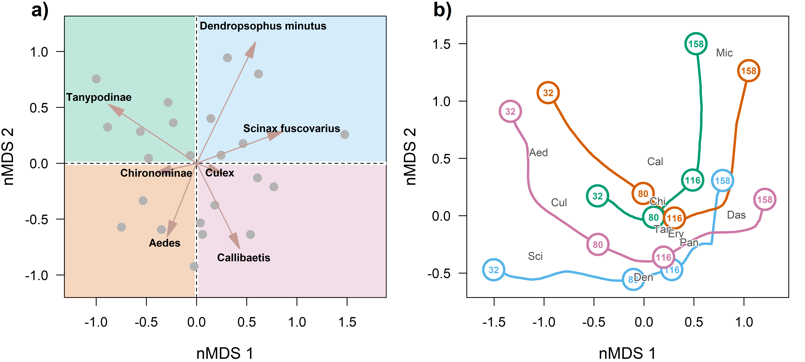

Effect of first survey on the effect of time
================
Rodolfo Pelinson
2026-03-28

## Loading packages and functions

``` r
source(paste(sep = "/",dir,"functions/pairwise_gllvm.R"))
source(paste(sep = "/",dir,"functions/pairwise_mvabund.R"))
source(paste(sep = "/",dir,"functions/my.anova.gllvm.R"))
source(paste(sep = "/",dir,"functions/My_coefplot.R"))
source(paste(sep = "/",dir,"functions/remove_sp.R"))
source(paste(sep = "/",dir,"functions/extract_mles.R"))
source(paste(sep = "/",dir,"functions/my_ordiplot.R"))
source(paste(sep = "/",dir,"functions/get_scaled_lvs.R"))
source(paste(sep = "/",dir,"functions/text_contour.R"))
source(paste(sep = "/",dir,"functions/letters.R"))
```

``` r
library(vegan)
library(gllvm)
library(mvabund)
library(DHARMa)
library(glmmTMB)
library(vioplot)
library(yarrr)
library(colorspace)
```

``` r
sessionInfo()
```

    ## R version 4.5.2 (2025-10-31 ucrt)
    ## Platform: x86_64-w64-mingw32/x64
    ## Running under: Windows 11 x64 (build 26200)
    ## 
    ## Matrix products: default
    ##   LAPACK version 3.12.1
    ## 
    ## locale:
    ## [1] LC_COLLATE=Portuguese_Brazil.utf8  LC_CTYPE=Portuguese_Brazil.utf8   
    ## [3] LC_MONETARY=Portuguese_Brazil.utf8 LC_NUMERIC=C                      
    ## [5] LC_TIME=Portuguese_Brazil.utf8    
    ## 
    ## time zone: Europe/London
    ## tzcode source: internal
    ## 
    ## attached base packages:
    ## [1] stats     graphics  grDevices utils     datasets  methods   base     
    ## 
    ## other attached packages:
    ##  [1] colorspace_2.1-2       yarrr_0.1.14           circlize_0.4.17       
    ##  [4] BayesFactor_0.9.12-4.8 Matrix_1.7-4           coda_0.19-4.1         
    ##  [7] jpeg_0.1-11            vioplot_0.5.1          zoo_1.8-15            
    ## [10] sm_2.2-6.0             glmmTMB_1.1.14         DHARMa_0.4.7          
    ## [13] mvabund_4.2.8          gllvm_2.0.5            TMB_1.9.20            
    ## [16] vegan_2.7-3            permute_0.9-10        
    ## 
    ## loaded via a namespace (and not attached):
    ##  [1] sandwich_3.1-1      shape_1.4.6.1       stringi_1.8.7      
    ##  [4] lattice_0.22-7      magrittr_2.0.4      lme4_2.0-1         
    ##  [7] digest_0.6.39       evaluate_1.0.5      grid_4.5.2         
    ## [10] mvtnorm_1.3-6       fastmap_1.2.0       GlobalOptions_0.1.3
    ## [13] mgcv_1.9-3          pbapply_1.7-4       numDeriv_2016.8-1.1
    ## [16] reformulas_0.4.4    Rdpack_2.6.6        cli_3.6.5          
    ## [19] rlang_1.1.7         rbibutils_2.4.1     splines_4.5.2      
    ## [22] yaml_2.3.12         otel_0.2.0          tools_4.5.2        
    ## [25] parallel_4.5.2      MatrixModels_0.5-4  nloptr_2.2.1       
    ## [28] minqa_1.2.8         boot_1.3-32         lifecycle_1.0.5    
    ## [31] stringr_1.6.0       tweedie_3.0.17      MASS_7.3-65        
    ## [34] cluster_2.1.8.1     glue_1.8.0          Rcpp_1.1.1         
    ## [37] statmod_1.5.1       xfun_0.56           knitr_1.51         
    ## [40] htmltools_0.5.9     nlme_3.1-168        rmarkdown_2.30     
    ## [43] compiler_4.5.2      alabama_2025.1.0

## Loading and preparing data

``` r
source(paste(sep = "/",dir,"ajeitando_planilhas.R"))
```

``` r
comm_all_drop_atrasado <- comm_all[Exp_design_all$treatments != "atrasado",]
Exp_design_all_drop_atrasado <- Exp_design_all[Exp_design_all$treatments != "atrasado",]

ncol(comm_all_drop_atrasado)
```

    ## [1] 26

``` r
comm_all_drop_atrasado_rm <- remove_sp(comm_all_drop_atrasado, 10)
ncol(comm_all_drop_atrasado_rm)
```

    ## [1] 11

``` r
Exp_design_all_drop_atrasado$treatments_AM <- paste(Exp_design_all_drop_atrasado$treatments, Exp_design_all_drop_atrasado$AM, sep="_")

Exp_design_all_drop_atrasado$AM_numeric <- as.numeric(Exp_design_all_drop_atrasado$AM)

Exp_design_all_drop_atrasado$treatments <- as.factor(Exp_design_all_drop_atrasado$treatments)

AM_days <- as.numeric(Exp_design_all_drop_atrasado$AM)
AM_days[AM_days == 1] <- 32
AM_days[AM_days == 2] <- 80
AM_days[AM_days == 3] <- 116
AM_days[AM_days == 4] <- 158

AM_days_sc <- scale(AM_days)

Exp_design_all_drop_atrasado$AM_days_sc <- c(AM_days_sc)
Exp_design_all_drop_atrasado$AM_days_sc_squared <- c(AM_days_sc)^2

Exp_design_all_drop_atrasado$AM_days <- c(AM_days)
Exp_design_all_drop_atrasado$AM_days_squared <- c(AM_days)^2


comm_AM1 <- comm_all_drop_atrasado_rm[Exp_design_all_drop_atrasado$AM == 1,]
comm_AM1_rm <- remove_sp(comm_AM1, 3)


comm_AM1_pred <- rbind(comm_AM1_rm, comm_AM1_rm, comm_AM1_rm, comm_AM1_rm)

nrow(comm_AM1_pred)
```

    ## [1] 96

``` r
nrow(Exp_design_all_drop_atrasado)
```

    ## [1] 96

``` r
nrow(comm_all_drop_atrasado_rm)
```

    ## [1] 96

``` r
comm_AM1_pred_st <- decostand(comm_AM1_pred, "stand")
colnames(comm_AM1_pred_st) <- gsub(" ", "_", colnames(comm_AM1_pred_st))

predictors <- data.frame(Exp_design_all_drop_atrasado, comm_AM1_pred_st)


comm_AM1_rm_total <- data.frame(decostand(comm_AM1_rm, method = "total", MARGIN = 2))
nmds_comm_AM1_rm_total <- metaMDS(comm_AM1_rm_total, distance  = "bray", k = 2)
```

    ## Run 0 stress 0.1917598 
    ## Run 1 stress 0.1917598 
    ## ... New best solution
    ## ... Procrustes: rmse 6.153674e-06  max resid 1.913226e-05 
    ## ... Similar to previous best
    ## Run 2 stress 0.2442221 
    ## Run 3 stress 0.1917598 
    ## ... Procrustes: rmse 3.087547e-06  max resid 7.812239e-06 
    ## ... Similar to previous best
    ## Run 4 stress 0.1917598 
    ## ... Procrustes: rmse 6.207854e-06  max resid 2.236335e-05 
    ## ... Similar to previous best
    ## Run 5 stress 0.2300953 
    ## Run 6 stress 0.1917598 
    ## ... New best solution
    ## ... Procrustes: rmse 2.930198e-06  max resid 9.623863e-06 
    ## ... Similar to previous best
    ## Run 7 stress 0.1917598 
    ## ... Procrustes: rmse 3.037119e-06  max resid 1.061298e-05 
    ## ... Similar to previous best
    ## Run 8 stress 0.2298657 
    ## Run 9 stress 0.1917598 
    ## ... Procrustes: rmse 5.080398e-06  max resid 1.815379e-05 
    ## ... Similar to previous best
    ## Run 10 stress 0.2500331 
    ## Run 11 stress 0.2445907 
    ## Run 12 stress 0.1917598 
    ## ... Procrustes: rmse 4.596962e-06  max resid 1.71957e-05 
    ## ... Similar to previous best
    ## Run 13 stress 0.1917598 
    ## ... New best solution
    ## ... Procrustes: rmse 4.625065e-07  max resid 1.512336e-06 
    ## ... Similar to previous best
    ## Run 14 stress 0.2328797 
    ## Run 15 stress 0.1917598 
    ## ... Procrustes: rmse 8.978122e-06  max resid 3.249479e-05 
    ## ... Similar to previous best
    ## Run 16 stress 0.2349327 
    ## Run 17 stress 0.2284807 
    ## Run 18 stress 0.1917598 
    ## ... Procrustes: rmse 5.465085e-06  max resid 2.022098e-05 
    ## ... Similar to previous best
    ## Run 19 stress 0.1917598 
    ## ... Procrustes: rmse 1.935154e-06  max resid 6.557758e-06 
    ## ... Similar to previous best
    ## Run 20 stress 0.2333066 
    ## *** Best solution repeated 4 times

``` r
comm_AM1_nmds <- data.frame(nmds_comm_AM1_rm_total$points)
comm_AM1_nmds_st <- decostand(comm_AM1_nmds, method = "stand")

comm_AM1_nmds_st_pred <- rbind(comm_AM1_nmds_st, comm_AM1_nmds_st, comm_AM1_nmds_st, comm_AM1_nmds_st)

predictors_nmds <- data.frame(Exp_design_all_drop_atrasado, comm_AM1_nmds_st_pred)
```

## Testing for effects

``` r
nrow(predictors_nmds)
```

    ## [1] 96

``` r
nrow(comm_all_drop_atrasado_rm)
```

    ## [1] 96

``` r
set.seed(1)
control <- permute::how(within = permute::Within(type = 'free'),
                        plots = Plots(strata = predictors_nmds$sites, type = 'free'),
                        nperm = 999)
permutations <- shuffleSet(nrow(comm_all_drop_atrasado_rm), control = control)


comm_all_drop_atrasado_mvabund <- mvabund(comm_all_drop_atrasado_rm)

mod_full_lin <- manyglm(comm_all_drop_atrasado_mvabund ~ block2 + ( MDS1 + MDS2 ) + AM_days_sc + AM_days_sc:( MDS1 + MDS2 ), family="negative.binomial",  data = predictors_nmds, composition = FALSE)

mod_full_quad <- manyglm(comm_all_drop_atrasado_mvabund ~ block2 + ( MDS1 + MDS2 ) + AM_days_sc + AM_days_sc_squared + AM_days_sc:( MDS1 + MDS2 ) + AM_days_sc_squared:( MDS1 + MDS2 ), family="negative.binomial",  data = predictors_nmds, composition = FALSE)

anova_quadratic_test <- anova(mod_full_lin, mod_full_quad, bootID = permutations, show.time = "all", cor.type = "I", test = "LR", resamp = "pit.trap")
```

    ## Using <int> bootID matrix from input. 
    ## Resampling begins for test 1.
    ##  Resampling run 0 finished. Time elapsed: 0.00 minutes...
    ##  Resampling run 100 finished. Time elapsed: 0.05 minutes...
    ##  Resampling run 200 finished. Time elapsed: 0.11 minutes...
    ##  Resampling run 300 finished. Time elapsed: 0.17 minutes...
    ##  Resampling run 400 finished. Time elapsed: 0.25 minutes...
    ##  Resampling run 500 finished. Time elapsed: 0.33 minutes...
    ##  Resampling run 600 finished. Time elapsed: 0.41 minutes...
    ##  Resampling run 700 finished. Time elapsed: 0.47 minutes...
    ##  Resampling run 800 finished. Time elapsed: 0.53 minutes...
    ##  Resampling run 900 finished. Time elapsed: 0.58 minutes...
    ## Time elapsed: 0 hr 0 min 38 sec

``` r
anova_quadratic_test
```

    ## Analysis of Deviance Table
    ## 
    ## mod_full_lin: comm_all_drop_atrasado_mvabund ~ block2 + (MDS1 + MDS2) + AM_days_sc + AM_days_sc:(MDS1 + MDS2)
    ## mod_full_quad: comm_all_drop_atrasado_mvabund ~ block2 + (MDS1 + MDS2) + AM_days_sc + AM_days_sc_squared + AM_days_sc:(MDS1 + MDS2) + AM_days_sc_squared:(MDS1 + MDS2)
    ## 
    ## Multivariate test:
    ##               Res.Df Df.diff   Dev Pr(>Dev)   
    ## mod_full_lin      88                          
    ## mod_full_quad     85       3 126.8    0.007 **
    ## ---
    ## Signif. codes:  0 '***' 0.001 '**' 0.01 '*' 0.05 '.' 0.1 ' ' 1
    ## Arguments:
    ##  Test statistics calculated assuming uncorrelated response (for faster computation) 
    ##  P-value calculated using 999 iterations via PIT-trap resampling.

``` r
########################################################
mod_block <- manyglm(comm_all_drop_atrasado_mvabund ~ block2 + ( MDS1 + MDS2 ) + AM_days_sc + AM_days_sc_squared, family="negative.binomial",  data = predictors_nmds, composition = FALSE)

mod_no_block <- manyglm(comm_all_drop_atrasado_mvabund ~ ( MDS1 + MDS2 ) + AM_days_sc + AM_days_sc_squared, family="negative.binomial",  data = predictors_nmds, composition = FALSE)

anova_block <- anova(mod_no_block, mod_block, bootID = permutations, show.block = "all", cor.type = "I", test = "LR", resamp = "pit.trap")
```

    ## Warning in anova.manyglm(mod_no_block, mod_block, bootID = permutations, :
    ## show.block is not a manyglm object nor a valid argument- removed from input,
    ## default value is used instead.

    ## Using <int> bootID matrix from input. 
    ## Time elapsed: 0 hr 0 min 23 sec

``` r
anova_block
```

    ## Analysis of Deviance Table
    ## 
    ## mod_no_block: comm_all_drop_atrasado_mvabund ~ (MDS1 + MDS2) + AM_days_sc + AM_days_sc_squared
    ## mod_block: comm_all_drop_atrasado_mvabund ~ block2 + (MDS1 + MDS2) + AM_days_sc + AM_days_sc_squared
    ## 
    ## Multivariate test:
    ##              Res.Df Df.diff   Dev Pr(>Dev)   
    ## mod_no_block     91                          
    ## mod_block        89       2 70.02    0.002 **
    ## ---
    ## Signif. codes:  0 '***' 0.001 '**' 0.01 '*' 0.05 '.' 0.1 ' ' 1
    ## Arguments:
    ##  Test statistics calculated assuming uncorrelated response (for faster computation) 
    ##  P-value calculated using 999 iterations via PIT-trap resampling.

``` r
########################################################


mod_time <- manyglm(comm_all_drop_atrasado_mvabund ~ block2 + ( MDS1 + MDS2 ) + AM_days_sc + AM_days_sc_squared, family="negative.binomial",  data = predictors_nmds, composition = FALSE)

mod_no_time <- manyglm(comm_all_drop_atrasado_mvabund ~ block2 + ( MDS1 + MDS2 ), family="negative.binomial",  data = predictors_nmds, composition = FALSE)

anova_time <- anova(mod_no_time, mod_time, bootID = permutations, show.time = "all", cor.type = "I", test = "LR", resamp = "pit.trap")
```

    ## Using <int> bootID matrix from input. 
    ## Resampling begins for test 1.
    ##  Resampling run 0 finished. Time elapsed: 0.00 minutes...
    ##  Resampling run 100 finished. Time elapsed: 0.04 minutes...
    ##  Resampling run 200 finished. Time elapsed: 0.07 minutes...
    ##  Resampling run 300 finished. Time elapsed: 0.11 minutes...
    ##  Resampling run 400 finished. Time elapsed: 0.15 minutes...
    ##  Resampling run 500 finished. Time elapsed: 0.19 minutes...
    ##  Resampling run 600 finished. Time elapsed: 0.22 minutes...
    ##  Resampling run 700 finished. Time elapsed: 0.26 minutes...
    ##  Resampling run 800 finished. Time elapsed: 0.30 minutes...
    ##  Resampling run 900 finished. Time elapsed: 0.33 minutes...
    ## Time elapsed: 0 hr 0 min 22 sec

``` r
anova_time
```

    ## Analysis of Deviance Table
    ## 
    ## mod_no_time: comm_all_drop_atrasado_mvabund ~ block2 + (MDS1 + MDS2)
    ## mod_time: comm_all_drop_atrasado_mvabund ~ block2 + (MDS1 + MDS2) + AM_days_sc + AM_days_sc_squared
    ## 
    ## Multivariate test:
    ##             Res.Df Df.diff   Dev Pr(>Dev)    
    ## mod_no_time     91                           
    ## mod_time        89       2 258.7    0.001 ***
    ## ---
    ## Signif. codes:  0 '***' 0.001 '**' 0.01 '*' 0.05 '.' 0.1 ' ' 1
    ## Arguments:
    ##  Test statistics calculated assuming uncorrelated response (for faster computation) 
    ##  P-value calculated using 999 iterations via PIT-trap resampling.

``` r
########################################################


mod_prior <- manyglm(comm_all_drop_atrasado_mvabund ~ block2 + ( MDS1 + MDS2 ) + AM_days_sc + AM_days_sc_squared, family="negative.binomial",  data = predictors_nmds, composition = FALSE)

mod_no_prior <- manyglm(comm_all_drop_atrasado_mvabund ~ block2 + AM_days_sc + AM_days_sc_squared, family="negative.binomial",  data = predictors_nmds, composition = FALSE)

anova_prior <- anova(mod_no_prior, mod_prior, bootID = permutations, show.time = "all", cor.type = "I", test = "LR", resamp = "pit.trap")
```

    ## Using <int> bootID matrix from input. 
    ## Resampling begins for test 1.
    ##  Resampling run 0 finished. Time elapsed: 0.00 minutes...
    ##  Resampling run 100 finished. Time elapsed: 0.04 minutes...
    ##  Resampling run 200 finished. Time elapsed: 0.08 minutes...
    ##  Resampling run 300 finished. Time elapsed: 0.11 minutes...
    ##  Resampling run 400 finished. Time elapsed: 0.15 minutes...
    ##  Resampling run 500 finished. Time elapsed: 0.18 minutes...
    ##  Resampling run 600 finished. Time elapsed: 0.22 minutes...
    ##  Resampling run 700 finished. Time elapsed: 0.25 minutes...
    ##  Resampling run 800 finished. Time elapsed: 0.29 minutes...
    ##  Resampling run 900 finished. Time elapsed: 0.32 minutes...
    ## Time elapsed: 0 hr 0 min 21 sec

``` r
anova_prior
```

    ## Analysis of Deviance Table
    ## 
    ## mod_no_prior: comm_all_drop_atrasado_mvabund ~ block2 + AM_days_sc + AM_days_sc_squared
    ## mod_prior: comm_all_drop_atrasado_mvabund ~ block2 + (MDS1 + MDS2) + AM_days_sc + AM_days_sc_squared
    ## 
    ## Multivariate test:
    ##              Res.Df Df.diff   Dev Pr(>Dev)   
    ## mod_no_prior     91                          
    ## mod_prior        89       2 59.44    0.007 **
    ## ---
    ## Signif. codes:  0 '***' 0.001 '**' 0.01 '*' 0.05 '.' 0.1 ' ' 1
    ## Arguments:
    ##  Test statistics calculated assuming uncorrelated response (for faster computation) 
    ##  P-value calculated using 999 iterations via PIT-trap resampling.

``` r
########################################################
mod_no_int <- manyglm(comm_all_drop_atrasado_mvabund ~ block2 + ( MDS1 + MDS2 ) + AM_days_sc + AM_days_sc_squared, family="negative.binomial",  data = predictors_nmds, composition = FALSE)

mod_int <- manyglm(comm_all_drop_atrasado_mvabund ~ block2 + ( MDS1 + MDS2 ) + AM_days_sc + AM_days_sc_squared + AM_days_sc:( MDS1 + MDS2 ) + AM_days_sc_squared:( MDS1 + MDS2 ), family="negative.binomial",  data = predictors_nmds, composition = FALSE)

anova_interaction <- anova(mod_no_int, mod_int, bootID = permutations, show.time = "all", cor.type = "I", test = "LR", resamp = "pit.trap")
```

    ## Using <int> bootID matrix from input. 
    ## Resampling begins for test 1.
    ##  Resampling run 0 finished. Time elapsed: 0.00 minutes...
    ##  Resampling run 100 finished. Time elapsed: 0.05 minutes...
    ##  Resampling run 200 finished. Time elapsed: 0.11 minutes...
    ##  Resampling run 300 finished. Time elapsed: 0.16 minutes...
    ##  Resampling run 400 finished. Time elapsed: 0.21 minutes...
    ##  Resampling run 500 finished. Time elapsed: 0.28 minutes...
    ##  Resampling run 600 finished. Time elapsed: 0.34 minutes...
    ##  Resampling run 700 finished. Time elapsed: 0.39 minutes...
    ##  Resampling run 800 finished. Time elapsed: 0.45 minutes...
    ##  Resampling run 900 finished. Time elapsed: 0.50 minutes...
    ## Time elapsed: 0 hr 0 min 32 sec

``` r
anova_interaction
```

    ## Analysis of Deviance Table
    ## 
    ## mod_no_int: comm_all_drop_atrasado_mvabund ~ block2 + (MDS1 + MDS2) + AM_days_sc + AM_days_sc_squared
    ## mod_int: comm_all_drop_atrasado_mvabund ~ block2 + (MDS1 + MDS2) + AM_days_sc + AM_days_sc_squared + AM_days_sc:(MDS1 + MDS2) + AM_days_sc_squared:(MDS1 + MDS2)
    ## 
    ## Multivariate test:
    ##            Res.Df Df.diff   Dev Pr(>Dev)    
    ## mod_no_int     89                           
    ## mod_int        85       4 81.74    0.001 ***
    ## ---
    ## Signif. codes:  0 '***' 0.001 '**' 0.01 '*' 0.05 '.' 0.1 ' ' 1
    ## Arguments:
    ##  Test statistics calculated assuming uncorrelated response (for faster computation) 
    ##  P-value calculated using 999 iterations via PIT-trap resampling.

Which are the species who have at least one of the coefficients for the
effect of time in interaction with the effect of the first survey whose
confidence interval do not include zero?

``` r
coefs <- mod_int$coefficients
LCL <- coefs + mod_int$stderr.coefficients * qnorm(0.025) 
UCL <- coefs + mod_int$stderr.coefficients * qnorm(0.975) 

coefs[LCL < 0 &  UCL > 0] <- NA

coefs <- coefs[-c(1:7),]

coefs <- coefs[, colSums(coefs, na.rm = TRUE) != 0]
```

## Making predictions for plotting

``` r
#High abundances of 
#Aedes
#Culex
#Dendropsophus_minutus
#Tanypodinae
#Callibaetis
#Culex

new_data_AB_high_MDS1_high_MDS2 <- 
  data.frame(AM_days_sc = seq(from = min(Exp_design_all_drop_atrasado$AM_days_sc), to = max(Exp_design_all_drop_atrasado$AM_days_sc), length.out = 100),
                                AM_days_sc_squared = seq(from = min(Exp_design_all_drop_atrasado$AM_days_sc), to = max(Exp_design_all_drop_atrasado$AM_days_sc), length.out = 100)^2,
                                block2 = factor(rep("AB", 100), levels = levels(as.factor(Exp_design_all_drop_atrasado$block2))),
             MDS1 = rep(quantile(predictors_nmds$MDS1, 0.9), 100),
             MDS2 = rep(quantile(predictors_nmds$MDS2, 0.9), 100))

new_data_CD_high_MDS1_high_MDS2 <- 
  data.frame(AM_days_sc = seq(from = min(Exp_design_all_drop_atrasado$AM_days_sc), to = max(Exp_design_all_drop_atrasado$AM_days_sc), length.out = 100),
                                AM_days_sc_squared = seq(from = min(Exp_design_all_drop_atrasado$AM_days_sc), to = max(Exp_design_all_drop_atrasado$AM_days_sc), length.out = 100)^2,
                                block2 = factor(rep("CD", 100), levels = levels(as.factor(Exp_design_all_drop_atrasado$block2))),
             MDS1 = rep(quantile(predictors_nmds$MDS1, 0.9), 100),
             MDS2 = rep(quantile(predictors_nmds$MDS2, 0.9), 100))


new_data_EF_high_MDS1_high_MDS2 <- 
  data.frame(AM_days_sc = seq(from = min(Exp_design_all_drop_atrasado$AM_days_sc), to = max(Exp_design_all_drop_atrasado$AM_days_sc), length.out = 100),
                                AM_days_sc_squared = seq(from = min(Exp_design_all_drop_atrasado$AM_days_sc), to = max(Exp_design_all_drop_atrasado$AM_days_sc), length.out = 100)^2,
                                block2 = factor(rep("EF", 100), levels = levels(as.factor(Exp_design_all_drop_atrasado$block2))),
             MDS1 = rep(quantile(predictors_nmds$MDS1, 0.9), 100),
             MDS2 = rep(quantile(predictors_nmds$MDS2, 0.9), 100))


###########################################################################################


new_data_AB_low_MDS1_high_MDS2 <- 
  data.frame(AM_days_sc = seq(from = min(Exp_design_all_drop_atrasado$AM_days_sc), to = max(Exp_design_all_drop_atrasado$AM_days_sc), length.out = 100),
                                AM_days_sc_squared = seq(from = min(Exp_design_all_drop_atrasado$AM_days_sc), to = max(Exp_design_all_drop_atrasado$AM_days_sc), length.out = 100)^2,
                                block2 = factor(rep("AB", 100), levels = levels(as.factor(Exp_design_all_drop_atrasado$block2))),
             MDS1 = rep(quantile(predictors_nmds$MDS1, 0.1), 100),
             MDS2 = rep(quantile(predictors_nmds$MDS2, 0.9), 100))

new_data_CD_low_MDS1_high_MDS2 <- 
  data.frame(AM_days_sc = seq(from = min(Exp_design_all_drop_atrasado$AM_days_sc), to = max(Exp_design_all_drop_atrasado$AM_days_sc), length.out = 100),
                                AM_days_sc_squared = seq(from = min(Exp_design_all_drop_atrasado$AM_days_sc), to = max(Exp_design_all_drop_atrasado$AM_days_sc), length.out = 100)^2,
                                block2 = factor(rep("CD", 100), levels = levels(as.factor(Exp_design_all_drop_atrasado$block2))),
             MDS1 = rep(quantile(predictors_nmds$MDS1, 0.1), 100),
             MDS2 = rep(quantile(predictors_nmds$MDS2, 0.9), 100))


new_data_EF_low_MDS1_high_MDS2 <- 
  data.frame(AM_days_sc = seq(from = min(Exp_design_all_drop_atrasado$AM_days_sc), to = max(Exp_design_all_drop_atrasado$AM_days_sc), length.out = 100),
                                AM_days_sc_squared = seq(from = min(Exp_design_all_drop_atrasado$AM_days_sc), to = max(Exp_design_all_drop_atrasado$AM_days_sc), length.out = 100)^2,
                                block2 = factor(rep("EF", 100), levels = levels(as.factor(Exp_design_all_drop_atrasado$block2))),
             MDS1 = rep(quantile(predictors_nmds$MDS1, 0.1), 100),
             MDS2 = rep(quantile(predictors_nmds$MDS2, 0.9), 100))


###########################################################################################


new_data_AB_low_MDS1_low_MDS2 <- 
  data.frame(AM_days_sc = seq(from = min(Exp_design_all_drop_atrasado$AM_days_sc), to = max(Exp_design_all_drop_atrasado$AM_days_sc), length.out = 100),
                                AM_days_sc_squared = seq(from = min(Exp_design_all_drop_atrasado$AM_days_sc), to = max(Exp_design_all_drop_atrasado$AM_days_sc), length.out = 100)^2,
                                block2 = factor(rep("AB", 100), levels = levels(as.factor(Exp_design_all_drop_atrasado$block2))),
             MDS1 = rep(quantile(predictors_nmds$MDS1, 0.1), 100),
             MDS2 = rep(quantile(predictors_nmds$MDS2, 0.1), 100))

new_data_CD_low_MDS1_low_MDS2 <- 
  data.frame(AM_days_sc = seq(from = min(Exp_design_all_drop_atrasado$AM_days_sc), to = max(Exp_design_all_drop_atrasado$AM_days_sc), length.out = 100),
                                AM_days_sc_squared = seq(from = min(Exp_design_all_drop_atrasado$AM_days_sc), to = max(Exp_design_all_drop_atrasado$AM_days_sc), length.out = 100)^2,
                                block2 = factor(rep("CD", 100), levels = levels(as.factor(Exp_design_all_drop_atrasado$block2))),
             MDS1 = rep(quantile(predictors_nmds$MDS1, 0.1), 100),
             MDS2 = rep(quantile(predictors_nmds$MDS2, 0.1), 100))


new_data_EF_low_MDS1_low_MDS2 <- 
  data.frame(AM_days_sc = seq(from = min(Exp_design_all_drop_atrasado$AM_days_sc), to = max(Exp_design_all_drop_atrasado$AM_days_sc), length.out = 100),
                                AM_days_sc_squared = seq(from = min(Exp_design_all_drop_atrasado$AM_days_sc), to = max(Exp_design_all_drop_atrasado$AM_days_sc), length.out = 100)^2,
                                block2 = factor(rep("EF", 100), levels = levels(as.factor(Exp_design_all_drop_atrasado$block2))),
             MDS1 = rep(quantile(predictors_nmds$MDS1, 0.1), 100),
             MDS2 = rep(quantile(predictors_nmds$MDS2, 0.1), 100))


###########################################################################################


new_data_AB_high_MDS1_low_MDS2 <- 
  data.frame(AM_days_sc = seq(from = min(Exp_design_all_drop_atrasado$AM_days_sc), to = max(Exp_design_all_drop_atrasado$AM_days_sc), length.out = 100),
                                AM_days_sc_squared = seq(from = min(Exp_design_all_drop_atrasado$AM_days_sc), to = max(Exp_design_all_drop_atrasado$AM_days_sc), length.out = 100)^2,
                                block2 = factor(rep("AB", 100), levels = levels(as.factor(Exp_design_all_drop_atrasado$block2))),
             MDS1 = rep(quantile(predictors_nmds$MDS1, 0.9), 100),
             MDS2 = rep(quantile(predictors_nmds$MDS2, 0.1), 100))

new_data_CD_high_MDS1_low_MDS2 <- 
  data.frame(AM_days_sc = seq(from = min(Exp_design_all_drop_atrasado$AM_days_sc), to = max(Exp_design_all_drop_atrasado$AM_days_sc), length.out = 100),
                                AM_days_sc_squared = seq(from = min(Exp_design_all_drop_atrasado$AM_days_sc), to = max(Exp_design_all_drop_atrasado$AM_days_sc), length.out = 100)^2,
                                block2 = factor(rep("CD", 100), levels = levels(as.factor(Exp_design_all_drop_atrasado$block2))),
             MDS1 = rep(quantile(predictors_nmds$MDS1, 0.9), 100),
             MDS2 = rep(quantile(predictors_nmds$MDS2, 0.1), 100))


new_data_EF_high_MDS1_low_MDS2 <- 
  data.frame(AM_days_sc = seq(from = min(Exp_design_all_drop_atrasado$AM_days_sc), to = max(Exp_design_all_drop_atrasado$AM_days_sc), length.out = 100),
                                AM_days_sc_squared = seq(from = min(Exp_design_all_drop_atrasado$AM_days_sc), to = max(Exp_design_all_drop_atrasado$AM_days_sc), length.out = 100)^2,
                                block2 = factor(rep("EF", 100), levels = levels(as.factor(Exp_design_all_drop_atrasado$block2))),
             MDS1 = rep(quantile(predictors_nmds$MDS1, 0.9), 100),
             MDS2 = rep(quantile(predictors_nmds$MDS2, 0.1), 100))


###########################################################################################


###########################################################################################


AB_high_MDS1_high_MDS2 <- predict.manyglm(mod_int, newdata = new_data_AB_high_MDS1_high_MDS2, type = "response")
```

    ## Warning: glm.fit: algoritmo não convergiu

``` r
CD_high_MDS1_high_MDS2 <- predict.manyglm(mod_int, newdata = new_data_CD_high_MDS1_high_MDS2, type = "response")
```

    ## Warning: glm.fit: algoritmo não convergiu

``` r
EF_high_MDS1_high_MDS2 <- predict.manyglm(mod_int, newdata = new_data_EF_high_MDS1_high_MDS2, type = "response")
```

    ## Warning: glm.fit: algoritmo não convergiu

``` r
high_MDS1_high_MDS2 <- array(NA, dim = c(nrow(AB_high_MDS1_high_MDS2), ncol(AB_high_MDS1_high_MDS2), 3))
high_MDS1_high_MDS2[,,1] <- AB_high_MDS1_high_MDS2
high_MDS1_high_MDS2[,,2] <- CD_high_MDS1_high_MDS2
high_MDS1_high_MDS2[,,3] <- EF_high_MDS1_high_MDS2

high_MDS1_high_MDS2_mean <- as.data.frame(apply(high_MDS1_high_MDS2, MARGIN = c(1,2), FUN = mean))
colnames(high_MDS1_high_MDS2_mean) <- colnames(AB_high_MDS1_high_MDS2)
high_MDS1_high_MDS2_mean
```

    ##           Aedes Callibaetis Chironominae      Culex Dendropsophus.minutus
    ## 1   12.01730810  0.04578476     8.172080 143.338821              8.816815
    ## 2   11.97716289  0.04350918     8.342307 125.940889              8.830689
    ## 3   11.92190378  0.04144615     8.514113 110.875285              8.844388
    ## 4   11.85174135  0.03957589     8.687453  97.806520              8.857911
    ## 5   11.76694203  0.03788091     8.862276  86.450186              8.871257
    ## 6   11.66782639  0.03634573     9.038531  76.564794              8.884425
    ## 7   11.55476719  0.03495663     9.216164  67.944979              8.897415
    ## 8   11.42818696  0.03370149     9.395119  60.415822              8.910225
    ## 9   11.28855543  0.03256955     9.575339  53.828102              8.922855
    ## 10  11.13638661  0.03155134     9.756763  48.054328              8.935304
    ## 11  10.97223561  0.03063847     9.939331  42.985405              8.947571
    ## 12  10.79669534  0.02982356    10.122978  38.527834              8.959655
    ## 13  10.61039286  0.02910015    10.307639  34.601365              8.971556
    ## 14  10.41398573  0.02846258    10.493247  31.137012              8.983272
    ## 15  10.20815812  0.02790593    10.679731  28.075383              8.994804
    ## 16   9.99361685  0.02742596    10.867021  25.365272              9.006149
    ## 17   9.77108738  0.02701908    11.055044  22.962460              9.017308
    ## 18   9.54130976  0.02668226    11.243725  20.828710              9.028280
    ## 19   9.30503455  0.02641300    11.432986  18.930906              9.039064
    ## 20   9.06301880  0.02620935    11.622751  17.240327              9.049659
    ## 21   8.81602205  0.02606982    11.812939  15.732026              9.060065
    ## 22   8.56480246  0.02599339    12.003468  14.384304              9.070281
    ## 23   8.31011301  0.02597952    12.194255  13.178262              9.080306
    ## 24   8.05269787  0.02602811    12.385215  12.097412              9.090139
    ## 25   7.79328891  0.02613950    12.576263  11.127354              9.099781
    ## 26   7.53260239  0.02631451    12.767311  10.255489              9.109230
    ## 27   7.27133590  0.02655440    12.958270   9.470783              9.118486
    ## 28   7.01016544  0.02686093    13.149050   8.763559              9.127548
    ## 29   6.74974279  0.02723634    13.339560   8.125314              9.136415
    ## 30   6.49069311  0.02768341    13.529707   7.548574              9.145087
    ## 31   6.23361282  0.02820550    13.719397   7.026753              9.153564
    ## 32   5.97906766  0.02880656    13.908536   6.554047              9.161844
    ## 33   5.72759114  0.02949117    14.097029   6.125330              9.169928
    ## 34   5.47968312  0.03026467    14.284779   5.736070              9.177814
    ## 35   5.23580879  0.03113316    14.471688   5.382258              9.185503
    ## 36   4.99639778  0.03210359    14.657661   5.060339              9.192993
    ## 37   4.76184365  0.03318389    14.842596   4.767161              9.200285
    ## 38   4.53250355  0.03438304    15.026397   4.499923              9.207377
    ## 39   4.30869815  0.03571120    15.208963   4.256135              9.214269
    ## 40   4.09071180  0.03717988    15.390194   4.033581              9.220962
    ## 41   3.87879291  0.03880205    15.569991   3.830286              9.227453
    ## 42   3.67315452  0.04059239    15.748253   3.644489              9.233744
    ## 43   3.47397509  0.04256746    15.924881   3.474620              9.239833
    ## 44   3.28139943  0.04474600    16.099772   3.319272              9.245720
    ## 45   3.09553980  0.04714916    16.272829   3.177193              9.251404
    ## 46   2.91647718  0.04980086    16.443950   3.047259              9.256887
    ## 47   2.74426261  0.05272821    16.613035   2.928466              9.262166
    ## 48   2.57891870  0.05596190    16.779986   2.819915              9.267241
    ## 49   2.42044116  0.05953676    16.944703   2.720803              9.272113
    ## 50   2.26880048  0.06349231    17.107088   2.630408              9.276781
    ## 51   2.12394358  0.06787351    17.267043   2.548086              9.281245
    ## 52   1.98579559  0.07273153    17.424472   2.473263              9.285503
    ## 53   1.85426161  0.07812471    17.579279   2.405423              9.289557
    ## 54   1.72922842  0.08411963    17.731368   2.344109              9.293406
    ## 55   1.61056635  0.09079241    17.880645   2.288912              9.297049
    ## 56   1.49813094  0.09823019    18.027018   2.239471              9.300487
    ## 57   1.39176471  0.10653288    18.170394   2.195467              9.303718
    ## 58   1.29129885  0.11581521    18.310685   2.156619              9.306744
    ## 59   1.19655483  0.12620913    18.447800   2.122683              9.309563
    ## 60   1.10734600  0.13786664    18.581653   2.093446              9.312175
    ## 61   1.02347908  0.15096312    18.712157   2.068728              9.314581
    ## 62   0.94475566  0.16570125    18.839230   2.048379              9.316780
    ## 63   0.87097347  0.18231566    18.962788   2.032273              9.318772
    ## 64   0.80192776  0.20107838    19.082752   2.020315              9.320557
    ## 65   0.73741244  0.22230542    19.199043   2.012431              9.322134
    ## 66   0.67722125  0.24636442    19.311584   2.008575              9.323504
    ## 67   0.62114870  0.27368384    19.420303   2.008724              9.324667
    ## 68   0.56899112  0.30476393    19.525127   2.012878              9.325622
    ## 69   0.52054741  0.34018976    19.625986   2.021062              9.326369
    ## 70   0.47561987  0.38064677    19.722814   2.033326              9.326909
    ## 71   0.43401484  0.42693948    19.815545   2.049742              9.327241
    ## 72   0.39554334  0.48001381    19.904118   2.070412              9.327365
    ## 73   0.36002152  0.54098397    19.988472   2.095459              9.327281
    ## 74   0.32727116  0.61116477    20.068552   2.125038              9.326990
    ## 75   0.29712002  0.69211056    20.144303   2.159332              9.326491
    ## 76   0.26940211  0.78566225    20.215673   2.198554              9.325785
    ## 77   0.24395794  0.89400417    20.282614   2.242951              9.324870
    ## 78   0.22063471  1.01973295    20.345080   2.292808              9.323748
    ## 79   0.19928637  1.16594109    20.403030   2.348446              9.322419
    ## 80   0.17977374  1.33631861    20.456422   2.410230              9.320882
    ## 81   0.16196449  1.53527675    20.505221   2.478572              9.319138
    ## 82   0.14573312  1.76809899    20.549392   2.553933              9.317187
    ## 83   0.13096089  2.04112560    20.588907   2.636834              9.315029
    ## 84   0.11753571  2.36197954    20.623736   2.727853              9.312664
    ## 85   0.10535205  2.73984367    20.653857   2.827641              9.310092
    ## 86   0.09431071  3.18580129    20.679249   2.936923              9.307313
    ## 87   0.08431871  3.71325550    20.699894   3.056511              9.304328
    ## 88   0.07528904  4.33844635    20.715777   3.187311              9.301137
    ## 89   0.06714049  5.08108989    20.726888   3.330335              9.297740
    ## 90   0.05979738  5.96516931    20.733220   3.486715              9.294137
    ## 91   0.05318934  7.01991607    20.734766   3.657718              9.290329
    ## 92   0.04725111  8.28102916    20.731528   3.844757              9.286315
    ## 93   0.04192223  9.79219282    20.723506   4.049419              9.282096
    ## 94   0.03714681 11.60696965    20.710707   4.273478              9.277673
    ## 95   0.03287333 13.79116612    20.693139   4.518928              9.273045
    ## 96   0.02905432 16.42579429    20.670815   4.788003              9.268213
    ## 97   0.02564617 19.61078680    20.643749   5.083215              9.263178
    ## 98   0.02260890 23.46966584    20.611961   5.407388              9.257938
    ## 99   0.01990586 28.15542212    20.575473   5.763705              9.252496
    ## 100  0.01750361 33.85793201    20.534309   6.155750              9.246851
    ##       Microvelia Scinax.fuscovarius Tanypodinae    Dasyhelea Erythrodiplax
    ## 1   9.340750e-01        207.6517109    1.274199 0.0003028622    0.04006834
    ## 2   4.754602e-01        190.6377427    1.357682 0.0003589510    0.04314726
    ## 3   2.453514e-01        175.0836221    1.444794 0.0004247632    0.04641479
    ## 4   1.283526e-01        160.8590206    1.535541 0.0005018574    0.04987823
    ## 5   6.807112e-02        147.8456599    1.629913 0.0005920188    0.05354475
    ## 6   3.659847e-02        135.9361614    1.727886 0.0006972882    0.05742146
    ## 7   1.994825e-02        125.0330100    1.829419 0.0008199943    0.06151526
    ## 8   1.102271e-02        115.0476183    1.934455 0.0009627888    0.06583288
    ## 9   6.174676e-03        105.8994833    2.042922 0.0011286854    0.07038080
    ## 10  3.506563e-03         97.5154236    2.154728 0.0013211023    0.07516522
    ## 11  2.018790e-03         89.8288923    2.269763 0.0015439091    0.08019199
    ## 12  1.178263e-03         82.7793552    2.387900 0.0018014767    0.08546660
    ## 13  6.971650e-04         76.3117295    2.508992 0.0020987334    0.09099410
    ## 14  4.181871e-04         70.3758763    2.632873 0.0024412238    0.09677906
    ## 15  2.543007e-04         64.9261419    2.759358 0.0028351731    0.10282551
    ## 16  1.567712e-04         59.9209431    2.888243 0.0032875568    0.10913693
    ## 17  9.797767e-05         55.3223915    3.019304 0.0038061740    0.11571615
    ## 18  6.207685e-05         51.0959542    3.152300 0.0043997266    0.12256531
    ## 19  3.987256e-05         47.2101460    3.286970 0.0050779033    0.12968582
    ## 20  2.596334e-05         43.6362514    3.423036 0.0058514682    0.13707833
    ## 21  1.713913e-05         40.3480722    3.560202 0.0067323542    0.14474263
    ## 22  1.146988e-05         37.3216990    3.698158 0.0077337611    0.15267765
    ## 23  7.781635e-06         34.5353041    3.836575 0.0088702577    0.16088140
    ## 24  5.352106e-06         31.9689539    3.975112 0.0101578876    0.16935093
    ## 25  3.731818e-06         29.6044385    4.113416 0.0116142790    0.17808227
    ## 26  2.637899e-06         27.4251173    4.251121 0.0132587564    0.18707042
    ## 27  1.890330e-06         25.4157787    4.387850 0.0151124549    0.19630932
    ## 28  1.373280e-06         23.5625131    4.523218 0.0171984349    0.20579181
    ## 29  1.011399e-06         21.8525972    4.656835 0.0195417981    0.21550960
    ## 30  7.551401e-07         20.2743890    4.788303 0.0221698014    0.22545325
    ## 31  5.715768e-07         18.8172325    4.917224 0.0251119691    0.23561218
    ## 32  4.385949e-07         17.4713711    5.043196 0.0284002015    0.24597464
    ## 33  3.411885e-07         16.2278688    5.165819 0.0320688775    0.25652771
    ## 34  2.690711e-07         15.0785385    5.284696 0.0361549515    0.26725732
    ## 35  2.151204e-07         14.0158769    5.399436 0.0406980398    0.27814821
    ## 36  1.743565e-07         13.0330050    5.509654 0.0457404978    0.28918403
    ## 37  1.432638e-07         12.1236142    5.614973 0.0513274830    0.30034727
    ## 38  1.193374e-07         11.2819175    5.715031 0.0575070029    0.31161937
    ## 39  1.007764e-07         10.5026041    5.809477 0.0643299459    0.32298068
    ## 40  8.627458e-08          9.7807989    5.897975 0.0718500912    0.33441058
    ## 41  7.487705e-08          9.1120255    5.980209 0.0801240968    0.34588747
    ## 42  6.588044e-08          8.4921721    6.055881 0.0892114619    0.35738886
    ## 43  5.876329e-08          7.9174605    6.124714 0.0991744615    0.36889142
    ## 44  5.313708e-08          7.3844183    6.186454 0.1100780509    0.38037104
    ## 45  4.871145e-08          6.8898527    6.240872 0.1219897377    0.39180295
    ## 46  4.526957e-08          6.4308273    6.287764 0.1349794173    0.40316174
    ## 47  4.265044e-08          6.0046405    6.326955 0.1491191730    0.41442151
    ## 48  4.073640e-08          5.6088063    6.358296 0.1644830345    0.42555590
    ## 49  3.944424e-08          5.2410360    6.381669 0.1811466965    0.43653825
    ## 50  3.871920e-08          4.8992217    6.396985 0.1991871937    0.44734166
    ## 51  3.853107e-08          4.5814222    6.404185 0.2186825317    0.45793913
    ## 52  3.887207e-08          4.2858483    6.403242 0.2397112733    0.46830362
    ## 53  3.975632e-08          4.0108511    6.394160 0.2623520791    0.47840822
    ## 54  4.122081e-08          3.7549101    6.376973 0.2866832027    0.48822623
    ## 55  4.332801e-08          3.5166230    6.351747 0.3127819410    0.49773129
    ## 56  4.617032e-08          3.2946959    6.318577 0.3407240418    0.50689749
    ## 57  4.987683e-08          3.0879349    6.277589 0.3705830686    0.51569948
    ## 58  5.462315e-08          2.8952374    6.228938 0.4024297260    0.52411261
    ## 59  6.064521e-08          2.7155856    6.172807 0.4363311499    0.53211301
    ## 60  6.825872e-08          2.5480391    6.109404 0.4723501633    0.53967774
    ## 61  7.788641e-08          2.3917287    6.038965 0.5105445056    0.54678487
    ## 62  9.009633e-08          2.2458514    5.961749 0.5509660379    0.55341361
    ## 63  1.056561e-07          2.1096645    5.878037 0.5936599314    0.55954438
    ## 64  1.256098e-07          1.9824809    5.788133 0.6386638454    0.56515893
    ## 65  1.513891e-07          1.8636652    5.692358 0.6860071009    0.57024044
    ## 66  1.849727e-07          1.7526292    5.591051 0.7357098599    0.57477357
    ## 67  2.291197e-07          1.6488284    5.484565 0.7877823157    0.57874457
    ## 68  2.877127e-07          1.5517585    5.373267 0.8422239054    0.58214131
    ## 69  3.662669e-07          1.4609524    5.257535 0.8990225526    0.58495340
    ## 70  4.726919e-07          1.3759773    5.137755 0.9581539503    0.58717219
    ## 71  6.184442e-07          1.2964320    5.014322 1.0195808930    0.58879084
    ## 72  8.202849e-07          1.2219445    4.887632 1.0832526685    0.58980435
    ## 73  1.102988e-06          1.1521697    4.758086 1.1491045190    0.59020958
    ## 74  1.503553e-06          1.0867877    4.626085 1.2170571814    0.59000528
    ## 75  2.077824e-06          1.0255013    4.492027 1.2870165147    0.58919208
    ## 76  2.910989e-06          0.9680348    4.356309 1.3588732260    0.58777250
    ## 77  4.134416e-06          0.9141322    4.219321 1.4325027012    0.58575092
    ## 78  5.952915e-06          0.8635556    4.081445 1.5077649488    0.58313358
    ## 79  8.689346e-06          0.8160840    3.943054 1.5845046648    0.57992854
    ## 80  1.285838e-05          0.7715120    3.804513 1.6625514227    0.57614564
    ## 81  1.928979e-05          0.7296486    3.666173 1.7417199941    0.57179641
    ## 82  2.933666e-05          0.6903163    3.528372 1.8218108050    0.56689410
    ## 83  4.523094e-05          0.6533497    3.391434 1.9026105270    0.56145351
    ## 84  7.069723e-05          0.6185953    3.255665 1.9838928072    0.55549100
    ## 85  1.120240e-04          0.5859098    3.121358 2.0654191341    0.54902435
    ## 86  1.799541e-04          0.5551599    2.988788 2.1469398388    0.54207272
    ## 87  2.930584e-04          0.5262217    2.858209 2.2281952260    0.53465650
    ## 88  4.838253e-04          0.4989795    2.729861 2.3089168313    0.52679726
    ## 89  8.097758e-04          0.4733255    2.603961 2.3888287956    0.51851762
    ## 90  1.373988e-03          0.4491592    2.480710 2.4676493503    0.50984116
    ## 91  2.363431e-03          0.4263871    2.360288 2.5450924013    0.50079228
    ## 92  4.121400e-03          0.4049216    2.242856 2.6208692008    0.49139611
    ## 93  7.285990e-03          0.3846814    2.128558 2.6946900940    0.48167839
    ## 94  1.305793e-02          0.3655903    2.017516 2.7662663263    0.47166535
    ## 95  2.372475e-02          0.3475773    1.909836 2.8353118962    0.46138358
    ## 96  4.369896e-02          0.3305761    1.805604 2.9015454362    0.45085995
    ## 97  8.159855e-02          0.3145247    1.704891 2.9646921062    0.44012145
    ## 98  1.544670e-01          0.2993652    1.607749 3.0244854808    0.42919512
    ## 99  2.964358e-01          0.2850435    1.514214 3.0806694133    0.41810790
    ## 100 5.767235e-01          0.2715090    1.424308 3.1329998566    0.40688655
    ##        Pantala
    ## 1   0.01853610
    ## 2   0.02048168
    ## 3   0.02260559
    ## 4   0.02492122
    ## 5   0.02744264
    ## 6   0.03018461
    ## 7   0.03316258
    ## 8   0.03639269
    ## 9   0.03989176
    ## 10  0.04367726
    ## 11  0.04776730
    ## 12  0.05218060
    ## 13  0.05693648
    ## 14  0.06205478
    ## 15  0.06755586
    ## 16  0.07346050
    ## 17  0.07978990
    ## 18  0.08656554
    ## 19  0.09380917
    ## 20  0.10154270
    ## 21  0.10978808
    ## 22  0.11856727
    ## 23  0.12790207
    ## 24  0.13781404
    ## 25  0.14832435
    ## 26  0.15945369
    ## 27  0.17122210
    ## 28  0.18364884
    ## 29  0.19675224
    ## 30  0.21054954
    ## 31  0.22505675
    ## 32  0.24028845
    ## 33  0.25625767
    ## 34  0.27297570
    ## 35  0.29045190
    ## 36  0.30869356
    ## 37  0.32770574
    ## 38  0.34749107
    ## 39  0.36804961
    ## 40  0.38937872
    ## 41  0.41147284
    ## 42  0.43432344
    ## 43  0.45791881
    ## 44  0.48224398
    ## 45  0.50728063
    ## 46  0.53300693
    ## 47  0.55939756
    ## 48  0.58642354
    ## 49  0.61405228
    ## 50  0.64224750
    ## 51  0.67096925
    ## 52  0.70017393
    ## 53  0.72981432
    ## 54  0.75983964
    ## 55  0.79019566
    ## 56  0.82082477
    ## 57  0.85166615
    ## 58  0.88265594
    ## 59  0.91372736
    ## 60  0.94481098
    ## 61  0.97583493
    ## 62  1.00672514
    ## 63  1.03740560
    ## 64  1.06779869
    ## 65  1.09782547
    ## 66  1.12740601
    ## 67  1.15645972
    ## 68  1.18490573
    ## 69  1.21266324
    ## 70  1.23965189
    ## 71  1.26579217
    ## 72  1.29100578
    ## 73  1.31521602
    ## 74  1.33834820
    ## 75  1.36032998
    ## 76  1.38109178
    ## 77  1.40056716
    ## 78  1.41869310
    ## 79  1.43541044
    ## 80  1.45066410
    ## 81  1.46440348
    ## 82  1.47658266
    ## 83  1.48716069
    ## 84  1.49610184
    ## 85  1.50337573
    ## 86  1.50895761
    ## 87  1.51282839
    ## 88  1.51497482
    ## 89  1.51538955
    ## 90  1.51407115
    ## 91  1.51102414
    ## 92  1.50625896
    ## 93  1.49979191
    ## 94  1.49164506
    ## 95  1.48184611
    ## 96  1.47042825
    ## 97  1.45742997
    ## 98  1.44289482
    ## 99  1.42687122
    ## 100 1.40941213

``` r
AB_low_MDS1_high_MDS2 <- predict.manyglm(mod_int, newdata = new_data_AB_low_MDS1_high_MDS2, type = "response")
```

    ## Warning: glm.fit: algoritmo não convergiu

``` r
CD_low_MDS1_high_MDS2 <- predict.manyglm(mod_int, newdata = new_data_CD_low_MDS1_high_MDS2, type = "response")
```

    ## Warning: glm.fit: algoritmo não convergiu

``` r
EF_low_MDS1_high_MDS2 <- predict.manyglm(mod_int, newdata = new_data_EF_low_MDS1_high_MDS2, type = "response")
```

    ## Warning: glm.fit: algoritmo não convergiu

``` r
low_MDS1_high_MDS2 <- array(NA, dim = c(nrow(AB_low_MDS1_high_MDS2), ncol(AB_low_MDS1_high_MDS2), 3))
low_MDS1_high_MDS2[,,1] <- AB_low_MDS1_high_MDS2
low_MDS1_high_MDS2[,,2] <- CD_low_MDS1_high_MDS2
low_MDS1_high_MDS2[,,3] <- EF_low_MDS1_high_MDS2

low_MDS1_high_MDS2_mean <- as.data.frame(apply(low_MDS1_high_MDS2, MARGIN = c(1,2), FUN = mean))
colnames(low_MDS1_high_MDS2_mean) <- colnames(AB_low_MDS1_high_MDS2)
low_MDS1_high_MDS2_mean
```

    ##            Aedes  Callibaetis Chironominae     Culex Dendropsophus.minutus
    ## 1   17.125754200  0.001136181     29.72878 26.605196              1.995374
    ## 2   16.847536565  0.001485896     29.23698 24.614026              1.935554
    ## 3   16.553621273  0.001936011     28.76276 22.806303              1.879069
    ## 4   16.244992985  0.002513076     28.30555 21.163289              1.825730
    ## 5   15.922671948  0.003249988     27.86476 19.668330              1.775361
    ## 6   15.587708404  0.004187322     27.43985 18.306607              1.727799
    ## 7   15.241176921  0.005374888     27.03031 17.064920              1.682891
    ## 8   14.884170696  0.006873546     26.63564 15.931501              1.640496
    ## 9   14.517795870  0.008757310     26.25536 14.895846              1.600481
    ## 10  14.143165889  0.011115757     25.88902 13.948571              1.562725
    ## 11  13.761395961  0.014056779     25.53619 13.081281              1.527111
    ## 12  13.373597645  0.017709691     25.19645 12.286463              1.493534
    ## 13  12.980873596  0.022228727     24.86940 11.557384              1.461894
    ## 14  12.584312515  0.027796917     24.55468 10.888003              1.432099
    ## 15  12.184984328  0.034630367     24.25190 10.272897              1.404063
    ## 16  11.783935619  0.042982928     23.96074  9.707194              1.377706
    ## 17  11.382185345  0.053151230     23.68086  9.186510              1.352953
    ## 18  10.980720861  0.065480060     23.41194  8.706897              1.329736
    ## 19  10.580494259  0.080368016     23.15368  8.264799              1.307990
    ## 20  10.182419053  0.098273372     22.90581  7.857009              1.287655
    ## 21   9.787367209  0.119720052     22.66804  7.480630              1.268677
    ## 22   9.396166531  0.145303597     22.44012  7.133049              1.251005
    ## 23   9.009598422  0.175696965     22.22179  6.811900              1.234592
    ## 24   8.628395996  0.211656001     22.01282  6.515044              1.219394
    ## 25   8.253242566  0.254024345     21.81299  6.240545              1.205371
    ## 26   7.884770486  0.303737576     21.62208  5.986648              1.192489
    ## 27   7.523560351  0.361826304     21.43989  5.751762              1.180712
    ## 28   7.170140537  0.429417932     21.26623  5.534447              1.170011
    ## 29   6.824987072  0.507736806     21.10090  5.333392              1.160358
    ## 30   6.488523833  0.598102400     20.94375  5.147411              1.151730
    ## 31   6.161123032  0.701925262     20.79461  4.975426              1.144105
    ## 32   5.843105995  0.820700371     20.65331  4.816457              1.137463
    ## 33   5.534744201  0.955997629     20.51972  4.669616              1.131787
    ## 34   5.236260561  1.109449221     20.39370  4.534096              1.127065
    ## 35   4.947830925  1.282733606     20.27512  4.409164              1.123283
    ## 36   4.669585785  1.477555984     20.16386  4.294156              1.120433
    ## 37   4.401612150  1.695625138     20.05980  4.188470              1.118508
    ## 38   4.143955580  1.938626641     19.96284  4.091562              1.117502
    ## 39   3.896622350  2.208192526     19.87288  4.002938              1.117414
    ## 40   3.659581715  2.505867615     19.78983  3.922154              1.118243
    ## 41   3.432768267  2.833072838     19.71361  3.848809              1.119991
    ## 42   3.216084351  3.191065996     19.64415  3.782546              1.122663
    ## 43   3.009402524  3.580900558     19.58136  3.723044              1.126265
    ## 44   2.812568036  4.003383219     19.52519  3.670017              1.130806
    ## 45   2.625401319  4.459031054     19.47559  3.623214              1.136297
    ## 46   2.447700448  4.948029251     19.43250  3.582416              1.142752
    ## 47   2.279243587  5.470190472     19.39588  3.547432              1.150187
    ## 48   2.119791380  6.024916994     19.36569  3.518100              1.158620
    ## 49   1.969089282  6.611166824     19.34191  3.494285              1.168074
    ## 50   1.826869818  7.227424994     19.32452  3.475878              1.178571
    ## 51   1.692854761  7.871681240     19.31348  3.462794              1.190139
    ## 52   1.566757217  8.541415212     19.30881  3.454975              1.202807
    ## 53   1.448283606  9.233590242     19.31048  3.452385              1.216607
    ## 54   1.337135538  9.944656593     19.31850  3.455012              1.231576
    ## 55   1.233011577 10.670564920     19.33288  3.462868              1.247752
    ## 56   1.135608889 11.406790440     19.35363  3.475989              1.265179
    ## 57   1.044624767 12.148368092     19.38077  3.494434              1.283902
    ## 58   0.959758041 12.889938665     19.41434  3.518288              1.303971
    ## 59   0.880710363 13.625805588     19.45436  3.547659              1.325442
    ## 60   0.807187373 14.350001761     19.50087  3.582684              1.348371
    ## 61   0.738899749 15.056365521     19.55392  3.623524              1.372824
    ## 62   0.675564133 15.738624489     19.61356  3.670369              1.398867
    ## 63   0.616903956 16.390485825     19.67986  3.723441              1.426574
    ## 64   0.562650142 17.005731132     19.75287  3.782990              1.456024
    ## 65   0.512541714 17.578314050     19.83267  3.849302              1.487302
    ## 66   0.466326296 18.102458433     19.91934  3.922698              1.520499
    ## 67   0.423760529 18.572754902     20.01297  4.003536              1.555713
    ## 68   0.384610382 18.984253527     20.11366  4.092217              1.593049
    ## 69   0.348651398 19.332550421     20.22149  4.189185              1.632620
    ## 70   0.315668848 19.613866134     20.33659  4.294935              1.674547
    ## 71   0.285457820 19.825113902     20.45907  4.410010              1.718961
    ## 72   0.257823246 19.963956016     20.58906  4.535015              1.766001
    ## 73   0.232579859 20.028846883     20.72668  4.670612              1.815818
    ## 74   0.209552112 20.019061672     20.87209  4.817536              1.868573
    ## 75   0.188574031 19.934709783     21.02543  4.976593              1.924439
    ## 76   0.169489046 19.776732817     21.18686  5.148674              1.983602
    ## 77   0.152149767 19.546887077     21.35655  5.334758              2.046262
    ## 78   0.136417741 19.247711066     21.53467  5.535923              2.112634
    ## 79   0.122163178 18.882478823     21.72143  5.753358              2.182949
    ## 80   0.109264655 18.455140285     21.91701  5.988372              2.257457
    ## 81   0.097608801 17.970250215     22.12162  6.242409              2.336423
    ## 82   0.087089975 17.432887460     22.33548  6.517060              2.420137
    ## 83   0.077609924 16.848566554     22.55883  6.814080              2.508908
    ## 84   0.069077444 16.223143808     22.79190  7.135408              2.603070
    ## 85   0.061408030 15.562720114     23.03495  7.483184              2.702983
    ## 86   0.054523531 14.873542714     23.28825  7.859775              2.809034
    ## 87   0.048351805 14.161908102     23.55208  8.267797              2.921643
    ## 88   0.042826375 13.434068168     23.82673  8.710148              3.041261
    ## 89   0.037886095 12.696141453     24.11251  9.190038              3.168374
    ## 90   0.033474822 11.954031229     24.40974  9.711026              3.303510
    ## 91   0.029541097 11.213351826     24.71876 10.277062              3.447237
    ## 92   0.026037835 10.479364345     25.03992 10.892533              3.600170
    ## 93   0.022922027  9.756922615     25.37360 11.562316              3.762973
    ## 94   0.020154456  9.050429918     25.72018 12.291837              3.936368
    ## 95   0.017699420  8.363806718     26.08006 13.087142              4.121132
    ## 96   0.015524475  7.700469324     26.45368 13.954970              4.318110
    ## 97   0.013600181  7.063319170     26.84147 14.902839              4.528217
    ## 98   0.011899874  6.454742121     27.24391 15.939150              4.752446
    ## 99   0.010399440  5.876617038     27.66147 17.073295              4.991871
    ## 100  0.009077107  5.330332648     28.09466 18.315786              5.247663
    ##     Microvelia Scinax.fuscovarius Tanypodinae   Dasyhelea Erythrodiplax
    ## 1   0.05655631          2.2345134   13.128478 0.001807123    0.07899222
    ## 2   0.05540383          2.2386102   13.303169 0.002137608    0.08380892
    ## 3   0.05435465          2.2413439   13.470925 0.002523398    0.08883552
    ## 4   0.05340376          2.2427095   13.631427 0.002972769    0.09407483
    ## 5   0.05254667          2.2427044   13.784366 0.003495055    0.09952926
    ## 6   0.05177938          2.2413286   13.929447 0.004100761    0.10520067
    ## 7   0.05109832          2.2385847   14.066386 0.004801671    0.11109045
    ## 8   0.05050038          2.2344777   14.194914 0.005610970    0.11719940
    ## 9   0.04998284          2.2290151   14.314777 0.006543363    0.12352775
    ## 10  0.04954335          2.2222069   14.425737 0.007615206    0.13007508
    ## 11  0.04917995          2.2140656   14.527571 0.008844633    0.13684034
    ## 12  0.04889101          2.2046058   14.620074 0.010251691    0.14382178
    ## 13  0.04867524          2.1938449   14.703060 0.011858473    0.15101692
    ## 14  0.04853170          2.1818022   14.776361 0.013689248    0.15842256
    ## 15  0.04845974          2.1684996   14.839826 0.015770590    0.16603471
    ## 16  0.04845905          2.1539608   14.893327 0.018131504    0.17384861
    ## 17  0.04852962          2.1382119   14.936754 0.020803542    0.18185867
    ## 18  0.04867177          2.1212810   14.970018 0.023820906    0.19005848
    ## 19  0.04888612          2.1031979   14.993050 0.027220545    0.19844080
    ## 20  0.04917363          2.0839945   15.005803 0.031042229    0.20699751
    ## 21  0.04953557          2.0637045   15.008251 0.035328609    0.21571967
    ## 22  0.04997356          2.0423630   15.000389 0.040125247    0.22459745
    ## 23  0.05048956          2.0200069   14.982232 0.045480627    0.23362018
    ## 24  0.05108592          1.9966745   14.953819 0.051446131    0.24277633
    ## 25  0.05176533          1.9724054   14.915208 0.058075979    0.25205353
    ## 26  0.05253092          1.9472405   14.866477 0.065427136    0.26143859
    ## 27  0.05338622          1.9212217   14.807728 0.073559170    0.27091750
    ## 28  0.05433525          1.8943922   14.739079 0.082534074    0.28047547
    ## 29  0.05538247          1.8667957   14.660672 0.092416027    0.29009695
    ## 30  0.05653289          1.8384769   14.572665 0.103271111    0.29976567
    ## 31  0.05779208          1.8094811   14.475236 0.115166973    0.30946468
    ## 32  0.05916619          1.7798542   14.368583 0.128172425    0.31917638
    ## 33  0.06066206          1.7496424   14.252918 0.142356991    0.32888256
    ## 34  0.06228722          1.7188923   14.128473 0.157790388    0.33856450
    ## 35  0.06404997          1.6876506   13.995495 0.174541954    0.34820294
    ## 36  0.06595947          1.6559640   13.854246 0.192680015    0.35777824
    ## 37  0.06802579          1.6238793   13.705001 0.212271191    0.36727034
    ## 38  0.07026002          1.5914430   13.548052 0.233379652    0.37665892
    ## 39  0.07267434          1.5587015   13.383701 0.256066324    0.38592340
    ## 40  0.07528219          1.5257005   13.212262 0.280388045    0.39504305
    ## 41  0.07809829          1.4924855   13.034060 0.306396687    0.40399705
    ## 42  0.08113889          1.4591013   12.849429 0.334138243    0.41276458
    ## 43  0.08442184          1.4255921   12.658713 0.363651892    0.42132488
    ## 44  0.08796680          1.3920012   12.462261 0.394969049    0.42965736
    ## 45  0.09179542          1.3583710   12.260431 0.428112418    0.43774163
    ## 46  0.09593154          1.3247433   12.053584 0.463095043    0.44555766
    ## 47  0.10040147          1.2911584   11.842087 0.499919395    0.45308577
    ## 48  0.10523421          1.2576559   11.626309 0.538576485    0.46030681
    ## 49  0.11046177          1.2242740   11.406623 0.579045027    0.46720215
    ## 50  0.11611954          1.1910498   11.183401 0.621290669    0.47375381
    ## 51  0.12224662          1.1580191   10.957015 0.665265303    0.47994455
    ## 52  0.12888625          1.1252162   10.727839 0.710906462    0.48575790
    ## 53  0.13608635          1.0926744   10.496241 0.758136835    0.49117825
    ## 54  0.14389998          1.0604252   10.262589 0.806863892    0.49619096
    ## 55  0.15238603          1.0284988   10.027246 0.856979653    0.50078236
    ## 56  0.16160983          0.9969240    9.790570 0.908360598    0.50493986
    ## 57  0.17164400          0.9657280    9.552914 0.960867737    0.50865199
    ## 58  0.18256928          0.9349364    9.314624 1.014346844    0.51190845
    ## 59  0.19447554          0.9045734    9.076040 1.068628863    0.51470016
    ## 60  0.20746292          0.8746616    8.837492 1.123530495    0.51701932
    ## 61  0.22164311          0.8452220    8.599304 1.178854963    0.51885941
    ## 62  0.23714075          0.8162741    8.361787 1.234392956    0.52021524
    ## 63  0.25409514          0.7878359    8.125246 1.289923754    0.52108301
    ## 64  0.27266208          0.7599237    7.889973 1.345216522    0.52146025
    ## 65  0.29301602          0.7325524    7.656249 1.400031774    0.52134589
    ## 66  0.31535244          0.7057354    7.424347 1.454122983    0.52074027
    ## 67  0.33989068          0.6794846    7.194523 1.507238337    0.51964510
    ## 68  0.36687704          0.6538104    6.967024 1.559122619    0.51806346
    ## 69  0.39658842          0.6287218    6.742085 1.609519191    0.51599981
    ## 70  0.42933644          0.6042265    6.519927 1.658172062    0.51345996
    ## 71  0.46547214          0.5803305    6.300758 1.704828020    0.51045103
    ## 72  0.50539141          0.5570390    6.084774 1.749238804    0.50698141
    ## 73  0.54954117          0.5343555    5.872158 1.791163282    0.50306077
    ## 74  0.59842653          0.5122824    5.663078 1.830369624    0.49869995
    ## 75  0.65261892          0.4908210    5.457691 1.866637425    0.49391095
    ## 76  0.71276555          0.4699713    5.256141 1.899759762    0.48870686
    ## 77  0.77960025          0.4497322    5.058556 1.929545161    0.48310183
    ## 78  0.85395592          0.4301017    4.865055 1.955819435    0.47711095
    ## 79  0.93677903          0.4110766    4.675742 1.978427382    0.47075023
    ## 80  1.02914623          0.3926530    4.490708 1.997234309    0.46403652
    ## 81  1.13228364          0.3748259    4.310035 2.012127370    0.45698741
    ## 82  1.24758919          0.3575895    4.133789 2.023016692    0.44962118
    ## 83  1.37665841          0.3409372    3.962027 2.029836281    0.44195673
    ## 84  1.52131449          0.3248617    3.794793 2.032544686    0.43401346
    ## 85  1.68364309          0.3093550    3.632121 2.031125417    0.42581122
    ## 86  1.86603284          0.2944084    3.474035 2.025587118    0.41737023
    ## 87  2.07122250          0.2800128    3.320547 2.015963472    0.40871096
    ## 88  2.30235585          0.2661582    3.171660 2.002312867    0.39985411
    ## 89  2.56304577          0.2528346    3.027369 1.984717799    0.39082047
    ## 90  2.85744906          0.2400312    2.887656 1.963284047    0.38163087
    ## 91  3.19035383          0.2277368    2.752500 1.938139612    0.37230609
    ## 92  3.56728188          0.2159401    2.621867 1.909433444    0.36286681
    ## 93  3.99460853          0.2046293    2.495718 1.877333972    0.35333350
    ## 94  4.47970322          0.1937925    2.374008 1.842027460    0.34372636
    ## 95  5.03109458          0.1834174    2.256681 1.803716210    0.33406526
    ## 96  5.65866444          0.1734917    2.143680 1.762616630    0.32436968
    ## 97  6.37387616          0.1640028    2.034938 1.718957207    0.31465863
    ## 98  7.19004357          0.1549381    1.930386 1.672976398    0.30495061
    ## 99  8.12264819          0.1462850    1.829947 1.624920470    0.29526354
    ## 100 9.18971379          0.1380308    1.733543 1.575041324    0.28561472
    ##        Pantala
    ## 1   0.01778943
    ## 2   0.02030599
    ## 3   0.02312704
    ## 4   0.02628146
    ## 5   0.02979976
    ## 6   0.03371394
    ## 7   0.03805748
    ## 8   0.04286514
    ## 9   0.04817282
    ## 10  0.05401739
    ## 11  0.06043642
    ## 12  0.06746796
    ## 13  0.07515020
    ## 14  0.08352112
    ## 15  0.09261816
    ## 16  0.10247778
    ## 17  0.11313497
    ## 18  0.12462287
    ## 19  0.13697215
    ## 20  0.15021056
    ## 21  0.16436235
    ## 22  0.17944769
    ## 23  0.19548214
    ## 24  0.21247604
    ## 25  0.23043397
    ## 26  0.24935422
    ## 27  0.26922824
    ## 28  0.29004017
    ## 29  0.31176645
    ## 30  0.33437536
    ## 31  0.35782677
    ## 32  0.38207186
    ## 33  0.40705299
    ## 34  0.43270361
    ## 35  0.45894829
    ## 36  0.48570286
    ## 37  0.51287465
    ## 38  0.54036284
    ## 39  0.56805892
    ## 40  0.59584729
    ## 41  0.62360590
    ## 42  0.65120711
    ## 43  0.67851854
    ## 44  0.70540410
    ## 45  0.73172502
    ## 46  0.75734105
    ## 47  0.78211166
    ## 48  0.80589729
    ## 49  0.82856064
    ## 50  0.84996799
    ## 51  0.86999050
    ## 52  0.88850549
    ## 53  0.90539772
    ## 54  0.92056051
    ## 55  0.93389695
    ## 56  0.94532087
    ## 57  0.95475776
    ## 58  0.96214565
    ## 59  0.96743571
    ## 60  0.97059282
    ## 61  0.97159597
    ## 62  0.97043847
    ## 63  0.96712804
    ## 64  0.96168670
    ## 65  0.95415058
    ## 66  0.94456945
    ## 67  0.93300622
    ## 68  0.91953624
    ## 69  0.90424649
    ## 70  0.88723463
    ## 71  0.86860796
    ## 72  0.84848232
    ## 73  0.82698085
    ## 74  0.80423280
    ## 75  0.78037218
    ## 76  0.75553649
    ## 77  0.72986541
    ## 78  0.70349949
    ## 79  0.67657891
    ## 80  0.64924229
    ## 81  0.62162549
    ## 82  0.59386057
    ## 83  0.56607483
    ## 84  0.53838985
    ## 85  0.51092076
    ## 86  0.48377554
    ## 87  0.45705444
    ## 88  0.43084953
    ## 89  0.40524437
    ## 90  0.38031374
    ## 91  0.35612357
    ## 92  0.33273087
    ## 93  0.31018381
    ## 94  0.28852194
    ## 95  0.26777635
    ## 96  0.24797007
    ## 97  0.22911841
    ## 98  0.21122940
    ## 99  0.19430430
    ## 100 0.17833810

``` r
AB_high_MDS1_low_MDS2 <- predict.manyglm(mod_int, newdata = new_data_AB_high_MDS1_low_MDS2, type = "response")
```

    ## Warning: glm.fit: algoritmo não convergiu

``` r
CD_high_MDS1_low_MDS2 <- predict.manyglm(mod_int, newdata = new_data_CD_high_MDS1_low_MDS2, type = "response")
```

    ## Warning: glm.fit: algoritmo não convergiu

``` r
EF_high_MDS1_low_MDS2 <- predict.manyglm(mod_int, newdata = new_data_EF_high_MDS1_low_MDS2, type = "response")
```

    ## Warning: glm.fit: algoritmo não convergiu

``` r
high_MDS1_low_MDS2 <- array(NA, dim = c(nrow(AB_high_MDS1_low_MDS2), ncol(AB_high_MDS1_low_MDS2), 3))
high_MDS1_low_MDS2[,,1] <- AB_high_MDS1_low_MDS2
high_MDS1_low_MDS2[,,2] <- CD_high_MDS1_low_MDS2
high_MDS1_low_MDS2[,,3] <- EF_high_MDS1_low_MDS2

high_MDS1_low_MDS2_mean <- as.data.frame(apply(high_MDS1_low_MDS2, MARGIN = c(1,2), FUN = mean))
colnames(high_MDS1_low_MDS2_mean) <- colnames(AB_high_MDS1_low_MDS2)
high_MDS1_low_MDS2_mean
```

    ##           Aedes Callibaetis Chironominae      Culex Dendropsophus.minutus
    ## 1   127.9487955 56.36498106    23.602474 141.166484            0.01135085
    ## 2   122.8389473 44.89097936    22.359995 131.053850            0.01433592
    ## 3   117.8735054 35.89105008    21.210397 121.761531            0.01802874
    ## 4   113.0515551 28.80650829    20.146000 113.217236            0.02257605
    ## 5   108.3720056 23.20985589    19.159836 105.355480            0.02814966
    ## 6   103.8335996 18.77291174    18.245580  98.116906            0.03494951
    ## 7    99.4349221 15.24292114    17.397485  91.447679            0.04320675
    ## 8    95.1744102 12.42459202    16.610328  85.298946            0.05318692
    ## 9    91.0503625 10.16654625    15.879355  79.626343            0.06519296
    ## 10   87.0609482  8.35106982    15.200240  74.389563            0.07956814
    ## 11   83.2042165  6.88633520    14.569041  69.551961            0.09669864
    ## 12   79.4781056  5.70048192    13.982165  65.080201            0.11701572
    ## 13   75.8804516  4.73709786    13.436334  60.943939            0.14099727
    ## 14   72.4089976  3.95175953    12.928558  57.115540            0.16916864
    ## 15   69.0614023  3.30937539    12.456106  53.569819            0.20210249
    ## 16   65.8352484  2.78213966    12.016485  50.283814            0.24041753
    ## 17   62.7280509  2.34795187    11.607415  47.236572            0.28477591
    ## 18   59.7372652  1.98919254    11.226814  44.408966            0.33587914
    ## 19   56.8602950  1.69177197    10.872776  41.783526            0.39446228
    ## 20   54.0944998  1.44438909    10.543561  39.344284            0.46128633
    ## 21   51.4372023  1.23795239    10.237575  37.076637            0.53712869
    ## 22   48.8856954  1.06512617     9.953362  34.967224            0.62277155
    ## 23   46.4372491  0.91997396     9.689591  33.003812            0.71898834
    ## 24   44.0891169  0.79767759     9.445044  31.175196            0.82652803
    ## 25   41.8385423  0.69431510     9.218611  29.471104            0.94609769
    ## 26   39.6827643  0.60668493     9.009276  27.882117            1.07834328
    ## 27   37.6190236  0.53216605     8.816115  26.399593            1.22382903
    ## 28   35.6445675  0.46860671     8.638285  25.015595            1.38301575
    ## 29   33.7566553  0.41423539     8.475019  23.722835            1.55623850
    ## 30   31.9525628  0.36758965     8.325625  22.514611            1.74368426
    ## 31   30.2295869  0.32745884     8.189471  21.384764            1.94536992
    ## 32   28.5850501  0.29283806     8.065993  20.327623            2.16112160
    ## 33   27.0163039  0.26289099     7.954681  19.337969            2.39055572
    ## 34   25.5207325  0.23691975     7.855079  18.410995            2.63306267
    ## 35   24.0957565  0.21434047     7.766786  17.542270            2.88779380
    ## 36   22.7388358  0.19466348     7.689445  16.727709            3.15365239
    ## 37   21.4474723  0.17747702     7.622749  15.963542            3.42928929
    ## 38   20.2192123  0.16243408     7.566432  15.246290            3.71310374
    ## 39   19.0516493  0.14924149     7.520273  14.572741            4.00324990
    ## 40   17.9424256  0.13765099     7.484090  13.939925            4.29764936
    ## 41   16.8892342  0.12745195     7.457741  13.345098            4.59400978
    ## 42   15.8898204  0.11846525     7.441124  12.785720            4.88984970
    ## 43   14.9419834  0.11053832     7.434174  12.259444            5.18252927
    ## 44   14.0435770  0.10354094     7.436864  11.764095            5.46928653
    ## 45   13.1925108  0.09736183     7.449204  11.297656            5.74727856
    ## 46   12.3867509  0.09190576     7.471242  10.858263            6.01362686
    ## 47   11.6243206  0.08709116     7.503064  10.444182            6.26546582
    ## 48   10.9033006  0.08284815     7.544795  10.053810            6.49999335
    ## 49   10.2218292  0.07911684     7.596599   9.685657            6.71452227
    ## 50    9.5781025  0.07584595     7.658679   9.338338            6.90653128
    ## 51    8.9703744  0.07299166     7.731280   9.010569            7.07371415
    ## 52    8.3969562  0.07051661     7.814693   8.701157            7.21402575
    ## 53    7.8562164  0.06838912     7.909251   8.408991            7.32572360
    ## 54    7.3465800  0.06658248     8.015336   8.133040            7.40740394
    ## 55    6.8665284  0.06507442     8.133379   7.872344            7.45803104
    ## 56    6.4145981  0.06384663     8.263865   7.626010            7.47695907
    ## 57    5.9893807  0.06288442     8.407335   7.393206            7.46394583
    ## 58    5.5895212  0.06217638     8.564390   7.173158            7.41915788
    ## 59    5.2137179  0.06171422     8.735694   6.965144            7.34316701
    ## 60    4.8607208  0.06149254     8.921982   6.768492            7.23693809
    ## 61    4.5293309  0.06150876     9.124061   6.582576            7.10180867
    ## 62    4.2183991  0.06176307     9.342820   6.406811            6.93946096
    ## 63    3.9268245  0.06225843     9.579232   6.240655            6.75188699
    ## 64    3.6535542  0.06300062     9.834365   6.083598            6.54134796
    ## 65    3.3975813  0.06399836    10.109388   5.935168            6.31032891
    ## 66    3.1579436  0.06526348    10.405581   5.794922            6.06149011
    ## 67    2.9337231  0.06681115    10.724344   5.662450            5.79761622
    ## 68    2.7240439  0.06866021    11.067208   5.537366            5.52156494
    ## 69    2.5280712  0.07083348    11.435847   5.419313            5.23621614
    ## 70    2.3450102  0.07335833    11.832092   5.307957            4.94442283
    ## 71    2.1741045  0.07626718    12.257944   5.202986            4.64896526
    ## 72    2.0146347  0.07959821    12.715595   5.104110            4.35250879
    ## 73    1.8659174  0.08339620    13.207440   5.011060            4.05756674
    ## 74    1.7273040  0.08771354    13.736103   4.923583            3.76646855
    ## 75    1.5981788  0.09261138    14.304456   4.841446            3.48133389
    ## 76    1.4779582  0.09816111    14.915647   4.764431            3.20405284
    ## 77    1.3660896  0.10444602    15.573125   4.692336            2.93627224
    ## 78    1.2620497  0.11156340    16.280674   4.624974            2.67938812
    ## 79    1.1653435  0.11962692    17.042445   4.562171            2.43454381
    ## 80    1.0755031  0.12876964    17.862998   4.503768            2.20263340
    ## 81    0.9920867  0.13914750    18.747343   4.449617            1.98430993
    ## 82    0.9146771  0.15094361    19.700990   4.399581            1.77999773
    ## 83    0.8428809  0.16437335    20.729999   4.353537            1.58990820
    ## 84    0.7763273  0.17969064    21.841046   4.311369            1.41405829
    ## 85    0.7146670  0.19719544    23.041488   4.272975            1.25229092
    ## 86    0.6575713  0.21724293    24.339437   4.238260            1.10429679
    ## 87    0.6047309  0.24025465    25.743849   4.207140            0.96963670
    ## 88    0.5558552  0.26673213    27.264613   4.179540            0.84776394
    ## 89    0.5106713  0.29727352    28.912665   4.155393            0.73804611
    ## 90    0.4689229  0.33259407    30.700104   4.134642            0.63978596
    ## 91    0.4303697  0.37355120    32.640327   4.117236            0.55224092
    ## 92    0.3947864  0.42117554    34.748181   4.103135            0.47464085
    ## 93    0.3619619  0.47670918    37.040136   4.092305            0.40620410
    ## 94    0.3316987  0.54165313    39.534477   4.084720            0.34615144
    ## 95    0.3038120  0.61782628    42.251521   4.080362            0.29371806
    ## 96    0.2781290  0.70743878    45.213864   4.079222            0.24816345
    ## 97    0.2544884  0.81318379    48.446659   4.081295            0.20877940
    ## 98    0.2327393  0.93835234    51.977928   4.086588            0.17489610
    ## 99    0.2127413  1.08697745    55.838922   4.095112            0.14588655
    ## 100   0.1943633  1.26401579    60.064520   4.106888            0.12116943
    ##       Microvelia Scinax.fuscovarius Tanypodinae    Dasyhelea Erythrodiplax
    ## 1   2.616971e-02          61.416834   0.1759573  0.002405324    0.03488895
    ## 2   5.044012e-03          62.134038   0.1995232  0.002624142    0.03800116
    ## 3   1.006010e-03          62.792927   0.2258270  0.002862975    0.04134107
    ## 4   2.076240e-04          63.391479   0.2551261  0.003123664    0.04492031
    ## 5   4.434062e-05          63.927841   0.2876938  0.003408218    0.04875058
    ## 6   9.798847e-06          64.400345   0.3238191  0.003718835    0.05284367
    ## 7   2.240770e-06          64.807513   0.3638069  0.004057914    0.05721134
    ## 8   5.302352e-07          65.148064   0.4079772  0.004428077    0.06186534
    ## 9   1.298341e-07          65.420925   0.4566645  0.004832190    0.06681727
    ## 10  3.289714e-08          65.625230   0.5102173  0.005273381    0.07207857
    ## 11  8.625345e-09          65.760333   0.5689965  0.005755072    0.07766040
    ## 12  2.340151e-09          65.825804   0.6333744  0.006281001    0.08357362
    ## 13  6.569922e-10          65.821434   0.7037329  0.006855250    0.08982864
    ## 14  1.908647e-10          65.747237   0.7804619  0.007482284    0.09643540
    ## 15  5.737729e-11          65.603450   0.8639568  0.008166980    0.10340327
    ## 16  1.784857e-11          65.390529   0.9546163  0.008914669    0.11074091
    ## 17  5.745342e-12          65.109150   1.0528394  0.009731177    0.11845625
    ## 18  1.913715e-12          64.760202   1.1590226  0.010622872    0.12655635
    ## 19  6.596109e-13          64.344788   1.2735564  0.011596714    0.13504732
    ## 20  2.352596e-13          63.864211   1.3968216  0.012660311    0.14393422
    ## 21  8.682721e-14          63.319974   1.5291855  0.013821979    0.15322098
    ## 22  3.315991e-14          62.713770   1.6709978  0.015090808    0.16291027
    ## 23  1.310448e-14          62.047472   1.8225862  0.016476735    0.17300345
    ## 24  5.358898e-15          61.323125   1.9842517  0.017990626    0.18350045
    ## 25  2.267671e-15          60.542934   2.1562640  0.019644356    0.19439969
    ## 26  9.929644e-16          59.709254   2.3388566  0.021450911    0.20569801
    ## 27  4.499210e-16          58.824580   2.5322217  0.023424488    0.21739055
    ## 28  2.488193e-16          57.891530   2.7365056  0.025580611    0.22947074
    ## 29  2.220446e-16          56.912835   2.9518035  0.027936251    0.24193017
    ## 30  2.220446e-16          55.891325   3.1781546  0.030509968    0.25475858
    ## 31  2.220446e-16          54.829919   3.4155378  0.033322057    0.26794377
    ## 32  2.220446e-16          53.731603   3.6638665  0.036394712    0.28147160
    ## 33  2.220446e-16          52.599425   3.9229853  0.039752202    0.29532593
    ## 34  2.220446e-16          51.436474   4.1926653  0.043421069    0.30948859
    ## 35  2.220446e-16          50.245873   4.4726014  0.047430341    0.32393940
    ## 36  2.220446e-16          49.030756   4.7624089  0.051811768    0.33865615
    ## 37  2.220446e-16          47.794266   5.0616213  0.056600074    0.35361463
    ## 38  2.220446e-16          46.539531   5.3696886  0.061833241    0.36878866
    ## 39  2.220446e-16          45.269657   5.6859762  0.067552813    0.38415011
    ## 40  2.220446e-16          43.987716   6.0097645  0.073804236    0.39966898
    ## 41  2.220446e-16          42.696731   6.3402497  0.080637222    0.41531343
    ## 42  2.220446e-16          41.399665   6.6765444  0.088106156    0.43104994
    ## 43  2.220446e-16          40.099415   7.0176809  0.096270531    0.44684331
    ## 44  2.220446e-16          38.798797   7.3626129  0.105195438    0.46265686
    ## 45  2.220446e-16          37.500535   7.7102206  0.114952088    0.47845250
    ## 46  2.220446e-16          36.207262   8.0593148  0.125618396    0.49419086
    ## 47  2.220446e-16          34.921501   8.4086432  0.137279613    0.50983150
    ## 48  2.220446e-16          33.645665   8.7568964  0.150029019    0.52533300
    ## 49  2.220446e-16          32.382050   9.1027157  0.163968685    0.54065319
    ## 50  2.220446e-16          31.132827   9.4447014  0.179210306    0.55574931
    ## 51  2.220446e-16          29.900041   9.7814214  0.195876109    0.57057818
    ## 52  2.220446e-16          28.685605  10.1114209  0.214099858    0.58509643
    ## 53  2.220446e-16          27.491297  10.4332327  0.234027940    0.59926073
    ## 54  2.220446e-16          26.318762  10.7453875  0.255820571    0.61302791
    ## 55  2.220446e-16          25.169506  11.0464251  0.279653100    0.62635529
    ## 56  2.220446e-16          24.044897  11.3349055  0.305717454    0.63920082
    ## 57  2.220446e-16          22.946167  11.6094205  0.334223707    0.65152331
    ## 58  2.220446e-16          21.874412  11.8686046  0.365401808    0.66328270
    ## 59  2.220446e-16          20.830592  12.1111467  0.399503467    0.67444019
    ## 60  2.220446e-16          19.815538  12.3358010  0.436804230    0.68495854
    ## 61  2.220446e-16          18.829947  12.5413973  0.477605742    0.69480223
    ## 62  2.220446e-16          17.874394  12.7268516  0.522238235    0.70393763
    ## 63  2.220446e-16          16.949332  12.8911754  0.571063250    0.71233328
    ## 64  2.220446e-16          16.055093  13.0334844  0.624476618    0.71995998
    ## 65  2.220446e-16          15.191899  13.1530067  0.682911730    0.72679100
    ## 66  2.220446e-16          14.359863  13.2490894  0.746843120    0.73280226
    ## 67  2.220446e-16          13.558997  13.3212047  0.816790388    0.73797241
    ## 68  2.220446e-16          12.789212  13.3689549  0.893322503    0.74228301
    ## 69  2.220446e-16          12.050333  13.3920757  0.977062513    0.74571861
    ## 70  2.220446e-16          11.342096  13.3904391  1.068692717    0.74826686
    ## 71  2.220446e-16          10.664158  13.3640541  1.168960321    0.74991858
    ## 72  3.686962e-16          10.016104  13.3130668  1.278683649    0.75066779
    ## 73  7.766860e-16           9.397451  13.2377594  1.398758940    0.75051179
    ## 74  1.755302e-15           8.807655  13.1385470  1.530167805    0.74945114
    ## 75  4.104946e-15           8.246119  13.0159742  1.673985404    0.74748968
    ## 76  9.933720e-15           7.712192  12.8707099  1.831389395    0.74463448
    ## 77  2.487514e-14           7.205184  12.7035414  2.003669766    0.74089584
    ## 78  6.445669e-14           6.724366  12.5153672  2.192239590    0.73628718
    ## 79  1.728302e-13           6.268976  12.3071890  2.398646836    0.73082499
    ## 80  4.795348e-13           5.838226  12.0801027  2.624587307    0.72452872
    ## 81  1.376796e-12           5.431305  11.8352890  2.871918825    0.71742068
    ## 82  4.090424e-12           5.047385  11.5740030  3.142676791    0.70952589
    ## 83  1.257523e-11           4.685627  11.2975636  3.439091238    0.70087194
    ## 84  4.000485e-11           4.345182  11.0073427  3.763605537    0.69148882
    ## 85  1.316917e-10           4.025198  10.7047532  4.118896901    0.68140878
    ## 86  4.485935e-10           3.724822  10.3912386  4.507898882    0.67066610
    ## 87  1.581236e-09           3.443204  10.0682608  4.933826026    0.65929694
    ## 88  5.767524e-09           3.179502   9.7372895  5.400200927    0.64733908
    ## 89  2.176863e-08           2.932880   9.3997908  5.910883886    0.63483178
    ## 90  8.502016e-08           2.702518   9.0572171  6.470105449    0.62181553
    ## 91  3.436067e-07           2.487608   8.7109968  7.082502085    0.60833183
    ## 92  1.436979e-06           2.287358   8.3625247  7.753155331    0.59442297
    ## 93  6.218538e-06           2.100997   8.0131533  8.487634715    0.58013183
    ## 94  2.784679e-05           1.927772   7.6641850  9.292044853    0.56550164
    ## 95  1.290360e-04           1.766953   7.3168640 10.173077105    0.55057580
    ## 96  6.187224e-04           1.617832   6.9723708 11.138066242    0.53539762
    ## 97  3.069939e-03           1.479724   6.6318158 12.195052614    0.52001015
    ## 98  1.576205e-02           1.351970   6.2962347 13.352850353    0.50445598
    ## 99  8.374223e-02           1.233935   5.9665853 14.621122202    0.48877704
    ## 100 4.603896e-01           1.125010   5.6437436 16.010461611    0.47301443
    ##        Pantala
    ## 1   0.05292885
    ## 2   0.05759618
    ## 3   0.06261781
    ## 4   0.06801506
    ## 5   0.07381001
    ## 6   0.08002551
    ## 7   0.08668514
    ## 8   0.09381317
    ## 9   0.10143457
    ## 10  0.10957491
    ## 11  0.11826038
    ## 12  0.12751768
    ## 13  0.13737400
    ## 14  0.14785693
    ## 15  0.15899439
    ## 16  0.17081457
    ## 17  0.18334582
    ## 18  0.19661657
    ## 19  0.21065521
    ## 20  0.22549000
    ## 21  0.24114894
    ## 22  0.25765966
    ## 23  0.27504927
    ## 24  0.29334423
    ## 25  0.31257022
    ## 26  0.33275197
    ## 27  0.35391313
    ## 28  0.37607607
    ## 29  0.39926177
    ## 30  0.42348959
    ## 31  0.44877716
    ## 32  0.47514017
    ## 33  0.50259220
    ## 34  0.53114455
    ## 35  0.56080608
    ## 36  0.59158300
    ## 37  0.62347874
    ## 38  0.65649377
    ## 39  0.69062542
    ## 40  0.72586776
    ## 41  0.76221140
    ## 42  0.79964343
    ## 43  0.83814720
    ## 44  0.87770226
    ## 45  0.91828423
    ## 46  0.95986472
    ## 47  1.00241123
    ## 48  1.04588712
    ## 49  1.09025151
    ## 50  1.13545930
    ## 51  1.18146113
    ## 52  1.22820342
    ## 53  1.27562833
    ## 54  1.32367389
    ## 55  1.37227403
    ## 56  1.42135865
    ## 57  1.47085379
    ## 58  1.52068171
    ## 59  1.57076109
    ## 60  1.62100719
    ## 61  1.67133204
    ## 62  1.72164470
    ## 63  1.77185148
    ## 64  1.82185619
    ## 65  1.87156047
    ## 66  1.92086405
    ## 67  1.96966508
    ## 68  2.01786048
    ## 69  2.06534628
    ## 70  2.11201799
    ## 71  2.15777095
    ## 72  2.20250075
    ## 73  2.24610358
    ## 74  2.28847666
    ## 75  2.32951863
    ## 76  2.36912995
    ## 77  2.40721328
    ## 78  2.44367390
    ## 79  2.47842010
    ## 80  2.51136357
    ## 81  2.54241972
    ## 82  2.57150813
    ## 83  2.59855280
    ## 84  2.62348258
    ## 85  2.64623139
    ## 86  2.66673856
    ## 87  2.68494911
    ## 88  2.70081395
    ## 89  2.71429016
    ## 90  2.72534112
    ## 91  2.73393672
    ## 92  2.74005349
    ## 93  2.74367469
    ## 94  2.74479039
    ## 95  2.74339755
    ## 96  2.73949998
    ## 97  2.73310835
    ## 98  2.72424016
    ## 99  2.71291961
    ## 100 2.69917754

``` r
AB_low_MDS1_low_MDS2 <- predict.manyglm(mod_int, newdata = new_data_AB_low_MDS1_low_MDS2, type = "response")
```

    ## Warning: glm.fit: algoritmo não convergiu

``` r
CD_low_MDS1_low_MDS2 <- predict.manyglm(mod_int, newdata = new_data_CD_low_MDS1_low_MDS2, type = "response")
```

    ## Warning: glm.fit: algoritmo não convergiu

``` r
EF_low_MDS1_low_MDS2 <- predict.manyglm(mod_int, newdata = new_data_EF_low_MDS1_low_MDS2, type = "response")
```

    ## Warning: glm.fit: algoritmo não convergiu

``` r
low_MDS1_low_MDS2 <- array(NA, dim = c(nrow(AB_low_MDS1_low_MDS2), ncol(AB_low_MDS1_low_MDS2), 3))
low_MDS1_low_MDS2[,,1] <- AB_low_MDS1_low_MDS2
low_MDS1_low_MDS2[,,2] <- CD_low_MDS1_low_MDS2
low_MDS1_low_MDS2[,,3] <- EF_low_MDS1_low_MDS2

low_MDS1_low_MDS2_mean <- as.data.frame(apply(low_MDS1_low_MDS2, MARGIN = c(1,2), FUN = mean))
colnames(low_MDS1_low_MDS2_mean) <- colnames(AB_low_MDS1_low_MDS2)
low_MDS1_low_MDS2_mean
```

    ##           Aedes Callibaetis Chironominae    Culex Dendropsophus.minutus
    ## 1   182.3386406   1.3987369    85.862198 26.20199           0.002568862
    ## 2   172.7899734   1.5330865    78.364256 25.61331           0.003142218
    ## 3   163.6679344   1.6765242    71.653923 25.04553           0.003830367
    ## 4   154.9579648   1.8292183    65.639897 24.49785           0.004653216
    ## 5   146.6457377   1.9912868    60.242329 23.96948           0.005633454
    ## 6   138.7171713   2.1627914    55.391302 23.45971           0.006796806
    ## 7   131.1584400   2.3437322    51.025509 22.96781           0.008172290
    ## 8   123.9559846   2.5340426    47.091125 22.49312           0.009792448
    ## 9   117.0965217   2.7335837    43.540834 22.03499           0.011693579
    ## 10  110.5670516   2.9421404    40.332986 21.59281           0.013915932
    ## 11  104.3548653   3.1594170    37.430873 21.16599           0.016503872
    ## 12   98.4475501   3.3850342    34.802103 20.75397           0.019505992
    ## 13   92.8329952   3.6185263    32.418056 20.35621           0.022975180
    ## 14   87.4993953   3.8593392    30.253415 19.97218           0.026968604
    ## 15   82.4352538   4.1068298    28.285756 19.60142           0.031547627
    ## 16   77.6293849   4.3602664    26.495196 19.24343           0.036777618
    ## 17   73.0709157   4.6188290    24.864082 18.89777           0.042727665
    ## 18   68.7492861   4.8816125    23.376726 18.56400           0.049470170
    ## 19   64.6542495   5.1476293    22.019167 18.24173           0.057080310
    ## 20   60.7758715   5.4158145    20.778971 17.93054           0.065635366
    ## 21   57.1045291   5.6850311    19.645050 17.63006           0.075213911
    ## 22   53.6309083   5.9540771    18.607507 17.33994           0.085894846
    ## 23   50.3460020   6.2216936    17.657499 17.05981           0.097756291
    ## 24   47.2411067   6.4865733    16.787119 16.78936           0.110874326
    ## 25   44.3078194   6.7473711    15.989286 16.52826           0.125321605
    ## 26   41.5380332   7.0027143    15.257660 16.27620           0.141165826
    ## 27   38.9239334   7.2512148    14.586556 16.03291           0.158468108
    ## 28   36.4579924   7.4914810    13.970872 15.79809           0.177281266
    ## 29   34.1329652   7.7221306    13.406032 15.57148           0.197648029
    ## 30   31.9418838   7.9418038    12.887923 15.35283           0.219599226
    ## 31   29.8780514   8.1491764    12.412851 15.14189           0.243151972
    ## 32   27.9350373   8.3429728    11.977499 14.93842           0.268307899
    ## 33   26.1066699   8.5219796    11.578883 14.74221           0.295051479
    ## 34   24.3870315   8.6850576    11.214325 14.55303           0.323348466
    ## 35   22.7704513   8.8311541    10.881420 14.37069           0.353144532
    ## 36   21.2514994   8.9593144    10.578010 14.19497           0.384364121
    ## 37   19.8249799   9.0686917    10.302161 14.02571           0.416909575
    ## 38   18.4859243   9.1585569    10.052142 13.86271           0.450660578
    ## 39   17.2295853   9.2283064     9.826409 13.70581           0.485473964
    ## 40   16.0514296   9.2774691     9.623589 13.55484           0.521183898
    ## 41   14.9471313   9.3057114     9.442461 13.40964           0.557602496
    ## 42   13.9125655   9.3128410     9.281952 13.27006           0.594520865
    ## 43   12.9438011   9.2988095     9.141119 13.13596           0.631710603
    ## 44   12.0370947   9.2637123     9.019145 13.00720           0.668925735
    ## 45   11.1888838   9.2077882     8.915328 12.88365           0.705905093
    ## 46   10.3957802   9.1314160     8.829076 12.76518           0.742375103
    ## 47    9.6545637   9.0351109     8.759899 12.65168           0.778052953
    ## 48    8.9621757   8.9195182     8.707409 12.54304           0.812650085
    ## 49    8.3157131   8.7854064     8.671310 12.43914           0.845875970
    ## 50    7.7124218   8.6336585     8.651400 12.33988           0.877442089
    ## 51    7.1496914   8.4652624     8.647570 12.24517           0.907066047
    ## 52    6.6250483   8.2813003     8.659797 12.15491           0.934475742
    ## 53    6.1361511   8.0829370     8.688150 12.06901           0.959413502
    ## 54    5.6807841   7.8714076     8.732786 11.98739           0.981640104
    ## 55    5.2568520   7.6480049     8.793956 11.90998           1.000938588
    ## 56    4.8623752   7.4140663     8.872004 11.83669           1.017117778
    ## 57    4.4954836   7.1709604     8.967371 11.76746           1.030015430
    ## 58    4.1544124   6.9200739     9.080598 11.70222           1.039500947
    ## 59    3.8374968   6.6627987     9.212336 11.64091           1.045477572
    ## 60    3.5431676   6.4005191     9.363345 11.58347           1.047884037
    ## 61    3.2699462   6.1346001     9.534506 11.52984           1.046695608
    ## 62    3.0164404   5.8663756     9.726831 11.47999           1.041924504
    ## 63    2.7813403   5.5971381     9.941467 11.43385           1.033619692
    ## 64    2.5634140   5.3281290    10.179712 11.39139           1.021866050
    ## 65    2.3615036   5.0605298    10.443030 11.35256           1.006782920
    ## 66    2.1745215   4.7954547    10.733058 11.31734           0.988522094
    ## 67    2.0014468   4.5339440    11.051631 11.28568           0.967265271
    ## 68    1.8413215   4.2769587    11.400798 11.25757           0.943221046
    ## 69    1.6932474   4.0253765    11.782842 11.23296           0.916621506
    ## 70    1.5563830   3.7799888    12.200309 11.21184           0.887718510
    ## 71    1.4299399   3.5414986    12.656032 11.19420           0.856779727
    ## 72    1.3131801   3.3105197    13.153164 11.18001           0.824084528
    ## 73    1.2054136   3.0875773    13.695215 11.16925           0.789919823
    ## 74    1.1059948   2.8731086    14.286092 11.16193           0.754575911
    ## 75    1.0143208   2.6674654    14.930143 11.15804           0.718342455
    ## 76    0.9298284   2.4709167    15.632212 11.15756           0.681504621
    ## 77    0.8519920   2.2836522    16.397698 11.16051           0.644339489
    ## 78    0.7803214   2.1057866    17.232618 11.16687           0.607112765
    ## 79    0.7143593   1.9373644    18.143690 11.17667           0.570075863
    ## 80    0.6536799   1.7783647    19.138412 11.18990           0.533463384
    ## 81    0.5978866   1.6287067    20.225168 11.20659           0.497491025
    ## 82    0.5466102   1.4882554    21.413337 11.22674           0.462353935
    ## 83    0.4995073   1.3568275    22.713418 11.25037           0.428225514
    ## 84    0.4562588   1.2341966    24.137184 11.27751           0.395256656
    ## 85    0.4165680   1.1200995    25.697842 11.30818           0.363575424
    ## 86    0.3801594   1.0142415    27.410228 11.34240           0.333287111
    ## 87    0.3467775   0.9163022    29.291028 11.38022           0.304474686
    ## 88    0.3161850   0.8259403    31.359023 11.42167           0.277199559
    ## 89    0.2881621   0.7427987    33.635384 11.46678           0.251502643
    ## 90    0.2625050   0.6665091    36.143999 11.51560           0.227405647
    ## 91    0.2390252   0.5966967    38.911858 11.56817           0.204912574
    ## 92    0.2175480   0.5329835    41.969490 11.62454           0.184011364
    ## 93    0.1979117   0.4749921    45.351469 11.68477           0.164675638
    ## 94    0.1799672   0.4223491    49.097003 11.74891           0.146866497
    ## 95    0.1635763   0.3746876    53.250607 11.81702           0.130534344
    ## 96    0.1486116   0.3316498    57.862886 11.88918           0.115620680
    ## 97    0.1349553   0.2928886    62.991445 11.96544           0.102059849
    ## 98    0.1224991   0.2580702    68.701941 12.04588           0.089780702
    ## 99    0.1111427   0.2268746    75.069305 12.13058           0.078708157
    ## 100   0.1007938   0.1989969    82.179167 12.21961           0.068764638
    ##       Microvelia Scinax.fuscovarius Tanypodinae  Dasyhelea Erythrodiplax
    ## 1   1.584522e-03          0.6608987    1.812944 0.01435213    0.06878138
    ## 2   5.877622e-04          0.7296241    1.955017 0.01562717    0.07381316
    ## 3   2.228694e-04          0.8038476    2.105559 0.01700813    0.07912467
    ## 4   8.638624e-05          0.8838091    2.264826 0.01850313    0.08472376
    ## 5   3.422820e-05          0.9697359    2.433060 0.02012083    0.09061783
    ## 6   1.386337e-05          1.0618391    2.610485 0.02187052    0.09681379
    ## 7   5.739831e-06          1.1603104    2.797308 0.02376208    0.10331801
    ## 8   2.429264e-06          1.2653186    2.993711 0.02580609    0.11013617
    ## 9   1.050983e-06          1.3770060    3.199853 0.02801380    0.11727328
    ## 10  4.647954e-07          1.4954849    3.415866 0.03039725    0.12473357
    ## 11  2.101229e-07          1.6208336    3.641850 0.03296924    0.13252042
    ## 12  9.710250e-08          1.7530935    3.877876 0.03574339    0.14063629
    ## 13  4.587042e-08          1.8922650    4.123978 0.03873422    0.14908268
    ## 14  2.215034e-08          2.0383046    4.380153 0.04195717    0.15786002
    ## 15  1.093386e-08          2.1911213    4.646359 0.04542865    0.16696762
    ## 16  5.517113e-09          2.3505744    4.922513 0.04916611    0.17640364
    ## 17  2.845743e-09          2.5164704    5.208486 0.05318805    0.18616499
    ## 18  1.500461e-09          2.6885609    5.504105 0.05751413    0.19624727
    ## 19  8.087219e-10          2.8665411    5.809148 0.06216520    0.20664477
    ## 20  4.455732e-10          3.0500481    6.123345 0.06716336    0.21735037
    ## 21  2.509483e-10          3.2386607    6.446375 0.07253202    0.22835551
    ## 22  1.444757e-10          3.4318985    6.777866 0.07829598    0.23965020
    ## 23  8.502579e-11          3.6292231    7.117393 0.08448145    0.25122292
    ## 24  5.115074e-11          3.8300383    7.464479 0.09111620    0.26306065
    ## 25  3.145564e-11          4.0336928    7.818592 0.09822953    0.27514884
    ## 26  1.977382e-11          4.2394815    8.179151 0.10585244    0.28747141
    ## 27  1.270656e-11          4.4466496    8.545518 0.11401761    0.30001073
    ## 28  8.346617e-12          4.6543957    8.917008 0.12275954    0.31274768
    ## 29  5.604522e-12          4.8618767    9.292883 0.13211462    0.32566161
    ## 30  3.846909e-12          5.0682124    9.672358 0.14212118    0.33873043
    ## 31  2.699173e-12          5.2724917   10.054600 0.15281958    0.35193059
    ## 32  1.935953e-12          5.4737788   10.438732 0.16425230    0.36523719
    ## 33  1.419398e-12          5.6711197   10.823839 0.17646404    0.37862400
    ## 34  1.063798e-12          5.8635498   11.208962 0.18950177    0.39206353
    ## 35  8.150030e-13          6.0501014   11.593113 0.20341482    0.40552714
    ## 36  6.382705e-13          6.2298118   11.975269 0.21825500    0.41898510
    ## 37  5.109703e-13          6.4017312   12.354383 0.23407665    0.43240668
    ## 38  4.181498e-13          6.5649312   12.729384 0.25093675    0.44576029
    ## 39  3.497949e-13          6.7185129   13.099185 0.26889499    0.45901358
    ## 40  2.991165e-13          6.8616154   13.462686 0.28801391    0.47213354
    ## 41  2.614645e-13          6.9934233   13.818780 0.30835889    0.48508667
    ## 42  2.336310e-13          7.1131750   14.166360 0.32999836    0.49783909
    ## 43  2.133995e-13          7.2201698   14.504320 0.35300379    0.51035670
    ## 44  1.992516e-13          7.3137744   14.831567 0.37744983    0.52260531
    ## 45  1.901759e-13          7.3934297   15.147023 0.40341440    0.53455079
    ## 46  1.855473e-13          7.4586558   15.449629 0.43097872    0.54615926
    ## 47  1.850543e-13          7.5090573   15.738358 0.46022748    0.55739722
    ## 48  1.886639e-13          7.5443270   16.012211 0.49124885    0.56823171
    ## 49  1.966184e-13          7.5642492   16.270233 0.52413460    0.57863047
    ## 50  2.094617e-13          7.5687016   16.511510 0.55898017    0.58856211
    ## 51  2.281027e-13          7.5576570   16.735179 0.59588472    0.59799626
    ## 52  2.539228e-13          7.5311830   16.940432 0.63495125    0.60690373
    ## 53  2.889471e-13          7.4894420   17.126522 0.67628662    0.61525664
    ## 54  3.361091e-13          7.4326889   17.292764 0.72000166    0.62302860
    ## 55  3.996571e-13          7.3612689   17.438544 0.76621117    0.63019482
    ## 56  4.857806e-13          7.2756140   17.563318 0.81503403    0.63673223
    ## 57  6.035847e-13          7.1762382   17.666621 0.86659323    0.64261967
    ## 58  7.666225e-13          7.0637331   17.748063 0.92101589    0.64783791
    ## 59  9.953373e-13          6.9387613   17.807338 0.97843332    0.65236984
    ## 60  1.321005e-12          6.8020504   17.844221 1.03898106    0.65620050
    ## 61  1.792189e-12          6.6543859   17.858572 1.10279886    0.65931720
    ## 62  2.485470e-12          6.4966034   17.850337 1.17003074    0.66170958
    ## 63  3.523536e-12          6.3295810   17.819548 1.24082494    0.66336967
    ## 64  5.106158e-12          6.1542311   17.766321 1.31533399    0.66429191
    ## 65  7.564063e-12          5.9714923   17.690857 1.39371461    0.66447323
    ## 66  1.145411e-11          5.7823208   17.593442 1.47612776    0.66391301
    ## 67  1.773017e-11          5.5876826   17.474441 1.56273854    0.66261313
    ## 68  2.805497e-11          5.3885449   17.334302 1.65371620    0.66057793
    ## 69  4.537871e-11          5.1858687   17.173545 1.74923406    0.65781422
    ## 70  7.503083e-11          4.9806011   16.992767 1.84946939    0.65433118
    ## 71  1.268156e-10          4.7736683   16.792634 1.95460343    0.65014039
    ## 72  2.191044e-10          4.5659690   16.573877 2.06482118    0.64525570
    ## 73  3.869678e-10          4.3583681   16.337287 2.18031137    0.63969317
    ## 74  6.986247e-10          4.1516917   16.083713 2.30126630    0.63347102
    ## 75  1.289313e-09          3.9467218   15.814056 2.42788167    0.62660947
    ## 76  2.432306e-09          3.7441925   15.529260 2.56035649    0.61913068
    ## 77  4.690545e-09          3.5447863   15.230313 2.69889285    0.61105860
    ## 78  9.246423e-09          3.3491313   14.918235 2.84369576    0.60241887
    ## 79  1.863243e-08          3.1577994   14.594077 2.99497293    0.59323866
    ## 80  3.838052e-08          2.9713043   14.258911 3.15293455    0.58354653
    ## 81  8.081601e-08          2.7901012   13.913829 3.31779304    0.57337229
    ## 82  1.739520e-07          2.6145865   13.559932 3.48976282    0.56274686
    ## 83  3.827424e-07          2.4450982   13.198327 3.66905999    0.55170209
    ## 84  8.608534e-07          2.2819170   12.830124 3.85590210    0.54027061
    ## 85  1.979234e-06          2.1252675   12.456424 4.05050774    0.52848568
    ## 86  4.651688e-06          1.9753206   12.078318 4.25309631    0.51638103
    ## 87  1.117556e-05          1.8321956   11.696881 4.46388760    0.50399067
    ## 88  2.744564e-05          1.6959627   11.313169 4.68310147    0.49134878
    ## 89  6.890056e-05          1.5666465   10.928210 4.91095740    0.47848953
    ## 90  1.768143e-04          1.4442286   10.543003 5.14767417    0.46544692
    ## 91  4.638287e-04          1.3286516   10.158514 5.39346934    0.45225467
    ## 92  1.243779e-03          1.2198221    9.775672 5.64855891    0.43894602
    ## 93  3.409369e-03          1.1176148    9.395364 5.91315678    0.42555367
    ## 94  9.553228e-03          1.0218756    9.018434 6.18747429    0.41210961
    ## 95  2.736350e-02          0.9324255    8.645681 6.47171978    0.39864498
    ## 96  8.011957e-02          0.8490641    8.277856 6.76609800    0.38519003
    ## 97  2.398009e-01          0.7715731    7.915659 7.07080966    0.37177393
    ## 98  7.336831e-01          0.6997193    7.559740 7.38605083    0.35842476
    ## 99  2.294624e+00          0.6332583    7.210695 7.71201242    0.34516936
    ## 100 7.336008e+00          0.5719370    6.869071 8.04887961    0.33203330
    ##        Pantala
    ## 1   0.05079678
    ## 2   0.05710213
    ## 3   0.06406223
    ## 4   0.07172744
    ## 5   0.08014975
    ## 6   0.08938250
    ## 7   0.09948015
    ## 8   0.11049785
    ## 9   0.12249118
    ## 10  0.13551561
    ## 11  0.14962611
    ## 12  0.16487658
    ## 13  0.18131932
    ## 14  0.19900443
    ## 15  0.21797915
    ## 16  0.23828719
    ## 17  0.25996805
    ## 18  0.28305629
    ## 19  0.30758076
    ## 20  0.33356392
    ## 21  0.36102103
    ## 22  0.38995948
    ## 23  0.42037802
    ## 24  0.45226612
    ## 25  0.48560332
    ## 26  0.52035866
    ## 27  0.55649012
    ## 28  0.59394423
    ## 29  0.63265569
    ## 30  0.67254711
    ## 31  0.71352885
    ## 32  0.75549902
    ## 33  0.79834354
    ## 34  0.84193635
    ## 35  0.88613981
    ## 36  0.93080514
    ## 37  0.97577309
    ## 38  1.02087470
    ## 39  1.06593220
    ## 40  1.11076008
    ## 41  1.15516622
    ## 42  1.19895323
    ## 43  1.24191977
    ## 44  1.28386209
    ## 45  1.32457561
    ## 46  1.36385647
    ## 47  1.40150329
    ## 48  1.43731883
    ## 49  1.47111169
    ## 50  1.50269804
    ## 51  1.53190322
    ## 52  1.55856342
    ## 53  1.58252714
    ## 54  1.60365667
    ## 55  1.62182938
    ## 56  1.63693890
    ## 57  1.64889619
    ## 58  1.65763038
    ## 59  1.66308950
    ## 60  1.66524095
    ## 61  1.66407189
    ## 62  1.65958929
    ## 63  1.65181993
    ## 64  1.64081010
    ## 65  1.62662513
    ## 66  1.60934878
    ## 67  1.58908237
    ## 68  1.56594385
    ## 69  1.54006659
    ## 70  1.51159815
    ## 71  1.48069886
    ## 72  1.44754033
    ## 73  1.41230385
    ## 74  1.37517875
    ## 75  1.33636071
    ## 76  1.29605009
    ## 77  1.25445017
    ## 78  1.21176548
    ## 79  1.16820022
    ## 80  1.12395656
    ## 81  1.07923323
    ## 82  1.03422404
    ## 83  0.98911660
    ## 84  0.94409107
    ## 85  0.89931912
    ## 86  0.85496297
    ## 87  0.81117456
    ## 88  0.76809489
    ## 89  0.72585349
    ## 90  0.68456802
    ## 91  0.64434398
    ## 92  0.60527466
    ## 93  0.56744104
    ## 94  0.53091199
    ## 95  0.49574445
    ## 96  0.46198378
    ## 97  0.42966417
    ## 98  0.39880912
    ## 99  0.36943205
    ## 100 0.34153687

## Ploting predicted effects

``` r
sp_names <- colnames(high_MDS1_high_MDS2_mean)
sp_names <- gsub("\\.", " ", sp_names)

sp_fonts <- rep(3, ncol(high_MDS1_high_MDS2_mean))
sp_fonts[sp_names == "Chironominae" | sp_names == "Tanypodinae"] <- 1

sp_letters <- c("a)", "b)", "c)", "d)", "e)", "f)", "g)", "h)", "i)", "j)", "k)")


#svg(filename = "Plots/Community structure analysis/predicted_species_trajectories.svg", width = 10, height = 12, pointsize = 13)


close.screen(all.screens = TRUE)
```

    ## [1] FALSE

``` r
split.screen(matrix(c(0,0.3333333,       0.75,1,
                      0.3333333,0.666666,0.75,1,
                      0.666666,1,        0.75,1,
                      0,0.3333333,       0.5,0.75,
                      0.3333333,0.666666,0.5,0.75,
                      0.666666,1,        0.5,0.75,
                      0,0.3333333,       0.25,0.5,
                      0.3333333,0.666666,0.25,0.5,
                      0.666666,1,        0.25,0.5,
                      0,0.3333333,       0,0.25,
                      0.3333333,0.666666,0,0.25,
                      0.666666,1,        0,0.25), ncol = 4, nrow = 12, byrow = TRUE))
```

    ##  [1]  1  2  3  4  5  6  7  8  9 10 11 12

``` r
for(i in 1:11){
  
screen(i)
  
par(mar = c(4,4,1,1), bty = "l")
  
ymax <- max(c(high_MDS1_high_MDS2_mean[,i], high_MDS1_low_MDS2_mean[,i], low_MDS1_high_MDS2_mean[,i], low_MDS1_low_MDS2_mean[,i]))*1.3

plot(NA, xlim = c(32 - 10, 158 + 10), ylim = c(0, ymax), xaxt = "n", yaxt = "n", xlab = "", ylab = "")

lines(y = high_MDS1_high_MDS2_mean[,i],                                                                                                                         x = seq(from = min(Exp_design_all_drop_atrasado$AM_days), to = max(Exp_design_all_drop_atrasado$AM_days), length.out = 100),
          col= "white", lwd = 3)
lines(y = high_MDS1_high_MDS2_mean[,i],
          x = seq(from = min(Exp_design_all_drop_atrasado$AM_days), to = max(Exp_design_all_drop_atrasado$AM_days), length.out = 100),
          col= "#56B4E9", lwd = 2)


lines(y = low_MDS1_high_MDS2_mean[,i],                                                                                                                    x = seq(from = min(Exp_design_all_drop_atrasado$AM_days), to = max(Exp_design_all_drop_atrasado$AM_days), length.out = 100),
          col= "white", lwd = 3)
lines(y = low_MDS1_high_MDS2_mean[,i],
          x = seq(from = min(Exp_design_all_drop_atrasado$AM_days), to = max(Exp_design_all_drop_atrasado$AM_days), length.out = 100),
          col= "#009E73", lwd = 2)


lines(y = high_MDS1_low_MDS2_mean[,i],                                                                                                                         x = seq(from = min(Exp_design_all_drop_atrasado$AM_days), to = max(Exp_design_all_drop_atrasado$AM_days), length.out = 100),
          col= "white", lwd = 3)
lines(y = high_MDS1_low_MDS2_mean[,i],
          x = seq(from = min(Exp_design_all_drop_atrasado$AM_days), to = max(Exp_design_all_drop_atrasado$AM_days), length.out = 100),
          col= "#CC79A7", lwd = 2)


lines(y = low_MDS1_low_MDS2_mean[,i],                                                                                                                         x = seq(from = min(Exp_design_all_drop_atrasado$AM_days), to = max(Exp_design_all_drop_atrasado$AM_days), length.out = 100),
          col= "white", lwd = 3)
lines(y = low_MDS1_low_MDS2_mean[,i],
          x = seq(from = min(Exp_design_all_drop_atrasado$AM_days), to = max(Exp_design_all_drop_atrasado$AM_days), length.out = 100),
          col= "#D55E00", lwd = 2)


axis(1, at = c(32, 80, 116, 158))
title(xlab = "Days", line = 2.5, cex.lab = 1.25)

axis(2, gap.axis = -10, las = 2)
#title(ylab = "Abundance of", line = 3.75, cex.lab = 1.25)
title(ylab = sp_names[i], line = 2.5, cex.lab = 1, font.lab = sp_fonts[i])

letters(x = 10, y = 97, sp_letters[i], cex = 1.5)

}

screen(12)

par(mar = c(0.1,0.1,0.1,0.1), bty = "n")
plot(NA, xlim = c(0, 100), ylim = c(0, 100), xaxt = "n", yaxt = "n", xlab = "", ylab = "")
legend(legend = c("High nMDS1, high nMDS2",
                 "High nMDS1, low nMDS2",
                  "Low nMDS1, high nMDS2",
                  "Low nMDS1, low nMDS2"), x = 50, y = 50, bty = "n", lty = 1, lwd = 3, col = c("#56B4E9", "#CC79A7", "#009E73","#D55E00"), xjust = 0.5, yjust = 0.5)
```

<!-- -->

``` r
#dev.off()
```

``` r
comm_trajectories <- rbind(high_MDS1_high_MDS2_mean, low_MDS1_high_MDS2_mean, high_MDS1_low_MDS2_mean, low_MDS1_low_MDS2_mean)

comm_trajectories_relative <- decostand(comm_trajectories, method = "total", MARGIN = 2)

set.seed(5); nmds_comm_trajectories <- metaMDS(comm_trajectories_relative, distance = "bray", k = 2, trymax  = 100, try = 100, engine = "monoMDS", autotransform  = FALSE)
```

    ## Run 0 stress 0.1605557 
    ## Run 1 stress 0.1605621 
    ## ... Procrustes: rmse 0.0003024465  max resid 0.005841093 
    ## ... Similar to previous best
    ## Run 2 stress 0.1605557 
    ## ... New best solution
    ## ... Procrustes: rmse 1.951011e-05  max resid 0.0002103485 
    ## ... Similar to previous best
    ## Run 3 stress 0.1607066 
    ## ... Procrustes: rmse 0.002703768  max resid 0.03883821 
    ## Run 4 stress 0.1739584 
    ## Run 5 stress 0.1607066 
    ## ... Procrustes: rmse 0.002704263  max resid 0.03884212 
    ## Run 6 stress 0.1731671 
    ## Run 7 stress 0.1607064 
    ## ... Procrustes: rmse 0.002681287  max resid 0.03852779 
    ## Run 8 stress 0.1607065 
    ## ... Procrustes: rmse 0.002702769  max resid 0.03882534 
    ## Run 9 stress 0.1605557 
    ## ... Procrustes: rmse 1.64772e-05  max resid 0.0001650548 
    ## ... Similar to previous best
    ## Run 10 stress 0.1605709 
    ## ... Procrustes: rmse 0.001707277  max resid 0.03070233 
    ## Run 11 stress 0.1607065 
    ## ... Procrustes: rmse 0.00269649  max resid 0.03872069 
    ## Run 12 stress 0.1607065 
    ## ... Procrustes: rmse 0.002696398  max resid 0.03870673 
    ## Run 13 stress 0.1607065 
    ## ... Procrustes: rmse 0.00269339  max resid 0.03865916 
    ## Run 14 stress 0.1605575 
    ## ... Procrustes: rmse 0.0008248238  max resid 0.01200177 
    ## Run 15 stress 0.1731676 
    ## Run 16 stress 0.1607195 
    ## ... Procrustes: rmse 0.002133707  max resid 0.03662203 
    ## Run 17 stress 0.1607065 
    ## ... Procrustes: rmse 0.002702651  max resid 0.03884589 
    ## Run 18 stress 0.1607065 
    ## ... Procrustes: rmse 0.002694309  max resid 0.03866915 
    ## Run 19 stress 0.1607065 
    ## ... Procrustes: rmse 0.002691482  max resid 0.03863373 
    ## Run 20 stress 0.1605716 
    ## ... Procrustes: rmse 0.00171472  max resid 0.03075854 
    ## Run 21 stress 0.1607065 
    ## ... Procrustes: rmse 0.002700381  max resid 0.03879603 
    ## Run 22 stress 0.1731676 
    ## Run 23 stress 0.1607065 
    ## ... Procrustes: rmse 0.002697364  max resid 0.03868491 
    ## Run 24 stress 0.1605648 
    ## ... Procrustes: rmse 0.0005198918  max resid 0.00990638 
    ## ... Similar to previous best
    ## Run 25 stress 0.1605557 
    ## ... Procrustes: rmse 1.720235e-05  max resid 0.0001302396 
    ## ... Similar to previous best
    ## Run 26 stress 0.1732053 
    ## Run 27 stress 0.1731675 
    ## Run 28 stress 0.1607065 
    ## ... Procrustes: rmse 0.002696034  max resid 0.03870173 
    ## Run 29 stress 0.1607065 
    ## ... Procrustes: rmse 0.002692066  max resid 0.03859472 
    ## Run 30 stress 0.1605621 
    ## ... Procrustes: rmse 0.0003157031  max resid 0.006049963 
    ## ... Similar to previous best
    ## Run 31 stress 0.1639282 
    ## Run 32 stress 0.1607065 
    ## ... Procrustes: rmse 0.002690446  max resid 0.03864704 
    ## Run 33 stress 0.1605575 
    ## ... Procrustes: rmse 0.0008282662  max resid 0.01201315 
    ## Run 34 stress 0.1607065 
    ## ... Procrustes: rmse 0.00268861  max resid 0.03860509 
    ## Run 35 stress 0.1607066 
    ## ... Procrustes: rmse 0.002694742  max resid 0.03867718 
    ## Run 36 stress 0.1731671 
    ## Run 37 stress 0.1607066 
    ## ... Procrustes: rmse 0.002702895  max resid 0.03882871 
    ## Run 38 stress 0.1605709 
    ## ... Procrustes: rmse 0.001707536  max resid 0.03070877 
    ## Run 39 stress 0.160562 
    ## ... Procrustes: rmse 0.0002965936  max resid 0.005720454 
    ## ... Similar to previous best
    ## Run 40 stress 0.1607066 
    ## ... Procrustes: rmse 0.00269579  max resid 0.03869299 
    ## Run 41 stress 0.1605558 
    ## ... Procrustes: rmse 2.671312e-05  max resid 0.0002402425 
    ## ... Similar to previous best
    ## Run 42 stress 0.1731674 
    ## Run 43 stress 0.1607065 
    ## ... Procrustes: rmse 0.002686398  max resid 0.03854756 
    ## Run 44 stress 0.1607065 
    ## ... Procrustes: rmse 0.002692457  max resid 0.038645 
    ## Run 45 stress 0.160562 
    ## ... Procrustes: rmse 0.0002797369  max resid 0.0054369 
    ## ... Similar to previous best
    ## Run 46 stress 0.1607065 
    ## ... Procrustes: rmse 0.002693666  max resid 0.03866412 
    ## Run 47 stress 0.1607065 
    ## ... Procrustes: rmse 0.002692858  max resid 0.03864812 
    ## Run 48 stress 0.1605709 
    ## ... Procrustes: rmse 0.001707251  max resid 0.03070249 
    ## Run 49 stress 0.1607065 
    ## ... Procrustes: rmse 0.002688075  max resid 0.03859149 
    ## Run 50 stress 0.1607065 
    ## ... Procrustes: rmse 0.002699597  max resid 0.03877276 
    ## Run 51 stress 0.1607066 
    ## ... Procrustes: rmse 0.002697007  max resid 0.03871829 
    ## Run 52 stress 0.1607065 
    ## ... Procrustes: rmse 0.002701408  max resid 0.03880727 
    ## Run 53 stress 0.1607065 
    ## ... Procrustes: rmse 0.00268959  max resid 0.03858398 
    ## Run 54 stress 0.1605709 
    ## ... Procrustes: rmse 0.001705106  max resid 0.030683 
    ## Run 55 stress 0.1605557 
    ## ... Procrustes: rmse 1.535329e-05  max resid 0.000165549 
    ## ... Similar to previous best
    ## Run 56 stress 0.1607065 
    ## ... Procrustes: rmse 0.002684864  max resid 0.03851939 
    ## Run 57 stress 0.1607066 
    ## ... Procrustes: rmse 0.002700147  max resid 0.03878232 
    ## Run 58 stress 0.1607065 
    ## ... Procrustes: rmse 0.00268648  max resid 0.03853844 
    ## Run 59 stress 0.1731676 
    ## Run 60 stress 0.4189386 
    ## Run 61 stress 0.1605576 
    ## ... Procrustes: rmse 0.0008274899  max resid 0.01201224 
    ## Run 62 stress 0.1731665 
    ## Run 63 stress 0.1605557 
    ## ... Procrustes: rmse 1.040266e-05  max resid 0.0001683437 
    ## ... Similar to previous best
    ## Run 64 stress 0.1605709 
    ## ... Procrustes: rmse 0.001703259  max resid 0.03066912 
    ## Run 65 stress 0.1605558 
    ## ... Procrustes: rmse 2.841465e-05  max resid 0.000399085 
    ## ... Similar to previous best
    ## Run 66 stress 0.1607065 
    ## ... Procrustes: rmse 0.002687885  max resid 0.03857714 
    ## Run 67 stress 0.1607065 
    ## ... Procrustes: rmse 0.002698477  max resid 0.03874716 
    ## Run 68 stress 0.1607066 
    ## ... Procrustes: rmse 0.002704486  max resid 0.03885077 
    ## Run 69 stress 0.1607066 
    ## ... Procrustes: rmse 0.002704866  max resid 0.03886123 
    ## Run 70 stress 0.1605621 
    ## ... Procrustes: rmse 0.000307715  max resid 0.005902599 
    ## ... Similar to previous best
    ## Run 71 stress 0.1607194 
    ## ... Procrustes: rmse 0.002117039  max resid 0.03630848 
    ## Run 72 stress 0.1605575 
    ## ... Procrustes: rmse 0.0008301786  max resid 0.01202258 
    ## Run 73 stress 0.1605709 
    ## ... Procrustes: rmse 0.001705416  max resid 0.03069003 
    ## Run 74 stress 0.160562 
    ## ... Procrustes: rmse 0.0003000814  max resid 0.005776304 
    ## ... Similar to previous best
    ## Run 75 stress 0.1607066 
    ## ... Procrustes: rmse 0.002698906  max resid 0.0387488 
    ## Run 76 stress 0.16055 
    ## ... New best solution
    ## ... Procrustes: rmse 0.0006083077  max resid 0.01188799 
    ## Run 77 stress 0.1607065 
    ## ... Procrustes: rmse 0.002574555  max resid 0.03858278 
    ## Run 78 stress 0.1731666 
    ## Run 79 stress 0.1607065 
    ## ... Procrustes: rmse 0.002554928  max resid 0.03814935 
    ## Run 80 stress 0.1731915 
    ## Run 81 stress 0.1607065 
    ## ... Procrustes: rmse 0.002572239  max resid 0.03855181 
    ## Run 82 stress 0.1607065 
    ## ... Procrustes: rmse 0.002570426  max resid 0.03849935 
    ## Run 83 stress 0.1607065 
    ## ... Procrustes: rmse 0.002578609  max resid 0.0386435 
    ## Run 84 stress 0.1607065 
    ## ... Procrustes: rmse 0.002572  max resid 0.03852231 
    ## Run 85 stress 0.1607065 
    ## ... Procrustes: rmse 0.002574121  max resid 0.03856929 
    ## Run 86 stress 0.1607065 
    ## ... Procrustes: rmse 0.002568911  max resid 0.03847756 
    ## Run 87 stress 0.1605576 
    ## ... Procrustes: rmse 0.0005498033  max resid 0.01050786 
    ## Run 88 stress 0.1607065 
    ## ... Procrustes: rmse 0.002574581  max resid 0.03857385 
    ## Run 89 stress 0.1607065 
    ## ... Procrustes: rmse 0.002578978  max resid 0.03869606 
    ## Run 90 stress 0.1731876 
    ## Run 91 stress 0.1607065 
    ## ... Procrustes: rmse 0.002571017  max resid 0.03850558 
    ## Run 92 stress 0.1607066 
    ## ... Procrustes: rmse 0.002577048  max resid 0.03862034 
    ## Run 93 stress 0.1731877 
    ## Run 94 stress 0.1607065 
    ## ... Procrustes: rmse 0.002571683  max resid 0.03853359 
    ## Run 95 stress 0.1731678 
    ## Run 96 stress 0.1605622 
    ## ... Procrustes: rmse 0.0007482604  max resid 0.01279025 
    ## Run 97 stress 0.1607065 
    ## ... Procrustes: rmse 0.00256022  max resid 0.03828259 
    ## Run 98 stress 0.1607065 
    ## ... Procrustes: rmse 0.00256034  max resid 0.03836535 
    ## Run 99 stress 0.1607065 
    ## ... Procrustes: rmse 0.002581035  max resid 0.03869213 
    ## Run 100 stress 0.1605501 
    ## ... Procrustes: rmse 2.050526e-05  max resid 0.0003106691 
    ## ... Similar to previous best
    ## *** Best solution repeated 1 times

``` r
nmds_comm_trajectories
```

    ## 
    ## Call:
    ## metaMDS(comm = comm_trajectories_relative, distance = "bray",      k = 2, try = 100, trymax = 100, engine = "monoMDS", autotransform = FALSE) 
    ## 
    ## global Multidimensional Scaling using monoMDS
    ## 
    ## Data:     comm_trajectories_relative 
    ## Distance: bray 
    ## 
    ## Dimensions: 2 
    ## Stress:     0.16055 
    ## Stress type 1, weak ties
    ## Best solution was repeated 1 time in 100 tries
    ## The best solution was from try 76 (random start)
    ## Scaling: centring, PC rotation, halfchange scaling 
    ## Species: expanded scores based on 'comm_trajectories_relative'

``` r
points_high_MDS1_high_MDS2 <- nmds_comm_trajectories$points[1:100,]
points_low_MDS1_high_MDS2 <- nmds_comm_trajectories$points[101:200,]
points_high_MDS1_low_MDS2 <- nmds_comm_trajectories$points[201:300,]
points_low_MDS1_low_MDS2 <- nmds_comm_trajectories$points[301:400,]

species_pred <- nmds_comm_trajectories$species
```

``` r
find_day <- function(day, min, max, length = 100){
  
  new_day <- day - min
  range <- max - min
  
  result <- round((new_day*length)/range)
  
  if(result == 0){result <- 1}
  
  return(result)
  
}
```

``` r
comm_AM1_nmds
```

    ##           MDS1        MDS2
    ## 1  -0.53257980 -0.33472007
    ## 2   0.05909552 -0.63760965
    ## 4  -0.47895110  0.04423845
    ## 5  -0.02494801 -0.92390914
    ## 6   0.14229700  0.40047374
    ## 7  -0.99944106  0.75492083
    ## 9   0.18249791 -0.37640192
    ## 10  0.77174288 -0.21161188
    ## 11  0.03884966 -0.53417206
    ## 13 -0.88750191  0.32365780
    ## 14  0.61716097  0.79864562
    ## 15  0.24362509  0.07145186
    ## 16 -0.34964426 -0.59375234
    ## 18 -0.23116317  0.36261211
    ## 19 -0.28434434  0.54353680
    ## 20 -0.06154964  0.06937190
    ## 22 -0.29239711 -0.07251760
    ## 23 -0.56009758  0.28288708
    ## 24  0.46413445  0.17622096
    ## 25  0.60792306 -0.13073164
    ## 26  1.47675595  0.25606716
    ## 27  0.53704726 -0.63904883
    ## 28 -0.74753490 -0.57292216
    ## 30  0.30902312  0.94331297

``` r
species <- nmds_comm_AM1_rm_total$species

sp_names <- rownames(species)
sp_names <- gsub("\\.", " ", sp_names)


#svg(filename = "Plots/Community structure analysis/community_trajectories.svg", width = 10, height = 4.5, pointsize = 12)


close.screen(all.screens = TRUE)
split.screen(matrix(c(0  , 0.5, 0, 1  ,
                      0.5, 1  , 0, 1  ), ncol = 4, nrow = 2, byrow = TRUE))
```

    ## [1] 1 2

``` r
screen(1)
par(mar = c(4,4,1,1), bty = "o")


xmin <- min(c(comm_AM1_nmds[,1], species[,1]))*1.2
xmax <- max(c(comm_AM1_nmds[,1], species[,1]))*1.2
ymin <- min(c(comm_AM1_nmds[,2], species[,2]))*1.2
ymax <- max(c(comm_AM1_nmds[,2], species[,2]))*1.2


plot(comm_AM1_nmds[,1], comm_AM1_nmds[,2], xlim = c(xmin,xmax), ylim = c(ymin, ymax),
     type = "n", xaxt = "n", yaxt = "n", ylab = "", xlab = "")


rect(xleft = 0, ybottom = 0, xright = xmax*1.2, ytop = ymax*1.2 ,col = transparent("#56B4E9", trans.val = 0.75), border = "white", lwd = 4)
rect(xleft = xmin*1.2, ybottom = ymin*1.2, xright = 0, ytop = 0,col = transparent("#D55E00", trans.val = 0.75), border = "white", lwd = 4)
rect(xleft = 0, ybottom = ymin*1.2, xright = xmax*1.2, ytop = 0,col = transparent("#CC79A7", trans.val = 0.75), border = "white", lwd = 4)
rect(xleft = xmin*1.2, ybottom = 0, xright = 0, ytop = ymax*1.2,col = transparent("#009E73", trans.val = 0.75), border = "white", lwd = 4)


abline(h = 0, v = 0, lty = 2)

library(scales)
library(shape)


#pal <- col_numeric(palette = c("white", "black"), domain = urb, na.color = "grey50", alpha = FALSE, reverse = FALSE)
#col <-pal(urb)

points(comm_AM1_nmds[,1],comm_AM1_nmds[,2], col = "grey70", bg = "white", pch = 16, cex = 1.5)

Arrows(x0 <- rep(0, nrow(species)),
       y0 <- rep(0, nrow(species)),
       x1 <- species[,1],
       y1 <- species[,2], arr.type = "triangle", arr.length = 0.4, col = "#C49C94", lwd = 1.5)

text(x = species[,1]*1.2, y = species[,2]*1.2, labels = sp_names, cex = 0.8, col = "black", font = 2)

axis(1, cex.axis = 1)
axis(2, cex.axis = 1, las = 2)
title(xlab = "nMDS 1", cex.lab = 1.2, line = 3)
title(ylab = "nMDS 2", cex.lab = 1.2, line = 3)
#title(main = "Morphological traits", line = 0.5, adj = 0, cex.main = 1.5)
letters(x = 10, y = 97, "a)", cex = 1.5)


screen(2)

#set.seed(1);species_pred <- jitter(species_pred, amount = 0.25)

xmin <- min(c(points_high_MDS1_high_MDS2[,1], points_low_MDS1_high_MDS2[,1], points_high_MDS1_low_MDS2[,1], points_low_MDS1_low_MDS2[,1],species_pred[,1]))*1.1
xmax <- max(c(points_high_MDS1_high_MDS2[,1], points_low_MDS1_high_MDS2[,1], points_high_MDS1_low_MDS2[,1], points_low_MDS1_low_MDS2[,1],species_pred[,1]))*1.1

ymin <- min(c(points_high_MDS1_high_MDS2[,2], points_low_MDS1_high_MDS2[,2], points_high_MDS1_low_MDS2[,2], points_low_MDS1_low_MDS2[,2],species_pred[,2]))*1.1
ymax <- max(c(points_high_MDS1_high_MDS2[,2], points_low_MDS1_high_MDS2[,2], points_high_MDS1_low_MDS2[,2], points_low_MDS1_low_MDS2[,2],species_pred[,2]))*1.1

par(mar = c(4, 4, 1, 1))
  
plot(NA, xlim = c(xmin, xmax), ylim = c(ymin, ymax), xlab = "", ylab = "", xaxt = "n", yaxt = "n")

lines(x = points_high_MDS1_high_MDS2[,1], y = points_high_MDS1_high_MDS2[,2], lwd = 3, lty = 1, col = "#56B4E9") #controle

lines(x = points_low_MDS1_high_MDS2[,1], y = points_low_MDS1_high_MDS2[,2], lwd = 3, lty = 1, col = "#009E73") #atrasado

lines(x = points_high_MDS1_low_MDS2[,1], y = points_high_MDS1_low_MDS2[,2], lwd = 3, lty = 1, col = "#CC79A7") #fechado

lines(x = points_low_MDS1_low_MDS2[,1], y = points_low_MDS1_low_MDS2[,2], lwd = 3, lty = 1, col = "#D55E00") #fechado


#####################################################################


##################################################

points(x = points_high_MDS1_high_MDS2[find_day(day = 32, min = 32, max = 158),1],
       y = points_high_MDS1_high_MDS2[find_day(day = 32, min = 32, max = 158),2],
       pch = 21, bg = "white", col = "#56B4E9", lwd = 3, cex = 3.5)

text(x = points_high_MDS1_high_MDS2[find_day(day = 32, min = 32, max = 158),1],
       y = points_high_MDS1_high_MDS2[find_day(day = 32, min = 32, max = 158),2], labels = "32", cex = 0.7, col = "#56B4E9", font = 2)

points(x = points_high_MDS1_high_MDS2[find_day(day = 80, min = 32, max = 158),1],
       y = points_high_MDS1_high_MDS2[find_day(day = 80, min = 32, max = 158),2],
       pch = 21, bg = "white", col = "#56B4E9", lwd = 3, cex = 3.5)

text(x = points_high_MDS1_high_MDS2[find_day(day = 80, min = 32, max = 158),1],
       y = points_high_MDS1_high_MDS2[find_day(day = 80, min = 32, max = 158),2], labels = "80", cex = 0.7, col = "#56B4E9", font = 2)

points(x = points_high_MDS1_high_MDS2[find_day(day = 116, min = 32, max = 158),1],
       y = points_high_MDS1_high_MDS2[find_day(day = 116, min = 32, max = 158),2],
       pch = 21, bg = "white", col = "#56B4E9", lwd = 3, cex = 3.5)

text(x = points_high_MDS1_high_MDS2[find_day(day = 116, min = 32, max = 158),1],
       y = points_high_MDS1_high_MDS2[find_day(day = 116, min = 32, max = 158),2], labels = "116", cex = 0.7, col = "#56B4E9", font = 2)

points(x = points_high_MDS1_high_MDS2[find_day(day = 158, min = 32, max = 158),1],
       y = points_high_MDS1_high_MDS2[find_day(day = 158, min = 32, max = 158),2],
       pch = 21, bg = "white", col = "#56B4E9", lwd = 3, cex = 3.5)

text(x = points_high_MDS1_high_MDS2[find_day(day = 158, min = 32, max = 158),1],
       y = points_high_MDS1_high_MDS2[find_day(day = 158, min = 32, max = 158),2], labels = "158", cex = 0.7, col = "#56B4E9", font = 2)
#################################################


##################################################

points(x = points_low_MDS1_high_MDS2[find_day(day = 32, min = 32, max = 158),1],
       y = points_low_MDS1_high_MDS2[find_day(day = 32, min = 32, max = 158),2],
       pch = 21, bg = "white", col = "#009E73", lwd = 3, cex = 3.5)

text(x = points_low_MDS1_high_MDS2[find_day(day = 32, min = 32, max = 158),1],
       y = points_low_MDS1_high_MDS2[find_day(day = 32, min = 32, max = 158),2], labels = "32", cex = 0.7, font = 2, col = "#009E73")

points(x = points_low_MDS1_high_MDS2[find_day(day = 80, min = 32, max = 158),1],
       y = points_low_MDS1_high_MDS2[find_day(day = 80, min = 32, max = 158),2],
       pch = 21, bg = "white", col = "#009E73", lwd = 3, cex = 3.5)

text(x = points_low_MDS1_high_MDS2[find_day(day = 80, min = 32, max = 158),1],
       y = points_low_MDS1_high_MDS2[find_day(day = 80, min = 32, max = 158),2], labels = "80", cex = 0.7, font = 2, col = "#009E73")

points(x = points_low_MDS1_high_MDS2[find_day(day = 116, min = 32, max = 158),1],
       y = points_low_MDS1_high_MDS2[find_day(day = 116, min = 32, max = 158),2],
       pch = 21, bg = "white", col = "#009E73", lwd = 3, cex = 3.5)

text(x = points_low_MDS1_high_MDS2[find_day(day = 116, min = 32, max = 158),1],
       y = points_low_MDS1_high_MDS2[find_day(day = 116, min = 32, max = 158),2], labels = "116", cex = 0.7, font = 2, col = "#009E73")

points(x = points_low_MDS1_high_MDS2[find_day(day = 158, min = 32, max = 158),1],
       y = points_low_MDS1_high_MDS2[find_day(day = 158, min = 32, max = 158),2],
       pch = 21, bg = "white", col = "#009E73", lwd = 3, cex = 3.5)

text(x = points_low_MDS1_high_MDS2[find_day(day = 158, min = 32, max = 158),1],
       y = points_low_MDS1_high_MDS2[find_day(day = 158, min = 32, max = 158),2], labels = "158", cex = 0.7, font = 2, col = "#009E73")
#################################################


##################################################

points(x = points_high_MDS1_low_MDS2[find_day(day = 32, min = 32, max = 158),1],
       y = points_high_MDS1_low_MDS2[find_day(day = 32, min = 32, max = 158),2],
       pch = 21, bg = "white", col = "#CC79A7", lwd = 3, cex = 3.5)

text(x = points_high_MDS1_low_MDS2[find_day(day = 32, min = 32, max = 158),1],
       y = points_high_MDS1_low_MDS2[find_day(day = 32, min = 32, max = 158),2], labels = "32", cex = 0.7, font = 2, col = "#CC79A7")

points(x = points_high_MDS1_low_MDS2[find_day(day = 80, min = 32, max = 158),1],
       y = points_high_MDS1_low_MDS2[find_day(day = 80, min = 32, max = 158),2],
       pch = 21, bg = "white", col = "#CC79A7", lwd = 3, cex = 3.5)

text(x = points_high_MDS1_low_MDS2[find_day(day = 80, min = 32, max = 158),1],
       y = points_high_MDS1_low_MDS2[find_day(day = 80, min = 32, max = 158),2], labels = "80", cex = 0.7, font = 2, col = "#CC79A7")

points(x = points_high_MDS1_low_MDS2[find_day(day = 116, min = 32, max = 158),1],
       y = points_high_MDS1_low_MDS2[find_day(day = 116, min = 32, max = 158),2],
       pch = 21, bg = "white", col = "#CC79A7", lwd = 3, cex = 3.5)

text(x = points_high_MDS1_low_MDS2[find_day(day = 116, min = 32, max = 158),1],
       y = points_high_MDS1_low_MDS2[find_day(day = 116, min = 32, max = 158),2], labels = "116", cex = 0.7, font = 2, col = "#CC79A7")

points(x = points_high_MDS1_low_MDS2[find_day(day = 158, min = 32, max = 158),1],
       y = points_high_MDS1_low_MDS2[find_day(day = 158, min = 32, max = 158),2],
       pch = 21, bg = "white", col = "#CC79A7", lwd = 3, cex = 3.5)

text(x = points_high_MDS1_low_MDS2[find_day(day = 158, min = 32, max = 158),1],
       y = points_high_MDS1_low_MDS2[find_day(day = 158, min = 32, max = 158),2], labels = "158", cex = 0.7, font = 2, col = "#CC79A7")
#################################################


##################################################

points(x = points_low_MDS1_low_MDS2[find_day(day = 32, min = 32, max = 158),1],
       y = points_low_MDS1_low_MDS2[find_day(day = 32, min = 32, max = 158),2],
       pch = 21, bg = "white", col = "#D55E00", lwd = 3, cex = 3.5)

text(x = points_low_MDS1_low_MDS2[find_day(day = 32, min = 32, max = 158),1],
       y = points_low_MDS1_low_MDS2[find_day(day = 32, min = 32, max = 158),2], labels = "32", cex = 0.7, font = 2, col = "#D55E00")

points(x = points_low_MDS1_low_MDS2[find_day(day = 80, min = 32, max = 158),1],
       y = points_low_MDS1_low_MDS2[find_day(day = 80, min = 32, max = 158),2],
       pch = 21, bg = "white", col = "#D55E00", lwd = 3, cex = 3.5)

text(x = points_low_MDS1_low_MDS2[find_day(day = 80, min = 32, max = 158),1],
       y = points_low_MDS1_low_MDS2[find_day(day = 80, min = 32, max = 158),2], labels = "80", cex = 0.7, font = 2, col = "#D55E00")

points(x = points_low_MDS1_low_MDS2[find_day(day = 116, min = 32, max = 158),1],
       y = points_low_MDS1_low_MDS2[find_day(day = 116, min = 32, max = 158),2],
       pch = 21, bg = "white", col = "#D55E00", lwd = 3, cex = 3.5)

text(x = points_low_MDS1_low_MDS2[find_day(day = 116, min = 32, max = 158),1],
       y = points_low_MDS1_low_MDS2[find_day(day = 116, min = 32, max = 158),2], labels = "116", cex = 0.7, font = 2, col = "#D55E00")

points(x = points_low_MDS1_low_MDS2[find_day(day = 158, min = 32, max = 158),1],
       y = points_low_MDS1_low_MDS2[find_day(day = 158, min = 32, max = 158),2],
       pch = 21, bg = "white", col = "#D55E00", lwd = 3, cex = 3.5)

text(x = points_low_MDS1_low_MDS2[find_day(day = 158, min = 32, max = 158),1],
       y = points_low_MDS1_low_MDS2[find_day(day = 158, min = 32, max = 158),2], labels = "158", cex = 0.7, font = 2, col = "#D55E00")
#################################################


########################## species_pred #################################


sp_names <- rownames(species_pred)
sp_names <- substr(sp_names, start = 1, stop = 3)


for(i in 1:nrow(species_pred)){
  #points(x = species_pred[i,1],
   #    y = species_pred[i,2],
    #   pch = 21, bg = "white", col = "grey50", lwd = 2, cex = 4)

text_contour(x = species_pred[i,1],
       y = species_pred[i,2], labels = sp_names[i], cex = 0.8, col = "white", thick = 0.004)
  
text(x = species_pred[i,1],
       y = species_pred[i,2], labels = sp_names[i], cex = 0.8, col = "grey30")
}


axis(1)
axis(2, cex.axis = 1, las = 2)

title(xlab = "nMDS 1", line = 3, cex.lab = 1.2)
title(ylab = "nMDS 2", line = 3, cex.lab = 1.2)

letters(x = 10, y = 97, "b)", cex = 1.5)


#par(new = TRUE)
#plot(NA, xlim = c(0, 100), ylim = c(0, 100), xlab = "", ylab = "", xaxt = "n", yaxt = "n", bty = "n")

#legend(x = 100, y = 100, xjust = 1, yjust = 1, lty = c(1,1,1), lwd = 3, legend = c("Control", "Closed", "Late"), col = c("#009E73", "#56B4E9","#D55E00"), bty = "n")

#dev.off()
```

<!-- -->
