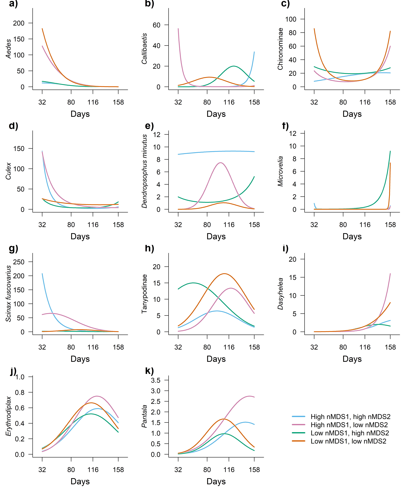

Effect of first survey on the effect of time
================
Rodolfo Pelinson
2026-04-02

## Loading packages and functions

``` r
source(paste(sep = "/",dir,"functions/pairwise_gllvm.R"))
source(paste(sep = "/",dir,"functions/pairwise_mvabund.R"))
source(paste(sep = "/",dir,"functions/my.anova.gllvm.R"))
source(paste(sep = "/",dir,"functions/My_coefplot.R"))
source(paste(sep = "/",dir,"functions/remove_sp.R"))
source(paste(sep = "/",dir,"functions/extract_mles.R"))
source(paste(sep = "/",dir,"functions/my_ordiplot.R"))
source(paste(sep = "/",dir,"functions/get_scaled_lvs.R"))
source(paste(sep = "/",dir,"functions/text_contour.R"))
source(paste(sep = "/",dir,"functions/letters.R"))
```

``` r
library(vegan)
library(gllvm)
library(mvabund)
library(DHARMa)
library(glmmTMB)
library(vioplot)
library(yarrr)
library(colorspace)
```

``` r
sessionInfo()
```

    ## R version 4.5.2 (2025-10-31 ucrt)
    ## Platform: x86_64-w64-mingw32/x64
    ## Running under: Windows 11 x64 (build 26200)
    ## 
    ## Matrix products: default
    ##   LAPACK version 3.12.1
    ## 
    ## locale:
    ## [1] LC_COLLATE=Portuguese_Brazil.utf8  LC_CTYPE=Portuguese_Brazil.utf8   
    ## [3] LC_MONETARY=Portuguese_Brazil.utf8 LC_NUMERIC=C                      
    ## [5] LC_TIME=Portuguese_Brazil.utf8    
    ## 
    ## time zone: Europe/London
    ## tzcode source: internal
    ## 
    ## attached base packages:
    ## [1] stats     graphics  grDevices utils     datasets  methods   base     
    ## 
    ## other attached packages:
    ##  [1] colorspace_2.1-2       yarrr_0.1.14           circlize_0.4.17       
    ##  [4] BayesFactor_0.9.12-4.8 Matrix_1.7-4           coda_0.19-4.1         
    ##  [7] jpeg_0.1-11            vioplot_0.5.1          zoo_1.8-15            
    ## [10] sm_2.2-6.0             glmmTMB_1.1.14         DHARMa_0.4.7          
    ## [13] mvabund_4.2.8          gllvm_2.0.5            TMB_1.9.20            
    ## [16] vegan_2.7-3            permute_0.9-10        
    ## 
    ## loaded via a namespace (and not attached):
    ##  [1] sandwich_3.1-1      shape_1.4.6.1       stringi_1.8.7      
    ##  [4] lattice_0.22-7      magrittr_2.0.4      lme4_2.0-1         
    ##  [7] digest_0.6.39       evaluate_1.0.5      grid_4.5.2         
    ## [10] estimability_1.5.1  mvtnorm_1.3-6       fastmap_1.2.0      
    ## [13] GlobalOptions_0.1.3 mgcv_1.9-3          pbapply_1.7-4      
    ## [16] numDeriv_2016.8-1.1 reformulas_0.4.4    Rdpack_2.6.6       
    ## [19] cli_3.6.5           rlang_1.1.7         rbibutils_2.4.1    
    ## [22] splines_4.5.2       yaml_2.3.12         otel_0.2.0         
    ## [25] tools_4.5.2         parallel_4.5.2      MatrixModels_0.5-4 
    ## [28] nloptr_2.2.1        minqa_1.2.8         boot_1.3-32        
    ## [31] lifecycle_1.0.5     emmeans_2.0.2       stringr_1.6.0      
    ## [34] tweedie_3.0.17      MASS_7.3-65         cluster_2.1.8.1    
    ## [37] glue_1.8.0          Rcpp_1.1.1          statmod_1.5.1      
    ## [40] xfun_0.57           rstudioapi_0.18.0   knitr_1.51         
    ## [43] xtable_1.8-8        htmltools_0.5.9     nlme_3.1-168       
    ## [46] rmarkdown_2.31      compiler_4.5.2      alabama_2025.1.0

## Loading and preparing data

``` r
source(paste(sep = "/",dir,"ajeitando_planilhas.R"))
```

``` r
comm_all_drop_atrasado <- comm_all[Exp_design_all$treatments != "atrasado",]
Exp_design_all_drop_atrasado <- Exp_design_all[Exp_design_all$treatments != "atrasado",]

ncol(comm_all_drop_atrasado)
```

    ## [1] 26

``` r
comm_all_drop_atrasado_rm <- remove_sp(comm_all_drop_atrasado, 10)
ncol(comm_all_drop_atrasado_rm)
```

    ## [1] 11

``` r
Exp_design_all_drop_atrasado$treatments_AM <- paste(Exp_design_all_drop_atrasado$treatments, Exp_design_all_drop_atrasado$AM, sep="_")

Exp_design_all_drop_atrasado$AM_numeric <- as.numeric(Exp_design_all_drop_atrasado$AM)

Exp_design_all_drop_atrasado$treatments <- as.factor(Exp_design_all_drop_atrasado$treatments)

AM_days <- as.numeric(Exp_design_all_drop_atrasado$AM)
AM_days[AM_days == 1] <- 32
AM_days[AM_days == 2] <- 80
AM_days[AM_days == 3] <- 116
AM_days[AM_days == 4] <- 158

AM_days_sc <- scale(AM_days)

Exp_design_all_drop_atrasado$AM_days_sc <- c(AM_days_sc)
Exp_design_all_drop_atrasado$AM_days_sc_squared <- c(AM_days_sc)^2

Exp_design_all_drop_atrasado$AM_days <- c(AM_days)
Exp_design_all_drop_atrasado$AM_days_squared <- c(AM_days)^2


comm_AM1 <- comm_all_drop_atrasado_rm[Exp_design_all_drop_atrasado$AM == 1,]
comm_AM1_rm <- remove_sp(comm_AM1, 3)


comm_AM1_pred <- rbind(comm_AM1_rm, comm_AM1_rm, comm_AM1_rm, comm_AM1_rm)

nrow(comm_AM1_pred)
```

    ## [1] 96

``` r
nrow(Exp_design_all_drop_atrasado)
```

    ## [1] 96

``` r
nrow(comm_all_drop_atrasado_rm)
```

    ## [1] 96

``` r
comm_AM1_pred_st <- decostand(comm_AM1_pred, "stand")
colnames(comm_AM1_pred_st) <- gsub(" ", "_", colnames(comm_AM1_pred_st))

predictors <- data.frame(Exp_design_all_drop_atrasado, comm_AM1_pred_st)


comm_AM1_rm_total <- data.frame(decostand(comm_AM1_rm, method = "total", MARGIN = 2))
nmds_comm_AM1_rm_total <- metaMDS(comm_AM1_rm_total, distance  = "bray", k = 2)
```

    ## Run 0 stress 0.1917598 
    ## Run 1 stress 0.2297681 
    ## Run 2 stress 0.1917598 
    ## ... New best solution
    ## ... Procrustes: rmse 6.598669e-06  max resid 1.947758e-05 
    ## ... Similar to previous best
    ## Run 3 stress 0.2309961 
    ## Run 4 stress 0.1917598 
    ## ... Procrustes: rmse 8.491444e-06  max resid 3.191891e-05 
    ## ... Similar to previous best
    ## Run 5 stress 0.2501125 
    ## Run 6 stress 0.1917598 
    ## ... Procrustes: rmse 7.687342e-06  max resid 2.845432e-05 
    ## ... Similar to previous best
    ## Run 7 stress 0.2250683 
    ## Run 8 stress 0.1917598 
    ## ... New best solution
    ## ... Procrustes: rmse 4.770735e-06  max resid 1.48149e-05 
    ## ... Similar to previous best
    ## Run 9 stress 0.1917598 
    ## ... New best solution
    ## ... Procrustes: rmse 2.07769e-06  max resid 4.522972e-06 
    ## ... Similar to previous best
    ## Run 10 stress 0.2439858 
    ## Run 11 stress 0.2355308 
    ## Run 12 stress 0.1917598 
    ## ... Procrustes: rmse 4.209931e-06  max resid 1.559362e-05 
    ## ... Similar to previous best
    ## Run 13 stress 0.2250683 
    ## Run 14 stress 0.1917598 
    ## ... Procrustes: rmse 2.123171e-06  max resid 6.161687e-06 
    ## ... Similar to previous best
    ## Run 15 stress 0.2351761 
    ## Run 16 stress 0.1917598 
    ## ... Procrustes: rmse 4.188588e-06  max resid 1.517291e-05 
    ## ... Similar to previous best
    ## Run 17 stress 0.1917598 
    ## ... Procrustes: rmse 1.439981e-06  max resid 4.722283e-06 
    ## ... Similar to previous best
    ## Run 18 stress 0.1917598 
    ## ... Procrustes: rmse 5.947809e-06  max resid 2.165166e-05 
    ## ... Similar to previous best
    ## Run 19 stress 0.1917598 
    ## ... Procrustes: rmse 1.301043e-05  max resid 4.763819e-05 
    ## ... Similar to previous best
    ## Run 20 stress 0.1917598 
    ## ... Procrustes: rmse 4.526055e-06  max resid 1.554661e-05 
    ## ... Similar to previous best
    ## *** Best solution repeated 8 times

``` r
comm_AM1_nmds <- data.frame(nmds_comm_AM1_rm_total$points)
comm_AM1_nmds_st <- decostand(comm_AM1_nmds, method = "stand")

comm_AM1_nmds_st_pred <- rbind(comm_AM1_nmds_st, comm_AM1_nmds_st, comm_AM1_nmds_st, comm_AM1_nmds_st)

predictors_nmds <- data.frame(Exp_design_all_drop_atrasado, comm_AM1_nmds_st_pred)
```

## Testing for effects

``` r
nrow(predictors_nmds)
```

    ## [1] 96

``` r
nrow(comm_all_drop_atrasado_rm)
```

    ## [1] 96

``` r
set.seed(1)
control <- permute::how(within = permute::Within(type = 'free'),
                        plots = Plots(strata = predictors_nmds$sites, type = 'free'),
                        nperm = 999)
permutations <- shuffleSet(nrow(comm_all_drop_atrasado_rm), control = control)


comm_all_drop_atrasado_mvabund <- mvabund(comm_all_drop_atrasado_rm)

mod_full_lin <- manyglm(comm_all_drop_atrasado_mvabund ~ block2 + ( MDS1 + MDS2 ) + AM_days_sc + AM_days_sc:( MDS1 + MDS2 ), family="negative.binomial",  data = predictors_nmds, composition = FALSE)

mod_full_quad <- manyglm(comm_all_drop_atrasado_mvabund ~ block2 + ( MDS1 + MDS2 ) + AM_days_sc + AM_days_sc_squared + AM_days_sc:( MDS1 + MDS2 ) + AM_days_sc_squared:( MDS1 + MDS2 ), family="negative.binomial",  data = predictors_nmds, composition = FALSE)

anova_quadratic_test <- anova(mod_full_lin, mod_full_quad, bootID = permutations, show.time = "all", cor.type = "I", test = "LR", resamp = "pit.trap")
```

    ## Using <int> bootID matrix from input. 
    ## Resampling begins for test 1.
    ##  Resampling run 0 finished. Time elapsed: 0.00 minutes...
    ##  Resampling run 100 finished. Time elapsed: 0.05 minutes...
    ##  Resampling run 200 finished. Time elapsed: 0.11 minutes...
    ##  Resampling run 300 finished. Time elapsed: 0.16 minutes...
    ##  Resampling run 400 finished. Time elapsed: 0.21 minutes...
    ##  Resampling run 500 finished. Time elapsed: 0.26 minutes...
    ##  Resampling run 600 finished. Time elapsed: 0.32 minutes...
    ##  Resampling run 700 finished. Time elapsed: 0.37 minutes...
    ##  Resampling run 800 finished. Time elapsed: 0.42 minutes...
    ##  Resampling run 900 finished. Time elapsed: 0.47 minutes...
    ## Time elapsed: 0 hr 0 min 31 sec

``` r
anova_quadratic_test
```

    ## Analysis of Deviance Table
    ## 
    ## mod_full_lin: comm_all_drop_atrasado_mvabund ~ block2 + (MDS1 + MDS2) + AM_days_sc + AM_days_sc:(MDS1 + MDS2)
    ## mod_full_quad: comm_all_drop_atrasado_mvabund ~ block2 + (MDS1 + MDS2) + AM_days_sc + AM_days_sc_squared + AM_days_sc:(MDS1 + MDS2) + AM_days_sc_squared:(MDS1 + MDS2)
    ## 
    ## Multivariate test:
    ##               Res.Df Df.diff   Dev Pr(>Dev)   
    ## mod_full_lin      88                          
    ## mod_full_quad     85       3 126.8    0.007 **
    ## ---
    ## Signif. codes:  0 '***' 0.001 '**' 0.01 '*' 0.05 '.' 0.1 ' ' 1
    ## Arguments:
    ##  Test statistics calculated assuming uncorrelated response (for faster computation) 
    ##  P-value calculated using 999 iterations via PIT-trap resampling.

``` r
########################################################
mod_block <- manyglm(comm_all_drop_atrasado_mvabund ~ block2 + ( MDS1 + MDS2 ) + AM_days_sc + AM_days_sc_squared, family="negative.binomial",  data = predictors_nmds, composition = FALSE)

mod_no_block <- manyglm(comm_all_drop_atrasado_mvabund ~ ( MDS1 + MDS2 ) + AM_days_sc + AM_days_sc_squared, family="negative.binomial",  data = predictors_nmds, composition = FALSE)

anova_block <- anova(mod_no_block, mod_block, bootID = permutations, show.block = "all", cor.type = "I", test = "LR", resamp = "pit.trap")
```

    ## Warning in anova.manyglm(mod_no_block, mod_block, bootID = permutations, :
    ## show.block is not a manyglm object nor a valid argument- removed from input,
    ## default value is used instead.

    ## Using <int> bootID matrix from input. 
    ## Time elapsed: 0 hr 0 min 20 sec

``` r
anova_block
```

    ## Analysis of Deviance Table
    ## 
    ## mod_no_block: comm_all_drop_atrasado_mvabund ~ (MDS1 + MDS2) + AM_days_sc + AM_days_sc_squared
    ## mod_block: comm_all_drop_atrasado_mvabund ~ block2 + (MDS1 + MDS2) + AM_days_sc + AM_days_sc_squared
    ## 
    ## Multivariate test:
    ##              Res.Df Df.diff   Dev Pr(>Dev)   
    ## mod_no_block     91                          
    ## mod_block        89       2 70.02    0.002 **
    ## ---
    ## Signif. codes:  0 '***' 0.001 '**' 0.01 '*' 0.05 '.' 0.1 ' ' 1
    ## Arguments:
    ##  Test statistics calculated assuming uncorrelated response (for faster computation) 
    ##  P-value calculated using 999 iterations via PIT-trap resampling.

``` r
########################################################


mod_time <- manyglm(comm_all_drop_atrasado_mvabund ~ block2 + ( MDS1 + MDS2 ) + AM_days_sc + AM_days_sc_squared, family="negative.binomial",  data = predictors_nmds, composition = FALSE)

mod_no_time <- manyglm(comm_all_drop_atrasado_mvabund ~ block2 + ( MDS1 + MDS2 ), family="negative.binomial",  data = predictors_nmds, composition = FALSE)

anova_time <- anova(mod_no_time, mod_time, bootID = permutations, show.time = "all", cor.type = "I", test = "LR", resamp = "pit.trap")
```

    ## Using <int> bootID matrix from input. 
    ## Resampling begins for test 1.
    ##  Resampling run 0 finished. Time elapsed: 0.00 minutes...
    ##  Resampling run 100 finished. Time elapsed: 0.03 minutes...
    ##  Resampling run 200 finished. Time elapsed: 0.07 minutes...
    ##  Resampling run 300 finished. Time elapsed: 0.10 minutes...
    ##  Resampling run 400 finished. Time elapsed: 0.13 minutes...
    ##  Resampling run 500 finished. Time elapsed: 0.16 minutes...
    ##  Resampling run 600 finished. Time elapsed: 0.20 minutes...
    ##  Resampling run 700 finished. Time elapsed: 0.23 minutes...
    ##  Resampling run 800 finished. Time elapsed: 0.26 minutes...
    ##  Resampling run 900 finished. Time elapsed: 0.30 minutes...
    ## Time elapsed: 0 hr 0 min 19 sec

``` r
anova_time
```

    ## Analysis of Deviance Table
    ## 
    ## mod_no_time: comm_all_drop_atrasado_mvabund ~ block2 + (MDS1 + MDS2)
    ## mod_time: comm_all_drop_atrasado_mvabund ~ block2 + (MDS1 + MDS2) + AM_days_sc + AM_days_sc_squared
    ## 
    ## Multivariate test:
    ##             Res.Df Df.diff   Dev Pr(>Dev)    
    ## mod_no_time     91                           
    ## mod_time        89       2 258.7    0.001 ***
    ## ---
    ## Signif. codes:  0 '***' 0.001 '**' 0.01 '*' 0.05 '.' 0.1 ' ' 1
    ## Arguments:
    ##  Test statistics calculated assuming uncorrelated response (for faster computation) 
    ##  P-value calculated using 999 iterations via PIT-trap resampling.

``` r
########################################################


mod_prior <- manyglm(comm_all_drop_atrasado_mvabund ~ block2 + ( MDS1 + MDS2 ) + AM_days_sc + AM_days_sc_squared, family="negative.binomial",  data = predictors_nmds, composition = FALSE)

mod_no_prior <- manyglm(comm_all_drop_atrasado_mvabund ~ block2 + AM_days_sc + AM_days_sc_squared, family="negative.binomial",  data = predictors_nmds, composition = FALSE)

anova_prior <- anova(mod_no_prior, mod_prior, bootID = permutations, show.time = "all", cor.type = "I", test = "LR", resamp = "pit.trap")
```

    ## Using <int> bootID matrix from input. 
    ## Resampling begins for test 1.
    ##  Resampling run 0 finished. Time elapsed: 0.00 minutes...
    ##  Resampling run 100 finished. Time elapsed: 0.03 minutes...
    ##  Resampling run 200 finished. Time elapsed: 0.06 minutes...
    ##  Resampling run 300 finished. Time elapsed: 0.10 minutes...
    ##  Resampling run 400 finished. Time elapsed: 0.13 minutes...
    ##  Resampling run 500 finished. Time elapsed: 0.16 minutes...
    ##  Resampling run 600 finished. Time elapsed: 0.19 minutes...
    ##  Resampling run 700 finished. Time elapsed: 0.23 minutes...
    ##  Resampling run 800 finished. Time elapsed: 0.26 minutes...
    ##  Resampling run 900 finished. Time elapsed: 0.29 minutes...
    ## Time elapsed: 0 hr 0 min 19 sec

``` r
anova_prior
```

    ## Analysis of Deviance Table
    ## 
    ## mod_no_prior: comm_all_drop_atrasado_mvabund ~ block2 + AM_days_sc + AM_days_sc_squared
    ## mod_prior: comm_all_drop_atrasado_mvabund ~ block2 + (MDS1 + MDS2) + AM_days_sc + AM_days_sc_squared
    ## 
    ## Multivariate test:
    ##              Res.Df Df.diff   Dev Pr(>Dev)   
    ## mod_no_prior     91                          
    ## mod_prior        89       2 59.44    0.007 **
    ## ---
    ## Signif. codes:  0 '***' 0.001 '**' 0.01 '*' 0.05 '.' 0.1 ' ' 1
    ## Arguments:
    ##  Test statistics calculated assuming uncorrelated response (for faster computation) 
    ##  P-value calculated using 999 iterations via PIT-trap resampling.

``` r
########################################################
mod_no_int <- manyglm(comm_all_drop_atrasado_mvabund ~ block2 + ( MDS1 + MDS2 ) + AM_days_sc + AM_days_sc_squared, family="negative.binomial",  data = predictors_nmds, composition = FALSE)

mod_int <- manyglm(comm_all_drop_atrasado_mvabund ~ block2 + ( MDS1 + MDS2 ) + AM_days_sc + AM_days_sc_squared + AM_days_sc:( MDS1 + MDS2 ) + AM_days_sc_squared:( MDS1 + MDS2 ), family="negative.binomial",  data = predictors_nmds, composition = FALSE)

anova_interaction <- anova(mod_no_int, mod_int, bootID = permutations, show.time = "all", cor.type = "I", test = "LR", resamp = "pit.trap")
```

    ## Using <int> bootID matrix from input. 
    ## Resampling begins for test 1.
    ##  Resampling run 0 finished. Time elapsed: 0.00 minutes...
    ##  Resampling run 100 finished. Time elapsed: 0.05 minutes...
    ##  Resampling run 200 finished. Time elapsed: 0.10 minutes...
    ##  Resampling run 300 finished. Time elapsed: 0.14 minutes...
    ##  Resampling run 400 finished. Time elapsed: 0.19 minutes...
    ##  Resampling run 500 finished. Time elapsed: 0.24 minutes...
    ##  Resampling run 600 finished. Time elapsed: 0.29 minutes...
    ##  Resampling run 700 finished. Time elapsed: 0.34 minutes...
    ##  Resampling run 800 finished. Time elapsed: 0.38 minutes...
    ##  Resampling run 900 finished. Time elapsed: 0.43 minutes...
    ## Time elapsed: 0 hr 0 min 28 sec

``` r
anova_interaction
```

    ## Analysis of Deviance Table
    ## 
    ## mod_no_int: comm_all_drop_atrasado_mvabund ~ block2 + (MDS1 + MDS2) + AM_days_sc + AM_days_sc_squared
    ## mod_int: comm_all_drop_atrasado_mvabund ~ block2 + (MDS1 + MDS2) + AM_days_sc + AM_days_sc_squared + AM_days_sc:(MDS1 + MDS2) + AM_days_sc_squared:(MDS1 + MDS2)
    ## 
    ## Multivariate test:
    ##            Res.Df Df.diff   Dev Pr(>Dev)    
    ## mod_no_int     89                           
    ## mod_int        85       4 81.74    0.001 ***
    ## ---
    ## Signif. codes:  0 '***' 0.001 '**' 0.01 '*' 0.05 '.' 0.1 ' ' 1
    ## Arguments:
    ##  Test statistics calculated assuming uncorrelated response (for faster computation) 
    ##  P-value calculated using 999 iterations via PIT-trap resampling.

Which are the species who have at least one of the coefficients for the
effect of time in interaction with the effect of the first survey whose
confidence interval do not include zero?

``` r
coefs <- mod_int$coefficients
LCL <- coefs + mod_int$stderr.coefficients * qnorm(0.025) 
UCL <- coefs + mod_int$stderr.coefficients * qnorm(0.975) 

coefs[LCL < 0 &  UCL > 0] <- NA

coefs <- coefs[-c(1:7),]

coefs <- coefs[, colSums(coefs, na.rm = TRUE) != 0]
```

## Making predictions for plotting

``` r
#High abundances of 
#Aedes
#Culex
#Dendropsophus_minutus
#Tanypodinae
#Callibaetis
#Culex

new_data_AB_high_MDS1_high_MDS2 <- 
  data.frame(AM_days_sc = seq(from = min(Exp_design_all_drop_atrasado$AM_days_sc), to = max(Exp_design_all_drop_atrasado$AM_days_sc), length.out = 100),
                                AM_days_sc_squared = seq(from = min(Exp_design_all_drop_atrasado$AM_days_sc), to = max(Exp_design_all_drop_atrasado$AM_days_sc), length.out = 100)^2,
                                block2 = factor(rep("AB", 100), levels = levels(as.factor(Exp_design_all_drop_atrasado$block2))),
             MDS1 = rep(quantile(predictors_nmds$MDS1, 0.9), 100),
             MDS2 = rep(quantile(predictors_nmds$MDS2, 0.9), 100))

new_data_CD_high_MDS1_high_MDS2 <- 
  data.frame(AM_days_sc = seq(from = min(Exp_design_all_drop_atrasado$AM_days_sc), to = max(Exp_design_all_drop_atrasado$AM_days_sc), length.out = 100),
                                AM_days_sc_squared = seq(from = min(Exp_design_all_drop_atrasado$AM_days_sc), to = max(Exp_design_all_drop_atrasado$AM_days_sc), length.out = 100)^2,
                                block2 = factor(rep("CD", 100), levels = levels(as.factor(Exp_design_all_drop_atrasado$block2))),
             MDS1 = rep(quantile(predictors_nmds$MDS1, 0.9), 100),
             MDS2 = rep(quantile(predictors_nmds$MDS2, 0.9), 100))


new_data_EF_high_MDS1_high_MDS2 <- 
  data.frame(AM_days_sc = seq(from = min(Exp_design_all_drop_atrasado$AM_days_sc), to = max(Exp_design_all_drop_atrasado$AM_days_sc), length.out = 100),
                                AM_days_sc_squared = seq(from = min(Exp_design_all_drop_atrasado$AM_days_sc), to = max(Exp_design_all_drop_atrasado$AM_days_sc), length.out = 100)^2,
                                block2 = factor(rep("EF", 100), levels = levels(as.factor(Exp_design_all_drop_atrasado$block2))),
             MDS1 = rep(quantile(predictors_nmds$MDS1, 0.9), 100),
             MDS2 = rep(quantile(predictors_nmds$MDS2, 0.9), 100))


###########################################################################################


new_data_AB_low_MDS1_high_MDS2 <- 
  data.frame(AM_days_sc = seq(from = min(Exp_design_all_drop_atrasado$AM_days_sc), to = max(Exp_design_all_drop_atrasado$AM_days_sc), length.out = 100),
                                AM_days_sc_squared = seq(from = min(Exp_design_all_drop_atrasado$AM_days_sc), to = max(Exp_design_all_drop_atrasado$AM_days_sc), length.out = 100)^2,
                                block2 = factor(rep("AB", 100), levels = levels(as.factor(Exp_design_all_drop_atrasado$block2))),
             MDS1 = rep(quantile(predictors_nmds$MDS1, 0.1), 100),
             MDS2 = rep(quantile(predictors_nmds$MDS2, 0.9), 100))

new_data_CD_low_MDS1_high_MDS2 <- 
  data.frame(AM_days_sc = seq(from = min(Exp_design_all_drop_atrasado$AM_days_sc), to = max(Exp_design_all_drop_atrasado$AM_days_sc), length.out = 100),
                                AM_days_sc_squared = seq(from = min(Exp_design_all_drop_atrasado$AM_days_sc), to = max(Exp_design_all_drop_atrasado$AM_days_sc), length.out = 100)^2,
                                block2 = factor(rep("CD", 100), levels = levels(as.factor(Exp_design_all_drop_atrasado$block2))),
             MDS1 = rep(quantile(predictors_nmds$MDS1, 0.1), 100),
             MDS2 = rep(quantile(predictors_nmds$MDS2, 0.9), 100))


new_data_EF_low_MDS1_high_MDS2 <- 
  data.frame(AM_days_sc = seq(from = min(Exp_design_all_drop_atrasado$AM_days_sc), to = max(Exp_design_all_drop_atrasado$AM_days_sc), length.out = 100),
                                AM_days_sc_squared = seq(from = min(Exp_design_all_drop_atrasado$AM_days_sc), to = max(Exp_design_all_drop_atrasado$AM_days_sc), length.out = 100)^2,
                                block2 = factor(rep("EF", 100), levels = levels(as.factor(Exp_design_all_drop_atrasado$block2))),
             MDS1 = rep(quantile(predictors_nmds$MDS1, 0.1), 100),
             MDS2 = rep(quantile(predictors_nmds$MDS2, 0.9), 100))


###########################################################################################


new_data_AB_low_MDS1_low_MDS2 <- 
  data.frame(AM_days_sc = seq(from = min(Exp_design_all_drop_atrasado$AM_days_sc), to = max(Exp_design_all_drop_atrasado$AM_days_sc), length.out = 100),
                                AM_days_sc_squared = seq(from = min(Exp_design_all_drop_atrasado$AM_days_sc), to = max(Exp_design_all_drop_atrasado$AM_days_sc), length.out = 100)^2,
                                block2 = factor(rep("AB", 100), levels = levels(as.factor(Exp_design_all_drop_atrasado$block2))),
             MDS1 = rep(quantile(predictors_nmds$MDS1, 0.1), 100),
             MDS2 = rep(quantile(predictors_nmds$MDS2, 0.1), 100))

new_data_CD_low_MDS1_low_MDS2 <- 
  data.frame(AM_days_sc = seq(from = min(Exp_design_all_drop_atrasado$AM_days_sc), to = max(Exp_design_all_drop_atrasado$AM_days_sc), length.out = 100),
                                AM_days_sc_squared = seq(from = min(Exp_design_all_drop_atrasado$AM_days_sc), to = max(Exp_design_all_drop_atrasado$AM_days_sc), length.out = 100)^2,
                                block2 = factor(rep("CD", 100), levels = levels(as.factor(Exp_design_all_drop_atrasado$block2))),
             MDS1 = rep(quantile(predictors_nmds$MDS1, 0.1), 100),
             MDS2 = rep(quantile(predictors_nmds$MDS2, 0.1), 100))


new_data_EF_low_MDS1_low_MDS2 <- 
  data.frame(AM_days_sc = seq(from = min(Exp_design_all_drop_atrasado$AM_days_sc), to = max(Exp_design_all_drop_atrasado$AM_days_sc), length.out = 100),
                                AM_days_sc_squared = seq(from = min(Exp_design_all_drop_atrasado$AM_days_sc), to = max(Exp_design_all_drop_atrasado$AM_days_sc), length.out = 100)^2,
                                block2 = factor(rep("EF", 100), levels = levels(as.factor(Exp_design_all_drop_atrasado$block2))),
             MDS1 = rep(quantile(predictors_nmds$MDS1, 0.1), 100),
             MDS2 = rep(quantile(predictors_nmds$MDS2, 0.1), 100))


###########################################################################################


new_data_AB_high_MDS1_low_MDS2 <- 
  data.frame(AM_days_sc = seq(from = min(Exp_design_all_drop_atrasado$AM_days_sc), to = max(Exp_design_all_drop_atrasado$AM_days_sc), length.out = 100),
                                AM_days_sc_squared = seq(from = min(Exp_design_all_drop_atrasado$AM_days_sc), to = max(Exp_design_all_drop_atrasado$AM_days_sc), length.out = 100)^2,
                                block2 = factor(rep("AB", 100), levels = levels(as.factor(Exp_design_all_drop_atrasado$block2))),
             MDS1 = rep(quantile(predictors_nmds$MDS1, 0.9), 100),
             MDS2 = rep(quantile(predictors_nmds$MDS2, 0.1), 100))

new_data_CD_high_MDS1_low_MDS2 <- 
  data.frame(AM_days_sc = seq(from = min(Exp_design_all_drop_atrasado$AM_days_sc), to = max(Exp_design_all_drop_atrasado$AM_days_sc), length.out = 100),
                                AM_days_sc_squared = seq(from = min(Exp_design_all_drop_atrasado$AM_days_sc), to = max(Exp_design_all_drop_atrasado$AM_days_sc), length.out = 100)^2,
                                block2 = factor(rep("CD", 100), levels = levels(as.factor(Exp_design_all_drop_atrasado$block2))),
             MDS1 = rep(quantile(predictors_nmds$MDS1, 0.9), 100),
             MDS2 = rep(quantile(predictors_nmds$MDS2, 0.1), 100))


new_data_EF_high_MDS1_low_MDS2 <- 
  data.frame(AM_days_sc = seq(from = min(Exp_design_all_drop_atrasado$AM_days_sc), to = max(Exp_design_all_drop_atrasado$AM_days_sc), length.out = 100),
                                AM_days_sc_squared = seq(from = min(Exp_design_all_drop_atrasado$AM_days_sc), to = max(Exp_design_all_drop_atrasado$AM_days_sc), length.out = 100)^2,
                                block2 = factor(rep("EF", 100), levels = levels(as.factor(Exp_design_all_drop_atrasado$block2))),
             MDS1 = rep(quantile(predictors_nmds$MDS1, 0.9), 100),
             MDS2 = rep(quantile(predictors_nmds$MDS2, 0.1), 100))


###########################################################################################


###########################################################################################


AB_high_MDS1_high_MDS2 <- predict.manyglm(mod_int, newdata = new_data_AB_high_MDS1_high_MDS2, type = "response")
```

    ## Warning: glm.fit: algoritmo não convergiu

``` r
CD_high_MDS1_high_MDS2 <- predict.manyglm(mod_int, newdata = new_data_CD_high_MDS1_high_MDS2, type = "response")
```

    ## Warning: glm.fit: algoritmo não convergiu

``` r
EF_high_MDS1_high_MDS2 <- predict.manyglm(mod_int, newdata = new_data_EF_high_MDS1_high_MDS2, type = "response")
```

    ## Warning: glm.fit: algoritmo não convergiu

``` r
high_MDS1_high_MDS2 <- array(NA, dim = c(nrow(AB_high_MDS1_high_MDS2), ncol(AB_high_MDS1_high_MDS2), 3))
high_MDS1_high_MDS2[,,1] <- AB_high_MDS1_high_MDS2
high_MDS1_high_MDS2[,,2] <- CD_high_MDS1_high_MDS2
high_MDS1_high_MDS2[,,3] <- EF_high_MDS1_high_MDS2

high_MDS1_high_MDS2_mean <- as.data.frame(apply(high_MDS1_high_MDS2, MARGIN = c(1,2), FUN = mean))
colnames(high_MDS1_high_MDS2_mean) <- colnames(AB_high_MDS1_high_MDS2)
high_MDS1_high_MDS2_mean
```

    ##           Aedes Callibaetis Chironominae      Culex Dendropsophus.minutus
    ## 1   12.01723281  0.04578350     8.172041 143.338340              8.817062
    ## 2   11.97709006  0.04350800     8.342269 125.940472              8.830927
    ## 3   11.92183342  0.04144503     8.514077 110.874922              8.844618
    ## 4   11.85167347  0.03957483     8.687418  97.806204              8.858132
    ## 5   11.76687663  0.03787991     8.862242  86.449910              8.871469
    ## 6   11.66776347  0.03634478     9.038498  76.564553              8.884629
    ## 7   11.55470673  0.03495573     9.216132  67.944768              8.897611
    ## 8   11.42812894  0.03370063     9.395089  60.415636              8.910413
    ## 9   11.28849982  0.03256873     9.575310  53.827939              8.923035
    ## 10  11.13633337  0.03155055     9.756736  48.054185              8.935476
    ## 11  10.97218471  0.03063771     9.939305  42.985278              8.947735
    ## 12  10.79664672  0.02982284    10.122953  38.527722              8.959812
    ## 13  10.61034648  0.02909945    10.307616  34.601266              8.971705
    ## 14  10.41394154  0.02846190    10.493225  31.136924              8.983414
    ## 15  10.20811605  0.02790528    10.679711  28.075306              8.994939
    ## 16   9.99357683  0.02742533    10.867002  25.365203              9.006277
    ## 17   9.77104936  0.02701847    11.055027  22.962399              9.017430
    ## 18   9.54127366  0.02668167    11.243709  20.828656              9.028395
    ## 19   9.30500031  0.02641243    11.432972  18.930858              9.039172
    ## 20   9.06298634  0.02620879    11.622739  17.240283              9.049761
    ## 21   8.81599131  0.02606927    11.812928  15.731987              9.060161
    ## 22   8.56477336  0.02599285    12.003458  14.384269              9.070370
    ## 23   8.31008547  0.02597899    12.194247  13.178231              9.080389
    ## 24   8.05267183  0.02602759    12.385209  12.097384              9.090217
    ## 25   7.79326429  0.02613899    12.576259  11.127329              9.099853
    ## 26   7.53257913  0.02631401    12.767309  10.255466              9.109297
    ## 27   7.27131392  0.02655390    12.958269   9.470763              9.118547
    ## 28   7.01014468  0.02686043    13.149051   8.763541              9.127604
    ## 29   6.74972317  0.02723585    13.339562   8.125298              9.136467
    ## 30   6.49067458  0.02768293    13.529710   7.548559              9.145134
    ## 31   6.23359531  0.02820502    13.719402   7.026740              9.153606
    ## 32   5.97905112  0.02880607    13.908543   6.554035              9.161882
    ## 33   5.72757551  0.02949069    14.097037   6.125319              9.169961
    ## 34   5.47966835  0.03026419    14.284789   5.736060              9.177844
    ## 35   5.23579481  0.03113268    14.471700   5.382249              9.185528
    ## 36   4.99638456  0.03210311    14.657674   5.060331              9.193015
    ## 37   4.76183114  0.03318341    14.842611   4.767154              9.200303
    ## 38   4.53249170  0.03438256    15.026413   4.499916              9.207392
    ## 39   4.30868692  0.03571072    15.208980   4.256129              9.214281
    ## 40   4.09070116  0.03717939    15.390213   4.033575              9.220970
    ## 41   3.87878282  0.03880155    15.570011   3.830281              9.227458
    ## 42   3.67314494  0.04059189    15.748275   3.644485              9.233746
    ## 43   3.47396600  0.04256696    15.924903   3.474615              9.239832
    ## 44   3.28139079  0.04474550    16.099797   3.319269              9.245717
    ## 45   3.09553159  0.04714865    16.272854   3.177190              9.251400
    ## 46   2.91646937  0.04980035    16.443976   3.047256              9.256880
    ## 47   2.74425519  0.05272770    16.613063   2.928463              9.262157
    ## 48   2.57891164  0.05596139    16.780014   2.819913              9.267231
    ## 49   2.42043444  0.05953624    16.944732   2.720800              9.272101
    ## 50   2.26879407  0.06349178    17.107118   2.630406              9.276767
    ## 51   2.12393748  0.06787298    17.267075   2.548085              9.281230
    ## 52   1.98578979  0.07273101    17.424504   2.473261              9.285488
    ## 53   1.85425608  0.07812419    17.579312   2.405422              9.289541
    ## 54   1.72922316  0.08411911    17.731401   2.344108              9.293389
    ## 55   1.61056134  0.09079190    17.880679   2.288911              9.297031
    ## 56   1.49812617  0.09822969    18.027052   2.239471              9.300468
    ## 57   1.39176017  0.10653240    18.170430   2.195467              9.303700
    ## 58   1.29129454  0.11581475    18.310720   2.156619              9.306725
    ## 59   1.19655073  0.12620870    18.447836   2.122683              9.309544
    ## 60   1.10734210  0.13786625    18.581689   2.093446              9.312157
    ## 61   1.02347539  0.15096278    18.712194   2.068729              9.314563
    ## 62   0.94475215  0.16570098    18.839266   2.048379              9.316763
    ## 63   0.87097014  0.18231546    18.962824   2.032274              9.318756
    ## 64   0.80192461  0.20107829    19.082788   2.020315              9.320541
    ## 65   0.73740946  0.22230545    19.199078   2.012432              9.322120
    ## 66   0.67721843  0.24636459    19.311620   2.008576              9.323491
    ## 67   0.62114604  0.27368420    19.420338   2.008725              9.324655
    ## 68   0.56898861  0.30476452    19.525161   2.012879              9.325612
    ## 69   0.52054504  0.34019063    19.626020   2.021063              9.326361
    ## 70   0.47561764  0.38064798    19.722847   2.033327              9.326903
    ## 71   0.43401275  0.42694111    19.815577   2.049744              9.327237
    ## 72   0.39554137  0.48001594    19.904149   2.070414              9.327364
    ## 73   0.36001967  0.54098671    19.988503   2.095461              9.327283
    ## 74   0.32726943  0.61116826    20.068582   2.125041              9.326995
    ## 75   0.29711840  0.69211496    20.144331   2.159334              9.326499
    ## 76   0.26940060  0.78566775    20.215700   2.198556              9.325795
    ## 77   0.24395653  0.89401102    20.282640   2.242954              9.324884
    ## 78   0.22063339  1.01974144    20.345105   2.292811              9.323766
    ## 79   0.19928514  1.16595158    20.403053   2.348449              9.322440
    ## 80   0.17977260  1.33633153    20.456443   2.410234              9.320907
    ## 81   0.16196343  1.53529263    20.505240   2.478576              9.319167
    ## 82   0.14573214  1.76811849    20.549410   2.553938              9.317220
    ## 83   0.13095998  2.04114951    20.588923   2.636838              9.315066
    ## 84   0.11753488  2.36200885    20.623750   2.727858              9.312706
    ## 85   0.10535128  2.73987957    20.653869   2.827646              9.310138
    ## 86   0.09431000  3.18584528    20.679259   2.936929              9.307365
    ## 87   0.08431806  3.71330940    20.699901   3.056517              9.304385
    ## 88   0.07528844  4.33851242    20.715782   3.187318              9.301199
    ## 89   0.06713994  5.08117093    20.726891   3.330343              9.297807
    ## 90   0.05979687  5.96526876    20.733219   3.486724              9.294210
    ## 91   0.05318888  7.02003822    20.734764   3.657727              9.290407
    ## 92   0.04725069  8.28117933    20.731523   3.844767              9.286399
    ## 93   0.04192184  9.79237764    20.723498   4.049430              9.282187
    ## 94   0.03714646 11.60719736    20.710696   4.273491              9.277769
    ## 95   0.03287301 13.79144701    20.693125   4.518941              9.273148
    ## 96   0.02905403 16.42614125    20.670798   4.788017              9.268322
    ## 97   0.02564591 19.61121594    20.643729   5.083231              9.263293
    ## 98   0.02260866 23.47019738    20.611938   5.407406              9.258061
    ## 99   0.01990565 28.15608147    20.575446   5.763724              9.252626
    ## 100  0.01750342 33.85875116    20.534279   6.155771              9.246988
    ##       Microvelia Scinax.fuscovarius Tanypodinae    Dasyhelea Erythrodiplax
    ## 1   9.340914e-01        207.6541859    1.274206 0.0003028507    0.04006832
    ## 2   4.754734e-01        190.6399485    1.357688 0.0003589377    0.04314723
    ## 3   2.453606e-01        175.0855876    1.444801 0.0004247479    0.04641476
    ## 4   1.283587e-01        160.8607718    1.535548 0.0005018398    0.04987819
    ## 5   6.807500e-02        147.8472199    1.629920 0.0005919986    0.05354471
    ## 6   3.660089e-02        135.9375509    1.727893 0.0006972651    0.05742141
    ## 7   1.994975e-02        125.0342472    1.829426 0.0008199678    0.06151520
    ## 8   1.102364e-02        115.0487199    1.934463 0.0009627586    0.06583282
    ## 9   6.175250e-03        105.9004637    2.042929 0.0011286510    0.07038073
    ## 10  3.506919e-03         97.5162960    2.154735 0.0013210632    0.07516514
    ## 11  2.019011e-03         89.8296683    2.269770 0.0015438647    0.08019191
    ## 12  1.178402e-03         82.7800453    2.387907 0.0018014264    0.08546651
    ## 13  6.972524e-04         76.3123429    2.508999 0.0020986766    0.09099400
    ## 14  4.182427e-04         70.3764213    2.632880 0.0024411596    0.09677894
    ## 15  2.543364e-04         64.9266260    2.759365 0.0028351009    0.10282539
    ## 16  1.567944e-04         59.9213728    2.888249 0.0032874756    0.10913680
    ## 17  9.799281e-05         55.3227728    3.019311 0.0038060829    0.11571600
    ## 18  6.208686e-05         51.0962923    3.152306 0.0043996246    0.12256515
    ## 19  3.987925e-05         47.2104456    3.286976 0.0050777894    0.12968565
    ## 20  2.596786e-05         43.6365168    3.423041 0.0058513412    0.13707814
    ## 21  1.714222e-05         40.3483071    3.560207 0.0067322129    0.14474243
    ## 22  1.147201e-05         37.3219066    3.698162 0.0077336043    0.15267744
    ## 23  7.783127e-06         34.5354875    3.836579 0.0088700838    0.16088117
    ## 24  5.353162e-06         31.9691158    3.975116 0.0101576954    0.16935068
    ## 25  3.732574e-06         29.6045812    4.113420 0.0116140670    0.17808200
    ## 26  2.638446e-06         27.4252430    4.251124 0.0132585230    0.18707014
    ## 27  1.890732e-06         25.4158892    4.387852 0.0151121983    0.19630903
    ## 28  1.373578e-06         23.5626102    4.523220 0.0171981536    0.20579150
    ## 29  1.011623e-06         21.8526824    4.656836 0.0195414904    0.21550926
    ## 30  7.553104e-07         20.2744635    4.788304 0.0221694655    0.22545290
    ## 31  5.717080e-07         18.8172976    4.917224 0.0251116033    0.23561181
    ## 32  4.386972e-07         17.4714279    5.043195 0.0283998039    0.24597425
    ## 33  3.412693e-07         16.2279182    5.165817 0.0320684463    0.25652731
    ## 34  2.691357e-07         15.0785814    5.284694 0.0361544848    0.26725689
    ## 35  2.151728e-07         14.0159140    5.399433 0.0406975360    0.27814777
    ## 36  1.743994e-07         13.0330370    5.509650 0.0457399551    0.28918357
    ## 37  1.432995e-07         12.1236418    5.614968 0.0513268996    0.30034680
    ## 38  1.193674e-07         11.2819410    5.715026 0.0575063773    0.31161888
    ## 39  1.008019e-07         10.5026241    5.809470 0.0643292765    0.32298017
    ## 40  8.629663e-08          9.7808158    5.897968 0.0718493765    0.33441006
    ## 41  7.489632e-08          9.1120397    5.980201 0.0801233356    0.34588693
    ## 42  6.589750e-08          8.4921840    6.055872 0.0892106529    0.35738831
    ## 43  5.877860e-08          7.9174703    6.124704 0.0991736037    0.36889085
    ## 44  5.315098e-08          7.3844263    6.186444 0.1100771435    0.38037046
    ## 45  4.872424e-08          6.8898591    6.240861 0.1219887798    0.39180236
    ## 46  4.528149e-08          6.4308323    6.287753 0.1349784086    0.40316114
    ## 47  4.266170e-08          6.0046444    6.326943 0.1491181130    0.41442090
    ## 48  4.074716e-08          5.6088092    6.358284 0.1644819231    0.42555528
    ## 49  3.945466e-08          5.2410380    6.381656 0.1811455337    0.43653763
    ## 50  3.872943e-08          4.8992230    6.396971 0.1991859796    0.44734104
    ## 51  3.854124e-08          4.5814228    6.404171 0.2186812668    0.45793850
    ## 52  3.888231e-08          4.2858484    6.403227 0.2397099581    0.46830299
    ## 53  3.976676e-08          4.0108507    6.394145 0.2623507141    0.47840759
    ## 54  4.123160e-08          3.7549093    6.376957 0.2866817885    0.48822561
    ## 55  4.333930e-08          3.5166219    6.351731 0.3127804784    0.49773067
    ## 56  4.618228e-08          3.2946946    6.318560 0.3407225315    0.50689687
    ## 57  4.988968e-08          3.0879333    6.277572 0.3705815110    0.51569887
    ## 58  5.463712e-08          2.8952357    6.228921 0.4024281217    0.52411201
    ## 59  6.066060e-08          2.7155838    6.172789 0.4363294988    0.53211242
    ## 60  6.827589e-08          2.5480371    6.109386 0.4723484653    0.53967716
    ## 61  7.790581e-08          2.3917267    6.038947 0.5105427600    0.54678431
    ## 62  9.011853e-08          2.2458494    5.961731 0.5509642434    0.55341307
    ## 63  1.056818e-07          2.1096624    5.878019 0.5936580862    0.55954386
    ## 64  1.256400e-07          1.9824788    5.788115 0.6386619466    0.56515844
    ## 65  1.514250e-07          1.8636632    5.692340 0.6860051449    0.57023997
    ## 66  1.850159e-07          1.7526272    5.591033 0.7357078417    0.57477313
    ## 67  2.291724e-07          1.6488264    5.484547 0.7877802292    0.57874415
    ## 68  2.877778e-07          1.5517566    5.373249 0.8422217429    0.58214092
    ## 69  3.663482e-07          1.4609506    5.257517 0.8990203051    0.58495305
    ## 70  4.727947e-07          1.3759755    5.137738 0.9581516068    0.58717187
    ## 71  6.185759e-07          1.2964302    5.014305 1.0195784406    0.58879056
    ## 72  8.204557e-07          1.2219428    4.887615 1.0832500922    0.58980410
    ## 73  1.103212e-06          1.1521681    4.758069 1.1491018018    0.59020937
    ## 74  1.503851e-06          1.0867861    4.626069 1.2170543035    0.59000511
    ## 75  2.078224e-06          1.0254998    4.492012 1.2870134540    0.58919195
    ## 76  2.911533e-06          0.9680334    4.356294 1.3588699578    0.58777240
    ## 77  4.135164e-06          0.9141309    4.219306 1.4324991978    0.58575087
    ## 78  5.953957e-06          0.8635544    4.081430 1.5077611799    0.58313358
    ## 79  8.690812e-06          0.8160828    3.943040 1.5845005971    0.57992858
    ## 80  1.286047e-05          0.7715109    3.804500 1.6625470199    0.57614572
    ## 81  1.929279e-05          0.7296476    3.666160 1.7417152170    0.57179654
    ## 82  2.934102e-05          0.6903153    3.528360 1.8218056113    0.56689427
    ## 83  4.523733e-05          0.6533489    3.391421 1.9026048716    0.56145372
    ## 84  7.070671e-05          0.6185944    3.255653 1.9838866422    0.55549126
    ## 85  1.120382e-04          0.5859090    3.121347 2.0654124088    0.54902466
    ## 86  1.799754e-04          0.5551592    2.988777 2.1469325000    0.54207306
    ## 87  2.930908e-04          0.5262211    2.858199 2.2281872181    0.53465689
    ## 88  4.838748e-04          0.4989789    2.729851 2.3089080965    0.52679769
    ## 89  8.098519e-04          0.4733249    2.603952 2.3888192744    0.51851810
    ## 90  1.374105e-03          0.4491587    2.480701 2.4676389815    0.50984167
    ## 91  2.363612e-03          0.4263866    2.360279 2.5450811226    0.50079283
    ## 92  4.121678e-03          0.4049213    2.242848 2.6208569489    0.49139670
    ## 93  7.286414e-03          0.3846811    2.128550 2.6946768052    0.48167902
    ## 94  1.305856e-02          0.3655901    2.017509 2.7662519370    0.47166601
    ## 95  2.372568e-02          0.3475771    1.909829 2.8352963433    0.46138428
    ## 96  4.370024e-02          0.3305759    1.805598 2.9015286575    0.45086068
    ## 97  8.160010e-02          0.3145245    1.704885 2.9646740410    0.44012221
    ## 98  1.544683e-01          0.2993651    1.607743 3.0244660705    0.42919591
    ## 99  2.964353e-01          0.2850434    1.514209 3.0806486018    0.41810871
    ## 100 5.767162e-01          0.2715089    1.424303 3.1329775910    0.40688738
    ##        Pantala
    ## 1   0.01853602
    ## 2   0.02048159
    ## 3   0.02260549
    ## 4   0.02492111
    ## 5   0.02744252
    ## 6   0.03018448
    ## 7   0.03316244
    ## 8   0.03639254
    ## 9   0.03989160
    ## 10  0.04367708
    ## 11  0.04776710
    ## 12  0.05218039
    ## 13  0.05693625
    ## 14  0.06205454
    ## 15  0.06755560
    ## 16  0.07346022
    ## 17  0.07978960
    ## 18  0.08656522
    ## 19  0.09380883
    ## 20  0.10154233
    ## 21  0.10978769
    ## 22  0.11856686
    ## 23  0.12790163
    ## 24  0.13781357
    ## 25  0.14832386
    ## 26  0.15945317
    ## 27  0.17122155
    ## 28  0.18364826
    ## 29  0.19675162
    ## 30  0.21054889
    ## 31  0.22505606
    ## 32  0.24028773
    ## 33  0.25625692
    ## 34  0.27297491
    ## 35  0.29045107
    ## 36  0.30869270
    ## 37  0.32770484
    ## 38  0.34749013
    ## 39  0.36804864
    ## 40  0.38937770
    ## 41  0.41147179
    ## 42  0.43432235
    ## 43  0.45791768
    ## 44  0.48224282
    ## 45  0.50727943
    ## 46  0.53300570
    ## 47  0.55939629
    ## 48  0.58642224
    ## 49  0.61405095
    ## 50  0.64224614
    ## 51  0.67096786
    ## 52  0.70017252
    ## 53  0.72981288
    ## 54  0.75983818
    ## 55  0.79019417
    ## 56  0.82082326
    ## 57  0.85166463
    ## 58  0.88265441
    ## 59  0.91372582
    ## 60  0.94480944
    ## 61  0.97583338
    ## 62  1.00672358
    ## 63  1.03740404
    ## 64  1.06779714
    ## 65  1.09782393
    ## 66  1.12740449
    ## 67  1.15645822
    ## 68  1.18490424
    ## 69  1.21266177
    ## 70  1.23965045
    ## 71  1.26579076
    ## 72  1.29100441
    ## 73  1.31521468
    ## 74  1.33834690
    ## 75  1.36032872
    ## 76  1.38109057
    ## 77  1.40056600
    ## 78  1.41869199
    ## 79  1.43540938
    ## 80  1.45066311
    ## 81  1.46440255
    ## 82  1.47658179
    ## 83  1.48715988
    ## 84  1.49610109
    ## 85  1.50337506
    ## 86  1.50895700
    ## 87  1.51282785
    ## 88  1.51497435
    ## 89  1.51538915
    ## 90  1.51407082
    ## 91  1.51102388
    ## 92  1.50625878
    ## 93  1.49979180
    ## 94  1.49164502
    ## 95  1.48184614
    ## 96  1.47042835
    ## 97  1.45743013
    ## 98  1.44289505
    ## 99  1.42687151
    ## 100 1.40941248

``` r
AB_low_MDS1_high_MDS2 <- predict.manyglm(mod_int, newdata = new_data_AB_low_MDS1_high_MDS2, type = "response")
```

    ## Warning: glm.fit: algoritmo não convergiu

``` r
CD_low_MDS1_high_MDS2 <- predict.manyglm(mod_int, newdata = new_data_CD_low_MDS1_high_MDS2, type = "response")
```

    ## Warning: glm.fit: algoritmo não convergiu

``` r
EF_low_MDS1_high_MDS2 <- predict.manyglm(mod_int, newdata = new_data_EF_low_MDS1_high_MDS2, type = "response")
```

    ## Warning: glm.fit: algoritmo não convergiu

``` r
low_MDS1_high_MDS2 <- array(NA, dim = c(nrow(AB_low_MDS1_high_MDS2), ncol(AB_low_MDS1_high_MDS2), 3))
low_MDS1_high_MDS2[,,1] <- AB_low_MDS1_high_MDS2
low_MDS1_high_MDS2[,,2] <- CD_low_MDS1_high_MDS2
low_MDS1_high_MDS2[,,3] <- EF_low_MDS1_high_MDS2

low_MDS1_high_MDS2_mean <- as.data.frame(apply(low_MDS1_high_MDS2, MARGIN = c(1,2), FUN = mean))
colnames(low_MDS1_high_MDS2_mean) <- colnames(AB_low_MDS1_high_MDS2)
low_MDS1_high_MDS2_mean
```

    ##            Aedes  Callibaetis Chironominae     Culex Dendropsophus.minutus
    ## 1   17.125670431  0.001136151     29.72874 26.605063              1.995418
    ## 2   16.847455130  0.001485858     29.23694 24.613906              1.935595
    ## 3   16.553542258  0.001935962     28.76273 22.806194              1.879107
    ## 4   16.244916466  0.002513014     28.30552 21.163190              1.825765
    ## 5   15.922597991  0.003249910     27.86474 19.668240              1.775393
    ## 6   15.587637064  0.004187224     27.43984 18.306524              1.727828
    ## 7   15.241108246  0.005374765     27.03030 17.064845              1.682918
    ## 8   14.884104721  0.006873394     26.63563 15.931433              1.640521
    ## 9   14.517732621  0.008757121     26.25536 14.895784              1.600504
    ## 10  14.143105382  0.011115524     25.88902 13.948513              1.562746
    ## 11  13.761338204  0.014056491     25.53619 13.081229              1.527130
    ## 12  13.373542635  0.017709338     25.19645 12.286415              1.493552
    ## 13  12.980821321  0.022228296     24.86941 11.557340              1.461910
    ## 14  12.584262956  0.027796393     24.55468 10.887962              1.432114
    ## 15  12.184937456  0.034629732     24.25191 10.272860              1.404077
    ## 16  11.783891398  0.042982161     23.96075  9.707160              1.377718
    ## 17  11.382143732  0.053150309     23.68087  9.186478              1.352964
    ## 18  10.980681805  0.065478958     23.41195  8.706868              1.329745
    ## 19  10.580457705  0.080366703     23.15370  8.264772              1.307998
    ## 20  10.182384938  0.098271813     22.90583  7.856984              1.287663
    ## 21   9.787335464  0.119718209     22.66806  7.480608              1.268684
    ## 22   9.396137085  0.145301427     22.44014  7.133029              1.251011
    ## 23   9.009571199  0.175694421     22.22181  6.811881              1.234597
    ## 24   8.628370915  0.211653030     22.01285  6.515027              1.219398
    ## 25   8.253219544  0.254020890     21.81302  6.240529              1.205375
    ## 26   7.884749438  0.303733575     21.62211  5.986633              1.192491
    ## 27   7.523541190  0.361821689     21.43992  5.751749              1.180714
    ## 28   7.170123173  0.429412632     21.26626  5.534434              1.170012
    ## 29   6.824971416  0.507730743     21.10093  5.333381              1.160359
    ## 30   6.488509795  0.598095494     20.94378  5.147401              1.151731
    ## 31   6.161110521  0.701917428     20.79464  4.975416              1.144105
    ## 32   5.843094922  0.820691520     20.65335  4.816448              1.137462
    ## 33   5.534734477  0.955987671     20.51976  4.669608              1.131786
    ## 34   5.236252098  1.109438065     20.39374  4.534088              1.127063
    ## 35   4.947823638  1.282721159     20.27516  4.409157              1.123281
    ## 36   4.669579589  1.477542154     20.16389  4.294150              1.120431
    ## 37   4.401606963  1.695609834     20.05983  4.188465              1.118505
    ## 38   4.143951323  1.938609778     19.96288  4.091557              1.117499
    ## 39   3.896618946  2.208174021     19.87292  4.002934              1.117411
    ## 40   3.659579090  2.505847392     19.78987  3.922150              1.118239
    ## 41   3.432766350  2.833050829     19.71365  3.848806              1.119987
    ## 42   3.216083074  3.191042141     19.64418  3.782544              1.122659
    ## 43   3.009401822  3.580874808     19.58140  3.723041              1.126260
    ## 44   2.812567850  4.003355537     19.52523  3.670015              1.130801
    ## 45   2.625401589  4.459001416     19.47562  3.623213              1.136292
    ## 46   2.447701120  4.947997647     19.43253  3.582415              1.142746
    ## 47   2.279244611  5.470156906     19.39591  3.547431              1.150181
    ## 48   2.119792708  6.024881487     19.36573  3.518100              1.158615
    ## 49   1.969090869  6.611129411     19.34195  3.494285              1.168068
    ## 50   1.826871623  7.227385725     19.32455  3.475878              1.178565
    ## 51   1.692856747  7.871640184     19.31352  3.462795              1.190133
    ## 52   1.566759348  8.541372449     19.30884  3.454977              1.202800
    ## 53   1.448285851  9.233545866     19.31051  3.452387              1.216601
    ## 54   1.337137868  9.944610713     19.31853  3.455014              1.231570
    ## 55   1.233013966 10.670517653     19.33291  3.462871              1.247746
    ## 56   1.135611314 11.406741914     19.35366  3.475992              1.265173
    ## 57   1.044627207 12.148318442     19.38081  3.494437              1.283895
    ## 58   0.959760477 12.889888031     19.41437  3.518291              1.303965
    ## 59   0.880712780 13.625754111     19.45439  3.547663              1.325435
    ## 60   0.807189756 14.349949586     19.50090  3.582688              1.348365
    ## 61   0.738902086 15.056312788     19.55395  3.623529              1.372818
    ## 62   0.675566414 15.738571336     19.61360  3.670375              1.398861
    ## 63   0.616906173 16.390432384     19.67989  3.723447              1.426568
    ## 64   0.562652286 17.005677528     19.75290  3.782997              1.456018
    ## 65   0.512543780 17.578260398     19.83270  3.849309              1.487297
    ## 66   0.466328281 18.102404838     19.91937  3.922705              1.520494
    ## 67   0.423762428 18.572701459     20.01300  4.003544              1.555708
    ## 68   0.384612194 18.984200319     20.11368  4.092226              1.593044
    ## 69   0.348653121 19.332497520     20.22152  4.189195              1.632616
    ## 70   0.315670482 19.613813600     20.33661  4.294945              1.674543
    ## 71   0.285459365 19.825061785     20.45909  4.410022              1.718958
    ## 72   0.257824703 19.963904355     20.58908  4.535027              1.765999
    ## 73   0.232581230 20.028795711     20.72670  4.670625              1.815816
    ## 74   0.209553398 20.019011013     20.87211  4.817550              1.868572
    ## 75   0.188575236 19.934659656     21.02544  4.976609              1.924438
    ## 76   0.169490171 19.776683237     21.18687  5.148691              1.983602
    ## 77   0.152150815 19.546838057     21.35656  5.334775              2.046263
    ## 78   0.136418716 19.247662619     21.53468  5.535942              2.112636
    ## 79   0.122164082 18.882430962     21.72143  5.753378              2.182953
    ## 80   0.109265492 18.455093027     21.91701  5.988394              2.257461
    ## 81   0.097609574 17.970203581     22.12162  6.242433              2.336429
    ## 82   0.087090688 17.432841474     22.33548  6.517086              2.420145
    ## 83   0.077610580 16.848521247     22.55882  6.814108              2.508917
    ## 84   0.069078046 16.223099215     22.79189  7.135438              2.603081
    ## 85   0.061408582 15.562676279     23.03494  7.483217              2.702996
    ## 86   0.054524037 14.873499683     23.28824  7.859810              2.809050
    ## 87   0.048352267 14.161865929     23.55207  8.267834              2.921662
    ## 88   0.042826796 13.434026911     23.82671  8.710189              3.041282
    ## 89   0.037886478 12.696101172     24.11249  9.190082              3.168399
    ## 90   0.033475170 11.953991988     24.40971  9.711074              3.303538
    ## 91   0.029541413 11.213313688     24.71873 10.277114              3.447269
    ## 92   0.026038121 10.479327375     25.03989 10.892590              3.600205
    ## 93   0.022922285  9.756886874     25.37356 11.562377              3.763014
    ## 94   0.020154689  9.050395466     25.72014 12.291904              3.936413
    ## 95   0.017699630  8.363773608     26.08002 13.087216              4.121183
    ## 96   0.015524664  7.700437605     26.45363 13.955049              4.318167
    ## 97   0.013600351  7.063288884     26.84142 14.902926              4.528281
    ## 98   0.011900027  6.454713301     27.24385 15.939245              4.752517
    ## 99   0.010399576  5.876589709     27.66140 17.073399              4.991951
    ## 100  0.009077229  5.330306825     28.09459 18.315901              5.247751
    ##     Microvelia Scinax.fuscovarius Tanypodinae   Dasyhelea Erythrodiplax
    ## 1   0.05655635          2.2345624   13.128598 0.001807100    0.07899226
    ## 2   0.05540405          2.2386579   13.303288 0.002137581    0.08380895
    ## 3   0.05435505          2.2413902   13.471042 0.002523368    0.08883554
    ## 4   0.05340432          2.2427544   13.631541 0.002972735    0.09407485
    ## 5   0.05254739          2.2427479   13.784479 0.003495018    0.09952926
    ## 6   0.05178024          2.2413707   13.929557 0.004100719    0.10520066
    ## 7   0.05109932          2.2386254   14.066493 0.004801625    0.11109042
    ## 8   0.05050152          2.2345170   14.195019 0.005610919    0.11719936
    ## 9   0.04998411          2.2290530   14.314880 0.006543307    0.12352769
    ## 10  0.04954475          2.2222435   14.425836 0.007615144    0.13007501
    ## 11  0.04918147          2.2141007   14.527668 0.008844565    0.13684025
    ## 12  0.04889265          2.2046396   14.620168 0.010251618    0.14382166
    ## 13  0.04867700          2.1938773   14.703152 0.011858393    0.15101679
    ## 14  0.04853357          2.1818333   14.776449 0.013689162    0.15842241
    ## 15  0.04846173          2.1685293   14.839912 0.015770498    0.16603454
    ## 16  0.04846115          2.1539893   14.893410 0.018131406    0.17384841
    ## 17  0.04853184          2.1382391   14.936834 0.020803438    0.18185845
    ## 18  0.04867410          2.1213068   14.970095 0.023820797    0.19005824
    ## 19  0.04888857          2.1032225   14.993124 0.027220431    0.19844052
    ## 20  0.04917619          2.0840179   15.005874 0.031042112    0.20699721
    ## 21  0.04953825          2.0637267   15.008319 0.035328489    0.21571934
    ## 22  0.04997637          2.0423840   15.000453 0.040125125    0.22459709
    ## 23  0.05049250          2.0200268   14.982294 0.045480506    0.23361979
    ## 24  0.05108898          1.9966933   14.953877 0.051446012    0.24277592
    ## 25  0.05176852          1.9724231   14.915263 0.058075864    0.25205309
    ## 26  0.05253424          1.9472571   14.866529 0.065427028    0.26143812
    ## 27  0.05338969          1.9212374   14.807777 0.073559072    0.27091700
    ## 28  0.05433886          1.8944068   14.739126 0.082533990    0.28047494
    ## 29  0.05538624          1.8668093   14.660715 0.092415960    0.29009639
    ## 30  0.05653682          1.8384896   14.572706 0.103271065    0.29976508
    ## 31  0.05779617          1.8094930   14.475274 0.115166954    0.30946406
    ## 32  0.05917046          1.7798653   14.368618 0.128172438    0.31917573
    ## 33  0.06066651          1.7496527   14.252951 0.142357041    0.32888189
    ## 34  0.06229186          1.7189018   14.128504 0.157790482    0.33856380
    ## 35  0.06405481          1.6876593   13.995523 0.174542099    0.34820222
    ## 36  0.06596452          1.6559720   13.854271 0.192680218    0.35777749
    ## 37  0.06803106          1.6238866   13.705024 0.212271459    0.36726957
    ## 38  0.07026553          1.5914497   13.548073 0.233379994    0.37665812
    ## 39  0.07268010          1.5587075   13.383719 0.256066748    0.38592258
    ## 40  0.07528821          1.5257060   13.212278 0.280388559    0.39504221
    ## 41  0.07810459          1.4924904   13.034074 0.306397301    0.40399620
    ## 42  0.08114548          1.4591058   12.849441 0.334138966    0.41276371
    ## 43  0.08442875          1.4255960   12.658723 0.363652732    0.42132400
    ## 44  0.08797404          1.3920047   12.462269 0.394970016    0.42965646
    ## 45  0.09180301          1.3583741   12.260437 0.428113520    0.43774073
    ## 46  0.09593951          1.3247460   12.053588 0.463096290    0.44555674
    ## 47  0.10040983          1.2911607   11.842090 0.499920795    0.45308486
    ## 48  0.10524299          1.2576579   11.626311 0.538578044    0.46030589
    ## 49  0.11047101          1.2242757   11.406623 0.579046752    0.46720123
    ## 50  0.11612926          1.1910512   11.183400 0.621292566    0.47375290
    ## 51  0.12225685          1.1580202   10.957013 0.665267376    0.47994364
    ## 52  0.12889703          1.1252171   10.727836 0.710908716    0.48575700
    ## 53  0.13609771          1.0926751   10.496237 0.758139271    0.49117737
    ## 54  0.14391197          1.0604257   10.262584 0.806866510    0.49619009
    ## 55  0.15239868          1.0284992   10.027240 0.856982452    0.50078151
    ## 56  0.16162319          0.9969242    9.790563 0.908363574    0.50493903
    ## 57  0.17165812          0.9657281    9.552906 0.960870886    0.50865118
    ## 58  0.18258421          0.9349364    9.314616 1.014350157    0.51190767
    ## 59  0.19449134          0.9045733    9.076031 1.068632331    0.51469941
    ## 60  0.20747965          0.8746614    8.837483 1.123534105    0.51701860
    ## 61  0.22166083          0.8452217    8.599294 1.178858701    0.51885872
    ## 62  0.23715953          0.8162738    8.361777 1.234396805    0.52021460
    ## 63  0.25411506          0.7878355    8.125235 1.289927695    0.52108240
    ## 64  0.27268322          0.7599232    7.889962 1.345220533    0.52145969
    ## 65  0.29303846          0.7325519    7.656239 1.400035829    0.52134538
    ## 66  0.31537627          0.7057349    7.424335 1.454127056    0.52073981
    ## 67  0.33991599          0.6794841    7.194511 1.507242400    0.51964468
    ## 68  0.36690394          0.6538099    6.967013 1.559126641    0.51806309
    ## 69  0.39661702          0.6287213    6.742074 1.609523139    0.51599950
    ## 70  0.42936684          0.6042260    6.519915 1.658175901    0.51345971
    ## 71  0.46550447          0.5803301    6.300747 1.704831715    0.51045083
    ## 72  0.50542579          0.5570386    6.084763 1.749242318    0.50698127
    ## 73  0.54957774          0.5343551    5.872147 1.791166577    0.50306069
    ## 74  0.59846541          0.5122820    5.663067 1.830372663    0.49869993
    ## 75  0.65266026          0.4908206    5.457681 1.866640168    0.49391099
    ## 76  0.71280950          0.4699709    5.256130 1.899762172    0.48870696
    ## 77  0.77964694          0.4497319    5.058546 1.929547200    0.48310199
    ## 78  0.85400550          0.4301014    4.865045 1.955821068    0.47711117
    ## 79  0.93683164          0.4110764    4.675732 1.978428574    0.47075052
    ## 80  1.02920201          0.3926528    4.490699 1.997235027    0.46403686
    ## 81  1.13234271          0.3748258    4.310026 2.012127582    0.45698781
    ## 82  1.24765165          0.3575894    4.133780 2.023016370    0.44962165
    ## 83  1.37672435          0.3409371    3.962018 2.029835400    0.44195726
    ## 84  1.52138396          0.3248617    3.794785 2.032543223    0.43401404
    ## 85  1.68371609          0.3093550    3.632114 2.031123354    0.42581186
    ## 86  1.86610933          0.2944085    3.474028 2.025584438    0.41737092
    ## 87  2.07130234          0.2800129    3.320540 2.015960166    0.40871171
    ## 88  2.30243882          0.2661584    3.171654 2.002308926    0.39985491
    ## 89  2.56313154          0.2528348    3.027362 1.984713221    0.39082131
    ## 90  2.85753713          0.2400314    2.887650 1.963278833    0.38163176
    ## 91  3.19044352          0.2277371    2.752494 1.938133768    0.37230703
    ## 92  3.56737225          0.2159404    2.621861 1.909426980    0.36286779
    ## 93  3.99469835          0.2046296    2.495713 1.877326901    0.35333452
    ## 94  4.47979090          0.1937928    2.374003 1.842019802    0.34372742
    ## 95  5.03117804          0.1834178    2.256677 1.803707985    0.33406635
    ## 96  5.65874106          0.1734920    2.143676 1.762607865    0.32437081
    ## 97  6.37394259          0.1640032    2.034934 1.718947932    0.31465979
    ## 98  7.19009560          0.1549385    1.930382 1.672966646    0.30495179
    ## 99  8.12268056          0.1462854    1.829944 1.624910277    0.29526474
    ## 100 9.18971989          0.1380312    1.733540 1.575030726    0.28561594
    ##        Pantala
    ## 1   0.01778937
    ## 2   0.02030592
    ## 3   0.02312696
    ## 4   0.02628138
    ## 5   0.02979966
    ## 6   0.03371384
    ## 7   0.03805737
    ## 8   0.04286501
    ## 9   0.04817268
    ## 10  0.05401724
    ## 11  0.06043626
    ## 12  0.06746779
    ## 13  0.07515001
    ## 14  0.08352092
    ## 15  0.09261795
    ## 16  0.10247755
    ## 17  0.11313473
    ## 18  0.12462261
    ## 19  0.13697187
    ## 20  0.15021027
    ## 21  0.16436204
    ## 22  0.17944737
    ## 23  0.19548180
    ## 24  0.21247568
    ## 25  0.23043360
    ## 26  0.24935383
    ## 27  0.26922783
    ## 28  0.29003975
    ## 29  0.31176602
    ## 30  0.33437491
    ## 31  0.35782631
    ## 32  0.38207139
    ## 33  0.40705251
    ## 34  0.43270312
    ## 35  0.45894779
    ## 36  0.48570235
    ## 37  0.51287413
    ## 38  0.54036231
    ## 39  0.56805839
    ## 40  0.59584675
    ## 41  0.62360536
    ## 42  0.65120657
    ## 43  0.67851800
    ## 44  0.70540356
    ## 45  0.73172448
    ## 46  0.75734051
    ## 47  0.78211113
    ## 48  0.80589675
    ## 49  0.82856010
    ## 50  0.84996746
    ## 51  0.86998997
    ## 52  0.88850497
    ## 53  0.90539719
    ## 54  0.92055999
    ## 55  0.93389644
    ## 56  0.94532035
    ## 57  0.95475725
    ## 58  0.96214514
    ## 59  0.96743520
    ## 60  0.97059231
    ## 61  0.97159546
    ## 62  0.97043796
    ## 63  0.96712752
    ## 64  0.96168619
    ## 65  0.95415006
    ## 66  0.94456892
    ## 67  0.93300569
    ## 68  0.91953571
    ## 69  0.90424596
    ## 70  0.88723410
    ## 71  0.86860742
    ## 72  0.84848178
    ## 73  0.82698031
    ## 74  0.80423225
    ## 75  0.78037163
    ## 76  0.75553594
    ## 77  0.72986485
    ## 78  0.70349893
    ## 79  0.67657836
    ## 80  0.64924174
    ## 81  0.62162494
    ## 82  0.59386002
    ## 83  0.56607428
    ## 84  0.53838931
    ## 85  0.51092023
    ## 86  0.48377501
    ## 87  0.45705392
    ## 88  0.43084902
    ## 89  0.40524387
    ## 90  0.38031326
    ## 91  0.35612310
    ## 92  0.33273041
    ## 93  0.31018337
    ## 94  0.28852151
    ## 95  0.26777594
    ## 96  0.24796967
    ## 97  0.22911802
    ## 98  0.21122903
    ## 99  0.19430395
    ## 100 0.17833777

``` r
AB_high_MDS1_low_MDS2 <- predict.manyglm(mod_int, newdata = new_data_AB_high_MDS1_low_MDS2, type = "response")
```

    ## Warning: glm.fit: algoritmo não convergiu

``` r
CD_high_MDS1_low_MDS2 <- predict.manyglm(mod_int, newdata = new_data_CD_high_MDS1_low_MDS2, type = "response")
```

    ## Warning: glm.fit: algoritmo não convergiu

``` r
EF_high_MDS1_low_MDS2 <- predict.manyglm(mod_int, newdata = new_data_EF_high_MDS1_low_MDS2, type = "response")
```

    ## Warning: glm.fit: algoritmo não convergiu

``` r
high_MDS1_low_MDS2 <- array(NA, dim = c(nrow(AB_high_MDS1_low_MDS2), ncol(AB_high_MDS1_low_MDS2), 3))
high_MDS1_low_MDS2[,,1] <- AB_high_MDS1_low_MDS2
high_MDS1_low_MDS2[,,2] <- CD_high_MDS1_low_MDS2
high_MDS1_low_MDS2[,,3] <- EF_high_MDS1_low_MDS2

high_MDS1_low_MDS2_mean <- as.data.frame(apply(high_MDS1_low_MDS2, MARGIN = c(1,2), FUN = mean))
colnames(high_MDS1_low_MDS2_mean) <- colnames(AB_high_MDS1_low_MDS2)
high_MDS1_low_MDS2_mean
```

    ##           Aedes Callibaetis Chironominae      Culex Dendropsophus.minutus
    ## 1   127.9487868 56.36485075    23.602443 141.166970            0.01135091
    ## 2   122.8389413 44.89087583    22.359967 131.054278            0.01433599
    ## 3   117.8735016 35.89096764    21.210373 121.761908            0.01802884
    ## 4   113.0515529 28.80644247    20.145979 113.217567            0.02257617
    ## 5   108.3720047 23.20980323    19.159818 105.355770            0.02814982
    ## 6   103.8335995 18.77286950    18.245564  98.117160            0.03494970
    ## 7    99.4349224 15.24288717    17.397472  91.447901            0.04320700
    ## 8    95.1744106 12.42456464    16.610317  85.299139            0.05318722
    ## 9    91.0503627 10.16652415    15.879346  79.626510            0.06519333
    ## 10   87.0609480  8.35105193    15.200233  74.389708            0.07956860
    ## 11   83.2042157  6.88632068    14.569035  69.552086            0.09669920
    ## 12   79.4781039  5.70047012    13.982160  65.080307            0.11701641
    ## 13   75.8804489  4.73708825    13.436330  60.944029            0.14099810
    ## 14   72.4089939  3.95175169    12.928555  57.115616            0.16916964
    ## 15   69.0613974  3.30936898    12.456104  53.569883            0.20210370
    ## 16   65.8352422  2.78213441    12.016484  50.283866            0.24041897
    ## 17   62.7280434  2.34794757    11.607415  47.236614            0.28477763
    ## 18   59.7372564  1.98918902    11.226815  44.409000            0.33588118
    ## 19   56.8602848  1.69176908    10.872778  41.783552            0.39446469
    ## 20   54.0944882  1.44438671    10.543563  39.344303            0.46128915
    ## 21   51.4371893  1.23795043    10.237578  37.076650            0.53713198
    ## 22   48.8856810  1.06512456     9.953365  34.967231            0.62277538
    ## 23   46.4372334  0.91997264     9.689594  33.003815            0.71899276
    ## 24   44.0890999  0.79767650     9.445048  31.175194            0.82653312
    ## 25   41.8385240  0.69431421     9.218615  29.471099            0.94610352
    ## 26   39.6827449  0.60668420     9.009281  27.882109            1.07834993
    ## 27   37.6190031  0.53216546     8.816120  26.399582            1.22383657
    ## 28   35.6445460  0.46860623     8.638290  25.015582            1.38302426
    ## 29   33.7566328  0.41423501     8.475025  23.722819            1.55624807
    ## 30   31.9525394  0.36758934     8.325631  22.514594            1.74369495
    ## 31   30.2295628  0.32745860     8.189478  21.384745            1.94538182
    ## 32   28.5850253  0.29283788     8.066000  20.327603            2.16113478
    ## 33   27.0162784  0.26289086     7.954688  19.337948            2.39057025
    ## 34   25.5207064  0.23691965     7.855087  18.410973            2.63307861
    ## 35   24.0957300  0.21434041     7.766793  17.542247            2.88781120
    ## 36   22.7388089  0.19466344     7.689453  16.727685            3.15367130
    ## 37   21.4474450  0.17747701     7.622757  15.963517            3.42930974
    ## 38   20.2191848  0.16243409     7.566440  15.246265            3.71312575
    ## 39   19.0516217  0.14924151     7.520281  14.572716            4.00327348
    ## 40   17.9423978  0.13765103     7.484098  13.939899            4.29767449
    ## 41   16.8892064  0.12745200     7.457750  13.345072            4.59403643
    ## 42   15.8897927  0.11846532     7.441133  12.785695            4.88987783
    ## 43   14.9419558  0.11053840     7.434183  12.259419            5.18255882
    ## 44   14.0435495  0.10354103     7.436873  11.764069            5.46931741
    ## 45   13.1924835  0.09736193     7.449213  11.297631            5.74731068
    ## 46   12.3867239  0.09190586     7.471251  10.858237            6.01366010
    ## 47   11.6242939  0.08709128     7.503074  10.444157            6.26550006
    ## 48   10.9032742  0.08284827     7.544805  10.053785            6.50002844
    ## 49   10.2218032  0.07911696     7.596609   9.685632            6.71455804
    ## 50    9.5780770  0.07584608     7.658689   9.338313            6.90656757
    ## 51    8.9703494  0.07299180     7.731291   9.010544            7.07375079
    ## 52    8.3969317  0.07051676     7.814704   8.701132            7.21406254
    ## 53    7.8561924  0.06838928     7.909262   8.408967            7.32576037
    ## 54    7.3465566  0.06658264     8.015347   8.133016            7.40744049
    ## 55    6.8665055  0.06507459     8.133390   7.872321            7.45806717
    ## 56    6.4145758  0.06384681     8.263877   7.625987            7.47699462
    ## 57    5.9893590  0.06288460     8.407347   7.393183            7.46398061
    ## 58    5.5895001  0.06217658     8.564402   7.173135            7.41919173
    ## 59    5.2136974  0.06171443     8.735706   6.965121            7.34319978
    ## 60    4.8607010  0.06149276     8.921994   6.768469            7.23696964
    ## 61    4.5293117  0.06150899     9.124074   6.582554            7.10183888
    ## 62    4.2183805  0.06176331     9.342832   6.406790            6.93948972
    ## 63    3.9268066  0.06225869     9.579244   6.240633            6.75191421
    ## 64    3.6535369  0.06300089     9.834378   6.083577            6.54137357
    ## 65    3.3975646  0.06399865    10.109401   5.935147            6.31035287
    ## 66    3.1579276  0.06526379    10.405594   5.794902            6.06151238
    ## 67    2.9337077  0.06681149    10.724358   5.662429            5.79763680
    ## 68    2.7240291  0.06866056    11.067222   5.537346            5.52158384
    ## 69    2.5280570  0.07083387    11.435861   5.419293            5.23623337
    ## 70    2.3449966  0.07335875    11.832106   5.307937            4.94443845
    ## 71    2.1740914  0.07626763    12.257959   5.202967            4.64897930
    ## 72    2.0146222  0.07959870    12.715610   5.104091            4.35252133
    ## 73    1.8659055  0.08339673    13.207455   5.011041            4.05757785
    ## 74    1.7272926  0.08771412    13.736118   4.923564            3.76647831
    ## 75    1.5981679  0.09261201    14.304472   4.841427            3.48134239
    ## 76    1.4779479  0.09816180    14.915663   4.764412            3.20406017
    ## 77    1.3660798  0.10444679    15.573141   4.692317            2.93627851
    ## 78    1.2620404  0.11156424    16.280690   4.624956            2.67939342
    ## 79    1.1653346  0.11962786    17.042461   4.562154            2.43454823
    ## 80    1.0754947  0.12877068    17.863015   4.503751            2.20263704
    ## 81    0.9920787  0.13914867    18.747360   4.449600            1.98431287
    ## 82    0.9146696  0.15094491    19.701006   4.399564            1.78000007
    ## 83    0.8428738  0.16437481    20.730015   4.353520            1.58991002
    ## 84    0.7763205  0.17969228    21.841062   4.311352            1.41405965
    ## 85    0.7146606  0.19719730    23.041504   4.272958            1.25229190
    ## 86    0.6575652  0.21724504    24.339453   4.238243            1.10429745
    ## 87    0.6047252  0.24025705    25.743864   4.207123            0.96963710
    ## 88    0.5558499  0.26673487    27.264628   4.179523            0.84776413
    ## 89    0.5106663  0.29727666    28.912680   4.155377            0.73804613
    ## 90    0.4689182  0.33259767    30.700118   4.134626            0.63978586
    ## 91    0.4303653  0.37355536    32.640339   4.117220            0.55224072
    ## 92    0.3947822  0.42118035    34.748192   4.103119            0.47464058
    ## 93    0.3619580  0.47671477    37.040146   4.092289            0.40620379
    ## 94    0.3316950  0.54165965    39.534485   4.084704            0.34615111
    ## 95    0.3038086  0.61783390    42.251527   4.080347            0.29371772
    ## 96    0.2781258  0.70744772    45.213868   4.079206            0.24816310
    ## 97    0.2544853  0.81319433    48.446659   4.081280            0.20877906
    ## 98    0.2327365  0.93836479    51.977925   4.086572            0.17489578
    ## 99    0.2127387  1.08699223    55.838915   4.095097            0.14588626
    ## 100   0.1943608  1.26403338    60.064508   4.106873            0.12116915
    ##       Microvelia Scinax.fuscovarius Tanypodinae    Dasyhelea Erythrodiplax
    ## 1   2.616995e-02          61.416033   0.1759570  0.002405305    0.03488897
    ## 2   5.044086e-03          62.133246   0.1995228  0.002624121    0.03800117
    ## 3   1.006030e-03          62.792146   0.2258266  0.002862953    0.04134109
    ## 4   2.076292e-04          63.390709   0.2551257  0.003123640    0.04492033
    ## 5   4.434196e-05          63.927084   0.2876933  0.003408192    0.04875061
    ## 6   9.799194e-06          64.399601   0.3238185  0.003718807    0.05284370
    ## 7   2.240860e-06          64.806782   0.3638063  0.004057884    0.05721138
    ## 8   5.302590e-07          65.147348   0.4079765  0.004428044    0.06186539
    ## 9   1.298406e-07          65.420223   0.4566638  0.004832154    0.06681733
    ## 10  3.289893e-08          65.624545   0.5102165  0.005273343    0.07207863
    ## 11  8.625851e-09          65.759664   0.5689956  0.005755031    0.07766048
    ## 12  2.340298e-09          65.825151   0.6333734  0.006280956    0.08357370
    ## 13  6.570364e-10          65.820798   0.7037318  0.006855202    0.08982873
    ## 14  1.908783e-10          65.746618   0.7804607  0.007482232    0.09643551
    ## 15  5.738161e-11          65.602848   0.8639555  0.008166924    0.10340338
    ## 16  1.784998e-11          65.389945   0.9546149  0.008914609    0.11074103
    ## 17  5.745819e-12          65.108584   1.0528379  0.009731112    0.11845639
    ## 18  1.913881e-12          64.759655   1.1590210  0.010622802    0.12655650
    ## 19  6.596704e-13          64.344259   1.2735547  0.011596639    0.13504748
    ## 20  2.352816e-13          63.863700   1.3968197  0.012660229    0.14393440
    ## 21  8.683562e-14          63.319481   1.5291835  0.013821891    0.15322117
    ## 22  3.316323e-14          62.713296   1.6709957  0.015090713    0.16291048
    ## 23  1.310584e-14          62.047016   1.8225839  0.016476633    0.17300368
    ## 24  5.359467e-15          61.322686   1.9842493  0.017990515    0.18350070
    ## 25  2.267918e-15          60.542513   2.1562614  0.019644237    0.19439996
    ## 26  9.930754e-16          59.708851   2.3388538  0.021450783    0.20569829
    ## 27  4.499725e-16          58.824194   2.5322187  0.023424350    0.21739085
    ## 28  2.488400e-16          57.891160   2.7365024  0.025580462    0.22947106
    ## 29  2.220446e-16          56.912482   2.9518001  0.027936090    0.24193051
    ## 30  2.220446e-16          55.890989   3.1781511  0.030509795    0.25475894
    ## 31  2.220446e-16          54.829598   3.4155340  0.033321871    0.26794415
    ## 32  2.220446e-16          53.731298   3.6638625  0.036394512    0.28147200
    ## 33  2.220446e-16          52.599134   3.9229810  0.039751986    0.29532635
    ## 34  2.220446e-16          51.436198   4.1926609  0.043420837    0.30948902
    ## 35  2.220446e-16          50.245611   4.4725967  0.047430092    0.32393985
    ## 36  2.220446e-16          49.030508   4.7624040  0.051811500    0.33865662
    ## 37  2.220446e-16          47.794031   5.0616161  0.056599785    0.35361512
    ## 38  2.220446e-16          46.539308   5.3696832  0.061832930    0.36878917
    ## 39  2.220446e-16          45.269447   5.6859705  0.067552479    0.38415063
    ## 40  2.220446e-16          43.987518   6.0097586  0.073803877    0.39966951
    ## 41  2.220446e-16          42.696543   6.3402434  0.080636837    0.41531397
    ## 42  2.220446e-16          41.399489   6.6765380  0.088105742    0.43105049
    ## 43  2.220446e-16          40.099249   7.0176741  0.096270087    0.44684388
    ## 44  2.220446e-16          38.798640   7.3626058  0.105194961    0.46265743
    ## 45  2.220446e-16          37.500388   7.7102133  0.114951576    0.47845307
    ## 46  2.220446e-16          36.207123   8.0593072  0.125617847    0.49419144
    ## 47  2.220446e-16          34.921371   8.4086353  0.137279024    0.50983207
    ## 48  2.220446e-16          33.645543   8.7568882  0.150028387    0.52533357
    ## 49  2.220446e-16          32.381935   9.1027073  0.163968008    0.54065376
    ## 50  2.220446e-16          31.132719   9.4446927  0.179209581    0.55574987
    ## 51  2.220446e-16          29.899940   9.7814124  0.195875333    0.57057873
    ## 52  2.220446e-16          28.685510  10.1114117  0.214099027    0.58509698
    ## 53  2.220446e-16          27.491208  10.4332232  0.234027051    0.59926125
    ## 54  2.220446e-16          26.318679  10.7453777  0.255819620    0.61302842
    ## 55  2.220446e-16          25.169428  11.0464150  0.279652084    0.62635578
    ## 56  2.220446e-16          24.044823  11.3348952  0.305716368    0.63920128
    ## 57  2.220446e-16          22.946098  11.6094099  0.334222547    0.65152374
    ## 58  2.220446e-16          21.874347  11.8685938  0.365400570    0.66328310
    ## 59  2.220446e-16          20.830532  12.1111357  0.399502147    0.67444056
    ## 60  2.220446e-16          19.815480  12.3357897  0.436802822    0.68495887
    ## 61  2.220446e-16          18.829893  12.5413857  0.477604243    0.69480251
    ## 62  2.220446e-16          17.874344  12.7268398  0.522236639    0.70393787
    ## 63  2.220446e-16          16.949284  12.8911634  0.571061553    0.71233347
    ## 64  2.220446e-16          16.055048  13.0334723  0.624474813    0.71996012
    ## 65  2.220446e-16          15.191857  13.1529944  0.682909814    0.72679109
    ## 66  2.220446e-16          14.359824  13.2490769  0.746841087    0.73280229
    ## 67  2.220446e-16          13.558959  13.3211920  0.816788233    0.73797238
    ## 68  2.220446e-16          12.789177  13.3689420  0.893320220    0.74228292
    ## 69  2.220446e-16          12.050300  13.3920627  0.977060098    0.74571846
    ## 70  2.220446e-16          11.342064  13.3904260  1.068690165    0.74826665
    ## 71  2.220446e-16          10.664128  13.3640408  1.168957628    0.74991830
    ## 72  3.687308e-16          10.016075  13.3130535  1.278680811    0.75066744
    ## 73  7.767744e-16           9.397424  13.2377461  1.398755953    0.75051137
    ## 74  1.755497e-15           8.807630  13.1385336  1.530164667    0.74945065
    ## 75  4.105391e-15           8.246095  13.0159608  1.673982112    0.74748912
    ## 76  9.934768e-15           7.712169  12.8706964  1.831385949    0.74463385
    ## 77  2.487768e-14           7.205163  12.7035279  2.003666165    0.74089513
    ## 78  6.446309e-14           6.724346  12.5153538  2.192235836    0.73628640
    ## 79  1.728468e-13           6.268957  12.3071756  2.398642932    0.73082413
    ## 80  4.795793e-13           5.838208  12.0800893  2.624583258    0.72452779
    ## 81  1.376919e-12           5.431287  11.8352757  2.871914639    0.71741968
    ## 82  4.090775e-12           5.047368  11.5739898  3.142672478    0.70952482
    ## 83  1.257626e-11           4.685611  11.2975506  3.439086812    0.70087080
    ## 84  4.000798e-11           4.345167  11.0073297  3.763601014    0.69148762
    ## 85  1.317015e-10           4.025184  10.7047404  4.118892304    0.68140752
    ## 86  4.486251e-10           3.724809  10.3912260  4.507894236    0.67066477
    ## 87  1.581341e-09           3.443192  10.0682484  4.933821364    0.65929554
    ## 88  5.767882e-09           3.179490   9.7372772  5.400196287    0.64733763
    ## 89  2.176989e-08           2.932869   9.3997788  5.910879316    0.63483028
    ## 90  8.502468e-08           2.702508   9.0572054  6.470101003    0.62181398
    ## 91  3.436234e-07           2.487598   8.7109853  7.082497828    0.60833023
    ## 92  1.437042e-06           2.287349   8.3625134  7.753151339    0.59442132
    ## 93  6.218781e-06           2.100988   8.0131423  8.487631078    0.58013014
    ## 94  2.784774e-05           1.927764   7.6641742  9.292041675    0.56549992
    ## 95  1.290398e-04           1.766945   7.3168536 10.173074506    0.55057404
    ## 96  6.187372e-04           1.617824   6.9723607 11.138064361    0.53539583
    ## 97  3.069996e-03           1.479717   6.6318059 12.195051612    0.52000834
    ## 98  1.576226e-02           1.351963   6.2962252 13.352850416    0.50445415
    ## 99  8.374289e-02           1.233929   5.9665761 14.621123543    0.48877519
    ## 100 4.603906e-01           1.125004   5.6437348 16.010464474    0.47301257
    ##        Pantala
    ## 1   0.05292882
    ## 2   0.05759615
    ## 3   0.06261778
    ## 4   0.06801502
    ## 5   0.07380997
    ## 6   0.08002546
    ## 7   0.08668508
    ## 8   0.09381311
    ## 9   0.10143450
    ## 10  0.10957484
    ## 11  0.11826030
    ## 12  0.12751759
    ## 13  0.13737390
    ## 14  0.14785682
    ## 15  0.15899427
    ## 16  0.17081444
    ## 17  0.18334568
    ## 18  0.19661641
    ## 19  0.21065504
    ## 20  0.22548982
    ## 21  0.24114874
    ## 22  0.25765945
    ## 23  0.27504904
    ## 24  0.29334398
    ## 25  0.31256995
    ## 26  0.33275168
    ## 27  0.35391282
    ## 28  0.37607574
    ## 29  0.39926141
    ## 30  0.42348921
    ## 31  0.44877675
    ## 32  0.47513973
    ## 33  0.50259173
    ## 34  0.53114405
    ## 35  0.56080554
    ## 36  0.59158242
    ## 37  0.62347813
    ## 38  0.65649312
    ## 39  0.69062473
    ## 40  0.72586703
    ## 41  0.76221063
    ## 42  0.79964261
    ## 43  0.83814633
    ## 44  0.87770134
    ## 45  0.91828327
    ## 46  0.95986370
    ## 47  1.00241017
    ## 48  1.04588600
    ## 49  1.09025033
    ## 50  1.13545806
    ## 51  1.18145984
    ## 52  1.22820206
    ## 53  1.27562691
    ## 54  1.32367241
    ## 55  1.37227249
    ## 56  1.42135704
    ## 57  1.47085212
    ## 58  1.52067997
    ## 59  1.57075929
    ## 60  1.62100532
    ## 61  1.67133010
    ## 62  1.72164270
    ## 63  1.77184940
    ## 64  1.82185405
    ## 65  1.87155826
    ## 66  1.92086177
    ## 67  1.96966273
    ## 68  2.01785806
    ## 69  2.06534380
    ## 70  2.11201544
    ## 71  2.15776834
    ## 72  2.20249807
    ## 73  2.24610083
    ## 74  2.28847386
    ## 75  2.32951577
    ## 76  2.36912703
    ## 77  2.40721030
    ## 78  2.44367087
    ## 79  2.47841702
    ## 80  2.51136043
    ## 81  2.54241654
    ## 82  2.57150490
    ## 83  2.59854954
    ## 84  2.62347927
    ## 85  2.64622804
    ## 86  2.66673518
    ## 87  2.68494570
    ## 88  2.70081052
    ## 89  2.71428670
    ## 90  2.72533764
    ## 91  2.73393323
    ## 92  2.74004998
    ## 93  2.74367117
    ## 94  2.74478687
    ## 95  2.74339403
    ## 96  2.73949646
    ## 97  2.73310484
    ## 98  2.72423665
    ## 99  2.71291611
    ## 100 2.69917406

``` r
AB_low_MDS1_low_MDS2 <- predict.manyglm(mod_int, newdata = new_data_AB_low_MDS1_low_MDS2, type = "response")
```

    ## Warning: glm.fit: algoritmo não convergiu

``` r
CD_low_MDS1_low_MDS2 <- predict.manyglm(mod_int, newdata = new_data_CD_low_MDS1_low_MDS2, type = "response")
```

    ## Warning: glm.fit: algoritmo não convergiu

``` r
EF_low_MDS1_low_MDS2 <- predict.manyglm(mod_int, newdata = new_data_EF_low_MDS1_low_MDS2, type = "response")
```

    ## Warning: glm.fit: algoritmo não convergiu

``` r
low_MDS1_low_MDS2 <- array(NA, dim = c(nrow(AB_low_MDS1_low_MDS2), ncol(AB_low_MDS1_low_MDS2), 3))
low_MDS1_low_MDS2[,,1] <- AB_low_MDS1_low_MDS2
low_MDS1_low_MDS2[,,2] <- CD_low_MDS1_low_MDS2
low_MDS1_low_MDS2[,,3] <- EF_low_MDS1_low_MDS2

low_MDS1_low_MDS2_mean <- as.data.frame(apply(low_MDS1_low_MDS2, MARGIN = c(1,2), FUN = mean))
colnames(low_MDS1_low_MDS2_mean) <- colnames(AB_low_MDS1_low_MDS2)
low_MDS1_low_MDS2_mean
```

    ##           Aedes Callibaetis Chironominae    Culex Dendropsophus.minutus
    ## 1   182.3388786   1.3987353    85.862384 26.20203           0.002568860
    ## 2   172.7901805   1.5330853    78.364426 25.61335           0.003142215
    ## 3   163.6681138   1.6765235    71.654079 25.04557           0.003830365
    ## 4   154.9581194   1.8292182    65.640040 24.49788           0.004653214
    ## 5   146.6458703   1.9912872    60.242461 23.96952           0.005633451
    ## 6   138.7172844   2.1627926    55.391423 23.45974           0.006796804
    ## 7   131.1585357   2.3437343    51.025620 22.96784           0.008172287
    ## 8   123.9560650   2.5340456    47.091228 22.49314           0.009792446
    ## 9   117.0965887   2.7335877    43.540929 22.03501           0.011693577
    ## 10  110.5671069   2.9421455    40.333074 21.59283           0.013915932
    ## 11  104.3549104   3.1594234    37.430954 21.16601           0.016503872
    ## 12   98.4475864   3.3850420    34.802179 20.75398           0.019505995
    ## 13   92.8330240   3.6185355    32.418127 20.35622           0.022975185
    ## 14   87.4994176   3.8593499    30.253481 19.97219           0.026968612
    ## 15   82.4352705   4.1068422    28.285818 19.60142           0.031547638
    ## 16   77.6293971   4.3602805    26.495253 19.24343           0.036777633
    ## 17   73.0709241   4.6188449    24.864136 18.89777           0.042727686
    ## 18   68.7492915   4.8816303    23.376776 18.56401           0.049470198
    ## 19   64.6542523   5.1476490    22.019214 18.24173           0.057080346
    ## 20   60.7758724   5.4158362    20.779015 17.93054           0.065635411
    ## 21   57.1045285   5.6850548    19.645092 17.63006           0.075213968
    ## 22   53.6309067   5.9541030    18.607546 17.33993           0.085894916
    ## 23   50.3459996   6.2217215    17.657536 17.05981           0.097756376
    ## 24   47.2411040   6.4866033    16.787154 16.78935           0.110874429
    ## 25   44.3078165   6.7474031    15.989319 16.52825           0.125321727
    ## 26   41.5380304   7.0027484    15.257692 16.27619           0.141165972
    ## 27   38.9239307   7.2512509    14.586586 16.03290           0.158468279
    ## 28   36.4579901   7.4915190    13.970901 15.79808           0.177281466
    ## 29   34.1329634   7.7221705    13.406059 15.57147           0.197648262
    ## 30   31.9418825   7.9418454    12.887948 15.35282           0.219599495
    ## 31   29.8780508   8.1492196    12.412876 15.14187           0.243152280
    ## 32   27.9350373   8.3430175    11.977522 14.93841           0.268308251
    ## 33   26.1066706   8.5220257    11.578905 14.74219           0.295051876
    ## 34   24.3870330   8.6851048    11.214347 14.55302           0.323348914
    ## 35   22.7704535   8.8312024    10.881441 14.37067           0.353145034
    ## 36   21.2515023   8.9593634    10.578030 14.19496           0.384364680
    ## 37   19.8249834   9.0687414    10.302180 14.02569           0.416910194
    ## 38   18.4859285   9.1586070    10.052160 13.86270           0.450661262
    ## 39   17.2295902   9.2283568     9.826427 13.70579           0.485474714
    ## 40   16.0514350   9.2775195     9.623606 13.55482           0.521184717
    ## 41   14.9471373   9.3057616     9.442478 13.40962           0.557603386
    ## 42   13.9125719   9.3128908     9.281968 13.27004           0.594521827
    ## 43   12.9438080   9.2988586     9.141134 13.13594           0.631711638
    ## 44   12.0371021   9.2637606     9.019160 13.00718           0.668926843
    ## 45   11.1888915   9.2078355     8.915343 12.88363           0.705906275
    ## 46   10.3957882   9.1314621     8.829090 12.76516           0.742376358
    ## 47    9.6545720   9.0351556     8.759913 12.65166           0.778054278
    ## 48    8.9621843   8.9195614     8.707422 12.54302           0.812651478
    ## 49    8.3157218   8.7854479     8.671323 12.43912           0.845877428
    ## 50    7.7124307   8.6336981     8.651413 12.33986           0.877443608
    ## 51    7.1497003   8.4653001     8.647583 12.24515           0.907067622
    ## 52    6.6250573   8.2813359     8.659809 12.15489           0.934477368
    ## 53    6.1361602   8.0829704     8.688162 12.06899           0.959415174
    ## 54    5.6807931   7.8714388     8.732798 11.98737           0.981641815
    ## 55    5.2568610   7.6480338     8.793968 11.90996           1.000940331
    ## 56    4.8623841   7.4140929     8.872015 11.83667           1.017119545
    ## 57    4.4954924   7.1709847     8.967382 11.76744           1.030017214
    ## 58    4.1544211   6.9200959     9.080609 11.70220           1.039502739
    ## 59    3.8375054   6.6628183     9.212346 11.64089           1.045479365
    ## 60    3.5431761   6.4005365     9.363355 11.58345           1.047885823
    ## 61    3.2699544   6.1346152     9.534516 11.52982           1.046697378
    ## 62    3.0164485   5.8663886     9.726841 11.47997           1.041926250
    ## 63    2.7813482   5.5971490     9.941476 11.43383           1.033621407
    ## 64    2.5634217   5.3281379    10.179722 11.39137           1.021867726
    ## 65    2.3615110   5.0605368    10.443039 11.35254           1.006784551
    ## 66    2.1745287   4.7954599    10.733067 11.31732           0.988523674
    ## 67    2.0014538   4.5339475    11.051640 11.28566           0.967266793
    ## 68    1.8413283   4.2769607    11.400806 11.25754           0.943222505
    ## 69    1.6932540   4.0253771    11.782850 11.23294           0.916622899
    ## 70    1.5563893   3.7799881    12.200317 11.21182           0.887719833
    ## 71    1.4299459   3.5414967    12.656039 11.19418           0.856780976
    ## 72    1.3131860   3.3105167    13.153171 11.17998           0.824085702
    ## 73    1.2054191   3.0875734    13.695222 11.16923           0.789920920
    ## 74    1.1060001   2.8731039    14.286098 11.16191           0.754576931
    ## 75    1.0143259   2.6674600    14.930148 11.15802           0.718343398
    ## 76    0.9298333   2.4709107    15.632217 11.15754           0.681505487
    ## 77    0.8519967   2.2836457    16.397702 11.16049           0.644340280
    ## 78    0.7803258   2.1057797    17.232622 11.16685           0.607113484
    ## 79    0.7143635   1.9373572    18.143692 11.17665           0.570076511
    ## 80    0.6536839   1.7783573    19.138414 11.18988           0.533463965
    ## 81    0.5978904   1.6286992    20.225169 11.20657           0.497491542
    ## 82    0.5466138   1.4882479    21.413336 11.22672           0.462354391
    ## 83    0.4995108   1.3568200    22.713416 11.25035           0.428225913
    ## 84    0.4562621   1.2341892    24.137180 11.27749           0.395257002
    ## 85    0.4165711   1.1200922    25.697836 11.30816           0.363575721
    ## 86    0.3801623   1.0142344    27.410221 11.34239           0.333287363
    ## 87    0.3467802   0.9162954    29.291018 11.38021           0.304474897
    ## 88    0.3161876   0.8259337    31.359010 11.42165           0.277199735
    ## 89    0.2881645   0.7427923    33.635368 11.46676           0.251502786
    ## 90    0.2625073   0.6665031    36.143979 11.51558           0.227405760
    ## 91    0.2390274   0.5966910    38.911834 11.56815           0.204912662
    ## 92    0.2175500   0.5329780    41.969461 11.62453           0.184011430
    ## 93    0.1979136   0.4749870    45.351435 11.68475           0.164675685
    ## 94    0.1799690   0.4223443    49.096963 11.74890           0.146866528
    ## 95    0.1635779   0.3746832    53.250560 11.81701           0.130534362
    ## 96    0.1486131   0.3316456    57.862831 11.88916           0.115620687
    ## 97    0.1349568   0.2928848    62.991380 11.96542           0.102059847
    ## 98    0.1225004   0.2580667    68.701865 12.04586           0.089780692
    ## 99    0.1111439   0.2268713    75.069216 12.13056           0.078708142
    ## 100   0.1007950   0.1989939    82.179064 12.21960           0.068764619
    ##       Microvelia Scinax.fuscovarius Tanypodinae  Dasyhelea Erythrodiplax
    ## 1   1.584510e-03          0.6608967    1.812947 0.01435237    0.06878148
    ## 2   5.877569e-04          0.7296219    1.955021 0.01562743    0.07381327
    ## 3   2.228671e-04          0.8038452    2.105563 0.01700841    0.07912478
    ## 4   8.638523e-05          0.8838065    2.264830 0.01850342    0.08472387
    ## 5   3.422776e-05          0.9697330    2.433064 0.02012115    0.09061795
    ## 6   1.386318e-05          1.0618360    2.610490 0.02187085    0.09681393
    ## 7   5.739742e-06          1.1603070    2.797314 0.02376244    0.10331815
    ## 8   2.429223e-06          1.2653149    2.993717 0.02580647    0.11013631
    ## 9   1.050964e-06          1.3770020    3.199860 0.02801421    0.11727343
    ## 10  4.647866e-07          1.4954805    3.415872 0.03039769    0.12473373
    ## 11  2.101187e-07          1.6208289    3.641857 0.03296970    0.13252059
    ## 12  9.710046e-08          1.7530884    3.877884 0.03574387    0.14063647
    ## 13  4.586941e-08          1.8922595    4.123986 0.03873474    0.14908287
    ## 14  2.214983e-08          2.0382986    4.380161 0.04195772    0.15786022
    ## 15  1.093360e-08          2.1911150    4.646368 0.04542923    0.16696783
    ## 16  5.516976e-09          2.3505676    4.922522 0.04916672    0.17640386
    ## 17  2.845669e-09          2.5164632    5.208495 0.05318870    0.18616522
    ## 18  1.500421e-09          2.6885532    5.504115 0.05751482    0.19624751
    ## 19  8.086997e-10          2.8665329    5.809158 0.06216593    0.20664502
    ## 20  4.455606e-10          3.0500394    6.123356 0.06716413    0.21735062
    ## 21  2.509410e-10          3.2386514    6.446386 0.07253284    0.22835578
    ## 22  1.444714e-10          3.4318888    6.777878 0.07829683    0.23965048
    ## 23  8.502320e-11          3.6292128    7.117405 0.08448236    0.25122321
    ## 24  5.114915e-11          3.8300276    7.464492 0.09111715    0.26306095
    ## 25  3.145464e-11          4.0336814    7.818606 0.09823054    0.27514915
    ## 26  1.977318e-11          4.2394696    8.179164 0.10585349    0.28747172
    ## 27  1.270614e-11          4.4466372    8.545533 0.11401872    0.30001105
    ## 28  8.346339e-12          4.6543828    8.917023 0.12276071    0.31274801
    ## 29  5.604331e-12          4.8618632    9.292898 0.13211585    0.32566195
    ## 30  3.846777e-12          5.0681984    9.672373 0.14212246    0.33873077
    ## 31  2.699079e-12          5.2724772   10.054615 0.15282092    0.35193094
    ## 32  1.935885e-12          5.4737638   10.438749 0.16425372    0.36523754
    ## 33  1.419348e-12          5.6711042   10.823855 0.17646552    0.37862435
    ## 34  1.063760e-12          5.8635339   11.208979 0.18950332    0.39206389
    ## 35  8.149736e-13          6.0500851   11.593130 0.20341644    0.40552751
    ## 36  6.382472e-13          6.2297951   11.975287 0.21825669    0.41898546
    ## 37  5.109516e-13          6.4017141   12.354401 0.23407841    0.43240705
    ## 38  4.181344e-13          6.5649137   12.729402 0.25093858    0.44576066
    ## 39  3.497820e-13          6.7184951   13.099203 0.26889691    0.45901394
    ## 40  2.991054e-13          6.8615972   13.462705 0.28801590    0.47213390
    ## 41  2.614548e-13          6.9934048   13.818799 0.30836097    0.48508703
    ## 42  2.336223e-13          7.1131564   14.166379 0.33000052    0.49783945
    ## 43  2.133916e-13          7.2201509   14.504340 0.35300603    0.51035705
    ## 44  1.992442e-13          7.3137554   14.831587 0.37745216    0.52260565
    ## 45  1.901688e-13          7.3934105   15.147042 0.40341681    0.53455113
    ## 46  1.855404e-13          7.4586365   15.449649 0.43098122    0.54615959
    ## 47  1.850474e-13          7.5090380   15.738377 0.46023006    0.55739754
    ## 48  1.886570e-13          7.5443077   16.012231 0.49125152    0.56823202
    ## 49  1.966111e-13          7.5642299   16.270252 0.52413736    0.57863077
    ## 50  2.094540e-13          7.5686824   16.511529 0.55898302    0.58856240
    ## 51  2.280944e-13          7.5576379   16.735198 0.59588766    0.59799653
    ## 52  2.539136e-13          7.5311641   16.940451 0.63495428    0.60690399
    ## 53  2.889367e-13          7.4894233   17.126541 0.67628975    0.61525688
    ## 54  3.360971e-13          7.4326704   17.292783 0.72000487    0.62302883
    ## 55  3.996431e-13          7.3612507   17.438562 0.76621447    0.63019502
    ## 56  4.857638e-13          7.2755961   17.563337 0.81503742    0.63673242
    ## 57  6.035640e-13          7.1762206   17.666639 0.86659670    0.64261983
    ## 58  7.665966e-13          7.0637159   17.748081 0.92101945    0.64783806
    ## 59  9.953042e-13          6.9387445   17.807355 0.97843696    0.65236996
    ## 60  1.320961e-12          6.8020340   17.844237 1.03898478    0.65620060
    ## 61  1.792131e-12          6.6543700   17.858588 1.10280267    0.65931727
    ## 62  2.485392e-12          6.4965879   17.850353 1.17003462    0.66170963
    ## 63  3.523427e-12          6.3295660   17.819564 1.24082890    0.66336969
    ## 64  5.106003e-12          6.1542166   17.766336 1.31533802    0.66429191
    ## 65  7.563839e-12          5.9714782   17.690872 1.39371871    0.66447320
    ## 66  1.145378e-11          5.7823073   17.593456 1.47613192    0.66391295
    ## 67  1.772967e-11          5.5876696   17.474454 1.56274277    0.66261305
    ## 68  2.805421e-11          5.3885324   17.334314 1.65372049    0.66057783
    ## 69  4.537751e-11          5.1858568   17.173557 1.74923840    0.65781409
    ## 70  7.502891e-11          4.9805898   16.992779 1.84947378    0.65433103
    ## 71  1.268125e-10          4.7736575   16.792645 1.95460786    0.65014021
    ## 72  2.190992e-10          4.5659587   16.573887 2.06482566    0.64525549
    ## 73  3.869590e-10          4.3583584   16.337296 2.18031589    0.63969294
    ## 74  6.986094e-10          4.1516824   16.083722 2.30127084    0.63347076
    ## 75  1.289286e-09          3.9467131   15.814064 2.42788624    0.62660918
    ## 76  2.432258e-09          3.7441843   15.529268 2.56036108    0.61913037
    ## 77  4.690457e-09          3.5447785   15.230320 2.69889745    0.61105827
    ## 78  9.246261e-09          3.3491241   14.918242 2.84370038    0.60241852
    ## 79  1.863213e-08          3.1577926   14.594083 2.99497755    0.59323828
    ## 80  3.837994e-08          2.9712979   14.258916 3.15293917    0.58354613
    ## 81  8.081488e-08          2.7900952   13.913833 3.31779765    0.57337187
    ## 82  1.739497e-07          2.6145810   13.559936 3.48976742    0.56274642
    ## 83  3.827381e-07          2.4450931   13.198331 3.66906459    0.55170163
    ## 84  8.608448e-07          2.2819122   12.830127 3.85590667    0.54027014
    ## 85  1.979217e-06          2.1252631   12.456427 4.05051229    0.52848520
    ## 86  4.651654e-06          1.9753166   12.078320 4.25310084    0.51638053
    ## 87  1.117549e-05          1.8321919   11.696883 4.46389211    0.50399016
    ## 88  2.744552e-05          1.6959593   11.313170 4.68310594    0.49134826
    ## 89  6.890036e-05          1.5666433   10.928211 4.91096185    0.47848900
    ## 90  1.768141e-04          1.4442257   10.543004 5.14767859    0.46544638
    ## 91  4.638288e-04          1.3286490   10.158514 5.39347374    0.45225411
    ## 92  1.243781e-03          1.2198198    9.775672 5.64856329    0.43894546
    ## 93  3.409380e-03          1.1176127    9.395363 5.91316113    0.42555311
    ## 94  9.553276e-03          1.0218736    9.018433 6.18747864    0.41210904
    ## 95  2.736369e-02          0.9324237    8.645680 6.47172412    0.39864441
    ## 96  8.012025e-02          0.8490625    8.277855 6.76610234    0.38518946
    ## 97  2.398034e-01          0.7715716    7.915657 7.07081401    0.37177336
    ## 98  7.336919e-01          0.6997180    7.559738 7.38605521    0.35842419
    ## 99  2.294655e+00          0.6332572    7.210694 7.71201684    0.34516879
    ## 100 7.336123e+00          0.5719360    6.869069 8.04888409    0.33203274
    ##        Pantala
    ## 1   0.05079679
    ## 2   0.05710216
    ## 3   0.06406226
    ## 4   0.07172748
    ## 5   0.08014979
    ## 6   0.08938255
    ## 7   0.09948020
    ## 8   0.11049792
    ## 9   0.12249126
    ## 10  0.13551570
    ## 11  0.14962621
    ## 12  0.16487669
    ## 13  0.18131945
    ## 14  0.19900458
    ## 15  0.21797932
    ## 16  0.23828738
    ## 17  0.25996826
    ## 18  0.28305651
    ## 19  0.30758101
    ## 20  0.33356419
    ## 21  0.36102133
    ## 22  0.38995981
    ## 23  0.42037837
    ## 24  0.45226650
    ## 25  0.48560374
    ## 26  0.52035910
    ## 27  0.55649059
    ## 28  0.59394474
    ## 29  0.63265623
    ## 30  0.67254767
    ## 31  0.71352945
    ## 32  0.75549965
    ## 33  0.79834419
    ## 34  0.84193703
    ## 35  0.88614051
    ## 36  0.93080586
    ## 37  0.97577383
    ## 38  1.02087545
    ## 39  1.06593297
    ## 40  1.11076086
    ## 41  1.15516701
    ## 42  1.19895401
    ## 43  1.24192055
    ## 44  1.28386287
    ## 45  1.32457637
    ## 46  1.36385721
    ## 47  1.40150401
    ## 48  1.43731952
    ## 49  1.47111235
    ## 50  1.50269865
    ## 51  1.53190379
    ## 52  1.55856394
    ## 53  1.58252760
    ## 54  1.60365707
    ## 55  1.62182970
    ## 56  1.63693915
    ## 57  1.64889636
    ## 58  1.65763048
    ## 59  1.66308951
    ## 60  1.66524088
    ## 61  1.66407173
    ## 62  1.65958904
    ## 63  1.65181959
    ## 64  1.64080966
    ## 65  1.62662460
    ## 66  1.60934815
    ## 67  1.58908166
    ## 68  1.56594304
    ## 69  1.54006569
    ## 70  1.51159717
    ## 71  1.48069780
    ## 72  1.44753919
    ## 73  1.41230263
    ## 74  1.37517746
    ## 75  1.33635936
    ## 76  1.29604868
    ## 77  1.25444870
    ## 78  1.21176397
    ## 79  1.16819866
    ## 80  1.12395497
    ## 81  1.07923161
    ## 82  1.03422240
    ## 83  0.98911494
    ## 84  0.94408941
    ## 85  0.89931745
    ## 86  0.85496131
    ## 87  0.81117290
    ## 88  0.76809325
    ## 89  0.72585187
    ## 90  0.68456642
    ## 91  0.64434242
    ## 92  0.60527312
    ## 93  0.56743954
    ## 94  0.53091053
    ## 95  0.49574304
    ## 96  0.46198241
    ## 97  0.42966285
    ## 98  0.39880785
    ## 99  0.36943083
    ## 100 0.34153570

## Ploting predicted effects

``` r
sp_names <- colnames(high_MDS1_high_MDS2_mean)
sp_names <- gsub("\\.", " ", sp_names)

sp_fonts <- rep(3, ncol(high_MDS1_high_MDS2_mean))
sp_fonts[sp_names == "Chironominae" | sp_names == "Tanypodinae"] <- 1

sp_letters <- c("a)", "b)", "c)", "d)", "e)", "f)", "g)", "h)", "i)", "j)", "k)")


#svg(filename = "Plots/Community structure analysis/predicted_species_trajectories.svg", width = 10, height = 12, pointsize = 13)


close.screen(all.screens = TRUE)
```

    ## [1] FALSE

``` r
split.screen(matrix(c(0,0.3333333,       0.75,1,
                      0.3333333,0.666666,0.75,1,
                      0.666666,1,        0.75,1,
                      0,0.3333333,       0.5,0.75,
                      0.3333333,0.666666,0.5,0.75,
                      0.666666,1,        0.5,0.75,
                      0,0.3333333,       0.25,0.5,
                      0.3333333,0.666666,0.25,0.5,
                      0.666666,1,        0.25,0.5,
                      0,0.3333333,       0,0.25,
                      0.3333333,0.666666,0,0.25,
                      0.666666,1,        0,0.25), ncol = 4, nrow = 12, byrow = TRUE))
```

    ##  [1]  1  2  3  4  5  6  7  8  9 10 11 12

``` r
for(i in 1:11){
  
screen(i)
  
par(mar = c(4,4,1,1), bty = "l")
  
ymax <- max(c(high_MDS1_high_MDS2_mean[,i], high_MDS1_low_MDS2_mean[,i], low_MDS1_high_MDS2_mean[,i], low_MDS1_low_MDS2_mean[,i]))*1.3

plot(NA, xlim = c(32 - 10, 158 + 10), ylim = c(0, ymax), xaxt = "n", yaxt = "n", xlab = "", ylab = "")

lines(y = high_MDS1_high_MDS2_mean[,i],                                                                                                                         x = seq(from = min(Exp_design_all_drop_atrasado$AM_days), to = max(Exp_design_all_drop_atrasado$AM_days), length.out = 100),
          col= "white", lwd = 3)
lines(y = high_MDS1_high_MDS2_mean[,i],
          x = seq(from = min(Exp_design_all_drop_atrasado$AM_days), to = max(Exp_design_all_drop_atrasado$AM_days), length.out = 100),
          col= "#56B4E9", lwd = 2)


lines(y = low_MDS1_high_MDS2_mean[,i],                                                                                                                    x = seq(from = min(Exp_design_all_drop_atrasado$AM_days), to = max(Exp_design_all_drop_atrasado$AM_days), length.out = 100),
          col= "white", lwd = 3)
lines(y = low_MDS1_high_MDS2_mean[,i],
          x = seq(from = min(Exp_design_all_drop_atrasado$AM_days), to = max(Exp_design_all_drop_atrasado$AM_days), length.out = 100),
          col= "#009E73", lwd = 2)


lines(y = high_MDS1_low_MDS2_mean[,i],                                                                                                                         x = seq(from = min(Exp_design_all_drop_atrasado$AM_days), to = max(Exp_design_all_drop_atrasado$AM_days), length.out = 100),
          col= "white", lwd = 3)
lines(y = high_MDS1_low_MDS2_mean[,i],
          x = seq(from = min(Exp_design_all_drop_atrasado$AM_days), to = max(Exp_design_all_drop_atrasado$AM_days), length.out = 100),
          col= "#CC79A7", lwd = 2)


lines(y = low_MDS1_low_MDS2_mean[,i],                                                                                                                         x = seq(from = min(Exp_design_all_drop_atrasado$AM_days), to = max(Exp_design_all_drop_atrasado$AM_days), length.out = 100),
          col= "white", lwd = 3)
lines(y = low_MDS1_low_MDS2_mean[,i],
          x = seq(from = min(Exp_design_all_drop_atrasado$AM_days), to = max(Exp_design_all_drop_atrasado$AM_days), length.out = 100),
          col= "#D55E00", lwd = 2)


axis(1, at = c(32, 80, 116, 158))
title(xlab = "Days", line = 2.5, cex.lab = 1.25)

axis(2, gap.axis = -10, las = 2)
#title(ylab = "Abundance of", line = 3.75, cex.lab = 1.25)
title(ylab = sp_names[i], line = 2.5, cex.lab = 1, font.lab = sp_fonts[i])

letters(x = 10, y = 97, sp_letters[i], cex = 1.5)

}

screen(12)

par(mar = c(0.1,0.1,0.1,0.1), bty = "n")
plot(NA, xlim = c(0, 100), ylim = c(0, 100), xaxt = "n", yaxt = "n", xlab = "", ylab = "")
legend(legend = c("High nMDS1, high nMDS2",
                 "High nMDS1, low nMDS2",
                  "Low nMDS1, high nMDS2",
                  "Low nMDS1, low nMDS2"), x = 50, y = 50, bty = "n", lty = 1, lwd = 3, col = c("#56B4E9", "#CC79A7", "#009E73","#D55E00"), xjust = 0.5, yjust = 0.5)
```

<!-- -->

``` r
#dev.off()
```

## Plotting coefficients

``` r
sp_names <- colnames(mod_int$coefficients)
sp_names <- gsub("\\.", " ", sp_names)

sp_names[sp_names == "Dendropsophus minutus"] <- "D. minutus"
sp_names[sp_names == "Scinax fuscovarius"] <- "S. fuscovarius"

sp_font <- rep(3, length(sp_names))
sp_font[sp_names == "Chironominae"] <- 1
sp_font[sp_names == "Tanypodinae"] <- 1

interaction_coefs <- data.frame(t(mod_int$coefficients[(nrow(mod_int$coefficients)-3):nrow(mod_int$coefficients),]))
interaction_coefs_se <- data.frame(t(mod_int$stderr.coefficients[(nrow(mod_int$stderr.coefficients)-3):nrow(mod_int$stderr.coefficients),]))

interaction_upper <- interaction_coefs + (interaction_coefs_se * qnorm(0.975))
interaction_lower <- interaction_coefs + (interaction_coefs_se * qnorm(0.025))


#svg(filename = "Plots/Community structure analysis/community_trajectories_coefs.svg", width = 10, height = 4.5, pointsize = 12)


close.screen(all.screens = TRUE)
split.screen(matrix(c(0 , 0.1, 0, 1  ,
                      0.1, 0.325, 0, 1,
                      0.325, 0.55, 0, 1,
                      0.55, 0.775, 0, 1,
                      0.775, 1, 0, 1), ncol = 4, nrow = 5, byrow = TRUE))
```

    ## [1] 1 2 3 4 5

``` r
screen(2)
par(mar = c(4,2,2,0.5))

My_coefplot(mles = interaction_coefs$MDS1.AM_days_sc, upper = interaction_upper$MDS1.AM_days_sc,
            lower = interaction_lower$MDS1.AM_days_sc, col_sig = "red",
            cex_sig = 1.5, species_labels = sp_names, yaxis_font = sp_font, cex.axis = 0.9)
title(xlab = "nMDS1 : Time", cex.lab = 1, line = 2.5)
#screen(2, new = FALSE)
letters(x = 12, y = 94, "a)", cex = 1.5)

screen(3)
par(mar = c(4,2,2,0.5))

My_coefplot(mles = interaction_coefs$MDS2.AM_days_sc, upper = interaction_upper$MDS2.AM_days_sc,
            lower = interaction_lower$MDS2.AM_days_sc, col_sig = "red",
            cex_sig = 1.5, species_labels = FALSE, yaxis_font = sp_font, cex.axis = 0.9)
title(xlab = "nMDS2 : Time", cex.lab = 1, line = 2.5)
#screen(2, new = FALSE)
letters(x = 12, y = 94, "b)", cex = 1.5)

screen(4)
par(mar = c(4,2,2,0.5))

My_coefplot(mles = interaction_coefs$MDS1.AM_days_sc_squared, upper = interaction_upper$MDS1.AM_days_sc_squared,
            lower = interaction_lower$MDS1.AM_days_sc_squared, col_sig = "red",
            cex_sig = 1.5, species_labels = FALSE, yaxis_font = sp_font, cex.axis = 0.9, xlim = c(-2,5))
title(xlab = "nMDS1 : Time²", cex.lab = 1, line = 2.5)
#screen(2, new = FALSE)
letters(x = 12, y = 94, "c)", cex = 1.5)

screen(5)
par(mar = c(4,2,2,0.5))

My_coefplot(mles = interaction_coefs$MDS2.AM_days_sc_squared, upper = interaction_upper$MDS2.AM_days_sc_squared,
            lower = interaction_lower$MDS2.AM_days_sc_squared, col_sig = "red",
            cex_sig = 1.5, species_labels = FALSE, yaxis_font = sp_font, cex.axis = 0.9, xlim = c(-6,2))
title(xlab = "nMDS2 : Time²", cex.lab = 1, line = 2.5)
#screen(2, new = FALSE)
letters(x = 12, y = 94, "d)", cex = 1.5)

#dev.off()
```

<!-- -->

``` r
comm_trajectories <- rbind(high_MDS1_high_MDS2_mean, low_MDS1_high_MDS2_mean, high_MDS1_low_MDS2_mean, low_MDS1_low_MDS2_mean)

comm_trajectories_relative <- decostand(comm_trajectories, method = "total", MARGIN = 2)

set.seed(5); nmds_comm_trajectories <- metaMDS(comm_trajectories_relative, distance = "bray", k = 2, trymax  = 100, try = 100, engine = "monoMDS", autotransform  = FALSE)
```

    ## Run 0 stress 0.1605629 
    ## Run 1 stress 0.1605632 
    ## ... Procrustes: rmse 4.752776e-05  max resid 0.0008370644 
    ## ... Similar to previous best
    ## Run 2 stress 0.1605567 
    ## ... New best solution
    ## ... Procrustes: rmse 0.000268009  max resid 0.005156201 
    ## ... Similar to previous best
    ## Run 3 stress 0.1607074 
    ## ... Procrustes: rmse 0.002700152  max resid 0.03878082 
    ## Run 4 stress 0.1607074 
    ## ... Procrustes: rmse 0.002687065  max resid 0.03851021 
    ## Run 5 stress 0.1607074 
    ## ... Procrustes: rmse 0.002699311  max resid 0.03876067 
    ## Run 6 stress 0.1731663 
    ## Run 7 stress 0.1607073 
    ## ... Procrustes: rmse 0.002689355  max resid 0.03864758 
    ## Run 8 stress 0.1607075 
    ## ... Procrustes: rmse 0.002707337  max resid 0.03888713 
    ## Run 9 stress 0.1605631 
    ## ... Procrustes: rmse 0.0003055937  max resid 0.005889673 
    ## ... Similar to previous best
    ## Run 10 stress 0.1605719 
    ## ... Procrustes: rmse 0.001706851  max resid 0.03069964 
    ## Run 11 stress 0.1607075 
    ## ... Procrustes: rmse 0.002701608  max resid 0.03879526 
    ## Run 12 stress 0.1607074 
    ## ... Procrustes: rmse 0.002694875  max resid 0.03867542 
    ## Run 13 stress 0.1607074 
    ## ... Procrustes: rmse 0.002695563  max resid 0.03869181 
    ## Run 14 stress 0.1605585 
    ## ... Procrustes: rmse 0.0008298918  max resid 0.01203156 
    ## Run 15 stress 0.1731677 
    ## Run 16 stress 0.1607205 
    ## ... Procrustes: rmse 0.002140505  max resid 0.03674696 
    ## Run 17 stress 0.1607075 
    ## ... Procrustes: rmse 0.002699038  max resid 0.03876308 
    ## Run 18 stress 0.1607075 
    ## ... Procrustes: rmse 0.002695632  max resid 0.03868844 
    ## Run 19 stress 0.1607075 
    ## ... Procrustes: rmse 0.002695195  max resid 0.03868761 
    ## Run 20 stress 0.1605719 
    ## ... Procrustes: rmse 0.001705942  max resid 0.03069205 
    ## Run 21 stress 0.1607074 
    ## ... Procrustes: rmse 0.002701343  max resid 0.03879777 
    ## Run 22 stress 0.1731674 
    ## Run 23 stress 0.1607074 
    ## ... Procrustes: rmse 0.002692988  max resid 0.03865274 
    ## Run 24 stress 0.1605567 
    ## ... Procrustes: rmse 5.781163e-06  max resid 6.621164e-05 
    ## ... Similar to previous best
    ## Run 25 stress 0.1605568 
    ## ... Procrustes: rmse 2.025058e-05  max resid 0.0002391924 
    ## ... Similar to previous best
    ## Run 26 stress 0.1734465 
    ## Run 27 stress 0.1731671 
    ## Run 28 stress 0.1607074 
    ## ... Procrustes: rmse 0.002693508  max resid 0.03866539 
    ## Run 29 stress 0.1607075 
    ## ... Procrustes: rmse 0.002694609  max resid 0.03863662 
    ## Run 30 stress 0.1605631 
    ## ... Procrustes: rmse 0.0003094844  max resid 0.005972281 
    ## ... Similar to previous best
    ## Run 31 stress 0.1741199 
    ## Run 32 stress 0.1607084 
    ## ... Procrustes: rmse 0.002733215  max resid 0.03922693 
    ## Run 33 stress 0.1605585 
    ## ... Procrustes: rmse 0.000829983  max resid 0.01203105 
    ## Run 34 stress 0.1607075 
    ## ... Procrustes: rmse 0.002705503  max resid 0.03888105 
    ## Run 35 stress 0.1607075 
    ## ... Procrustes: rmse 0.002695186  max resid 0.03868017 
    ## Run 36 stress 0.173167 
    ## Run 37 stress 0.1607074 
    ## ... Procrustes: rmse 0.002700304  max resid 0.03878169 
    ## Run 38 stress 0.1605719 
    ## ... Procrustes: rmse 0.001708427  max resid 0.0307171 
    ## Run 39 stress 0.1605627 
    ## ... Procrustes: rmse 0.0002520196  max resid 0.004868901 
    ## ... Similar to previous best
    ## Run 40 stress 0.1607075 
    ## ... Procrustes: rmse 0.00269827  max resid 0.03873189 
    ## Run 41 stress 0.1605568 
    ## ... Procrustes: rmse 9.468255e-06  max resid 0.0001728483 
    ## ... Similar to previous best
    ## Run 42 stress 0.1731672 
    ## Run 43 stress 0.1607075 
    ## ... Procrustes: rmse 0.002694646  max resid 0.03868585 
    ## Run 44 stress 0.1607074 
    ## ... Procrustes: rmse 0.002693524  max resid 0.03865049 
    ## Run 45 stress 0.1605568 
    ## ... Procrustes: rmse 1.129061e-05  max resid 0.0001528921 
    ## ... Similar to previous best
    ## Run 46 stress 0.1607075 
    ## ... Procrustes: rmse 0.002694939  max resid 0.03867363 
    ## Run 47 stress 0.1607075 
    ## ... Procrustes: rmse 0.002688493  max resid 0.03857443 
    ## Run 48 stress 0.1605719 
    ## ... Procrustes: rmse 0.001706027  max resid 0.03069481 
    ## Run 49 stress 0.1607074 
    ## ... Procrustes: rmse 0.002691474  max resid 0.03862334 
    ## Run 50 stress 0.1607074 
    ## ... Procrustes: rmse 0.002689235  max resid 0.03859975 
    ## Run 51 stress 0.1607075 
    ## ... Procrustes: rmse 0.002698325  max resid 0.03873866 
    ## Run 52 stress 0.1607076 
    ## ... Procrustes: rmse 0.002695406  max resid 0.03870547 
    ## Run 53 stress 0.1607074 
    ## ... Procrustes: rmse 0.002692065  max resid 0.03863089 
    ## Run 54 stress 0.1605719 
    ## ... Procrustes: rmse 0.001703403  max resid 0.03066078 
    ## Run 55 stress 0.1605568 
    ## ... Procrustes: rmse 1.101656e-05  max resid 0.0001365568 
    ## ... Similar to previous best
    ## Run 56 stress 0.1607074 
    ## ... Procrustes: rmse 0.002693195  max resid 0.03865442 
    ## Run 57 stress 0.1607075 
    ## ... Procrustes: rmse 0.002706009  max resid 0.03887206 
    ## Run 58 stress 0.1607075 
    ## ... Procrustes: rmse 0.002675524  max resid 0.0382516 
    ## Run 59 stress 0.1731677 
    ## Run 60 stress 0.4189438 
    ## Run 61 stress 0.1605585 
    ## ... Procrustes: rmse 0.0008321867  max resid 0.01203985 
    ## Run 62 stress 0.1731672 
    ## Run 63 stress 0.1605568 
    ## ... Procrustes: rmse 2.998544e-05  max resid 0.0003091495 
    ## ... Similar to previous best
    ## Run 64 stress 0.1605719 
    ## ... Procrustes: rmse 0.001704202  max resid 0.03067674 
    ## Run 65 stress 0.1605631 
    ## ... Procrustes: rmse 0.0003062253  max resid 0.005895551 
    ## ... Similar to previous best
    ## Run 66 stress 0.1607075 
    ## ... Procrustes: rmse 0.002702693  max resid 0.03883776 
    ## Run 67 stress 0.1607074 
    ## ... Procrustes: rmse 0.002691568  max resid 0.03862548 
    ## Run 68 stress 0.1607074 
    ## ... Procrustes: rmse 0.002701296  max resid 0.03879605 
    ## Run 69 stress 0.1607074 
    ## ... Procrustes: rmse 0.002701521  max resid 0.03880243 
    ## Run 70 stress 0.160563 
    ## ... Procrustes: rmse 0.0002728996  max resid 0.005275779 
    ## ... Similar to previous best
    ## Run 71 stress 0.1605586 
    ## ... Procrustes: rmse 0.0008416843  max resid 0.01206832 
    ## Run 72 stress 0.1605586 
    ## ... Procrustes: rmse 0.0008407414  max resid 0.01207748 
    ## Run 73 stress 0.1605719 
    ## ... Procrustes: rmse 0.001708802  max resid 0.03071844 
    ## Run 74 stress 0.1605632 
    ## ... Procrustes: rmse 0.0003085487  max resid 0.005954076 
    ## ... Similar to previous best
    ## Run 75 stress 0.1607075 
    ## ... Procrustes: rmse 0.002700395  max resid 0.03876415 
    ## Run 76 stress 0.160551 
    ## ... New best solution
    ## ... Procrustes: rmse 0.0006097889  max resid 0.01191001 
    ## Run 77 stress 0.1607074 
    ## ... Procrustes: rmse 0.002568632  max resid 0.03847598 
    ## Run 78 stress 0.1731672 
    ## Run 79 stress 0.1607074 
    ## ... Procrustes: rmse 0.002558999  max resid 0.0382615 
    ## Run 80 stress 0.1731788 
    ## Run 81 stress 0.1607074 
    ## ... Procrustes: rmse 0.002572063  max resid 0.03853185 
    ## Run 82 stress 0.1607074 
    ## ... Procrustes: rmse 0.002566249  max resid 0.0384323 
    ## Run 83 stress 0.1607075 
    ## ... Procrustes: rmse 0.00258266  max resid 0.03871555 
    ## Run 84 stress 0.1607075 
    ## ... Procrustes: rmse 0.00257389  max resid 0.03856126 
    ## Run 85 stress 0.1607075 
    ## ... Procrustes: rmse 0.002574744  max resid 0.03857393 
    ## Run 86 stress 0.1607074 
    ## ... Procrustes: rmse 0.002567221  max resid 0.03845085 
    ## Run 87 stress 0.1605586 
    ## ... Procrustes: rmse 0.0005455677  max resid 0.01043814 
    ## Run 88 stress 0.1607075 
    ## ... Procrustes: rmse 0.002572244  max resid 0.03852835 
    ## Run 89 stress 0.1607075 
    ## ... Procrustes: rmse 0.002585162  max resid 0.03876305 
    ## Run 90 stress 0.1731804 
    ## Run 91 stress 0.1607074 
    ## ... Procrustes: rmse 0.002571495  max resid 0.03852219 
    ## Run 92 stress 0.1607075 
    ## ... Procrustes: rmse 0.00257456  max resid 0.03857735 
    ## Run 93 stress 0.173184 
    ## Run 94 stress 0.1607074 
    ## ... Procrustes: rmse 0.00256566  max resid 0.03842678 
    ## Run 95 stress 0.1731667 
    ## Run 96 stress 0.1605631 
    ## ... Procrustes: rmse 0.0007157833  max resid 0.0122188 
    ## Run 97 stress 0.1607074 
    ## ... Procrustes: rmse 0.002552589  max resid 0.03810421 
    ## Run 98 stress 0.1607074 
    ## ... Procrustes: rmse 0.002565167  max resid 0.03844781 
    ## Run 99 stress 0.1607075 
    ## ... Procrustes: rmse 0.002580882  max resid 0.03869071 
    ## Run 100 stress 0.1605511 
    ## ... Procrustes: rmse 2.251233e-05  max resid 0.0003695453 
    ## ... Similar to previous best
    ## *** Best solution repeated 1 times

``` r
nmds_comm_trajectories
```

    ## 
    ## Call:
    ## metaMDS(comm = comm_trajectories_relative, distance = "bray",      k = 2, try = 100, trymax = 100, engine = "monoMDS", autotransform = FALSE) 
    ## 
    ## global Multidimensional Scaling using monoMDS
    ## 
    ## Data:     comm_trajectories_relative 
    ## Distance: bray 
    ## 
    ## Dimensions: 2 
    ## Stress:     0.160551 
    ## Stress type 1, weak ties
    ## Best solution was repeated 1 time in 100 tries
    ## The best solution was from try 76 (random start)
    ## Scaling: centring, PC rotation, halfchange scaling 
    ## Species: expanded scores based on 'comm_trajectories_relative'

``` r
points_high_MDS1_high_MDS2 <- nmds_comm_trajectories$points[1:100,]
points_low_MDS1_high_MDS2 <- nmds_comm_trajectories$points[101:200,]
points_high_MDS1_low_MDS2 <- nmds_comm_trajectories$points[201:300,]
points_low_MDS1_low_MDS2 <- nmds_comm_trajectories$points[301:400,]

species_pred <- nmds_comm_trajectories$species
```

``` r
find_day <- function(day, min, max, length = 100){
  
  new_day <- day - min
  range <- max - min
  
  result <- round((new_day*length)/range)
  
  if(result == 0){result <- 1}
  
  return(result)
  
}
```

``` r
comm_AM1_nmds
```

    ##           MDS1        MDS2
    ## 1  -0.53258102 -0.33471739
    ## 2   0.05909625 -0.63760988
    ## 4  -0.47895179  0.04423780
    ## 5  -0.02494752 -0.92390933
    ## 6   0.14229487  0.40047560
    ## 7  -0.99943820  0.75492585
    ## 9   0.18249919 -0.37640419
    ## 10  0.77174403 -0.21160953
    ## 11  0.03884792 -0.53417192
    ## 13 -0.88750163  0.32365952
    ## 14  0.61716106  0.79864662
    ## 15  0.24362464  0.07145247
    ## 16 -0.34964491 -0.59375348
    ## 18 -0.23116382  0.36261158
    ## 19 -0.28434516  0.54353628
    ## 20 -0.06154941  0.06936956
    ## 22 -0.29239427 -0.07251861
    ## 23 -0.56009777  0.28288681
    ## 24  0.46413232  0.17622150
    ## 25  0.60792259 -0.13073213
    ## 26  1.47675449  0.25606879
    ## 27  0.53704747 -0.63905099
    ## 28 -0.74753600 -0.57292293
    ## 30  0.30902668  0.94330803

``` r
species <- nmds_comm_AM1_rm_total$species

sp_names <- rownames(species)
sp_names <- gsub("\\.", " ", sp_names)


#svg(filename = "Plots/Community structure analysis/community_trajectories.svg", width = 10, height = 4.5, pointsize = 12)


close.screen(all.screens = TRUE)
split.screen(matrix(c(0  , 0.5, 0, 1  ,
                      0.5, 1  , 0, 1  ), ncol = 4, nrow = 2, byrow = TRUE))
```

    ## [1] 1 2

``` r
screen(1)
par(mar = c(4,4,1,1), bty = "o")


xmin <- min(c(comm_AM1_nmds[,1], species[,1]))*1.2
xmax <- max(c(comm_AM1_nmds[,1], species[,1]))*1.2
ymin <- min(c(comm_AM1_nmds[,2], species[,2]))*1.2
ymax <- max(c(comm_AM1_nmds[,2], species[,2]))*1.2


plot(comm_AM1_nmds[,1], comm_AM1_nmds[,2], xlim = c(xmin,xmax), ylim = c(ymin, ymax),
     type = "n", xaxt = "n", yaxt = "n", ylab = "", xlab = "")


rect(xleft = 0, ybottom = 0, xright = xmax*1.2, ytop = ymax*1.2 ,col = transparent("#56B4E9", trans.val = 0.75), border = "white", lwd = 4)
rect(xleft = xmin*1.2, ybottom = ymin*1.2, xright = 0, ytop = 0,col = transparent("#D55E00", trans.val = 0.75), border = "white", lwd = 4)
rect(xleft = 0, ybottom = ymin*1.2, xright = xmax*1.2, ytop = 0,col = transparent("#CC79A7", trans.val = 0.75), border = "white", lwd = 4)
rect(xleft = xmin*1.2, ybottom = 0, xright = 0, ytop = ymax*1.2,col = transparent("#009E73", trans.val = 0.75), border = "white", lwd = 4)


abline(h = 0, v = 0, lty = 2)

library(scales)
library(shape)


#pal <- col_numeric(palette = c("white", "black"), domain = urb, na.color = "grey50", alpha = FALSE, reverse = FALSE)
#col <-pal(urb)

points(comm_AM1_nmds[,1],comm_AM1_nmds[,2], col = "grey70", bg = "white", pch = 16, cex = 1.5)

Arrows(x0 <- rep(0, nrow(species)),
       y0 <- rep(0, nrow(species)),
       x1 <- species[,1],
       y1 <- species[,2], arr.type = "triangle", arr.length = 0.4, col = "#C49C94", lwd = 1.5)

text(x = species[,1]*1.2, y = species[,2]*1.2, labels = sp_names, cex = 0.8, col = "black", font = 2)

axis(1, cex.axis = 1)
axis(2, cex.axis = 1, las = 2)
title(xlab = "nMDS 1", cex.lab = 1.2, line = 3)
title(ylab = "nMDS 2", cex.lab = 1.2, line = 3)
#title(main = "Morphological traits", line = 0.5, adj = 0, cex.main = 1.5)
letters(x = 10, y = 97, "a)", cex = 1.5)


screen(2)

#set.seed(1);species_pred <- jitter(species_pred, amount = 0.25)

xmin <- min(c(points_high_MDS1_high_MDS2[,1], points_low_MDS1_high_MDS2[,1], points_high_MDS1_low_MDS2[,1], points_low_MDS1_low_MDS2[,1],species_pred[,1]))*1.1
xmax <- max(c(points_high_MDS1_high_MDS2[,1], points_low_MDS1_high_MDS2[,1], points_high_MDS1_low_MDS2[,1], points_low_MDS1_low_MDS2[,1],species_pred[,1]))*1.1

ymin <- min(c(points_high_MDS1_high_MDS2[,2], points_low_MDS1_high_MDS2[,2], points_high_MDS1_low_MDS2[,2], points_low_MDS1_low_MDS2[,2],species_pred[,2]))*1.1
ymax <- max(c(points_high_MDS1_high_MDS2[,2], points_low_MDS1_high_MDS2[,2], points_high_MDS1_low_MDS2[,2], points_low_MDS1_low_MDS2[,2],species_pred[,2]))*1.1

par(mar = c(4, 4, 1, 1))
  
plot(NA, xlim = c(xmin, xmax), ylim = c(ymin, ymax), xlab = "", ylab = "", xaxt = "n", yaxt = "n")

lines(x = points_high_MDS1_high_MDS2[,1], y = points_high_MDS1_high_MDS2[,2], lwd = 3, lty = 1, col = "#56B4E9") #controle

lines(x = points_low_MDS1_high_MDS2[,1], y = points_low_MDS1_high_MDS2[,2], lwd = 3, lty = 1, col = "#009E73") #atrasado

lines(x = points_high_MDS1_low_MDS2[,1], y = points_high_MDS1_low_MDS2[,2], lwd = 3, lty = 1, col = "#CC79A7") #fechado

lines(x = points_low_MDS1_low_MDS2[,1], y = points_low_MDS1_low_MDS2[,2], lwd = 3, lty = 1, col = "#D55E00") #fechado


#####################################################################


##################################################

points(x = points_high_MDS1_high_MDS2[find_day(day = 32, min = 32, max = 158),1],
       y = points_high_MDS1_high_MDS2[find_day(day = 32, min = 32, max = 158),2],
       pch = 21, bg = "white", col = "#56B4E9", lwd = 3, cex = 3.5)

text(x = points_high_MDS1_high_MDS2[find_day(day = 32, min = 32, max = 158),1],
       y = points_high_MDS1_high_MDS2[find_day(day = 32, min = 32, max = 158),2], labels = "32", cex = 0.7, col = "#56B4E9", font = 2)

points(x = points_high_MDS1_high_MDS2[find_day(day = 80, min = 32, max = 158),1],
       y = points_high_MDS1_high_MDS2[find_day(day = 80, min = 32, max = 158),2],
       pch = 21, bg = "white", col = "#56B4E9", lwd = 3, cex = 3.5)

text(x = points_high_MDS1_high_MDS2[find_day(day = 80, min = 32, max = 158),1],
       y = points_high_MDS1_high_MDS2[find_day(day = 80, min = 32, max = 158),2], labels = "80", cex = 0.7, col = "#56B4E9", font = 2)

points(x = points_high_MDS1_high_MDS2[find_day(day = 116, min = 32, max = 158),1],
       y = points_high_MDS1_high_MDS2[find_day(day = 116, min = 32, max = 158),2],
       pch = 21, bg = "white", col = "#56B4E9", lwd = 3, cex = 3.5)

text(x = points_high_MDS1_high_MDS2[find_day(day = 116, min = 32, max = 158),1],
       y = points_high_MDS1_high_MDS2[find_day(day = 116, min = 32, max = 158),2], labels = "116", cex = 0.7, col = "#56B4E9", font = 2)

points(x = points_high_MDS1_high_MDS2[find_day(day = 158, min = 32, max = 158),1],
       y = points_high_MDS1_high_MDS2[find_day(day = 158, min = 32, max = 158),2],
       pch = 21, bg = "white", col = "#56B4E9", lwd = 3, cex = 3.5)

text(x = points_high_MDS1_high_MDS2[find_day(day = 158, min = 32, max = 158),1],
       y = points_high_MDS1_high_MDS2[find_day(day = 158, min = 32, max = 158),2], labels = "158", cex = 0.7, col = "#56B4E9", font = 2)
#################################################


##################################################

points(x = points_low_MDS1_high_MDS2[find_day(day = 32, min = 32, max = 158),1],
       y = points_low_MDS1_high_MDS2[find_day(day = 32, min = 32, max = 158),2],
       pch = 21, bg = "white", col = "#009E73", lwd = 3, cex = 3.5)

text(x = points_low_MDS1_high_MDS2[find_day(day = 32, min = 32, max = 158),1],
       y = points_low_MDS1_high_MDS2[find_day(day = 32, min = 32, max = 158),2], labels = "32", cex = 0.7, font = 2, col = "#009E73")

points(x = points_low_MDS1_high_MDS2[find_day(day = 80, min = 32, max = 158),1],
       y = points_low_MDS1_high_MDS2[find_day(day = 80, min = 32, max = 158),2],
       pch = 21, bg = "white", col = "#009E73", lwd = 3, cex = 3.5)

text(x = points_low_MDS1_high_MDS2[find_day(day = 80, min = 32, max = 158),1],
       y = points_low_MDS1_high_MDS2[find_day(day = 80, min = 32, max = 158),2], labels = "80", cex = 0.7, font = 2, col = "#009E73")

points(x = points_low_MDS1_high_MDS2[find_day(day = 116, min = 32, max = 158),1],
       y = points_low_MDS1_high_MDS2[find_day(day = 116, min = 32, max = 158),2],
       pch = 21, bg = "white", col = "#009E73", lwd = 3, cex = 3.5)

text(x = points_low_MDS1_high_MDS2[find_day(day = 116, min = 32, max = 158),1],
       y = points_low_MDS1_high_MDS2[find_day(day = 116, min = 32, max = 158),2], labels = "116", cex = 0.7, font = 2, col = "#009E73")

points(x = points_low_MDS1_high_MDS2[find_day(day = 158, min = 32, max = 158),1],
       y = points_low_MDS1_high_MDS2[find_day(day = 158, min = 32, max = 158),2],
       pch = 21, bg = "white", col = "#009E73", lwd = 3, cex = 3.5)

text(x = points_low_MDS1_high_MDS2[find_day(day = 158, min = 32, max = 158),1],
       y = points_low_MDS1_high_MDS2[find_day(day = 158, min = 32, max = 158),2], labels = "158", cex = 0.7, font = 2, col = "#009E73")
#################################################


##################################################

points(x = points_high_MDS1_low_MDS2[find_day(day = 32, min = 32, max = 158),1],
       y = points_high_MDS1_low_MDS2[find_day(day = 32, min = 32, max = 158),2],
       pch = 21, bg = "white", col = "#CC79A7", lwd = 3, cex = 3.5)

text(x = points_high_MDS1_low_MDS2[find_day(day = 32, min = 32, max = 158),1],
       y = points_high_MDS1_low_MDS2[find_day(day = 32, min = 32, max = 158),2], labels = "32", cex = 0.7, font = 2, col = "#CC79A7")

points(x = points_high_MDS1_low_MDS2[find_day(day = 80, min = 32, max = 158),1],
       y = points_high_MDS1_low_MDS2[find_day(day = 80, min = 32, max = 158),2],
       pch = 21, bg = "white", col = "#CC79A7", lwd = 3, cex = 3.5)

text(x = points_high_MDS1_low_MDS2[find_day(day = 80, min = 32, max = 158),1],
       y = points_high_MDS1_low_MDS2[find_day(day = 80, min = 32, max = 158),2], labels = "80", cex = 0.7, font = 2, col = "#CC79A7")

points(x = points_high_MDS1_low_MDS2[find_day(day = 116, min = 32, max = 158),1],
       y = points_high_MDS1_low_MDS2[find_day(day = 116, min = 32, max = 158),2],
       pch = 21, bg = "white", col = "#CC79A7", lwd = 3, cex = 3.5)

text(x = points_high_MDS1_low_MDS2[find_day(day = 116, min = 32, max = 158),1],
       y = points_high_MDS1_low_MDS2[find_day(day = 116, min = 32, max = 158),2], labels = "116", cex = 0.7, font = 2, col = "#CC79A7")

points(x = points_high_MDS1_low_MDS2[find_day(day = 158, min = 32, max = 158),1],
       y = points_high_MDS1_low_MDS2[find_day(day = 158, min = 32, max = 158),2],
       pch = 21, bg = "white", col = "#CC79A7", lwd = 3, cex = 3.5)

text(x = points_high_MDS1_low_MDS2[find_day(day = 158, min = 32, max = 158),1],
       y = points_high_MDS1_low_MDS2[find_day(day = 158, min = 32, max = 158),2], labels = "158", cex = 0.7, font = 2, col = "#CC79A7")
#################################################


##################################################

points(x = points_low_MDS1_low_MDS2[find_day(day = 32, min = 32, max = 158),1],
       y = points_low_MDS1_low_MDS2[find_day(day = 32, min = 32, max = 158),2],
       pch = 21, bg = "white", col = "#D55E00", lwd = 3, cex = 3.5)

text(x = points_low_MDS1_low_MDS2[find_day(day = 32, min = 32, max = 158),1],
       y = points_low_MDS1_low_MDS2[find_day(day = 32, min = 32, max = 158),2], labels = "32", cex = 0.7, font = 2, col = "#D55E00")

points(x = points_low_MDS1_low_MDS2[find_day(day = 80, min = 32, max = 158),1],
       y = points_low_MDS1_low_MDS2[find_day(day = 80, min = 32, max = 158),2],
       pch = 21, bg = "white", col = "#D55E00", lwd = 3, cex = 3.5)

text(x = points_low_MDS1_low_MDS2[find_day(day = 80, min = 32, max = 158),1],
       y = points_low_MDS1_low_MDS2[find_day(day = 80, min = 32, max = 158),2], labels = "80", cex = 0.7, font = 2, col = "#D55E00")

points(x = points_low_MDS1_low_MDS2[find_day(day = 116, min = 32, max = 158),1],
       y = points_low_MDS1_low_MDS2[find_day(day = 116, min = 32, max = 158),2],
       pch = 21, bg = "white", col = "#D55E00", lwd = 3, cex = 3.5)

text(x = points_low_MDS1_low_MDS2[find_day(day = 116, min = 32, max = 158),1],
       y = points_low_MDS1_low_MDS2[find_day(day = 116, min = 32, max = 158),2], labels = "116", cex = 0.7, font = 2, col = "#D55E00")

points(x = points_low_MDS1_low_MDS2[find_day(day = 158, min = 32, max = 158),1],
       y = points_low_MDS1_low_MDS2[find_day(day = 158, min = 32, max = 158),2],
       pch = 21, bg = "white", col = "#D55E00", lwd = 3, cex = 3.5)

text(x = points_low_MDS1_low_MDS2[find_day(day = 158, min = 32, max = 158),1],
       y = points_low_MDS1_low_MDS2[find_day(day = 158, min = 32, max = 158),2], labels = "158", cex = 0.7, font = 2, col = "#D55E00")
#################################################


########################## species_pred #################################


sp_names <- rownames(species_pred)
sp_names <- substr(sp_names, start = 1, stop = 3)


for(i in 1:nrow(species_pred)){
  #points(x = species_pred[i,1],
   #    y = species_pred[i,2],
    #   pch = 21, bg = "white", col = "grey50", lwd = 2, cex = 4)

text_contour(x = species_pred[i,1],
       y = species_pred[i,2], labels = sp_names[i], cex = 0.8, col = "white", thick = 0.004)
  
text(x = species_pred[i,1],
       y = species_pred[i,2], labels = sp_names[i], cex = 0.8, col = "grey30")
}


axis(1)
axis(2, cex.axis = 1, las = 2)

title(xlab = "nMDS 1", line = 3, cex.lab = 1.2)
title(ylab = "nMDS 2", line = 3, cex.lab = 1.2)

letters(x = 10, y = 97, "b)", cex = 1.5)


#par(new = TRUE)
#plot(NA, xlim = c(0, 100), ylim = c(0, 100), xlab = "", ylab = "", xaxt = "n", yaxt = "n", bty = "n")

#legend(x = 100, y = 100, xjust = 1, yjust = 1, lty = c(1,1,1), lwd = 3, legend = c("Control", "Closed", "Late"), col = c("#009E73", "#56B4E9","#D55E00"), bty = "n")

#dev.off()
```

<!-- -->
