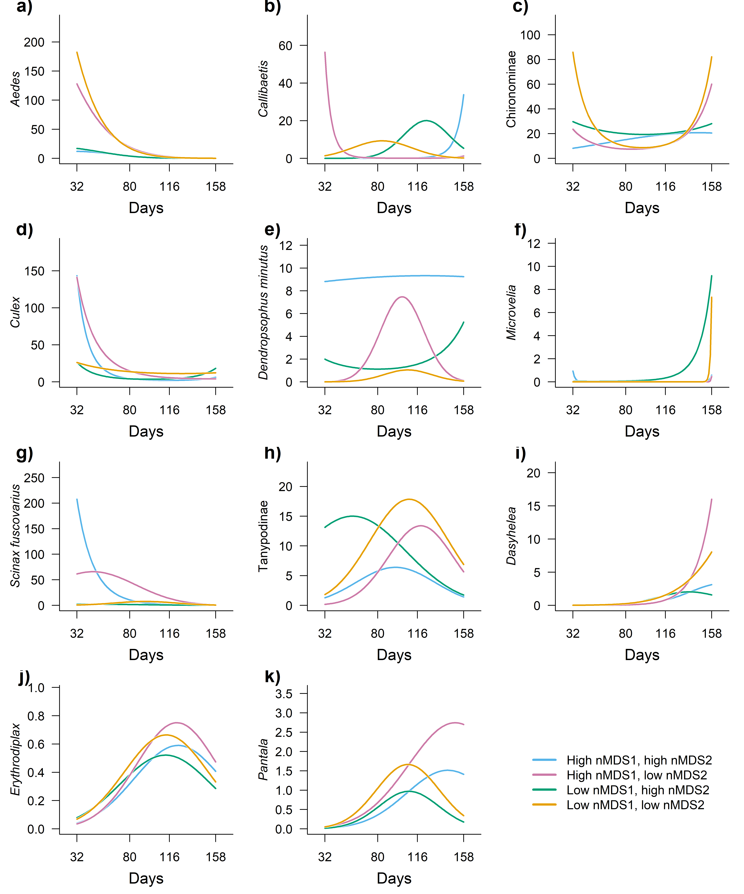
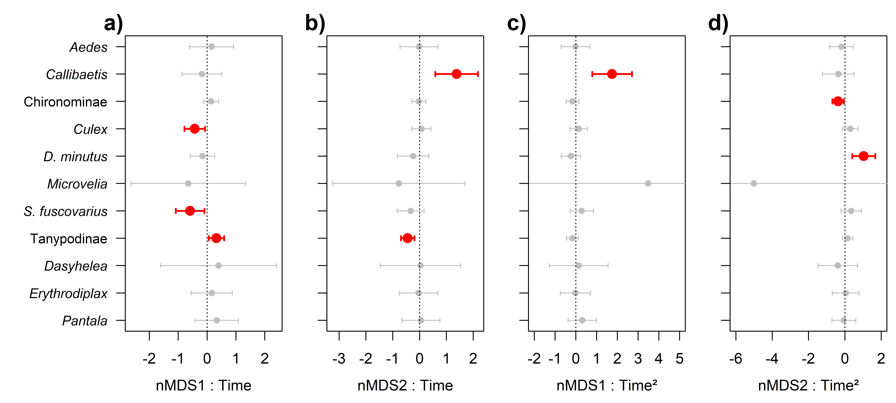
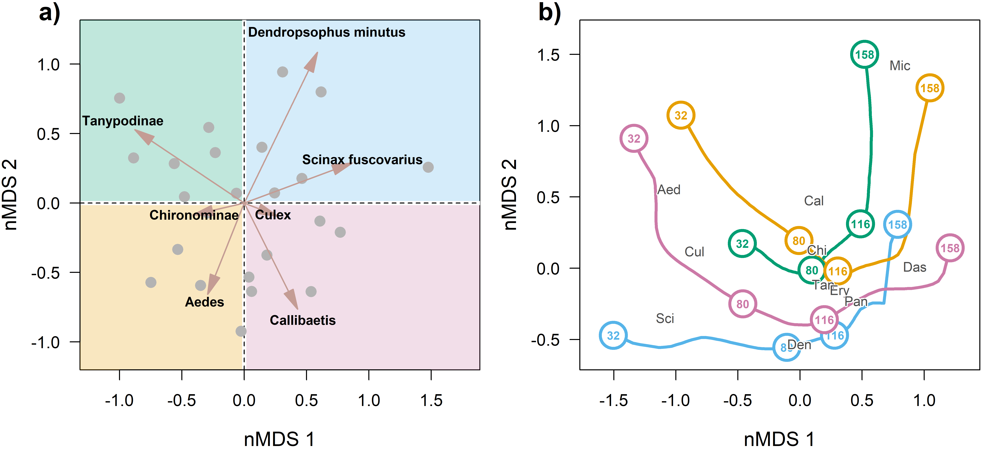
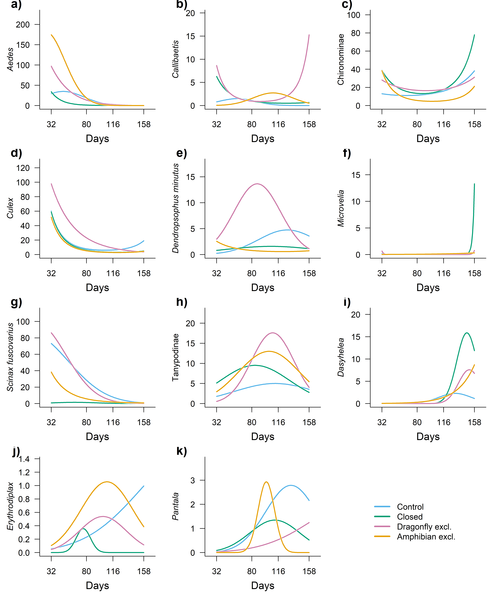
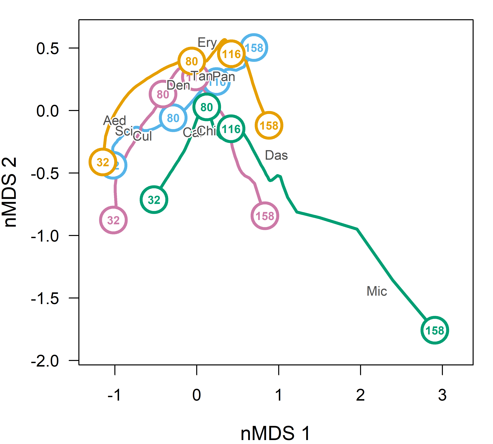

Effect of first survey on the effect of time
================
Rodolfo Pelinson
2026-04-23

## Loading packages and functions

``` r
source(paste(sep = "/",dir,"functions/pairwise_gllvm.R"))
source(paste(sep = "/",dir,"functions/pairwise_mvabund.R"))
source(paste(sep = "/",dir,"functions/my.anova.gllvm.R"))
source(paste(sep = "/",dir,"functions/My_coefplot.R"))
source(paste(sep = "/",dir,"functions/remove_sp.R"))
source(paste(sep = "/",dir,"functions/extract_mles.R"))
source(paste(sep = "/",dir,"functions/my_ordiplot.R"))
source(paste(sep = "/",dir,"functions/get_scaled_lvs.R"))
source(paste(sep = "/",dir,"functions/text_contour.R"))
source(paste(sep = "/",dir,"functions/letters.R"))
```

``` r
library(vegan)
library(gllvm)
library(mvabund)
library(DHARMa)
library(glmmTMB)
library(vioplot)
library(yarrr)
library(colorspace)
```

``` r
sessionInfo()
```

    ## R version 4.5.2 (2025-10-31 ucrt)
    ## Platform: x86_64-w64-mingw32/x64
    ## Running under: Windows 11 x64 (build 26200)
    ## 
    ## Matrix products: default
    ##   LAPACK version 3.12.1
    ## 
    ## locale:
    ## [1] LC_COLLATE=Portuguese_Brazil.utf8  LC_CTYPE=Portuguese_Brazil.utf8   
    ## [3] LC_MONETARY=Portuguese_Brazil.utf8 LC_NUMERIC=C                      
    ## [5] LC_TIME=Portuguese_Brazil.utf8    
    ## 
    ## time zone: Europe/London
    ## tzcode source: internal
    ## 
    ## attached base packages:
    ## [1] stats     graphics  grDevices utils     datasets  methods   base     
    ## 
    ## other attached packages:
    ##  [1] colorspace_2.1-2       yarrr_0.1.14           circlize_0.4.17       
    ##  [4] BayesFactor_0.9.12-4.8 Matrix_1.7-4           coda_0.19-4.1         
    ##  [7] jpeg_0.1-11            vioplot_0.5.1          zoo_1.8-15            
    ## [10] sm_2.2-6.0             glmmTMB_1.1.14         DHARMa_0.4.7          
    ## [13] mvabund_4.2.8          gllvm_2.0.5            TMB_1.9.20            
    ## [16] vegan_2.7-3            permute_0.9-10        
    ## 
    ## loaded via a namespace (and not attached):
    ##  [1] sandwich_3.1-1      shape_1.4.6.1       stringi_1.8.7      
    ##  [4] lattice_0.22-7      magrittr_2.0.4      lme4_2.0-1         
    ##  [7] digest_0.6.39       evaluate_1.0.5      grid_4.5.2         
    ## [10] estimability_1.5.1  mvtnorm_1.3-6       fastmap_1.2.0      
    ## [13] GlobalOptions_0.1.3 mgcv_1.9-3          pbapply_1.7-4      
    ## [16] numDeriv_2016.8-1.1 reformulas_0.4.4    Rdpack_2.6.6       
    ## [19] cli_3.6.5           rlang_1.1.7         rbibutils_2.4.1    
    ## [22] splines_4.5.2       yaml_2.3.12         otel_0.2.0         
    ## [25] tools_4.5.2         parallel_4.5.2      MatrixModels_0.5-4 
    ## [28] nloptr_2.2.1        minqa_1.2.8         boot_1.3-32        
    ## [31] lifecycle_1.0.5     emmeans_2.0.2       stringr_1.6.0      
    ## [34] tweedie_3.0.17      MASS_7.3-65         cluster_2.1.8.1    
    ## [37] glue_1.8.0          Rcpp_1.1.1          statmod_1.5.1      
    ## [40] xfun_0.57           rstudioapi_0.18.0   knitr_1.51         
    ## [43] xtable_1.8-8        htmltools_0.5.9     nlme_3.1-168       
    ## [46] rmarkdown_2.31      compiler_4.5.2      alabama_2025.1.0

## Loading and preparing data

``` r
source(paste(sep = "/",dir,"ajeitando_planilhas.R"))
```

``` r
comm_all_drop_atrasado <- comm_all[Exp_design_all$treatments != "atrasado",]
Exp_design_all_drop_atrasado <- Exp_design_all[Exp_design_all$treatments != "atrasado",]

ncol(comm_all_drop_atrasado)
```

    ## [1] 26

``` r
comm_all_drop_atrasado_rm <- remove_sp(comm_all_drop_atrasado, 10)
ncol(comm_all_drop_atrasado_rm)
```

    ## [1] 11

``` r
Exp_design_all_drop_atrasado$treatments_AM <- paste(Exp_design_all_drop_atrasado$treatments, Exp_design_all_drop_atrasado$AM, sep="_")

Exp_design_all_drop_atrasado$AM_numeric <- as.numeric(Exp_design_all_drop_atrasado$AM)

Exp_design_all_drop_atrasado$treatments <- as.factor(Exp_design_all_drop_atrasado$treatments)

AM_days <- as.numeric(Exp_design_all_drop_atrasado$AM)
AM_days[AM_days == 1] <- 32
AM_days[AM_days == 2] <- 80
AM_days[AM_days == 3] <- 116
AM_days[AM_days == 4] <- 158

AM_days_sc <- scale(AM_days)

Exp_design_all_drop_atrasado$AM_days_sc <- c(AM_days_sc)
Exp_design_all_drop_atrasado$AM_days_sc_squared <- c(AM_days_sc)^2

Exp_design_all_drop_atrasado$AM_days <- c(AM_days)
Exp_design_all_drop_atrasado$AM_days_squared <- c(AM_days)^2


comm_AM1 <- comm_all_drop_atrasado_rm[Exp_design_all_drop_atrasado$AM == 1,]
comm_AM1_rm <- remove_sp(comm_AM1, 3)


comm_AM1_pred <- rbind(comm_AM1_rm, comm_AM1_rm, comm_AM1_rm, comm_AM1_rm)

nrow(comm_AM1_pred)
```

    ## [1] 96

``` r
nrow(Exp_design_all_drop_atrasado)
```

    ## [1] 96

``` r
nrow(comm_all_drop_atrasado_rm)
```

    ## [1] 96

``` r
comm_AM1_pred_st <- decostand(comm_AM1_pred, "stand")
colnames(comm_AM1_pred_st) <- gsub(" ", "_", colnames(comm_AM1_pred_st))

predictors <- data.frame(Exp_design_all_drop_atrasado, comm_AM1_pred_st)
```

## Using NMDS to describe initial communities.

``` r
comm_AM1_rm_total <- data.frame(decostand(comm_AM1_rm, method = "total", MARGIN = 2))
nmds_comm_AM1_rm_total <- metaMDS(comm_AM1_rm_total, distance  = "bray", k = 2)
```

    ## Run 0 stress 0.1917598 
    ## Run 1 stress 0.2382917 
    ## Run 2 stress 0.2425035 
    ## Run 3 stress 0.1917598 
    ## ... New best solution
    ## ... Procrustes: rmse 6.285379e-06  max resid 1.827813e-05 
    ## ... Similar to previous best
    ## Run 4 stress 0.1917598 
    ## ... New best solution
    ## ... Procrustes: rmse 1.359321e-06  max resid 4.509896e-06 
    ## ... Similar to previous best
    ## Run 5 stress 0.2355307 
    ## Run 6 stress 0.239971 
    ## Run 7 stress 0.1917598 
    ## ... New best solution
    ## ... Procrustes: rmse 4.538862e-06  max resid 1.59568e-05 
    ## ... Similar to previous best
    ## Run 8 stress 0.2453533 
    ## Run 9 stress 0.1917598 
    ## ... New best solution
    ## ... Procrustes: rmse 1.828512e-06  max resid 5.715528e-06 
    ## ... Similar to previous best
    ## Run 10 stress 0.2328797 
    ## Run 11 stress 0.2297682 
    ## Run 12 stress 0.260807 
    ## Run 13 stress 0.1917598 
    ## ... Procrustes: rmse 5.34883e-06  max resid 1.993142e-05 
    ## ... Similar to previous best
    ## Run 14 stress 0.1917598 
    ## ... Procrustes: rmse 1.022296e-06  max resid 2.243866e-06 
    ## ... Similar to previous best
    ## Run 15 stress 0.2331494 
    ## Run 16 stress 0.2297681 
    ## Run 17 stress 0.1917598 
    ## ... Procrustes: rmse 1.728845e-06  max resid 5.023868e-06 
    ## ... Similar to previous best
    ## Run 18 stress 0.2328797 
    ## Run 19 stress 0.1917598 
    ## ... Procrustes: rmse 3.615144e-06  max resid 1.287075e-05 
    ## ... Similar to previous best
    ## Run 20 stress 0.2374871 
    ## *** Best solution repeated 5 times

``` r
comm_AM1_nmds <- data.frame(nmds_comm_AM1_rm_total$points)
comm_AM1_nmds_st <- decostand(comm_AM1_nmds, method = "stand")

comm_AM1_nmds_st_pred <- rbind(comm_AM1_nmds_st, comm_AM1_nmds_st, comm_AM1_nmds_st, comm_AM1_nmds_st)

predictors_nmds <- data.frame(Exp_design_all_drop_atrasado, comm_AM1_nmds_st_pred)
```

### Testing for effects

``` r
nrow(predictors_nmds)
```

    ## [1] 96

``` r
nrow(comm_all_drop_atrasado_rm)
```

    ## [1] 96

``` r
set.seed(1)
control <- permute::how(within = permute::Within(type = 'free'),
                        plots = Plots(strata = predictors_nmds$sites, type = 'free'),
                        nperm = 999)
permutations <- shuffleSet(nrow(comm_all_drop_atrasado_rm), control = control)


comm_all_drop_atrasado_mvabund <- mvabund(comm_all_drop_atrasado_rm)

mod_full_lin <- manyglm(comm_all_drop_atrasado_mvabund ~ block2 + ( MDS1 + MDS2 ) + AM_days_sc + AM_days_sc:( MDS1 + MDS2 ), family="negative.binomial",  data = predictors_nmds, composition = FALSE)

mod_full_quad <- manyglm(comm_all_drop_atrasado_mvabund ~ block2 + ( MDS1 + MDS2 ) + AM_days_sc + AM_days_sc_squared + AM_days_sc:( MDS1 + MDS2 ) + AM_days_sc_squared:( MDS1 + MDS2 ), family="negative.binomial",  data = predictors_nmds, composition = FALSE)

anova_quadratic_test <- anova(mod_full_lin, mod_full_quad, bootID = permutations, show.time = "all", cor.type = "I", test = "LR", resamp = "pit.trap")
```

    ## Using <int> bootID matrix from input. 
    ## Resampling begins for test 1.
    ##  Resampling run 0 finished. Time elapsed: 0.00 minutes...
    ##  Resampling run 100 finished. Time elapsed: 0.05 minutes...
    ##  Resampling run 200 finished. Time elapsed: 0.11 minutes...
    ##  Resampling run 300 finished. Time elapsed: 0.17 minutes...
    ##  Resampling run 400 finished. Time elapsed: 0.23 minutes...
    ##  Resampling run 500 finished. Time elapsed: 0.29 minutes...
    ##  Resampling run 600 finished. Time elapsed: 0.35 minutes...
    ##  Resampling run 700 finished. Time elapsed: 0.41 minutes...
    ##  Resampling run 800 finished. Time elapsed: 0.46 minutes...
    ##  Resampling run 900 finished. Time elapsed: 0.52 minutes...
    ## Time elapsed: 0 hr 0 min 35 sec

``` r
anova_quadratic_test
```

    ## Analysis of Deviance Table
    ## 
    ## mod_full_lin: comm_all_drop_atrasado_mvabund ~ block2 + (MDS1 + MDS2) + AM_days_sc + AM_days_sc:(MDS1 + MDS2)
    ## mod_full_quad: comm_all_drop_atrasado_mvabund ~ block2 + (MDS1 + MDS2) + AM_days_sc + AM_days_sc_squared + AM_days_sc:(MDS1 + MDS2) + AM_days_sc_squared:(MDS1 + MDS2)
    ## 
    ## Multivariate test:
    ##               Res.Df Df.diff   Dev Pr(>Dev)   
    ## mod_full_lin      88                          
    ## mod_full_quad     85       3 126.8    0.007 **
    ## ---
    ## Signif. codes:  0 '***' 0.001 '**' 0.01 '*' 0.05 '.' 0.1 ' ' 1
    ## Arguments:
    ##  Test statistics calculated assuming uncorrelated response (for faster computation) 
    ##  P-value calculated using 999 iterations via PIT-trap resampling.

``` r
########################################################
mod_block <- manyglm(comm_all_drop_atrasado_mvabund ~ block2 + ( MDS1 + MDS2 ) + AM_days_sc + AM_days_sc_squared, family="negative.binomial",  data = predictors_nmds, composition = FALSE)

mod_no_block <- manyglm(comm_all_drop_atrasado_mvabund ~ ( MDS1 + MDS2 ) + AM_days_sc + AM_days_sc_squared, family="negative.binomial",  data = predictors_nmds, composition = FALSE)

anova_block <- anova(mod_no_block, mod_block, bootID = permutations, show.block = "all", cor.type = "I", test = "LR", resamp = "pit.trap")
```

    ## Warning in anova.manyglm(mod_no_block, mod_block, bootID = permutations, :
    ## show.block is not a manyglm object nor a valid argument- removed from input,
    ## default value is used instead.

    ## Using <int> bootID matrix from input. 
    ## Time elapsed: 0 hr 0 min 23 sec

``` r
anova_block
```

    ## Analysis of Deviance Table
    ## 
    ## mod_no_block: comm_all_drop_atrasado_mvabund ~ (MDS1 + MDS2) + AM_days_sc + AM_days_sc_squared
    ## mod_block: comm_all_drop_atrasado_mvabund ~ block2 + (MDS1 + MDS2) + AM_days_sc + AM_days_sc_squared
    ## 
    ## Multivariate test:
    ##              Res.Df Df.diff   Dev Pr(>Dev)   
    ## mod_no_block     91                          
    ## mod_block        89       2 70.02    0.002 **
    ## ---
    ## Signif. codes:  0 '***' 0.001 '**' 0.01 '*' 0.05 '.' 0.1 ' ' 1
    ## Arguments:
    ##  Test statistics calculated assuming uncorrelated response (for faster computation) 
    ##  P-value calculated using 999 iterations via PIT-trap resampling.

``` r
########################################################


mod_time <- manyglm(comm_all_drop_atrasado_mvabund ~ block2 + ( MDS1 + MDS2 ) + AM_days_sc + AM_days_sc_squared, family="negative.binomial",  data = predictors_nmds, composition = FALSE)

mod_no_time <- manyglm(comm_all_drop_atrasado_mvabund ~ block2 + ( MDS1 + MDS2 ), family="negative.binomial",  data = predictors_nmds, composition = FALSE)

anova_time <- anova(mod_no_time, mod_time, bootID = permutations, show.time = "all", cor.type = "I", test = "LR", resamp = "pit.trap")
```

    ## Using <int> bootID matrix from input. 
    ## Resampling begins for test 1.
    ##  Resampling run 0 finished. Time elapsed: 0.00 minutes...
    ##  Resampling run 100 finished. Time elapsed: 0.03 minutes...
    ##  Resampling run 200 finished. Time elapsed: 0.07 minutes...
    ##  Resampling run 300 finished. Time elapsed: 0.10 minutes...
    ##  Resampling run 400 finished. Time elapsed: 0.14 minutes...
    ##  Resampling run 500 finished. Time elapsed: 0.17 minutes...
    ##  Resampling run 600 finished. Time elapsed: 0.20 minutes...
    ##  Resampling run 700 finished. Time elapsed: 0.24 minutes...
    ##  Resampling run 800 finished. Time elapsed: 0.27 minutes...
    ##  Resampling run 900 finished. Time elapsed: 0.31 minutes...
    ## Time elapsed: 0 hr 0 min 20 sec

``` r
anova_time
```

    ## Analysis of Deviance Table
    ## 
    ## mod_no_time: comm_all_drop_atrasado_mvabund ~ block2 + (MDS1 + MDS2)
    ## mod_time: comm_all_drop_atrasado_mvabund ~ block2 + (MDS1 + MDS2) + AM_days_sc + AM_days_sc_squared
    ## 
    ## Multivariate test:
    ##             Res.Df Df.diff   Dev Pr(>Dev)    
    ## mod_no_time     91                           
    ## mod_time        89       2 258.7    0.001 ***
    ## ---
    ## Signif. codes:  0 '***' 0.001 '**' 0.01 '*' 0.05 '.' 0.1 ' ' 1
    ## Arguments:
    ##  Test statistics calculated assuming uncorrelated response (for faster computation) 
    ##  P-value calculated using 999 iterations via PIT-trap resampling.

``` r
########################################################


mod_prior <- manyglm(comm_all_drop_atrasado_mvabund ~ block2 + ( MDS1 + MDS2 ) + AM_days_sc + AM_days_sc_squared, family="negative.binomial",  data = predictors_nmds, composition = FALSE)

mod_no_prior <- manyglm(comm_all_drop_atrasado_mvabund ~ block2 + AM_days_sc + AM_days_sc_squared, family="negative.binomial",  data = predictors_nmds, composition = FALSE)

anova_prior <- anova(mod_no_prior, mod_prior, bootID = permutations, show.time = "all", cor.type = "I", test = "LR", resamp = "pit.trap")
```

    ## Using <int> bootID matrix from input. 
    ## Resampling begins for test 1.
    ##  Resampling run 0 finished. Time elapsed: 0.00 minutes...
    ##  Resampling run 100 finished. Time elapsed: 0.03 minutes...
    ##  Resampling run 200 finished. Time elapsed: 0.07 minutes...
    ##  Resampling run 300 finished. Time elapsed: 0.10 minutes...
    ##  Resampling run 400 finished. Time elapsed: 0.13 minutes...
    ##  Resampling run 500 finished. Time elapsed: 0.17 minutes...
    ##  Resampling run 600 finished. Time elapsed: 0.20 minutes...
    ##  Resampling run 700 finished. Time elapsed: 0.23 minutes...
    ##  Resampling run 800 finished. Time elapsed: 0.27 minutes...
    ##  Resampling run 900 finished. Time elapsed: 0.30 minutes...
    ## Time elapsed: 0 hr 0 min 19 sec

``` r
anova_prior
```

    ## Analysis of Deviance Table
    ## 
    ## mod_no_prior: comm_all_drop_atrasado_mvabund ~ block2 + AM_days_sc + AM_days_sc_squared
    ## mod_prior: comm_all_drop_atrasado_mvabund ~ block2 + (MDS1 + MDS2) + AM_days_sc + AM_days_sc_squared
    ## 
    ## Multivariate test:
    ##              Res.Df Df.diff   Dev Pr(>Dev)   
    ## mod_no_prior     91                          
    ## mod_prior        89       2 59.44    0.007 **
    ## ---
    ## Signif. codes:  0 '***' 0.001 '**' 0.01 '*' 0.05 '.' 0.1 ' ' 1
    ## Arguments:
    ##  Test statistics calculated assuming uncorrelated response (for faster computation) 
    ##  P-value calculated using 999 iterations via PIT-trap resampling.

``` r
########################################################
mod_no_int <- manyglm(comm_all_drop_atrasado_mvabund ~ block2 + ( MDS1 + MDS2 ) + AM_days_sc + AM_days_sc_squared, family="negative.binomial",  data = predictors_nmds, composition = FALSE)

mod_int <- manyglm(comm_all_drop_atrasado_mvabund ~ block2 + ( MDS1 + MDS2 ) + AM_days_sc + AM_days_sc_squared + AM_days_sc:( MDS1 + MDS2 ) + AM_days_sc_squared:( MDS1 + MDS2 ), family="negative.binomial",  data = predictors_nmds, composition = FALSE)

anova_interaction <- anova(mod_no_int, mod_int, bootID = permutations, show.time = "all", cor.type = "I", test = "LR", resamp = "pit.trap")
```

    ## Using <int> bootID matrix from input. 
    ## Resampling begins for test 1.
    ##  Resampling run 0 finished. Time elapsed: 0.00 minutes...
    ##  Resampling run 100 finished. Time elapsed: 0.05 minutes...
    ##  Resampling run 200 finished. Time elapsed: 0.10 minutes...
    ##  Resampling run 300 finished. Time elapsed: 0.15 minutes...
    ##  Resampling run 400 finished. Time elapsed: 0.20 minutes...
    ##  Resampling run 500 finished. Time elapsed: 0.25 minutes...
    ##  Resampling run 600 finished. Time elapsed: 0.30 minutes...
    ##  Resampling run 700 finished. Time elapsed: 0.35 minutes...
    ##  Resampling run 800 finished. Time elapsed: 0.40 minutes...
    ##  Resampling run 900 finished. Time elapsed: 0.45 minutes...
    ## Time elapsed: 0 hr 0 min 29 sec

``` r
anova_interaction
```

    ## Analysis of Deviance Table
    ## 
    ## mod_no_int: comm_all_drop_atrasado_mvabund ~ block2 + (MDS1 + MDS2) + AM_days_sc + AM_days_sc_squared
    ## mod_int: comm_all_drop_atrasado_mvabund ~ block2 + (MDS1 + MDS2) + AM_days_sc + AM_days_sc_squared + AM_days_sc:(MDS1 + MDS2) + AM_days_sc_squared:(MDS1 + MDS2)
    ## 
    ## Multivariate test:
    ##            Res.Df Df.diff   Dev Pr(>Dev)    
    ## mod_no_int     89                           
    ## mod_int        85       4 81.74    0.001 ***
    ## ---
    ## Signif. codes:  0 '***' 0.001 '**' 0.01 '*' 0.05 '.' 0.1 ' ' 1
    ## Arguments:
    ##  Test statistics calculated assuming uncorrelated response (for faster computation) 
    ##  P-value calculated using 999 iterations via PIT-trap resampling.

Which are the species who have at least one of the coefficients for the
effect of time in interaction with the effect of the first survey whose
confidence interval do not include zero?

``` r
coefs <- mod_int$coefficients
LCL <- coefs + mod_int$stderr.coefficients * qnorm(0.025) 
UCL <- coefs + mod_int$stderr.coefficients * qnorm(0.975) 

coefs[LCL < 0 &  UCL > 0] <- NA

coefs <- coefs[-c(1:7),]

coefs <- coefs[, colSums(coefs, na.rm = TRUE) != 0]
```

### Making predictions for plotting

``` r
#High abundances of 
#Aedes
#Culex
#Dendropsophus_minutus
#Tanypodinae
#Callibaetis
#Culex

new_data_AB_high_MDS1_high_MDS2 <- 
  data.frame(AM_days_sc = seq(from = min(Exp_design_all_drop_atrasado$AM_days_sc), to = max(Exp_design_all_drop_atrasado$AM_days_sc), length.out = 100),
                                AM_days_sc_squared = seq(from = min(Exp_design_all_drop_atrasado$AM_days_sc), to = max(Exp_design_all_drop_atrasado$AM_days_sc), length.out = 100)^2,
                                block2 = factor(rep("AB", 100), levels = levels(as.factor(Exp_design_all_drop_atrasado$block2))),
             MDS1 = rep(quantile(predictors_nmds$MDS1, 0.9), 100),
             MDS2 = rep(quantile(predictors_nmds$MDS2, 0.9), 100))

new_data_CD_high_MDS1_high_MDS2 <- 
  data.frame(AM_days_sc = seq(from = min(Exp_design_all_drop_atrasado$AM_days_sc), to = max(Exp_design_all_drop_atrasado$AM_days_sc), length.out = 100),
                                AM_days_sc_squared = seq(from = min(Exp_design_all_drop_atrasado$AM_days_sc), to = max(Exp_design_all_drop_atrasado$AM_days_sc), length.out = 100)^2,
                                block2 = factor(rep("CD", 100), levels = levels(as.factor(Exp_design_all_drop_atrasado$block2))),
             MDS1 = rep(quantile(predictors_nmds$MDS1, 0.9), 100),
             MDS2 = rep(quantile(predictors_nmds$MDS2, 0.9), 100))


new_data_EF_high_MDS1_high_MDS2 <- 
  data.frame(AM_days_sc = seq(from = min(Exp_design_all_drop_atrasado$AM_days_sc), to = max(Exp_design_all_drop_atrasado$AM_days_sc), length.out = 100),
                                AM_days_sc_squared = seq(from = min(Exp_design_all_drop_atrasado$AM_days_sc), to = max(Exp_design_all_drop_atrasado$AM_days_sc), length.out = 100)^2,
                                block2 = factor(rep("EF", 100), levels = levels(as.factor(Exp_design_all_drop_atrasado$block2))),
             MDS1 = rep(quantile(predictors_nmds$MDS1, 0.9), 100),
             MDS2 = rep(quantile(predictors_nmds$MDS2, 0.9), 100))


###########################################################################################


new_data_AB_low_MDS1_high_MDS2 <- 
  data.frame(AM_days_sc = seq(from = min(Exp_design_all_drop_atrasado$AM_days_sc), to = max(Exp_design_all_drop_atrasado$AM_days_sc), length.out = 100),
                                AM_days_sc_squared = seq(from = min(Exp_design_all_drop_atrasado$AM_days_sc), to = max(Exp_design_all_drop_atrasado$AM_days_sc), length.out = 100)^2,
                                block2 = factor(rep("AB", 100), levels = levels(as.factor(Exp_design_all_drop_atrasado$block2))),
             MDS1 = rep(quantile(predictors_nmds$MDS1, 0.1), 100),
             MDS2 = rep(quantile(predictors_nmds$MDS2, 0.9), 100))

new_data_CD_low_MDS1_high_MDS2 <- 
  data.frame(AM_days_sc = seq(from = min(Exp_design_all_drop_atrasado$AM_days_sc), to = max(Exp_design_all_drop_atrasado$AM_days_sc), length.out = 100),
                                AM_days_sc_squared = seq(from = min(Exp_design_all_drop_atrasado$AM_days_sc), to = max(Exp_design_all_drop_atrasado$AM_days_sc), length.out = 100)^2,
                                block2 = factor(rep("CD", 100), levels = levels(as.factor(Exp_design_all_drop_atrasado$block2))),
             MDS1 = rep(quantile(predictors_nmds$MDS1, 0.1), 100),
             MDS2 = rep(quantile(predictors_nmds$MDS2, 0.9), 100))


new_data_EF_low_MDS1_high_MDS2 <- 
  data.frame(AM_days_sc = seq(from = min(Exp_design_all_drop_atrasado$AM_days_sc), to = max(Exp_design_all_drop_atrasado$AM_days_sc), length.out = 100),
                                AM_days_sc_squared = seq(from = min(Exp_design_all_drop_atrasado$AM_days_sc), to = max(Exp_design_all_drop_atrasado$AM_days_sc), length.out = 100)^2,
                                block2 = factor(rep("EF", 100), levels = levels(as.factor(Exp_design_all_drop_atrasado$block2))),
             MDS1 = rep(quantile(predictors_nmds$MDS1, 0.1), 100),
             MDS2 = rep(quantile(predictors_nmds$MDS2, 0.9), 100))


###########################################################################################


new_data_AB_low_MDS1_low_MDS2 <- 
  data.frame(AM_days_sc = seq(from = min(Exp_design_all_drop_atrasado$AM_days_sc), to = max(Exp_design_all_drop_atrasado$AM_days_sc), length.out = 100),
                                AM_days_sc_squared = seq(from = min(Exp_design_all_drop_atrasado$AM_days_sc), to = max(Exp_design_all_drop_atrasado$AM_days_sc), length.out = 100)^2,
                                block2 = factor(rep("AB", 100), levels = levels(as.factor(Exp_design_all_drop_atrasado$block2))),
             MDS1 = rep(quantile(predictors_nmds$MDS1, 0.1), 100),
             MDS2 = rep(quantile(predictors_nmds$MDS2, 0.1), 100))

new_data_CD_low_MDS1_low_MDS2 <- 
  data.frame(AM_days_sc = seq(from = min(Exp_design_all_drop_atrasado$AM_days_sc), to = max(Exp_design_all_drop_atrasado$AM_days_sc), length.out = 100),
                                AM_days_sc_squared = seq(from = min(Exp_design_all_drop_atrasado$AM_days_sc), to = max(Exp_design_all_drop_atrasado$AM_days_sc), length.out = 100)^2,
                                block2 = factor(rep("CD", 100), levels = levels(as.factor(Exp_design_all_drop_atrasado$block2))),
             MDS1 = rep(quantile(predictors_nmds$MDS1, 0.1), 100),
             MDS2 = rep(quantile(predictors_nmds$MDS2, 0.1), 100))


new_data_EF_low_MDS1_low_MDS2 <- 
  data.frame(AM_days_sc = seq(from = min(Exp_design_all_drop_atrasado$AM_days_sc), to = max(Exp_design_all_drop_atrasado$AM_days_sc), length.out = 100),
                                AM_days_sc_squared = seq(from = min(Exp_design_all_drop_atrasado$AM_days_sc), to = max(Exp_design_all_drop_atrasado$AM_days_sc), length.out = 100)^2,
                                block2 = factor(rep("EF", 100), levels = levels(as.factor(Exp_design_all_drop_atrasado$block2))),
             MDS1 = rep(quantile(predictors_nmds$MDS1, 0.1), 100),
             MDS2 = rep(quantile(predictors_nmds$MDS2, 0.1), 100))


###########################################################################################


new_data_AB_high_MDS1_low_MDS2 <- 
  data.frame(AM_days_sc = seq(from = min(Exp_design_all_drop_atrasado$AM_days_sc), to = max(Exp_design_all_drop_atrasado$AM_days_sc), length.out = 100),
                                AM_days_sc_squared = seq(from = min(Exp_design_all_drop_atrasado$AM_days_sc), to = max(Exp_design_all_drop_atrasado$AM_days_sc), length.out = 100)^2,
                                block2 = factor(rep("AB", 100), levels = levels(as.factor(Exp_design_all_drop_atrasado$block2))),
             MDS1 = rep(quantile(predictors_nmds$MDS1, 0.9), 100),
             MDS2 = rep(quantile(predictors_nmds$MDS2, 0.1), 100))

new_data_CD_high_MDS1_low_MDS2 <- 
  data.frame(AM_days_sc = seq(from = min(Exp_design_all_drop_atrasado$AM_days_sc), to = max(Exp_design_all_drop_atrasado$AM_days_sc), length.out = 100),
                                AM_days_sc_squared = seq(from = min(Exp_design_all_drop_atrasado$AM_days_sc), to = max(Exp_design_all_drop_atrasado$AM_days_sc), length.out = 100)^2,
                                block2 = factor(rep("CD", 100), levels = levels(as.factor(Exp_design_all_drop_atrasado$block2))),
             MDS1 = rep(quantile(predictors_nmds$MDS1, 0.9), 100),
             MDS2 = rep(quantile(predictors_nmds$MDS2, 0.1), 100))


new_data_EF_high_MDS1_low_MDS2 <- 
  data.frame(AM_days_sc = seq(from = min(Exp_design_all_drop_atrasado$AM_days_sc), to = max(Exp_design_all_drop_atrasado$AM_days_sc), length.out = 100),
                                AM_days_sc_squared = seq(from = min(Exp_design_all_drop_atrasado$AM_days_sc), to = max(Exp_design_all_drop_atrasado$AM_days_sc), length.out = 100)^2,
                                block2 = factor(rep("EF", 100), levels = levels(as.factor(Exp_design_all_drop_atrasado$block2))),
             MDS1 = rep(quantile(predictors_nmds$MDS1, 0.9), 100),
             MDS2 = rep(quantile(predictors_nmds$MDS2, 0.1), 100))


###########################################################################################


###########################################################################################


AB_high_MDS1_high_MDS2 <- predict.manyglm(mod_int, newdata = new_data_AB_high_MDS1_high_MDS2, type = "response")
```

    ## Warning: glm.fit: algoritmo não convergiu

``` r
CD_high_MDS1_high_MDS2 <- predict.manyglm(mod_int, newdata = new_data_CD_high_MDS1_high_MDS2, type = "response")
```

    ## Warning: glm.fit: algoritmo não convergiu

``` r
EF_high_MDS1_high_MDS2 <- predict.manyglm(mod_int, newdata = new_data_EF_high_MDS1_high_MDS2, type = "response")
```

    ## Warning: glm.fit: algoritmo não convergiu

``` r
high_MDS1_high_MDS2 <- array(NA, dim = c(nrow(AB_high_MDS1_high_MDS2), ncol(AB_high_MDS1_high_MDS2), 3))
high_MDS1_high_MDS2[,,1] <- AB_high_MDS1_high_MDS2
high_MDS1_high_MDS2[,,2] <- CD_high_MDS1_high_MDS2
high_MDS1_high_MDS2[,,3] <- EF_high_MDS1_high_MDS2

high_MDS1_high_MDS2_mean <- as.data.frame(apply(high_MDS1_high_MDS2, MARGIN = c(1,2), FUN = mean))
colnames(high_MDS1_high_MDS2_mean) <- colnames(AB_high_MDS1_high_MDS2)
high_MDS1_high_MDS2_mean
```

    ##           Aedes Callibaetis Chironominae      Culex Dendropsophus.minutus
    ## 1   12.01677253  0.04577938     8.171946 143.338570              8.817862
    ## 2   11.97663450  0.04350416     8.342179 125.940585              8.831702
    ## 3   11.92138314  0.04144146     8.513993 110.874945              8.845366
    ## 4   11.85122901  0.03957149     8.687340  97.806157              8.858856
    ## 5   11.76643849  0.03787678     8.862170  86.449811              8.872168
    ## 6   11.66733215  0.03634185     9.038432  76.564415              8.885304
    ## 7   11.55428268  0.03495298     9.216072  67.944603              8.898262
    ## 8   11.42771260  0.03369804     9.395035  60.415452              8.911040
    ## 9   11.28809160  0.03256629     9.575262  53.827742              8.923639
    ## 10  11.13593365  0.03154824     9.756694  48.053980              8.936058
    ## 11  10.97179384  0.03063552     9.939270  42.985070              8.948295
    ## 12  10.79626502  0.02982076    10.122925  38.527514              8.960350
    ## 13  10.60997423  0.02909747    10.307594  34.601060              8.972222
    ## 14  10.41357899  0.02846002    10.493210  31.136722              8.983910
    ## 15  10.20776343  0.02790348    10.679702  28.075109              8.995414
    ## 16   9.99323433  0.02742361    10.867001  25.365013              9.006732
    ## 17   9.77071714  0.02701682    11.055032  22.962215              9.017865
    ## 18   9.54095185  0.02668008    11.243721  20.828479              9.028811
    ## 19   9.30468900  0.02641090    11.432991  18.930688              9.039570
    ## 20   9.06268560  0.02620732    11.622764  17.240121              9.050141
    ## 21   8.81570116  0.02606785    11.812960  15.731832              9.060522
    ## 22   8.56449382  0.02599148    12.003497  14.384122              9.070715
    ## 23   8.30981652  0.02597767    12.194293  13.178090              9.080717
    ## 24   8.05241341  0.02602630    12.385261  12.097250              9.090529
    ## 25   7.79301634  0.02613774    12.576318  11.127201              9.100149
    ## 26   7.53234154  0.02631279    12.767374  10.255345              9.109577
    ## 27   7.27108657  0.02655271    12.958341   9.470648              9.118812
    ## 28   7.00992742  0.02685927    13.149129   8.763431              9.127855
    ## 29   6.74951584  0.02723471    13.339646   8.125193              9.136703
    ## 30   6.49047700  0.02768182    13.529801   7.548459              9.145357
    ## 31   6.23340728  0.02820393    13.719499   7.026645              9.153816
    ## 32   5.97887242  0.02880500    13.908645   6.553945              9.162079
    ## 33   5.72740591  0.02948964    14.097145   6.125233              9.170147
    ## 34   5.47950761  0.03026316    14.284902   5.735978              9.178017
    ## 35   5.23564269  0.03113166    14.471819   5.382171              9.185691
    ## 36   4.99624077  0.03210211    14.657798   5.060256              9.193167
    ## 37   4.76169543  0.03318242    14.842740   4.767082              9.200445
    ## 38   4.53236379  0.03438158    15.026547   4.499848              9.207524
    ## 39   4.30856653  0.03570975    15.209119   4.256063              9.214404
    ## 40   4.09058800  0.03717843    15.390356   4.033512              9.221084
    ## 41   3.87867661  0.03880061    15.570158   3.830221              9.227565
    ## 42   3.67304539  0.04059096    15.748426   3.644427              9.233845
    ## 43   3.47387282  0.04256605    15.925058   3.474560              9.239924
    ## 44   3.28130370  0.04474459    16.099954   3.319215              9.245802
    ## 45   3.09545030  0.04714776    16.273015   3.177138              9.251478
    ## 46   2.91639361  0.04979948    16.444139   3.047206              9.256953
    ## 47   2.74418467  0.05272684    16.613228   2.928415              9.262225
    ## 48   2.57884609  0.05596055    16.780182   2.819867              9.267294
    ## 49   2.42037361  0.05953542    16.944901   2.720756              9.272161
    ## 50   2.26873770  0.06349100    17.107289   2.630362              9.276823
    ## 51   2.12388531  0.06787223    17.267246   2.548042              9.281283
    ## 52   1.98574157  0.07273028    17.424677   2.473221              9.285538
    ## 53   1.85421158  0.07812351    17.579484   2.405382              9.289589
    ## 54   1.72918215  0.08411848    17.731573   2.344069              9.293436
    ## 55   1.61052361  0.09079132    17.880851   2.288874              9.297077
    ## 56   1.49809150  0.09822918    18.027223   2.239434              9.300514
    ## 57   1.39172836  0.10653197    18.170599   2.195431              9.303745
    ## 58   1.29126539  0.11581442    18.310888   2.156584              9.306771
    ## 59   1.19652406  0.12620848    18.448001   2.122648              9.309592
    ## 60   1.10731774  0.13786617    18.581851   2.093412              9.312206
    ## 61   1.02345316  0.15096286    18.712353   2.068696              9.314615
    ## 62   0.94473191  0.16570124    18.839422   2.048347              9.316817
    ## 63   0.87095173  0.18231594    18.962976   2.032242              9.318813
    ## 64   0.80190789  0.20107903    19.082935   2.020284              9.320602
    ## 65   0.73739430  0.22230651    19.199221   2.012401              9.322185
    ## 66   0.67720470  0.24636602    19.311757   2.008546              9.323561
    ## 67   0.62113363  0.27368607    19.420470   2.008695              9.324731
    ## 68   0.56897740  0.30476691    19.525286   2.012849              9.325693
    ## 69   0.52053494  0.34019363    19.626138   2.021034              9.326449
    ## 70   0.47560855  0.38065171    19.722958   2.033298              9.326997
    ## 71   0.43400458  0.42694570    19.815681   2.049716              9.327339
    ## 72   0.39553404  0.48002157    19.904244   2.070385              9.327474
    ## 73   0.36001310  0.54099357    19.988589   2.095433              9.327401
    ## 74   0.32726356  0.61117657    20.068659   2.125013              9.327122
    ## 75   0.29711315  0.69212499    20.144399   2.159307              9.326635
    ## 76   0.26939592  0.78567985    20.215757   2.198529              9.325942
    ## 77   0.24395236  0.89402558    20.282687   2.242927              9.325041
    ## 78   0.22062969  1.01975894    20.345141   2.292784              9.323934
    ## 79   0.19928186  1.16597259    20.403077   2.348423              9.322620
    ## 80   0.17976969  1.33635674    20.456456   2.410208              9.321099
    ## 81   0.16196086  1.53532286    20.505240   2.478550              9.319371
    ## 82   0.14572986  1.76815476    20.549397   2.553912              9.317437
    ## 83   0.13095797  2.04119302    20.588896   2.636813              9.315297
    ## 84   0.11753311  2.36206107    20.623710   2.727833              9.312950
    ## 85   0.10534973  2.73994227    20.653815   2.827622              9.310398
    ## 86   0.09430864  3.18592061    20.679190   2.936905              9.307639
    ## 87   0.08431686  3.71339999    20.699817   3.056494              9.304675
    ## 88   0.07528740  4.33862146    20.715683   3.187295              9.301505
    ## 89   0.06713903  5.08130230    20.726776   3.330321              9.298130
    ## 90   0.05979608  5.96542721    20.733088   3.486703              9.294549
    ## 91   0.05318819  7.02022956    20.734616   3.657706              9.290764
    ## 92   0.04725009  8.28141069    20.731358   3.844748              9.286775
    ## 93   0.04192133  9.79265775    20.723316   4.049412              9.282581
    ## 94   0.03714602 11.60753697    20.710496   4.273474              9.278183
    ## 95   0.03287262 13.79185936    20.692908   4.518927              9.273581
    ## 96   0.02905369 16.42664266    20.670562   4.788005              9.268775
    ## 97   0.02564562 19.61182659    20.643475   5.083220              9.263767
    ## 98   0.02260841 23.47094224    20.611665   5.407398              9.258556
    ## 99   0.01990544 28.15699153    20.575154   5.763720              9.253142
    ## 100  0.01750324 33.85986489    20.533967   6.155771              9.247526
    ##       Microvelia Scinax.fuscovarius Tanypodinae    Dasyhelea Erythrodiplax
    ## 1   9.341334e-01        207.6569425    1.274237 0.0003028437    0.04006831
    ## 2   4.754994e-01        190.6422758    1.357720 0.0003589297    0.04314721
    ## 3   2.453764e-01        175.0875409    1.444834 0.0004247389    0.04641474
    ## 4   1.283681e-01        160.8623997    1.535582 0.0005018296    0.04987816
    ## 5   6.808060e-02        147.8485651    1.629955 0.0005919871    0.05354467
    ## 6   3.660423e-02        135.9386509    1.727929 0.0006972521    0.05742136
    ## 7   1.995174e-02        125.0351351    1.829463 0.0008199532    0.06151515
    ## 8   1.102484e-02        115.0494246    1.934500 0.0009627422    0.06583275
    ## 9   6.175969e-03        105.9010106    2.042967 0.0011286327    0.07038066
    ## 10  3.507356e-03         97.5167074    2.154774 0.0013210429    0.07516506
    ## 11  2.019278e-03         89.8299638    2.269809 0.0015438421    0.08019181
    ## 12  1.178567e-03         82.7802418    2.387947 0.0018014015    0.08546640
    ## 13  6.973552e-04         76.3124554    2.509039 0.0020986490    0.09099387
    ## 14  4.183074e-04         70.3764628    2.632920 0.0024411293    0.09677880
    ## 15  2.543775e-04         64.9266078    2.759405 0.0028350677    0.10282523
    ## 16  1.568208e-04         59.9213048    2.888290 0.0032874393    0.10913662
    ## 17  9.800995e-05         55.3226636    3.019351 0.0038060434    0.11571580
    ## 18  6.209812e-05         51.0961493    3.152346 0.0043995818    0.12256492
    ## 19  3.988673e-05         47.2102754    3.287015 0.0050777431    0.12968540
    ## 20  2.597288e-05         43.6363248    3.423080 0.0058512914    0.13707787
    ## 21  1.714563e-05         40.3480981    3.560246 0.0067321595    0.14474213
    ## 22  1.147436e-05         37.3216849    3.698200 0.0077335472    0.15267711
    ## 23  7.784763e-06         34.5352565    3.836615 0.0088700233    0.16088081
    ## 24  5.354314e-06         31.9688785    3.975151 0.0101576314    0.16935029
    ## 25  3.733396e-06         29.6043402    4.113454 0.0116139996    0.17808158
    ## 26  2.639040e-06         27.4250004    4.251156 0.0132584525    0.18706968
    ## 27  1.891165e-06         25.4156470    4.387883 0.0151121251    0.19630853
    ## 28  1.373899e-06         23.5623698    4.523249 0.0171980780    0.20579096
    ## 29  1.011863e-06         21.8524451    4.656863 0.0195414129    0.21550868
    ## 30  7.554930e-07         20.2742303    4.788329 0.0221693867    0.22545227
    ## 31  5.718483e-07         18.8170694    4.917247 0.0251115238    0.23561114
    ## 32  4.388064e-07         17.4712053    5.043216 0.0283997246    0.24597353
    ## 33  3.413553e-07         16.2277018    5.165836 0.0320683681    0.25652654
    ## 34  2.692044e-07         15.0783716    5.284710 0.0361544087    0.26725607
    ## 35  2.152283e-07         14.0157110    5.399447 0.0406974632    0.27814689
    ## 36  1.744449e-07         13.0328411    5.509661 0.0457398868    0.28918263
    ## 37  1.433372e-07         12.1234530    5.614977 0.0513268372    0.30034580
    ## 38  1.193991e-07         11.2817595    5.715031 0.0575063222    0.31161782
    ## 39  1.008289e-07         10.5024498    5.809473 0.0643292303    0.32297905
    ## 40  8.631987e-08          9.7806487    5.897968 0.0718493408    0.33440887
    ## 41  7.491662e-08          9.1118797    5.980198 0.0801233119    0.34588568
    ## 42  6.591545e-08          8.4920309    6.055866 0.0892106428    0.35738699
    ## 43  5.879468e-08          7.9173242    6.124695 0.0991736086    0.36888946
    ## 44  5.316557e-08          7.3842868    6.186431 0.1100771649    0.38036900
    ## 45  4.873766e-08          6.8897261    6.240845 0.1219888188    0.39180082
    ## 46  4.529399e-08          6.4307056    6.287734 0.1349784661    0.40315953
    ## 47  4.267349e-08          6.0045238    6.326921 0.1491181896    0.41441921
    ## 48  4.075843e-08          5.6086945    6.358259 0.1644820188    0.42555352
    ## 49  3.946557e-08          5.2409289    6.381628 0.1811456481    0.43653578
    ## 50  3.874013e-08          4.8991194    6.396940 0.1991861115    0.44733912
    ## 51  3.855187e-08          4.5813244    6.404137 0.2186814140    0.45793650
    ## 52  3.889301e-08          4.2857550    6.403191 0.2397101177    0.46830091
    ## 53  3.977767e-08          4.0107622    6.394105 0.2623508818    0.47840543
    ## 54  4.124287e-08          3.7548254    6.376915 0.2866819587    0.48822337
    ## 55  4.335109e-08          3.5165424    6.351686 0.3127806439    0.49772836
    ## 56  4.619478e-08          3.2946193    6.318513 0.3407226833    0.50689448
    ## 57  4.990310e-08          3.0878620    6.277523 0.3705816381    0.51569640
    ## 58  5.465171e-08          2.8951682    6.228870 0.4024282107    0.52410946
    ## 59  6.067667e-08          2.7155199    6.172736 0.4363295340    0.53210980
    ## 60  6.829383e-08          2.5479767    6.109331 0.4723484280    0.53967446
    ## 61  7.792608e-08          2.3916696    6.038890 0.5105426286    0.54678154
    ## 62  9.014174e-08          2.2457954    5.961672 0.5509639928    0.55341022
    ## 63  1.057087e-07          2.1096114    5.877959 0.5936576876    0.55954094
    ## 64  1.256716e-07          1.9824307    5.788054 0.6386613673    0.56515545
    ## 65  1.514626e-07          1.8636177    5.692278 0.6860043480    0.57023692
    ## 66  1.850611e-07          1.7525843    5.590970 0.7357067858    0.57477001
    ## 67  2.292276e-07          1.6487859    5.484483 0.7877788681    0.57874098
    ## 68  2.878460e-07          1.5517184    5.373185 0.8422200254    0.58213769
    ## 69  3.664334e-07          1.4609145    5.257452 0.8990181745    0.58494976
    ## 70  4.729027e-07          1.3759415    5.137673 0.9581490012    0.58716853
    ## 71  6.187143e-07          1.2963982    5.014239 1.0195752921    0.58878717
    ## 72  8.206354e-07          1.2219125    4.887550 1.0832463273    0.58980067
    ## 73  1.103448e-06          1.1521396    4.758004 1.1490973408    0.59020590
    ## 74  1.504165e-06          1.0867593    4.626004 1.2170490608    0.59000160
    ## 75  2.078647e-06          1.0254745    4.491947 1.2870073378    0.58918841
    ## 76  2.912109e-06          0.9680096    4.356230 1.3588628702    0.58776883
    ## 77  4.135959e-06          0.9141085    4.219243 1.4324910349    0.58574727
    ## 78  5.955065e-06          0.8635333    4.081368 1.5077518319    0.58312996
    ## 79  8.692375e-06          0.8160630    3.942979 1.5844899485    0.57992495
    ## 80  1.286270e-05          0.7714922    3.804440 1.6625349497    0.57614207
    ## 81  1.929601e-05          0.7296300    3.666101 1.7417015992    0.57179288
    ## 82  2.934571e-05          0.6902988    3.528302 1.8217903152    0.56689061
    ## 83  4.524425e-05          0.6533333    3.391365 1.9025877621    0.56145006
    ## 84  7.071701e-05          0.6185798    3.255599 1.9838675805    0.55548760
    ## 85  1.120537e-04          0.5858953    3.121294 2.0653912532    0.54902101
    ## 86  1.799989e-04          0.5551464    2.988725 2.1469091063    0.54206943
    ## 87  2.931268e-04          0.5262090    2.858149 2.2281614405    0.53465327
    ## 88  4.839303e-04          0.4989676    2.729802 2.3088797883    0.52679409
    ## 89  8.099381e-04          0.4733143    2.603905 2.3887882891    0.51851452
    ## 90  1.374240e-03          0.4491488    2.480656 2.4676051736    0.50983813
    ## 91  2.363823e-03          0.4263773    2.360236 2.5450443486    0.50078932
    ## 92  4.122009e-03          0.4049125    2.242806 2.6208170683    0.49139323
    ## 93  7.286933e-03          0.3846729    2.128510 2.6946336819    0.48167558
    ## 94  1.305937e-02          0.3655824    2.017470 2.7662054400    0.47166262
    ## 95  2.372692e-02          0.3475699    1.909792 2.8352463479    0.46138093
    ## 96  4.370210e-02          0.3305692    1.805563 2.9014750466    0.45085738
    ## 97  8.160277e-02          0.3145183    1.704852 2.9646167063    0.44011897
    ## 98  1.544718e-01          0.2993592    1.607712 3.0244049134    0.42919272
    ## 99  2.964389e-01          0.2850379    1.514179 3.0805835344    0.41810558
    ## 100 5.767172e-01          0.2715038    1.424274 3.1329085374    0.40688431
    ##        Pantala
    ## 1   0.01853577
    ## 2   0.02048132
    ## 3   0.02260520
    ## 4   0.02492080
    ## 5   0.02744218
    ## 6   0.03018411
    ## 7   0.03316204
    ## 8   0.03639211
    ## 9   0.03989113
    ## 10  0.04367658
    ## 11  0.04776657
    ## 12  0.05217982
    ## 13  0.05693563
    ## 14  0.06205388
    ## 15  0.06755489
    ## 16  0.07345947
    ## 17  0.07978879
    ## 18  0.08656436
    ## 19  0.09380791
    ## 20  0.10154135
    ## 21  0.10978665
    ## 22  0.11856575
    ## 23  0.12790046
    ## 24  0.13781233
    ## 25  0.14832254
    ## 26  0.15945177
    ## 27  0.17122007
    ## 28  0.18364670
    ## 29  0.19674997
    ## 30  0.21054715
    ## 31  0.22505423
    ## 32  0.24028580
    ## 33  0.25625489
    ## 34  0.27297278
    ## 35  0.29044883
    ## 36  0.30869035
    ## 37  0.32770237
    ## 38  0.34748755
    ## 39  0.36804593
    ## 40  0.38937487
    ## 41  0.41146883
    ## 42  0.43431926
    ## 43  0.45791446
    ## 44  0.48223946
    ## 45  0.50727592
    ## 46  0.53300205
    ## 47  0.55939248
    ## 48  0.58641828
    ## 49  0.61404682
    ## 50  0.64224185
    ## 51  0.67096341
    ## 52  0.70016789
    ## 53  0.72980808
    ## 54  0.75983321
    ## 55  0.79018902
    ## 56  0.82081792
    ## 57  0.85165910
    ## 58  0.88264868
    ## 59  0.91371989
    ## 60  0.94480331
    ## 61  0.97582705
    ## 62  1.00671705
    ## 63  1.03739730
    ## 64  1.06779018
    ## 65  1.09781676
    ## 66  1.12739709
    ## 67  1.15645060
    ## 68  1.18489640
    ## 69  1.21265371
    ## 70  1.23964216
    ## 71  1.26578224
    ## 72  1.29099565
    ## 73  1.31520570
    ## 74  1.33833768
    ## 75  1.36031927
    ## 76  1.38108089
    ## 77  1.40055608
    ## 78  1.41868185
    ## 79  1.43539902
    ## 80  1.45065252
    ## 81  1.46439173
    ## 82  1.47657075
    ## 83  1.48714864
    ## 84  1.49608963
    ## 85  1.50336340
    ## 86  1.50894514
    ## 87  1.51281580
    ## 88  1.51496212
    ## 89  1.51537674
    ## 90  1.51405824
    ## 91  1.51101114
    ## 92  1.50624588
    ## 93  1.49977876
    ## 94  1.49163185
    ## 95  1.48183285
    ## 96  1.47041496
    ## 97  1.45741664
    ## 98  1.44288148
    ## 99  1.42685787
    ## 100 1.40939878

``` r
AB_low_MDS1_high_MDS2 <- predict.manyglm(mod_int, newdata = new_data_AB_low_MDS1_high_MDS2, type = "response")
```

    ## Warning: glm.fit: algoritmo não convergiu

``` r
CD_low_MDS1_high_MDS2 <- predict.manyglm(mod_int, newdata = new_data_CD_low_MDS1_high_MDS2, type = "response")
```

    ## Warning: glm.fit: algoritmo não convergiu

``` r
EF_low_MDS1_high_MDS2 <- predict.manyglm(mod_int, newdata = new_data_EF_low_MDS1_high_MDS2, type = "response")
```

    ## Warning: glm.fit: algoritmo não convergiu

``` r
low_MDS1_high_MDS2 <- array(NA, dim = c(nrow(AB_low_MDS1_high_MDS2), ncol(AB_low_MDS1_high_MDS2), 3))
low_MDS1_high_MDS2[,,1] <- AB_low_MDS1_high_MDS2
low_MDS1_high_MDS2[,,2] <- CD_low_MDS1_high_MDS2
low_MDS1_high_MDS2[,,3] <- EF_low_MDS1_high_MDS2

low_MDS1_high_MDS2_mean <- as.data.frame(apply(low_MDS1_high_MDS2, MARGIN = c(1,2), FUN = mean))
colnames(low_MDS1_high_MDS2_mean) <- colnames(AB_low_MDS1_high_MDS2)
low_MDS1_high_MDS2_mean
```

    ##            Aedes  Callibaetis Chironominae     Culex Dendropsophus.minutus
    ## 1   17.125407610  0.001136083     29.72912 26.604566              1.995412
    ## 2   16.847195221  0.001485775     29.23731 24.613456              1.935587
    ## 3   16.553285612  0.001935862     28.76309 22.805786              1.879098
    ## 4   16.244663419  0.002512894     28.30586 21.162820              1.825755
    ## 5   15.922348863  0.003249767     27.86506 19.667904              1.775382
    ## 6   15.587392159  0.004187056     27.44015 18.306219              1.727816
    ## 7   15.240867847  0.005374570     27.03060 17.064567              1.682905
    ## 8   14.883869095  0.006873169     26.63592 15.931179              1.640507
    ## 9   14.517502013  0.008756866     26.25564 14.895553              1.600490
    ## 10  14.142880017  0.011115239     25.88929 13.948302              1.562730
    ## 11  13.761118286  0.014056180     25.53645 13.081036              1.527114
    ## 12  13.373328347  0.017709006     25.19670 12.286239              1.493535
    ## 13  12.980612824  0.022227953     24.86965 11.557178              1.461893
    ## 14  12.584060391  0.027796053     24.55492 10.887814              1.432096
    ## 15  12.184740942  0.034629417     24.25214 10.272725              1.404058
    ## 16  11.783701031  0.042981903     23.96097  9.707036              1.377699
    ## 17  11.381959590  0.053150148     23.68108  9.186364              1.352945
    ## 18  10.980503944  0.065478951     23.41215  8.706763              1.329726
    ## 19  10.580286160  0.080366923     23.15389  8.264676              1.307978
    ## 20  10.182219726  0.098272355     22.90601  7.856895              1.287642
    ## 21   9.787176584  0.119719192     22.66824  7.480526              1.268663
    ## 22   9.395984515  0.145303001     22.44031  7.132953              1.250990
    ## 23   9.009424902  0.175696773     22.22198  6.811812              1.234575
    ## 24   8.628230837  0.211656386     22.01301  6.514963              1.219376
    ## 25   8.253085616  0.254025527     21.81317  6.240470              1.205353
    ## 26   7.884621577  0.303739826     21.62226  5.986578              1.192469
    ## 27   7.523419298  0.361829948     21.44006  5.751698              1.180692
    ## 28   7.170007141  0.429423366     21.26639  5.534387              1.169990
    ## 29   6.824861123  0.507744500     21.10107  5.333338              1.160337
    ## 30   6.488405110  0.598112909     20.94391  5.147361              1.151708
    ## 31   6.161011304  0.701939233     20.79476  4.975379              1.144082
    ## 32   5.843001025  0.820718552     20.65346  4.816414              1.137439
    ## 33   5.534645743  0.956020878     20.51987  4.669577              1.131763
    ## 34   5.236168368  1.109478512     20.39385  4.534060              1.127040
    ## 35   4.947744744  1.282770037     20.27526  4.409131              1.123257
    ## 36   4.669505362  1.477600779     20.16399  4.294126              1.120407
    ## 37   4.401537229  1.695679651     20.05993  4.188443              1.118481
    ## 38   4.143885907  1.938692357     19.96297  4.091537              1.117475
    ## 39   3.896557670  2.208271057     19.87301  4.002915              1.117386
    ## 40   3.659521778  2.505960698     19.78996  3.922133              1.118215
    ## 41   3.432712825  2.833182321     19.71373  3.848791              1.119963
    ## 42   3.216033159  3.191193830     19.64426  3.782530              1.122634
    ## 43   3.009355344  3.581048778     19.58147  3.723029              1.126235
    ## 44   2.812524636  4.003553925     19.52530  3.670004              1.130776
    ## 45   2.625361470  4.459226383     19.47569  3.623204              1.136266
    ## 46   2.447663931  4.948251353     19.43260  3.582407              1.142721
    ## 47   2.279210189  5.470441472     19.39598  3.547425              1.150156
    ## 48   2.119760896  6.025198959     19.36579  3.518094              1.158589
    ## 49   1.969061513  6.611481721     19.34201  3.494281              1.168042
    ## 50   1.826844575  7.227774649     19.32461  3.475875              1.178539
    ## 51   1.692831863  7.872067295     19.31358  3.462793              1.190107
    ## 52   1.566736491  8.541839076     19.30889  3.454976              1.202774
    ## 53   1.448264888  9.234053048     19.31056  3.452387              1.216574
    ## 54   1.337118671  9.945159158     19.31858  3.455015              1.231543
    ## 55   1.232996415 10.671107699     19.33296  3.462873              1.247719
    ## 56   1.135595291 11.407373490     19.35371  3.475995              1.265145
    ## 57   1.044612603 12.148991039     19.38085  3.494442              1.283868
    ## 58   0.959747188 12.890600676     19.41441  3.518297              1.303938
    ## 59   0.880700705 13.626505351     19.45443  3.547670              1.325408
    ## 60   0.807178804 14.350737477     19.50094  3.582696              1.348337
    ## 61   0.738892167 15.057134895     19.55399  3.623538              1.372790
    ## 62   0.675557446 15.739424740     19.61363  3.670385              1.398833
    ## 63   0.616898077 16.391313702     19.67992  3.723459              1.426540
    ## 64   0.562644991 17.006582942     19.75293  3.783010              1.455990
    ## 65   0.512537216 17.579185689     19.83273  3.849324              1.487268
    ## 66   0.466322385 18.103345437     19.91940  3.922721              1.520465
    ## 67   0.423757141 18.573652499     20.01303  4.003561              1.555680
    ## 68   0.384607462 18.985156702     20.11371  4.092245              1.593016
    ## 69   0.348648893 19.333453980     20.22154  4.189216              1.632587
    ## 70   0.315666710 19.614764784     20.33664  4.294968              1.674515
    ## 71   0.285456006 19.826002324     20.45911  4.410046              1.718929
    ## 72   0.257821717 19.964828949     20.58910  4.535053              1.765970
    ## 73   0.232578581 20.029699202     20.72672  4.670654              1.815788
    ## 74   0.209551052 20.019888463     20.87212  4.817581              1.868544
    ## 75   0.188573162 19.935506422     21.02546  4.976642              1.924410
    ## 76   0.169488341 19.777495036     21.18689  5.148726              1.983574
    ## 77   0.152149204 19.547611027     21.35657  5.334814              2.046236
    ## 78   0.136417300 19.248393369     21.53470  5.535983              2.112609
    ## 79   0.122162840 18.883116617     21.72145  5.753423              2.182926
    ## 80   0.109264405 18.455731259     21.91702  5.988442              2.257435
    ## 81   0.097608625 17.970792627     22.12163  6.242485              2.336404
    ## 82   0.087089860 17.433380151     22.33549  6.517142              2.420120
    ## 83   0.077609860 16.849008946     22.55884  6.814168              2.508893
    ## 84   0.069077422 16.223535895     22.79191  7.135503              2.603058
    ## 85   0.061408041 15.563062438     23.03495  7.483287              2.702974
    ## 86   0.054523570 14.873836332     23.28825  7.859885              2.809029
    ## 87   0.048351864 14.162154550     23.55208  8.267916              2.921642
    ## 88   0.042826450 13.434269409     23.82672  8.710277              3.041264
    ## 89   0.037886182 12.696299827     24.11250  9.190178              3.168382
    ## 90   0.033474917 11.954149396     24.40972  9.711178              3.303523
    ## 91   0.029541197 11.213432703     24.71874 10.277227              3.447256
    ## 92   0.026037937 10.479411048     25.03990 10.892712              3.600196
    ## 93   0.022922130  9.756938395     25.37357 11.562510              3.763007
    ## 94   0.020154558  9.050418103     25.72015 12.292048              3.936409
    ## 95   0.017699520  8.363770656     26.08003 13.087372              4.121183
    ## 96   0.015524571  7.700412331     26.45364 13.955220              4.318171
    ## 97   0.013600274  7.063244481     26.84143 14.903111              4.528290
    ## 98   0.011899962  6.454652848     27.24386 15.939447              4.752530
    ## 99   0.010399523  5.876516135     27.66142 17.073620              4.991969
    ## 100  0.009077185  5.330222877     28.09461 18.316142              5.247776
    ##     Microvelia Scinax.fuscovarius Tanypodinae   Dasyhelea Erythrodiplax
    ## 1   0.05655562          2.2344189   13.129019 0.001807128    0.07899283
    ## 2   0.05540385          2.2385170   13.303704 0.002137615    0.08380954
    ## 3   0.05435534          2.2412519   13.471453 0.002523408    0.08883615
    ## 4   0.05340509          2.2426188   13.631947 0.002972782    0.09407549
    ## 5   0.05254860          2.2426150   13.784878 0.003495073    0.09952992
    ## 6   0.05178187          2.2412406   13.929951 0.004100785    0.10520135
    ## 7   0.05110136          2.2384981   14.066881 0.004801703    0.11109113
    ## 8   0.05050395          2.2343926   14.195400 0.005611010    0.11720009
    ## 9   0.04998691          2.2289315   14.315253 0.006543414    0.12352845
    ## 10  0.04954791          2.2221248   14.426203 0.007615269    0.13007578
    ## 11  0.04918499          2.2139850   14.528027 0.008844711    0.13684105
    ## 12  0.04889651          2.2045268   14.620520 0.010251788    0.14382248
    ## 13  0.04868120          2.1937675   14.703495 0.011858591    0.15101762
    ## 14  0.04853810          2.1817264   14.776784 0.013689391    0.15842326
    ## 15  0.04846659          2.1684254   14.840238 0.015770762    0.16603540
    ## 16  0.04846633          2.1538882   14.893728 0.018131711    0.17384929
    ## 17  0.04853735          2.1381410   14.937143 0.020803788    0.18185934
    ## 18  0.04867994          2.1212117   14.970395 0.023821197    0.19005914
    ## 19  0.04889474          2.1031302   14.993415 0.027220889    0.19844144
    ## 20  0.04918270          2.0839285   15.006156 0.031042633    0.20699813
    ## 21  0.04954509          2.0636401   15.008592 0.035329081    0.21572026
    ## 22  0.04998355          2.0423003   15.000718 0.040125797    0.22459801
    ## 23  0.05050003          2.0199459   14.982549 0.045481266    0.23362071
    ## 24  0.05109687          1.9966151   14.954123 0.051446869    0.24277683
    ## 25  0.05177678          1.9723477   14.915500 0.058076828    0.25205400
    ## 26  0.05254289          1.9471844   14.866757 0.065428110    0.26143902
    ## 27  0.05339873          1.9211673   14.807995 0.073560284    0.27091788
    ## 28  0.05434831          1.8943393   14.739335 0.082535342    0.28047580
    ## 29  0.05539611          1.8667444   14.660916 0.092417465    0.29009723
    ## 30  0.05654714          1.8384272   14.572897 0.103272737    0.29976590
    ## 31  0.05780696          1.8094330   14.475457 0.115168805    0.30946485
    ## 32  0.05918173          1.7798076   14.368792 0.128174483    0.31917648
    ## 33  0.06067829          1.7495974   14.253116 0.142359294    0.32888260
    ## 34  0.06230418          1.7188488   14.128660 0.157792957    0.33856447
    ## 35  0.06406769          1.6876085   13.995671 0.174544811    0.34820284
    ## 36  0.06597799          1.6559234   13.854411 0.192683181    0.35777806
    ## 37  0.06804516          1.6238401   13.705156 0.212274689    0.36727009
    ## 38  0.07028028          1.5914052   13.548197 0.233383504    0.37665858
    ## 39  0.07269555          1.5586650   13.383836 0.256070552    0.38592298
    ## 40  0.07530439          1.5256653   13.212387 0.280392670    0.39504254
    ## 41  0.07812156          1.4924517   13.034176 0.306401731    0.40399645
    ## 42  0.08116328          1.4590688   12.849536 0.334143726    0.41276389
    ## 43  0.08444743          1.4255608   12.658811 0.363657832    0.42132409
    ## 44  0.08799365          1.3919711   12.462351 0.394975465    0.42965647
    ## 45  0.09182362          1.3583421   12.260512 0.428119323    0.43774065
    ## 46  0.09596118          1.3247155   12.053658 0.463102451    0.44555657
    ## 47  0.10043263          1.2911318   11.842153 0.499927317    0.45308459
    ## 48  0.10526699          1.2576304   11.626369 0.538584927    0.46030552
    ## 49  0.11049630          1.2242495   11.406676 0.579053992    0.46720075
    ## 50  0.11615591          1.1910263   11.183447 0.621300156    0.47375232
    ## 51  0.12228496          1.1579966   10.957056 0.665275308    0.47994295
    ## 52  0.12892671          1.1251947   10.727873 0.710916976    0.48575619
    ## 53  0.13612906          1.0926538   10.496270 0.758147842    0.49117644
    ## 54  0.14394511          1.0604055   10.262613 0.806875372    0.49618905
    ## 55  0.15243374          1.0284800   10.027265 0.856991580    0.50078034
    ## 56  0.16166030          0.9969061    9.790585 0.908372941    0.50493774
    ## 57  0.17169743          0.9657109    9.552925 0.960880457    0.50864977
    ## 58  0.18262588          0.9349201    9.314631 1.014359897    0.51190613
    ## 59  0.19453554          0.9045578    9.076043 1.068642198    0.51469775
    ## 60  0.20752656          0.8746467    8.837493 1.123544056    0.51701681
    ## 61  0.22171065          0.8452079    8.599301 1.178868686    0.51885680
    ## 62  0.23721248          0.8162606    8.361781 1.234406772    0.52021255
    ## 63  0.25417136          0.7878230    8.125238 1.289937587    0.52108023
    ## 64  0.27274313          0.7599115    7.889962 1.345230292    0.52145739
    ## 65  0.29310224          0.7325408    7.656237 1.400045394    0.52134296
    ## 66  0.31544421          0.7057244    7.424332 1.454136362    0.52073726
    ## 67  0.33998840          0.6794741    7.194507 1.507251380    0.51964202
    ## 68  0.36698115          0.6538004    6.967007 1.559135227    0.51806031
    ## 69  0.39669939          0.6287123    6.742066 1.609531262    0.51599660
    ## 70  0.42945475          0.6042174    6.519907 1.658183492    0.51345669
    ## 71  0.46559832          0.5803220    6.300738 1.704838704    0.51044770
    ## 72  0.50552602          0.5570309    6.084753 1.749248635    0.50697804
    ## 73  0.54968481          0.5343478    5.872136 1.791172157    0.50305736
    ## 74  0.59857982          0.5122751    5.663056 1.830377438    0.49869649
    ## 75  0.65278253          0.4908140    5.457669 1.866644076    0.49390746
    ## 76  0.71294017          0.4699647    5.256119 1.899765154    0.48870335
    ## 77  0.77978659          0.4497259    5.058534 1.929549200    0.48309829
    ## 78  0.85415474          0.4300957    4.865033 1.955822034    0.47710739
    ## 79  0.93699108          0.4110710    4.675720 1.978428459    0.47074666
    ## 80  1.02937230          0.3926477    4.490687 1.997233790    0.46403294
    ## 81  1.13252450          0.3748208    4.310014 2.012125189    0.45698383
    ## 82  1.24784560          0.3575847    4.133768 2.023012793    0.44961761
    ## 83  1.37693110          0.3409326    3.962006 2.029830616    0.44195316
    ## 84  1.52160414          0.3248574    3.794773 2.032537217    0.43400991
    ## 85  1.68395028          0.3093509    3.632102 2.031116120    0.42580769
    ## 86  1.86635804          0.2944046    3.474017 2.025575976    0.41736671
    ## 87  2.07156600          0.2800091    3.320529 2.015950484    0.40870747
    ## 88  2.30271770          0.2661548    3.171643 2.002298039    0.39985065
    ## 89  2.56342573          0.2528314    3.027352 1.984701152    0.39081705
    ## 90  2.85784645          0.2400281    2.887640 1.963265613    0.38162748
    ## 91  3.19076747          0.2277339    2.752484 1.938119435    0.37230275
    ## 92  3.56770992          0.2159374    2.621852 1.909411577    0.36286352
    ## 93  3.99504824          0.2046267    2.495705 1.877310481    0.35333026
    ## 94  4.48015082          0.1937900    2.373995 1.842002420    0.34372317
    ## 95  5.03154492          0.1834151    2.256669 1.803689705    0.33406213
    ## 96  5.65911067          0.1734895    2.143668 1.762588754    0.32436661
    ## 97  6.37430932          0.1640007    2.034927 1.718928062    0.31465562
    ## 98  7.19045204          0.1549361    1.930376 1.672946092    0.30494766
    ## 99  8.12301711          0.1462831    1.829938 1.624889118    0.29526066
    ## 100 9.19002420          0.1380290    1.733534 1.575009045    0.28561191
    ##        Pantala
    ## 1   0.01778934
    ## 2   0.02030590
    ## 3   0.02312695
    ## 4   0.02628137
    ## 5   0.02979967
    ## 6   0.03371386
    ## 7   0.03805741
    ## 8   0.04286507
    ## 9   0.04817276
    ## 10  0.05401735
    ## 11  0.06043640
    ## 12  0.06746797
    ## 13  0.07515023
    ## 14  0.08352118
    ## 15  0.09261826
    ## 16  0.10247791
    ## 17  0.11313516
    ## 18  0.12462311
    ## 19  0.13697245
    ## 20  0.15021093
    ## 21  0.16436279
    ## 22  0.17944821
    ## 23  0.19548274
    ## 24  0.21247673
    ## 25  0.23043477
    ## 26  0.24935511
    ## 27  0.26922924
    ## 28  0.29004129
    ## 29  0.31176768
    ## 30  0.33437671
    ## 31  0.35782824
    ## 32  0.38207345
    ## 33  0.40705470
    ## 34  0.43270544
    ## 35  0.45895023
    ## 36  0.48570491
    ## 37  0.51287680
    ## 38  0.54036508
    ## 39  0.56806125
    ## 40  0.59584968
    ## 41  0.62360835
    ## 42  0.65120960
    ## 43  0.67852105
    ## 44  0.70540661
    ## 45  0.73172751
    ## 46  0.75734350
    ## 47  0.78211405
    ## 48  0.80589958
    ## 49  0.82856282
    ## 50  0.84997002
    ## 51  0.86999236
    ## 52  0.88850716
    ## 53  0.90539916
    ## 54  0.92056170
    ## 55  0.93389787
    ## 56  0.94532148
    ## 57  0.95475805
    ## 58  0.96214559
    ## 59  0.96743528
    ## 60  0.97059201
    ## 61  0.97159475
    ## 62  0.97043684
    ## 63  0.96712598
    ## 64  0.96168422
    ## 65  0.95414766
    ## 66  0.94456609
    ## 67  0.93300243
    ## 68  0.91953203
    ## 69  0.90424186
    ## 70  0.88722959
    ## 71  0.86860253
    ## 72  0.84847651
    ## 73  0.82697469
    ## 74  0.80422631
    ## 75  0.78036539
    ## 76  0.75552942
    ## 77  0.72985809
    ## 78  0.70349195
    ## 79  0.67657119
    ## 80  0.64923441
    ## 81  0.62161749
    ## 82  0.59385248
    ## 83  0.56606668
    ## 84  0.53838168
    ## 85  0.51091260
    ## 86  0.48376742
    ## 87  0.45704639
    ## 88  0.43084158
    ## 89  0.40523654
    ## 90  0.38030606
    ## 91  0.35611606
    ## 92  0.33272355
    ## 93  0.31017670
    ## 94  0.28851505
    ## 95  0.26776970
    ## 96  0.24796367
    ## 97  0.22911227
    ## 98  0.21122353
    ## 99  0.19429870
    ## 100 0.17833278

``` r
AB_high_MDS1_low_MDS2 <- predict.manyglm(mod_int, newdata = new_data_AB_high_MDS1_low_MDS2, type = "response")
```

    ## Warning: glm.fit: algoritmo não convergiu

``` r
CD_high_MDS1_low_MDS2 <- predict.manyglm(mod_int, newdata = new_data_CD_high_MDS1_low_MDS2, type = "response")
```

    ## Warning: glm.fit: algoritmo não convergiu

``` r
EF_high_MDS1_low_MDS2 <- predict.manyglm(mod_int, newdata = new_data_EF_high_MDS1_low_MDS2, type = "response")
```

    ## Warning: glm.fit: algoritmo não convergiu

``` r
high_MDS1_low_MDS2 <- array(NA, dim = c(nrow(AB_high_MDS1_low_MDS2), ncol(AB_high_MDS1_low_MDS2), 3))
high_MDS1_low_MDS2[,,1] <- AB_high_MDS1_low_MDS2
high_MDS1_low_MDS2[,,2] <- CD_high_MDS1_low_MDS2
high_MDS1_low_MDS2[,,3] <- EF_high_MDS1_low_MDS2

high_MDS1_low_MDS2_mean <- as.data.frame(apply(high_MDS1_low_MDS2, MARGIN = c(1,2), FUN = mean))
colnames(high_MDS1_low_MDS2_mean) <- colnames(AB_high_MDS1_low_MDS2)
high_MDS1_low_MDS2_mean
```

    ##           Aedes Callibaetis Chironominae      Culex Dendropsophus.minutus
    ## 1   127.9482852 56.36722395    23.601959 141.170317            0.01135135
    ## 2   122.8384816 44.89255837    22.359525 131.057276            0.01433655
    ## 3   117.8730811 35.89215027    21.209969 121.764593            0.01802954
    ## 4   113.0511693 28.80726387    20.145609 113.219972            0.02257705
    ## 5   108.3716556 23.21036425    19.159478 105.357923            0.02815091
    ## 6   103.8332826 18.77324351    18.245253  98.119086            0.03495105
    ## 7    99.4346356 15.24312752    17.397186  91.449624            0.04320866
    ## 8    95.1741519 12.42471010    16.610055  85.300680            0.05318926
    ## 9    91.0501302 10.16660283    15.879105  79.627888            0.06519582
    ## 10   87.0607398  8.35108421    15.200012  74.390939            0.07957163
    ## 11   83.2040300  6.88632127    14.568832  69.553184            0.09670288
    ## 12   79.4779391  5.70044959    13.981973  65.081286            0.11702083
    ## 13   75.8803034  4.73705417    13.436159  60.944901            0.14100342
    ## 14   72.4088662  3.95170944    12.928398  57.116392            0.16917600
    ## 15   69.0612861  3.30932233    12.455960  53.570573            0.20211126
    ## 16   65.8351460  2.78208598    12.016351  50.284478            0.24042794
    ## 17   62.7279610  2.34789914    11.607293  47.237156            0.28478821
    ## 18   59.7371867  1.98914177    11.226702  44.409479            0.33589361
    ## 19   56.8602267  1.69172377    10.872674  41.783975            0.39447922
    ## 20   54.0944406  1.44434378    10.543468  39.344674            0.46130607
    ## 21   51.4371513  1.23791012    10.237490  37.076975            0.53715160
    ## 22   48.8856516  1.06508695     9.953285  34.967516            0.62279803
    ## 23   46.4372118  0.91993772     9.689521  33.004062            0.71901880
    ## 24   44.0890854  0.79764417     9.444981  31.175408            0.82656292
    ## 25   41.8385158  0.69428436     9.218554  29.471283            0.94613747
    ## 26   39.6827423  0.60665667     9.009225  27.882266            1.07838845
    ## 27   37.6190054  0.53214010     8.816069  26.399714            1.22388008
    ## 28   35.6445527  0.46858287     8.638243  25.015692            1.38307319
    ## 29   33.7566434  0.41421349     8.474983  23.722910            1.55630286
    ## 30   31.9525533  0.36756952     8.325592  22.514667            1.74375604
    ## 31   30.2295796  0.32744031     8.189443  21.384802            1.94544963
    ## 32   28.5850446  0.29282100     8.065968  20.327646            2.16120972
    ## 33   27.0162998  0.26287525     7.954659  19.337978            2.39065271
    ## 34   25.5207296  0.23690520     7.855061  18.410992            2.63316896
    ## 35   24.0957546  0.21432701     7.766771  17.542256            2.88790975
    ## 36   22.7388346  0.19465099     7.689433  16.727685            3.15377833
    ## 37   21.4474716  0.17746542     7.622739  15.963509            3.42942547
    ## 38   20.2192121  0.16242328     7.566425  15.246250            3.71325034
    ## 39   19.0516493  0.14923141     7.520268  14.572694            4.00340702
    ## 40   17.9424257  0.13764156     7.484088  13.939871            4.29781701
    ## 41   16.8892344  0.12744312     7.457741  13.345039            4.59418786
    ## 42   15.8898206  0.11845696     7.441126  12.785657            4.89003802
    ## 43   14.9419835  0.11053051     7.434178  12.259377            5.18272754
    ## 44   14.0435769  0.10353357     7.436869  11.764024            5.46949434
    ## 45   13.1925104  0.09735485     7.449211  11.297582            5.74749541
    ## 46   12.3867503  0.09189914     7.471250  10.858186            6.01385212
    ## 47   11.6243198  0.08708487     7.503075  10.444103            6.26569878
    ## 48   10.9032994  0.08284215     7.544807  10.053729            6.50023320
    ## 49   10.2218277  0.07911110     7.596612   9.685574            6.71476810
    ## 50    9.5781007  0.07584045     7.658693   9.338254            6.90678212
    ## 51    8.9703723  0.07298638     7.731296   9.010484            7.07396896
    ## 52    8.3969539  0.07051153     7.814710   8.701070            7.21428342
    ## 53    7.8562137  0.06838421     7.909270   8.408904            7.32598300
    ## 54    7.3465771  0.06657773     8.015355   8.132953            7.40766390
    ## 55    6.8665252  0.06506981     8.133400   7.872257            7.45829040
    ## 56    6.4145947  0.06384215     8.263887   7.625922            7.47721666
    ## 57    5.9893770  0.06288005     8.407358   7.393118            7.46420051
    ## 58    5.5895173  0.06217211     8.564413   7.173069            7.41940854
    ## 59    5.2137138  0.06171004     8.735719   6.965055            7.34341261
    ## 60    4.8607165  0.06148843     8.922007   6.768403            7.23717764
    ## 61    4.5293265  0.06150472     9.124087   6.582487            7.10204125
    ## 62    4.2183945  0.06175909     9.342846   6.406723            6.93968575
    ## 63    3.9268199  0.06225449     9.579259   6.240567            6.75210326
    ## 64    3.6535495  0.06299672     9.834392   6.083511            6.54155508
    ## 65    3.3975765  0.06399450    10.109416   5.935081            6.31052638
    ## 66    3.1579388  0.06525965    10.405609   5.794835            6.06167749
    ## 67    2.9337182  0.06680734    10.724373   5.662363            5.79779323
    ## 68    2.7240390  0.06865641    11.067237   5.537280            5.52173138
    ## 69    2.5280664  0.07082970    11.435875   5.419228            5.23637191
    ## 70    2.3450054  0.07335456    11.832120   5.307872            4.94456796
    ## 71    2.1740997  0.07626342    12.257972   5.202902            4.64909983
    ## 72    2.0146299  0.07959446    12.715622   5.104026            4.35263300
    ## 73    1.8659127  0.08339246    13.207466   5.010976            4.05768085
    ## 74    1.7272993  0.08770981    13.736128   4.923500            3.76657290
    ## 75    1.5981742  0.09260767    14.304480   4.841363            3.48142886
    ## 76    1.4779538  0.09815742    14.915669   4.764349            3.20413886
    ## 77    1.3660853  0.10444238    15.573145   4.692254            2.93634979
    ## 78    1.2620455  0.11155981    16.280691   4.624893            2.67945770
    ## 79    1.1653393  0.11962342    17.042460   4.562091            2.43460595
    ## 80    1.0754991  0.12876625    17.863009   4.503688            2.20268863
    ## 81    0.9920828  0.13914426    18.747350   4.449537            1.98435877
    ## 82    0.9146733  0.15094057    19.700992   4.399502            1.78004072
    ## 83    0.8428772  0.16437057    20.729995   4.353458            1.58994586
    ## 84    0.7763238  0.17968820    21.841036   4.311290            1.41409111
    ## 85    0.7146636  0.19719344    23.041471   4.272896            1.25231939
    ## 86    0.6575680  0.21724149    24.339411   4.238182            1.10432136
    ## 87    0.6047277  0.24025393    25.743813   4.207062            0.96965780
    ## 88    0.5558522  0.26673232    27.264566   4.179463            0.84778197
    ## 89    0.5106684  0.29727487    28.912605   4.155316            0.73806144
    ## 90    0.4689202  0.33259687    30.700029   4.134565            0.63979893
    ## 91    0.4303671  0.37355584    32.640234   4.117160            0.55225182
    ## 92    0.3947839  0.42118251    34.748068   4.103059            0.47464998
    ## 93    0.3619595  0.47671907    37.040001   4.092229            0.40621170
    ## 94    0.3316964  0.54166670    39.534316   4.084645            0.34615774
    ## 95    0.3038098  0.61784447    42.251331   4.080287            0.29372325
    ## 96    0.2781270  0.70746279    45.213640   4.079147            0.24816770
    ## 97    0.2544864  0.81321513    48.446397   4.081220            0.20878286
    ## 98    0.2327375  0.93839289    51.977622   4.086513            0.17489890
    ## 99    0.2127396  1.08702963    55.838566   4.095038            0.14588881
    ## 100   0.1943616  1.26408264    60.064107   4.106814            0.12117124
    ##       Microvelia Scinax.fuscovarius Tanypodinae    Dasyhelea Erythrodiplax
    ## 1   2.617107e-02          61.420902   0.1759523  0.002405238    0.03488868
    ## 2   5.044254e-03          62.138056   0.1995176  0.002624049    0.03800086
    ## 3   1.006054e-03          62.796892   0.2258208  0.002862875    0.04134076
    ## 4   2.076323e-04          63.395385   0.2551192  0.003123555    0.04491998
    ## 5   4.434224e-05          63.931684   0.2876861  0.003408100    0.04875023
    ## 6   9.799170e-06          64.404121   0.3238107  0.003718707    0.05284329
    ## 7   2.240836e-06          64.811218   0.3637976  0.004057776    0.05721095
    ## 8   5.302489e-07          65.151695   0.4079670  0.004427928    0.06186493
    ## 9   1.298370e-07          65.424477   0.4566534  0.004832028    0.06681684
    ## 10  3.289776e-08          65.628701   0.5102052  0.005273206    0.07207812
    ## 11  8.625480e-09          65.763720   0.5689832  0.005754883    0.07765993
    ## 12  2.340180e-09          65.829104   0.6333599  0.006280796    0.08357312
    ## 13  6.569982e-10          65.824645   0.7037172  0.006855029    0.08982812
    ## 14  1.908658e-10          65.750357   0.7804449  0.007482045    0.09643486
    ## 15  5.737745e-11          65.606477   0.8639384  0.008166722    0.10340270
    ## 16  1.784857e-11          65.393462   0.9545964  0.008914390    0.11074033
    ## 17  5.745324e-12          65.111987   1.0528180  0.009730876    0.11845565
    ## 18  1.913704e-12          64.762944   1.1589996  0.010622547    0.12655573
    ## 19  6.596050e-13          64.347432   1.2735317  0.011596362    0.13504668
    ## 20  2.352568e-13          63.866758   1.3967951  0.012659931    0.14393357
    ## 21  8.682595e-14          63.322424   1.5291572  0.013821568    0.15322031
    ## 22  3.315934e-14          62.716122   1.6709676  0.015090365    0.16290959
    ## 23  1.310422e-14          62.049727   1.8225541  0.016476257    0.17300276
    ## 24  5.358778e-15          61.325284   1.9842176  0.017990110    0.18349975
    ## 25  2.267615e-15          60.544997   2.1562278  0.019643799    0.19439898
    ## 26  9.929374e-16          59.711224   2.3388182  0.021450311    0.20569729
    ## 27  4.499077e-16          58.826457   2.5321812  0.023423841    0.21738983
    ## 28  2.488140e-16          57.893315   2.7364629  0.025579913    0.22947002
    ## 29  2.220446e-16          56.914530   2.9517586  0.027935499    0.24192946
    ## 30  2.220446e-16          55.892933   3.1781075  0.030509158    0.25475787
    ## 31  2.220446e-16          54.831441   3.4154884  0.033321185    0.26794307
    ## 32  2.220446e-16          53.733042   3.6638149  0.036393772    0.28147092
    ## 33  2.220446e-16          52.600782   3.9229314  0.039751190    0.29532526
    ## 34  2.220446e-16          51.437753   4.1926092  0.043419979    0.30948794
    ## 35  2.220446e-16          50.247075   4.4725431  0.047429169    0.32393878
    ## 36  2.220446e-16          49.031885   4.7623484  0.051810508    0.33865556
    ## 37  2.220446e-16          47.795323   5.0615586  0.056598719    0.35361408
    ## 38  2.220446e-16          46.540520   5.3696238  0.061831784    0.36878815
    ## 39  2.220446e-16          45.270581   5.6859094  0.067551248    0.38414965
    ## 40  2.220446e-16          43.988577   6.0096957  0.073802555    0.39966856
    ## 41  2.220446e-16          42.697531   6.3401789  0.080635419    0.41531307
    ## 42  2.220446e-16          41.400409   6.6764719  0.088104220    0.43104963
    ## 43  2.220446e-16          40.100104   7.0176066  0.096268455    0.44684308
    ## 44  2.220446e-16          38.799434   7.3625370  0.105193212    0.46265670
    ## 45  2.220446e-16          37.501123   7.7101432  0.114949703    0.47845240
    ## 46  2.220446e-16          36.207804   8.0592360  0.125615843    0.49419085
    ## 47  2.220446e-16          34.921999   8.4085631  0.137276880    0.50983157
    ## 48  2.220446e-16          33.646122   8.7568151  0.150026095    0.52533316
    ## 49  2.220446e-16          32.382468   9.1026335  0.163965560    0.54065345
    ## 50  2.220446e-16          31.133209   9.4446183  0.179206966    0.55574967
    ## 51  2.220446e-16          29.900389   9.7813375  0.195872544    0.57057865
    ## 52  2.220446e-16          28.685921  10.1113363  0.214096054    0.58509701
    ## 53  2.220446e-16          27.491585  10.4331476  0.234023885    0.59926142
    ## 54  2.220446e-16          26.319022  10.7453020  0.255816251    0.61302873
    ## 55  2.220446e-16          25.169741  11.0463393  0.279648502    0.62635623
    ## 56  2.220446e-16          24.045109  11.3348197  0.305712565    0.63920188
    ## 57  2.220446e-16          22.946358  11.6093346  0.334218513    0.65152450
    ## 58  2.220446e-16          21.874583  11.8685189  0.365396296    0.66328402
    ## 59  2.220446e-16          20.830745  12.1110613  0.399497624    0.67444165
    ## 60  2.220446e-16          19.815674  12.3357158  0.436798043    0.68496014
    ## 61  2.220446e-16          18.830068  12.5413126  0.477599200    0.69480396
    ## 62  2.220446e-16          17.874502  12.7267675  0.522231327    0.70393951
    ## 63  2.220446e-16          16.949427  12.8910919  0.571055966    0.71233529
    ## 64  2.220446e-16          16.055177  13.0334018  0.624468949    0.71996213
    ## 65  2.220446e-16          15.191973  13.1529249  0.682903671    0.72679330
    ## 66  2.220446e-16          14.359929  13.2490085  0.746834667    0.73280469
    ## 67  2.220446e-16          13.559054  13.3211247  0.816781541    0.73797498
    ## 68  2.220446e-16          12.789263  13.3688759  0.893313263    0.74228572
    ## 69  2.220446e-16          12.050377  13.3919978  0.977052889    0.74572146
    ## 70  2.220446e-16          11.342134  13.3903623  1.068682720    0.74826984
    ## 71  2.220446e-16          10.664191  13.3639785  1.168949970    0.74992169
    ## 72  3.686753e-16          10.016133  13.3129925  1.278672970    0.75067102
    ## 73  7.766303e-16           9.397476  13.2376863  1.398747965    0.75051515
    ## 74  1.755177e-15           8.807678  13.1384752  1.530156580    0.74945461
    ## 75  4.104656e-15           8.246138  13.0159036  1.673973982    0.74749326
    ## 76  9.933026e-15           7.712209  12.8706406  1.831377846    0.74463817
    ## 77  2.487341e-14           7.205199  12.7034734  2.003658171    0.74089963
    ## 78  6.445228e-14           6.724380  12.5153006  2.192228050    0.73629107
    ## 79  1.728185e-13           6.268988  12.3071236  2.398635473    0.73082896
    ## 80  4.795028e-13           5.838236  12.0800387  2.624576265    0.72453278
    ## 81  1.376706e-12           5.431314  11.8352263  2.871908274    0.71742482
    ## 82  4.090160e-12           5.047394  11.5739416  3.142666932    0.70953009
    ## 83  1.257443e-11           4.685635  11.2975036  3.439082306    0.70087620
    ## 84  4.000235e-11           4.345189  11.0072839  3.763597807    0.69149314
    ## 85  1.316836e-10           4.025205  10.7046958  4.118890694    0.68141315
    ## 86  4.485666e-10           3.724829  10.3911825  4.507894569    0.67067051
    ## 87  1.581143e-09           3.443211  10.0682061  4.933824037    0.65930137
    ## 88  5.767194e-09           3.179508   9.7372360  5.400201757    0.64734353
    ## 89  2.176742e-08           2.932886   9.3997387  5.910888107    0.63483625
    ## 90  8.501554e-08           2.702524   9.0571663  6.470113716    0.62182001
    ## 91  3.435886e-07           2.487613   8.7109473  7.082515151    0.60833630
    ## 92  1.436906e-06           2.287364   8.3624765  7.753174057    0.59442743
    ## 93  6.218231e-06           2.101003   8.0131065  8.487660086    0.58013628
    ## 94  2.784546e-05           1.927778   7.6641395  9.292077992    0.56550607
    ## 95  1.290301e-04           1.766959   7.3168199 10.173119293    0.55058020
    ## 96  6.186952e-04           1.617837   6.9723280 11.138118936    0.53540198
    ## 97  3.069810e-03           1.479729   6.6317742 12.195117471    0.52001447
    ## 98  1.576142e-02           1.351975   6.2961945 13.352929256    0.50446025
    ## 99  8.373906e-02           1.233940   5.9665464 14.621217286    0.48878125
    ## 100 4.603731e-01           1.125015   5.6437061 16.010575297    0.47301858
    ##        Pantala
    ## 1   0.05292869
    ## 2   0.05759598
    ## 3   0.06261756
    ## 4   0.06801476
    ## 5   0.07380965
    ## 6   0.08002509
    ## 7   0.08668464
    ## 8   0.09381259
    ## 9   0.10143390
    ## 10  0.10957416
    ## 11  0.11825953
    ## 12  0.12751672
    ## 13  0.13737292
    ## 14  0.14785573
    ## 15  0.15899305
    ## 16  0.17081309
    ## 17  0.18334419
    ## 18  0.19661478
    ## 19  0.21065325
    ## 20  0.22548786
    ## 21  0.24114661
    ## 22  0.25765713
    ## 23  0.27504653
    ## 24  0.29334128
    ## 25  0.31256704
    ## 26  0.33274856
    ## 27  0.35390948
    ## 28  0.37607217
    ## 29  0.39925761
    ## 30  0.42348518
    ## 31  0.44877248
    ## 32  0.47513522
    ## 33  0.50258698
    ## 34  0.53113906
    ## 35  0.56080032
    ## 36  0.59157697
    ## 37  0.62347245
    ## 38  0.65648722
    ## 39  0.69061863
    ## 40  0.72586072
    ## 41  0.76220415
    ## 42  0.79963596
    ## 43  0.83813954
    ## 44  0.87769443
    ## 45  0.91827625
    ## 46  0.95985662
    ## 47  1.00240304
    ## 48  1.04587887
    ## 49  1.09024324
    ## 50  1.13545105
    ## 51  1.18145295
    ## 52  1.22819534
    ## 53  1.27562041
    ## 54  1.32366618
    ## 55  1.37226658
    ## 56  1.42135154
    ## 57  1.47084707
    ## 58  1.52067545
    ## 59  1.57075536
    ## 60  1.62100207
    ## 61  1.67132760
    ## 62  1.72164102
    ## 63  1.77184864
    ## 64  1.82185429
    ## 65  1.87155958
    ## 66  1.92086426
    ## 67  1.96966648
    ## 68  2.01786317
    ## 69  2.06535036
    ## 70  2.11202354
    ## 71  2.15777807
    ## 72  2.20250952
    ## 73  2.24611411
    ## 74  2.28848904
    ## 75  2.32953296
    ## 76  2.36914631
    ## 77  2.40723175
    ## 78  2.44369458
    ## 79  2.47844308
    ## 80  2.51138891
    ## 81  2.54244752
    ## 82  2.57153844
    ## 83  2.59858571
    ## 84  2.62351813
    ## 85  2.64626964
    ## 86  2.66677958
    ## 87  2.68499293
    ## 88  2.70086062
    ## 89  2.71433970
    ## 90  2.72539356
    ## 91  2.73399208
    ## 92  2.74011178
    ## 93  2.74373591
    ## 94  2.74485455
    ## 95  2.74346462
    ## 96  2.73956994
    ## 97  2.73318118
    ## 98  2.72431582
    ## 99  2.71299805
    ## 100 2.69925871

``` r
AB_low_MDS1_low_MDS2 <- predict.manyglm(mod_int, newdata = new_data_AB_low_MDS1_low_MDS2, type = "response")
```

    ## Warning: glm.fit: algoritmo não convergiu

``` r
CD_low_MDS1_low_MDS2 <- predict.manyglm(mod_int, newdata = new_data_CD_low_MDS1_low_MDS2, type = "response")
```

    ## Warning: glm.fit: algoritmo não convergiu

``` r
EF_low_MDS1_low_MDS2 <- predict.manyglm(mod_int, newdata = new_data_EF_low_MDS1_low_MDS2, type = "response")
```

    ## Warning: glm.fit: algoritmo não convergiu

``` r
low_MDS1_low_MDS2 <- array(NA, dim = c(nrow(AB_low_MDS1_low_MDS2), ncol(AB_low_MDS1_low_MDS2), 3))
low_MDS1_low_MDS2[,,1] <- AB_low_MDS1_low_MDS2
low_MDS1_low_MDS2[,,2] <- CD_low_MDS1_low_MDS2
low_MDS1_low_MDS2[,,3] <- EF_low_MDS1_low_MDS2

low_MDS1_low_MDS2_mean <- as.data.frame(apply(low_MDS1_low_MDS2, MARGIN = c(1,2), FUN = mean))
colnames(low_MDS1_low_MDS2_mean) <- colnames(AB_low_MDS1_low_MDS2)
low_MDS1_low_MDS2_mean
```

    ##           Aedes Callibaetis Chironominae    Culex Dendropsophus.minutus
    ## 1   182.3423496   1.3988362    85.862721 26.20212           0.002568720
    ## 2   172.7934404   1.5331921    78.364697 25.61345           0.003142051
    ## 3   163.6711742   1.6766363    71.654294 25.04567           0.003830172
    ## 4   154.9609912   1.8293370    65.640208 24.49799           0.004652989
    ## 5   146.6485639   1.9914120    60.242589 23.96962           0.005633190
    ## 6   138.7198097   2.1629232    55.391517 23.45985           0.006796503
    ## 7   131.1609022   2.3438705    51.025686 22.96795           0.008171941
    ## 8   123.9582818   2.5341872    47.091270 22.49326           0.009792049
    ## 9   117.0986642   2.7337346    43.540951 22.03513           0.011693125
    ## 10  110.5690493   2.9422972    40.333078 21.59295           0.013915419
    ## 11  104.3567274   3.1595796    37.430945 21.16613           0.016503293
    ## 12   98.4492854   3.3852023    34.802157 20.75411           0.019505343
    ## 13   92.8346119   3.6186994    32.418095 20.35634           0.022974456
    ## 14   87.5009011   3.8595169    30.253441 19.97232           0.026967802
    ## 15   82.4366558   4.1070118    28.285771 19.60155           0.031546741
    ## 16   77.6306902   4.3604520    26.495202 19.24356           0.036776645
    ## 17   73.0721305   4.6190177    24.864080 18.89790           0.042726603
    ## 18   68.7504165   4.8818036    23.376716 18.56414           0.049469018
    ## 19   64.6553011   5.1478223    22.019151 18.24186           0.057079066
    ## 20   60.7768497   5.4160086    20.778950 17.93067           0.065634032
    ## 21   57.1054387   5.6852255    19.645025 17.63020           0.075212491
    ## 22   53.6317540   5.9542712    18.607479 17.34007           0.085893343
    ## 23   50.3467882   6.2218866    17.657468 17.05994           0.097754712
    ## 24   47.2418375   6.4867644    16.787085 16.78949           0.110872681
    ## 25   44.3084985   6.7475594    15.989250 16.52838           0.125319903
    ## 26   41.5386642   7.0028992    15.257622 16.27633           0.141164082
    ## 27   38.9245196   7.2513954    14.586516 16.03303           0.158466338
    ## 28   36.4585369   7.4916565    13.970832 15.79821           0.177279488
    ## 29   34.1334710   7.7223004    13.405990 15.57160           0.197646265
    ## 30   31.9423534   7.9419671    12.887880 15.35295           0.219597498
    ## 31   29.8784876   8.1493324    12.412808 15.14201           0.243150306
    ## 32   27.9354422   8.3431210    11.977455 14.93854           0.268306323
    ## 33   26.1070458   8.5221193    11.578839 14.74232           0.295050021
    ## 34   24.3873805   8.6851883    11.214281 14.55315           0.323347157
    ## 35   22.7707753   8.8312754    10.881376 14.37080           0.353143404
    ## 36   21.2518001   8.9594258    10.577965 14.19509           0.384363205
    ## 37   19.8252589   9.0687929    10.302116 14.02582           0.416908901
    ## 38   18.4861833   9.1586476    10.052097 13.86282           0.450660178
    ## 39   17.2298257   9.2283865     9.826365 13.70592           0.485473866
    ## 40   16.0516526   9.2775384     9.623544 13.55494           0.521184129
    ## 41   14.9473383   9.3057698     9.442417 13.40974           0.557603080
    ## 42   13.9127575   9.3128887     9.281907 13.27016           0.594521823
    ## 43   12.9439793   9.2988464     9.141075 13.13606           0.631711950
    ## 44   12.0372600   9.2637387     9.019101 13.00730           0.668927482
    ## 45   11.1890372   9.2078043     8.915284 12.88375           0.705907246
    ## 46   10.3959225   9.1314222     8.829032 12.76528           0.742377663
    ## 47    9.6546957   9.0351075     8.759855 12.65178           0.778055913
    ## 48    8.9622982   8.9195056     8.707365 12.54313           0.812653432
    ## 49    8.3158267   8.7853851     8.671266 12.43923           0.845879685
    ## 50    7.7125273   8.6336290     8.651357 12.33997           0.877446146
    ## 51    7.1497891   8.4652253     8.647527 12.24526           0.907070414
    ## 52    6.6251390   8.2812562     8.659754 12.15500           0.934480380
    ## 53    6.1362353   8.0828865     8.688107 12.06910           0.959418367
    ## 54    5.6808621   7.8713513     8.732744 11.98748           0.981645147
    ## 55    5.2569244   7.6479435     8.793914 11.91006           1.000943756
    ## 56    4.8624423   7.4140005     8.871962 11.83677           1.017123013
    ## 57    4.4955459   7.1708907     8.967329 11.76754           1.030020672
    ## 58    4.1544701   6.9200010     9.080557 11.70230           1.039506134
    ## 59    3.8375504   6.6627232     9.212295 11.64098           1.045482642
    ## 60    3.5432173   6.4004417     9.363304 11.58354           1.047888929
    ## 61    3.2699922   6.1345213     9.534466 11.52992           1.046700261
    ## 62    3.0164831   5.8662960     9.726791 11.48006           1.041928860
    ## 63    2.7813799   5.5970582     9.941427 11.43392           1.033623698
    ## 64    2.5634507   5.3280493    10.179673 11.39146           1.021869656
    ## 65    2.3615376   5.0604508    10.442991 11.35263           1.006786082
    ## 66    2.1745531   4.7953768    10.733020 11.31740           0.988524774
    ## 67    2.0014760   4.5338675    11.051594 11.28575           0.967267438
    ## 68    1.8413486   4.2768840    11.400762 11.25763           0.943222675
    ## 69    1.6932726   4.0253040    11.782807 11.23302           0.916622583
    ## 70    1.5564063   3.7799186    12.200275 11.21190           0.887719025
    ## 71    1.4299614   3.5414310    12.655999 11.19425           0.856779678
    ## 72    1.3132001   3.3104548    13.153133 11.18006           0.824083923
    ## 73    1.2054321   3.0875153    13.695186 11.16931           0.789918674
    ## 74    1.1060119   2.8730496    14.286065 11.16198           0.754574241
    ## 75    1.0143367   2.6674094    14.930119 11.15808           0.718340289
    ## 76    0.9298431   2.4708638    15.632191 11.15761           0.681501991
    ## 77    0.8520056   2.2836024    16.397680 11.16055           0.644336433
    ## 78    0.7803339   2.1057399    17.232605 11.16691           0.607109324
    ## 79    0.7143709   1.9373208    18.143681 11.17671           0.570072081
    ## 80    0.6536907   1.7783240    19.138408 11.18994           0.533459306
    ## 81    0.5978965   1.6286690    20.225171 11.20662           0.497486700
    ## 82    0.5466194   1.4882206    21.413346 11.22677           0.462349411
    ## 83    0.4995159   1.3567953    22.713435 11.25040           0.428220839
    ## 84    0.4562667   1.2341670    24.137210 11.27753           0.395251878
    ## 85    0.4165753   1.1200724    25.697879 11.30820           0.363570586
    ## 86    0.3801662   1.0142168    27.410278 11.34242           0.333282257
    ## 87    0.3467837   0.9162798    29.291092 11.38024           0.304469857
    ## 88    0.3161907   0.8259199    31.359103 11.42168           0.277194792
    ## 89    0.2881674   0.7427802    33.635483 11.46679           0.251497970
    ## 90    0.2625099   0.6664925    36.144120 11.51561           0.227401098
    ## 91    0.2390297   0.5966818    38.912004 11.56817           0.204908176
    ## 92    0.2175521   0.5329701    41.969665 11.62454           0.184007138
    ## 93    0.1979156   0.4749802    45.351678 11.68477           0.164671601
    ## 94    0.1799707   0.4223385    49.097251 11.74891           0.146862664
    ## 95    0.1635795   0.3746782    53.250899 11.81702           0.130530725
    ## 96    0.1486146   0.3316414    57.863230 11.88917           0.115617281
    ## 97    0.1349581   0.2928813    62.991849 11.96542           0.102056674
    ## 98    0.1225016   0.2580638    68.702414 12.04586           0.089777751
    ## 99    0.1111450   0.2268690    75.069858 12.13055           0.078705429
    ## 100   0.1007960   0.1989920    82.179813 12.21959           0.068762129
    ##       Microvelia Scinax.fuscovarius Tanypodinae  Dasyhelea Erythrodiplax
    ## 1   1.584486e-03          0.6608979    1.812913 0.01435253    0.06878143
    ## 2   5.877423e-04          0.7296236    1.954985 0.01562759    0.07381322
    ## 3   2.228594e-04          0.8038474    2.105525 0.01700857    0.07912474
    ## 4   8.638144e-05          0.8838093    2.264790 0.01850359    0.08472383
    ## 5   3.422594e-05          0.9697365    2.433023 0.02012132    0.09061791
    ## 6   1.386231e-05          1.0618403    2.610447 0.02187103    0.09681389
    ## 7   5.739335e-06          1.1603122    2.797268 0.02376262    0.10331812
    ## 8   2.429030e-06          1.2653211    2.993670 0.02580665    0.11013629
    ## 9   1.050872e-06          1.3770093    3.199811 0.02801439    0.11727342
    ## 10  4.647420e-07          1.4954890    3.415822 0.03039787    0.12473372
    ## 11  2.100969e-07          1.6208388    3.641805 0.03296988    0.13252059
    ## 12  9.708961e-08          1.7530998    3.877830 0.03574405    0.14063648
    ## 13  4.586394e-08          1.8922725    4.123931 0.03873491    0.14908289
    ## 14  2.214703e-08          2.0383135    4.380105 0.04195789    0.15786025
    ## 15  1.093213e-08          2.1911317    4.646311 0.04542940    0.16696788
    ## 16  5.516199e-09          2.3505865    4.922463 0.04916688    0.17640392
    ## 17  2.845249e-09          2.5164842    5.208436 0.05318885    0.18616529
    ## 18  1.500190e-09          2.6885766    5.504054 0.05751496    0.19624760
    ## 19  8.085700e-10          2.8665588    5.809097 0.06216606    0.20664513
    ## 20  4.454864e-10          3.0500680    6.123294 0.06716425    0.21735076
    ## 21  2.508977e-10          3.2386829    6.446324 0.07253294    0.22835594
    ## 22  1.444456e-10          3.4319232    6.777815 0.07829692    0.23965066
    ## 23  8.500757e-11          3.6292504    7.117343 0.08448242    0.25122342
    ## 24  5.113947e-11          3.8300684    7.464429 0.09111719    0.26306118
    ## 25  3.144853e-11          4.0337256    7.818543 0.09823055    0.27514941
    ## 26  1.976924e-11          4.2395173    8.179102 0.10585348    0.28747202
    ## 27  1.270354e-11          4.4466884    8.545471 0.11401867    0.30001139
    ## 28  8.344597e-12          4.6544377    8.916962 0.12276063    0.31274838
    ## 29  5.603138e-12          4.8619219    9.292839 0.13211573    0.32566235
    ## 30  3.845942e-12          5.0682609    9.672316 0.14212230    0.33873121
    ## 31  2.698482e-12          5.2725436   10.054559 0.15282071    0.35193142
    ## 32  1.935450e-12          5.4738340   10.438695 0.16425346    0.36523807
    ## 33  1.419024e-12          5.6711783   10.823803 0.17646521    0.37862493
    ## 34  1.063513e-12          5.8636118   11.208930 0.18950295    0.39206452
    ## 35  8.147822e-13          6.0501669   11.593084 0.20341601    0.40552818
    ## 36  6.380955e-13          6.2298806   11.975243 0.21825619    0.41898619
    ## 37  5.108287e-13          6.4018034   12.354360 0.23407785    0.43240783
    ## 38  4.180328e-13          6.5650066   12.729365 0.25093795    0.44576149
    ## 39  3.496962e-13          6.7185914   13.099170 0.26889620    0.45901483
    ## 40  2.990314e-13          6.8616969   13.462675 0.28801511    0.47213485
    ## 41  2.613896e-13          6.9935077   13.818774 0.30836009    0.48508804
    ## 42  2.335636e-13          7.1132622   14.166358 0.32999956    0.49784052
    ## 43  2.133377e-13          7.2202596   14.504323 0.35300498    0.51035819
    ## 44  1.991936e-13          7.3138666   14.831575 0.37745102    0.52260685
    ## 45  1.901203e-13          7.3935241   15.147035 0.40341557    0.53455239
    ## 46  1.854929e-13          7.4587522   15.449647 0.43097989    0.54616092
    ## 47  1.849999e-13          7.5091554   15.738381 0.46022864    0.55739893
    ## 48  1.886084e-13          7.5444267   16.012239 0.49125001    0.56823348
    ## 49  1.965605e-13          7.5643501   16.270266 0.52413576    0.57863229
    ## 50  2.094000e-13          7.5688036   16.511549 0.55898132    0.58856399
    ## 51  2.280357e-13          7.5577597   16.735223 0.59588588    0.59799819
    ## 52  2.538483e-13          7.5312862   16.940482 0.63495242    0.60690571
    ## 53  2.888625e-13          7.4895454   17.126577 0.67628781    0.61525867
    ## 54  3.360111e-13          7.4327922   17.292825 0.72000287    0.62303068
    ## 55  3.995411e-13          7.3613719   17.438610 0.76621241    0.63019694
    ## 56  4.856403e-13          7.2757164   17.563390 0.81503532    0.63673440
    ## 57  6.034114e-13          7.1763398   17.666697 0.86659458    0.64262188
    ## 58  7.664039e-13          7.0638335   17.748144 0.92101731    0.64784016
    ## 59  9.950557e-13          6.9388604   17.807424 0.97843484    0.65237213
    ## 60  1.320634e-12          6.8021479   17.844311 1.03898270    0.65620282
    ## 61  1.791691e-12          6.6544816   17.858667 1.10280065    0.65931956
    ## 62  2.484787e-12          6.4966971   17.850437 1.17003270    0.66171197
    ## 63  3.522579e-12          6.3296724   17.819652 1.24082711    0.66337208
    ## 64  5.104788e-12          6.1543202   17.766429 1.31533641    0.66429435
    ## 65  7.562060e-12          5.9715788   17.690969 1.39371732    0.66447568
    ## 66  1.145112e-11          5.7824047   17.593557 1.47613080    0.66391548
    ## 67  1.772562e-11          5.5877636   17.474559 1.56274197    0.66261561
    ## 68  2.804789e-11          5.3886230   17.334422 1.65372009    0.66058043
    ## 69  4.536745e-11          5.1859438   17.173668 1.74923846    0.65781672
    ## 70  7.501258e-11          4.9806732   16.992893 1.84947439    0.65433370
    ## 71  1.267854e-10          4.7737373   16.792762 1.95460911    0.65014291
    ## 72  2.190534e-10          4.5660348   16.574006 2.06482763    0.64525821
    ## 73  3.868798e-10          4.3584308   16.337417 2.18031869    0.63969568
    ## 74  6.984697e-10          4.1517512   16.083845 2.30127459    0.63347351
    ## 75  1.289035e-09          3.9467781   15.814188 2.42789107    0.62661195
    ## 76  2.431796e-09          3.7442457   15.529393 2.56036712    0.61913315
    ## 77  4.689591e-09          3.5448364   15.230446 2.69890486    0.61106106
    ## 78  9.244605e-09          3.3491784   14.918368 2.84370931    0.60242131
    ## 79  1.862890e-08          3.1578435   14.594209 2.99498819    0.59324107
    ## 80  3.837351e-08          2.9713455   14.259043 3.15295170    0.58354891
    ## 81  8.080184e-08          2.7901396   13.913960 3.31781229    0.57337464
    ## 82  1.739228e-07          2.6146223   13.560061 3.48978439    0.56274918
    ## 83  3.826812e-07          2.4451314   13.198456 3.66908413    0.55170437
    ## 84  8.607228e-07          2.2819477   12.830251 3.85592904    0.54027286
    ## 85  1.978950e-06          2.1252958   12.456549 4.05053777    0.52848789
    ## 86  4.651060e-06          1.9753467   12.078441 4.25312973    0.51638320
    ## 87  1.117415e-05          1.8322195   11.697002 4.46392473    0.50399280
    ## 88  2.744242e-05          1.6959846   11.313287 4.68314264    0.49135087
    ## 89  6.889312e-05          1.5666664   10.928325 4.91100299    0.47849157
    ## 90  1.767969e-04          1.4442468   10.543116 5.14772457    0.46544891
    ## 91  4.637875e-04          1.3286681   10.158624 5.39352498    0.45225661
    ## 92  1.243681e-03          1.2198371    9.775779 5.64862023    0.43894791
    ## 93  3.409134e-03          1.1176283    9.395467 5.91322425    0.42555551
    ## 94  9.552671e-03          1.0218877    9.018534 6.18754844    0.41211140
    ## 95  2.736220e-02          0.9324364    8.645778 6.47180114    0.39864672
    ## 96  8.011662e-02          0.8490738    8.277950 6.76618715    0.38519171
    ## 97  2.397948e-01          0.7715817    7.915750 7.07090721    0.37177556
    ## 98  7.336726e-01          0.6997270    7.559827 7.38615743    0.35842634
    ## 99  2.294617e+00          0.6332652    7.210779 7.71212876    0.34517088
    ## 100 7.336075e+00          0.5719430    6.869152 8.04900641    0.33203477
    ##        Pantala
    ## 1   0.05079727
    ## 2   0.05710268
    ## 3   0.06406283
    ## 4   0.07172810
    ## 5   0.08015046
    ## 6   0.08938328
    ## 7   0.09948099
    ## 8   0.11049877
    ## 9   0.12249217
    ## 10  0.13551668
    ## 11  0.14962726
    ## 12  0.16487781
    ## 13  0.18132065
    ## 14  0.19900585
    ## 15  0.21798067
    ## 16  0.23828881
    ## 17  0.25996978
    ## 18  0.28305812
    ## 19  0.30758270
    ## 20  0.33356598
    ## 21  0.36102321
    ## 22  0.38996178
    ## 23  0.42038044
    ## 24  0.45226866
    ## 25  0.48560599
    ## 26  0.52036146
    ## 27  0.55649305
    ## 28  0.59394729
    ## 29  0.63265889
    ## 30  0.67255044
    ## 31  0.71353231
    ## 32  0.75550262
    ## 33  0.79834727
    ## 34  0.84194022
    ## 35  0.88614381
    ## 36  0.93080927
    ## 37  0.97577735
    ## 38  1.02087909
    ## 39  1.06593673
    ## 40  1.11076474
    ## 41  1.15517101
    ## 42  1.19895815
    ## 43  1.24192481
    ## 44  1.28386727
    ## 45  1.32458090
    ## 46  1.36386189
    ## 47  1.40150883
    ## 48  1.43732449
    ## 49  1.47111747
    ## 50  1.50270393
    ## 51  1.53190923
    ## 52  1.55856954
    ## 53  1.58253336
    ## 54  1.60366300
    ## 55  1.62183580
    ## 56  1.63694542
    ## 57  1.64890280
    ## 58  1.65763708
    ## 59  1.66309628
    ## 60  1.66524781
    ## 61  1.66407882
    ## 62  1.65959629
    ## 63  1.65182699
    ## 64  1.64081721
    ## 65  1.62663229
    ## 66  1.60935597
    ## 67  1.58908959
    ## 68  1.56595109
    ## 69  1.54007383
    ## 70  1.51160540
    ## 71  1.48070610
    ## 72  1.44754755
    ## 73  1.41231104
    ## 74  1.37518590
    ## 75  1.33636781
    ## 76  1.29605713
    ## 77  1.25445713
    ## 78  1.21177237
    ## 79  1.16820700
    ## 80  1.12396324
    ## 81  1.07923980
    ## 82  1.03423049
    ## 83  0.98912291
    ## 84  0.94409724
    ## 85  0.89932515
    ## 86  0.85496884
    ## 87  0.81118027
    ## 88  0.76810043
    ## 89  0.72585886
    ## 90  0.68457320
    ## 91  0.64434899
    ## 92  0.60527947
    ## 93  0.56744566
    ## 94  0.53091642
    ## 95  0.49574869
    ## 96  0.46198784
    ## 97  0.42966803
    ## 98  0.39881280
    ## 99  0.36943554
    ## 100 0.34154017

### Ploting predicted effects

``` r
sp_names <- colnames(high_MDS1_high_MDS2_mean)
sp_names <- gsub("\\.", " ", sp_names)

sp_fonts <- rep(3, ncol(high_MDS1_high_MDS2_mean))
sp_fonts[sp_names == "Chironominae" | sp_names == "Tanypodinae"] <- 1

sp_letters <- c("a)", "b)", "c)", "d)", "e)", "f)", "g)", "h)", "i)", "j)", "k)")


#svg(filename = "Plots/Community structure analysis/predicted_species_trajectories.svg", width = 10, height = 12, pointsize = 13)


close.screen(all.screens = TRUE)
```

    ## [1] FALSE

``` r
split.screen(matrix(c(0,0.3333333,       0.75,1,
                      0.3333333,0.666666,0.75,1,
                      0.666666,1,        0.75,1,
                      0,0.3333333,       0.5,0.75,
                      0.3333333,0.666666,0.5,0.75,
                      0.666666,1,        0.5,0.75,
                      0,0.3333333,       0.25,0.5,
                      0.3333333,0.666666,0.25,0.5,
                      0.666666,1,        0.25,0.5,
                      0,0.3333333,       0,0.25,
                      0.3333333,0.666666,0,0.25,
                      0.666666,1,        0,0.25), ncol = 4, nrow = 12, byrow = TRUE))
```

    ##  [1]  1  2  3  4  5  6  7  8  9 10 11 12

``` r
for(i in 1:11){
  
screen(i)
  
par(mar = c(4,4,1,1), bty = "l")
  
ymax <- max(c(high_MDS1_high_MDS2_mean[,i], high_MDS1_low_MDS2_mean[,i], low_MDS1_high_MDS2_mean[,i], low_MDS1_low_MDS2_mean[,i]))*1.3

plot(NA, xlim = c(32 - 10, 158 + 10), ylim = c(0, ymax), xaxt = "n", yaxt = "n", xlab = "", ylab = "")

lines(y = high_MDS1_high_MDS2_mean[,i],                                                                                                                         x = seq(from = min(Exp_design_all_drop_atrasado$AM_days), to = max(Exp_design_all_drop_atrasado$AM_days), length.out = 100),
          col= "white", lwd = 3)
lines(y = high_MDS1_high_MDS2_mean[,i],
          x = seq(from = min(Exp_design_all_drop_atrasado$AM_days), to = max(Exp_design_all_drop_atrasado$AM_days), length.out = 100),
          col= "#56B4E9", lwd = 2)


lines(y = low_MDS1_high_MDS2_mean[,i],                                                                                                                    x = seq(from = min(Exp_design_all_drop_atrasado$AM_days), to = max(Exp_design_all_drop_atrasado$AM_days), length.out = 100),
          col= "white", lwd = 3)
lines(y = low_MDS1_high_MDS2_mean[,i],
          x = seq(from = min(Exp_design_all_drop_atrasado$AM_days), to = max(Exp_design_all_drop_atrasado$AM_days), length.out = 100),
          col= "#009E73", lwd = 2)


lines(y = high_MDS1_low_MDS2_mean[,i],                                                                                                                         x = seq(from = min(Exp_design_all_drop_atrasado$AM_days), to = max(Exp_design_all_drop_atrasado$AM_days), length.out = 100),
          col= "white", lwd = 3)
lines(y = high_MDS1_low_MDS2_mean[,i],
          x = seq(from = min(Exp_design_all_drop_atrasado$AM_days), to = max(Exp_design_all_drop_atrasado$AM_days), length.out = 100),
          col= "#CC79A7", lwd = 2)


lines(y = low_MDS1_low_MDS2_mean[,i],                                                                                                                         x = seq(from = min(Exp_design_all_drop_atrasado$AM_days), to = max(Exp_design_all_drop_atrasado$AM_days), length.out = 100),
          col= "white", lwd = 3)
lines(y = low_MDS1_low_MDS2_mean[,i],
          x = seq(from = min(Exp_design_all_drop_atrasado$AM_days), to = max(Exp_design_all_drop_atrasado$AM_days), length.out = 100),
          col= "#E69F00", lwd = 2)


axis(1, at = c(32, 80, 116, 158))
title(xlab = "Days", line = 2.5, cex.lab = 1.25)

axis(2, gap.axis = -10, las = 2)
#title(ylab = "Abundance of", line = 3.75, cex.lab = 1.25)
title(ylab = sp_names[i], line = 2.5, cex.lab = 1, font.lab = sp_fonts[i])

letters(x = 10, y = 97, sp_letters[i], cex = 1.5)

}

screen(12)

par(mar = c(0.1,0.1,0.1,0.1), bty = "n")
plot(NA, xlim = c(0, 100), ylim = c(0, 100), xaxt = "n", yaxt = "n", xlab = "", ylab = "")
legend(legend = c("High nMDS1, high nMDS2",
                 "High nMDS1, low nMDS2",
                  "Low nMDS1, high nMDS2",
                  "Low nMDS1, low nMDS2"), x = 50, y = 50, bty = "n", lty = 1, lwd = 3, col = c("#56B4E9", "#CC79A7", "#009E73","#E69F00"), xjust = 0.5, yjust = 0.5)
```

<!-- -->

``` r
#dev.off()
```

### Plotting coefficients

``` r
sp_names <- colnames(mod_int$coefficients)
sp_names <- gsub("\\.", " ", sp_names)

sp_names[sp_names == "Dendropsophus minutus"] <- "D. minutus"
sp_names[sp_names == "Scinax fuscovarius"] <- "S. fuscovarius"

sp_font <- rep(3, length(sp_names))
sp_font[sp_names == "Chironominae"] <- 1
sp_font[sp_names == "Tanypodinae"] <- 1

interaction_coefs <- data.frame(t(mod_int$coefficients[(nrow(mod_int$coefficients)-3):nrow(mod_int$coefficients),]))
interaction_coefs_se <- data.frame(t(mod_int$stderr.coefficients[(nrow(mod_int$stderr.coefficients)-3):nrow(mod_int$stderr.coefficients),]))

interaction_upper <- interaction_coefs + (interaction_coefs_se * qnorm(0.975))
interaction_lower <- interaction_coefs + (interaction_coefs_se * qnorm(0.025))


#svg(filename = "Plots/Community structure analysis/community_trajectories_coefs.svg", width = 10, height = 4.5, pointsize = 12)


close.screen(all.screens = TRUE)
split.screen(matrix(c(0 , 0.1, 0, 1  ,
                      0.1, 0.325, 0, 1,
                      0.325, 0.55, 0, 1,
                      0.55, 0.775, 0, 1,
                      0.775, 1, 0, 1), ncol = 4, nrow = 5, byrow = TRUE))
```

    ## [1] 1 2 3 4 5

``` r
screen(2)
par(mar = c(4,2,2,0.5))

My_coefplot(mles = interaction_coefs$MDS1.AM_days_sc, upper = interaction_upper$MDS1.AM_days_sc,
            lower = interaction_lower$MDS1.AM_days_sc, col_sig = "red",
            cex_sig = 1.5, species_labels = sp_names, yaxis_font = sp_font, cex.axis = 0.9)
title(xlab = "nMDS1 : Time", cex.lab = 1, line = 2.5)
#screen(2, new = FALSE)
letters(x = 12, y = 94, "a)", cex = 1.5)

screen(3)
par(mar = c(4,2,2,0.5))

My_coefplot(mles = interaction_coefs$MDS2.AM_days_sc, upper = interaction_upper$MDS2.AM_days_sc,
            lower = interaction_lower$MDS2.AM_days_sc, col_sig = "red",
            cex_sig = 1.5, species_labels = FALSE, yaxis_font = sp_font, cex.axis = 0.9)
title(xlab = "nMDS2 : Time", cex.lab = 1, line = 2.5)
#screen(2, new = FALSE)
letters(x = 12, y = 94, "b)", cex = 1.5)

screen(4)
par(mar = c(4,2,2,0.5))

My_coefplot(mles = interaction_coefs$MDS1.AM_days_sc_squared, upper = interaction_upper$MDS1.AM_days_sc_squared,
            lower = interaction_lower$MDS1.AM_days_sc_squared, col_sig = "red",
            cex_sig = 1.5, species_labels = FALSE, yaxis_font = sp_font, cex.axis = 0.9, xlim = c(-2,5))
title(xlab = "nMDS1 : Time²", cex.lab = 1, line = 2.5)
#screen(2, new = FALSE)
letters(x = 12, y = 94, "c)", cex = 1.5)

screen(5)
par(mar = c(4,2,2,0.5))

My_coefplot(mles = interaction_coefs$MDS2.AM_days_sc_squared, upper = interaction_upper$MDS2.AM_days_sc_squared,
            lower = interaction_lower$MDS2.AM_days_sc_squared, col_sig = "red",
            cex_sig = 1.5, species_labels = FALSE, yaxis_font = sp_font, cex.axis = 0.9, xlim = c(-6,2))
title(xlab = "nMDS2 : Time²", cex.lab = 1, line = 2.5)
#screen(2, new = FALSE)
letters(x = 12, y = 94, "d)", cex = 1.5)
```

<!-- -->

``` r
#dev.off()
```

``` r
comm_trajectories <- rbind(high_MDS1_high_MDS2_mean, low_MDS1_high_MDS2_mean, high_MDS1_low_MDS2_mean, low_MDS1_low_MDS2_mean)

comm_trajectories_relative <- decostand(comm_trajectories, method = "total", MARGIN = 2)

set.seed(5); nmds_comm_trajectories <- metaMDS(comm_trajectories_relative, distance = "bray", k = 2, trymax  = 100, try = 100, engine = "monoMDS", autotransform  = FALSE)
```

    ## Run 0 stress 0.1605582 
    ## Run 1 stress 0.1605646 
    ## ... Procrustes: rmse 0.0003120624  max resid 0.006033284 
    ## ... Similar to previous best
    ## Run 2 stress 0.1605582 
    ## ... Procrustes: rmse 3.219838e-05  max resid 0.0002537296 
    ## ... Similar to previous best
    ## Run 3 stress 0.1607091 
    ## ... Procrustes: rmse 0.002708262  max resid 0.03884643 
    ## Run 4 stress 0.1607091 
    ## ... Procrustes: rmse 0.00270724  max resid 0.03882843 
    ## Run 5 stress 0.1607091 
    ## ... Procrustes: rmse 0.002711898  max resid 0.03890577 
    ## Run 6 stress 0.1731705 
    ## Run 7 stress 0.1607089 
    ## ... Procrustes: rmse 0.002693389  max resid 0.0386597 
    ## Run 8 stress 0.1607091 
    ## ... Procrustes: rmse 0.002696123  max resid 0.03863826 
    ## Run 9 stress 0.1605646 
    ## ... Procrustes: rmse 0.0003148585  max resid 0.006092792 
    ## ... Similar to previous best
    ## Run 10 stress 0.1605736 
    ## ... Procrustes: rmse 0.001710507  max resid 0.03069399 
    ## Run 11 stress 0.1607091 
    ## ... Procrustes: rmse 0.00271062  max resid 0.03888763 
    ## Run 12 stress 0.1607091 
    ## ... Procrustes: rmse 0.002698732  max resid 0.03868014 
    ## Run 13 stress 0.1607091 
    ## ... Procrustes: rmse 0.002702669  max resid 0.03875471 
    ## Run 14 stress 0.16056 
    ## ... Procrustes: rmse 0.0008423872  max resid 0.01223109 
    ## Run 15 stress 0.17317 
    ## Run 16 stress 0.1607218 
    ## ... Procrustes: rmse 0.002132934  max resid 0.03651854 
    ## Run 17 stress 0.1607091 
    ## ... Procrustes: rmse 0.002704307  max resid 0.03879236 
    ## Run 18 stress 0.1607091 
    ## ... Procrustes: rmse 0.002697549  max resid 0.0386693 
    ## Run 19 stress 0.1607091 
    ## ... Procrustes: rmse 0.002696603  max resid 0.03864398 
    ## Run 20 stress 0.1605736 
    ## ... Procrustes: rmse 0.001712419  max resid 0.03071089 
    ## Run 21 stress 0.1607091 
    ## ... Procrustes: rmse 0.002712858  max resid 0.03892484 
    ## Run 22 stress 0.1731704 
    ## Run 23 stress 0.1607091 
    ## ... Procrustes: rmse 0.002704457  max resid 0.03875596 
    ## Run 24 stress 0.1605582 
    ## ... Procrustes: rmse 3.259644e-05  max resid 0.0003120443 
    ## ... Similar to previous best
    ## Run 25 stress 0.1605673 
    ## ... Procrustes: rmse 0.0005241077  max resid 0.009947809 
    ## ... Similar to previous best
    ## Run 26 stress 0.1733058 
    ## Run 27 stress 0.1731701 
    ## Run 28 stress 0.1607091 
    ## ... Procrustes: rmse 0.002698907  max resid 0.03868253 
    ## Run 29 stress 0.1607091 
    ## ... Procrustes: rmse 0.002698851  max resid 0.03865573 
    ## Run 30 stress 0.1605582 
    ## ... New best solution
    ## ... Procrustes: rmse 6.85346e-06  max resid 9.223152e-05 
    ## ... Similar to previous best
    ## Run 31 stress 0.1745545 
    ## Run 32 stress 0.1607106 
    ## ... Procrustes: rmse 0.002748342  max resid 0.03938586 
    ## Run 33 stress 0.16056 
    ## ... Procrustes: rmse 0.0008341706  max resid 0.01215509 
    ## Run 34 stress 0.1607091 
    ## ... Procrustes: rmse 0.00270248  max resid 0.03877663 
    ## Run 35 stress 0.1607091 
    ## ... Procrustes: rmse 0.002694572  max resid 0.03863486 
    ## Run 36 stress 0.1731696 
    ## Run 37 stress 0.1607091 
    ## ... Procrustes: rmse 0.002703302  max resid 0.03879153 
    ## Run 38 stress 0.1605737 
    ## ... Procrustes: rmse 0.001712709  max resid 0.03072232 
    ## Run 39 stress 0.1605646 
    ## ... Procrustes: rmse 0.0003080886  max resid 0.005963884 
    ## ... Similar to previous best
    ## Run 40 stress 0.1607091 
    ## ... Procrustes: rmse 0.002697191  max resid 0.03867746 
    ## Run 41 stress 0.1605582 
    ## ... Procrustes: rmse 1.519147e-05  max resid 0.0002022854 
    ## ... Similar to previous best
    ## Run 42 stress 0.17317 
    ## Run 43 stress 0.1607091 
    ## ... Procrustes: rmse 0.002700613  max resid 0.03873047 
    ## Run 44 stress 0.1607091 
    ## ... Procrustes: rmse 0.002696652  max resid 0.03866478 
    ## Run 45 stress 0.1605644 
    ## ... Procrustes: rmse 0.0002701834  max resid 0.005257282 
    ## ... Similar to previous best
    ## Run 46 stress 0.1607091 
    ## ... Procrustes: rmse 0.00270029  max resid 0.03872331 
    ## Run 47 stress 0.1607091 
    ## ... Procrustes: rmse 0.002701545  max resid 0.03874655 
    ## Run 48 stress 0.1605736 
    ## ... Procrustes: rmse 0.001708451  max resid 0.0306775 
    ## Run 49 stress 0.1607091 
    ## ... Procrustes: rmse 0.002707191  max resid 0.03885878 
    ## Run 50 stress 0.1607091 
    ## ... Procrustes: rmse 0.002697929  max resid 0.03871425 
    ## Run 51 stress 0.1607091 
    ## ... Procrustes: rmse 0.002701308  max resid 0.03874483 
    ## Run 52 stress 0.1607092 
    ## ... Procrustes: rmse 0.002713963  max resid 0.03895688 
    ## Run 53 stress 0.1607091 
    ## ... Procrustes: rmse 0.002693538  max resid 0.03861541 
    ## Run 54 stress 0.1605736 
    ## ... Procrustes: rmse 0.00171029  max resid 0.03069807 
    ## Run 55 stress 0.1605582 
    ## ... Procrustes: rmse 1.398373e-05  max resid 0.0001856876 
    ## ... Similar to previous best
    ## Run 56 stress 0.1607091 
    ## ... Procrustes: rmse 0.002695714  max resid 0.03865683 
    ## Run 57 stress 0.1607091 
    ## ... Procrustes: rmse 0.002697795  max resid 0.03871356 
    ## Run 58 stress 0.1607091 
    ## ... Procrustes: rmse 0.002679165  max resid 0.0382555 
    ## Run 59 stress 0.1731694 
    ## Run 60 stress 0.4189438 
    ## Run 61 stress 0.16056 
    ## ... Procrustes: rmse 0.0008406338  max resid 0.01218614 
    ## Run 62 stress 0.1731696 
    ## Run 63 stress 0.1605582 
    ## ... Procrustes: rmse 2.126406e-05  max resid 0.0001631342 
    ## ... Similar to previous best
    ## Run 64 stress 0.1605737 
    ## ... Procrustes: rmse 0.001708235  max resid 0.03068528 
    ## Run 65 stress 0.1605644 
    ## ... Procrustes: rmse 0.0002676568  max resid 0.0051995 
    ## ... Similar to previous best
    ## Run 66 stress 0.1607091 
    ## ... Procrustes: rmse 0.002702832  max resid 0.03877638 
    ## Run 67 stress 0.1607091 
    ## ... Procrustes: rmse 0.002700112  max resid 0.03873013 
    ## Run 68 stress 0.1607091 
    ## ... Procrustes: rmse 0.002703648  max resid 0.0388107 
    ## Run 69 stress 0.1607091 
    ## ... Procrustes: rmse 0.002705431  max resid 0.03882589 
    ## Run 70 stress 0.1605645 
    ## ... Procrustes: rmse 0.0002882859  max resid 0.005588606 
    ## ... Similar to previous best
    ## Run 71 stress 0.16056 
    ## ... Procrustes: rmse 0.0008493478  max resid 0.01220554 
    ## Run 72 stress 0.1605601 
    ## ... Procrustes: rmse 0.0008477752  max resid 0.01221336 
    ## Run 73 stress 0.1605736 
    ## ... Procrustes: rmse 0.001711246  max resid 0.03070713 
    ## Run 74 stress 0.1605646 
    ## ... Procrustes: rmse 0.000300919  max resid 0.005812266 
    ## ... Similar to previous best
    ## Run 75 stress 0.1607091 
    ## ... Procrustes: rmse 0.002698987  max resid 0.03871433 
    ## Run 76 stress 0.1605526 
    ## ... New best solution
    ## ... Procrustes: rmse 0.0006199798  max resid 0.0120541 
    ## Run 77 stress 0.1607091 
    ## ... Procrustes: rmse 0.002572693  max resid 0.03859258 
    ## Run 78 stress 0.1731699 
    ## Run 79 stress 0.1607091 
    ## ... Procrustes: rmse 0.002553429  max resid 0.03815589 
    ## Run 80 stress 0.1732287 
    ## Run 81 stress 0.1607091 
    ## ... Procrustes: rmse 0.00256868  max resid 0.03851071 
    ## Run 82 stress 0.1607091 
    ## ... Procrustes: rmse 0.002570352  max resid 0.03853745 
    ## Run 83 stress 0.1607091 
    ## ... Procrustes: rmse 0.002563994  max resid 0.03845061 
    ## Run 84 stress 0.1607091 
    ## ... Procrustes: rmse 0.002565087  max resid 0.03844651 
    ## Run 85 stress 0.1607091 
    ## ... Procrustes: rmse 0.002566093  max resid 0.03847652 
    ## Run 86 stress 0.1607091 
    ## ... Procrustes: rmse 0.002568813  max resid 0.03851366 
    ## Run 87 stress 0.16056 
    ## ... Procrustes: rmse 0.0005455069  max resid 0.01043606 
    ## Run 88 stress 0.1607091 
    ## ... Procrustes: rmse 0.002569446  max resid 0.03851828 
    ## Run 89 stress 0.1607091 
    ## ... Procrustes: rmse 0.002576414  max resid 0.03866027 
    ## Run 90 stress 0.173188 
    ## Run 91 stress 0.1607091 
    ## ... Procrustes: rmse 0.002567774  max resid 0.03849614 
    ## Run 92 stress 0.1607091 
    ## ... Procrustes: rmse 0.002571378  max resid 0.03855728 
    ## Run 93 stress 0.1731811 
    ## Run 94 stress 0.1607091 
    ## ... Procrustes: rmse 0.002571669  max resid 0.03856225 
    ## Run 95 stress 0.1731699 
    ## Run 96 stress 0.1605582 
    ## ... Procrustes: rmse 0.0006118756  max resid 0.01193261 
    ## Run 97 stress 0.1607091 
    ## ... Procrustes: rmse 0.002553038  max resid 0.03814776 
    ## Run 98 stress 0.1607091 
    ## ... Procrustes: rmse 0.002561827  max resid 0.03838974 
    ## Run 99 stress 0.1607091 
    ## ... Procrustes: rmse 0.002578705  max resid 0.03868878 
    ## Run 100 stress 0.1605525 
    ## ... New best solution
    ## ... Procrustes: rmse 2.993817e-05  max resid 0.0005149815 
    ## ... Similar to previous best
    ## *** Best solution repeated 1 times

``` r
nmds_comm_trajectories
```

    ## 
    ## Call:
    ## metaMDS(comm = comm_trajectories_relative, distance = "bray",      k = 2, try = 100, trymax = 100, engine = "monoMDS", autotransform = FALSE) 
    ## 
    ## global Multidimensional Scaling using monoMDS
    ## 
    ## Data:     comm_trajectories_relative 
    ## Distance: bray 
    ## 
    ## Dimensions: 2 
    ## Stress:     0.1605525 
    ## Stress type 1, weak ties
    ## Best solution was repeated 1 time in 100 tries
    ## The best solution was from try 100 (random start)
    ## Scaling: centring, PC rotation, halfchange scaling 
    ## Species: expanded scores based on 'comm_trajectories_relative'

``` r
points_high_MDS1_high_MDS2 <- nmds_comm_trajectories$points[1:100,]
points_low_MDS1_high_MDS2 <- nmds_comm_trajectories$points[101:200,]
points_high_MDS1_low_MDS2 <- nmds_comm_trajectories$points[201:300,]
points_low_MDS1_low_MDS2 <- nmds_comm_trajectories$points[301:400,]

species_pred <- nmds_comm_trajectories$species
```

``` r
find_day <- function(day, min, max, length = 100){
  
  new_day <- day - min
  range <- max - min
  
  result <- round((new_day*length)/range)
  
  if(result == 0){result <- 1}
  
  return(result)
  
}
```

``` r
comm_AM1_nmds
```

    ##           MDS1        MDS2
    ## 1  -0.53258490 -0.33471604
    ## 2   0.05908681 -0.63761452
    ## 4  -0.47895024  0.04424208
    ## 5  -0.02495980 -0.92390961
    ## 6   0.14230129  0.40047301
    ## 7  -0.99942695  0.75493875
    ## 9   0.18249109 -0.37640593
    ## 10  0.77174075 -0.21162019
    ## 11  0.03884124 -0.53417040
    ## 13 -0.88749838  0.32366958
    ## 14  0.61717241  0.79863741
    ## 15  0.24362522  0.07145172
    ## 16 -0.34965340 -0.59375060
    ## 18 -0.23115728  0.36261322
    ## 19 -0.28433745  0.54354095
    ## 20 -0.06154939  0.06937004
    ## 22 -0.29239793 -0.07251604
    ## 23 -0.56009359  0.28289236
    ## 24  0.46413772  0.17621855
    ## 25  0.60791931 -0.13073813
    ## 26  1.47675856  0.25605438
    ## 27  0.53703953 -0.63905550
    ## 28 -0.74754190 -0.57291408
    ## 30  0.30903730  0.94330900

``` r
species <- nmds_comm_AM1_rm_total$species

sp_names <- rownames(species)
sp_names <- gsub("\\.", " ", sp_names)


#svg(filename = "Plots/Community structure analysis/community_trajectories.svg", width = 10, height = 4.5, pointsize = 12)


close.screen(all.screens = TRUE)
split.screen(matrix(c(0  , 0.5, 0, 1  ,
                      0.5, 1  , 0, 1  ), ncol = 4, nrow = 2, byrow = TRUE))
```

    ## [1] 1 2

``` r
screen(1)
par(mar = c(4,4,1,1), bty = "o")


xmin <- min(c(comm_AM1_nmds[,1], species[,1]))*1.2
xmax <- max(c(comm_AM1_nmds[,1], species[,1]))*1.2
ymin <- min(c(comm_AM1_nmds[,2], species[,2]))*1.2
ymax <- max(c(comm_AM1_nmds[,2], species[,2]))*1.2


plot(comm_AM1_nmds[,1], comm_AM1_nmds[,2], xlim = c(xmin,xmax), ylim = c(ymin, ymax),
     type = "n", xaxt = "n", yaxt = "n", ylab = "", xlab = "")


rect(xleft = 0, ybottom = 0, xright = xmax*1.2, ytop = ymax*1.2 ,col = transparent("#56B4E9", trans.val = 0.75), border = "white", lwd = 4)
rect(xleft = xmin*1.2, ybottom = ymin*1.2, xright = 0, ytop = 0,col = transparent("#E69F00", trans.val = 0.75), border = "white", lwd = 4)
rect(xleft = 0, ybottom = ymin*1.2, xright = xmax*1.2, ytop = 0,col = transparent("#CC79A7", trans.val = 0.75), border = "white", lwd = 4)
rect(xleft = xmin*1.2, ybottom = 0, xright = 0, ytop = ymax*1.2,col = transparent("#009E73", trans.val = 0.75), border = "white", lwd = 4)


abline(h = 0, v = 0, lty = 2)

library(scales)
library(shape)


#pal <- col_numeric(palette = c("white", "black"), domain = urb, na.color = "grey50", alpha = FALSE, reverse = FALSE)
#col <-pal(urb)

points(comm_AM1_nmds[,1],comm_AM1_nmds[,2], col = "grey70", bg = "white", pch = 16, cex = 1.5)

Arrows(x0 <- rep(0, nrow(species)),
       y0 <- rep(0, nrow(species)),
       x1 <- species[,1],
       y1 <- species[,2], arr.type = "triangle", arr.length = 0.4, col = "#C49C94", lwd = 1.5)

text(x = species[,1]*1.2, y = species[,2]*1.2, labels = sp_names, cex = 0.8, col = "black", font = 2)

axis(1, cex.axis = 1)
axis(2, cex.axis = 1, las = 2)
title(xlab = "nMDS 1", cex.lab = 1.2, line = 3)
title(ylab = "nMDS 2", cex.lab = 1.2, line = 3)
#title(main = "Morphological traits", line = 0.5, adj = 0, cex.main = 1.5)
letters(x = 10, y = 97, "a)", cex = 1.5)


screen(2)

#set.seed(1);species_pred <- jitter(species_pred, amount = 0.25)

xmin <- min(c(points_high_MDS1_high_MDS2[,1], points_low_MDS1_high_MDS2[,1], points_high_MDS1_low_MDS2[,1], points_low_MDS1_low_MDS2[,1],species_pred[,1]))*1.1
xmax <- max(c(points_high_MDS1_high_MDS2[,1], points_low_MDS1_high_MDS2[,1], points_high_MDS1_low_MDS2[,1], points_low_MDS1_low_MDS2[,1],species_pred[,1]))*1.1

ymin <- min(c(points_high_MDS1_high_MDS2[,2], points_low_MDS1_high_MDS2[,2], points_high_MDS1_low_MDS2[,2], points_low_MDS1_low_MDS2[,2],species_pred[,2]))*1.1
ymax <- max(c(points_high_MDS1_high_MDS2[,2], points_low_MDS1_high_MDS2[,2], points_high_MDS1_low_MDS2[,2], points_low_MDS1_low_MDS2[,2],species_pred[,2]))*1.1

par(mar = c(4, 4, 1, 1))
  
plot(NA, xlim = c(xmin, xmax), ylim = c(ymin, ymax), xlab = "", ylab = "", xaxt = "n", yaxt = "n")

lines(x = points_high_MDS1_high_MDS2[,1], y = points_high_MDS1_high_MDS2[,2], lwd = 3, lty = 1, col = "#56B4E9") #controle

lines(x = points_low_MDS1_high_MDS2[,1], y = points_low_MDS1_high_MDS2[,2], lwd = 3, lty = 1, col = "#009E73") #atrasado

lines(x = points_high_MDS1_low_MDS2[,1], y = points_high_MDS1_low_MDS2[,2], lwd = 3, lty = 1, col = "#CC79A7") #fechado

lines(x = points_low_MDS1_low_MDS2[,1], y = points_low_MDS1_low_MDS2[,2], lwd = 3, lty = 1, col = "#E69F00") #fechado


#####################################################################


##################################################

points(x = points_high_MDS1_high_MDS2[find_day(day = 32, min = 32, max = 158),1],
       y = points_high_MDS1_high_MDS2[find_day(day = 32, min = 32, max = 158),2],
       pch = 21, bg = "white", col = "#56B4E9", lwd = 3, cex = 3.5)

text(x = points_high_MDS1_high_MDS2[find_day(day = 32, min = 32, max = 158),1],
       y = points_high_MDS1_high_MDS2[find_day(day = 32, min = 32, max = 158),2], labels = "32", cex = 0.7, col = "#56B4E9", font = 2)

points(x = points_high_MDS1_high_MDS2[find_day(day = 80, min = 32, max = 158),1],
       y = points_high_MDS1_high_MDS2[find_day(day = 80, min = 32, max = 158),2],
       pch = 21, bg = "white", col = "#56B4E9", lwd = 3, cex = 3.5)

text(x = points_high_MDS1_high_MDS2[find_day(day = 80, min = 32, max = 158),1],
       y = points_high_MDS1_high_MDS2[find_day(day = 80, min = 32, max = 158),2], labels = "80", cex = 0.7, col = "#56B4E9", font = 2)

points(x = points_high_MDS1_high_MDS2[find_day(day = 116, min = 32, max = 158),1],
       y = points_high_MDS1_high_MDS2[find_day(day = 116, min = 32, max = 158),2],
       pch = 21, bg = "white", col = "#56B4E9", lwd = 3, cex = 3.5)

text(x = points_high_MDS1_high_MDS2[find_day(day = 116, min = 32, max = 158),1],
       y = points_high_MDS1_high_MDS2[find_day(day = 116, min = 32, max = 158),2], labels = "116", cex = 0.7, col = "#56B4E9", font = 2)

points(x = points_high_MDS1_high_MDS2[find_day(day = 158, min = 32, max = 158),1],
       y = points_high_MDS1_high_MDS2[find_day(day = 158, min = 32, max = 158),2],
       pch = 21, bg = "white", col = "#56B4E9", lwd = 3, cex = 3.5)

text(x = points_high_MDS1_high_MDS2[find_day(day = 158, min = 32, max = 158),1],
       y = points_high_MDS1_high_MDS2[find_day(day = 158, min = 32, max = 158),2], labels = "158", cex = 0.7, col = "#56B4E9", font = 2)
#################################################


##################################################

points(x = points_low_MDS1_high_MDS2[find_day(day = 32, min = 32, max = 158),1],
       y = points_low_MDS1_high_MDS2[find_day(day = 32, min = 32, max = 158),2],
       pch = 21, bg = "white", col = "#009E73", lwd = 3, cex = 3.5)

text(x = points_low_MDS1_high_MDS2[find_day(day = 32, min = 32, max = 158),1],
       y = points_low_MDS1_high_MDS2[find_day(day = 32, min = 32, max = 158),2], labels = "32", cex = 0.7, font = 2, col = "#009E73")

points(x = points_low_MDS1_high_MDS2[find_day(day = 80, min = 32, max = 158),1],
       y = points_low_MDS1_high_MDS2[find_day(day = 80, min = 32, max = 158),2],
       pch = 21, bg = "white", col = "#009E73", lwd = 3, cex = 3.5)

text(x = points_low_MDS1_high_MDS2[find_day(day = 80, min = 32, max = 158),1],
       y = points_low_MDS1_high_MDS2[find_day(day = 80, min = 32, max = 158),2], labels = "80", cex = 0.7, font = 2, col = "#009E73")

points(x = points_low_MDS1_high_MDS2[find_day(day = 116, min = 32, max = 158),1],
       y = points_low_MDS1_high_MDS2[find_day(day = 116, min = 32, max = 158),2],
       pch = 21, bg = "white", col = "#009E73", lwd = 3, cex = 3.5)

text(x = points_low_MDS1_high_MDS2[find_day(day = 116, min = 32, max = 158),1],
       y = points_low_MDS1_high_MDS2[find_day(day = 116, min = 32, max = 158),2], labels = "116", cex = 0.7, font = 2, col = "#009E73")

points(x = points_low_MDS1_high_MDS2[find_day(day = 158, min = 32, max = 158),1],
       y = points_low_MDS1_high_MDS2[find_day(day = 158, min = 32, max = 158),2],
       pch = 21, bg = "white", col = "#009E73", lwd = 3, cex = 3.5)

text(x = points_low_MDS1_high_MDS2[find_day(day = 158, min = 32, max = 158),1],
       y = points_low_MDS1_high_MDS2[find_day(day = 158, min = 32, max = 158),2], labels = "158", cex = 0.7, font = 2, col = "#009E73")
#################################################


##################################################

points(x = points_high_MDS1_low_MDS2[find_day(day = 32, min = 32, max = 158),1],
       y = points_high_MDS1_low_MDS2[find_day(day = 32, min = 32, max = 158),2],
       pch = 21, bg = "white", col = "#CC79A7", lwd = 3, cex = 3.5)

text(x = points_high_MDS1_low_MDS2[find_day(day = 32, min = 32, max = 158),1],
       y = points_high_MDS1_low_MDS2[find_day(day = 32, min = 32, max = 158),2], labels = "32", cex = 0.7, font = 2, col = "#CC79A7")

points(x = points_high_MDS1_low_MDS2[find_day(day = 80, min = 32, max = 158),1],
       y = points_high_MDS1_low_MDS2[find_day(day = 80, min = 32, max = 158),2],
       pch = 21, bg = "white", col = "#CC79A7", lwd = 3, cex = 3.5)

text(x = points_high_MDS1_low_MDS2[find_day(day = 80, min = 32, max = 158),1],
       y = points_high_MDS1_low_MDS2[find_day(day = 80, min = 32, max = 158),2], labels = "80", cex = 0.7, font = 2, col = "#CC79A7")

points(x = points_high_MDS1_low_MDS2[find_day(day = 116, min = 32, max = 158),1],
       y = points_high_MDS1_low_MDS2[find_day(day = 116, min = 32, max = 158),2],
       pch = 21, bg = "white", col = "#CC79A7", lwd = 3, cex = 3.5)

text(x = points_high_MDS1_low_MDS2[find_day(day = 116, min = 32, max = 158),1],
       y = points_high_MDS1_low_MDS2[find_day(day = 116, min = 32, max = 158),2], labels = "116", cex = 0.7, font = 2, col = "#CC79A7")

points(x = points_high_MDS1_low_MDS2[find_day(day = 158, min = 32, max = 158),1],
       y = points_high_MDS1_low_MDS2[find_day(day = 158, min = 32, max = 158),2],
       pch = 21, bg = "white", col = "#CC79A7", lwd = 3, cex = 3.5)

text(x = points_high_MDS1_low_MDS2[find_day(day = 158, min = 32, max = 158),1],
       y = points_high_MDS1_low_MDS2[find_day(day = 158, min = 32, max = 158),2], labels = "158", cex = 0.7, font = 2, col = "#CC79A7")
#################################################


##################################################

points(x = points_low_MDS1_low_MDS2[find_day(day = 32, min = 32, max = 158),1],
       y = points_low_MDS1_low_MDS2[find_day(day = 32, min = 32, max = 158),2],
       pch = 21, bg = "white", col = "#E69F00", lwd = 3, cex = 3.5)

text(x = points_low_MDS1_low_MDS2[find_day(day = 32, min = 32, max = 158),1],
       y = points_low_MDS1_low_MDS2[find_day(day = 32, min = 32, max = 158),2], labels = "32", cex = 0.7, font = 2, col = "#E69F00")

points(x = points_low_MDS1_low_MDS2[find_day(day = 80, min = 32, max = 158),1],
       y = points_low_MDS1_low_MDS2[find_day(day = 80, min = 32, max = 158),2],
       pch = 21, bg = "white", col = "#E69F00", lwd = 3, cex = 3.5)

text(x = points_low_MDS1_low_MDS2[find_day(day = 80, min = 32, max = 158),1],
       y = points_low_MDS1_low_MDS2[find_day(day = 80, min = 32, max = 158),2], labels = "80", cex = 0.7, font = 2, col = "#E69F00")

points(x = points_low_MDS1_low_MDS2[find_day(day = 116, min = 32, max = 158),1],
       y = points_low_MDS1_low_MDS2[find_day(day = 116, min = 32, max = 158),2],
       pch = 21, bg = "white", col = "#E69F00", lwd = 3, cex = 3.5)

text(x = points_low_MDS1_low_MDS2[find_day(day = 116, min = 32, max = 158),1],
       y = points_low_MDS1_low_MDS2[find_day(day = 116, min = 32, max = 158),2], labels = "116", cex = 0.7, font = 2, col = "#E69F00")

points(x = points_low_MDS1_low_MDS2[find_day(day = 158, min = 32, max = 158),1],
       y = points_low_MDS1_low_MDS2[find_day(day = 158, min = 32, max = 158),2],
       pch = 21, bg = "white", col = "#E69F00", lwd = 3, cex = 3.5)

text(x = points_low_MDS1_low_MDS2[find_day(day = 158, min = 32, max = 158),1],
       y = points_low_MDS1_low_MDS2[find_day(day = 158, min = 32, max = 158),2], labels = "158", cex = 0.7, font = 2, col = "#E69F00")
#################################################


########################## species_pred #################################


sp_names <- rownames(species_pred)
sp_names <- substr(sp_names, start = 1, stop = 3)


for(i in 1:nrow(species_pred)){
  #points(x = species_pred[i,1],
   #    y = species_pred[i,2],
    #   pch = 21, bg = "white", col = "grey50", lwd = 2, cex = 4)

text_contour(x = species_pred[i,1],
       y = species_pred[i,2], labels = sp_names[i], cex = 0.8, col = "white", thick = 0.004)
  
text(x = species_pred[i,1],
       y = species_pred[i,2], labels = sp_names[i], cex = 0.8, col = "grey30")
}


axis(1)
axis(2, cex.axis = 1, las = 2)

title(xlab = "nMDS 1", line = 3, cex.lab = 1.2)
title(ylab = "nMDS 2", line = 3, cex.lab = 1.2)

letters(x = 10, y = 97, "b)", cex = 1.5)
```

<!-- -->

``` r
#par(new = TRUE)
#plot(NA, xlim = c(0, 100), ylim = c(0, 100), xlab = "", ylab = "", xaxt = "n", yaxt = "n", bty = "n")

#legend(x = 100, y = 100, xjust = 1, yjust = 1, lty = c(1,1,1), lwd = 3, legend = c("Control", "Closed", "Late"), col = c("#009E73", "#56B4E9","#D55E00"), bty = "n")

#dev.off()
```

## Using treatments to describe initial communities.

### Testing for effects

``` r
nrow(predictors_nmds)
```

    ## [1] 96

``` r
nrow(comm_all_drop_atrasado_rm)
```

    ## [1] 96

``` r
set.seed(3)
control <- permute::how(within = permute::Within(type = 'free'),
                        plots = Plots(strata = predictors_nmds$sites, type = 'free'),
                        nperm = 999)
permutations <- shuffleSet(nrow(comm_all_drop_atrasado_rm), control = control)


comm_all_drop_atrasado_mvabund <- mvabund(comm_all_drop_atrasado_rm)

mod_full_lin <- manyglm(comm_all_drop_atrasado_mvabund ~ block2 + treatments  + AM_days_sc + AM_days_sc:treatments, family="negative.binomial",  data = predictors_nmds, composition = FALSE)

mod_full_quad <- manyglm(comm_all_drop_atrasado_mvabund ~ block2 + treatments + AM_days_sc + AM_days_sc_squared + AM_days_sc:treatments + AM_days_sc_squared:treatments, family="negative.binomial",  data = predictors_nmds, composition = FALSE)

anova_quadratic_test <- anova(mod_full_lin, mod_full_quad, bootID = permutations, show.time = "all", cor.type = "I", test = "LR", resamp = "pit.trap")
```

    ## Using <int> bootID matrix from input. 
    ## Resampling begins for test 1.
    ##  Resampling run 0 finished. Time elapsed: 0.00 minutes...
    ##  Resampling run 100 finished. Time elapsed: 0.04 minutes...
    ##  Resampling run 200 finished. Time elapsed: 0.09 minutes...
    ##  Resampling run 300 finished. Time elapsed: 0.13 minutes...
    ##  Resampling run 400 finished. Time elapsed: 0.17 minutes...
    ##  Resampling run 500 finished. Time elapsed: 0.22 minutes...
    ##  Resampling run 600 finished. Time elapsed: 0.26 minutes...
    ##  Resampling run 700 finished. Time elapsed: 0.30 minutes...
    ##  Resampling run 800 finished. Time elapsed: 0.35 minutes...
    ##  Resampling run 900 finished. Time elapsed: 0.40 minutes...
    ## Time elapsed: 0 hr 0 min 26 sec

``` r
anova_quadratic_test
```

    ## Analysis of Deviance Table
    ## 
    ## mod_full_lin: comm_all_drop_atrasado_mvabund ~ block2 + treatments + AM_days_sc + AM_days_sc:treatments
    ## mod_full_quad: comm_all_drop_atrasado_mvabund ~ block2 + treatments + AM_days_sc + AM_days_sc_squared + AM_days_sc:treatments + AM_days_sc_squared:treatments
    ## 
    ## Multivariate test:
    ##               Res.Df Df.diff   Dev Pr(>Dev)    
    ## mod_full_lin      86                           
    ## mod_full_quad     82       4 118.3    0.001 ***
    ## ---
    ## Signif. codes:  0 '***' 0.001 '**' 0.01 '*' 0.05 '.' 0.1 ' ' 1
    ## Arguments:
    ##  Test statistics calculated assuming uncorrelated response (for faster computation) 
    ##  P-value calculated using 999 iterations via PIT-trap resampling.

``` r
########################################################
mod_block <- manyglm(comm_all_drop_atrasado_mvabund ~ block2 + treatments + AM_days_sc + AM_days_sc_squared, family="negative.binomial",  data = predictors_nmds, composition = FALSE)

mod_no_block <- manyglm(comm_all_drop_atrasado_mvabund ~ treatments + AM_days_sc + AM_days_sc_squared, family="negative.binomial",  data = predictors_nmds, composition = FALSE)

anova_block <- anova(mod_no_block, mod_block, bootID = permutations, show.time = "all", cor.type = "I", test = "LR", resamp = "pit.trap")
```

    ## Using <int> bootID matrix from input. 
    ## Resampling begins for test 1.
    ##  Resampling run 0 finished. Time elapsed: 0.00 minutes...
    ##  Resampling run 100 finished. Time elapsed: 0.04 minutes...
    ##  Resampling run 200 finished. Time elapsed: 0.08 minutes...
    ##  Resampling run 300 finished. Time elapsed: 0.12 minutes...
    ##  Resampling run 400 finished. Time elapsed: 0.15 minutes...
    ##  Resampling run 500 finished. Time elapsed: 0.19 minutes...
    ##  Resampling run 600 finished. Time elapsed: 0.23 minutes...
    ##  Resampling run 700 finished. Time elapsed: 0.27 minutes...
    ##  Resampling run 800 finished. Time elapsed: 0.30 minutes...
    ##  Resampling run 900 finished. Time elapsed: 0.34 minutes...
    ## Time elapsed: 0 hr 0 min 22 sec

``` r
anova_block
```

    ## Analysis of Deviance Table
    ## 
    ## mod_no_block: comm_all_drop_atrasado_mvabund ~ treatments + AM_days_sc + AM_days_sc_squared
    ## mod_block: comm_all_drop_atrasado_mvabund ~ block2 + treatments + AM_days_sc + AM_days_sc_squared
    ## 
    ## Multivariate test:
    ##              Res.Df Df.diff   Dev Pr(>Dev)   
    ## mod_no_block     90                          
    ## mod_block        88       2 79.58    0.002 **
    ## ---
    ## Signif. codes:  0 '***' 0.001 '**' 0.01 '*' 0.05 '.' 0.1 ' ' 1
    ## Arguments:
    ##  Test statistics calculated assuming uncorrelated response (for faster computation) 
    ##  P-value calculated using 999 iterations via PIT-trap resampling.

``` r
########################################################


mod_time <- manyglm(comm_all_drop_atrasado_mvabund ~ block2 + treatments + AM_days_sc + AM_days_sc_squared, family="negative.binomial",  data = predictors_nmds, composition = FALSE)

mod_no_time <- manyglm(comm_all_drop_atrasado_mvabund ~ block2 + treatments, family="negative.binomial",  data = predictors_nmds, composition = FALSE)

anova_time <- anova(mod_no_time, mod_time, bootID = permutations, show.time = "all", cor.type = "I", test = "LR", resamp = "pit.trap")
```

    ## Using <int> bootID matrix from input. 
    ## Resampling begins for test 1.
    ##  Resampling run 0 finished. Time elapsed: 0.00 minutes...
    ##  Resampling run 100 finished. Time elapsed: 0.03 minutes...
    ##  Resampling run 200 finished. Time elapsed: 0.07 minutes...
    ##  Resampling run 300 finished. Time elapsed: 0.10 minutes...
    ##  Resampling run 400 finished. Time elapsed: 0.14 minutes...
    ##  Resampling run 500 finished. Time elapsed: 0.17 minutes...
    ##  Resampling run 600 finished. Time elapsed: 0.21 minutes...
    ##  Resampling run 700 finished. Time elapsed: 0.24 minutes...
    ##  Resampling run 800 finished. Time elapsed: 0.28 minutes...
    ##  Resampling run 900 finished. Time elapsed: 0.31 minutes...
    ## Time elapsed: 0 hr 0 min 20 sec

``` r
anova_time
```

    ## Analysis of Deviance Table
    ## 
    ## mod_no_time: comm_all_drop_atrasado_mvabund ~ block2 + treatments
    ## mod_time: comm_all_drop_atrasado_mvabund ~ block2 + treatments + AM_days_sc + AM_days_sc_squared
    ## 
    ## Multivariate test:
    ##             Res.Df Df.diff   Dev Pr(>Dev)    
    ## mod_no_time     90                           
    ## mod_time        88       2 254.5    0.001 ***
    ## ---
    ## Signif. codes:  0 '***' 0.001 '**' 0.01 '*' 0.05 '.' 0.1 ' ' 1
    ## Arguments:
    ##  Test statistics calculated assuming uncorrelated response (for faster computation) 
    ##  P-value calculated using 999 iterations via PIT-trap resampling.

``` r
########################################################


mod_prior <- manyglm(comm_all_drop_atrasado_mvabund ~ block2 + treatments + AM_days_sc + AM_days_sc_squared, family="negative.binomial",  data = predictors_nmds, composition = FALSE)

mod_no_prior <- manyglm(comm_all_drop_atrasado_mvabund ~ block2 + AM_days_sc + AM_days_sc_squared, family="negative.binomial",  data = predictors_nmds, composition = FALSE)

anova_prior <- anova(mod_no_prior, mod_prior, bootID = permutations, show.time = "all", cor.type = "I", test = "LR", resamp = "pit.trap")
```

    ## Using <int> bootID matrix from input. 
    ## Resampling begins for test 1.
    ##  Resampling run 0 finished. Time elapsed: 0.00 minutes...
    ##  Resampling run 100 finished. Time elapsed: 0.03 minutes...
    ##  Resampling run 200 finished. Time elapsed: 0.06 minutes...
    ##  Resampling run 300 finished. Time elapsed: 0.10 minutes...
    ##  Resampling run 400 finished. Time elapsed: 0.13 minutes...
    ##  Resampling run 500 finished. Time elapsed: 0.16 minutes...
    ##  Resampling run 600 finished. Time elapsed: 0.19 minutes...
    ##  Resampling run 700 finished. Time elapsed: 0.23 minutes...
    ##  Resampling run 800 finished. Time elapsed: 0.26 minutes...
    ##  Resampling run 900 finished. Time elapsed: 0.29 minutes...
    ## Time elapsed: 0 hr 0 min 19 sec

``` r
anova_prior
```

    ## Analysis of Deviance Table
    ## 
    ## mod_no_prior: comm_all_drop_atrasado_mvabund ~ block2 + AM_days_sc + AM_days_sc_squared
    ## mod_prior: comm_all_drop_atrasado_mvabund ~ block2 + treatments + AM_days_sc + AM_days_sc_squared
    ## 
    ## Multivariate test:
    ##              Res.Df Df.diff   Dev Pr(>Dev)  
    ## mod_no_prior     91                         
    ## mod_prior        88       3 68.05    0.046 *
    ## ---
    ## Signif. codes:  0 '***' 0.001 '**' 0.01 '*' 0.05 '.' 0.1 ' ' 1
    ## Arguments:
    ##  Test statistics calculated assuming uncorrelated response (for faster computation) 
    ##  P-value calculated using 999 iterations via PIT-trap resampling.

``` r
########################################################
mod_no_int <- manyglm(comm_all_drop_atrasado_mvabund ~ block2 + treatments + AM_days_sc + AM_days_sc_squared, family="negative.binomial",  data = predictors_nmds, composition = FALSE)

mod_int <- manyglm(comm_all_drop_atrasado_mvabund ~ block2 + treatments + AM_days_sc + AM_days_sc_squared + AM_days_sc:treatments + AM_days_sc_squared:treatments, family="negative.binomial",  data = predictors_nmds, composition = FALSE)

anova_interaction <- anova(mod_no_int, mod_int, bootID = permutations, show.time = "all", cor.type = "I", test = "LR", resamp = "pit.trap")
```

    ## Using <int> bootID matrix from input. 
    ## Resampling begins for test 1.
    ##  Resampling run 0 finished. Time elapsed: 0.00 minutes...
    ##  Resampling run 100 finished. Time elapsed: 0.04 minutes...
    ##  Resampling run 200 finished. Time elapsed: 0.08 minutes...
    ##  Resampling run 300 finished. Time elapsed: 0.12 minutes...
    ##  Resampling run 400 finished. Time elapsed: 0.16 minutes...
    ##  Resampling run 500 finished. Time elapsed: 0.19 minutes...
    ##  Resampling run 600 finished. Time elapsed: 0.23 minutes...
    ##  Resampling run 700 finished. Time elapsed: 0.27 minutes...
    ##  Resampling run 800 finished. Time elapsed: 0.31 minutes...
    ##  Resampling run 900 finished. Time elapsed: 0.35 minutes...
    ## Time elapsed: 0 hr 0 min 23 sec

``` r
anova_interaction
```

    ## Analysis of Deviance Table
    ## 
    ## mod_no_int: comm_all_drop_atrasado_mvabund ~ block2 + treatments + AM_days_sc + AM_days_sc_squared
    ## mod_int: comm_all_drop_atrasado_mvabund ~ block2 + treatments + AM_days_sc + AM_days_sc_squared + AM_days_sc:treatments + AM_days_sc_squared:treatments
    ## 
    ## Multivariate test:
    ##            Res.Df Df.diff   Dev Pr(>Dev)
    ## mod_no_int     88                       
    ## mod_int        82       6 95.53    0.108
    ## Arguments:
    ##  Test statistics calculated assuming uncorrelated response (for faster computation) 
    ##  P-value calculated using 999 iterations via PIT-trap resampling.

``` r
########################################################


## Just out of curiosity, lets see if there is any interaction effec of time effects with blocks
########################################################
mod_block <- manyglm(comm_all_drop_atrasado_mvabund ~ block2 + treatments + AM_days_sc + AM_days_sc_squared, family="negative.binomial",  data = predictors_nmds, composition = FALSE)

mod_block_int <- manyglm(comm_all_drop_atrasado_mvabund ~ block2 + treatments + AM_days_sc + AM_days_sc_squared + AM_days_sc:block2 + AM_days_sc_squared:block2, family="negative.binomial",  data = predictors_nmds, composition = FALSE)

anova_block <- anova(mod_block, mod_block_int, bootID = permutations, show.time = "all", cor.type = "I", test = "LR", resamp = "pit.trap")
```

    ## Using <int> bootID matrix from input. 
    ## Resampling begins for test 1.
    ##  Resampling run 0 finished. Time elapsed: 0.00 minutes...
    ##  Resampling run 100 finished. Time elapsed: 0.04 minutes...
    ##  Resampling run 200 finished. Time elapsed: 0.08 minutes...
    ##  Resampling run 300 finished. Time elapsed: 0.12 minutes...
    ##  Resampling run 400 finished. Time elapsed: 0.16 minutes...
    ##  Resampling run 500 finished. Time elapsed: 0.20 minutes...
    ##  Resampling run 600 finished. Time elapsed: 0.24 minutes...
    ##  Resampling run 700 finished. Time elapsed: 0.28 minutes...
    ##  Resampling run 800 finished. Time elapsed: 0.31 minutes...
    ##  Resampling run 900 finished. Time elapsed: 0.35 minutes...
    ## Time elapsed: 0 hr 0 min 23 sec

``` r
anova_block
```

    ## Analysis of Deviance Table
    ## 
    ## mod_block: comm_all_drop_atrasado_mvabund ~ block2 + treatments + AM_days_sc + AM_days_sc_squared
    ## mod_block_int: comm_all_drop_atrasado_mvabund ~ block2 + treatments + AM_days_sc + AM_days_sc_squared + AM_days_sc:block2 + AM_days_sc_squared:block2
    ## 
    ## Multivariate test:
    ##               Res.Df Df.diff   Dev Pr(>Dev)
    ## mod_block         88                       
    ## mod_block_int     84       4 53.03    0.435
    ## Arguments:
    ##  Test statistics calculated assuming uncorrelated response (for faster computation) 
    ##  P-value calculated using 999 iterations via PIT-trap resampling.

``` r
########################################################
```

### Making predictions for plotting

``` r
#High abundances of 
#Aedes
#Culex
#Dendropsophus_minutus
#Tanypodinae
#Callibaetis
#Culex

new_data_AB_control <- 
  data.frame(AM_days_sc = seq(from = min(Exp_design_all_drop_atrasado$AM_days_sc), to = max(Exp_design_all_drop_atrasado$AM_days_sc), length.out = 100),
                                AM_days_sc_squared = seq(from = min(Exp_design_all_drop_atrasado$AM_days_sc), to = max(Exp_design_all_drop_atrasado$AM_days_sc), length.out = 100)^2,
                                block2 = factor(rep("AB", 100), levels = levels(as.factor(Exp_design_all_drop_atrasado$block2))),
                                treatments = factor(rep("controle", 100), levels = levels(as.factor(Exp_design_all_drop_atrasado$treatments))))

new_data_CD_control <- 
  data.frame(AM_days_sc = seq(from = min(Exp_design_all_drop_atrasado$AM_days_sc), to = max(Exp_design_all_drop_atrasado$AM_days_sc), length.out = 100),
                                AM_days_sc_squared = seq(from = min(Exp_design_all_drop_atrasado$AM_days_sc), to = max(Exp_design_all_drop_atrasado$AM_days_sc), length.out = 100)^2,
                                block2 = factor(rep("CD", 100), levels = levels(as.factor(Exp_design_all_drop_atrasado$block2))),
             treatments = factor(rep("controle", 100), levels = levels(as.factor(Exp_design_all_drop_atrasado$treatments))))


new_data_EF_control <- 
  data.frame(AM_days_sc = seq(from = min(Exp_design_all_drop_atrasado$AM_days_sc), to = max(Exp_design_all_drop_atrasado$AM_days_sc), length.out = 100),
                                AM_days_sc_squared = seq(from = min(Exp_design_all_drop_atrasado$AM_days_sc), to = max(Exp_design_all_drop_atrasado$AM_days_sc), length.out = 100)^2,
                                block2 = factor(rep("EF", 100), levels = levels(as.factor(Exp_design_all_drop_atrasado$block2))),
             treatments = factor(rep("controle", 100), levels = levels(as.factor(Exp_design_all_drop_atrasado$treatments))))


###########################################################################################


new_data_AB_fechado <- 
  data.frame(AM_days_sc = seq(from = min(Exp_design_all_drop_atrasado$AM_days_sc), to = max(Exp_design_all_drop_atrasado$AM_days_sc), length.out = 100),
                                AM_days_sc_squared = seq(from = min(Exp_design_all_drop_atrasado$AM_days_sc), to = max(Exp_design_all_drop_atrasado$AM_days_sc), length.out = 100)^2,
                                block2 = factor(rep("AB", 100), levels = levels(as.factor(Exp_design_all_drop_atrasado$block2))),
                                treatments = factor(rep("fechado", 100), levels = levels(as.factor(Exp_design_all_drop_atrasado$treatments))))

new_data_CD_fechado <- 
  data.frame(AM_days_sc = seq(from = min(Exp_design_all_drop_atrasado$AM_days_sc), to = max(Exp_design_all_drop_atrasado$AM_days_sc), length.out = 100),
                                AM_days_sc_squared = seq(from = min(Exp_design_all_drop_atrasado$AM_days_sc), to = max(Exp_design_all_drop_atrasado$AM_days_sc), length.out = 100)^2,
                                block2 = factor(rep("CD", 100), levels = levels(as.factor(Exp_design_all_drop_atrasado$block2))),
             treatments = factor(rep("fechado", 100), levels = levels(as.factor(Exp_design_all_drop_atrasado$treatments))))


new_data_EF_fechado <- 
  data.frame(AM_days_sc = seq(from = min(Exp_design_all_drop_atrasado$AM_days_sc), to = max(Exp_design_all_drop_atrasado$AM_days_sc), length.out = 100),
                                AM_days_sc_squared = seq(from = min(Exp_design_all_drop_atrasado$AM_days_sc), to = max(Exp_design_all_drop_atrasado$AM_days_sc), length.out = 100)^2,
                                block2 = factor(rep("EF", 100), levels = levels(as.factor(Exp_design_all_drop_atrasado$block2))),
             treatments = factor(rep("fechado", 100), levels = levels(as.factor(Exp_design_all_drop_atrasado$treatments))))


###########################################################################################


new_data_AB_fechado_dia <- 
  data.frame(AM_days_sc = seq(from = min(Exp_design_all_drop_atrasado$AM_days_sc), to = max(Exp_design_all_drop_atrasado$AM_days_sc), length.out = 100),
                                AM_days_sc_squared = seq(from = min(Exp_design_all_drop_atrasado$AM_days_sc), to = max(Exp_design_all_drop_atrasado$AM_days_sc), length.out = 100)^2,
                                block2 = factor(rep("AB", 100), levels = levels(as.factor(Exp_design_all_drop_atrasado$block2))),
                                treatments = factor(rep("fechado_dia", 100), levels = levels(as.factor(Exp_design_all_drop_atrasado$treatments))))

new_data_CD_fechado_dia <- 
  data.frame(AM_days_sc = seq(from = min(Exp_design_all_drop_atrasado$AM_days_sc), to = max(Exp_design_all_drop_atrasado$AM_days_sc), length.out = 100),
                                AM_days_sc_squared = seq(from = min(Exp_design_all_drop_atrasado$AM_days_sc), to = max(Exp_design_all_drop_atrasado$AM_days_sc), length.out = 100)^2,
                                block2 = factor(rep("CD", 100), levels = levels(as.factor(Exp_design_all_drop_atrasado$block2))),
             treatments = factor(rep("fechado_dia", 100), levels = levels(as.factor(Exp_design_all_drop_atrasado$treatments))))


new_data_EF_fechado_dia <- 
  data.frame(AM_days_sc = seq(from = min(Exp_design_all_drop_atrasado$AM_days_sc), to = max(Exp_design_all_drop_atrasado$AM_days_sc), length.out = 100),
                                AM_days_sc_squared = seq(from = min(Exp_design_all_drop_atrasado$AM_days_sc), to = max(Exp_design_all_drop_atrasado$AM_days_sc), length.out = 100)^2,
                                block2 = factor(rep("EF", 100), levels = levels(as.factor(Exp_design_all_drop_atrasado$block2))),
             treatments = factor(rep("fechado_dia", 100), levels = levels(as.factor(Exp_design_all_drop_atrasado$treatments))))


###########################################################################################


new_data_AB_fechado_noite <- 
  data.frame(AM_days_sc = seq(from = min(Exp_design_all_drop_atrasado$AM_days_sc), to = max(Exp_design_all_drop_atrasado$AM_days_sc), length.out = 100),
                                AM_days_sc_squared = seq(from = min(Exp_design_all_drop_atrasado$AM_days_sc), to = max(Exp_design_all_drop_atrasado$AM_days_sc), length.out = 100)^2,
                                block2 = factor(rep("AB", 100), levels = levels(as.factor(Exp_design_all_drop_atrasado$block2))),
                                treatments = factor(rep("fechado_noite", 100), levels = levels(as.factor(Exp_design_all_drop_atrasado$treatments))))

new_data_CD_fechado_noite <- 
  data.frame(AM_days_sc = seq(from = min(Exp_design_all_drop_atrasado$AM_days_sc), to = max(Exp_design_all_drop_atrasado$AM_days_sc), length.out = 100),
                                AM_days_sc_squared = seq(from = min(Exp_design_all_drop_atrasado$AM_days_sc), to = max(Exp_design_all_drop_atrasado$AM_days_sc), length.out = 100)^2,
                                block2 = factor(rep("CD", 100), levels = levels(as.factor(Exp_design_all_drop_atrasado$block2))),
             treatments = factor(rep("fechado_noite", 100), levels = levels(as.factor(Exp_design_all_drop_atrasado$treatments))))


new_data_EF_fechado_noite <- 
  data.frame(AM_days_sc = seq(from = min(Exp_design_all_drop_atrasado$AM_days_sc), to = max(Exp_design_all_drop_atrasado$AM_days_sc), length.out = 100),
                                AM_days_sc_squared = seq(from = min(Exp_design_all_drop_atrasado$AM_days_sc), to = max(Exp_design_all_drop_atrasado$AM_days_sc), length.out = 100)^2,
                                block2 = factor(rep("EF", 100), levels = levels(as.factor(Exp_design_all_drop_atrasado$block2))),
             treatments = factor(rep("fechado_noite", 100), levels = levels(as.factor(Exp_design_all_drop_atrasado$treatments))))


###########################################################################################


###########################################################################################


AB_control <- predict.manyglm(mod_int, newdata = new_data_AB_control, type = "response")
CD_control <- predict.manyglm(mod_int, newdata = new_data_CD_control, type = "response")
EF_control <- predict.manyglm(mod_int, newdata = new_data_EF_control, type = "response")

control <- array(NA, dim = c(nrow(AB_control), ncol(AB_control), 3))
control[,,1] <- AB_control
control[,,2] <- CD_control
control[,,3] <- EF_control

control_mean <- as.data.frame(apply(control, MARGIN = c(1,2), FUN = mean))
colnames(control_mean) <- colnames(AB_control)
control_mean
```

    ##           Aedes  Callibaetis Chironominae     Culex Dendropsophus.minutus
    ## 1   29.41451767 0.8011238887     13.06157 60.233870             0.2346607
    ## 2   30.16822894 0.8467877887     12.90299 55.680810             0.2539325
    ## 3   30.87823749 0.8927506934     12.75235 51.542343             0.2744988
    ## 4   31.54058871 0.9387857981     12.60940 47.776749             0.2964197
    ## 5   32.15153348 0.9846537314     12.47394 44.346860             0.3197554
    ## 6   32.70756341 1.0301044332     12.34575 41.219525             0.3445665
    ## 7   33.20544438 1.0748792686     12.22463 38.365153             0.3709135
    ## 8   33.64224780 1.1187133540     12.11041 35.757299             0.3988564
    ## 9   34.01537932 1.1613380703     12.00291 33.372314             0.4284546
    ## 10  34.32260446 1.2024837304     11.90197 31.189023             0.4597666
    ## 11  34.56207089 1.2418823657     11.80745 29.188451             0.4928495
    ## 12  34.73232707 1.2792705929     11.71920 27.353579             0.5277590
    ## 13  34.83233685 1.3143925182     11.63709 25.669128             0.5645485
    ## 14  34.86149002 1.3470026345     11.56100 24.121366             0.6032692
    ## 15  34.81960846 1.3768686677     11.49082 22.697943             0.6439698
    ## 16  34.70694801 1.4037743232     11.42645 21.387743             0.6866954
    ## 17  34.52419584 1.4275218907     11.36780 20.180747             0.7314879
    ## 18  34.27246344 1.4479346607     11.31478 19.067922             0.7783850
    ## 19  33.95327542 1.4648591130     11.26732 18.041112             0.8274202
    ## 20  33.56855408 1.4781668392     11.22535 17.092953             0.8786221
    ## 21  33.12060017 1.4877561644     11.18880 16.216783             0.9320141
    ## 22  32.61206993 1.4935534413     11.15763 15.406577             0.9876139
    ## 23  32.04594892 1.4955139913     11.13179 14.656877             1.0454331
    ## 24  31.42552280 1.4936226789     11.11124 13.962737             1.1054767
    ## 25  30.75434563 1.4878941055     11.09596 13.319671             1.1677432
    ## 26  30.03620602 1.4783724219     11.08593 12.723609             1.2322233
    ## 27  29.27509158 1.4651307618     11.08113 12.170850             1.2989003
    ## 28  28.47515222 1.4482703063     11.08154 11.658035             1.3677495
    ## 29  27.64066265 1.4279189964     11.08719 11.182107             1.4387378
    ## 30  26.77598467 1.4042299167     11.09806 10.740284             1.5118235
    ## 31  25.88552962 1.3773793781     11.11418 10.330034             1.5869560
    ## 32  24.97372147 1.3475647341     11.13557  9.949048             1.6640754
    ## 33  24.04496097 1.3150019672     11.16226  9.595225             1.7431127
    ## 34  23.10359131 1.2799230884     11.19429  9.266647             1.8239892
    ## 35  22.15386549 1.2425733914     11.23171  8.961566             1.9066168
    ## 36  21.19991598 1.2032086087     11.27456  8.678387             1.9908975
    ## 37  20.24572666 1.1620920147     11.32290  8.415656             2.0767238
    ## 38  19.29510751 1.1194915209     11.37682  8.172045             2.1639784
    ## 39  18.35167208 1.0756768085     11.43638  7.946344             2.2525344
    ## 40  17.41881804 1.0309165397     11.50167  7.737450             2.3422557
    ## 41  16.49971066 0.9854756880     11.57279  7.544355             2.4329966
    ## 42  15.59726958 0.9396130220     11.64984  7.366145             2.5246028
    ## 43  14.71415860 0.8935787751     11.73292  7.201985             2.6169109
    ## 44  13.85277854 0.8476125286     11.82217  7.051118             2.7097497
    ## 45  13.01526318 0.8019413280     11.91771  6.912858             2.8029396
    ## 46  12.20347796 0.7567780527     12.01969  6.786582             2.8962941
    ## 47  11.41902154 0.7123200471     12.12826  6.671729             2.9896195
    ## 48  10.66322976 0.6687480222     12.24357  6.567794             3.0827160
    ## 49   9.93718206 0.6262252278     12.36581  6.474325             3.1753782
    ## 50   9.24170986 0.5848968917     12.49515  6.390918             3.2673958
    ## 51   8.57740699 0.5448899184     12.63180  6.317219             3.3585543
    ## 52   7.94464159 0.5063128352     12.77596  6.252913             3.4486359
    ## 53   7.34356943 0.4692559701     12.92786  6.197730             3.5374203
    ## 54   6.77414839 0.4337918431     13.08773  6.151440             3.6246854
    ## 55   6.23615369 0.3999757500     13.25583  6.113850             3.7102085
    ## 56   5.72919387 0.3678465157     13.43241  6.084803             3.7937670
    ## 57   5.25272701 0.3374273934     13.61776  6.064181             3.8751394
    ## 58   4.80607726 0.3087270852     13.81217  6.051899             3.9541064
    ## 59   4.38845115 0.2817408584     14.01597  6.047905             4.0304517
    ## 60   3.99895386 0.2564517337     14.22947  6.052183             4.1039630
    ## 61   3.63660493 0.2328317223     14.45304  6.064752             4.1744329
    ## 62   3.30035348 0.2108430874     14.68704  6.085662             4.2416602
    ## 63   2.98909277 0.1904396123     14.93186  6.115000             4.3054506
    ## 64   2.70167395 0.1715678526     15.18792  6.152887             4.3656176
    ## 65   2.43691893 0.1541683582     15.45565  6.199480             4.4219835
    ## 66   2.19363230 0.1381768490     15.73552  6.254972             4.4743801
    ## 67   1.97061228 0.1235253312     16.02800  6.319596             4.5226500
    ## 68   1.76666068 0.1101431454     16.33362  6.393625             4.5666469
    ## 69   1.58059173 0.0979579364     16.65291  6.477371             4.6062364
    ## 70   1.41123999 0.0868965402     16.98645  6.571193             4.6412970
    ## 71   1.25746714 0.0768857843     17.33483  6.675496             4.6717203
    ## 72   1.11816790 0.0678531973     17.69870  6.790734             4.6974120
    ## 73   0.99227488 0.0597276312     18.07872  6.917412             4.7182920
    ## 74   0.87876263 0.0524397931     18.47561  7.056096             4.7342950
    ## 75   0.77665076 0.0459226936     18.89011  7.207408             4.7453709
    ## 76   0.68500629 0.0401120116     19.32301  7.372038             4.7514848
    ## 77   0.60294536 0.0349463834     19.77515  7.550746             4.7526176
    ## 78   0.52963412 0.0303676186     20.24741  7.744369             4.7487658
    ## 79   0.46428918 0.0263208519     20.74072  7.953824             4.7399413
    ## 80   0.40617741 0.0227546338     21.25607  8.180122             4.7261720
    ## 81   0.35461539 0.0196209697     21.79449  8.424370             4.7075010
    ## 82   0.30896835 0.0168753111     22.35708  8.687782             4.6839868
    ## 83   0.26864887 0.0144765079     22.94500  8.971689             4.6557028
    ## 84   0.23311523 0.0123867264     23.55948  9.277551             4.6227369
    ## 85   0.20186958 0.0105713385     24.20183  9.606968             4.5851911
    ## 86   0.17445592 0.0089987901     24.87340  9.961693             4.5431812
    ## 87   0.15045795 0.0076404505     25.57566 10.343649             4.4968356
    ## 88   0.12949684 0.0064704505     26.31014 10.754947             4.4462953
    ## 89   0.11122895 0.0054655110     27.07848 11.197900             4.3917129
    ## 90   0.09534350 0.0046047678     27.88239 11.675049             4.3332518
    ## 91   0.08156032 0.0038695940     28.72370 12.189186             4.2710853
    ## 92   0.06962759 0.0032434244     29.60434 12.743376             4.2053962
    ## 93   0.05931963 0.0027115827     30.52636 13.340993             4.1363752
    ## 94   0.05043478 0.0022611149     31.49194 13.985746             4.0642206
    ## 95   0.04279336 0.0018806290     32.50337 14.681720             3.9891371
    ## 96   0.03623575 0.0015601427     33.56311 15.433417             3.9113349
    ## 97   0.03062053 0.0012909405     34.67372 16.245799             3.8310285
    ## 98   0.02582277 0.0010654396     35.83798 17.124341             3.7484360
    ## 99   0.02173239 0.0008770657     37.05879 18.075092             3.6637781
    ## 100  0.01825269 0.0007201387     38.33925 19.104734             3.5772770
    ##       Microvelia Scinax.fuscovarius Tanypodinae    Dasyhelea Erythrodiplax
    ## 1   2.047321e-01         73.1560448    1.786548 0.0001076221    0.05755611
    ## 2   1.136721e-01         72.1496478    1.845618 0.0001386005    0.06001536
    ## 3   6.389295e-02         71.1137004    1.905645 0.0001779164    0.06256302
    ## 4   3.635655e-02         70.0498814    1.966596 0.0002276433    0.06520145
    ## 5   2.094321e-02         68.9598955    2.028437 0.0002903230    0.06793306
    ## 6   1.221335e-02         67.8454690    2.091129 0.0003690588    0.07076025
    ## 7   7.210362e-03         66.7083451    2.154633 0.0004676248    0.07368548
    ## 8   4.309335e-03         65.5502797    2.218906 0.0005905916    0.07671120
    ## 9   2.607320e-03         64.3730364    2.283902 0.0007434720    0.07983989
    ## 10  1.597016e-03         63.1783828    2.349575 0.0009328885    0.08307406
    ## 11  9.902731e-04         61.9680855    2.415873 0.0011667627    0.08641621
    ## 12  6.216295e-04         60.7439062    2.482744 0.0014545313    0.08986889
    ## 13  3.950382e-04         59.5075977    2.550133 0.0018073877    0.09343461
    ## 14  2.541426e-04         58.2608993    2.617983 0.0022385524    0.09711595
    ## 15  1.655185e-04         57.0055333    2.686235 0.0027635730    0.10091544
    ## 16  1.091306e-04         55.7432013    2.754826 0.0034006530    0.10483566
    ## 17  7.284127e-05         54.4755802    2.823693 0.0041710118    0.10887915
    ## 18  4.921974e-05         53.2043186    2.892770 0.0050992726    0.11304849
    ## 19  3.366913e-05         51.9310341    2.961988 0.0062138784    0.11734622
    ## 20  2.331607e-05         50.6573095    3.031278 0.0075475324    0.12177490
    ## 21  1.634593e-05         49.3846901    3.100569 0.0091376588    0.12633706
    ## 22  1.160099e-05         48.1146809    3.169787 0.0110268789    0.13103522
    ## 23  8.335103e-06         46.8487438    3.238858 0.0132634951    0.13587190
    ## 24  6.062586e-06         45.5882956    3.307705 0.0159019753    0.14084959
    ## 25  4.464118e-06         44.3347051    3.376251 0.0190034250    0.14597075
    ## 26  3.327701e-06         43.0892918    3.444417 0.0226360373    0.15123782
    ## 27  2.511214e-06         41.8533238    3.512124 0.0268755050    0.15665321
    ## 28  1.918466e-06         40.6280159    3.579291 0.0318053794    0.16221929
    ## 29  1.483732e-06         39.4145287    3.645837 0.0375173575    0.16793841
    ## 30  1.161682e-06         38.2139672    3.711680 0.0441114788    0.17381284
    ## 31  9.207682e-07         37.0273796    3.776739 0.0516962101    0.17984486
    ## 32  7.388292e-07         35.8557569    3.840931 0.0603883979    0.18603664
    ## 33  6.001623e-07         34.7000320    3.904173 0.0703130641    0.19239035
    ## 34  4.935421e-07         33.5610793    3.966384 0.0816030242    0.19890806
    ## 35  4.108758e-07         32.4397148    4.027481 0.0943983052    0.20559181
    ## 36  3.462803e-07         31.3366956    4.087383 0.1088453436    0.21244355
    ## 37  2.954444e-07         30.2527205    4.146009 0.1250959431    0.21946518
    ## 38  2.551848e-07         29.1884299    4.203279 0.1433059791    0.22665849
    ## 39  2.231334e-07         28.1444067    4.259115 0.1636338351    0.23402524
    ## 40  1.975173e-07         27.1211765    4.313437 0.1862385671    0.24156706
    ## 41  1.770014e-07         26.1192088    4.366171 0.2112777910    0.24928551
    ## 42  1.605754e-07         25.1389175    4.417241 0.2389053016    0.25718207
    ## 43  1.474729e-07         24.1806623    4.466573 0.2692684318    0.26525810
    ## 44  1.371123e-07         23.2447497    4.514098 0.3025051748    0.27351486
    ## 45  1.290539e-07         22.3314345    4.559745 0.3387410968    0.28195353
    ## 46  1.229694e-07         21.4409208    4.603447 0.3780860766    0.29057514
    ## 47  1.186188e-07         20.5733639    4.645141 0.4206309190    0.29938062
    ## 48  1.158354e-07         19.7288716    4.684764 0.4664438971    0.30837079
    ## 49  1.145142e-07         18.9075061    4.722257 0.5155672846    0.31754634
    ## 50  1.146064e-07         18.1092855    4.757564 0.5680139492    0.32690781
    ## 51  1.161151e-07         17.3341858    4.790630 0.6237640841    0.33645563
    ## 52  1.190967e-07         16.5821424    4.821407 0.6827621575    0.34619009
    ## 53  1.236635e-07         15.8530526    4.849847 0.7449141658    0.35611131
    ## 54  1.299913e-07         15.1467767    4.875906 0.8100852750    0.36621930
    ## 55  1.383304e-07         14.4631406    4.899545 0.8780979367    0.37651389
    ## 56  1.490226e-07         13.8019376    4.920726 0.9487305577    0.38699477
    ## 57  1.625239e-07         13.1629300    4.939417 1.0217168014    0.39766146
    ## 58  1.794376e-07         12.5458517    4.955590 1.0967455854    0.40851333
    ## 59  2.005581e-07         11.9504097    4.969218 1.1734618327    0.41954957
    ## 60  2.269332e-07         11.3762859    4.980281 1.2514680195    0.43076919
    ## 61  2.599481e-07         10.8231398    4.988762 1.3303265453    0.44217106
    ## 62  3.014437e-07         10.2906096    4.994646 1.4095629371    0.45375384
    ## 63  3.538805e-07          9.7783145    4.997925 1.4886698769    0.46551602
    ## 64  4.205696e-07          9.2858564    4.998594 1.5671120243    0.47745590
    ## 65  5.059993e-07          8.8128218    4.996652 1.6443315852    0.48957160
    ## 66  6.163010e-07          8.3587835    4.992101 1.7197545570    0.50186104
    ## 67  7.599179e-07          7.9233024    4.984949 1.7927975603    0.51432196
    ## 68  9.485742e-07          7.5059289    4.975207 1.8628751520    0.52695189
    ## 69  1.198690e-06          7.1062050    4.962891 1.9294074940    0.53974818
    ## 70  1.533463e-06          6.7236651    4.948018 1.9918282420    0.55270797
    ## 71  1.985960e-06          6.3578384    4.930614 2.0495925063    0.56582819
    ## 72  2.603745e-06          6.0082495    4.910704 2.1021847291    0.57910559
    ## 73  3.455871e-06          5.6744202    4.888320 2.1491263206    0.59253669
    ## 74  4.643520e-06          5.3558708    4.863496 2.1899828959    0.60611782
    ## 75  6.316376e-06          5.0521212    4.836271 2.2243709601    0.61984511
    ## 76  8.698001e-06          4.7626919    4.806685 2.2519638983    0.63371447
    ## 77  1.212556e-05          4.4871055    4.774786 2.2724971389    0.64772160
    ## 78  1.711256e-05          4.2248874    4.740620 2.2857723766    0.66186202
    ## 79  2.444889e-05          3.9755668    4.704240 2.2916607612    0.67613101
    ## 80  3.536178e-05          3.7386778    4.665701 2.2901049794    0.69052367
    ## 81  5.177736e-05          3.5137600    4.625061 2.2811201834    0.70503487
    ## 82  7.674969e-05          3.3003591    4.582379 2.2647937459    0.71965930
    ## 83  1.151713e-04          3.0980283    4.537720 2.2412838447    0.73439145
    ## 84  1.749615e-04          2.9063279    4.491149 2.2108169120    0.74922557
    ## 85  2.690740e-04          2.7248269    4.442734 2.1736840032    0.76415576
    ## 86  4.189207e-04          2.5531027    4.392545 2.1302361687    0.77917590
    ## 87  6.602719e-04          2.3907421    4.340654 2.0808789304    0.79427967
    ## 88  1.053524e-03          2.2373412    4.287136 2.0260659844    0.80946057
    ## 89  1.701756e-03          2.0925063    4.232066 1.9662922678    0.82471191
    ## 90  2.782793e-03          1.9558539    4.175521 1.9020865356    0.84002683
    ## 91  4.606756e-03          1.8270107    4.117580 1.8340036049    0.85539825
    ## 92  7.720412e-03          1.7056143    4.058321 1.7626164234    0.87081897
    ## 93  1.309835e-02          1.5913132    3.997826 1.6885081203    0.88628158
    ## 94  2.249695e-02          1.4837664    3.936176 1.6122641919    0.90177851
    ## 95  3.911662e-02          1.3826443    3.873452 1.5344649654    0.91730203
    ## 96  6.885414e-02          1.2876282    3.809736 1.4556784730    0.93284427
    ## 97  1.226958e-01          1.1984104    3.745111 1.3764538528    0.94839719
    ## 98  2.213400e-01          1.1146941    3.679659 1.2973153766    0.96395261
    ## 99  4.042232e-01          1.0361936    3.613463 1.2187571859    0.97950223
    ## 100 7.473316e-01          0.9626339    3.546604 1.1412387956    0.99503760
    ##        Pantala
    ## 1   0.03821475
    ## 2   0.04253619
    ## 3   0.04728221
    ## 4   0.05248663
    ## 5   0.05818503
    ## 6   0.06441478
    ## 7   0.07121500
    ## 8   0.07862652
    ## 9   0.08669186
    ## 10  0.09545513
    ## 11  0.10496194
    ## 12  0.11525935
    ## 13  0.12639565
    ## 14  0.13842029
    ## 15  0.15138368
    ## 16  0.16533699
    ## 17  0.18033195
    ## 18  0.19642059
    ## 19  0.21365498
    ## 20  0.23208693
    ## 21  0.25176771
    ## 22  0.27274767
    ## 23  0.29507590
    ## 24  0.31879985
    ## 25  0.34396491
    ## 26  0.37061403
    ## 27  0.39878722
    ## 28  0.42852118
    ## 29  0.45984876
    ## 30  0.49279855
    ## 31  0.52739438
    ## 32  0.56365485
    ## 33  0.60159286
    ## 34  0.64121514
    ## 35  0.68252181
    ## 36  0.72550594
    ## 37  0.77015314
    ## 38  0.81644113
    ## 39  0.86433945
    ## 40  0.91380908
    ## 41  0.96480218
    ## 42  1.01726185
    ## 43  1.07112193
    ## 44  1.12630688
    ## 45  1.18273170
    ## 46  1.24030190
    ## 47  1.29891357
    ## 48  1.35845348
    ## 49  1.41879929
    ## 50  1.47981978
    ## 51  1.54137519
    ## 52  1.60331766
    ## 53  1.66549165
    ## 54  1.72773455
    ## 55  1.78987725
    ## 56  1.85174487
    ## 57  1.91315751
    ## 58  1.97393104
    ## 59  2.03387800
    ## 60  2.09280851
    ## 61  2.15053127
    ## 62  2.20685451
    ## 63  2.26158710
    ## 64  2.31453955
    ## 65  2.36552513
    ## 66  2.41436096
    ## 67  2.46086907
    ## 68  2.50487747
    ## 69  2.54622126
    ## 70  2.58474359
    ## 71  2.62029668
    ## 72  2.65274276
    ## 73  2.68195498
    ## 74  2.70781820
    ## 75  2.73022975
    ## 76  2.74910013
    ## 77  2.76435361
    ## 78  2.77592870
    ## 79  2.78377860
    ## 80  2.78787148
    ## 81  2.78819073
    ## 82  2.78473506
    ## 83  2.77751849
    ## 84  2.76657028
    ## 85  2.75193474
    ## 86  2.73367088
    ## 87  2.71185207
    ## 88  2.68656552
    ## 89  2.65791171
    ## 90  2.62600373
    ## 91  2.59096651
    ## 92  2.55293604
    ## 93  2.51205846
    ## 94  2.46848914
    ## 95  2.42239173
    ## 96  2.37393707
    ## 97  2.32330219
    ## 98  2.27066922
    ## 99  2.21622434
    ## 100 2.16015661

``` r
AB_fechado <- predict.manyglm(mod_int, newdata = new_data_AB_fechado, type = "response")
CD_fechado <- predict.manyglm(mod_int, newdata = new_data_CD_fechado, type = "response")
EF_fechado <- predict.manyglm(mod_int, newdata = new_data_EF_fechado, type = "response")

fechado <- array(NA, dim = c(nrow(AB_fechado), ncol(AB_fechado), 3))
fechado[,,1] <- AB_fechado
fechado[,,2] <- CD_fechado
fechado[,,3] <- EF_fechado

fechado_mean <- as.data.frame(apply(fechado, MARGIN = c(1,2), FUN = mean))
colnames(fechado_mean) <- colnames(AB_fechado)
fechado_mean
```

    ##            Aedes Callibaetis Chironominae     Culex Dendropsophus.minutus
    ## 1   34.067051579   6.2849180     38.84669 58.998737             0.8105149
    ## 2   31.053162683   5.8745101     36.98244 54.451390             0.8291280
    ## 3   28.311004015   5.4959356     35.24807 50.311601             0.8478357
    ## 4   25.815637052   5.1464713     33.63359 46.539341             0.8666253
    ## 5   23.544450785   4.8236459     32.12991 43.098807             0.8854838
    ## 6   21.476941008   4.5252151     30.72868 39.957949             0.9043975
    ## 7   19.594510861   4.2491394     29.42230 37.088054             0.9233528
    ## 8   17.880290538   3.9935642     28.20379 34.463376             0.9423355
    ## 9   16.318974304   3.7568020     27.06679 32.060813             0.9613310
    ## 10  14.896673122   3.5373162     26.00543 29.859611             0.9803246
    ## 11  13.600781389   3.3337068     25.01438 27.841120             0.9993012
    ## 12  12.419856398   3.1446975     24.08871 25.988557             1.0182454
    ## 13  11.343509292   2.9691236     23.22393 24.286814             1.0371416
    ## 14  10.362306414   2.8059222     22.41589 22.722278             1.0559740
    ## 15   9.467680023   2.6541222     21.66081 21.282669             1.0747264
    ## 16   8.651847496   2.5128360     20.95519 19.956908             1.0933826
    ## 17   7.907738184   2.3812518     20.29582 18.734984             1.1119261
    ## 18   7.228927190   2.2586266     19.67976 17.607850             1.1303404
    ## 19   6.609575405   2.1442800     19.10431 16.567319             1.1486088
    ## 20   6.044375200   2.0375886     18.56698 15.605981             1.1667144
    ## 21   5.528501234   1.9379807     18.06547 14.717121             1.1846404
    ## 22   5.057565885   1.8449319     17.59768 13.894648             1.2023697
    ## 23   4.627578873   1.7579607     17.16169 13.133036             1.2198856
    ## 24   4.234910658   1.6766250     16.75571 12.427268             1.2371710
    ## 25   3.876259271   1.6005184     16.37811 11.772783             1.2542089
    ## 26   3.548620244   1.5292670     16.02740 11.165431             1.2709825
    ## 27   3.249259339   1.4625271     15.70220 10.601438             1.2874751
    ## 28   2.975687827   1.3999820     15.40125 10.077365             1.3036698
    ## 29   2.725640058   1.3413402     15.12342  9.590078             1.3195503
    ## 30   2.497053116   1.2863329     14.86765  9.136718             1.3351002
    ## 31   2.288048365   1.2347122     14.63297  8.714675             1.3503032
    ## 32   2.096914691   1.1862496     14.41854  8.321567             1.3651434
    ## 33   1.922093309   1.1407338     14.22355  7.955215             1.3796051
    ## 34   1.762163956   1.0979701     14.04731  7.613628             1.3936730
    ## 35   1.615832366   1.0577783     13.88918  7.294984             1.4073318
    ## 36   1.481918892   1.0199920     13.74859  6.997613             1.4205668
    ## 37   1.359348175   0.9844570     13.62505  6.719987             1.4333636
    ## 38   1.247139759   0.9510311     13.51812  6.460704             1.4457082
    ## 39   1.144399564   0.9195824     13.42742  6.218480             1.4575869
    ## 40   1.050312139   0.8899887     13.35264  5.992134             1.4689865
    ## 41   0.964133623   0.8621370     13.29352  5.780584             1.4798944
    ## 42   0.885185343   0.8359226     13.24985  5.582835             1.4902981
    ## 43   0.812848002   0.8112482     13.22148  5.397975             1.5001862
    ## 44   0.746556384   0.7880238     13.20832  5.225163             1.5095472
    ## 45   0.685794546   0.7661661     13.21032  5.063627             1.5183706
    ## 46   0.630091444   0.7455975     13.22749  4.912658             1.5266463
    ## 47   0.579016954   0.7262462     13.25988  4.771602             1.5343647
    ## 48   0.532178249   0.7080457     13.30761  4.639860             1.5415171
    ## 49   0.489216508   0.6909341     13.37084  4.516879             1.5480950
    ## 50   0.449803912   0.6748541     13.44980  4.402151             1.5540909
    ## 51   0.413640920   0.6597526     13.54475  4.295210             1.5594979
    ## 52   0.380453782   0.6455803     13.65603  4.195626             1.5643096
    ## 53   0.349992274   0.6322916     13.78402  4.103005             1.5685204
    ## 54   0.322027642   0.6198440     13.92919  4.016985             1.5721254
    ## 55   0.296350722   0.6081986     14.09204  3.937235             1.5751203
    ## 56   0.272770229   0.5973190     14.27317  3.863450             1.5775017
    ## 57   0.251111204   0.5871719     14.47321  3.795354             1.5792667
    ## 58   0.231213589   0.5777262     14.69291  3.732692             1.5804133
    ## 59   0.212930935   0.5689536     14.93306  3.675233             1.5809401
    ## 60   0.196129224   0.5608278     15.19456  3.622769             1.5808465
    ## 61   0.180685791   0.5533248     15.47839  3.575109             1.5801327
    ## 62   0.166488344   0.5464227     15.78562  3.532082             1.5787993
    ## 63   0.153434072   0.5401014     16.11743  3.493537             1.5768481
    ## 64   0.141428824   0.5343426     16.47510  3.459336             1.5742813
    ## 65   0.130386369   0.5291298     16.86003  3.429360             1.5711019
    ## 66   0.120227715   0.5244481     17.27377  3.403504             1.5673137
    ## 67   0.110880491   0.5202844     17.71798  3.381679             1.5629210
    ## 68   0.102278377   0.5166270     18.19447  3.363811             1.5579291
    ## 69   0.094360592   0.5134655     18.70522  3.349836             1.5523438
    ## 70   0.087071421   0.5107912     19.25239  3.339708             1.5461715
    ## 71   0.080359781   0.5085966     19.83831  3.333391             1.5394194
    ## 72   0.074178834   0.5068757     20.46552  3.330866             1.5320954
    ## 73   0.068485622   0.5056237     21.13680  3.332121             1.5242079
    ## 74   0.063240740   0.5048372     21.85515  3.337163             1.5157659
    ## 75   0.058408040   0.5045140     22.62386  3.346008             1.5067792
    ## 76   0.053954349   0.5046531     23.44649  3.358686             1.4972581
    ## 77   0.049849227   0.5052551     24.32693  3.375241             1.4872132
    ## 78   0.046064731   0.5063215     25.26940  3.395730             1.4766561
    ## 79   0.042575209   0.5078553     26.27851  3.420222             1.4655986
    ## 80   0.039357109   0.5098607     27.35929  3.448804             1.4540531
    ## 81   0.036388800   0.5123433     28.51722  3.481573             1.4420324
    ## 82   0.033650414   0.5153099     29.75828  3.518646             1.4295500
    ## 83   0.031123701   0.5187688     31.08899  3.560151             1.4166195
    ## 84   0.028791892   0.5227297     32.51649  3.606237             1.4032550
    ## 85   0.026639576   0.5272037     34.04857  3.657068             1.3894713
    ## 86   0.024652590   0.5322034     35.69377  3.712827             1.3752830
    ## 87   0.022817915   0.5377431     37.46142  3.773717             1.3607054
    ## 88   0.021123578   0.5438385     39.36173  3.839961             1.3457541
    ## 89   0.019558573   0.5505072     41.40592  3.911806             1.3304448
    ## 90   0.018112775   0.5577685     43.60627  3.989520             1.3147935
    ## 91   0.016776870   0.5656436     45.97626  4.073399             1.2988164
    ## 92   0.015542292   0.5741558     48.53071  4.163765             1.2825300
    ## 93   0.014401154   0.5833303     51.28588  4.260968             1.2659509
    ## 94   0.013346202   0.5931947     54.25968  4.365393             1.2490958
    ## 95   0.012370756   0.6037790     57.47182  4.477456             1.2319814
    ## 96   0.011468666   0.6151154     60.94399  4.597611             1.2146248
    ## 97   0.010634271   0.6272392     64.70011  4.726352             1.1970427
    ## 98   0.009862356   0.6401883     68.76657  4.864215             1.1792522
    ## 99   0.009148118   0.6540037     73.17252  5.011785             1.1612703
    ## 100  0.008487133   0.6687297     77.95014  5.169697             1.1431138
    ##       Microvelia Scinax.fuscovarius Tanypodinae    Dasyhelea Erythrodiplax
    ## 1   9.287128e-07        0.823269403    5.117797 3.631606e-15  1.765310e-05
    ## 2   7.093087e-07        0.861695972    5.272513 7.990199e-15  3.123597e-05
    ## 3   5.465790e-07        0.900243378    5.427927 1.742712e-14  5.434306e-05
    ## 4   4.249467e-07        0.938770845    5.583828 3.767932e-14  9.295829e-05
    ## 5   3.333342e-07        0.977131551    5.739998 8.075876e-14  1.563462e-04
    ## 6   2.638087e-07        1.015173482    5.896214 1.715874e-13  2.585481e-04
    ## 7   2.106503e-07        1.052740371    6.052245 3.614021e-13  4.203882e-04
    ## 8   1.697067e-07        1.089672715    6.207853 7.545796e-13  6.720704e-04
    ## 9   1.379430e-07        1.125808854    6.362797 1.561812e-12  1.056414e-03
    ## 10  1.131265e-07        1.160986123    6.516831 3.204510e-12  1.632707e-03
    ## 11  9.360366e-08        1.195042037    6.669703 6.517842e-12  2.481062e-03
    ## 12  7.814211e-08        1.227815528    6.821161 1.314181e-11  3.706995e-03
    ## 13  6.581748e-08        1.259148190    6.970948 2.626733e-11  5.445796e-03
    ## 14  5.593211e-08        1.288885550    7.118805 5.204583e-11  7.866033e-03
    ## 15  4.795622e-08        1.316878324    7.264473 1.022269e-10  1.117134e-02
    ## 16  4.148515e-08        1.342983661    7.407690 1.990461e-10  1.559946e-02
    ## 17  3.620796e-08        1.367066351    7.548197 3.841948e-10  2.141752e-02
    ## 18  3.188449e-08        1.388999993    7.685734 7.351205e-10  2.891238e-02
    ## 19  2.832818e-08        1.408668095    7.820044 1.394360e-09  3.837544e-02
    ## 20  2.539344e-08        1.425965107    7.950872 2.621805e-09  5.008158e-02
    ## 21  2.296616e-08        1.440797360    8.077967 4.886920e-09  6.426251e-02
    ## 22  2.095652e-08        1.453083912    8.201080 9.029824e-09  8.107601e-02
    ## 23  1.929362e-08        1.462757286    8.319971 1.653989e-08  1.005732e-01
    ## 24  1.792141e-08        1.469764085    8.434401 3.003276e-08  1.226667e-01
    ## 25  1.679555e-08        1.474065482    8.544142 5.405889e-08  1.471047e-01
    ## 26  1.588109e-08        1.475637582    8.648969 9.646023e-08  1.734529e-01
    ## 27  1.515062e-08        1.474471640    8.748669 1.706234e-07  2.010904e-01
    ## 28  1.458290e-08        1.470574141    8.843034 2.991840e-07  2.292220e-01
    ## 29  1.416190e-08        1.463966745    8.931869 5.200526e-07  2.569071e-01
    ## 30  1.387596e-08        1.454686080    9.014988 8.961185e-07  2.831073e-01
    ## 31  1.371729e-08        1.442783410    9.092214 1.530710e-06  3.067476e-01
    ## 32  1.368162e-08        1.428324158    9.163383 2.591968e-06  3.267881e-01
    ## 33  1.376799e-08        1.411387311    9.228345 4.350865e-06  3.422995e-01
    ## 34  1.397871e-08        1.392064700    9.286958 7.239871e-06  3.525343e-01
    ## 35  1.431950e-08        1.370460170    9.339096 1.194250e-05  3.569863e-01
    ## 36  1.479968e-08        1.346688652    9.384647 1.952851e-05  3.554321e-01
    ## 37  1.543266e-08        1.320875145    9.423512 3.165572e-05  3.479500e-01
    ## 38  1.623652e-08        1.293153623    9.455605 5.086798e-05  3.349131e-01
    ## 39  1.723490e-08        1.263665878    9.480856 8.103003e-05  3.169585e-01
    ## 40  1.845817e-08        1.232560318    9.499211 1.279549e-04  2.949360e-01
    ## 41  1.994493e-08        1.199990727    9.510629 2.002981e-04  2.698411e-01
    ## 42  2.174403e-08        1.166115004    9.515085 3.108181e-04  2.427412e-01
    ## 43  2.391726e-08        1.131093904    9.512569 4.781288e-04  2.147009e-01
    ## 44  2.654279e-08        1.095089778    9.503087 7.291095e-04  1.867151e-01
    ## 45  2.971978e-08        1.058265344    9.486659 1.102173e-03  1.596540e-01
    ## 46  3.357442e-08        1.020782481    9.463321 1.651643e-03  1.342256e-01
    ## 47  3.826796e-08        0.982801084    9.433126 2.453533e-03  1.109548e-01
    ## 48  4.400742e-08        0.944477967    9.396137 3.613074e-03  9.018026e-02
    ## 49  5.105994e-08        0.905965835    9.352438 5.274376e-03  7.206628e-02
    ## 50  5.977211e-08        0.867412337    9.302122 7.632636e-03  5.662494e-02
    ## 51  7.059610e-08        0.828959197    9.245298 1.094932e-02  4.374601e-02
    ## 52  8.412531e-08        0.790741440    9.182090 1.557074e-02  3.322953e-02
    ## 53  1.011432e-07        0.752886706    9.112633 2.195030e-02  2.481790e-02
    ## 54  1.226903e-07        0.715514673    9.037077 3.067475e-02  1.822472e-02
    ## 55  1.501577e-07        0.678736562    8.955581 4.249431e-02  1.315866e-02
    ## 56  1.854167e-07        0.642654761    8.868318 5.835658e-02  9.341518e-03
    ## 57  2.310011e-07        0.607362536    8.775472 7.944345e-02  6.520462e-03
    ## 58  2.903642e-07        0.572943841    8.677237 1.072101e-01  4.475013e-03
    ## 59  3.682443e-07        0.539473227    8.573815 1.434242e-01  3.019710e-03
    ## 60  4.711863e-07        0.507015834    8.465420 1.902035e-01  2.003509e-03
    ## 61  6.082936e-07        0.475627474    8.352272 2.500483e-01  1.306990e-03
    ## 62  7.923145e-07        0.445354792    8.234599 3.258656e-01  8.383172e-04
    ## 63  1.041228e-06        0.416235493    8.112637 4.209809e-01  5.286880e-04
    ## 64  1.380568e-06        0.388298647    7.986625 5.391325e-01  3.278277e-04
    ## 65  1.846859e-06        0.361565038    7.856811 6.844440e-01  1.998696e-04
    ## 66  2.492720e-06        0.336047575    7.723444 8.613697e-01  1.198127e-04
    ## 67  3.394511e-06        0.311751741    7.586779 1.074609e+00  7.061781e-05
    ## 68  4.663850e-06        0.288676077    7.447073 1.328987e+00  4.092423e-05
    ## 69  6.465110e-06        0.266812693    7.304584 1.629297e+00  2.331857e-05
    ## 70  9.042135e-06        0.246147803    7.159572 1.980108e+00  1.306406e-05
    ## 71  1.275939e-05        0.226662266    7.012298 2.385541e+00  7.196305e-06
    ## 72  1.816573e-05        0.208332139    6.863022 2.849011e+00  3.897589e-06
    ## 73  2.609393e-05        0.191129228    6.712004 3.372956e+00  2.075570e-06
    ## 74  3.781725e-05        0.175021630    6.559499 3.958552e+00  1.086761e-06
    ## 75  5.529734e-05        0.159974266    6.405763 4.605443e+00  5.594812e-07
    ## 76  8.157976e-05        0.145949401    6.251047 5.311482e+00  2.831992e-07
    ## 77  1.214296e-04        0.132907133    6.095599 6.072525e+00  1.409463e-07
    ## 78  1.823603e-04        0.120805873    5.939663 6.882276e+00  6.897159e-08
    ## 79  2.763122e-04        0.109602785    5.783475 7.732220e+00  3.318501e-08
    ## 80  4.224094e-04        0.099254206    5.627269 8.611634e+00  1.569888e-08
    ## 81  6.515248e-04        0.089716027    5.471270 9.507715e+00  7.302143e-09
    ## 82  1.013893e-03        0.080944050    5.315699 1.040581e+01  3.339543e-09
    ## 83  1.591905e-03        0.072894308    5.160768 1.128977e+01  1.501685e-09
    ## 84  2.521774e-03        0.065523349    5.006683 1.214237e+01  6.639352e-10
    ## 85  4.030500e-03        0.058788495    4.853639 1.294587e+01  2.886208e-10
    ## 86  6.499433e-03        0.052648061    4.701826 1.368259e+01  1.233629e-10
    ## 87  1.057440e-02        0.047061548    4.551425 1.433555e+01  5.184375e-11
    ## 88  1.735802e-02        0.041989801    4.402608 1.488915e+01  2.142217e-11
    ## 89  2.874805e-02        0.037395144    4.255536 1.532973e+01  8.703329e-12
    ## 90  4.803749e-02        0.033241483    4.110364 1.564619e+01  3.476662e-12
    ## 91  8.098715e-02        0.029494386    3.967236 1.583040e+01  1.365509e-12
    ## 92  1.377577e-01        0.026121139    3.826286 1.587758e+01  5.273289e-13
    ## 93  2.364173e-01        0.023090782    3.687641 1.578651e+01  2.002275e-13
    ## 94  4.093611e-01        0.020374125    3.551416 1.555955e+01  7.475168e-14
    ## 95  7.151510e-01        0.017943744    3.417717 1.520258e+01  2.743931e-14
    ## 96  1.260529e+00        0.015773968    3.286642 1.472472e+01  9.903310e-15
    ## 97  2.241670e+00        0.013840846    3.158279 1.413793e+01  3.514331e-15
    ## 98  4.022114e+00        0.012122107    3.032706 1.345655e+01  1.226196e-15
    ## 99  7.281165e+00        0.010597108    2.909992 1.269671e+01  4.206611e-16
    ## 100 1.329876e+01        0.009246777    2.790198 1.187566e+01  2.220446e-16
    ##        Pantala
    ## 1   0.08848353
    ## 2   0.09649722
    ## 3   0.10508916
    ## 4   0.11428567
    ## 5   0.12411275
    ## 6   0.13459588
    ## 7   0.14575985
    ## 8   0.15762852
    ## 9   0.17022464
    ## 10  0.18356962
    ## 11  0.19768329
    ## 12  0.21258365
    ## 13  0.22828665
    ## 14  0.24480592
    ## 15  0.26215255
    ## 16  0.28033479
    ## 17  0.29935786
    ## 18  0.31922368
    ## 19  0.33993061
    ## 20  0.36147328
    ## 21  0.38384235
    ## 22  0.40702429
    ## 23  0.43100125
    ## 24  0.45575084
    ## 25  0.48124605
    ## 26  0.50745512
    ## 27  0.53434143
    ## 28  0.56186349
    ## 29  0.58997489
    ## 30  0.61862434
    ## 31  0.64775568
    ## 32  0.67730801
    ## 33  0.70721579
    ## 34  0.73740901
    ## 35  0.76781340
    ## 36  0.79835065
    ## 37  0.82893874
    ## 38  0.85949221
    ## 39  0.88992253
    ## 40  0.92013853
    ## 41  0.95004677
    ## 42  0.97955203
    ## 43  1.00855779
    ## 44  1.03696672
    ## 45  1.06468125
    ## 46  1.09160407
    ## 47  1.11763872
    ## 48  1.14269016
    ## 49  1.16666532
    ## 50  1.18947370
    ## 51  1.21102792
    ## 52  1.23124426
    ## 53  1.25004325
    ## 54  1.26735013
    ## 55  1.28309537
    ## 56  1.29721517
    ## 57  1.30965183
    ## 58  1.32035418
    ## 59  1.32927791
    ## 60  1.33638590
    ## 61  1.34164846
    ## 62  1.34504354
    ## 63  1.34655688
    ## 64  1.34618212
    ## 65  1.34392083
    ## 66  1.33978252
    ## 67  1.33378456
    ## 68  1.32595204
    ## 69  1.31631764
    ## 70  1.30492136
    ## 71  1.29181027
    ## 72  1.27703818
    ## 73  1.26066525
    ## 74  1.24275763
    ## 75  1.22338696
    ## 76  1.20262994
    ## 77  1.18056779
    ## 78  1.15728574
    ## 79  1.13287248
    ## 80  1.10741960
    ## 81  1.08102103
    ## 82  1.05377243
    ## 83  1.02577066
    ## 84  0.99711321
    ## 85  0.96789762
    ## 86  0.93822095
    ## 87  0.90817927
    ## 88  0.87786715
    ## 89  0.84737718
    ## 90  0.81679955
    ## 91  0.78622159
    ## 92  0.75572744
    ## 93  0.72539770
    ## 94  0.69530910
    ## 95  0.66553425
    ## 96  0.63614139
    ## 97  0.60719426
    ## 98  0.57875187
    ## 99  0.55086847
    ## 100 0.52359342

``` r
AB_fechado_dia <- predict.manyglm(mod_int, newdata = new_data_AB_fechado_dia, type = "response")
CD_fechado_dia <- predict.manyglm(mod_int, newdata = new_data_CD_fechado_dia, type = "response")
EF_fechado_dia <- predict.manyglm(mod_int, newdata = new_data_EF_fechado_dia, type = "response")

fechado_dia <- array(NA, dim = c(nrow(AB_fechado_dia), ncol(AB_fechado_dia), 3))
fechado_dia[,,1] <- AB_fechado_dia
fechado_dia[,,2] <- CD_fechado_dia
fechado_dia[,,3] <- EF_fechado_dia

fechado_dia_mean <- as.data.frame(apply(fechado_dia, MARGIN = c(1,2), FUN = mean))
colnames(fechado_dia_mean) <- colnames(AB_fechado_dia)
fechado_dia_mean
```

    ##          Aedes Callibaetis Chironominae     Culex Dendropsophus.minutus
    ## 1   97.0893956   8.6587710     28.17311 97.830798              2.971670
    ## 2   92.4728877   7.8620829     27.54428 93.900582              3.184994
    ## 3   88.0593744   7.1536106     26.94246 90.141788              3.408131
    ## 4   83.8407832   6.5225780     26.36649 86.546448              3.641024
    ## 5   79.8093202   5.9596339     25.81528 83.106984              3.883563
    ## 6   75.9574630   5.4566512     25.28777 79.816189              4.135583
    ## 7   72.2779531   5.0065565     24.78299 76.667208              4.396861
    ## 8   68.7637880   4.6031842     24.29998 73.653519              4.667113
    ## 9   65.4082147   4.2411527     23.83788 70.768917              4.945993
    ## 10  62.2047218   3.9157573     23.39584 68.007497              5.233091
    ## 11  59.1470329   3.6228799     22.97306 65.363640              5.527931
    ## 12  56.2290996   3.3589105     22.56879 62.831996              5.829974
    ## 13  53.4450945   3.1206799     22.18233 60.407475              6.138611
    ## 14  50.7894048   2.9054027     21.81300 58.085228              6.453172
    ## 15  48.2566258   2.7106270     21.46015 55.860640              6.772920
    ## 16  45.8415544   2.5341919     21.12319 53.729317              7.097057
    ## 17  43.5391827   2.3741904     20.80155 51.687070              7.424722
    ## 18  41.3446924   2.2289376     20.49467 49.729914              7.754998
    ## 19  39.2534480   2.0969428     20.20206 47.854050              8.086912
    ## 20  37.2609919   1.9768857     19.92322 46.055858              8.419444
    ## 21  35.3630379   1.8675957     19.65770 44.331891              8.751523
    ## 22  33.5554661   1.7680335     19.40508 42.678861              9.082042
    ## 23  31.8343172   1.6772755     19.16493 41.093638              9.409855
    ## 24  30.1957873   1.5945004     18.93688 39.573234              9.733790
    ## 25  28.6362226   1.5189770     18.72056 38.114804             10.052650
    ## 26  27.1521145   1.4500536     18.51563 36.715635             10.365226
    ## 27  25.7400946   1.3871493     18.32178 35.373137             10.670298
    ## 28  24.3969296   1.3297460     18.13869 34.084844             10.966649
    ## 29  23.1195174   1.2773811     17.96609 32.848401             11.253067
    ## 30  21.9048815   1.2296418     17.80371 31.661563             11.528358
    ## 31  20.7501675   1.1861593     17.65130 30.522189             11.791352
    ## 32  19.6526382   1.1466048     17.50864 29.428233             12.040911
    ## 33  18.6096698   1.1106848     17.37549 28.377745             12.275938
    ## 34  17.6187474   1.0781375     17.25168 27.368864             12.495384
    ## 35  16.6774614   1.0487304     17.13700 26.399814             12.698257
    ## 36  15.7835037   1.0222564     17.03129 25.468898             12.883629
    ## 37  14.9346635   0.9985323     16.93439 24.574497             13.050642
    ## 38  14.1288242   0.9773964     16.84616 23.715064             13.198518
    ## 39  13.3639596   0.9587065     16.76647 22.889124             13.326559
    ## 40  12.6381307   0.9423384     16.69520 22.095266             13.434159
    ## 41  11.9494821   0.9281848     16.63224 21.332143             13.520804
    ## 42  11.2962392   0.9161536     16.57751 20.598468             13.586079
    ## 43  10.6767047   0.9061675     16.53093 19.893013             13.629671
    ## 44  10.0892559   0.8981626     16.49242 19.214603             13.651368
    ## 45   9.5323416   0.8920881     16.46193 18.562114             13.651066
    ## 46   9.0044795   0.8879057     16.43942 17.934475             13.628767
    ## 47   8.5042532   0.8855891     16.42486 17.330659             13.584578
    ## 48   8.0303099   0.8851238     16.41821 16.749687             13.518712
    ## 49   7.5813576   0.8865067     16.41949 16.190621             13.431486
    ## 50   7.1561628   0.8897467     16.42867 15.652564             13.323318
    ## 51   6.7535481   0.8948641     16.44579 15.134661             13.194725
    ## 52   6.3723899   0.9018910     16.47086 14.636090             13.046315
    ## 53   6.0116160   0.9108720     16.50392 14.156068             12.878788
    ## 54   5.6702040   0.9218642     16.54502 13.693846             12.692924
    ## 55   5.3471786   0.9349381     16.59422 13.248704             12.489584
    ## 56   5.0416100   0.9501783     16.65158 12.819957             12.269698
    ## 57   4.7526120   0.9676842     16.71720 12.406947             12.034258
    ## 58   4.4793400   0.9875714     16.79117 12.009045             11.784316
    ## 59   4.2209892   1.0099728     16.87359 11.625649             11.520970
    ## 60   3.9767933   1.0350400     16.96460 11.256183             11.245358
    ## 61   3.7460222   1.0629454     17.06431 10.900095             10.958651
    ## 62   3.5279810   1.0938835     17.17289 10.556856             10.662045
    ## 63   3.3220080   1.1280737     17.29049 10.225961             10.356751
    ## 64   3.1274737   1.1657628     17.41728  9.906924             10.043987
    ## 65   2.9437791   1.2072278     17.55346  9.599282              9.724971
    ## 66   2.7703543   1.2527794     17.69924  9.302589              9.400914
    ## 67   2.6066575   1.3027656     17.85483  9.016420              9.073011
    ## 68   2.4521734   1.3575763     18.02046  8.740366              8.742435
    ## 69   2.3064123   1.4176484     18.19641  8.474036              8.410328
    ## 70   2.1689087   1.4834713     18.38292  8.217055              8.077800
    ## 71   2.0392203   1.5555933     18.58030  7.969063              7.745916
    ## 72   1.9169270   1.6346293     18.78886  7.729716              7.415699
    ## 73   1.8016298   1.7212693     19.00891  7.498683              7.088119
    ## 74   1.6929498   1.8162879     19.24081  7.275647              6.764092
    ## 75   1.5905275   1.9205555     19.48493  7.060306              6.444476
    ## 76   1.4940214   2.0350512     19.74166  6.852366              6.130068
    ## 77   1.4031078   2.1608774     20.01141  6.651549              5.821602
    ## 78   1.3174792   2.2992767     20.29462  6.457586              5.519750
    ## 79   1.2368445   2.4516510     20.59177  6.270221              5.225114
    ## 80   1.1609271   2.6195843     20.90334  6.089206              4.938236
    ## 81   1.0894652   2.8048679     21.22985  5.914304              4.659587
    ## 82   1.0222105   3.0095306     21.57185  5.745289              4.389577
    ## 83   0.9589277   3.2358728     21.92993  5.581941              4.128549
    ## 84   0.8993939   3.4865060     22.30470  5.424052              3.876786
    ## 85   0.8433980   3.7643995     22.69681  5.271420              3.634509
    ## 86   0.7907401   4.0729334     23.10695  5.123852              3.401883
    ## 87   0.7412309   4.4159609     23.53584  4.981163              3.179015
    ## 88   0.6946912   4.7978808     23.98425  4.843175              2.965960
    ## 89   0.6509515   5.2237212     24.45298  4.709716              2.762725
    ## 90   0.6098515   5.6992386     24.94288  4.580622              2.569269
    ## 91   0.5712392   6.2310324     25.45487  4.455736              2.385509
    ## 92   0.5349714   6.8266790     25.98989  4.334905              2.211323
    ## 93   0.5009122   7.4948902     26.54895  4.217984              2.046552
    ## 94   0.4689335   8.2456971     27.13310  4.104833              1.891007
    ## 95   0.4389140   9.0906679     27.74348  3.995316              1.744468
    ## 96   0.4107392  10.0431631     28.38126  3.889306              1.606691
    ## 97   0.3843009  11.1186371     29.04770  3.786676              1.477411
    ## 98   0.3594970  12.3349930     29.74412  3.687309              1.356345
    ## 99   0.3362309  13.7130030     30.47192  3.591088              1.243192
    ## 100  0.3144116  15.2768055     31.23257  3.497903              1.137643
    ##       Microvelia Scinax.fuscovarius Tanypodinae    Dasyhelea Erythrodiplax
    ## 1   6.627710e-01         86.1749254   0.5387472 3.828687e-14    0.04591974
    ## 2   3.546855e-01         84.7614744   0.6045783 7.715140e-14    0.05015812
    ## 3   1.922557e-01         83.2886223   0.6771400 1.542996e-13    0.05469949
    ## 4   1.055530e-01         81.7602938   0.7569421 3.062756e-13    0.05955599
    ## 5   5.869731e-02         80.1805071   0.8445107 6.033748e-13    0.06473927
    ## 6   3.306143e-02         78.5533559   0.9403855 1.179747e-12    0.07026035
    ## 7   1.886170e-02         76.8829922   1.0451173 2.289377e-12    0.07612949
    ## 8   1.089923e-02         75.1736091   1.1592644 4.409331e-12    0.08235609
    ## 9   6.379209e-03         73.4294229   1.2833887 8.428593e-12    0.08894851
    ## 10  3.781758e-03         71.6546564   1.4180524 1.599059e-11    0.09591396
    ## 11  2.270787e-03         69.8535224   1.5638123 3.010929e-11    0.10325832
    ## 12  1.381068e-03         68.0302071   1.7212156 5.626828e-11    0.11098608
    ## 13  8.507647e-04         66.1888544   1.8907942 1.043647e-10    0.11910009
    ## 14  5.308353e-04         64.3335514   2.0730584 1.921191e-10    0.12760152
    ## 15  3.354795e-04         62.4683129   2.2684914 3.510059e-10    0.13648966
    ## 16  2.147475e-04         60.5970689   2.4775420 6.364807e-10    0.14576183
    ## 17  1.392342e-04         58.7236509   2.7006185 1.145468e-09    0.15541324
    ## 18  9.143654e-05         56.8517802   2.9380810 2.046009e-09    0.16543690
    ## 19  6.082043e-05         54.9850567   3.1902344 3.627096e-09    0.17582350
    ## 20  4.097652e-05         53.1269491   3.4573212 6.381716e-09    0.18656132
    ## 21  2.796253e-05         51.2807851   3.7395141 1.114404e-08    0.19763618
    ## 22  1.932742e-05         49.4497436   4.0369088 1.931412e-08    0.20903137
    ## 23  1.353091e-05         47.6368473   4.3495167 3.322265e-08    0.22072759
    ## 24  9.594801e-06         45.8449569   4.6772586 5.671792e-08    0.23270297
    ## 25  6.891296e-06         44.0767654   5.0199578 9.610219e-08    0.24493306
    ## 26  5.013277e-06         42.3347942   5.3773346 1.616119e-07    0.25739081
    ## 27  3.694012e-06         40.6213899   5.7490007 2.697367e-07    0.27004667
    ## 28  2.756963e-06         38.9387222   6.1344549 4.468212e-07    0.28286862
    ## 29  2.084104e-06         37.2887823   6.5330788 7.346059e-07    0.29582228
    ## 30  1.595745e-06         35.6733830   6.9441346 1.198677e-06    0.30887100
    ## 31  1.237553e-06         34.0941589   7.3667625 1.941228e-06    0.32197604
    ## 32  9.721196e-07         32.5525680   7.7999806 3.120168e-06    0.33509669
    ## 33  7.734489e-07         31.0498938   8.2426846 4.977442e-06    0.34819046
    ## 34  6.233032e-07         29.5872480   8.6936500 7.880640e-06    0.36121332
    ## 35  5.087718e-07         28.1655746   9.1515347 1.238351e-05    0.37411989
    ## 36  4.206322e-07         26.7856536   9.6148833 1.931313e-05    0.38686372
    ## 37  3.522394e-07         25.4481064  10.0821328 2.989432e-05    0.39939752
    ## 38  2.987646e-07         24.1534005  10.5516194 4.592525e-05    0.41167347
    ## 39  2.566707e-07         22.9018563  11.0215871 7.002311e-05    0.42364351
    ## 40  2.233465e-07         21.6936523  11.4901966 1.059639e-04    0.43525963
    ## 41  1.968512e-07         20.5288328  11.9555372 1.591482e-04    0.44647422
    ## 42  1.757328e-07         19.4073138  12.4156379 2.372315e-04    0.45724033
    ## 43  1.588998e-07         18.3288909  12.8684812 3.509698e-04    0.46751208
    ## 44  1.455291e-07         17.2932467  13.3120167 5.153404e-04    0.47724490
    ## 45  1.349995e-07         16.2999576  13.7441766 7.510095e-04    0.48639591
    ## 46  1.268442e-07         15.3485023  14.1628908 1.086235e-03    0.49492420
    ## 47  1.207159e-07         14.4382688  14.5661037 1.559297e-03    0.50279115
    ## 48  1.163629e-07         13.5685622  14.9517903 2.221574e-03    0.50996071
    ## 49  1.136110e-07         12.7386126  15.3179732 3.141375e-03    0.51639968
    ## 50  1.123523e-07         11.9475819  15.6627394 4.408651e-03    0.52207797
    ## 51  1.125381e-07         11.1945720  15.9842569 6.140709e-03    0.52696884
    ## 52  1.141756e-07         10.4786313  16.2807905 8.489032e-03    0.53104907
    ## 53  1.173282e-07          9.7987621  16.5507178 1.164729e-02    0.53429921
    ## 54  1.221202e-07          9.1539273  16.7925438 1.586055e-02    0.53670367
    ## 55  1.287445e-07          8.5430569  17.0049146 2.143576e-02    0.53825089
    ## 56  1.374756e-07          7.9650539  17.1866301 2.875320e-02    0.53893340
    ## 57  1.486889e-07          7.4188012  17.3366552 3.827899e-02    0.53874792
    ## 58  1.628873e-07          6.9031664  17.4541300 5.057800e-02    0.53769534
    ## 59  1.807389e-07          6.4170073  17.5383772 6.632691e-02    0.53578073
    ## 60  2.031291e-07          5.9591774  17.5889097 8.632663e-02    0.53301333
    ## 61  2.312322e-07          5.5285302  17.6054342 1.115133e-01    0.52940642
    ## 62  2.666125e-07          5.1239237  17.5878547 1.429669e-01    0.52497727
    ## 63  3.113642e-07          4.7442242  17.5362735 1.819162e-01    0.51974694
    ## 64  3.683092e-07          4.3883105  17.4509895 2.297387e-01    0.51374020
    ## 65  4.412780e-07          4.0550767  17.3324963 2.879544e-01    0.50698524
    ## 66  5.355105e-07          3.7434359  17.1814765 3.582120e-01    0.49951351
    ## 67  6.582327e-07          3.4523221  16.9987959 4.422661e-01    0.49135945
    ## 68  8.194961e-07          3.1806934  16.7854947 5.419435e-01    0.48256025
    ## 69  1.033404e-06          2.9275337  16.5427780 6.590999e-01    0.47315555
    ## 70  1.319925e-06          2.6918545  16.2720041 7.955645e-01    0.46318714
    ## 71  1.707593e-06          2.4726967  15.9746724 9.530738e-01    0.45269865
    ## 72  2.237563e-06          2.2691317  15.6524089 1.133195e+00    0.44173526
    ## 73  2.969764e-06          2.0802626  15.3069519 1.337240e+00    0.43034334
    ## 74  3.992313e-06          1.9052247  14.9401363 1.566179e+00    0.41857016
    ## 75  5.436045e-06          1.7431864  14.5538773 1.820539e+00    0.40646354
    ## 76  7.497172e-06          1.5933495  14.1501541 2.100321e+00    0.39407156
    ## 77  1.047292e-05          1.4549492  13.7309928 2.404907e+00    0.38144220
    ## 78  1.481814e-05          1.3272546  13.2984498 2.732988e+00    0.36862310
    ## 79  2.123615e-05          1.2095678  12.8545953 3.082508e+00    0.35566122
    ## 80  3.082575e-05          1.1012243  12.4014968 3.450623e+00    0.34260259
    ## 81  4.532182e-05          1.0015923  11.9412039 3.833697e+00    0.32949203
    ## 82  6.749273e-05          0.9100719  11.4757329 4.227318e+00    0.31637296
    ## 83  1.018034e-04          0.8260951  11.0070530 4.626356e+00    0.30328711
    ## 84  1.555334e-04          0.7491245  10.5370731 5.025046e+00    0.29027437
    ## 85  2.406806e-04          0.6786526  10.0676298 5.417113e+00    0.27737263
    ## 86  3.772368e-04          0.6142012   9.6004765 5.795925e+00    0.26461757
    ## 87  5.988845e-04          0.5553200   9.1372741 6.154666e+00    0.25204257
    ## 88  9.630036e-04          0.5015863   8.6795823 6.486541e+00    0.23967861
    ## 89  1.568442e-03          0.4526031   8.2288531 6.784982e+00    0.22755418
    ## 90  2.587410e-03          0.4079989   7.7864249 7.043868e+00    0.21569521
    ## 91  4.323322e-03          0.3674261   7.3535187 7.257726e+00    0.20412507
    ## 92  7.316880e-03          0.3305603   6.9312348 7.421931e+00    0.19286453
    ## 93  1.254267e-02          0.2970988   6.5205515 7.532864e+00    0.18193176
    ## 94  2.177761e-02          0.2667600   6.1223247 7.588051e+00    0.17134240
    ## 95  3.829888e-02          0.2392821   5.7372886 7.586253e+00    0.16110957
    ## 96  6.822098e-02          0.2144219   5.3660577 7.527509e+00    0.15124394
    ## 97  1.230851e-01          0.1919543   5.0091299 7.413140e+00    0.14175382
    ## 98  2.249309e-01          0.1716706   4.6668900 7.245694e+00    0.13264525
    ## 99  4.163404e-01          0.1533782   4.3396144 7.028857e+00    0.12392212
    ## 100 7.805556e-01          0.1368993   4.0274766 6.767314e+00    0.11558623
    ##        Pantala
    ## 1   0.03382567
    ## 2   0.03565492
    ## 3   0.03757065
    ## 4   0.03957618
    ## 5   0.04167494
    ## 6   0.04387046
    ## 7   0.04616633
    ## 8   0.04856625
    ## 9   0.05107399
    ## 10  0.05369341
    ## 11  0.05642847
    ## 12  0.05928318
    ## 13  0.06226167
    ## 14  0.06536812
    ## 15  0.06860682
    ## 16  0.07198211
    ## 17  0.07549842
    ## 18  0.07916025
    ## 19  0.08297218
    ## 20  0.08693883
    ## 21  0.09106493
    ## 22  0.09535522
    ## 23  0.09981455
    ## 24  0.10444778
    ## 25  0.10925984
    ## 26  0.11425572
    ## 27  0.11944042
    ## 28  0.12481901
    ## 29  0.13039656
    ## 30  0.13617819
    ## 31  0.14216903
    ## 32  0.14837422
    ## 33  0.15479891
    ## 34  0.16144825
    ## 35  0.16832740
    ## 36  0.17544149
    ## 37  0.18279562
    ## 38  0.19039489
    ## 39  0.19824434
    ## 40  0.20634897
    ## 41  0.21471374
    ## 42  0.22334353
    ## 43  0.23224316
    ## 44  0.24141735
    ## 45  0.25087076
    ## 46  0.26060793
    ## 47  0.27063329
    ## 48  0.28095115
    ## 49  0.29156569
    ## 50  0.30248096
    ## 51  0.31370083
    ## 52  0.32522903
    ## 53  0.33706911
    ## 54  0.34922442
    ## 55  0.36169814
    ## 56  0.37449321
    ## 57  0.38761237
    ## 58  0.40105813
    ## 59  0.41483275
    ## 60  0.42893822
    ## 61  0.44337630
    ## 62  0.45814843
    ## 63  0.47325580
    ## 64  0.48869928
    ## 65  0.50447944
    ## 66  0.52059650
    ## 67  0.53705038
    ## 68  0.55384064
    ## 69  0.57096649
    ## 70  0.58842679
    ## 71  0.60622000
    ## 72  0.62434421
    ## 73  0.64279713
    ## 74  0.66157606
    ## 75  0.68067789
    ## 76  0.70009910
    ## 77  0.71983573
    ## 78  0.73988341
    ## 79  0.76023733
    ## 80  0.78089223
    ## 81  0.80184241
    ## 82  0.82308172
    ## 83  0.84460354
    ## 84  0.86640080
    ## 85  0.88846599
    ## 86  0.91079110
    ## 87  0.93336768
    ## 88  0.95618680
    ## 89  0.97923910
    ## 90  1.00251471
    ## 91  1.02600334
    ## 92  1.04969421
    ## 93  1.07357612
    ## 94  1.09763738
    ## 95  1.12186590
    ## 96  1.14624912
    ## 97  1.17077407
    ## 98  1.19542733
    ## 99  1.22019511
    ## 100 1.24506317

``` r
AB_fechado_noite <- predict.manyglm(mod_int, newdata = new_data_AB_fechado_noite, type = "response")
CD_fechado_noite <- predict.manyglm(mod_int, newdata = new_data_CD_fechado_noite, type = "response")
EF_fechado_noite <- predict.manyglm(mod_int, newdata = new_data_EF_fechado_noite, type = "response")

fechado_noite <- array(NA, dim = c(nrow(AB_fechado_noite), ncol(AB_fechado_noite), 3))
fechado_noite[,,1] <- AB_fechado_noite
fechado_noite[,,2] <- CD_fechado_noite
fechado_noite[,,3] <- EF_fechado_noite

fechado_noite_mean <- as.data.frame(apply(fechado_noite, MARGIN = c(1,2), FUN = mean))
colnames(fechado_noite_mean) <- colnames(AB_fechado_noite)
fechado_noite_mean
```

    ##            Aedes Callibaetis Chironominae     Culex Dendropsophus.minutus
    ## 1   1.744142e+02  0.04726944    38.407154 51.771697             2.5744867
    ## 2   1.716968e+02  0.05401293    35.533440 47.682147             2.4676799
    ## 3   1.686230e+02  0.06158106    32.922945 43.967259             2.3667378
    ## 4   1.652135e+02  0.07005332    30.548958 40.589450             2.2713005
    ## 5   1.614912e+02  0.07951377    28.387714 37.515187             2.1810328
    ## 6   1.574804e+02  0.09005091    26.418049 34.714527             2.0956219
    ## 7   1.532069e+02  0.10175738    24.621095 32.160706             2.0147761
    ## 8   1.486978e+02  0.11472970    22.980014 29.829781             1.9382232
    ## 9   1.439809e+02  0.12906779    21.479765 27.700318             1.8657091
    ## 10  1.390848e+02  0.14487452    20.106897 25.753107             1.7969964
    ## 11  1.340383e+02  0.16225506    18.849372 23.970918             1.7318634
    ## 12  1.288701e+02  0.18131619    17.696403 22.338289             1.6701027
    ## 13  1.236090e+02  0.20216549    16.638319 20.841325             1.6115206
    ## 14  1.182829e+02  0.22491040    15.666435 19.467533             1.5559359
    ## 15  1.129194e+02  0.24965725    14.772949 18.205672             1.5031789
    ## 16  1.075448e+02  0.27651004    13.950846 17.045615             1.4530908
    ## 17  1.021843e+02  0.30556931    13.193809 15.978236             1.4055231
    ## 18  9.686204e+01  0.33693076    12.496147 14.995300             1.3603366
    ## 19  9.160038e+01  0.37068387    11.852729 14.089373             1.3174007
    ## 20  8.642019e+01  0.40691043    11.258924 13.253737             1.2765932
    ## 21  8.134063e+01  0.44568298    10.710549 12.482318             1.2377996
    ## 22  7.637903e+01  0.48706327    10.203822 11.769616             1.2009122
    ## 23  7.155089e+01  0.53110062     9.735322 11.110652             1.1658302
    ## 24  6.686984e+01  0.57783033     9.301951 10.500911             1.1324590
    ## 25  6.234762e+01  0.62727209     8.900904  9.936298             1.1007098
    ## 26  5.799409e+01  0.67942839     8.529635  9.413094             1.0704991
    ## 27  5.381730e+01  0.73428307     8.185837  8.927922             1.0417486
    ## 28  4.982352e+01  0.79179990     7.867415  8.477709             1.0143846
    ## 29  4.601731e+01  0.85192129     7.572465  8.059663             0.9883381
    ## 30  4.240161e+01  0.91456714     7.299260  7.671237             0.9635440
    ## 31  3.897785e+01  0.97963394     7.046228  7.310113             0.9399413
    ## 32  3.574601e+01  1.04699389     6.811940  6.974178             0.9174724
    ## 33  3.270482e+01  1.11649446     6.595098  6.661501             0.8960834
    ## 34  2.985177e+01  1.18795803     6.394521  6.370321             0.8757235
    ## 35  2.718334e+01  1.26118187     6.209135  6.099030             0.8563449
    ## 36  2.469505e+01  1.33593843     6.037963  5.846156             0.8379027
    ## 37  2.238160e+01  1.41197585     5.880119  5.610353             0.8203545
    ## 38  2.023704e+01  1.48901883     5.734797  5.390390             0.8036606
    ## 39  1.825479e+01  1.56676988     5.601267  5.185139             0.7877836
    ## 40  1.642787e+01  1.64491074     5.478868  4.993565             0.7726883
    ## 41  1.474891e+01  1.72310427     5.367002  4.814723             0.7583415
    ## 42  1.321030e+01  1.80099655     5.265127  4.647742             0.7447123
    ## 43  1.180429e+01  1.87821932     5.172760  4.491826             0.7317712
    ## 44  1.052305e+01  1.95439267     5.089465  4.346243             0.7194908
    ## 45  9.358741e+00  2.02912801     5.014853  4.210321             0.7078453
    ## 46  8.303623e+00  2.10203124     4.948579  4.083445             0.6968103
    ## 47  7.350082e+00  2.17270612     4.890342  3.965047             0.6863631
    ## 48  6.490692e+00  2.24075775     4.839875  3.854607             0.6764822
    ## 49  5.718263e+00  2.30579625     4.796953  3.751649             0.6671477
    ## 50  5.025874e+00  2.36744036     4.761382  3.655732             0.6583408
    ## 51  4.406902e+00  2.42532122     4.733004  3.566455             0.6500439
    ## 52  3.855046e+00  2.47908596     4.711694  3.483447             0.6422405
    ## 53  3.364340e+00  2.52840130     4.697356  3.406371             0.6349154
    ## 54  2.929171e+00  2.57295697     4.689929  3.334916             0.6280543
    ## 55  2.544273e+00  2.61246897     4.689379  3.268798             0.6216439
    ## 56  2.204738e+00  2.64668258     4.695704  3.207756             0.6156718
    ## 57  1.906008e+00  2.67537507     4.708932  3.151554             0.6101266
    ## 58  1.643867e+00  2.69835816     4.729120  3.099977             0.6049978
    ## 59  1.414435e+00  2.71548001     4.756359  3.052827             0.6002758
    ## 60  1.214154e+00  2.72662697     4.790769  3.009929             0.5959515
    ## 61  1.039773e+00  2.73172479     4.832503  2.971122             0.5920171
    ## 62  8.883374e-01  2.73073942     4.881747  2.936262             0.5884650
    ## 63  7.571667e-01  2.72367745     4.938724  2.905223             0.5852887
    ## 64  6.438422e-01  2.71058599     5.003692  2.877890             0.5824825
    ## 65  5.461874e-01  2.69155219     5.076947  2.854165             0.5800410
    ## 66  4.622513e-01  2.66670220     5.158828  2.833963             0.5779598
    ## 67  3.902914e-01  2.63619987     5.249715  2.817212             0.5762351
    ## 68  3.287564e-01  2.60024487     5.350036  2.803851             0.5748638
    ## 69  2.762700e-01  2.55907057     5.460268  2.793834             0.5738433
    ## 70  2.316154e-01  2.51294148     5.580943  2.787125             0.5731718
    ## 71  1.937205e-01  2.46215046     5.712648  2.783700             0.5728481
    ## 72  1.616434e-01  2.40701558     5.856035  2.783548             0.5728716
    ## 73  1.345596e-01  2.34787685     6.011822  2.786667             0.5732422
    ## 74  1.117496e-01  2.28509272     6.180803  2.793069             0.5739608
    ## 75  9.258726e-02  2.21903646     6.363851  2.802776             0.5750286
    ## 76  7.652986e-02  2.15009253     6.561927  2.815823             0.5764475
    ## 77  6.310807e-02  2.07865283     6.776089  2.832256             0.5782201
    ## 78  5.191744e-02  2.00511309     7.007500  2.852133             0.5803498
    ## 79  4.261043e-02  1.92986923     7.257439  2.875526             0.5828403
    ## 80  3.488935e-02  1.85331394     7.527313  2.902518             0.5856962
    ## 81  2.849995e-02  1.77583333     7.818670  2.933208             0.5889229
    ## 82  2.322575e-02  1.69780384     8.133212  2.967706             0.5925263
    ## 83  1.888294e-02  1.61958938     8.472812  3.006139             0.5965130
    ## 84  1.531595e-02  1.54153870     8.839534  3.048650             0.6008905
    ## 85  1.239346e-02  1.46398302     9.235650  3.095395             0.6056670
    ## 86  1.000496e-02  1.38723408     9.663665  3.146552             0.6108514
    ## 87  8.057726e-03  1.31158233    10.126342  3.202313             0.6164536
    ## 88  6.474168e-03  1.23729559    10.626729  3.262894             0.6224843
    ## 89  5.189551e-03  1.16461793    11.168193  3.328529             0.6289549
    ## 90  4.150017e-03  1.09376892    11.754455  3.399475             0.6358779
    ## 91  3.310887e-03  1.02494317    12.389632  3.476014             0.6432668
    ## 92  2.635197e-03  0.95831016    13.078279  3.558454             0.6511359
    ## 93  2.092455e-03  0.89401437    13.825445  3.647131             0.6595008
    ## 94  1.657577e-03  0.83217565    14.636726  3.742412             0.6683779
    ## 95  1.309982e-03  0.77288986    15.518332  3.844696             0.6777851
    ## 96  1.032836e-03  0.71622968    16.477164  3.954419             0.6877413
    ## 97  8.124033e-04  0.66224566    17.520890  4.072053             0.6982667
    ## 98  6.375090e-04  0.61096738    18.658047  4.198116             0.7093828
    ## 99  4.990859e-04  0.56240481    19.898141  4.333168             0.7211127
    ## 100 3.897971e-04  0.51654972    21.251771  4.477823             0.7334808
    ##     Microvelia Scinax.fuscovarius Tanypodinae  Dasyhelea Erythrodiplax
    ## 1   0.02110820         38.3845473    2.947676 0.03832676     0.1056063
    ## 2   0.02167183         36.2697892    3.106453 0.04045628     0.1140192
    ## 3   0.02225094         34.2836719    3.270692 0.04270476     0.1229428
    ## 4   0.02284594         32.4177837    3.440364 0.04507889     0.1323929
    ## 5   0.02345730         30.6642962    3.615424 0.04758573     0.1423846
    ## 6   0.02408547         29.0159219    3.795806 0.05023274     0.1529319
    ## 7   0.02473093         27.4658748    3.981426 0.05302779     0.1640475
    ## 8   0.02539416         26.0078343    4.172183 0.05597920     0.1757429
    ## 9   0.02607567         24.6359114    4.367953 0.05909578     0.1880280
    ## 10  0.02677597         23.3446178    4.568594 0.06238682     0.2009111
    ## 11  0.02749559         22.1288373    4.773941 0.06586213     0.2143987
    ## 12  0.02823508         20.9837987    4.983811 0.06953208     0.2284951
    ## 13  0.02899501         19.9050522    5.197997 0.07340765     0.2432026
    ## 14  0.02977595         18.8884456    5.416271 0.07750040     0.2585212
    ## 15  0.03057850         17.9301040    5.638385 0.08182257     0.2744485
    ## 16  0.03140326         17.0264101    5.864069 0.08638709     0.2909793
    ## 17  0.03225088         16.1739859    6.093030 0.09120763     0.3081059
    ## 18  0.03312200         15.3696764    6.324956 0.09629862     0.3258176
    ## 19  0.03401729         14.6105336    6.559515 0.10167531     0.3441009
    ## 20  0.03493743         13.8938025    6.796352 0.10735382     0.3629389
    ## 21  0.03588314         13.2169077    7.035094 0.11335120     0.3823121
    ## 22  0.03685514         12.5774408    7.275351 0.11968542     0.4021972
    ## 23  0.03785417         11.9731493    7.516713 0.12637552     0.4225682
    ## 24  0.03888102         11.4019257    7.758753 0.13344160     0.4433953
    ## 25  0.03993648         10.8617976    8.001029 0.14090490     0.4646459
    ## 26  0.04102135         10.3509187    8.243084 0.14878787     0.4862837
    ## 27  0.04213649          9.8675600    8.484447 0.15711422     0.5082694
    ## 28  0.04328275          9.4101024    8.724636 0.16590904     0.5305604
    ## 29  0.04446103          8.9770286    8.963157 0.17519881     0.5531111
    ## 30  0.04567225          8.5669171    9.199510 0.18501155     0.5758727
    ## 31  0.04691734          8.1784350    9.433185 0.19537684     0.5987938
    ## 32  0.04819728          7.8103328    9.663667 0.20632597     0.6218200
    ## 33  0.04951306          7.4614386    9.890438 0.21789200     0.6448946
    ## 34  0.05086573          7.1306527   10.112977 0.23010986     0.6679584
    ## 35  0.05225633          6.8169435   10.330765 0.24301649     0.6909501
    ## 36  0.05368595          6.5193424   10.543284 0.25665092     0.7138067
    ## 37  0.05515572          6.2369402   10.750020 0.27105440     0.7364635
    ## 38  0.05666679          5.9688829   10.950467 0.28627055     0.7588544
    ## 39  0.05822036          5.7143684   11.144123 0.30234546     0.7809123
    ## 40  0.05981764          5.4726427   11.330502 0.31932785     0.8025697
    ## 41  0.06145989          5.2429975   11.509126 0.33726922     0.8237584
    ## 42  0.06314842          5.0247666   11.679534 0.35622401     0.8444105
    ## 43  0.06488455          4.8173237   11.841279 0.37624976     0.8644582
    ## 44  0.06666967          4.6200795   11.993935 0.39740731     0.8838346
    ## 45  0.06850519          4.4324798   12.137094 0.41976094     0.9024739
    ## 46  0.07039257          4.2540028   12.270371 0.44337864     0.9203117
    ## 47  0.07233330          4.0841574   12.393405 0.46833226     0.9372854
    ## 48  0.07432893          3.9224811   12.505859 0.49469777     0.9533347
    ## 49  0.07638106          3.7685384   12.607424 0.52255547     0.9684018
    ## 50  0.07849132          3.6219188   12.697820 0.55199025     0.9824318
    ## 51  0.08066139          3.4822358   12.776795 0.58309186     0.9953730
    ## 52  0.08289302          3.3491248   12.844129 0.61595520     1.0071774
    ## 53  0.08518799          3.2222421   12.899632 0.65068056     1.0178005
    ## 54  0.08754814          3.1012638   12.943149 0.68737401     1.0272024
    ## 55  0.08997537          2.9858840   12.974556 0.72614767     1.0353472
    ## 56  0.09247163          2.8758144   12.993766 0.76712009     1.0422037
    ## 57  0.09503893          2.7707826   13.000724 0.81041661     1.0477457
    ## 58  0.09767934          2.6705318   12.995410 0.85616974     1.0519516
    ## 59  0.10039499          2.5748192   12.977839 0.90451960     1.0548053
    ## 60  0.10318808          2.4834157   12.948062 0.95561433     1.0562955
    ## 61  0.10606086          2.3961047   12.906161 1.00961059     1.0564166
    ## 62  0.10901568          2.3126817   12.852255 1.06667398     1.0551681
    ## 63  0.11205492          2.2329531   12.786497 1.12697965     1.0525548
    ## 64  0.11518105          2.1567363   12.709069 1.19071278     1.0485868
    ## 65  0.11839661          2.0838583   12.620190 1.25806917     1.0432796
    ## 66  0.12170424          2.0141556   12.520105 1.32925589     1.0366536
    ## 67  0.12510661          1.9474734   12.409093 1.40449188     1.0287344
    ## 68  0.12860652          1.8836653   12.287458 1.48400867     1.0195523
    ## 69  0.13220683          1.8225927   12.155533 1.56805109     1.0091422
    ## 70  0.13591047          1.7641245   12.013676 1.65687806     0.9975435
    ## 71  0.13972049          1.7081362   11.862270 1.75076337     0.9847998
    ## 72  0.14364002          1.6545103   11.701718 1.84999657     0.9709586
    ## 73  0.14767228          1.6031351   11.532445 1.95488386     0.9560709
    ## 74  0.15182057          1.5539051   11.354895 2.06574906     0.9401911
    ## 75  0.15608833          1.5067199   11.169528 2.18293465     0.9233765
    ## 76  0.16047907          1.4614847   10.976819 2.30680281     0.9056869
    ## 77  0.16499642          1.4181093   10.777253 2.43773659     0.8871847
    ## 78  0.16964412          1.3765082   10.571331 2.57614109     0.8679338
    ## 79  0.17442601          1.3366005   10.359557 2.72244479     0.8479999
    ## 80  0.17934606          1.2983091   10.142445 2.87710084     0.8274497
    ## 81  0.18440835          1.2615611    9.920512 3.04058853     0.8063509
    ## 82  0.18961709          1.2262872    9.694278 3.21341479     0.7847714
    ## 83  0.19497662          1.1924214    9.464263 3.39611580     0.7627793
    ## 84  0.20049140          1.1599012    9.230986 3.58925867     0.7404424
    ## 85  0.20616603          1.1286674    8.994962 3.79344327     0.7178278
    ## 86  0.21200526          1.0986633    8.756702 4.00930407     0.6950017
    ## 87  0.21801396          1.0698353    8.516707 4.23751221     0.6720292
    ## 88  0.22419717          1.0421326    8.275473 4.47877759     0.6489736
    ## 89  0.23056008          1.0155064    8.033484 4.73385114     0.6258966
    ## 90  0.23710803          0.9899109    7.791211 5.00352719     0.6028576
    ## 91  0.24384652          0.9653020    7.549113 5.28864599     0.5799139
    ## 92  0.25078122          0.9416380    7.307636 5.59009640     0.5571203
    ## 93  0.25791797          0.9188793    7.067206 5.90881868     0.5345287
    ## 94  0.26526281          0.8969880    6.828238 6.24580752     0.5121884
    ## 95  0.27282194          0.8759282    6.591123 6.60211516     0.4901456
    ## 96  0.28060174          0.8556655    6.356239 6.97885477     0.4684433
    ## 97  0.28860881          0.8361675    6.123940 7.37720400     0.4471216
    ## 98  0.29684994          0.8174030    5.894563 7.79840869     0.4262171
    ## 99  0.30533212          0.7993424    5.668423 8.24378689     0.4057633
    ## 100 0.31406258          0.7819575    5.445814 8.71473304     0.3857903
    ##          Pantala
    ## 1   2.743008e-08
    ## 2   5.461556e-08
    ## 3   1.073319e-07
    ## 4   2.081924e-07
    ## 5   3.985877e-07
    ## 6   7.531931e-07
    ## 7   1.404792e-06
    ## 8   2.586074e-06
    ## 9   4.698869e-06
    ## 10  8.426920e-06
    ## 11  1.491653e-05
    ## 12  2.606092e-05
    ## 13  4.494022e-05
    ## 14  7.648986e-05
    ## 15  1.284978e-04
    ## 16  2.130645e-04
    ## 17  3.486982e-04
    ## 18  5.632633e-04
    ## 19  8.980418e-04
    ## 20  1.413204e-03
    ## 21  2.195011e-03
    ## 22  3.365051e-03
    ## 23  5.091782e-03
    ## 24  7.604512e-03
    ## 25  1.120976e-02
    ## 26  1.630964e-02
    ## 27  2.342155e-02
    ## 28  3.319787e-02
    ## 29  4.644385e-02
    ## 30  6.413121e-02
    ## 31  8.740453e-02
    ## 32  1.175768e-01
    ## 33  1.561108e-01
    ## 34  2.045819e-01
    ## 35  2.646213e-01
    ## 36  3.378359e-01
    ## 37  4.257062e-01
    ## 38  5.294653e-01
    ## 39  6.499624e-01
    ## 40  7.875213e-01
    ## 41  9.418021e-01
    ## 42  1.111681e+00
    ## 43  1.295162e+00
    ## 44  1.489332e+00
    ## 45  1.690370e+00
    ## 46  1.893632e+00
    ## 47  2.093788e+00
    ## 48  2.285036e+00
    ## 49  2.461368e+00
    ## 50  2.616878e+00
    ## 51  2.746083e+00
    ## 52  2.844246e+00
    ## 53  2.907662e+00
    ## 54  2.933891e+00
    ## 55  2.921913e+00
    ## 56  2.872195e+00
    ## 57  2.786659e+00
    ## 58  2.668560e+00
    ## 59  2.522281e+00
    ## 60  2.353061e+00
    ## 61  2.166687e+00
    ## 62  1.969167e+00
    ## 63  1.766412e+00
    ## 64  1.563957e+00
    ## 65  1.366725e+00
    ## 66  1.178855e+00
    ## 67  1.003606e+00
    ## 68  8.433139e-01
    ## 69  6.994208e-01
    ## 70  5.725469e-01
    ## 71  4.626014e-01
    ## 72  3.689148e-01
    ## 73  2.903812e-01
    ## 74  2.255975e-01
    ## 75  1.729909e-01
    ## 76  1.309289e-01
    ## 77  9.780725e-02
    ## 78  7.211571e-02
    ## 79  5.248220e-02
    ## 80  3.769792e-02
    ## 81  2.672675e-02
    ## 82  1.870243e-02
    ## 83  1.291735e-02
    ## 84  8.805863e-03
    ## 85  5.925074e-03
    ## 86  3.934947e-03
    ## 87  2.579332e-03
    ## 88  1.668779e-03
    ## 89  1.065648e-03
    ## 90  6.716641e-04
    ## 91  4.178435e-04
    ## 92  2.565656e-04
    ## 93  1.554915e-04
    ## 94  9.301179e-05
    ## 95  5.491521e-05
    ## 96  3.200152e-05
    ## 97  1.840653e-05
    ## 98  1.044952e-05
    ## 99  5.855233e-06
    ## 100 3.238286e-06

### Ploting predicted effects

``` r
sp_names <- colnames(control_mean)
sp_names <- gsub("\\.", " ", sp_names)

sp_fonts <- rep(3, ncol(control_mean))
sp_fonts[sp_names == "Chironominae" | sp_names == "Tanypodinae"] <- 1

sp_letters <- c("a)", "b)", "c)", "d)", "e)", "f)", "g)", "h)", "i)", "j)", "k)")


#svg(filename = "Plots/Community structure analysis/predicted_species_trajectories.svg", width = 10, height = 12, pointsize = 13)


close.screen(all.screens = TRUE)
split.screen(matrix(c(0,0.3333333,       0.75,1,
                      0.3333333,0.666666,0.75,1,
                      0.666666,1,        0.75,1,
                      0,0.3333333,       0.5,0.75,
                      0.3333333,0.666666,0.5,0.75,
                      0.666666,1,        0.5,0.75,
                      0,0.3333333,       0.25,0.5,
                      0.3333333,0.666666,0.25,0.5,
                      0.666666,1,        0.25,0.5,
                      0,0.3333333,       0,0.25,
                      0.3333333,0.666666,0,0.25,
                      0.666666,1,        0,0.25), ncol = 4, nrow = 12, byrow = TRUE))
```

    ##  [1]  1  2  3  4  5  6  7  8  9 10 11 12

``` r
for(i in 1:11){
  
screen(i)
  
par(mar = c(4,4,1,1), bty = "l")
  
ymax <- max(c(control_mean[,i], fechado_mean[,i], fechado_dia_mean[,i], fechado_noite_mean[,i]))*1.3

plot(NA, xlim = c(32 - 10, 158 + 10), ylim = c(0, ymax), xaxt = "n", yaxt = "n", xlab = "", ylab = "")

lines(y = control_mean[,i],                                                                                                                         x = seq(from = min(Exp_design_all_drop_atrasado$AM_days), to = max(Exp_design_all_drop_atrasado$AM_days), length.out = 100),
          col= "white", lwd = 3)
lines(y = control_mean[,i],
          x = seq(from = min(Exp_design_all_drop_atrasado$AM_days), to = max(Exp_design_all_drop_atrasado$AM_days), length.out = 100),
          col= "#56B4E9", lwd = 2)


lines(y = fechado_mean[,i],                                                                                                                    x = seq(from = min(Exp_design_all_drop_atrasado$AM_days), to = max(Exp_design_all_drop_atrasado$AM_days), length.out = 100),
          col= "white", lwd = 3)
lines(y = fechado_mean[,i],
          x = seq(from = min(Exp_design_all_drop_atrasado$AM_days), to = max(Exp_design_all_drop_atrasado$AM_days), length.out = 100),
          col= "#009E73", lwd = 2)


lines(y = fechado_dia_mean[,i],                                                                                                                         x = seq(from = min(Exp_design_all_drop_atrasado$AM_days), to = max(Exp_design_all_drop_atrasado$AM_days), length.out = 100),
          col= "white", lwd = 3)
lines(y = fechado_dia_mean[,i],
          x = seq(from = min(Exp_design_all_drop_atrasado$AM_days), to = max(Exp_design_all_drop_atrasado$AM_days), length.out = 100),
          col= "#CC79A7", lwd = 2)


lines(y = fechado_noite_mean[,i],                                                                                                                         x = seq(from = min(Exp_design_all_drop_atrasado$AM_days), to = max(Exp_design_all_drop_atrasado$AM_days), length.out = 100),
          col= "white", lwd = 3)
lines(y = fechado_noite_mean[,i],
          x = seq(from = min(Exp_design_all_drop_atrasado$AM_days), to = max(Exp_design_all_drop_atrasado$AM_days), length.out = 100),
          col= "#E69F00", lwd = 2)


axis(1, at = c(32, 80, 116, 158))
title(xlab = "Days", line = 2.5, cex.lab = 1.25)

axis(2, gap.axis = -10, las = 2)
#title(ylab = "Abundance of", line = 3.75, cex.lab = 1.25)
title(ylab = sp_names[i], line = 2.5, cex.lab = 1, font.lab = sp_fonts[i])

letters(x = 10, y = 97, sp_letters[i], cex = 1.5)

}

screen(12)

par(mar = c(0.1,0.1,0.1,0.1), bty = "n")
plot(NA, xlim = c(0, 100), ylim = c(0, 100), xaxt = "n", yaxt = "n", xlab = "", ylab = "")
legend(legend = c("Control",
                 "Closed",
                  "Dragonfly excl.",
                  "Amphibian excl."), x = 50, y = 50, bty = "n", lty = 1, lwd = 3, col = c("#56B4E9", "#009E73","#CC79A7","#E69F00"), xjust = 0.5, yjust = 0.5)
```

<!-- -->

``` r
#dev.off()
```

``` r
comm_trajectories <- rbind(control_mean, fechado_mean, fechado_dia_mean, fechado_noite_mean)

comm_trajectories_relative <- decostand(comm_trajectories, method = "total", MARGIN = 2)

set.seed(5); nmds_comm_trajectories <- metaMDS(comm_trajectories_relative, distance = "bray", k = 2, trymax  = 100, try = 100, engine = "monoMDS", autotransform  = FALSE)
```

    ## Run 0 stress 0.166574 
    ## Run 1 stress 0.1616457 
    ## ... New best solution
    ## ... Procrustes: rmse 0.01422792  max resid 0.05751202 
    ## Run 2 stress 0.1605848 
    ## ... New best solution
    ## ... Procrustes: rmse 0.003956036  max resid 0.07816686 
    ## Run 3 stress 0.1616464 
    ## Run 4 stress 0.1606237 
    ## ... Procrustes: rmse 0.0006804128  max resid 0.01283143 
    ## Run 5 stress 0.1764415 
    ## Run 6 stress 0.1616568 
    ## Run 7 stress 0.1616788 
    ## Run 8 stress 0.1605847 
    ## ... New best solution
    ## ... Procrustes: rmse 7.015866e-05  max resid 0.001301085 
    ## ... Similar to previous best
    ## Run 9 stress 0.1605867 
    ## ... Procrustes: rmse 9.260688e-05  max resid 0.0008422529 
    ## ... Similar to previous best
    ## Run 10 stress 0.1626626 
    ## Run 11 stress 0.1669562 
    ## Run 12 stress 0.1612028 
    ## Run 13 stress 0.1604787 
    ## ... New best solution
    ## ... Procrustes: rmse 0.001919132  max resid 0.01557867 
    ## Run 14 stress 0.1604783 
    ## ... New best solution
    ## ... Procrustes: rmse 0.000277065  max resid 0.003948444 
    ## ... Similar to previous best
    ## Run 15 stress 0.1668688 
    ## Run 16 stress 0.1665295 
    ## Run 17 stress 0.1669726 
    ## Run 18 stress 0.1748163 
    ## Run 19 stress 0.178587 
    ## Run 20 stress 0.1623573 
    ## Run 21 stress 0.1623571 
    ## Run 22 stress 0.1669549 
    ## Run 23 stress 0.1669607 
    ## Run 24 stress 0.1611964 
    ## Run 25 stress 0.1605848 
    ## ... Procrustes: rmse 0.00183002  max resid 0.01566876 
    ## Run 26 stress 0.160585 
    ## ... Procrustes: rmse 0.001821887  max resid 0.0156156 
    ## Run 27 stress 0.166653 
    ## Run 28 stress 0.1605849 
    ## ... Procrustes: rmse 0.001764749  max resid 0.01502662 
    ## Run 29 stress 0.1604787 
    ## ... Procrustes: rmse 0.0002301819  max resid 0.003334174 
    ## ... Similar to previous best
    ## Run 30 stress 0.1616563 
    ## Run 31 stress 0.1606245 
    ## ... Procrustes: rmse 0.002137145  max resid 0.0168071 
    ## Run 32 stress 0.1616458 
    ## Run 33 stress 0.1615655 
    ## Run 34 stress 0.1605854 
    ## ... Procrustes: rmse 0.001783464  max resid 0.01505361 
    ## Run 35 stress 0.1605877 
    ## ... Procrustes: rmse 0.001888733  max resid 0.01610551 
    ## Run 36 stress 0.1626592 
    ## Run 37 stress 0.1605846 
    ## ... Procrustes: rmse 0.001774037  max resid 0.01516042 
    ## Run 38 stress 0.1616796 
    ## Run 39 stress 0.1616564 
    ## Run 40 stress 0.1613448 
    ## Run 41 stress 0.1666512 
    ## Run 42 stress 0.1763958 
    ## Run 43 stress 0.1669529 
    ## Run 44 stress 0.1616564 
    ## Run 45 stress 0.1666494 
    ## Run 46 stress 0.1669523 
    ## Run 47 stress 0.1626619 
    ## Run 48 stress 0.1605852 
    ## ... Procrustes: rmse 0.00182238  max resid 0.01559002 
    ## Run 49 stress 0.1616787 
    ## Run 50 stress 0.1618209 
    ## Run 51 stress 0.1613459 
    ## Run 52 stress 0.1605846 
    ## ... Procrustes: rmse 0.001774221  max resid 0.01516037 
    ## Run 53 stress 0.1616564 
    ## Run 54 stress 0.1616562 
    ## Run 55 stress 0.166644 
    ## Run 56 stress 0.1605399 
    ## ... Procrustes: rmse 0.001127123  max resid 0.01180649 
    ## Run 57 stress 0.1669729 
    ## Run 58 stress 0.1669759 
    ## Run 59 stress 0.1669747 
    ## Run 60 stress 0.1669611 
    ## Run 61 stress 0.1623561 
    ## Run 62 stress 0.1604793 
    ## ... Procrustes: rmse 0.0003005191  max resid 0.005028195 
    ## ... Similar to previous best
    ## Run 63 stress 0.1604786 
    ## ... Procrustes: rmse 0.0002379293  max resid 0.003505678 
    ## ... Similar to previous best
    ## Run 64 stress 0.1605413 
    ## ... Procrustes: rmse 0.001169623  max resid 0.01229175 
    ## Run 65 stress 0.1604789 
    ## ... Procrustes: rmse 0.0002586444  max resid 0.004078177 
    ## ... Similar to previous best
    ## Run 66 stress 0.1666651 
    ## Run 67 stress 0.1605849 
    ## ... Procrustes: rmse 0.001776986  max resid 0.01506973 
    ## Run 68 stress 0.1666647 
    ## Run 69 stress 0.1605015 
    ## ... Procrustes: rmse 0.001063788  max resid 0.01751643 
    ## Run 70 stress 0.1669694 
    ## Run 71 stress 0.1605853 
    ## ... Procrustes: rmse 0.001779534  max resid 0.01503034 
    ## Run 72 stress 0.1666478 
    ## Run 73 stress 0.1666654 
    ## Run 74 stress 0.1605406 
    ## ... Procrustes: rmse 0.001184578  max resid 0.01284194 
    ## Run 75 stress 0.1615659 
    ## Run 76 stress 0.1625063 
    ## Run 77 stress 0.1669561 
    ## Run 78 stress 0.1605408 
    ## ... Procrustes: rmse 0.001183633  max resid 0.0127651 
    ## Run 79 stress 0.1605848 
    ## ... Procrustes: rmse 0.00182203  max resid 0.01561965 
    ## Run 80 stress 0.1605849 
    ## ... Procrustes: rmse 0.001827567  max resid 0.01567625 
    ## Run 81 stress 0.1615441 
    ## Run 82 stress 0.1604778 
    ## ... New best solution
    ## ... Procrustes: rmse 0.0001251018  max resid 0.001384337 
    ## ... Similar to previous best
    ## Run 83 stress 0.418969 
    ## Run 84 stress 0.1604787 
    ## ... Procrustes: rmse 0.0001855398  max resid 0.003566352 
    ## ... Similar to previous best
    ## Run 85 stress 0.1669521 
    ## Run 86 stress 0.1612026 
    ## Run 87 stress 0.1605848 
    ## ... Procrustes: rmse 0.001894619  max resid 0.01572239 
    ## Run 88 stress 0.1668373 
    ## Run 89 stress 0.1604779 
    ## ... Procrustes: rmse 5.671149e-05  max resid 0.0009720482 
    ## ... Similar to previous best
    ## Run 90 stress 0.1669606 
    ## Run 91 stress 0.1605847 
    ## ... Procrustes: rmse 0.001873408  max resid 0.01553086 
    ## Run 92 stress 0.1669158 
    ## Run 93 stress 0.1759124 
    ## Run 94 stress 0.1669523 
    ## Run 95 stress 0.1615654 
    ## Run 96 stress 0.1604781 
    ## ... Procrustes: rmse 0.0001057214  max resid 0.001998994 
    ## ... Similar to previous best
    ## Run 97 stress 0.1605848 
    ## ... Procrustes: rmse 0.001877628  max resid 0.01554822 
    ## Run 98 stress 0.1611959 
    ## Run 99 stress 0.1668738 
    ## Run 100 stress 0.1605851 
    ## ... Procrustes: rmse 0.00185984  max resid 0.0152406 
    ## *** Best solution repeated 4 times

``` r
nmds_comm_trajectories
```

    ## 
    ## Call:
    ## metaMDS(comm = comm_trajectories_relative, distance = "bray",      k = 2, try = 100, trymax = 100, engine = "monoMDS", autotransform = FALSE) 
    ## 
    ## global Multidimensional Scaling using monoMDS
    ## 
    ## Data:     comm_trajectories_relative 
    ## Distance: bray 
    ## 
    ## Dimensions: 2 
    ## Stress:     0.1604778 
    ## Stress type 1, weak ties
    ## Best solution was repeated 4 times in 100 tries
    ## The best solution was from try 82 (random start)
    ## Scaling: centring, PC rotation, halfchange scaling 
    ## Species: expanded scores based on 'comm_trajectories_relative'

``` r
points_control <- nmds_comm_trajectories$points[1:100,]
points_fechado <- nmds_comm_trajectories$points[101:200,]
points_fechado_dia <- nmds_comm_trajectories$points[201:300,]
points_fechado_noite <- nmds_comm_trajectories$points[301:400,]

species_pred <- nmds_comm_trajectories$species
```

``` r
find_day <- function(day, min, max, length = 100){
  
  new_day <- day - min
  range <- max - min
  
  result <- round((new_day*length)/range)
  
  if(result == 0){result <- 1}
  
  return(result)
  
}
```

``` r
#screen(2)

#set.seed(1);species_pred <- jitter(species_pred, amount = 0.25)

xmin <- min(c(points_control[,1], points_fechado[,1], points_fechado_dia[,1], points_fechado_noite[,1],species_pred[,1]))*1.1
xmax <- max(c(points_control[,1], points_fechado[,1], points_fechado_dia[,1], points_fechado_noite[,1],species_pred[,1]))*1.1

ymin <- min(c(points_control[,2], points_fechado[,2], points_fechado_dia[,2], points_fechado_noite[,2],species_pred[,2]))*1.1
ymax <- max(c(points_control[,2], points_fechado[,2], points_fechado_dia[,2], points_fechado_noite[,2],species_pred[,2]))*1.1

par(mar = c(4, 4, 1, 1))
  
plot(NA, xlim = c(xmin, xmax), ylim = c(ymin, ymax), xlab = "", ylab = "", xaxt = "n", yaxt = "n")

lines(x = points_control[,1], y = points_control[,2], lwd = 3, lty = 1, col = "#56B4E9") #controle

lines(x = points_fechado[,1], y = points_fechado[,2], lwd = 3, lty = 1, col = "#009E73") #atrasado

lines(x = points_fechado_dia[,1], y = points_fechado_dia[,2], lwd = 3, lty = 1, col = "#CC79A7") #fechado

lines(x = points_fechado_noite[,1], y = points_fechado_noite[,2], lwd = 3, lty = 1, col = "#E69F00") #fechado


#####################################################################


##################################################

points(x = points_control[find_day(day = 32, min = 32, max = 158),1],
       y = points_control[find_day(day = 32, min = 32, max = 158),2],
       pch = 21, bg = "white", col = "#56B4E9", lwd = 3, cex = 3.5)

text(x = points_control[find_day(day = 32, min = 32, max = 158),1],
       y = points_control[find_day(day = 32, min = 32, max = 158),2], labels = "32", cex = 0.7, col = "#56B4E9", font = 2)

points(x = points_control[find_day(day = 80, min = 32, max = 158),1],
       y = points_control[find_day(day = 80, min = 32, max = 158),2],
       pch = 21, bg = "white", col = "#56B4E9", lwd = 3, cex = 3.5)

text(x = points_control[find_day(day = 80, min = 32, max = 158),1],
       y = points_control[find_day(day = 80, min = 32, max = 158),2], labels = "80", cex = 0.7, col = "#56B4E9", font = 2)

points(x = points_control[find_day(day = 116, min = 32, max = 158),1],
       y = points_control[find_day(day = 116, min = 32, max = 158),2],
       pch = 21, bg = "white", col = "#56B4E9", lwd = 3, cex = 3.5)

text(x = points_control[find_day(day = 116, min = 32, max = 158),1],
       y = points_control[find_day(day = 116, min = 32, max = 158),2], labels = "116", cex = 0.7, col = "#56B4E9", font = 2)

points(x = points_control[find_day(day = 158, min = 32, max = 158),1],
       y = points_control[find_day(day = 158, min = 32, max = 158),2],
       pch = 21, bg = "white", col = "#56B4E9", lwd = 3, cex = 3.5)

text(x = points_control[find_day(day = 158, min = 32, max = 158),1],
       y = points_control[find_day(day = 158, min = 32, max = 158),2], labels = "158", cex = 0.7, col = "#56B4E9", font = 2)
#################################################


##################################################

points(x = points_fechado[find_day(day = 32, min = 32, max = 158),1],
       y = points_fechado[find_day(day = 32, min = 32, max = 158),2],
       pch = 21, bg = "white", col = "#009E73", lwd = 3, cex = 3.5)

text(x = points_fechado[find_day(day = 32, min = 32, max = 158),1],
       y = points_fechado[find_day(day = 32, min = 32, max = 158),2], labels = "32", cex = 0.7, font = 2, col = "#009E73")

points(x = points_fechado[find_day(day = 80, min = 32, max = 158),1],
       y = points_fechado[find_day(day = 80, min = 32, max = 158),2],
       pch = 21, bg = "white", col = "#009E73", lwd = 3, cex = 3.5)

text(x = points_fechado[find_day(day = 80, min = 32, max = 158),1],
       y = points_fechado[find_day(day = 80, min = 32, max = 158),2], labels = "80", cex = 0.7, font = 2, col = "#009E73")

points(x = points_fechado[find_day(day = 116, min = 32, max = 158),1],
       y = points_fechado[find_day(day = 116, min = 32, max = 158),2],
       pch = 21, bg = "white", col = "#009E73", lwd = 3, cex = 3.5)

text(x = points_fechado[find_day(day = 116, min = 32, max = 158),1],
       y = points_fechado[find_day(day = 116, min = 32, max = 158),2], labels = "116", cex = 0.7, font = 2, col = "#009E73")

points(x = points_fechado[find_day(day = 158, min = 32, max = 158),1],
       y = points_fechado[find_day(day = 158, min = 32, max = 158),2],
       pch = 21, bg = "white", col = "#009E73", lwd = 3, cex = 3.5)

text(x = points_fechado[find_day(day = 158, min = 32, max = 158),1],
       y = points_fechado[find_day(day = 158, min = 32, max = 158),2], labels = "158", cex = 0.7, font = 2, col = "#009E73")
#################################################


##################################################

points(x = points_fechado_dia[find_day(day = 32, min = 32, max = 158),1],
       y = points_fechado_dia[find_day(day = 32, min = 32, max = 158),2],
       pch = 21, bg = "white", col = "#CC79A7", lwd = 3, cex = 3.5)

text(x = points_fechado_dia[find_day(day = 32, min = 32, max = 158),1],
       y = points_fechado_dia[find_day(day = 32, min = 32, max = 158),2], labels = "32", cex = 0.7, font = 2, col = "#CC79A7")

points(x = points_fechado_dia[find_day(day = 80, min = 32, max = 158),1],
       y = points_fechado_dia[find_day(day = 80, min = 32, max = 158),2],
       pch = 21, bg = "white", col = "#CC79A7", lwd = 3, cex = 3.5)

text(x = points_fechado_dia[find_day(day = 80, min = 32, max = 158),1],
       y = points_fechado_dia[find_day(day = 80, min = 32, max = 158),2], labels = "80", cex = 0.7, font = 2, col = "#CC79A7")

points(x = points_fechado_dia[find_day(day = 116, min = 32, max = 158),1],
       y = points_fechado_dia[find_day(day = 116, min = 32, max = 158),2],
       pch = 21, bg = "white", col = "#CC79A7", lwd = 3, cex = 3.5)

text(x = points_fechado_dia[find_day(day = 116, min = 32, max = 158),1],
       y = points_fechado_dia[find_day(day = 116, min = 32, max = 158),2], labels = "116", cex = 0.7, font = 2, col = "#CC79A7")

points(x = points_fechado_dia[find_day(day = 158, min = 32, max = 158),1],
       y = points_fechado_dia[find_day(day = 158, min = 32, max = 158),2],
       pch = 21, bg = "white", col = "#CC79A7", lwd = 3, cex = 3.5)

text(x = points_fechado_dia[find_day(day = 158, min = 32, max = 158),1],
       y = points_fechado_dia[find_day(day = 158, min = 32, max = 158),2], labels = "158", cex = 0.7, font = 2, col = "#CC79A7")
#################################################


##################################################

points(x = points_fechado_noite[find_day(day = 32, min = 32, max = 158),1],
       y = points_fechado_noite[find_day(day = 32, min = 32, max = 158),2],
       pch = 21, bg = "white", col = "#E69F00", lwd = 3, cex = 3.5)

text(x = points_fechado_noite[find_day(day = 32, min = 32, max = 158),1],
       y = points_fechado_noite[find_day(day = 32, min = 32, max = 158),2], labels = "32", cex = 0.7, font = 2, col = "#E69F00")

points(x = points_fechado_noite[find_day(day = 80, min = 32, max = 158),1],
       y = points_fechado_noite[find_day(day = 80, min = 32, max = 158),2],
       pch = 21, bg = "white", col = "#E69F00", lwd = 3, cex = 3.5)

text(x = points_fechado_noite[find_day(day = 80, min = 32, max = 158),1],
       y = points_fechado_noite[find_day(day = 80, min = 32, max = 158),2], labels = "80", cex = 0.7, font = 2, col = "#E69F00")

points(x = points_fechado_noite[find_day(day = 116, min = 32, max = 158),1],
       y = points_fechado_noite[find_day(day = 116, min = 32, max = 158),2],
       pch = 21, bg = "white", col = "#E69F00", lwd = 3, cex = 3.5)

text(x = points_fechado_noite[find_day(day = 116, min = 32, max = 158),1],
       y = points_fechado_noite[find_day(day = 116, min = 32, max = 158),2], labels = "116", cex = 0.7, font = 2, col = "#E69F00")

points(x = points_fechado_noite[find_day(day = 158, min = 32, max = 158),1],
       y = points_fechado_noite[find_day(day = 158, min = 32, max = 158),2],
       pch = 21, bg = "white", col = "#E69F00", lwd = 3, cex = 3.5)

text(x = points_fechado_noite[find_day(day = 158, min = 32, max = 158),1],
       y = points_fechado_noite[find_day(day = 158, min = 32, max = 158),2], labels = "158", cex = 0.7, font = 2, col = "#E69F00")
#################################################


########################## species_pred #################################


sp_names <- rownames(species_pred)
sp_names <- substr(sp_names, start = 1, stop = 3)


for(i in 1:nrow(species_pred)){
  #points(x = species_pred[i,1],
   #    y = species_pred[i,2],
    #   pch = 21, bg = "white", col = "grey50", lwd = 2, cex = 4)

text_contour(x = species_pred[i,1],
       y = species_pred[i,2], labels = sp_names[i], cex = 0.8, col = "white", thick = 0.004)
  
text(x = species_pred[i,1],
       y = species_pred[i,2], labels = sp_names[i], cex = 0.8, col = "grey30")
}


axis(1)
axis(2, cex.axis = 1, las = 2)

title(xlab = "nMDS 1", line = 3, cex.lab = 1.2)
title(ylab = "nMDS 2", line = 3, cex.lab = 1.2)
```

<!-- -->

``` r
#letters(x = 10, y = 97, "b)", cex = 1.5)


#par(new = TRUE)
#plot(NA, xlim = c(0, 100), ylim = c(0, 100), xlab = "", ylab = "", xaxt = "n", yaxt = "n", bty = "n")

#legend(x = 100, y = 100, xjust = 1, yjust = 1, lty = c(1,1,1), lwd = 3, legend = c("Control", "Closed", "Late"), col = c("#009E73", "#56B4E9","#D55E00"), bty = "n")

#dev.off()
```
