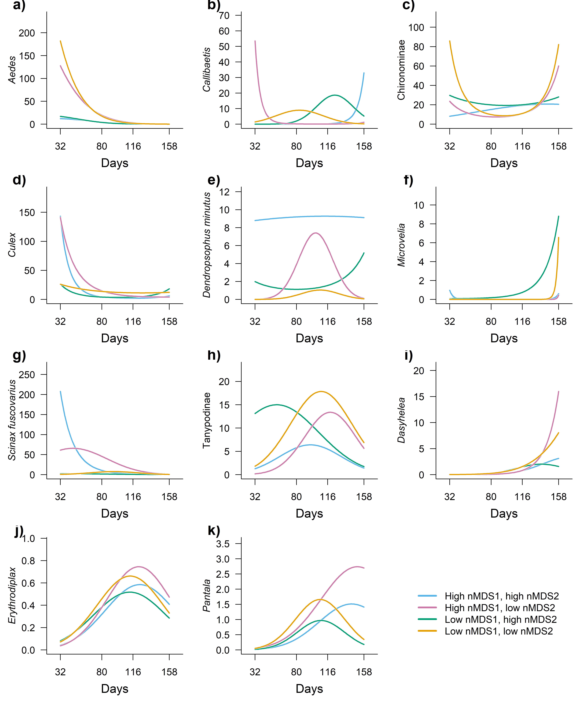
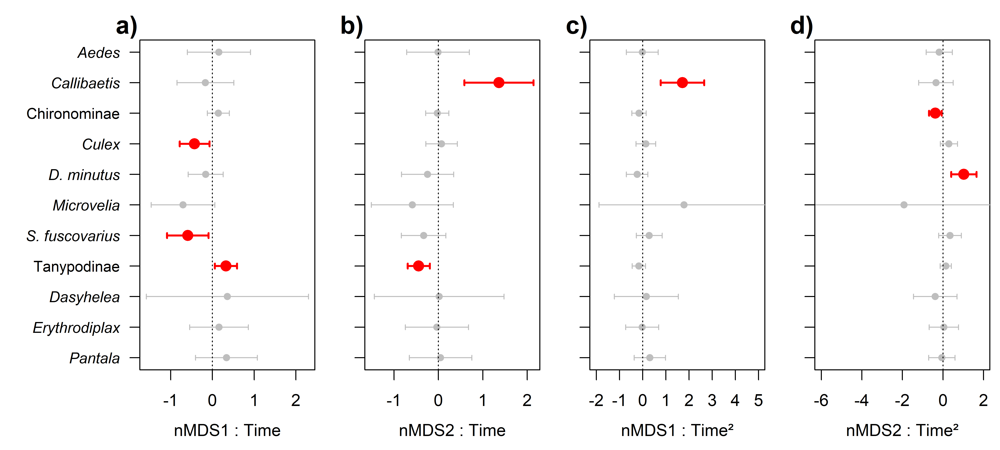
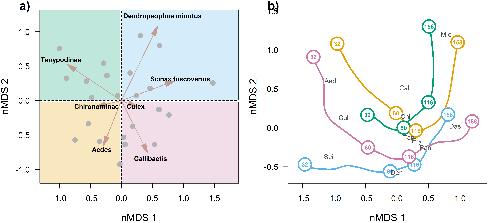
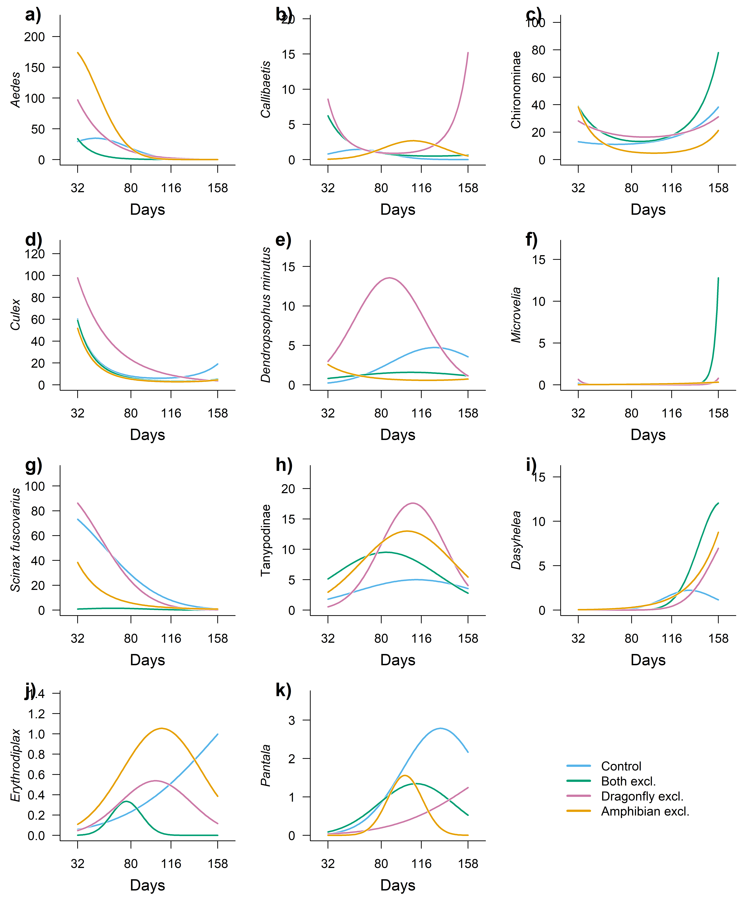

Effect of first survey on the effect of time
================
Rodolfo Pelinson
2026-04-27

## Loading packages and functions

``` r
source(paste(sep = "/",dir,"functions/pairwise_gllvm.R"))
source(paste(sep = "/",dir,"functions/pairwise_mvabund.R"))
source(paste(sep = "/",dir,"functions/my.anova.gllvm.R"))
source(paste(sep = "/",dir,"functions/My_coefplot.R"))
source(paste(sep = "/",dir,"functions/remove_sp.R"))
source(paste(sep = "/",dir,"functions/extract_mles.R"))
source(paste(sep = "/",dir,"functions/my_ordiplot.R"))
source(paste(sep = "/",dir,"functions/get_scaled_lvs.R"))
source(paste(sep = "/",dir,"functions/text_contour.R"))
source(paste(sep = "/",dir,"functions/letters.R"))
```

``` r
library(vegan)
library(gllvm)
library(mvabund)
library(DHARMa)
library(glmmTMB)
library(vioplot)
library(yarrr)
library(colorspace)
```

``` r
sessionInfo()
```

    ## R version 4.5.2 (2025-10-31 ucrt)
    ## Platform: x86_64-w64-mingw32/x64
    ## Running under: Windows 11 x64 (build 26200)
    ## 
    ## Matrix products: default
    ##   LAPACK version 3.12.1
    ## 
    ## locale:
    ## [1] LC_COLLATE=Portuguese_Brazil.utf8  LC_CTYPE=Portuguese_Brazil.utf8   
    ## [3] LC_MONETARY=Portuguese_Brazil.utf8 LC_NUMERIC=C                      
    ## [5] LC_TIME=Portuguese_Brazil.utf8    
    ## 
    ## time zone: Europe/London
    ## tzcode source: internal
    ## 
    ## attached base packages:
    ## [1] stats     graphics  grDevices utils     datasets  methods   base     
    ## 
    ## other attached packages:
    ##  [1] colorspace_2.1-2       yarrr_0.1.14           circlize_0.4.17       
    ##  [4] BayesFactor_0.9.12-4.8 Matrix_1.7-4           coda_0.19-4.1         
    ##  [7] jpeg_0.1-11            vioplot_0.5.1          zoo_1.8-15            
    ## [10] sm_2.2-6.0             glmmTMB_1.1.14         DHARMa_0.4.7          
    ## [13] mvabund_4.2.8          gllvm_2.0.5            TMB_1.9.20            
    ## [16] vegan_2.7-3            permute_0.9-10        
    ## 
    ## loaded via a namespace (and not attached):
    ##  [1] sandwich_3.1-1      shape_1.4.6.1       stringi_1.8.7      
    ##  [4] lattice_0.22-7      magrittr_2.0.4      lme4_2.0-1         
    ##  [7] digest_0.6.39       evaluate_1.0.5      grid_4.5.2         
    ## [10] estimability_1.5.1  mvtnorm_1.3-6       fastmap_1.2.0      
    ## [13] GlobalOptions_0.1.3 mgcv_1.9-3          pbapply_1.7-4      
    ## [16] numDeriv_2016.8-1.1 reformulas_0.4.4    Rdpack_2.6.6       
    ## [19] cli_3.6.5           rlang_1.1.7         rbibutils_2.4.1    
    ## [22] splines_4.5.2       yaml_2.3.12         otel_0.2.0         
    ## [25] tools_4.5.2         parallel_4.5.2      MatrixModels_0.5-4 
    ## [28] nloptr_2.2.1        minqa_1.2.8         boot_1.3-32        
    ## [31] lifecycle_1.0.5     emmeans_2.0.2       stringr_1.6.0      
    ## [34] tweedie_3.0.17      MASS_7.3-65         cluster_2.1.8.1    
    ## [37] glue_1.8.0          Rcpp_1.1.1          statmod_1.5.1      
    ## [40] xfun_0.57           rstudioapi_0.18.0   knitr_1.51         
    ## [43] xtable_1.8-8        htmltools_0.5.9     nlme_3.1-168       
    ## [46] rmarkdown_2.31      compiler_4.5.2      alabama_2025.1.0

## Loading and preparing data

``` r
source(paste(sep = "/",dir,"ajeitando_planilhas.R"))
```

``` r
comm_all_drop_atrasado <- comm_all[Exp_design_all$treatments != "atrasado",]
Exp_design_all_drop_atrasado <- Exp_design_all[Exp_design_all$treatments != "atrasado",]

ncol(comm_all_drop_atrasado)
```

    ## [1] 26

``` r
comm_all_drop_atrasado_rm <- remove_sp(comm_all_drop_atrasado, 10)
ncol(comm_all_drop_atrasado_rm)
```

    ## [1] 11

``` r
Exp_design_all_drop_atrasado$treatments_AM <- paste(Exp_design_all_drop_atrasado$treatments, Exp_design_all_drop_atrasado$AM, sep="_")

Exp_design_all_drop_atrasado$AM_numeric <- as.numeric(Exp_design_all_drop_atrasado$AM)

Exp_design_all_drop_atrasado$treatments <- as.factor(Exp_design_all_drop_atrasado$treatments)

AM_days <- as.numeric(Exp_design_all_drop_atrasado$AM)
AM_days[AM_days == 1] <- 32
AM_days[AM_days == 2] <- 80
AM_days[AM_days == 3] <- 116
AM_days[AM_days == 4] <- 158

AM_days_sc <- scale(AM_days)

Exp_design_all_drop_atrasado$AM_days_sc <- c(AM_days_sc)
Exp_design_all_drop_atrasado$AM_days_sc_squared <- c(AM_days_sc)^2

Exp_design_all_drop_atrasado$AM_days <- c(AM_days)
Exp_design_all_drop_atrasado$AM_days_squared <- c(AM_days)^2


comm_AM1 <- comm_all_drop_atrasado_rm[Exp_design_all_drop_atrasado$AM == 1,]
comm_AM1_rm <- remove_sp(comm_AM1, 3)


comm_AM1_pred <- rbind(comm_AM1_rm, comm_AM1_rm, comm_AM1_rm, comm_AM1_rm)

nrow(comm_AM1_pred)
```

    ## [1] 96

``` r
nrow(Exp_design_all_drop_atrasado)
```

    ## [1] 96

``` r
nrow(comm_all_drop_atrasado_rm)
```

    ## [1] 96

``` r
comm_AM1_pred_st <- decostand(comm_AM1_pred, "stand")
colnames(comm_AM1_pred_st) <- gsub(" ", "_", colnames(comm_AM1_pred_st))

predictors <- data.frame(Exp_design_all_drop_atrasado, comm_AM1_pred_st)
```

## Using NMDS to describe initial communities.

``` r
comm_AM1_rm_total <- data.frame(decostand(comm_AM1_rm, method = "total", MARGIN = 2))
nmds_comm_AM1_rm_total <- metaMDS(comm_AM1_rm_total, distance  = "bray", k = 2)
```

    ## Run 0 stress 0.1917598 
    ## Run 1 stress 0.1917598 
    ## ... New best solution
    ## ... Procrustes: rmse 7.564039e-06  max resid 1.861729e-05 
    ## ... Similar to previous best
    ## Run 2 stress 0.2284807 
    ## Run 3 stress 0.1917598 
    ## ... Procrustes: rmse 1.567832e-05  max resid 5.106754e-05 
    ## ... Similar to previous best
    ## Run 4 stress 0.1917598 
    ## ... New best solution
    ## ... Procrustes: rmse 9.228299e-07  max resid 1.936236e-06 
    ## ... Similar to previous best
    ## Run 5 stress 0.2391293 
    ## Run 6 stress 0.2457512 
    ## Run 7 stress 0.2549083 
    ## Run 8 stress 0.1917598 
    ## ... New best solution
    ## ... Procrustes: rmse 1.34351e-06  max resid 4.432439e-06 
    ## ... Similar to previous best
    ## Run 9 stress 0.1917598 
    ## ... New best solution
    ## ... Procrustes: rmse 4.555831e-06  max resid 1.40504e-05 
    ## ... Similar to previous best
    ## Run 10 stress 0.1917598 
    ## ... Procrustes: rmse 2.749486e-06  max resid 8.930591e-06 
    ## ... Similar to previous best
    ## Run 11 stress 0.1917598 
    ## ... Procrustes: rmse 3.819046e-06  max resid 1.305693e-05 
    ## ... Similar to previous best
    ## Run 12 stress 0.1917598 
    ## ... Procrustes: rmse 6.87049e-06  max resid 2.321026e-05 
    ## ... Similar to previous best
    ## Run 13 stress 0.2497996 
    ## Run 14 stress 0.1917598 
    ## ... Procrustes: rmse 3.801206e-06  max resid 1.083172e-05 
    ## ... Similar to previous best
    ## Run 15 stress 0.1917598 
    ## ... Procrustes: rmse 4.101726e-06  max resid 1.492224e-05 
    ## ... Similar to previous best
    ## Run 16 stress 0.1917598 
    ## ... Procrustes: rmse 1.445445e-06  max resid 4.759528e-06 
    ## ... Similar to previous best
    ## Run 17 stress 0.2283595 
    ## Run 18 stress 0.1917598 
    ## ... Procrustes: rmse 5.231749e-06  max resid 1.042535e-05 
    ## ... Similar to previous best
    ## Run 19 stress 0.248036 
    ## Run 20 stress 0.1917598 
    ## ... Procrustes: rmse 4.254206e-06  max resid 1.116347e-05 
    ## ... Similar to previous best
    ## *** Best solution repeated 9 times

``` r
comm_AM1_nmds <- data.frame(nmds_comm_AM1_rm_total$points)
comm_AM1_nmds_st <- decostand(comm_AM1_nmds, method = "stand")

comm_AM1_nmds_st_pred <- rbind(comm_AM1_nmds_st, comm_AM1_nmds_st, comm_AM1_nmds_st, comm_AM1_nmds_st)

predictors_nmds <- data.frame(Exp_design_all_drop_atrasado, comm_AM1_nmds_st_pred)
```

### Testing for effects

``` r
nrow(predictors_nmds)
```

    ## [1] 96

``` r
nrow(comm_all_drop_atrasado_rm)
```

    ## [1] 96

``` r
set.seed(1)
control <- permute::how(within = permute::Within(type = 'free'),
                        plots = Plots(strata = predictors_nmds$sites, type = 'free'),
                        nperm = 999)
permutations <- shuffleSet(nrow(comm_all_drop_atrasado_rm), control = control)


comm_all_drop_atrasado_mvabund <- mvabund(comm_all_drop_atrasado_rm)


mod_full_lin <- manyglm(comm_all_drop_atrasado_mvabund ~ block2 + ( MDS1 + MDS2 ) + AM_days_sc + AM_days_sc:( MDS1 + MDS2 ), family="negative.binomial",  data = predictors_nmds, composition = FALSE)

mod_full_quad <- manyglm(comm_all_drop_atrasado_mvabund ~ block2 + ( MDS1 + MDS2 ) + AM_days_sc + AM_days_sc_squared + AM_days_sc:( MDS1 + MDS2 ) + AM_days_sc_squared:( MDS1 + MDS2 ), family="negative.binomial",  data = predictors_nmds, composition = FALSE)

anova_quadratic_test <- anova(mod_full_lin, mod_full_quad, bootID = permutations, show.time = "all", cor.type = "I", test = "LR", resamp = "pit.trap")
```

    ## Using <int> bootID matrix from input. 
    ## Resampling begins for test 1.
    ##  Resampling run 0 finished. Time elapsed: 0.00 minutes...
    ##  Resampling run 100 finished. Time elapsed: 0.06 minutes...
    ##  Resampling run 200 finished. Time elapsed: 0.13 minutes...
    ##  Resampling run 300 finished. Time elapsed: 0.19 minutes...
    ##  Resampling run 400 finished. Time elapsed: 0.26 minutes...
    ##  Resampling run 500 finished. Time elapsed: 0.31 minutes...
    ##  Resampling run 600 finished. Time elapsed: 0.38 minutes...
    ##  Resampling run 700 finished. Time elapsed: 0.44 minutes...
    ##  Resampling run 800 finished. Time elapsed: 0.50 minutes...
    ##  Resampling run 900 finished. Time elapsed: 0.56 minutes...
    ## Time elapsed: 0 hr 0 min 37 sec

``` r
anova_quadratic_test
```

    ## Analysis of Deviance Table
    ## 
    ## mod_full_lin: comm_all_drop_atrasado_mvabund ~ block2 + (MDS1 + MDS2) + AM_days_sc + AM_days_sc:(MDS1 + MDS2)
    ## mod_full_quad: comm_all_drop_atrasado_mvabund ~ block2 + (MDS1 + MDS2) + AM_days_sc + AM_days_sc_squared + AM_days_sc:(MDS1 + MDS2) + AM_days_sc_squared:(MDS1 + MDS2)
    ## 
    ## Multivariate test:
    ##               Res.Df Df.diff   Dev Pr(>Dev)   
    ## mod_full_lin      88                          
    ## mod_full_quad     85       3 126.8    0.007 **
    ## ---
    ## Signif. codes:  0 '***' 0.001 '**' 0.01 '*' 0.05 '.' 0.1 ' ' 1
    ## Arguments:
    ##  Test statistics calculated assuming uncorrelated response (for faster computation) 
    ##  P-value calculated using 999 iterations via PIT-trap resampling.

``` r
########################################################
mod_block <- manyglm(comm_all_drop_atrasado_mvabund ~ block2 + ( MDS1 + MDS2 ) + AM_days_sc + AM_days_sc_squared, family="negative.binomial",  data = predictors_nmds, composition = FALSE)

mod_no_block <- manyglm(comm_all_drop_atrasado_mvabund ~ ( MDS1 + MDS2 ) + AM_days_sc + AM_days_sc_squared, family="negative.binomial",  data = predictors_nmds, composition = FALSE)

anova_block <- anova(mod_no_block, mod_block, bootID = permutations, show.block = "all", cor.type = "I", test = "LR", resamp = "pit.trap")
```

    ## Warning in anova.manyglm(mod_no_block, mod_block, bootID = permutations, :
    ## show.block is not a manyglm object nor a valid argument- removed from input,
    ## default value is used instead.

    ## Using <int> bootID matrix from input. 
    ## Time elapsed: 0 hr 0 min 27 sec

``` r
anova_block
```

    ## Analysis of Deviance Table
    ## 
    ## mod_no_block: comm_all_drop_atrasado_mvabund ~ (MDS1 + MDS2) + AM_days_sc + AM_days_sc_squared
    ## mod_block: comm_all_drop_atrasado_mvabund ~ block2 + (MDS1 + MDS2) + AM_days_sc + AM_days_sc_squared
    ## 
    ## Multivariate test:
    ##              Res.Df Df.diff   Dev Pr(>Dev)   
    ## mod_no_block     91                          
    ## mod_block        89       2 70.02    0.002 **
    ## ---
    ## Signif. codes:  0 '***' 0.001 '**' 0.01 '*' 0.05 '.' 0.1 ' ' 1
    ## Arguments:
    ##  Test statistics calculated assuming uncorrelated response (for faster computation) 
    ##  P-value calculated using 999 iterations via PIT-trap resampling.

``` r
########################################################


mod_time <- manyglm(comm_all_drop_atrasado_mvabund ~ block2 + ( MDS1 + MDS2 ) + AM_days_sc + AM_days_sc_squared, family="negative.binomial",  data = predictors_nmds, composition = FALSE)

mod_no_time <- manyglm(comm_all_drop_atrasado_mvabund ~ block2 + ( MDS1 + MDS2 ), family="negative.binomial",  data = predictors_nmds, composition = FALSE)

anova_time <- anova(mod_no_time, mod_time, bootID = permutations, show.time = "all", cor.type = "I", test = "LR", resamp = "pit.trap")
```

    ## Using <int> bootID matrix from input. 
    ## Resampling begins for test 1.
    ##  Resampling run 0 finished. Time elapsed: 0.00 minutes...
    ##  Resampling run 100 finished. Time elapsed: 0.05 minutes...
    ##  Resampling run 200 finished. Time elapsed: 0.09 minutes...
    ##  Resampling run 300 finished. Time elapsed: 0.14 minutes...
    ##  Resampling run 400 finished. Time elapsed: 0.19 minutes...
    ##  Resampling run 500 finished. Time elapsed: 0.23 minutes...
    ##  Resampling run 600 finished. Time elapsed: 0.28 minutes...
    ##  Resampling run 700 finished. Time elapsed: 0.32 minutes...
    ##  Resampling run 800 finished. Time elapsed: 0.37 minutes...
    ##  Resampling run 900 finished. Time elapsed: 0.41 minutes...
    ## Time elapsed: 0 hr 0 min 27 sec

``` r
anova_time
```

    ## Analysis of Deviance Table
    ## 
    ## mod_no_time: comm_all_drop_atrasado_mvabund ~ block2 + (MDS1 + MDS2)
    ## mod_time: comm_all_drop_atrasado_mvabund ~ block2 + (MDS1 + MDS2) + AM_days_sc + AM_days_sc_squared
    ## 
    ## Multivariate test:
    ##             Res.Df Df.diff   Dev Pr(>Dev)    
    ## mod_no_time     91                           
    ## mod_time        89       2 258.7    0.001 ***
    ## ---
    ## Signif. codes:  0 '***' 0.001 '**' 0.01 '*' 0.05 '.' 0.1 ' ' 1
    ## Arguments:
    ##  Test statistics calculated assuming uncorrelated response (for faster computation) 
    ##  P-value calculated using 999 iterations via PIT-trap resampling.

``` r
########################################################


mod_prior <- manyglm(comm_all_drop_atrasado_mvabund ~ block2 + ( MDS1 + MDS2 ) + AM_days_sc + AM_days_sc_squared, family="negative.binomial",  data = predictors_nmds, composition = FALSE)

mod_no_prior <- manyglm(comm_all_drop_atrasado_mvabund ~ block2 + AM_days_sc + AM_days_sc_squared, family="negative.binomial",  data = predictors_nmds, composition = FALSE)

anova_prior <- anova(mod_no_prior, mod_prior, bootID = permutations, show.time = "all", cor.type = "I", test = "LR", resamp = "pit.trap")
```

    ## Using <int> bootID matrix from input. 
    ## Resampling begins for test 1.
    ##  Resampling run 0 finished. Time elapsed: 0.00 minutes...
    ##  Resampling run 100 finished. Time elapsed: 0.05 minutes...
    ##  Resampling run 200 finished. Time elapsed: 0.09 minutes...
    ##  Resampling run 300 finished. Time elapsed: 0.14 minutes...
    ##  Resampling run 400 finished. Time elapsed: 0.18 minutes...
    ##  Resampling run 500 finished. Time elapsed: 0.23 minutes...
    ##  Resampling run 600 finished. Time elapsed: 0.27 minutes...
    ##  Resampling run 700 finished. Time elapsed: 0.32 minutes...
    ##  Resampling run 800 finished. Time elapsed: 0.36 minutes...
    ##  Resampling run 900 finished. Time elapsed: 0.41 minutes...
    ## Time elapsed: 0 hr 0 min 27 sec

``` r
anova_prior
```

    ## Analysis of Deviance Table
    ## 
    ## mod_no_prior: comm_all_drop_atrasado_mvabund ~ block2 + AM_days_sc + AM_days_sc_squared
    ## mod_prior: comm_all_drop_atrasado_mvabund ~ block2 + (MDS1 + MDS2) + AM_days_sc + AM_days_sc_squared
    ## 
    ## Multivariate test:
    ##              Res.Df Df.diff   Dev Pr(>Dev)   
    ## mod_no_prior     91                          
    ## mod_prior        89       2 59.44    0.007 **
    ## ---
    ## Signif. codes:  0 '***' 0.001 '**' 0.01 '*' 0.05 '.' 0.1 ' ' 1
    ## Arguments:
    ##  Test statistics calculated assuming uncorrelated response (for faster computation) 
    ##  P-value calculated using 999 iterations via PIT-trap resampling.

``` r
########################################################
mod_no_int <- manyglm(comm_all_drop_atrasado_mvabund ~ block2 + ( MDS1 + MDS2 ) + AM_days_sc + AM_days_sc_squared, family="negative.binomial",  data = predictors_nmds, composition = FALSE)

mod_int <- manyglm(comm_all_drop_atrasado_mvabund ~ block2 + ( MDS1 + MDS2 ) + AM_days_sc + AM_days_sc_squared + AM_days_sc:( MDS1 + MDS2 ) + AM_days_sc_squared:( MDS1 + MDS2 ), family="negative.binomial",  data = predictors_nmds, composition = FALSE)

anova_interaction <- anova(mod_no_int, mod_int, bootID = permutations, show.time = "all", cor.type = "I", test = "LR", resamp = "pit.trap")
```

    ## Using <int> bootID matrix from input. 
    ## Resampling begins for test 1.
    ##  Resampling run 0 finished. Time elapsed: 0.00 minutes...
    ##  Resampling run 100 finished. Time elapsed: 0.06 minutes...
    ##  Resampling run 200 finished. Time elapsed: 0.13 minutes...
    ##  Resampling run 300 finished. Time elapsed: 0.20 minutes...
    ##  Resampling run 400 finished. Time elapsed: 0.26 minutes...
    ##  Resampling run 500 finished. Time elapsed: 0.33 minutes...
    ##  Resampling run 600 finished. Time elapsed: 0.39 minutes...
    ##  Resampling run 700 finished. Time elapsed: 0.45 minutes...
    ##  Resampling run 800 finished. Time elapsed: 0.52 minutes...
    ##  Resampling run 900 finished. Time elapsed: 0.59 minutes...
    ## Time elapsed: 0 hr 0 min 39 sec

``` r
anova_interaction
```

    ## Analysis of Deviance Table
    ## 
    ## mod_no_int: comm_all_drop_atrasado_mvabund ~ block2 + (MDS1 + MDS2) + AM_days_sc + AM_days_sc_squared
    ## mod_int: comm_all_drop_atrasado_mvabund ~ block2 + (MDS1 + MDS2) + AM_days_sc + AM_days_sc_squared + AM_days_sc:(MDS1 + MDS2) + AM_days_sc_squared:(MDS1 + MDS2)
    ## 
    ## Multivariate test:
    ##            Res.Df Df.diff   Dev Pr(>Dev)    
    ## mod_no_int     89                           
    ## mod_int        85       4 81.74    0.001 ***
    ## ---
    ## Signif. codes:  0 '***' 0.001 '**' 0.01 '*' 0.05 '.' 0.1 ' ' 1
    ## Arguments:
    ##  Test statistics calculated assuming uncorrelated response (for faster computation) 
    ##  P-value calculated using 999 iterations via PIT-trap resampling.

Which are the species who have at least one of the coefficients for the
effect of time in interaction with the effect of the first survey whose
confidence interval do not include zero?

``` r
coefs <- mod_int$coefficients
LCL <- coefs + mod_int$stderr.coefficients * qnorm(0.025) 
UCL <- coefs + mod_int$stderr.coefficients * qnorm(0.975) 

coefs[LCL < 0 &  UCL > 0] <- NA

coefs <- coefs[-c(1:7),]

coefs <- coefs[, colSums(coefs, na.rm = TRUE) != 0]
```

### Making predictions for plotting

``` r
comm_all_drop_atrasado_mvabund2 <- comm_all_drop_atrasado_mvabund + 0.001

mod_int <- manyglm(comm_all_drop_atrasado_mvabund2 ~ block2 + ( MDS1 + MDS2 ) + AM_days_sc + AM_days_sc_squared + AM_days_sc:( MDS1 + MDS2 ) + AM_days_sc_squared:( MDS1 + MDS2 ), family="negative.binomial",  data = predictors_nmds, composition = FALSE)
```

    ## Warning in manyglm(comm_all_drop_atrasado_mvabund2 ~ block2 + (MDS1 + MDS2) + :
    ## Non-integer data are fitted to the negative.binomial model.

``` r
#High abundances of 
#Aedes
#Culex
#Dendropsophus_minutus
#Tanypodinae
#Callibaetis
#Culex

new_data_AB_high_MDS1_high_MDS2 <- 
  data.frame(AM_days_sc = seq(from = min(Exp_design_all_drop_atrasado$AM_days_sc), to = max(Exp_design_all_drop_atrasado$AM_days_sc), length.out = 100),
                                AM_days_sc_squared = seq(from = min(Exp_design_all_drop_atrasado$AM_days_sc), to = max(Exp_design_all_drop_atrasado$AM_days_sc), length.out = 100)^2,
                                block2 = factor(rep("AB", 100), levels = levels(as.factor(Exp_design_all_drop_atrasado$block2))),
             MDS1 = rep(quantile(predictors_nmds$MDS1, 0.9), 100),
             MDS2 = rep(quantile(predictors_nmds$MDS2, 0.9), 100))

new_data_CD_high_MDS1_high_MDS2 <- 
  data.frame(AM_days_sc = seq(from = min(Exp_design_all_drop_atrasado$AM_days_sc), to = max(Exp_design_all_drop_atrasado$AM_days_sc), length.out = 100),
                                AM_days_sc_squared = seq(from = min(Exp_design_all_drop_atrasado$AM_days_sc), to = max(Exp_design_all_drop_atrasado$AM_days_sc), length.out = 100)^2,
                                block2 = factor(rep("CD", 100), levels = levels(as.factor(Exp_design_all_drop_atrasado$block2))),
             MDS1 = rep(quantile(predictors_nmds$MDS1, 0.9), 100),
             MDS2 = rep(quantile(predictors_nmds$MDS2, 0.9), 100))


new_data_EF_high_MDS1_high_MDS2 <- 
  data.frame(AM_days_sc = seq(from = min(Exp_design_all_drop_atrasado$AM_days_sc), to = max(Exp_design_all_drop_atrasado$AM_days_sc), length.out = 100),
                                AM_days_sc_squared = seq(from = min(Exp_design_all_drop_atrasado$AM_days_sc), to = max(Exp_design_all_drop_atrasado$AM_days_sc), length.out = 100)^2,
                                block2 = factor(rep("EF", 100), levels = levels(as.factor(Exp_design_all_drop_atrasado$block2))),
             MDS1 = rep(quantile(predictors_nmds$MDS1, 0.9), 100),
             MDS2 = rep(quantile(predictors_nmds$MDS2, 0.9), 100))


###########################################################################################


new_data_AB_low_MDS1_high_MDS2 <- 
  data.frame(AM_days_sc = seq(from = min(Exp_design_all_drop_atrasado$AM_days_sc), to = max(Exp_design_all_drop_atrasado$AM_days_sc), length.out = 100),
                                AM_days_sc_squared = seq(from = min(Exp_design_all_drop_atrasado$AM_days_sc), to = max(Exp_design_all_drop_atrasado$AM_days_sc), length.out = 100)^2,
                                block2 = factor(rep("AB", 100), levels = levels(as.factor(Exp_design_all_drop_atrasado$block2))),
             MDS1 = rep(quantile(predictors_nmds$MDS1, 0.1), 100),
             MDS2 = rep(quantile(predictors_nmds$MDS2, 0.9), 100))

new_data_CD_low_MDS1_high_MDS2 <- 
  data.frame(AM_days_sc = seq(from = min(Exp_design_all_drop_atrasado$AM_days_sc), to = max(Exp_design_all_drop_atrasado$AM_days_sc), length.out = 100),
                                AM_days_sc_squared = seq(from = min(Exp_design_all_drop_atrasado$AM_days_sc), to = max(Exp_design_all_drop_atrasado$AM_days_sc), length.out = 100)^2,
                                block2 = factor(rep("CD", 100), levels = levels(as.factor(Exp_design_all_drop_atrasado$block2))),
             MDS1 = rep(quantile(predictors_nmds$MDS1, 0.1), 100),
             MDS2 = rep(quantile(predictors_nmds$MDS2, 0.9), 100))


new_data_EF_low_MDS1_high_MDS2 <- 
  data.frame(AM_days_sc = seq(from = min(Exp_design_all_drop_atrasado$AM_days_sc), to = max(Exp_design_all_drop_atrasado$AM_days_sc), length.out = 100),
                                AM_days_sc_squared = seq(from = min(Exp_design_all_drop_atrasado$AM_days_sc), to = max(Exp_design_all_drop_atrasado$AM_days_sc), length.out = 100)^2,
                                block2 = factor(rep("EF", 100), levels = levels(as.factor(Exp_design_all_drop_atrasado$block2))),
             MDS1 = rep(quantile(predictors_nmds$MDS1, 0.1), 100),
             MDS2 = rep(quantile(predictors_nmds$MDS2, 0.9), 100))


###########################################################################################


new_data_AB_low_MDS1_low_MDS2 <- 
  data.frame(AM_days_sc = seq(from = min(Exp_design_all_drop_atrasado$AM_days_sc), to = max(Exp_design_all_drop_atrasado$AM_days_sc), length.out = 100),
                                AM_days_sc_squared = seq(from = min(Exp_design_all_drop_atrasado$AM_days_sc), to = max(Exp_design_all_drop_atrasado$AM_days_sc), length.out = 100)^2,
                                block2 = factor(rep("AB", 100), levels = levels(as.factor(Exp_design_all_drop_atrasado$block2))),
             MDS1 = rep(quantile(predictors_nmds$MDS1, 0.1), 100),
             MDS2 = rep(quantile(predictors_nmds$MDS2, 0.1), 100))

new_data_CD_low_MDS1_low_MDS2 <- 
  data.frame(AM_days_sc = seq(from = min(Exp_design_all_drop_atrasado$AM_days_sc), to = max(Exp_design_all_drop_atrasado$AM_days_sc), length.out = 100),
                                AM_days_sc_squared = seq(from = min(Exp_design_all_drop_atrasado$AM_days_sc), to = max(Exp_design_all_drop_atrasado$AM_days_sc), length.out = 100)^2,
                                block2 = factor(rep("CD", 100), levels = levels(as.factor(Exp_design_all_drop_atrasado$block2))),
             MDS1 = rep(quantile(predictors_nmds$MDS1, 0.1), 100),
             MDS2 = rep(quantile(predictors_nmds$MDS2, 0.1), 100))


new_data_EF_low_MDS1_low_MDS2 <- 
  data.frame(AM_days_sc = seq(from = min(Exp_design_all_drop_atrasado$AM_days_sc), to = max(Exp_design_all_drop_atrasado$AM_days_sc), length.out = 100),
                                AM_days_sc_squared = seq(from = min(Exp_design_all_drop_atrasado$AM_days_sc), to = max(Exp_design_all_drop_atrasado$AM_days_sc), length.out = 100)^2,
                                block2 = factor(rep("EF", 100), levels = levels(as.factor(Exp_design_all_drop_atrasado$block2))),
             MDS1 = rep(quantile(predictors_nmds$MDS1, 0.1), 100),
             MDS2 = rep(quantile(predictors_nmds$MDS2, 0.1), 100))


###########################################################################################


new_data_AB_high_MDS1_low_MDS2 <- 
  data.frame(AM_days_sc = seq(from = min(Exp_design_all_drop_atrasado$AM_days_sc), to = max(Exp_design_all_drop_atrasado$AM_days_sc), length.out = 100),
                                AM_days_sc_squared = seq(from = min(Exp_design_all_drop_atrasado$AM_days_sc), to = max(Exp_design_all_drop_atrasado$AM_days_sc), length.out = 100)^2,
                                block2 = factor(rep("AB", 100), levels = levels(as.factor(Exp_design_all_drop_atrasado$block2))),
             MDS1 = rep(quantile(predictors_nmds$MDS1, 0.9), 100),
             MDS2 = rep(quantile(predictors_nmds$MDS2, 0.1), 100))

new_data_CD_high_MDS1_low_MDS2 <- 
  data.frame(AM_days_sc = seq(from = min(Exp_design_all_drop_atrasado$AM_days_sc), to = max(Exp_design_all_drop_atrasado$AM_days_sc), length.out = 100),
                                AM_days_sc_squared = seq(from = min(Exp_design_all_drop_atrasado$AM_days_sc), to = max(Exp_design_all_drop_atrasado$AM_days_sc), length.out = 100)^2,
                                block2 = factor(rep("CD", 100), levels = levels(as.factor(Exp_design_all_drop_atrasado$block2))),
             MDS1 = rep(quantile(predictors_nmds$MDS1, 0.9), 100),
             MDS2 = rep(quantile(predictors_nmds$MDS2, 0.1), 100))


new_data_EF_high_MDS1_low_MDS2 <- 
  data.frame(AM_days_sc = seq(from = min(Exp_design_all_drop_atrasado$AM_days_sc), to = max(Exp_design_all_drop_atrasado$AM_days_sc), length.out = 100),
                                AM_days_sc_squared = seq(from = min(Exp_design_all_drop_atrasado$AM_days_sc), to = max(Exp_design_all_drop_atrasado$AM_days_sc), length.out = 100)^2,
                                block2 = factor(rep("EF", 100), levels = levels(as.factor(Exp_design_all_drop_atrasado$block2))),
             MDS1 = rep(quantile(predictors_nmds$MDS1, 0.9), 100),
             MDS2 = rep(quantile(predictors_nmds$MDS2, 0.1), 100))


###########################################################################################


###########################################################################################


AB_high_MDS1_high_MDS2 <- predict.manyglm(mod_int, newdata = new_data_AB_high_MDS1_high_MDS2, type = "response")
```

    ## Warning: glm.fit: algoritmo não convergiu

    ## Warning: glm.fit: algoritmo não convergiu

``` r
CD_high_MDS1_high_MDS2 <- predict.manyglm(mod_int, newdata = new_data_CD_high_MDS1_high_MDS2, type = "response")
```

    ## Warning: glm.fit: algoritmo não convergiu
    ## Warning: glm.fit: algoritmo não convergiu

``` r
EF_high_MDS1_high_MDS2 <- predict.manyglm(mod_int, newdata = new_data_EF_high_MDS1_high_MDS2, type = "response")
```

    ## Warning: glm.fit: algoritmo não convergiu
    ## Warning: glm.fit: algoritmo não convergiu

``` r
high_MDS1_high_MDS2 <- array(NA, dim = c(nrow(AB_high_MDS1_high_MDS2), ncol(AB_high_MDS1_high_MDS2), 3))
high_MDS1_high_MDS2[,,1] <- AB_high_MDS1_high_MDS2
high_MDS1_high_MDS2[,,2] <- CD_high_MDS1_high_MDS2
high_MDS1_high_MDS2[,,3] <- EF_high_MDS1_high_MDS2

high_MDS1_high_MDS2_mean <- as.data.frame(apply(high_MDS1_high_MDS2, MARGIN = c(1,2), FUN = mean))
colnames(high_MDS1_high_MDS2_mean) <- colnames(AB_high_MDS1_high_MDS2)
high_MDS1_high_MDS2_mean
```

    ##           Aedes Callibaetis Chironominae      Culex Dendropsophus.minutus
    ## 1   11.99934163  0.04850216     8.173923 143.307006              8.796934
    ## 2   11.95205042  0.04609293     8.344149 125.916497              8.811564
    ## 3   11.89001098  0.04390793     8.515955 110.856899              8.825985
    ## 4   11.81345512  0.04192637     8.689293  97.792985              8.840196
    ## 5   11.72266777  0.04012980     8.864113  86.440559              8.854197
    ## 6   11.61798520  0.03850191     9.040365  76.558305              8.867985
    ## 7   11.49979297  0.03702824     9.217993  67.941001              8.881561
    ## 8   11.36852355  0.03569599     9.396944  60.413842              8.894922
    ## 9   11.22465369  0.03449382     9.577158  53.827704              8.908069
    ## 10  11.06870153  0.03341171     9.758577  48.055172              8.920999
    ## 11  10.90122350  0.03244080     9.941138  42.987214              8.933712
    ## 12  10.72281101  0.03157330    10.124777  38.530385              8.946207
    ## 13  10.53408698  0.03080236    10.309430  34.604477              8.958483
    ## 14  10.33570226  0.03012198    10.495029  31.140538              8.970539
    ## 15  10.12833181  0.02952694    10.681504  28.079205              8.982373
    ## 16   9.91267100  0.02901276    10.868784  25.369295              8.993987
    ## 17   9.68943168  0.02857558    11.056796  22.966609              9.005377
    ## 18   9.45933832  0.02821218    11.245465  20.832924              9.016543
    ## 19   9.22312412  0.02791990    11.434715  18.935138              9.027486
    ## 20   8.98152718  0.02769660    11.624467  17.244539              9.038202
    ## 21   8.73528673  0.02754068    11.814642  15.736190              9.048693
    ## 22   8.48513942  0.02745101    12.005157  14.388399              9.058956
    ## 23   8.23181575  0.02742695    12.195930  13.182272              9.068992
    ## 24   7.97603664  0.02746833    12.386876  12.101325              9.078799
    ## 25   7.71851017  0.02757545    12.577909  11.131161              9.088377
    ## 26   7.45992845  0.02774907    12.768941  10.259186              9.097725
    ## 27   7.20096474  0.02799044    12.959884   9.474367              9.106842
    ## 28   6.94227076  0.02830131    13.150648   8.767028              9.115727
    ## 29   6.68447421  0.02868395    13.341141   8.128670              9.124380
    ## 30   6.42817656  0.02914116    13.531270   7.551817              9.132800
    ## 31   6.17395107  0.02967634    13.720943   7.029886              9.140986
    ## 32   5.92234101  0.03029349    13.910065   6.557073              9.148939
    ## 33   5.67385821  0.03099730    14.098539   6.128253              9.156656
    ## 34   5.42898182  0.03179317    14.286271   5.738893              9.164138
    ## 35   5.18815733  0.03268732    14.473162   5.384986              9.171384
    ## 36   4.95179581  0.03368685    14.659115   5.062975              9.178393
    ## 37   4.72027347  0.03479982    14.844032   4.769710              9.185165
    ## 38   4.49393134  0.03603538    15.027814   4.502389              9.191700
    ## 39   4.27307531  0.03740389    15.210361   4.258522              9.197996
    ## 40   4.05797626  0.03891706    15.391573   4.035894              9.204053
    ## 41   3.84887049  0.04058810    15.571351   3.832529              9.209871
    ## 42   3.64596029  0.04243194    15.749594   3.646666              9.215450
    ## 43   3.44941472  0.04446545    15.926203   3.476734              9.220789
    ## 44   3.25937050  0.04670764    16.101076   3.321328              9.225887
    ## 45   3.07593313  0.04918003    16.274113   3.179194              9.230744
    ## 46   2.89917807  0.05190690    16.445216   3.049209              9.235360
    ## 47   2.72915205  0.05491576    16.614283   2.930368              9.239734
    ## 48   2.56587452  0.05823772    16.781215   2.821773              9.243866
    ## 49   2.40933915  0.06190807    16.945914   2.722618              9.247756
    ## 50   2.25951538  0.06596684    17.108282   2.632185              9.251403
    ## 51   2.11635008  0.07045952    17.268220   2.549828              9.254807
    ## 52   1.97976916  0.07543783    17.425632   2.474972              9.257968
    ## 53   1.84967932  0.08096069    17.580422   2.407103              9.260886
    ## 54   1.72596971  0.08709530    17.732495   2.345762              9.263560
    ## 55   1.60851361  0.09391843    17.881757   2.290540              9.265990
    ## 56   1.49717011  0.10151785    18.028115   2.241078              9.268176
    ## 57   1.39178580  0.10999414    18.171477   2.197054              9.270118
    ## 58   1.29219630  0.11946266    18.311753   2.158189              9.271815
    ## 59   1.19822790  0.13005599    18.448855   2.124237              9.273268
    ## 60   1.10969901  0.14192669    18.582695   2.094988              9.274476
    ## 61   1.02642168  0.15525060    18.713188   2.070260              9.275439
    ## 62   0.94820288  0.17023077    18.840249   2.049902              9.276158
    ## 63   0.87484591  0.18710196    18.963797   2.033791              9.276631
    ## 64   0.80615157  0.20613614    19.083750   2.021829              9.276860
    ## 65   0.74191933  0.22764886    19.200032   2.013943              9.276844
    ## 66   0.68194838  0.25200685    19.312566   2.010088              9.276583
    ## 67   0.62603868  0.27963706    19.421277   2.010239              9.276077
    ## 68   0.57399177  0.31103743    19.526094   2.014398              9.275326
    ## 69   0.52561168  0.34678962    19.626948   2.022589              9.274330
    ## 70   0.48070561  0.38757438    19.723771   2.034862              9.273089
    ## 71   0.43908461  0.43418973    19.816498   2.051291              9.271604
    ## 72   0.40056416  0.48757291    19.905068   2.071974              9.269875
    ## 73   0.36496464  0.54882656    19.989421   2.097038              9.267901
    ## 74   0.33211182  0.61925025    20.069500   2.126636              9.265682
    ## 75   0.30183717  0.70037848    20.145250   2.160951              9.263220
    ## 76   0.27397817  0.79402635    20.216622   2.200197              9.260514
    ## 77   0.24837852  0.90234490    20.283565   2.244622              9.257564
    ## 78   0.22488834  1.02788789    20.346034   2.294508              9.254371
    ## 79   0.20336429  1.17369283    20.403988   2.350178              9.250934
    ## 80   0.18366960  1.34337940    20.457385   2.411998              9.247255
    ## 81   0.16567414  1.54126900    20.506190   2.480379              9.243333
    ## 82   0.14925435  1.77253054    20.550369   2.555783              9.239169
    ## 83   0.13429323  2.04335835    20.589892   2.638729              9.234762
    ## 84   0.12068021  2.36118967    20.624731   2.729798              9.230115
    ## 85   0.10831107  2.73497107    20.654863   2.829640              9.225226
    ## 86   0.09708777  3.17548544    20.680266   2.938980              9.220096
    ## 87   0.08691825  3.69575389    20.700923   3.058630              9.214725
    ## 88   0.07771633  4.31153072    20.716820   3.189497              9.209115
    ## 89   0.06940144  5.04191423    20.727946   3.332593              9.203265
    ## 90   0.06189841  5.91010162    20.734293   3.489051              9.197176
    ## 91   0.05513728  6.94432390    20.735857   3.660136              9.190848
    ## 92   0.04905305  8.17900582    20.732636   3.847264              9.184282
    ## 93   0.04358545  9.65620753    20.724633   4.052021              9.177479
    ## 94   0.03867870 11.42742005    20.711854   4.276183              9.170438
    ## 95   0.03428129 13.55580517    20.694307   4.521741              9.163161
    ## 96   0.03034570 16.11899540    20.672004   4.790932              9.155648
    ## 97   0.02682823 19.21260043    20.644961   5.086267              9.147899
    ## 98   0.02368873 22.95460673    20.613197   5.410573              9.139916
    ## 99   0.02089038 27.49090828    20.576733   5.767031              9.131699
    ## 100  0.01839949 33.00227261    20.535594   6.159225              9.123248
    ##       Microvelia Scinax.fuscovarius Tanypodinae    Dasyhelea Erythrodiplax
    ## 1   0.9686151926        207.6892012    1.276223 0.0004321452    0.04184605
    ## 2   0.6815704085        190.6654817    1.359765 0.0005074580    0.04499081
    ## 3   0.4829966362        175.1032954    1.446936 0.0005950348    0.04832312
    ## 4   0.3447080419        160.8720698    1.537739 0.0006967169    0.05184990
    ## 5   0.2477608341        147.8533147    1.632164 0.0008145956    0.05557795
    ## 6   0.1793444010        135.9394683    1.730186 0.0009510418    0.05951397
    ## 7   0.1307425410        125.0328567    1.831764 0.0011087379    0.06366446
    ## 8   0.0959886645        115.0447558    1.936843 0.0012907137    0.06803571
    ## 9   0.0709736118        105.8945441    2.045347 0.0015003851    0.07263376
    ## 10  0.0528503410         97.5089386    2.157186 0.0017415955    0.07746435
    ## 11  0.0396344295         89.8213046    2.272250 0.0020186621    0.08253288
    ## 12  0.0299344551         82.7710328    2.390410 0.0023364244    0.08784435
    ## 13  0.0227690040         76.3029757    2.511520 0.0027002974    0.09340334
    ## 14  0.0174417734         70.3669394    2.635414 0.0031163284    0.09921394
    ## 15  0.0134558512         64.9172231    2.761906 0.0035912580    0.10527973
    ## 16  0.0104545571         59.9122034    2.890792 0.0041325847    0.11160369
    ## 17  0.0081803905         55.3139580    3.021848 0.0047486338    0.11818819
    ## 18  0.0064463868         51.0879251    3.154833 0.0054486306    0.12503493
    ## 19  0.0051160245         47.2025955    3.289485 0.0062427768    0.13214489
    ## 20  0.0040890535         43.6292331    3.425527 0.0071423318    0.13951829
    ## 21  0.0032914473         40.3416229    3.562663 0.0081596963    0.14715453
    ## 22  0.0026682404         37.3158413    3.700582 0.0093085006    0.15505218
    ## 23  0.0021783965         34.5300490    3.838957 0.0106036951    0.16320890
    ## 24  0.0017911124         31.9643029    3.977446 0.0120616437    0.17162145
    ## 25  0.0014831418         29.6003854    4.115696 0.0137002195    0.18028560
    ## 26  0.0012368483         27.4216498    4.253340 0.0155389016    0.18919612
    ## 27  0.0010387813         25.4128797    4.390003 0.0175988737    0.19834679
    ## 28  0.0008786294         23.5601617    4.525301 0.0199031215    0.20773031
    ## 29  0.0007484474         21.8507696    4.658842 0.0224765308    0.21733831
    ## 30  0.0006420824         20.2730595    4.790230 0.0253459823    0.22716136
    ## 31  0.0005547460         18.8163740    4.919066 0.0285404450    0.23718890
    ## 32  0.0004826936         17.4709558    5.044950 0.0320910640    0.24740929
    ## 33  0.0004229829         16.2278684    5.167481 0.0360312440    0.25780979
    ## 34  0.0003732914         15.0789249    5.286265 0.0403967252    0.26837653
    ## 35  0.0003317776         14.0166220    5.400908 0.0452256511    0.27909458
    ## 36  0.0002969752         13.0340815    5.511027 0.0505586257    0.28994793
    ## 37  0.0002677116         12.1249956    5.616246 0.0564387590    0.30091952
    ## 38  0.0002430458         11.2835779    5.716204 0.0629116992    0.31199128
    ## 39  0.0002222199         10.5045187    5.810548 0.0700256484    0.32314415
    ## 40  0.0002046217          9.7829441    5.898946 0.0778313612    0.33435811
    ## 41  0.0001897555          9.1143787    5.981081 0.0863821238    0.34561229
    ## 42  0.0001772193          8.4947119    6.056654 0.0957337107    0.35688495
    ## 43  0.0001666870          7.9201668    6.125390 0.1059443185    0.36815359
    ## 44  0.0001578942          7.3872719    6.187036 0.1170744738    0.37939498
    ## 45  0.0001506276          6.8928356    6.241363 0.1291869132    0.39058526
    ## 46  0.0001447161          6.4339229    6.288167 0.1423464341    0.40170004
    ## 47  0.0001400242          6.0078332    6.327274 0.1566197141    0.41271441
    ## 48  0.0001364468          5.6120814    6.358535 0.1720750979    0.42360311
    ## 49  0.0001339052          5.2443799    6.381833 0.1887823499    0.43434055
    ## 50  0.0001323444          4.9026221    6.397079 0.2068123712    0.44490098
    ## 51  0.0001317309          4.5848673    6.404214 0.2262368807    0.45525853
    ## 52  0.0001320516          4.2893275    6.403211 0.2471280591    0.46538733
    ## 53  0.0001333133          4.0143547    6.394075 0.2695581557    0.47526164
    ## 54  0.0001355430          3.7584290    6.376840 0.2935990582    0.48485592
    ## 55  0.0001387890          3.5201490    6.351572 0.3193218259    0.49414499
    ## 56  0.0001431221          3.2982216    6.318367 0.3467961869    0.50310406
    ## 57  0.0001486388          3.0914534    6.277349 0.3760900011    0.51170893
    ## 58  0.0001554647          2.8987426    6.228675 0.4072686909    0.51993602
    ## 59  0.0001637590          2.7190719    6.172526 0.4403946414    0.52776253
    ## 60  0.0001737211          2.5515015    6.109112 0.4755265734    0.53516653
    ## 61  0.0001855982          2.3951628    6.038667 0.5127188924    0.54212705
    ## 62  0.0001996958          2.2492531    5.961452 0.5520210177    0.54862419
    ## 63  0.0002163905          2.1130302    5.877747 0.5934766961    0.55463921
    ## 64  0.0002361464          1.9858077    5.787854 0.6371233049    0.56015462
    ## 65  0.0002595364          1.8669502    5.692096 0.6829911494    0.56515428
    ## 66  0.0002872693          1.7558701    5.590810 0.7311027618    0.56962345
    ## 67  0.0003202242          1.6520230    5.484349 0.7814722070    0.57354888
    ## 68  0.0003594950          1.5549052    5.373081 0.8341044023    0.57691889
    ## 69  0.0004064486          1.4640497    5.257382 0.8889944582    0.57972338
    ## 70  0.0004627989          1.3790239    5.137639 0.9461270470    0.58195395
    ## 71  0.0005307047          1.2994269    5.014245 1.0054758082    0.58360386
    ## 72  0.0006128969          1.2248870    4.887597 1.0670027971    0.58466816
    ## 73  0.0007128463          1.1550592    4.758096 1.1306579839    0.58514361
    ## 74  0.0008349842          1.0896238    4.626140 1.1963788134    0.58502878
    ## 75  0.0009849963          1.0282838    4.492130 1.2640898297    0.58432401
    ## 76  0.0011702128          0.9707636    4.356460 1.3337023756    0.58303145
    ## 77  0.0014001321          0.9168073    4.219520 1.4051143729    0.58115499
    ## 78  0.0016871244          0.8661772    4.081692 1.4782101893    0.57870028
    ## 79  0.0020473833          0.8186523    3.943350 1.5528605993    0.57567473
    ## 80  0.0025022178          0.7740274    3.804857 1.6289228440    0.57208739
    ## 81  0.0030798177          0.7321115    3.666563 1.7062407930    0.56794898
    ## 82  0.0038176739          0.6927272    3.528807 1.7846452148    0.56327181
    ## 83  0.0047659182          0.6557093    3.391912 1.8639541559    0.55806971
    ## 84  0.0059919511          0.6209041    3.256186 1.9439734327    0.55235796
    ## 85  0.0075868915          0.5881686    3.121919 2.0244972349    0.54615327
    ## 86  0.0096746089          0.5573694    2.989386 2.1053088420    0.53947359
    ## 87  0.0124244419          0.5283827    2.858842 2.1861814494    0.53233814
    ## 88  0.0160692012          0.5010928    2.730526 2.2668791036    0.52476725
    ## 89  0.0209307899          0.4753918    2.604655 2.3471577404    0.51678226
    ## 90  0.0274568606          0.4511796    2.481431 2.4267663223    0.50840547
    ## 91  0.0362735507          0.4283623    2.361032 2.5054480682    0.49965999
    ## 92  0.0482617637          0.4068526    2.243622 2.5829417679    0.49056965
    ## 93  0.0646681204          0.3865690    2.129341 2.6589831727    0.48115889
    ## 94  0.0872672352          0.3674355    2.018314 2.7333064523    0.47145267
    ## 95  0.1186003923          0.3493809    1.910645 2.8056457073    0.46147632
    ## 96  0.1623285704          0.3323391    1.806422 2.8757365254    0.45125548
    ## 97  0.2237575673          0.3162479    1.705715 2.9433175694    0.44081594
    ## 98  0.3106235861          0.3010496    1.608575 3.0081321831    0.43018358
    ## 99  0.4342752274          0.2866900    1.515041 3.0699300022    0.41938425
    ## 100 0.6114621982          0.2731185    1.425132 3.1284685555    0.40844365
    ##        Pantala
    ## 1   0.01920240
    ## 2   0.02119734
    ## 3   0.02337307
    ## 4   0.02574297
    ## 5   0.02832110
    ## 6   0.03112219
    ## 7   0.03416165
    ## 8   0.03745553
    ## 9   0.04102057
    ## 10  0.04487412
    ## 11  0.04903417
    ## 12  0.05351928
    ## 13  0.05834857
    ## 14  0.06354169
    ## 15  0.06911874
    ## 16  0.07510026
    ## 17  0.08150714
    ## 18  0.08836055
    ## 19  0.09568189
    ## 20  0.10349268
    ## 21  0.11181448
    ## 22  0.12066881
    ## 23  0.13007702
    ## 24  0.14006019
    ## 25  0.15063898
    ## 26  0.16183357
    ## 27  0.17366344
    ## 28  0.18614730
    ## 29  0.19930291
    ## 30  0.21314694
    ## 31  0.22769480
    ## 32  0.24296051
    ## 33  0.25895651
    ## 34  0.27569350
    ## 35  0.29318030
    ## 36  0.31142365
    ## 37  0.33042809
    ## 38  0.35019577
    ## 39  0.37072629
    ## 40  0.39201657
    ## 41  0.41406072
    ## 42  0.43684986
    ## 43  0.46037202
    ## 44  0.48461204
    ## 45  0.50955145
    ## 46  0.53516837
    ## 47  0.56143747
    ## 48  0.58832988
    ## 49  0.61581318
    ## 50  0.64385135
    ## 51  0.67240479
    ## 52  0.70143034
    ## 53  0.73088131
    ## 54  0.76070754
    ## 55  0.79085551
    ## 56  0.82126843
    ## 57  0.85188637
    ## 58  0.88264643
    ## 59  0.91348291
    ## 60  0.94432751
    ## 61  0.97510957
    ## 62  1.00575628
    ## 63  1.03619297
    ## 64  1.06634342
    ## 65  1.09613010
    ## 66  1.12547453
    ## 67  1.15429761
    ## 68  1.18251996
    ## 69  1.21006228
    ## 70  1.23684570
    ## 71  1.26279218
    ## 72  1.28782486
    ## 73  1.31186843
    ## 74  1.33484954
    ## 75  1.35669714
    ## 76  1.37734286
    ## 77  1.39672135
    ## 78  1.41477065
    ## 79  1.43143249
    ## 80  1.44665262
    ## 81  1.46038109
    ## 82  1.47257256
    ## 83  1.48318651
    ## 84  1.49218746
    ## 85  1.49954522
    ## 86  1.50523498
    ## 87  1.50923754
    ## 88  1.51153934
    ## 89  1.51213257
    ## 90  1.51101522
    ## 91  1.50819108
    ## 92  1.50366973
    ## 93  1.49746646
    ## 94  1.48960221
    ## 95  1.48010346
    ## 96  1.46900203
    ## 97  1.45633496
    ## 98  1.44214429
    ## 99  1.42647680
    ## 100 1.40938378

``` r
AB_low_MDS1_high_MDS2 <- predict.manyglm(mod_int, newdata = new_data_AB_low_MDS1_high_MDS2, type = "response")
```

    ## Warning: glm.fit: algoritmo não convergiu
    ## Warning: glm.fit: algoritmo não convergiu

``` r
CD_low_MDS1_high_MDS2 <- predict.manyglm(mod_int, newdata = new_data_CD_low_MDS1_high_MDS2, type = "response")
```

    ## Warning: glm.fit: algoritmo não convergiu
    ## Warning: glm.fit: algoritmo não convergiu

``` r
EF_low_MDS1_high_MDS2 <- predict.manyglm(mod_int, newdata = new_data_EF_low_MDS1_high_MDS2, type = "response")
```

    ## Warning: glm.fit: algoritmo não convergiu
    ## Warning: glm.fit: algoritmo não convergiu

``` r
low_MDS1_high_MDS2 <- array(NA, dim = c(nrow(AB_low_MDS1_high_MDS2), ncol(AB_low_MDS1_high_MDS2), 3))
low_MDS1_high_MDS2[,,1] <- AB_low_MDS1_high_MDS2
low_MDS1_high_MDS2[,,2] <- CD_low_MDS1_high_MDS2
low_MDS1_high_MDS2[,,3] <- EF_low_MDS1_high_MDS2

low_MDS1_high_MDS2_mean <- as.data.frame(apply(low_MDS1_high_MDS2, MARGIN = c(1,2), FUN = mean))
colnames(low_MDS1_high_MDS2_mean) <- colnames(AB_low_MDS1_high_MDS2)
low_MDS1_high_MDS2_mean
```

    ##           Aedes  Callibaetis Chironominae     Culex Dendropsophus.minutus
    ## 1   17.08925717  0.001319359     29.73025 26.607395              1.990684
    ## 2   16.79988064  0.001714044     29.23847 24.616605              1.931603
    ## 3   16.49570422  0.002218723     28.76427 22.809184              1.875799
    ## 4   16.17771495  0.002861583     28.30708 21.166406              1.823088
    ## 5   15.84693040  0.003677322     27.86631 19.671628              1.773299
    ## 6   15.50439327  0.004708464     27.44142 18.310038              1.726271
    ## 7   15.15116593  0.006006879     27.03190 17.068446              1.681856
    ## 8   14.78832502  0.007635557     26.63724 15.935089              1.639916
    ## 9   14.41695599  0.009670629     26.25698 14.899469              1.600322
    ## 10  14.03814786  0.012203680     25.89065 13.952206              1.562952
    ## 11  13.65298791  0.015344371     25.53783 13.084911              1.527696
    ## 12  13.26255666  0.019223368     25.19811 12.290072              1.494450
    ## 13  12.86792297  0.023995624     24.87107 11.560959              1.463114
    ## 14  12.47013934  0.029843981     24.55635 10.891535              1.433601
    ## 15  12.07023745  0.036983124     24.25359 10.276379              1.405824
    ## 16  11.66922395  0.045663857     23.96244  9.710619              1.379706
    ## 17  11.26807657  0.056177672     23.68256  9.189873              1.355174
    ## 18  10.86774045  0.068861588     23.41366  8.710195              1.332160
    ## 19  10.46912486  0.084103190     23.15541  8.268029              1.310601
    ## 20  10.07310022  0.102345807     22.90755  7.860170              1.290439
    ## 21   9.68049542  0.124093715     22.66979  7.483723              1.271620
    ## 22   9.29209553  0.149917270     22.44187  7.136072              1.254094
    ## 23   8.90863985  0.180457814     22.22355  6.814853              1.237815
    ## 24   8.53082026  0.216432195     22.01459  6.517928              1.222740
    ## 25   8.15927997  0.258636720     21.81477  6.243361              1.208831
    ## 26   7.79461254  0.307950314     21.62386  5.989397              1.196051
    ## 27   7.43736135  0.365336670     21.44168  5.754446              1.184368
    ## 28   7.08801922  0.431845130     21.26802  5.537067              1.173753
    ## 29   6.74702849  0.508610047     21.10271  5.335950              1.164178
    ## 30   6.41478131  0.596848339     20.94556  5.149909              1.155620
    ## 31   6.09162022  0.697854996     20.79642  4.977865              1.148057
    ## 32   5.77783903  0.812996248     20.65514  4.818840              1.141471
    ## 33   5.47368385  0.943700179     20.52155  4.671944              1.135845
    ## 34   5.17935448  1.091444559     20.39554  4.536371              1.131165
    ## 35   4.89500584  1.257741730     20.27697  4.411388              1.127420
    ## 36   4.62074973  1.444120415     20.16571  4.296332              1.124601
    ## 37   4.35665664  1.652104415     20.06166  4.190599              1.122701
    ## 38   4.10275774  1.883188194     19.96470  4.093645              1.121715
    ## 39   3.85904699  2.138809483     19.87475  4.004977              1.121641
    ## 40   3.62548334  2.420319089     19.79171  3.924151              1.122478
    ## 41   3.40199299  2.728948238     19.71550  3.850766              1.124230
    ## 42   3.18847171  3.065773863     19.64604  3.784463              1.126899
    ## 43   2.98478721  3.431682369     19.58326  3.724923              1.130492
    ## 44   2.79078151  3.827332529     19.52710  3.671860              1.135019
    ## 45   2.60627328  4.253118241     19.47750  3.625022              1.140490
    ## 46   2.43106024  4.709131997     19.43442  3.584190              1.146919
    ## 47   2.26492144  5.195129981     19.39780  3.549173              1.154322
    ## 48   2.10761955  5.710499780     19.36763  3.519809              1.162717
    ## 49   1.95890307  6.254231712     19.34386  3.495963              1.172125
    ## 50   1.81850848  6.824894816     19.32647  3.477525              1.182569
    ## 51   1.68616227  7.420618499     19.31544  3.464412              1.194076
    ## 52   1.56158294  8.039080801     19.31077  3.456564              1.206676
    ## 53   1.44448288  8.677504149     19.31245  3.453946              1.220399
    ## 54   1.33457012  9.332659332     19.32048  3.456544              1.235281
    ## 55   1.23155000 10.000878321     19.33487  3.464372              1.251362
    ## 56   1.13512673 10.678076318     19.35563  3.477465              1.268682
    ## 57   1.04500486 11.359783244     19.38279  3.495882              1.287287
    ## 58   0.96089055 12.041184638     19.41636  3.519707              1.307227
    ## 59   0.88249283 12.717171675     19.45639  3.549050              1.328555
    ## 60   0.80952470 13.382399767     19.50292  3.584045              1.351328
    ## 61   0.74170409 14.031354962     19.55598  3.624855              1.375608
    ## 62   0.67875478 14.658427071     19.61563  3.671669              1.401463
    ## 63   0.62040713 15.257988276     19.68194  3.724708              1.428965
    ## 64   0.56639879 15.824475710     19.75496  3.784223              1.458190
    ## 65   0.51647523 16.352476371     19.83477  3.850499              1.489223
    ## 66   0.47039028 16.836812577     19.92146  3.923856              1.522153
    ## 67   0.42790645 17.272626089     20.01510  4.004653              1.557075
    ## 68   0.38879528 17.655459009     20.11580  4.093290              1.594093
    ## 69   0.35283754 17.981329573     20.22365  4.190211              1.633317
    ## 70   0.31982340 18.246801029     20.33876  4.295910              1.674867
    ## 71   0.28955252 18.449041958     20.46125  4.410929              1.718870
    ## 72   0.26183404 18.585876534     20.59125  4.535873              1.765463
    ## 73   0.23648659 18.655823489     20.72889  4.671404              1.814792
    ## 74   0.21333818 18.658122808     20.87431  4.818255              1.867016
    ## 75   0.19222608 18.592749476     21.02767  4.977232              1.922305
    ## 76   0.17299665 18.460413928     21.18911  5.149224              1.980839
    ## 77   0.15550513 18.262549202     21.35882  5.335210              2.042815
    ## 78   0.13961542 18.001285102     21.53696  5.536267              2.108442
    ## 79   0.12519983 17.679410038     21.72373  5.753581              2.177946
    ## 80   0.11213875 17.300321495     21.91932  5.988462              2.251571
    ## 81   0.10032043 16.867966352     22.12395  6.242351              2.329575
    ## 82   0.08964058 16.386772535     22.33783  6.516836              2.412242
    ## 83   0.08000214 15.861573630     22.56120  6.813671              2.499872
    ## 84   0.07131489 15.297528283     22.79429  7.134793              2.592792
    ## 85   0.06349514 14.700036229     23.03736  7.482339              2.691350
    ## 86   0.05646540 14.074652868     23.29068  7.858671              2.795927
    ## 87   0.05015404 13.427004259     23.55453  8.266405              2.906927
    ## 88   0.04449500 12.762704323     23.82920  8.708433              3.024791
    ## 89   0.03942739 12.087275927     24.11500  9.187961              3.149992
    ## 90   0.03489527 11.406077326     24.41225  9.708542              3.283041
    ## 91   0.03084727 10.724235289     24.72129 10.274122              3.424492
    ## 92   0.02723633 10.046585928     25.04247 10.889080              3.574940
    ## 93   0.02401940  9.377624084     25.37617 11.558287              3.735032
    ## 94   0.02115715  8.721461796     25.72277 12.287160              3.905464
    ## 95   0.01861376  8.081796171     26.08268 13.081735              4.086992
    ## 96   0.01635658  7.461886697     26.45632 13.948739              4.280435
    ## 97   0.01435597  6.864541812     26.84414 14.895681              4.486677
    ## 98   0.01258503  6.292114339     27.24660 15.930945              4.706679
    ## 99   0.01101939  5.746505203     27.66419 17.063908              4.941482
    ## 100  0.00963702  5.229174680     28.09741 18.305065              5.192216
    ##     Microvelia Scinax.fuscovarius Tanypodinae   Dasyhelea Erythrodiplax
    ## 1   0.07662572          2.2398065   13.115968 0.002019880    0.08156956
    ## 2   0.07724776          2.2436743   13.290852 0.002381758    0.08644872
    ## 3   0.07793819          2.2461829   13.458814 0.002802886    0.09153477
    ## 4   0.07869877          2.2473277   13.619534 0.003291917    0.09683016
    ## 5   0.07953141          2.2471066   13.772703 0.003858584    0.10233691
    ## 6   0.08043825          2.2455200   13.918024 0.004513805    0.10805653
    ## 7   0.08142161          2.2425708   14.055214 0.005269791    0.11399001
    ## 8   0.08248403          2.2382644   14.184003 0.006140159    0.12013778
    ## 9   0.08362830          2.2326086   14.304137 0.007140055    0.12649971
    ## 10  0.08485741          2.2256137   14.415376 0.008286272    0.13307501
    ## 11  0.08617464          2.2172924   14.517498 0.009597376    0.13986226
    ## 12  0.08758350          2.2076597   14.610298 0.011093832    0.14685936
    ## 13  0.08908781          2.1967329   14.693587 0.012798125    0.15406352
    ## 14  0.09069168          2.1845319   14.767197 0.014734886    0.16147119
    ## 15  0.09239952          2.1710783   14.830978 0.016931013    0.16907810
    ## 16  0.09421611          2.1563964   14.884800 0.019415778    0.17687918
    ## 17  0.09614656          2.1405120   14.928552 0.022220936    0.18486860
    ## 18  0.09819639          2.1234534   14.962145 0.025380818    0.19303971
    ## 19  0.10037150          2.1052505   14.985509 0.028932408    0.20138505
    ## 20  0.10267825          2.0859351   14.998596 0.032915408    0.20989634
    ## 21  0.10512347          2.0655409   15.001380 0.037372281    0.21856447
    ## 22  0.10771447          2.0441031   14.993855 0.042348269    0.22737951
    ## 23  0.11045912          2.0216584   14.976036 0.047891389    0.23633071
    ## 24  0.11336585          1.9982450   14.947960 0.054052390    0.24540650
    ## 25  0.11644372          1.9739025   14.909684 0.060884687    0.25459450
    ## 26  0.11970245          1.9486714   14.861288 0.068444247    0.26388156
    ## 27  0.12315248          1.9225938   14.802870 0.076789444    0.27325376
    ## 28  0.12680502          1.8957123   14.734550 0.085980863    0.28269642
    ## 29  0.13067210          1.8680707   14.656468 0.096081058    0.29219416
    ## 30  0.13476666          1.8397134   14.568782 0.107154263    0.30173093
    ## 31  0.13910259          1.8106855   14.471670 0.119266050    0.31129001
    ## 32  0.14369482          1.7810326   14.365328 0.132482928    0.32085411
    ## 33  0.14855940          1.7508006   14.249968 0.146871897    0.33040538
    ## 34  0.15371362          1.7200358   14.125822 0.162499934    0.33992544
    ## 35  0.15917604          1.6887846   13.993136 0.179433437    0.34939548
    ## 36  0.16496667          1.6570935   13.852172 0.197737603    0.35879632
    ## 37  0.17110704          1.6250090   13.703205 0.217475760    0.36810840
    ## 38  0.17762033          1.5925773   13.546525 0.238708646    0.37731195
    ## 39  0.18453156          1.5598442   13.382435 0.261493648    0.38638694
    ## 40  0.19186765          1.5268555   13.211249 0.285883993    0.39531327
    ## 41  0.19965769          1.4936561   13.033291 0.311927912    0.40407075
    ## 42  0.20793302          1.4602906   12.848895 0.339667768    0.41263922
    ## 43  0.21672751          1.4268028   12.658403 0.369139176    0.42099860
    ## 44  0.22607773          1.3932356   12.462167 0.400370104    0.42912901
    ## 45  0.23602318          1.3596314   12.260543 0.433379980    0.43701079
    ## 46  0.24660660          1.3260314   12.053892 0.468178807    0.44462462
    ## 47  0.25787420          1.2924757   11.842581 0.504766307    0.45195160
    ## 48  0.26987598          1.2590036   11.626980 0.543131095    0.45897329
    ## 49  0.28266610          1.2256530   11.407461 0.583249908    0.46567182
    ## 50  0.29630323          1.1924607   11.184395 0.625086891    0.47202997
    ## 51  0.31085094          1.1594622   10.958157 0.668592970    0.47803121
    ## 52  0.32637820          1.1266917   10.729117 0.713705300    0.48365981
    ## 53  0.34295983          1.0941820   10.497647 0.760346829    0.48890087
    ## 54  0.36067706          1.0619646   10.264112 0.808425974    0.49374043
    ## 55  0.37961812          1.0300695   10.028877 0.857836418    0.49816549
    ## 56  0.39987891          0.9985250    9.792300 0.908457055    0.50216408
    ## 57  0.42156372          0.9673583    9.554734 0.960152078    0.50572535
    ## 58  0.44478599          0.9365949    9.316525 1.012771222    0.50883956
    ## 59  0.46966925          0.9062587    9.078013 1.066150168    0.51149816
    ## 60  0.49634804          0.8763721    8.839529 1.120111121    0.51369383
    ## 61  0.52496899          0.8469561    8.601396 1.174463542    0.51542051
    ## 62  0.55569199          0.8180301    8.363927 1.229005065    0.51667340
    ## 63  0.58869152          0.7896117    8.127425 1.283522561    0.51744902
    ## 64  0.62415804          0.7617174    7.892184 1.337793381    0.51774524
    ## 65  0.66229964          0.7343620    7.658486 1.391586735    0.51756121
    ## 66  0.70334373          0.7075587    7.426602 1.444665227    0.51689745
    ## 67  0.74753903          0.6813194    7.196790 1.496786510    0.51575581
    ## 68  0.79515772          0.6556544    6.969297 1.547705062    0.51413945
    ## 69  0.84649782          0.6305728    6.744358 1.597174057    0.51205286
    ## 70  0.90188581          0.6060821    6.522195 1.644947316    0.50950181
    ## 71  0.96167964          0.5821885    6.303015 1.690781319    0.50649334
    ## 72  1.02627191          0.5588970    6.087016 1.734437241    0.50303570
    ## 73  1.09609353          0.5362113    5.874380 1.775683016    0.49913835
    ## 74  1.17161774          0.5141338    5.665276 1.814295374    0.49481190
    ## 75  1.25336458          0.4926656    5.459861 1.850061849    0.49006806
    ## 76  1.34190586          0.4718070    5.258278 1.882782718    0.48491960
    ## 77  1.43787070          0.4515569    5.060659 1.912272858    0.47938024
    ## 78  1.54195171          0.4319133    4.867120 1.938363486    0.47346469
    ## 79  1.65491185          0.4128731    4.677766 1.960903768    0.46718848
    ## 80  1.77759209          0.3944325    4.492689 1.979762271    0.46056796
    ## 81  1.91092001          0.3765865    4.311970 1.994828240    0.45362020
    ## 82  2.05591927          0.3593294    4.135677 2.006012678    0.44636292
    ## 83  2.21372037          0.3426547    3.963867 2.013249227    0.43881444
    ## 84  2.38557250          0.3265553    3.796583 2.016494817    0.43099354
    ## 85  2.57285688          0.3110231    3.633860 2.015730100    0.42291948
    ## 86  2.77710175          0.2960497    3.475722 2.010959636    0.41461182
    ## 87  2.99999899          0.2816259    3.322181 2.002211851    0.40609042
    ## 88  3.24342290          0.2677420    3.173241 1.989538756    0.39737530
    ## 89  3.50945115          0.2543879    3.028895 1.973015427    0.38848661
    ## 90  3.80038834          0.2415529    2.889129 1.952739270    0.37944454
    ## 91  4.11879243          0.2292262    2.753919 1.928829062    0.37026924
    ## 92  4.46750439          0.2173962    2.623233 1.901423790    0.36098073
    ## 93  4.84968156          0.2060515    2.497032 1.870681311    0.35159888
    ## 94  5.26883516          0.1951802    2.375268 1.836776834    0.34214327
    ## 95  5.72887245          0.1847700    2.257890 1.799901259    0.33263319
    ## 96  6.23414426          0.1748088    2.144838 1.760259391    0.32308756
    ## 97  6.78949848          0.1652841    2.036046 1.718068047    0.31352484
    ## 98  7.40034039          0.1561834    1.931444 1.673554089    0.30396301
    ## 99  8.07270068          0.1474941    1.830957 1.626952402    0.29441951
    ## 100 8.81331225          0.1392035    1.734505 1.578503841    0.28491119
    ##        Pantala
    ## 1   0.01846673
    ## 2   0.02105436
    ## 3   0.02395165
    ## 4   0.02718756
    ## 5   0.03079259
    ## 6   0.03479875
    ## 7   0.03923940
    ## 8   0.04414917
    ## 9   0.04956373
    ## 10  0.05551965
    ## 11  0.06205415
    ## 12  0.06920481
    ## 13  0.07700929
    ## 14  0.08550495
    ## 15  0.09472852
    ## 16  0.10471564
    ## 17  0.11550046
    ## 18  0.12711513
    ## 19  0.13958929
    ## 20  0.15294958
    ## 21  0.16721907
    ## 22  0.18241674
    ## 23  0.19855687
    ## 24  0.21564851
    ## 25  0.23369497
    ## 26  0.25269323
    ## 27  0.27263348
    ## 28  0.29349865
    ## 29  0.31526400
    ## 30  0.33789673
    ## 31  0.36135572
    ## 32  0.38559130
    ## 33  0.41054509
    ## 34  0.43614996
    ## 35  0.46233008
    ## 36  0.48900106
    ## 37  0.51607022
    ## 38  0.54343692
    ## 39  0.57099305
    ## 40  0.59862361
    ## 41  0.62620742
    ## 42  0.65361786
    ## 43  0.68072384
    ## 44  0.70739070
    ## 45  0.73348135
    ## 46  0.75885736
    ## 47  0.78338015
    ## 48  0.80691226
    ## 49  0.82931861
    ## 50  0.85046775
    ## 51  0.87023316
    ## 52  0.88849450
    ## 53  0.90513885
    ## 54  0.92006182
    ## 55  0.93316868
    ## 56  0.94437534
    ## 57  0.95360928
    ## 58  0.96081027
    ## 59  0.96593109
    ## 60  0.96893802
    ## 61  0.96981119
    ## 62  0.96854482
    ## 63  0.96514730
    ## 64  0.95964105
    ## 65  0.95206232
    ## 66  0.94246076
    ## 67  0.93089891
    ## 68  0.91745147
    ## 69  0.90220458
    ## 70  0.88525481
    ## 71  0.86670819
    ## 72  0.84667912
    ## 73  0.82528916
    ## 74  0.80266583
    ## 75  0.77894133
    ## 76  0.75425129
    ## 77  0.72873348
    ## 78  0.70252651
    ## 79  0.67576868
    ## 80  0.64859671
    ## 81  0.62114467
    ## 82  0.59354291
    ## 83  0.56591712
    ## 84  0.53838739
    ## 85  0.51106750
    ## 86  0.48406423
    ## 87  0.45747679
    ## 88  0.43139636
    ## 89  0.40590578
    ## 90  0.38107927
    ## 91  0.35698237
    ## 92  0.33367183
    ## 93  0.31119576
    ## 94  0.28959371
    ## 95  0.26889698
    ## 96  0.24912888
    ## 97  0.23030510
    ## 98  0.21243418
    ## 99  0.19551792
    ## 100 0.17955193

``` r
AB_high_MDS1_low_MDS2 <- predict.manyglm(mod_int, newdata = new_data_AB_high_MDS1_low_MDS2, type = "response")
```

    ## Warning: glm.fit: algoritmo não convergiu
    ## Warning: glm.fit: algoritmo não convergiu

``` r
CD_high_MDS1_low_MDS2 <- predict.manyglm(mod_int, newdata = new_data_CD_high_MDS1_low_MDS2, type = "response")
```

    ## Warning: glm.fit: algoritmo não convergiu
    ## Warning: glm.fit: algoritmo não convergiu

``` r
EF_high_MDS1_low_MDS2 <- predict.manyglm(mod_int, newdata = new_data_EF_high_MDS1_low_MDS2, type = "response")
```

    ## Warning: glm.fit: algoritmo não convergiu
    ## Warning: glm.fit: algoritmo não convergiu

``` r
high_MDS1_low_MDS2 <- array(NA, dim = c(nrow(AB_high_MDS1_low_MDS2), ncol(AB_high_MDS1_low_MDS2), 3))
high_MDS1_low_MDS2[,,1] <- AB_high_MDS1_low_MDS2
high_MDS1_low_MDS2[,,2] <- CD_high_MDS1_low_MDS2
high_MDS1_low_MDS2[,,3] <- EF_high_MDS1_low_MDS2

high_MDS1_low_MDS2_mean <- as.data.frame(apply(high_MDS1_low_MDS2, MARGIN = c(1,2), FUN = mean))
colnames(high_MDS1_low_MDS2_mean) <- colnames(AB_high_MDS1_low_MDS2)
high_MDS1_low_MDS2_mean
```

    ##           Aedes Callibaetis Chironominae      Culex Dendropsophus.minutus
    ## 1   127.8740218 53.49883252    23.602461 141.142309            0.01189656
    ## 2   122.7798894 42.76844686    22.360101 131.030947            0.01499653
    ## 3   117.8286858 34.32034487    21.210608 121.739858            0.01882423
    ## 4   113.0195859 27.64577678    20.146301 113.196747            0.02352884
    ## 5   108.3515858 22.35398425    19.160216 105.336128            0.02928472
    ## 6   103.8235118 18.14387620    18.246029  98.098643            0.03629432
    ## 7    99.4340295 14.78271476    17.397994  91.430458            0.04479126
    ## 8    95.1816538 12.09002809    16.610888  85.282719            0.05504335
    ## 9    91.0647575  9.92543187    15.879961  79.611064            0.06735558
    ## 10   87.0815814  8.17938226    15.200884  74.375186            0.08207280
    ## 11   83.2302427  6.76613389    14.569718  69.538440            0.09958226
    ## 12   79.5087448  5.61836124    13.982870  65.067493            0.12031555
    ## 13   75.9149858  4.68303842    13.437063  60.932002            0.14475000
    ## 14   72.4467681  3.91827373    12.929307  57.104334            0.17340931
    ## 15   69.1018061  3.29087066    12.456872  53.559306            0.20686323
    ## 16   65.8777357  2.77444324    12.017265  50.273955            0.24572606
    ## 17   62.7721221  2.34795552    11.608208  47.227332            0.29065391
    ## 18   59.7824681  1.99458650    11.227616  44.400312            0.34234041
    ## 19   56.9062218  1.70084554    10.873586  41.775425            0.40151077
    ## 20   54.1407848  1.45588096    10.544377  39.336705            0.46891407
    ## 21   51.4835189  1.25093817    10.238395  37.069551            0.54531364
    ## 22   48.9317538  1.07893384     9.954186  34.960603            0.63147549
    ## 23   46.4827937  0.93412022     9.690417  32.997631            0.72815473
    ## 24   44.1339243  0.81181996     9.445872  31.169429            0.83608009
    ## 25   41.8824184  0.70821588     9.219440  29.465728            0.95593669
    ## 26   39.7255427  0.62018405     9.010105  27.877110            1.08834708
    ## 27   37.6605630  0.54516066     8.816944  26.394934            1.23385105
    ## 28   35.6847502  0.48103582     8.639113  25.011265            1.39288445
    ## 29   33.7953847  0.42606839     8.475846  23.718814            1.56575744
    ## 30   31.9897622  0.37881765     8.326450  22.510883            1.75263271
    ## 31   30.2651974  0.33808825     8.190295  21.381312            1.95350434
    ## 32   28.6190288  0.30288582     8.066815  20.324432            2.16817774
    ## 33   27.0486226  0.27238100     7.955501  19.335024            2.39625163
    ## 34   25.5513765  0.24588025     7.855897  18.408282            2.63710242
    ## 35   24.1247226  0.22280221     7.767602  17.539777            2.88987201
    ## 36   22.7661314  0.20265826     7.690259  16.725423            3.15345950
    ## 37   21.4731141  0.18503681     7.623561  15.961452            3.42651741
    ## 38   20.2432252  0.16959027     7.567242  15.244386            3.70745308
    ## 39   19.0740652  0.15602447     7.521081  14.571012            3.99443558
    ## 40   17.9632826  0.14408989     7.484896  13.938362            4.28540840
    ## 41   16.9085756  0.13357442     7.458545  13.343693            4.57810814
    ## 42   15.9076940  0.12429740     7.441926  12.784465            4.87008919
    ## 43   14.9584403  0.11610470     7.434974  12.258330            5.15875400
    ## 44   14.0586714  0.10886457     7.437662  11.763115            5.44138881
    ## 45   13.2062992  0.10246423     7.450000  11.296804            5.71520399
    ## 46   12.3992913  0.09680706     7.472037  10.857532            5.97737839
    ## 47   11.6356723  0.09181016     7.503858  10.443567            6.22510669
    ## 48   10.9135232  0.08740241     7.545587  10.053305            6.45564865
    ## 49   10.2309828  0.08352281     7.597389   9.685256            6.66637912
    ## 50    9.5862471  0.08011905     7.659467   9.338038            6.85483757
    ## 51    8.9775692  0.07714637     7.732067   9.010364            7.01877570
    ## 52    8.4032598  0.07456656     7.815478   8.701044            7.15620209
    ## 53    7.8616861  0.07234721     7.910034   8.408966            7.26542234
    ## 54    7.3512719  0.07046094     8.016116   8.133099            7.34507391
    ## 55    6.8704971  0.06888490     8.134157   7.872484            7.39415435
    ## 56    6.4178966  0.06760031     8.264640   7.626228            7.41204233
    ## 57    5.9920600  0.06659204     8.408107   7.393498            7.39851069
    ## 58    5.5916306  0.06584835     8.565158   7.173522            7.35373130
    ## 59    5.2153046  0.06536067     8.736458   6.965578            7.27827138
    ## 60    4.8618299  0.06512340     8.922740   6.768994            7.17308156
    ## 61    4.5300055  0.06513383     9.124814   6.583144            7.03947595
    ## 62    4.2186799  0.06539209     9.343565   6.407444            6.87910482
    ## 63    3.9267505  0.06590111     9.579969   6.241349            6.69392066
    ## 64    3.6531619  0.06666675     9.835093   6.084353            6.48613869
    ## 65    3.3969051  0.06769784    10.110106   5.935983            6.25819279
    ## 66    3.1570161  0.06900639    10.406287   5.795796            6.01268817
    ## 67    2.9325745  0.07060783    10.725036   5.663381            5.75235209
    ## 68    2.7227025  0.07252126    11.067884   5.538354            5.47998383
    ## 69    2.5265635  0.07476990    11.436504   5.420357            5.19840522
    ## 70    2.3433606  0.07738153    11.832728   5.309056            4.91041298
    ## 71    2.1723356  0.08038903    12.258556   5.204140            4.61873393
    ## 72    2.0127674  0.08383111    12.716179   5.105319            4.32598398
    ## 73    1.8639710  0.08775314    13.207992   5.012323            4.03463178
    ## 74    1.7252958  0.09220811    13.736619   4.924900            3.74696763
    ## 75    1.5961250  0.09725782    14.304931   4.842818            3.46507798
    ## 76    1.4758734  0.10297433    14.916075   4.765857            3.19082599
    ## 77    1.3639868  0.10944158    15.573499   4.693817            2.92583793
    ## 78    1.2599408  0.11675749    16.280987   4.626511            2.67149550
    ## 79    1.1632391  0.12503631    17.042689   4.563764            2.42893372
    ## 80    1.0734127  0.13441153    17.863164   4.505418            2.19904399
    ## 81    0.9900185  0.14503936    18.747420   4.451324            1.98248180
    ## 82    0.9126386  0.15710291    19.700966   4.401347            1.77967843
    ## 83    0.8408784  0.17081719    20.729861   4.355362            1.59085611
    ## 84    0.7743663  0.18643520    21.840779   4.313255            1.41604580
    ## 85    0.7127523  0.20425526    23.041075   4.274923            1.25510695
    ## 86    0.6557067  0.22462990    24.338859   4.240271            1.10774860
    ## 87    0.6029198  0.24797669    25.743083   4.209216            0.97355103
    ## 88    0.5541002  0.27479141    27.263636   4.181683            0.85198758
    ## 89    0.5089745  0.30566410    28.911449   4.157605            0.74244596
    ## 90    0.4672857  0.34129876    30.698617   4.136924            0.64424857
    ## 91    0.4287933  0.38253746    32.638534   4.119592            0.55667167
    ## 92    0.3932713  0.43039005    34.746041   4.105566            0.47896283
    ## 93    0.3605085  0.48607073    37.037605   4.094813            0.41035671
    ## 94    0.3303068  0.55104327    39.531503   4.087309            0.35008887
    ## 95    0.3024813  0.62707707    42.248046   4.083034            0.29740763
    ## 96    0.2768588  0.71631679    45.209821   4.081980            0.25158396
    ## 97    0.2532778  0.82136905    48.441974   4.084143            0.21191945
    ## 98    0.2315873  0.94541073    51.972515   4.089529            0.17775251
    ## 99    0.2116466  1.09232458    55.832685   4.098150            0.14846281
    ## 100   0.1933244  1.26686949    60.057349   4.110027            0.12347433
    ##       Microvelia Scinax.fuscovarius Tanypodinae    Dasyhelea Erythrodiplax
    ## 1   2.337758e-02          61.326323   0.1766108  0.002984880    0.03668313
    ## 2   1.158357e-02          62.045701   0.2002399  0.003238477    0.03989423
    ## 3   5.826060e-03          62.706838   0.2266111  0.003513991    0.04333502
    ## 4   2.974383e-03          63.307703   0.2559818  0.003813348    0.04701679
    ## 5   1.541375e-03          63.846435   0.2886252  0.004138644    0.05095092
    ## 6   8.107919e-04          64.321356   0.3248303  0.004492164    0.05514882
    ## 7   4.329123e-04          64.730979   0.3649019  0.004876396    0.05962186
    ## 8   2.346281e-04          65.074015   0.4091598  0.005294053    0.06438132
    ## 9   1.290772e-04          65.349380   0.4579384  0.005748089    0.06943834
    ## 10  7.207901e-05          65.556202   0.5115856  0.006241724    0.07480384
    ## 11  4.085615e-05          65.693824   0.5704622  0.006778468    0.08048845
    ## 12  2.350692e-05          65.761807   0.6349400  0.007362146    0.08650243
    ## 13  1.372851e-05          65.759936   0.7054004  0.007996928    0.09285562
    ## 14  8.138431e-06          65.688216   0.7822327  0.008687360    0.09955731
    ## 15  4.897196e-06          65.546875   0.8658317  0.009438400    0.10661620
    ## 16  2.991188e-06          65.336364   0.9565953  0.010255452    0.11404030
    ## 17  1.854512e-06          65.057351   1.0549217  0.011144411    0.12183684
    ## 18  1.167092e-06          64.710720   1.1612065  0.012111706    0.13001216
    ## 19  7.455383e-07          64.297566   1.2758391  0.013164350    0.13857167
    ## 20  4.834197e-07          63.819188   1.3991994  0.014309993    0.14751969
    ## 21  3.181767e-07          63.277085   1.5316536  0.015556980    0.15685944
    ## 22  2.125699e-07          62.672943   1.6735502  0.016914418    0.16659287
    ## 23  1.441534e-07          62.008634   1.8252156  0.018392243    0.17672063
    ## 24  9.922873e-08          61.286198   1.9869495  0.020001301    0.18724197
    ## 25  6.933293e-08          60.507838   2.1590204  0.021753427    0.19815465
    ## 26  4.917351e-08          59.675908   2.3416603  0.023661540    0.20945485
    ## 27  3.540074e-08          58.792900   2.5350602  0.025739744    0.22113713
    ## 28  2.586920e-08          57.861431   2.7393650  0.028003436    0.23319434
    ## 29  1.918860e-08          56.884232   2.9546685  0.030469429    0.24561758
    ## 30  1.444751e-08          55.864134   3.1810088  0.033156082    0.25839613
    ## 31  1.104161e-08          54.804054   3.4183633  0.036083443    0.27151739
    ## 32  8.565664e-09          53.706982   3.6666444  0.039273412    0.28496688
    ## 33  6.744960e-09          52.575965   3.9256956  0.042749908    0.29872820
    ## 34  5.391223e-09          51.414095   4.1952871  0.046539062    0.31278302
    ## 35  4.374059e-09          50.224496   4.4751129  0.050669423    0.32711105
    ## 36  3.602231e-09          49.010306   4.7647875  0.055172185    0.34169006
    ## 37  3.011259e-09          47.774670   5.0638440  0.060081435    0.35649594
    ## 38  2.555136e-09          46.520718   5.3717321  0.065434426    0.37150265
    ## 39  2.200744e-09          45.251562   5.6878169  0.071271876    0.38668236
    ## 40  1.924042e-09          43.970274   6.0113791  0.077638291    0.40200540
    ## 41  1.707455e-09          42.679883   6.3416148  0.084582329    0.41744044
    ## 42  1.538060e-09          41.383357   6.6776375  0.092157185    0.43295450
    ## 43  1.406329e-09          40.083593   7.0184800  0.100421025    0.44851305
    ## 44  1.305239e-09          38.783413   7.3630971  0.109437456    0.46408017
    ## 45  1.229654e-09          37.485546   7.7103702  0.119276042    0.47961863
    ## 46  1.175886e-09          36.192627   8.0591117  0.130012868    0.49509002
    ## 47  1.141397e-09          34.907184   8.4080708  0.141731162    0.51045493
    ## 48  1.124600e-09          33.631633   8.7559401  0.154521974    0.52567306
    ## 49  1.124732e-09          32.368275   9.1013632  0.168484920    0.54070346
    ## 50  1.141798e-09          31.119283   9.4429425  0.183729001    0.55550462
    ## 51  1.176574e-09          29.886707   9.7792487  0.200373499    0.57003470
    ## 52  1.230661e-09          28.672462  10.1088295  0.218548958    0.58425174
    ## 53  1.306615e-09          27.478331  10.4302206  0.238398263    0.59811382
    ## 54  1.408141e-09          26.305960  10.7419557  0.260077825    0.61157927
    ## 55  1.540402e-09          25.156858  11.0425776  0.283758874    0.62460689
    ## 56  1.710455e-09          24.032397  11.3306494  0.309628885    0.63715616
    ## 57  1.927874e-09          22.933811  11.6047659  0.337893141    0.64918743
    ## 58  2.205643e-09          21.862198  11.8635647  0.368776444    0.66066214
    ## 59  2.561423e-09          20.818519  12.1057379  0.402525000    0.67154301
    ## 60  3.019374e-09          19.803607  12.3300423  0.439408480    0.68179426
    ## 61  3.612785e-09          18.818162  12.5353109  0.479722292    0.69138182
    ## 62  4.387902e-09          17.862760  12.7204622  0.523790064    0.70027346
    ## 63  5.409550e-09          16.937853  12.8845101  0.571966379    0.70843902
    ## 64  6.769474e-09          16.043776  13.0265729  0.624639776    0.71585058
    ## 65  8.598807e-09          15.180752  13.1458803  0.682236044    0.72248259
    ## 66  1.108692e-08          14.348893  13.2417814  0.745221842    0.72831205
    ## 67  1.451020e-08          13.548211  13.3137499  0.814108669    0.73331860
    ## 68  1.927637e-08          12.778621  13.3613892  0.889457238    0.73748468
    ## 69  2.599362e-08          12.039943  13.3844360  0.971882265    0.74079562
    ## 70  3.557932e-08          11.331915  13.3827627  1.062057746    0.74323971
    ## 71  4.943314e-08          10.654196  13.3563785  1.160722744    0.74480830
    ## 72  6.971532e-08          10.006367  13.3054295  1.268687752    0.74549581
    ## 73  9.979936e-08           9.387948  13.2301972  1.386841695    0.74529980
    ## 74  1.450163e-07           8.798393  13.1310960  1.516159609    0.74422096
    ## 75  2.138924e-07           8.237102  13.0086694  1.657711099    0.74226314
    ## 76  3.202312e-07           7.703428  12.8635849  1.812669625    0.73943328
    ## 77  4.866551e-07           7.196677  12.6966280  1.982322723    0.73574138
    ## 78  7.507035e-07           6.716120  12.5086954  2.168083233    0.73120049
    ## 79  1.175453e-06           6.260995  12.3007864  2.371501656    0.72582658
    ## 80  1.868235e-06           5.830511  12.0739945  2.594279736    0.71963845
    ## 81  3.014028e-06           5.423859  11.8294980  2.838285407    0.71265764
    ## 82  4.935743e-06           5.040210  11.5685491  3.105569229    0.70490832
    ## 83  8.204411e-06           4.678723  11.2924639  3.398382474    0.69641709
    ## 84  1.384305e-05           4.338548  11.0026113  3.719197023    0.68721291
    ## 85  2.370859e-05           4.018833  10.7004014  4.070727260    0.67732685
    ## 86  4.121632e-05           3.718724  10.3872745  4.455954168    0.66679199
    ## 87  7.273143e-05           3.437370  10.0646896  4.878151845    0.65564320
    ## 88  1.302761e-04           3.173929   9.7341135  5.340916693    0.64391693
    ## 89  2.368627e-04           2.927565   9.3970094  5.848199549    0.63165105
    ## 90  4.371377e-04           2.697455   9.0548271  6.404341055    0.61888464
    ## 91  8.188971e-04           2.482793   8.7089921  7.014110608    0.60565775
    ## 92  1.557148e-03           2.282786   8.3608971  7.682749242    0.59201125
    ## 93  3.005524e-03           2.096661   8.0118921  8.416016853    0.57798655
    ## 94  5.888434e-03           1.923666   7.6632775  9.220244214    0.56362547
    ## 95  1.171033e-02           1.763071   7.3162957 10.102390267    0.54896996
    ## 96  2.363893e-02           1.614166   6.9721254 11.070105227    0.53406197
    ## 97  4.843687e-02           1.476267   6.6318755 12.131800113    0.51894320
    ## 98  1.007428e-01           1.348715   6.2965808 13.296723349    0.50365494
    ## 99  2.126871e-01           1.230875   5.9671979 14.575045175    0.48823787
    ## 100 4.557830e-01           1.122138   5.6446021 15.977950665    0.47273193
    ##        Pantala
    ## 1   0.05402964
    ## 2   0.05875833
    ## 3   0.06384301
    ## 4   0.06930485
    ## 5   0.07516582
    ## 6   0.08144859
    ## 7   0.08817656
    ## 8   0.09537382
    ## 9   0.10306511
    ## 10  0.11127576
    ## 11  0.12003169
    ## 12  0.12935931
    ## 13  0.13928550
    ## 14  0.14983751
    ## 15  0.16104292
    ## 16  0.17292953
    ## 17  0.18552528
    ## 18  0.19885819
    ## 19  0.21295621
    ## 20  0.22784713
    ## 21  0.24355848
    ## 22  0.26011738
    ## 23  0.27755044
    ## 24  0.29588362
    ## 25  0.31514204
    ## 26  0.33534991
    ## 27  0.35653034
    ## 28  0.37870516
    ## 29  0.40189480
    ## 30  0.42611810
    ## 31  0.45139216
    ## 32  0.47773216
    ## 33  0.50515118
    ## 34  0.53366007
    ## 35  0.56326722
    ## 36  0.59397844
    ## 37  0.62579677
    ## 38  0.65872233
    ## 39  0.69275216
    ## 40  0.72788008
    ## 41  0.76409649
    ## 42  0.80138833
    ## 43  0.83973887
    ## 44  0.87912764
    ## 45  0.91953030
    ## 46  0.96091858
    ## 47  1.00326017
    ## 48  1.04651868
    ## 49  1.09065359
    ## 50  1.13562022
    ## 51  1.18136972
    ## 52  1.22784908
    ## 53  1.27500114
    ## 54  1.32276470
    ## 55  1.37107449
    ## 56  1.41986136
    ## 57  1.46905232
    ## 58  1.51857072
    ## 59  1.56833637
    ## 60  1.61826574
    ## 61  1.66827216
    ## 62  1.71826600
    ## 63  1.76815497
    ## 64  1.81784434
    ## 65  1.86723720
    ## 66  1.91623480
    ## 67  1.96473685
    ## 68  2.01264182
    ## 69  2.05984731
    ## 70  2.10625039
    ## 71  2.15174797
    ## 72  2.19623719
    ## 73  2.23961576
    ## 74  2.28178238
    ## 75  2.32263713
    ## 76  2.36208184
    ## 77  2.40002051
    ## 78  2.43635964
    ## 79  2.47100871
    ## 80  2.50388046
    ## 81  2.53489129
    ## 82  2.56396163
    ## 83  2.59101626
    ## 84  2.61598464
    ## 85  2.63880121
    ## 86  2.65940570
    ## 87  2.67774335
    ## 88  2.69376520
    ## 89  2.70742828
    ## 90  2.71869581
    ## 91  2.72753737
    ## 92  2.73392903
    ## 93  2.73785344
    ## 94  2.73929996
    ## 95  2.73826465
    ## 96  2.73475033
    ## 97  2.72876654
    ## 98  2.72032952
    ## 99  2.70946210
    ## 100 2.69619365

``` r
AB_low_MDS1_low_MDS2 <- predict.manyglm(mod_int, newdata = new_data_AB_low_MDS1_low_MDS2, type = "response")
```

    ## Warning: glm.fit: algoritmo não convergiu
    ## Warning: glm.fit: algoritmo não convergiu

``` r
CD_low_MDS1_low_MDS2 <- predict.manyglm(mod_int, newdata = new_data_CD_low_MDS1_low_MDS2, type = "response")
```

    ## Warning: glm.fit: algoritmo não convergiu
    ## Warning: glm.fit: algoritmo não convergiu

``` r
EF_low_MDS1_low_MDS2 <- predict.manyglm(mod_int, newdata = new_data_EF_low_MDS1_low_MDS2, type = "response")
```

    ## Warning: glm.fit: algoritmo não convergiu
    ## Warning: glm.fit: algoritmo não convergiu

``` r
low_MDS1_low_MDS2 <- array(NA, dim = c(nrow(AB_low_MDS1_low_MDS2), ncol(AB_low_MDS1_low_MDS2), 3))
low_MDS1_low_MDS2[,,1] <- AB_low_MDS1_low_MDS2
low_MDS1_low_MDS2[,,2] <- CD_low_MDS1_low_MDS2
low_MDS1_low_MDS2[,,3] <- EF_low_MDS1_low_MDS2

low_MDS1_low_MDS2_mean <- as.data.frame(apply(low_MDS1_low_MDS2, MARGIN = c(1,2), FUN = mean))
colnames(low_MDS1_low_MDS2_mean) <- colnames(AB_low_MDS1_low_MDS2)
low_MDS1_low_MDS2_mean
```

    ##           Aedes Callibaetis Chironominae    Culex Dendropsophus.minutus
    ## 1   182.1159953   1.4552790    85.847032 26.20548           0.002692106
    ## 2   172.5802198   1.5904177    78.351318 25.61648           0.003287423
    ## 3   163.4705933   1.7342502    71.642905 25.04839           0.004000740
    ## 4   154.7725560   1.8868957    65.630531 24.50041           0.004852286
    ## 5   146.4717821   2.0484231    60.234390 23.97177           0.005865079
    ## 6   138.5541924   2.2188454    55.384593 23.46172           0.007065171
    ## 7   131.0059654   2.3981152    51.019862 22.96957           0.008481894
    ## 8   123.8135476   2.5861198    47.086396 22.49464           0.010148091
    ## 9   116.9636622   2.7826774    43.536898 22.03628           0.012100331
    ## 10  110.4433173   2.9875328    40.329735 21.59389           0.014379094
    ## 11  104.2398128   3.2003546    37.428214 21.16686           0.017028921
    ## 12   98.3407459   3.4207328    34.799957 20.75464           0.020098521
    ## 13   92.7340159   3.6481762    32.416355 20.35668           0.023640814
    ## 14   87.4078288   3.8821120    30.252098 19.97248           0.027712909
    ## 15   82.3506994   4.1218856    28.284771 19.60154           0.032375998
    ## 16   77.5514543   4.3667610    26.494499 19.24339           0.037695158
    ## 17   72.9992328   4.6159226    24.863634 18.89757           0.043739049
    ## 18   68.6834876   4.8684781    23.376493 18.56366           0.050579492
    ## 19   64.5939851   5.1234622    22.019121 18.24124           0.058290925
    ## 20   60.7208039   5.3798412    20.779086 17.92992           0.066949724
    ## 21   57.0543342   5.6365193    19.645305 17.62931           0.076633383
    ## 22   53.5852752   5.8923447    18.607882 17.33906           0.087419548
    ## 23   50.3046329   6.1461181    17.657979 17.05882           0.099384917
    ## 24   47.2037169   6.3966010    16.787688 16.78825           0.112603985
    ## 25   44.2741371   6.6425257    15.989934 16.52704           0.127147668
    ## 26   41.5077993   6.8826047    15.258375 16.27489           0.143081801
    ## 27   38.8969014   7.1155427    14.587328 16.03149           0.160465530
    ## 28   36.4339283   7.3400469    13.971695 15.79658           0.179349624
    ## 29   34.1116469   7.5548397    13.406898 15.56988           0.199774728
    ## 30   31.9231008   7.7586701    12.888826 15.35114           0.221769584
    ## 31   29.8616051   7.9503258    12.413786 15.14012           0.245349274
    ## 32   27.9207397   8.1286453    11.978461 14.93657           0.270513491
    ## 33   26.0943442   8.2925297    11.579869 14.74028           0.297244921
    ## 34   24.3765112   8.4409535    11.215332 14.55103           0.325507736
    ## 35   22.7615800   8.5729756    10.882445 14.36861           0.355246285
    ## 36   21.2441304   8.6877493    10.579051 14.19283           0.386384001
    ## 37   19.8189757   8.7845310    10.303215 14.02350           0.418822576
    ## 38   18.4811566   8.8626887    10.053208 13.86044           0.452441457
    ## 39   17.2259341   8.9217082     9.827487 13.70348           0.487097678
    ## 40   16.0487833   8.9611996     9.624675 13.55245           0.522626090
    ## 41   14.9453861   8.9809007     9.443557 13.40719           0.558839984
    ## 42   13.9116250   8.9806805     9.283055 13.26755           0.595532156
    ## 43   12.9435760   8.9605406     9.142230 13.13340           0.632476394
    ## 44   12.0375024   8.9206148     9.020264 13.00459           0.669429403
    ## 45   11.1898482   8.8611680     8.916454 12.88099           0.706133159
    ## 46   10.3972310   8.7825932     8.830208 12.76248           0.742317651
    ## 47    9.6564365   8.6854070     8.761038 12.64893           0.777703992
    ## 48    8.9644114   8.5702441     8.708555 12.54024           0.812007850
    ## 49    8.3182576   8.4378503     8.672463 12.43630           0.844943145
    ## 50    7.7152259   8.2890747     8.652561 12.33700           0.876225937
    ## 51    7.1527100   8.1248603     8.648738 12.24224           0.905578456
    ## 52    6.6282410   7.9462342     8.660973 12.15194           0.932733163
    ## 53    6.1394809   7.7542970     8.689334 12.06600           0.957436794
    ## 54    5.6842179   7.5502113     8.733979 11.98435           0.979454279
    ## 55    5.2603600   7.3351905     8.795158 11.90689           0.998572454
    ## 56    4.8659307   7.1104862     8.873215 11.83357           1.014603496
    ## 57    4.4990629   6.8773766     8.968592 11.76430           1.027387995
    ## 58    4.1579944   6.6371545     9.081829 11.69902           1.036797587
    ## 59    3.8410630   6.3911154     9.213577 11.63767           1.042737105
    ## 60    3.5467017   6.1405461     9.364597 11.58020           1.045146180
    ## 61    3.2734340   5.8867142     9.535770 11.52654           1.044000258
    ## 62    3.0198697   5.6308572     9.728106 11.47665           1.039311024
    ## 63    2.7847007   5.3741735     9.942753 11.43048           1.031126197
    ## 64    2.5666966   5.1178137    10.181011 11.38798           1.019528725
    ## 65    2.3647010   4.8628723    10.444340 11.34912           1.004635387
    ## 66    2.1776277   4.6103815    10.734379 11.31387           0.986594832
    ## 67    2.0044569   4.3613052    11.052964 11.28218           0.965585109
    ## 68    1.8442318   4.1165340    11.402142 11.25403           0.941810747
    ## 69    1.6960552   3.8768816    11.784196 11.22939           0.915499442
    ## 70    1.5590864   3.6430823    12.201672 11.20824           0.886898427
    ## 71    1.4325376   3.4157890    12.657403 11.19056           0.856270623
    ## 72    1.3156719   3.1955727    13.154541 11.17633           0.823890630
    ## 73    1.2077996   2.9829226    13.696596 11.16555           0.790040658
    ## 74    1.1082757   2.7782471    14.287475 11.15820           0.755006481
    ## 75    1.0164979   2.5818759    14.931525 11.15427           0.719073487
    ## 76    0.9319033   2.3940624    15.633589 11.15376           0.682522907
    ## 77    0.8539666   2.2149871    16.399065 11.15667           0.645628282
    ## 78    0.7821978   2.0447608    17.233971 11.16300           0.608652235
    ## 79    0.7161402   1.8834299    18.145020 11.17276           0.571843586
    ## 80    0.6553679   1.7309798    19.139714 11.18596           0.535434864
    ## 81    0.5994845   1.5873408    20.226431 11.20261           0.499640228
    ## 82    0.5481211   1.4523923    21.414550 11.22273           0.464653816
    ## 83    0.5009342   1.3259688    22.714569 11.24632           0.430648539
    ## 84    0.4576048   1.2078648    24.138257 11.27343           0.397775295
    ## 85    0.4178363   1.0978396    25.698819 11.30406           0.366162610
    ## 86    0.3813533   0.9956235    27.411089 11.33825           0.335916659
    ## 87    0.3479001   0.9009215    29.291747 11.37604           0.307121661
    ## 88    0.3172394   0.8134191    31.359571 11.41744           0.279840594
    ## 89    0.2891516   0.7327864    33.635726 11.46252           0.254116192
    ## 90    0.2634327   0.6586824    36.144095 11.51130           0.229972191
    ## 91    0.2398940   0.5907590    38.911661 11.56383           0.207414763
    ## 92    0.2183609   0.5286646    41.968944 11.62016           0.186434107
    ## 93    0.1986717   0.4720475    45.350510 11.68035           0.167006136
    ## 94    0.1806770   0.4205589    49.095554 11.74445           0.149094234
    ## 95    0.1642387   0.3738553    53.248577 11.81252           0.132651031
    ## 96    0.1492292   0.3316010    57.860171 11.88463           0.117620160
    ## 97    0.1355307   0.2934700    62.987922 11.96085           0.103937978
    ## 98    0.1230346   0.2591477    68.697463 12.04125           0.091535197
    ## 99    0.1116407   0.2283318    75.063702 12.12590           0.080338429
    ## 100   0.1012567   0.2007341    82.172239 12.21490           0.070271611
    ##       Microvelia Scinax.fuscovarius Tanypodinae  Dasyhelea Erythrodiplax
    ## 1   1.849366e-03          0.6613685    1.815060 0.01395156    0.07150560
    ## 2   1.312858e-03          0.7301287    1.957219 0.01519982    0.07665577
    ## 3   9.401154e-04          0.8043882    2.107845 0.01655250    0.08208618
    ## 4   6.790683e-04          0.8843869    2.267195 0.01801768    0.08780428
    ## 5   4.947826e-04          0.9703519    2.435509 0.01960397    0.09381705
    ## 6   3.636505e-04          1.0624942    2.613012 0.02132057    0.10013093
    ## 7   2.696018e-04          1.1610053    2.799910 0.02317733    0.10675180
    ## 8   2.016183e-04          1.2660538    2.996384 0.02518477    0.11368483
    ## 9   1.520919e-04          1.3777819    3.202592 0.02735409    0.12093452
    ## 10  1.157313e-04          1.4963016    3.418666 0.02969727    0.12850455
    ## 11  8.883096e-05          1.6216911    3.644707 0.03222704    0.13639772
    ## 12  6.877754e-05          1.7539915    3.880782 0.03495701    0.14461593
    ## 13  5.371526e-05          1.8932029    4.126927 0.03790163    0.15316009
    ## 14  4.231725e-05          2.0392816    4.383139 0.04107631    0.16203002
    ## 15  3.362838e-05          2.1921363    4.649373 0.04449741    0.17122446
    ## 16  2.695649e-05          2.3516260    4.925547 0.04818233    0.18074094
    ## 17  2.179663e-05          2.5175570    5.211530 0.05214958    0.19057578
    ## 18  1.777805e-05          2.6896805    5.507151 0.05641876    0.20072399
    ## 19  1.462675e-05          2.8676915    5.812186 0.06101072    0.21117927
    ## 20  1.213892e-05          3.0512268    6.126364 0.06594754    0.22193394
    ## 21  1.016205e-05          3.2398649    6.449365 0.07125263    0.23297890
    ## 22  8.581258e-06          3.4331253    6.780816 0.07695077    0.24430360
    ## 23  7.309531e-06          3.6304691    7.120292 0.08306822    0.25589604
    ## 24  6.280538e-06          3.8313002    7.467315 0.08963274    0.26774273
    ## 25  5.443434e-06          4.0349667    7.821354 0.09667368    0.27982870
    ## 26  4.759023e-06          4.2407637    8.181826 0.10422206    0.29213744
    ## 27  4.196927e-06          4.4479361    8.548096 0.11231063    0.30465101
    ## 28  3.733479e-06          4.6556823    8.919476 0.12097397    0.31734996
    ## 29  3.350154e-06          4.8631591    9.295230 0.13024852    0.33021340
    ## 30  3.032387e-06          5.0694863    9.674572 0.14017273    0.34321904
    ## 31  2.768683e-06          5.2737529   10.056670 0.15078706    0.35634319
    ## 32  2.549944e-06          5.4750229   10.440649 0.16213413    0.36956088
    ## 33  2.368955e-06          5.6723425   10.825591 0.17425877    0.38284584
    ## 34  2.219993e-06          5.8647472   11.210540 0.18720811    0.39617065
    ## 35  2.098530e-06          6.0512693   11.594508 0.20103168    0.40950678
    ## 36  2.001002e-06          6.2309463   11.976472 0.21578149    0.42282466
    ## 37  1.924637e-06          6.4028286   12.355386 0.23151210    0.43609384
    ## 38  1.867320e-06          6.5659881   12.730181 0.24828074    0.44928303
    ## 39  1.827500e-06          6.7195260   13.099769 0.26614738    0.46236027
    ## 40  1.804117e-06          6.8625818   13.463053 0.28517482    0.47529300
    ## 41  1.796556e-06          6.9943405   13.818926 0.30542881    0.48804825
    ## 42  1.804620e-06          7.1140407   14.166281 0.32697808    0.50059271
    ## 43  1.828519e-06          7.2209820   14.504015 0.34989450    0.51289292
    ## 44  1.868882e-06          7.3145316   14.831035 0.37425311    0.52491540
    ## 45  1.926784e-06          7.3941306   15.146264 0.40013224    0.53662679
    ## 46  2.003793e-06          7.4592997   15.448645 0.42761359    0.54799401
    ## 47  2.102043e-06          7.5096438   15.737150 0.45678231    0.55898440
    ## 48  2.224329e-06          7.5448561   16.010785 0.48772710    0.56956592
    ## 49  2.374243e-06          7.5647212   16.268593 0.52054026    0.57970724
    ## 50  2.556348e-06          7.5691172   16.509662 0.55531780    0.58937795
    ## 51  2.776411e-06          7.5580172   16.733130 0.59215948    0.59854865
    ## 52  3.041699e-06          7.5314893   16.938192 0.63116892    0.60719119
    ## 53  3.361378e-06          7.4896960   17.124098 0.67245364    0.61527871
    ## 54  3.747031e-06          7.4328926   17.290168 0.71612515    0.62278585
    ## 55  4.213335e-06          7.3614246   17.435787 0.76229896    0.62968886
    ## 56  4.778961e-06          7.2757241   17.560412 0.81109469    0.63596573
    ## 57  5.467763e-06          7.1763054   17.663579 0.86263607    0.64159628
    ## 58  6.310367e-06          7.0637602   17.744898 0.91705102    0.64656231
    ## 59  7.346295e-06          6.9387513   17.804064 0.97447166    0.65084767
    ## 60  8.626821e-06          6.8020064   17.840854 1.03503432    0.65443836
    ## 61  1.021885e-05          6.6543110   17.855126 1.09887962    0.65732260
    ## 62  1.221018e-05          6.4965008   17.846829 1.16615241    0.65949090
    ## 63  1.471671e-05          6.3294538   17.815992 1.23700182    0.66093611
    ## 64  1.789238e-05          6.1540825   17.762734 1.31158121    0.66165343
    ## 65  2.194292e-05          5.9713254   17.687254 1.39004822    0.66164051
    ## 66  2.714497e-05          5.7821386   17.589839 1.47256465    0.66089737
    ## 67  3.387296e-05          5.5874880   17.470854 1.55929650    0.65942649
    ## 68  4.263691e-05          5.3883407   17.330745 1.65041386    0.65723272
    ## 69  5.413610e-05          5.1856576   17.170034 1.74609091    0.65432330
    ## 70  6.933571e-05          4.9803855   16.989317 1.84650576    0.65070782
    ## 71  8.957683e-05          4.7734506   16.789258 1.95184043    0.64639812
    ## 72  1.167356e-04          4.5657512   16.570588 2.06228071    0.64140829
    ## 73  1.534544e-04          4.3581522   16.334098 2.17801606    0.63575455
    ## 74  2.034813e-04          4.1514794   16.080636 2.29923945    0.62945517
    ## 75  2.721688e-04          3.9465146   15.811101 2.42614725    0.62253040
    ## 76  3.672153e-04          3.7439918   15.526439 2.55893902    0.61500231
    ## 77  4.997722e-04          3.5445933   15.227633 2.69781735    0.60689471
    ## 78  6.861074e-04          3.3489469   14.915705 2.84298769    0.59823302
    ## 79  9.501254e-04          3.1576244   14.591704 2.99465807    0.58904413
    ## 80  1.327206e-03          2.9711392   14.256701 3.15303893    0.57935626
    ## 81  1.870100e-03          2.7899465   13.911787 3.31834282    0.56919884
    ## 82  2.658030e-03          2.6144426   13.558062 3.49078416    0.55860232
    ## 83  3.810865e-03          2.4449651   13.196633 3.67057895    0.54759803
    ## 84  5.511327e-03          2.2817947   12.828606 3.85794445    0.53621808
    ## 85  8.040027e-03          2.1251560   12.455084 4.05309888    0.52449512
    ## 86  1.183117e-02          1.9752197   12.077156 4.25626103    0.51246224
    ## 87  1.756169e-02          1.8321049   11.695896 4.46764995    0.50015281
    ## 88  2.629505e-02          1.6958819   11.312359 4.68748454    0.48760033
    ## 89  3.971461e-02          1.5665751   10.927572 4.91598316    0.47483823
    ## 90  6.050557e-02          1.4441661   10.542534 5.15336321    0.46189982
    ## 91  9.298421e-02          1.3285976   10.158209 5.39984067    0.44881808
    ## 92  1.441424e-01          1.2197760    9.775526 5.65562970    0.43562551
    ## 93  2.253944e-01          1.1175760    9.395371 5.92094211    0.42235408
    ## 94  3.555193e-01          1.0218435    9.018588 6.19598690    0.40903504
    ## 95  5.656556e-01          0.9323995    8.645976 6.48096975    0.39569881
    ## 96  9.078407e-01          0.8490437    8.278284 6.77609249    0.38237493
    ## 97  1.469725e+00          0.7715576    7.916213 7.08155258    0.36909188
    ## 98  2.400110e+00          0.6997083    7.560411 7.39754252    0.35587707
    ## 99  3.953621e+00          0.6332513    7.211476 7.72424933    0.34275669
    ## 100 6.569429e+00          0.5719334    6.869953 8.06185392    0.32975569
    ##        Pantala
    ## 1   0.05195969
    ## 2   0.05836201
    ## 3   0.06542340
    ## 4   0.07319395
    ## 5   0.08172530
    ## 6   0.09107036
    ## 7   0.10128305
    ## 8   0.11241797
    ## 9   0.12452998
    ## 10  0.13767381
    ## 11  0.15190355
    ## 12  0.16727220
    ## 13  0.18383102
    ## 14  0.20162904
    ## 15  0.22071231
    ## 16  0.24112334
    ## 17  0.26290036
    ## 18  0.28607658
    ## 19  0.31067954
    ## 20  0.33673032
    ## 21  0.36424283
    ## 22  0.39322310
    ## 23  0.42366856
    ## 24  0.45556744
    ## 25  0.48889808
    ## 26  0.52362842
    ## 27  0.55971545
    ## 28  0.59710486
    ## 29  0.63573062
    ## 30  0.67551480
    ## 31  0.71636743
    ## 32  0.75818643
    ## 33  0.80085779
    ## 34  0.84425572
    ## 35  0.88824310
    ## 36  0.93267189
    ## 37  0.97738384
    ## 38  1.02221120
    ## 39  1.06697767
    ## 40  1.11149944
    ## 41  1.15558629
    ## 42  1.19904292
    ## 43  1.24167031
    ## 44  1.28326716
    ## 45  1.32363147
    ## 46  1.36256210
    ## 47  1.39986044
    ## 48  1.43533209
    ## 49  1.46878851
    ## 50  1.50004869
    ## 51  1.52894077
    ## 52  1.55530362
    ## 53  1.57898835
    ## 54  1.59985964
    ## 55  1.61779712
    ## 56  1.63269646
    ## 57  1.64447040
    ## 58  1.65304961
    ## 59  1.65838337
    ## 60  1.66044003
    ## 61  1.65920739
    ## 62  1.65469278
    ## 63  1.64692296
    ## 64  1.63594394
    ## 65  1.62182042
    ## 66  1.60463526
    ## 67  1.58448858
    ## 68  1.56149686
    ## 69  1.53579176
    ## 70  1.50751891
    ## 71  1.47683651
    ## 72  1.44391388
    ## 73  1.40892987
    ## 74  1.37207130
    ## 75  1.33353127
    ## 76  1.29350747
    ## 77  1.25220058
    ## 78  1.20981252
    ## 79  1.16654491
    ## 80  1.12259750
    ## 81  1.07816666
    ## 82  1.03344398
    ## 83  0.98861501
    ## 84  0.94385804
    ## 85  0.89934303
    ## 86  0.85523071
    ## 87  0.81167172
    ## 88  0.76880600
    ## 89  0.72676220
    ## 90  0.68565731
    ## 91  0.64559641
    ## 92  0.60667252
    ## 93  0.56896658
    ## 94  0.53254757
    ## 95  0.49747273
    ## 96  0.46378785
    ## 97  0.43152769
    ## 98  0.40071646
    ## 99  0.37136838
    ## 100 0.34348825

### Ploting predicted effects

``` r
sp_names <- colnames(high_MDS1_high_MDS2_mean)
sp_names <- gsub("\\.", " ", sp_names)

sp_fonts <- rep(3, ncol(high_MDS1_high_MDS2_mean))
sp_fonts[sp_names == "Chironominae" | sp_names == "Tanypodinae"] <- 1

sp_letters <- c("a)", "b)", "c)", "d)", "e)", "f)", "g)", "h)", "i)", "j)", "k)")


#svg(filename = "Plots/Community structure analysis/predicted_species_trajectories.svg", width = 10, height = 12, pointsize = 13)


close.screen(all.screens = TRUE)
```

    ## [1] FALSE

``` r
split.screen(matrix(c(0,0.3333333,       0.75,1,
                      0.3333333,0.666666,0.75,1,
                      0.666666,1,        0.75,1,
                      0,0.3333333,       0.5,0.75,
                      0.3333333,0.666666,0.5,0.75,
                      0.666666,1,        0.5,0.75,
                      0,0.3333333,       0.25,0.5,
                      0.3333333,0.666666,0.25,0.5,
                      0.666666,1,        0.25,0.5,
                      0,0.3333333,       0,0.25,
                      0.3333333,0.666666,0,0.25,
                      0.666666,1,        0,0.25), ncol = 4, nrow = 12, byrow = TRUE))
```

    ##  [1]  1  2  3  4  5  6  7  8  9 10 11 12

``` r
for(i in 1:11){
  
screen(i)
  
par(mar = c(4,4,1,1), bty = "l")
  
ymax <- max(c(high_MDS1_high_MDS2_mean[,i], high_MDS1_low_MDS2_mean[,i], low_MDS1_high_MDS2_mean[,i], low_MDS1_low_MDS2_mean[,i]))*1.3

plot(NA, xlim = c(32 - 10, 158 + 10), ylim = c(0, ymax), xaxt = "n", yaxt = "n", xlab = "", ylab = "")

lines(y = high_MDS1_high_MDS2_mean[,i],                                                                                                                         x = seq(from = min(Exp_design_all_drop_atrasado$AM_days), to = max(Exp_design_all_drop_atrasado$AM_days), length.out = 100),
          col= "white", lwd = 3)
lines(y = high_MDS1_high_MDS2_mean[,i],
          x = seq(from = min(Exp_design_all_drop_atrasado$AM_days), to = max(Exp_design_all_drop_atrasado$AM_days), length.out = 100),
          col= "#56B4E9", lwd = 2)


lines(y = low_MDS1_high_MDS2_mean[,i],                                                                                                                    x = seq(from = min(Exp_design_all_drop_atrasado$AM_days), to = max(Exp_design_all_drop_atrasado$AM_days), length.out = 100),
          col= "white", lwd = 3)
lines(y = low_MDS1_high_MDS2_mean[,i],
          x = seq(from = min(Exp_design_all_drop_atrasado$AM_days), to = max(Exp_design_all_drop_atrasado$AM_days), length.out = 100),
          col= "#009E73", lwd = 2)


lines(y = high_MDS1_low_MDS2_mean[,i],                                                                                                                         x = seq(from = min(Exp_design_all_drop_atrasado$AM_days), to = max(Exp_design_all_drop_atrasado$AM_days), length.out = 100),
          col= "white", lwd = 3)
lines(y = high_MDS1_low_MDS2_mean[,i],
          x = seq(from = min(Exp_design_all_drop_atrasado$AM_days), to = max(Exp_design_all_drop_atrasado$AM_days), length.out = 100),
          col= "#CC79A7", lwd = 2)


lines(y = low_MDS1_low_MDS2_mean[,i],                                                                                                                         x = seq(from = min(Exp_design_all_drop_atrasado$AM_days), to = max(Exp_design_all_drop_atrasado$AM_days), length.out = 100),
          col= "white", lwd = 3)
lines(y = low_MDS1_low_MDS2_mean[,i],
          x = seq(from = min(Exp_design_all_drop_atrasado$AM_days), to = max(Exp_design_all_drop_atrasado$AM_days), length.out = 100),
          col= "#E69F00", lwd = 2)


axis(1, at = c(32, 80, 116, 158))
title(xlab = "Days", line = 2.5, cex.lab = 1.25)

axis(2, gap.axis = -10, las = 2)
#title(ylab = "Abundance of", line = 3.75, cex.lab = 1.25)
title(ylab = sp_names[i], line = 2.5, cex.lab = 1, font.lab = sp_fonts[i])

letters(x = 10, y = 97, sp_letters[i], cex = 1.5)

}

screen(12)

par(mar = c(0.1,0.1,0.1,0.1), bty = "n")
plot(NA, xlim = c(0, 100), ylim = c(0, 100), xaxt = "n", yaxt = "n", xlab = "", ylab = "")
legend(legend = c("High nMDS1, high nMDS2",
                 "High nMDS1, low nMDS2",
                  "Low nMDS1, high nMDS2",
                  "Low nMDS1, low nMDS2"), x = 50, y = 50, bty = "n", lty = 1, lwd = 3, col = c("#56B4E9", "#CC79A7", "#009E73","#E69F00"), xjust = 0.5, yjust = 0.5)
```

<!-- -->

``` r
#dev.off()
```

### Plotting coefficients

``` r
sp_names <- colnames(mod_int$coefficients)
sp_names <- gsub("\\.", " ", sp_names)

sp_names[sp_names == "Dendropsophus minutus"] <- "D. minutus"
sp_names[sp_names == "Scinax fuscovarius"] <- "S. fuscovarius"

sp_font <- rep(3, length(sp_names))
sp_font[sp_names == "Chironominae"] <- 1
sp_font[sp_names == "Tanypodinae"] <- 1

interaction_coefs <- data.frame(t(mod_int$coefficients[(nrow(mod_int$coefficients)-3):nrow(mod_int$coefficients),]))
interaction_coefs_se <- data.frame(t(mod_int$stderr.coefficients[(nrow(mod_int$stderr.coefficients)-3):nrow(mod_int$stderr.coefficients),]))

interaction_upper <- interaction_coefs + (interaction_coefs_se * qnorm(0.975))
interaction_lower <- interaction_coefs + (interaction_coefs_se * qnorm(0.025))


#svg(filename = "Plots/Community structure analysis/community_trajectories_coefs.svg", width = 10, height = 4.5, pointsize = 12)


close.screen(all.screens = TRUE)
split.screen(matrix(c(0 , 0.1, 0, 1  ,
                      0.1, 0.325, 0, 1,
                      0.325, 0.55, 0, 1,
                      0.55, 0.775, 0, 1,
                      0.775, 1, 0, 1), ncol = 4, nrow = 5, byrow = TRUE))
```

    ## [1] 1 2 3 4 5

``` r
screen(2)
par(mar = c(4,2,2,0.5))

My_coefplot(mles = interaction_coefs$MDS1.AM_days_sc, upper = interaction_upper$MDS1.AM_days_sc,
            lower = interaction_lower$MDS1.AM_days_sc, col_sig = "red",
            cex_sig = 1.5, species_labels = sp_names, yaxis_font = sp_font, cex.axis = 0.9)
title(xlab = "nMDS1 : Time", cex.lab = 1, line = 2.5)
#screen(2, new = FALSE)
letters(x = 12, y = 94, "a)", cex = 1.5)

screen(3)
par(mar = c(4,2,2,0.5))

My_coefplot(mles = interaction_coefs$MDS2.AM_days_sc, upper = interaction_upper$MDS2.AM_days_sc,
            lower = interaction_lower$MDS2.AM_days_sc, col_sig = "red",
            cex_sig = 1.5, species_labels = FALSE, yaxis_font = sp_font, cex.axis = 0.9)
title(xlab = "nMDS2 : Time", cex.lab = 1, line = 2.5)
#screen(2, new = FALSE)
letters(x = 12, y = 94, "b)", cex = 1.5)

screen(4)
par(mar = c(4,2,2,0.5))

My_coefplot(mles = interaction_coefs$MDS1.AM_days_sc_squared, upper = interaction_upper$MDS1.AM_days_sc_squared,
            lower = interaction_lower$MDS1.AM_days_sc_squared, col_sig = "red",
            cex_sig = 1.5, species_labels = FALSE, yaxis_font = sp_font, cex.axis = 0.9, xlim = c(-2,5))
title(xlab = "nMDS1 : Time²", cex.lab = 1, line = 2.5)
#screen(2, new = FALSE)
letters(x = 12, y = 94, "c)", cex = 1.5)

screen(5)
par(mar = c(4,2,2,0.5))

My_coefplot(mles = interaction_coefs$MDS2.AM_days_sc_squared, upper = interaction_upper$MDS2.AM_days_sc_squared,
            lower = interaction_lower$MDS2.AM_days_sc_squared, col_sig = "red",
            cex_sig = 1.5, species_labels = FALSE, yaxis_font = sp_font, cex.axis = 0.9, xlim = c(-6,2))
title(xlab = "nMDS2 : Time²", cex.lab = 1, line = 2.5)
#screen(2, new = FALSE)
letters(x = 12, y = 94, "d)", cex = 1.5)
```

<!-- -->

``` r
#dev.off()
```

``` r
comm_trajectories <- rbind(high_MDS1_high_MDS2_mean, low_MDS1_high_MDS2_mean, high_MDS1_low_MDS2_mean, low_MDS1_low_MDS2_mean)

comm_trajectories_relative <- decostand(comm_trajectories, method = "total", MARGIN = 2)

set.seed(5); nmds_comm_trajectories <- metaMDS(comm_trajectories_relative, distance = "bray", k = 2, trymax  = 100, try = 100, engine = "monoMDS", autotransform  = FALSE)
```

    ## Run 0 stress 0.1592954 
    ## Run 1 stress 0.1592954 
    ## ... Procrustes: rmse 1.468362e-05  max resid 0.0001081646 
    ## ... Similar to previous best
    ## Run 2 stress 0.159296 
    ## ... Procrustes: rmse 0.0001108444  max resid 0.001794205 
    ## ... Similar to previous best
    ## Run 3 stress 0.1592955 
    ## ... Procrustes: rmse 0.0001804136  max resid 0.002484033 
    ## ... Similar to previous best
    ## Run 4 stress 0.1592956 
    ## ... Procrustes: rmse 0.0001811334  max resid 0.00249056 
    ## ... Similar to previous best
    ## Run 5 stress 0.1592955 
    ## ... Procrustes: rmse 0.0001611402  max resid 0.002406914 
    ## ... Similar to previous best
    ## Run 6 stress 0.1732992 
    ## Run 7 stress 0.1592954 
    ## ... New best solution
    ## ... Procrustes: rmse 2.071329e-05  max resid 0.0001800988 
    ## ... Similar to previous best
    ## Run 8 stress 0.1592955 
    ## ... Procrustes: rmse 0.0001685024  max resid 0.002384545 
    ## ... Similar to previous best
    ## Run 9 stress 0.1592954 
    ## ... Procrustes: rmse 2.746697e-05  max resid 0.0002329059 
    ## ... Similar to previous best
    ## Run 10 stress 0.1592955 
    ## ... Procrustes: rmse 0.0001662289  max resid 0.002377888 
    ## ... Similar to previous best
    ## Run 11 stress 0.1592955 
    ## ... Procrustes: rmse 0.0001675414  max resid 0.00238393 
    ## ... Similar to previous best
    ## Run 12 stress 0.1592955 
    ## ... Procrustes: rmse 0.000168756  max resid 0.002385853 
    ## ... Similar to previous best
    ## Run 13 stress 0.1592955 
    ## ... Procrustes: rmse 0.0001696048  max resid 0.002397813 
    ## ... Similar to previous best
    ## Run 14 stress 0.1592955 
    ## ... Procrustes: rmse 0.0001697257  max resid 0.002395143 
    ## ... Similar to previous best
    ## Run 15 stress 0.1732937 
    ## Run 16 stress 0.1592956 
    ## ... Procrustes: rmse 0.000171382  max resid 0.002398576 
    ## ... Similar to previous best
    ## Run 17 stress 0.1592956 
    ## ... Procrustes: rmse 0.0001725756  max resid 0.00240122 
    ## ... Similar to previous best
    ## Run 18 stress 0.1592955 
    ## ... Procrustes: rmse 0.0001676986  max resid 0.002383185 
    ## ... Similar to previous best
    ## Run 19 stress 0.1592954 
    ## ... New best solution
    ## ... Procrustes: rmse 9.535473e-06  max resid 7.244231e-05 
    ## ... Similar to previous best
    ## Run 20 stress 0.1592956 
    ## ... Procrustes: rmse 0.0001728709  max resid 0.0023708 
    ## ... Similar to previous best
    ## Run 21 stress 0.1732789 
    ## Run 22 stress 0.1732814 
    ## Run 23 stress 0.1592955 
    ## ... Procrustes: rmse 0.0001670289  max resid 0.002347812 
    ## ... Similar to previous best
    ## Run 24 stress 0.4189868 
    ## Run 25 stress 0.1592954 
    ## ... Procrustes: rmse 1.841988e-05  max resid 0.000148809 
    ## ... Similar to previous best
    ## Run 26 stress 0.173405 
    ## Run 27 stress 0.1732918 
    ## Run 28 stress 0.1592956 
    ## ... Procrustes: rmse 0.0001724911  max resid 0.002376971 
    ## ... Similar to previous best
    ## Run 29 stress 0.1592955 
    ## ... Procrustes: rmse 0.0001652896  max resid 0.00234231 
    ## ... Similar to previous best
    ## Run 30 stress 0.1592954 
    ## ... Procrustes: rmse 1.996095e-05  max resid 0.0001703096 
    ## ... Similar to previous best
    ## Run 31 stress 0.1732912 
    ## Run 32 stress 0.1592956 
    ## ... Procrustes: rmse 0.0001723156  max resid 0.002367565 
    ## ... Similar to previous best
    ## Run 33 stress 0.1592959 
    ## ... Procrustes: rmse 9.363313e-05  max resid 0.001712581 
    ## ... Similar to previous best
    ## Run 34 stress 0.1592955 
    ## ... Procrustes: rmse 0.0001621421  max resid 0.002329237 
    ## ... Similar to previous best
    ## Run 35 stress 0.1592955 
    ## ... Procrustes: rmse 0.0001628973  max resid 0.002337071 
    ## ... Similar to previous best
    ## Run 36 stress 0.1592955 
    ## ... Procrustes: rmse 0.0001684534  max resid 0.002353132 
    ## ... Similar to previous best
    ## Run 37 stress 0.1592955 
    ## ... Procrustes: rmse 0.0001657456  max resid 0.00234255 
    ## ... Similar to previous best
    ## Run 38 stress 0.1592955 
    ## ... Procrustes: rmse 0.0001664514  max resid 0.002351267 
    ## ... Similar to previous best
    ## Run 39 stress 0.1592954 
    ## ... Procrustes: rmse 3.124817e-05  max resid 0.0004546156 
    ## ... Similar to previous best
    ## Run 40 stress 0.1592956 
    ## ... Procrustes: rmse 0.0001724983  max resid 0.002369692 
    ## ... Similar to previous best
    ## Run 41 stress 0.1592955 
    ## ... Procrustes: rmse 0.0001574498  max resid 0.002218114 
    ## ... Similar to previous best
    ## Run 42 stress 0.1732789 
    ## Run 43 stress 0.1592955 
    ## ... Procrustes: rmse 0.0001636334  max resid 0.002334446 
    ## ... Similar to previous best
    ## Run 44 stress 0.1592955 
    ## ... Procrustes: rmse 0.0001655799  max resid 0.002341761 
    ## ... Similar to previous best
    ## Run 45 stress 0.1592954 
    ## ... Procrustes: rmse 3.236452e-05  max resid 0.0002465495 
    ## ... Similar to previous best
    ## Run 46 stress 0.1592955 
    ## ... Procrustes: rmse 0.0001594832  max resid 0.002309201 
    ## ... Similar to previous best
    ## Run 47 stress 0.1592955 
    ## ... Procrustes: rmse 0.0001687139  max resid 0.002354605 
    ## ... Similar to previous best
    ## Run 48 stress 0.1592956 
    ## ... Procrustes: rmse 0.0001712001  max resid 0.002365435 
    ## ... Similar to previous best
    ## Run 49 stress 0.1592956 
    ## ... Procrustes: rmse 0.0001732398  max resid 0.002371159 
    ## ... Similar to previous best
    ## Run 50 stress 0.1592956 
    ## ... Procrustes: rmse 0.0001713896  max resid 0.002364556 
    ## ... Similar to previous best
    ## Run 51 stress 0.1592956 
    ## ... Procrustes: rmse 0.0001742761  max resid 0.002376518 
    ## ... Similar to previous best
    ## Run 52 stress 0.1592955 
    ## ... Procrustes: rmse 0.0001631591  max resid 0.002334546 
    ## ... Similar to previous best
    ## Run 53 stress 0.1592955 
    ## ... Procrustes: rmse 0.0001531773  max resid 0.002287967 
    ## ... Similar to previous best
    ## Run 54 stress 0.1592955 
    ## ... Procrustes: rmse 0.0001624414  max resid 0.002328589 
    ## ... Similar to previous best
    ## Run 55 stress 0.1592955 
    ## ... Procrustes: rmse 0.0001621946  max resid 0.002335679 
    ## ... Similar to previous best
    ## Run 56 stress 0.1592956 
    ## ... Procrustes: rmse 0.0001708926  max resid 0.00236314 
    ## ... Similar to previous best
    ## Run 57 stress 0.1592956 
    ## ... Procrustes: rmse 0.0001712812  max resid 0.002364438 
    ## ... Similar to previous best
    ## Run 58 stress 0.1592956 
    ## ... Procrustes: rmse 0.0001749159  max resid 0.002379365 
    ## ... Similar to previous best
    ## Run 59 stress 0.1732927 
    ## Run 60 stress 0.1592955 
    ## ... Procrustes: rmse 0.0001677544  max resid 0.002352709 
    ## ... Similar to previous best
    ## Run 61 stress 0.1592955 
    ## ... Procrustes: rmse 0.0001643745  max resid 0.002339404 
    ## ... Similar to previous best
    ## Run 62 stress 0.1733068 
    ## Run 63 stress 0.159296 
    ## ... Procrustes: rmse 9.673741e-05  max resid 0.001734159 
    ## ... Similar to previous best
    ## Run 64 stress 0.1592955 
    ## ... Procrustes: rmse 0.0001680243  max resid 0.002355557 
    ## ... Similar to previous best
    ## Run 65 stress 0.1592954 
    ## ... New best solution
    ## ... Procrustes: rmse 8.113634e-06  max resid 0.0001072405 
    ## ... Similar to previous best
    ## Run 66 stress 0.1592956 
    ## ... Procrustes: rmse 0.000170535  max resid 0.002266542 
    ## ... Similar to previous best
    ## Run 67 stress 0.1592955 
    ## ... Procrustes: rmse 0.0001558661  max resid 0.00221108 
    ## ... Similar to previous best
    ## Run 68 stress 0.1592955 
    ## ... Procrustes: rmse 0.0001652266  max resid 0.002249895 
    ## ... Similar to previous best
    ## Run 69 stress 0.1592955 
    ## ... Procrustes: rmse 0.0001654955  max resid 0.002248254 
    ## ... Similar to previous best
    ## Run 70 stress 0.1592954 
    ## ... Procrustes: rmse 1.501148e-05  max resid 0.0002212595 
    ## ... Similar to previous best
    ## Run 71 stress 0.1592955 
    ## ... Procrustes: rmse 0.0001575573  max resid 0.002214966 
    ## ... Similar to previous best
    ## Run 72 stress 0.1592955 
    ## ... Procrustes: rmse 0.0001585769  max resid 0.002228084 
    ## ... Similar to previous best
    ## Run 73 stress 0.1592955 
    ## ... Procrustes: rmse 0.0001564278  max resid 0.002208991 
    ## ... Similar to previous best
    ## Run 74 stress 0.1592954 
    ## ... Procrustes: rmse 2.685828e-05  max resid 0.0002956832 
    ## ... Similar to previous best
    ## Run 75 stress 0.1592956 
    ## ... Procrustes: rmse 0.0001679232  max resid 0.002257194 
    ## ... Similar to previous best
    ## Run 76 stress 0.1592955 
    ## ... Procrustes: rmse 0.0001606998  max resid 0.002231801 
    ## ... Similar to previous best
    ## Run 77 stress 0.1592955 
    ## ... Procrustes: rmse 0.0001599125  max resid 0.002230464 
    ## ... Similar to previous best
    ## Run 78 stress 0.1732918 
    ## Run 79 stress 0.1592956 
    ## ... Procrustes: rmse 0.0001679675  max resid 0.002258857 
    ## ... Similar to previous best
    ## Run 80 stress 0.1592955 
    ## ... Procrustes: rmse 0.0001587708  max resid 0.002223703 
    ## ... Similar to previous best
    ## Run 81 stress 0.1592956 
    ## ... Procrustes: rmse 0.0001718535  max resid 0.00227268 
    ## ... Similar to previous best
    ## Run 82 stress 0.1592955 
    ## ... Procrustes: rmse 0.0001640054  max resid 0.00223577 
    ## ... Similar to previous best
    ## Run 83 stress 0.1592955 
    ## ... Procrustes: rmse 0.0001567815  max resid 0.002214003 
    ## ... Similar to previous best
    ## Run 84 stress 0.1592955 
    ## ... Procrustes: rmse 0.0001572313  max resid 0.002215868 
    ## ... Similar to previous best
    ## Run 85 stress 0.1592955 
    ## ... Procrustes: rmse 0.000164263  max resid 0.002244478 
    ## ... Similar to previous best
    ## Run 86 stress 0.1592955 
    ## ... Procrustes: rmse 0.0001660122  max resid 0.002245198 
    ## ... Similar to previous best
    ## Run 87 stress 0.1592955 
    ## ... Procrustes: rmse 0.0001613998  max resid 0.002238797 
    ## ... Similar to previous best
    ## Run 88 stress 0.1592955 
    ## ... Procrustes: rmse 0.0001646486  max resid 0.002244361 
    ## ... Similar to previous best
    ## Run 89 stress 0.1592956 
    ## ... Procrustes: rmse 0.0001677148  max resid 0.002251086 
    ## ... Similar to previous best
    ## Run 90 stress 0.1592956 
    ## ... Procrustes: rmse 0.0001657606  max resid 0.002252459 
    ## ... Similar to previous best
    ## Run 91 stress 0.1592956 
    ## ... Procrustes: rmse 0.0001675489  max resid 0.002258004 
    ## ... Similar to previous best
    ## Run 92 stress 0.1592955 
    ## ... Procrustes: rmse 0.0001665269  max resid 0.002254288 
    ## ... Similar to previous best
    ## Run 93 stress 0.1592956 
    ## ... Procrustes: rmse 0.0001692531  max resid 0.002270363 
    ## ... Similar to previous best
    ## Run 94 stress 0.1592955 
    ## ... Procrustes: rmse 0.0001591719  max resid 0.002225114 
    ## ... Similar to previous best
    ## Run 95 stress 0.1732922 
    ## Run 96 stress 0.1592954 
    ## ... Procrustes: rmse 2.05749e-05  max resid 0.0002774076 
    ## ... Similar to previous best
    ## Run 97 stress 0.1592956 
    ## ... Procrustes: rmse 0.0001694249  max resid 0.00226123 
    ## ... Similar to previous best
    ## Run 98 stress 0.1592955 
    ## ... Procrustes: rmse 0.0001624331  max resid 0.002227962 
    ## ... Similar to previous best
    ## Run 99 stress 0.1592955 
    ## ... Procrustes: rmse 0.0001550494  max resid 0.002199735 
    ## ... Similar to previous best
    ## Run 100 stress 0.1592956 
    ## ... Procrustes: rmse 0.000167976  max resid 0.002270975 
    ## ... Similar to previous best
    ## *** Best solution repeated 34 times

``` r
nmds_comm_trajectories
```

    ## 
    ## Call:
    ## metaMDS(comm = comm_trajectories_relative, distance = "bray",      k = 2, try = 100, trymax = 100, engine = "monoMDS", autotransform = FALSE) 
    ## 
    ## global Multidimensional Scaling using monoMDS
    ## 
    ## Data:     comm_trajectories_relative 
    ## Distance: bray 
    ## 
    ## Dimensions: 2 
    ## Stress:     0.1592954 
    ## Stress type 1, weak ties
    ## Best solution was repeated 34 times in 100 tries
    ## The best solution was from try 65 (random start)
    ## Scaling: centring, PC rotation, halfchange scaling 
    ## Species: expanded scores based on 'comm_trajectories_relative'

``` r
points_high_MDS1_high_MDS2 <- nmds_comm_trajectories$points[1:100,]
points_low_MDS1_high_MDS2 <- nmds_comm_trajectories$points[101:200,]
points_high_MDS1_low_MDS2 <- nmds_comm_trajectories$points[201:300,]
points_low_MDS1_low_MDS2 <- nmds_comm_trajectories$points[301:400,]

species_pred <- nmds_comm_trajectories$species
```

``` r
find_day <- function(day, min, max, length = 100){
  
  new_day <- day - min
  range <- max - min
  
  result <- round((new_day*length)/range)
  
  if(result == 0){result <- 1}
  
  return(result)
  
}
```

``` r
comm_AM1_nmds
```

    ##           MDS1        MDS2
    ## 1  -0.53258342 -0.33471379
    ## 2   0.05908757 -0.63761265
    ## 4  -0.47894877  0.04424306
    ## 5  -0.02495978 -0.92391129
    ## 6   0.14229428  0.40047588
    ## 7  -0.99944735  0.75491204
    ## 9   0.18249693 -0.37640550
    ## 10  0.77174152 -0.21162371
    ## 11  0.03884728 -0.53417330
    ## 13 -0.88749478  0.32367205
    ## 14  0.61716549  0.79864448
    ## 15  0.24363386  0.07146100
    ## 16 -0.34965077 -0.59375020
    ## 18 -0.23116056  0.36260993
    ## 19 -0.28434037  0.54353977
    ## 20 -0.06154269  0.06935805
    ## 22 -0.29239435 -0.07251452
    ## 23 -0.56009184  0.28289534
    ## 24  0.46413873  0.17622040
    ## 25  0.60792391 -0.13073674
    ## 26  1.47675811  0.25606601
    ## 27  0.53704217 -0.63905752
    ## 28 -0.74754095 -0.57291329
    ## 30  0.30902577  0.94331449

``` r
species <- nmds_comm_AM1_rm_total$species

sp_names <- rownames(species)
sp_names <- gsub("\\.", " ", sp_names)


#svg(filename = "Plots/Community structure analysis/community_trajectories.svg", width = 10, height = 4.5, pointsize = 12)


close.screen(all.screens = TRUE)
split.screen(matrix(c(0  , 0.5, 0, 1  ,
                      0.5, 1  , 0, 1  ), ncol = 4, nrow = 2, byrow = TRUE))
```

    ## [1] 1 2

``` r
screen(1)
par(mar = c(4,4,1,1), bty = "o")


xmin <- min(c(comm_AM1_nmds[,1], species[,1]))*1.2
xmax <- max(c(comm_AM1_nmds[,1], species[,1]))*1.2
ymin <- min(c(comm_AM1_nmds[,2], species[,2]))*1.2
ymax <- max(c(comm_AM1_nmds[,2], species[,2]))*1.2


plot(comm_AM1_nmds[,1], comm_AM1_nmds[,2], xlim = c(xmin,xmax), ylim = c(ymin, ymax),
     type = "n", xaxt = "n", yaxt = "n", ylab = "", xlab = "")


rect(xleft = 0, ybottom = 0, xright = xmax*1.2, ytop = ymax*1.2 ,col = transparent("#56B4E9", trans.val = 0.75), border = "white", lwd = 4)
rect(xleft = xmin*1.2, ybottom = ymin*1.2, xright = 0, ytop = 0,col = transparent("#E69F00", trans.val = 0.75), border = "white", lwd = 4)
rect(xleft = 0, ybottom = ymin*1.2, xright = xmax*1.2, ytop = 0,col = transparent("#CC79A7", trans.val = 0.75), border = "white", lwd = 4)
rect(xleft = xmin*1.2, ybottom = 0, xright = 0, ytop = ymax*1.2,col = transparent("#009E73", trans.val = 0.75), border = "white", lwd = 4)


abline(h = 0, v = 0, lty = 2)

library(scales)
library(shape)


#pal <- col_numeric(palette = c("white", "black"), domain = urb, na.color = "grey50", alpha = FALSE, reverse = FALSE)
#col <-pal(urb)

points(comm_AM1_nmds[,1],comm_AM1_nmds[,2], col = "grey70", bg = "white", pch = 16, cex = 1.5)

Arrows(x0 <- rep(0, nrow(species)),
       y0 <- rep(0, nrow(species)),
       x1 <- species[,1],
       y1 <- species[,2], arr.type = "triangle", arr.length = 0.4, col = "#C49C94", lwd = 1.5)

text(x = species[,1]*1.2, y = species[,2]*1.2, labels = sp_names, cex = 0.8, col = "black", font = 2)

axis(1, cex.axis = 1)
axis(2, cex.axis = 1, las = 2)
title(xlab = "nMDS 1", cex.lab = 1.2, line = 3)
title(ylab = "nMDS 2", cex.lab = 1.2, line = 3)
#title(main = "Morphological traits", line = 0.5, adj = 0, cex.main = 1.5)
letters(x = 10, y = 97, "a)", cex = 1.5)


screen(2)

#set.seed(1);species_pred <- jitter(species_pred, amount = 0.25)

xmin <- min(c(points_high_MDS1_high_MDS2[,1], points_low_MDS1_high_MDS2[,1], points_high_MDS1_low_MDS2[,1], points_low_MDS1_low_MDS2[,1],species_pred[,1]))*1.1
xmax <- max(c(points_high_MDS1_high_MDS2[,1], points_low_MDS1_high_MDS2[,1], points_high_MDS1_low_MDS2[,1], points_low_MDS1_low_MDS2[,1],species_pred[,1]))*1.1

ymin <- min(c(points_high_MDS1_high_MDS2[,2], points_low_MDS1_high_MDS2[,2], points_high_MDS1_low_MDS2[,2], points_low_MDS1_low_MDS2[,2],species_pred[,2]))*1.1
ymax <- max(c(points_high_MDS1_high_MDS2[,2], points_low_MDS1_high_MDS2[,2], points_high_MDS1_low_MDS2[,2], points_low_MDS1_low_MDS2[,2],species_pred[,2]))*1.1

par(mar = c(4, 4, 1, 1))
  
plot(NA, xlim = c(xmin, xmax), ylim = c(ymin, ymax), xlab = "", ylab = "", xaxt = "n", yaxt = "n")

lines(x = points_high_MDS1_high_MDS2[,1], y = points_high_MDS1_high_MDS2[,2], lwd = 3, lty = 1, col = "#56B4E9") #controle

lines(x = points_low_MDS1_high_MDS2[,1], y = points_low_MDS1_high_MDS2[,2], lwd = 3, lty = 1, col = "#009E73") #atrasado

lines(x = points_high_MDS1_low_MDS2[,1], y = points_high_MDS1_low_MDS2[,2], lwd = 3, lty = 1, col = "#CC79A7") #fechado

lines(x = points_low_MDS1_low_MDS2[,1], y = points_low_MDS1_low_MDS2[,2], lwd = 3, lty = 1, col = "#E69F00") #fechado


#####################################################################


##################################################

points(x = points_high_MDS1_high_MDS2[find_day(day = 32, min = 32, max = 158),1],
       y = points_high_MDS1_high_MDS2[find_day(day = 32, min = 32, max = 158),2],
       pch = 21, bg = "white", col = "#56B4E9", lwd = 3, cex = 3.5)

text(x = points_high_MDS1_high_MDS2[find_day(day = 32, min = 32, max = 158),1],
       y = points_high_MDS1_high_MDS2[find_day(day = 32, min = 32, max = 158),2], labels = "32", cex = 0.7, col = "#56B4E9", font = 2)

points(x = points_high_MDS1_high_MDS2[find_day(day = 80, min = 32, max = 158),1],
       y = points_high_MDS1_high_MDS2[find_day(day = 80, min = 32, max = 158),2],
       pch = 21, bg = "white", col = "#56B4E9", lwd = 3, cex = 3.5)

text(x = points_high_MDS1_high_MDS2[find_day(day = 80, min = 32, max = 158),1],
       y = points_high_MDS1_high_MDS2[find_day(day = 80, min = 32, max = 158),2], labels = "80", cex = 0.7, col = "#56B4E9", font = 2)

points(x = points_high_MDS1_high_MDS2[find_day(day = 116, min = 32, max = 158),1],
       y = points_high_MDS1_high_MDS2[find_day(day = 116, min = 32, max = 158),2],
       pch = 21, bg = "white", col = "#56B4E9", lwd = 3, cex = 3.5)

text(x = points_high_MDS1_high_MDS2[find_day(day = 116, min = 32, max = 158),1],
       y = points_high_MDS1_high_MDS2[find_day(day = 116, min = 32, max = 158),2], labels = "116", cex = 0.7, col = "#56B4E9", font = 2)

points(x = points_high_MDS1_high_MDS2[find_day(day = 158, min = 32, max = 158),1],
       y = points_high_MDS1_high_MDS2[find_day(day = 158, min = 32, max = 158),2],
       pch = 21, bg = "white", col = "#56B4E9", lwd = 3, cex = 3.5)

text(x = points_high_MDS1_high_MDS2[find_day(day = 158, min = 32, max = 158),1],
       y = points_high_MDS1_high_MDS2[find_day(day = 158, min = 32, max = 158),2], labels = "158", cex = 0.7, col = "#56B4E9", font = 2)
#################################################


##################################################

points(x = points_low_MDS1_high_MDS2[find_day(day = 32, min = 32, max = 158),1],
       y = points_low_MDS1_high_MDS2[find_day(day = 32, min = 32, max = 158),2],
       pch = 21, bg = "white", col = "#009E73", lwd = 3, cex = 3.5)

text(x = points_low_MDS1_high_MDS2[find_day(day = 32, min = 32, max = 158),1],
       y = points_low_MDS1_high_MDS2[find_day(day = 32, min = 32, max = 158),2], labels = "32", cex = 0.7, font = 2, col = "#009E73")

points(x = points_low_MDS1_high_MDS2[find_day(day = 80, min = 32, max = 158),1],
       y = points_low_MDS1_high_MDS2[find_day(day = 80, min = 32, max = 158),2],
       pch = 21, bg = "white", col = "#009E73", lwd = 3, cex = 3.5)

text(x = points_low_MDS1_high_MDS2[find_day(day = 80, min = 32, max = 158),1],
       y = points_low_MDS1_high_MDS2[find_day(day = 80, min = 32, max = 158),2], labels = "80", cex = 0.7, font = 2, col = "#009E73")

points(x = points_low_MDS1_high_MDS2[find_day(day = 116, min = 32, max = 158),1],
       y = points_low_MDS1_high_MDS2[find_day(day = 116, min = 32, max = 158),2],
       pch = 21, bg = "white", col = "#009E73", lwd = 3, cex = 3.5)

text(x = points_low_MDS1_high_MDS2[find_day(day = 116, min = 32, max = 158),1],
       y = points_low_MDS1_high_MDS2[find_day(day = 116, min = 32, max = 158),2], labels = "116", cex = 0.7, font = 2, col = "#009E73")

points(x = points_low_MDS1_high_MDS2[find_day(day = 158, min = 32, max = 158),1],
       y = points_low_MDS1_high_MDS2[find_day(day = 158, min = 32, max = 158),2],
       pch = 21, bg = "white", col = "#009E73", lwd = 3, cex = 3.5)

text(x = points_low_MDS1_high_MDS2[find_day(day = 158, min = 32, max = 158),1],
       y = points_low_MDS1_high_MDS2[find_day(day = 158, min = 32, max = 158),2], labels = "158", cex = 0.7, font = 2, col = "#009E73")
#################################################


##################################################

points(x = points_high_MDS1_low_MDS2[find_day(day = 32, min = 32, max = 158),1],
       y = points_high_MDS1_low_MDS2[find_day(day = 32, min = 32, max = 158),2],
       pch = 21, bg = "white", col = "#CC79A7", lwd = 3, cex = 3.5)

text(x = points_high_MDS1_low_MDS2[find_day(day = 32, min = 32, max = 158),1],
       y = points_high_MDS1_low_MDS2[find_day(day = 32, min = 32, max = 158),2], labels = "32", cex = 0.7, font = 2, col = "#CC79A7")

points(x = points_high_MDS1_low_MDS2[find_day(day = 80, min = 32, max = 158),1],
       y = points_high_MDS1_low_MDS2[find_day(day = 80, min = 32, max = 158),2],
       pch = 21, bg = "white", col = "#CC79A7", lwd = 3, cex = 3.5)

text(x = points_high_MDS1_low_MDS2[find_day(day = 80, min = 32, max = 158),1],
       y = points_high_MDS1_low_MDS2[find_day(day = 80, min = 32, max = 158),2], labels = "80", cex = 0.7, font = 2, col = "#CC79A7")

points(x = points_high_MDS1_low_MDS2[find_day(day = 116, min = 32, max = 158),1],
       y = points_high_MDS1_low_MDS2[find_day(day = 116, min = 32, max = 158),2],
       pch = 21, bg = "white", col = "#CC79A7", lwd = 3, cex = 3.5)

text(x = points_high_MDS1_low_MDS2[find_day(day = 116, min = 32, max = 158),1],
       y = points_high_MDS1_low_MDS2[find_day(day = 116, min = 32, max = 158),2], labels = "116", cex = 0.7, font = 2, col = "#CC79A7")

points(x = points_high_MDS1_low_MDS2[find_day(day = 158, min = 32, max = 158),1],
       y = points_high_MDS1_low_MDS2[find_day(day = 158, min = 32, max = 158),2],
       pch = 21, bg = "white", col = "#CC79A7", lwd = 3, cex = 3.5)

text(x = points_high_MDS1_low_MDS2[find_day(day = 158, min = 32, max = 158),1],
       y = points_high_MDS1_low_MDS2[find_day(day = 158, min = 32, max = 158),2], labels = "158", cex = 0.7, font = 2, col = "#CC79A7")
#################################################


##################################################

points(x = points_low_MDS1_low_MDS2[find_day(day = 32, min = 32, max = 158),1],
       y = points_low_MDS1_low_MDS2[find_day(day = 32, min = 32, max = 158),2],
       pch = 21, bg = "white", col = "#E69F00", lwd = 3, cex = 3.5)

text(x = points_low_MDS1_low_MDS2[find_day(day = 32, min = 32, max = 158),1],
       y = points_low_MDS1_low_MDS2[find_day(day = 32, min = 32, max = 158),2], labels = "32", cex = 0.7, font = 2, col = "#E69F00")

points(x = points_low_MDS1_low_MDS2[find_day(day = 80, min = 32, max = 158),1],
       y = points_low_MDS1_low_MDS2[find_day(day = 80, min = 32, max = 158),2],
       pch = 21, bg = "white", col = "#E69F00", lwd = 3, cex = 3.5)

text(x = points_low_MDS1_low_MDS2[find_day(day = 80, min = 32, max = 158),1],
       y = points_low_MDS1_low_MDS2[find_day(day = 80, min = 32, max = 158),2], labels = "80", cex = 0.7, font = 2, col = "#E69F00")

points(x = points_low_MDS1_low_MDS2[find_day(day = 116, min = 32, max = 158),1],
       y = points_low_MDS1_low_MDS2[find_day(day = 116, min = 32, max = 158),2],
       pch = 21, bg = "white", col = "#E69F00", lwd = 3, cex = 3.5)

text(x = points_low_MDS1_low_MDS2[find_day(day = 116, min = 32, max = 158),1],
       y = points_low_MDS1_low_MDS2[find_day(day = 116, min = 32, max = 158),2], labels = "116", cex = 0.7, font = 2, col = "#E69F00")

points(x = points_low_MDS1_low_MDS2[find_day(day = 158, min = 32, max = 158),1],
       y = points_low_MDS1_low_MDS2[find_day(day = 158, min = 32, max = 158),2],
       pch = 21, bg = "white", col = "#E69F00", lwd = 3, cex = 3.5)

text(x = points_low_MDS1_low_MDS2[find_day(day = 158, min = 32, max = 158),1],
       y = points_low_MDS1_low_MDS2[find_day(day = 158, min = 32, max = 158),2], labels = "158", cex = 0.7, font = 2, col = "#E69F00")
#################################################


########################## species_pred #################################


sp_names <- rownames(species_pred)
sp_names <- substr(sp_names, start = 1, stop = 3)


for(i in 1:nrow(species_pred)){
  #points(x = species_pred[i,1],
   #    y = species_pred[i,2],
    #   pch = 21, bg = "white", col = "grey50", lwd = 2, cex = 4)

text_contour(x = species_pred[i,1],
       y = species_pred[i,2], labels = sp_names[i], cex = 0.8, col = "white", thick = 0.004)
  
text(x = species_pred[i,1],
       y = species_pred[i,2], labels = sp_names[i], cex = 0.8, col = "grey30")
}


axis(1)
axis(2, cex.axis = 1, las = 2)

title(xlab = "nMDS 1", line = 3, cex.lab = 1.2)
title(ylab = "nMDS 2", line = 3, cex.lab = 1.2)

letters(x = 10, y = 97, "b)", cex = 1.5)
```

<!-- -->

``` r
#par(new = TRUE)
#plot(NA, xlim = c(0, 100), ylim = c(0, 100), xlab = "", ylab = "", xaxt = "n", yaxt = "n", bty = "n")

#legend(x = 100, y = 100, xjust = 1, yjust = 1, lty = c(1,1,1), lwd = 3, legend = c("Control", "Closed", "Late"), col = c("#009E73", "#56B4E9","#D55E00"), bty = "n")

#dev.off()
```

## Using treatments to describe initial communities.

### Testing for effects

``` r
nrow(predictors_nmds)
```

    ## [1] 96

``` r
nrow(comm_all_drop_atrasado_rm)
```

    ## [1] 96

``` r
set.seed(3)
control <- permute::how(within = permute::Within(type = 'free'),
                        plots = Plots(strata = predictors_nmds$sites, type = 'free'),
                        nperm = 999)
permutations <- shuffleSet(nrow(comm_all_drop_atrasado_rm), control = control)


comm_all_drop_atrasado_mvabund <- mvabund(comm_all_drop_atrasado_rm)


mod_full_lin <- manyglm(comm_all_drop_atrasado_mvabund ~ block2 + treatments  + AM_days_sc + AM_days_sc:treatments, family="negative.binomial",  data = predictors_nmds, composition = FALSE)


mod_full_quad <- manyglm(comm_all_drop_atrasado_mvabund ~ block2 + treatments + AM_days_sc + AM_days_sc_squared + AM_days_sc:treatments + AM_days_sc_squared:treatments, family="negative.binomial",  data = predictors_nmds, composition = FALSE)

anova_quadratic_test <- anova(mod_full_lin, mod_full_quad, bootID = permutations, show.time = "all", cor.type = "I", test = "LR", resamp = "pit.trap")
```

    ## Using <int> bootID matrix from input. 
    ## Resampling begins for test 1.
    ##  Resampling run 0 finished. Time elapsed: 0.00 minutes...
    ##  Resampling run 100 finished. Time elapsed: 0.05 minutes...
    ##  Resampling run 200 finished. Time elapsed: 0.10 minutes...
    ##  Resampling run 300 finished. Time elapsed: 0.14 minutes...
    ##  Resampling run 400 finished. Time elapsed: 0.19 minutes...
    ##  Resampling run 500 finished. Time elapsed: 0.23 minutes...
    ##  Resampling run 600 finished. Time elapsed: 0.28 minutes...
    ##  Resampling run 700 finished. Time elapsed: 0.32 minutes...
    ##  Resampling run 800 finished. Time elapsed: 0.38 minutes...
    ##  Resampling run 900 finished. Time elapsed: 0.43 minutes...
    ## Time elapsed: 0 hr 0 min 28 sec

``` r
anova_quadratic_test
```

    ## Analysis of Deviance Table
    ## 
    ## mod_full_lin: comm_all_drop_atrasado_mvabund ~ block2 + treatments + AM_days_sc + AM_days_sc:treatments
    ## mod_full_quad: comm_all_drop_atrasado_mvabund ~ block2 + treatments + AM_days_sc + AM_days_sc_squared + AM_days_sc:treatments + AM_days_sc_squared:treatments
    ## 
    ## Multivariate test:
    ##               Res.Df Df.diff   Dev Pr(>Dev)    
    ## mod_full_lin      86                           
    ## mod_full_quad     82       4 118.3    0.001 ***
    ## ---
    ## Signif. codes:  0 '***' 0.001 '**' 0.01 '*' 0.05 '.' 0.1 ' ' 1
    ## Arguments:
    ##  Test statistics calculated assuming uncorrelated response (for faster computation) 
    ##  P-value calculated using 999 iterations via PIT-trap resampling.

``` r
########################################################
mod_block <- manyglm(comm_all_drop_atrasado_mvabund ~ block2 + treatments + AM_days_sc + AM_days_sc_squared, family="negative.binomial",  data = predictors_nmds, composition = FALSE)

mod_no_block <- manyglm(comm_all_drop_atrasado_mvabund ~ treatments + AM_days_sc + AM_days_sc_squared, family="negative.binomial",  data = predictors_nmds, composition = FALSE)

anova_block <- anova(mod_no_block, mod_block, bootID = permutations, show.time = "all", cor.type = "I", test = "LR", resamp = "pit.trap")
```

    ## Using <int> bootID matrix from input. 
    ## Resampling begins for test 1.
    ##  Resampling run 0 finished. Time elapsed: 0.00 minutes...
    ##  Resampling run 100 finished. Time elapsed: 0.04 minutes...
    ##  Resampling run 200 finished. Time elapsed: 0.08 minutes...
    ##  Resampling run 300 finished. Time elapsed: 0.13 minutes...
    ##  Resampling run 400 finished. Time elapsed: 0.17 minutes...
    ##  Resampling run 500 finished. Time elapsed: 0.21 minutes...
    ##  Resampling run 600 finished. Time elapsed: 0.25 minutes...
    ##  Resampling run 700 finished. Time elapsed: 0.30 minutes...
    ##  Resampling run 800 finished. Time elapsed: 0.34 minutes...
    ##  Resampling run 900 finished. Time elapsed: 0.38 minutes...
    ## Time elapsed: 0 hr 0 min 25 sec

``` r
anova_block
```

    ## Analysis of Deviance Table
    ## 
    ## mod_no_block: comm_all_drop_atrasado_mvabund ~ treatments + AM_days_sc + AM_days_sc_squared
    ## mod_block: comm_all_drop_atrasado_mvabund ~ block2 + treatments + AM_days_sc + AM_days_sc_squared
    ## 
    ## Multivariate test:
    ##              Res.Df Df.diff   Dev Pr(>Dev)   
    ## mod_no_block     90                          
    ## mod_block        88       2 79.58    0.002 **
    ## ---
    ## Signif. codes:  0 '***' 0.001 '**' 0.01 '*' 0.05 '.' 0.1 ' ' 1
    ## Arguments:
    ##  Test statistics calculated assuming uncorrelated response (for faster computation) 
    ##  P-value calculated using 999 iterations via PIT-trap resampling.

``` r
########################################################


mod_time <- manyglm(comm_all_drop_atrasado_mvabund ~ block2 + treatments + AM_days_sc + AM_days_sc_squared, family="negative.binomial",  data = predictors_nmds, composition = FALSE)

mod_no_time <- manyglm(comm_all_drop_atrasado_mvabund ~ block2 + treatments, family="negative.binomial",  data = predictors_nmds, composition = FALSE)

anova_time <- anova(mod_no_time, mod_time, bootID = permutations, show.time = "all", cor.type = "I", test = "LR", resamp = "pit.trap")
```

    ## Using <int> bootID matrix from input. 
    ## Resampling begins for test 1.
    ##  Resampling run 0 finished. Time elapsed: 0.00 minutes...
    ##  Resampling run 100 finished. Time elapsed: 0.05 minutes...
    ##  Resampling run 200 finished. Time elapsed: 0.09 minutes...
    ##  Resampling run 300 finished. Time elapsed: 0.13 minutes...
    ##  Resampling run 400 finished. Time elapsed: 0.18 minutes...
    ##  Resampling run 500 finished. Time elapsed: 0.22 minutes...
    ##  Resampling run 600 finished. Time elapsed: 0.26 minutes...
    ##  Resampling run 700 finished. Time elapsed: 0.30 minutes...
    ##  Resampling run 800 finished. Time elapsed: 0.34 minutes...
    ##  Resampling run 900 finished. Time elapsed: 0.38 minutes...
    ## Time elapsed: 0 hr 0 min 25 sec

``` r
anova_time
```

    ## Analysis of Deviance Table
    ## 
    ## mod_no_time: comm_all_drop_atrasado_mvabund ~ block2 + treatments
    ## mod_time: comm_all_drop_atrasado_mvabund ~ block2 + treatments + AM_days_sc + AM_days_sc_squared
    ## 
    ## Multivariate test:
    ##             Res.Df Df.diff   Dev Pr(>Dev)    
    ## mod_no_time     90                           
    ## mod_time        88       2 254.5    0.001 ***
    ## ---
    ## Signif. codes:  0 '***' 0.001 '**' 0.01 '*' 0.05 '.' 0.1 ' ' 1
    ## Arguments:
    ##  Test statistics calculated assuming uncorrelated response (for faster computation) 
    ##  P-value calculated using 999 iterations via PIT-trap resampling.

``` r
########################################################


mod_prior <- manyglm(comm_all_drop_atrasado_mvabund ~ block2 + treatments + AM_days_sc + AM_days_sc_squared, family="negative.binomial",  data = predictors_nmds, composition = FALSE)

mod_no_prior <- manyglm(comm_all_drop_atrasado_mvabund ~ block2 + AM_days_sc + AM_days_sc_squared, family="negative.binomial",  data = predictors_nmds, composition = FALSE)

anova_prior <- anova(mod_no_prior, mod_prior, bootID = permutations, show.time = "all", cor.type = "I", test = "LR", resamp = "pit.trap")
```

    ## Using <int> bootID matrix from input. 
    ## Resampling begins for test 1.
    ##  Resampling run 0 finished. Time elapsed: 0.00 minutes...
    ##  Resampling run 100 finished. Time elapsed: 0.04 minutes...
    ##  Resampling run 200 finished. Time elapsed: 0.08 minutes...
    ##  Resampling run 300 finished. Time elapsed: 0.12 minutes...
    ##  Resampling run 400 finished. Time elapsed: 0.15 minutes...
    ##  Resampling run 500 finished. Time elapsed: 0.19 minutes...
    ##  Resampling run 600 finished. Time elapsed: 0.23 minutes...
    ##  Resampling run 700 finished. Time elapsed: 0.28 minutes...
    ##  Resampling run 800 finished. Time elapsed: 0.32 minutes...
    ##  Resampling run 900 finished. Time elapsed: 0.38 minutes...
    ## Time elapsed: 0 hr 0 min 27 sec

``` r
anova_prior
```

    ## Analysis of Deviance Table
    ## 
    ## mod_no_prior: comm_all_drop_atrasado_mvabund ~ block2 + AM_days_sc + AM_days_sc_squared
    ## mod_prior: comm_all_drop_atrasado_mvabund ~ block2 + treatments + AM_days_sc + AM_days_sc_squared
    ## 
    ## Multivariate test:
    ##              Res.Df Df.diff   Dev Pr(>Dev)  
    ## mod_no_prior     91                         
    ## mod_prior        88       3 68.05    0.046 *
    ## ---
    ## Signif. codes:  0 '***' 0.001 '**' 0.01 '*' 0.05 '.' 0.1 ' ' 1
    ## Arguments:
    ##  Test statistics calculated assuming uncorrelated response (for faster computation) 
    ##  P-value calculated using 999 iterations via PIT-trap resampling.

``` r
########################################################
mod_no_int <- manyglm(comm_all_drop_atrasado_mvabund ~ block2 + treatments + AM_days_sc + AM_days_sc_squared, family="negative.binomial",  data = predictors_nmds, composition = FALSE)

mod_int <- manyglm(comm_all_drop_atrasado_mvabund ~ block2 + treatments + AM_days_sc + AM_days_sc_squared + AM_days_sc:treatments + AM_days_sc_squared:treatments, family="negative.binomial",  data = predictors_nmds, composition = FALSE)

anova_interaction <- anova(mod_no_int, mod_int, bootID = permutations, show.time = "all", cor.type = "I", test = "LR", resamp = "pit.trap")
```

    ## Using <int> bootID matrix from input. 
    ## Resampling begins for test 1.
    ##  Resampling run 0 finished. Time elapsed: 0.00 minutes...
    ##  Resampling run 100 finished. Time elapsed: 0.13 minutes...
    ##  Resampling run 200 finished. Time elapsed: 0.20 minutes...
    ##  Resampling run 300 finished. Time elapsed: 0.28 minutes...
    ##  Resampling run 400 finished. Time elapsed: 0.34 minutes...
    ##  Resampling run 500 finished. Time elapsed: 0.40 minutes...
    ##  Resampling run 600 finished. Time elapsed: 0.47 minutes...
    ##  Resampling run 700 finished. Time elapsed: 0.54 minutes...
    ##  Resampling run 800 finished. Time elapsed: 0.59 minutes...
    ##  Resampling run 900 finished. Time elapsed: 0.65 minutes...
    ## Time elapsed: 0 hr 0 min 43 sec

``` r
anova_interaction
```

    ## Analysis of Deviance Table
    ## 
    ## mod_no_int: comm_all_drop_atrasado_mvabund ~ block2 + treatments + AM_days_sc + AM_days_sc_squared
    ## mod_int: comm_all_drop_atrasado_mvabund ~ block2 + treatments + AM_days_sc + AM_days_sc_squared + AM_days_sc:treatments + AM_days_sc_squared:treatments
    ## 
    ## Multivariate test:
    ##            Res.Df Df.diff   Dev Pr(>Dev)
    ## mod_no_int     88                       
    ## mod_int        82       6 95.53    0.108
    ## Arguments:
    ##  Test statistics calculated assuming uncorrelated response (for faster computation) 
    ##  P-value calculated using 999 iterations via PIT-trap resampling.

``` r
########################################################


## Just out of curiosity, lets see if there is any interaction effec of time effects with blocks
########################################################
mod_block <- manyglm(comm_all_drop_atrasado_mvabund ~ block2 + treatments + AM_days_sc + AM_days_sc_squared, family="negative.binomial",  data = predictors_nmds, composition = FALSE)

mod_block_int <- manyglm(comm_all_drop_atrasado_mvabund ~ block2 + treatments + AM_days_sc + AM_days_sc_squared + AM_days_sc:block2 + AM_days_sc_squared:block2, family="negative.binomial",  data = predictors_nmds, composition = FALSE)

anova_block <- anova(mod_block, mod_block_int, bootID = permutations, show.time = "all", cor.type = "I", test = "LR", resamp = "pit.trap")
```

    ## Using <int> bootID matrix from input. 
    ## Resampling begins for test 1.
    ##  Resampling run 0 finished. Time elapsed: 0.00 minutes...
    ##  Resampling run 100 finished. Time elapsed: 0.06 minutes...
    ##  Resampling run 200 finished. Time elapsed: 0.12 minutes...
    ##  Resampling run 300 finished. Time elapsed: 0.17 minutes...
    ##  Resampling run 400 finished. Time elapsed: 0.22 minutes...
    ##  Resampling run 500 finished. Time elapsed: 0.28 minutes...
    ##  Resampling run 600 finished. Time elapsed: 0.34 minutes...
    ##  Resampling run 700 finished. Time elapsed: 0.38 minutes...
    ##  Resampling run 800 finished. Time elapsed: 0.43 minutes...
    ##  Resampling run 900 finished. Time elapsed: 0.48 minutes...
    ## Time elapsed: 0 hr 0 min 31 sec

``` r
anova_block
```

    ## Analysis of Deviance Table
    ## 
    ## mod_block: comm_all_drop_atrasado_mvabund ~ block2 + treatments + AM_days_sc + AM_days_sc_squared
    ## mod_block_int: comm_all_drop_atrasado_mvabund ~ block2 + treatments + AM_days_sc + AM_days_sc_squared + AM_days_sc:block2 + AM_days_sc_squared:block2
    ## 
    ## Multivariate test:
    ##               Res.Df Df.diff   Dev Pr(>Dev)
    ## mod_block         88                       
    ## mod_block_int     84       4 53.03    0.435
    ## Arguments:
    ##  Test statistics calculated assuming uncorrelated response (for faster computation) 
    ##  P-value calculated using 999 iterations via PIT-trap resampling.

``` r
########################################################
```

### Making predictions for plotting

``` r
comm_all_drop_atrasado_mvabund2 <- comm_all_drop_atrasado_mvabund + 0.001

mod_int <- manyglm(comm_all_drop_atrasado_mvabund2 ~ block2 + treatments + AM_days_sc + AM_days_sc_squared + AM_days_sc:treatments + AM_days_sc_squared:treatments, family="negative.binomial",  data = predictors_nmds, composition = FALSE)
```

    ## Warning in manyglm(comm_all_drop_atrasado_mvabund2 ~ block2 + treatments + :
    ## Non-integer data are fitted to the negative.binomial model.

``` r
#High abundances of 
#Aedes
#Culex
#Dendropsophus_minutus
#Tanypodinae
#Callibaetis
#Culex

new_data_AB_control <- 
  data.frame(AM_days_sc = seq(from = min(Exp_design_all_drop_atrasado$AM_days_sc), to = max(Exp_design_all_drop_atrasado$AM_days_sc), length.out = 100),
                                AM_days_sc_squared = seq(from = min(Exp_design_all_drop_atrasado$AM_days_sc), to = max(Exp_design_all_drop_atrasado$AM_days_sc), length.out = 100)^2,
                                block2 = factor(rep("AB", 100), levels = levels(as.factor(Exp_design_all_drop_atrasado$block2))),
                                treatments = factor(rep("controle", 100), levels = levels(as.factor(Exp_design_all_drop_atrasado$treatments))))

new_data_CD_control <- 
  data.frame(AM_days_sc = seq(from = min(Exp_design_all_drop_atrasado$AM_days_sc), to = max(Exp_design_all_drop_atrasado$AM_days_sc), length.out = 100),
                                AM_days_sc_squared = seq(from = min(Exp_design_all_drop_atrasado$AM_days_sc), to = max(Exp_design_all_drop_atrasado$AM_days_sc), length.out = 100)^2,
                                block2 = factor(rep("CD", 100), levels = levels(as.factor(Exp_design_all_drop_atrasado$block2))),
             treatments = factor(rep("controle", 100), levels = levels(as.factor(Exp_design_all_drop_atrasado$treatments))))


new_data_EF_control <- 
  data.frame(AM_days_sc = seq(from = min(Exp_design_all_drop_atrasado$AM_days_sc), to = max(Exp_design_all_drop_atrasado$AM_days_sc), length.out = 100),
                                AM_days_sc_squared = seq(from = min(Exp_design_all_drop_atrasado$AM_days_sc), to = max(Exp_design_all_drop_atrasado$AM_days_sc), length.out = 100)^2,
                                block2 = factor(rep("EF", 100), levels = levels(as.factor(Exp_design_all_drop_atrasado$block2))),
             treatments = factor(rep("controle", 100), levels = levels(as.factor(Exp_design_all_drop_atrasado$treatments))))


###########################################################################################


new_data_AB_fechado <- 
  data.frame(AM_days_sc = seq(from = min(Exp_design_all_drop_atrasado$AM_days_sc), to = max(Exp_design_all_drop_atrasado$AM_days_sc), length.out = 100),
                                AM_days_sc_squared = seq(from = min(Exp_design_all_drop_atrasado$AM_days_sc), to = max(Exp_design_all_drop_atrasado$AM_days_sc), length.out = 100)^2,
                                block2 = factor(rep("AB", 100), levels = levels(as.factor(Exp_design_all_drop_atrasado$block2))),
                                treatments = factor(rep("fechado", 100), levels = levels(as.factor(Exp_design_all_drop_atrasado$treatments))))

new_data_CD_fechado <- 
  data.frame(AM_days_sc = seq(from = min(Exp_design_all_drop_atrasado$AM_days_sc), to = max(Exp_design_all_drop_atrasado$AM_days_sc), length.out = 100),
                                AM_days_sc_squared = seq(from = min(Exp_design_all_drop_atrasado$AM_days_sc), to = max(Exp_design_all_drop_atrasado$AM_days_sc), length.out = 100)^2,
                                block2 = factor(rep("CD", 100), levels = levels(as.factor(Exp_design_all_drop_atrasado$block2))),
             treatments = factor(rep("fechado", 100), levels = levels(as.factor(Exp_design_all_drop_atrasado$treatments))))


new_data_EF_fechado <- 
  data.frame(AM_days_sc = seq(from = min(Exp_design_all_drop_atrasado$AM_days_sc), to = max(Exp_design_all_drop_atrasado$AM_days_sc), length.out = 100),
                                AM_days_sc_squared = seq(from = min(Exp_design_all_drop_atrasado$AM_days_sc), to = max(Exp_design_all_drop_atrasado$AM_days_sc), length.out = 100)^2,
                                block2 = factor(rep("EF", 100), levels = levels(as.factor(Exp_design_all_drop_atrasado$block2))),
             treatments = factor(rep("fechado", 100), levels = levels(as.factor(Exp_design_all_drop_atrasado$treatments))))


###########################################################################################


new_data_AB_fechado_dia <- 
  data.frame(AM_days_sc = seq(from = min(Exp_design_all_drop_atrasado$AM_days_sc), to = max(Exp_design_all_drop_atrasado$AM_days_sc), length.out = 100),
                                AM_days_sc_squared = seq(from = min(Exp_design_all_drop_atrasado$AM_days_sc), to = max(Exp_design_all_drop_atrasado$AM_days_sc), length.out = 100)^2,
                                block2 = factor(rep("AB", 100), levels = levels(as.factor(Exp_design_all_drop_atrasado$block2))),
                                treatments = factor(rep("fechado_dia", 100), levels = levels(as.factor(Exp_design_all_drop_atrasado$treatments))))

new_data_CD_fechado_dia <- 
  data.frame(AM_days_sc = seq(from = min(Exp_design_all_drop_atrasado$AM_days_sc), to = max(Exp_design_all_drop_atrasado$AM_days_sc), length.out = 100),
                                AM_days_sc_squared = seq(from = min(Exp_design_all_drop_atrasado$AM_days_sc), to = max(Exp_design_all_drop_atrasado$AM_days_sc), length.out = 100)^2,
                                block2 = factor(rep("CD", 100), levels = levels(as.factor(Exp_design_all_drop_atrasado$block2))),
             treatments = factor(rep("fechado_dia", 100), levels = levels(as.factor(Exp_design_all_drop_atrasado$treatments))))


new_data_EF_fechado_dia <- 
  data.frame(AM_days_sc = seq(from = min(Exp_design_all_drop_atrasado$AM_days_sc), to = max(Exp_design_all_drop_atrasado$AM_days_sc), length.out = 100),
                                AM_days_sc_squared = seq(from = min(Exp_design_all_drop_atrasado$AM_days_sc), to = max(Exp_design_all_drop_atrasado$AM_days_sc), length.out = 100)^2,
                                block2 = factor(rep("EF", 100), levels = levels(as.factor(Exp_design_all_drop_atrasado$block2))),
             treatments = factor(rep("fechado_dia", 100), levels = levels(as.factor(Exp_design_all_drop_atrasado$treatments))))


###########################################################################################


new_data_AB_fechado_noite <- 
  data.frame(AM_days_sc = seq(from = min(Exp_design_all_drop_atrasado$AM_days_sc), to = max(Exp_design_all_drop_atrasado$AM_days_sc), length.out = 100),
                                AM_days_sc_squared = seq(from = min(Exp_design_all_drop_atrasado$AM_days_sc), to = max(Exp_design_all_drop_atrasado$AM_days_sc), length.out = 100)^2,
                                block2 = factor(rep("AB", 100), levels = levels(as.factor(Exp_design_all_drop_atrasado$block2))),
                                treatments = factor(rep("fechado_noite", 100), levels = levels(as.factor(Exp_design_all_drop_atrasado$treatments))))

new_data_CD_fechado_noite <- 
  data.frame(AM_days_sc = seq(from = min(Exp_design_all_drop_atrasado$AM_days_sc), to = max(Exp_design_all_drop_atrasado$AM_days_sc), length.out = 100),
                                AM_days_sc_squared = seq(from = min(Exp_design_all_drop_atrasado$AM_days_sc), to = max(Exp_design_all_drop_atrasado$AM_days_sc), length.out = 100)^2,
                                block2 = factor(rep("CD", 100), levels = levels(as.factor(Exp_design_all_drop_atrasado$block2))),
             treatments = factor(rep("fechado_noite", 100), levels = levels(as.factor(Exp_design_all_drop_atrasado$treatments))))


new_data_EF_fechado_noite <- 
  data.frame(AM_days_sc = seq(from = min(Exp_design_all_drop_atrasado$AM_days_sc), to = max(Exp_design_all_drop_atrasado$AM_days_sc), length.out = 100),
                                AM_days_sc_squared = seq(from = min(Exp_design_all_drop_atrasado$AM_days_sc), to = max(Exp_design_all_drop_atrasado$AM_days_sc), length.out = 100)^2,
                                block2 = factor(rep("EF", 100), levels = levels(as.factor(Exp_design_all_drop_atrasado$block2))),
             treatments = factor(rep("fechado_noite", 100), levels = levels(as.factor(Exp_design_all_drop_atrasado$treatments))))


###########################################################################################


###########################################################################################


AB_control <- predict.manyglm(mod_int, newdata = new_data_AB_control, type = "response")
CD_control <- predict.manyglm(mod_int, newdata = new_data_CD_control, type = "response")
EF_control <- predict.manyglm(mod_int, newdata = new_data_EF_control, type = "response")

control <- array(NA, dim = c(nrow(AB_control), ncol(AB_control), 3))
control[,,1] <- AB_control
control[,,2] <- CD_control
control[,,3] <- EF_control

control_mean <- as.data.frame(apply(control, MARGIN = c(1,2), FUN = mean))
colnames(control_mean) <- colnames(AB_control)
control_mean
```

    ##           Aedes  Callibaetis Chironominae     Culex Dendropsophus.minutus
    ## 1   29.42870720 0.7988902358     13.06247 60.233506             0.2363311
    ## 2   30.16782366 0.8423019713     12.90390 55.680777             0.2556978
    ## 3   30.86306143 0.8858778542     12.75327 51.542587             0.2763616
    ## 4   31.51056942 0.9294054118     12.61033 47.777226             0.2983821
    ## 5   32.10670406 0.9726618292     12.47488 44.347530             0.3218195
    ## 6   32.64806334 1.0154156972     12.34669 41.220355             0.3467340
    ## 7   33.13151912 1.0574289512     12.22559 38.366113             0.3731857
    ## 8   33.55424720 1.0984589825     12.11138 35.758366             0.4012344
    ## 9   33.91375481 1.1382608966     12.00388 33.373466             0.4309389
    ## 10  34.20790503 1.1765898901     11.90296 31.190242             0.4623574
    ## 11  34.43493798 1.2132037170     11.80844 29.189723             0.4955464
    ## 12  34.59348839 1.2478652076     11.72019 27.354891             0.5305611
    ## 13  34.68259918 1.2803448058     11.63809 25.670468             0.5674544
    ## 14  34.70173118 1.3104230867     11.56201 24.122725             0.6062770
    ## 15  34.65076850 1.3378932160     11.49184 22.699314             0.6470765
    ## 16  34.53001974 1.3625633131     11.42748 21.389119             0.6898977
    ## 17  34.34021483 1.3842586793     11.36884 20.182123             0.7347816
    ## 18  34.08249773 1.4028238568     11.31583 19.069292             0.7817652
    ## 19  33.75841493 1.4181244826     11.26837 18.042474             0.8308811
    ## 20  33.36989998 1.4300489076     11.22641 17.094303             0.8821571
    ## 21  32.91925428 1.4385095529     11.18987 16.218119             0.9356156
    ## 22  32.40912440 1.4434439816     11.15870 15.407897             0.9912735
    ## 23  31.84247618 1.4448156654     11.13287 14.658180             1.0491415
    ## 24  31.22256606 1.4426144352     11.11233 13.964021             1.1092236
    ## 25  30.55290990 1.4368566069     11.09706 13.320936             1.1715171
    ## 26  29.83724985 1.4275847795     11.08704 12.724852             1.2360119
    ## 27  29.07951965 1.4148673107     11.08224 12.172074             1.3026903
    ## 28  28.28380871 1.3987974773     11.08267 11.659238             1.3715265
    ## 29  27.45432560 1.3794923362     11.08832 11.183289             1.4424864
    ## 30  26.59536127 1.3570913044     11.09920 10.741446             1.5155273
    ## 31  25.71125254 1.3317544831     11.11533 10.331174             1.5905974
    ## 32  24.80634614 1.3036607527     11.13673  9.950169             1.6676361
    ## 33  23.88496397 1.2730056721     11.16343  9.596326             1.7465732
    ## 34  22.95136963 1.2399992154     11.19547  9.267728             1.8273293
    ## 35  22.00973682 1.2048633831     11.23289  8.962629             1.9098151
    ## 36  21.06411987 1.1678297260     11.27575  8.679432             1.9939319
    ## 37  20.11842652 1.1291368191     11.32411  8.416683             2.0795713
    ## 38  19.17639339 1.0890277260     11.37804  8.173056             2.1666154
    ## 39  18.24156417 1.0477474882     11.43761  7.947338             2.2549365
    ## 40  17.31727069 1.0055406775     11.50291  7.738428             2.3443978
    ## 41  16.40661707 0.9626490432     11.57404  7.545318             2.4348533
    ## 42  15.51246674 0.9193092862     11.65110  7.367094             2.5261479
    ## 43  14.63743268 0.8757509853     11.73419  7.202920             2.6181183
    ## 44  13.78387048 0.8321947011     11.82346  7.052040             2.7105925
    ## 45  12.95387441 0.7888502757     11.91901  6.913767             2.8033913
    ## 46  12.14927623 0.7459153444     12.02100  6.787479             2.8963276
    ## 47  11.37164664 0.7035740690     12.12958  6.672615             2.9892082
    ## 48  10.62229923 0.6619961020     12.24491  6.568669             3.0818332
    ## 49   9.90229665 0.6213357803     12.36716  6.475190             3.1739976
    ## 50   9.21245881 0.5817315512     12.49651  6.391775             3.2654915
    ## 51   8.55337300 0.5433056215     12.63318  6.318066             3.3561009
    ## 52   7.92540545 0.5061638235     12.77735  6.253752             3.4456088
    ## 53   7.32871432 0.4703956853     12.92927  6.198561             3.5337956
    ## 54   6.76326372 0.4360746902     13.08915  6.152264             3.6204401
    ## 55   6.22883859 0.4032587099     13.25726  6.114667             3.7053208
    ## 56   5.72506019 0.3719905916     13.43386  6.085614             3.7882162
    ## 57   5.25140198 0.3422988808     13.61923  6.064987             3.8689062
    ## 58   4.80720558 0.3141986586     13.81366  6.052699             3.9471728
    ## 59   4.39169683 0.2876924720     14.01747  6.048700             4.0228012
    ## 60   4.00400153 0.2627713385     14.23099  6.052974             4.0955809
    ## 61   3.64316083 0.2394158027     14.45458  6.065539             4.1653062
    ## 62   3.30814607 0.2175970264     14.68859  6.086446             4.2317779
    ## 63   2.99787305 0.1972778942     14.93343  6.115780             4.2948034
    ## 64   2.71121540 0.1784141169     15.18951  6.153664             4.3541983
    ## 65   2.44701727 0.1609553179     15.45726  6.200255             4.4097871
    ## 66   2.20410495 0.1448460877     15.73715  6.255745             4.4614039
    ## 67   1.98129769 0.1300269970     16.02966  6.320367             4.5088932
    ## 68   1.77741737 0.1164355556     16.33529  6.394394             4.5521112
    ## 69   1.59129733 0.1040071105     16.65461  6.478139             4.5909257
    ## 70   1.42179006 0.0926756768     16.98816  6.571960             4.6252176
    ## 71   1.26777399 0.0823746962     17.33657  6.676261             4.6548808
    ## 72   1.12815930 0.0730377203     17.70046  6.791498             4.6798234
    ## 73   1.00189277 0.0645990180     18.08050  6.918175             4.6999675
    ## 74   0.88796181 0.0569941062     18.47741  7.056858             4.7152503
    ## 75   0.78539757 0.0501602050     18.89194  7.208169             4.7256237
    ## 76   0.69327740 0.0440366204     19.32486  7.372797             4.7310553
    ## 77   0.61072650 0.0385650577     19.77703  7.551504             4.7315279
    ## 78   0.53691892 0.0336898682     20.24932  7.745124             4.7270401
    ## 79   0.47107806 0.0293582364     20.74265  7.954578             4.7176059
    ## 80   0.41247656 0.0255203096     21.25802  8.180873             4.7032551
    ## 81   0.36043578 0.0221292777     21.79646  8.425117             4.6840325
    ## 82   0.31432487 0.0191414071     22.35908  8.688525             4.6599984
    ## 83   0.27355951 0.0165160355     22.94703  8.972427             4.6312277
    ## 84   0.23760037 0.0142155308     23.56154  9.278282             4.5978097
    ## 85   0.20595135 0.0122052218     24.20390  9.607691             4.5598479
    ## 86   0.17815761 0.0104533043     24.87550  9.962407             4.5174589
    ## 87   0.15380355 0.0089307275     25.57779 10.344352             4.4707724
    ## 88   0.13251058 0.0076110645     26.31230 10.755636             4.4199302
    ## 89   0.11393495 0.0064703727     27.08066 11.198573             4.3650855
    ## 90   0.09776550 0.0054870448     27.88459 11.675704             4.3064023
    ## 91   0.08372141 0.0046416570     28.72592 12.189819             4.2440544
    ## 92   0.07155000 0.0039168137     29.60659 12.743984             4.1782246
    ## 93   0.06102460 0.0032969936     30.52864 13.341570             4.1091038
    ## 94   0.05194246 0.0027683985     31.49424 13.986289             4.0368903
    ## 95   0.04412272 0.0023188062     32.50569 14.682223             3.9617884
    ## 96   0.03740454 0.0019374281     33.56544 15.433872             3.8840079
    ## 97   0.03164525 0.0016147753     34.67608 16.246200             3.8037628
    ## 98   0.02671868 0.0013425297     35.84036 17.124680             3.7212705
    ## 99   0.02251353 0.0011134251     37.06118 18.075359             3.6367509
    ## 100  0.01893192 0.0009211354     38.34165 19.104919             3.5504252
    ##       Microvelia Scinax.fuscovarius Tanypodinae    Dasyhelea Erythrodiplax
    ## 1   0.2027767629         73.1628564    1.787848 0.0001321673    0.05899589
    ## 2   0.1578266813         72.1563950    1.846936 0.0001690972    0.06146980
    ## 3   0.1235033767         71.1203910    1.906979 0.0002156636    0.06403111
    ## 4   0.0971657949         70.0565227    1.967947 0.0002741863    0.06668212
    ## 5   0.0768571281         68.9664944    2.029803 0.0003474905    0.06942515
    ## 6   0.0611210865         67.8520321    2.092511 0.0004390038    0.07226256
    ## 7   0.0488690783         66.7148785    2.156029 0.0005528686    0.07519674
    ## 8   0.0392837916         65.5567890    2.220315 0.0006940709    0.07823009
    ## 9   0.0317489099         64.3795268    2.285324 0.0008685884    0.08136501
    ## 10  0.0257976654         63.1848590    2.351008 0.0010835587    0.08460396
    ## 11  0.0210750281         61.9745517    2.417318 0.0013474701    0.08794939
    ## 12  0.0173098015         60.7503662    2.484199 0.0016703754    0.09140376
    ## 13  0.0142939475         59.5140547    2.551598 0.0020641313    0.09496955
    ## 14  0.0118672050         58.2673561    2.619457 0.0025426630    0.09864926
    ## 15  0.0099056020         57.0119923    2.687716 0.0031222564    0.10244539
    ## 16  0.0083128410         55.7496643    2.756314 0.0038218759    0.10636043
    ## 17  0.0070138140         54.4820485    2.825187 0.0046635094    0.11039690
    ## 18  0.0059497016         53.2107933    2.894269 0.0056725378    0.11455730
    ## 19  0.0050742550         51.9375157    2.963491 0.0068781272    0.11884415
    ## 20  0.0043509647         50.6637980    3.032785 0.0083136412    0.12325993
    ## 21  0.0037508959         49.3911852    3.102078 0.0100170677    0.12780715
    ## 22  0.0032510273         48.1211819    3.171298 0.0120314565    0.13248830
    ## 23  0.0028329728         46.8552497    3.240369 0.0144053583    0.13730583
    ## 24  0.0024819918         45.5948048    3.309216 0.0171932584    0.14226221
    ## 25  0.0021862230         44.3412159    3.377761 0.0204559935    0.14735987
    ## 26  0.0019360865         43.0958020    3.445925 0.0242611413    0.15260123
    ## 27  0.0017238172         41.8598310    3.513629 0.0286833678    0.15798868
    ## 28  0.0015430992         40.6345175    3.580793 0.0338047182    0.16352456
    ## 29  0.0013887774         39.4210218    3.647334 0.0397148348    0.16921121
    ## 30  0.0012566305         38.2204486    3.713173 0.0465110844    0.17505091
    ## 31  0.0011431908         37.0338459    3.778226 0.0542985752    0.18104592
    ## 32  0.0010456011         35.8622047    3.842411 0.0631900451    0.18719843
    ## 33  0.0009615004         34.7064575    3.905645 0.0733056013    0.19351062
    ## 34  0.0008889332         33.5674787    3.967848 0.0847722908    0.19998457
    ## 35  0.0008262756         32.4460842    4.028936 0.0977234839    0.20662235
    ## 36  0.0007721771         31.3430310    4.088829 0.1122980532    0.21342595
    ## 37  0.0007255127         30.2590178    4.147445 0.1286393321    0.22039730
    ## 38  0.0006853452         29.1946850    4.204704 0.1468938418    0.22753825
    ## 39  0.0006508933         28.1506155    4.260529 0.1672097762    0.23485060
    ## 40  0.0006215077         27.1273349    4.314840 0.1897352419    0.24233606
    ## 41  0.0005966495         26.1253126    4.367561 0.2146162532    0.24999627
    ## 42  0.0005758751         25.1449628    4.418618 0.2419944888    0.25783278
    ## 43  0.0005588219         24.1866450    4.467938 0.2720048237    0.26584705
    ## 44  0.0005451986         23.2506660    4.515449 0.3047726558    0.27404045
    ## 45  0.0005347764         22.3372804    4.561082 0.3404110560    0.28241425
    ## 46  0.0005273827         21.4466927    4.604771 0.3790177749    0.29096962
    ## 47  0.0005228965         20.5790582    4.646451 0.4206721508    0.29970764
    ## 48  0.0005212448         19.7344849    4.686060 0.4654319684    0.30862925
    ## 49  0.0005224009         18.9130350    4.723538 0.5133303251    0.31773530
    ## 50  0.0005263835         18.1147269    4.758830 0.5643725675    0.32702651
    ## 51  0.0005332572         17.3395368    4.791882 0.6185333690    0.33650349
    ## 52  0.0005431345         16.5874002    4.822644 0.6757540169    0.34616671
    ## 53  0.0005561786         15.8582145    4.851069 0.7359399878    0.35601650
    ## 54  0.0005726078         15.1518403    4.877114 0.7989588837    0.36605309
    ## 55  0.0005927021         14.4681038    4.900738 0.8646388043    0.37627653
    ## 56  0.0006168105         13.8067983    4.921905 0.9327672261    0.38668676
    ## 57  0.0006453619         13.1676865    4.940582 1.0030904543    0.39728356
    ## 58  0.0006788768         12.5505023    4.956740 1.0753137036    0.40806654
    ## 59  0.0007179841         11.9549530    4.970355 1.1491018577    0.41903519
    ## 60  0.0007634399         11.3807208    4.981404 1.2240809426    0.43018881
    ## 61  0.0008161520         10.8274652    4.989871 1.2998403368    0.44152657
    ## 62  0.0008772097         10.2948248    4.995742 1.3759357247    0.45304745
    ## 63  0.0009479206          9.7824189    4.999008 1.4518927852    0.46475027
    ## 64  0.0010298563          9.2898497    4.999664 1.5272115890    0.47663367
    ## 65  0.0011249093          8.8167038    4.997710 1.6013716598    0.48869613
    ## 66  0.0012353629          8.3625542    4.993147 1.6738376380    0.50093594
    ## 67  0.0013639792          7.9269619    4.985984 1.7440654692    0.51335122
    ## 68  0.0015141089          7.5094777    4.976231 1.8115090225    0.52593990
    ## 69  0.0016898286          7.1096436    4.963904 1.8756270300    0.53869972
    ## 70  0.0018961136          6.7269943    4.949021 1.9358902284    0.55162824
    ## 71  0.0021390564          6.3610589    4.931607 1.9917885711    0.56472284
    ## 72  0.0024261424          6.0113624    4.911688 2.0428383769    0.57798068
    ## 73  0.0027666008          5.6774268    4.889295 2.0885892739    0.59139875
    ## 74  0.0031718517          5.3587723    4.864462 2.1286308018    0.60497384
    ## 75  0.0036560778          5.0549189    4.837229 2.1625985358    0.61870254
    ## 76  0.0042369579          4.7653875    4.807636 2.1901796051    0.63258125
    ## 77  0.0049366125          4.4897006    4.775729 2.2111174901    0.64660617
    ## 78  0.0057828256          4.2273838    4.741556 2.2252159939    0.66077330
    ## 79  0.0068106306          3.9779663    4.705170 2.2323423028    0.67507845
    ## 80  0.0080643751          3.7409824    4.666625 2.2324290699    0.68951721
    ## 81  0.0096004211          3.5159716    4.625979 2.2254754743    0.70408499
    ## 82  0.0114906876          3.3024799    4.583292 2.2115472341    0.71877701
    ## 83  0.0138273169          3.1000603    4.538628 2.1907755726    0.73358828
    ## 84  0.0167288461          2.9082734    4.492053 2.1633551598    0.74851361
    ## 85  0.0203483981          2.7266880    4.443634 2.1295410748    0.76354762
    ## 86  0.0248845982          2.5548818    4.393441 2.0896448557    0.77868475
    ## 87  0.0305961801          2.3924414    4.341547 2.0440297221    0.79391923
    ## 88  0.0378216048          2.2389631    4.288025 1.9931050728    0.80924512
    ## 89  0.0470055205          2.0940531    4.232952 1.9373203747    0.82465627
    ## 90  0.0587345909          1.9573279    4.176404 1.8771585716    0.84014637
    ## 91  0.0737862091          1.8284143    4.118460 1.8131291464    0.85570892
    ## 92  0.0931950010          1.7069498    4.059199 1.7457609762    0.87133724
    ## 93  0.1183439894          1.5925829    3.998702 1.6755951195    0.88702447
    ## 94  0.1510900837          1.4849727    3.937050 1.6031776721    0.90276360
    ## 95  0.1939375420          1.3837895    3.874323 1.5290528203    0.91854744
    ## 96  0.2502787521          1.2887145    3.810606 1.4537562140    0.93436865
    ## 97  0.3247298735          1.1994400    3.745979 1.3778087661    0.95021971
    ## 98  0.4236007054          1.1156693    3.680525 1.3017109751    0.96609297
    ## 99  0.5555552736          1.0371166    3.614327 1.2259378478    0.98198064
    ## 100 0.7325445524          0.9635068    3.547466 1.1509344853    0.99787476
    ##        Pantala
    ## 1   0.03903966
    ## 2   0.04342746
    ## 3   0.04824344
    ## 4   0.05352139
    ## 5   0.05929688
    ## 6   0.06560722
    ## 7   0.07249146
    ## 8   0.07999031
    ## 9   0.08814614
    ## 10  0.09700286
    ## 11  0.10660587
    ## 12  0.11700194
    ## 13  0.12823908
    ## 14  0.14036636
    ## 15  0.15343381
    ## 16  0.16749214
    ## 17  0.18259259
    ## 18  0.19878666
    ## 19  0.21612583
    ## 20  0.23466129
    ## 21  0.25444364
    ## 22  0.27552252
    ## 23  0.29794626
    ## 24  0.32176155
    ## 25  0.34701297
    ## 26  0.37374261
    ## 27  0.40198966
    ## 28  0.43178993
    ## 29  0.46317540
    ## 30  0.49617378
    ## 31  0.53080804
    ## 32  0.56709593
    ## 33  0.60504952
    ## 34  0.64467476
    ## 35  0.68597102
    ## 36  0.72893067
    ## 37  0.77353867
    ## 38  0.81977221
    ## 39  0.86760033
    ## 40  0.91698363
    ## 41  0.96787396
    ## 42  1.02021425
    ## 43  1.07393827
    ## 44  1.12897053
    ## 45  1.18522621
    ## 46  1.24261115
    ## 47  1.30102186
    ## 48  1.36034573
    ## 49  1.42046114
    ## 50  1.48123774
    ## 51  1.54253681
    ## 52  1.60421162
    ## 53  1.66610794
    ## 54  1.72806456
    ## 55  1.78991392
    ## 56  1.85148281
    ## 57  1.91259306
    ## 58  1.97306240
    ## 59  2.03270531
    ## 60  2.09133389
    ## 61  2.14875888
    ## 62  2.20479059
    ## 63  2.25923998
    ## 64  2.31191964
    ## 65  2.36264494
    ## 66  2.41123501
    ## 67  2.45751385
    ## 68  2.50131139
    ## 69  2.54246453
    ## 70  2.58081812
    ## 71  2.61622595
    ## 72  2.64855170
    ## 73  2.67766975
    ## 74  2.70346609
    ## 75  2.72583895
    ## 76  2.74469957
    ## 77  2.75997272
    ## 78  2.77159723
    ## 79  2.77952640
    ## 80  2.78372827
    ## 81  2.78418592
    ## 82  2.78089748
    ## 83  2.77387623
    ## 84  2.76315046
    ## 85  2.74876329
    ## 86  2.73077240
    ## 87  2.70924963
    ## 88  2.68428048
    ## 89  2.65596360
    ## 90  2.62441009
    ## 91  2.58974279
    ## 92  2.55209550
    ## 93  2.51161208
    ## 94  2.46844559
    ## 95  2.42275730
    ## 96  2.37471565
    ## 97  2.32449531
    ## 98  2.27227603
    ## 99  2.21824164
    ## 100 2.16257897

``` r
AB_fechado <- predict.manyglm(mod_int, newdata = new_data_AB_fechado, type = "response")
CD_fechado <- predict.manyglm(mod_int, newdata = new_data_CD_fechado, type = "response")
EF_fechado <- predict.manyglm(mod_int, newdata = new_data_EF_fechado, type = "response")

fechado <- array(NA, dim = c(nrow(AB_fechado), ncol(AB_fechado), 3))
fechado[,,1] <- AB_fechado
fechado[,,2] <- CD_fechado
fechado[,,3] <- EF_fechado

fechado_mean <- as.data.frame(apply(fechado, MARGIN = c(1,2), FUN = mean))
colnames(fechado_mean) <- colnames(AB_fechado)
fechado_mean
```

    ##            Aedes Callibaetis Chironominae     Culex Dendropsophus.minutus
    ## 1   34.039024561   6.2292594     38.84541 59.001946             0.8127767
    ## 2   31.001825403   5.8218683     36.98143 54.454454             0.8313861
    ## 3   28.241690447   5.4461193     35.24730 50.314528             0.8500890
    ## 4   25.732819488   5.0993020     33.63305 46.542138             0.8688725
    ## 5   23.451861523   4.7789571     32.12956 43.101479             0.8877237
    ## 6   21.377678005   4.4828514     30.72851 39.960503             0.9066292
    ## 7   19.491129375   4.2089558     29.42228 37.090496             0.9255750
    ## 8   17.774882544   3.9554254     28.20392 34.465712             0.9445471
    ## 9   16.213237243   3.7205817     27.06704 32.063048             0.9635311
    ## 10  14.791969350   3.5028965     26.00580 29.861751             0.9825121
    ## 11  13.498189520   3.3009776     25.01484 27.843169             1.0014751
    ## 12  12.320215584   3.1135558     24.08927 25.990521             1.0204049
    ## 13  11.247457370   2.9394735     23.22457 24.288697             1.0392857
    ## 14  10.270312702   2.7776739     22.41660 22.724084             1.0581018
    ## 15   9.380073479   2.6271918     21.66158 21.284403             1.0768372
    ## 16   8.568840850   2.4871450     20.95602 19.958573             1.0954757
    ## 17   7.829448568   2.3567268     20.29670 18.736585             1.1140008
    ## 18   7.155393745   2.2351990     19.68070 17.609390             1.1323961
    ## 19   6.540774265   2.1218856     19.10529 16.568801             1.1506448
    ## 20   5.980232209   2.0161672     18.56799 15.607409             1.1687303
    ## 21   5.468902703   1.9174760     18.06651 14.718496             1.1866356
    ## 22   5.002367669   1.8252911     17.59876 13.895974             1.2043440
    ## 23   4.576613984   1.7391345     17.16279 13.134317             1.2218385
    ## 24   4.187995635   1.6585669     16.75683 12.428505             1.2391023
    ## 25   3.833199475   1.5831849     16.37926 11.773979             1.2561184
    ## 26   3.509214234   1.5126174     16.02856 11.166588             1.2728701
    ## 27   3.213302464   1.4465230     15.70338 10.602559             1.2893407
    ## 28   2.942975147   1.3845875     15.40246 10.078451             1.3055135
    ## 29   2.695968693   1.3265215     15.12464  9.591131             1.3213721
    ## 30   2.470224116   1.2720583     14.86888  9.137740             1.3369001
    ## 31   2.263868166   1.2209518     14.63422  8.715668             1.3520816
    ## 32   2.075196233   1.1729752     14.41979  8.322532             1.3669005
    ## 33   1.902656858   1.1279192     14.22482  7.956155             1.3813413
    ## 34   1.744837691   1.0855902     14.04859  7.614544             1.3953886
    ## 35   1.600452760   1.0458098     13.89046  7.295876             1.4090273
    ## 36   1.468330933   1.0084126     13.74988  6.998484             1.4222428
    ## 37   1.347405447   0.9732460     13.62635  6.720838             1.4350207
    ## 38   1.236704418   0.9401688     13.51942  6.461536             1.4473470
    ## 39   1.135342220   0.9090502     13.42873  6.219293             1.4592082
    ## 40   1.042511675   0.8797690     13.35395  5.992931             1.4705911
    ## 41   0.957476952   0.8522133     13.29484  5.781365             1.4814831
    ## 42   0.879567132   0.8262791     13.25118  5.583602             1.4918719
    ## 43   0.808170361   0.8018701     13.22282  5.398727             1.5017459
    ## 44   0.742728532   0.7788971     13.20966  5.225903             1.5110939
    ## 45   0.682732473   0.7572773     13.21167  5.064355             1.5199053
    ## 46   0.627717554   0.7369341     13.22884  4.913375             1.5281701
    ## 47   0.577259715   0.7177962     13.26124  4.772309             1.5358788
    ## 48   0.530971842   0.6997977     13.30898  4.640558             1.5430226
    ## 49   0.488500477   0.6828772     13.37221  4.517568             1.5495932
    ## 50   0.449522834   0.6669781     13.45117  4.402832             1.5555831
    ## 51   0.413744072   0.6520476     13.54613  4.295884             1.5609852
    ## 52   0.380894827   0.6380370     13.65741  4.196293             1.5657934
    ## 53   0.350728959   0.6249011     13.78542  4.103666             1.5700020
    ## 54   0.323021509   0.6125978     13.93059  4.017642             1.5736061
    ## 55   0.297566831   0.6010885     14.09345  3.937887             1.5766015
    ## 56   0.274176899   0.5903374     14.27458  3.864099             1.5789848
    ## 57   0.252679764   0.5803111     14.47463  3.796000             1.5807530
    ## 58   0.232918148   0.5709793     14.69433  3.733336             1.5819042
    ## 59   0.214748163   0.5623136     14.93449  3.675876             1.5824370
    ## 60   0.198038144   0.5542882     15.19599  3.623410             1.5823508
    ## 61   0.182667591   0.5468793     15.47982  3.575750             1.5816456
    ## 62   0.168526195   0.5400652     15.78705  3.532724             1.5803223
    ## 63   0.155512963   0.5338260     16.11886  3.494179             1.5783825
    ## 64   0.143535404   0.5281436     16.47653  3.459980             1.5758284
    ## 65   0.132508806   0.5230018     16.86147  3.430006             1.5726630
    ## 66   0.122355559   0.5183858     17.27521  3.404153             1.5688900
    ## 67   0.113004551   0.5142826     17.71941  3.382332             1.5645138
    ## 68   0.104390608   0.5106806     18.19590  3.364468             1.5595396
    ## 69   0.096453986   0.5075698     18.70664  3.350498             1.5539730
    ## 70   0.089139911   0.5049414     19.25380  3.340376             1.5478206
    ## 71   0.082398153   0.5027880     19.83970  3.334066             1.5410895
    ## 72   0.076182640   0.5011039     20.46690  3.331547             1.5337875
    ## 73   0.070451107   0.4998842     21.13816  3.332811             1.5259230
    ## 74   0.065164774   0.4991256     21.85650  3.337862             1.5175049
    ## 75   0.060288048   0.4988260     22.62518  3.346716             1.5085429
    ## 76   0.055788260   0.4989846     23.44778  3.359405             1.4990473
    ## 77   0.051635414   0.4996018     24.32818  3.375972             1.4890287
    ## 78   0.047801969   0.5006793     25.27061  3.396473             1.4784985
    ## 79   0.044262625   0.5022202     26.27967  3.420979             1.4674685
    ## 80   0.040994143   0.5042286     27.36039  3.449575             1.4559511
    ## 81   0.037975169   0.5067101     28.51826  3.482360             1.4439590
    ## 82   0.035186080   0.5096717     29.75924  3.519449             1.4315055
    ## 83   0.032608837   0.5131215     31.08986  3.560973             1.4186042
    ## 84   0.030226858   0.5170694     32.51726  3.607078             1.4052694
    ## 85   0.028024893   0.5215262     34.04923  3.657930             1.3915153
    ## 86   0.025988917   0.5265048     35.69429  3.713711             1.3773568
    ## 87   0.024106028   0.5320192     37.46179  3.774625             1.3628091
    ## 88   0.022364356   0.5380853     39.36193  3.840894             1.3478876
    ## 89   0.020752977   0.5447205     41.40593  3.912766             1.3326080
    ## 90   0.019261836   0.5519442     43.60606  3.990509             1.3169863
    ## 91   0.017881676   0.5597775     45.97580  4.074419             1.3010385
    ## 92   0.016603972   0.5682435     48.52996  4.164817             1.2847811
    ## 93   0.015420877   0.5773675     51.28481  4.262056             1.2682305
    ## 94   0.014325157   0.5871770     54.25825  4.366518             1.2514035
    ## 95   0.013310150   0.5977017     57.46997  4.478621             1.2343166
    ## 96   0.012369718   0.6089741     60.94167  4.598819             1.2169869
    ## 97   0.011498201   0.6210290     64.69727  4.727605             1.1994311
    ## 98   0.010690383   0.6339045     68.76314  4.865518             1.1816661
    ## 99   0.009941454   0.6476413     73.16842  5.013140             1.1637089
    ## 100  0.009246978   0.6622838     77.94527  5.171106             1.1455762
    ##       Microvelia Scinax.fuscovarius Tanypodinae    Dasyhelea Erythrodiplax
    ## 1   1.241708e-03         0.82591293    5.118157 2.840211e-08  1.818516e-03
    ## 2   1.054813e-03         0.86380856    5.272859 4.196292e-08  2.450084e-03
    ## 3   9.007502e-04         0.90179259    5.428258 6.175895e-08  3.272164e-03
    ## 4   7.732258e-04         0.93972708    5.584143 9.054263e-08  4.331907e-03
    ## 5   6.672388e-04         0.97746841    5.740297 1.322286e-07  5.684774e-03
    ## 6   5.788009e-04         1.01486819    5.896496 1.923608e-07  7.394985e-03
    ## 7   5.047196e-04         1.05177409    6.052509 2.787576e-07  9.535674e-03
    ## 8   4.424296e-04         1.08803086    6.208100 4.023980e-07  1.218865e-02
    ## 9   3.898622e-04         1.12348137    6.363026 5.786341e-07  1.544364e-02
    ## 10  3.453433e-04         1.15796772    6.517041 8.288409e-07  1.939697e-02
    ## 11  3.075134e-04         1.19133238    6.669896 1.182653e-06  2.414950e-02
    ## 12  2.752644e-04         1.22341939    6.821335 1.680980e-06  2.980385e-02
    ## 13  2.476903e-04         1.25407551    6.971103 2.380053e-06  3.646084e-02
    ## 14  2.240480e-04         1.28315149    7.118942 3.356833e-06  4.421514e-02
    ## 15  2.037258e-04         1.31050323    7.264590 4.716197e-06  5.315025e-02
    ## 16  1.862190e-04         1.33599298    7.407789 6.600443e-06  6.333295e-02
    ## 17  1.711099e-04         1.35949049    7.548278 9.201809e-06  7.480731e-02
    ## 18  1.580516e-04         1.38087411    7.685797 1.277887e-05  8.758878e-02
    ## 19  1.467561e-04         1.40003186    7.820090 1.767789e-05  1.016583e-01
    ## 20  1.369828e-04         1.41686237    7.950902 2.436058e-05  1.169573e-01
    ## 21  1.285313e-04         1.43127581    8.077980 3.343981e-05  1.333834e-01
    ## 22  1.212342e-04         1.44319466    8.201078 4.572554e-05  1.507878e-01
    ## 23  1.149514e-04         1.45255442    8.319954 6.228350e-05  1.689744e-01
    ## 24  1.095661e-04         1.45930419    8.434371 8.450961e-05  1.877005e-01
    ## 25  1.049811e-04         1.46340711    8.544098 1.142242e-04  2.066807e-01
    ## 26  1.011158e-04         1.46484074    8.648913 1.537904e-04  2.255925e-01
    ## 27  9.790396e-05         1.46359723    8.748602 2.062621e-04  2.440840e-01
    ## 28  9.529153e-05         1.45968338    8.842957 2.755678e-04  2.617845e-01
    ## 29  9.323551e-05         1.45312061    8.931784 3.667386e-04  2.783163e-01
    ## 30  9.170255e-05         1.44394477    9.014894 4.861874e-04  2.933076e-01
    ## 31  9.066809e-05         1.43220576    9.092114 6.420514e-04  3.064066e-01
    ## 32  9.011572e-05         1.41796715    9.163279 8.446074e-04  3.172947e-01
    ## 33  9.003671e-05         1.40130554    9.228236 1.106774e-03  3.256999e-01
    ## 34  9.042983e-05         1.38230992    9.286847 1.444714e-03  3.314076e-01
    ## 35  9.130126e-05         1.36108087    9.338984 1.878556e-03  3.342699e-01
    ## 36  9.266481e-05         1.33772964    9.384536 2.433241e-03  3.342121e-01
    ## 37  9.454225e-05         1.31237723    9.423402 3.139534e-03  3.312356e-01
    ## 38  9.696389e-05         1.28515332    9.455499 4.035193e-03  3.254183e-01
    ## 39  9.996941e-05         1.25619515    9.480756 5.166333e-03  3.169107e-01
    ## 40  1.036089e-04         1.22564642    9.499117 6.588999e-03  3.059298e-01
    ## 41  1.079445e-04         1.19365606    9.510543 8.370964e-03  2.927500e-01
    ## 42  1.130515e-04         1.16037705    9.515008 1.059377e-02  2.776910e-01
    ## 43  1.190215e-04         1.12596520    9.512503 1.335502e-02  2.611060e-01
    ## 44  1.259644e-04         1.09057798    9.503033 1.677095e-02  2.433672e-01
    ## 45  1.340117e-04         1.05437330    9.486618 2.097923e-02  2.248522e-01
    ## 46  1.433214e-04         1.01750837    9.463296 2.614211e-02  2.059312e-01
    ## 47  1.540820e-04         0.98013861    9.433116 3.244970e-02  1.869551e-01
    ## 48  1.665199e-04         0.94241659    9.396146 4.012358e-02  1.682451e-01
    ## 49  1.809061e-04         0.90449103    9.352465 4.942057e-02  1.500851e-01
    ## 50  1.975666e-04         0.86650590    9.302168 6.063659e-02  1.327159e-01
    ## 51  2.168935e-04         0.82859956    9.245366 7.411067e-02  1.163317e-01
    ## 52  2.393606e-04         0.79090403    9.182180 9.022892e-02  1.010796e-01
    ## 53  2.655412e-04         0.75354432    9.112746 1.094283e-01  8.706002e-02
    ## 54  2.961311e-04         0.71663783    9.037213 1.322004e-01  7.432999e-02
    ## 55  3.319779e-04         0.68029389    8.955741 1.590944e-01  6.290706e-02
    ## 56  3.741169e-04         0.64461340    8.868504 1.907198e-01  5.277458e-02
    ## 57  4.238172e-04         0.60968851    8.775684 2.277486e-01  4.388743e-02
    ## 58  4.826393e-04         0.57560241    8.677475 2.709161e-01  3.617809e-02
    ## 59  5.525097e-04         0.54242927    8.574080 3.210205e-01  2.956249e-02
    ## 60  6.358140e-04         0.51023418    8.465712 3.789219e-01  2.394565e-02
    ## 61  7.355179e-04         0.47907322    8.352591 4.455390e-01  1.922658e-02
    ## 62  8.553216e-04         0.44899360    8.234946 5.218440e-01  1.530268e-02
    ## 63  9.998588e-04         0.42003389    8.113011 6.088561e-01  1.207322e-02
    ## 64  1.174954e-03         0.39222424    7.987027 7.076322e-01  9.442103e-03
    ## 65  1.387957e-03         0.36558675    7.857240 8.192559e-01  7.319886e-03
    ## 66  1.648179e-03         0.34013582    7.723900 9.448231e-01  5.625096e-03
    ## 67  1.967458e-03         0.31587861    7.587262 1.085427e+00  4.284948e-03
    ## 68  2.360911e-03         0.29281545    7.447583 1.242137e+00  3.235574e-03
    ## 69  2.847914e-03         0.27094034    7.305120 1.415981e+00  2.421849e-03
    ## 70  3.453402e-03         0.25024146    7.160134 1.607920e+00  1.796936e-03
    ## 71  4.209596e-03         0.23070170    7.012885 1.818822e+00  1.321626e-03
    ## 72  5.158300e-03         0.21229913    6.863633 2.049440e+00  9.635500e-04
    ## 73  6.353980e-03         0.19500761    6.712637 2.300378e+00  6.963540e-04
    ## 74  7.867887e-03         0.17879725    6.560155 2.572066e+00  4.988568e-04
    ## 75  9.793622e-03         0.16363493    6.406441 2.864732e+00  3.542516e-04
    ## 76  1.225467e-02         0.14948483    6.251746 3.178373e+00  2.493662e-04
    ## 77  1.541462e-02         0.13630888    6.096318 3.512730e+00  1.740017e-04
    ## 78  1.949113e-02         0.12406723    5.940399 3.867263e+00  1.203537e-04
    ## 79  2.477504e-02         0.11271869    5.784229 4.241130e+00  8.251929e-05
    ## 80  3.165663e-02         0.10222114    5.628039 4.633173e+00  5.608432e-05
    ## 81  4.066192e-02         0.09253188    5.472056 5.041902e+00  3.778483e-05
    ## 82  5.250301e-02         0.08360803    5.316499 5.465493e+00  2.523385e-05
    ## 83  6.814805e-02         0.07540680    5.161580 5.901783e+00  1.670473e-05
    ## 84  8.891924e-02         0.06788580    5.007506 6.348281e+00  1.096190e-05
    ## 85  1.166302e-01         0.06100330    4.854472 6.802178e+00  7.130529e-06
    ## 86  1.537798e-01         0.05471842    4.702668 7.260372e+00  4.597777e-06
    ## 87  2.038265e-01         0.04899139    4.552274 7.719493e+00  2.938760e-06
    ## 88  2.715782e-01         0.04378364    4.403463 8.175939e+00  1.861960e-06
    ## 89  3.637494e-01         0.03905799    4.256396 8.625922e+00  1.169409e-06
    ## 90  4.897591e-01         0.03477874    4.111227 9.065513e+00  7.280358e-07
    ## 91  6.628814e-01         0.03091176    3.968101 9.490700e+00  4.492923e-07
    ## 92  9.019079e-01         0.02742455    3.827152 9.897446e+00  2.748497e-07
    ## 93  1.233563e+00         0.02428629    3.688506 1.028175e+01  1.666678e-07
    ## 94  1.696031e+00         0.02146786    3.552279 1.063971e+01  1.001839e-07
    ## 95  2.344116e+00         0.01894185    3.418578 1.096760e+01  5.969450e-08
    ## 96  3.256848e+00         0.01668252    3.287499 1.126192e+01  3.525825e-08
    ## 97  4.548716e+00         0.01466584    3.159131 1.151947e+01  2.064321e-08
    ## 98  6.386357e+00         0.01286940    3.033551 1.173738e+01  1.198074e-08
    ## 99  9.013439e+00         0.01127238    2.910830 1.191322e+01  6.892552e-09
    ## 100 1.278795e+01         0.00985550    2.791028 1.204497e+01  3.930670e-09
    ##        Pantala
    ## 1   0.08966493
    ## 2   0.09774335
    ## 3   0.10640092
    ## 4   0.11566371
    ## 5   0.12555744
    ## 6   0.13610728
    ## 7   0.14733769
    ## 8   0.15927219
    ## 9   0.17193314
    ## 10  0.18534158
    ## 11  0.19951690
    ## 12  0.21447668
    ## 13  0.23023645
    ## 14  0.24680938
    ## 15  0.26420609
    ## 16  0.28243438
    ## 17  0.30149901
    ## 18  0.32140142
    ## 19  0.34213956
    ## 20  0.36370759
    ## 21  0.38609575
    ## 22  0.40929012
    ## 23  0.43327246
    ## 24  0.45802006
    ## 25  0.48350557
    ## 26  0.50969698
    ## 27  0.53655743
    ## 28  0.56404526
    ## 29  0.59211393
    ## 30  0.62071206
    ## 31  0.64978349
    ## 32  0.67926735
    ## 33  0.70909822
    ## 34  0.73920626
    ## 35  0.76951742
    ## 36  0.79995371
    ## 37  0.83043347
    ## 38  0.86087167
    ## 39  0.89118028
    ## 40  0.92126867
    ## 41  0.95104403
    ## 42  0.98041179
    ## 43  1.00927615
    ## 44  1.03754055
    ## 45  1.06510820
    ## 46  1.09188264
    ## 47  1.11776828
    ## 48  1.14267093
    ## 49  1.16649844
    ## 50  1.18916120
    ## 51  1.21057271
    ## 52  1.23065016
    ## 53  1.24931492
    ## 54  1.26649309
    ## 55  1.28211596
    ## 56  1.29612047
    ## 57  1.30844966
    ## 58  1.31905301
    ## 59  1.32788683
    ## 60  1.33491453
    ## 61  1.34010689
    ## 62  1.34344225
    ## 63  1.34490667
    ## 64  1.34449402
    ## 65  1.34220604
    ## 66  1.33805228
    ## 67  1.33205010
    ## 68  1.32422451
    ## 69  1.31460798
    ## 70  1.30324027
    ## 71  1.29016811
    ## 72  1.27544488
    ## 73  1.25913029
    ## 74  1.24128993
    ## 75  1.22199484
    ## 76  1.20132108
    ## 77  1.17934917
    ## 78  1.15616362
    ## 79  1.13185234
    ## 80  1.10650614
    ## 81  1.08021815
    ## 82  1.05308322
    ## 83  1.02519741
    ## 84  0.99665739
    ## 85  0.96755990
    ## 86  0.93800125
    ## 87  0.90807675
    ## 88  0.87788025
    ## 89  0.84750366
    ## 90  0.81703652
    ## 91  0.78656559
    ## 92  0.75617444
    ## 93  0.72594318
    ## 94  0.69594810
    ## 95  0.66626140
    ## 96  0.63695103
    ## 97  0.60808041
    ## 98  0.57970836
    ## 99  0.55188895
    ## 100 0.52467143

``` r
AB_fechado_dia <- predict.manyglm(mod_int, newdata = new_data_AB_fechado_dia, type = "response")
CD_fechado_dia <- predict.manyglm(mod_int, newdata = new_data_CD_fechado_dia, type = "response")
EF_fechado_dia <- predict.manyglm(mod_int, newdata = new_data_EF_fechado_dia, type = "response")

fechado_dia <- array(NA, dim = c(nrow(AB_fechado_dia), ncol(AB_fechado_dia), 3))
fechado_dia[,,1] <- AB_fechado_dia
fechado_dia[,,2] <- CD_fechado_dia
fechado_dia[,,3] <- EF_fechado_dia

fechado_dia_mean <- as.data.frame(apply(fechado_dia, MARGIN = c(1,2), FUN = mean))
colnames(fechado_dia_mean) <- colnames(AB_fechado_dia)
fechado_dia_mean
```

    ##          Aedes Callibaetis Chironominae     Culex Dendropsophus.minutus
    ## 1   96.9410183   8.5809797     28.17368 97.831014              2.972319
    ## 2   92.3357069   7.7959967     27.54490 93.899762              3.184734
    ## 3   87.9326308   7.0975407     26.94314 90.140043              3.406852
    ## 4   83.7237635   6.4750872     26.36723 86.543883              3.638612
    ## 5   79.7013550   5.9194973     25.81607 83.103694              3.879900
    ## 6   75.8579243   5.4228241     25.28861 79.812262              4.130547
    ## 7   72.1862518   4.9781467     24.78386 76.662724              4.390328
    ## 8   68.6793722   4.5794291     24.30090 73.648553              4.658958
    ## 9   65.3305671   4.2213996     23.83883 70.763536              4.936087
    ## 10  62.1333582   3.8994475     23.39682 68.001763              5.221307
    ## 11  59.0815000   3.6095342     22.97407 65.357610              5.514142
    ## 12  56.1689734   3.3481178     22.56983 62.825722              5.814053
    ## 13  53.3899786   3.1120873     22.18339 60.401004              6.120436
    ## 14  50.7389288   2.8987069     21.81408 58.078603              6.432623
    ## 15  48.2104437   2.7055671     21.46125 55.853900              6.749881
    ## 16  45.7993433   2.5305435     21.12431 53.722497              7.071417
    ## 17  43.5006413   2.3717602     20.80268 51.680203              7.396379
    ## 18  41.3095397   2.2275590     20.49582 49.723029              7.723856
    ## 19  39.2214224   2.0964724     20.20321 47.847172              8.052885
    ## 20  37.2318495   1.9771998     19.92439 46.049012              8.382454
    ## 21  35.3365518   1.8685875     19.65888 44.325097              8.711504
    ## 22  33.5314253   1.7696110     19.40626 42.672139              9.038939
    ## 23  31.8125254   1.6793595     19.16612 41.087004              9.363627
    ## 24  30.1760622   1.5970224     18.93807 39.566704              9.684408
    ## 25  28.6183949   1.5218779     18.72175 38.108391             10.000101
    ## 26  27.1360272   1.4532827     18.51683 36.709349             10.309510
    ## 27  25.7256021   1.3906629     18.32297 35.366990             10.611431
    ## 28  24.3838971   1.3335064     18.13989 34.078844             10.904663
    ## 29  23.1078198   1.2813561     17.96729 32.842556             11.188010
    ## 30  21.8944033   1.2338036     17.80490 31.655880             11.460294
    ## 31  20.7408019   1.1904845     17.65249 30.516671             11.720362
    ## 32  19.6442866   1.1510731     17.50982 29.422886             11.967091
    ## 33  18.6022410   1.1152791     17.37668 28.372573             12.199401
    ## 34  17.6121574   1.0828435     17.25285 27.363870             12.416259
    ## 35  16.6716328   1.0535358     17.13817 26.394999             12.616686
    ## 36  15.7783652   1.0271512     17.03245 25.464263             12.799771
    ## 37  14.9301495   1.0035083     16.93554 24.570043             12.964668
    ## 38  14.1248744   0.9824467     16.84730 23.710793             13.110612
    ## 39  13.3605188   0.9638258     16.76760 22.885034             13.236916
    ## 40  12.6351482   0.9475225     16.69632 22.091357             13.342986
    ## 41  11.9469113   0.9334306     16.63335 21.328414             13.428316
    ## 42  11.2940376   0.9214590     16.57861 20.594918             13.492499
    ## 43  10.6748334   0.9115310     16.53201 19.889639             13.535227
    ## 44  10.0876794   0.9035837     16.49349 19.211403             13.556296
    ## 45   9.5310275   0.8975668     16.46299 18.559087             13.555604
    ## 46   9.0033982   0.8934427     16.44046 17.931618             13.533154
    ## 47   8.5033780   0.8911854     16.42588 17.327969             13.489055
    ## 48   8.0296164   0.8907809     16.41923 16.747162             13.423517
    ## 49   7.5808237   0.8922267     16.42048 16.188257             13.336856
    ## 50   7.1557685   0.8955319     16.42965 15.650359             13.229484
    ## 51   6.7532753   0.9007169     16.44675 15.132611             13.101913
    ## 52   6.3722223   0.9078145     16.47180 14.634193             12.954743
    ## 53   6.0115390   0.9168691     16.50484 14.154320             12.788666
    ## 54   5.6702042   0.9279383     16.54591 13.692243             12.604453
    ## 55   5.3472443   0.9410925     16.59508 13.247243             12.402953
    ## 56   5.0417306   0.9564163     16.65243 12.818634             12.185084
    ## 57   4.7527780   0.9740094     16.71802 12.405759             11.951826
    ## 58   4.4795431   0.9939872     16.79196 12.007989             11.704217
    ## 59   4.2212220   1.0164826     16.87436 11.624722             11.443339
    ## 60   3.9770490   1.0416469     16.96533 11.255380             11.170316
    ## 61   3.7462952   1.0696523     17.06501 10.899413             10.886306
    ## 62   3.5282661   1.1006930     17.17356 10.556292             10.592486
    ## 63   3.3223008   1.1349880     17.29112 10.225512             10.290053
    ## 64   3.1277703   1.1727833     17.41788  9.906586              9.980209
    ## 65   2.9440762   1.2143554     17.55402  9.599051              9.664157
    ## 66   2.7706491   1.2600138     17.69976  9.302463              9.343093
    ## 67   2.6069476   1.3101055     17.85531  9.016396              9.018196
    ## 68   2.4524567   1.3650190     18.02090  8.740440              8.690625
    ## 69   2.3066872   1.4251896     18.19680  8.474205              8.361509
    ## 70   2.1691737   1.4911044     18.38327  8.217315              8.031944
    ## 71   2.0394744   1.5633094     18.58060  7.969412              7.702984
    ## 72   1.9171693   1.6424165     18.78910  7.730151              7.375639
    ## 73   1.8018596   1.7291121     19.00910  7.499201              7.050868
    ## 74   1.6931667   1.8241666     19.24094  7.276246              6.729579
    ## 75   1.5907312   1.9284452     19.48500  7.060981              6.412620
    ## 76   1.4942118   2.0429211     19.74166  6.853116              6.100781
    ## 77   1.4032847   2.1686894     20.01135  6.652371              5.794791
    ## 78   1.3176429   2.3069842     20.29449  6.458478              5.495312
    ## 79   1.2369950   2.4591971     20.59156  6.271180              5.202945
    ## 80   1.1610647   2.6269001     20.90305  6.090230              4.918227
    ## 81   1.0895903   2.8118701     21.22948  5.915390              4.641626
    ## 82   1.0223234   3.0161186     21.57139  5.746435              4.373549
    ## 83   0.9590288   3.2419258     21.92938  5.583145              4.114341
    ## 84   0.8994837   3.4918791     22.30405  5.425311              3.864282
    ## 85   0.8434770   3.7689191     22.69606  5.272733              3.623595
    ## 86   0.7908088   4.0763916     23.10609  5.125216              3.392446
    ## 87   0.7412898   4.4181095     23.53487  4.982576              3.170943
    ## 88   0.6947408   4.7984229     23.98315  4.844635              2.959146
    ## 89   0.6509924   5.2223029     24.45175  4.711221              2.757062
    ## 90   0.6098840   5.6954372     24.94153  4.582171              2.564656
    ## 91   0.5712641   6.2243436     25.45337  4.457326              2.381847
    ## 92   0.5349890   6.8165014     25.98824  4.336535              2.208519
    ## 93   0.5009232   7.4805061     26.54714  4.219653              2.044516
    ## 94   0.4689382   8.2262502     27.13112  4.106538              1.889654
    ## 95   0.4389130   9.0651360     27.74132  3.997057              1.743719
    ## 96   0.4107329  10.0103259     28.37891  3.891080              1.606471
    ## 97   0.3842899  11.0770365     29.04515  3.788483              1.477651
    ## 98   0.3594815  12.2828865     29.74136  3.689146              1.356978
    ## 99   0.3362115  13.6483066     30.46893  3.592954              1.244161
    ## 100  0.3143886  15.1970252     31.22934  3.499797              1.138891
    ##       Microvelia Scinax.fuscovarius Tanypodinae    Dasyhelea Erythrodiplax
    ## 1   0.6542149831         86.1691260   0.5400349 5.953076e-07    0.04732806
    ## 2   0.4914014160         84.7546542   0.6059726 7.899954e-07    0.05164622
    ## 3   0.3712833100         83.2809161   0.6786456 1.045820e-06    0.05626843
    ## 4   0.2821808628         81.7518335   0.7585636 1.381142e-06    0.06120648
    ## 5   0.2157261502         80.1714206   0.8462521 1.819570e-06    0.06647165
    ## 6   0.1658941745         78.5437670   0.9422506 2.391378e-06    0.07207454
    ## 7   0.1283253875         76.8730201   1.0471092 3.135285e-06    0.07802498
    ## 8   0.0998497862         75.1633677   1.1613854 4.100671e-06    0.08433190
    ## 9   0.0781510470         73.4190206   1.2856407 5.350346e-06    0.09100317
    ## 10  0.0615283924         71.6441960   1.4204362 6.963987e-06    0.09804547
    ## 11  0.0487269740         69.8431004   1.5663280 9.042388e-06    0.10546416
    ## 12  0.0388165044         68.0199136   1.7238622 1.171271e-05    0.11326317
    ## 13  0.0311040190         66.1787731   1.8935696 1.513495e-05    0.12144479
    ## 14  0.0250708871         64.3237592   2.0759593 1.950983e-05    0.13000962
    ## 15  0.0203271270         62.4588801   2.2715133 2.508853e-05    0.13895637
    ## 16  0.0165781248         60.5880588   2.4806791 3.218444e-05    0.14828179
    ## 17  0.0136002821         58.7151201   2.7038635 4.118754e-05    0.15798054
    ## 18  0.0112231182         56.8437785   2.9414251 5.258173e-05    0.16804507
    ## 19  0.0093160596         54.9776273   3.1936675 6.696580e-05    0.17846552
    ## 20  0.0077786475         53.1201286   3.4608315 8.507860e-05    0.18922970
    ## 21  0.0065332462         51.2746037   3.7430884 1.078293e-04    0.20032292
    ## 22  0.0055195932         49.4442252   4.0405323 1.363334e-04    0.21172805
    ## 23  0.0046907061         47.6320102   4.3531731 1.719558e-04    0.22342540
    ## 24  0.0040097978         45.8408133   4.6809301 2.163618e-04    0.23539275
    ## 25  0.0034479411         44.0733221   5.0236254 2.715773e-04    0.24760535
    ## 26  0.0029822930         42.3320530   5.3809778 3.400599e-04    0.26003592
    ## 27  0.0025947402         40.6193476   5.7525979 4.247824e-04    0.27265476
    ## 28  0.0022708610         38.9373712   6.1379832 5.293303e-04    0.28542973
    ## 29  0.0019991268         37.2881108   6.5365147 6.580155e-04    0.29832642
    ## 30  0.0017702852         35.6733753   6.9474535 8.160083e-04    0.31130825
    ## 31  0.0015768822         34.0947959   7.3699396 1.009490e-03    0.32433659
    ## 32  0.0014128900         32.5538275   7.8029903 1.245830e-03    0.33737092
    ## 33  0.0012734167         31.0517506   8.2455014 1.533786e-03    0.35036906
    ## 34  0.0011544786         29.5896747   8.6962484 1.883734e-03    0.36328732
    ## 35  0.0010528204         28.1685416   9.1538896 2.307935e-03    0.37608078
    ## 36  0.0009657747         26.7891297   9.6169702 2.820829e-03    0.38870348
    ## 37  0.0008911493         25.4520587  10.0839279 3.439372e-03    0.40110873
    ## 38  0.0008271385         24.1577953  10.5531002 4.183411e-03    0.41324936
    ## 39  0.0007722520         22.9066588  11.0227321 5.076110e-03    0.42507803
    ## 40  0.0007252588         21.6988276  11.4909863 6.144417e-03    0.43654753
    ## 41  0.0006851412         20.5343452  11.9559538 7.419582e-03    0.44761105
    ## 42  0.0006510589         19.4131281  12.4156658 8.937732e-03    0.45822255
    ## 43  0.0006223197         18.3349719  12.8681071 1.074050e-02    0.46833705
    ## 44  0.0005983563         17.2995597  13.3112298 1.287569e-02    0.47791094
    ## 45  0.0005787079         16.3064686  13.7429688 1.539805e-02    0.48690229
    ## 46  0.0005630047         15.3551781  14.1612570 1.837004e-02    0.49527119
    ## 47  0.0005509570         14.4450772  14.5640417 2.186269e-02    0.50297998
    ## 48  0.0005423461         13.5754723  14.9493010 2.595650e-02    0.50999361
    ## 49  0.0005370175         12.7455945  15.3150608 3.074241e-02    0.51627984
    ## 50  0.0005348764         11.9546073  15.6594111 3.632275e-02    0.52180952
    ## 51  0.0005358849         11.2016140  15.9805232 4.281231e-02    0.52655679
    ## 52  0.0005400610         10.4856646  16.2766650 5.033936e-02    0.53049932
    ## 53  0.0005474786          9.8057629  16.5462173 5.904674e-02    0.53361846
    ## 54  0.0005582703          9.1608735  16.7876878 6.909287e-02    0.53589938
    ## 55  0.0005726313          8.5499280  16.9997255 8.065284e-02    0.53733120
    ## 56  0.0005908249          7.9718312  17.1811330 9.391938e-02    0.53790708
    ## 57  0.0006131907          7.4254675  17.3308776 1.091038e-01    0.53762426
    ## 58  0.0006401554          6.9097061  17.4481013 1.264368e-01    0.53648409
    ## 59  0.0006722462          6.4234068  17.5321290 1.461694e-01    0.53449203
    ## 60  0.0007101081          5.9654243  17.5824750 1.685732e-01    0.53165759
    ## 61  0.0007545250          5.5346139  17.5988472 1.939410e-01    0.52799425
    ## 62  0.0008064472          5.1298349  17.5811508 2.225871e-01    0.52351939
    ## 63  0.0008670244          4.7499552  17.5294884 2.548469e-01    0.51825409
    ## 64  0.0009376480          4.3938549  17.4441595 2.910770e-01    0.51222303
    ## 65  0.0010200030          4.0604295  17.3256573 3.316542e-01    0.50545426
    ## 66  0.0011161336          3.7485932  17.1746643 3.769747e-01    0.49797899
    ## 67  0.0012285250          3.4572813  16.9920454 4.274527e-01    0.48983134
    ## 68  0.0013602068          3.1854529  16.7788397 4.835184e-01    0.48104811
    ## 69  0.0015148826          2.9320930  16.5362510 5.456160e-01    0.47166849
    ## 70  0.0016970949          2.6962139  16.2656360 6.142007e-01    0.46173373
    ## 71  0.0019124336          2.4768576  15.9684922 6.897356e-01    0.45128691
    ## 72  0.0021678026          2.2730961  15.6464434 7.726879e-01    0.44037257
    ## 73  0.0024717594          2.0840331  15.3012258 8.635245e-01    0.42903645
    ## 74  0.0028349523          1.9088048  14.9346716 9.627075e-01    0.41732510
    ## 75  0.0032706829          1.7465800  14.5486935 1.070689e+00    0.40528565
    ## 76  0.0037956330          1.5965610  14.1452679 1.187903e+00    0.39296542
    ## 77  0.0044308098          1.4579835  13.7264182 1.314765e+00    0.38041168
    ## 78  0.0052027757          1.3301168  13.2941978 1.451658e+00    0.36767131
    ## 79  0.0061452591          1.2122635  12.8506742 1.598930e+00    0.35479055
    ## 80  0.0073012700          1.1037592  12.3979122 1.756887e+00    0.34181470
    ## 81  0.0087258898          1.0039723  11.9379584 1.925783e+00    0.32878790
    ## 82  0.0104899675          0.9123032  11.4728266 2.105814e+00    0.31575288
    ## 83  0.0126850350          0.8281837  11.0044836 2.297110e+00    0.30275073
    ## 84  0.0154298712          0.7510767  10.5348357 2.499728e+00    0.28982075
    ## 85  0.0188793066          0.6804747  10.0657173 2.713643e+00    0.27700024
    ## 86  0.0232360811          0.6158993   9.5988799 2.938744e+00    0.26432438
    ## 87  0.0287668849          0.5569003   9.1359824 3.174827e+00    0.25182606
    ## 88  0.0358241499          0.5030549   8.6785828 3.421585e+00    0.23953586
    ## 89  0.0448757848          0.4539660   8.2281317 3.678611e+00    0.22748187
    ## 90  0.0565459268          0.4092619   7.7859663 3.945385e+00    0.21568972
    ## 91  0.0716710395          0.3685950   7.3533066 4.221280e+00    0.20418249
    ## 92  0.0913774819          0.3316405   6.9312520 4.505551e+00    0.19298072
    ## 93  0.1171892501          0.2980957   6.5207804 4.797344e+00    0.18210244
    ## 94  0.1511783045          0.2676788   6.1227471 5.095689e+00    0.17156315
    ## 95  0.1961752758          0.2401278   5.7378862 5.399507e+00    0.16137588
    ## 96  0.2560661546          0.2151993   5.3668123 5.707612e+00    0.15155130
    ## 97  0.3362119873          0.1926679   5.0100233 6.018716e+00    0.14209771
    ## 98  0.4440453372          0.1723249   4.6679043 6.331438e+00    0.13302121
    ## 99  0.5899219294          0.1539772   4.3407324 6.644312e+00    0.12432575
    ## 100 0.7883423790          0.1374470   4.0286817 6.955795e+00    0.11601328
    ##        Pantala
    ## 1   0.03476592
    ## 2   0.03662018
    ## 3   0.03856088
    ## 4   0.04059133
    ## 5   0.04271491
    ## 6   0.04493507
    ## 7   0.04725537
    ## 8   0.04967945
    ## 9   0.05221102
    ## 10  0.05485389
    ## 11  0.05761194
    ## 12  0.06048913
    ## 13  0.06348951
    ## 14  0.06661722
    ## 15  0.06987644
    ## 16  0.07327147
    ## 17  0.07680665
    ## 18  0.08048642
    ## 19  0.08431526
    ## 20  0.08829773
    ## 21  0.09243847
    ## 22  0.09674216
    ## 23  0.10121354
    ## 24  0.10585740
    ## 25  0.11067861
    ## 26  0.11568205
    ## 27  0.12087266
    ## 28  0.12625541
    ## 29  0.13183530
    ## 30  0.13761737
    ## 31  0.14360667
    ## 32  0.14980827
    ## 33  0.15622725
    ## 34  0.16286869
    ## 35  0.16973767
    ## 36  0.17683925
    ## 37  0.18417850
    ## 38  0.19176043
    ## 39  0.19959005
    ## 40  0.20767231
    ## 41  0.21601211
    ## 42  0.22461432
    ## 43  0.23348371
    ## 44  0.24262501
    ## 45  0.25204283
    ## 46  0.26174172
    ## 47  0.27172610
    ## 48  0.28200032
    ## 49  0.29256855
    ## 50  0.30343488
    ## 51  0.31460324
    ## 52  0.32607739
    ## 53  0.33786095
    ## 54  0.34995735
    ## 55  0.36236986
    ## 56  0.37510152
    ## 57  0.38815519
    ## 58  0.40153351
    ## 59  0.41523887
    ## 60  0.42927345
    ## 61  0.44363915
    ## 62  0.45833764
    ## 63  0.47337028
    ## 64  0.48873819
    ## 65  0.50444217
    ## 66  0.52048271
    ## 67  0.53685999
    ## 68  0.55357388
    ## 69  0.57062390
    ## 70  0.58800923
    ## 71  0.60572869
    ## 72  0.62378074
    ## 73  0.64216346
    ## 74  0.66087456
    ## 75  0.67991137
    ## 76  0.69927078
    ## 77  0.71894932
    ## 78  0.73894308
    ## 79  0.75924775
    ## 80  0.77985859
    ## 81  0.80077041
    ## 82  0.82197762
    ## 83  0.84347417
    ## 84  0.86525356
    ## 85  0.88730886
    ## 86  0.90963269
    ## 87  0.93221720
    ## 88  0.95505413
    ## 89  0.97813471
    ## 90  1.00144978
    ## 91  1.02498969
    ## 92  1.04874434
    ## 93  1.07270322
    ## 94  1.09685533
    ## 95  1.12118927
    ## 96  1.14569320
    ## 97  1.17035482
    ## 98  1.19516146
    ## 99  1.22010000
    ## 100 1.24515694

``` r
AB_fechado_noite <- predict.manyglm(mod_int, newdata = new_data_AB_fechado_noite, type = "response")
CD_fechado_noite <- predict.manyglm(mod_int, newdata = new_data_CD_fechado_noite, type = "response")
EF_fechado_noite <- predict.manyglm(mod_int, newdata = new_data_EF_fechado_noite, type = "response")

fechado_noite <- array(NA, dim = c(nrow(AB_fechado_noite), ncol(AB_fechado_noite), 3))
fechado_noite[,,1] <- AB_fechado_noite
fechado_noite[,,2] <- CD_fechado_noite
fechado_noite[,,3] <- EF_fechado_noite

fechado_noite_mean <- as.data.frame(apply(fechado_noite, MARGIN = c(1,2), FUN = mean))
colnames(fechado_noite_mean) <- colnames(AB_fechado_noite)
fechado_noite_mean
```

    ##            Aedes Callibaetis Chironominae     Culex Dendropsophus.minutus
    ## 1   1.738036e+02  0.05052343    38.405360 51.768210             2.5789081
    ## 2   1.708905e+02  0.05757700    35.532220 47.679463             2.4719153
    ## 3   1.676382e+02  0.06547201    32.922214 43.965264             2.3707977
    ## 4   1.640678e+02  0.07428696    30.548643 40.588044             2.2751950
    ## 5   1.602026e+02  0.08410463    28.387751 37.514286             2.1847710
    ## 6   1.560670e+02  0.09501180    26.418384 34.714055             2.0992127
    ## 7   1.516871e+02  0.10709903    24.621682 32.160600             2.0182277
    ## 8   1.470894e+02  0.12046029    22.980811 29.829986             1.9415433
    ## 9   1.423017e+02  0.13519251    21.480738 27.700784             1.8689049
    ## 10  1.373518e+02  0.15139505    20.108016 25.753793             1.8000747
    ## 11  1.322678e+02  0.16916912    18.850612 23.971789             1.7348305
    ## 12  1.270778e+02  0.18861702    17.697742 22.339313             1.6729646
    ## 13  1.218093e+02  0.20984131    16.639737 20.842476             1.6142830
    ## 14  1.164896e+02  0.23294396    15.667917 19.468788             1.5586040
    ## 15  1.111449e+02  0.25802529    14.774481 18.207010             1.5057578
    ## 16  1.058004e+02  0.28518288    13.952416 17.047019             1.4555852
    ## 17  1.004803e+02  0.31451038    13.195407 15.979692             1.4079375
    ## 18  9.520729e+01  0.34609623    12.497764 14.996795             1.3626750
    ## 19  9.000258e+01  0.38002231    11.854359 14.090897             1.3196672
    ## 20  8.488586e+01  0.41636257    11.260561 13.255281             1.2787915
    ## 21  7.987509e+01  0.45518152    10.712187 12.483873             1.2399331
    ## 22  7.498648e+01  0.49653276    10.205457 11.771176             1.2029843
    ## 23  7.023446e+01  0.54045750     9.736951 11.112212             1.1678442
    ## 24  6.563162e+01  0.58698302     9.303571 10.502466             1.1344178
    ## 25  6.118875e+01  0.63612122     8.902512  9.937843             1.1026161
    ## 26  5.691486e+01  0.68786717     8.531230  9.414627             1.0723557
    ## 27  5.281721e+01  0.74219774     8.187418  8.929440             1.0435580
    ## 28  4.890134e+01  0.79907038     7.868980  8.479211             1.0161493
    ## 29  4.517121e+01  0.85842189     7.574014  8.061146             0.9900603
    ## 30  4.162922e+01  0.92016750     7.300791  7.672701             0.9652259
    ## 31  3.827635e+01  0.98419997     7.047742  7.311556             0.9415849
    ## 32  3.511222e+01  1.05038898     6.813436  6.975599             0.9190798
    ## 33  3.213526e+01  1.11858069     6.596577  6.662900             0.8976565
    ## 34  2.934275e+01  1.18859755     6.395982  6.371699             0.8772640
    ## 35  2.673102e+01  1.26023837     6.210578  6.100385             0.8578545
    ## 36  2.429550e+01  1.33327862     6.039390  5.847489             0.8393830
    ## 37  2.203087e+01  1.40747110     5.881529  5.611664             0.8218071
    ## 38  1.993119e+01  1.48254679     5.736191  5.391679             0.8050870
    ## 39  1.798997e+01  1.55821609     5.602646  5.186406             0.7891852
    ## 40  1.620030e+01  1.63417029     5.480232  4.994812             0.7740665
    ## 41  1.455498e+01  1.71008339     5.368351  4.815949             0.7596977
    ## 42  1.304655e+01  1.78561415     5.266463  4.648948             0.7460476
    ## 43  1.166743e+01  1.86040845     5.174083  4.493013             0.7330869
    ## 44  1.040999e+01  1.93410184     5.090775  4.347412             0.7207881
    ## 45  9.266619e+00  2.00632242     5.016151  4.211472             0.7091252
    ## 46  8.229772e+00  2.07669380     4.949867  4.084579             0.6980740
    ## 47  7.292054e+00  2.14483831     4.891619  3.966164             0.6876116
    ## 48  6.446257e+00  2.21038030     4.841143  3.855709             0.6777166
    ## 49  5.685399e+00  2.27294955     4.798212  3.752735             0.6683690
    ## 50  5.002763e+00  2.33218472     4.762632  3.656804             0.6595498
    ## 51  4.391921e+00  2.38773676     4.734247  3.567513             0.6512416
    ## 52  3.846756e+00  2.43927238     4.712930  3.484492             0.6434279
    ## 53  3.361480e+00  2.48647732     4.698587  3.407404             0.6360933
    ## 54  2.930636e+00  2.52905957     4.691154  3.335937             0.6292235
    ## 55  2.549113e+00  2.56675235     4.690599  3.269808             0.6228053
    ## 56  2.212135e+00  2.59931689     4.696919  3.208756             0.6168262
    ## 57  1.915270e+00  2.62654498     4.710143  3.152545             0.6112749
    ## 58  1.654413e+00  2.64826114     4.730329  3.100959             0.6061408
    ## 59  1.425783e+00  2.66432454     4.757565  3.053801             0.6014141
    ## 60  1.225910e+00  2.67463051     4.791972  3.010896             0.5970861
    ## 61  1.051621e+00  2.67911167     4.833704  2.972082             0.5931486
    ## 62  9.000274e-01  2.67773867     4.882947  2.937216             0.5895943
    ## 63  7.685068e-01  2.67052050     4.939923  2.906171             0.5864165
    ## 64  6.546895e-01  2.65750441     5.004890  2.878834             0.5836095
    ## 65  5.564403e-01  2.63877538     5.078145  2.855105             0.5811680
    ## 66  4.718430e-01  2.61445521     5.160025  2.834900             0.5790875
    ## 67  3.991829e-01  2.58470118     5.250912  2.818146             0.5773643
    ## 68  3.369318e-01  2.54970437     5.351233  2.804783             0.5759953
    ## 69  2.837316e-01  2.50968761     5.461465  2.794765             0.5749778
    ## 70  2.383796e-01  2.46490314     5.582139  2.788055             0.5743100
    ## 71  1.998141e-01  2.41562992     5.713843  2.784630             0.5739908
    ## 72  1.671008e-01  2.36217079     5.857229  2.784479             0.5740195
    ## 73  1.394206e-01  2.30484934     6.013015  2.787599             0.5743963
    ## 74  1.160568e-01  2.24400667     6.181993  2.794003             0.5751217
    ## 75  9.638515e-02  2.17999800     6.365038  2.803713             0.5761972
    ## 76  7.986292e-02  2.11318928     6.563109  2.816763             0.5776246
    ## 77  6.602005e-02  2.04395370     6.777265  2.833200             0.5794066
    ## 78  5.445053e-02  1.97266828     7.008668  2.853082             0.5815464
    ## 79  4.480475e-02  1.89971050     7.258597  2.876480             0.5840479
    ## 80  3.678253e-02  1.82545501     7.528459  2.903478             0.5869159
    ## 81  3.012692e-02  1.75027060     7.819801  2.934175             0.5901554
    ## 82  2.461861e-02  1.67451721     8.134324  2.968680             0.5937726
    ## 83  2.007095e-02  1.59854322     8.473902  3.007122             0.5977741
    ## 84  1.632555e-02  1.52268302     8.840597  3.049641             0.6021674
    ## 85  1.324840e-02  1.44725473     9.236682  3.096396             0.6069607
    ## 86  1.072642e-02  1.37255831     9.664659  3.147563             0.6121631
    ## 87  8.664462e-03  1.29887387    10.127291  3.203336             0.6177843
    ## 88  6.982711e-03  1.22646034    10.627625  3.263929             0.6238352
    ## 89  5.614385e-03  1.15555439    11.169027  3.329577             0.6303271
    ## 90  4.503767e-03  1.08636965    11.755217  3.400536             0.6372727
    ## 91  3.604502e-03  1.01909627    12.390309  3.477090             0.6446855
    ## 92  2.878129e-03  0.95390066    13.078859  3.559546             0.6525798
    ## 93  2.292824e-03  0.89092560    13.825910  3.648239             0.6609713
    ## 94  1.822330e-03  0.83029052    14.637059  3.743538             0.6698765
    ## 95  1.445036e-03  0.77209204    15.518512  3.845840             0.6793133
    ## 96  1.143211e-03  0.71640469    16.477167  3.955581             0.6893006
    ## 97  9.023381e-04  0.66328186    17.520690  4.073235             0.6998588
    ## 98  7.105718e-04  0.61275685    18.657612  4.199318             0.7110095
    ## 99  5.582674e-04  0.56484407    19.897435  4.334393             0.7227757
    ## 100 4.375948e-04  0.51954041    21.250752  4.479070             0.7351820
    ##     Microvelia Scinax.fuscovarius Tanypodinae  Dasyhelea Erythrodiplax
    ## 1   0.02262626         38.4109599    2.949262 0.03663559     0.1082029
    ## 2   0.02318592         36.2938669    3.108067 0.03874758     0.1167421
    ## 3   0.02376055         34.3056226    3.272332 0.04098071     0.1257929
    ## 4   0.02435060         32.4377968    3.442028 0.04334191     0.1353708
    ## 5   0.02495650         30.6825444    3.617109 0.04583847     0.1454904
    ## 6   0.02557870         29.0325629    3.797510 0.04847813     0.1561651
    ## 7   0.02621767         27.4810523    3.983146 0.05126903     0.1674071
    ## 8   0.02687389         26.0216794    4.173915 0.05421981     0.1792273
    ## 9   0.02754785         24.6485437    4.369695 0.05733957     0.1916350
    ## 10  0.02824008         23.3561464    4.570341 0.06063795     0.2046377
    ## 11  0.02895108         22.1393615    4.775692 0.06412512     0.2182413
    ## 12  0.02968142         20.9934094    4.985560 0.06781183     0.2324494
    ## 13  0.03043163         19.9138320    5.199742 0.07170943     0.2472636
    ## 14  0.03120231         18.8964700    5.418008 0.07582994     0.2626833
    ## 15  0.03199404         17.9374419    5.640109 0.08018603     0.2787051
    ## 16  0.03280743         17.0331241    5.865777 0.08479111     0.2953233
    ## 17  0.03364311         16.1801333    6.094718 0.08965934     0.3125294
    ## 18  0.03450174         15.3753092    6.326620 0.09480568     0.3303120
    ## 19  0.03538397         14.6156995    6.561150 0.10024592     0.3486567
    ## 20  0.03629051         13.8985447    6.797955 0.10599679     0.3675464
    ## 21  0.03722206         13.2212657    7.036661 0.11207591     0.3869604
    ## 22  0.03817935         12.5814506    7.276878 0.11850193     0.4068753
    ## 23  0.03916314         11.9768437    7.518196 0.12529455     0.4272640
    ## 24  0.04017421         11.4053345    7.760188 0.13247457     0.4480967
    ## 25  0.04121336         10.8649480    8.002412 0.14006398     0.4693398
    ## 26  0.04228142         10.3538354    8.244411 0.14808600     0.4909569
    ## 27  0.04337923          9.8702656    8.485716 0.15656515     0.5129083
    ## 28  0.04450769          9.4126174    8.725843 0.16552737     0.5351510
    ## 29  0.04566769          8.9793717    8.964299 0.17500003     0.5576393
    ## 30  0.04686017          8.5691052    9.200584 0.18501205     0.5803241
    ## 31  0.04808610          8.1804837    9.434188 0.19559398     0.6031540
    ## 32  0.04934647          7.8122560    9.664596 0.20677811     0.6260747
    ## 33  0.05064230          7.4632490    9.891291 0.21859853     0.6490294
    ## 34  0.05197465          7.1323620   10.113753 0.23109124     0.6719593
    ## 35  0.05334462          6.8185622   10.331461 0.24429430     0.6948033
    ## 36  0.05475332          6.5208800   10.543899 0.25824788     0.7174986
    ## 37  0.05620192          6.2384054   10.750553 0.27299444     0.7399810
    ## 38  0.05769161          5.9702836   10.950917 0.28857880     0.7621850
    ## 39  0.05922363          5.7157116   11.144490 0.30504832     0.7840442
    ## 40  0.06079925          5.4739350   11.330785 0.32245302     0.8054916
    ## 41  0.06241979          5.2442446   11.509325 0.34084572     0.8264600
    ## 42  0.06408659          5.0259739   11.679649 0.36028222     0.8468821
    ## 43  0.06580105          4.8184959   11.841312 0.38082145     0.8666912
    ## 44  0.06756463          4.6212210   11.993886 0.40252567     0.8858214
    ## 45  0.06937880          4.4335945   12.136965 0.42546059     0.9042078
    ## 46  0.07124510          4.2550941   12.270163 0.44969566     0.9217871
    ## 47  0.07316511          4.0852286   12.393120 0.47530418     0.9384980
    ## 48  0.07514047          3.9235350   12.505499 0.50236361     0.9542812
    ## 49  0.07717287          3.7695775   12.606993 0.53095571     0.9690802
    ## 50  0.07926404          3.6229455   12.697320 0.56116686     0.9828413
    ## 51  0.08141578          3.4832521   12.776228 0.59308826     0.9955140
    ## 52  0.08362995          3.3501326   12.843499 0.62681622     1.0070515
    ## 53  0.08590845          3.2232431   12.898943 0.66245246     1.0174108
    ## 54  0.08825327          3.1022594   12.942405 0.70010439     1.0265528
    ## 55  0.09066643          2.9868756   12.973761 0.73988544     1.0344430
    ## 56  0.09315005          2.8768031   12.992923 0.78191536     1.0410513
    ## 57  0.09570629          2.7717696   12.999838 0.82632064     1.0463526
    ## 58  0.09833741          2.6715180   12.994485 0.87323483     1.0503264
    ## 59  0.10104570          2.5758054   12.976880 0.92279895     1.0529575
    ## 60  0.10383356          2.4844026   12.947073 0.97516190     1.0542356
    ## 61  0.10670346          2.3970930   12.905147 1.03048090     1.0541560
    ## 62  0.10965794          2.3136719   12.851221 1.08892197     1.0527188
    ## 63  0.11269963          2.2339458   12.785447 1.15066040     1.0499297
    ## 64  0.11583126          2.1577319   12.708009 1.21588126     1.0457993
    ## 65  0.11905561          2.0848572   12.619123 1.28477996     1.0403436
    ## 66  0.12237559          2.0151581   12.519036 1.35756281     1.0335836
    ## 67  0.12579418          1.9484798   12.408027 1.43444765     1.0255450
    ## 68  0.12931448          1.8846759   12.286399 1.51566445     1.0162584
    ## 69  0.13293967          1.8236077   12.154485 1.60145603     1.0057589
    ## 70  0.13667305          1.7651441   12.012644 1.69207872     0.9940859
    ## 71  0.14051801          1.7091606   11.861257 1.78780316     0.9812831
    ## 72  0.14447807          1.6555395   11.700729 1.88891506     0.9673976
    ## 73  0.14855686          1.6041694   11.531483 1.99571604     0.9524804
    ## 74  0.15275813          1.5549444   11.353964 2.10852453     0.9365854
    ## 75  0.15708575          1.5077645   11.168630 2.22767669     0.9197696
    ## 76  0.16154372          1.4625345   10.975957 2.35352737     0.9020924
    ## 77  0.16613617          1.4191644   10.776431 2.48645119     0.8836155
    ## 78  0.17086738          1.3775687   10.570551 2.62684359     0.8644023
    ## 79  0.17574175          1.3376664   10.358821 2.77512201     0.8445179
    ## 80  0.18076385          1.2993805   10.141755 2.93172709     0.8240283
    ## 81  0.18593839          1.2626380    9.919870 3.09712398     0.8030003
    ## 82  0.19127022          1.2273696    9.693685 3.27180364     0.7815011
    ## 83  0.19676439          1.1935093    9.463721 3.45628435     0.7595980
    ## 84  0.20242609          1.1609948    9.230495 3.65111312     0.7373579
    ## 85  0.20826068          1.1297665    8.994523 3.85686736     0.7148471
    ## 86  0.21427374          1.0997681    8.756315 4.07415653     0.6921311
    ## 87  0.22047098          1.0709458    8.516373 4.30362388     0.6692738
    ## 88  0.22685834          1.0432487    8.275192 4.54594836     0.6463379
    ## 89  0.23344195          1.0166284    8.033255 4.80184656     0.6233842
    ## 90  0.24022815          0.9910386    7.791034 5.07207481     0.6004713
    ## 91  0.24722348          0.9664355    7.548987 5.35743134     0.5776556
    ## 92  0.25443472          0.9427774    7.307560 5.65875861     0.5549912
    ## 93  0.26186887          0.9200246    7.067180 5.97694576     0.5325293
    ## 94  0.26953317          0.8981392    6.828259 6.31293114     0.5103184
    ## 95  0.27743509          0.8770854    6.591190 6.66770506     0.4884041
    ## 96  0.28558237          0.8568289    6.356351 7.04231263     0.4668288
    ## 97  0.29398301          0.8373370    6.124095 7.43785679     0.4456320
    ## 98  0.30264529          0.8185788    5.894759 7.85550149     0.4248497
    ## 99  0.31157775          0.8005245    5.668658 8.29647501     0.4045150
    ## 100 0.32078923          0.7831460    5.446086 8.76207356     0.3846576
    ##          Pantala
    ## 1   0.0000853760
    ## 2   0.0001220644
    ## 3   0.0001733651
    ## 4   0.0002445985
    ## 5   0.0003428193
    ## 6   0.0004773053
    ## 7   0.0006601563
    ## 8   0.0009070196
    ## 9   0.0012379583
    ## 10  0.0016784747
    ## 11  0.0022607006
    ## 12  0.0030247589
    ## 13  0.0040202949
    ## 14  0.0053081662
    ## 15  0.0069622653
    ## 16  0.0090714367
    ## 17  0.0117414309
    ## 18  0.0150968184
    ## 19  0.0192827640
    ## 20  0.0244665420
    ## 21  0.0308386493
    ## 22  0.0386133565
    ## 23  0.0480285208
    ## 24  0.0593444785
    ## 25  0.0728418346
    ## 26  0.0888179782
    ## 27  0.1075821802
    ## 28  0.1294491638
    ## 29  0.1547310983
    ## 30  0.1837280296
    ## 31  0.2167168487
    ## 32  0.2539389894
    ## 33  0.2955871480
    ## 34  0.3417914211
    ## 35  0.3926053549
    ## 36  0.4479924864
    ## 37  0.5078140258
    ## 38  0.5718183711
    ## 39  0.6396331542
    ## 40  0.7107604921
    ## 41  0.7845760426
    ## 42  0.8603323554
    ## 43  0.9371668544
    ## 44  1.0141145982
    ## 45  1.0901257521
    ## 46  1.1640874689
    ## 47  1.2348496404
    ## 48  1.3012537539
    ## 49  1.3621638847
    ## 50  1.4164986929
    ## 51  1.4632631813
    ## 52  1.5015789181
    ## 53  1.5307114467
    ## 54  1.5500936882
    ## 55  1.5593442969
    ## 56  1.5582801374
    ## 57  1.5469223139
    ## 58  1.5254954743
    ## 59  1.4944204207
    ## 60  1.4543003666
    ## 61  1.4059014672
    ## 62  1.3501285006
    ## 63  1.2879967775
    ## 64  1.2206014966
    ## 65  1.1490858326
    ## 66  1.0746090471
    ## 67  0.9983158477
    ## 68  0.9213080980
    ## 69  0.8446198075
    ## 70  0.7691961218
    ## 71  0.6958768039
    ## 72  0.6253844591
    ## 73  0.5583175245
    ## 74  0.4951478357
    ## 75  0.4362223980
    ## 76  0.3817688475
    ## 77  0.3319039824
    ## 78  0.2866446829
    ## 79  0.2459205194
    ## 80  0.2095873637
    ## 81  0.1774413663
    ## 82  0.1492327360
    ## 83  0.1246788477
    ## 84  0.1034763042
    ## 85  0.0853116788
    ## 86  0.0698707682
    ## 87  0.0568462732
    ## 88  0.0459439075
    ## 89  0.0368869978
    ## 90  0.0294196933
    ## 91  0.0233089346
    ## 92  0.0183453564
    ## 93  0.0143433084
    ## 94  0.0111401739
    ## 95  0.0085951617
    ## 96  0.0065877269
    ## 97  0.0050157579
    ## 98  0.0037936478
    ## 99  0.0028503415
    ## 100 0.0021274346

### Ploting predicted effects

``` r
sp_names <- colnames(control_mean)
sp_names <- gsub("\\.", " ", sp_names)

sp_fonts <- rep(3, ncol(control_mean))
sp_fonts[sp_names == "Chironominae" | sp_names == "Tanypodinae"] <- 1

sp_letters <- c("a)", "b)", "c)", "d)", "e)", "f)", "g)", "h)", "i)", "j)", "k)")


#svg(filename = "Plots/Community structure analysis/predicted_species_trajectories.svg", width = 10, height = 12, pointsize = 13)


close.screen(all.screens = TRUE)
split.screen(matrix(c(0,0.3333333,       0.75,1,
                      0.3333333,0.666666,0.75,1,
                      0.666666,1,        0.75,1,
                      0,0.3333333,       0.5,0.75,
                      0.3333333,0.666666,0.5,0.75,
                      0.666666,1,        0.5,0.75,
                      0,0.3333333,       0.25,0.5,
                      0.3333333,0.666666,0.25,0.5,
                      0.666666,1,        0.25,0.5,
                      0,0.3333333,       0,0.25,
                      0.3333333,0.666666,0,0.25,
                      0.666666,1,        0,0.25), ncol = 4, nrow = 12, byrow = TRUE))
```

    ##  [1]  1  2  3  4  5  6  7  8  9 10 11 12

``` r
for(i in 1:11){
  
screen(i)
  
par(mar = c(4,4,1,1), bty = "l")
  
ymax <- max(c(control_mean[,i], fechado_mean[,i], fechado_dia_mean[,i], fechado_noite_mean[,i]))*1.3

plot(NA, xlim = c(32 - 10, 158 + 10), ylim = c(0, ymax), xaxt = "n", yaxt = "n", xlab = "", ylab = "")

lines(y = control_mean[,i],                                                                                                                         x = seq(from = min(Exp_design_all_drop_atrasado$AM_days), to = max(Exp_design_all_drop_atrasado$AM_days), length.out = 100),
          col= "white", lwd = 3)
lines(y = control_mean[,i],
          x = seq(from = min(Exp_design_all_drop_atrasado$AM_days), to = max(Exp_design_all_drop_atrasado$AM_days), length.out = 100),
          col= "#56B4E9", lwd = 2)


lines(y = fechado_mean[,i],                                                                                                                    x = seq(from = min(Exp_design_all_drop_atrasado$AM_days), to = max(Exp_design_all_drop_atrasado$AM_days), length.out = 100),
          col= "white", lwd = 3)
lines(y = fechado_mean[,i],
          x = seq(from = min(Exp_design_all_drop_atrasado$AM_days), to = max(Exp_design_all_drop_atrasado$AM_days), length.out = 100),
          col= "#009E73", lwd = 2)


lines(y = fechado_dia_mean[,i],                                                                                                                         x = seq(from = min(Exp_design_all_drop_atrasado$AM_days), to = max(Exp_design_all_drop_atrasado$AM_days), length.out = 100),
          col= "white", lwd = 3)
lines(y = fechado_dia_mean[,i],
          x = seq(from = min(Exp_design_all_drop_atrasado$AM_days), to = max(Exp_design_all_drop_atrasado$AM_days), length.out = 100),
          col= "#CC79A7", lwd = 2)


lines(y = fechado_noite_mean[,i],                                                                                                                         x = seq(from = min(Exp_design_all_drop_atrasado$AM_days), to = max(Exp_design_all_drop_atrasado$AM_days), length.out = 100),
          col= "white", lwd = 3)
lines(y = fechado_noite_mean[,i],
          x = seq(from = min(Exp_design_all_drop_atrasado$AM_days), to = max(Exp_design_all_drop_atrasado$AM_days), length.out = 100),
          col= "#E69F00", lwd = 2)


axis(1, at = c(32, 80, 116, 158))
title(xlab = "Days", line = 2.5, cex.lab = 1.25)

axis(2, gap.axis = -10, las = 2)
#title(ylab = "Abundance of", line = 3.75, cex.lab = 1.25)
title(ylab = sp_names[i], line = 2.5, cex.lab = 1, font.lab = sp_fonts[i])

letters(x = 10, y = 97, sp_letters[i], cex = 1.5)

}

screen(12)

par(mar = c(0.1,0.1,0.1,0.1), bty = "n")
plot(NA, xlim = c(0, 100), ylim = c(0, 100), xaxt = "n", yaxt = "n", xlab = "", ylab = "")
legend(legend = c("Control",
                 "Closed",
                  "Dragonfly excl.",
                  "Amphibian excl."), x = 50, y = 50, bty = "n", lty = 1, lwd = 3, col = c("#56B4E9", "#009E73","#CC79A7","#E69F00"), xjust = 0.5, yjust = 0.5)
```

<!-- -->

``` r
#dev.off()
```

``` r
comm_trajectories <- rbind(control_mean, fechado_mean, fechado_dia_mean, fechado_noite_mean)

comm_trajectories_relative <- decostand(comm_trajectories, method = "total", MARGIN = 2)

set.seed(5); nmds_comm_trajectories <- metaMDS(comm_trajectories_relative, distance = "bray", k = 2, trymax  = 100, try = 50)
```

    ## Run 0 stress 0.1567881 
    ## Run 1 stress 0.1569253 
    ## ... Procrustes: rmse 0.00176793  max resid 0.03371151 
    ## Run 2 stress 0.1567881 
    ## ... Procrustes: rmse 9.80751e-05  max resid 0.001589101 
    ## ... Similar to previous best
    ## Run 3 stress 0.1602076 
    ## Run 4 stress 0.1600284 
    ## Run 5 stress 0.1570587 
    ## ... Procrustes: rmse 0.003642055  max resid 0.04541914 
    ## Run 6 stress 0.1567879 
    ## ... New best solution
    ## ... Procrustes: rmse 0.0002093835  max resid 0.002811186 
    ## ... Similar to previous best
    ## Run 7 stress 0.1602067 
    ## Run 8 stress 0.1567882 
    ## ... Procrustes: rmse 0.0001690787  max resid 0.001721471 
    ## ... Similar to previous best
    ## Run 9 stress 0.1600357 
    ## Run 10 stress 0.1602067 
    ## Run 11 stress 0.1567895 
    ## ... Procrustes: rmse 0.0001704459  max resid 0.002881909 
    ## ... Similar to previous best
    ## Run 12 stress 0.161833 
    ## Run 13 stress 0.1567975 
    ## ... Procrustes: rmse 0.000575074  max resid 0.003300781 
    ## ... Similar to previous best
    ## Run 14 stress 0.156788 
    ## ... Procrustes: rmse 0.0001773843  max resid 0.001788087 
    ## ... Similar to previous best
    ## Run 15 stress 0.1567881 
    ## ... Procrustes: rmse 0.0001934232  max resid 0.001829891 
    ## ... Similar to previous best
    ## Run 16 stress 0.165371 
    ## Run 17 stress 0.1567881 
    ## ... Procrustes: rmse 0.0002019545  max resid 0.001849717 
    ## ... Similar to previous best
    ## Run 18 stress 0.157309 
    ## Run 19 stress 0.1570588 
    ## ... Procrustes: rmse 0.003601611  max resid 0.04547346 
    ## Run 20 stress 0.1567941 
    ## ... Procrustes: rmse 0.0004746372  max resid 0.002943548 
    ## ... Similar to previous best
    ## Run 21 stress 0.1567882 
    ## ... Procrustes: rmse 0.0002120144  max resid 0.00189447 
    ## ... Similar to previous best
    ## Run 22 stress 0.1567881 
    ## ... Procrustes: rmse 0.0002017798  max resid 0.001872537 
    ## ... Similar to previous best
    ## Run 23 stress 0.1570488 
    ## ... Procrustes: rmse 0.003085657  max resid 0.04457712 
    ## Run 24 stress 0.1567883 
    ## ... Procrustes: rmse 0.0002131162  max resid 0.001967099 
    ## ... Similar to previous best
    ## Run 25 stress 0.1600353 
    ## Run 26 stress 0.1567895 
    ## ... Procrustes: rmse 0.0002829833  max resid 0.002218092 
    ## ... Similar to previous best
    ## Run 27 stress 0.1570586 
    ## ... Procrustes: rmse 0.003592124  max resid 0.04543725 
    ## Run 28 stress 0.1569842 
    ## ... Procrustes: rmse 0.002191826  max resid 0.04268784 
    ## Run 29 stress 0.1569117 
    ## ... Procrustes: rmse 0.001917473  max resid 0.00766943 
    ## ... Similar to previous best
    ## Run 30 stress 0.1567892 
    ## ... Procrustes: rmse 0.000357264  max resid 0.006422666 
    ## ... Similar to previous best
    ## Run 31 stress 0.1663415 
    ## Run 32 stress 0.1567878 
    ## ... New best solution
    ## ... Procrustes: rmse 0.0001557473  max resid 0.001719447 
    ## ... Similar to previous best
    ## Run 33 stress 0.1567881 
    ## ... Procrustes: rmse 0.0001397673  max resid 0.002411939 
    ## ... Similar to previous best
    ## Run 34 stress 0.1600837 
    ## Run 35 stress 0.1717095 
    ## Run 36 stress 0.1570587 
    ## ... Procrustes: rmse 0.003636336  max resid 0.04544818 
    ## Run 37 stress 0.1567886 
    ## ... Procrustes: rmse 9.71305e-05  max resid 0.001013222 
    ## ... Similar to previous best
    ## Run 38 stress 0.156788 
    ## ... Procrustes: rmse 3.434837e-05  max resid 0.0004766276 
    ## ... Similar to previous best
    ## Run 39 stress 0.156788 
    ## ... Procrustes: rmse 2.224975e-05  max resid 0.0003357224 
    ## ... Similar to previous best
    ## Run 40 stress 0.1567879 
    ## ... Procrustes: rmse 2.472701e-05  max resid 0.0003738466 
    ## ... Similar to previous best
    ## Run 41 stress 0.1569859 
    ## ... Procrustes: rmse 0.002230339  max resid 0.04270595 
    ## Run 42 stress 0.156788 
    ## ... Procrustes: rmse 3.218856e-05  max resid 0.0004508234 
    ## ... Similar to previous best
    ## Run 43 stress 0.1567904 
    ## ... Procrustes: rmse 0.0003307045  max resid 0.003121873 
    ## ... Similar to previous best
    ## Run 44 stress 0.1743174 
    ## Run 45 stress 0.1567881 
    ## ... Procrustes: rmse 4.455981e-05  max resid 0.0006738972 
    ## ... Similar to previous best
    ## Run 46 stress 0.1567881 
    ## ... Procrustes: rmse 4.952399e-05  max resid 0.0006876095 
    ## ... Similar to previous best
    ## Run 47 stress 0.1570896 
    ## ... Procrustes: rmse 0.003850066  max resid 0.04604649 
    ## Run 48 stress 0.1567895 
    ## ... Procrustes: rmse 0.0001489089  max resid 0.00151336 
    ## ... Similar to previous best
    ## Run 49 stress 0.1569267 
    ## ... Procrustes: rmse 0.001719062  max resid 0.0334077 
    ## Run 50 stress 0.1567901 
    ## ... Procrustes: rmse 0.0003038527  max resid 0.003052737 
    ## ... Similar to previous best
    ## *** Best solution repeated 12 times

``` r
nmds_comm_trajectories
```

    ## 
    ## Call:
    ## metaMDS(comm = comm_trajectories_relative, distance = "bray",      k = 2, try = 50, trymax = 100) 
    ## 
    ## global Multidimensional Scaling using monoMDS
    ## 
    ## Data:     comm_trajectories_relative 
    ## Distance: bray 
    ## 
    ## Dimensions: 2 
    ## Stress:     0.1567878 
    ## Stress type 1, weak ties
    ## Best solution was repeated 12 times in 50 tries
    ## The best solution was from try 32 (random start)
    ## Scaling: centring, PC rotation, halfchange scaling 
    ## Species: expanded scores based on 'comm_trajectories_relative'

``` r
points_control <- nmds_comm_trajectories$points[1:100,]
points_fechado <- nmds_comm_trajectories$points[101:200,]
points_fechado_dia <- nmds_comm_trajectories$points[201:300,]
points_fechado_noite <- nmds_comm_trajectories$points[301:400,]

species_pred <- nmds_comm_trajectories$species
```

``` r
find_day <- function(day, min, max, length = 100){
  
  new_day <- day - min
  range <- max - min
  
  result <- round((new_day*length)/range)
  
  if(result == 0){result <- 1}
  
  return(result)
  
}
```

``` r
#screen(2)

#set.seed(1);species_pred <- jitter(species_pred, amount = 0.25)

xmin <- min(c(points_control[,1], points_fechado[,1], points_fechado_dia[,1], points_fechado_noite[,1],species_pred[,1]))*1.1
xmax <- max(c(points_control[,1], points_fechado[,1], points_fechado_dia[,1], points_fechado_noite[,1],species_pred[,1]))*1.1

ymin <- min(c(points_control[,2], points_fechado[,2], points_fechado_dia[,2], points_fechado_noite[,2],species_pred[,2]))*1.1
ymax <- max(c(points_control[,2], points_fechado[,2], points_fechado_dia[,2], points_fechado_noite[,2],species_pred[,2]))*1.1

par(mar = c(4, 4, 1, 1))
  
plot(NA, xlim = c(xmin, xmax), ylim = c(ymin, ymax), xlab = "", ylab = "", xaxt = "n", yaxt = "n")

lines(x = points_control[,1], y = points_control[,2], lwd = 3, lty = 1, col = "#56B4E9") #controle

lines(x = points_fechado[,1], y = points_fechado[,2], lwd = 3, lty = 1, col = "#009E73") #atrasado

lines(x = points_fechado_dia[,1], y = points_fechado_dia[,2], lwd = 3, lty = 1, col = "#CC79A7") #fechado

lines(x = points_fechado_noite[,1], y = points_fechado_noite[,2], lwd = 3, lty = 1, col = "#E69F00") #fechado


#####################################################################


##################################################

points(x = points_control[find_day(day = 32, min = 32, max = 158),1],
       y = points_control[find_day(day = 32, min = 32, max = 158),2],
       pch = 21, bg = "white", col = "#56B4E9", lwd = 3, cex = 3.5)

text(x = points_control[find_day(day = 32, min = 32, max = 158),1],
       y = points_control[find_day(day = 32, min = 32, max = 158),2], labels = "32", cex = 0.7, col = "#56B4E9", font = 2)

points(x = points_control[find_day(day = 80, min = 32, max = 158),1],
       y = points_control[find_day(day = 80, min = 32, max = 158),2],
       pch = 21, bg = "white", col = "#56B4E9", lwd = 3, cex = 3.5)

text(x = points_control[find_day(day = 80, min = 32, max = 158),1],
       y = points_control[find_day(day = 80, min = 32, max = 158),2], labels = "80", cex = 0.7, col = "#56B4E9", font = 2)

points(x = points_control[find_day(day = 116, min = 32, max = 158),1],
       y = points_control[find_day(day = 116, min = 32, max = 158),2],
       pch = 21, bg = "white", col = "#56B4E9", lwd = 3, cex = 3.5)

text(x = points_control[find_day(day = 116, min = 32, max = 158),1],
       y = points_control[find_day(day = 116, min = 32, max = 158),2], labels = "116", cex = 0.7, col = "#56B4E9", font = 2)

points(x = points_control[find_day(day = 158, min = 32, max = 158),1],
       y = points_control[find_day(day = 158, min = 32, max = 158),2],
       pch = 21, bg = "white", col = "#56B4E9", lwd = 3, cex = 3.5)

text(x = points_control[find_day(day = 158, min = 32, max = 158),1],
       y = points_control[find_day(day = 158, min = 32, max = 158),2], labels = "158", cex = 0.7, col = "#56B4E9", font = 2)
#################################################


##################################################

points(x = points_fechado[find_day(day = 32, min = 32, max = 158),1],
       y = points_fechado[find_day(day = 32, min = 32, max = 158),2],
       pch = 21, bg = "white", col = "#009E73", lwd = 3, cex = 3.5)

text(x = points_fechado[find_day(day = 32, min = 32, max = 158),1],
       y = points_fechado[find_day(day = 32, min = 32, max = 158),2], labels = "32", cex = 0.7, font = 2, col = "#009E73")

points(x = points_fechado[find_day(day = 80, min = 32, max = 158),1],
       y = points_fechado[find_day(day = 80, min = 32, max = 158),2],
       pch = 21, bg = "white", col = "#009E73", lwd = 3, cex = 3.5)

text(x = points_fechado[find_day(day = 80, min = 32, max = 158),1],
       y = points_fechado[find_day(day = 80, min = 32, max = 158),2], labels = "80", cex = 0.7, font = 2, col = "#009E73")

points(x = points_fechado[find_day(day = 116, min = 32, max = 158),1],
       y = points_fechado[find_day(day = 116, min = 32, max = 158),2],
       pch = 21, bg = "white", col = "#009E73", lwd = 3, cex = 3.5)

text(x = points_fechado[find_day(day = 116, min = 32, max = 158),1],
       y = points_fechado[find_day(day = 116, min = 32, max = 158),2], labels = "116", cex = 0.7, font = 2, col = "#009E73")

points(x = points_fechado[find_day(day = 158, min = 32, max = 158),1],
       y = points_fechado[find_day(day = 158, min = 32, max = 158),2],
       pch = 21, bg = "white", col = "#009E73", lwd = 3, cex = 3.5)

text(x = points_fechado[find_day(day = 158, min = 32, max = 158),1],
       y = points_fechado[find_day(day = 158, min = 32, max = 158),2], labels = "158", cex = 0.7, font = 2, col = "#009E73")
#################################################


##################################################

points(x = points_fechado_dia[find_day(day = 32, min = 32, max = 158),1],
       y = points_fechado_dia[find_day(day = 32, min = 32, max = 158),2],
       pch = 21, bg = "white", col = "#CC79A7", lwd = 3, cex = 3.5)

text(x = points_fechado_dia[find_day(day = 32, min = 32, max = 158),1],
       y = points_fechado_dia[find_day(day = 32, min = 32, max = 158),2], labels = "32", cex = 0.7, font = 2, col = "#CC79A7")

points(x = points_fechado_dia[find_day(day = 80, min = 32, max = 158),1],
       y = points_fechado_dia[find_day(day = 80, min = 32, max = 158),2],
       pch = 21, bg = "white", col = "#CC79A7", lwd = 3, cex = 3.5)

text(x = points_fechado_dia[find_day(day = 80, min = 32, max = 158),1],
       y = points_fechado_dia[find_day(day = 80, min = 32, max = 158),2], labels = "80", cex = 0.7, font = 2, col = "#CC79A7")

points(x = points_fechado_dia[find_day(day = 116, min = 32, max = 158),1],
       y = points_fechado_dia[find_day(day = 116, min = 32, max = 158),2],
       pch = 21, bg = "white", col = "#CC79A7", lwd = 3, cex = 3.5)

text(x = points_fechado_dia[find_day(day = 116, min = 32, max = 158),1],
       y = points_fechado_dia[find_day(day = 116, min = 32, max = 158),2], labels = "116", cex = 0.7, font = 2, col = "#CC79A7")

points(x = points_fechado_dia[find_day(day = 158, min = 32, max = 158),1],
       y = points_fechado_dia[find_day(day = 158, min = 32, max = 158),2],
       pch = 21, bg = "white", col = "#CC79A7", lwd = 3, cex = 3.5)

text(x = points_fechado_dia[find_day(day = 158, min = 32, max = 158),1],
       y = points_fechado_dia[find_day(day = 158, min = 32, max = 158),2], labels = "158", cex = 0.7, font = 2, col = "#CC79A7")
#################################################


##################################################

points(x = points_fechado_noite[find_day(day = 32, min = 32, max = 158),1],
       y = points_fechado_noite[find_day(day = 32, min = 32, max = 158),2],
       pch = 21, bg = "white", col = "#E69F00", lwd = 3, cex = 3.5)

text(x = points_fechado_noite[find_day(day = 32, min = 32, max = 158),1],
       y = points_fechado_noite[find_day(day = 32, min = 32, max = 158),2], labels = "32", cex = 0.7, font = 2, col = "#E69F00")

points(x = points_fechado_noite[find_day(day = 80, min = 32, max = 158),1],
       y = points_fechado_noite[find_day(day = 80, min = 32, max = 158),2],
       pch = 21, bg = "white", col = "#E69F00", lwd = 3, cex = 3.5)

text(x = points_fechado_noite[find_day(day = 80, min = 32, max = 158),1],
       y = points_fechado_noite[find_day(day = 80, min = 32, max = 158),2], labels = "80", cex = 0.7, font = 2, col = "#E69F00")

points(x = points_fechado_noite[find_day(day = 116, min = 32, max = 158),1],
       y = points_fechado_noite[find_day(day = 116, min = 32, max = 158),2],
       pch = 21, bg = "white", col = "#E69F00", lwd = 3, cex = 3.5)

text(x = points_fechado_noite[find_day(day = 116, min = 32, max = 158),1],
       y = points_fechado_noite[find_day(day = 116, min = 32, max = 158),2], labels = "116", cex = 0.7, font = 2, col = "#E69F00")

points(x = points_fechado_noite[find_day(day = 158, min = 32, max = 158),1],
       y = points_fechado_noite[find_day(day = 158, min = 32, max = 158),2],
       pch = 21, bg = "white", col = "#E69F00", lwd = 3, cex = 3.5)

text(x = points_fechado_noite[find_day(day = 158, min = 32, max = 158),1],
       y = points_fechado_noite[find_day(day = 158, min = 32, max = 158),2], labels = "158", cex = 0.7, font = 2, col = "#E69F00")
#################################################


########################## species_pred #################################


sp_names <- rownames(species_pred)
sp_names <- substr(sp_names, start = 1, stop = 3)


for(i in 1:nrow(species_pred)){
  #points(x = species_pred[i,1],
   #    y = species_pred[i,2],
    #   pch = 21, bg = "white", col = "grey50", lwd = 2, cex = 4)

text_contour(x = species_pred[i,1],
       y = species_pred[i,2], labels = sp_names[i], cex = 0.8, col = "white", thick = 0.004)
  
text(x = species_pred[i,1],
       y = species_pred[i,2], labels = sp_names[i], cex = 0.8, col = "grey30")
}


axis(1)
axis(2, cex.axis = 1, las = 2)

title(xlab = "nMDS 1", line = 3, cex.lab = 1.2)
title(ylab = "nMDS 2", line = 3, cex.lab = 1.2)
```

<!-- -->

``` r
#letters(x = 10, y = 97, "b)", cex = 1.5)


#par(new = TRUE)
#plot(NA, xlim = c(0, 100), ylim = c(0, 100), xlab = "", ylab = "", xaxt = "n", yaxt = "n", bty = "n")

#legend(x = 100, y = 100, xjust = 1, yjust = 1, lty = c(1,1,1), lwd = 3, legend = c("Control", "Closed", "Late"), col = c("#009E73", "#56B4E9","#D55E00"), bty = "n")

#dev.off()
```
