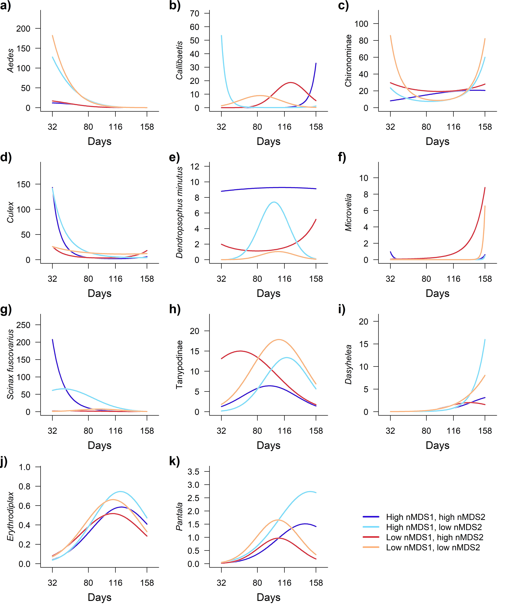
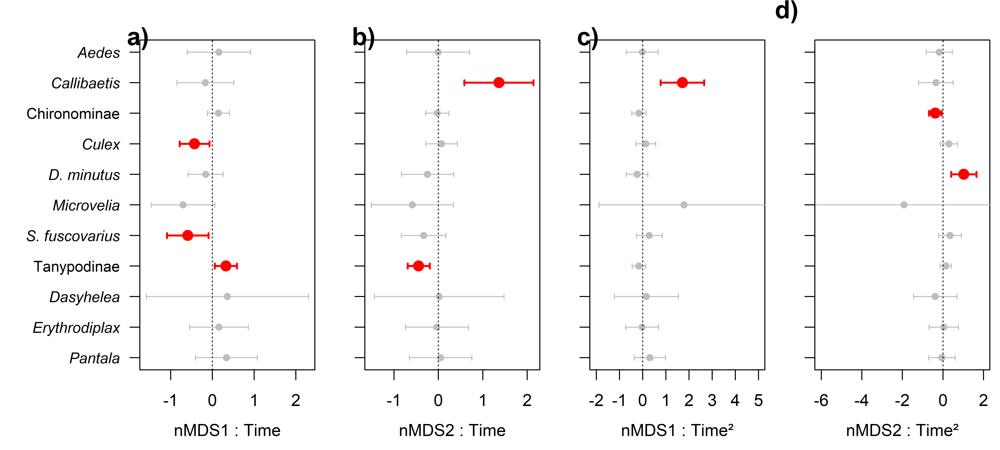
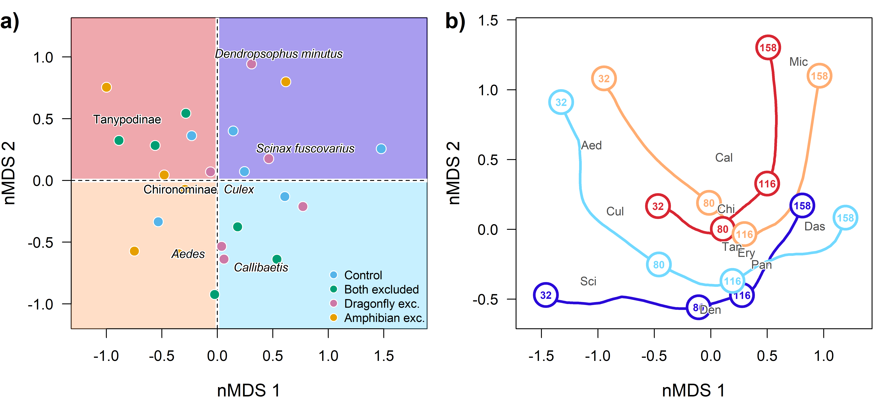
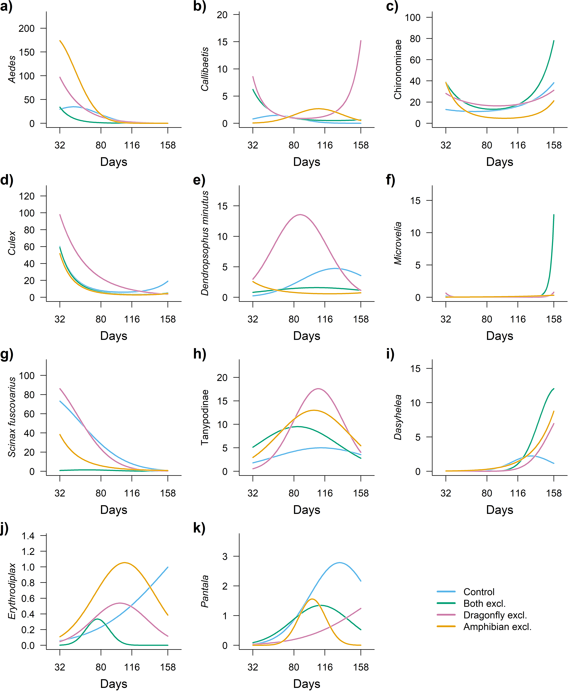
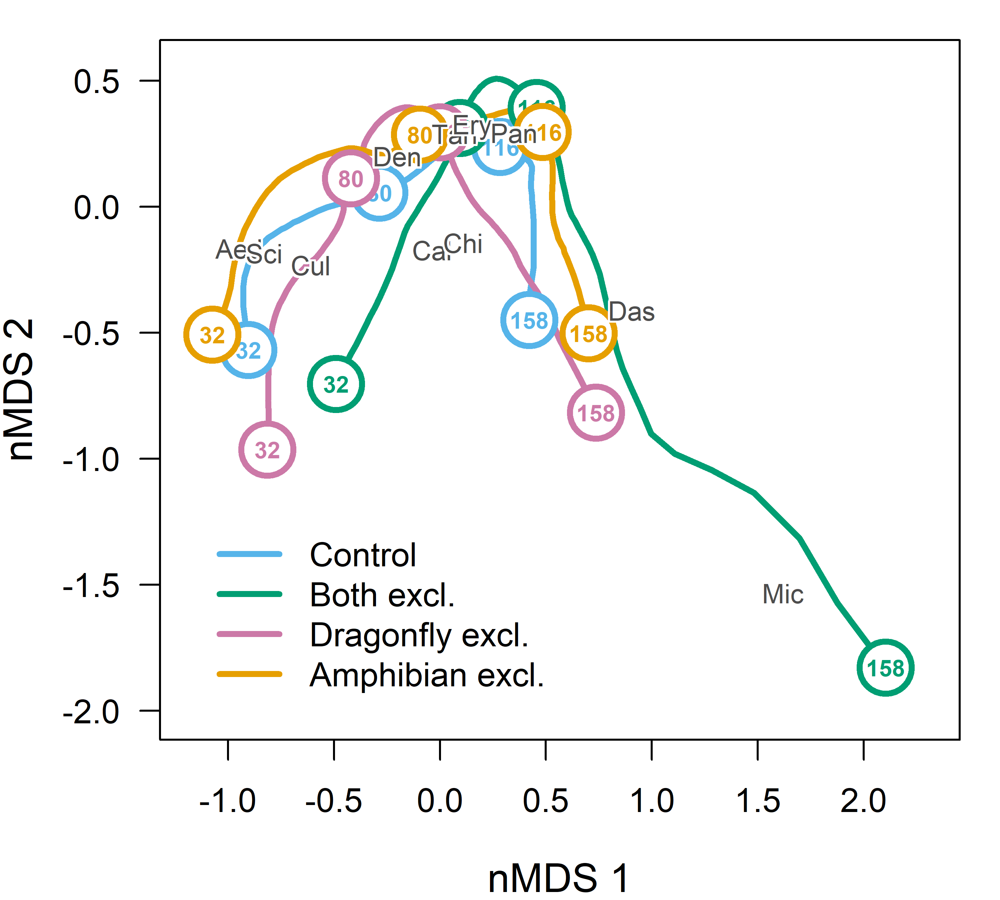

Do different initial community structures produce different trajectories
of community assembly?
================
Rodolfo Pelinson
2026-07-20

## Loading packages and functions

``` r
source(paste(sep = "/",dir,"functions/pairwise_gllvm.R"))
source(paste(sep = "/",dir,"functions/pairwise_mvabund.R"))
source(paste(sep = "/",dir,"functions/my.anova.gllvm.R"))
source(paste(sep = "/",dir,"functions/My_coefplot.R"))
source(paste(sep = "/",dir,"functions/remove_sp.R"))
source(paste(sep = "/",dir,"functions/extract_mles.R"))
source(paste(sep = "/",dir,"functions/my_ordiplot.R"))
source(paste(sep = "/",dir,"functions/get_scaled_lvs.R"))
source(paste(sep = "/",dir,"functions/text_contour.R"))
source(paste(sep = "/",dir,"functions/letters.R"))
```

``` r
library(vegan)
library(gllvm)
library(mvabund)
library(DHARMa)
library(glmmTMB)
library(vioplot)
library(yarrr)
library(colorspace)
```

``` r
sessionInfo()
```

    ## R version 4.5.2 (2025-10-31 ucrt)
    ## Platform: x86_64-w64-mingw32/x64
    ## Running under: Windows 11 x64 (build 26200)
    ## 
    ## Matrix products: default
    ##   LAPACK version 3.12.1
    ## 
    ## locale:
    ## [1] LC_COLLATE=Portuguese_Brazil.utf8  LC_CTYPE=Portuguese_Brazil.utf8   
    ## [3] LC_MONETARY=Portuguese_Brazil.utf8 LC_NUMERIC=C                      
    ## [5] LC_TIME=Portuguese_Brazil.utf8    
    ## 
    ## time zone: Europe/London
    ## tzcode source: internal
    ## 
    ## attached base packages:
    ## [1] stats     graphics  grDevices utils     datasets  methods   base     
    ## 
    ## other attached packages:
    ##  [1] colorspace_2.1-2       yarrr_0.1.14           circlize_0.4.17       
    ##  [4] BayesFactor_0.9.12-4.8 Matrix_1.7-4           coda_0.19-4.1         
    ##  [7] jpeg_0.1-11            vioplot_0.5.1          zoo_1.8-15            
    ## [10] sm_2.2-6.0             glmmTMB_1.1.14         DHARMa_0.4.7          
    ## [13] mvabund_4.2.8          gllvm_2.0.5            TMB_1.9.20            
    ## [16] vegan_2.7-3            permute_0.9-10        
    ## 
    ## loaded via a namespace (and not attached):
    ##  [1] sandwich_3.1-1      shape_1.4.6.1       stringi_1.8.7      
    ##  [4] lattice_0.22-7      magrittr_2.0.4      lme4_2.0-1         
    ##  [7] digest_0.6.39       evaluate_1.0.5      grid_4.5.2         
    ## [10] estimability_1.5.1  mvtnorm_1.3-6       fastmap_1.2.0      
    ## [13] GlobalOptions_0.1.3 mgcv_1.9-3          pbapply_1.7-4      
    ## [16] numDeriv_2016.8-1.1 reformulas_0.4.4    Rdpack_2.6.6       
    ## [19] cli_3.6.5           rlang_1.1.7         rbibutils_2.4.1    
    ## [22] splines_4.5.2       yaml_2.3.12         otel_0.2.0         
    ## [25] tools_4.5.2         parallel_4.5.2      MatrixModels_0.5-4 
    ## [28] nloptr_2.2.1        minqa_1.2.8         boot_1.3-32        
    ## [31] lifecycle_1.0.5     emmeans_2.0.2       stringr_1.6.0      
    ## [34] tweedie_3.0.17      MASS_7.3-65         cluster_2.1.8.1    
    ## [37] glue_1.8.0          Rcpp_1.1.1          statmod_1.5.1      
    ## [40] xfun_0.57           rstudioapi_0.18.0   knitr_1.51         
    ## [43] xtable_1.8-8        htmltools_0.5.9     nlme_3.1-168       
    ## [46] rmarkdown_2.31      compiler_4.5.2      alabama_2025.1.0

## Loading and preparing data

``` r
source(paste(sep = "/",dir,"ajeitando_planilhas.R"))
```

``` r
comm_all_drop_atrasado <- comm_all[Exp_design_all$treatments != "atrasado",]
Exp_design_all_drop_atrasado <- Exp_design_all[Exp_design_all$treatments != "atrasado",]

Exp_design_drop_atrasado <- Exp_design[Exp_design$treatments != "atrasado",]

ncol(comm_all_drop_atrasado)
```

    ## [1] 26

``` r
comm_all_drop_atrasado_rm <- remove_sp(comm_all_drop_atrasado, 10)
ncol(comm_all_drop_atrasado_rm)
```

    ## [1] 11

``` r
Exp_design_all_drop_atrasado$treatments_AM <- paste(Exp_design_all_drop_atrasado$treatments, Exp_design_all_drop_atrasado$AM, sep="_")

Exp_design_all_drop_atrasado$AM_numeric <- as.numeric(Exp_design_all_drop_atrasado$AM)

Exp_design_all_drop_atrasado$treatments <- as.factor(Exp_design_all_drop_atrasado$treatments)

AM_days <- as.numeric(Exp_design_all_drop_atrasado$AM)
AM_days[AM_days == 1] <- 32
AM_days[AM_days == 2] <- 80
AM_days[AM_days == 3] <- 116
AM_days[AM_days == 4] <- 158

AM_days_sc <- scale(AM_days)

Exp_design_all_drop_atrasado$AM_days_sc <- c(AM_days_sc)
Exp_design_all_drop_atrasado$AM_days_sc_squared <- c(AM_days_sc)^2

Exp_design_all_drop_atrasado$AM_days <- c(AM_days)
Exp_design_all_drop_atrasado$AM_days_squared <- c(AM_days)^2


comm_AM1 <- comm_all_drop_atrasado_rm[Exp_design_all_drop_atrasado$AM == 1,]
comm_AM1_rm <- remove_sp(comm_AM1, 3)


comm_AM1_pred <- rbind(comm_AM1_rm, comm_AM1_rm, comm_AM1_rm, comm_AM1_rm)

nrow(comm_AM1_pred)
```

    ## [1] 96

``` r
nrow(Exp_design_all_drop_atrasado)
```

    ## [1] 96

``` r
nrow(comm_all_drop_atrasado_rm)
```

    ## [1] 96

``` r
comm_AM1_pred_st <- decostand(comm_AM1_pred, "stand")
colnames(comm_AM1_pred_st) <- gsub(" ", "_", colnames(comm_AM1_pred_st))

predictors <- data.frame(Exp_design_all_drop_atrasado, comm_AM1_pred_st)
```

## Using NMDS to describe initial communities.

``` r
comm_AM1_rm_total <- data.frame(decostand(comm_AM1_rm, method = "total", MARGIN = 2))
nmds_comm_AM1_rm_total <- metaMDS(comm_AM1_rm_total, distance  = "bray", k = 2)
```

    ## Run 0 stress 0.1917598 
    ## Run 1 stress 0.2309966 
    ## Run 2 stress 0.2250683 
    ## Run 3 stress 0.249786 
    ## Run 4 stress 0.2299066 
    ## Run 5 stress 0.1917598 
    ## ... New best solution
    ## ... Procrustes: rmse 5.445074e-06  max resid 1.794455e-05 
    ## ... Similar to previous best
    ## Run 6 stress 0.1917598 
    ## ... New best solution
    ## ... Procrustes: rmse 2.714572e-06  max resid 6.667325e-06 
    ## ... Similar to previous best
    ## Run 7 stress 0.2250683 
    ## Run 8 stress 0.2288853 
    ## Run 9 stress 0.1917598 
    ## ... Procrustes: rmse 2.686185e-06  max resid 8.810669e-06 
    ## ... Similar to previous best
    ## Run 10 stress 0.1917598 
    ## ... New best solution
    ## ... Procrustes: rmse 1.290002e-06  max resid 4.743287e-06 
    ## ... Similar to previous best
    ## Run 11 stress 0.2320946 
    ## Run 12 stress 0.2379066 
    ## Run 13 stress 0.1917598 
    ## ... Procrustes: rmse 1.545668e-06  max resid 3.873543e-06 
    ## ... Similar to previous best
    ## Run 14 stress 0.2355356 
    ## Run 15 stress 0.2250683 
    ## Run 16 stress 0.1917598 
    ## ... Procrustes: rmse 1.082179e-05  max resid 3.904714e-05 
    ## ... Similar to previous best
    ## Run 17 stress 0.2346149 
    ## Run 18 stress 0.2298332 
    ## Run 19 stress 0.1917598 
    ## ... Procrustes: rmse 2.474999e-06  max resid 8.686751e-06 
    ## ... Similar to previous best
    ## Run 20 stress 0.1917598 
    ## ... Procrustes: rmse 1.64605e-06  max resid 5.095004e-06 
    ## ... Similar to previous best
    ## *** Best solution repeated 5 times

``` r
comm_AM1_nmds <- data.frame(nmds_comm_AM1_rm_total$points)
comm_AM1_nmds_st <- decostand(comm_AM1_nmds, method = "stand")

comm_AM1_nmds_st_pred <- rbind(comm_AM1_nmds_st, comm_AM1_nmds_st, comm_AM1_nmds_st, comm_AM1_nmds_st)

predictors_nmds <- data.frame(Exp_design_all_drop_atrasado, comm_AM1_nmds_st_pred)
```

### Testing for effects

``` r
nrow(predictors_nmds)
```

    ## [1] 96

``` r
nrow(comm_all_drop_atrasado_rm)
```

    ## [1] 96

``` r
set.seed(1)
control <- permute::how(within = permute::Within(type = 'free'),
                        plots = Plots(strata = predictors_nmds$sites, type = 'free'),
                        nperm = 999)
permutations <- shuffleSet(nrow(comm_all_drop_atrasado_rm), control = control)


comm_all_drop_atrasado_mvabund <- mvabund(comm_all_drop_atrasado_rm)


mod_full_lin <- manyglm(comm_all_drop_atrasado_mvabund ~ block2 + ( MDS1 + MDS2 ) + AM_days_sc + AM_days_sc:( MDS1 + MDS2 ), family="negative.binomial",  data = predictors_nmds, composition = FALSE)

mod_full_quad <- manyglm(comm_all_drop_atrasado_mvabund ~ block2 + ( MDS1 + MDS2 ) + AM_days_sc + AM_days_sc_squared + AM_days_sc:( MDS1 + MDS2 ) + AM_days_sc_squared:( MDS1 + MDS2 ), family="negative.binomial",  data = predictors_nmds, composition = FALSE)

anova_quadratic_test <- anova(mod_full_lin, mod_full_quad, bootID = permutations, show.time = "all", cor.type = "I", test = "LR", resamp = "pit.trap")
```

    ## Using <int> bootID matrix from input. 
    ## Resampling begins for test 1.
    ##  Resampling run 0 finished. Time elapsed: 0.00 minutes...
    ##  Resampling run 100 finished. Time elapsed: 0.08 minutes...
    ##  Resampling run 200 finished. Time elapsed: 0.21 minutes...
    ##  Resampling run 300 finished. Time elapsed: 0.34 minutes...
    ##  Resampling run 400 finished. Time elapsed: 0.46 minutes...
    ##  Resampling run 500 finished. Time elapsed: 0.56 minutes...
    ##  Resampling run 600 finished. Time elapsed: 0.67 minutes...
    ##  Resampling run 700 finished. Time elapsed: 0.79 minutes...
    ##  Resampling run 800 finished. Time elapsed: 0.91 minutes...
    ##  Resampling run 900 finished. Time elapsed: 1.02 minutes...
    ## Time elapsed: 0 hr 1 min 7 sec

``` r
anova_quadratic_test
```

    ## Analysis of Deviance Table
    ## 
    ## mod_full_lin: comm_all_drop_atrasado_mvabund ~ block2 + (MDS1 + MDS2) + AM_days_sc + AM_days_sc:(MDS1 + MDS2)
    ## mod_full_quad: comm_all_drop_atrasado_mvabund ~ block2 + (MDS1 + MDS2) + AM_days_sc + AM_days_sc_squared + AM_days_sc:(MDS1 + MDS2) + AM_days_sc_squared:(MDS1 + MDS2)
    ## 
    ## Multivariate test:
    ##               Res.Df Df.diff   Dev Pr(>Dev)   
    ## mod_full_lin      88                          
    ## mod_full_quad     85       3 126.8    0.007 **
    ## ---
    ## Signif. codes:  0 '***' 0.001 '**' 0.01 '*' 0.05 '.' 0.1 ' ' 1
    ## Arguments:
    ##  Test statistics calculated assuming uncorrelated response (for faster computation) 
    ##  P-value calculated using 999 iterations via PIT-trap resampling.

``` r
########################################################
mod_block <- manyglm(comm_all_drop_atrasado_mvabund ~ block2 + ( MDS1 + MDS2 ) + AM_days_sc + AM_days_sc_squared, family="negative.binomial",  data = predictors_nmds, composition = FALSE)

mod_no_block <- manyglm(comm_all_drop_atrasado_mvabund ~ ( MDS1 + MDS2 ) + AM_days_sc + AM_days_sc_squared, family="negative.binomial",  data = predictors_nmds, composition = FALSE)

anova_block <- anova(mod_no_block, mod_block, bootID = permutations, show.block = "all", cor.type = "I", test = "LR", resamp = "pit.trap")
```

    ## Warning in anova.manyglm(mod_no_block, mod_block, bootID = permutations, :
    ## show.block is not a manyglm object nor a valid argument- removed from input,
    ## default value is used instead.

    ## Using <int> bootID matrix from input. 
    ## Time elapsed: 0 hr 0 min 44 sec

``` r
anova_block
```

    ## Analysis of Deviance Table
    ## 
    ## mod_no_block: comm_all_drop_atrasado_mvabund ~ (MDS1 + MDS2) + AM_days_sc + AM_days_sc_squared
    ## mod_block: comm_all_drop_atrasado_mvabund ~ block2 + (MDS1 + MDS2) + AM_days_sc + AM_days_sc_squared
    ## 
    ## Multivariate test:
    ##              Res.Df Df.diff   Dev Pr(>Dev)   
    ## mod_no_block     91                          
    ## mod_block        89       2 70.02    0.002 **
    ## ---
    ## Signif. codes:  0 '***' 0.001 '**' 0.01 '*' 0.05 '.' 0.1 ' ' 1
    ## Arguments:
    ##  Test statistics calculated assuming uncorrelated response (for faster computation) 
    ##  P-value calculated using 999 iterations via PIT-trap resampling.

``` r
########################################################


mod_time <- manyglm(comm_all_drop_atrasado_mvabund ~ block2 + ( MDS1 + MDS2 ) + AM_days_sc + AM_days_sc_squared, family="negative.binomial",  data = predictors_nmds, composition = FALSE)

mod_no_time <- manyglm(comm_all_drop_atrasado_mvabund ~ block2 + ( MDS1 + MDS2 ), family="negative.binomial",  data = predictors_nmds, composition = FALSE)

anova_time <- anova(mod_no_time, mod_time, bootID = permutations, show.time = "all", cor.type = "I", test = "LR", resamp = "pit.trap")
```

    ## Using <int> bootID matrix from input. 
    ## Resampling begins for test 1.
    ##  Resampling run 0 finished. Time elapsed: 0.00 minutes...
    ##  Resampling run 100 finished. Time elapsed: 0.07 minutes...
    ##  Resampling run 200 finished. Time elapsed: 0.14 minutes...
    ##  Resampling run 300 finished. Time elapsed: 0.22 minutes...
    ##  Resampling run 400 finished. Time elapsed: 0.29 minutes...
    ##  Resampling run 500 finished. Time elapsed: 0.36 minutes...
    ##  Resampling run 600 finished. Time elapsed: 0.43 minutes...
    ##  Resampling run 700 finished. Time elapsed: 0.50 minutes...
    ##  Resampling run 800 finished. Time elapsed: 0.56 minutes...
    ##  Resampling run 900 finished. Time elapsed: 0.62 minutes...
    ## Time elapsed: 0 hr 0 min 41 sec

``` r
anova_time
```

    ## Analysis of Deviance Table
    ## 
    ## mod_no_time: comm_all_drop_atrasado_mvabund ~ block2 + (MDS1 + MDS2)
    ## mod_time: comm_all_drop_atrasado_mvabund ~ block2 + (MDS1 + MDS2) + AM_days_sc + AM_days_sc_squared
    ## 
    ## Multivariate test:
    ##             Res.Df Df.diff   Dev Pr(>Dev)    
    ## mod_no_time     91                           
    ## mod_time        89       2 258.7    0.001 ***
    ## ---
    ## Signif. codes:  0 '***' 0.001 '**' 0.01 '*' 0.05 '.' 0.1 ' ' 1
    ## Arguments:
    ##  Test statistics calculated assuming uncorrelated response (for faster computation) 
    ##  P-value calculated using 999 iterations via PIT-trap resampling.

``` r
########################################################


mod_prior <- manyglm(comm_all_drop_atrasado_mvabund ~ block2 + ( MDS1 + MDS2 ) + AM_days_sc + AM_days_sc_squared, family="negative.binomial",  data = predictors_nmds, composition = FALSE)

mod_no_prior <- manyglm(comm_all_drop_atrasado_mvabund ~ block2 + AM_days_sc + AM_days_sc_squared, family="negative.binomial",  data = predictors_nmds, composition = FALSE)

anova_prior <- anova(mod_no_prior, mod_prior, bootID = permutations, show.time = "all", cor.type = "I", test = "LR", resamp = "pit.trap")
```

    ## Using <int> bootID matrix from input. 
    ## Resampling begins for test 1.
    ##  Resampling run 0 finished. Time elapsed: 0.00 minutes...
    ##  Resampling run 100 finished. Time elapsed: 0.07 minutes...
    ##  Resampling run 200 finished. Time elapsed: 0.14 minutes...
    ##  Resampling run 300 finished. Time elapsed: 0.21 minutes...
    ##  Resampling run 400 finished. Time elapsed: 0.29 minutes...
    ##  Resampling run 500 finished. Time elapsed: 0.36 minutes...
    ##  Resampling run 600 finished. Time elapsed: 0.43 minutes...
    ##  Resampling run 700 finished. Time elapsed: 0.50 minutes...
    ##  Resampling run 800 finished. Time elapsed: 0.56 minutes...
    ##  Resampling run 900 finished. Time elapsed: 0.64 minutes...
    ## Time elapsed: 0 hr 0 min 41 sec

``` r
anova_prior
```

    ## Analysis of Deviance Table
    ## 
    ## mod_no_prior: comm_all_drop_atrasado_mvabund ~ block2 + AM_days_sc + AM_days_sc_squared
    ## mod_prior: comm_all_drop_atrasado_mvabund ~ block2 + (MDS1 + MDS2) + AM_days_sc + AM_days_sc_squared
    ## 
    ## Multivariate test:
    ##              Res.Df Df.diff   Dev Pr(>Dev)   
    ## mod_no_prior     91                          
    ## mod_prior        89       2 59.44    0.007 **
    ## ---
    ## Signif. codes:  0 '***' 0.001 '**' 0.01 '*' 0.05 '.' 0.1 ' ' 1
    ## Arguments:
    ##  Test statistics calculated assuming uncorrelated response (for faster computation) 
    ##  P-value calculated using 999 iterations via PIT-trap resampling.

``` r
########################################################
mod_no_int <- manyglm(comm_all_drop_atrasado_mvabund ~ block2 + ( MDS1 + MDS2 ) + AM_days_sc + AM_days_sc_squared, family="negative.binomial",  data = predictors_nmds, composition = FALSE)

mod_int <- manyglm(comm_all_drop_atrasado_mvabund ~ block2 + ( MDS1 + MDS2 ) + AM_days_sc + AM_days_sc_squared + AM_days_sc:( MDS1 + MDS2 ) + AM_days_sc_squared:( MDS1 + MDS2 ), family="negative.binomial",  data = predictors_nmds, composition = FALSE)

anova_interaction <- anova(mod_no_int, mod_int, bootID = permutations, show.time = "all", cor.type = "I", test = "LR", resamp = "pit.trap")
```

    ## Using <int> bootID matrix from input. 
    ## Resampling begins for test 1.
    ##  Resampling run 0 finished. Time elapsed: 0.00 minutes...
    ##  Resampling run 100 finished. Time elapsed: 0.10 minutes...
    ##  Resampling run 200 finished. Time elapsed: 0.21 minutes...
    ##  Resampling run 300 finished. Time elapsed: 0.31 minutes...
    ##  Resampling run 400 finished. Time elapsed: 0.42 minutes...
    ##  Resampling run 500 finished. Time elapsed: 0.51 minutes...
    ##  Resampling run 600 finished. Time elapsed: 0.61 minutes...
    ##  Resampling run 700 finished. Time elapsed: 0.73 minutes...
    ##  Resampling run 800 finished. Time elapsed: 0.84 minutes...
    ##  Resampling run 900 finished. Time elapsed: 0.94 minutes...
    ## Time elapsed: 0 hr 1 min 3 sec

``` r
anova_interaction
```

    ## Analysis of Deviance Table
    ## 
    ## mod_no_int: comm_all_drop_atrasado_mvabund ~ block2 + (MDS1 + MDS2) + AM_days_sc + AM_days_sc_squared
    ## mod_int: comm_all_drop_atrasado_mvabund ~ block2 + (MDS1 + MDS2) + AM_days_sc + AM_days_sc_squared + AM_days_sc:(MDS1 + MDS2) + AM_days_sc_squared:(MDS1 + MDS2)
    ## 
    ## Multivariate test:
    ##            Res.Df Df.diff   Dev Pr(>Dev)    
    ## mod_no_int     89                           
    ## mod_int        85       4 81.74    0.001 ***
    ## ---
    ## Signif. codes:  0 '***' 0.001 '**' 0.01 '*' 0.05 '.' 0.1 ' ' 1
    ## Arguments:
    ##  Test statistics calculated assuming uncorrelated response (for faster computation) 
    ##  P-value calculated using 999 iterations via PIT-trap resampling.

Which are the species who have at least one of the coefficients for the
effect of time in interaction with the effect of the first survey whose
confidence interval do not include zero?

``` r
coefs <- mod_int$coefficients
LCL <- coefs + mod_int$stderr.coefficients * qnorm(0.025) 
UCL <- coefs + mod_int$stderr.coefficients * qnorm(0.975) 

coefs[LCL < 0 &  UCL > 0] <- NA

coefs <- coefs[-c(1:7),]

coefs <- coefs[, colSums(coefs, na.rm = TRUE) != 0]
```

### Making predictions for plotting

``` r
comm_all_drop_atrasado_mvabund2 <- comm_all_drop_atrasado_mvabund + 0.001

mod_int <- manyglm(comm_all_drop_atrasado_mvabund2 ~ block2 + ( MDS1 + MDS2 ) + AM_days_sc + AM_days_sc_squared + AM_days_sc:( MDS1 + MDS2 ) + AM_days_sc_squared:( MDS1 + MDS2 ), family="negative.binomial",  data = predictors_nmds, composition = FALSE)
```

    ## Warning in manyglm(comm_all_drop_atrasado_mvabund2 ~ block2 + (MDS1 + MDS2) + :
    ## Non-integer data are fitted to the negative.binomial model.

``` r
#High abundances of 
#Aedes
#Culex
#Dendropsophus_minutus
#Tanypodinae
#Callibaetis
#Culex

new_data_AB_high_MDS1_high_MDS2 <- 
  data.frame(AM_days_sc = seq(from = min(Exp_design_all_drop_atrasado$AM_days_sc), to = max(Exp_design_all_drop_atrasado$AM_days_sc), length.out = 100),
                                AM_days_sc_squared = seq(from = min(Exp_design_all_drop_atrasado$AM_days_sc), to = max(Exp_design_all_drop_atrasado$AM_days_sc), length.out = 100)^2,
                                block2 = factor(rep("AB", 100), levels = levels(as.factor(Exp_design_all_drop_atrasado$block2))),
             MDS1 = rep(quantile(predictors_nmds$MDS1, 0.9), 100),
             MDS2 = rep(quantile(predictors_nmds$MDS2, 0.9), 100))

new_data_CD_high_MDS1_high_MDS2 <- 
  data.frame(AM_days_sc = seq(from = min(Exp_design_all_drop_atrasado$AM_days_sc), to = max(Exp_design_all_drop_atrasado$AM_days_sc), length.out = 100),
                                AM_days_sc_squared = seq(from = min(Exp_design_all_drop_atrasado$AM_days_sc), to = max(Exp_design_all_drop_atrasado$AM_days_sc), length.out = 100)^2,
                                block2 = factor(rep("CD", 100), levels = levels(as.factor(Exp_design_all_drop_atrasado$block2))),
             MDS1 = rep(quantile(predictors_nmds$MDS1, 0.9), 100),
             MDS2 = rep(quantile(predictors_nmds$MDS2, 0.9), 100))


new_data_EF_high_MDS1_high_MDS2 <- 
  data.frame(AM_days_sc = seq(from = min(Exp_design_all_drop_atrasado$AM_days_sc), to = max(Exp_design_all_drop_atrasado$AM_days_sc), length.out = 100),
                                AM_days_sc_squared = seq(from = min(Exp_design_all_drop_atrasado$AM_days_sc), to = max(Exp_design_all_drop_atrasado$AM_days_sc), length.out = 100)^2,
                                block2 = factor(rep("EF", 100), levels = levels(as.factor(Exp_design_all_drop_atrasado$block2))),
             MDS1 = rep(quantile(predictors_nmds$MDS1, 0.9), 100),
             MDS2 = rep(quantile(predictors_nmds$MDS2, 0.9), 100))


###########################################################################################


new_data_AB_low_MDS1_high_MDS2 <- 
  data.frame(AM_days_sc = seq(from = min(Exp_design_all_drop_atrasado$AM_days_sc), to = max(Exp_design_all_drop_atrasado$AM_days_sc), length.out = 100),
                                AM_days_sc_squared = seq(from = min(Exp_design_all_drop_atrasado$AM_days_sc), to = max(Exp_design_all_drop_atrasado$AM_days_sc), length.out = 100)^2,
                                block2 = factor(rep("AB", 100), levels = levels(as.factor(Exp_design_all_drop_atrasado$block2))),
             MDS1 = rep(quantile(predictors_nmds$MDS1, 0.1), 100),
             MDS2 = rep(quantile(predictors_nmds$MDS2, 0.9), 100))

new_data_CD_low_MDS1_high_MDS2 <- 
  data.frame(AM_days_sc = seq(from = min(Exp_design_all_drop_atrasado$AM_days_sc), to = max(Exp_design_all_drop_atrasado$AM_days_sc), length.out = 100),
                                AM_days_sc_squared = seq(from = min(Exp_design_all_drop_atrasado$AM_days_sc), to = max(Exp_design_all_drop_atrasado$AM_days_sc), length.out = 100)^2,
                                block2 = factor(rep("CD", 100), levels = levels(as.factor(Exp_design_all_drop_atrasado$block2))),
             MDS1 = rep(quantile(predictors_nmds$MDS1, 0.1), 100),
             MDS2 = rep(quantile(predictors_nmds$MDS2, 0.9), 100))


new_data_EF_low_MDS1_high_MDS2 <- 
  data.frame(AM_days_sc = seq(from = min(Exp_design_all_drop_atrasado$AM_days_sc), to = max(Exp_design_all_drop_atrasado$AM_days_sc), length.out = 100),
                                AM_days_sc_squared = seq(from = min(Exp_design_all_drop_atrasado$AM_days_sc), to = max(Exp_design_all_drop_atrasado$AM_days_sc), length.out = 100)^2,
                                block2 = factor(rep("EF", 100), levels = levels(as.factor(Exp_design_all_drop_atrasado$block2))),
             MDS1 = rep(quantile(predictors_nmds$MDS1, 0.1), 100),
             MDS2 = rep(quantile(predictors_nmds$MDS2, 0.9), 100))


###########################################################################################


new_data_AB_low_MDS1_low_MDS2 <- 
  data.frame(AM_days_sc = seq(from = min(Exp_design_all_drop_atrasado$AM_days_sc), to = max(Exp_design_all_drop_atrasado$AM_days_sc), length.out = 100),
                                AM_days_sc_squared = seq(from = min(Exp_design_all_drop_atrasado$AM_days_sc), to = max(Exp_design_all_drop_atrasado$AM_days_sc), length.out = 100)^2,
                                block2 = factor(rep("AB", 100), levels = levels(as.factor(Exp_design_all_drop_atrasado$block2))),
             MDS1 = rep(quantile(predictors_nmds$MDS1, 0.1), 100),
             MDS2 = rep(quantile(predictors_nmds$MDS2, 0.1), 100))

new_data_CD_low_MDS1_low_MDS2 <- 
  data.frame(AM_days_sc = seq(from = min(Exp_design_all_drop_atrasado$AM_days_sc), to = max(Exp_design_all_drop_atrasado$AM_days_sc), length.out = 100),
                                AM_days_sc_squared = seq(from = min(Exp_design_all_drop_atrasado$AM_days_sc), to = max(Exp_design_all_drop_atrasado$AM_days_sc), length.out = 100)^2,
                                block2 = factor(rep("CD", 100), levels = levels(as.factor(Exp_design_all_drop_atrasado$block2))),
             MDS1 = rep(quantile(predictors_nmds$MDS1, 0.1), 100),
             MDS2 = rep(quantile(predictors_nmds$MDS2, 0.1), 100))


new_data_EF_low_MDS1_low_MDS2 <- 
  data.frame(AM_days_sc = seq(from = min(Exp_design_all_drop_atrasado$AM_days_sc), to = max(Exp_design_all_drop_atrasado$AM_days_sc), length.out = 100),
                                AM_days_sc_squared = seq(from = min(Exp_design_all_drop_atrasado$AM_days_sc), to = max(Exp_design_all_drop_atrasado$AM_days_sc), length.out = 100)^2,
                                block2 = factor(rep("EF", 100), levels = levels(as.factor(Exp_design_all_drop_atrasado$block2))),
             MDS1 = rep(quantile(predictors_nmds$MDS1, 0.1), 100),
             MDS2 = rep(quantile(predictors_nmds$MDS2, 0.1), 100))


###########################################################################################


new_data_AB_high_MDS1_low_MDS2 <- 
  data.frame(AM_days_sc = seq(from = min(Exp_design_all_drop_atrasado$AM_days_sc), to = max(Exp_design_all_drop_atrasado$AM_days_sc), length.out = 100),
                                AM_days_sc_squared = seq(from = min(Exp_design_all_drop_atrasado$AM_days_sc), to = max(Exp_design_all_drop_atrasado$AM_days_sc), length.out = 100)^2,
                                block2 = factor(rep("AB", 100), levels = levels(as.factor(Exp_design_all_drop_atrasado$block2))),
             MDS1 = rep(quantile(predictors_nmds$MDS1, 0.9), 100),
             MDS2 = rep(quantile(predictors_nmds$MDS2, 0.1), 100))

new_data_CD_high_MDS1_low_MDS2 <- 
  data.frame(AM_days_sc = seq(from = min(Exp_design_all_drop_atrasado$AM_days_sc), to = max(Exp_design_all_drop_atrasado$AM_days_sc), length.out = 100),
                                AM_days_sc_squared = seq(from = min(Exp_design_all_drop_atrasado$AM_days_sc), to = max(Exp_design_all_drop_atrasado$AM_days_sc), length.out = 100)^2,
                                block2 = factor(rep("CD", 100), levels = levels(as.factor(Exp_design_all_drop_atrasado$block2))),
             MDS1 = rep(quantile(predictors_nmds$MDS1, 0.9), 100),
             MDS2 = rep(quantile(predictors_nmds$MDS2, 0.1), 100))


new_data_EF_high_MDS1_low_MDS2 <- 
  data.frame(AM_days_sc = seq(from = min(Exp_design_all_drop_atrasado$AM_days_sc), to = max(Exp_design_all_drop_atrasado$AM_days_sc), length.out = 100),
                                AM_days_sc_squared = seq(from = min(Exp_design_all_drop_atrasado$AM_days_sc), to = max(Exp_design_all_drop_atrasado$AM_days_sc), length.out = 100)^2,
                                block2 = factor(rep("EF", 100), levels = levels(as.factor(Exp_design_all_drop_atrasado$block2))),
             MDS1 = rep(quantile(predictors_nmds$MDS1, 0.9), 100),
             MDS2 = rep(quantile(predictors_nmds$MDS2, 0.1), 100))


###########################################################################################


###########################################################################################


AB_high_MDS1_high_MDS2 <- predict.manyglm(mod_int, newdata = new_data_AB_high_MDS1_high_MDS2, type = "response")
```

    ## Warning: glm.fit: algoritmo não convergiu

    ## Warning: glm.fit: algoritmo não convergiu

``` r
CD_high_MDS1_high_MDS2 <- predict.manyglm(mod_int, newdata = new_data_CD_high_MDS1_high_MDS2, type = "response")
```

    ## Warning: glm.fit: algoritmo não convergiu
    ## Warning: glm.fit: algoritmo não convergiu

``` r
EF_high_MDS1_high_MDS2 <- predict.manyglm(mod_int, newdata = new_data_EF_high_MDS1_high_MDS2, type = "response")
```

    ## Warning: glm.fit: algoritmo não convergiu
    ## Warning: glm.fit: algoritmo não convergiu

``` r
high_MDS1_high_MDS2 <- array(NA, dim = c(nrow(AB_high_MDS1_high_MDS2), ncol(AB_high_MDS1_high_MDS2), 3))
high_MDS1_high_MDS2[,,1] <- AB_high_MDS1_high_MDS2
high_MDS1_high_MDS2[,,2] <- CD_high_MDS1_high_MDS2
high_MDS1_high_MDS2[,,3] <- EF_high_MDS1_high_MDS2

high_MDS1_high_MDS2_mean <- as.data.frame(apply(high_MDS1_high_MDS2, MARGIN = c(1,2), FUN = mean))
colnames(high_MDS1_high_MDS2_mean) <- colnames(AB_high_MDS1_high_MDS2)
#high_MDS1_high_MDS2_mean


AB_low_MDS1_high_MDS2 <- predict.manyglm(mod_int, newdata = new_data_AB_low_MDS1_high_MDS2, type = "response")
```

    ## Warning: glm.fit: algoritmo não convergiu
    ## Warning: glm.fit: algoritmo não convergiu

``` r
CD_low_MDS1_high_MDS2 <- predict.manyglm(mod_int, newdata = new_data_CD_low_MDS1_high_MDS2, type = "response")
```

    ## Warning: glm.fit: algoritmo não convergiu
    ## Warning: glm.fit: algoritmo não convergiu

``` r
EF_low_MDS1_high_MDS2 <- predict.manyglm(mod_int, newdata = new_data_EF_low_MDS1_high_MDS2, type = "response")
```

    ## Warning: glm.fit: algoritmo não convergiu
    ## Warning: glm.fit: algoritmo não convergiu

``` r
low_MDS1_high_MDS2 <- array(NA, dim = c(nrow(AB_low_MDS1_high_MDS2), ncol(AB_low_MDS1_high_MDS2), 3))
low_MDS1_high_MDS2[,,1] <- AB_low_MDS1_high_MDS2
low_MDS1_high_MDS2[,,2] <- CD_low_MDS1_high_MDS2
low_MDS1_high_MDS2[,,3] <- EF_low_MDS1_high_MDS2

low_MDS1_high_MDS2_mean <- as.data.frame(apply(low_MDS1_high_MDS2, MARGIN = c(1,2), FUN = mean))
colnames(low_MDS1_high_MDS2_mean) <- colnames(AB_low_MDS1_high_MDS2)
#low_MDS1_high_MDS2_mean


AB_high_MDS1_low_MDS2 <- predict.manyglm(mod_int, newdata = new_data_AB_high_MDS1_low_MDS2, type = "response")
```

    ## Warning: glm.fit: algoritmo não convergiu
    ## Warning: glm.fit: algoritmo não convergiu

``` r
CD_high_MDS1_low_MDS2 <- predict.manyglm(mod_int, newdata = new_data_CD_high_MDS1_low_MDS2, type = "response")
```

    ## Warning: glm.fit: algoritmo não convergiu
    ## Warning: glm.fit: algoritmo não convergiu

``` r
EF_high_MDS1_low_MDS2 <- predict.manyglm(mod_int, newdata = new_data_EF_high_MDS1_low_MDS2, type = "response")
```

    ## Warning: glm.fit: algoritmo não convergiu
    ## Warning: glm.fit: algoritmo não convergiu

``` r
high_MDS1_low_MDS2 <- array(NA, dim = c(nrow(AB_high_MDS1_low_MDS2), ncol(AB_high_MDS1_low_MDS2), 3))
high_MDS1_low_MDS2[,,1] <- AB_high_MDS1_low_MDS2
high_MDS1_low_MDS2[,,2] <- CD_high_MDS1_low_MDS2
high_MDS1_low_MDS2[,,3] <- EF_high_MDS1_low_MDS2

high_MDS1_low_MDS2_mean <- as.data.frame(apply(high_MDS1_low_MDS2, MARGIN = c(1,2), FUN = mean))
colnames(high_MDS1_low_MDS2_mean) <- colnames(AB_high_MDS1_low_MDS2)
#high_MDS1_low_MDS2_mean


AB_low_MDS1_low_MDS2 <- predict.manyglm(mod_int, newdata = new_data_AB_low_MDS1_low_MDS2, type = "response")
```

    ## Warning: glm.fit: algoritmo não convergiu
    ## Warning: glm.fit: algoritmo não convergiu

``` r
CD_low_MDS1_low_MDS2 <- predict.manyglm(mod_int, newdata = new_data_CD_low_MDS1_low_MDS2, type = "response")
```

    ## Warning: glm.fit: algoritmo não convergiu
    ## Warning: glm.fit: algoritmo não convergiu

``` r
EF_low_MDS1_low_MDS2 <- predict.manyglm(mod_int, newdata = new_data_EF_low_MDS1_low_MDS2, type = "response")
```

    ## Warning: glm.fit: algoritmo não convergiu
    ## Warning: glm.fit: algoritmo não convergiu

``` r
low_MDS1_low_MDS2 <- array(NA, dim = c(nrow(AB_low_MDS1_low_MDS2), ncol(AB_low_MDS1_low_MDS2), 3))
low_MDS1_low_MDS2[,,1] <- AB_low_MDS1_low_MDS2
low_MDS1_low_MDS2[,,2] <- CD_low_MDS1_low_MDS2
low_MDS1_low_MDS2[,,3] <- EF_low_MDS1_low_MDS2

low_MDS1_low_MDS2_mean <- as.data.frame(apply(low_MDS1_low_MDS2, MARGIN = c(1,2), FUN = mean))
colnames(low_MDS1_low_MDS2_mean) <- colnames(AB_low_MDS1_low_MDS2)
#low_MDS1_low_MDS2_mean
```

### Ploting predicted effects

``` r
col_control <- "#56B4E9"
col_closed <- "#009E73"
col_exc_drag <- "#CC79A7"
col_exc_amph <- "#E69F00"

col_high_1_high_2 <- "#290AD8" #blue dark 
col_low_1_high_2 <- "#D82632" #red dark
col_high_1_low_2 <- "#72D9FF" #blue light 
col_low_1_low_2 <- "#FFAD72" #red light 

sp_names <- colnames(high_MDS1_high_MDS2_mean)
sp_names <- gsub("\\.", " ", sp_names)

sp_fonts <- rep(3, ncol(high_MDS1_high_MDS2_mean))
sp_fonts[sp_names == "Chironominae" | sp_names == "Tanypodinae"] <- 1

sp_letters <- c("a)", "b)", "c)", "d)", "e)", "f)", "g)", "h)", "i)", "j)", "k)")


#svg(filename = "Plots/Community structure analysis/predicted_species_trajectories.svg", width = 10, height = 12, pointsize = 13)


close.screen(all.screens = TRUE)
```

    ## [1] FALSE

``` r
split.screen(matrix(c(0,0.3333333,       0.75,1,
                      0.3333333,0.666666,0.75,1,
                      0.666666,1,        0.75,1,
                      0,0.3333333,       0.5,0.75,
                      0.3333333,0.666666,0.5,0.75,
                      0.666666,1,        0.5,0.75,
                      0,0.3333333,       0.25,0.5,
                      0.3333333,0.666666,0.25,0.5,
                      0.666666,1,        0.25,0.5,
                      0,0.3333333,       0,0.25,
                      0.3333333,0.666666,0,0.25,
                      0.666666,1,        0,0.25), ncol = 4, nrow = 12, byrow = TRUE))
```

    ##  [1]  1  2  3  4  5  6  7  8  9 10 11 12

``` r
for(i in 1:11){
  
screen(i)
  
par(mar = c(4,4,1,1), bty = "l")
  
ymax <- max(c(high_MDS1_high_MDS2_mean[,i], high_MDS1_low_MDS2_mean[,i], low_MDS1_high_MDS2_mean[,i], low_MDS1_low_MDS2_mean[,i]))*1.3

plot(NA, xlim = c(32 - 10, 158 + 10), ylim = c(0, ymax), xaxt = "n", yaxt = "n", xlab = "", ylab = "")

lines(y = high_MDS1_high_MDS2_mean[,i],                                                                                                                         x = seq(from = min(Exp_design_all_drop_atrasado$AM_days), to = max(Exp_design_all_drop_atrasado$AM_days), length.out = 100),
          col= "white", lwd = 3)
lines(y = high_MDS1_high_MDS2_mean[,i],
          x = seq(from = min(Exp_design_all_drop_atrasado$AM_days), to = max(Exp_design_all_drop_atrasado$AM_days), length.out = 100),
          col= col_high_1_high_2, lwd = 2)


lines(y = low_MDS1_high_MDS2_mean[,i],                                                                                                                    x = seq(from = min(Exp_design_all_drop_atrasado$AM_days), to = max(Exp_design_all_drop_atrasado$AM_days), length.out = 100),
          col= "white", lwd = 3)
lines(y = low_MDS1_high_MDS2_mean[,i],
          x = seq(from = min(Exp_design_all_drop_atrasado$AM_days), to = max(Exp_design_all_drop_atrasado$AM_days), length.out = 100),
          col= col_low_1_high_2, lwd = 2)


lines(y = high_MDS1_low_MDS2_mean[,i],                                                                                                                         x = seq(from = min(Exp_design_all_drop_atrasado$AM_days), to = max(Exp_design_all_drop_atrasado$AM_days), length.out = 100),
          col= "white", lwd = 3)
lines(y = high_MDS1_low_MDS2_mean[,i],
          x = seq(from = min(Exp_design_all_drop_atrasado$AM_days), to = max(Exp_design_all_drop_atrasado$AM_days), length.out = 100),
          col= col_high_1_low_2, lwd = 2)


lines(y = low_MDS1_low_MDS2_mean[,i],                                                                                                                         x = seq(from = min(Exp_design_all_drop_atrasado$AM_days), to = max(Exp_design_all_drop_atrasado$AM_days), length.out = 100),
          col= "white", lwd = 3)
lines(y = low_MDS1_low_MDS2_mean[,i],
          x = seq(from = min(Exp_design_all_drop_atrasado$AM_days), to = max(Exp_design_all_drop_atrasado$AM_days), length.out = 100),
          col= col_low_1_low_2, lwd = 2)


axis(1, at = c(32, 80, 116, 158))
title(xlab = "Days", line = 2.5, cex.lab = 1.25)

axis(2, gap.axis = -10, las = 2)
#title(ylab = "Abundance of", line = 3.75, cex.lab = 1.25)
title(ylab = sp_names[i], line = 2.5, cex.lab = 1, font.lab = sp_fonts[i])

letters(x = 0, y = 100, sp_letters[i], cex = 1.5)

}

screen(12)

par(mar = c(0.1,0.1,0.1,0.1), bty = "n")
plot(NA, xlim = c(0, 100), ylim = c(0, 100), xaxt = "n", yaxt = "n", xlab = "", ylab = "")
legend(legend = c("High nMDS1, high nMDS2",
                 "High nMDS1, low nMDS2",
                  "Low nMDS1, high nMDS2",
                  "Low nMDS1, low nMDS2"), x = 50, y = 50, bty = "n", lty = 1, lwd = 3, col = c(col_high_1_high_2, col_high_1_low_2, col_low_1_high_2,col_low_1_low_2), xjust = 0.5, yjust = 0.5)
```

<!-- -->

``` r
#dev.off()
```

### Plotting coefficients

``` r
sp_names <- colnames(mod_int$coefficients)
sp_names <- gsub("\\.", " ", sp_names)

sp_names[sp_names == "Dendropsophus minutus"] <- "D. minutus"
sp_names[sp_names == "Scinax fuscovarius"] <- "S. fuscovarius"

sp_font <- rep(3, length(sp_names))
sp_font[sp_names == "Chironominae"] <- 1
sp_font[sp_names == "Tanypodinae"] <- 1

interaction_coefs <- data.frame(t(mod_int$coefficients[(nrow(mod_int$coefficients)-3):nrow(mod_int$coefficients),]))
interaction_coefs_se <- data.frame(t(mod_int$stderr.coefficients[(nrow(mod_int$stderr.coefficients)-3):nrow(mod_int$stderr.coefficients),]))

interaction_upper <- interaction_coefs + (interaction_coefs_se * qnorm(0.975))
interaction_lower <- interaction_coefs + (interaction_coefs_se * qnorm(0.025))


#svg(filename = "Plots/Community structure analysis/community_trajectories_coefs.svg", width = 10, height = 4.5, pointsize = 12)


close.screen(all.screens = TRUE)
split.screen(matrix(c(0 , 0.1, 0, 1  ,
                      0.1, 0.325, 0, 1,
                      0.325, 0.55, 0, 1,
                      0.55, 0.775, 0, 1,
                      0.775, 1, 0, 1), ncol = 4, nrow = 5, byrow = TRUE))
```

    ## [1] 1 2 3 4 5

``` r
screen(2)
par(mar = c(4,2,2,0.5))

My_coefplot(mles = interaction_coefs$MDS1.AM_days_sc, upper = interaction_upper$MDS1.AM_days_sc,
            lower = interaction_lower$MDS1.AM_days_sc, col_sig = "red",
            cex_sig = 1.5, species_labels = sp_names, yaxis_font = sp_font, cex.axis = 0.9)
title(xlab = "nMDS1 : Time", cex.lab = 1, line = 2.5)
#screen(2, new = FALSE)
letters(x = 12, y = 94, "a)", cex = 1.5)

screen(3)
par(mar = c(4,2,2,0.5))

My_coefplot(mles = interaction_coefs$MDS2.AM_days_sc, upper = interaction_upper$MDS2.AM_days_sc,
            lower = interaction_lower$MDS2.AM_days_sc, col_sig = "red",
            cex_sig = 1.5, species_labels = FALSE, yaxis_font = sp_font, cex.axis = 0.9)
title(xlab = "nMDS2 : Time", cex.lab = 1, line = 2.5)
#screen(2, new = FALSE)
letters(x = 12, y = 94, "b)", cex = 1.5)

screen(4)
par(mar = c(4,2,2,0.5))

My_coefplot(mles = interaction_coefs$MDS1.AM_days_sc_squared, upper = interaction_upper$MDS1.AM_days_sc_squared,
            lower = interaction_lower$MDS1.AM_days_sc_squared, col_sig = "red",
            cex_sig = 1.5, species_labels = FALSE, yaxis_font = sp_font, cex.axis = 0.9, xlim = c(-2,5))
title(xlab = "nMDS1 : Time²", cex.lab = 1, line = 2.5)
#screen(2, new = FALSE)
letters(x = 12, y = 94, "c)", cex = 1.5)

screen(5)
par(mar = c(4,2,2,0.5))

My_coefplot(mles = interaction_coefs$MDS2.AM_days_sc_squared, upper = interaction_upper$MDS2.AM_days_sc_squared,
            lower = interaction_lower$MDS2.AM_days_sc_squared, col_sig = "red",
            cex_sig = 1.5, species_labels = FALSE, yaxis_font = sp_font, cex.axis = 0.9, xlim = c(-6,2))
title(xlab = "nMDS2 : Time²", cex.lab = 1, line = 2.5)
#screen(2, new = FALSE)
letters(x = 0, y = 100, "d)", cex = 1.5)
```

<!-- -->

``` r
#dev.off()
```

``` r
comm_trajectories <- rbind(high_MDS1_high_MDS2_mean, low_MDS1_high_MDS2_mean, high_MDS1_low_MDS2_mean, low_MDS1_low_MDS2_mean)

comm_trajectories_relative <- decostand(comm_trajectories, method = "total", MARGIN = 2)

set.seed(5); nmds_comm_trajectories <- metaMDS(comm_trajectories_relative, distance = "bray", k = 2, trymax  = 50, try = 100, engine = "monoMDS", autotransform  = FALSE)
```

    ## Run 0 stress 0.1592961 
    ## Run 1 stress 0.1592961 
    ## ... New best solution
    ## ... Procrustes: rmse 9.159576e-06  max resid 8.312042e-05 
    ## ... Similar to previous best
    ## Run 2 stress 0.1592966 
    ## ... Procrustes: rmse 0.0001182387  max resid 0.001794327 
    ## ... Similar to previous best
    ## Run 3 stress 0.1592962 
    ## ... Procrustes: rmse 0.0001879905  max resid 0.002571173 
    ## ... Similar to previous best
    ## Run 4 stress 0.1592962 
    ## ... Procrustes: rmse 0.0001867148  max resid 0.002568708 
    ## ... Similar to previous best
    ## Run 5 stress 0.1592963 
    ## ... Procrustes: rmse 0.0001761423  max resid 0.002527926 
    ## ... Similar to previous best
    ## Run 6 stress 0.1733027 
    ## Run 7 stress 0.1592961 
    ## ... New best solution
    ## ... Procrustes: rmse 2.10881e-05  max resid 0.0002102913 
    ## ... Similar to previous best
    ## Run 8 stress 0.1592962 
    ## ... Procrustes: rmse 0.0001703927  max resid 0.002357979 
    ## ... Similar to previous best
    ## Run 9 stress 0.1592961 
    ## ... Procrustes: rmse 2.96669e-05  max resid 0.0002534985 
    ## ... Similar to previous best
    ## Run 10 stress 0.1592962 
    ## ... Procrustes: rmse 0.000163262  max resid 0.002326199 
    ## ... Similar to previous best
    ## Run 11 stress 0.1592962 
    ## ... Procrustes: rmse 0.0001711079  max resid 0.002359723 
    ## ... Similar to previous best
    ## Run 12 stress 0.1592962 
    ## ... Procrustes: rmse 0.0001665191  max resid 0.002341694 
    ## ... Similar to previous best
    ## Run 13 stress 0.1592962 
    ## ... Procrustes: rmse 0.0001746481  max resid 0.002381779 
    ## ... Similar to previous best
    ## Run 14 stress 0.1592962 
    ## ... Procrustes: rmse 0.0001620505  max resid 0.002320806 
    ## ... Similar to previous best
    ## Run 15 stress 0.1732933 
    ## Run 16 stress 0.1592962 
    ## ... Procrustes: rmse 0.0001704448  max resid 0.002358329 
    ## ... Similar to previous best
    ## Run 17 stress 0.1592962 
    ## ... Procrustes: rmse 0.0001745612  max resid 0.002376935 
    ## ... Similar to previous best
    ## Run 18 stress 0.1592963 
    ## ... Procrustes: rmse 0.0001772559  max resid 0.002380447 
    ## ... Similar to previous best
    ## Run 19 stress 0.1592961 
    ## ... Procrustes: rmse 2.830676e-05  max resid 0.0002150186 
    ## ... Similar to previous best
    ## Run 20 stress 0.1592962 
    ## ... Procrustes: rmse 0.0001682954  max resid 0.002352136 
    ## ... Similar to previous best
    ## Run 21 stress 0.1732825 
    ## Run 22 stress 0.1732827 
    ## Run 23 stress 0.1592962 
    ## ... Procrustes: rmse 0.0001714969  max resid 0.002362759 
    ## ... Similar to previous best
    ## Run 24 stress 0.4189868 
    ## Run 25 stress 0.1592961 
    ## ... Procrustes: rmse 3.354033e-05  max resid 0.0003240311 
    ## ... Similar to previous best
    ## Run 26 stress 0.1734085 
    ## Run 27 stress 0.1732947 
    ## Run 28 stress 0.1592962 
    ## ... Procrustes: rmse 0.0001676368  max resid 0.00234833 
    ## ... Similar to previous best
    ## Run 29 stress 0.1592962 
    ## ... Procrustes: rmse 0.0001604926  max resid 0.002308812 
    ## ... Similar to previous best
    ## Run 30 stress 0.1592961 
    ## ... New best solution
    ## ... Procrustes: rmse 9.964481e-06  max resid 0.000137061 
    ## ... Similar to previous best
    ## Run 31 stress 0.1732925 
    ## Run 32 stress 0.1592962 
    ## ... Procrustes: rmse 0.0001829368  max resid 0.002512599 
    ## ... Similar to previous best
    ## Run 33 stress 0.1592967 
    ## ... Procrustes: rmse 0.0001071457  max resid 0.001776014 
    ## ... Similar to previous best
    ## Run 34 stress 0.1592962 
    ## ... Procrustes: rmse 0.0001831807  max resid 0.002514831 
    ## ... Similar to previous best
    ## Run 35 stress 0.1592962 
    ## ... Procrustes: rmse 0.0001745718  max resid 0.002483951 
    ## ... Similar to previous best
    ## Run 36 stress 0.1592962 
    ## ... Procrustes: rmse 0.0001811659  max resid 0.002506858 
    ## ... Similar to previous best
    ## Run 37 stress 0.1592962 
    ## ... Procrustes: rmse 0.0001747752  max resid 0.002483535 
    ## ... Similar to previous best
    ## Run 38 stress 0.1592962 
    ## ... Procrustes: rmse 0.0001806658  max resid 0.002510077 
    ## ... Similar to previous best
    ## Run 39 stress 0.1592961 
    ## ... Procrustes: rmse 2.476293e-05  max resid 0.0002174216 
    ## ... Similar to previous best
    ## Run 40 stress 0.1592962 
    ## ... Procrustes: rmse 0.0001767867  max resid 0.002492679 
    ## ... Similar to previous best
    ## Run 41 stress 0.1592962 
    ## ... Procrustes: rmse 0.0001548529  max resid 0.002194962 
    ## ... Similar to previous best
    ## Run 42 stress 0.1732809 
    ## Run 43 stress 0.1592962 
    ## ... Procrustes: rmse 0.0001796358  max resid 0.002501504 
    ## ... Similar to previous best
    ## Run 44 stress 0.1592962 
    ## ... Procrustes: rmse 0.0001758031  max resid 0.002486794 
    ## ... Similar to previous best
    ## Run 45 stress 0.1592961 
    ## ... Procrustes: rmse 9.668724e-06  max resid 6.074624e-05 
    ## ... Similar to previous best
    ## Run 46 stress 0.1592962 
    ## ... Procrustes: rmse 0.0001684059  max resid 0.002457068 
    ## ... Similar to previous best
    ## Run 47 stress 0.1592962 
    ## ... Procrustes: rmse 0.0001810076  max resid 0.002506448 
    ## ... Similar to previous best
    ## Run 48 stress 0.1592962 
    ## ... Procrustes: rmse 0.0001798695  max resid 0.002504459 
    ## ... Similar to previous best
    ## Run 49 stress 0.1592962 
    ## ... Procrustes: rmse 0.000178731  max resid 0.002499075 
    ## ... Similar to previous best
    ## Run 50 stress 0.1592962 
    ## ... Procrustes: rmse 0.0001754962  max resid 0.002487654 
    ## ... Similar to previous best
    ## *** Best solution repeated 19 times

``` r
nmds_comm_trajectories
```

    ## 
    ## Call:
    ## metaMDS(comm = comm_trajectories_relative, distance = "bray",      k = 2, try = 100, trymax = 50, engine = "monoMDS", autotransform = FALSE) 
    ## 
    ## global Multidimensional Scaling using monoMDS
    ## 
    ## Data:     comm_trajectories_relative 
    ## Distance: bray 
    ## 
    ## Dimensions: 2 
    ## Stress:     0.1592961 
    ## Stress type 1, weak ties
    ## Best solution was repeated 19 times in 50 tries
    ## The best solution was from try 30 (random start)
    ## Scaling: centring, PC rotation, halfchange scaling 
    ## Species: expanded scores based on 'comm_trajectories_relative'

``` r
points_high_MDS1_high_MDS2 <- nmds_comm_trajectories$points[1:100,]
points_low_MDS1_high_MDS2 <- nmds_comm_trajectories$points[101:200,]
points_high_MDS1_low_MDS2 <- nmds_comm_trajectories$points[201:300,]
points_low_MDS1_low_MDS2 <- nmds_comm_trajectories$points[301:400,]

species_pred <- nmds_comm_trajectories$species
```

``` r
find_day <- function(day, min, max, length = 100){
  
  new_day <- day - min
  range <- max - min
  
  result <- round((new_day*length)/range)
  
  if(result == 0){result <- 1}
  
  return(result)
  
}
```

``` r
species <- nmds_comm_AM1_rm_total$species

sp_names <- rownames(species)
sp_names <- gsub("\\.", " ", sp_names)

sp_font <- rep(3, length(sp_names))
sp_font[sp_names == "Chironominae"] <- 1
sp_font[sp_names == "Tanypodinae"] <- 1

col_control <- "#56B4E9"
col_closed <- "#009E73"
col_exc_drag <- "#CC79A7"
col_exc_amph <- "#E69F00"

col_high_1_high_2 <- "#290AD8" #blue dark 
col_low_1_high_2 <- "#D82632" #red dark
col_high_1_low_2 <- "#72D9FF" #blue light 
col_low_1_low_2 <- "#FFAD72" #red light 

#svg(filename = "Plots/Community structure analysis/community_trajectories.svg", width = 10, height = 4.5, pointsize = 12)


close.screen(all.screens = TRUE)
split.screen(matrix(c(0  , 0.5, 0, 1  ,
                      0.5, 1  , 0, 1  ), ncol = 4, nrow = 2, byrow = TRUE))
```

    ## [1] 1 2

``` r
screen(1)
par(mar = c(4,4,1,1), bty = "o")


xmin <- min(c(comm_AM1_nmds[,1], species[,1]))*1.2
xmax <- max(c(comm_AM1_nmds[,1], species[,1]))*1.2
ymin <- min(c(comm_AM1_nmds[,2], species[,2]))*1.2
ymax <- max(c(comm_AM1_nmds[,2], species[,2]))*1.2


plot(comm_AM1_nmds[,1], comm_AM1_nmds[,2], xlim = c(xmin,xmax), ylim = c(ymin, ymax),
     type = "n", xaxt = "n", yaxt = "n", ylab = "", xlab = "")


rect(xleft = 0, ybottom = 0, xright = xmax*1.2, ytop = ymax*1.2 ,col = transparent(col_high_1_high_2, trans.val = 0.6), border = "white", lwd = 4)
rect(xleft = xmin*1.2, ybottom = ymin*1.2, xright = 0, ytop = 0,col = transparent(col_low_1_low_2, trans.val = 0.6), border = "white", lwd = 4)
rect(xleft = 0, ybottom = ymin*1.2, xright = xmax*1.2, ytop = 0,col = transparent(col_high_1_low_2, trans.val = 0.6), border = "white", lwd = 4)
rect(xleft = xmin*1.2, ybottom = 0, xright = 0, ytop = ymax*1.2,col = transparent(col_low_1_high_2, trans.val = 0.6), border = "white", lwd = 4)


abline(h = 0, v = 0, lty = 2)

library(scales)
library(shape)


#pal <- col_numeric(palette = c("white", "black"), domain = urb, na.color = "grey50", alpha = FALSE, reverse = FALSE)
#col <-pal(urb)

#points(comm_AM1_nmds[,1],comm_AM1_nmds[,2], col = "grey70", bg = "white", pch = 16, cex = 1.5)


points(comm_AM1_nmds[Exp_design_drop_atrasado$treatments == "controle",1],comm_AM1_nmds[Exp_design_drop_atrasado$treatments == "controle",2], col = "white", bg = col_control, pch = 21, cex = 1.5)

points(comm_AM1_nmds[Exp_design_drop_atrasado$treatments == "fechado",1],comm_AM1_nmds[Exp_design_drop_atrasado$treatments == "fechado",2], col = "white", bg = col_closed, pch = 21, cex = 1.5)

points(comm_AM1_nmds[Exp_design_drop_atrasado$treatments == "fechado_dia",1],comm_AM1_nmds[Exp_design_drop_atrasado$treatments == "fechado_dia",2], col = "white", bg = col_exc_drag, pch = 21, cex = 1.5)

points(comm_AM1_nmds[Exp_design_drop_atrasado$treatments == "fechado_noite",1],comm_AM1_nmds[Exp_design_drop_atrasado$treatments == "fechado_noite",2], col = "white", bg = col_exc_amph, pch = 21, cex = 1.5)

#Arrows(x0 <- rep(0, nrow(species)),
#       y0 <- rep(0, nrow(species)),
#       x1 <- species[,1],
#       y1 <- species[,2], arr.type = "triangle", arr.length = 0.4, col = "#C49C94", lwd = 1.5)


for(i in 1:length(sp_names)){
  text_contour(x = species[i,1],
       y = species[i,2], labels = sp_names[i], cex = 0.8, col = "white", thick = 0.004, font = sp_font[i])
  text(x = species[i,1], y = species[i,2], labels = sp_names[i], cex = 0.8, col = "black", font = sp_font[i])
}


axis(1, cex.axis = 1)
axis(2, cex.axis = 1, las = 2)
title(xlab = "nMDS 1", cex.lab = 1.2, line = 3)
title(ylab = "nMDS 2", cex.lab = 1.2, line = 3)
#title(main = "Morphological traits", line = 0.5, adj = 0, cex.main = 1.5)

par(new= TRUE, bty = "n")
plot(NA, ylab = "", xlab = "", xlim = c(0,100), ylim = c(0,100), xaxt = "n", yaxt = "n")

legend(x = 105, y = -5, xjust = 1, yjust = 0, legend = c("Control", "Both excluded", "Dragonfly exc.", "Amphibian exc."), bty = "n", bg = "transparent", pch = 21, pt.bg = c(col_control, col_closed, col_exc_drag, col_exc_amph), col = "white", cex = 0.8, pt.cex = 1.2)

letters(x = 0, y = 97, "a)", cex = 1.5)


screen(2)

#set.seed(1);species_pred <- jitter(species_pred, amount = 0.25)

xmin <- min(c(points_high_MDS1_high_MDS2[,1], points_low_MDS1_high_MDS2[,1], points_high_MDS1_low_MDS2[,1], points_low_MDS1_low_MDS2[,1],species_pred[,1]))*1.1
xmax <- max(c(points_high_MDS1_high_MDS2[,1], points_low_MDS1_high_MDS2[,1], points_high_MDS1_low_MDS2[,1], points_low_MDS1_low_MDS2[,1],species_pred[,1]))*1.1

ymin <- min(c(points_high_MDS1_high_MDS2[,2], points_low_MDS1_high_MDS2[,2], points_high_MDS1_low_MDS2[,2], points_low_MDS1_low_MDS2[,2],species_pred[,2]))*1.1
ymax <- max(c(points_high_MDS1_high_MDS2[,2], points_low_MDS1_high_MDS2[,2], points_high_MDS1_low_MDS2[,2], points_low_MDS1_low_MDS2[,2],species_pred[,2]))*1.1

par(mar = c(4, 4, 1, 1), bty = "o")
  
plot(NA, xlim = c(xmin, xmax), ylim = c(ymin, ymax), xlab = "", ylab = "", xaxt = "n", yaxt = "n")

lines(x = points_high_MDS1_high_MDS2[,1], y = points_high_MDS1_high_MDS2[,2], lwd = 3, lty = 1, col = col_high_1_high_2) #controle

lines(x = points_low_MDS1_high_MDS2[,1], y = points_low_MDS1_high_MDS2[,2], lwd = 3, lty = 1, col = col_low_1_high_2) #atrasado

lines(x = points_high_MDS1_low_MDS2[,1], y = points_high_MDS1_low_MDS2[,2], lwd = 3, lty = 1, col = col_high_1_low_2) #fechado

lines(x = points_low_MDS1_low_MDS2[,1], y = points_low_MDS1_low_MDS2[,2], lwd = 3, lty = 1, col = col_low_1_low_2) #fechado


#####################################################################


##################################################

points(x = points_high_MDS1_high_MDS2[find_day(day = 32, min = 32, max = 158),1],
       y = points_high_MDS1_high_MDS2[find_day(day = 32, min = 32, max = 158),2],
       pch = 21, bg = "white", col = col_high_1_high_2, lwd = 3, cex = 3.5)

text(x = points_high_MDS1_high_MDS2[find_day(day = 32, min = 32, max = 158),1],
       y = points_high_MDS1_high_MDS2[find_day(day = 32, min = 32, max = 158),2], labels = "32", cex = 0.7, col = col_high_1_high_2, font = 2)

points(x = points_high_MDS1_high_MDS2[find_day(day = 80, min = 32, max = 158),1],
       y = points_high_MDS1_high_MDS2[find_day(day = 80, min = 32, max = 158),2],
       pch = 21, bg = "white", col = col_high_1_high_2, lwd = 3, cex = 3.5)

text(x = points_high_MDS1_high_MDS2[find_day(day = 80, min = 32, max = 158),1],
       y = points_high_MDS1_high_MDS2[find_day(day = 80, min = 32, max = 158),2], labels = "80", cex = 0.7, col = col_high_1_high_2, font = 2)

points(x = points_high_MDS1_high_MDS2[find_day(day = 116, min = 32, max = 158),1],
       y = points_high_MDS1_high_MDS2[find_day(day = 116, min = 32, max = 158),2],
       pch = 21, bg = "white", col = col_high_1_high_2, lwd = 3, cex = 3.5)

text(x = points_high_MDS1_high_MDS2[find_day(day = 116, min = 32, max = 158),1],
       y = points_high_MDS1_high_MDS2[find_day(day = 116, min = 32, max = 158),2], labels = "116", cex = 0.7, col = col_high_1_high_2, font = 2)

points(x = points_high_MDS1_high_MDS2[find_day(day = 158, min = 32, max = 158),1],
       y = points_high_MDS1_high_MDS2[find_day(day = 158, min = 32, max = 158),2],
       pch = 21, bg = "white", col = col_high_1_high_2, lwd = 3, cex = 3.5)

text(x = points_high_MDS1_high_MDS2[find_day(day = 158, min = 32, max = 158),1],
       y = points_high_MDS1_high_MDS2[find_day(day = 158, min = 32, max = 158),2], labels = "158", cex = 0.7, col = col_high_1_high_2, font = 2)
#################################################


##################################################

points(x = points_low_MDS1_high_MDS2[find_day(day = 32, min = 32, max = 158),1],
       y = points_low_MDS1_high_MDS2[find_day(day = 32, min = 32, max = 158),2],
       pch = 21, bg = "white", col = col_low_1_high_2, lwd = 3, cex = 3.5)

text(x = points_low_MDS1_high_MDS2[find_day(day = 32, min = 32, max = 158),1],
       y = points_low_MDS1_high_MDS2[find_day(day = 32, min = 32, max = 158),2], labels = "32", cex = 0.7, font = 2, col = col_low_1_high_2)

points(x = points_low_MDS1_high_MDS2[find_day(day = 80, min = 32, max = 158),1],
       y = points_low_MDS1_high_MDS2[find_day(day = 80, min = 32, max = 158),2],
       pch = 21, bg = "white", col = col_low_1_high_2, lwd = 3, cex = 3.5)

text(x = points_low_MDS1_high_MDS2[find_day(day = 80, min = 32, max = 158),1],
       y = points_low_MDS1_high_MDS2[find_day(day = 80, min = 32, max = 158),2], labels = "80", cex = 0.7, font = 2, col = col_low_1_high_2)

points(x = points_low_MDS1_high_MDS2[find_day(day = 116, min = 32, max = 158),1],
       y = points_low_MDS1_high_MDS2[find_day(day = 116, min = 32, max = 158),2],
       pch = 21, bg = "white", col = col_low_1_high_2, lwd = 3, cex = 3.5)

text(x = points_low_MDS1_high_MDS2[find_day(day = 116, min = 32, max = 158),1],
       y = points_low_MDS1_high_MDS2[find_day(day = 116, min = 32, max = 158),2], labels = "116", cex = 0.7, font = 2, col = col_low_1_high_2)

points(x = points_low_MDS1_high_MDS2[find_day(day = 158, min = 32, max = 158),1],
       y = points_low_MDS1_high_MDS2[find_day(day = 158, min = 32, max = 158),2],
       pch = 21, bg = "white", col = col_low_1_high_2, lwd = 3, cex = 3.5)

text(x = points_low_MDS1_high_MDS2[find_day(day = 158, min = 32, max = 158),1],
       y = points_low_MDS1_high_MDS2[find_day(day = 158, min = 32, max = 158),2], labels = "158", cex = 0.7, font = 2, col = col_low_1_high_2)
#################################################


##################################################

points(x = points_high_MDS1_low_MDS2[find_day(day = 32, min = 32, max = 158),1],
       y = points_high_MDS1_low_MDS2[find_day(day = 32, min = 32, max = 158),2],
       pch = 21, bg = "white", col = col_high_1_low_2, lwd = 3, cex = 3.5)

text(x = points_high_MDS1_low_MDS2[find_day(day = 32, min = 32, max = 158),1],
       y = points_high_MDS1_low_MDS2[find_day(day = 32, min = 32, max = 158),2], labels = "32", cex = 0.7, font = 2, col = col_high_1_low_2)

points(x = points_high_MDS1_low_MDS2[find_day(day = 80, min = 32, max = 158),1],
       y = points_high_MDS1_low_MDS2[find_day(day = 80, min = 32, max = 158),2],
       pch = 21, bg = "white", col = col_high_1_low_2, lwd = 3, cex = 3.5)

text(x = points_high_MDS1_low_MDS2[find_day(day = 80, min = 32, max = 158),1],
       y = points_high_MDS1_low_MDS2[find_day(day = 80, min = 32, max = 158),2], labels = "80", cex = 0.7, font = 2, col = col_high_1_low_2)

points(x = points_high_MDS1_low_MDS2[find_day(day = 116, min = 32, max = 158),1],
       y = points_high_MDS1_low_MDS2[find_day(day = 116, min = 32, max = 158),2],
       pch = 21, bg = "white", col = col_high_1_low_2, lwd = 3, cex = 3.5)

text(x = points_high_MDS1_low_MDS2[find_day(day = 116, min = 32, max = 158),1],
       y = points_high_MDS1_low_MDS2[find_day(day = 116, min = 32, max = 158),2], labels = "116", cex = 0.7, font = 2, col = col_high_1_low_2)

points(x = points_high_MDS1_low_MDS2[find_day(day = 158, min = 32, max = 158),1],
       y = points_high_MDS1_low_MDS2[find_day(day = 158, min = 32, max = 158),2],
       pch = 21, bg = "white", col = col_high_1_low_2, lwd = 3, cex = 3.5)

text(x = points_high_MDS1_low_MDS2[find_day(day = 158, min = 32, max = 158),1],
       y = points_high_MDS1_low_MDS2[find_day(day = 158, min = 32, max = 158),2], labels = "158", cex = 0.7, font = 2, col = col_high_1_low_2)
#################################################


##################################################

points(x = points_low_MDS1_low_MDS2[find_day(day = 32, min = 32, max = 158),1],
       y = points_low_MDS1_low_MDS2[find_day(day = 32, min = 32, max = 158),2],
       pch = 21, bg = "white", col = col_low_1_low_2, lwd = 3, cex = 3.5)

text(x = points_low_MDS1_low_MDS2[find_day(day = 32, min = 32, max = 158),1],
       y = points_low_MDS1_low_MDS2[find_day(day = 32, min = 32, max = 158),2], labels = "32", cex = 0.7, font = 2, col = col_low_1_low_2)

points(x = points_low_MDS1_low_MDS2[find_day(day = 80, min = 32, max = 158),1],
       y = points_low_MDS1_low_MDS2[find_day(day = 80, min = 32, max = 158),2],
       pch = 21, bg = "white", col = col_low_1_low_2, lwd = 3, cex = 3.5)

text(x = points_low_MDS1_low_MDS2[find_day(day = 80, min = 32, max = 158),1],
       y = points_low_MDS1_low_MDS2[find_day(day = 80, min = 32, max = 158),2], labels = "80", cex = 0.7, font = 2, col = col_low_1_low_2)

points(x = points_low_MDS1_low_MDS2[find_day(day = 116, min = 32, max = 158),1],
       y = points_low_MDS1_low_MDS2[find_day(day = 116, min = 32, max = 158),2],
       pch = 21, bg = "white", col = col_low_1_low_2, lwd = 3, cex = 3.5)

text(x = points_low_MDS1_low_MDS2[find_day(day = 116, min = 32, max = 158),1],
       y = points_low_MDS1_low_MDS2[find_day(day = 116, min = 32, max = 158),2], labels = "116", cex = 0.7, font = 2, col = col_low_1_low_2)

points(x = points_low_MDS1_low_MDS2[find_day(day = 158, min = 32, max = 158),1],
       y = points_low_MDS1_low_MDS2[find_day(day = 158, min = 32, max = 158),2],
       pch = 21, bg = "white", col = col_low_1_low_2, lwd = 3, cex = 3.5)

text(x = points_low_MDS1_low_MDS2[find_day(day = 158, min = 32, max = 158),1],
       y = points_low_MDS1_low_MDS2[find_day(day = 158, min = 32, max = 158),2], labels = "158", cex = 0.7, font = 2, col = col_low_1_low_2)
#################################################


########################## species_pred #################################


sp_names <- rownames(species_pred)
sp_names <- substr(sp_names, start = 1, stop = 3)


for(i in 1:nrow(species_pred)){
  #points(x = species_pred[i,1],
   #    y = species_pred[i,2],
    #   pch = 21, bg = "white", col = "grey50", lwd = 2, cex = 4)

text_contour(x = species_pred[i,1],
       y = species_pred[i,2], labels = sp_names[i], cex = 0.8, col = "white", thick = 0.004)
  
text(x = species_pred[i,1],
       y = species_pred[i,2], labels = sp_names[i], cex = 0.8, col = "grey30")
}


axis(1)
axis(2, cex.axis = 1, las = 2)

title(xlab = "nMDS 1", line = 3, cex.lab = 1.2)
title(ylab = "nMDS 2", line = 3, cex.lab = 1.2)

letters(x = 0, y = 97, "b)", cex = 1.5)
```

<!-- -->

``` r
#par(new = TRUE)
#plot(NA, xlim = c(0, 100), ylim = c(0, 100), xlab = "", ylab = "", xaxt = "n", yaxt = "n", bty = "n")

#legend(x = 100, y = 100, xjust = 1, yjust = 1, lty = c(1,1,1), lwd = 3, legend = c("Control", "Closed", "Late"), col = c("#009E73", "#56B4E9","#D55E00"), bty = "n")

#dev.off()
```

## Using treatments to describe initial communities.

### Testing for effects

``` r
nrow(predictors_nmds)
```

    ## [1] 96

``` r
nrow(comm_all_drop_atrasado_rm)
```

    ## [1] 96

``` r
#comm_all_drop_atrasado_rm2 <- comm_all_drop_atrasado_rm[,colnames(comm_all_drop_atrasado_rm) != "Microvelia"]


set.seed(3)
control <- permute::how(within = permute::Within(type = 'free'),
                        plots = Plots(strata = predictors_nmds$sites, type = 'free'),
                        nperm = 999)
permutations <- shuffleSet(nrow(comm_all_drop_atrasado_rm), control = control)


comm_all_drop_atrasado_mvabund <- mvabund(comm_all_drop_atrasado_rm)


mod_full_lin <- manyglm(comm_all_drop_atrasado_mvabund ~ block2 + treatments  + AM_days_sc + AM_days_sc:treatments, family="negative.binomial",  data = predictors_nmds, composition = FALSE)


mod_full_quad <- manyglm(comm_all_drop_atrasado_mvabund ~ block2 + treatments + AM_days_sc + AM_days_sc_squared + AM_days_sc:treatments + AM_days_sc_squared:treatments, family="negative.binomial",  data = predictors_nmds, composition = FALSE)

anova_quadratic_test <- anova(mod_full_lin, mod_full_quad, bootID = permutations, show.time = "all", cor.type = "I", test = "LR", resamp = "pit.trap")
```

    ## Using <int> bootID matrix from input. 
    ## Resampling begins for test 1.
    ##  Resampling run 0 finished. Time elapsed: 0.00 minutes...
    ##  Resampling run 100 finished. Time elapsed: 0.09 minutes...
    ##  Resampling run 200 finished. Time elapsed: 0.17 minutes...
    ##  Resampling run 300 finished. Time elapsed: 0.27 minutes...
    ##  Resampling run 400 finished. Time elapsed: 0.39 minutes...
    ##  Resampling run 500 finished. Time elapsed: 0.51 minutes...
    ##  Resampling run 600 finished. Time elapsed: 0.62 minutes...
    ##  Resampling run 700 finished. Time elapsed: 0.73 minutes...
    ##  Resampling run 800 finished. Time elapsed: 0.83 minutes...
    ##  Resampling run 900 finished. Time elapsed: 0.93 minutes...
    ## Time elapsed: 0 hr 1 min 2 sec

``` r
anova_quadratic_test
```

    ## Analysis of Deviance Table
    ## 
    ## mod_full_lin: comm_all_drop_atrasado_mvabund ~ block2 + treatments + AM_days_sc + AM_days_sc:treatments
    ## mod_full_quad: comm_all_drop_atrasado_mvabund ~ block2 + treatments + AM_days_sc + AM_days_sc_squared + AM_days_sc:treatments + AM_days_sc_squared:treatments
    ## 
    ## Multivariate test:
    ##               Res.Df Df.diff   Dev Pr(>Dev)    
    ## mod_full_lin      86                           
    ## mod_full_quad     82       4 118.3    0.001 ***
    ## ---
    ## Signif. codes:  0 '***' 0.001 '**' 0.01 '*' 0.05 '.' 0.1 ' ' 1
    ## Arguments:
    ##  Test statistics calculated assuming uncorrelated response (for faster computation) 
    ##  P-value calculated using 999 iterations via PIT-trap resampling.

``` r
########################################################
mod_block <- manyglm(comm_all_drop_atrasado_mvabund ~ block2 + treatments + AM_days_sc + AM_days_sc_squared, family="negative.binomial",  data = predictors_nmds, composition = FALSE)

mod_no_block <- manyglm(comm_all_drop_atrasado_mvabund ~ treatments + AM_days_sc + AM_days_sc_squared, family="negative.binomial",  data = predictors_nmds, composition = FALSE)

anova_block <- anova(mod_no_block, mod_block, bootID = permutations, show.time = "all", cor.type = "I", test = "LR", resamp = "pit.trap")
```

    ## Using <int> bootID matrix from input. 
    ## Resampling begins for test 1.
    ##  Resampling run 0 finished. Time elapsed: 0.00 minutes...
    ##  Resampling run 100 finished. Time elapsed: 0.09 minutes...
    ##  Resampling run 200 finished. Time elapsed: 0.16 minutes...
    ##  Resampling run 300 finished. Time elapsed: 0.24 minutes...
    ##  Resampling run 400 finished. Time elapsed: 0.32 minutes...
    ##  Resampling run 500 finished. Time elapsed: 0.40 minutes...
    ##  Resampling run 600 finished. Time elapsed: 0.47 minutes...
    ##  Resampling run 700 finished. Time elapsed: 0.56 minutes...
    ##  Resampling run 800 finished. Time elapsed: 0.64 minutes...
    ##  Resampling run 900 finished. Time elapsed: 0.72 minutes...
    ## Time elapsed: 0 hr 0 min 48 sec

``` r
anova_block
```

    ## Analysis of Deviance Table
    ## 
    ## mod_no_block: comm_all_drop_atrasado_mvabund ~ treatments + AM_days_sc + AM_days_sc_squared
    ## mod_block: comm_all_drop_atrasado_mvabund ~ block2 + treatments + AM_days_sc + AM_days_sc_squared
    ## 
    ## Multivariate test:
    ##              Res.Df Df.diff   Dev Pr(>Dev)   
    ## mod_no_block     90                          
    ## mod_block        88       2 79.58    0.002 **
    ## ---
    ## Signif. codes:  0 '***' 0.001 '**' 0.01 '*' 0.05 '.' 0.1 ' ' 1
    ## Arguments:
    ##  Test statistics calculated assuming uncorrelated response (for faster computation) 
    ##  P-value calculated using 999 iterations via PIT-trap resampling.

``` r
########################################################


mod_time <- manyglm(comm_all_drop_atrasado_mvabund ~ block2 + treatments + AM_days_sc + AM_days_sc_squared, family="negative.binomial",  data = predictors_nmds, composition = FALSE)

mod_no_time <- manyglm(comm_all_drop_atrasado_mvabund ~ block2 + treatments, family="negative.binomial",  data = predictors_nmds, composition = FALSE)

anova_time <- anova(mod_no_time, mod_time, bootID = permutations, show.time = "all", cor.type = "I", test = "LR", resamp = "pit.trap")
```

    ## Using <int> bootID matrix from input. 
    ## Resampling begins for test 1.
    ##  Resampling run 0 finished. Time elapsed: 0.00 minutes...
    ##  Resampling run 100 finished. Time elapsed: 0.08 minutes...
    ##  Resampling run 200 finished. Time elapsed: 0.16 minutes...
    ##  Resampling run 300 finished. Time elapsed: 0.24 minutes...
    ##  Resampling run 400 finished. Time elapsed: 0.32 minutes...
    ##  Resampling run 500 finished. Time elapsed: 0.40 minutes...
    ##  Resampling run 600 finished. Time elapsed: 0.48 minutes...
    ##  Resampling run 700 finished. Time elapsed: 0.56 minutes...
    ##  Resampling run 800 finished. Time elapsed: 0.64 minutes...
    ##  Resampling run 900 finished. Time elapsed: 0.73 minutes...
    ## Time elapsed: 0 hr 0 min 48 sec

``` r
anova_time
```

    ## Analysis of Deviance Table
    ## 
    ## mod_no_time: comm_all_drop_atrasado_mvabund ~ block2 + treatments
    ## mod_time: comm_all_drop_atrasado_mvabund ~ block2 + treatments + AM_days_sc + AM_days_sc_squared
    ## 
    ## Multivariate test:
    ##             Res.Df Df.diff   Dev Pr(>Dev)    
    ## mod_no_time     90                           
    ## mod_time        88       2 254.5    0.001 ***
    ## ---
    ## Signif. codes:  0 '***' 0.001 '**' 0.01 '*' 0.05 '.' 0.1 ' ' 1
    ## Arguments:
    ##  Test statistics calculated assuming uncorrelated response (for faster computation) 
    ##  P-value calculated using 999 iterations via PIT-trap resampling.

``` r
########################################################


mod_prior <- manyglm(comm_all_drop_atrasado_mvabund ~ block2 + treatments + AM_days_sc + AM_days_sc_squared, family="negative.binomial",  data = predictors_nmds, composition = FALSE)

mod_no_prior <- manyglm(comm_all_drop_atrasado_mvabund ~ block2 + AM_days_sc + AM_days_sc_squared, family="negative.binomial",  data = predictors_nmds, composition = FALSE)

anova_prior <- anova(mod_no_prior, mod_prior, bootID = permutations, show.time = "all", cor.type = "I", test = "LR", resamp = "pit.trap")
```

    ## Using <int> bootID matrix from input. 
    ## Resampling begins for test 1.
    ##  Resampling run 0 finished. Time elapsed: 0.00 minutes...
    ##  Resampling run 100 finished. Time elapsed: 0.08 minutes...
    ##  Resampling run 200 finished. Time elapsed: 0.16 minutes...
    ##  Resampling run 300 finished. Time elapsed: 0.25 minutes...
    ##  Resampling run 400 finished. Time elapsed: 0.32 minutes...
    ##  Resampling run 500 finished. Time elapsed: 0.40 minutes...
    ##  Resampling run 600 finished. Time elapsed: 0.48 minutes...
    ##  Resampling run 700 finished. Time elapsed: 0.57 minutes...
    ##  Resampling run 800 finished. Time elapsed: 0.65 minutes...
    ##  Resampling run 900 finished. Time elapsed: 0.73 minutes...
    ## Time elapsed: 0 hr 0 min 48 sec

``` r
anova_prior
```

    ## Analysis of Deviance Table
    ## 
    ## mod_no_prior: comm_all_drop_atrasado_mvabund ~ block2 + AM_days_sc + AM_days_sc_squared
    ## mod_prior: comm_all_drop_atrasado_mvabund ~ block2 + treatments + AM_days_sc + AM_days_sc_squared
    ## 
    ## Multivariate test:
    ##              Res.Df Df.diff   Dev Pr(>Dev)  
    ## mod_no_prior     91                         
    ## mod_prior        88       3 68.05    0.046 *
    ## ---
    ## Signif. codes:  0 '***' 0.001 '**' 0.01 '*' 0.05 '.' 0.1 ' ' 1
    ## Arguments:
    ##  Test statistics calculated assuming uncorrelated response (for faster computation) 
    ##  P-value calculated using 999 iterations via PIT-trap resampling.

``` r
########################################################
mod_no_int <- manyglm(comm_all_drop_atrasado_mvabund ~ block2 + treatments + AM_days_sc + AM_days_sc_squared, family="negative.binomial",  data = predictors_nmds, composition = FALSE)

mod_int <- manyglm(comm_all_drop_atrasado_mvabund ~ block2 + treatments + AM_days_sc + AM_days_sc_squared + AM_days_sc:treatments + AM_days_sc_squared:treatments, family="negative.binomial",  data = predictors_nmds, composition = FALSE)

anova_interaction <- anova(mod_no_int, mod_int, bootID = permutations, show.time = "all", cor.type = "I", test = "LR", resamp = "pit.trap")
```

    ## Using <int> bootID matrix from input. 
    ## Resampling begins for test 1.
    ##  Resampling run 0 finished. Time elapsed: 0.00 minutes...
    ##  Resampling run 100 finished. Time elapsed: 0.11 minutes...
    ##  Resampling run 200 finished. Time elapsed: 0.22 minutes...
    ##  Resampling run 300 finished. Time elapsed: 0.32 minutes...
    ##  Resampling run 400 finished. Time elapsed: 0.42 minutes...
    ##  Resampling run 500 finished. Time elapsed: 0.50 minutes...
    ##  Resampling run 600 finished. Time elapsed: 0.60 minutes...
    ##  Resampling run 700 finished. Time elapsed: 0.70 minutes...
    ##  Resampling run 800 finished. Time elapsed: 0.79 minutes...
    ##  Resampling run 900 finished. Time elapsed: 0.88 minutes...
    ## Time elapsed: 0 hr 0 min 58 sec

``` r
anova_interaction
```

    ## Analysis of Deviance Table
    ## 
    ## mod_no_int: comm_all_drop_atrasado_mvabund ~ block2 + treatments + AM_days_sc + AM_days_sc_squared
    ## mod_int: comm_all_drop_atrasado_mvabund ~ block2 + treatments + AM_days_sc + AM_days_sc_squared + AM_days_sc:treatments + AM_days_sc_squared:treatments
    ## 
    ## Multivariate test:
    ##            Res.Df Df.diff   Dev Pr(>Dev)
    ## mod_no_int     88                       
    ## mod_int        82       6 95.53    0.108
    ## Arguments:
    ##  Test statistics calculated assuming uncorrelated response (for faster computation) 
    ##  P-value calculated using 999 iterations via PIT-trap resampling.

``` r
########################################################


## Just out of curiosity, lets see if there is any interaction effec of time effects with blocks
########################################################
mod_block <- manyglm(comm_all_drop_atrasado_mvabund ~ block2 + treatments + AM_days_sc + AM_days_sc_squared, family="negative.binomial",  data = predictors_nmds, composition = FALSE)

mod_block_int <- manyglm(comm_all_drop_atrasado_mvabund ~ block2 + treatments + AM_days_sc + AM_days_sc_squared + AM_days_sc:block2 + AM_days_sc_squared:block2, family="negative.binomial",  data = predictors_nmds, composition = FALSE)

anova_block <- anova(mod_block, mod_block_int, bootID = permutations, show.time = "all", cor.type = "I", test = "LR", resamp = "pit.trap")
```

    ## Using <int> bootID matrix from input. 
    ## Resampling begins for test 1.
    ##  Resampling run 0 finished. Time elapsed: 0.00 minutes...
    ##  Resampling run 100 finished. Time elapsed: 0.11 minutes...
    ##  Resampling run 200 finished. Time elapsed: 0.21 minutes...
    ##  Resampling run 300 finished. Time elapsed: 0.31 minutes...
    ##  Resampling run 400 finished. Time elapsed: 0.40 minutes...
    ##  Resampling run 500 finished. Time elapsed: 0.50 minutes...
    ##  Resampling run 600 finished. Time elapsed: 0.58 minutes...
    ##  Resampling run 700 finished. Time elapsed: 0.65 minutes...
    ##  Resampling run 800 finished. Time elapsed: 0.71 minutes...
    ##  Resampling run 900 finished. Time elapsed: 0.76 minutes...
    ## Time elapsed: 0 hr 0 min 48 sec

``` r
anova_block
```

    ## Analysis of Deviance Table
    ## 
    ## mod_block: comm_all_drop_atrasado_mvabund ~ block2 + treatments + AM_days_sc + AM_days_sc_squared
    ## mod_block_int: comm_all_drop_atrasado_mvabund ~ block2 + treatments + AM_days_sc + AM_days_sc_squared + AM_days_sc:block2 + AM_days_sc_squared:block2
    ## 
    ## Multivariate test:
    ##               Res.Df Df.diff   Dev Pr(>Dev)
    ## mod_block         88                       
    ## mod_block_int     84       4 53.03    0.435
    ## Arguments:
    ##  Test statistics calculated assuming uncorrelated response (for faster computation) 
    ##  P-value calculated using 999 iterations via PIT-trap resampling.

``` r
########################################################
```

### Making predictions for plotting

``` r
comm_all_drop_atrasado_mvabund2 <- comm_all_drop_atrasado_mvabund + 0.001

mod_int <- manyglm(comm_all_drop_atrasado_mvabund2 ~ block2 + treatments + AM_days_sc + AM_days_sc_squared + AM_days_sc:treatments + AM_days_sc_squared:treatments, family="negative.binomial",  data = predictors_nmds, composition = FALSE)
```

    ## Warning in manyglm(comm_all_drop_atrasado_mvabund2 ~ block2 + treatments + :
    ## Non-integer data are fitted to the negative.binomial model.

``` r
#High abundances of 
#Aedes
#Culex
#Dendropsophus_minutus
#Tanypodinae
#Callibaetis
#Culex

new_data_AB_control <- 
  data.frame(AM_days_sc = seq(from = min(Exp_design_all_drop_atrasado$AM_days_sc), to = max(Exp_design_all_drop_atrasado$AM_days_sc), length.out = 100),
                                AM_days_sc_squared = seq(from = min(Exp_design_all_drop_atrasado$AM_days_sc), to = max(Exp_design_all_drop_atrasado$AM_days_sc), length.out = 100)^2,
                                block2 = factor(rep("AB", 100), levels = levels(as.factor(Exp_design_all_drop_atrasado$block2))),
                                treatments = factor(rep("controle", 100), levels = levels(as.factor(Exp_design_all_drop_atrasado$treatments))))

new_data_CD_control <- 
  data.frame(AM_days_sc = seq(from = min(Exp_design_all_drop_atrasado$AM_days_sc), to = max(Exp_design_all_drop_atrasado$AM_days_sc), length.out = 100),
                                AM_days_sc_squared = seq(from = min(Exp_design_all_drop_atrasado$AM_days_sc), to = max(Exp_design_all_drop_atrasado$AM_days_sc), length.out = 100)^2,
                                block2 = factor(rep("CD", 100), levels = levels(as.factor(Exp_design_all_drop_atrasado$block2))),
             treatments = factor(rep("controle", 100), levels = levels(as.factor(Exp_design_all_drop_atrasado$treatments))))


new_data_EF_control <- 
  data.frame(AM_days_sc = seq(from = min(Exp_design_all_drop_atrasado$AM_days_sc), to = max(Exp_design_all_drop_atrasado$AM_days_sc), length.out = 100),
                                AM_days_sc_squared = seq(from = min(Exp_design_all_drop_atrasado$AM_days_sc), to = max(Exp_design_all_drop_atrasado$AM_days_sc), length.out = 100)^2,
                                block2 = factor(rep("EF", 100), levels = levels(as.factor(Exp_design_all_drop_atrasado$block2))),
             treatments = factor(rep("controle", 100), levels = levels(as.factor(Exp_design_all_drop_atrasado$treatments))))


###########################################################################################


new_data_AB_fechado <- 
  data.frame(AM_days_sc = seq(from = min(Exp_design_all_drop_atrasado$AM_days_sc), to = max(Exp_design_all_drop_atrasado$AM_days_sc), length.out = 100),
                                AM_days_sc_squared = seq(from = min(Exp_design_all_drop_atrasado$AM_days_sc), to = max(Exp_design_all_drop_atrasado$AM_days_sc), length.out = 100)^2,
                                block2 = factor(rep("AB", 100), levels = levels(as.factor(Exp_design_all_drop_atrasado$block2))),
                                treatments = factor(rep("fechado", 100), levels = levels(as.factor(Exp_design_all_drop_atrasado$treatments))))

new_data_CD_fechado <- 
  data.frame(AM_days_sc = seq(from = min(Exp_design_all_drop_atrasado$AM_days_sc), to = max(Exp_design_all_drop_atrasado$AM_days_sc), length.out = 100),
                                AM_days_sc_squared = seq(from = min(Exp_design_all_drop_atrasado$AM_days_sc), to = max(Exp_design_all_drop_atrasado$AM_days_sc), length.out = 100)^2,
                                block2 = factor(rep("CD", 100), levels = levels(as.factor(Exp_design_all_drop_atrasado$block2))),
             treatments = factor(rep("fechado", 100), levels = levels(as.factor(Exp_design_all_drop_atrasado$treatments))))


new_data_EF_fechado <- 
  data.frame(AM_days_sc = seq(from = min(Exp_design_all_drop_atrasado$AM_days_sc), to = max(Exp_design_all_drop_atrasado$AM_days_sc), length.out = 100),
                                AM_days_sc_squared = seq(from = min(Exp_design_all_drop_atrasado$AM_days_sc), to = max(Exp_design_all_drop_atrasado$AM_days_sc), length.out = 100)^2,
                                block2 = factor(rep("EF", 100), levels = levels(as.factor(Exp_design_all_drop_atrasado$block2))),
             treatments = factor(rep("fechado", 100), levels = levels(as.factor(Exp_design_all_drop_atrasado$treatments))))


###########################################################################################


new_data_AB_fechado_dia <- 
  data.frame(AM_days_sc = seq(from = min(Exp_design_all_drop_atrasado$AM_days_sc), to = max(Exp_design_all_drop_atrasado$AM_days_sc), length.out = 100),
                                AM_days_sc_squared = seq(from = min(Exp_design_all_drop_atrasado$AM_days_sc), to = max(Exp_design_all_drop_atrasado$AM_days_sc), length.out = 100)^2,
                                block2 = factor(rep("AB", 100), levels = levels(as.factor(Exp_design_all_drop_atrasado$block2))),
                                treatments = factor(rep("fechado_dia", 100), levels = levels(as.factor(Exp_design_all_drop_atrasado$treatments))))

new_data_CD_fechado_dia <- 
  data.frame(AM_days_sc = seq(from = min(Exp_design_all_drop_atrasado$AM_days_sc), to = max(Exp_design_all_drop_atrasado$AM_days_sc), length.out = 100),
                                AM_days_sc_squared = seq(from = min(Exp_design_all_drop_atrasado$AM_days_sc), to = max(Exp_design_all_drop_atrasado$AM_days_sc), length.out = 100)^2,
                                block2 = factor(rep("CD", 100), levels = levels(as.factor(Exp_design_all_drop_atrasado$block2))),
             treatments = factor(rep("fechado_dia", 100), levels = levels(as.factor(Exp_design_all_drop_atrasado$treatments))))


new_data_EF_fechado_dia <- 
  data.frame(AM_days_sc = seq(from = min(Exp_design_all_drop_atrasado$AM_days_sc), to = max(Exp_design_all_drop_atrasado$AM_days_sc), length.out = 100),
                                AM_days_sc_squared = seq(from = min(Exp_design_all_drop_atrasado$AM_days_sc), to = max(Exp_design_all_drop_atrasado$AM_days_sc), length.out = 100)^2,
                                block2 = factor(rep("EF", 100), levels = levels(as.factor(Exp_design_all_drop_atrasado$block2))),
             treatments = factor(rep("fechado_dia", 100), levels = levels(as.factor(Exp_design_all_drop_atrasado$treatments))))


###########################################################################################


new_data_AB_fechado_noite <- 
  data.frame(AM_days_sc = seq(from = min(Exp_design_all_drop_atrasado$AM_days_sc), to = max(Exp_design_all_drop_atrasado$AM_days_sc), length.out = 100),
                                AM_days_sc_squared = seq(from = min(Exp_design_all_drop_atrasado$AM_days_sc), to = max(Exp_design_all_drop_atrasado$AM_days_sc), length.out = 100)^2,
                                block2 = factor(rep("AB", 100), levels = levels(as.factor(Exp_design_all_drop_atrasado$block2))),
                                treatments = factor(rep("fechado_noite", 100), levels = levels(as.factor(Exp_design_all_drop_atrasado$treatments))))

new_data_CD_fechado_noite <- 
  data.frame(AM_days_sc = seq(from = min(Exp_design_all_drop_atrasado$AM_days_sc), to = max(Exp_design_all_drop_atrasado$AM_days_sc), length.out = 100),
                                AM_days_sc_squared = seq(from = min(Exp_design_all_drop_atrasado$AM_days_sc), to = max(Exp_design_all_drop_atrasado$AM_days_sc), length.out = 100)^2,
                                block2 = factor(rep("CD", 100), levels = levels(as.factor(Exp_design_all_drop_atrasado$block2))),
             treatments = factor(rep("fechado_noite", 100), levels = levels(as.factor(Exp_design_all_drop_atrasado$treatments))))


new_data_EF_fechado_noite <- 
  data.frame(AM_days_sc = seq(from = min(Exp_design_all_drop_atrasado$AM_days_sc), to = max(Exp_design_all_drop_atrasado$AM_days_sc), length.out = 100),
                                AM_days_sc_squared = seq(from = min(Exp_design_all_drop_atrasado$AM_days_sc), to = max(Exp_design_all_drop_atrasado$AM_days_sc), length.out = 100)^2,
                                block2 = factor(rep("EF", 100), levels = levels(as.factor(Exp_design_all_drop_atrasado$block2))),
             treatments = factor(rep("fechado_noite", 100), levels = levels(as.factor(Exp_design_all_drop_atrasado$treatments))))


###########################################################################################


###########################################################################################


AB_control <- predict.manyglm(mod_int, newdata = new_data_AB_control, type = "response")
CD_control <- predict.manyglm(mod_int, newdata = new_data_CD_control, type = "response")
EF_control <- predict.manyglm(mod_int, newdata = new_data_EF_control, type = "response")

control <- array(NA, dim = c(nrow(AB_control), ncol(AB_control), 3))
control[,,1] <- AB_control
control[,,2] <- CD_control
control[,,3] <- EF_control

control_mean <- as.data.frame(apply(control, MARGIN = c(1,2), FUN = mean))
colnames(control_mean) <- colnames(AB_control)
#control_mean


AB_fechado <- predict.manyglm(mod_int, newdata = new_data_AB_fechado, type = "response")
CD_fechado <- predict.manyglm(mod_int, newdata = new_data_CD_fechado, type = "response")
EF_fechado <- predict.manyglm(mod_int, newdata = new_data_EF_fechado, type = "response")

fechado <- array(NA, dim = c(nrow(AB_fechado), ncol(AB_fechado), 3))
fechado[,,1] <- AB_fechado
fechado[,,2] <- CD_fechado
fechado[,,3] <- EF_fechado

fechado_mean <- as.data.frame(apply(fechado, MARGIN = c(1,2), FUN = mean))
colnames(fechado_mean) <- colnames(AB_fechado)
#fechado_mean


AB_fechado_dia <- predict.manyglm(mod_int, newdata = new_data_AB_fechado_dia, type = "response")
CD_fechado_dia <- predict.manyglm(mod_int, newdata = new_data_CD_fechado_dia, type = "response")
EF_fechado_dia <- predict.manyglm(mod_int, newdata = new_data_EF_fechado_dia, type = "response")

fechado_dia <- array(NA, dim = c(nrow(AB_fechado_dia), ncol(AB_fechado_dia), 3))
fechado_dia[,,1] <- AB_fechado_dia
fechado_dia[,,2] <- CD_fechado_dia
fechado_dia[,,3] <- EF_fechado_dia

fechado_dia_mean <- as.data.frame(apply(fechado_dia, MARGIN = c(1,2), FUN = mean))
colnames(fechado_dia_mean) <- colnames(AB_fechado_dia)
#fechado_dia_mean


AB_fechado_noite <- predict.manyglm(mod_int, newdata = new_data_AB_fechado_noite, type = "response")
CD_fechado_noite <- predict.manyglm(mod_int, newdata = new_data_CD_fechado_noite, type = "response")
EF_fechado_noite <- predict.manyglm(mod_int, newdata = new_data_EF_fechado_noite, type = "response")

fechado_noite <- array(NA, dim = c(nrow(AB_fechado_noite), ncol(AB_fechado_noite), 3))
fechado_noite[,,1] <- AB_fechado_noite
fechado_noite[,,2] <- CD_fechado_noite
fechado_noite[,,3] <- EF_fechado_noite

fechado_noite_mean <- as.data.frame(apply(fechado_noite, MARGIN = c(1,2), FUN = mean))
colnames(fechado_noite_mean) <- colnames(AB_fechado_noite)
```

### Ploting predicted effects

``` r
sp_names <- colnames(control_mean)
sp_names <- gsub("\\.", " ", sp_names)

sp_fonts <- rep(3, ncol(control_mean))
sp_fonts[sp_names == "Chironominae" | sp_names == "Tanypodinae"] <- 1

sp_letters <- c("a)", "b)", "c)", "d)", "e)", "f)", "g)", "h)", "i)", "j)", "k)")


#svg(filename = "Plots/Community structure analysis/predicted_species_trajectories.svg", width = 10, height = 12, pointsize = 13)


close.screen(all.screens = TRUE)
split.screen(matrix(c(0,0.3333333,       0.75,1,
                      0.3333333,0.666666,0.75,1,
                      0.666666,1,        0.75,1,
                      0,0.3333333,       0.5,0.75,
                      0.3333333,0.666666,0.5,0.75,
                      0.666666,1,        0.5,0.75,
                      0,0.3333333,       0.25,0.5,
                      0.3333333,0.666666,0.25,0.5,
                      0.666666,1,        0.25,0.5,
                      0,0.3333333,       0,0.25,
                      0.3333333,0.666666,0,0.25,
                      0.666666,1,        0,0.25), ncol = 4, nrow = 12, byrow = TRUE))
```

    ##  [1]  1  2  3  4  5  6  7  8  9 10 11 12

``` r
for(i in 1:11){
  
screen(i)
  
par(mar = c(4,4,1,1), bty = "l")
  
ymax <- max(c(control_mean[,i], fechado_mean[,i], fechado_dia_mean[,i], fechado_noite_mean[,i]))*1.3

plot(NA, xlim = c(32 - 10, 158 + 10), ylim = c(0, ymax), xaxt = "n", yaxt = "n", xlab = "", ylab = "")

lines(y = control_mean[,i],                                                                                                                         x = seq(from = min(Exp_design_all_drop_atrasado$AM_days), to = max(Exp_design_all_drop_atrasado$AM_days), length.out = 100),
          col= "white", lwd = 3)
lines(y = control_mean[,i],
          x = seq(from = min(Exp_design_all_drop_atrasado$AM_days), to = max(Exp_design_all_drop_atrasado$AM_days), length.out = 100),
          col= "#56B4E9", lwd = 2)


lines(y = fechado_mean[,i],                                                                                                                    x = seq(from = min(Exp_design_all_drop_atrasado$AM_days), to = max(Exp_design_all_drop_atrasado$AM_days), length.out = 100),
          col= "white", lwd = 3)
lines(y = fechado_mean[,i],
          x = seq(from = min(Exp_design_all_drop_atrasado$AM_days), to = max(Exp_design_all_drop_atrasado$AM_days), length.out = 100),
          col= "#009E73", lwd = 2)


lines(y = fechado_dia_mean[,i],                                                                                                                         x = seq(from = min(Exp_design_all_drop_atrasado$AM_days), to = max(Exp_design_all_drop_atrasado$AM_days), length.out = 100),
          col= "white", lwd = 3)
lines(y = fechado_dia_mean[,i],
          x = seq(from = min(Exp_design_all_drop_atrasado$AM_days), to = max(Exp_design_all_drop_atrasado$AM_days), length.out = 100),
          col= "#CC79A7", lwd = 2)


lines(y = fechado_noite_mean[,i],                                                                                                                         x = seq(from = min(Exp_design_all_drop_atrasado$AM_days), to = max(Exp_design_all_drop_atrasado$AM_days), length.out = 100),
          col= "white", lwd = 3)
lines(y = fechado_noite_mean[,i],
          x = seq(from = min(Exp_design_all_drop_atrasado$AM_days), to = max(Exp_design_all_drop_atrasado$AM_days), length.out = 100),
          col= "#E69F00", lwd = 2)


axis(1, at = c(32, 80, 116, 158))
title(xlab = "Days", line = 2.5, cex.lab = 1.25)

axis(2, gap.axis = -10, las = 2)
#title(ylab = "Abundance of", line = 3.75, cex.lab = 1.25)
title(ylab = sp_names[i], line = 2.5, cex.lab = 1, font.lab = sp_fonts[i])

letters(x = 0, y = 100, sp_letters[i], cex = 1.5)

}

screen(12)

par(mar = c(0.1,0.1,0.1,0.1), bty = "n")
plot(NA, xlim = c(0, 100), ylim = c(0, 100), xaxt = "n", yaxt = "n", xlab = "", ylab = "")
legend(legend = c("Control",
                 "Both excl.",
                  "Dragonfly excl.",
                  "Amphibian excl."), x = 50, y = 50, bty = "n", lty = 1, lwd = 3, col = c("#56B4E9", "#009E73","#CC79A7","#E69F00"), xjust = 0.5, yjust = 0.5)
```

<!-- -->

``` r
#dev.off()
```

``` r
comm_trajectories <- rbind(control_mean, fechado_mean, fechado_dia_mean, fechado_noite_mean)

comm_trajectories_relative <- decostand(comm_trajectories, method = "total", MARGIN = 2)

#comm_trajectories_relative <- comm_trajectories_relative[,colnames(comm_trajectories_relative) != "Microvelia"]

set.seed(5); nmds_comm_trajectories <- metaMDS(comm_trajectories_relative, distance = "bray", k = 2, trymax  = 100, try = 50, engine = "monoMDS")
```

    ## Run 0 stress 0.1567881 
    ## Run 1 stress 0.1569253 
    ## ... Procrustes: rmse 0.00176793  max resid 0.03371151 
    ## Run 2 stress 0.1567881 
    ## ... Procrustes: rmse 9.80751e-05  max resid 0.001589101 
    ## ... Similar to previous best
    ## Run 3 stress 0.1602076 
    ## Run 4 stress 0.1600284 
    ## Run 5 stress 0.1570587 
    ## ... Procrustes: rmse 0.003642055  max resid 0.04541914 
    ## Run 6 stress 0.1567879 
    ## ... New best solution
    ## ... Procrustes: rmse 0.0002093835  max resid 0.002811186 
    ## ... Similar to previous best
    ## Run 7 stress 0.1602067 
    ## Run 8 stress 0.1567882 
    ## ... Procrustes: rmse 0.0001690787  max resid 0.001721471 
    ## ... Similar to previous best
    ## Run 9 stress 0.1600357 
    ## Run 10 stress 0.1602067 
    ## Run 11 stress 0.1567895 
    ## ... Procrustes: rmse 0.0001704459  max resid 0.002881909 
    ## ... Similar to previous best
    ## Run 12 stress 0.161833 
    ## Run 13 stress 0.1567975 
    ## ... Procrustes: rmse 0.000575074  max resid 0.003300781 
    ## ... Similar to previous best
    ## Run 14 stress 0.156788 
    ## ... Procrustes: rmse 0.0001773843  max resid 0.001788087 
    ## ... Similar to previous best
    ## Run 15 stress 0.1567881 
    ## ... Procrustes: rmse 0.0001934232  max resid 0.001829891 
    ## ... Similar to previous best
    ## Run 16 stress 0.165371 
    ## Run 17 stress 0.1567881 
    ## ... Procrustes: rmse 0.0002019545  max resid 0.001849717 
    ## ... Similar to previous best
    ## Run 18 stress 0.157309 
    ## Run 19 stress 0.1570588 
    ## ... Procrustes: rmse 0.003601611  max resid 0.04547346 
    ## Run 20 stress 0.1567941 
    ## ... Procrustes: rmse 0.0004746372  max resid 0.002943548 
    ## ... Similar to previous best
    ## Run 21 stress 0.1567882 
    ## ... Procrustes: rmse 0.0002120144  max resid 0.00189447 
    ## ... Similar to previous best
    ## Run 22 stress 0.1567881 
    ## ... Procrustes: rmse 0.0002017798  max resid 0.001872537 
    ## ... Similar to previous best
    ## Run 23 stress 0.1570488 
    ## ... Procrustes: rmse 0.003085657  max resid 0.04457712 
    ## Run 24 stress 0.1567883 
    ## ... Procrustes: rmse 0.0002131162  max resid 0.001967099 
    ## ... Similar to previous best
    ## Run 25 stress 0.1600353 
    ## Run 26 stress 0.1567895 
    ## ... Procrustes: rmse 0.0002829833  max resid 0.002218092 
    ## ... Similar to previous best
    ## Run 27 stress 0.1570586 
    ## ... Procrustes: rmse 0.003592124  max resid 0.04543725 
    ## Run 28 stress 0.1569842 
    ## ... Procrustes: rmse 0.002191826  max resid 0.04268784 
    ## Run 29 stress 0.1569117 
    ## ... Procrustes: rmse 0.001917473  max resid 0.00766943 
    ## ... Similar to previous best
    ## Run 30 stress 0.1567892 
    ## ... Procrustes: rmse 0.000357264  max resid 0.006422666 
    ## ... Similar to previous best
    ## Run 31 stress 0.1663415 
    ## Run 32 stress 0.1567878 
    ## ... New best solution
    ## ... Procrustes: rmse 0.0001557473  max resid 0.001719447 
    ## ... Similar to previous best
    ## Run 33 stress 0.1567881 
    ## ... Procrustes: rmse 0.0001397673  max resid 0.002411939 
    ## ... Similar to previous best
    ## Run 34 stress 0.1600837 
    ## Run 35 stress 0.1717095 
    ## Run 36 stress 0.1570587 
    ## ... Procrustes: rmse 0.003636336  max resid 0.04544818 
    ## Run 37 stress 0.1567886 
    ## ... Procrustes: rmse 9.71305e-05  max resid 0.001013222 
    ## ... Similar to previous best
    ## Run 38 stress 0.156788 
    ## ... Procrustes: rmse 3.434837e-05  max resid 0.0004766276 
    ## ... Similar to previous best
    ## Run 39 stress 0.156788 
    ## ... Procrustes: rmse 2.224975e-05  max resid 0.0003357224 
    ## ... Similar to previous best
    ## Run 40 stress 0.1567879 
    ## ... Procrustes: rmse 2.472701e-05  max resid 0.0003738466 
    ## ... Similar to previous best
    ## Run 41 stress 0.1569859 
    ## ... Procrustes: rmse 0.002230339  max resid 0.04270595 
    ## Run 42 stress 0.156788 
    ## ... Procrustes: rmse 3.218856e-05  max resid 0.0004508234 
    ## ... Similar to previous best
    ## Run 43 stress 0.1567904 
    ## ... Procrustes: rmse 0.0003307045  max resid 0.003121873 
    ## ... Similar to previous best
    ## Run 44 stress 0.1743174 
    ## Run 45 stress 0.1567881 
    ## ... Procrustes: rmse 4.455981e-05  max resid 0.0006738972 
    ## ... Similar to previous best
    ## Run 46 stress 0.1567881 
    ## ... Procrustes: rmse 4.952399e-05  max resid 0.0006876095 
    ## ... Similar to previous best
    ## Run 47 stress 0.1570896 
    ## ... Procrustes: rmse 0.003850066  max resid 0.04604649 
    ## Run 48 stress 0.1567895 
    ## ... Procrustes: rmse 0.0001489089  max resid 0.00151336 
    ## ... Similar to previous best
    ## Run 49 stress 0.1569267 
    ## ... Procrustes: rmse 0.001719062  max resid 0.0334077 
    ## Run 50 stress 0.1567901 
    ## ... Procrustes: rmse 0.0003038527  max resid 0.003052737 
    ## ... Similar to previous best
    ## *** Best solution repeated 12 times

``` r
points_control <- nmds_comm_trajectories$points[1:100,]
points_fechado <- nmds_comm_trajectories$points[101:200,]
points_fechado_dia <- nmds_comm_trajectories$points[201:300,]
points_fechado_noite <- nmds_comm_trajectories$points[301:400,]

species_pred <- nmds_comm_trajectories$species
```

``` r
find_day <- function(day, min, max, length = 100){
  
  new_day <- day - min
  range <- max - min
  
  result <- round((new_day*length)/range)
  
  if(result == 0){result <- 1}
  
  return(result)
  
}
```

``` r
#screen(2)

#set.seed(1);species_pred <- jitter(species_pred, amount = 0.25)

xmin <- min(c(points_control[,1], points_fechado[,1], points_fechado_dia[,1], points_fechado_noite[,1],species_pred[,1]))*1.1
xmax <- max(c(points_control[,1], points_fechado[,1], points_fechado_dia[,1], points_fechado_noite[,1],species_pred[,1]))*1.1

ymin <- min(c(points_control[,2], points_fechado[,2], points_fechado_dia[,2], points_fechado_noite[,2],species_pred[,2]))*1.1
ymax <- max(c(points_control[,2], points_fechado[,2], points_fechado_dia[,2], points_fechado_noite[,2],species_pred[,2]))*1.1

par(mar = c(4, 4, 1, 1))
  
plot(NA, xlim = c(xmin, xmax), ylim = c(ymin, ymax), xlab = "", ylab = "", xaxt = "n", yaxt = "n")

lines(x = points_control[,1], y = points_control[,2], lwd = 3, lty = 1, col = "#56B4E9") #controle

lines(x = points_fechado[,1], y = points_fechado[,2], lwd = 3, lty = 1, col = "#009E73") #atrasado

lines(x = points_fechado_dia[,1], y = points_fechado_dia[,2], lwd = 3, lty = 1, col = "#CC79A7") #fechado

lines(x = points_fechado_noite[,1], y = points_fechado_noite[,2], lwd = 3, lty = 1, col = "#E69F00") #fechado


#####################################################################


##################################################

points(x = points_control[find_day(day = 32, min = 32, max = 158),1],
       y = points_control[find_day(day = 32, min = 32, max = 158),2],
       pch = 21, bg = "white", col = "#56B4E9", lwd = 3, cex = 3.5)

text(x = points_control[find_day(day = 32, min = 32, max = 158),1],
       y = points_control[find_day(day = 32, min = 32, max = 158),2], labels = "32", cex = 0.7, col = "#56B4E9", font = 2)

points(x = points_control[find_day(day = 80, min = 32, max = 158),1],
       y = points_control[find_day(day = 80, min = 32, max = 158),2],
       pch = 21, bg = "white", col = "#56B4E9", lwd = 3, cex = 3.5)

text(x = points_control[find_day(day = 80, min = 32, max = 158),1],
       y = points_control[find_day(day = 80, min = 32, max = 158),2], labels = "80", cex = 0.7, col = "#56B4E9", font = 2)

points(x = points_control[find_day(day = 116, min = 32, max = 158),1],
       y = points_control[find_day(day = 116, min = 32, max = 158),2],
       pch = 21, bg = "white", col = "#56B4E9", lwd = 3, cex = 3.5)

text(x = points_control[find_day(day = 116, min = 32, max = 158),1],
       y = points_control[find_day(day = 116, min = 32, max = 158),2], labels = "116", cex = 0.7, col = "#56B4E9", font = 2)

points(x = points_control[find_day(day = 158, min = 32, max = 158),1],
       y = points_control[find_day(day = 158, min = 32, max = 158),2],
       pch = 21, bg = "white", col = "#56B4E9", lwd = 3, cex = 3.5)

text(x = points_control[find_day(day = 158, min = 32, max = 158),1],
       y = points_control[find_day(day = 158, min = 32, max = 158),2], labels = "158", cex = 0.7, col = "#56B4E9", font = 2)
#################################################


##################################################

points(x = points_fechado[find_day(day = 32, min = 32, max = 158),1],
       y = points_fechado[find_day(day = 32, min = 32, max = 158),2],
       pch = 21, bg = "white", col = "#009E73", lwd = 3, cex = 3.5)

text(x = points_fechado[find_day(day = 32, min = 32, max = 158),1],
       y = points_fechado[find_day(day = 32, min = 32, max = 158),2], labels = "32", cex = 0.7, font = 2, col = "#009E73")

points(x = points_fechado[find_day(day = 80, min = 32, max = 158),1],
       y = points_fechado[find_day(day = 80, min = 32, max = 158),2],
       pch = 21, bg = "white", col = "#009E73", lwd = 3, cex = 3.5)

text(x = points_fechado[find_day(day = 80, min = 32, max = 158),1],
       y = points_fechado[find_day(day = 80, min = 32, max = 158),2], labels = "80", cex = 0.7, font = 2, col = "#009E73")

points(x = points_fechado[find_day(day = 116, min = 32, max = 158),1],
       y = points_fechado[find_day(day = 116, min = 32, max = 158),2],
       pch = 21, bg = "white", col = "#009E73", lwd = 3, cex = 3.5)

text(x = points_fechado[find_day(day = 116, min = 32, max = 158),1],
       y = points_fechado[find_day(day = 116, min = 32, max = 158),2], labels = "116", cex = 0.7, font = 2, col = "#009E73")

points(x = points_fechado[find_day(day = 158, min = 32, max = 158),1],
       y = points_fechado[find_day(day = 158, min = 32, max = 158),2],
       pch = 21, bg = "white", col = "#009E73", lwd = 3, cex = 3.5)

text(x = points_fechado[find_day(day = 158, min = 32, max = 158),1],
       y = points_fechado[find_day(day = 158, min = 32, max = 158),2], labels = "158", cex = 0.7, font = 2, col = "#009E73")
#################################################


##################################################

points(x = points_fechado_dia[find_day(day = 32, min = 32, max = 158),1],
       y = points_fechado_dia[find_day(day = 32, min = 32, max = 158),2],
       pch = 21, bg = "white", col = "#CC79A7", lwd = 3, cex = 3.5)

text(x = points_fechado_dia[find_day(day = 32, min = 32, max = 158),1],
       y = points_fechado_dia[find_day(day = 32, min = 32, max = 158),2], labels = "32", cex = 0.7, font = 2, col = "#CC79A7")

points(x = points_fechado_dia[find_day(day = 80, min = 32, max = 158),1],
       y = points_fechado_dia[find_day(day = 80, min = 32, max = 158),2],
       pch = 21, bg = "white", col = "#CC79A7", lwd = 3, cex = 3.5)

text(x = points_fechado_dia[find_day(day = 80, min = 32, max = 158),1],
       y = points_fechado_dia[find_day(day = 80, min = 32, max = 158),2], labels = "80", cex = 0.7, font = 2, col = "#CC79A7")

points(x = points_fechado_dia[find_day(day = 116, min = 32, max = 158),1],
       y = points_fechado_dia[find_day(day = 116, min = 32, max = 158),2],
       pch = 21, bg = "white", col = "#CC79A7", lwd = 3, cex = 3.5)

text(x = points_fechado_dia[find_day(day = 116, min = 32, max = 158),1],
       y = points_fechado_dia[find_day(day = 116, min = 32, max = 158),2], labels = "116", cex = 0.7, font = 2, col = "#CC79A7")

points(x = points_fechado_dia[find_day(day = 158, min = 32, max = 158),1],
       y = points_fechado_dia[find_day(day = 158, min = 32, max = 158),2],
       pch = 21, bg = "white", col = "#CC79A7", lwd = 3, cex = 3.5)

text(x = points_fechado_dia[find_day(day = 158, min = 32, max = 158),1],
       y = points_fechado_dia[find_day(day = 158, min = 32, max = 158),2], labels = "158", cex = 0.7, font = 2, col = "#CC79A7")
#################################################


##################################################

points(x = points_fechado_noite[find_day(day = 32, min = 32, max = 158),1],
       y = points_fechado_noite[find_day(day = 32, min = 32, max = 158),2],
       pch = 21, bg = "white", col = "#E69F00", lwd = 3, cex = 3.5)

text(x = points_fechado_noite[find_day(day = 32, min = 32, max = 158),1],
       y = points_fechado_noite[find_day(day = 32, min = 32, max = 158),2], labels = "32", cex = 0.7, font = 2, col = "#E69F00")

points(x = points_fechado_noite[find_day(day = 80, min = 32, max = 158),1],
       y = points_fechado_noite[find_day(day = 80, min = 32, max = 158),2],
       pch = 21, bg = "white", col = "#E69F00", lwd = 3, cex = 3.5)

text(x = points_fechado_noite[find_day(day = 80, min = 32, max = 158),1],
       y = points_fechado_noite[find_day(day = 80, min = 32, max = 158),2], labels = "80", cex = 0.7, font = 2, col = "#E69F00")

points(x = points_fechado_noite[find_day(day = 116, min = 32, max = 158),1],
       y = points_fechado_noite[find_day(day = 116, min = 32, max = 158),2],
       pch = 21, bg = "white", col = "#E69F00", lwd = 3, cex = 3.5)

text(x = points_fechado_noite[find_day(day = 116, min = 32, max = 158),1],
       y = points_fechado_noite[find_day(day = 116, min = 32, max = 158),2], labels = "116", cex = 0.7, font = 2, col = "#E69F00")

points(x = points_fechado_noite[find_day(day = 158, min = 32, max = 158),1],
       y = points_fechado_noite[find_day(day = 158, min = 32, max = 158),2],
       pch = 21, bg = "white", col = "#E69F00", lwd = 3, cex = 3.5)

text(x = points_fechado_noite[find_day(day = 158, min = 32, max = 158),1],
       y = points_fechado_noite[find_day(day = 158, min = 32, max = 158),2], labels = "158", cex = 0.7, font = 2, col = "#E69F00")
#################################################


########################## species_pred #################################


sp_names <- rownames(species_pred)
sp_names <- substr(sp_names, start = 1, stop = 3)


for(i in 1:nrow(species_pred)){
  #points(x = species_pred[i,1],
   #    y = species_pred[i,2],
    #   pch = 21, bg = "white", col = "grey50", lwd = 2, cex = 4)

text_contour(x = species_pred[i,1],
       y = species_pred[i,2], labels = sp_names[i], cex = 0.8, col = "white", thick = 0.004)
  
text(x = species_pred[i,1],
       y = species_pred[i,2], labels = sp_names[i], cex = 0.8, col = "grey30")
}


axis(1)
axis(2, cex.axis = 1, las = 2)

title(xlab = "nMDS 1", line = 3, cex.lab = 1.2)
title(ylab = "nMDS 2", line = 3, cex.lab = 1.2)

#letters(x = 10, y = 97, "b)", cex = 1.5)


par(new = TRUE)
plot(NA, xlim = c(0, 100), ylim = c(0, 100), xlab = "", ylab = "", xaxt = "n", yaxt = "n", bty = "n")

legend(legend = c("Control",
                 "Both excl.",
                  "Dragonfly excl.",
                  "Amphibian excl."), x = 0, y = 0, bty = "n", lty = 1, lwd = 3, col = c("#56B4E9", "#009E73","#CC79A7","#E69F00"), xjust = 0, yjust = 0)
```

<!-- -->

``` r
#dev.off()
```
