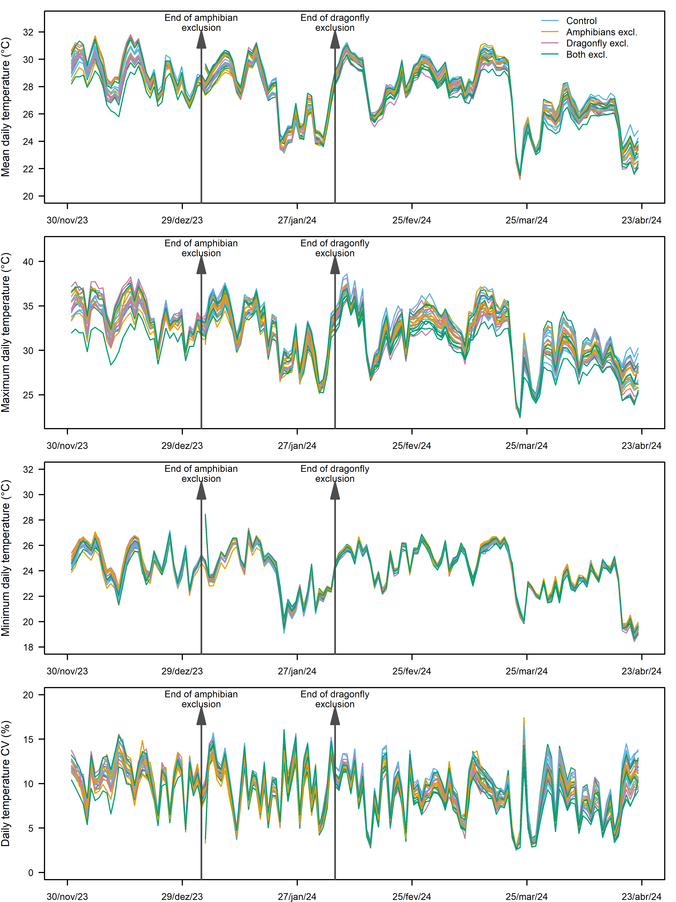
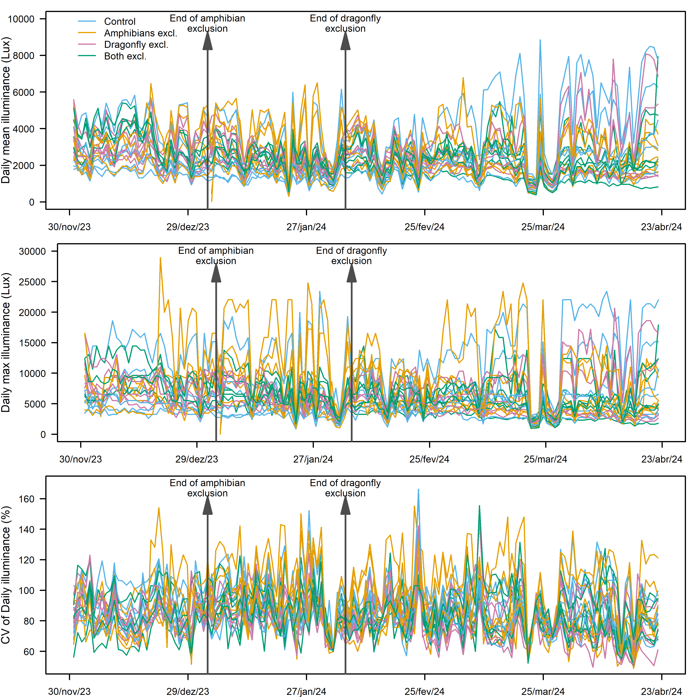
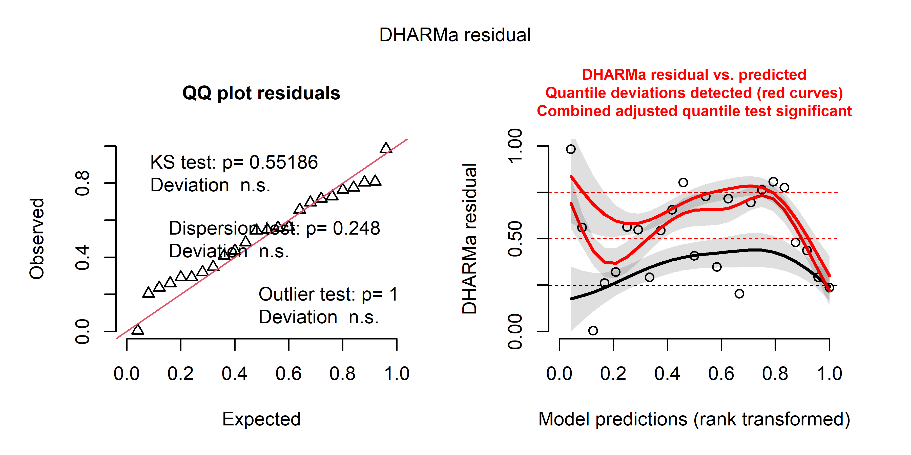
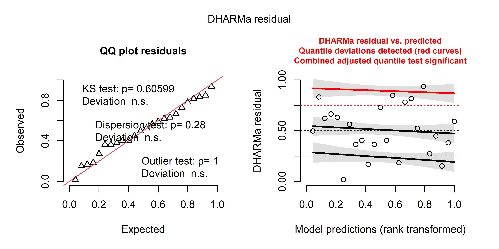
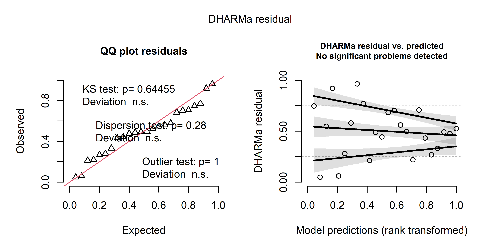
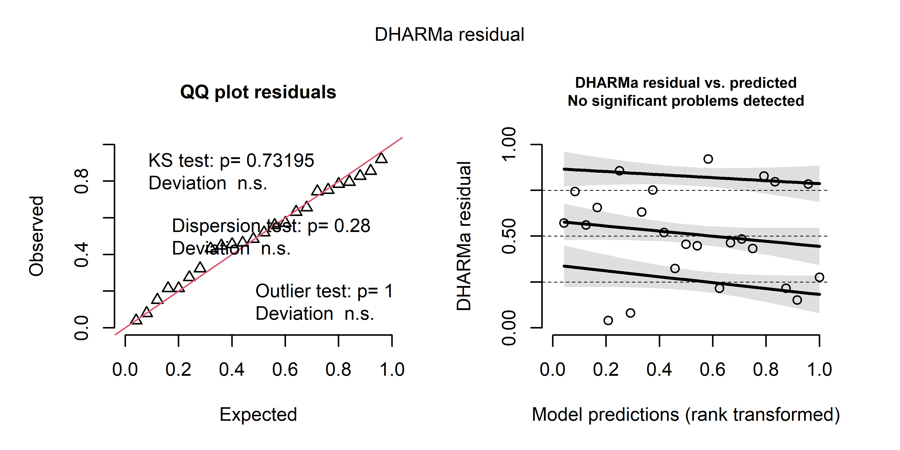
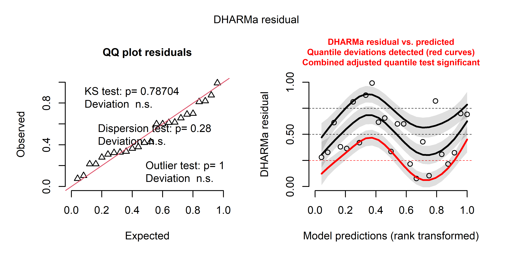
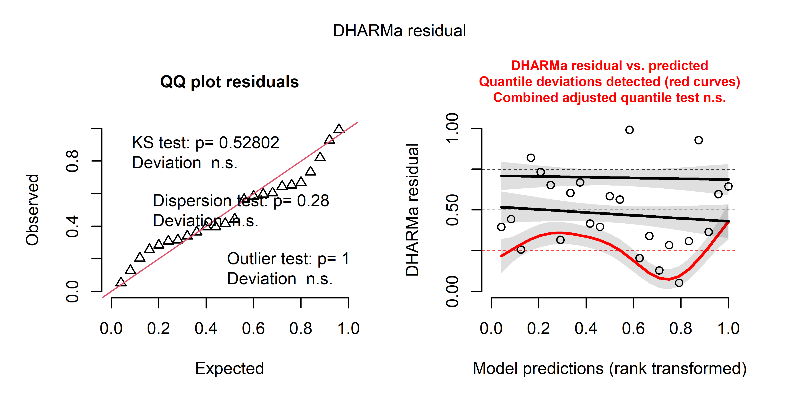
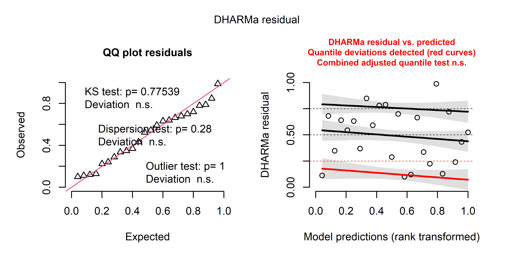
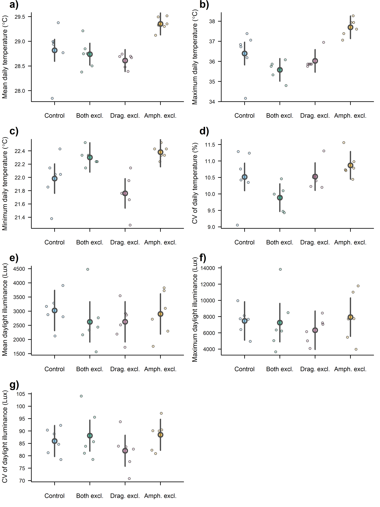

Supporting Information 2 – Effect of exclusion treatments on temperature
and illuminance
================
Rodolfo Pelinson
2026-05-17

``` r
#source(paste(sep = "/",dir,"functions/remove_sp.R"))
#source(paste(sep = "/",dir,"functions/get_scaled_lvs.R"))
#source(paste(sep = "/",dir,"functions/text_contour.R"))
source(paste(sep = "/",dir,"functions/letters.R"))
```

``` r
library(vegan)
#library(gllvm)
#library(mvabund)
library(DHARMa)
library(glmmTMB)
library(emmeans)
#library(vioplot)
library(yarrr)
library(colorspace)
#library(iNEXT)
#library(iNEXT.beta3D)
#library(iNEXT.3D)
library(shape)
library(car)
```

``` r
sessionInfo()
```

    ## R version 4.5.2 (2025-10-31 ucrt)
    ## Platform: x86_64-w64-mingw32/x64
    ## Running under: Windows 11 x64 (build 26200)
    ## 
    ## Matrix products: default
    ##   LAPACK version 3.12.1
    ## 
    ## locale:
    ## [1] LC_COLLATE=Portuguese_Brazil.utf8  LC_CTYPE=Portuguese_Brazil.utf8   
    ## [3] LC_MONETARY=Portuguese_Brazil.utf8 LC_NUMERIC=C                      
    ## [5] LC_TIME=Portuguese_Brazil.utf8    
    ## 
    ## time zone: Europe/London
    ## tzcode source: internal
    ## 
    ## attached base packages:
    ## [1] stats     graphics  grDevices utils     datasets  methods   base     
    ## 
    ## other attached packages:
    ##  [1] car_3.1-5              carData_3.0-6          shape_1.4.6.1         
    ##  [4] colorspace_2.1-2       yarrr_0.1.14           circlize_0.4.17       
    ##  [7] BayesFactor_0.9.12-4.8 Matrix_1.7-4           coda_0.19-4.1         
    ## [10] jpeg_0.1-11            emmeans_2.0.2          glmmTMB_1.1.14        
    ## [13] DHARMa_0.4.7           vegan_2.7-3            permute_0.9-10        
    ## 
    ## loaded via a namespace (and not attached):
    ##  [1] sandwich_3.1-1      stringi_1.8.7       lattice_0.22-7     
    ##  [4] lme4_2.0-1          digest_0.6.39       magrittr_2.0.4     
    ##  [7] evaluate_1.0.5      grid_4.5.2          estimability_1.5.1 
    ## [10] mvtnorm_1.3-6       fastmap_1.2.0       Formula_1.2-5      
    ## [13] GlobalOptions_0.1.3 mgcv_1.9-3          pbapply_1.7-4      
    ## [16] numDeriv_2016.8-1.1 abind_1.4-8         reformulas_0.4.4   
    ## [19] Rdpack_2.6.6        cli_3.6.5           rlang_1.1.7        
    ## [22] rbibutils_2.4.1     splines_4.5.2       yaml_2.3.12        
    ## [25] otel_0.2.0          tools_4.5.2         parallel_4.5.2     
    ## [28] MatrixModels_0.5-4  nloptr_2.2.1        minqa_1.2.8        
    ## [31] boot_1.3-32         zoo_1.8-15          lifecycle_1.0.5    
    ## [34] stringr_1.6.0       MASS_7.3-65         cluster_2.1.8.1    
    ## [37] glue_1.8.0          Rcpp_1.1.1          xfun_0.57          
    ## [40] rstudioapi_0.18.0   knitr_1.51          xtable_1.8-8       
    ## [43] htmltools_0.5.9     nlme_3.1-168        rmarkdown_2.31     
    ## [46] TMB_1.9.20          compiler_4.5.2

## Loading and preparing data

``` r
load(file = paste(sep = "/",dir,"data/hobo_dayly_stats.RData"))
hobo_pred <- read.csv(paste(sep = "/",dir,"data/hobo.csv"))
```

## Plots

### Mean temperature

``` r
which_control <- which(hobo_pred$treatment == "controle")
which_fechado_dia <- which(hobo_pred$treatment == "fechado_dia")
which_fechado_noite <- which(hobo_pred$treatment == "fechado_noite")
which_fechado <- which(hobo_pred$treatment == "fechado")

library(shape)

xlim <- as.numeric(c(as.POSIXlt("30/11/2023", format = "%d/%m/%Y"),
          as.POSIXlt("24/04/2024", format = "%d/%m/%Y")))


x_at <- seq.POSIXt(from = as.POSIXlt("30/11/2023", format = "%d/%m/%Y"),
                   to = as.POSIXlt("24/04/2024", format = "%d/%m/%Y"), length.out = 6)

x_labels <- as.Date(x_at)
x_labels <- as.character(format(x_labels, "%d/%b/%y"))
which_control <- which(hobo_pred$treatment == "controle")
which_fechado_dia <- which(hobo_pred$treatment == "fechado_dia")
which_fechado_noite <- which(hobo_pred$treatment == "fechado_noite")
which_fechado <- which(hobo_pred$treatment == "fechado")

library(shape)

xlim <- as.numeric(c(as.POSIXlt("30/11/2023", format = "%d/%m/%Y"),
          as.POSIXlt("24/04/2024", format = "%d/%m/%Y")))


x_at <- seq.POSIXt(from = as.POSIXlt("30/11/2023", format = "%d/%m/%Y"),
                   to = as.POSIXlt("24/04/2024", format = "%d/%m/%Y"), length.out = 6)

x_labels <- as.Date(x_at)
x_labels <- as.character(format(x_labels, "%d/%b/%y"))

par(mfrow = c(4,1))

#Mean temperature

par(new = FALSE, bty = "o", mar = c(2,4,1,1))
plot(NA, xlim = xlim, ylim = c(20, 33), xaxt = "n", xlab = "", ylab = "", yaxt = "n")

for(i in 1:length(which_control)){
  lines(x = as.numeric(hobo_dayly_stats[[which_control[i]]]$days_exp),
        y = hobo_dayly_stats[[which_control[i]]]$mean_temp, col = "#56B4E9")
  
  lines(x = as.numeric(hobo_dayly_stats[[which_fechado_dia[i]]]$days_exp),
        y = hobo_dayly_stats[[which_fechado_dia[i]]]$mean_temp, col = "#CC79A7")
  
  lines(x = as.numeric(hobo_dayly_stats[[which_fechado_noite[i]]]$days_exp),
        y = hobo_dayly_stats[[which_fechado_noite[i]]]$mean_temp, col = "#E69F00")
  
  lines(x = as.numeric(hobo_dayly_stats[[which_fechado[i]]]$days_exp),
        y = hobo_dayly_stats[[which_fechado[i]]]$mean_temp, col = "#009E73")
}

title(ylab = "Mean daily temperature (°C)", cex.lab = 1.2)
#title(xlab = "Temperature (°C)")

axis(1, at = x_at , labels = x_labels)
axis(2, las = 2)


par(new = TRUE, bty = "n")
plot(NA, xlim = xlim, ylim = c(0, 100), xaxt = "n", xlab = "", ylab = "", yaxt = "n")

Arrows(x0 = as.numeric(as.POSIXlt("03/01/2024", format = "%d/%m/%Y")),
       x1 = as.numeric(as.POSIXlt("03/01/2024", format = "%d/%m/%Y")),
       y0 = -10,
       y1 = 88, arr.type = "triangle", lwd = 1.5, col = "grey30", arr.length = 0.3)

text(x = as.numeric(as.POSIXlt("03/01/2024", format = "%d/%m/%Y")),
     y = 100, label = "End of amphibian", cex = 1)
text(x = as.numeric(as.POSIXlt("03/01/2024", format = "%d/%m/%Y")),
     y = 95, label = "exclusion", cex = 1)


Arrows(x0 = as.numeric(as.POSIXlt("06/02/2024", format = "%d/%m/%Y")),
       x1 = as.numeric(as.POSIXlt("06/02/2024", format = "%d/%m/%Y")),
       y0 = -10,
       y1 = 88, arr.type = "triangle", lwd = 1.5, col = "grey30", arr.length = 0.3)

text(x = as.numeric(as.POSIXlt("06/02/2024", format = "%d/%m/%Y")),
     y = 100, label = "End of dragonfly", cex = 1)
text(x = as.numeric(as.POSIXlt("06/02/2024", format = "%d/%m/%Y")),
     y = 95, label = "exclusion", cex = 1)


legend(x = max(xlim),
       y = 105,
       legend = c("Control", "Amphibians excl.", "Dragonfly excl.", "Both excl."),
       col = c("#56B4E9", "#E69F00", "#CC79A7", "#009E73"), lty = c(1,1,1,1), lwd = 1,
       xjust = 1, 
       yjust = 1,
       bty = "n",
       bg = "transparent")


#Max temperature

par(new = FALSE, bty = "o", mar = c(2,4,1,1))
plot(NA, xlim = xlim, ylim = c(22, 42), xaxt = "n", xlab = "", ylab = "", yaxt = "n")

for(i in 1:length(which_control)){
  lines(x = as.numeric(hobo_dayly_stats[[which_control[i]]]$days_exp),
        y = hobo_dayly_stats[[which_control[i]]]$max_temp, col = "#56B4E9")
  
  lines(x = as.numeric(hobo_dayly_stats[[which_fechado_dia[i]]]$days_exp),
        y = hobo_dayly_stats[[which_fechado_dia[i]]]$max_temp, col = "#CC79A7")
  
  lines(x = as.numeric(hobo_dayly_stats[[which_fechado_noite[i]]]$days_exp),
        y = hobo_dayly_stats[[which_fechado_noite[i]]]$max_temp, col = "#E69F00")
  
  lines(x = as.numeric(hobo_dayly_stats[[which_fechado[i]]]$days_exp),
        y = hobo_dayly_stats[[which_fechado[i]]]$max_temp, col = "#009E73")
}

title(ylab = "Maximum daily temperature (°C)", cex.lab = 1.2)
#title(xlab = "Temperature (°C)")

axis(1, at = x_at , labels = x_labels)
axis(2, las = 2)


par(new = TRUE, bty = "n")
plot(NA, xlim = xlim, ylim = c(0, 100), xaxt = "n", xlab = "", ylab = "", yaxt = "n")

Arrows(x0 = as.numeric(as.POSIXlt("03/01/2024", format = "%d/%m/%Y")),
       x1 = as.numeric(as.POSIXlt("03/01/2024", format = "%d/%m/%Y")),
       y0 = -10,
       y1 = 88, arr.type = "triangle", lwd = 1.5, col = "grey30", arr.length = 0.3)

text(x = as.numeric(as.POSIXlt("03/01/2024", format = "%d/%m/%Y")),
     y = 100, label = "End of amphibian", cex = 1)
text(x = as.numeric(as.POSIXlt("03/01/2024", format = "%d/%m/%Y")),
     y = 95, label = "exclusion", cex = 1)


Arrows(x0 = as.numeric(as.POSIXlt("06/02/2024", format = "%d/%m/%Y")),
       x1 = as.numeric(as.POSIXlt("06/02/2024", format = "%d/%m/%Y")),
       y0 = -10,
       y1 = 88, arr.type = "triangle", lwd = 1.5, col = "grey30", arr.length = 0.3)

text(x = as.numeric(as.POSIXlt("06/02/2024", format = "%d/%m/%Y")),
     y = 100, label = "End of dragonfly", cex = 1)
text(x = as.numeric(as.POSIXlt("06/02/2024", format = "%d/%m/%Y")),
     y = 95, label = "exclusion", cex = 1)


#Min temperature

par(new = FALSE, bty = "o", mar = c(2,4,1,1))
plot(NA, xlim = xlim, ylim = c(18, 32), xaxt = "n", xlab = "", ylab = "", yaxt = "n")

for(i in 1:length(which_control)){
  lines(x = as.numeric(hobo_dayly_stats[[which_control[i]]]$days_exp),
        y = hobo_dayly_stats[[which_control[i]]]$min_temp, col = "#56B4E9")
  
  lines(x = as.numeric(hobo_dayly_stats[[which_fechado_dia[i]]]$days_exp),
        y = hobo_dayly_stats[[which_fechado_dia[i]]]$min_temp, col = "#CC79A7")
  
  lines(x = as.numeric(hobo_dayly_stats[[which_fechado_noite[i]]]$days_exp),
        y = hobo_dayly_stats[[which_fechado_noite[i]]]$min_temp, col = "#E69F00")
  
  lines(x = as.numeric(hobo_dayly_stats[[which_fechado[i]]]$days_exp),
        y = hobo_dayly_stats[[which_fechado[i]]]$min_temp, col = "#009E73")
}

title(ylab = "Minimum daily temperature (°C)", cex.lab = 1.2)
#title(xlab = "Temperature (°C)")

axis(1, at = x_at , labels = x_labels)
axis(2, las = 2)


par(new = TRUE, bty = "n")
plot(NA, xlim = xlim, ylim = c(0, 100), xaxt = "n", xlab = "", ylab = "", yaxt = "n")

Arrows(x0 = as.numeric(as.POSIXlt("03/01/2024", format = "%d/%m/%Y")),
       x1 = as.numeric(as.POSIXlt("03/01/2024", format = "%d/%m/%Y")),
       y0 = -10,
       y1 = 88, arr.type = "triangle", lwd = 1.5, col = "grey30", arr.length = 0.3)

text(x = as.numeric(as.POSIXlt("03/01/2024", format = "%d/%m/%Y")),
     y = 100, label = "End of amphibian", cex = 1)
text(x = as.numeric(as.POSIXlt("03/01/2024", format = "%d/%m/%Y")),
     y = 95, label = "exclusion", cex = 1)


Arrows(x0 = as.numeric(as.POSIXlt("06/02/2024", format = "%d/%m/%Y")),
       x1 = as.numeric(as.POSIXlt("06/02/2024", format = "%d/%m/%Y")),
       y0 = -10,
       y1 = 88, arr.type = "triangle", lwd = 1.5, col = "grey30", arr.length = 0.3)

text(x = as.numeric(as.POSIXlt("06/02/2024", format = "%d/%m/%Y")),
     y = 100, label = "End of dragonfly", cex = 1)
text(x = as.numeric(as.POSIXlt("06/02/2024", format = "%d/%m/%Y")),
     y = 95, label = "exclusion", cex = 1)


#CV temperature

par(new = FALSE, bty = "o", mar = c(2,4,1,1))
plot(NA, xlim = xlim, ylim = c(0, 20), xaxt = "n", xlab = "", ylab = "", yaxt = "n")

for(i in 1:length(which_control)){
  lines(x = as.numeric(hobo_dayly_stats[[which_control[i]]]$days_exp),
        y = hobo_dayly_stats[[which_control[i]]]$cv_mean, col = "#56B4E9")
  
  lines(x = as.numeric(hobo_dayly_stats[[which_fechado_dia[i]]]$days_exp),
        y = hobo_dayly_stats[[which_fechado_dia[i]]]$cv_mean, col = "#CC79A7")
  
  lines(x = as.numeric(hobo_dayly_stats[[which_fechado_noite[i]]]$days_exp),
        y = hobo_dayly_stats[[which_fechado_noite[i]]]$cv_mean, col = "#E69F00")
  
  lines(x = as.numeric(hobo_dayly_stats[[which_fechado[i]]]$days_exp),
        y = hobo_dayly_stats[[which_fechado[i]]]$cv_mean, col = "#009E73")
}

title(ylab = "Daily temperature CV (%)", cex.lab = 1.2)
#title(xlab = "Temperature (°C)")

axis(1, at = x_at , labels = x_labels)
axis(2, las = 2)


par(new = TRUE, bty = "n")
plot(NA, xlim = xlim, ylim = c(0, 100), xaxt = "n", xlab = "", ylab = "", yaxt = "n")

Arrows(x0 = as.numeric(as.POSIXlt("03/01/2024", format = "%d/%m/%Y")),
       x1 = as.numeric(as.POSIXlt("03/01/2024", format = "%d/%m/%Y")),
       y0 = -10,
       y1 = 88, arr.type = "triangle", lwd = 1.5, col = "grey30", arr.length = 0.3)

text(x = as.numeric(as.POSIXlt("03/01/2024", format = "%d/%m/%Y")),
     y = 100, label = "End of amphibian", cex = 1)
text(x = as.numeric(as.POSIXlt("03/01/2024", format = "%d/%m/%Y")),
     y = 95, label = "exclusion", cex = 1)


Arrows(x0 = as.numeric(as.POSIXlt("06/02/2024", format = "%d/%m/%Y")),
       x1 = as.numeric(as.POSIXlt("06/02/2024", format = "%d/%m/%Y")),
       y0 = -10,
       y1 = 88, arr.type = "triangle", lwd = 1.5, col = "grey30", arr.length = 0.3)

text(x = as.numeric(as.POSIXlt("06/02/2024", format = "%d/%m/%Y")),
     y = 100, label = "End of dragonfly", cex = 1)
text(x = as.numeric(as.POSIXlt("06/02/2024", format = "%d/%m/%Y")),
     y = 95, label = "exclusion", cex = 1)
```

<!-- -->

``` r
par(mfrow = c(3,1))

#Mean illuminance

par(new = FALSE, bty = "o", mar = c(2,4,1,1))
plot(NA, xlim = xlim, ylim = c(0, 10000), xaxt = "n", xlab = "", ylab = "", yaxt = "n")

for(i in 1:length(which_control)){
  lines(x = as.numeric(hobo_dayly_stats[[which_control[i]]]$days_exp),
        y = hobo_dayly_stats[[which_control[i]]]$mean_daylight, col = "#56B4E9")
  
  lines(x = as.numeric(hobo_dayly_stats[[which_fechado_dia[i]]]$days_exp),
        y = hobo_dayly_stats[[which_fechado_dia[i]]]$mean_daylight, col = "#CC79A7")
  
  lines(x = as.numeric(hobo_dayly_stats[[which_fechado_noite[i]]]$days_exp),
        y = hobo_dayly_stats[[which_fechado_noite[i]]]$mean_daylight, col = "#E69F00")
  
  lines(x = as.numeric(hobo_dayly_stats[[which_fechado[i]]]$days_exp),
        y = hobo_dayly_stats[[which_fechado[i]]]$mean_daylight, col = "#009E73")
}

title(ylab = "Daily mean illuminance (Lux)", cex.lab = 1.2)
#title(xlab = "Temperature (°C)")

axis(1, at = x_at , labels = x_labels)
axis(2, las = 2)


par(new = TRUE, bty = "n")
plot(NA, xlim = xlim, ylim = c(0, 100), xaxt = "n", xlab = "", ylab = "", yaxt = "n")

Arrows(x0 = as.numeric(as.POSIXlt("03/01/2024", format = "%d/%m/%Y")),
       x1 = as.numeric(as.POSIXlt("03/01/2024", format = "%d/%m/%Y")),
       y0 = -10,
       y1 = 88, arr.type = "triangle", lwd = 1.5, col = "grey30", arr.length = 0.3)

text(x = as.numeric(as.POSIXlt("03/01/2024", format = "%d/%m/%Y")),
     y = 100, label = "End of amphibian", cex = 1)
text(x = as.numeric(as.POSIXlt("03/01/2024", format = "%d/%m/%Y")),
     y = 95, label = "exclusion", cex = 1)


Arrows(x0 = as.numeric(as.POSIXlt("06/02/2024", format = "%d/%m/%Y")),
       x1 = as.numeric(as.POSIXlt("06/02/2024", format = "%d/%m/%Y")),
       y0 = -10,
       y1 = 88, arr.type = "triangle", lwd = 1.5, col = "grey30", arr.length = 0.3)

text(x = as.numeric(as.POSIXlt("06/02/2024", format = "%d/%m/%Y")),
     y = 100, label = "End of dragonfly", cex = 1)
text(x = as.numeric(as.POSIXlt("06/02/2024", format = "%d/%m/%Y")),
     y = 95, label = "exclusion", cex = 1)

legend(x = min(xlim),
       y = 105,
       legend = c("Control", "Amphibians excl.", "Dragonfly excl.", "Both excl."),
       col = c("#56B4E9", "#E69F00", "#CC79A7", "#009E73"), lty = c(1,1,1,1), lwd = 1,
       xjust = 0, 
       yjust = 1,
       bty = "n",
       bg = "transparent")


#Max illuminance

par(new = FALSE, bty = "o", mar = c(2,5,1,1))
plot(NA, xlim = xlim, ylim = c(0, 30000), xaxt = "n", xlab = "", ylab = "", yaxt = "n")

for(i in 1:length(which_control)){
  lines(x = as.numeric(hobo_dayly_stats[[which_control[i]]]$days_exp),
        y = hobo_dayly_stats[[which_control[i]]]$max_daylight, col = "#56B4E9")
  
  lines(x = as.numeric(hobo_dayly_stats[[which_fechado_dia[i]]]$days_exp),
        y = hobo_dayly_stats[[which_fechado_dia[i]]]$max_daylight, col = "#CC79A7")
  
  lines(x = as.numeric(hobo_dayly_stats[[which_fechado_noite[i]]]$days_exp),
        y = hobo_dayly_stats[[which_fechado_noite[i]]]$max_daylight, col = "#E69F00")
  
  lines(x = as.numeric(hobo_dayly_stats[[which_fechado[i]]]$days_exp),
        y = hobo_dayly_stats[[which_fechado[i]]]$max_daylight, col = "#009E73")
}

title(ylab = "Daily max illuminance (Lux)", cex.lab = 1.2, line = 4)
#title(xlab = "Temperature (°C)")

axis(1, at = x_at , labels = x_labels)
axis(2, las = 2)


par(new = TRUE, bty = "n")
plot(NA, xlim = xlim, ylim = c(0, 100), xaxt = "n", xlab = "", ylab = "", yaxt = "n")

Arrows(x0 = as.numeric(as.POSIXlt("03/01/2024", format = "%d/%m/%Y")),
       x1 = as.numeric(as.POSIXlt("03/01/2024", format = "%d/%m/%Y")),
       y0 = -10,
       y1 = 88, arr.type = "triangle", lwd = 1.5, col = "grey30", arr.length = 0.3)

text(x = as.numeric(as.POSIXlt("03/01/2024", format = "%d/%m/%Y")),
     y = 100, label = "End of amphibian", cex = 1)
text(x = as.numeric(as.POSIXlt("03/01/2024", format = "%d/%m/%Y")),
     y = 95, label = "exclusion", cex = 1)


Arrows(x0 = as.numeric(as.POSIXlt("06/02/2024", format = "%d/%m/%Y")),
       x1 = as.numeric(as.POSIXlt("06/02/2024", format = "%d/%m/%Y")),
       y0 = -10,
       y1 = 88, arr.type = "triangle", lwd = 1.5, col = "grey30", arr.length = 0.3)

text(x = as.numeric(as.POSIXlt("06/02/2024", format = "%d/%m/%Y")),
     y = 100, label = "End of dragonfly", cex = 1)
text(x = as.numeric(as.POSIXlt("06/02/2024", format = "%d/%m/%Y")),
     y = 95, label = "exclusion", cex = 1)


#CV illuminance

par(new = FALSE, bty = "o", mar = c(2,4,1,1))
plot(NA, xlim = xlim, ylim = c(50, 170), xaxt = "n", xlab = "", ylab = "", yaxt = "n")

for(i in 1:length(which_control)){
  lines(x = as.numeric(hobo_dayly_stats[[which_control[i]]]$days_exp),
        y = hobo_dayly_stats[[which_control[i]]]$cv_daylight, col = "#56B4E9")
  
  lines(x = as.numeric(hobo_dayly_stats[[which_fechado_dia[i]]]$days_exp),
        y = hobo_dayly_stats[[which_fechado_dia[i]]]$cv_daylight, col = "#CC79A7")
  
  lines(x = as.numeric(hobo_dayly_stats[[which_fechado_noite[i]]]$days_exp),
        y = hobo_dayly_stats[[which_fechado_noite[i]]]$cv_daylight, col = "#E69F00")
  
  lines(x = as.numeric(hobo_dayly_stats[[which_fechado[i]]]$days_exp),
        y = hobo_dayly_stats[[which_fechado[i]]]$cv_daylight, col = "#009E73")
}

title(ylab = "CV of Daily illuminance (%)", cex.lab = 1.2, line = 3)
#title(xlab = "Temperature (°C)")

axis(1, at = x_at , labels = x_labels)
axis(2, las = 2)


par(new = TRUE, bty = "n")
plot(NA, xlim = xlim, ylim = c(0, 100), xaxt = "n", xlab = "", ylab = "", yaxt = "n")

Arrows(x0 = as.numeric(as.POSIXlt("03/01/2024", format = "%d/%m/%Y")),
       x1 = as.numeric(as.POSIXlt("03/01/2024", format = "%d/%m/%Y")),
       y0 = -10,
       y1 = 88, arr.type = "triangle", lwd = 1.5, col = "grey30", arr.length = 0.3)

text(x = as.numeric(as.POSIXlt("03/01/2024", format = "%d/%m/%Y")),
     y = 100, label = "End of amphibian", cex = 1)
text(x = as.numeric(as.POSIXlt("03/01/2024", format = "%d/%m/%Y")),
     y = 95, label = "exclusion", cex = 1)


Arrows(x0 = as.numeric(as.POSIXlt("06/02/2024", format = "%d/%m/%Y")),
       x1 = as.numeric(as.POSIXlt("06/02/2024", format = "%d/%m/%Y")),
       y0 = -10,
       y1 = 88, arr.type = "triangle", lwd = 1.5, col = "grey30", arr.length = 0.3)

text(x = as.numeric(as.POSIXlt("06/02/2024", format = "%d/%m/%Y")),
     y = 100, label = "End of dragonfly", cex = 1)
text(x = as.numeric(as.POSIXlt("06/02/2024", format = "%d/%m/%Y")),
     y = 95, label = "exclusion", cex = 1)
```

<!-- -->

# Computing average statistics for before the exclusion of amphibians

``` r
hobo_dayly_stats_excl <- list()
for(i in 1:length(hobo_dayly_stats)){
  data <- hobo_dayly_stats[[i]]
  data <- data[data$days_exp <= as.POSIXlt("03/01/2024", format = "%d/%m/%Y"),]
  hobo_dayly_stats_excl[[i]] <- data
}
names(hobo_dayly_stats_excl) <- names(hobo_dayly_stats)


hobo_dayly_stats_1 <- list()
for(i in 1:length(hobo_dayly_stats)){
  data <- hobo_dayly_stats[[i]]
  data <- data[data$days_exp <= as.POSIXlt("19/12/2023", format = "%d/%m/%Y"),]
  hobo_dayly_stats_1[[i]] <- data
}
names(hobo_dayly_stats_1) <- names(hobo_dayly_stats)

hobo_dayly_stats_2 <- list()
for(i in 1:length(hobo_dayly_stats)){
  data <- hobo_dayly_stats[[i]]
  data <- data[data$days_exp > as.POSIXlt("19/12/2023", format = "%d/%m/%Y") & data$days_exp <= as.POSIXlt("05/02/2024", format = "%d/%m/%Y"),]
  hobo_dayly_stats_2[[i]] <- data
}
names(hobo_dayly_stats_2) <- names(hobo_dayly_stats)


hobo_dayly_stats_3 <- list()
for(i in 1:length(hobo_dayly_stats)){
  data <- hobo_dayly_stats[[i]]
  data <- data[data$days_exp > as.POSIXlt("05/02/2024", format = "%d/%m/%Y") & data$days_exp <= as.POSIXlt("12/03/2024", format = "%d/%m/%Y"),]
  hobo_dayly_stats_3[[i]] <- data
}
names(hobo_dayly_stats_3) <- names(hobo_dayly_stats)


hobo_dayly_stats_4 <- list()
for(i in 1:length(hobo_dayly_stats)){
  data <- hobo_dayly_stats[[i]]
  data <- data[data$days_exp > as.POSIXlt("12/03/2024", format = "%d/%m/%Y") & data$days_exp <= as.POSIXlt("23/04/2024", format = "%d/%m/%Y"),]
  hobo_dayly_stats_4[[i]] <- data
}
names(hobo_dayly_stats_4) <- names(hobo_dayly_stats)
```

``` r
temp_mean <- rep(NA, nrow(hobo_pred))
temp_max <- rep(NA, nrow(hobo_pred))
temp_min <- rep(NA, nrow(hobo_pred))
temp_cv <- rep(NA, nrow(hobo_pred))
light_mean <- rep(NA, nrow(hobo_pred))
light_max <- rep(NA, nrow(hobo_pred))
light_cv <- rep(NA, nrow(hobo_pred))


for(i in 1:nrow(hobo_pred)){
  ID <- hobo_pred$hobo[i]
  which_ID <- which(names(hobo_dayly_stats_excl) == ID)
  data <- hobo_dayly_stats_excl[[which_ID]]
  
  temp_mean[i] <- mean(data$mean_temp)
  temp_max[i] <- max(data$max_temp)
  temp_min[i] <- min(data$min_temp)
  temp_cv[i] <- mean(data$cv_mean)
  light_mean[i] <- mean(data$mean_daylight)
  light_max[i] <- mean(data$max_daylight)
  light_cv[i] <- mean(data$cv_daylight)
}

hobo_pred$temp_mean <- temp_mean
hobo_pred$temp_max <- temp_max
hobo_pred$temp_min <- temp_min
hobo_pred$temp_cv <- temp_cv
hobo_pred$light_mean <- light_mean
hobo_pred$light_max <- light_max
hobo_pred$light_cv <- light_cv

hobo_pred$block_h <- as.character(hobo_pred$block_h)
```

``` r
mod_temp_mean <- lm(temp_mean ~ treatment + block, data = hobo_pred[hobo_pred$treatment != "atrasado",])
plot(simulateResiduals(mod_temp_mean))
```

    ## qu = 0.75, log(sigma) = -2.949671 : outer Newton did not converge fully.

<!-- -->

``` r
Anova(mod_temp_mean)
```

    ## Anova Table (Type II tests)
    ## 
    ## Response: temp_mean
    ##            Sum Sq Df F value    Pr(>F)    
    ## treatment 1.91473  3  9.8028 0.0007916 ***
    ## block     0.98275  5  3.0188 0.0441468 *  
    ## Residuals 0.97662 15                      
    ## ---
    ## Signif. codes:  0 '***' 0.001 '**' 0.01 '*' 0.05 '.' 0.1 ' ' 1

``` r
temp_mean_estimates <- emmeans(mod_temp_mean, ~ treatment)
pairs(temp_mean_estimates)
```

    ##  contrast                    estimate    SE df t.ratio p.value
    ##  controle - fechado            0.0784 0.147 15   0.532  0.9499
    ##  controle - fechado_dia        0.2077 0.147 15   1.410  0.5126
    ##  controle - fechado_noite     -0.5341 0.147 15  -3.625  0.0119
    ##  fechado - fechado_dia         0.1293 0.147 15   0.878  0.8162
    ##  fechado - fechado_noite      -0.6124 0.147 15  -4.157  0.0042
    ##  fechado_dia - fechado_noite  -0.7417 0.147 15  -5.035  0.0008
    ## 
    ## Results are averaged over the levels of: block 
    ## P value adjustment: tukey method for comparing a family of 4 estimates

``` r
temp_mean_estimates <- data.frame(temp_mean_estimates)

mod_temp_max <- lm(temp_max ~ treatment + block, data = hobo_pred[hobo_pred$treatment != "atrasado",])
plot(simulateResiduals(mod_temp_max))
```

<!-- -->

``` r
Anova(mod_temp_max)
```

    ## Anova Table (Type II tests)
    ## 
    ## Response: temp_max
    ##            Sum Sq Df F value    Pr(>F)    
    ## treatment 14.9630  3 11.9215 0.0002979 ***
    ## block      3.4953  5  1.6709 0.2022025    
    ## Residuals  6.2757 15                      
    ## ---
    ## Signif. codes:  0 '***' 0.001 '**' 0.01 '*' 0.05 '.' 0.1 ' ' 1

``` r
temp_max_estimates <- emmeans(mod_temp_max, ~ treatment)
pairs(temp_max_estimates)
```

    ##  contrast                    estimate    SE df t.ratio p.value
    ##  controle - fechado             0.814 0.373 15   2.179  0.1740
    ##  controle - fechado_dia         0.366 0.373 15   0.980  0.7627
    ##  controle - fechado_noite      -1.304 0.373 15  -3.493  0.0154
    ##  fechado - fechado_dia         -0.448 0.373 15  -1.199  0.6369
    ##  fechado - fechado_noite       -2.118 0.373 15  -5.672  0.0002
    ##  fechado_dia - fechado_noite   -1.671 0.373 15  -4.473  0.0022
    ## 
    ## Results are averaged over the levels of: block 
    ## P value adjustment: tukey method for comparing a family of 4 estimates

``` r
temp_max_estimates <- data.frame(temp_max_estimates)

mod_temp_min <- lm(temp_min ~ treatment + block, data = hobo_pred[hobo_pred$treatment != "atrasado",])
plot(simulateResiduals(mod_temp_min))
```

<!-- -->

``` r
Anova(mod_temp_min)
```

    ## Anova Table (Type II tests)
    ## 
    ## Response: temp_min
    ##            Sum Sq Df F value   Pr(>F)   
    ## treatment 1.49387  3  7.6563 0.002469 **
    ## block     0.19491  5  0.5994 0.701285   
    ## Residuals 0.97558 15                    
    ## ---
    ## Signif. codes:  0 '***' 0.001 '**' 0.01 '*' 0.05 '.' 0.1 ' ' 1

``` r
temp_min_estimates <- emmeans(mod_temp_min, ~ treatment)
pairs(temp_min_estimates)
```

    ##  contrast                    estimate    SE df t.ratio p.value
    ##  controle - fechado           -0.3188 0.147 15  -2.165  0.1779
    ##  controle - fechado_dia        0.2228 0.147 15   1.513  0.4543
    ##  controle - fechado_noite     -0.3985 0.147 15  -2.706  0.0693
    ##  fechado - fechado_dia         0.5417 0.147 15   3.679  0.0107
    ##  fechado - fechado_noite      -0.0797 0.147 15  -0.541  0.9475
    ##  fechado_dia - fechado_noite  -0.6213 0.147 15  -4.220  0.0037
    ## 
    ## Results are averaged over the levels of: block 
    ## P value adjustment: tukey method for comparing a family of 4 estimates

``` r
temp_min_estimates <- data.frame(temp_min_estimates)

mod_temp_cv <- lm(temp_cv ~ treatment + block, data = hobo_pred[hobo_pred$treatment != "atrasado",])
plot(simulateResiduals(mod_temp_cv))
```

<!-- -->

``` r
Anova(mod_temp_cv)
```

    ## Anova Table (Type II tests)
    ## 
    ## Response: temp_cv
    ##           Sum Sq Df F value  Pr(>F)  
    ## treatment 3.0094  3  4.3111 0.02216 *
    ## block     2.1625  5  1.8587 0.16177  
    ## Residuals 3.4903 15                  
    ## ---
    ## Signif. codes:  0 '***' 0.001 '**' 0.01 '*' 0.05 '.' 0.1 ' ' 1

``` r
temp_cv_estimates <- emmeans(mod_temp_cv, ~ treatment)
pairs(temp_cv_estimates)
```

    ##  contrast                    estimate    SE df t.ratio p.value
    ##  controle - fechado             0.630 0.279 15   2.260  0.1520
    ##  controle - fechado_dia        -0.010 0.279 15  -0.036  1.0000
    ##  controle - fechado_noite      -0.351 0.279 15  -1.260  0.6003
    ##  fechado - fechado_dia         -0.640 0.279 15  -2.296  0.1431
    ##  fechado - fechado_noite       -0.981 0.279 15  -3.521  0.0146
    ##  fechado_dia - fechado_noite   -0.341 0.279 15  -1.224  0.6216
    ## 
    ## Results are averaged over the levels of: block 
    ## P value adjustment: tukey method for comparing a family of 4 estimates

``` r
temp_cv_estimates <- data.frame(temp_cv_estimates)

mod_light_mean <- lm(light_mean ~ treatment + block, data = hobo_pred[hobo_pred$treatment != "atrasado",])
plot(simulateResiduals(mod_light_mean))
```

<!-- -->

``` r
Anova(mod_light_mean)
```

    ## Anova Table (Type II tests)
    ## 
    ## Response: light_mean
    ##             Sum Sq Df F value Pr(>F)
    ## treatment   740972  3  0.3684 0.7769
    ## block      1902473  5  0.5675 0.7238
    ## Residuals 10056986 15

``` r
light_mean_estimates <- emmeans(mod_light_mean, ~ treatment)
pairs(light_mean_estimates)
```

    ##  contrast                    estimate  SE df t.ratio p.value
    ##  controle - fechado            403.92 473 15   0.854  0.8277
    ##  controle - fechado_dia        400.73 473 15   0.848  0.8310
    ##  controle - fechado_noite      124.08 473 15   0.262  0.9934
    ##  fechado - fechado_dia          -3.18 473 15  -0.007  1.0000
    ##  fechado - fechado_noite      -279.83 473 15  -0.592  0.9330
    ##  fechado_dia - fechado_noite  -276.65 473 15  -0.585  0.9350
    ## 
    ## Results are averaged over the levels of: block 
    ## P value adjustment: tukey method for comparing a family of 4 estimates

``` r
light_mean_estimates <- data.frame(light_mean_estimates)

mod_light_max <- lm(light_max ~ treatment + block, data = hobo_pred[hobo_pred$treatment != "atrasado",])
plot(simulateResiduals(mod_light_max))
```

<!-- -->

``` r
Anova(mod_light_max)
```

    ## Anova Table (Type II tests)
    ## 
    ## Response: light_max
    ##              Sum Sq Df F value Pr(>F)
    ## treatment   8376344  3  0.3767 0.7712
    ## block      26278796  5  0.7090 0.6259
    ## Residuals 111193053 15

``` r
light_max_estimates <- emmeans(mod_light_max, ~ treatment)
pairs(light_max_estimates)
```

    ##  contrast                    estimate   SE df t.ratio p.value
    ##  controle - fechado               207 1570 15   0.132  0.9991
    ##  controle - fechado_dia          1152 1570 15   0.733  0.8823
    ##  controle - fechado_noite        -472 1570 15  -0.300  0.9902
    ##  fechado - fechado_dia            946 1570 15   0.602  0.9300
    ##  fechado - fechado_noite         -678 1570 15  -0.432  0.9721
    ##  fechado_dia - fechado_noite    -1624 1570 15  -1.033  0.7333
    ## 
    ## Results are averaged over the levels of: block 
    ## P value adjustment: tukey method for comparing a family of 4 estimates

``` r
light_max_estimates <- data.frame(light_max_estimates)

mod_light_cv <- lm(light_cv ~ treatment + block, data = hobo_pred[hobo_pred$treatment != "atrasado",])
plot(simulateResiduals(mod_light_cv))
```

<!-- -->

``` r
Anova(mod_light_cv)
```

    ## Anova Table (Type II tests)
    ## 
    ## Response: light_cv
    ##           Sum Sq Df F value Pr(>F)
    ## treatment 156.39  3  1.0061 0.4173
    ## block     314.80  5  1.2151 0.3494
    ## Residuals 777.22 15

``` r
light_cv_estimates <- emmeans(mod_light_cv, ~ treatment)
pairs(light_cv_estimates)
```

    ##  contrast                    estimate   SE df t.ratio p.value
    ##  controle - fechado            -2.153 4.16 15  -0.518  0.9535
    ##  controle - fechado_dia         3.909 4.16 15   0.941  0.7838
    ##  controle - fechado_noite      -2.507 4.16 15  -0.603  0.9294
    ##  fechado - fechado_dia          6.063 4.16 15   1.459  0.4847
    ##  fechado - fechado_noite       -0.354 4.16 15  -0.085  0.9998
    ##  fechado_dia - fechado_noite   -6.417 4.16 15  -1.544  0.4376
    ## 
    ## Results are averaged over the levels of: block 
    ## P value adjustment: tukey method for comparing a family of 4 estimates

``` r
light_cv_estimates <- data.frame(light_cv_estimates)
```

``` r
hobo_pred_plot <- hobo_pred[hobo_pred$treatment != "atrasado",]


cols <- transparent(c("#56B4E9",  "#009E73", "#CC79A7", "#E69F00"), 0.8)
cols_solid <- transparent(c("#56B4E9",  "#009E73", "#CC79A7", "#E69F00"), 0.5)
treatments_levels <- levels(as.factor(hobo_pred$treatment[hobo_pred$treatment != "atrasado"]))
x_at <- c(1,2,3,4)
treatments_titles <- c("Control", "Both excl.", "Drag. excl.", "Amph. excl.")


par(mfrow = c(4,2))

par(mar = c(4,5,2,1), bty = "l")
ylim <- c(min(hobo_pred_plot$temp_mean), max(hobo_pred_plot$temp_mean))
  
plot(NA, xaxt= "n", yaxt = "n", xlab = "", ylab = "", xlim = c(0.5, 4.5), ylim = c(ylim))
  

for(i in 1:length(treatments_levels)){

points(y = hobo_pred_plot$temp_mean[hobo_pred_plot$treatment == treatments_levels[i]],
             x = jitter(rep(x_at[i], length(hobo_pred_plot$temp_mean[hobo_pred_plot$treatment == treatments_levels[i]])),
                        amount = 0.25 ), pch = 21, bg = cols[i], col = transparent("black", 0.5))
      
lines(x = rep(x_at[i],2),
            y = c(temp_mean_estimates$lower.CL[i],
                  temp_mean_estimates$upper.CL[i]), lwd = 2, col = "grey30")
      
points(temp_mean_estimates$emmean[i],
             x= x_at[i], pch = 21, bg = cols_solid[i], cex = 2, col = "grey30", lwd = 2)
}


axis(1, at = x_at, labels = FALSE)
axis(1, at = x_at, labels = treatments_titles, tick = FALSE, line = 0.75, cex.axis = 1.2, gap.axis = -1)
axis(2, las = 2)
  
title(ylab = expression("Mean daily temperature ( " * degree * "C)"), cex.lab = 1.25, line = 3.5)

letters(x = 5, y = 100, label = "a)", adj = c(0,1))


par(mar = c(4,5,2,1), bty = "l")
ylim <- c(min(hobo_pred_plot$temp_max), max(hobo_pred_plot$temp_max))
  
plot(NA, xaxt= "n", yaxt = "n", xlab = "", ylab = "", xlim = c(0.5, 4.5), ylim = c(ylim))
  

for(i in 1:length(treatments_levels)){

points(y = hobo_pred_plot$temp_max[hobo_pred_plot$treatment == treatments_levels[i]],
             x = jitter(rep(x_at[i], length(hobo_pred_plot$temp_max[hobo_pred_plot$treatment == treatments_levels[i]])),
                        amount = 0.25 ), pch = 21, bg = cols[i], col = transparent("black", 0.5))
      
lines(x = rep(x_at[i],2),
            y = c(temp_max_estimates$lower.CL[i],
                  temp_max_estimates$upper.CL[i]), lwd = 2, col = "grey30")
      
points(temp_max_estimates$emmean[i],
             x= x_at[i], pch = 21, bg = cols_solid[i], cex = 2, col = "grey30", lwd = 2)
}


axis(1, at = x_at, labels = FALSE)
axis(1, at = x_at, labels = treatments_titles, tick = FALSE, line = 0.75, cex.axis = 1.2, gap.axis = -1)
axis(2, las = 2)
  
title(ylab = expression("Maximum daily temperature ( " * degree * "C)"), cex.lab = 1.25, line = 3.5)

letters(x = 5, y = 100, label = "b)", adj = c(0,1))


par(mar = c(4,5,2,1), bty = "l")
ylim <- c(min(hobo_pred_plot$temp_min), max(hobo_pred_plot$temp_min))
  
plot(NA, xaxt= "n", yaxt = "n", xlab = "", ylab = "", xlim = c(0.5, 4.5), ylim = c(ylim))
  

for(i in 1:length(treatments_levels)){

points(y = hobo_pred_plot$temp_min[hobo_pred_plot$treatment == treatments_levels[i]],
             x = jitter(rep(x_at[i], length(hobo_pred_plot$temp_min[hobo_pred_plot$treatment == treatments_levels[i]])),
                        amount = 0.25 ), pch = 21, bg = cols[i], col = transparent("black", 0.5))
      
lines(x = rep(x_at[i],2),
            y = c(temp_min_estimates$lower.CL[i],
                  temp_min_estimates$upper.CL[i]), lwd = 2, col = "grey30")
      
points(temp_min_estimates$emmean[i],
             x= x_at[i], pch = 21, bg = cols_solid[i], cex = 2, col = "grey30", lwd = 2)
}


axis(1, at = x_at, labels = FALSE)
axis(1, at = x_at, labels = treatments_titles, tick = FALSE, line = 0.75, cex.axis = 1.2, gap.axis = -1)
axis(2, las = 2)
  
title(ylab = expression("Minimum daily temperature ( " * degree * "C)"), cex.lab = 1.25, line = 3.5)

letters(x = 5, y = 100, label = "c)", adj = c(0,1))


par(mar = c(4,5,2,1), bty = "l")
ylim <- c(min(hobo_pred_plot$temp_cv), max(hobo_pred_plot$temp_cv))
  
plot(NA, xaxt= "n", yaxt = "n", xlab = "", ylab = "", xlim = c(0.5, 4.5), ylim = c(ylim))
  

for(i in 1:length(treatments_levels)){

points(y = hobo_pred_plot$temp_cv[hobo_pred_plot$treatment == treatments_levels[i]],
             x = jitter(rep(x_at[i], length(hobo_pred_plot$temp_cv[hobo_pred_plot$treatment == treatments_levels[i]])),
                        amount = 0.25 ), pch = 21, bg = cols[i], col = transparent("black", 0.5))
      
lines(x = rep(x_at[i],2),
            y = c(temp_cv_estimates$lower.CL[i],
                  temp_cv_estimates$upper.CL[i]), lwd = 2, col = "grey30")
      
points(temp_cv_estimates$emmean[i],
             x= x_at[i], pch = 21, bg = cols_solid[i], cex = 2, col = "grey30", lwd = 2)
}


axis(1, at = x_at, labels = FALSE)
axis(1, at = x_at, labels = treatments_titles, tick = FALSE, line = 0.75, cex.axis = 1.2, gap.axis = -1)
axis(2, las = 2)
  
title(ylab = expression("CV of daily temperature (%)"), cex.lab = 1.25, line = 3.5)

letters(x = 5, y = 100, label = "d)", adj = c(0,1))


par(mar = c(4,5,2,1), bty = "l")
ylim <- c(min(hobo_pred_plot$light_mean), max(hobo_pred_plot$light_mean))
  
plot(NA, xaxt= "n", yaxt = "n", xlab = "", ylab = "", xlim = c(0.5, 4.5), ylim = c(ylim))
  

for(i in 1:length(treatments_levels)){

points(y = hobo_pred_plot$light_mean[hobo_pred_plot$treatment == treatments_levels[i]],
             x = jitter(rep(x_at[i], length(hobo_pred_plot$light_mean[hobo_pred_plot$treatment == treatments_levels[i]])),
                        amount = 0.25 ), pch = 21, bg = cols[i], col = transparent("black", 0.5))
      
lines(x = rep(x_at[i],2),
            y = c(light_mean_estimates$lower.CL[i],
                  light_mean_estimates$upper.CL[i]), lwd = 2, col = "grey30")
      
points(light_mean_estimates$emmean[i],
             x= x_at[i], pch = 21, bg = cols_solid[i], cex = 2, col = "grey30", lwd = 2)
}


axis(1, at = x_at, labels = FALSE)
axis(1, at = x_at, labels = treatments_titles, tick = FALSE, line = 0.75, cex.axis = 1.2, gap.axis = -1)
axis(2, las = 2)
  
title(ylab = expression("Mean daylight illuminance (Lux)"), cex.lab = 1.25, line = 3.5)

letters(x = 5, y = 100, label = "e)", adj = c(0,1))


par(mar = c(4,5,2,1), bty = "l")
ylim <- c(min(hobo_pred_plot$light_max), max(hobo_pred_plot$light_max))
  
plot(NA, xaxt= "n", yaxt = "n", xlab = "", ylab = "", xlim = c(0.5, 4.5), ylim = c(ylim))
  

for(i in 1:length(treatments_levels)){

points(y = hobo_pred_plot$light_max[hobo_pred_plot$treatment == treatments_levels[i]],
             x = jitter(rep(x_at[i], length(hobo_pred_plot$light_max[hobo_pred_plot$treatment == treatments_levels[i]])),
                        amount = 0.25 ), pch = 21, bg = cols[i], col = transparent("black", 0.5))
      
lines(x = rep(x_at[i],2),
            y = c(light_max_estimates$lower.CL[i],
                  light_max_estimates$upper.CL[i]), lwd = 2, col = "grey30")
      
points(light_max_estimates$emmean[i],
             x= x_at[i], pch = 21, bg = cols_solid[i], cex = 2, col = "grey30", lwd = 2)
}


axis(1, at = x_at, labels = FALSE)
axis(1, at = x_at, labels = treatments_titles, tick = FALSE, line = 0.75, cex.axis = 1.2, gap.axis = -1)
axis(2, las = 2)
  
title(ylab = expression("Maximum daylight illuminance (Lux)"), cex.lab = 1.25, line = 3.5)

letters(x = 5, y = 100, label = "f)", adj = c(0,1))


par(mar = c(4,5,2,1), bty = "l")
ylim <- c(min(hobo_pred_plot$light_cv), max(hobo_pred_plot$light_cv))
  
plot(NA, xaxt= "n", yaxt = "n", xlab = "", ylab = "", xlim = c(0.5, 4.5), ylim = c(ylim))
  

for(i in 1:length(treatments_levels)){

points(y = hobo_pred_plot$light_cv[hobo_pred_plot$treatment == treatments_levels[i]],
             x = jitter(rep(x_at[i], length(hobo_pred_plot$light_cv[hobo_pred_plot$treatment == treatments_levels[i]])),
                        amount = 0.25 ), pch = 21, bg = cols[i], col = transparent("black", 0.5))
      
lines(x = rep(x_at[i],2),
            y = c(light_cv_estimates$lower.CL[i],
                  light_cv_estimates$upper.CL[i]), lwd = 2, col = "grey30")
      
points(light_cv_estimates$emmean[i],
             x= x_at[i], pch = 21, bg = cols_solid[i], cex = 2, col = "grey30", lwd = 2)
}


axis(1, at = x_at, labels = FALSE)
axis(1, at = x_at, labels = treatments_titles, tick = FALSE, line = 0.75, cex.axis = 1.2, gap.axis = -1)
axis(2, las = 2)
  
title(ylab = expression("CV of daylight illuminance (Lux)"), cex.lab = 1.25, line = 3.5)

letters(x = 5, y = 100, label = "g)", adj = c(0,1))
```

<!-- -->
