Supporting Information 5 - Analysis of the effect of environmental
variability, community size, alpha and gamma diversity on community
variability
================
Rodolfo Pelinson
2026-04-12

## Loading packages and functions

``` r
source(paste(sep = "/",dir,"functions/remove_sp.R"))
source(paste(sep = "/",dir,"functions/get_scaled_lvs.R"))
source(paste(sep = "/",dir,"functions/text_contour.R"))
source(paste(sep = "/",dir,"functions/letters.R"))
```

``` r
library(vegan)
library(gllvm)
library(mvabund)
library(DHARMa)
library(glmmTMB)
library(vioplot)
library(yarrr)
library(colorspace)
library(iNEXT)
library(iNEXT.beta3D)
library(iNEXT.3D)
library(shape)
library(car)
```

``` r
sessionInfo()
```

    ## R version 4.5.2 (2025-10-31 ucrt)
    ## Platform: x86_64-w64-mingw32/x64
    ## Running under: Windows 11 x64 (build 26200)
    ## 
    ## Matrix products: default
    ##   LAPACK version 3.12.1
    ## 
    ## locale:
    ## [1] LC_COLLATE=Portuguese_Brazil.utf8  LC_CTYPE=Portuguese_Brazil.utf8   
    ## [3] LC_MONETARY=Portuguese_Brazil.utf8 LC_NUMERIC=C                      
    ## [5] LC_TIME=Portuguese_Brazil.utf8    
    ## 
    ## time zone: Europe/London
    ## tzcode source: internal
    ## 
    ## attached base packages:
    ## [1] stats     graphics  grDevices utils     datasets  methods   base     
    ## 
    ## other attached packages:
    ##  [1] car_3.1-5              carData_3.0-6          shape_1.4.6.1         
    ##  [4] iNEXT.3D_1.0.12        iNEXT.beta3D_1.0.2     iNEXT_3.0.2           
    ##  [7] colorspace_2.1-2       yarrr_0.1.14           circlize_0.4.17       
    ## [10] BayesFactor_0.9.12-4.8 Matrix_1.7-4           coda_0.19-4.1         
    ## [13] jpeg_0.1-11            vioplot_0.5.1          zoo_1.8-15            
    ## [16] sm_2.2-6.0             glmmTMB_1.1.14         DHARMa_0.4.7          
    ## [19] mvabund_4.2.8          gllvm_2.0.5            TMB_1.9.20            
    ## [22] vegan_2.7-3            permute_0.9-10        
    ## 
    ## loaded via a namespace (and not attached):
    ##  [1] tidyselect_1.2.1    dplyr_1.2.0         farver_2.1.2       
    ##  [4] S7_0.2.1            lazyeval_0.2.2      fastmap_1.2.0      
    ##  [7] digest_0.6.39       estimability_1.5.1  lifecycle_1.0.5    
    ## [10] cluster_2.1.8.1     statmod_1.5.1       tidytree_0.4.7     
    ## [13] magrittr_2.0.4      compiler_4.5.2      rlang_1.1.7        
    ## [16] tools_4.5.2         yaml_2.3.12         knitr_1.51         
    ## [19] alabama_2025.1.0    plyr_1.8.9          RColorBrewer_1.1-3 
    ## [22] abind_1.4-8         purrr_1.2.1         numDeriv_2016.8-1.1
    ## [25] grid_4.5.2          xtable_1.8-8        future_1.70.0      
    ## [28] ggplot2_4.0.2       emmeans_2.0.2       globals_0.19.1     
    ## [31] scales_1.4.0        MASS_7.3-65         cli_3.6.5          
    ## [34] mvtnorm_1.3-6       rmarkdown_2.31      reformulas_0.4.4   
    ## [37] generics_0.1.4      otel_0.2.0          rstudioapi_0.18.0  
    ## [40] future.apply_1.20.2 reshape2_1.4.5      ape_5.8-1          
    ## [43] minqa_1.2.8         pbapply_1.7-4       stringr_1.6.0      
    ## [46] splines_4.5.2       parallel_4.5.2      yulab.utils_0.2.4  
    ## [49] vctrs_0.7.2         boot_1.3-32         sandwich_3.1-1     
    ## [52] Formula_1.2-5       listenv_0.10.1      tweedie_3.0.17     
    ## [55] tidyr_1.3.2         parallelly_1.46.1   glue_1.8.0         
    ## [58] nloptr_2.2.1        codetools_0.2-20    stringi_1.8.7      
    ## [61] gtable_0.3.6        lme4_2.0-1          tibble_3.3.1       
    ## [64] pillar_1.11.1       rappdirs_0.3.4      htmltools_0.5.9    
    ## [67] R6_2.6.1            Rdpack_2.6.6        evaluate_1.0.5     
    ## [70] lattice_0.22-7      rbibutils_2.4.1     phyclust_0.1-34    
    ## [73] MatrixModels_0.5-4  Rcpp_1.1.1          nlme_3.1-168       
    ## [76] mgcv_1.9-3          xfun_0.57           fs_2.0.1           
    ## [79] pkgconfig_2.0.3     GlobalOptions_0.1.3

## Loading and preparing data

``` r
source(paste(sep = "/",dir,"ajeitando_planilhas.R"))
beta_data <- read.csv(paste(sep = "/",dir,"data/beta_data.csv"))
```

``` r
#Now excluding the late treatment because it complicate things
comm_all_2 <- comm_all[Exp_design_all$treatments != "atrasado",]
Exp_design_all_2 <- Exp_design_all[Exp_design_all$treatments != "atrasado",]

comm_all_2 <- remove_sp(comm_all_2, 0)

ncol(comm_all_2)
```

    ## [1] 24

``` r
nrow(comm_all_2)
```

    ## [1] 96

``` r
nrow(Exp_design_all_2)
```

    ## [1] 96

``` r
ID <-  as.factor(Exp_design_all_2$sites)

AM_by_block <- interaction(as.factor(Exp_design_all_2$block), as.factor( Exp_design_all_2$AM))


Exp_design_all_2$AM <- as.factor(Exp_design_all_2$AM)
Exp_design_all_2$AM_numeric <- as.numeric(Exp_design_all_2$AM)
Exp_design_all_2$AM_numeric_quad <- Exp_design_all_2$AM_numeric^2


Exp_design_all_2$AM_days <- Exp_design_all_2$AM_numeric

Exp_design_all_2$AM_days[Exp_design_all_2$AM_numeric==1] <- 32
Exp_design_all_2$AM_days[Exp_design_all_2$AM_numeric==2] <- 80
Exp_design_all_2$AM_days[Exp_design_all_2$AM_numeric==3] <- 116
Exp_design_all_2$AM_days[Exp_design_all_2$AM_numeric==4] <- 158

Exp_design_all_2$AM_days_st <- scale(Exp_design_all_2$AM_days)
attr_AM_days <- attributes(Exp_design_all_2$AM_days_st)
Exp_design_all_2$AM_days_st <- Exp_design_all_2$AM_days_st[,1]

unscale <- function(x, atributes, reverse = FALSE){
  if(isTRUE(reverse)){
      x <- (x - atributes$`scaled:center`) / atributes$`scaled:scale` 
  }else{
      x <- (x * atributes$`scaled:scale`) + atributes$`scaled:center`
  }
  return(x)
}

Exp_design_all_2$AM_days_quad <- Exp_design_all_2$AM_days^2
Exp_design_all_2$AM_days_st_quad <- Exp_design_all_2$AM_days_st^2
```

# Effect of Time on tichness, community size and gamma diversity

### Richness

``` r
richness <- rowSums(decostand(comm_all_2, method = "pa"))
#richness_null <- rowSums(decostand(null_com, method = "pa"))


mod_rich_null<- glmmTMB(richness ~ 1 + (1|block2/sites), data = Exp_design_all_2, family ="gaussian")
mod_rich_day <- glmmTMB(richness ~ AM_days_st + (1|block2/sites), data = Exp_design_all_2, family ="gaussian")
mod_rich_day_quad <- glmmTMB(richness ~ AM_days_st_quad + AM_days_quad + (1|block2/sites), data = Exp_design_all_2, family ="gaussian")

anova_rich <- anova(mod_rich_null, mod_rich_day, mod_rich_day_quad)
plot(simulateResiduals(mod_rich_day_quad))
```

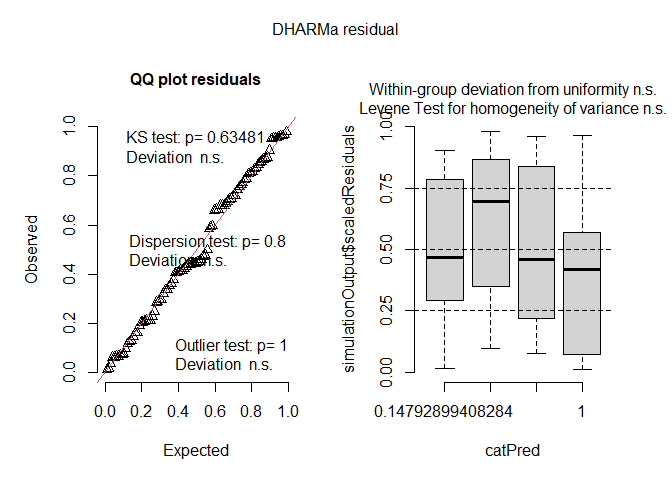<!-- -->

``` r
anova_rich
```

    ## Data: Exp_design_all_2
    ## Models:
    ## mod_rich_null: richness ~ 1 + (1 | block2/sites), zi=~0, disp=~1
    ## mod_rich_day: richness ~ AM_days_st + (1 | block2/sites), zi=~0, disp=~1
    ## mod_rich_day_quad: richness ~ AM_days_st_quad + AM_days_quad + (1 | block2/sites), zi=~0, disp=~1
    ##                   Df    AIC    BIC  logLik deviance  Chisq Chi Df Pr(>Chisq)
    ## mod_rich_null      4 364.32 374.58 -178.16   356.32                         
    ## mod_rich_day       5 364.36 377.18 -177.18   354.36 1.9599      1     0.1615
    ## mod_rich_day_quad  6 365.88 381.27 -176.94   353.88 0.4801      1     0.4884

### Community size

``` r
abundance <- rowSums(comm_all_2)

#abundance_10 <- abundance/10

mod_abundance_null<- glmmTMB(abundance ~ 1 + (1|block2/sites), data = Exp_design_all_2, family ="nbinom2")
mod_abundance_day <- glmmTMB(abundance ~ AM_days_st + (1|block2/sites), data = Exp_design_all_2, family ="nbinom2", control=glmmTMBControl(optimizer=optim,
               optArgs=list(method="BFGS")))
mod_abundance_day_quad <- glmmTMB(abundance ~ AM_days_st + AM_days_st_quad + (1|block2/sites), data = Exp_design_all_2, family ="nbinom2")
plot(simulateResiduals(mod_abundance_day_quad))
```

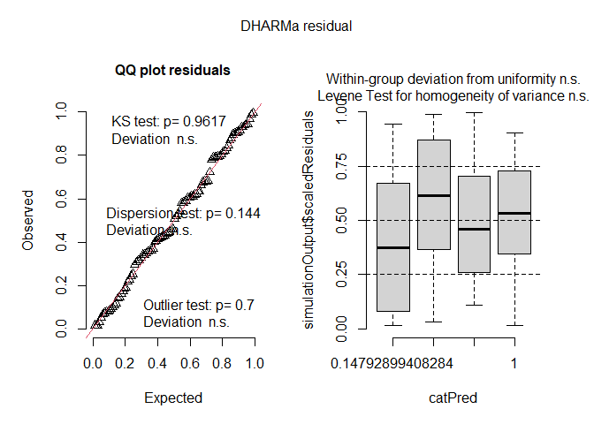<!-- -->

``` r
anova_abundance <- anova(mod_abundance_null, mod_abundance_day, mod_abundance_day_quad)

anova_abundance
```

    ## Data: Exp_design_all_2
    ## Models:
    ## mod_abundance_null: abundance ~ 1 + (1 | block2/sites), zi=~0, disp=~1
    ## mod_abundance_day: abundance ~ AM_days_st + (1 | block2/sites), zi=~0, disp=~1
    ## mod_abundance_day_quad: abundance ~ AM_days_st + AM_days_st_quad + (1 | block2/sites), zi=~0, disp=~1
    ##                        Df    AIC    BIC  logLik deviance  Chisq Chi Df
    ## mod_abundance_null      4 1072.0 1082.2 -531.99   1064.0              
    ## mod_abundance_day       5 1040.9 1053.7 -515.44   1030.9 33.092      1
    ## mod_abundance_day_quad  6 1016.5 1031.9 -502.26   1004.5 26.365      1
    ##                        Pr(>Chisq)    
    ## mod_abundance_null                   
    ## mod_abundance_day       8.788e-09 ***
    ## mod_abundance_day_quad  2.826e-07 ***
    ## ---
    ## Signif. codes:  0 '***' 0.001 '**' 0.01 '*' 0.05 '.' 0.1 ' ' 1

``` r
new_data_days <- data.frame(AM_days_st = seq(from = min(Exp_design_all_2$AM_days_st), to = max(Exp_design_all_2$AM_days_st), length.out = 100),
                            AM_days_st_quad = seq(from = min(Exp_design_all_2$AM_days_st), to = max(Exp_design_all_2$AM_days_st), length.out = 100)^2)

predicted_ab_quad <- predict(mod_abundance_day_quad, newdata = new_data_days, se.fit = TRUE, re.form = NA)
predicted_ab_quad$upper <- exp(predicted_ab_quad$fit + predicted_ab_quad$se.fit * qnorm(0.975))
predicted_ab_quad$lower <- exp(predicted_ab_quad$fit + predicted_ab_quad$se.fit * qnorm(0.025)) 
predicted_ab_quad$fit <- exp(predicted_ab_quad$fit)
```

### Gamma diversity

``` r
#Gama
gamma <- aggregate(comm_all_2, by = list(Exp_design_all_2$AM), FUN = sum)

rownames(gamma) <- gamma[,1]
gamma <- gamma[,-1]

comm_AM1 <- comm_all_2[Exp_design_all_2$AM == 1,]
comm_AM2 <- comm_all_2[Exp_design_all_2$AM == 2,]
comm_AM3 <- comm_all_2[Exp_design_all_2$AM == 3,]
comm_AM4 <- comm_all_2[Exp_design_all_2$AM == 4,]

comm_AM1 <- remove_sp(comm_AM1, 0)
comm_AM2 <- remove_sp(comm_AM2, 0)
comm_AM3 <- remove_sp(comm_AM3, 0)
comm_AM4 <- remove_sp(comm_AM4, 0)

rownames(comm_AM1) <- Exp_design$sites[Exp_design$treatments != "atrasado"]
rownames(comm_AM2) <- Exp_design$sites[Exp_design$treatments != "atrasado"]
rownames(comm_AM3) <- Exp_design$sites[Exp_design$treatments != "atrasado"]
rownames(comm_AM4) <- Exp_design$sites[Exp_design$treatments != "atrasado"]

com_tempos <- list(t(comm_AM1), t(comm_AM2), t(comm_AM3), t(comm_AM4))

inext_coverage_0 <- iNEXTbeta3D(com_tempos, datatype = "abundance", q = 0, diversity = "TD",   base = "coverage")
```

    ## Warning in iNEXT.3D:::EstiBootComm.Ind(Spec = x): This site has only one
    ## species. Estimation is not robust.
    ## Warning in iNEXT.3D:::EstiBootComm.Ind(Spec = x): This site has only one
    ## species. Estimation is not robust.
    ## Warning in iNEXT.3D:::EstiBootComm.Ind(Spec = x): This site has only one
    ## species. Estimation is not robust.
    ## Warning in iNEXT.3D:::EstiBootComm.Ind(Spec = x): This site has only one
    ## species. Estimation is not robust.
    ## Warning in iNEXT.3D:::EstiBootComm.Ind(Spec = x): This site has only one
    ## species. Estimation is not robust.
    ## Warning in iNEXT.3D:::EstiBootComm.Ind(Spec = x): This site has only one
    ## species. Estimation is not robust.
    ## Warning in iNEXT.3D:::EstiBootComm.Ind(Spec = x): This site has only one
    ## species. Estimation is not robust.
    ## Warning in iNEXT.3D:::EstiBootComm.Ind(Spec = x): This site has only one
    ## species. Estimation is not robust.
    ## Warning in iNEXT.3D:::EstiBootComm.Ind(Spec = x): This site has only one
    ## species. Estimation is not robust.
    ## Warning in iNEXT.3D:::EstiBootComm.Ind(Spec = x): This site has only one
    ## species. Estimation is not robust.

``` r
inext_coverage_0$Dataset_1$gamma
```

    ##      Dataset Order.q        SC        Size     Gamma                Method
    ## 1  Dataset_1       0 0.5000000    2.409074  1.964289           Rarefaction
    ## 2  Dataset_1       0 0.5250000    2.599961  2.069958           Rarefaction
    ## 3  Dataset_1       0 0.5500000    2.790872  2.175640           Rarefaction
    ## 4  Dataset_1       0 0.5750000    2.981826  2.281345           Rarefaction
    ## 5  Dataset_1       0 0.6000000    3.240291  2.392957           Rarefaction
    ## 6  Dataset_1       0 0.6250000    3.505869  2.505195           Rarefaction
    ## 7  Dataset_1       0 0.6500000    3.771413  2.617419           Rarefaction
    ## 8  Dataset_1       0 0.6750000    4.050871  2.730734           Rarefaction
    ## 9  Dataset_1       0 0.7000000    4.415829  2.850617           Rarefaction
    ## 10 Dataset_1       0 0.7250000    4.780794  2.970501           Rarefaction
    ## 11 Dataset_1       0 0.7500000    5.197804  3.093933           Rarefaction
    ## 12 Dataset_1       0 0.7750000    5.693128  3.222709           Rarefaction
    ## 13 Dataset_1       0 0.8000000    6.252497  3.355392           Rarefaction
    ## 14 Dataset_1       0 0.8250000    6.916187  3.494443           Rarefaction
    ## 15 Dataset_1       0 0.8500000    7.767075  3.643819           Rarefaction
    ## 16 Dataset_1       0 0.8750000    8.842605  3.804649           Rarefaction
    ## 17 Dataset_1       0 0.9000000   10.352554  3.985686           Rarefaction
    ## 18 Dataset_1       0 0.9250000   12.699889  4.201497           Rarefaction
    ## 19 Dataset_1       0 0.9500000   17.492903  4.504785           Rarefaction
    ## 20 Dataset_1       0 0.9750000   47.302138  5.476912           Rarefaction
    ## 21 Dataset_1       0 0.9969166  581.943808  9.411349 Observed_SC(n, alpha)
    ## 22 Dataset_1       0 0.9986147 1413.690621 11.145808  Extrap_SC(2n, alpha)
    ## 23 Dataset_1       0 0.9997945 4864.000000 13.000000 Observed_SC(n, gamma)
    ## 24 Dataset_1       0 0.9999722 9728.000000 13.432243  Extrap_SC(2n, gamma)
    ##          s.e.       LCL       UCL Diversity
    ## 1  0.01975845  1.925563  2.003015        TD
    ## 2  0.02046954  2.029838  2.110077        TD
    ## 3  0.02119108  2.134106  2.217173        TD
    ## 4  0.02212181  2.237987  2.324703        TD
    ## 5  0.02355525  2.346790  2.439124        TD
    ## 6  0.02425293  2.457660  2.552730        TD
    ## 7  0.02498071  2.568458  2.666380        TD
    ## 8  0.02659131  2.678616  2.782852        TD
    ## 9  0.02764605  2.796432  2.904802        TD
    ## 10 0.02854226  2.914560  3.026443        TD
    ## 11 0.03075811  3.033648  3.154218        TD
    ## 12 0.03198242  3.160025  3.285393        TD
    ## 13 0.03477519  3.287234  3.423550        TD
    ## 14 0.03681348  3.422290  3.566596        TD
    ## 15 0.04048608  3.564468  3.723170        TD
    ## 16 0.04573904  3.715002  3.894295        TD
    ## 17 0.05410556  3.879641  4.091731        TD
    ## 18 0.06705027  4.070081  4.332913        TD
    ## 19 0.09666813  4.315319  4.694251        TD
    ## 20 0.21641459  5.052747  5.901077        TD
    ## 21 0.58947039  8.256009 10.566690        TD
    ## 22 0.60237097  9.965183 12.326434        TD
    ## 23 1.15914899 10.728110 15.271890        TD
    ## 24 1.43697115 10.615832 16.248655        TD

``` r
inext_coverage_0$Dataset_2$gamma
```

    ##      Dataset Order.q        SC        Size     Gamma                Method
    ## 1  Dataset_2       0 0.5000000    3.693321  2.885511           Rarefaction
    ## 2  Dataset_2       0 0.5250000    3.969942  3.041155           Rarefaction
    ## 3  Dataset_2       0 0.5500000    4.308600  3.203814           Rarefaction
    ## 4  Dataset_2       0 0.5750000    4.654849  3.367342           Rarefaction
    ## 5  Dataset_2       0 0.6000000    5.001342  3.530888           Rarefaction
    ## 6  Dataset_2       0 0.6250000    5.433087  3.703620           Rarefaction
    ## 7  Dataset_2       0 0.6500000    5.864862  3.876364           Rarefaction
    ## 8  Dataset_2       0 0.6750000    6.368303  4.056453           Rarefaction
    ## 9  Dataset_2       0 0.7000000    6.904435  4.239904           Rarefaction
    ## 10 Dataset_2       0 0.7250000    7.544632  4.433566           Rarefaction
    ## 11 Dataset_2       0 0.7500000    8.255100  4.633918           Rarefaction
    ## 12 Dataset_2       0 0.7750000    9.086045  4.845515           Rarefaction
    ## 13 Dataset_2       0 0.8000000   10.101662  5.073672           Rarefaction
    ## 14 Dataset_2       0 0.8250000   11.380838  5.324340           Rarefaction
    ## 15 Dataset_2       0 0.8500000   13.021327  5.604364           Rarefaction
    ## 16 Dataset_2       0 0.8750000   15.384232  5.939057           Rarefaction
    ## 17 Dataset_2       0 0.9000000   19.093859  6.365592           Rarefaction
    ## 18 Dataset_2       0 0.9250000   26.092537  6.980286           Rarefaction
    ## 19 Dataset_2       0 0.9500000   41.669215  7.938637           Rarefaction
    ## 20 Dataset_2       0 0.9750000   89.794034  9.612658           Rarefaction
    ## 21 Dataset_2       0 0.9848112  158.531813 10.937848 Observed_SC(n, alpha)
    ## 22 Dataset_2       0 0.9970235 1366.483337 17.944350  Extrap_SC(2n, alpha)
    ## 23 Dataset_2       0 0.9977490 1776.000000 19.000000 Observed_SC(n, gamma)
    ## 24 Dataset_2       0 0.9991721 3552.000000 21.527473  Extrap_SC(2n, gamma)
    ##          s.e.       LCL       UCL Diversity
    ## 1  0.04734987  2.792707  2.978315        TD
    ## 2  0.05024530  2.942676  3.139634        TD
    ## 3  0.05424994  3.097486  3.310142        TD
    ## 4  0.05678612  3.256043  3.478640        TD
    ## 5  0.06038693  3.412532  3.649244        TD
    ## 6  0.06425882  3.577675  3.829565        TD
    ## 7  0.06691270  3.745218  4.007510        TD
    ## 8  0.07217777  3.914988  4.197919        TD
    ## 9  0.07532462  4.092270  4.387537        TD
    ## 10 0.08038066  4.276023  4.591109        TD
    ## 11 0.08596423  4.465431  4.802405        TD
    ## 12 0.09087652  4.667401  5.023630        TD
    ## 13 0.09659179  4.884356  5.262989        TD
    ## 14 0.10278539  5.122884  5.525796        TD
    ## 15 0.10941554  5.389913  5.818814        TD
    ## 16 0.11645296  5.710813  6.167300        TD
    ## 17 0.12332328  6.123883  6.607301        TD
    ## 18 0.13001998  6.725451  7.235120        TD
    ## 19 0.16503721  7.615170  8.262104        TD
    ## 20 0.36668562  8.893968 10.331349        TD
    ## 21 0.64100211  9.681507 12.194189        TD
    ## 22 2.11444324 13.800118 22.088583        TD
    ## 23 2.09699820 14.889959 23.110041        TD
    ## 24 2.62783912 16.377003 26.677943        TD

``` r
inext_coverage_0$Dataset_3$gamma
```

    ##      Dataset Order.q        SC        Size     Gamma                Method
    ## 1  Dataset_3       0 0.5000000    2.775320  2.212939           Rarefaction
    ## 2  Dataset_3       0 0.5250000    2.991947  2.340639           Rarefaction
    ## 3  Dataset_3       0 0.5500000    3.294726  2.485107           Rarefaction
    ## 4  Dataset_3       0 0.5750000    3.600889  2.630250           Rarefaction
    ## 5  Dataset_3       0 0.6000000    3.907000  2.775367           Rarefaction
    ## 6  Dataset_3       0 0.6250000    4.294792  2.935134           Rarefaction
    ## 7  Dataset_3       0 0.6500000    4.718159  3.101266           Rarefaction
    ## 8  Dataset_3       0 0.6750000    5.191182  3.275594           Rarefaction
    ## 9  Dataset_3       0 0.7000000    5.763095  3.466245           Rarefaction
    ## 10 Dataset_3       0 0.7250000    6.441652  3.673141           Rarefaction
    ## 11 Dataset_3       0 0.7500000    7.251671  3.899414           Rarefaction
    ## 12 Dataset_3       0 0.7750000    8.278047  4.155498           Rarefaction
    ## 13 Dataset_3       0 0.8000000    9.608430  4.449938           Rarefaction
    ## 14 Dataset_3       0 0.8250000   11.383390  4.794516           Rarefaction
    ## 15 Dataset_3       0 0.8500000   13.845510  5.206131           Rarefaction
    ## 16 Dataset_3       0 0.8750000   17.386847  5.702695           Rarefaction
    ## 17 Dataset_3       0 0.9000000   22.587705  6.296116           Rarefaction
    ## 18 Dataset_3       0 0.9250000   30.534301  6.996602           Rarefaction
    ## 19 Dataset_3       0 0.9472250   41.884464  7.722486 Observed_SC(n, alpha)
    ## 20 Dataset_3       0 0.9500000   43.785976  7.821515           Rarefaction
    ## 21 Dataset_3       0 0.9745120   71.958516  8.839586  Extrap_SC(2n, alpha)
    ## 22 Dataset_3       0 0.9750000   72.934241  8.864456           Rarefaction
    ## 23 Dataset_3       0 0.9976048  833.000000 13.000000 Observed_SC(n, gamma)
    ## 24 Dataset_3       0 0.9996758 1666.000000 13.863627  Extrap_SC(2n, gamma)
    ##          s.e.       LCL       UCL Diversity
    ## 1  0.06686383  2.081889  2.343990        TD
    ## 2  0.07117856  2.201132  2.480147        TD
    ## 3  0.07700248  2.334185  2.636029        TD
    ## 4  0.07793134  2.477507  2.782992        TD
    ## 5  0.07951331  2.619524  2.931211        TD
    ## 6  0.08666470  2.765275  3.104994        TD
    ## 7  0.08645580  2.931816  3.270717        TD
    ## 8  0.09203641  3.095206  3.455982        TD
    ## 9  0.09187686  3.286170  3.646320        TD
    ## 10 0.09665817  3.483694  3.862587        TD
    ## 11 0.09937456  3.704643  4.094184        TD
    ## 12 0.10092250  3.957694  4.353303        TD
    ## 13 0.10040340  4.253151  4.646725        TD
    ## 14 0.10090119  4.596753  4.992278        TD
    ## 15 0.09943067  5.011251  5.401012        TD
    ## 16 0.09937710  5.507919  5.897470        TD
    ## 17 0.10738418  6.085647  6.506585        TD
    ## 18 0.13477349  6.732450  7.260753        TD
    ## 19 0.17897980  7.371692  8.073280        TD
    ## 20 0.18578810  7.457377  8.185653        TD
    ## 21 0.26745109  8.315392  9.363781        TD
    ## 22 0.26983194  8.335595  9.393317        TD
    ## 23 0.62848917 11.768184 14.231816        TD
    ## 24 0.90257772 12.094607 15.632647        TD

``` r
inext_coverage_0$Dataset_4$gamma
```

    ##      Dataset Order.q        SC        Size     Gamma                Method
    ## 1  Dataset_4       0 0.5000000    1.914411  1.596610           Rarefaction
    ## 2  Dataset_4       0 0.5250000    2.124273  1.712816           Rarefaction
    ## 3  Dataset_4       0 0.5500000    2.413879  1.853486           Rarefaction
    ## 4  Dataset_4       0 0.5750000    2.703463  1.994145           Rarefaction
    ## 5  Dataset_4       0 0.6000000    2.993071  2.134815           Rarefaction
    ## 6  Dataset_4       0 0.6250000    3.487777  2.333000           Rarefaction
    ## 7  Dataset_4       0 0.6500000    3.987462  2.532576           Rarefaction
    ## 8  Dataset_4       0 0.6750000    4.735417  2.794518           Rarefaction
    ## 9  Dataset_4       0 0.7000000    5.653513  3.093617           Rarefaction
    ## 10 Dataset_4       0 0.7250000    6.805178  3.437812           Rarefaction
    ## 11 Dataset_4       0 0.7500000    8.215564  3.820238           Rarefaction
    ## 12 Dataset_4       0 0.7750000    9.885558  4.229460           Rarefaction
    ## 13 Dataset_4       0 0.8000000   11.859729  4.660831           Rarefaction
    ## 14 Dataset_4       0 0.8250000   14.223818  5.115568           Rarefaction
    ## 15 Dataset_4       0 0.8500000   17.132957  5.599837           Rarefaction
    ## 16 Dataset_4       0 0.8750000   20.884603  6.126180           Rarefaction
    ## 17 Dataset_4       0 0.9000000   26.058824  6.717122           Rarefaction
    ## 18 Dataset_4       0 0.9250000   34.048003  7.420399           Rarefaction
    ## 19 Dataset_4       0 0.9500000   49.235181  8.357535           Rarefaction
    ## 20 Dataset_4       0 0.9750000   93.070946  9.896369           Rarefaction
    ## 21 Dataset_4       0 0.9789105  107.952543 10.239939 Observed_SC(n, alpha)
    ## 22 Dataset_4       0 0.9934987  248.333757 11.913944  Extrap_SC(2n, alpha)
    ## 23 Dataset_4       0 0.9993800 1611.000000 14.000000 Observed_SC(n, gamma)
    ## 24 Dataset_4       0 0.9999161 3222.000000 14.432064  Extrap_SC(2n, gamma)
    ##          s.e.       LCL       UCL Diversity
    ## 1  0.07250926  1.454495  1.738726        TD
    ## 2  0.08678284  1.542725  1.882907        TD
    ## 3  0.09875369  1.659932  2.047039        TD
    ## 4  0.09941417  1.799296  2.188993        TD
    ## 5  0.11060678  1.918030  2.351601        TD
    ## 6  0.12663462  2.084801  2.581200        TD
    ## 7  0.13588651  2.266243  2.798909        TD
    ## 8  0.15002678  2.500471  3.088565        TD
    ## 9  0.16023588  2.779561  3.407674        TD
    ## 10 0.16545613  3.113524  3.762100        TD
    ## 11 0.16709057  3.492747  4.147730        TD
    ## 12 0.16809626  3.899998  4.558923        TD
    ## 13 0.17024096  4.327164  4.994497        TD
    ## 14 0.17443069  4.773690  5.457446        TD
    ## 15 0.18119478  5.244702  5.954972        TD
    ## 16 0.19155323  5.750743  6.501618        TD
    ## 17 0.20735009  6.310723  7.123521        TD
    ## 18 0.23252683  6.964655  7.876144        TD
    ## 19 0.27622480  7.816144  8.898926        TD
    ## 20 0.35590457  9.198809 10.593929        TD
    ## 21 0.37220041  9.510440 10.969439        TD
    ## 22 0.47959806 10.973949 12.853939        TD
    ## 23 0.94267389 12.152393 15.847607        TD
    ## 24 1.06390053 12.346857 16.517271        TD

``` r
inext_coverage_0$Dataset_1$alpha
```

    ##      Dataset Order.q        SC       Size     Alpha                Method
    ## 1  Dataset_1       0 0.5000000   32.49601 0.9713837           Rarefaction
    ## 2  Dataset_1       0 0.5250000   35.31114 1.0290774           Rarefaction
    ## 3  Dataset_1       0 0.5500000   38.35660 1.0882650           Rarefaction
    ## 4  Dataset_1       0 0.5750000   41.66685 1.1491074           Rarefaction
    ## 5  Dataset_1       0 0.6000000   45.28569 1.2118031           Rarefaction
    ## 6  Dataset_1       0 0.6250000   49.26808 1.2765918           Rarefaction
    ## 7  Dataset_1       0 0.6500000   53.68367 1.3437650           Rarefaction
    ## 8  Dataset_1       0 0.6750000   58.62172 1.4136772           Rarefaction
    ## 9  Dataset_1       0 0.7000000   64.19943 1.4867719           Rarefaction
    ## 10 Dataset_1       0 0.7250000   70.57941 1.5636366           Rarefaction
    ## 11 Dataset_1       0 0.7500000   77.97842 1.6450010           Rarefaction
    ## 12 Dataset_1       0 0.7750000   86.72232 1.7319071           Rarefaction
    ## 13 Dataset_1       0 0.8000000   97.28147 1.8257374           Rarefaction
    ## 14 Dataset_1       0 0.8250000  110.40839 1.9285456           Rarefaction
    ## 15 Dataset_1       0 0.8500000  127.36471 2.0434671           Rarefaction
    ## 16 Dataset_1       0 0.8750000  150.47168 2.1756885           Rarefaction
    ## 17 Dataset_1       0 0.9000000  184.55813 2.3346987           Rarefaction
    ## 18 Dataset_1       0 0.9250000  241.69218 2.5405711           Rarefaction
    ## 19 Dataset_1       0 0.9500000  361.27463 2.8435080           Rarefaction
    ## 20 Dataset_1       0 0.9750000  716.40153 3.3606070           Rarefaction
    ## 21 Dataset_1       0 0.9969166 4864.00000 4.5833333 Observed_SC(n, alpha)
    ## 22 Dataset_1       0 0.9986147 9728.00000 5.0134913  Extrap_SC(2n, alpha)
    ##           s.e.       LCL       UCL Diversity
    ## 1  0.009702495 0.9523672 0.9904002        TD
    ## 2  0.010104152 1.0092736 1.0488811        TD
    ## 3  0.010506746 1.0676722 1.1088578        TD
    ## 4  0.010908556 1.1277270 1.1704878        TD
    ## 5  0.011314750 1.1896266 1.2339796        TD
    ## 6  0.011725304 1.2536106 1.2995729        TD
    ## 7  0.012151013 1.3199494 1.3675805        TD
    ## 8  0.012590438 1.3890004 1.4383540        TD
    ## 9  0.013050668 1.4611930 1.5123507        TD
    ## 10 0.013549600 1.5370799 1.5901933        TD
    ## 11 0.014104837 1.6173560 1.6726460        TD
    ## 12 0.014748336 1.7030009 1.7608133        TD
    ## 13 0.015532130 1.7952950 1.8561799        TD
    ## 14 0.016562251 1.8960842 1.9610070        TD
    ## 15 0.018023892 2.0081410 2.0787933        TD
    ## 16 0.020294242 2.1359125 2.2154645        TD
    ## 17 0.024166725 2.2873328 2.3820647        TD
    ## 18 0.031340337 2.4791452 2.6019970        TD
    ## 19 0.044396907 2.7564916 2.9305243        TD
    ## 20 0.065644231 3.2319466 3.4892673        TD
    ## 21 0.196209500 4.1987698 4.9678969        TD
    ## 22 0.220542136 4.5812366 5.4457459        TD

``` r
inext_coverage_0$Dataset_2$alpha
```

    ##      Dataset Order.q        SC       Size    Alpha                Method
    ## 1  Dataset_2       0 0.5000000   36.52853 1.075570           Rarefaction
    ## 2  Dataset_2       0 0.5250000   40.17397 1.150125           Rarefaction
    ## 3  Dataset_2       0 0.5500000   44.22449 1.228663           Rarefaction
    ## 4  Dataset_2       0 0.5750000   48.75541 1.311734           Rarefaction
    ## 5  Dataset_2       0 0.6000000   53.86369 1.400007           Rarefaction
    ## 6  Dataset_2       0 0.6250000   59.67694 1.494313           Rarefaction
    ## 7  Dataset_2       0 0.6500000   66.35268 1.595584           Rarefaction
    ## 8  Dataset_2       0 0.6750000   74.10003 1.704959           Rarefaction
    ## 9  Dataset_2       0 0.7000000   83.19909 1.823823           Rarefaction
    ## 10 Dataset_2       0 0.7250000   94.01761 1.953780           Rarefaction
    ## 11 Dataset_2       0 0.7500000  107.07035 2.096844           Rarefaction
    ## 12 Dataset_2       0 0.7750000  123.08160 2.255513           Rarefaction
    ## 13 Dataset_2       0 0.8000000  143.13102 2.433144           Rarefaction
    ## 14 Dataset_2       0 0.8250000  168.91514 2.634508           Rarefaction
    ## 15 Dataset_2       0 0.8500000  203.29141 2.866864           Rarefaction
    ## 16 Dataset_2       0 0.8750000  251.44522 3.141740           Rarefaction
    ## 17 Dataset_2       0 0.9000000  323.62835 3.477848           Rarefaction
    ## 18 Dataset_2       0 0.9250000  442.33958 3.905521           Rarefaction
    ## 19 Dataset_2       0 0.9500000  666.59973 4.476060           Rarefaction
    ## 20 Dataset_2       0 0.9750000 1232.96214 5.306050           Rarefaction
    ## 21 Dataset_2       0 0.9848112 1776.00000 5.750000 Observed_SC(n, alpha)
    ## 22 Dataset_2       0 0.9970235 3552.00000 6.304743  Extrap_SC(2n, alpha)
    ##          s.e.       LCL      UCL Diversity
    ## 1  0.04154480 0.9941441 1.156997        TD
    ## 2  0.04431900 1.0632611 1.236988        TD
    ## 3  0.04727285 1.1360098 1.321316        TD
    ## 4  0.05047399 1.2128065 1.410661        TD
    ## 5  0.05395032 1.2942663 1.505748        TD
    ## 6  0.05777847 1.3810694 1.607557        TD
    ## 7  0.06199279 1.4740799 1.717087        TD
    ## 8  0.06665462 1.5743181 1.835599        TD
    ## 9  0.07179499 1.6831074 1.964539        TD
    ## 10 0.07743429 1.8020116 2.105548        TD
    ## 11 0.08355293 1.9330828 2.260604        TD
    ## 12 0.09012769 2.0788663 2.432160        TD
    ## 13 0.09712812 2.2427761 2.623511        TD
    ## 14 0.10453490 2.4296230 2.839392        TD
    ## 15 0.11233226 2.6466964 3.087031        TD
    ## 16 0.12047641 2.9056104 3.377869        TD
    ## 17 0.12890946 3.2251904 3.730506        TD
    ## 18 0.13795830 3.6351281 4.175915        TD
    ## 19 0.14911516 4.1838000 4.768321        TD
    ## 20 0.16081764 4.9908531 5.621247        TD
    ## 21 0.17804576 5.4010367 6.098963        TD
    ## 22 0.24874720 5.8172075 6.792279        TD

``` r
inext_coverage_0$Dataset_3$alpha
```

    ##      Dataset Order.q       SC       Size     Alpha                Method
    ## 1  Dataset_3       0 0.500000   26.33639 0.7717949           Rarefaction
    ## 2  Dataset_3       0 0.525000   29.18730 0.8302127           Rarefaction
    ## 3  Dataset_3       0 0.550000   32.40600 0.8927147           Rarefaction
    ## 4  Dataset_3       0 0.575000   36.06286 0.9598837           Rarefaction
    ## 5  Dataset_3       0 0.600000   40.27044 1.0326556           Rarefaction
    ## 6  Dataset_3       0 0.625000   45.15322 1.1119572           Rarefaction
    ## 7  Dataset_3       0 0.650000   50.89348 1.1991017           Rarefaction
    ## 8  Dataset_3       0 0.675000   57.73347 1.2956966           Rarefaction
    ## 9  Dataset_3       0 0.700000   65.99960 1.4037220           Rarefaction
    ## 10 Dataset_3       0 0.725000   76.16377 1.5258067           Rarefaction
    ## 11 Dataset_3       0 0.750000   88.88329 1.6651922           Rarefaction
    ## 12 Dataset_3       0 0.775000  105.12861 1.8261156           Rarefaction
    ## 13 Dataset_3       0 0.800000  126.36333 2.0141343           Rarefaction
    ## 14 Dataset_3       0 0.825000  154.91822 2.2369708           Rarefaction
    ## 15 Dataset_3       0 0.850000  194.80996 2.5063591           Rarefaction
    ## 16 Dataset_3       0 0.875000  253.61143 2.8416260           Rarefaction
    ## 17 Dataset_3       0 0.900000  347.38433 3.2775351           Rarefaction
    ## 18 Dataset_3       0 0.925000  516.95341 3.8864734           Rarefaction
    ## 19 Dataset_3       0 0.947225  833.00000 4.7083333 Observed_SC(n, alpha)
    ## 20 Dataset_3       0 0.950000  894.81962 4.8407238         Extrapolation
    ## 21 Dataset_3       0 0.974512 1666.00000 6.0101493  Extrap_SC(2n, alpha)
    ##          s.e.       LCL       UCL Diversity
    ## 1  0.03600883 0.7012189 0.8423709        TD
    ## 2  0.03835573 0.7550369 0.9053886        TD
    ## 3  0.04089515 0.8125617 0.9728678        TD
    ## 4  0.04368551 0.8742617 1.0455057        TD
    ## 5  0.04669488 0.9411353 1.1241759        TD
    ## 6  0.04992576 1.0141045 1.2098099        TD
    ## 7  0.05329277 1.0946498 1.3035536        TD
    ## 8  0.05667506 1.1846156 1.4067777        TD
    ## 9  0.05984919 1.2864198 1.5210243        TD
    ## 10 0.06250022 1.4033085 1.6483049        TD
    ## 11 0.06432774 1.5391121 1.7912722        TD
    ## 12 0.06530977 1.6981108 1.9541204        TD
    ## 13 0.06634403 1.8841024 2.1441662        TD
    ## 14 0.07025914 2.0992654 2.3746762        TD
    ## 15 0.08199026 2.3456611 2.6670570        TD
    ## 16 0.10700376 2.6319025 3.0513495        TD
    ## 17 0.14959821 2.9843280 3.5707422        TD
    ## 18 0.21370485 3.4676196 4.3053272        TD
    ## 19 0.33106340 4.0594610 5.3572057        TD
    ## 20 0.35625302 4.1424807 5.5389669        TD
    ## 21 0.61547192 4.8038465 7.2164521        TD

``` r
inext_coverage_0$Dataset_4$alpha
```

    ##      Dataset Order.q        SC       Size     Alpha                Method
    ## 1  Dataset_4       0 0.5000000   24.32376 0.6941451           Rarefaction
    ## 2  Dataset_4       0 0.5250000   27.45008 0.7581343           Rarefaction
    ## 3  Dataset_4       0 0.5500000   30.98794 0.8268314           Rarefaction
    ## 4  Dataset_4       0 0.5750000   35.01930 0.9007965           Rarefaction
    ## 5  Dataset_4       0 0.6000000   39.63648 0.9805982           Rarefaction
    ## 6  Dataset_4       0 0.6250000   44.95392 1.0669267           Rarefaction
    ## 7  Dataset_4       0 0.6500000   51.14588 1.1608831           Rarefaction
    ## 8  Dataset_4       0 0.6750000   58.43338 1.2637707           Rarefaction
    ## 9  Dataset_4       0 0.7000000   67.12548 1.3773411           Rarefaction
    ## 10 Dataset_4       0 0.7250000   77.67380 1.5040329           Rarefaction
    ## 11 Dataset_4       0 0.7500000   90.73209 1.6471267           Rarefaction
    ## 12 Dataset_4       0 0.7750000  107.30048 1.8112454           Rarefaction
    ## 13 Dataset_4       0 0.8000000  128.92986 2.0027532           Rarefaction
    ## 14 Dataset_4       0 0.8250000  158.05145 2.2299997           Rarefaction
    ## 15 Dataset_4       0 0.8500000  198.41552 2.5026315           Rarefaction
    ## 16 Dataset_4       0 0.8750000  255.76802 2.8299324           Rarefaction
    ## 17 Dataset_4       0 0.9000000  339.71412 3.2210325           Rarefaction
    ## 18 Dataset_4       0 0.9250000  470.68056 3.6934302           Rarefaction
    ## 19 Dataset_4       0 0.9500000  710.91603 4.3043729           Rarefaction
    ## 20 Dataset_4       0 0.9750000 1386.57592 5.2851864           Rarefaction
    ## 21 Dataset_4       0 0.9789105 1611.00000 5.5000000 Observed_SC(n, alpha)
    ## 22 Dataset_4       0 0.9934987 3222.00000 6.3324383  Extrap_SC(2n, alpha)
    ##          s.e.       LCL       UCL Diversity
    ## 1  0.04028669 0.6151846 0.7731055        TD
    ## 2  0.04287024 0.6741102 0.8421584        TD
    ## 3  0.04567067 0.7373186 0.9163443        TD
    ## 4  0.04877439 0.8052004 0.9963925        TD
    ## 5  0.05220617 0.8782760 1.0829204        TD
    ## 6  0.05600966 0.9571498 1.1767036        TD
    ## 7  0.06021762 1.0428588 1.2789075        TD
    ## 8  0.06485275 1.1366617 1.3908798        TD
    ## 9  0.06992977 1.2402813 1.5144009        TD
    ## 10 0.07541035 1.3562313 1.6518345        TD
    ## 11 0.08121538 1.4879475 1.8063059        TD
    ## 12 0.08717228 1.6403908 1.9820999        TD
    ## 13 0.09297032 1.8205348 2.1849717        TD
    ## 14 0.09823288 2.0374668 2.4225327        TD
    ## 15 0.10302944 2.3006975 2.7045655        TD
    ## 16 0.10895023 2.6163939 3.0434710        TD
    ## 17 0.11873931 2.9883078 3.4537573        TD
    ## 18 0.13337653 3.4320170 3.9548434        TD
    ## 19 0.15146555 4.0075059 4.6012399        TD
    ## 20 0.20114565 4.8909482 5.6794246        TD
    ## 21 0.22690474 5.0552749 5.9447251        TD
    ## 22 0.32845849 5.6886714 6.9762051        TD

``` r
inext_coverage_2 <- iNEXTbeta3D(com_tempos, datatype = "abundance", q = 2, diversity = "TD",   base = "coverage")
```

    ## Warning in iNEXT.3D:::EstiBootComm.Ind(Spec = x): This site has only one
    ## species. Estimation is not robust.
    ## Warning in iNEXT.3D:::EstiBootComm.Ind(Spec = x): This site has only one
    ## species. Estimation is not robust.
    ## Warning in iNEXT.3D:::EstiBootComm.Ind(Spec = x): This site has only one
    ## species. Estimation is not robust.
    ## Warning in iNEXT.3D:::EstiBootComm.Ind(Spec = x): This site has only one
    ## species. Estimation is not robust.
    ## Warning in iNEXT.3D:::EstiBootComm.Ind(Spec = x): This site has only one
    ## species. Estimation is not robust.
    ## Warning in iNEXT.3D:::EstiBootComm.Ind(Spec = x): This site has only one
    ## species. Estimation is not robust.
    ## Warning in iNEXT.3D:::EstiBootComm.Ind(Spec = x): This site has only one
    ## species. Estimation is not robust.
    ## Warning in iNEXT.3D:::EstiBootComm.Ind(Spec = x): This site has only one
    ## species. Estimation is not robust.
    ## Warning in iNEXT.3D:::EstiBootComm.Ind(Spec = x): This site has only one
    ## species. Estimation is not robust.
    ## Warning in iNEXT.3D:::EstiBootComm.Ind(Spec = x): This site has only one
    ## species. Estimation is not robust.

``` r
inext_coverage_2$Dataset_1$gamma
```

    ##      Dataset Order.q        SC        Size    Gamma                Method
    ## 1  Dataset_1       2 0.5000000    2.409074 1.741467           Rarefaction
    ## 2  Dataset_1       2 0.5250000    2.599961 1.814674           Rarefaction
    ## 3  Dataset_1       2 0.5500000    2.790872 1.887889           Rarefaction
    ## 4  Dataset_1       2 0.5750000    2.981826 1.961121           Rarefaction
    ## 5  Dataset_1       2 0.6000000    3.240291 2.033198           Rarefaction
    ## 6  Dataset_1       2 0.6250000    3.505869 2.105156           Rarefaction
    ## 7  Dataset_1       2 0.6500000    3.771413 2.177105           Rarefaction
    ## 8  Dataset_1       2 0.6750000    4.050871 2.249296           Rarefaction
    ## 9  Dataset_1       2 0.7000000    4.415829 2.322873           Rarefaction
    ## 10 Dataset_1       2 0.7250000    4.780794 2.396451           Rarefaction
    ## 11 Dataset_1       2 0.7500000    5.197804 2.471474           Rarefaction
    ## 12 Dataset_1       2 0.7750000    5.693128 2.548675           Rarefaction
    ## 13 Dataset_1       2 0.8000000    6.252497 2.627838           Rarefaction
    ## 14 Dataset_1       2 0.8250000    6.916187 2.710201           Rarefaction
    ## 15 Dataset_1       2 0.8500000    7.767075 2.798191           Rarefaction
    ## 16 Dataset_1       2 0.8750000    8.842605 2.892551           Rarefaction
    ## 17 Dataset_1       2 0.9000000   10.352554 2.998068           Rarefaction
    ## 18 Dataset_1       2 0.9250000   12.699889 3.121861           Rarefaction
    ## 19 Dataset_1       2 0.9500000   17.492903 3.285486           Rarefaction
    ## 20 Dataset_1       2 0.9750000   47.302138 3.600234           Rarefaction
    ## 21 Dataset_1       2 0.9969166  581.943808 3.796107 Observed_SC(n, alpha)
    ## 22 Dataset_1       2 0.9986147 1413.690621 3.806887  Extrap_SC(2n, alpha)
    ## 23 Dataset_1       2 0.9997945 4864.000000 3.812260 Observed_SC(n, gamma)
    ## 24 Dataset_1       2 0.9999722 9728.000000 3.813363  Extrap_SC(2n, gamma)
    ## 25 Dataset_1       2 1.0000000         Inf 3.814466         Extrapolation
    ##          s.e.      LCL      UCL Diversity
    ## 1  0.01787044 1.706442 1.776493        TD
    ## 2  0.01861215 1.778195 1.851153        TD
    ## 3  0.01935464 1.849955 1.925824        TD
    ## 4  0.02005987 1.921804 2.000438        TD
    ## 5  0.02051643 1.992986 2.073409        TD
    ## 6  0.02110802 2.063785 2.146527        TD
    ## 7  0.02170621 2.134561 2.219648        TD
    ## 8  0.02248227 2.205232 2.293361        TD
    ## 9  0.02303427 2.277727 2.368019        TD
    ## 10 0.02354074 2.350312 2.442590        TD
    ## 11 0.02447691 2.423500 2.519448        TD
    ## 12 0.02494031 2.499793 2.597557        TD
    ## 13 0.02594338 2.576990 2.678686        TD
    ## 14 0.02644367 2.658373 2.762030        TD
    ## 15 0.02752568 2.744241 2.852140        TD
    ## 16 0.02874439 2.836213 2.948889        TD
    ## 17 0.03078971 2.937721 3.058415        TD
    ## 18 0.03352322 3.056157 3.187566        TD
    ## 19 0.03969620 3.207683 3.363289        TD
    ## 20 0.05473322 3.492959 3.707509        TD
    ## 21 0.04742048 3.703164 3.889049        TD
    ## 22 0.04749997 3.713789 3.899985        TD
    ## 23 0.04750234 3.719157 3.905363        TD
    ## 24 0.04734009 3.720578 3.906147        TD
    ## 25 0.04728549 3.721788 3.907144        TD

``` r
inext_coverage_2$Dataset_2$gamma
```

    ##      Dataset Order.q        SC        Size    Gamma                Method
    ## 1  Dataset_2       2 0.5000000    3.693321 2.473845           Rarefaction
    ## 2  Dataset_2       2 0.5250000    3.969942 2.581760           Rarefaction
    ## 3  Dataset_2       2 0.5500000    4.308600 2.688614           Rarefaction
    ## 4  Dataset_2       2 0.5750000    4.654849 2.795349           Rarefaction
    ## 5  Dataset_2       2 0.6000000    5.001342 2.902080           Rarefaction
    ## 6  Dataset_2       2 0.6250000    5.433087 3.009896           Rarefaction
    ## 7  Dataset_2       2 0.6500000    5.864862 3.117718           Rarefaction
    ## 8  Dataset_2       2 0.6750000    6.368303 3.227486           Rarefaction
    ## 9  Dataset_2       2 0.7000000    6.904435 3.338149           Rarefaction
    ## 10 Dataset_2       2 0.7250000    7.544632 3.452351           Rarefaction
    ## 11 Dataset_2       2 0.7500000    8.255100 3.569054           Rarefaction
    ## 12 Dataset_2       2 0.7750000    9.086045 3.690142           Rarefaction
    ## 13 Dataset_2       2 0.8000000   10.101662 3.817947           Rarefaction
    ## 14 Dataset_2       2 0.8250000   11.380838 3.954905           Rarefaction
    ## 15 Dataset_2       2 0.8500000   13.021327 4.103493           Rarefaction
    ## 16 Dataset_2       2 0.8750000   15.384232 4.272283           Rarefaction
    ## 17 Dataset_2       2 0.9000000   19.093859 4.470508           Rarefaction
    ## 18 Dataset_2       2 0.9250000   26.092537 4.713082           Rarefaction
    ## 19 Dataset_2       2 0.9500000   41.669215 4.989080           Rarefaction
    ## 20 Dataset_2       2 0.9750000   89.794034 5.265962           Rarefaction
    ## 21 Dataset_2       2 0.9848112  158.531813 5.377995 Observed_SC(n, alpha)
    ## 22 Dataset_2       2 0.9970235 1366.483337 5.513445  Extrap_SC(2n, alpha)
    ## 23 Dataset_2       2 0.9977490 1776.000000 5.517651 Observed_SC(n, gamma)
    ## 24 Dataset_2       2 0.9991721 3552.000000 5.524681  Extrap_SC(2n, gamma)
    ## 25 Dataset_2       2 1.0000000         Inf 5.531730         Extrapolation
    ##          s.e.      LCL      UCL Diversity
    ## 1  0.04719832 2.381338 2.566352        TD
    ## 2  0.04931428 2.485106 2.678414        TD
    ## 3  0.05116626 2.588330 2.788898        TD
    ## 4  0.05317735 2.691123 2.899575        TD
    ## 5  0.05530206 2.793690 3.010470        TD
    ## 6  0.05734646 2.897499 3.122293        TD
    ## 7  0.05920182 3.001685 3.233752        TD
    ## 8  0.06164899 3.106657 3.348316        TD
    ## 9  0.06350370 3.213684 3.462614        TD
    ## 10 0.06588327 3.323222 3.581480        TD
    ## 11 0.06852186 3.434754 3.703355        TD
    ## 12 0.07084352 3.551291 3.828993        TD
    ## 13 0.07344808 3.673992 3.961903        TD
    ## 14 0.07621554 3.805526 4.104285        TD
    ## 15 0.07926307 3.948141 4.258846        TD
    ## 16 0.08279102 4.110016 4.434550        TD
    ## 17 0.08672196 4.300536 4.640480        TD
    ## 18 0.09032469 4.536049 4.890115        TD
    ## 19 0.09248236 4.807818 5.170342        TD
    ## 20 0.10379168 5.062534 5.469390        TD
    ## 21 0.11140695 5.159641 5.596349        TD
    ## 22 0.11254619 5.292859 5.734032        TD
    ## 23 0.11302102 5.296133 5.739168        TD
    ## 24 0.11432957 5.300599 5.748763        TD
    ## 25 0.11579508 5.304776 5.758684        TD

``` r
inext_coverage_2$Dataset_3$gamma
```

    ##      Dataset Order.q        SC        Size    Gamma                Method
    ## 1  Dataset_3       2 0.5000000    2.775320 1.924111           Rarefaction
    ## 2  Dataset_3       2 0.5250000    2.991947 2.012551           Rarefaction
    ## 3  Dataset_3       2 0.5500000    3.294726 2.102253           Rarefaction
    ## 4  Dataset_3       2 0.5750000    3.600889 2.192020           Rarefaction
    ## 5  Dataset_3       2 0.6000000    3.907000 2.281772           Rarefaction
    ## 6  Dataset_3       2 0.6250000    4.294792 2.374123           Rarefaction
    ## 7  Dataset_3       2 0.6500000    4.718159 2.467592           Rarefaction
    ## 8  Dataset_3       2 0.6750000    5.191182 2.562743           Rarefaction
    ## 9  Dataset_3       2 0.7000000    5.763095 2.661247           Rarefaction
    ## 10 Dataset_3       2 0.7250000    6.441652 2.763050           Rarefaction
    ## 11 Dataset_3       2 0.7500000    7.251671 2.868662           Rarefaction
    ## 12 Dataset_3       2 0.7750000    8.278047 2.979667           Rarefaction
    ## 13 Dataset_3       2 0.8000000    9.608430 3.096613           Rarefaction
    ## 14 Dataset_3       2 0.8250000   11.383390 3.219531           Rarefaction
    ## 15 Dataset_3       2 0.8500000   13.845510 3.347462           Rarefaction
    ## 16 Dataset_3       2 0.8750000   17.386847 3.476920           Rarefaction
    ## 17 Dataset_3       2 0.9000000   22.587705 3.602486           Rarefaction
    ## 18 Dataset_3       2 0.9250000   30.534301 3.719286           Rarefaction
    ## 19 Dataset_3       2 0.9472250   41.884464 3.814532 Observed_SC(n, alpha)
    ## 20 Dataset_3       2 0.9500000   43.785976 3.825964           Rarefaction
    ## 21 Dataset_3       2 0.9745120   71.958516 3.927546  Extrap_SC(2n, alpha)
    ## 22 Dataset_3       2 0.9750000   72.934241 3.929715           Rarefaction
    ## 23 Dataset_3       2 0.9976048  833.000000 4.081388 Observed_SC(n, gamma)
    ## 24 Dataset_3       2 0.9996758 1666.000000 4.088960  Extrap_SC(2n, gamma)
    ## 25 Dataset_3       2 1.0000000         Inf 4.096560         Extrapolation
    ##         s.e.      LCL      UCL Diversity
    ## 1  0.1014771 1.725219 2.123002        TD
    ## 2  0.1064909 1.803832 2.221269        TD
    ## 3  0.1115105 1.883696 2.320809        TD
    ## 4  0.1159882 1.964687 2.419353        TD
    ## 5  0.1207916 2.045025 2.518519        TD
    ## 6  0.1261157 2.126940 2.621305        TD
    ## 7  0.1308958 2.211041 2.724143        TD
    ## 8  0.1360744 2.296042 2.829444        TD
    ## 9  0.1413818 2.384143 2.938350        TD
    ## 10 0.1464100 2.476091 3.050008        TD
    ## 11 0.1517070 2.571322 3.166003        TD
    ## 12 0.1570575 2.671840 3.287494        TD
    ## 13 0.1622246 2.778658 3.414567        TD
    ## 14 0.1671235 2.891975 3.547087        TD
    ## 15 0.1715987 3.011135 3.683790        TD
    ## 16 0.1760545 3.131859 3.821980        TD
    ## 17 0.1812322 3.247277 3.957694        TD
    ## 18 0.1878690 3.351070 4.087503        TD
    ## 19 0.1955068 3.431346 4.197719        TD
    ## 20 0.1966157 3.440604 4.211324        TD
    ## 21 0.2089551 3.518002 4.337091        TD
    ## 22 0.2092741 3.519545 4.339884        TD
    ## 23 0.2309140 3.628805 4.533971        TD
    ## 24 0.2311117 3.635989 4.541930        TD
    ## 25 0.2311388 3.643536 4.549584        TD

``` r
inext_coverage_2$Dataset_4$gamma
```

    ##      Dataset Order.q        SC        Size    Gamma                Method
    ## 1  Dataset_4       2 0.5000000    1.914411 1.442738           Rarefaction
    ## 2  Dataset_4       2 0.5250000    2.124273 1.519675           Rarefaction
    ## 3  Dataset_4       2 0.5500000    2.413879 1.602397           Rarefaction
    ## 4  Dataset_4       2 0.5750000    2.703463 1.685112           Rarefaction
    ## 5  Dataset_4       2 0.6000000    2.993071 1.767834           Rarefaction
    ## 6  Dataset_4       2 0.6250000    3.487777 1.861728           Rarefaction
    ## 7  Dataset_4       2 0.6500000    3.987462 1.955887           Rarefaction
    ## 8  Dataset_4       2 0.6750000    4.735417 2.056528           Rarefaction
    ## 9  Dataset_4       2 0.7000000    5.653513 2.157046           Rarefaction
    ## 10 Dataset_4       2 0.7250000    6.805178 2.253788           Rarefaction
    ## 11 Dataset_4       2 0.7500000    8.215564 2.341277           Rarefaction
    ## 12 Dataset_4       2 0.7750000    9.885558 2.417741           Rarefaction
    ## 13 Dataset_4       2 0.8000000   11.859729 2.483830           Rarefaction
    ## 14 Dataset_4       2 0.8250000   14.223818 2.541612           Rarefaction
    ## 15 Dataset_4       2 0.8500000   17.132957 2.593081           Rarefaction
    ## 16 Dataset_4       2 0.8750000   20.884603 2.639952           Rarefaction
    ## 17 Dataset_4       2 0.9000000   26.058824 2.683941           Rarefaction
    ## 18 Dataset_4       2 0.9250000   34.048003 2.726948           Rarefaction
    ## 19 Dataset_4       2 0.9500000   49.235181 2.771621           Rarefaction
    ## 20 Dataset_4       2 0.9750000   93.070946 2.820419           Rarefaction
    ## 21 Dataset_4       2 0.9789105  107.952543 2.828127 Observed_SC(n, alpha)
    ## 22 Dataset_4       2 0.9934987  248.333757 2.855721  Extrap_SC(2n, alpha)
    ## 23 Dataset_4       2 0.9993800 1611.000000 2.873960 Observed_SC(n, gamma)
    ## 24 Dataset_4       2 0.9999161 3222.000000 2.875634  Extrap_SC(2n, gamma)
    ## 25 Dataset_4       2 1.0000000         Inf 2.877309         Extrapolation
    ##          s.e.      LCL      UCL Diversity
    ## 1  0.03798252 1.368294 1.517182        TD
    ## 2  0.04290554 1.435582 1.603768        TD
    ## 3  0.04468040 1.514825 1.689969        TD
    ## 4  0.04594839 1.595055 1.775169        TD
    ## 5  0.04967959 1.670464 1.865205        TD
    ## 6  0.05199157 1.759827 1.963630        TD
    ## 7  0.05412597 1.849802 2.061972        TD
    ## 8  0.05537317 1.947998 2.165057        TD
    ## 9  0.05588974 2.047504 2.266588        TD
    ## 10 0.05541111 2.145184 2.362392        TD
    ## 11 0.05513965 2.233206 2.449349        TD
    ## 12 0.05537881 2.309201 2.526282        TD
    ## 13 0.05620424 2.373671 2.593988        TD
    ## 14 0.05741899 2.429073 2.654151        TD
    ## 15 0.05895543 2.477530 2.708631        TD
    ## 16 0.06074610 2.520892 2.759012        TD
    ## 17 0.06278770 2.560879 2.807002        TD
    ## 18 0.06517740 2.599202 2.854693        TD
    ## 19 0.06818634 2.637979 2.905264        TD
    ## 20 0.07192532 2.679448 2.961390        TD
    ## 21 0.07249614 2.686038 2.970217        TD
    ## 22 0.07469749 2.709316 3.002125        TD
    ## 23 0.07538599 2.726206 3.021714        TD
    ## 24 0.07558127 2.727497 3.023770        TD
    ## 25 0.07538237 2.729562 3.025056        TD

``` r
inext_coverage_4 <- iNEXTbeta3D(com_tempos, datatype = "abundance", q = 4, diversity = "TD",   base = "coverage")
```

    ## Warning in iNEXT.3D:::EstiBootComm.Ind(Spec = x): This site has only one
    ## species. Estimation is not robust.
    ## Warning in iNEXT.3D:::EstiBootComm.Ind(Spec = x): This site has only one
    ## species. Estimation is not robust.
    ## Warning in iNEXT.3D:::EstiBootComm.Ind(Spec = x): This site has only one
    ## species. Estimation is not robust.
    ## Warning in iNEXT.3D:::EstiBootComm.Ind(Spec = x): This site has only one
    ## species. Estimation is not robust.
    ## Warning in iNEXT.3D:::EstiBootComm.Ind(Spec = x): This site has only one
    ## species. Estimation is not robust.
    ## Warning in iNEXT.3D:::EstiBootComm.Ind(Spec = x): This site has only one
    ## species. Estimation is not robust.
    ## Warning in iNEXT.3D:::EstiBootComm.Ind(Spec = x): This site has only one
    ## species. Estimation is not robust.
    ## Warning in iNEXT.3D:::EstiBootComm.Ind(Spec = x): This site has only one
    ## species. Estimation is not robust.
    ## Warning in iNEXT.3D:::EstiBootComm.Ind(Spec = x): This site has only one
    ## species. Estimation is not robust.
    ## Warning in iNEXT.3D:::EstiBootComm.Ind(Spec = x): This site has only one
    ## species. Estimation is not robust.

``` r
inext_coverage_4$Dataset_1$gamma
```

    ##      Dataset Order.q        SC        Size    Gamma                Method
    ## 1  Dataset_1       4 0.5000000    2.409074 1.525916           Rarefaction
    ## 2  Dataset_1       4 0.5250000    2.599961 1.578559           Rarefaction
    ## 3  Dataset_1       4 0.5500000    2.790872 1.631209           Rarefaction
    ## 4  Dataset_1       4 0.5750000    2.981826 1.683871           Rarefaction
    ## 5  Dataset_1       4 0.6000000    3.240291 1.737580           Rarefaction
    ## 6  Dataset_1       4 0.6250000    3.505869 1.791401           Rarefaction
    ## 7  Dataset_1       4 0.6500000    3.771413 1.845215           Rarefaction
    ## 8  Dataset_1       4 0.6750000    4.050871 1.899533           Rarefaction
    ## 9  Dataset_1       4 0.7000000    4.415829 1.956880           Rarefaction
    ## 10 Dataset_1       4 0.7250000    4.780794 2.014228           Rarefaction
    ## 11 Dataset_1       4 0.7500000    5.197804 2.073645           Rarefaction
    ## 12 Dataset_1       4 0.7750000    5.693128 2.136180           Rarefaction
    ## 13 Dataset_1       4 0.8000000    6.252497 2.201206           Rarefaction
    ## 14 Dataset_1       4 0.8250000    6.916187 2.270290           Rarefaction
    ## 15 Dataset_1       4 0.8500000    7.767075 2.346158           Rarefaction
    ## 16 Dataset_1       4 0.8750000    8.842605 2.429552           Rarefaction
    ## 17 Dataset_1       4 0.9000000   10.352554 2.525977           Rarefaction
    ## 18 Dataset_1       4 0.9250000   12.699889 2.643690           Rarefaction
    ## 19 Dataset_1       4 0.9500000   17.492903 2.808274           Rarefaction
    ## 20 Dataset_1       4 0.9750000   47.302138 3.161823           Rarefaction
    ## 21 Dataset_1       4 0.9969166  581.943808 3.414973 Observed_SC(n, alpha)
    ## 22 Dataset_1       4 0.9986147 1413.690621 3.429845  Extrap_SC(2n, alpha)
    ## 23 Dataset_1       4 0.9997945 4864.000000 3.437298 Observed_SC(n, gamma)
    ## 24 Dataset_1       4 0.9999722 9728.000000 3.439236  Extrap_SC(2n, gamma)
    ## 25 Dataset_1       4 1.0000000         Inf 3.440366         Extrapolation
    ##          s.e.      LCL      UCL Diversity
    ## 1  0.01364462 1.499173 1.552659        TD
    ## 2  0.01427235 1.550586 1.606532        TD
    ## 3  0.01490015 1.602005 1.660413        TD
    ## 4  0.01558773 1.653320 1.714423        TD
    ## 5  0.01625909 1.705712 1.769447        TD
    ## 6  0.01679349 1.758486 1.824315        TD
    ## 7  0.01732856 1.811252 1.879178        TD
    ## 8  0.01834288 1.863582 1.935484        TD
    ## 9  0.01886809 1.919899 1.993861        TD
    ## 10 0.01935573 1.976291 2.052164        TD
    ## 11 0.02050491 2.033456 2.113834        TD
    ## 12 0.02099075 2.095039 2.177322        TD
    ## 13 0.02219834 2.157698 2.244714        TD
    ## 14 0.02280604 2.225591 2.314989        TD
    ## 15 0.02407893 2.298964 2.393352        TD
    ## 16 0.02556704 2.379441 2.479662        TD
    ## 17 0.02808307 2.470936 2.581019        TD
    ## 18 0.03143551 2.582077 2.705302        TD
    ## 19 0.03951179 2.730832 2.885715        TD
    ## 20 0.05440883 3.055184 3.268463        TD
    ## 21 0.05243837 3.312195 3.517750        TD
    ## 22 0.05324778 3.325481 3.534208        TD
    ## 23 0.05376034 3.331930 3.542666        TD
    ## 24 0.05389260 3.333608 3.544863        TD
    ## 25 0.05416695 3.334201 3.546531        TD

``` r
inext_coverage_4$Dataset_2$gamma
```

    ##      Dataset Order.q        SC        Size    Gamma                Method
    ## 1  Dataset_2       4 0.5000000    3.693321 2.089671           Rarefaction
    ## 2  Dataset_2       4 0.5250000    3.969942 2.168353           Rarefaction
    ## 3  Dataset_2       4 0.5500000    4.308600 2.247584           Rarefaction
    ## 4  Dataset_2       4 0.5750000    4.654849 2.326889           Rarefaction
    ## 5  Dataset_2       4 0.6000000    5.001342 2.406198           Rarefaction
    ## 6  Dataset_2       4 0.6250000    5.433087 2.488221           Rarefaction
    ## 7  Dataset_2       4 0.6500000    5.864862 2.570250           Rarefaction
    ## 8  Dataset_2       4 0.6750000    6.368303 2.655213           Rarefaction
    ## 9  Dataset_2       4 0.7000000    6.904435 2.741518           Rarefaction
    ## 10 Dataset_2       4 0.7250000    7.544632 2.832410           Rarefaction
    ## 11 Dataset_2       4 0.7500000    8.255100 2.926399           Rarefaction
    ## 12 Dataset_2       4 0.7750000    9.086045 3.025678           Rarefaction
    ## 13 Dataset_2       4 0.8000000   10.101662 3.132803           Rarefaction
    ## 14 Dataset_2       4 0.8250000   11.380838 3.250434           Rarefaction
    ## 15 Dataset_2       4 0.8500000   13.021327 3.381326           Rarefaction
    ## 16 Dataset_2       4 0.8750000   15.384232 3.535366           Rarefaction
    ## 17 Dataset_2       4 0.9000000   19.093859 3.723972           Rarefaction
    ## 18 Dataset_2       4 0.9250000   26.092537 3.968534           Rarefaction
    ## 19 Dataset_2       4 0.9500000   41.669215 4.269213           Rarefaction
    ## 20 Dataset_2       4 0.9750000   89.794034 4.601259           Rarefaction
    ## 21 Dataset_2       4 0.9848112  158.531813 4.746287 Observed_SC(n, alpha)
    ## 22 Dataset_2       4 0.9970235 1366.483337 4.931432  Extrap_SC(2n, alpha)
    ## 23 Dataset_2       4 0.9977490 1776.000000 4.937368 Observed_SC(n, gamma)
    ## 24 Dataset_2       4 0.9991721 3552.000000 4.949944  Extrap_SC(2n, gamma)
    ## 25 Dataset_2       4 1.0000000         Inf 4.957328         Extrapolation
    ##          s.e.      LCL      UCL Diversity
    ## 1  0.04663393 1.998270 2.181072        TD
    ## 2  0.04885745 2.072594 2.264111        TD
    ## 3  0.05099468 2.147636 2.347532        TD
    ## 4  0.05293094 2.223146 2.430632        TD
    ## 5  0.05536662 2.297681 2.514714        TD
    ## 6  0.05761653 2.375295 2.601148        TD
    ## 7  0.05955323 2.453528 2.686973        TD
    ## 8  0.06250987 2.532696 2.777730        TD
    ## 9  0.06459371 2.614916 2.868119        TD
    ## 10 0.06734436 2.700417 2.964402        TD
    ## 11 0.07053401 2.788154 3.064643        TD
    ## 12 0.07337220 2.881871 3.169485        TD
    ## 13 0.07662208 2.982627 3.282980        TD
    ## 14 0.08027815 3.093092 3.407777        TD
    ## 15 0.08428605 3.216128 3.546523        TD
    ## 16 0.08913713 3.360660 3.710071        TD
    ## 17 0.09471872 3.538327 3.909617        TD
    ## 18 0.10049412 3.771569 4.165499        TD
    ## 19 0.10561064 4.062220 4.476206        TD
    ## 20 0.11822919 4.369534 4.832984        TD
    ## 21 0.12711107 4.497154 4.995420        TD
    ## 22 0.13969010 4.657644 5.205219        TD
    ## 23 0.14174224 4.659558 5.215177        TD
    ## 24 0.14269559 4.670265 5.229622        TD
    ## 25 0.13801282 4.686828 5.227828        TD

``` r
inext_coverage_4$Dataset_3$gamma
```

    ##      Dataset Order.q        SC        Size    Gamma                Method
    ## 1  Dataset_3       4 0.5000000    2.775320 1.652253           Rarefaction
    ## 2  Dataset_3       4 0.5250000    2.991947 1.713027           Rarefaction
    ## 3  Dataset_3       4 0.5500000    3.294726 1.774749           Rarefaction
    ## 4  Dataset_3       4 0.5750000    3.600889 1.836519           Rarefaction
    ## 5  Dataset_3       4 0.6000000    3.907000 1.898279           Rarefaction
    ## 6  Dataset_3       4 0.6250000    4.294792 1.962440           Rarefaction
    ## 7  Dataset_3       4 0.6500000    4.718159 2.027637           Rarefaction
    ## 8  Dataset_3       4 0.6750000    5.191182 2.094408           Rarefaction
    ## 9  Dataset_3       4 0.7000000    5.763095 2.164313           Rarefaction
    ## 10 Dataset_3       4 0.7250000    6.441652 2.237337           Rarefaction
    ## 11 Dataset_3       4 0.7500000    7.251671 2.313992           Rarefaction
    ## 12 Dataset_3       4 0.7750000    8.278047 2.395891           Rarefaction
    ## 13 Dataset_3       4 0.8000000    9.608430 2.483788           Rarefaction
    ## 14 Dataset_3       4 0.8250000   11.383390 2.578167           Rarefaction
    ## 15 Dataset_3       4 0.8500000   13.845510 2.678916           Rarefaction
    ## 16 Dataset_3       4 0.8750000   17.386847 2.783910           Rarefaction
    ## 17 Dataset_3       4 0.9000000   22.587705 2.889043           Rarefaction
    ## 18 Dataset_3       4 0.9250000   30.534301 2.990171           Rarefaction
    ## 19 Dataset_3       4 0.9472250   41.884464 3.075314 Observed_SC(n, alpha)
    ## 20 Dataset_3       4 0.9500000   43.785976 3.085709           Rarefaction
    ## 21 Dataset_3       4 0.9745120   71.958516 3.179848  Extrap_SC(2n, alpha)
    ## 22 Dataset_3       4 0.9750000   72.934241 3.181894           Rarefaction
    ## 23 Dataset_3       4 0.9976048  833.000000 3.329132 Observed_SC(n, gamma)
    ## 24 Dataset_3       4 0.9996758 1666.000000 3.338711  Extrap_SC(2n, gamma)
    ## 25 Dataset_3       4 1.0000000         Inf 3.344339         Extrapolation
    ##          s.e.      LCL      UCL Diversity
    ## 1  0.04959674 1.555046 1.749461        TD
    ## 2  0.05208378 1.610944 1.815109        TD
    ## 3  0.05468274 1.667573 1.881925        TD
    ## 4  0.05674908 1.725293 1.947745        TD
    ## 5  0.05887637 1.782883 2.013674        TD
    ## 6  0.06192203 1.841075 2.083804        TD
    ## 7  0.06404585 1.902109 2.153165        TD
    ## 8  0.06683011 1.963423 2.225393        TD
    ## 9  0.06925338 2.028578 2.300047        TD
    ## 10 0.07213480 2.095956 2.378719        TD
    ## 11 0.07483782 2.167313 2.460672        TD
    ## 12 0.07759519 2.243807 2.547975        TD
    ## 13 0.08022104 2.326558 2.641019        TD
    ## 14 0.08300414 2.415482 2.740852        TD
    ## 15 0.08571368 2.510920 2.846912        TD
    ## 16 0.08893734 2.609596 2.958224        TD
    ## 17 0.09321919 2.706337 3.071750        TD
    ## 18 0.09891513 2.796301 3.184041        TD
    ## 19 0.10520846 2.869109 3.281519        TD
    ## 20 0.10607715 2.877801 3.293616        TD
    ## 21 0.11486818 2.954710 3.404985        TD
    ## 22 0.11507582 2.956349 3.407438        TD
    ## 23 0.12709685 3.080027 3.578238        TD
    ## 24 0.12793930 3.087954 3.589467        TD
    ## 25 0.12891013 3.091680 3.596999        TD

``` r
inext_coverage_4$Dataset_4$gamma
```

    ##      Dataset Order.q        SC        Size    Gamma                Method
    ## 1  Dataset_4       4 0.5000000    1.914411 1.297919           Rarefaction
    ## 2  Dataset_4       4 0.5250000    2.124273 1.347177           Rarefaction
    ## 3  Dataset_4       4 0.5500000    2.413879 1.396984           Rarefaction
    ## 4  Dataset_4       4 0.5750000    2.703463 1.446787           Rarefaction
    ## 5  Dataset_4       4 0.6000000    2.993071 1.496595           Rarefaction
    ## 6  Dataset_4       4 0.6250000    3.487777 1.551247           Rarefaction
    ## 7  Dataset_4       4 0.6500000    3.987462 1.606012           Rarefaction
    ## 8  Dataset_4       4 0.6750000    4.735417 1.663954           Rarefaction
    ## 9  Dataset_4       4 0.7000000    5.653513 1.721759           Rarefaction
    ## 10 Dataset_4       4 0.7250000    6.805178 1.777448           Rarefaction
    ## 11 Dataset_4       4 0.7500000    8.215564 1.828038           Rarefaction
    ## 12 Dataset_4       4 0.7750000    9.885558 1.872542           Rarefaction
    ## 13 Dataset_4       4 0.8000000   11.859729 1.911307           Rarefaction
    ## 14 Dataset_4       4 0.8250000   14.223818 1.945477           Rarefaction
    ## 15 Dataset_4       4 0.8500000   17.132957 1.976166           Rarefaction
    ## 16 Dataset_4       4 0.8750000   20.884603 2.004349           Rarefaction
    ## 17 Dataset_4       4 0.9000000   26.058824 2.031025           Rarefaction
    ## 18 Dataset_4       4 0.9250000   34.048003 2.057337           Rarefaction
    ## 19 Dataset_4       4 0.9500000   49.235181 2.084932           Rarefaction
    ## 20 Dataset_4       4 0.9750000   93.070946 2.115408           Rarefaction
    ## 21 Dataset_4       4 0.9789105  107.952543 2.120256 Observed_SC(n, alpha)
    ## 22 Dataset_4       4 0.9934987  248.333757 2.137689  Extrap_SC(2n, alpha)
    ## 23 Dataset_4       4 0.9993800 1611.000000 2.149282 Observed_SC(n, gamma)
    ## 24 Dataset_4       4 0.9999161 3222.000000 2.150630  Extrap_SC(2n, gamma)
    ## 25 Dataset_4       4 1.0000000         Inf 2.151417         Extrapolation
    ##          s.e.      LCL      UCL Diversity
    ## 1  0.02435381 1.250186 1.345651        TD
    ## 2  0.02568725 1.296831 1.397523        TD
    ## 3  0.02655296 1.344941 1.449027        TD
    ## 4  0.02742292 1.393040 1.500535        TD
    ## 5  0.02906114 1.439636 1.553554        TD
    ## 6  0.03021635 1.492024 1.610470        TD
    ## 7  0.03114366 1.544971 1.667052        TD
    ## 8  0.03189706 1.601437 1.726471        TD
    ## 9  0.03230903 1.658434 1.785083        TD
    ## 10 0.03232083 1.714101 1.840796        TD
    ## 11 0.03224001 1.764849 1.891227        TD
    ## 12 0.03254830 1.808749 1.936336        TD
    ## 13 0.03307322 1.846485 1.976130        TD
    ## 14 0.03384566 1.879141 2.011814        TD
    ## 15 0.03480587 1.907948 2.044384        TD
    ## 16 0.03592055 1.933946 2.074752        TD
    ## 17 0.03718817 1.958138 2.103913        TD
    ## 18 0.03862547 1.981633 2.133042        TD
    ## 19 0.04020295 2.006136 2.163729        TD
    ## 20 0.04145375 2.034160 2.196656        TD
    ## 21 0.04158420 2.038752 2.201759        TD
    ## 22 0.04211514 2.055144 2.220233        TD
    ## 23 0.04324380 2.064526 2.234038        TD
    ## 24 0.04344601 2.065478 2.235783        TD
    ## 25 0.04350947 2.066140 2.236694        TD

``` r
inext_coverage_estimated_0 <- iNEXTbeta3D(com_tempos, datatype = "abundance", q = 0, diversity = "TD",   base = "coverage", level = 0.997, nboot = 100)
```

    ## Warning in iNEXT.3D:::EstiBootComm.Ind(Spec = x): This site has only one
    ## species. Estimation is not robust.
    ## Warning in iNEXT.3D:::EstiBootComm.Ind(Spec = x): This site has only one
    ## species. Estimation is not robust.
    ## Warning in iNEXT.3D:::EstiBootComm.Ind(Spec = x): This site has only one
    ## species. Estimation is not robust.
    ## Warning in iNEXT.3D:::EstiBootComm.Ind(Spec = x): This site has only one
    ## species. Estimation is not robust.
    ## Warning in iNEXT.3D:::EstiBootComm.Ind(Spec = x): This site has only one
    ## species. Estimation is not robust.
    ## Warning in iNEXT.3D:::EstiBootComm.Ind(Spec = x): This site has only one
    ## species. Estimation is not robust.
    ## Warning in iNEXT.3D:::EstiBootComm.Ind(Spec = x): This site has only one
    ## species. Estimation is not robust.
    ## Warning in iNEXT.3D:::EstiBootComm.Ind(Spec = x): This site has only one
    ## species. Estimation is not robust.
    ## Warning in iNEXT.3D:::EstiBootComm.Ind(Spec = x): This site has only one
    ## species. Estimation is not robust.
    ## Warning in iNEXT.3D:::EstiBootComm.Ind(Spec = x): This site has only one
    ## species. Estimation is not robust.
    ## Warning in iNEXT.3D:::EstiBootComm.Ind(Spec = x): This site has only one
    ## species. Estimation is not robust.
    ## Warning in iNEXT.3D:::EstiBootComm.Ind(Spec = x): This site has only one
    ## species. Estimation is not robust.
    ## Warning in iNEXT.3D:::EstiBootComm.Ind(Spec = x): This site has only one
    ## species. Estimation is not robust.
    ## Warning in iNEXT.3D:::EstiBootComm.Ind(Spec = x): This site has only one
    ## species. Estimation is not robust.
    ## Warning in iNEXT.3D:::EstiBootComm.Ind(Spec = x): This site has only one
    ## species. Estimation is not robust.
    ## Warning in iNEXT.3D:::EstiBootComm.Ind(Spec = x): This site has only one
    ## species. Estimation is not robust.
    ## Warning in iNEXT.3D:::EstiBootComm.Ind(Spec = x): This site has only one
    ## species. Estimation is not robust.
    ## Warning in iNEXT.3D:::EstiBootComm.Ind(Spec = x): This site has only one
    ## species. Estimation is not robust.
    ## Warning in iNEXT.3D:::EstiBootComm.Ind(Spec = x): This site has only one
    ## species. Estimation is not robust.
    ## Warning in iNEXT.3D:::EstiBootComm.Ind(Spec = x): This site has only one
    ## species. Estimation is not robust.
    ## Warning in iNEXT.3D:::EstiBootComm.Ind(Spec = x): This site has only one
    ## species. Estimation is not robust.
    ## Warning in iNEXT.3D:::EstiBootComm.Ind(Spec = x): This site has only one
    ## species. Estimation is not robust.
    ## Warning in iNEXT.3D:::EstiBootComm.Ind(Spec = x): This site has only one
    ## species. Estimation is not robust.
    ## Warning in iNEXT.3D:::EstiBootComm.Ind(Spec = x): This site has only one
    ## species. Estimation is not robust.
    ## Warning in iNEXT.3D:::EstiBootComm.Ind(Spec = x): This site has only one
    ## species. Estimation is not robust.
    ## Warning in iNEXT.3D:::EstiBootComm.Ind(Spec = x): This site has only one
    ## species. Estimation is not robust.
    ## Warning in iNEXT.3D:::EstiBootComm.Ind(Spec = x): This site has only one
    ## species. Estimation is not robust.
    ## Warning in iNEXT.3D:::EstiBootComm.Ind(Spec = x): This site has only one
    ## species. Estimation is not robust.
    ## Warning in iNEXT.3D:::EstiBootComm.Ind(Spec = x): This site has only one
    ## species. Estimation is not robust.
    ## Warning in iNEXT.3D:::EstiBootComm.Ind(Spec = x): This site has only one
    ## species. Estimation is not robust.
    ## Warning in iNEXT.3D:::EstiBootComm.Ind(Spec = x): This site has only one
    ## species. Estimation is not robust.
    ## Warning in iNEXT.3D:::EstiBootComm.Ind(Spec = x): This site has only one
    ## species. Estimation is not robust.
    ## Warning in iNEXT.3D:::EstiBootComm.Ind(Spec = x): This site has only one
    ## species. Estimation is not robust.
    ## Warning in iNEXT.3D:::EstiBootComm.Ind(Spec = x): This site has only one
    ## species. Estimation is not robust.
    ## Warning in iNEXT.3D:::EstiBootComm.Ind(Spec = x): This site has only one
    ## species. Estimation is not robust.
    ## Warning in iNEXT.3D:::EstiBootComm.Ind(Spec = x): This site has only one
    ## species. Estimation is not robust.
    ## Warning in iNEXT.3D:::EstiBootComm.Ind(Spec = x): This site has only one
    ## species. Estimation is not robust.
    ## Warning in iNEXT.3D:::EstiBootComm.Ind(Spec = x): This site has only one
    ## species. Estimation is not robust.
    ## Warning in iNEXT.3D:::EstiBootComm.Ind(Spec = x): This site has only one
    ## species. Estimation is not robust.
    ## Warning in iNEXT.3D:::EstiBootComm.Ind(Spec = x): This site has only one
    ## species. Estimation is not robust.
    ## Warning in iNEXT.3D:::EstiBootComm.Ind(Spec = x): This site has only one
    ## species. Estimation is not robust.
    ## Warning in iNEXT.3D:::EstiBootComm.Ind(Spec = x): This site has only one
    ## species. Estimation is not robust.
    ## Warning in iNEXT.3D:::EstiBootComm.Ind(Spec = x): This site has only one
    ## species. Estimation is not robust.
    ## Warning in iNEXT.3D:::EstiBootComm.Ind(Spec = x): This site has only one
    ## species. Estimation is not robust.
    ## Warning in iNEXT.3D:::EstiBootComm.Ind(Spec = x): This site has only one
    ## species. Estimation is not robust.
    ## Warning in iNEXT.3D:::EstiBootComm.Ind(Spec = x): This site has only one
    ## species. Estimation is not robust.
    ## Warning in iNEXT.3D:::EstiBootComm.Ind(Spec = x): This site has only one
    ## species. Estimation is not robust.
    ## Warning in iNEXT.3D:::EstiBootComm.Ind(Spec = x): This site has only one
    ## species. Estimation is not robust.
    ## Warning in iNEXT.3D:::EstiBootComm.Ind(Spec = x): This site has only one
    ## species. Estimation is not robust.
    ## Warning in iNEXT.3D:::EstiBootComm.Ind(Spec = x): This site has only one
    ## species. Estimation is not robust.
    ## Warning in iNEXT.3D:::EstiBootComm.Ind(Spec = x): This site has only one
    ## species. Estimation is not robust.
    ## Warning in iNEXT.3D:::EstiBootComm.Ind(Spec = x): This site has only one
    ## species. Estimation is not robust.
    ## Warning in iNEXT.3D:::EstiBootComm.Ind(Spec = x): This site has only one
    ## species. Estimation is not robust.
    ## Warning in iNEXT.3D:::EstiBootComm.Ind(Spec = x): This site has only one
    ## species. Estimation is not robust.
    ## Warning in iNEXT.3D:::EstiBootComm.Ind(Spec = x): This site has only one
    ## species. Estimation is not robust.
    ## Warning in iNEXT.3D:::EstiBootComm.Ind(Spec = x): This site has only one
    ## species. Estimation is not robust.
    ## Warning in iNEXT.3D:::EstiBootComm.Ind(Spec = x): This site has only one
    ## species. Estimation is not robust.
    ## Warning in iNEXT.3D:::EstiBootComm.Ind(Spec = x): This site has only one
    ## species. Estimation is not robust.
    ## Warning in iNEXT.3D:::EstiBootComm.Ind(Spec = x): This site has only one
    ## species. Estimation is not robust.
    ## Warning in iNEXT.3D:::EstiBootComm.Ind(Spec = x): This site has only one
    ## species. Estimation is not robust.
    ## Warning in iNEXT.3D:::EstiBootComm.Ind(Spec = x): This site has only one
    ## species. Estimation is not robust.
    ## Warning in iNEXT.3D:::EstiBootComm.Ind(Spec = x): This site has only one
    ## species. Estimation is not robust.
    ## Warning in iNEXT.3D:::EstiBootComm.Ind(Spec = x): This site has only one
    ## species. Estimation is not robust.
    ## Warning in iNEXT.3D:::EstiBootComm.Ind(Spec = x): This site has only one
    ## species. Estimation is not robust.
    ## Warning in iNEXT.3D:::EstiBootComm.Ind(Spec = x): This site has only one
    ## species. Estimation is not robust.
    ## Warning in iNEXT.3D:::EstiBootComm.Ind(Spec = x): This site has only one
    ## species. Estimation is not robust.
    ## Warning in iNEXT.3D:::EstiBootComm.Ind(Spec = x): This site has only one
    ## species. Estimation is not robust.
    ## Warning in iNEXT.3D:::EstiBootComm.Ind(Spec = x): This site has only one
    ## species. Estimation is not robust.
    ## Warning in iNEXT.3D:::EstiBootComm.Ind(Spec = x): This site has only one
    ## species. Estimation is not robust.
    ## Warning in iNEXT.3D:::EstiBootComm.Ind(Spec = x): This site has only one
    ## species. Estimation is not robust.
    ## Warning in iNEXT.3D:::EstiBootComm.Ind(Spec = x): This site has only one
    ## species. Estimation is not robust.
    ## Warning in iNEXT.3D:::EstiBootComm.Ind(Spec = x): This site has only one
    ## species. Estimation is not robust.
    ## Warning in iNEXT.3D:::EstiBootComm.Ind(Spec = x): This site has only one
    ## species. Estimation is not robust.
    ## Warning in iNEXT.3D:::EstiBootComm.Ind(Spec = x): This site has only one
    ## species. Estimation is not robust.
    ## Warning in iNEXT.3D:::EstiBootComm.Ind(Spec = x): This site has only one
    ## species. Estimation is not robust.
    ## Warning in iNEXT.3D:::EstiBootComm.Ind(Spec = x): This site has only one
    ## species. Estimation is not robust.
    ## Warning in iNEXT.3D:::EstiBootComm.Ind(Spec = x): This site has only one
    ## species. Estimation is not robust.
    ## Warning in iNEXT.3D:::EstiBootComm.Ind(Spec = x): This site has only one
    ## species. Estimation is not robust.
    ## Warning in iNEXT.3D:::EstiBootComm.Ind(Spec = x): This site has only one
    ## species. Estimation is not robust.
    ## Warning in iNEXT.3D:::EstiBootComm.Ind(Spec = x): This site has only one
    ## species. Estimation is not robust.
    ## Warning in iNEXT.3D:::EstiBootComm.Ind(Spec = x): This site has only one
    ## species. Estimation is not robust.
    ## Warning in iNEXT.3D:::EstiBootComm.Ind(Spec = x): This site has only one
    ## species. Estimation is not robust.
    ## Warning in iNEXT.3D:::EstiBootComm.Ind(Spec = x): This site has only one
    ## species. Estimation is not robust.
    ## Warning in iNEXT.3D:::EstiBootComm.Ind(Spec = x): This site has only one
    ## species. Estimation is not robust.
    ## Warning in iNEXT.3D:::EstiBootComm.Ind(Spec = x): This site has only one
    ## species. Estimation is not robust.
    ## Warning in iNEXT.3D:::EstiBootComm.Ind(Spec = x): This site has only one
    ## species. Estimation is not robust.
    ## Warning in iNEXT.3D:::EstiBootComm.Ind(Spec = x): This site has only one
    ## species. Estimation is not robust.
    ## Warning in iNEXT.3D:::EstiBootComm.Ind(Spec = x): This site has only one
    ## species. Estimation is not robust.
    ## Warning in iNEXT.3D:::EstiBootComm.Ind(Spec = x): This site has only one
    ## species. Estimation is not robust.
    ## Warning in iNEXT.3D:::EstiBootComm.Ind(Spec = x): This site has only one
    ## species. Estimation is not robust.
    ## Warning in iNEXT.3D:::EstiBootComm.Ind(Spec = x): This site has only one
    ## species. Estimation is not robust.
    ## Warning in iNEXT.3D:::EstiBootComm.Ind(Spec = x): This site has only one
    ## species. Estimation is not robust.
    ## Warning in iNEXT.3D:::EstiBootComm.Ind(Spec = x): This site has only one
    ## species. Estimation is not robust.
    ## Warning in iNEXT.3D:::EstiBootComm.Ind(Spec = x): This site has only one
    ## species. Estimation is not robust.
    ## Warning in iNEXT.3D:::EstiBootComm.Ind(Spec = x): This site has only one
    ## species. Estimation is not robust.
    ## Warning in iNEXT.3D:::EstiBootComm.Ind(Spec = x): This site has only one
    ## species. Estimation is not robust.
    ## Warning in iNEXT.3D:::EstiBootComm.Ind(Spec = x): This site has only one
    ## species. Estimation is not robust.
    ## Warning in iNEXT.3D:::EstiBootComm.Ind(Spec = x): This site has only one
    ## species. Estimation is not robust.
    ## Warning in iNEXT.3D:::EstiBootComm.Ind(Spec = x): This site has only one
    ## species. Estimation is not robust.
    ## Warning in iNEXT.3D:::EstiBootComm.Ind(Spec = x): This site has only one
    ## species. Estimation is not robust.

``` r
inext_coverage_estimated_0$Dataset_1$gamma
```

    ##     Dataset Order.q    SC     Size    Gamma      Method      s.e.     LCL
    ## 1 Dataset_1       0 0.997 605.3136 9.482464 Rarefaction 0.5471093 8.41015
    ##        UCL Diversity
    ## 1 10.55478        TD

``` r
inext_coverage_estimated_0$Dataset_2$gamma
```

    ##     Dataset Order.q    SC    Size    Gamma      Method     s.e.      LCL
    ## 1 Dataset_2       0 0.997 1356.54 17.91462 Rarefaction 2.054405 13.88806
    ##        UCL Diversity
    ## 1 21.94119        TD

``` r
inext_coverage_estimated_0$Dataset_3$gamma
```

    ##     Dataset Order.q    SC     Size    Gamma      Method      s.e.      LCL
    ## 1 Dataset_3       0 0.997 592.0064 12.37334 Rarefaction 0.9260485 10.55832
    ##        UCL Diversity
    ## 1 14.18836        TD

``` r
inext_coverage_estimated_0$Dataset_4$gamma
```

    ##     Dataset Order.q    SC     Size    Gamma      Method      s.e.      LCL
    ## 1 Dataset_4       0 0.997 382.6109 12.50905 Rarefaction 0.4891746 11.55029
    ##        UCL Diversity
    ## 1 13.46782        TD

``` r
inext_coverage_estimated_0$Dataset_1$alpha
```

    ##     Dataset Order.q    SC     Size    Alpha        Method     s.e.      LCL
    ## 1 Dataset_1       0 0.997 5030.646 4.604454 Extrapolation 0.301637 4.013256
    ##        UCL Diversity
    ## 1 5.195652        TD

``` r
inext_coverage_estimated_0$Dataset_2$alpha
```

    ##     Dataset Order.q    SC     Size    Alpha        Method      s.e.      LCL
    ## 1 Dataset_2       0 0.997 3543.439 6.303677 Extrapolation 0.3305782 5.655755
    ##        UCL Diversity
    ## 1 6.951598        TD

``` r
inext_coverage_estimated_0$Dataset_3$alpha
```

    ##     Dataset Order.q    SC     Size    Alpha        Method      s.e.      LCL
    ## 1 Dataset_3       0 0.997 4114.768 7.083015 Extrapolation 0.9988465 5.125312
    ##        UCL Diversity
    ## 1 9.040719        TD

``` r
inext_coverage_estimated_0$Dataset_4$alpha
```

    ##     Dataset Order.q    SC     Size    Alpha        Method     s.e.      LCL
    ## 1 Dataset_4       0 0.997 4280.773 6.532232 Extrapolation 0.592094 5.371749
    ##        UCL Diversity
    ## 1 7.692715        TD

``` r
inext_coverage_estimated_2 <- iNEXTbeta3D(com_tempos, datatype = "abundance", q = 2, diversity = "TD",   base = "coverage", level = 0.997, nboot = 100)
```

    ## Warning in iNEXT.3D:::EstiBootComm.Ind(Spec = x): This site has only one
    ## species. Estimation is not robust.
    ## Warning in iNEXT.3D:::EstiBootComm.Ind(Spec = x): This site has only one
    ## species. Estimation is not robust.
    ## Warning in iNEXT.3D:::EstiBootComm.Ind(Spec = x): This site has only one
    ## species. Estimation is not robust.
    ## Warning in iNEXT.3D:::EstiBootComm.Ind(Spec = x): This site has only one
    ## species. Estimation is not robust.
    ## Warning in iNEXT.3D:::EstiBootComm.Ind(Spec = x): This site has only one
    ## species. Estimation is not robust.
    ## Warning in iNEXT.3D:::EstiBootComm.Ind(Spec = x): This site has only one
    ## species. Estimation is not robust.
    ## Warning in iNEXT.3D:::EstiBootComm.Ind(Spec = x): This site has only one
    ## species. Estimation is not robust.
    ## Warning in iNEXT.3D:::EstiBootComm.Ind(Spec = x): This site has only one
    ## species. Estimation is not robust.
    ## Warning in iNEXT.3D:::EstiBootComm.Ind(Spec = x): This site has only one
    ## species. Estimation is not robust.
    ## Warning in iNEXT.3D:::EstiBootComm.Ind(Spec = x): This site has only one
    ## species. Estimation is not robust.
    ## Warning in iNEXT.3D:::EstiBootComm.Ind(Spec = x): This site has only one
    ## species. Estimation is not robust.
    ## Warning in iNEXT.3D:::EstiBootComm.Ind(Spec = x): This site has only one
    ## species. Estimation is not robust.
    ## Warning in iNEXT.3D:::EstiBootComm.Ind(Spec = x): This site has only one
    ## species. Estimation is not robust.
    ## Warning in iNEXT.3D:::EstiBootComm.Ind(Spec = x): This site has only one
    ## species. Estimation is not robust.
    ## Warning in iNEXT.3D:::EstiBootComm.Ind(Spec = x): This site has only one
    ## species. Estimation is not robust.
    ## Warning in iNEXT.3D:::EstiBootComm.Ind(Spec = x): This site has only one
    ## species. Estimation is not robust.
    ## Warning in iNEXT.3D:::EstiBootComm.Ind(Spec = x): This site has only one
    ## species. Estimation is not robust.
    ## Warning in iNEXT.3D:::EstiBootComm.Ind(Spec = x): This site has only one
    ## species. Estimation is not robust.
    ## Warning in iNEXT.3D:::EstiBootComm.Ind(Spec = x): This site has only one
    ## species. Estimation is not robust.
    ## Warning in iNEXT.3D:::EstiBootComm.Ind(Spec = x): This site has only one
    ## species. Estimation is not robust.
    ## Warning in iNEXT.3D:::EstiBootComm.Ind(Spec = x): This site has only one
    ## species. Estimation is not robust.
    ## Warning in iNEXT.3D:::EstiBootComm.Ind(Spec = x): This site has only one
    ## species. Estimation is not robust.
    ## Warning in iNEXT.3D:::EstiBootComm.Ind(Spec = x): This site has only one
    ## species. Estimation is not robust.
    ## Warning in iNEXT.3D:::EstiBootComm.Ind(Spec = x): This site has only one
    ## species. Estimation is not robust.
    ## Warning in iNEXT.3D:::EstiBootComm.Ind(Spec = x): This site has only one
    ## species. Estimation is not robust.
    ## Warning in iNEXT.3D:::EstiBootComm.Ind(Spec = x): This site has only one
    ## species. Estimation is not robust.
    ## Warning in iNEXT.3D:::EstiBootComm.Ind(Spec = x): This site has only one
    ## species. Estimation is not robust.
    ## Warning in iNEXT.3D:::EstiBootComm.Ind(Spec = x): This site has only one
    ## species. Estimation is not robust.
    ## Warning in iNEXT.3D:::EstiBootComm.Ind(Spec = x): This site has only one
    ## species. Estimation is not robust.
    ## Warning in iNEXT.3D:::EstiBootComm.Ind(Spec = x): This site has only one
    ## species. Estimation is not robust.
    ## Warning in iNEXT.3D:::EstiBootComm.Ind(Spec = x): This site has only one
    ## species. Estimation is not robust.
    ## Warning in iNEXT.3D:::EstiBootComm.Ind(Spec = x): This site has only one
    ## species. Estimation is not robust.
    ## Warning in iNEXT.3D:::EstiBootComm.Ind(Spec = x): This site has only one
    ## species. Estimation is not robust.
    ## Warning in iNEXT.3D:::EstiBootComm.Ind(Spec = x): This site has only one
    ## species. Estimation is not robust.
    ## Warning in iNEXT.3D:::EstiBootComm.Ind(Spec = x): This site has only one
    ## species. Estimation is not robust.
    ## Warning in iNEXT.3D:::EstiBootComm.Ind(Spec = x): This site has only one
    ## species. Estimation is not robust.
    ## Warning in iNEXT.3D:::EstiBootComm.Ind(Spec = x): This site has only one
    ## species. Estimation is not robust.
    ## Warning in iNEXT.3D:::EstiBootComm.Ind(Spec = x): This site has only one
    ## species. Estimation is not robust.
    ## Warning in iNEXT.3D:::EstiBootComm.Ind(Spec = x): This site has only one
    ## species. Estimation is not robust.
    ## Warning in iNEXT.3D:::EstiBootComm.Ind(Spec = x): This site has only one
    ## species. Estimation is not robust.
    ## Warning in iNEXT.3D:::EstiBootComm.Ind(Spec = x): This site has only one
    ## species. Estimation is not robust.
    ## Warning in iNEXT.3D:::EstiBootComm.Ind(Spec = x): This site has only one
    ## species. Estimation is not robust.
    ## Warning in iNEXT.3D:::EstiBootComm.Ind(Spec = x): This site has only one
    ## species. Estimation is not robust.
    ## Warning in iNEXT.3D:::EstiBootComm.Ind(Spec = x): This site has only one
    ## species. Estimation is not robust.
    ## Warning in iNEXT.3D:::EstiBootComm.Ind(Spec = x): This site has only one
    ## species. Estimation is not robust.
    ## Warning in iNEXT.3D:::EstiBootComm.Ind(Spec = x): This site has only one
    ## species. Estimation is not robust.
    ## Warning in iNEXT.3D:::EstiBootComm.Ind(Spec = x): This site has only one
    ## species. Estimation is not robust.
    ## Warning in iNEXT.3D:::EstiBootComm.Ind(Spec = x): This site has only one
    ## species. Estimation is not robust.
    ## Warning in iNEXT.3D:::EstiBootComm.Ind(Spec = x): This site has only one
    ## species. Estimation is not robust.
    ## Warning in iNEXT.3D:::EstiBootComm.Ind(Spec = x): This site has only one
    ## species. Estimation is not robust.
    ## Warning in iNEXT.3D:::EstiBootComm.Ind(Spec = x): This site has only one
    ## species. Estimation is not robust.
    ## Warning in iNEXT.3D:::EstiBootComm.Ind(Spec = x): This site has only one
    ## species. Estimation is not robust.
    ## Warning in iNEXT.3D:::EstiBootComm.Ind(Spec = x): This site has only one
    ## species. Estimation is not robust.
    ## Warning in iNEXT.3D:::EstiBootComm.Ind(Spec = x): This site has only one
    ## species. Estimation is not robust.
    ## Warning in iNEXT.3D:::EstiBootComm.Ind(Spec = x): This site has only one
    ## species. Estimation is not robust.
    ## Warning in iNEXT.3D:::EstiBootComm.Ind(Spec = x): This site has only one
    ## species. Estimation is not robust.
    ## Warning in iNEXT.3D:::EstiBootComm.Ind(Spec = x): This site has only one
    ## species. Estimation is not robust.
    ## Warning in iNEXT.3D:::EstiBootComm.Ind(Spec = x): This site has only one
    ## species. Estimation is not robust.
    ## Warning in iNEXT.3D:::EstiBootComm.Ind(Spec = x): This site has only one
    ## species. Estimation is not robust.
    ## Warning in iNEXT.3D:::EstiBootComm.Ind(Spec = x): This site has only one
    ## species. Estimation is not robust.
    ## Warning in iNEXT.3D:::EstiBootComm.Ind(Spec = x): This site has only one
    ## species. Estimation is not robust.
    ## Warning in iNEXT.3D:::EstiBootComm.Ind(Spec = x): This site has only one
    ## species. Estimation is not robust.
    ## Warning in iNEXT.3D:::EstiBootComm.Ind(Spec = x): This site has only one
    ## species. Estimation is not robust.
    ## Warning in iNEXT.3D:::EstiBootComm.Ind(Spec = x): This site has only one
    ## species. Estimation is not robust.
    ## Warning in iNEXT.3D:::EstiBootComm.Ind(Spec = x): This site has only one
    ## species. Estimation is not robust.
    ## Warning in iNEXT.3D:::EstiBootComm.Ind(Spec = x): This site has only one
    ## species. Estimation is not robust.
    ## Warning in iNEXT.3D:::EstiBootComm.Ind(Spec = x): This site has only one
    ## species. Estimation is not robust.
    ## Warning in iNEXT.3D:::EstiBootComm.Ind(Spec = x): This site has only one
    ## species. Estimation is not robust.
    ## Warning in iNEXT.3D:::EstiBootComm.Ind(Spec = x): This site has only one
    ## species. Estimation is not robust.
    ## Warning in iNEXT.3D:::EstiBootComm.Ind(Spec = x): This site has only one
    ## species. Estimation is not robust.
    ## Warning in iNEXT.3D:::EstiBootComm.Ind(Spec = x): This site has only one
    ## species. Estimation is not robust.
    ## Warning in iNEXT.3D:::EstiBootComm.Ind(Spec = x): This site has only one
    ## species. Estimation is not robust.
    ## Warning in iNEXT.3D:::EstiBootComm.Ind(Spec = x): This site has only one
    ## species. Estimation is not robust.
    ## Warning in iNEXT.3D:::EstiBootComm.Ind(Spec = x): This site has only one
    ## species. Estimation is not robust.
    ## Warning in iNEXT.3D:::EstiBootComm.Ind(Spec = x): This site has only one
    ## species. Estimation is not robust.
    ## Warning in iNEXT.3D:::EstiBootComm.Ind(Spec = x): This site has only one
    ## species. Estimation is not robust.
    ## Warning in iNEXT.3D:::EstiBootComm.Ind(Spec = x): This site has only one
    ## species. Estimation is not robust.
    ## Warning in iNEXT.3D:::EstiBootComm.Ind(Spec = x): This site has only one
    ## species. Estimation is not robust.
    ## Warning in iNEXT.3D:::EstiBootComm.Ind(Spec = x): This site has only one
    ## species. Estimation is not robust.
    ## Warning in iNEXT.3D:::EstiBootComm.Ind(Spec = x): This site has only one
    ## species. Estimation is not robust.
    ## Warning in iNEXT.3D:::EstiBootComm.Ind(Spec = x): This site has only one
    ## species. Estimation is not robust.
    ## Warning in iNEXT.3D:::EstiBootComm.Ind(Spec = x): This site has only one
    ## species. Estimation is not robust.
    ## Warning in iNEXT.3D:::EstiBootComm.Ind(Spec = x): This site has only one
    ## species. Estimation is not robust.
    ## Warning in iNEXT.3D:::EstiBootComm.Ind(Spec = x): This site has only one
    ## species. Estimation is not robust.
    ## Warning in iNEXT.3D:::EstiBootComm.Ind(Spec = x): This site has only one
    ## species. Estimation is not robust.
    ## Warning in iNEXT.3D:::EstiBootComm.Ind(Spec = x): This site has only one
    ## species. Estimation is not robust.
    ## Warning in iNEXT.3D:::EstiBootComm.Ind(Spec = x): This site has only one
    ## species. Estimation is not robust.
    ## Warning in iNEXT.3D:::EstiBootComm.Ind(Spec = x): This site has only one
    ## species. Estimation is not robust.
    ## Warning in iNEXT.3D:::EstiBootComm.Ind(Spec = x): This site has only one
    ## species. Estimation is not robust.
    ## Warning in iNEXT.3D:::EstiBootComm.Ind(Spec = x): This site has only one
    ## species. Estimation is not robust.
    ## Warning in iNEXT.3D:::EstiBootComm.Ind(Spec = x): This site has only one
    ## species. Estimation is not robust.
    ## Warning in iNEXT.3D:::EstiBootComm.Ind(Spec = x): This site has only one
    ## species. Estimation is not robust.
    ## Warning in iNEXT.3D:::EstiBootComm.Ind(Spec = x): This site has only one
    ## species. Estimation is not robust.
    ## Warning in iNEXT.3D:::EstiBootComm.Ind(Spec = x): This site has only one
    ## species. Estimation is not robust.
    ## Warning in iNEXT.3D:::EstiBootComm.Ind(Spec = x): This site has only one
    ## species. Estimation is not robust.
    ## Warning in iNEXT.3D:::EstiBootComm.Ind(Spec = x): This site has only one
    ## species. Estimation is not robust.
    ## Warning in iNEXT.3D:::EstiBootComm.Ind(Spec = x): This site has only one
    ## species. Estimation is not robust.
    ## Warning in iNEXT.3D:::EstiBootComm.Ind(Spec = x): This site has only one
    ## species. Estimation is not robust.
    ## Warning in iNEXT.3D:::EstiBootComm.Ind(Spec = x): This site has only one
    ## species. Estimation is not robust.
    ## Warning in iNEXT.3D:::EstiBootComm.Ind(Spec = x): This site has only one
    ## species. Estimation is not robust.

``` r
inext_coverage_estimated_2$Dataset_1$gamma
```

    ##     Dataset Order.q    SC     Size    Gamma      Method       s.e.      LCL
    ## 1 Dataset_1       2 0.997 605.3136 3.796812 Rarefaction 0.03757726 3.723162
    ##        UCL Diversity
    ## 1 3.870462        TD

``` r
inext_coverage_estimated_2$Dataset_2$gamma
```

    ##     Dataset Order.q    SC    Size    Gamma      Method     s.e.      LCL
    ## 1 Dataset_2       2 0.997 1356.54 5.513312 Rarefaction 0.114228 5.289429
    ##        UCL Diversity
    ## 1 5.737194        TD

``` r
inext_coverage_estimated_2$Dataset_3$gamma
```

    ##     Dataset Order.q    SC     Size    Gamma      Method      s.e.      LCL
    ## 1 Dataset_3       2 0.997 592.0064 4.075244 Rarefaction 0.1705843 3.740905
    ##        UCL Diversity
    ## 1 4.409583        TD

``` r
inext_coverage_estimated_2$Dataset_4$gamma
```

    ##     Dataset Order.q    SC     Size   Gamma      Method      s.e.      LCL
    ## 1 Dataset_4       2 0.997 382.6109 2.86326 Rarefaction 0.1123782 2.643003
    ##        UCL Diversity
    ## 1 3.083518        TD

``` r
inext_coverage_estimated_2$Dataset_1$alpha
```

    ##     Dataset Order.q    SC     Size    Alpha        Method       s.e.      LCL
    ## 1 Dataset_1       2 0.997 5030.646 1.717099 Extrapolation 0.03030344 1.657705
    ##        UCL Diversity
    ## 1 1.776493        TD

``` r
inext_coverage_estimated_2$Dataset_2$alpha
```

    ##     Dataset Order.q    SC     Size    Alpha        Method     s.e.      LCL
    ## 1 Dataset_2       2 0.997 3543.439 1.721621 Extrapolation 0.054274 1.615246
    ##        UCL Diversity
    ## 1 1.827996        TD

``` r
inext_coverage_estimated_2$Dataset_3$alpha
```

    ##     Dataset Order.q    SC     Size    Alpha        Method       s.e.      LCL
    ## 1 Dataset_3       2 0.997 4114.768 1.172137 Extrapolation 0.05751147 1.059417
    ##        UCL Diversity
    ## 1 1.284857        TD

``` r
inext_coverage_estimated_2$Dataset_4$alpha
```

    ##     Dataset Order.q    SC     Size    Alpha        Method       s.e.       LCL
    ## 1 Dataset_4       2 0.997 4280.773 0.834052 Extrapolation 0.04566095 0.7445581
    ##         UCL Diversity
    ## 1 0.9235458        TD

``` r
#inext_estimate <- estimate3D(com_tempos, datatype = "abundance", base = "coverage", level = 0.999, diversity = "TD")
```

### Plots

``` r
#pdf("Plots/Community structure analysis/size_alfa_gama.pdf", width = 3, height = 8, pointsize = 12)

#predicted_dev <- predict(mod_dev_am_num, newdata = new_data, se.fit = TRUE, re.form = NA)
#predicted_dev$upper <- predicted_dev$fit + predicted_dev$se.fit * 1.96
#predicted_dev$lower <- predicted_dev$fit- predicted_dev$se.fit * 1.96 
par(mfrow = c(3,1), xpd = NA)

par(mar  = c(4,5,1,1), bty = "l")
plot(abundance ~ jitter(AM_days_st, 1),
     data = Exp_design_all_2, xaxt = "n", ylab = "", xlab = "", type = "n",  xlim = unscale(x = c(20,170), atributes = attr_AM_days, reverse = TRUE), xaxs = "i" )#, ylim = c(-3,5),)

polygon(x = c(new_data_days$AM_days_st[1:100], new_data_days$AM_days_st[100:1]),
        y = c(predicted_ab_quad$upper[1:100], predicted_ab_quad$lower[100:1]), col = transparent("grey50", trans.val = 0.5), border = FALSE) 

points(abundance ~ jitter(AM_days_st, 1), pch = 21, col= "black",bg = transparent("orchid3", trans.val = 0.5), cex = 1.25, data = Exp_design_all_2)
lines(x = new_data_days$AM_days_st,y = predicted_ab_quad$fit, col = "black", lwd = 2)
title(ylab = "Total abundance", cex.lab = 1.25, line= 2.25)
axis(1, at = unscale(x = c(32,80,116,158), atributes = attr_AM_days, reverse = TRUE), labels = c("32", "80", "116", "158"))
title(xlab = "Days", cex.lab = 1.25 ,line = 2.25)

letters(x = 5, y = 97, "a)", cex = 1.5)


par(mar  = c(4,5,1,1), bty = "l")
plot(richness ~ jitter(AM_days_st, 1),
     data = Exp_design_all_2, xaxt = "n", ylab = "", xlab = "", type = "n"
     ,  xlim = unscale(x = c(20,170), atributes = attr_AM_days, reverse = TRUE), xaxs = "i", ylim = c(0, 10))#, ylim = c(-3,5),)

#polygon(x = c(new_data$AM_numeric[1:100], new_data$AM_numeric[100:1]),
#        y = c(predicted_dev$upper[1:100], predicted_dev$lower[100:1]), col = transparent("grey50", trans.val = 0.5), border = FALSE) 

points(richness ~ jitter(AM_days_st, 1), pch = 21, col= "black",bg = transparent("darkgoldenrod3", trans.val = 0.5), cex = 1.25, data = Exp_design_all_2)
#lines(x = new_data$AM_numeric,y = predicted_dev$fit, col = "black", lwd = 2)
title(ylab = "Alpha diversity", cex.lab = 1.25, line= 2.25)
axis(1, at = unscale(x = c(32,80,116,158), atributes = attr_AM_days, reverse = TRUE), labels = c("32", "80", "116", "158"))
title(xlab = "Days", cex.lab = 1.25 ,line = 2.25)

letters(x = 5, y = 97, "b)", cex = 1.5)


par(mar  = c(4,5,1,1), bty = "l")
plot(NA, ylim = c(8,35), xlim = c(20,170), xaxt = "n",  ylab = "", xlab = "")
Arrows(x0 = c(32,80,116,158),
       x1 = c(32,80,116,158),
       y0 = c(inext_coverage_estimated_0$Dataset_1$gamma$LCL,
              inext_coverage_estimated_0$Dataset_2$gamma$LCL,
              inext_coverage_estimated_0$Dataset_3$gamma$LCL,
              inext_coverage_estimated_0$Dataset_4$gamma$LCL),
       y1 = c(inext_coverage_estimated_0$Dataset_1$gamma$UCL,
              inext_coverage_estimated_0$Dataset_2$gamma$UCL,
              inext_coverage_estimated_0$Dataset_3$gamma$UCL,
              inext_coverage_estimated_0$Dataset_4$gamma$UCL),
       arr.type = "T", code = 3, lwd = 2, col = "grey40")
```

    ## NULL

``` r
points(x = c(32,80,116,158), y = c(inext_coverage_estimated_0$Dataset_1$gamma$Gamma,
                                   inext_coverage_estimated_0$Dataset_2$gamma$Gamma,
                                   inext_coverage_estimated_0$Dataset_3$gamma$Gamma,
                                   inext_coverage_estimated_0$Dataset_4$gamma$Gamma), pch = 16, cex = 2)

title(ylab = "Gamma diversity", cex.lab = 1.25, line= 2.25)
axis(1, at = c(32,80,116,158), labels = c("32", "80", "116", "158"))

title(xlab = "Days", cex.lab = 1.25 ,line = 2.25)
letters(x = 5, y = 97, "c)", cex = 1.5)
```

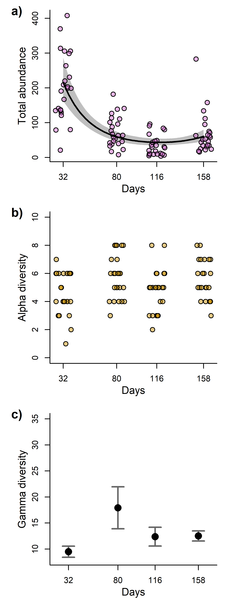<!-- -->

``` r
#dev.off()
```

# Effect of community size, alpha and gamma diversity on observed and expected beta-diversity

``` r
beta_data$alpha <- richness
beta_data$size <- abundance

gamma <- c(rep(inext_coverage_estimated_0$Dataset_1$gamma$Gamma, length(unique(beta_data$sites))),
rep(inext_coverage_estimated_0$Dataset_2$gamma$Gamma, length(unique(beta_data$sites))),
rep(inext_coverage_estimated_0$Dataset_3$gamma$Gamma, length(unique(beta_data$sites))),
rep(inext_coverage_estimated_0$Dataset_4$gamma$Gamma, length(unique(beta_data$sites))))

beta_data$gamma <- gamma

beta_data$size <- scale(beta_data$size)
beta_data$alpha <- scale(beta_data$alpha)
beta_data$gamma <- scale(beta_data$gamma)
```

### Models

``` r
cor(beta_data[,colnames(beta_data) %in% c("alpha","size","gamma")])
```

    ##            alpha        size      gamma
    ## alpha 1.00000000  0.08081435  0.2670127
    ## size  0.08081435  1.00000000 -0.3992352
    ## gamma 0.26701269 -0.39923519  1.0000000

``` r
mod_obs_beta <- glmmTMB(observed_distances ~ alpha + size + gamma + (1|block2/sites), data = beta_data, family = gaussian(link = "identity"), control=glmmTMBControl(optimizer=optim, optArgs=list(method="BFGS")))
plot(simulateResiduals(mod_obs_beta))
```

<!-- -->

``` r
Anova(mod_obs_beta)
```

    ## Analysis of Deviance Table (Type II Wald chisquare tests)
    ## 
    ## Response: observed_distances
    ##        Chisq Df Pr(>Chisq)  
    ## alpha 4.4171  1    0.03558 *
    ## size  6.2702  1    0.01228 *
    ## gamma 0.7567  1    0.38438  
    ## ---
    ## Signif. codes:  0 '***' 0.001 '**' 0.01 '*' 0.05 '.' 0.1 ' ' 1

``` r
mod_exp_beta <- glmmTMB(expected_distances ~ alpha + size + gamma + (1|block2/sites), data = beta_data, family = gaussian(link = "identity"))
plot(simulateResiduals(mod_exp_beta))
```

<!-- -->

``` r
Anova(mod_exp_beta)
```

    ## Analysis of Deviance Table (Type II Wald chisquare tests)
    ## 
    ## Response: expected_distances
    ##         Chisq Df Pr(>Chisq)    
    ## alpha 10.6942  1  0.0010747 ** 
    ## size  11.7972  1  0.0005932 ***
    ## gamma  0.3743  1  0.5406809    
    ## ---
    ## Signif. codes:  0 '***' 0.001 '**' 0.01 '*' 0.05 '.' 0.1 ' ' 1

``` r
mod_dev_beta <- glmmTMB(deviation_distances ~ alpha + size + gamma + (1|block2/sites), data = beta_data, family = gaussian(link = "identity"))
plot(simulateResiduals(mod_dev_beta))
```

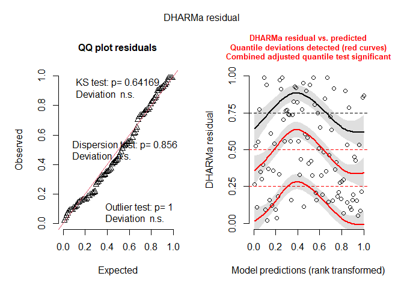<!-- -->

``` r
Anova(mod_dev_beta)
```

    ## Analysis of Deviance Table (Type II Wald chisquare tests)
    ## 
    ## Response: deviation_distances
    ##        Chisq Df Pr(>Chisq)
    ## alpha 0.0358  1     0.8500
    ## size  0.5893  1     0.4427
    ## gamma 0.2285  1     0.6327

### Plots

``` r
newdata_alpha <- data.frame(alpha = seq(from = min(beta_data$alpha), to = max(beta_data$alpha), length.out = 100),
                            size = rep(mean(beta_data$size), 100),
                            gamma = rep(mean(beta_data$gamma), 100))

newdata_size <- data.frame(alpha = rep(mean(beta_data$alpha), 100),
                            size = seq(from = min(beta_data$size), to = max(beta_data$size), length.out = 100),
                            gamma = rep(mean(beta_data$gamma), 100))


predicted_obs_alpha <- predict(mod_obs_beta, newdata = newdata_alpha, se.fit = TRUE, re.form = NA)
predicted_obs_alpha$upper <- predicted_obs_alpha$fit + predicted_obs_alpha$se.fit * qnorm(0.975)
predicted_obs_alpha$lower <- predicted_obs_alpha$fit + predicted_obs_alpha$se.fit * qnorm(0.025)
predicted_obs_alpha$fit <- predicted_obs_alpha$fit

predicted_exp_alpha <- predict(mod_exp_beta, newdata = newdata_alpha, se.fit = TRUE, re.form = NA)
predicted_exp_alpha$upper <- predicted_exp_alpha$fit + predicted_exp_alpha$se.fit * qnorm(0.975)
predicted_exp_alpha$lower <- predicted_exp_alpha$fit + predicted_exp_alpha$se.fit * qnorm(0.025)
predicted_exp_alpha$fit <- predicted_exp_alpha$fit


predicted_obs_size <- predict(mod_obs_beta, newdata = newdata_size, se.fit = TRUE, re.form = NA)
predicted_obs_size$upper <- predicted_obs_size$fit + predicted_obs_size$se.fit * qnorm(0.975)
predicted_obs_size$lower <- predicted_obs_size$fit + predicted_obs_size$se.fit * qnorm(0.025)
predicted_obs_size$fit <- predicted_obs_size$fit

predicted_exp_size <- predict(mod_exp_beta, newdata = newdata_size, se.fit = TRUE, re.form = NA)
predicted_exp_size$upper <- predicted_exp_size$fit + predicted_exp_size$se.fit * qnorm(0.975)
predicted_exp_size$lower <- predicted_exp_size$fit + predicted_exp_size$se.fit * qnorm(0.025)
predicted_exp_size$fit <- predicted_exp_size$fit
```

``` r
set.seed(1)
#svg(file = "plots/Community structure analysis/beta_dataiation.svg", width = 6, height = 3, pointsize = 8)

par(mfrow = c(2,2))

#####################################################################################################################


par(mar  = c(4,4,1,1), bty = "l", new = FALSE)
plot(observed_distances ~ alpha,
     data = beta_data, xaxt = "n", ylab = "", xlab = "", type = "n")

polygon(x = c(newdata_alpha$alpha[1:100], newdata_alpha$alpha[100:1]),
        y = c(predicted_obs_alpha$upper[1:100], predicted_obs_alpha$lower[100:1]), col = transparent("black", trans.val = 0.6), border = FALSE) 

lines(x = newdata_alpha$alpha,y = predicted_obs_alpha$fit, col = "black", lwd = 2)

points(observed_distances ~ alpha, pch = 21, col= "black",bg = transparent("black", trans.val = 0.6), cex = 1.1, data = beta_data)

title(ylab = "Observed distances", cex.lab = 1.25, line= 2.25)
axis(1)
title(xlab = "Alpha diversity (scaled)", cex.lab = 1.25 ,line = 2.25)


letters(x = 5, y = 97, "a)", cex = 1.5)


par(mar  = c(4,4,1,1), bty = "l", new = FALSE)
plot(expected_distances ~ alpha,
     data = beta_data, xaxt = "n", ylab = "", xlab = "", type = "n")

polygon(x = c(newdata_alpha$alpha[1:100], newdata_alpha$alpha[100:1]),
        y = c(predicted_exp_alpha$upper[1:100], predicted_exp_alpha$lower[100:1]), col = transparent("black", trans.val = 0.6), border = FALSE) 

lines(x = newdata_alpha$alpha,y = predicted_exp_alpha$fit, col = "black", lwd = 2)

points(expected_distances ~ alpha, pch = 21, col= "black",bg = transparent("black", trans.val = 0.6), cex = 1.1, data = beta_data)

title(ylab = "Expected distances", cex.lab = 1.25, line= 2.25)
axis(1)
title(xlab = "Alpha diversity (scaled)", cex.lab = 1.25 ,line = 2.25)


letters(x = 5, y = 97, "b)", cex = 1.5)


par(mar  = c(4,4,1,1), bty = "l", new = FALSE)
plot(observed_distances ~ size,
     data = beta_data, xaxt = "n", ylab = "", xlab = "", type = "n")

polygon(x = c(newdata_size$size[1:100], newdata_size$size[100:1]),
        y = c(predicted_obs_size$upper[1:100], predicted_obs_size$lower[100:1]), col = transparent("black", trans.val = 0.6), border = FALSE) 

lines(x = newdata_size$size,y = predicted_obs_size$fit, col = "black", lwd = 2)

points(observed_distances ~ size, pch = 21, col= "black",bg = transparent("black", trans.val = 0.6), cex = 1.1, data = beta_data)

title(ylab = "Observed distances", cex.lab = 1.25, line= 2.25)
axis(1)
title(xlab = "Community size (scaled)", cex.lab = 1.25 ,line = 2.25)


letters(x = 5, y = 97, "c)", cex = 1.5)


par(mar  = c(4,4,1,1), bty = "l", new = FALSE)
plot(expected_distances ~ size,
     data = beta_data, xaxt = "n", ylab = "", xlab = "", type = "n")

polygon(x = c(newdata_size$size[1:100], newdata_size$size[100:1]),
        y = c(predicted_exp_size$upper[1:100], predicted_exp_size$lower[100:1]), col = transparent("black", trans.val = 0.6), border = FALSE) 

lines(x = newdata_size$size,y = predicted_exp_size$fit, col = "black", lwd = 2)

points(expected_distances ~ size, pch = 21, col= "black",bg = transparent("black", trans.val = 0.6), cex = 1.1, data = beta_data)

title(ylab = "Expected distances", cex.lab = 1.25, line= 2.25)
axis(1)
title(xlab = "Community size (scaled)", cex.lab = 1.25 ,line = 2.25)


letters(x = 5, y = 97, "d)", cex = 1.5)
```

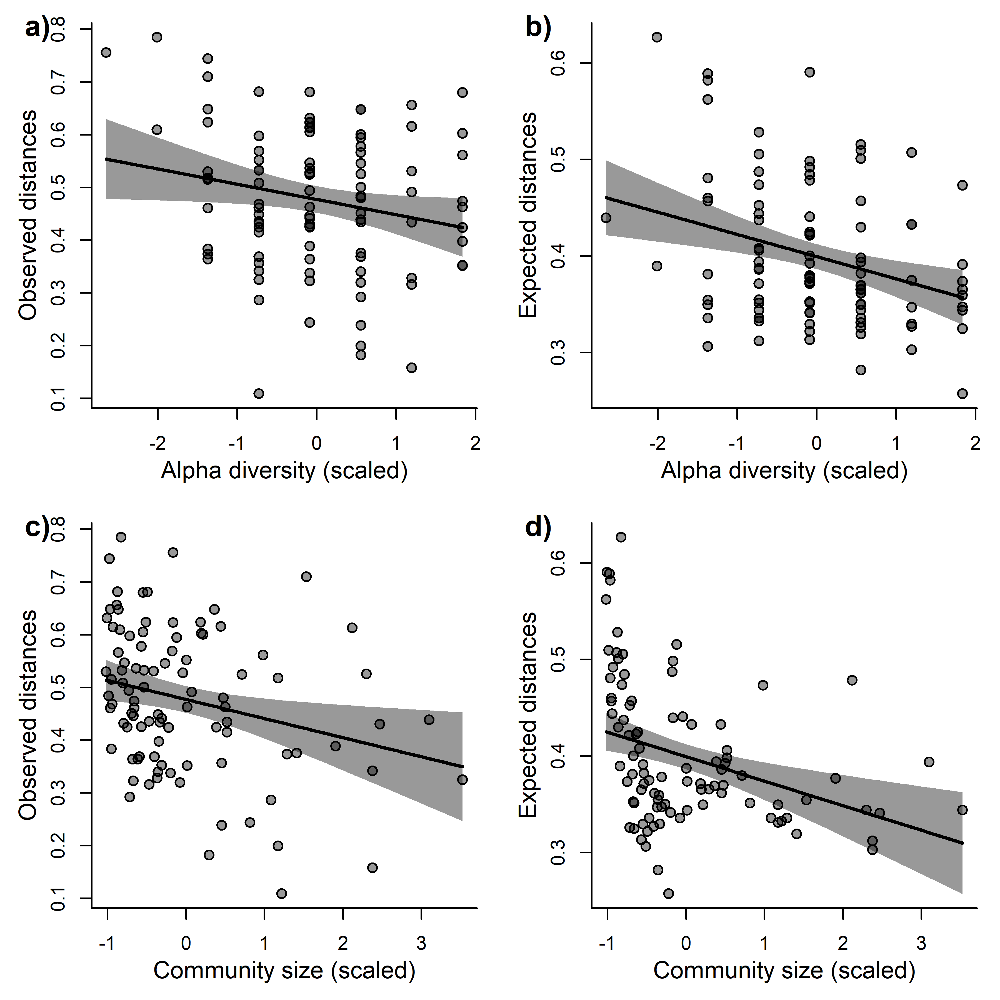<!-- -->

``` r
#dev.off()
```

# Environmental variability

Preparing data

``` r
Env$AM_match <- rep(NA, nrow(Env))

Env$AM_match[Env$amostragem == 2] <- 1
Env$AM_match[Env$amostragem == 5] <- 2
Env$AM_match[Env$amostragem == 7] <- 3
Env$AM_match[Env$amostragem == 9] <- 4

Env <- Env[is.na(Env$AM_match)==FALSE,]
```

Replace temperature information with the HOBOs temperature information,
which is much more accurate

``` r
hobo_env <- read.csv(paste(sep = "/",dir,"data/hobo_env.csv"))

index_env <- interaction(Env$id, Env$AM_match)
index_hobo <- interaction(hobo_env$ID, hobo_env$AM)

index <- match(index_env, index_hobo)
hobo_env <- hobo_env[index,]

#data.frame(Env$id, hobo_env$ID, Env$AM_match, hobo_env$AM)

Env$hobo_temp <- hobo_env$temp_mean
Env$iluminance <- hobo_env$light_mean


Env <- Env[,-which(colnames(Env) == "Temperatura")]
```

``` r
Exp_design_all_2$site_AM <- interaction(Exp_design_all_2$sites, Exp_design_all_2$AM)
Env$site_AM <- interaction(Env$id, Env$AM_match)


Env_2 <- Env[Env$Tratamento != "atrasado",]
Env_2 <- Env_2[match(Exp_design_all_2$site_AM, Env_2$site_AM),]

nrow(Env_2)
```

    ## [1] 96

``` r
nrow(Exp_design_all_2)
```

    ## [1] 96

Environmental variability

``` r
only_Env <- Env_2[,colnames(Env_2) %in% c("pH","OD","Condutividade","TDS","hobo_temp","iluminance")]

only_Env_st <- decostand(only_Env, method = "stand")

dist_env <- vegdist(only_Env_st, method = "euclidean")

env_var <- betadisper(dist_env, group = Env_2$AM_match)
```

PCA

``` r
pca_env <- rda(only_Env_st)

env_eigenvalues <- pca_env$CA$eig / sum(pca_env$CA$eig)
env_eigenvalues
```

    ##         PC1         PC2         PC3         PC4         PC5         PC6 
    ## 0.441964059 0.197021364 0.187784925 0.143153777 0.024725197 0.005350678

``` r
env_PCs <- pca_env$CA$u

pca_env$CA$v
```

    ##                     PC1         PC2         PC3         PC4         PC5
    ## pH            0.2967660  0.71220863  0.26916082  0.22737789 -0.52296302
    ## OD            0.1384326 -0.13356116  0.89333537  0.09228730  0.37776146
    ## Condutividade 0.5272558 -0.41765478 -0.08956272  0.13659492 -0.35700569
    ## TDS           0.5570725 -0.35007756 -0.04735948  0.11799152 -0.01455984
    ## hobo_temp     0.4761465  0.41072176 -0.33083168  0.09693367  0.67139300
    ## iluminance    0.2787875  0.09611507  0.09894625 -0.94752628 -0.07329629
    ##                        PC6
    ## pH            -0.083965759
    ## OD             0.117171160
    ## Condutividade  0.627242483
    ## TDS           -0.742117923
    ## hobo_temp      0.187023703
    ## iluminance     0.008405952

First PC is basically related to conductivity, total dissolved solids
and temperature Second PC is basically related to pH Third PC is
basically related to dissolved oxygen

## Test of environmental effect on community variability

Effect of environmental variability on observed community variability

``` r
Exp_design_all_2$env_var <- env_var$distances

mod_obs_am_num_env <- glmmTMB(beta_data$observed_distances ~ AM_days_st + env_var + (1|block2/sites), data = Exp_design_all_2, control = glmmTMBControl(optimizer=optim, optArgs=list(method="BFGS")))
```

    ## Warning in glmmTMB(beta_data$observed_distances ~ AM_days_st + env_var + : use
    ## of the '$' operator in formulas is not recommended

``` r
plot(simulateResiduals(mod_obs_am_num_env))
```

<!-- -->

``` r
Anova(mod_obs_am_num_env)
```

    ## Analysis of Deviance Table (Type II Wald chisquare tests)
    ## 
    ## Response: beta_data$observed_distances
    ##              Chisq Df Pr(>Chisq)   
    ## AM_days_st 10.2536  1   0.001364 **
    ## env_var     0.5045  1   0.477549   
    ## ---
    ## Signif. codes:  0 '***' 0.001 '**' 0.01 '*' 0.05 '.' 0.1 ' ' 1

Effect of environmental predictors on observed community variability

``` r
mod_obs_env_pcs <- glmmTMB(beta_data$observed_distances ~ AM_days_st + (1|block2/sites) + 
                            env_PCs[,1] +
                            env_PCs[,2] + 
                            env_PCs[,3], data = Exp_design_all_2, control = glmmTMBControl(optimizer=optim, optArgs=list(method="BFGS")))
```

    ## Warning in glmmTMB(beta_data$observed_distances ~ AM_days_st + (1 |
    ## block2/sites) + : use of the '$' operator in formulas is not recommended

``` r
Anova(mod_obs_env_pcs)
```

    ## Analysis of Deviance Table (Type II Wald chisquare tests)
    ## 
    ## Response: beta_data$observed_distances
    ##               Chisq Df Pr(>Chisq)
    ## AM_days_st   1.8190  1     0.1774
    ## env_PCs[, 1] 0.0001  1     0.9942
    ## env_PCs[, 2] 0.1869  1     0.6655
    ## env_PCs[, 3] 1.6476  1     0.1993

Effect of environmental variability on beta deviation

``` r
Exp_design_all_2$env_var <- env_var$distances

mod_dev_am_num_env <- glmmTMB(beta_data$deviation_distances ~ AM_days_st + env_var + (1|block2/sites), data = Exp_design_all_2, control = glmmTMBControl(optimizer=optim, optArgs=list(method="BFGS")))
```

    ## Warning in glmmTMB(beta_data$deviation_distances ~ AM_days_st + env_var + : use
    ## of the '$' operator in formulas is not recommended

``` r
plot(simulateResiduals(mod_dev_am_num_env))
```

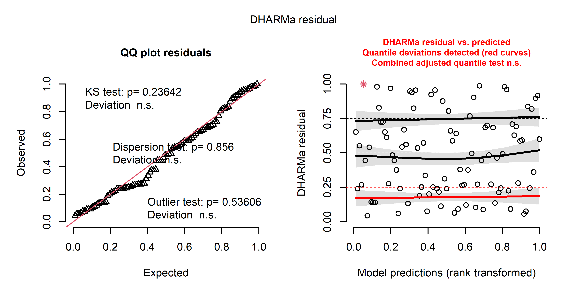<!-- -->

``` r
Anova(mod_dev_am_num_env)
```

    ## Analysis of Deviance Table (Type II Wald chisquare tests)
    ## 
    ## Response: beta_data$deviation_distances
    ##              Chisq Df Pr(>Chisq)    
    ## AM_days_st 12.8305  1   0.000341 ***
    ## env_var     0.3835  1   0.535728    
    ## ---
    ## Signif. codes:  0 '***' 0.001 '**' 0.01 '*' 0.05 '.' 0.1 ' ' 1

Effect of environmental predictors on beta deviation

``` r
mod_dev_env_pcs <- glmmTMB(beta_data$deviation_distances ~ AM_days_st + (1|block2/sites) + 
                            env_PCs[,1] +
                            env_PCs[,2] + 
                            env_PCs[,3], data = Exp_design_all_2, control = glmmTMBControl(optimizer=optim, optArgs=list(method="BFGS")))
```

    ## Warning in glmmTMB(beta_data$deviation_distances ~ AM_days_st + (1 |
    ## block2/sites) + : use of the '$' operator in formulas is not recommended

``` r
plot(simulateResiduals(mod_dev_env_pcs))
```

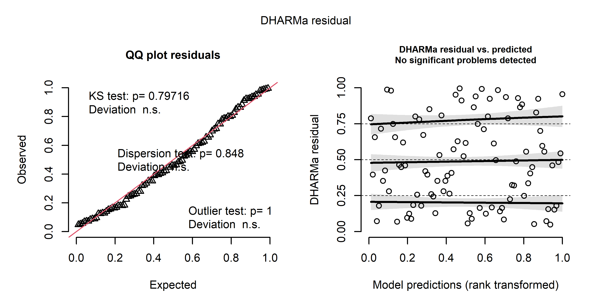<!-- -->

``` r
Anova(mod_dev_env_pcs)
```

    ## Analysis of Deviance Table (Type II Wald chisquare tests)
    ## 
    ## Response: beta_data$deviation_distances
    ##               Chisq Df Pr(>Chisq)  
    ## AM_days_st   2.1327  1    0.14419  
    ## env_PCs[, 1] 0.0190  1    0.89034  
    ## env_PCs[, 2] 2.3001  1    0.12937  
    ## env_PCs[, 3] 3.3828  1    0.06588 .
    ## ---
    ## Signif. codes:  0 '***' 0.001 '**' 0.01 '*' 0.05 '.' 0.1 ' ' 1

## Test of the effect of time om environmental parameters

Effect of time on environmental variability

``` r
env_var <- env_var$distances

mod_env_null <- glmmTMB(env_var ~ 1 + (1|block2/sites), data = Exp_design_all_2, control = glmmTMBControl(optimizer=optim, optArgs=list(method="BFGS")))

mod_env_am_num <- glmmTMB(env_var ~ AM_days_st + (1|block2/sites), data = Exp_design_all_2, control = glmmTMBControl(optimizer=optim, optArgs=list(method="BFGS")))

mod_env_am_num_quad <- glmmTMB(env_var ~ AM_days_st + AM_days_st_quad + (1|block2/sites), data = Exp_design_all_2)

plot(simulateResiduals(mod_env_am_num_quad))
```

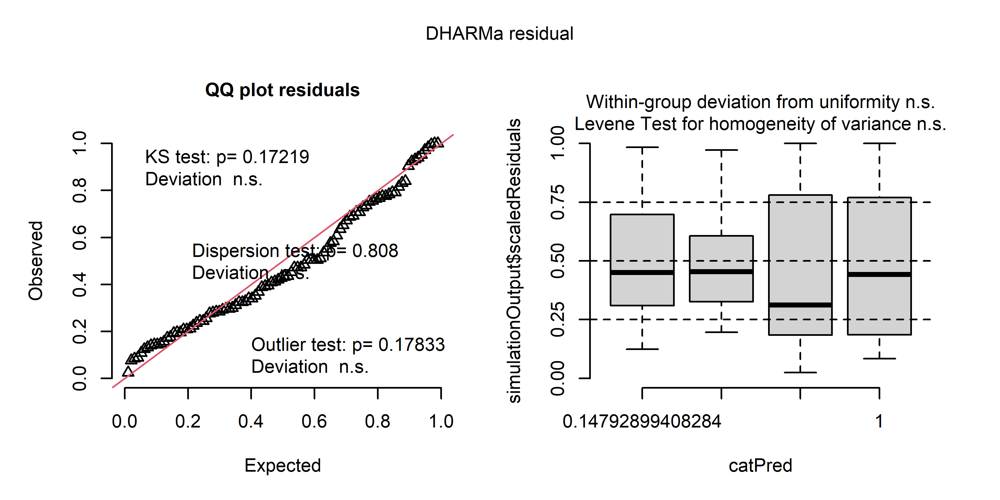<!-- -->

``` r
anova_env <- anova(mod_env_null, mod_env_am_num, mod_env_am_num_quad)
anova_env
```

    ## Data: Exp_design_all_2
    ## Models:
    ## mod_env_null: env_var ~ 1 + (1 | block2/sites), zi=~0, disp=~1
    ## mod_env_am_num: env_var ~ AM_days_st + (1 | block2/sites), zi=~0, disp=~1
    ## mod_env_am_num_quad: env_var ~ AM_days_st + AM_days_st_quad + (1 | block2/sites), zi=~0, disp=~1
    ##                     Df    AIC    BIC  logLik deviance  Chisq Chi Df Pr(>Chisq)
    ## mod_env_null         4 193.37 203.63 -92.684   185.37                         
    ## mod_env_am_num       5 195.33 208.16 -92.667   185.33 0.0351      1     0.8514
    ## mod_env_am_num_quad  6 195.29 210.67 -91.643   183.29 2.0473      1     0.1525

Now environmental PCs

``` r
mod_env1_pcs_null <- glmmTMB(env_PCs[,1] ~ 1 + (1|block2/sites), data = Exp_design_all_2)
mod_env1_pcs_lin <- glmmTMB(env_PCs[,1] ~ AM_days_st + (1|block2/sites), data = Exp_design_all_2)
mod_env1_pcs_quad <- glmmTMB(env_PCs[,1] ~ AM_days_st + AM_days_st_quad + (1|block2/sites), data = Exp_design_all_2)

plot(simulateResiduals(mod_env1_pcs_quad))
```

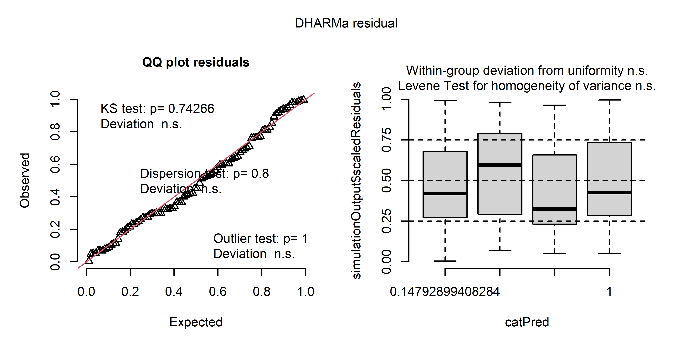<!-- -->

``` r
anova(mod_env1_pcs_null, mod_env1_pcs_lin, mod_env1_pcs_quad)
```

    ## Data: Exp_design_all_2
    ## Models:
    ## mod_env1_pcs_null: env_PCs[, 1] ~ 1 + (1 | block2/sites), zi=~0, disp=~1
    ## mod_env1_pcs_lin: env_PCs[, 1] ~ AM_days_st + (1 | block2/sites), zi=~0, disp=~1
    ## mod_env1_pcs_quad: env_PCs[, 1] ~ AM_days_st + AM_days_st_quad + (1 | block2/sites), zi=~0, disp=~1
    ##                   Df     AIC     BIC  logLik deviance   Chisq Chi Df Pr(>Chisq)
    ## mod_env1_pcs_null  4 -157.74 -147.48  82.871  -165.74                          
    ## mod_env1_pcs_lin   5 -312.87 -300.05 161.437  -322.87 157.132      1  < 2.2e-16
    ## mod_env1_pcs_quad  6 -327.56 -312.18 169.780  -339.56  16.687      1  4.408e-05
    ##                      
    ## mod_env1_pcs_null    
    ## mod_env1_pcs_lin  ***
    ## mod_env1_pcs_quad ***
    ## ---
    ## Signif. codes:  0 '***' 0.001 '**' 0.01 '*' 0.05 '.' 0.1 ' ' 1

``` r
Exp_design_all_2$AM_days_st_third <- Exp_design_all_2$AM_days_st^3

mod_env2_pcs_null <- glmmTMB(env_PCs[,2] ~ 1 + (1|block2/sites), data = Exp_design_all_2)
mod_env2_pcs_lin <- glmmTMB(env_PCs[,2] ~ AM_days_st + (1|block2/sites), data = Exp_design_all_2)
mod_env2_pcs_quad <- glmmTMB(env_PCs[,2] ~ AM_days_st + AM_days_st_quad + (1|block2/sites), data = Exp_design_all_2)
mod_env2_pcs_third <- glmmTMB(env_PCs[,2] ~ AM_days_st + AM_days_st_quad + AM_days_st_third + (1|block2/sites), data = Exp_design_all_2)

plot(simulateResiduals(mod_env2_pcs_third))
```

<!-- -->

``` r
anova(mod_env2_pcs_null, mod_env2_pcs_lin, mod_env2_pcs_quad,mod_env2_pcs_third)
```

    ## Data: Exp_design_all_2
    ## Models:
    ## mod_env2_pcs_null: env_PCs[, 2] ~ 1 + (1 | block2/sites), zi=~0, disp=~1
    ## mod_env2_pcs_lin: env_PCs[, 2] ~ AM_days_st + (1 | block2/sites), zi=~0, disp=~1
    ## mod_env2_pcs_quad: env_PCs[, 2] ~ AM_days_st + AM_days_st_quad + (1 | block2/sites), zi=~0, disp=~1
    ## mod_env2_pcs_third: env_PCs[, 2] ~ AM_days_st + AM_days_st_quad + AM_days_st_third + , zi=~0, disp=~1
    ## mod_env2_pcs_third:     (1 | block2/sites), zi=~0, disp=~1
    ##                    Df     AIC     BIC  logLik deviance    Chisq Chi Df
    ## mod_env2_pcs_null   4 -157.74 -147.48  82.871  -165.74                
    ## mod_env2_pcs_lin    5 -155.76 -142.94  82.879  -165.76   0.0172      1
    ## mod_env2_pcs_quad   6 -172.29 -156.91  92.147  -184.29  18.5351      1
    ## mod_env2_pcs_third  7 -362.65 -344.70 188.324  -376.65 192.3553      1
    ##                    Pr(>Chisq)    
    ## mod_env2_pcs_null                
    ## mod_env2_pcs_lin       0.8956    
    ## mod_env2_pcs_quad   1.668e-05 ***
    ## mod_env2_pcs_third  < 2.2e-16 ***
    ## ---
    ## Signif. codes:  0 '***' 0.001 '**' 0.01 '*' 0.05 '.' 0.1 ' ' 1

``` r
mod_env3_pcs_null <- glmmTMB(env_PCs[,3] ~ 1 + (1|block2/sites), data = Exp_design_all_2)
mod_env3_pcs_lin <- glmmTMB(env_PCs[,3] ~ AM_days_st + (1|block2/sites), data = Exp_design_all_2)
mod_env3_pcs_quad <- glmmTMB(env_PCs[,3] ~ AM_days_st + AM_days_st_quad + (1|block2/sites), data = Exp_design_all_2)

plot(simulateResiduals(mod_env3_pcs_quad))
```

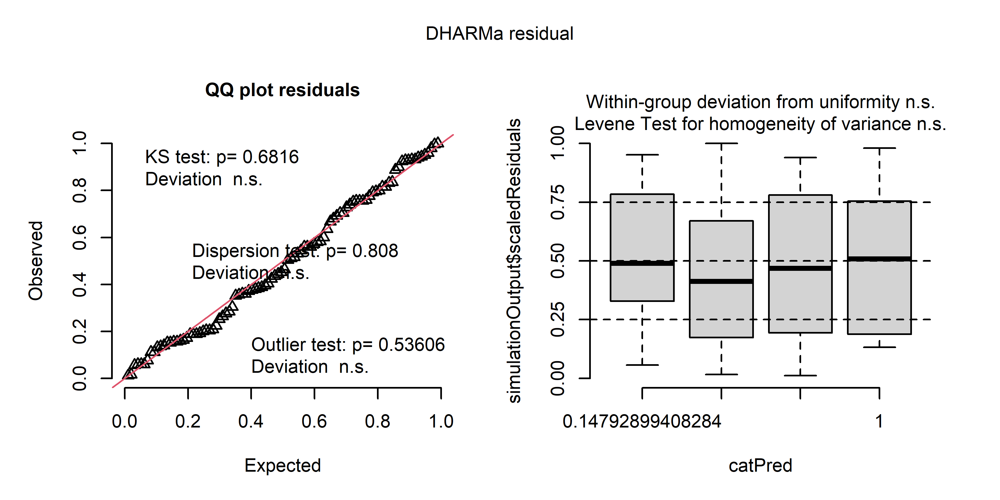<!-- -->

``` r
anova(mod_env3_pcs_null, mod_env3_pcs_lin, mod_env3_pcs_quad)
```

    ## Data: Exp_design_all_2
    ## Models:
    ## mod_env3_pcs_null: env_PCs[, 3] ~ 1 + (1 | block2/sites), zi=~0, disp=~1
    ## mod_env3_pcs_lin: env_PCs[, 3] ~ AM_days_st + (1 | block2/sites), zi=~0, disp=~1
    ## mod_env3_pcs_quad: env_PCs[, 3] ~ AM_days_st + AM_days_st_quad + (1 | block2/sites), zi=~0, disp=~1
    ##                   Df     AIC     BIC logLik deviance  Chisq Chi Df Pr(>Chisq)  
    ## mod_env3_pcs_null  4 -157.86 -147.60 82.931  -165.86                           
    ## mod_env3_pcs_lin   5 -161.66 -148.83 85.828  -171.66 5.7944      1    0.01608 *
    ## mod_env3_pcs_quad  6 -164.32 -148.94 88.161  -176.32 4.6656      1    0.03077 *
    ## ---
    ## Signif. codes:  0 '***' 0.001 '**' 0.01 '*' 0.05 '.' 0.1 ' ' 1

## Test of the effect environmental parameters (without the effects of time) on community variability

Basically all environmental predictors vary throughout time. We took the
residual of such models e checked if those residuals can explain
community variability alongside with time.

``` r
Exp_design_all_2$resid_PC1 <- residuals(mod_env1_pcs_quad)
Exp_design_all_2$resid_PC2 <- residuals(mod_env2_pcs_third)
Exp_design_all_2$resid_PC3 <- residuals(mod_env3_pcs_quad)


mod_obs_env_pcs <- glmmTMB(beta_data$observed_distances ~ (1|block2/sites) + AM_days_st +
                            resid_PC1 +
                            resid_PC2 + 
                            resid_PC3, data = Exp_design_all_2, control = glmmTMBControl(optimizer=optim, optArgs=list(method="BFGS")))
```

    ## Warning in glmmTMB(beta_data$observed_distances ~ (1 | block2/sites) +
    ## AM_days_st + : use of the '$' operator in formulas is not recommended

``` r
plot(simulateResiduals(mod_obs_env_pcs))
```

<!-- -->

``` r
Anova(mod_obs_env_pcs)
```

    ## Analysis of Deviance Table (Type II Wald chisquare tests)
    ## 
    ## Response: beta_data$observed_distances
    ##              Chisq Df Pr(>Chisq)   
    ## AM_days_st 10.3452  1   0.001298 **
    ## resid_PC1   0.0790  1   0.778646   
    ## resid_PC2   0.4417  1   0.506307   
    ## resid_PC3   1.8167  1   0.177712   
    ## ---
    ## Signif. codes:  0 '***' 0.001 '**' 0.01 '*' 0.05 '.' 0.1 ' ' 1

``` r
mod_dev_env_pcs <- glmmTMB(beta_data$deviation_distances ~ (1|block2/sites) + AM_days_st +
                            resid_PC1 +
                            resid_PC2 + 
                            resid_PC3, data = Exp_design_all_2)
```

    ## Warning in glmmTMB(beta_data$deviation_distances ~ (1 | block2/sites) + : use
    ## of the '$' operator in formulas is not recommended

``` r
plot(simulateResiduals(mod_dev_env_pcs))
```

<!-- -->

``` r
Anova(mod_dev_env_pcs)
```

    ## Analysis of Deviance Table (Type II Wald chisquare tests)
    ## 
    ## Response: beta_data$deviation_distances
    ##              Chisq Df Pr(>Chisq)    
    ## AM_days_st 13.4173  1  0.0002493 ***
    ## resid_PC1   0.0215  1  0.8834524    
    ## resid_PC2   0.5339  1  0.4649529    
    ## resid_PC3   1.8029  1  0.1793641    
    ## ---
    ## Signif. codes:  0 '***' 0.001 '**' 0.01 '*' 0.05 '.' 0.1 ' ' 1

### Making predictons

``` r
new_data_days$AM_days_st_third <- new_data_days$AM_days_st^3

predicted_env_PC1_time <- predict(mod_env1_pcs_quad, newdata = new_data_days, se.fit = TRUE, re.form = NA)
predicted_env_PC1_time$upper <- predicted_env_PC1_time$fit + predicted_env_PC1_time$se.fit * qnorm(0.975)
predicted_env_PC1_time$lower <- predicted_env_PC1_time$fit + predicted_env_PC1_time$se.fit * qnorm(0.025) 

predicted_env_PC2_time <- predict(mod_env2_pcs_third, newdata = new_data_days, se.fit = TRUE, re.form = NA)
predicted_env_PC2_time$upper <- predicted_env_PC2_time$fit + predicted_env_PC2_time$se.fit * qnorm(0.975)
predicted_env_PC2_time$lower <- predicted_env_PC2_time$fit + predicted_env_PC2_time$se.fit * qnorm(0.025) 

predicted_env_PC3_time <- predict(mod_env3_pcs_quad, newdata = new_data_days, se.fit = TRUE, re.form = NA)
predicted_env_PC3_time$upper <- predicted_env_PC3_time$fit + predicted_env_PC3_time$se.fit * qnorm(0.975)
predicted_env_PC3_time$lower <- predicted_env_PC3_time$fit + predicted_env_PC3_time$se.fit * qnorm(0.025) 


new_data_obs_PC3 <- new_data_days
new_data_obs_PC3$resid_PC3 <- seq(from = min(Exp_design_all_2$resid_PC3), to = max(Exp_design_all_2$resid_PC3), length.out = nrow(new_data_obs_PC3))
new_data_obs_PC3$resid_PC2 <- rep(median(Exp_design_all_2$resid_PC2), nrow(new_data_obs_PC3))
new_data_obs_PC3$resid_PC1 <- rep(median(Exp_design_all_2$resid_PC1), nrow(new_data_obs_PC3))
new_data_obs_PC3$AM_days_st <- rep(median(new_data_obs_PC3$AM_days_st), nrow(new_data_obs_PC3))
new_data_obs_PC3$AM_days_st_quad <- new_data_obs_PC3$AM_days_st^2


predicted_obs_PC3 <- predict(mod_obs_env_pcs, newdata = new_data_obs_PC3, se.fit =  TRUE, re.form = NA)
predicted_obs_PC3$upper <- predicted_obs_PC3$fit + predicted_obs_PC3$se.fit * qnorm(0.975)
predicted_obs_PC3$lower <- predicted_obs_PC3$fit + predicted_obs_PC3$se.fit * qnorm(0.025) 

predicted_dev_PC3 <- predict(mod_dev_env_pcs, newdata = new_data_obs_PC3, se.fit =  TRUE, re.form = NA)
predicted_dev_PC3$upper <- predicted_dev_PC3$fit + predicted_dev_PC3$se.fit * qnorm(0.975)
predicted_dev_PC3$lower <- predicted_dev_PC3$fit + predicted_dev_PC3$se.fit * qnorm(0.025) 
```

### Plots

#### Environmental variability VS community variability

``` r
set.seed(1)
#svg(file = "plots/Community structure analysis/beta_dataiation.svg", width = 6, height = 3, pointsize = 8)

par(mfrow = c(1,2))

par(mar  = c(4,4,1,1), bty = "l", new = FALSE)
plot(beta_data$observed_distances ~ env_var,
     data = Exp_design_all_2, xaxt = "n", ylab = "", xlab = "", type = "n")


points(beta_data$observed_distances[Exp_design_all_2$AM == 1] ~ env_var, pch = 21, col= "black",bg = transparent("grey80", trans.val = 0.6), cex = 1.1, data = Exp_design_all_2[Exp_design_all_2$AM == 1,])

points(beta_data$observed_distances[Exp_design_all_2$AM == 2] ~ env_var, pch = 21, col= "black",bg = transparent("grey50", trans.val = 0.6), cex = 1.1, data = Exp_design_all_2[Exp_design_all_2$AM == 2,])

points(beta_data$observed_distances[Exp_design_all_2$AM == 3] ~ env_var, pch = 21, col= "black",bg = transparent("grey20", trans.val = 0.6), cex = 1.1, data = Exp_design_all_2[Exp_design_all_2$AM == 3,])

points(beta_data$observed_distances[Exp_design_all_2$AM == 4] ~ env_var, pch = 21, col= "black",bg = transparent("black", trans.val = 0.6), cex = 1.1, data = Exp_design_all_2[Exp_design_all_2$AM == 4,])

title(ylab = "Observed community variability", cex.lab = 1.25, line= 2.25)
axis(1)
title(xlab = "Environmental variability", cex.lab = 1.25 ,line = 2.25)

par(new = TRUE, mar = c(0,0,0,0), bty = "n")
plot(NA, ylim = c(0,100), xlim = c(0,100), xaxt = "n", yaxt = "n")

legend(legend = c("32 days",
                  "80 days",
                  "116 days",
                  "158 days"), x = 100, y = 100, bty = "n", pch = 21, col = "black", pt.bg = c(transparent("grey80", trans.val = 0.6),
                                                                                              transparent("grey50", trans.val = 0.6),
                                                                                              transparent("grey20", trans.val = 0.6),
                                                                                              transparent("black", trans.val = 0.6)), xjust = 1, yjust = 1)

letters(x = 5, y = 97, "a)", cex = 1.5)

#####################################################################################################################


par(mar  = c(4,4,1,1), bty = "l", new = FALSE)
plot(beta_data$deviation_distances ~ env_var,
     data = Exp_design_all_2, xaxt = "n", ylab = "", xlab = "", type = "n")


points(beta_data$deviation_distances[Exp_design_all_2$AM == 1] ~ env_var, pch = 21, col= "black",bg = transparent("grey80", trans.val = 0.6), cex = 1.1, data = Exp_design_all_2[Exp_design_all_2$AM == 1,])

points(beta_data$deviation_distances[Exp_design_all_2$AM == 2] ~ env_var, pch = 21, col= "black",bg = transparent("grey50", trans.val = 0.6), cex = 1.1, data = Exp_design_all_2[Exp_design_all_2$AM == 2,])

points(beta_data$deviation_distances[Exp_design_all_2$AM == 3] ~ env_var, pch = 21, col= "black",bg = transparent("grey20", trans.val = 0.6), cex = 1.1, data = Exp_design_all_2[Exp_design_all_2$AM == 3,])

points(beta_data$deviation_distances[Exp_design_all_2$AM == 4] ~ env_var, pch = 21, col= "black",bg = transparent("black", trans.val = 0.6), cex = 1.1, data = Exp_design_all_2[Exp_design_all_2$AM == 4,])

title(ylab = "Beta deviation", cex.lab = 1.25, line= 2.25)
axis(1)
title(xlab = "Environmental variability", cex.lab = 1.25 ,line = 2.25)


letters(x = 5, y = 97, "b)", cex = 1.5)
```

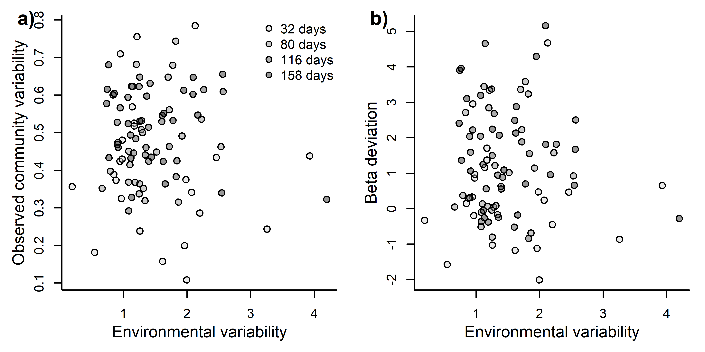<!-- -->

``` r
#dev.off()
```

#### Environmental parameters VS time

``` r
set.seed(1)
#svg(file = "plots/Community structure analysis/beta_dataiation.svg", width = 6, height = 3, pointsize = 8)

par(mfrow = c(3,1))

unique_AM_days_st <- unique(Exp_design_all_2$AM_days_st)
unique_AM_days_st_orig <- unique(Exp_design_all_2$AM_days_st_orig)


par(mar  = c(4,5,1,1), bty = "l", new = FALSE)
plot(env_PCs[,1] ~ jitter(AM_days_st, 1),
     data = Exp_design_all_2, xaxt = "n", ylab = "", xlab = "", type = "n", xlim = c(min(unique_AM_days_st)*1.25,max(unique_AM_days_st)*1.25),  xaxs = "i")

polygon(x = c(new_data_days$AM_days_st[1:100], new_data_days$AM_days_st[100:1]),
        y = c(predicted_env_PC1_time$upper[1:100], predicted_env_PC1_time$lower[100:1]), col = transparent("blue", trans.val = 0.6), border = FALSE) 

points(env_PCs[,1] ~ jitter(AM_days_st, 0.5), pch = 21, col= "black",bg = transparent("blue", trans.val = 0.75), cex = 1.1, data = Exp_design_all_2)

lines(x = new_data_days$AM_days_st,y = predicted_env_PC1_time$fit, col = "black", lwd = 2)

title(ylab = "Environment PC1", cex.lab = 1, line= 4)
title(ylab = "(mostly Conductivity, total", cex.lab = 1, line= 3)
title(ylab = "dissolved solids and temperature)", cex.lab = 1, line= 2)

axis(1, at = unique_AM_days_st, labels = c("32", "80", "116", "158"))
title(xlab = "Days", cex.lab = 1.25 ,line = 2.25)

letters(x = 5, y = 97, "a)", cex = 1.5)

##############################################################################################


par(mar  = c(4,5,1,1), bty = "l", new = FALSE)
plot(env_PCs[,2] ~ jitter(AM_days_st, 1),
     data = Exp_design_all_2, xaxt = "n", ylab = "", xlab = "", type = "n", xlim = c(min(unique_AM_days_st)*1.25,max(unique_AM_days_st)*1.25),  xaxs = "i")

polygon(x = c(new_data_days$AM_days_st[1:100], new_data_days$AM_days_st[100:1]),
        y = c(predicted_env_PC2_time$upper[1:100], predicted_env_PC2_time$lower[100:1]), col = transparent("blue", trans.val = 0.6), border = FALSE) 

points(env_PCs[,2] ~ jitter(AM_days_st, 0.5), pch = 21, col= "black",bg = transparent("blue", trans.val = 0.75), cex = 1.1, data = Exp_design_all_2)

lines(x = new_data_days$AM_days_st,y = predicted_env_PC2_time$fit, col = "black", lwd = 2)

title(ylab = "Environment PC2", cex.lab = 1, line= 3)
title(ylab = "(mostly pH)", cex.lab = 1, line= 2)

axis(1, at = unique_AM_days_st, labels = c("32", "80", "116", "158"))
title(xlab = "Days", cex.lab = 1.25 ,line = 2.25)

letters(x = 5, y = 97, "b)", cex = 1.5)


##############################################################################################


par(mar  = c(4,5,1,1), bty = "l", new = FALSE)
plot(env_PCs[,3] ~ jitter(AM_days_st, 1),
     data = Exp_design_all_2, xaxt = "n", ylab = "", xlab = "", type = "n", xlim = c(min(unique_AM_days_st)*1.25,max(unique_AM_days_st)*1.25),  xaxs = "i")

polygon(x = c(new_data_days$AM_days_st[1:100], new_data_days$AM_days_st[100:1]),
        y = c(predicted_env_PC3_time$upper[1:100], predicted_env_PC3_time$lower[100:1]), col = transparent("blue", trans.val = 0.6), border = FALSE) 

points(env_PCs[,3] ~ jitter(AM_days_st, 0.5), pch = 21, col= "black",bg = transparent("blue", trans.val = 0.75), cex = 1.1, data = Exp_design_all_2)

lines(x = new_data_days$AM_days_st,y = predicted_env_PC3_time$fit, col = "black", lwd = 2)

title(ylab = "Environment PC3", cex.lab = 1, line= 3)
title(ylab = "(mostly dissolved oxygen)", cex.lab = 1, line= 2)

axis(1, at = unique_AM_days_st, labels = c("32", "80", "116", "158"))
title(xlab = "Days", cex.lab = 1.25 ,line = 2.25)

letters(x = 5, y = 97, "c)", cex = 1.5)
```

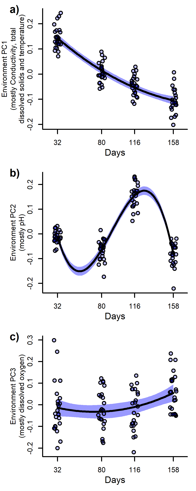<!-- -->

#### Environmental parameters VS community variability

``` r
set.seed(1)
#svg(file = "plots/Community structure analysis/beta_dataiation.svg", width = 6, height = 3, pointsize = 8)

par(mfrow = c(1,2))

par(mar  = c(4,4,1,1), bty = "l", new = FALSE)
plot(beta_data$observed_distances ~ resid_PC3,
     data = Exp_design_all_2, xaxt = "n", ylab = "", xlab = "", type = "n")

polygon(x = c(new_data_obs_PC3$resid_PC3[1:100], new_data_obs_PC3$resid_PC3[100:1]),
        y = c(predicted_obs_PC3$upper[1:100], predicted_obs_PC3$lower[100:1]), col = transparent("grey20", trans.val = 0.6), border = FALSE) 

points(beta_data$observed_distances[Exp_design_all_2$AM == 1] ~ resid_PC3, pch = 21, col= "black",bg = transparent("grey80", trans.val = 0.6), cex = 1.1, data = Exp_design_all_2[Exp_design_all_2$AM == 1,])

points(beta_data$observed_distances[Exp_design_all_2$AM == 2] ~ resid_PC3, pch = 21, col= "black",bg = transparent("grey50", trans.val = 0.6), cex = 1.1, data = Exp_design_all_2[Exp_design_all_2$AM == 2,])

points(beta_data$observed_distances[Exp_design_all_2$AM == 3] ~ resid_PC3, pch = 21, col= "black",bg = transparent("grey20", trans.val = 0.6), cex = 1.1, data = Exp_design_all_2[Exp_design_all_2$AM == 3,])

points(beta_data$observed_distances[Exp_design_all_2$AM == 4] ~ resid_PC3, pch = 21, col= "black",bg = transparent("black", trans.val = 0.6), cex = 1.1, data = Exp_design_all_2[Exp_design_all_2$AM == 4,])

lines(x = new_data_obs_PC3$resid_PC3,y = predicted_obs_PC3$fit, col = "black", lwd = 2, lty = 2)


title(ylab = "Observed community variability", cex.lab = 1.25, line= 2.25)
axis(1)
title(xlab = "Residuals of environmental PC3", cex.lab = 1 ,line = 2)
title(xlab = "(Dissolved oxygen without temporal effects)", cex.lab = 0.9 ,line = 3)


letters(x = 5, y = 97, "a)", cex = 1.5)

#####################################################################################################################


par(mar  = c(4,4,1,1), bty = "l", new = FALSE)
plot(beta_data$deviation_distances ~ resid_PC3,
     data = Exp_design_all_2, xaxt = "n", ylab = "", xlab = "", type = "n")

polygon(x = c(new_data_obs_PC3$resid_PC3[1:100], new_data_obs_PC3$resid_PC3[100:1]),
        y = c(predicted_dev_PC3$upper[1:100], predicted_dev_PC3$lower[100:1]), col = transparent("grey20", trans.val = 0.6), border = FALSE) 

points(beta_data$deviation_distances[Exp_design_all_2$AM == 1] ~ resid_PC3, pch = 21, col= "black",bg = transparent("grey80", trans.val = 0.6), cex = 1.1, data = Exp_design_all_2[Exp_design_all_2$AM == 1,])

points(beta_data$deviation_distances[Exp_design_all_2$AM == 2] ~ resid_PC3, pch = 21, col= "black",bg = transparent("grey50", trans.val = 0.6), cex = 1.1, data = Exp_design_all_2[Exp_design_all_2$AM == 2,])

points(beta_data$deviation_distances[Exp_design_all_2$AM == 3] ~ resid_PC3, pch = 21, col= "black",bg = transparent("grey20", trans.val = 0.6), cex = 1.1, data = Exp_design_all_2[Exp_design_all_2$AM == 3,])

points(beta_data$deviation_distances[Exp_design_all_2$AM == 4] ~ resid_PC3, pch = 21, col= "black",bg = transparent("black", trans.val = 0.6), cex = 1.1, data = Exp_design_all_2[Exp_design_all_2$AM == 4,])

lines(x = new_data_obs_PC3$resid_PC3,y = predicted_dev_PC3$fit, col = "black", lwd = 2, lty = 2)


title(ylab = "Beta deviation", cex.lab = 1.25, line= 2.25)
axis(1)
title(xlab = "Residuals of environmental PC3", cex.lab = 1 ,line = 2)
title(xlab = "(Dissolved oxygen without temporal effects)", cex.lab = 0.9 ,line = 3)

par(new = TRUE, mar = c(0,0,0,0), bty = "n")
plot(NA, ylim = c(0,100), xlim = c(0,100), xaxt = "n", yaxt = "n")

legend(legend = c("32 days",
                  "80 days",
                  "116 days",
                  "158 days"), x = 100, y = 100, bty = "n", pch = 21, col = "black", pt.bg = c(transparent("grey80", trans.val = 0.6),
                                                                                              transparent("grey50", trans.val = 0.6),
                                                                                              transparent("grey20", trans.val = 0.6),
                                                                                              transparent("black", trans.val = 0.6)), xjust = 1, yjust = 1)

letters(x = 5, y = 97, "b)", cex = 1.5)
```

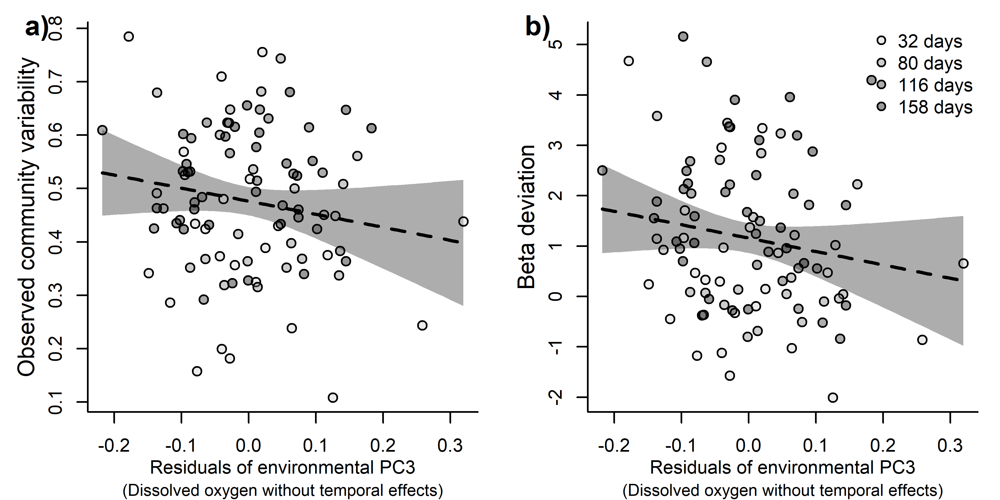<!-- -->

``` r
#dev.off()
```
