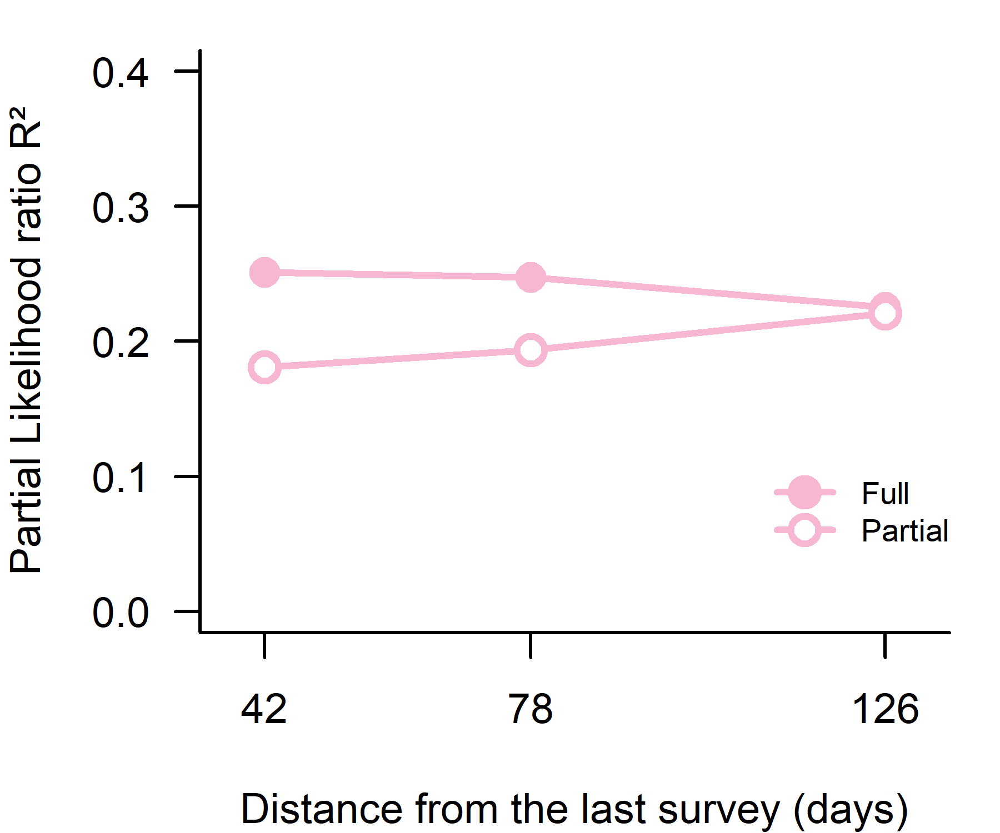
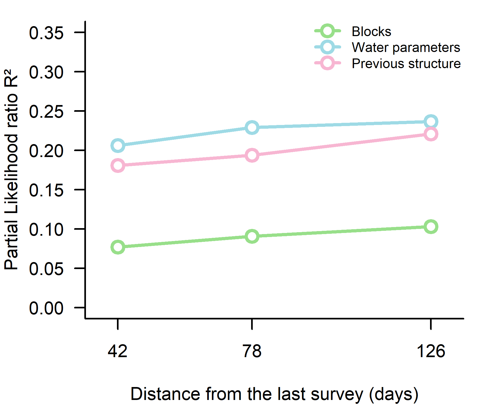
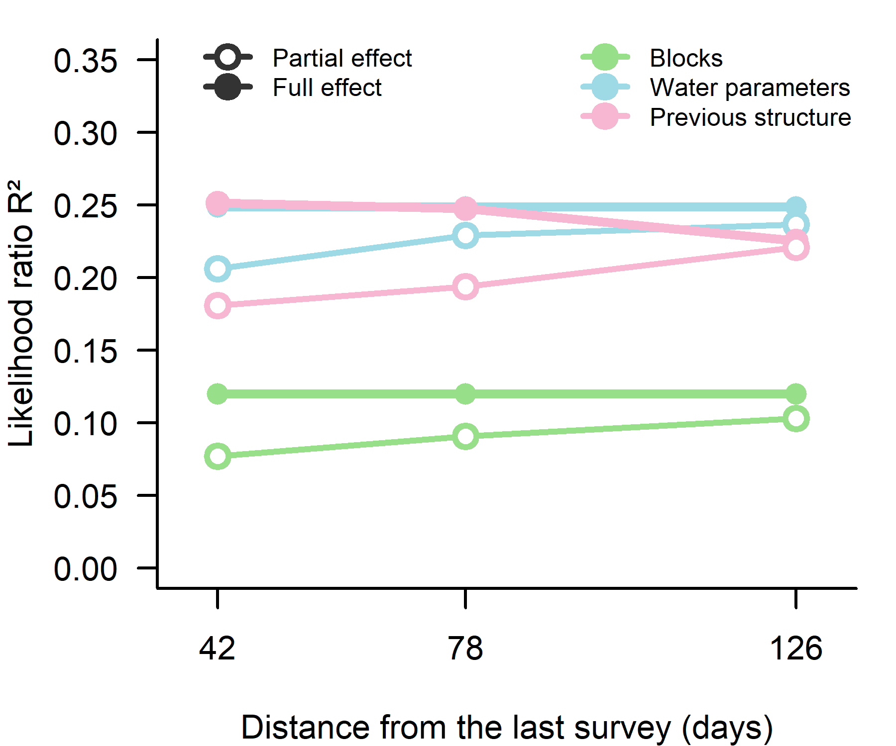

Supporting Information 8 – Are previous community structures better
predictors of future structures than other predictors?
================
Rodolfo Pelinson
2026-07-20

``` r
source(paste(sep = "/",dir,"functions/remove_sp.R"))
source(paste(sep = "/",dir,"functions/varpart_manyglm.R"))
source(paste(sep = "/",dir,"functions/R2_manyglm.R"))
```

``` r
library(vegan)
library(gllvm)
library(mvabund)
```

``` r
source(paste(sep = "/",dir,"ajeitando_planilhas.R"))
```

## Organizing the predictor community states and the response (the last survey.)

``` r
Env$AM_match <- rep(NA, nrow(Env))

Env$AM_match[Env$amostragem == 2] <- 1
Env$AM_match[Env$amostragem == 5] <- 2
Env$AM_match[Env$amostragem == 7] <- 3
Env$AM_match[Env$amostragem == 9] <- 4

Env <- Env[is.na(Env$AM_match)==FALSE,]


hobo_env <- read.csv(paste(sep = "/",dir,"data/hobo_env.csv"))

index_env <- interaction(Env$id, Env$AM_match)
index_hobo <- interaction(hobo_env$ID, hobo_env$AM)

index <- match(index_env, index_hobo)
hobo_env <- hobo_env[index,]

#data.frame(Env$id, hobo_env$ID, Env$AM_match, hobo_env$AM)

Env$hobo_temp <- hobo_env$temp_mean
Env$iluminance <- hobo_env$light_mean


Env <- Env[,-which(colnames(Env) == "Temperatura")]
```

``` r
comm_AM1 <- remove_sp(communities_AM1, 3)
comm_AM2 <- remove_sp(communities_AM2, 3)
comm_AM3 <- remove_sp(communities_AM3, 3)
comm_AM4 <- remove_sp(communities_AM4, 3)

comm_AM1_drop_atrasado <- comm_AM1[Exp_design$treatments != "atrasado",]
comm_AM2_drop_atrasado <- comm_AM2[Exp_design$treatments != "atrasado",]
comm_AM3_drop_atrasado <- comm_AM3[Exp_design$treatments != "atrasado",]
comm_AM4_drop_atrasado <- comm_AM4[Exp_design$treatments != "atrasado",]

Exp_design_drop_atrasado <- Exp_design[Exp_design$treatments != "atrasado",]


Env_AM4_drop_atrasado <- Env[Env$Tratamento != "atrasado" & Env$AM_match == "4",]
Env_AM4_drop_atrasado <- Env_AM4_drop_atrasado[match(Exp_design_drop_atrasado$sites, Env_AM4_drop_atrasado$id),]

colnames(comm_AM1_drop_atrasado) <- gsub(" ", "_", colnames(comm_AM1_drop_atrasado))
colnames(comm_AM2_drop_atrasado) <- gsub(" ", "_", colnames(comm_AM2_drop_atrasado))
colnames(comm_AM3_drop_atrasado) <- gsub(" ", "_", colnames(comm_AM3_drop_atrasado))
colnames(comm_AM4_drop_atrasado) <- gsub(" ", "_", colnames(comm_AM4_drop_atrasado))

block <- data.frame(block2 = Exp_design_drop_atrasado$block2)
comm_AM1_pred <- decostand(comm_AM1_drop_atrasado, method = "total", MARGIN = 2)
comm_AM2_pred <- decostand(comm_AM2_drop_atrasado, method = "total", MARGIN = 2)
comm_AM3_pred <- decostand(comm_AM3_drop_atrasado, method = "total", MARGIN = 2)

comm_AM1_pred_st <- decostand(comm_AM1_drop_atrasado, method = "stand")
comm_AM2_pred_st <- decostand(comm_AM2_drop_atrasado, method = "stand")
comm_AM3_pred_st <- decostand(comm_AM3_drop_atrasado, method = "stand")

set.seed(1); nmds_prior_AM1 <- metaMDS(comm_AM1_pred, distance  = "bray", k = 3, try = 50, trymax = 50)
```

    ## Run 0 stress 0.1375544 
    ## Run 1 stress 0.1460964 
    ## Run 2 stress 0.1392179 
    ## Run 3 stress 0.1375544 
    ## ... Procrustes: rmse 5.978138e-05  max resid 0.0001325152 
    ## ... Similar to previous best
    ## Run 4 stress 0.1375545 
    ## ... Procrustes: rmse 0.0004922836  max resid 0.001035383 
    ## ... Similar to previous best
    ## Run 5 stress 0.1375544 
    ## ... Procrustes: rmse 3.461837e-05  max resid 7.227206e-05 
    ## ... Similar to previous best
    ## Run 6 stress 0.1460958 
    ## Run 7 stress 0.1460959 
    ## Run 8 stress 0.1392186 
    ## Run 9 stress 0.1375546 
    ## ... Procrustes: rmse 0.0002269276  max resid 0.0004761832 
    ## ... Similar to previous best
    ## Run 10 stress 0.1392178 
    ## Run 11 stress 0.1460997 
    ## Run 12 stress 0.1375544 
    ## ... Procrustes: rmse 4.362358e-05  max resid 9.347126e-05 
    ## ... Similar to previous best
    ## Run 13 stress 0.1392187 
    ## Run 14 stress 0.1392177 
    ## Run 15 stress 0.1377387 
    ## ... Procrustes: rmse 0.01463444  max resid 0.0472602 
    ## Run 16 stress 0.1460962 
    ## Run 17 stress 0.1460962 
    ## Run 18 stress 0.1375547 
    ## ... Procrustes: rmse 0.0006351723  max resid 0.001318278 
    ## ... Similar to previous best
    ## Run 19 stress 0.1375545 
    ## ... Procrustes: rmse 0.0001352243  max resid 0.0002899061 
    ## ... Similar to previous best
    ## Run 20 stress 0.1392185 
    ## Run 21 stress 0.1375547 
    ## ... Procrustes: rmse 0.0002909702  max resid 0.0006144406 
    ## ... Similar to previous best
    ## Run 22 stress 0.1375543 
    ## ... New best solution
    ## ... Procrustes: rmse 5.961005e-05  max resid 0.0001271117 
    ## ... Similar to previous best
    ## Run 23 stress 0.1375548 
    ## ... Procrustes: rmse 0.0006733432  max resid 0.001394781 
    ## ... Similar to previous best
    ## Run 24 stress 0.1375545 
    ## ... Procrustes: rmse 0.0001938826  max resid 0.0003998104 
    ## ... Similar to previous best
    ## Run 25 stress 0.1375543 
    ## ... New best solution
    ## ... Procrustes: rmse 0.0001112144  max resid 0.0002329711 
    ## ... Similar to previous best
    ## Run 26 stress 0.1392179 
    ## Run 27 stress 0.1375547 
    ## ... Procrustes: rmse 0.0004582825  max resid 0.0009686199 
    ## ... Similar to previous best
    ## Run 28 stress 0.1375545 
    ## ... Procrustes: rmse 0.0003361891  max resid 0.0006982805 
    ## ... Similar to previous best
    ## Run 29 stress 0.1375546 
    ## ... Procrustes: rmse 0.0003525809  max resid 0.0007413894 
    ## ... Similar to previous best
    ## Run 30 stress 0.1377395 
    ## ... Procrustes: rmse 0.01568329  max resid 0.05178131 
    ## Run 31 stress 0.1460959 
    ## Run 32 stress 0.1375543 
    ## ... Procrustes: rmse 9.415613e-05  max resid 0.0002203109 
    ## ... Similar to previous best
    ## Run 33 stress 0.1375544 
    ## ... Procrustes: rmse 0.0002701614  max resid 0.0005587983 
    ## ... Similar to previous best
    ## Run 34 stress 0.1375547 
    ## ... Procrustes: rmse 0.0004686558  max resid 0.0009620697 
    ## ... Similar to previous best
    ## Run 35 stress 0.1392182 
    ## Run 36 stress 0.1375546 
    ## ... Procrustes: rmse 0.0004039248  max resid 0.0008339456 
    ## ... Similar to previous best
    ## Run 37 stress 0.1375547 
    ## ... Procrustes: rmse 0.0004815875  max resid 0.0009966823 
    ## ... Similar to previous best
    ## Run 38 stress 0.1375545 
    ## ... Procrustes: rmse 0.0002649295  max resid 0.0005421185 
    ## ... Similar to previous best
    ## Run 39 stress 0.13774 
    ## ... Procrustes: rmse 0.01662568  max resid 0.05482237 
    ## Run 40 stress 0.1460963 
    ## Run 41 stress 0.1375546 
    ## ... Procrustes: rmse 0.0003348882  max resid 0.0007182278 
    ## ... Similar to previous best
    ## Run 42 stress 0.1460961 
    ## Run 43 stress 0.139218 
    ## Run 44 stress 0.1460965 
    ## Run 45 stress 0.1392181 
    ## Run 46 stress 0.1375546 
    ## ... Procrustes: rmse 0.0004002072  max resid 0.0008369132 
    ## ... Similar to previous best
    ## Run 47 stress 0.1392185 
    ## Run 48 stress 0.1392191 
    ## Run 49 stress 0.1392178 
    ## Run 50 stress 0.1392186 
    ## *** Best solution repeated 12 times

``` r
comm_nmds_AM1 <- data.frame(nmds_prior_AM1$points)
comm_AM1_pred_nmds <- decostand(comm_nmds_AM1, method = "stand")

set.seed(1); nmds_prior_AM2 <- metaMDS(comm_AM2_pred, distance  = "bray", k = 3, try = 50, trymax = 50)
```

    ## Run 0 stress 0.134689 
    ## Run 1 stress 0.1562537 
    ## Run 2 stress 0.1346889 
    ## ... New best solution
    ## ... Procrustes: rmse 0.00042609  max resid 0.0009291392 
    ## ... Similar to previous best
    ## Run 3 stress 0.1346891 
    ## ... Procrustes: rmse 0.000542743  max resid 0.001107337 
    ## ... Similar to previous best
    ## Run 4 stress 0.1349081 
    ## ... Procrustes: rmse 0.006468483  max resid 0.01979279 
    ## Run 5 stress 0.1349833 
    ## ... Procrustes: rmse 0.0112312  max resid 0.04025002 
    ## Run 6 stress 0.1621398 
    ## Run 7 stress 0.1346888 
    ## ... New best solution
    ## ... Procrustes: rmse 0.000254259  max resid 0.0005942801 
    ## ... Similar to previous best
    ## Run 8 stress 0.1346888 
    ## ... New best solution
    ## ... Procrustes: rmse 6.214716e-05  max resid 0.0001665271 
    ## ... Similar to previous best
    ## Run 9 stress 0.1346888 
    ## ... Procrustes: rmse 8.12875e-05  max resid 0.0001655136 
    ## ... Similar to previous best
    ## Run 10 stress 0.1347098 
    ## ... Procrustes: rmse 0.002793126  max resid 0.006928169 
    ## ... Similar to previous best
    ## Run 11 stress 0.134689 
    ## ... Procrustes: rmse 0.0002731196  max resid 0.0005678591 
    ## ... Similar to previous best
    ## Run 12 stress 0.1346889 
    ## ... Procrustes: rmse 0.0002230868  max resid 0.0004565452 
    ## ... Similar to previous best
    ## Run 13 stress 0.134689 
    ## ... Procrustes: rmse 0.0002502332  max resid 0.0005188621 
    ## ... Similar to previous best
    ## Run 14 stress 0.1346889 
    ## ... Procrustes: rmse 9.036694e-05  max resid 0.000184593 
    ## ... Similar to previous best
    ## Run 15 stress 0.1562537 
    ## Run 16 stress 0.1346888 
    ## ... New best solution
    ## ... Procrustes: rmse 1.64291e-05  max resid 4.175196e-05 
    ## ... Similar to previous best
    ## Run 17 stress 0.1346891 
    ## ... Procrustes: rmse 0.0003177436  max resid 0.0007289487 
    ## ... Similar to previous best
    ## Run 18 stress 0.1346892 
    ## ... Procrustes: rmse 0.0003965468  max resid 0.0009275016 
    ## ... Similar to previous best
    ## Run 19 stress 0.1621401 
    ## Run 20 stress 0.1514556 
    ## Run 21 stress 0.1580668 
    ## Run 22 stress 0.1346889 
    ## ... Procrustes: rmse 0.0002231242  max resid 0.0005048894 
    ## ... Similar to previous best
    ## Run 23 stress 0.156254 
    ## Run 24 stress 0.1346889 
    ## ... Procrustes: rmse 0.0001897871  max resid 0.0004215478 
    ## ... Similar to previous best
    ## Run 25 stress 0.1346889 
    ## ... Procrustes: rmse 0.0001863029  max resid 0.0004039904 
    ## ... Similar to previous best
    ## Run 26 stress 0.1346888 
    ## ... Procrustes: rmse 1.078059e-05  max resid 2.946936e-05 
    ## ... Similar to previous best
    ## Run 27 stress 0.1352969 
    ## Run 28 stress 0.1346891 
    ## ... Procrustes: rmse 0.0003428832  max resid 0.0007195516 
    ## ... Similar to previous best
    ## Run 29 stress 0.134689 
    ## ... Procrustes: rmse 0.0002427892  max resid 0.0005567385 
    ## ... Similar to previous best
    ## Run 30 stress 0.1346889 
    ## ... Procrustes: rmse 0.0001815065  max resid 0.0003948945 
    ## ... Similar to previous best
    ## Run 31 stress 0.1346892 
    ## ... Procrustes: rmse 0.0004049246  max resid 0.0008599152 
    ## ... Similar to previous best
    ## Run 32 stress 0.134689 
    ## ... Procrustes: rmse 0.000286723  max resid 0.0005971748 
    ## ... Similar to previous best
    ## Run 33 stress 0.1562537 
    ## Run 34 stress 0.1575545 
    ## Run 35 stress 0.1346888 
    ## ... Procrustes: rmse 9.587677e-05  max resid 0.0002124468 
    ## ... Similar to previous best
    ## Run 36 stress 0.1604599 
    ## Run 37 stress 0.1346892 
    ## ... Procrustes: rmse 0.0003922525  max resid 0.0009192908 
    ## ... Similar to previous best
    ## Run 38 stress 0.134689 
    ## ... Procrustes: rmse 0.0002817689  max resid 0.0006514705 
    ## ... Similar to previous best
    ## Run 39 stress 0.1346889 
    ## ... Procrustes: rmse 0.0002030281  max resid 0.0004615382 
    ## ... Similar to previous best
    ## Run 40 stress 0.1346891 
    ## ... Procrustes: rmse 0.0003197249  max resid 0.0007387057 
    ## ... Similar to previous best
    ## Run 41 stress 0.134689 
    ## ... Procrustes: rmse 0.0002726837  max resid 0.0006145858 
    ## ... Similar to previous best
    ## Run 42 stress 0.1346888 
    ## ... Procrustes: rmse 5.556985e-05  max resid 0.0001218563 
    ## ... Similar to previous best
    ## Run 43 stress 0.1346888 
    ## ... Procrustes: rmse 1.546297e-05  max resid 4.309975e-05 
    ## ... Similar to previous best
    ## Run 44 stress 0.1346891 
    ## ... Procrustes: rmse 0.0003415497  max resid 0.0007936639 
    ## ... Similar to previous best
    ## Run 45 stress 0.1346889 
    ## ... Procrustes: rmse 0.0001611987  max resid 0.0003648929 
    ## ... Similar to previous best
    ## Run 46 stress 0.1346889 
    ## ... Procrustes: rmse 0.0001891011  max resid 0.0004168957 
    ## ... Similar to previous best
    ## Run 47 stress 0.134689 
    ## ... Procrustes: rmse 0.000219331  max resid 0.0004645626 
    ## ... Similar to previous best
    ## Run 48 stress 0.1346891 
    ## ... Procrustes: rmse 0.0003081088  max resid 0.0006624213 
    ## ... Similar to previous best
    ## Run 49 stress 0.1562544 
    ## Run 50 stress 0.134689 
    ## ... Procrustes: rmse 0.0002774316  max resid 0.0006366316 
    ## ... Similar to previous best
    ## *** Best solution repeated 26 times

``` r
comm_nmds_AM2 <- data.frame(nmds_prior_AM2$points)
comm_AM2_pred_nmds <- decostand(comm_nmds_AM2, method = "stand")

set.seed(1); nmds_prior_AM3 <- metaMDS(comm_AM3_pred, distance  = "bray", k = 3, try = 50, trymax = 50)
```

    ## Run 0 stress 0.1316702 
    ## Run 1 stress 0.1316701 
    ## ... New best solution
    ## ... Procrustes: rmse 0.0001330112  max resid 0.0003837239 
    ## ... Similar to previous best
    ## Run 2 stress 0.1577175 
    ## Run 3 stress 0.1400481 
    ## Run 4 stress 0.1551219 
    ## Run 5 stress 0.1336391 
    ## Run 6 stress 0.140048 
    ## Run 7 stress 0.1316703 
    ## ... Procrustes: rmse 0.0002061381  max resid 0.0006026141 
    ## ... Similar to previous best
    ## Run 8 stress 0.1348783 
    ## Run 9 stress 0.1400482 
    ## Run 10 stress 0.1400484 
    ## Run 11 stress 0.1336389 
    ## Run 12 stress 0.133639 
    ## Run 13 stress 0.1400512 
    ## Run 14 stress 0.1336391 
    ## Run 15 stress 0.1348777 
    ## Run 16 stress 0.1348775 
    ## Run 17 stress 0.1470034 
    ## Run 18 stress 0.1336389 
    ## Run 19 stress 0.138397 
    ## Run 20 stress 0.1336392 
    ## Run 21 stress 0.1316704 
    ## ... Procrustes: rmse 0.0002741268  max resid 0.000808898 
    ## ... Similar to previous best
    ## Run 22 stress 0.1348779 
    ## Run 23 stress 0.1316701 
    ## ... Procrustes: rmse 4.125166e-05  max resid 0.0001119636 
    ## ... Similar to previous best
    ## Run 24 stress 0.1348779 
    ## Run 25 stress 0.1316703 
    ## ... Procrustes: rmse 0.0002142885  max resid 0.000629405 
    ## ... Similar to previous best
    ## Run 26 stress 0.1316701 
    ## ... New best solution
    ## ... Procrustes: rmse 0.0001151032  max resid 0.0002280898 
    ## ... Similar to previous best
    ## Run 27 stress 0.1336389 
    ## Run 28 stress 0.1316703 
    ## ... Procrustes: rmse 0.0002865231  max resid 0.0006324968 
    ## ... Similar to previous best
    ## Run 29 stress 0.1400485 
    ## Run 30 stress 0.1316701 
    ## ... Procrustes: rmse 9.849837e-05  max resid 0.0002293239 
    ## ... Similar to previous best
    ## Run 31 stress 0.1316702 
    ## ... Procrustes: rmse 0.0001890266  max resid 0.0004354034 
    ## ... Similar to previous best
    ## Run 32 stress 0.1338749 
    ## Run 33 stress 0.1400479 
    ## Run 34 stress 0.1316703 
    ## ... Procrustes: rmse 0.0003308609  max resid 0.0009030429 
    ## ... Similar to previous best
    ## Run 35 stress 0.1316701 
    ## ... Procrustes: rmse 9.881849e-05  max resid 0.0001873719 
    ## ... Similar to previous best
    ## Run 36 stress 0.1348776 
    ## Run 37 stress 0.1452696 
    ## Run 38 stress 0.1348776 
    ## Run 39 stress 0.1316703 
    ## ... Procrustes: rmse 0.0002546716  max resid 0.0005724838 
    ## ... Similar to previous best
    ## Run 40 stress 0.1336388 
    ## Run 41 stress 0.1348778 
    ## Run 42 stress 0.1383972 
    ## Run 43 stress 0.1316701 
    ## ... Procrustes: rmse 8.078698e-05  max resid 0.0001743871 
    ## ... Similar to previous best
    ## Run 44 stress 0.1348776 
    ## Run 45 stress 0.1336389 
    ## Run 46 stress 0.133639 
    ## Run 47 stress 0.1336389 
    ## Run 48 stress 0.1400487 
    ## Run 49 stress 0.1316701 
    ## ... Procrustes: rmse 0.0001264388  max resid 0.0003396263 
    ## ... Similar to previous best
    ## Run 50 stress 0.1316703 
    ## ... Procrustes: rmse 0.0002860887  max resid 0.0005901645 
    ## ... Similar to previous best
    ## *** Best solution repeated 10 times

``` r
comm_nmds_AM3 <- data.frame(nmds_prior_AM3$points)
comm_AM3_pred_nmds <- decostand(comm_nmds_AM3, method = "stand")

Env_st_AM4 <- decostand(Env_AM4_drop_atrasado[,colnames(Env_AM4_drop_atrasado) %in% c("pH","OD","Condutividade","TDS","hobo_temp", "illuminance")], method = "stand")
pca_env_AM4 <- rda(Env_st_AM4)
pca_env_AM4$CA$eig/sum(pca_env_AM4$CA$eig)
```

    ##          PC1          PC2          PC3          PC4          PC5 
    ## 0.4241338984 0.3702472129 0.1680407384 0.0374083680 0.0001697824

``` r
pca_env_AM4$CA$v
```

    ##                       PC1         PC2        PC3         PC4          PC5
    ## pH            -0.03766079 -0.69418511  0.1124577 -0.70992801 -0.006647389
    ## OD             0.03624017 -0.68796425  0.1867850  0.70026820  0.011299005
    ## Condutividade -0.67123233 -0.04878821 -0.2157683  0.05573885 -0.705268797
    ## TDS           -0.67337623 -0.04111688 -0.2029264  0.03714556  0.708741787
    ## hobo_temp     -0.30541762  0.20184485  0.9299083 -0.03376483 -0.010447446

``` r
Env_st_AM4_pca <- data.frame(pca_env_AM4$CA$u[,1:3])
Env_st_AM4_pca <- decostand(Env_st_AM4_pca, method = "stand")

preds_AM1_reduced <- list(Block = block, Env = Env_st_AM4_pca, Prior = comm_AM1_pred_nmds)
preds_AM2_reduced <- list(Block = block, Env = Env_st_AM4_pca, Prior = comm_AM2_pred_nmds)
preds_AM3_reduced <- list(Block = block, Env = Env_st_AM4_pca, Prior = comm_AM3_pred_nmds)

preds_AM1 <- list(Block = block, Env = Env_st_AM4, Prior = comm_AM1_pred_st)
preds_AM2 <- list(Block = block, Env = Env_st_AM4, Prior = comm_AM2_pred_st)
preds_AM3 <- list(Block = block, Env = Env_st_AM4, Prior = comm_AM3_pred_st)

lapply(preds_AM1_reduced, nrow)
```

    ## $Block
    ## [1] 24
    ## 
    ## $Env
    ## [1] 24
    ## 
    ## $Prior
    ## [1] 24

## Variation partitioning using the first survey as a predictor.

``` r
varpart_priority_AM1_reduced <- varpart_manyglm(comm_AM4_drop_atrasado, pred = preds_AM1_reduced, DF_adj_r2 = FALSE)
varpart_priority_AM1_reduced$R2_fractions_com
```

    ##       R2_full_fraction R2_pure_fraction
    ## Block        0.1199140        0.1031657
    ## Env          0.2483417        0.2365075
    ## Prior        0.2253033        0.2208611

``` r
partial_anova_priority_AM1_reduced <- anova(varpart_priority_AM1_reduced$models$`Block-Env`, varpart_priority_AM1_reduced$models$`Block-Env-Prior`, show.time = "all", resamp = "pit.trap")
```

    ## Resampling begins for test 1.
    ##  Resampling run 0 finished. Time elapsed: 0.00 minutes...
    ##  Resampling run 100 finished. Time elapsed: 0.02 minutes...
    ##  Resampling run 200 finished. Time elapsed: 0.03 minutes...
    ##  Resampling run 300 finished. Time elapsed: 0.06 minutes...
    ##  Resampling run 400 finished. Time elapsed: 0.09 minutes...
    ##  Resampling run 500 finished. Time elapsed: 0.12 minutes...
    ##  Resampling run 600 finished. Time elapsed: 0.16 minutes...
    ##  Resampling run 700 finished. Time elapsed: 0.20 minutes...
    ##  Resampling run 800 finished. Time elapsed: 0.23 minutes...
    ##  Resampling run 900 finished. Time elapsed: 0.27 minutes...
    ## Time elapsed: 0 hr 0 min 18 sec

``` r
partial_anova_priority_AM1_reduced
```

    ## Analysis of Deviance Table
    ## 
    ## varpart_priority_AM1_reduced$models$`Block-Env`: resp_mv ~ block2 + PC1 + PC2 + PC3
    ## varpart_priority_AM1_reduced$models$`Block-Env-Prior`: resp_mv ~ block2 + PC1 + PC2 + PC3 + MDS1 + MDS2 + MDS3
    ## 
    ## Multivariate test:
    ##                                                       Res.Df Df.diff   Dev
    ## varpart_priority_AM1_reduced$models$`Block-Env`           18              
    ## varpart_priority_AM1_reduced$models$`Block-Env-Prior`     15       3 127.7
    ##                                                       Pr(>Dev)  
    ## varpart_priority_AM1_reduced$models$`Block-Env`                 
    ## varpart_priority_AM1_reduced$models$`Block-Env-Prior`    0.014 *
    ## ---
    ## Signif. codes:  0 '***' 0.001 '**' 0.01 '*' 0.05 '.' 0.1 ' ' 1
    ## Arguments:
    ##  Test statistics calculated assuming uncorrelated response (for faster computation) 
    ##  P-value calculated using 999 iterations via PIT-trap resampling.

``` r
partial_anova_env_AM1_reduced <- anova(varpart_priority_AM1_reduced$models$`Block-Prior`, varpart_priority_AM1_reduced$models$`Block-Env-Prior`, show.time = "all", resamp = "pit.trap")
```

    ## Resampling begins for test 1.
    ##  Resampling run 0 finished. Time elapsed: 0.00 minutes...
    ##  Resampling run 100 finished. Time elapsed: 0.03 minutes...
    ##  Resampling run 200 finished. Time elapsed: 0.06 minutes...
    ##  Resampling run 300 finished. Time elapsed: 0.09 minutes...
    ##  Resampling run 400 finished. Time elapsed: 0.12 minutes...
    ##  Resampling run 500 finished. Time elapsed: 0.15 minutes...
    ##  Resampling run 600 finished. Time elapsed: 0.17 minutes...
    ##  Resampling run 700 finished. Time elapsed: 0.21 minutes...
    ##  Resampling run 800 finished. Time elapsed: 0.23 minutes...
    ##  Resampling run 900 finished. Time elapsed: 0.26 minutes...
    ## Time elapsed: 0 hr 0 min 17 sec

``` r
partial_anova_env_AM1_reduced
```

    ## Analysis of Deviance Table
    ## 
    ## varpart_priority_AM1_reduced$models$`Block-Prior`: resp_mv ~ block2 + MDS1 + MDS2 + MDS3
    ## varpart_priority_AM1_reduced$models$`Block-Env-Prior`: resp_mv ~ block2 + PC1 + PC2 + PC3 + MDS1 + MDS2 + MDS3
    ## 
    ## Multivariate test:
    ##                                                       Res.Df Df.diff   Dev
    ## varpart_priority_AM1_reduced$models$`Block-Prior`         18              
    ## varpart_priority_AM1_reduced$models$`Block-Env-Prior`     15       3 133.6
    ##                                                       Pr(>Dev)   
    ## varpart_priority_AM1_reduced$models$`Block-Prior`                
    ## varpart_priority_AM1_reduced$models$`Block-Env-Prior`    0.002 **
    ## ---
    ## Signif. codes:  0 '***' 0.001 '**' 0.01 '*' 0.05 '.' 0.1 ' ' 1
    ## Arguments:
    ##  Test statistics calculated assuming uncorrelated response (for faster computation) 
    ##  P-value calculated using 999 iterations via PIT-trap resampling.

``` r
partial_anova_block_AM1_reduced <- anova(varpart_priority_AM1_reduced$models$`Env-Prior`, varpart_priority_AM1_reduced$models$`Block-Env-Prior`, show.time = "all", resamp = "pit.trap")
```

    ## Resampling begins for test 1.
    ##  Resampling run 0 finished. Time elapsed: 0.00 minutes...
    ##  Resampling run 100 finished. Time elapsed: 0.03 minutes...
    ##  Resampling run 200 finished. Time elapsed: 0.06 minutes...
    ##  Resampling run 300 finished. Time elapsed: 0.09 minutes...
    ##  Resampling run 400 finished. Time elapsed: 0.12 minutes...
    ##  Resampling run 500 finished. Time elapsed: 0.15 minutes...
    ##  Resampling run 600 finished. Time elapsed: 0.17 minutes...
    ##  Resampling run 700 finished. Time elapsed: 0.20 minutes...
    ##  Resampling run 800 finished. Time elapsed: 0.22 minutes...
    ##  Resampling run 900 finished. Time elapsed: 0.24 minutes...
    ## Time elapsed: 0 hr 0 min 15 sec

``` r
partial_anova_block_AM1_reduced
```

    ## Analysis of Deviance Table
    ## 
    ## varpart_priority_AM1_reduced$models$`Env-Prior`: resp_mv ~ PC1 + PC2 + PC3 + MDS1 + MDS2 + MDS3
    ## varpart_priority_AM1_reduced$models$`Block-Env-Prior`: resp_mv ~ block2 + PC1 + PC2 + PC3 + MDS1 + MDS2 + MDS3
    ## 
    ## Multivariate test:
    ##                                                       Res.Df Df.diff   Dev
    ## varpart_priority_AM1_reduced$models$`Env-Prior`           17              
    ## varpart_priority_AM1_reduced$models$`Block-Env-Prior`     15       2 69.58
    ##                                                       Pr(>Dev)  
    ## varpart_priority_AM1_reduced$models$`Env-Prior`                 
    ## varpart_priority_AM1_reduced$models$`Block-Env-Prior`    0.022 *
    ## ---
    ## Signif. codes:  0 '***' 0.001 '**' 0.01 '*' 0.05 '.' 0.1 ' ' 1
    ## Arguments:
    ##  Test statistics calculated assuming uncorrelated response (for faster computation) 
    ##  P-value calculated using 999 iterations via PIT-trap resampling.

``` r
full_anova_priority_AM1_reduced <- anova(varpart_priority_AM1_reduced$model_null,varpart_priority_AM1_reduced$models$Prior, show.time = "none", resamp = "pit.trap")
full_anova_priority_AM1_reduced
```

    ## Analysis of Deviance Table
    ## 
    ## varpart_priority_AM1_reduced$model_null: resp_mv ~ 1
    ## varpart_priority_AM1_reduced$models$Prior: resp_mv ~ MDS1 + MDS2 + MDS3
    ## 
    ## Multivariate test:
    ##                                           Res.Df Df.diff   Dev Pr(>Dev)  
    ## varpart_priority_AM1_reduced$model_null       23                         
    ## varpart_priority_AM1_reduced$models$Prior     20       3 70.66    0.032 *
    ## ---
    ## Signif. codes:  0 '***' 0.001 '**' 0.01 '*' 0.05 '.' 0.1 ' ' 1
    ## Arguments:
    ##  Test statistics calculated assuming uncorrelated response (for faster computation) 
    ##  P-value calculated using 999 iterations via PIT-trap resampling.

``` r
full_anova_env_AM1_reduced <- anova(varpart_priority_AM1_reduced$model_null,varpart_priority_AM1_reduced$models$Env, show.time = "none", resamp = "pit.trap")
full_anova_env_AM1_reduced
```

    ## Analysis of Deviance Table
    ## 
    ## varpart_priority_AM1_reduced$model_null: resp_mv ~ 1
    ## varpart_priority_AM1_reduced$models$Env: resp_mv ~ PC1 + PC2 + PC3
    ## 
    ## Multivariate test:
    ##                                         Res.Df Df.diff   Dev Pr(>Dev)   
    ## varpart_priority_AM1_reduced$model_null     23                          
    ## varpart_priority_AM1_reduced$models$Env     20       3 81.73    0.003 **
    ## ---
    ## Signif. codes:  0 '***' 0.001 '**' 0.01 '*' 0.05 '.' 0.1 ' ' 1
    ## Arguments:
    ##  Test statistics calculated assuming uncorrelated response (for faster computation) 
    ##  P-value calculated using 999 iterations via PIT-trap resampling.

``` r
full_anova_block_AM1_reduced <- anova(varpart_priority_AM1_reduced$model_null,varpart_priority_AM1_reduced$models$Block, show.time = "none", resamp = "pit.trap")
full_anova_block_AM1_reduced
```

    ## Analysis of Deviance Table
    ## 
    ## varpart_priority_AM1_reduced$model_null: resp_mv ~ 1
    ## varpart_priority_AM1_reduced$models$Block: resp_mv ~ block2
    ## 
    ## Multivariate test:
    ##                                           Res.Df Df.diff   Dev Pr(>Dev)
    ## varpart_priority_AM1_reduced$model_null       23                       
    ## varpart_priority_AM1_reduced$models$Block     21       2 34.73    0.318
    ## Arguments:
    ##  Test statistics calculated assuming uncorrelated response (for faster computation) 
    ##  P-value calculated using 999 iterations via PIT-trap resampling.

## Variation partitioning using the second survey as a predictor.

``` r
varpart_priority_AM2_reduced <- varpart_manyglm(comm_AM4_drop_atrasado, pred = preds_AM2_reduced, DF_adj_r2 = FALSE)
varpart_priority_AM2_reduced$R2_fractions_com
```

    ##       R2_full_fraction R2_pure_fraction
    ## Block        0.1199140       0.09069951
    ## Env          0.2483417       0.22885903
    ## Prior        0.2475859       0.19370887

``` r
partial_anova_priority_AM2_reduced <- anova(varpart_priority_AM2_reduced$models$`Block-Env`, varpart_priority_AM2_reduced$models$`Block-Env-Prior`, show.time = "none", resamp = "pit.trap")
partial_anova_priority_AM2_reduced
```

    ## Analysis of Deviance Table
    ## 
    ## varpart_priority_AM2_reduced$models$`Block-Env`: resp_mv ~ block2 + PC1 + PC2 + PC3
    ## varpart_priority_AM2_reduced$models$`Block-Env-Prior`: resp_mv ~ block2 + PC1 + PC2 + PC3 + MDS1 + MDS2 + MDS3
    ## 
    ## Multivariate test:
    ##                                                       Res.Df Df.diff   Dev
    ## varpart_priority_AM2_reduced$models$`Block-Env`           18              
    ## varpart_priority_AM2_reduced$models$`Block-Env-Prior`     15       3 99.68
    ##                                                       Pr(>Dev)  
    ## varpart_priority_AM2_reduced$models$`Block-Env`                 
    ## varpart_priority_AM2_reduced$models$`Block-Env-Prior`     0.09 .
    ## ---
    ## Signif. codes:  0 '***' 0.001 '**' 0.01 '*' 0.05 '.' 0.1 ' ' 1
    ## Arguments:
    ##  Test statistics calculated assuming uncorrelated response (for faster computation) 
    ##  P-value calculated using 999 iterations via PIT-trap resampling.

``` r
partial_anova_env_AM2_reduced <- anova(varpart_priority_AM2_reduced$models$`Block-Prior`, varpart_priority_AM2_reduced$models$`Block-Env-Prior`, show.time = "none", resamp = "pit.trap")
partial_anova_env_AM2_reduced
```

    ## Analysis of Deviance Table
    ## 
    ## varpart_priority_AM2_reduced$models$`Block-Prior`: resp_mv ~ block2 + MDS1 + MDS2 + MDS3
    ## varpart_priority_AM2_reduced$models$`Block-Env-Prior`: resp_mv ~ block2 + PC1 + PC2 + PC3 + MDS1 + MDS2 + MDS3
    ## 
    ## Multivariate test:
    ##                                                       Res.Df Df.diff   Dev
    ## varpart_priority_AM2_reduced$models$`Block-Prior`         18              
    ## varpart_priority_AM2_reduced$models$`Block-Env-Prior`     15       3 113.5
    ##                                                       Pr(>Dev)  
    ## varpart_priority_AM2_reduced$models$`Block-Prior`               
    ## varpart_priority_AM2_reduced$models$`Block-Env-Prior`     0.03 *
    ## ---
    ## Signif. codes:  0 '***' 0.001 '**' 0.01 '*' 0.05 '.' 0.1 ' ' 1
    ## Arguments:
    ##  Test statistics calculated assuming uncorrelated response (for faster computation) 
    ##  P-value calculated using 999 iterations via PIT-trap resampling.

``` r
partial_anova_block_AM2_reduced <- anova(varpart_priority_AM2_reduced$models$`Env-Prior`, varpart_priority_AM2_reduced$models$`Block-Env-Prior`, show.time = "none", resamp = "pit.trap")
partial_anova_block_AM2_reduced
```

    ## Analysis of Deviance Table
    ## 
    ## varpart_priority_AM2_reduced$models$`Env-Prior`: resp_mv ~ PC1 + PC2 + PC3 + MDS1 + MDS2 + MDS3
    ## varpart_priority_AM2_reduced$models$`Block-Env-Prior`: resp_mv ~ block2 + PC1 + PC2 + PC3 + MDS1 + MDS2 + MDS3
    ## 
    ## Multivariate test:
    ##                                                       Res.Df Df.diff   Dev
    ## varpart_priority_AM2_reduced$models$`Env-Prior`           17              
    ## varpart_priority_AM2_reduced$models$`Block-Env-Prior`     15       2 50.03
    ##                                                       Pr(>Dev)
    ## varpart_priority_AM2_reduced$models$`Env-Prior`               
    ## varpart_priority_AM2_reduced$models$`Block-Env-Prior`    0.303
    ## Arguments:
    ##  Test statistics calculated assuming uncorrelated response (for faster computation) 
    ##  P-value calculated using 999 iterations via PIT-trap resampling.

``` r
full_anova_priority_AM2_reduced <- anova(varpart_priority_AM2_reduced$model_null,varpart_priority_AM2_reduced$models$Prior, show.time = "none", resamp = "pit.trap")
full_anova_priority_AM2_reduced
```

    ## Analysis of Deviance Table
    ## 
    ## varpart_priority_AM2_reduced$model_null: resp_mv ~ 1
    ## varpart_priority_AM2_reduced$models$Prior: resp_mv ~ MDS1 + MDS2 + MDS3
    ## 
    ## Multivariate test:
    ##                                           Res.Df Df.diff   Dev Pr(>Dev)  
    ## varpart_priority_AM2_reduced$model_null       23                         
    ## varpart_priority_AM2_reduced$models$Prior     20       3 80.86    0.011 *
    ## ---
    ## Signif. codes:  0 '***' 0.001 '**' 0.01 '*' 0.05 '.' 0.1 ' ' 1
    ## Arguments:
    ##  Test statistics calculated assuming uncorrelated response (for faster computation) 
    ##  P-value calculated using 999 iterations via PIT-trap resampling.

``` r
full_anova_env_AM2_reduced <- anova(varpart_priority_AM2_reduced$model_null,varpart_priority_AM2_reduced$models$Env, show.time = "none", resamp = "pit.trap")
full_anova_env_AM2_reduced
```

    ## Analysis of Deviance Table
    ## 
    ## varpart_priority_AM2_reduced$model_null: resp_mv ~ 1
    ## varpart_priority_AM2_reduced$models$Env: resp_mv ~ PC1 + PC2 + PC3
    ## 
    ## Multivariate test:
    ##                                         Res.Df Df.diff   Dev Pr(>Dev)   
    ## varpart_priority_AM2_reduced$model_null     23                          
    ## varpart_priority_AM2_reduced$models$Env     20       3 81.73    0.006 **
    ## ---
    ## Signif. codes:  0 '***' 0.001 '**' 0.01 '*' 0.05 '.' 0.1 ' ' 1
    ## Arguments:
    ##  Test statistics calculated assuming uncorrelated response (for faster computation) 
    ##  P-value calculated using 999 iterations via PIT-trap resampling.

``` r
full_anova_block_AM2_reduced <- anova(varpart_priority_AM2_reduced$model_null,varpart_priority_AM2_reduced$models$Block, show.time = "none", resamp = "pit.trap")
full_anova_block_AM2_reduced
```

    ## Analysis of Deviance Table
    ## 
    ## varpart_priority_AM2_reduced$model_null: resp_mv ~ 1
    ## varpart_priority_AM2_reduced$models$Block: resp_mv ~ block2
    ## 
    ## Multivariate test:
    ##                                           Res.Df Df.diff   Dev Pr(>Dev)
    ## varpart_priority_AM2_reduced$model_null       23                       
    ## varpart_priority_AM2_reduced$models$Block     21       2 34.73    0.298
    ## Arguments:
    ##  Test statistics calculated assuming uncorrelated response (for faster computation) 
    ##  P-value calculated using 999 iterations via PIT-trap resampling.

## Variation partitioning using the third survey as a predictor.

``` r
varpart_priority_AM3_reduced <- varpart_manyglm(comm_AM4_drop_atrasado, pred = preds_AM3_reduced, DF_adj_r2 = FALSE)
varpart_priority_AM3_reduced$R2_fractions_com
```

    ##       R2_full_fraction R2_pure_fraction
    ## Block        0.1199140        0.0768747
    ## Env          0.2483417        0.2059735
    ## Prior        0.2511176        0.1808293

``` r
partial_anova_priority_AM3_reduced <- anova(varpart_priority_AM3_reduced$models$`Block-Env`, varpart_priority_AM3_reduced$models$`Block-Env-Prior`, show.time = "none", resamp = "pit.trap")
partial_anova_priority_AM3_reduced
```

    ## Analysis of Deviance Table
    ## 
    ## varpart_priority_AM3_reduced$models$`Block-Env`: resp_mv ~ block2 + PC1 + PC2 + PC3
    ## varpart_priority_AM3_reduced$models$`Block-Env-Prior`: resp_mv ~ block2 + PC1 + PC2 + PC3 + MDS1 + MDS2 + MDS3
    ## 
    ## Multivariate test:
    ##                                                       Res.Df Df.diff   Dev
    ## varpart_priority_AM3_reduced$models$`Block-Env`           18              
    ## varpart_priority_AM3_reduced$models$`Block-Env-Prior`     15       3 84.82
    ##                                                       Pr(>Dev)
    ## varpart_priority_AM3_reduced$models$`Block-Env`               
    ## varpart_priority_AM3_reduced$models$`Block-Env-Prior`    0.168
    ## Arguments:
    ##  Test statistics calculated assuming uncorrelated response (for faster computation) 
    ##  P-value calculated using 999 iterations via PIT-trap resampling.

``` r
partial_anova_env_AM3_reduced <- anova(varpart_priority_AM3_reduced$models$`Block-Prior`, varpart_priority_AM3_reduced$models$`Block-Env-Prior`, show.time = "none", resamp = "pit.trap")
partial_anova_env_AM3_reduced
```

    ## Analysis of Deviance Table
    ## 
    ## varpart_priority_AM3_reduced$models$`Block-Prior`: resp_mv ~ block2 + MDS1 + MDS2 + MDS3
    ## varpart_priority_AM3_reduced$models$`Block-Env-Prior`: resp_mv ~ block2 + PC1 + PC2 + PC3 + MDS1 + MDS2 + MDS3
    ## 
    ## Multivariate test:
    ##                                                       Res.Df Df.diff   Dev
    ## varpart_priority_AM3_reduced$models$`Block-Prior`         18              
    ## varpart_priority_AM3_reduced$models$`Block-Env-Prior`     15       3 97.03
    ##                                                       Pr(>Dev)  
    ## varpart_priority_AM3_reduced$models$`Block-Prior`               
    ## varpart_priority_AM3_reduced$models$`Block-Env-Prior`    0.072 .
    ## ---
    ## Signif. codes:  0 '***' 0.001 '**' 0.01 '*' 0.05 '.' 0.1 ' ' 1
    ## Arguments:
    ##  Test statistics calculated assuming uncorrelated response (for faster computation) 
    ##  P-value calculated using 999 iterations via PIT-trap resampling.

``` r
partial_anova_block_AM3_reduced <- anova(varpart_priority_AM3_reduced$models$`Env-Prior`, varpart_priority_AM3_reduced$models$`Block-Env-Prior`, show.time = "none", resamp = "pit.trap")
partial_anova_block_AM3_reduced
```

    ## Analysis of Deviance Table
    ## 
    ## varpart_priority_AM3_reduced$models$`Env-Prior`: resp_mv ~ PC1 + PC2 + PC3 + MDS1 + MDS2 + MDS3
    ## varpart_priority_AM3_reduced$models$`Block-Env-Prior`: resp_mv ~ block2 + PC1 + PC2 + PC3 + MDS1 + MDS2 + MDS3
    ## 
    ## Multivariate test:
    ##                                                       Res.Df Df.diff   Dev
    ## varpart_priority_AM3_reduced$models$`Env-Prior`           17              
    ## varpart_priority_AM3_reduced$models$`Block-Env-Prior`     15       2 41.47
    ##                                                       Pr(>Dev)
    ## varpart_priority_AM3_reduced$models$`Env-Prior`               
    ## varpart_priority_AM3_reduced$models$`Block-Env-Prior`    0.419
    ## Arguments:
    ##  Test statistics calculated assuming uncorrelated response (for faster computation) 
    ##  P-value calculated using 999 iterations via PIT-trap resampling.

``` r
full_anova_priority_AM3_reduced <- anova(varpart_priority_AM3_reduced$model_null, varpart_priority_AM3_reduced$models$Prior, show.time = "none", resamp = "pit.trap")
full_anova_priority_AM3_reduced
```

    ## Analysis of Deviance Table
    ## 
    ## varpart_priority_AM3_reduced$model_null: resp_mv ~ 1
    ## varpart_priority_AM3_reduced$models$Prior: resp_mv ~ MDS1 + MDS2 + MDS3
    ## 
    ## Multivariate test:
    ##                                           Res.Df Df.diff   Dev Pr(>Dev)  
    ## varpart_priority_AM3_reduced$model_null       23                         
    ## varpart_priority_AM3_reduced$models$Prior     20       3 80.19    0.011 *
    ## ---
    ## Signif. codes:  0 '***' 0.001 '**' 0.01 '*' 0.05 '.' 0.1 ' ' 1
    ## Arguments:
    ##  Test statistics calculated assuming uncorrelated response (for faster computation) 
    ##  P-value calculated using 999 iterations via PIT-trap resampling.

``` r
full_anova_env_AM3_reduced <- anova(varpart_priority_AM3_reduced$model_null,varpart_priority_AM3_reduced$models$Env, show.time = "none", resamp = "pit.trap")
full_anova_env_AM3_reduced
```

    ## Analysis of Deviance Table
    ## 
    ## varpart_priority_AM3_reduced$model_null: resp_mv ~ 1
    ## varpart_priority_AM3_reduced$models$Env: resp_mv ~ PC1 + PC2 + PC3
    ## 
    ## Multivariate test:
    ##                                         Res.Df Df.diff   Dev Pr(>Dev)   
    ## varpart_priority_AM3_reduced$model_null     23                          
    ## varpart_priority_AM3_reduced$models$Env     20       3 81.73    0.005 **
    ## ---
    ## Signif. codes:  0 '***' 0.001 '**' 0.01 '*' 0.05 '.' 0.1 ' ' 1
    ## Arguments:
    ##  Test statistics calculated assuming uncorrelated response (for faster computation) 
    ##  P-value calculated using 999 iterations via PIT-trap resampling.

``` r
full_anova_block_AM3_reduced <- anova(varpart_priority_AM3_reduced$model_null,varpart_priority_AM3_reduced$models$Block, show.time = "none", resamp = "pit.trap")
full_anova_block_AM3_reduced
```

    ## Analysis of Deviance Table
    ## 
    ## varpart_priority_AM3_reduced$model_null: resp_mv ~ 1
    ## varpart_priority_AM3_reduced$models$Block: resp_mv ~ block2
    ## 
    ## Multivariate test:
    ##                                           Res.Df Df.diff   Dev Pr(>Dev)
    ## varpart_priority_AM3_reduced$model_null       23                       
    ## varpart_priority_AM3_reduced$models$Block     21       2 34.73    0.306
    ## Arguments:
    ##  Test statistics calculated assuming uncorrelated response (for faster computation) 
    ##  P-value calculated using 999 iterations via PIT-trap resampling.

``` r
cols <- c("#98DF8A", "#9EDAE5", "#F7B6D2")
names(cols) <- c("Block", "Env", "Priority")


#svg(file = "C:/Users/rodol/OneDrive/repos/PrioEff_TimeOfAssembly/Plots/Community structure analysis/prior_effec_time.svg", width = 3, height = 2.5, pointsize = 9)


par(mar = c(4,4,1,1), bty = "l")
plot(NA,xlim = c(42-5, 126 + 5), ylim = c(0, 0.4), xaxt = "n", yaxt = "n", ylab = "", xlab = "")
lines(x = c(158 - 116, 158 - 80, 158 - 32), y = c(varpart_priority_AM3_reduced$R2_fractions_com[3,1],
                                                  varpart_priority_AM2_reduced$R2_fractions_com[3,1],
                                                  varpart_priority_AM1_reduced$R2_fractions_com[3,1]), col = cols[3], lwd = 2)


lines(x = c(158 - 116, 158 - 80, 158 - 32), y = c(varpart_priority_AM3_reduced$R2_fractions_com[3,2],
                                                  varpart_priority_AM2_reduced$R2_fractions_com[3,2],
                                                  varpart_priority_AM1_reduced$R2_fractions_com[3,2]), col = cols[3], lwd = 2)


points(x = c(158 - 116, 158 - 80, 158 - 32), y = c(varpart_priority_AM3_reduced$R2_fractions_com[3,1],
                                                  varpart_priority_AM2_reduced$R2_fractions_com[3,1],
                                                  varpart_priority_AM1_reduced$R2_fractions_com[3,1]), col = cols[3], bg = cols[3], pch = c(21,21,21), cex = 1.5)


points(x = c(158 - 116, 158 - 80, 158 - 32), y = c(varpart_priority_AM3_reduced$R2_fractions_com[3,2],
                                                  varpart_priority_AM2_reduced$R2_fractions_com[3,2],
                                                  varpart_priority_AM1_reduced$R2_fractions_com[3,2]), col = cols[3],  bg = "white", pch = c(21,21,21), cex = 1.5, lwd = 2)


axis(2, las = 2, line = 0, labels = TRUE)
axis(1, at = c(158 - 116, 158 - 80, 158 - 32),cex.axis = 1)

title(xlab = "Distance from the last survey (days)", cex.lab = 1)
title(ylab = "Partial Likelihood ratio R²", cex.lab = 1)


par(new = TRUE, mar = c(0,0,0,0), bty = "n")
plot(NA,xlim = c(0, 100), ylim = c(0, 100), xaxt = "n", yaxt = "n", ylab = "", xlab = "")
legend(x = 100, y = 45, xjust = 1, yjust = 1, legend = c("Full", "Partial"), pch = c(21,21), pt.bg = c(cols[3],"white"), col = cols[3], pt.cex = 1.5, lwd = 2, bty = "n", cex = 0.75)
```

<!-- -->

``` r
#dev.off()
```

``` r
cols <- c("#98DF8A", "#9EDAE5", "#F7B6D2")
names(cols) <- c("Block", "Env", "Priority")


#svg(file = "C:/Users/rodol/OneDrive/repos/PrioEff_TimeOfAssembly/Plots/Community structure analysis/prior_effec_time.svg", width = 3, height = 2.5, pointsize = 9)


par(mar = c(4,4,1,1), bty = "l")
plot(NA,xlim = c(42-5, 126 + 5), ylim = c(0, 0.35), xaxt = "n", yaxt = "n", ylab = "", xlab = "")


#lines(x = c(158 - 116, 158 - 80, 158 - 32), y = c(varpart_priority_AM3_reduced$R2_fractions_com[1,1],
#                                                  varpart_priority_AM2_reduced$R2_fractions_com[1,1],
#                                                  varpart_priority_AM1_reduced$R2_fractions_com[1,1]), col = cols[1], lwd = 3)


lines(x = c(158 - 116, 158 - 80, 158 - 32), y = c(varpart_priority_AM3_reduced$R2_fractions_com[1,2],
                                                  varpart_priority_AM2_reduced$R2_fractions_com[1,2],
                                                  varpart_priority_AM1_reduced$R2_fractions_com[1,2]), col = cols[1], lwd = 2)


#points(x = c(158 - 116, 158 - 80, 158 - 32), y = c(varpart_priority_AM3_reduced$R2_fractions_com[1,1],
#                                                  varpart_priority_AM2_reduced$R2_fractions_com[1,1],
#                                                  varpart_priority_AM1_reduced$R2_fractions_com[1,1]), col = cols[1],pch = c(16,16,16), cex = 2)


points(x = c(158 - 116, 158 - 80, 158 - 32), y = c(varpart_priority_AM3_reduced$R2_fractions_com[1,2],
                                                  varpart_priority_AM2_reduced$R2_fractions_com[1,2],
                                                  varpart_priority_AM1_reduced$R2_fractions_com[1,2]), col = cols[1],  bg = "white", pch = c(21,21,21), cex = 1.5, lwd = 2)

##############################################

#lines(x = c(158 - 116, 158 - 80, 158 - 32), y = c(varpart_priority_AM3_reduced$R2_fractions_com[2,1],
#                                                  varpart_priority_AM2_reduced$R2_fractions_com[2,1],
#                                                  varpart_priority_AM1_reduced$R2_fractions_com[2,1]), col = cols[2], lwd = 3)


lines(x = c(158 - 116, 158 - 80, 158 - 32), y = c(varpart_priority_AM3_reduced$R2_fractions_com[2,2],
                                                  varpart_priority_AM2_reduced$R2_fractions_com[2,2],
                                                  varpart_priority_AM1_reduced$R2_fractions_com[2,2]), col = cols[2], lwd = 2)


#points(x = c(158 - 116, 158 - 80, 158 - 32), y = c(varpart_priority_AM3_reduced$R2_fractions_com[2,1],
#                                                  varpart_priority_AM2_reduced$R2_fractions_com[2,1],
#                                                  varpart_priority_AM1_reduced$R2_fractions_com[2,1]), col = cols[2],pch = c(16,16,16), cex = 2)


points(x = c(158 - 116, 158 - 80, 158 - 32), y = c(varpart_priority_AM3_reduced$R2_fractions_com[2,2],
                                                  varpart_priority_AM2_reduced$R2_fractions_com[2,2],
                                                  varpart_priority_AM1_reduced$R2_fractions_com[2,2]), col = cols[2],  bg = "white", pch = c(21,21,21), cex = 1.5, lwd = 2)


##############################################


#lines(x = c(158 - 116, 158 - 80, 158 - 32), y = c(varpart_priority_AM3_reduced$R2_fractions_com[3,1],
#                                                  varpart_priority_AM2_reduced$R2_fractions_com[3,1],
#                                                  varpart_priority_AM1_reduced$R2_fractions_com[3,1]), col = cols[3], lwd = 3)


lines(x = c(158 - 116, 158 - 80, 158 - 32), y = c(varpart_priority_AM3_reduced$R2_fractions_com[3,2],
                                                  varpart_priority_AM2_reduced$R2_fractions_com[3,2],
                                                  varpart_priority_AM1_reduced$R2_fractions_com[3,2]), col = cols[3], lwd = 2)


#points(x = c(158 - 116, 158 - 80, 158 - 32), y = c(varpart_priority_AM3_reduced$R2_fractions_com[3,1],
#                                                  varpart_priority_AM2_reduced$R2_fractions_com[3,1],
#                                                  varpart_priority_AM1_reduced$R2_fractions_com[3,1]), col = cols[3], bg = cols[3], pch = c(21,21,21), cex = 1.5)


points(x = c(158 - 116, 158 - 80, 158 - 32), y = c(varpart_priority_AM3_reduced$R2_fractions_com[3,2],
                                                  varpart_priority_AM2_reduced$R2_fractions_com[3,2],
                                                  varpart_priority_AM1_reduced$R2_fractions_com[3,2]), col = cols[3],  bg = "white", pch = c(21,21,21), cex = 1.5, lwd = 2)


axis(2, las = 2, line = 0, labels = TRUE)
axis(1, at = c(158 - 116, 158 - 80, 158 - 32),cex.axis = 1)

title(xlab = "Distance from the last survey (days)", cex.lab = 1)
title(ylab = "Partial Likelihood ratio R²", cex.lab = 1)


par(new = TRUE, mar = c(0,0,0,0), bty = "n")
plot(NA,xlim = c(0, 100), ylim = c(0, 100), xaxt = "n", yaxt = "n", ylab = "", xlab = "")
legend(x = 100, y = 100, xjust = 1, yjust = 1,
       legend = c("Blocks" ,"Water parameters", "Previous structure"),
       pch = c(21,21, 21, 21), pt.bg = c("white","white","white"), col = cols, pt.cex = 1.5, lwd = 2, bty = "n", cex = 0.75)
```

<!-- -->

``` r
#dev.off()
```

``` r
cols <- c("#98DF8A", "#9EDAE5", "#F7B6D2")
names(cols) <- c("Block", "Env", "Priority")


#svg(file = "C:/Users/rodol/OneDrive/repos/PrioEff_TimeOfAssembly/Plots/Community structure analysis/prior_effec_time.svg", width = 3, height = 2.5, pointsize = 9)


par(mar = c(4,4,1,1), bty = "l")
plot(NA,xlim = c(42-5, 126 + 5), ylim = c(0, 0.35), xaxt = "n", yaxt = "n", ylab = "", xlab = "")


lines(x = c(158 - 116, 158 - 80, 158 - 32), y = c(varpart_priority_AM3_reduced$R2_fractions_com[1,1],
                                                  varpart_priority_AM2_reduced$R2_fractions_com[1,1],
                                                  varpart_priority_AM1_reduced$R2_fractions_com[1,1]), col = cols[1], lwd = 3)


lines(x = c(158 - 116, 158 - 80, 158 - 32), y = c(varpart_priority_AM3_reduced$R2_fractions_com[1,2],
                                                  varpart_priority_AM2_reduced$R2_fractions_com[1,2],
                                                  varpart_priority_AM1_reduced$R2_fractions_com[1,2]), col = cols[1], lwd = 2)


points(x = c(158 - 116, 158 - 80, 158 - 32), y = c(varpart_priority_AM3_reduced$R2_fractions_com[1,1],
                                                  varpart_priority_AM2_reduced$R2_fractions_com[1,1],
                                                  varpart_priority_AM1_reduced$R2_fractions_com[1,1]), col = cols[1],pch = c(16,16,16), cex = 1.5)


points(x = c(158 - 116, 158 - 80, 158 - 32), y = c(varpart_priority_AM3_reduced$R2_fractions_com[1,2],
                                                  varpart_priority_AM2_reduced$R2_fractions_com[1,2],
                                                  varpart_priority_AM1_reduced$R2_fractions_com[1,2]), col = cols[1],  bg = "white", pch = c(21,21,21), cex = 1.5, lwd = 2)

##############################################

lines(x = c(158 - 116, 158 - 80, 158 - 32), y = c(varpart_priority_AM3_reduced$R2_fractions_com[2,1],
                                                  varpart_priority_AM2_reduced$R2_fractions_com[2,1],
                                                  varpart_priority_AM1_reduced$R2_fractions_com[2,1]), col = cols[2], lwd = 3)


lines(x = c(158 - 116, 158 - 80, 158 - 32), y = c(varpart_priority_AM3_reduced$R2_fractions_com[2,2],
                                                  varpart_priority_AM2_reduced$R2_fractions_com[2,2],
                                                  varpart_priority_AM1_reduced$R2_fractions_com[2,2]), col = cols[2], lwd = 2)


points(x = c(158 - 116, 158 - 80, 158 - 32), y = c(varpart_priority_AM3_reduced$R2_fractions_com[2,1],
                                                  varpart_priority_AM2_reduced$R2_fractions_com[2,1],
                                                  varpart_priority_AM1_reduced$R2_fractions_com[2,1]), col = cols[2],pch = c(16,16,16), cex = 1.5)


points(x = c(158 - 116, 158 - 80, 158 - 32), y = c(varpart_priority_AM3_reduced$R2_fractions_com[2,2],
                                                  varpart_priority_AM2_reduced$R2_fractions_com[2,2],
                                                  varpart_priority_AM1_reduced$R2_fractions_com[2,2]), col = cols[2],  bg = "white", pch = c(21,21,21), cex = 1.5, lwd = 2)


##############################################


lines(x = c(158 - 116, 158 - 80, 158 - 32), y = c(varpart_priority_AM3_reduced$R2_fractions_com[3,1],
                                                  varpart_priority_AM2_reduced$R2_fractions_com[3,1],
                                                  varpart_priority_AM1_reduced$R2_fractions_com[3,1]), col = cols[3], lwd = 3)


lines(x = c(158 - 116, 158 - 80, 158 - 32), y = c(varpart_priority_AM3_reduced$R2_fractions_com[3,2],
                                                  varpart_priority_AM2_reduced$R2_fractions_com[3,2],
                                                  varpart_priority_AM1_reduced$R2_fractions_com[3,2]), col = cols[3], lwd = 2)


points(x = c(158 - 116, 158 - 80, 158 - 32), y = c(varpart_priority_AM3_reduced$R2_fractions_com[3,1],
                                                  varpart_priority_AM2_reduced$R2_fractions_com[3,1],
                                                  varpart_priority_AM1_reduced$R2_fractions_com[3,1]), col = cols[3], bg = cols[3], pch = c(21,21,21), cex = 1.5)


points(x = c(158 - 116, 158 - 80, 158 - 32), y = c(varpart_priority_AM3_reduced$R2_fractions_com[3,2],
                                                  varpart_priority_AM2_reduced$R2_fractions_com[3,2],
                                                  varpart_priority_AM1_reduced$R2_fractions_com[3,2]), col = cols[3],  bg = "white", pch = c(21,21,21), cex = 1.5, lwd = 2)


axis(2, las = 2, line = 0, labels = TRUE)
axis(1, at = c(158 - 116, 158 - 80, 158 - 32),cex.axis = 1)

title(xlab = "Distance from the last survey (days)", cex.lab = 1)
title(ylab = "Likelihood ratio R²", cex.lab = 1)


par(new = TRUE, mar = c(0,0,0,0), bty = "n")
plot(NA,xlim = c(0, 100), ylim = c(0, 100), xaxt = "n", yaxt = "n", ylab = "", xlab = "")
legend(x = 100, y = 100, xjust = 1, yjust = 1,
       legend = c("Blocks" ,"Water parameters", "Previous structure"),
       pch = c(21,21, 21), pt.bg = cols, col = cols, pt.cex = 1.5, lwd = 2, bty = "n", cex = 0.75)

legend(x = 20, y = 100, xjust = 0, yjust = 1,
       legend = c("Partial effect" ,"Full effect"),
       pch = c(21,21, 21), pt.bg = c("white", "grey20"), col = "grey20", pt.cex = 1.5, lwd = 2, bty = "n", cex = 0.75)
```

<!-- -->

``` r
#dev.off()
```
