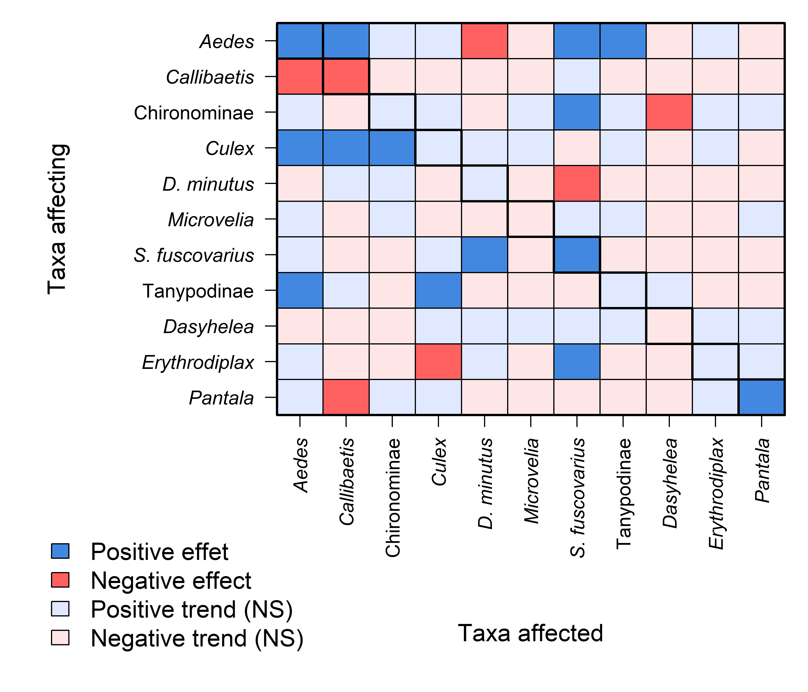

Supporting Information 9 – Individual effects of taxa on future
abundances.
================
Rodolfo Pelinson
2026-07-20

## Loading packages and functions

``` r
source(paste(sep = "/",dir,"functions/pairwise_gllvm.R"))
source(paste(sep = "/",dir,"functions/pairwise_mvabund.R"))
source(paste(sep = "/",dir,"functions/my.anova.gllvm.R"))
source(paste(sep = "/",dir,"functions/My_coefplot.R"))
source(paste(sep = "/",dir,"functions/remove_sp.R"))
source(paste(sep = "/",dir,"functions/extract_mles.R"))
source(paste(sep = "/",dir,"functions/my_ordiplot.R"))
source(paste(sep = "/",dir,"functions/get_scaled_lvs.R"))
source(paste(sep = "/",dir,"functions/text_contour.R"))
source(paste(sep = "/",dir,"functions/letters.R"))
```

``` r
library(vegan)
library(gllvm)
library(mvabund)
library(DHARMa)
library(glmmTMB)
library(vioplot)
library(yarrr)
library(colorspace)
```

``` r
sessionInfo()
```

    ## R version 4.5.2 (2025-10-31 ucrt)
    ## Platform: x86_64-w64-mingw32/x64
    ## Running under: Windows 11 x64 (build 26200)
    ## 
    ## Matrix products: default
    ##   LAPACK version 3.12.1
    ## 
    ## locale:
    ## [1] LC_COLLATE=Portuguese_Brazil.utf8  LC_CTYPE=Portuguese_Brazil.utf8   
    ## [3] LC_MONETARY=Portuguese_Brazil.utf8 LC_NUMERIC=C                      
    ## [5] LC_TIME=Portuguese_Brazil.utf8    
    ## 
    ## time zone: Europe/London
    ## tzcode source: internal
    ## 
    ## attached base packages:
    ## [1] stats     graphics  grDevices utils     datasets  methods   base     
    ## 
    ## other attached packages:
    ##  [1] colorspace_2.1-2       yarrr_0.1.14           circlize_0.4.17       
    ##  [4] BayesFactor_0.9.12-4.8 Matrix_1.7-4           coda_0.19-4.1         
    ##  [7] jpeg_0.1-11            vioplot_0.5.1          zoo_1.8-15            
    ## [10] sm_2.2-6.0             glmmTMB_1.1.14         DHARMa_0.4.7          
    ## [13] mvabund_4.2.8          gllvm_2.0.5            TMB_1.9.20            
    ## [16] vegan_2.7-3            permute_0.9-10        
    ## 
    ## loaded via a namespace (and not attached):
    ##  [1] sandwich_3.1-1      shape_1.4.6.1       stringi_1.8.7      
    ##  [4] lattice_0.22-7      magrittr_2.0.4      lme4_2.0-1         
    ##  [7] digest_0.6.39       evaluate_1.0.5      grid_4.5.2         
    ## [10] estimability_1.5.1  mvtnorm_1.3-6       fastmap_1.2.0      
    ## [13] GlobalOptions_0.1.3 mgcv_1.9-3          pbapply_1.7-4      
    ## [16] numDeriv_2016.8-1.1 reformulas_0.4.4    Rdpack_2.6.6       
    ## [19] cli_3.6.5           rlang_1.1.7         rbibutils_2.4.1    
    ## [22] splines_4.5.2       yaml_2.3.12         otel_0.2.0         
    ## [25] tools_4.5.2         parallel_4.5.2      MatrixModels_0.5-4 
    ## [28] nloptr_2.2.1        minqa_1.2.8         boot_1.3-32        
    ## [31] lifecycle_1.0.5     emmeans_2.0.2       stringr_1.6.0      
    ## [34] tweedie_3.0.17      MASS_7.3-65         cluster_2.1.8.1    
    ## [37] glue_1.8.0          Rcpp_1.1.1          statmod_1.5.1      
    ## [40] xfun_0.57           rstudioapi_0.18.0   knitr_1.51         
    ## [43] xtable_1.8-8        htmltools_0.5.9     nlme_3.1-168       
    ## [46] rmarkdown_2.31      compiler_4.5.2      alabama_2025.1.0

## Loading and preparing data

``` r
source(paste(sep = "/",dir,"ajeitando_planilhas.R"))
```

``` r
comm_all_drop_atrasado <- comm_all[Exp_design_all$treatments != "atrasado",]
Exp_design_all_drop_atrasado <- Exp_design_all[Exp_design_all$treatments != "atrasado",]

ncol(comm_all_drop_atrasado)
```

    ## [1] 26

``` r
comm_all_drop_atrasado_rm <- remove_sp(comm_all_drop_atrasado, 10)
ncol(comm_all_drop_atrasado_rm)
```

    ## [1] 11

``` r
Exp_design_all_drop_atrasado$treatments_AM <- paste(Exp_design_all_drop_atrasado$treatments, Exp_design_all_drop_atrasado$AM, sep="_")

Exp_design_all_drop_atrasado$AM_numeric <- as.numeric(Exp_design_all_drop_atrasado$AM)

Exp_design_all_drop_atrasado$treatments <- as.factor(Exp_design_all_drop_atrasado$treatments)

AM_days <- as.numeric(Exp_design_all_drop_atrasado$AM)
AM_days[AM_days == 1] <- 32
AM_days[AM_days == 2] <- 80
AM_days[AM_days == 3] <- 116
AM_days[AM_days == 4] <- 158

AM_days_sc <- scale(AM_days)

Exp_design_all_drop_atrasado$AM_days_sc <- c(AM_days_sc)
Exp_design_all_drop_atrasado$AM_days_sc_squared <- c(AM_days_sc)^2

Exp_design_all_drop_atrasado$AM_days <- c(AM_days)
Exp_design_all_drop_atrasado$AM_days_squared <- c(AM_days)^2


comm_pred <- comm_all_drop_atrasado_rm[Exp_design_all_drop_atrasado$AM != 4,]
comm_resp <- comm_all_drop_atrasado_rm[Exp_design_all_drop_atrasado$AM != 1,]
```

``` r
comm_pred_st <- decostand(comm_pred, method = "stand")

colnames(comm_pred_st) <- gsub(" ", "_", colnames(comm_pred_st))


comm_resp_mv <- mvabund(comm_resp)
predictors <- Exp_design_all_drop_atrasado[Exp_design_all_drop_atrasado$AM != "1",]

formula_quad <- as.formula(paste("comm_resp_mv ~ block2 + AM_days_sc + AM_days_sc_squared +", paste(colnames(comm_pred_st), collapse = " + ") ) )
mod_quad <- manyglm(formula = formula_quad, family="negative.binomial",  data = data.frame(predictors, comm_pred_st), composition = FALSE)

formula_linear <- as.formula(paste("comm_resp_mv ~ block2 + AM_days_sc +", paste(colnames(comm_pred_st), collapse = " + ") ) )
mod_linear <- manyglm(formula = formula_linear, family="negative.binomial",  data = data.frame(predictors, comm_pred_st), composition = FALSE)

anova_quad <- anova(mod_linear, mod_quad, show.time = "all", cor.type = "I", test = "LR", resamp = "pit.trap")
```

    ## Resampling begins for test 1.
    ##  Resampling run 0 finished. Time elapsed: 0.00 minutes...
    ##  Resampling run 100 finished. Time elapsed: 0.13 minutes...
    ##  Resampling run 200 finished. Time elapsed: 0.30 minutes...
    ##  Resampling run 300 finished. Time elapsed: 0.49 minutes...
    ##  Resampling run 400 finished. Time elapsed: 0.68 minutes...
    ##  Resampling run 500 finished. Time elapsed: 0.88 minutes...
    ##  Resampling run 600 finished. Time elapsed: 1.07 minutes...
    ##  Resampling run 700 finished. Time elapsed: 1.19 minutes...
    ##  Resampling run 800 finished. Time elapsed: 1.29 minutes...
    ##  Resampling run 900 finished. Time elapsed: 1.42 minutes...
    ## Time elapsed: 0 hr 1 min 31 sec

``` r
anova_quad
```

    ## Analysis of Deviance Table
    ## 
    ## mod_linear: comm_resp_mv ~ block2 + AM_days_sc + Aedes + Callibaetis + Chironominae + Culex + Dendropsophus_minutus + Microvelia + Scinax_fuscovarius + Tanypodinae + Dasyhelea + Erythrodiplax + Pantala
    ## mod_quad: comm_resp_mv ~ block2 + AM_days_sc + AM_days_sc_squared + Aedes + Callibaetis + Chironominae + Culex + Dendropsophus_minutus + Microvelia + Scinax_fuscovarius + Tanypodinae + Dasyhelea + Erythrodiplax + Pantala
    ## 
    ## Multivariate test:
    ##            Res.Df Df.diff   Dev Pr(>Dev)
    ## mod_linear     57                       
    ## mod_quad       56       1 22.73    0.225
    ## Arguments:
    ##  Test statistics calculated assuming uncorrelated response (for faster computation) 
    ##  P-value calculated using 999 iterations via PIT-trap resampling.

``` r
###################################################

formula_block <- as.formula(paste("comm_resp_mv ~ block2 + AM_days_sc +", paste(colnames(comm_pred_st), collapse = " + ") ) )
mod_block <- manyglm(formula = formula_block, family="negative.binomial",  data = data.frame(predictors, comm_pred_st), composition = FALSE)

formula_no_block <- as.formula(paste("comm_resp_mv ~ AM_days_sc +", paste(colnames(comm_pred_st), collapse = " + ") ) )
mod_no_block <- manyglm(formula = formula_no_block, family="negative.binomial",  data = data.frame(predictors, comm_pred_st), composition = FALSE)

anova_block <- anova(mod_no_block, mod_block, show.time = "all", cor.type = "I", test = "LR", resamp = "pit.trap")
```

    ## Resampling begins for test 1.
    ##  Resampling run 0 finished. Time elapsed: 0.00 minutes...
    ##  Resampling run 100 finished. Time elapsed: 0.12 minutes...
    ##  Resampling run 200 finished. Time elapsed: 0.34 minutes...
    ##  Resampling run 300 finished. Time elapsed: 0.54 minutes...
    ##  Resampling run 400 finished. Time elapsed: 0.71 minutes...
    ##  Resampling run 500 finished. Time elapsed: 0.90 minutes...
    ##  Resampling run 600 finished. Time elapsed: 1.11 minutes...
    ##  Resampling run 700 finished. Time elapsed: 1.32 minutes...
    ##  Resampling run 800 finished. Time elapsed: 1.54 minutes...
    ##  Resampling run 900 finished. Time elapsed: 1.73 minutes...
    ## Time elapsed: 0 hr 1 min 52 sec

``` r
anova_block
```

    ## Analysis of Deviance Table
    ## 
    ## mod_no_block: comm_resp_mv ~ AM_days_sc + Aedes + Callibaetis + Chironominae + Culex + Dendropsophus_minutus + Microvelia + Scinax_fuscovarius + Tanypodinae + Dasyhelea + Erythrodiplax + Pantala
    ## mod_block: comm_resp_mv ~ block2 + AM_days_sc + Aedes + Callibaetis + Chironominae + Culex + Dendropsophus_minutus + Microvelia + Scinax_fuscovarius + Tanypodinae + Dasyhelea + Erythrodiplax + Pantala
    ## 
    ## Multivariate test:
    ##              Res.Df Df.diff   Dev Pr(>Dev)
    ## mod_no_block     59                       
    ## mod_block        57       2 38.48    0.314
    ## Arguments:
    ##  Test statistics calculated assuming uncorrelated response (for faster computation) 
    ##  P-value calculated using 999 iterations via PIT-trap resampling.

``` r
###################################################

formula_time <- as.formula(paste("comm_resp_mv ~ block2 + AM_days_sc +", paste(colnames(comm_pred_st), collapse = " + ") ) )
mod_time <- manyglm(formula = formula_time, family="negative.binomial",  data = data.frame(predictors, comm_pred_st), composition = FALSE)

formula_no_time <- as.formula(paste("comm_resp_mv ~ block2 +", paste(colnames(comm_pred_st), collapse = " + ") ) )
mod_no_time <- manyglm(formula = formula_no_time, family="negative.binomial",  data = data.frame(predictors, comm_pred_st), composition = FALSE)

anova_time <- anova(mod_no_time, mod_time, show.time = "all", cor.type = "I", test = "LR", resamp = "pit.trap")
```

    ## Resampling begins for test 1.
    ##  Resampling run 0 finished. Time elapsed: 0.00 minutes...
    ##  Resampling run 100 finished. Time elapsed: 0.15 minutes...
    ##  Resampling run 200 finished. Time elapsed: 0.32 minutes...
    ##  Resampling run 300 finished. Time elapsed: 0.48 minutes...
    ##  Resampling run 400 finished. Time elapsed: 0.65 minutes...
    ##  Resampling run 500 finished. Time elapsed: 0.80 minutes...
    ##  Resampling run 600 finished. Time elapsed: 0.96 minutes...
    ##  Resampling run 700 finished. Time elapsed: 1.13 minutes...
    ##  Resampling run 800 finished. Time elapsed: 1.29 minutes...
    ##  Resampling run 900 finished. Time elapsed: 1.46 minutes...
    ## Time elapsed: 0 hr 1 min 37 sec

``` r
anova_time
```

    ## Analysis of Deviance Table
    ## 
    ## mod_no_time: comm_resp_mv ~ block2 + Aedes + Callibaetis + Chironominae + Culex + Dendropsophus_minutus + Microvelia + Scinax_fuscovarius + Tanypodinae + Dasyhelea + Erythrodiplax + Pantala
    ## mod_time: comm_resp_mv ~ block2 + AM_days_sc + Aedes + Callibaetis + Chironominae + Culex + Dendropsophus_minutus + Microvelia + Scinax_fuscovarius + Tanypodinae + Dasyhelea + Erythrodiplax + Pantala
    ## 
    ## Multivariate test:
    ##             Res.Df Df.diff   Dev Pr(>Dev)
    ## mod_no_time     58                       
    ## mod_time        57       1 24.44    0.177
    ## Arguments:
    ##  Test statistics calculated assuming uncorrelated response (for faster computation) 
    ##  P-value calculated using 999 iterations via PIT-trap resampling.

``` r
###################################################

formula_prior <- as.formula(paste("comm_resp_mv ~ block2 + AM_days_sc +", paste(colnames(comm_pred_st), collapse = " + ") ) )
mod_prior <- manyglm(formula = formula_prior, family="negative.binomial",  data = data.frame(predictors, comm_pred_st), composition = FALSE)

formula_no_prior <- as.formula(paste("comm_resp_mv ~ block2") )
mod_no_prior <- manyglm(formula = formula_no_prior, family="negative.binomial",  data = data.frame(predictors, comm_pred_st), composition = FALSE)

anova_prior <- anova(mod_no_prior, mod_prior, show.prior = "all", cor.type = "I", test = "LR", resamp = "pit.trap")
```

    ## Warning in anova.manyglm(mod_no_prior, mod_prior, show.prior = "all", cor.type
    ## = "I", : show.prior is not a manyglm object nor a valid argument- removed from
    ## input, default value is used instead.

    ## Time elapsed: 0 hr 1 min 9 sec

``` r
anova_prior
```

    ## Analysis of Deviance Table
    ## 
    ## mod_no_prior: comm_resp_mv ~ block2
    ## mod_prior: comm_resp_mv ~ block2 + AM_days_sc + Aedes + Callibaetis + Chironominae + Culex + Dendropsophus_minutus + Microvelia + Scinax_fuscovarius + Tanypodinae + Dasyhelea + Erythrodiplax + Pantala
    ## 
    ## Multivariate test:
    ##              Res.Df Df.diff   Dev Pr(>Dev)    
    ## mod_no_prior     69                           
    ## mod_prior        57      12 348.5    0.001 ***
    ## ---
    ## Signif. codes:  0 '***' 0.001 '**' 0.01 '*' 0.05 '.' 0.1 ' ' 1
    ## Arguments:
    ##  Test statistics calculated assuming uncorrelated response (for faster computation) 
    ##  P-value calculated using 999 iterations via PIT-trap resampling.

``` r
mod_prior$coefficients
```

    ##                            Aedes Callibaetis Chironominae        Culex
    ## (Intercept)           -0.3722632  -6.3276145   1.85859156  1.648520812
    ## block2CD              -1.7845769  -2.9609579   0.65840763 -1.038852681
    ## block2EF              -1.5904926  -1.0173278   0.12004141 -0.594362194
    ## AM_days_sc             0.5091365   2.3625779   1.24148814  0.299951358
    ## Aedes                  1.8212490   1.2135103   0.04721392  0.416970443
    ## Callibaetis           -0.5957500  -1.6639086  -0.23469302 -0.300354069
    ## Chironominae           0.2891190  -0.1356018   0.29138450  0.070750038
    ## Culex                  1.7146118   2.0171538   0.51851280  0.006855218
    ## Dendropsophus_minutus -1.4113911   0.4246509   0.08730213 -0.809137299
    ## Microvelia             0.4365556  -3.8908131   0.08564109 -0.046916032
    ## Scinax_fuscovarius     0.4380426  -4.6500405  -0.08649278  0.421396966
    ## Tanypodinae            0.8553440   0.9781031  -0.27667078  0.633748100
    ## Dasyhelea             -0.7179914  -1.1813582  -0.34031482  0.151722319
    ## Erythrodiplax          0.1447691  -8.3408898  -0.02784874 -0.717508678
    ## Pantala                0.2169271  -3.0067841   0.17894786  0.421173054
    ##                       Dendropsophus.minutus   Microvelia Scinax.fuscovarius
    ## (Intercept)                     -1.88473225 -33.60020082         -0.1161103
    ## block2CD                         2.88692114   1.25322938          0.6678153
    ## block2EF                         2.39893396   0.70610398          1.3821741
    ## AM_days_sc                      -0.21493206   0.22273630         -0.7812927
    ## Aedes                           -0.96550552 -18.05051242          0.6576445
    ## Callibaetis                     -0.27365782  -3.14274541          0.0492836
    ## Chironominae                    -0.11897916   0.18889837          0.6624091
    ## Culex                            0.45558480   0.04531269         -0.4837258
    ## Dendropsophus_minutus            0.07240650  -6.01955125         -1.0657918
    ## Microvelia                      -0.02274929  -1.67185032          0.1557280
    ## Scinax_fuscovarius               0.46378943 -44.83773220          1.6413830
    ## Tanypodinae                     -0.28097941  -0.94336570         -0.2697675
    ## Dasyhelea                        0.35014003   1.54030185          0.2544205
    ## Erythrodiplax                    0.01664461  -4.41190735          0.9379109
    ## Pantala                         -0.28188943  -0.60995805         -0.3578474
    ##                        Tanypodinae   Dasyhelea Erythrodiplax     Pantala
    ## (Intercept)            2.107249778 -1.04728081   -2.29144408 -0.12989262
    ## block2CD              -0.398492481  0.05040781   -0.06541991  0.03058051
    ## block2EF              -0.252786618 -1.68301913    0.43836675 -0.21505672
    ## AM_days_sc            -0.228636511  1.68341593   -0.10590548 -0.42466394
    ## Aedes                  0.351675570 -0.07934723    0.23791081 -0.09966319
    ## Callibaetis           -0.030032375 -0.14620924   -1.33674110 -0.22992850
    ## Chironominae           0.096042724 -0.92841326    0.14024333  0.24816597
    ## Culex                  0.200421398 -0.20787286    0.42525475 -0.08413172
    ## Dendropsophus_minutus -0.004021503 -0.85024845   -0.11258128 -0.84683881
    ## Microvelia             0.046303916 -0.18104108   -3.84962155  0.01435882
    ## Scinax_fuscovarius    -0.003286125 -0.26543294   -0.04959483 -0.02687403
    ## Tanypodinae            0.265285006  0.20005848   -1.00711336 -0.32084453
    ## Dasyhelea              0.062468845 -0.06671626    0.11543123  0.09024708
    ## Erythrodiplax         -0.121766972 -0.04396717    0.19448583  0.09732254
    ## Pantala               -0.003163228 -0.12318108    0.15111153  0.44781914

``` r
#Lines are the predictors

coefs <- mod_prior$coefficients[-c(1:4),]
se <- mod_prior$stderr.coefficients[-c(1:4),]
CI_lower <-  coefs + se * qnorm(0.025) 
CI_upper <-  coefs + se * qnorm(0.975) 


coefs_sig <- coefs

coefs_sig[(CI_upper < 0 & CI_lower < 0)] <- -1
coefs_sig[(CI_upper > 0 & CI_lower > 0)] <- 1
coefs_sig[(CI_upper > 0 & CI_lower < 0) & coefs > 0] <- 0.5
coefs_sig[(CI_upper > 0 & CI_lower < 0) & coefs < 0] <- -0.5


library(yarrr)

sig_coefs_col <- coefs_sig
sig_coefs_col[coefs_sig == -0.5] <- lighten("firebrick1", amount = 0.85)
sig_coefs_col[coefs_sig == -1] <- lighten("firebrick1", amount = 0.15)
sig_coefs_col[coefs_sig == 0.5] <- lighten("dodgerblue3", amount = 0.85)
sig_coefs_col[coefs_sig == 1] <- lighten("dodgerblue3", amount = 0.15)

#diag_col <- matrix(NA, nrow = nrow(sig_coefs_col), ncol = ncol(sig_coefs_col))
#colnames(diag_col) <- colnames(sig_coefs_col)
#rownames(diag_col) <- rownames(sig_coefs_col)
#for(i in 1:nrow(diag_col)){diag_col[i,i] <- 1}


cores_unicas <- unique(as.vector(sig_coefs_col))

matriz_numerica <- matrix(
  match(sig_coefs_col, cores_unicas), 
  nrow = nrow(sig_coefs_col), 
  ncol = ncol(sig_coefs_col)
)

colnames(matriz_numerica) <- colnames(sig_coefs_col)
rownames(matriz_numerica) <- rownames(sig_coefs_col)


sp_names <- colnames(matriz_numerica)
sp_names <- gsub("\\.", " ", sp_names)

sp_names[sp_names == "Dendropsophus minutus"] <- "D. minutus"
sp_names[sp_names == "Scinax fuscovarius"] <- "S. fuscovarius"

sp_names[sp_names == "Dendropsophus_minutus"] <- "D. minutus"
sp_names[sp_names == "Scinax_fuscovarius"] <- "S. fuscovarius"

sp_font <- rep(3, length(sp_names))
sp_font[sp_names == "Chironominae"] <- 1
sp_font[sp_names == "Tanypodinae"] <- 1
```

``` r
par(mar = c(12,12,1,1))
image(y = 1:nrow(sig_coefs_col), x = 1:ncol(sig_coefs_col), z = t(matriz_numerica)[, ncol(matriz_numerica):1], col = cores_unicas, xaxt = "n", yaxt = "n", xlab = "", ylab = "")
#par(new = TRUE)
#image(y = 1:nrow(diag_col), x = 1:ncol(diag_col), z = t(diag_col)[, ncol(diag_col):1], col = transparent("grey50", 0), xaxt = "n", yaxt = "n", xlab = "", ylab = "")
box(type = "o", lwd = 2)
```

    ## Warning in box(type = "o", lwd = 2): parâmetro gráfico "type" é obsoleto

``` r
for(i in 1:nrow(sig_coefs_col)){
  axis(1, at = (1:ncol(sig_coefs_col))[i], labels = sp_names[i], las = 2, cex.axis = 1, font = sp_font[i])
}

for(i in 1:ncol(sig_coefs_col)){
  axis(2, at = (nrow(sig_coefs_col):1)[i], labels = sp_names[i], las = 2, cex.axis = 1, font = sp_font[i])
}

title(xlab = "Taxa affected", line = 9, cex.lab = 1.25)
title(ylab = "Taxa affecting", line = 9, cex.lab = 1.25)

for(i in 1:(nrow(sig_coefs_col)-1)){
  abline(v = i +0.5)
  abline(h = i +0.5)
}

for(i in nrow(sig_coefs_col):1){
  rect(xleft = nrow(sig_coefs_col) - (i-0.5),
     xright =  nrow(sig_coefs_col) - (i-1.5),
     ytop = (i+0.5),
     ybottom = (i-0.5), lwd = 2)
}

par(new = TRUE, mar = c(0,0,0,0), bty = "n")
plot(NA, xlab = "", ylab = "", xlim = c(0,100), ylim = c(0,100), xaxt = "n", yaxt = "n")

legend(x = 0, y = 0, xjust = 0, yjust = 0, fill = cores_unicas, legend = c("Positive effet", "Negative effect", "Positive trend (NS)", "Negative trend (NS)" ), bty = "n", cex = 1.25)
```

<!-- -->
