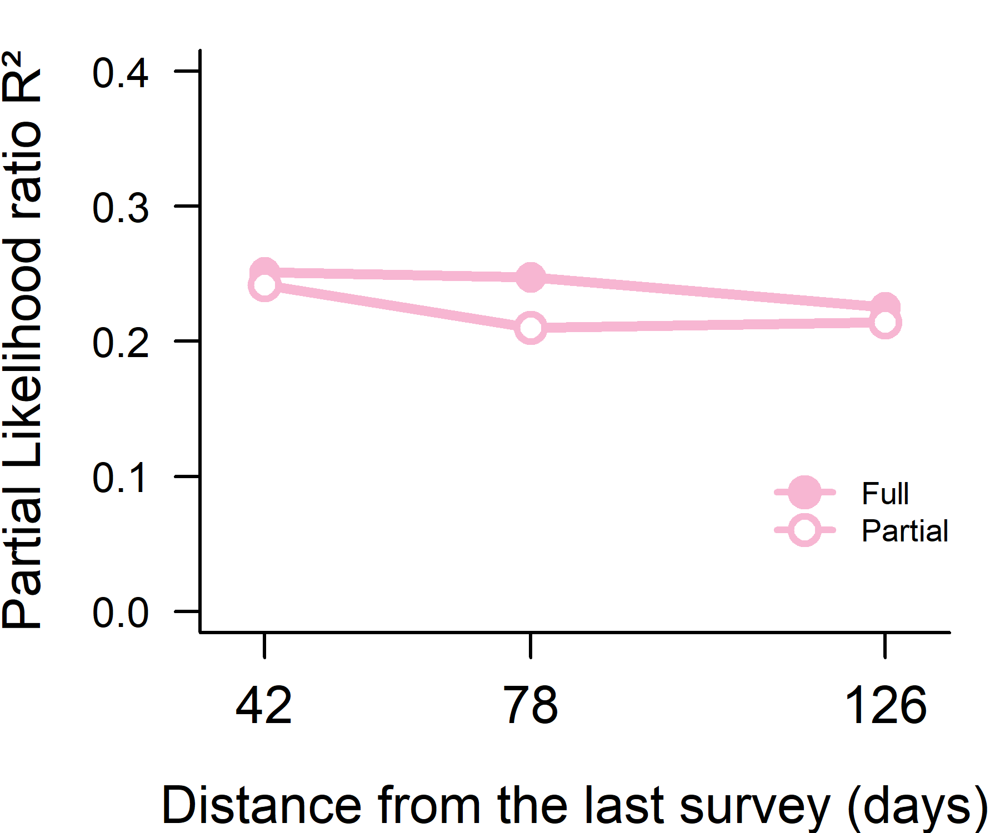

Variation partitioning predicting the last survey
================
Rodolfo Pelinson
2026-03-31

``` r
source(paste(sep = "/",dir,"functions/remove_sp.R"))
source(paste(sep = "/",dir,"functions/varpart_manyglm.R"))
source(paste(sep = "/",dir,"functions/R2_manyglm.R"))
```

``` r
library(vegan)
library(gllvm)
library(mvabund)
```

``` r
source(paste(sep = "/",dir,"ajeitando_planilhas.R"))
```

Organizing the predictor community states and the response (the last
survey.)

``` r
comm_AM1 <- remove_sp(communities_AM1, 3)
comm_AM2 <- remove_sp(communities_AM2, 3)
comm_AM3 <- remove_sp(communities_AM3, 3)
comm_AM4 <- remove_sp(communities_AM4, 3)

comm_AM1_drop_atrasado <- comm_AM1[Exp_design$treatments != "atrasado",]
comm_AM2_drop_atrasado <- comm_AM2[Exp_design$treatments != "atrasado",]
comm_AM3_drop_atrasado <- comm_AM3[Exp_design$treatments != "atrasado",]
comm_AM4_drop_atrasado <- comm_AM4[Exp_design$treatments != "atrasado",]

Exp_design_drop_atrasado <- Exp_design[Exp_design$treatments != "atrasado",]

Env_AM4_drop_atrasado <- Env[Env$Tratamento != "atrasado" & Env$amostragem == "4",]
Env_AM4_drop_atrasado <- Env_AM4_drop_atrasado[match(Exp_design_drop_atrasado$sites, Env_AM4_drop_atrasado$id),]

colnames(comm_AM1_drop_atrasado) <- gsub(" ", "_", colnames(comm_AM1_drop_atrasado))
colnames(comm_AM2_drop_atrasado) <- gsub(" ", "_", colnames(comm_AM2_drop_atrasado))
colnames(comm_AM3_drop_atrasado) <- gsub(" ", "_", colnames(comm_AM3_drop_atrasado))
colnames(comm_AM4_drop_atrasado) <- gsub(" ", "_", colnames(comm_AM4_drop_atrasado))

block <- data.frame(block2 = Exp_design_drop_atrasado$block2)
comm_AM1_pred <- decostand(comm_AM1_drop_atrasado, method = "total", MARGIN = 2)
comm_AM2_pred <- decostand(comm_AM2_drop_atrasado, method = "total", MARGIN = 2)
comm_AM3_pred <- decostand(comm_AM3_drop_atrasado, method = "total", MARGIN = 2)

comm_AM1_pred_st <- decostand(comm_AM1_drop_atrasado, method = "stand")
comm_AM2_pred_st <- decostand(comm_AM2_drop_atrasado, method = "stand")
comm_AM3_pred_st <- decostand(comm_AM3_drop_atrasado, method = "stand")

set.seed(1); nmds_prior_AM1 <- metaMDS(comm_AM1_pred, distance  = "bray", k = 3)
```

    ## Run 0 stress 0.1375544 
    ## Run 1 stress 0.1460964 
    ## Run 2 stress 0.1392179 
    ## Run 3 stress 0.1375544 
    ## ... Procrustes: rmse 5.978138e-05  max resid 0.0001325152 
    ## ... Similar to previous best
    ## Run 4 stress 0.1375545 
    ## ... Procrustes: rmse 0.0004922836  max resid 0.001035383 
    ## ... Similar to previous best
    ## Run 5 stress 0.1375544 
    ## ... Procrustes: rmse 3.461837e-05  max resid 7.227206e-05 
    ## ... Similar to previous best
    ## Run 6 stress 0.1460958 
    ## Run 7 stress 0.1460959 
    ## Run 8 stress 0.1392186 
    ## Run 9 stress 0.1375546 
    ## ... Procrustes: rmse 0.0002269276  max resid 0.0004761832 
    ## ... Similar to previous best
    ## Run 10 stress 0.1392178 
    ## Run 11 stress 0.1460997 
    ## Run 12 stress 0.1375544 
    ## ... Procrustes: rmse 4.362358e-05  max resid 9.347126e-05 
    ## ... Similar to previous best
    ## Run 13 stress 0.1392187 
    ## Run 14 stress 0.1392177 
    ## Run 15 stress 0.1377387 
    ## ... Procrustes: rmse 0.01463444  max resid 0.0472602 
    ## Run 16 stress 0.1460962 
    ## Run 17 stress 0.1460962 
    ## Run 18 stress 0.1375547 
    ## ... Procrustes: rmse 0.0006351723  max resid 0.001318278 
    ## ... Similar to previous best
    ## Run 19 stress 0.1375545 
    ## ... Procrustes: rmse 0.0001352243  max resid 0.0002899061 
    ## ... Similar to previous best
    ## Run 20 stress 0.1392185 
    ## *** Best solution repeated 7 times

``` r
comm_nmds_AM1 <- data.frame(nmds_prior_AM1$points)
comm_AM1_pred_nmds <- decostand(comm_nmds_AM1, method = "stand")

set.seed(1); nmds_prior_AM2 <- metaMDS(comm_AM2_pred, distance  = "bray", k = 3)
```

    ## Run 0 stress 0.134689 
    ## Run 1 stress 0.1562537 
    ## Run 2 stress 0.1346889 
    ## ... New best solution
    ## ... Procrustes: rmse 0.00042609  max resid 0.0009291392 
    ## ... Similar to previous best
    ## Run 3 stress 0.1346891 
    ## ... Procrustes: rmse 0.000542743  max resid 0.001107337 
    ## ... Similar to previous best
    ## Run 4 stress 0.1349081 
    ## ... Procrustes: rmse 0.006468483  max resid 0.01979279 
    ## Run 5 stress 0.1349833 
    ## ... Procrustes: rmse 0.0112312  max resid 0.04025002 
    ## Run 6 stress 0.1621398 
    ## Run 7 stress 0.1346888 
    ## ... New best solution
    ## ... Procrustes: rmse 0.000254259  max resid 0.0005942801 
    ## ... Similar to previous best
    ## Run 8 stress 0.1346888 
    ## ... New best solution
    ## ... Procrustes: rmse 6.214716e-05  max resid 0.0001665271 
    ## ... Similar to previous best
    ## Run 9 stress 0.1346888 
    ## ... Procrustes: rmse 8.12875e-05  max resid 0.0001655136 
    ## ... Similar to previous best
    ## Run 10 stress 0.1347098 
    ## ... Procrustes: rmse 0.002793126  max resid 0.006928169 
    ## ... Similar to previous best
    ## Run 11 stress 0.134689 
    ## ... Procrustes: rmse 0.0002731196  max resid 0.0005678591 
    ## ... Similar to previous best
    ## Run 12 stress 0.1346889 
    ## ... Procrustes: rmse 0.0002230868  max resid 0.0004565452 
    ## ... Similar to previous best
    ## Run 13 stress 0.134689 
    ## ... Procrustes: rmse 0.0002502332  max resid 0.0005188621 
    ## ... Similar to previous best
    ## Run 14 stress 0.1346889 
    ## ... Procrustes: rmse 9.036694e-05  max resid 0.000184593 
    ## ... Similar to previous best
    ## Run 15 stress 0.1562537 
    ## Run 16 stress 0.1346888 
    ## ... New best solution
    ## ... Procrustes: rmse 1.64291e-05  max resid 4.175196e-05 
    ## ... Similar to previous best
    ## Run 17 stress 0.1346891 
    ## ... Procrustes: rmse 0.0003177436  max resid 0.0007289487 
    ## ... Similar to previous best
    ## Run 18 stress 0.1346892 
    ## ... Procrustes: rmse 0.0003965468  max resid 0.0009275016 
    ## ... Similar to previous best
    ## Run 19 stress 0.1621401 
    ## Run 20 stress 0.1514556 
    ## *** Best solution repeated 3 times

``` r
comm_nmds_AM2 <- data.frame(nmds_prior_AM2$points)
comm_AM2_pred_nmds <- decostand(comm_nmds_AM2, method = "stand")

set.seed(1); nmds_prior_AM3 <- metaMDS(comm_AM3_pred, distance  = "bray", k = 3)
```

    ## Run 0 stress 0.1316702 
    ## Run 1 stress 0.1316701 
    ## ... New best solution
    ## ... Procrustes: rmse 0.0001330112  max resid 0.0003837239 
    ## ... Similar to previous best
    ## Run 2 stress 0.1577175 
    ## Run 3 stress 0.1400481 
    ## Run 4 stress 0.1551219 
    ## Run 5 stress 0.1336391 
    ## Run 6 stress 0.140048 
    ## Run 7 stress 0.1316703 
    ## ... Procrustes: rmse 0.0002061381  max resid 0.0006026141 
    ## ... Similar to previous best
    ## Run 8 stress 0.1348783 
    ## Run 9 stress 0.1400482 
    ## Run 10 stress 0.1400484 
    ## Run 11 stress 0.1336389 
    ## Run 12 stress 0.133639 
    ## Run 13 stress 0.1400512 
    ## Run 14 stress 0.1336391 
    ## Run 15 stress 0.1348777 
    ## Run 16 stress 0.1348775 
    ## Run 17 stress 0.1470034 
    ## Run 18 stress 0.1336389 
    ## Run 19 stress 0.138397 
    ## Run 20 stress 0.1336392 
    ## *** Best solution repeated 2 times

``` r
comm_nmds_AM3 <- data.frame(nmds_prior_AM3$points)
comm_AM3_pred_nmds <- decostand(comm_nmds_AM3, method = "stand")

Env_st_AM4 <- decostand(Env_AM4_drop_atrasado[,c(6:7,9:11)], method = "stand")
pca_env_AM4 <- rda(Env_st_AM4)
Env_st_AM4_pca <- data.frame(pca_env_AM4$CA$u[,1:3])
Env_st_AM4_pca <- decostand(Env_st_AM4_pca, method = "stand")

preds_AM1_reduced <- list(Block = block, Env = Env_st_AM4_pca, Prior = comm_AM1_pred_nmds)
preds_AM2_reduced <- list(Block = block, Env = Env_st_AM4_pca, Prior = comm_AM2_pred_nmds)
preds_AM3_reduced <- list(Block = block, Env = Env_st_AM4_pca, Prior = comm_AM3_pred_nmds)

preds_AM1 <- list(Block = block, Env = Env_st_AM4, Prior = comm_AM1_pred_st)
preds_AM2 <- list(Block = block, Env = Env_st_AM4, Prior = comm_AM2_pred_st)
preds_AM3 <- list(Block = block, Env = Env_st_AM4, Prior = comm_AM3_pred_st)

lapply(preds_AM1_reduced, nrow)
```

    ## $Block
    ## [1] 24
    ## 
    ## $Env
    ## [1] 24
    ## 
    ## $Prior
    ## [1] 24

Variation partitioning using the first survey as a predictor.

``` r
varpart_priority_AM1_reduced <- varpart_manyglm(comm_AM4_drop_atrasado, pred = preds_AM1_reduced, DF_adj_r2 = FALSE)
varpart_priority_AM1_reduced$R2_fractions_com
```

    ##       R2_full_fraction R2_pure_fraction
    ## Block        0.1199140        0.1197001
    ## Env          0.1723323        0.1767555
    ## Prior        0.2253235        0.2141801

``` r
anova_priority_AM1_reduced <- anova(varpart_priority_AM1_reduced$models$`Block-Env`, varpart_priority_AM1_reduced$models$`Block-Env-Prior`, show.time = "none", resamp = "pit.trap")
anova_priority_AM1_reduced
```

    ## Analysis of Deviance Table
    ## 
    ## varpart_priority_AM1_reduced$models$`Block-Env`: resp_mv ~ block2 + PC1 + PC2 + PC3
    ## varpart_priority_AM1_reduced$models$`Block-Env-Prior`: resp_mv ~ block2 + PC1 + PC2 + PC3 + MDS1 + MDS2 + MDS3
    ## 
    ## Multivariate test:
    ##                                                       Res.Df Df.diff   Dev
    ## varpart_priority_AM1_reduced$models$`Block-Env`           18              
    ## varpart_priority_AM1_reduced$models$`Block-Env-Prior`     15       3 106.5
    ##                                                       Pr(>Dev)  
    ## varpart_priority_AM1_reduced$models$`Block-Env`                 
    ## varpart_priority_AM1_reduced$models$`Block-Env-Prior`    0.033 *
    ## ---
    ## Signif. codes:  0 '***' 0.001 '**' 0.01 '*' 0.05 '.' 0.1 ' ' 1
    ## Arguments:
    ##  Test statistics calculated assuming uncorrelated response (for faster computation) 
    ##  P-value calculated using 999 iterations via PIT-trap resampling.

``` r
anova_env_AM1_reduced <- anova(varpart_priority_AM1_reduced$models$`Block-Prior`, varpart_priority_AM1_reduced$models$`Block-Env-Prior`, show.time = "none", resamp = "pit.trap")
anova_env_AM1_reduced
```

    ## Analysis of Deviance Table
    ## 
    ## varpart_priority_AM1_reduced$models$`Block-Prior`: resp_mv ~ block2 + MDS1 + MDS2 + MDS3
    ## varpart_priority_AM1_reduced$models$`Block-Env-Prior`: resp_mv ~ block2 + PC1 + PC2 + PC3 + MDS1 + MDS2 + MDS3
    ## 
    ## Multivariate test:
    ##                                                       Res.Df Df.diff   Dev
    ## varpart_priority_AM1_reduced$models$`Block-Prior`         18              
    ## varpart_priority_AM1_reduced$models$`Block-Env-Prior`     15       3 87.81
    ##                                                       Pr(>Dev)  
    ## varpart_priority_AM1_reduced$models$`Block-Prior`               
    ## varpart_priority_AM1_reduced$models$`Block-Env-Prior`    0.061 .
    ## ---
    ## Signif. codes:  0 '***' 0.001 '**' 0.01 '*' 0.05 '.' 0.1 ' ' 1
    ## Arguments:
    ##  Test statistics calculated assuming uncorrelated response (for faster computation) 
    ##  P-value calculated using 999 iterations via PIT-trap resampling.

``` r
anova_block_AM1_reduced <- anova(varpart_priority_AM1_reduced$models$`Env-Prior`, varpart_priority_AM1_reduced$models$`Block-Env-Prior`, show.time = "none", resamp = "pit.trap")
anova_block_AM1_reduced
```

    ## Analysis of Deviance Table
    ## 
    ## varpart_priority_AM1_reduced$models$`Env-Prior`: resp_mv ~ PC1 + PC2 + PC3 + MDS1 + MDS2 + MDS3
    ## varpart_priority_AM1_reduced$models$`Block-Env-Prior`: resp_mv ~ block2 + PC1 + PC2 + PC3 + MDS1 + MDS2 + MDS3
    ## 
    ## Multivariate test:
    ##                                                       Res.Df Df.diff   Dev
    ## varpart_priority_AM1_reduced$models$`Env-Prior`           17              
    ## varpart_priority_AM1_reduced$models$`Block-Env-Prior`     15       2 67.79
    ##                                                       Pr(>Dev)  
    ## varpart_priority_AM1_reduced$models$`Env-Prior`                 
    ## varpart_priority_AM1_reduced$models$`Block-Env-Prior`    0.043 *
    ## ---
    ## Signif. codes:  0 '***' 0.001 '**' 0.01 '*' 0.05 '.' 0.1 ' ' 1
    ## Arguments:
    ##  Test statistics calculated assuming uncorrelated response (for faster computation) 
    ##  P-value calculated using 999 iterations via PIT-trap resampling.

Variation partitioning using the second survey as a predictor.

``` r
varpart_priority_AM2_reduced <- varpart_manyglm(comm_AM4_drop_atrasado, pred = preds_AM2_reduced, DF_adj_r2 = FALSE)
varpart_priority_AM2_reduced$R2_fractions_com
```

    ##       R2_full_fraction R2_pure_fraction
    ## Block        0.1199140        0.1236977
    ## Env          0.1723323        0.1923547
    ## Prior        0.2475859        0.2102043

``` r
anova_priority_AM2_reduced <- anova(varpart_priority_AM2_reduced$models$`Block-Env`, varpart_priority_AM2_reduced$models$`Block-Env-Prior`, show.time = "none", resamp = "pit.trap")
anova_priority_AM2_reduced
```

    ## Analysis of Deviance Table
    ## 
    ## varpart_priority_AM2_reduced$models$`Block-Env`: resp_mv ~ block2 + PC1 + PC2 + PC3
    ## varpart_priority_AM2_reduced$models$`Block-Env-Prior`: resp_mv ~ block2 + PC1 + PC2 + PC3 + MDS1 + MDS2 + MDS3
    ## 
    ## Multivariate test:
    ##                                                       Res.Df Df.diff   Dev
    ## varpart_priority_AM2_reduced$models$`Block-Env`           18              
    ## varpart_priority_AM2_reduced$models$`Block-Env-Prior`     15       3 109.2
    ##                                                       Pr(>Dev)  
    ## varpart_priority_AM2_reduced$models$`Block-Env`                 
    ## varpart_priority_AM2_reduced$models$`Block-Env-Prior`    0.027 *
    ## ---
    ## Signif. codes:  0 '***' 0.001 '**' 0.01 '*' 0.05 '.' 0.1 ' ' 1
    ## Arguments:
    ##  Test statistics calculated assuming uncorrelated response (for faster computation) 
    ##  P-value calculated using 999 iterations via PIT-trap resampling.

``` r
anova_env_AM2_reduced <- anova(varpart_priority_AM2_reduced$models$`Block-Prior`, varpart_priority_AM2_reduced$models$`Block-Env-Prior`, show.time = "none", resamp = "pit.trap")
anova_env_AM2_reduced
```

    ## Analysis of Deviance Table
    ## 
    ## varpart_priority_AM2_reduced$models$`Block-Prior`: resp_mv ~ block2 + MDS1 + MDS2 + MDS3
    ## varpart_priority_AM2_reduced$models$`Block-Env-Prior`: resp_mv ~ block2 + PC1 + PC2 + PC3 + MDS1 + MDS2 + MDS3
    ## 
    ## Multivariate test:
    ##                                                       Res.Df Df.diff   Dev
    ## varpart_priority_AM2_reduced$models$`Block-Prior`         18              
    ## varpart_priority_AM2_reduced$models$`Block-Env-Prior`     15       3 98.26
    ##                                                       Pr(>Dev)
    ## varpart_priority_AM2_reduced$models$`Block-Prior`             
    ## varpart_priority_AM2_reduced$models$`Block-Env-Prior`    0.162
    ## Arguments:
    ##  Test statistics calculated assuming uncorrelated response (for faster computation) 
    ##  P-value calculated using 999 iterations via PIT-trap resampling.

``` r
anova_block_AM2_reduced <- anova(varpart_priority_AM2_reduced$models$`Env-Prior`, varpart_priority_AM2_reduced$models$`Block-Env-Prior`, show.time = "none", resamp = "pit.trap")
anova_block_AM2_reduced
```

    ## Analysis of Deviance Table
    ## 
    ## varpart_priority_AM2_reduced$models$`Env-Prior`: resp_mv ~ PC1 + PC2 + PC3 + MDS1 + MDS2 + MDS3
    ## varpart_priority_AM2_reduced$models$`Block-Env-Prior`: resp_mv ~ block2 + PC1 + PC2 + PC3 + MDS1 + MDS2 + MDS3
    ## 
    ## Multivariate test:
    ##                                                       Res.Df Df.diff   Dev
    ## varpart_priority_AM2_reduced$models$`Env-Prior`           17              
    ## varpart_priority_AM2_reduced$models$`Block-Env-Prior`     15       2 72.27
    ##                                                       Pr(>Dev)  
    ## varpart_priority_AM2_reduced$models$`Env-Prior`                 
    ## varpart_priority_AM2_reduced$models$`Block-Env-Prior`     0.03 *
    ## ---
    ## Signif. codes:  0 '***' 0.001 '**' 0.01 '*' 0.05 '.' 0.1 ' ' 1
    ## Arguments:
    ##  Test statistics calculated assuming uncorrelated response (for faster computation) 
    ##  P-value calculated using 999 iterations via PIT-trap resampling.

Variation partitioning using the third survey as a predictor.

``` r
varpart_priority_AM3_reduced <- varpart_manyglm(comm_AM4_drop_atrasado, pred = preds_AM3_reduced, DF_adj_r2 = FALSE)
varpart_priority_AM3_reduced$R2_fractions_com
```

    ##       R2_full_fraction R2_pure_fraction
    ## Block        0.1199140        0.1235423
    ## Env          0.1723323        0.2137164
    ## Prior        0.2510953        0.2415605

``` r
anova_priority_AM3_reduced <- anova(varpart_priority_AM3_reduced$models$`Block-Env`, varpart_priority_AM3_reduced$models$`Block-Env-Prior`, show.time = "none", resamp = "pit.trap")
anova_priority_AM3_reduced
```

    ## Analysis of Deviance Table
    ## 
    ## varpart_priority_AM3_reduced$models$`Block-Env`: resp_mv ~ block2 + PC1 + PC2 + PC3
    ## varpart_priority_AM3_reduced$models$`Block-Env-Prior`: resp_mv ~ block2 + PC1 + PC2 + PC3 + MDS1 + MDS2 + MDS3
    ## 
    ## Multivariate test:
    ##                                                       Res.Df Df.diff   Dev
    ## varpart_priority_AM3_reduced$models$`Block-Env`           18              
    ## varpart_priority_AM3_reduced$models$`Block-Env-Prior`     15       3 115.8
    ##                                                       Pr(>Dev)  
    ## varpart_priority_AM3_reduced$models$`Block-Env`                 
    ## varpart_priority_AM3_reduced$models$`Block-Env-Prior`    0.013 *
    ## ---
    ## Signif. codes:  0 '***' 0.001 '**' 0.01 '*' 0.05 '.' 0.1 ' ' 1
    ## Arguments:
    ##  Test statistics calculated assuming uncorrelated response (for faster computation) 
    ##  P-value calculated using 999 iterations via PIT-trap resampling.

``` r
anova_env_AM3_reduced <- anova(varpart_priority_AM3_reduced$models$`Block-Prior`, varpart_priority_AM3_reduced$models$`Block-Env-Prior`, show.time = "none", resamp = "pit.trap")
anova_env_AM3_reduced
```

    ## Analysis of Deviance Table
    ## 
    ## varpart_priority_AM3_reduced$models$`Block-Prior`: resp_mv ~ block2 + MDS1 + MDS2 + MDS3
    ## varpart_priority_AM3_reduced$models$`Block-Env-Prior`: resp_mv ~ block2 + PC1 + PC2 + PC3 + MDS1 + MDS2 + MDS3
    ## 
    ## Multivariate test:
    ##                                                       Res.Df Df.diff   Dev
    ## varpart_priority_AM3_reduced$models$`Block-Prior`         18              
    ## varpart_priority_AM3_reduced$models$`Block-Env-Prior`     15       3 103.5
    ##                                                       Pr(>Dev)  
    ## varpart_priority_AM3_reduced$models$`Block-Prior`               
    ## varpart_priority_AM3_reduced$models$`Block-Env-Prior`    0.056 .
    ## ---
    ## Signif. codes:  0 '***' 0.001 '**' 0.01 '*' 0.05 '.' 0.1 ' ' 1
    ## Arguments:
    ##  Test statistics calculated assuming uncorrelated response (for faster computation) 
    ##  P-value calculated using 999 iterations via PIT-trap resampling.

``` r
anova_block_AM3_reduced <- anova(varpart_priority_AM3_reduced$models$`Env-Prior`, varpart_priority_AM3_reduced$models$`Block-Env-Prior`, show.time = "none", resamp = "pit.trap")
anova_block_AM3_reduced
```

    ## Analysis of Deviance Table
    ## 
    ## varpart_priority_AM3_reduced$models$`Env-Prior`: resp_mv ~ PC1 + PC2 + PC3 + MDS1 + MDS2 + MDS3
    ## varpart_priority_AM3_reduced$models$`Block-Env-Prior`: resp_mv ~ block2 + PC1 + PC2 + PC3 + MDS1 + MDS2 + MDS3
    ## 
    ## Multivariate test:
    ##                                                       Res.Df Df.diff   Dev
    ## varpart_priority_AM3_reduced$models$`Env-Prior`           17              
    ## varpart_priority_AM3_reduced$models$`Block-Env-Prior`     15       2 68.85
    ##                                                       Pr(>Dev)  
    ## varpart_priority_AM3_reduced$models$`Env-Prior`                 
    ## varpart_priority_AM3_reduced$models$`Block-Env-Prior`     0.05 *
    ## ---
    ## Signif. codes:  0 '***' 0.001 '**' 0.01 '*' 0.05 '.' 0.1 ' ' 1
    ## Arguments:
    ##  Test statistics calculated assuming uncorrelated response (for faster computation) 
    ##  P-value calculated using 999 iterations via PIT-trap resampling.

``` r
cols <- c("#98DF8A", "#9EDAE5", "#F7B6D2")
names(cols) <- c("Block", "Env", "Priority")


#svg(file = "C:/Users/rodol/OneDrive/repos/PrioEff_TimeOfAssembly/Plots/Community structure analysis/prior_effec_time.svg", width = 3, height = 2.5, pointsize = 9)


par(mar = c(4,4,1,1), bty = "l")
plot(NA,xlim = c(42-5, 126 + 5), ylim = c(0, 0.5), xaxt = "n", yaxt = "n", ylab = "", xlab = "")
lines(x = c(158 - 116, 158 - 80, 158 - 32), y = c(varpart_priority_AM3_reduced$R2_fractions_com[3,1],
                                                  varpart_priority_AM2_reduced$R2_fractions_com[3,1],
                                                  varpart_priority_AM1_reduced$R2_fractions_com[3,1]), col = cols[3], lwd = 3)


lines(x = c(158 - 116, 158 - 80, 158 - 32), y = c(varpart_priority_AM3_reduced$R2_fractions_com[3,2],
                                                  varpart_priority_AM2_reduced$R2_fractions_com[3,2],
                                                  varpart_priority_AM1_reduced$R2_fractions_com[3,2]), col = cols[3], lwd = 3)


points(x = c(158 - 116, 158 - 80, 158 - 32), y = c(varpart_priority_AM3_reduced$R2_fractions_com[3,1],
                                                  varpart_priority_AM2_reduced$R2_fractions_com[3,1],
                                                  varpart_priority_AM1_reduced$R2_fractions_com[3,1]), col = cols[3], pch = c(16,16,16), cex = 2)


points(x = c(158 - 116, 158 - 80, 158 - 32), y = c(varpart_priority_AM3_reduced$R2_fractions_com[3,2],
                                                  varpart_priority_AM2_reduced$R2_fractions_com[3,2],
                                                  varpart_priority_AM1_reduced$R2_fractions_com[3,2]), col = cols[3], pch = c(21,21,21), cex = 2, lwd = 2)


axis(2, las = 2, line = 0, labels = TRUE)
axis(1, at = c(158 - 116, 158 - 80, 158 - 32),cex.axis = 1.25)

title(xlab = "Distance to the last survey (days)", cex.lab = 1.25)
title(ylab = "Partial Likelihood ratio R²", cex.lab = 1.25)
```

<!-- -->

``` r
#dev.off()
```

Ploting species interactions:

Ploting species interactions:

Ploting species interactions:
