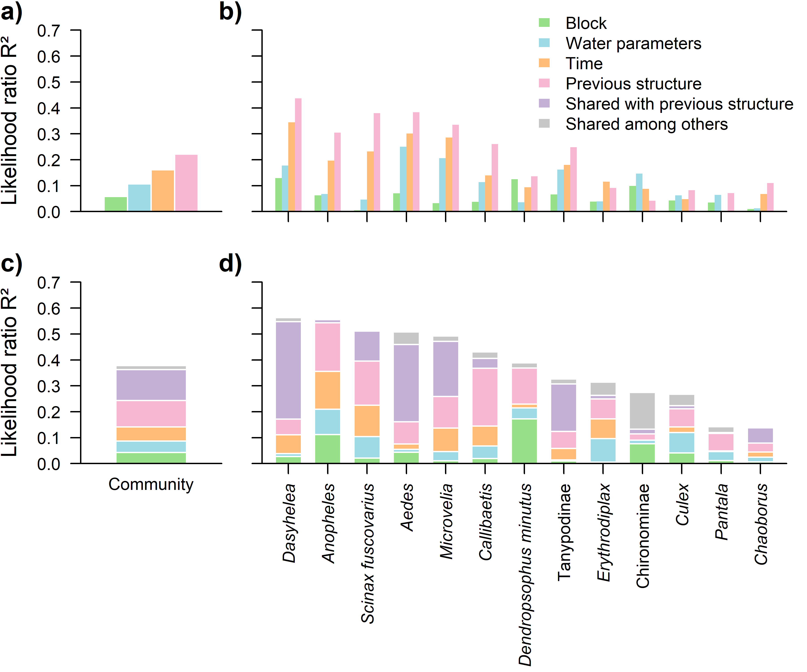

Variation partitioning with previous community
================
Rodolfo Pelinson
2025-10-17

``` r
source(paste(sep = "/",dir,"functions/remove_sp.R"))
source(paste(sep = "/",dir,"functions/varpart_manyglm.R"))
source(paste(sep = "/",dir,"functions/R2_manyglm.R"))
source(paste(sep = "/",dir,"functions/letters.R"))
```

``` r
library(vegan)
library(gllvm)
library(mvabund)
```

``` r
source(paste(sep = "/",dir,"ajeitando_planilhas.R"))
```

Building the community matrix with one step in time delayed (the
predictor community)

``` r
#Excluding the first survey
comm_all_2 <- comm_all[Exp_design_all$AM != 1,]
Exp_design_all_2 <- Exp_design_all[Exp_design_all$AM != 1,]

#Making a prior occupancy predictor
comm_all_prior <- comm_all[Exp_design_all$AM != 4,]
Exp_design_all_prior <- Exp_design_all[Exp_design_all$AM != 4,]

#Now excluding the late treatment because it complicate things
comm_all_2 <- comm_all_2[Exp_design_all_2$treatments != "atrasado",]
comm_all_prior <- comm_all_prior[Exp_design_all_prior$treatments != "atrasado",]
Env_new <- Env_2_4[Exp_design_all_2$treatments != "atrasado",-c(1)]
Exp_design_all_2 <- Exp_design_all_2[Exp_design_all_2$treatments != "atrasado",]
Exp_design_all_prior <- Exp_design_all_prior[Exp_design_all_prior$treatments != "atrasado",]


ncol(comm_all_2)
```

    ## [1] 26

``` r
ncol(comm_all_prior)
```

    ## [1] 26

``` r
comm_all_2 <- remove_sp(comm_all_2, 4)
comm_all_prior <- remove_sp(comm_all_prior, 10)

ncol(comm_all_2)
```

    ## [1] 13

``` r
ncol(comm_all_prior)
```

    ## [1] 10

``` r
nrow(comm_all_2)
```

    ## [1] 72

``` r
nrow(comm_all_prior)
```

    ## [1] 72

``` r
nrow(Env_new)
```

    ## [1] 72

``` r
nrow(Exp_design_all_2)
```

    ## [1] 72

To reduce dimensionality of data and standardize as much as possible the
number of predictors in each set of predictors we ran a nmds on the
prior community state matrix and a PCA on the environmental predictors

``` r
ID <-  as.factor(Exp_design_all_2$sites)
block <-  data.frame(block2 = Exp_design_all_2$block2)

Env_st <- decostand(Env_new, method = "stand")
pca_env <- rda(Env_st)
sum(c(pca_env$CA$eig/sum(pca_env$CA$eig))[1:3])
```

    ## [1] 0.9677276

``` r
Env_st_pca <- data.frame(pca_env$CA$u[,1:3])

pca_env$CA$v
```

    ##                      PC1         PC2         PC3         PC4          PC5
    ## pH             0.4150214 -0.53603873 -0.34086337 -0.63931592  0.124527215
    ## OD            -0.2177026 -0.01144279 -0.90912048  0.35480576  0.009351906
    ## Condutividade -0.5654481 -0.39557080  0.15524869  0.01946294  0.706619556
    ## Temperatura    0.3544170 -0.63877065  0.17445318  0.64729547 -0.130135807
    ## TDS           -0.5788090 -0.38474320  0.05268818 -0.21451760 -0.684221448

``` r
comm_all_prior_total <- data.frame(decostand(comm_all_prior, method = "total", MARGIN = 2))
set.seed(1); nmds_prior <- metaMDS(comm_all_prior_total, distance  = "bray", k = 3, try = 100, trymax = 100)
```

    ## Run 0 stress 0.1750987 
    ## Run 1 stress 0.1750985 
    ## ... New best solution
    ## ... Procrustes: rmse 0.0001195464  max resid 0.0004033966 
    ## ... Similar to previous best
    ## Run 2 stress 0.175085 
    ## ... New best solution
    ## ... Procrustes: rmse 0.01832679  max resid 0.09928627 
    ## Run 3 stress 0.1750987 
    ## ... Procrustes: rmse 0.01740395  max resid 0.09686033 
    ## Run 4 stress 0.1750848 
    ## ... New best solution
    ## ... Procrustes: rmse 0.0001234337  max resid 0.0003858307 
    ## ... Similar to previous best
    ## Run 5 stress 0.175098 
    ## ... Procrustes: rmse 0.01811334  max resid 0.09865316 
    ## Run 6 stress 0.1819429 
    ## Run 7 stress 0.1755528 
    ## ... Procrustes: rmse 0.02889934  max resid 0.1193924 
    ## Run 8 stress 0.1750851 
    ## ... Procrustes: rmse 0.0001445686  max resid 0.0005981142 
    ## ... Similar to previous best
    ## Run 9 stress 0.1761562 
    ## Run 10 stress 0.175085 
    ## ... Procrustes: rmse 0.0001004142  max resid 0.000412762 
    ## ... Similar to previous best
    ## Run 11 stress 0.1755528 
    ## ... Procrustes: rmse 0.02865108  max resid 0.1176014 
    ## Run 12 stress 0.1750984 
    ## ... Procrustes: rmse 0.01824589  max resid 0.09896764 
    ## Run 13 stress 0.1818812 
    ## Run 14 stress 0.1761568 
    ## Run 15 stress 0.1750852 
    ## ... Procrustes: rmse 0.0002136749  max resid 0.0008891901 
    ## ... Similar to previous best
    ## Run 16 stress 0.1750855 
    ## ... Procrustes: rmse 0.0005723125  max resid 0.002342234 
    ## ... Similar to previous best
    ## Run 17 stress 0.175085 
    ## ... Procrustes: rmse 0.0001233171  max resid 0.000508897 
    ## ... Similar to previous best
    ## Run 18 stress 0.1818809 
    ## Run 19 stress 0.175805 
    ## Run 20 stress 0.1755362 
    ## ... Procrustes: rmse 0.02788261  max resid 0.1113573 
    ## Run 21 stress 0.1750978 
    ## ... Procrustes: rmse 0.01807423  max resid 0.098557 
    ## Run 22 stress 0.175537 
    ## ... Procrustes: rmse 0.02756818  max resid 0.1076329 
    ## Run 23 stress 0.1750848 
    ## ... New best solution
    ## ... Procrustes: rmse 4.404174e-05  max resid 0.0001401117 
    ## ... Similar to previous best
    ## Run 24 stress 0.1761564 
    ## Run 25 stress 0.1760141 
    ## Run 26 stress 0.1750848 
    ## ... Procrustes: rmse 1.775363e-05  max resid 9.107216e-05 
    ## ... Similar to previous best
    ## Run 27 stress 0.1750848 
    ## ... New best solution
    ## ... Procrustes: rmse 1.175408e-05  max resid 6.859823e-05 
    ## ... Similar to previous best
    ## Run 28 stress 0.1750986 
    ## ... Procrustes: rmse 0.01824685  max resid 0.09899783 
    ## Run 29 stress 0.1750982 
    ## ... Procrustes: rmse 0.01817258  max resid 0.09882252 
    ## Run 30 stress 0.1763518 
    ## Run 31 stress 0.1750988 
    ## ... Procrustes: rmse 0.01827595  max resid 0.09908446 
    ## Run 32 stress 0.1819428 
    ## Run 33 stress 0.1750853 
    ## ... Procrustes: rmse 0.000282826  max resid 0.00117276 
    ## ... Similar to previous best
    ## Run 34 stress 0.1750849 
    ## ... Procrustes: rmse 0.0001070041  max resid 0.0004394434 
    ## ... Similar to previous best
    ## Run 35 stress 0.1750851 
    ## ... Procrustes: rmse 0.00019458  max resid 0.0008030224 
    ## ... Similar to previous best
    ## Run 36 stress 0.1750851 
    ## ... Procrustes: rmse 0.0002162039  max resid 0.000891263 
    ## ... Similar to previous best
    ## Run 37 stress 0.1762304 
    ## Run 38 stress 0.1750849 
    ## ... Procrustes: rmse 7.122838e-05  max resid 0.0002897841 
    ## ... Similar to previous best
    ## Run 39 stress 0.176156 
    ## Run 40 stress 0.1750848 
    ## ... Procrustes: rmse 0.0001273749  max resid 0.0005193217 
    ## ... Similar to previous best
    ## Run 41 stress 0.1750852 
    ## ... Procrustes: rmse 0.0004408035  max resid 0.001812308 
    ## ... Similar to previous best
    ## Run 42 stress 0.1750852 
    ## ... Procrustes: rmse 0.000223799  max resid 0.0009223361 
    ## ... Similar to previous best
    ## Run 43 stress 0.1750847 
    ## ... New best solution
    ## ... Procrustes: rmse 0.0001286963  max resid 0.0005260753 
    ## ... Similar to previous best
    ## Run 44 stress 0.1761555 
    ## Run 45 stress 0.1750849 
    ## ... Procrustes: rmse 0.0002489325  max resid 0.001010289 
    ## ... Similar to previous best
    ## Run 46 stress 0.1761553 
    ## Run 47 stress 0.181942 
    ## Run 48 stress 0.1819539 
    ## Run 49 stress 0.1750852 
    ## ... Procrustes: rmse 0.0003571753  max resid 0.001402416 
    ## ... Similar to previous best
    ## Run 50 stress 0.1750848 
    ## ... Procrustes: rmse 0.0001750544  max resid 0.0007134753 
    ## ... Similar to previous best
    ## Run 51 stress 0.1819544 
    ## Run 52 stress 0.1750854 
    ## ... Procrustes: rmse 0.0003890776  max resid 0.001555032 
    ## ... Similar to previous best
    ## Run 53 stress 0.1819546 
    ## Run 54 stress 0.175085 
    ## ... Procrustes: rmse 0.0002315624  max resid 0.0009813221 
    ## ... Similar to previous best
    ## Run 55 stress 0.1750852 
    ## ... Procrustes: rmse 0.0003629835  max resid 0.001495518 
    ## ... Similar to previous best
    ## Run 56 stress 0.1773297 
    ## Run 57 stress 0.1750848 
    ## ... Procrustes: rmse 0.0001878157  max resid 0.000767099 
    ## ... Similar to previous best
    ## Run 58 stress 0.1755159 
    ## ... Procrustes: rmse 0.02574422  max resid 0.1036925 
    ## Run 59 stress 0.175129 
    ## ... Procrustes: rmse 0.003008536  max resid 0.01245906 
    ## Run 60 stress 0.1819536 
    ## Run 61 stress 0.1750982 
    ## ... Procrustes: rmse 0.01808352  max resid 0.09868084 
    ## Run 62 stress 0.1750976 
    ## ... Procrustes: rmse 0.01781999  max resid 0.0980474 
    ## Run 63 stress 0.1750848 
    ## ... Procrustes: rmse 0.0001647836  max resid 0.0006738218 
    ## ... Similar to previous best
    ## Run 64 stress 0.1750851 
    ## ... Procrustes: rmse 0.0003200632  max resid 0.001309387 
    ## ... Similar to previous best
    ## Run 65 stress 0.1820505 
    ## Run 66 stress 0.1750852 
    ## ... Procrustes: rmse 0.000368548  max resid 0.001511399 
    ## ... Similar to previous best
    ## Run 67 stress 0.1761561 
    ## Run 68 stress 0.175515 
    ## ... Procrustes: rmse 0.02545465  max resid 0.1037522 
    ## Run 69 stress 0.1761561 
    ## Run 70 stress 0.1761558 
    ## Run 71 stress 0.1761558 
    ## Run 72 stress 0.1755366 
    ## ... Procrustes: rmse 0.0277073  max resid 0.109651 
    ## Run 73 stress 0.1750849 
    ## ... Procrustes: rmse 0.0002077697  max resid 0.000807175 
    ## ... Similar to previous best
    ## Run 74 stress 0.1750852 
    ## ... Procrustes: rmse 0.0003715633  max resid 0.001531865 
    ## ... Similar to previous best
    ## Run 75 stress 0.1750848 
    ## ... Procrustes: rmse 0.0001058739  max resid 0.0004118934 
    ## ... Similar to previous best
    ## Run 76 stress 0.1750849 
    ## ... Procrustes: rmse 0.0002572021  max resid 0.001055915 
    ## ... Similar to previous best
    ## Run 77 stress 0.1835879 
    ## Run 78 stress 0.1750854 
    ## ... Procrustes: rmse 0.000394589  max resid 0.001624054 
    ## ... Similar to previous best
    ## Run 79 stress 0.1755375 
    ## ... Procrustes: rmse 0.02732233  max resid 0.1053297 
    ## Run 80 stress 0.1750852 
    ## ... Procrustes: rmse 0.0003710915  max resid 0.00152753 
    ## ... Similar to previous best
    ## Run 81 stress 0.1750988 
    ## ... Procrustes: rmse 0.01820777  max resid 0.09897295 
    ## Run 82 stress 0.1750851 
    ## ... Procrustes: rmse 0.0003225303  max resid 0.001325837 
    ## ... Similar to previous best
    ## Run 83 stress 0.175553 
    ## ... Procrustes: rmse 0.0285346  max resid 0.1171796 
    ## Run 84 stress 0.1761553 
    ## Run 85 stress 0.1750976 
    ## ... Procrustes: rmse 0.01784849  max resid 0.09811638 
    ## Run 86 stress 0.1750979 
    ## ... Procrustes: rmse 0.01797114  max resid 0.09840976 
    ## Run 87 stress 0.181955 
    ## Run 88 stress 0.1761563 
    ## Run 89 stress 0.1750852 
    ## ... Procrustes: rmse 0.0003783197  max resid 0.001559121 
    ## ... Similar to previous best
    ## Run 90 stress 0.1750851 
    ## ... Procrustes: rmse 0.0003219527  max resid 0.001325512 
    ## ... Similar to previous best
    ## Run 91 stress 0.1761562 
    ## Run 92 stress 0.1761559 
    ## Run 93 stress 0.1750849 
    ## ... Procrustes: rmse 0.0001720764  max resid 0.0007156438 
    ## ... Similar to previous best
    ## Run 94 stress 0.1848684 
    ## Run 95 stress 0.1750984 
    ## ... Procrustes: rmse 0.01811968  max resid 0.09876442 
    ## Run 96 stress 0.178304 
    ## Run 97 stress 0.1750978 
    ## ... Procrustes: rmse 0.01792683  max resid 0.09830357 
    ## Run 98 stress 0.1750851 
    ## ... Procrustes: rmse 0.0003088715  max resid 0.001269725 
    ## ... Similar to previous best
    ## Run 99 stress 0.1750848 
    ## ... Procrustes: rmse 0.0001317755  max resid 0.0005411147 
    ## ... Similar to previous best
    ## Run 100 stress 0.1755532 
    ## ... Procrustes: rmse 0.02853079  max resid 0.1170433 
    ## *** Best solution repeated 23 times

``` r
comm_all_prior_nmds <- data.frame(nmds_prior$points)
comm_all_prior_nmds <- decostand(comm_all_prior_nmds, method = "stand")

AM <- data.frame(AM = as.numeric(Exp_design_all_2$AM))
AM <- decostand(AM, method = "stand")
AM$AM_quad <- AM$AM^2


predictors <- list(block = block,
                   Env = Env_st_pca,
                   Time = AM,
                   Priority = comm_all_prior_nmds)

lapply(predictors, FUN = nrow)
```

    ## $block
    ## [1] 72
    ## 
    ## $Env
    ## [1] 72
    ## 
    ## $Time
    ## [1] 72
    ## 
    ## $Priority
    ## [1] 72

``` r
lapply(predictors, FUN = ncol)
```

    ## $block
    ## [1] 1
    ## 
    ## $Env
    ## [1] 3
    ## 
    ## $Time
    ## [1] 2
    ## 
    ## $Priority
    ## [1] 3

We ended up with this number of predictors:

Prior community structure: 3 Time: 2 Environment: 3 Block: 1 factor with
3 levels (effectively 2 predictors)

Variation partitioning

``` r
varpart_priority <- varpart_manyglm(comm_all_2, pred = predictors, DF_adj_r2 = FALSE)

varpart_priority$R2_fractions_com
```

    ##          R2_full_fraction R2_pure_fraction
    ## block          0.05801965       0.04296972
    ## Env            0.10654452       0.04369903
    ## Time           0.16108262       0.05447315
    ## Priority       0.22159416       0.10196892

``` r
total_r2 <- varpart_priority$R2_models$`block-Env-Time-Priority`
total_r2
```

    ## [1] 0.3777033

Scaling fractions so the added partial ones won’t larger than the total
R² of the model (which may sometime happen).

``` r
##### PLOT
full_model_sp <- varpart_priority$R2_models_sp$block.Env.Time.Priority
names(full_model_sp) <- rownames(varpart_priority$R2_models_sp)
ord_sp <- order(full_model_sp, decreasing = TRUE)

full_model_sp<- full_model_sp[ord_sp]


full_block <-  varpart_priority$R2_fractions_sp$R2_full_fraction$block
names(full_block) <- rownames(varpart_priority$R2_fractions_sp$R2_full_fraction)

full_Env <-  varpart_priority$R2_fractions_sp$R2_full_fraction$Env
names(full_Env) <- rownames(varpart_priority$R2_fractions_sp$R2_full_fraction)

full_Time <-  varpart_priority$R2_fractions_sp$R2_full_fraction$Time
names(full_Time) <- rownames(varpart_priority$R2_fractions_sp$R2_full_fraction)

full_Priority <-  varpart_priority$R2_fractions_sp$R2_full_fraction$Priority
names(full_Priority) <- rownames(varpart_priority$R2_fractions_sp$R2_full_fraction)


pure_block <-  varpart_priority$R2_fractions_sp$R2_pure_fraction$block
names(pure_block) <- rownames(varpart_priority$R2_fractions_sp$R2_pure_fraction)

pure_Env <-  varpart_priority$R2_fractions_sp$R2_pure_fraction$Env
names(pure_Env) <- rownames(varpart_priority$R2_fractions_sp$R2_pure_fraction)

pure_Time <-  varpart_priority$R2_fractions_sp$R2_pure_fraction$Time
names(pure_Time) <- rownames(varpart_priority$R2_fractions_sp$R2_pure_fraction)

pure_Priority <-  varpart_priority$R2_fractions_sp$R2_pure_fraction$Priority
names(pure_Priority) <- rownames(varpart_priority$R2_fractions_sp$R2_pure_fraction)

full_block <- full_block[ord_sp]
full_Env <- full_Env[ord_sp]
full_Time <- full_Time[ord_sp]
full_Priority <- full_Priority[ord_sp]

pure_block <- pure_block[ord_sp]
pure_Env <- pure_Env[ord_sp]
pure_Time <- pure_Time[ord_sp]
pure_Priority <- pure_Priority[ord_sp]

shared_priority_others <- full_Priority - pure_Priority


pure_block[pure_block < 0] <- 0
pure_Env[pure_Env < 0] <- 0
pure_Time[pure_Time < 0] <- 0
pure_Priority[pure_Priority < 0] <- 0


pure_frac_summed <- pure_block + pure_Env + pure_Time + pure_Priority

scale <- full_model_sp/pure_frac_summed

scale[scale > 1] <- 1

pure_frac_summed_scaled <- pure_frac_summed * scale

cbind(pure_frac_summed_scaled, full_model_sp)
```

    ##                       pure_frac_summed_scaled full_model_sp
    ## Dasyhelea                           0.1712289     0.5633516
    ## Anopheles                           0.5427461     0.5548739
    ## Scinax.fuscovarius                  0.3957597     0.5110640
    ## Aedes                               0.1612007     0.5077562
    ## Microvelia                          0.2585284     0.4919460
    ## Callibaetis                         0.3673076     0.4304866
    ## Dendropsophus.minutus               0.3683443     0.3884143
    ## Tanypodinae                         0.1240715     0.3258772
    ## Erythrodiplax                       0.2497403     0.3137772
    ## Chironominae                        0.1144594     0.2742726
    ## Culex                               0.2114684     0.2678336
    ## Pantala                             0.1162270     0.1422323
    ## Chaoborus                           0.0793585     0.1382580

``` r
pure_block_scaled  <- pure_block * scale
pure_Env_scaled  <- pure_Env * scale
pure_Time_scaled  <- pure_Time * scale
pure_Priority_scaled  <- pure_Priority * scale


scale_shared <- (full_model_sp - pure_frac_summed)  / shared_priority_others
scale_shared[scale_shared > 1] <- 1

shared_priority_others[shared_priority_others < 0] <- 0

shared_priority_others_scaled <- shared_priority_others * scale_shared
```

Plot including shared effects between priority effects and others/

``` r
at_generator <- function(first, spacing, n){
  axis <- first
  for(i in 2:(n)){
    axis[i] <- first + spacing*(i-1)
  }
  return(axis)
}


#svg(file = "C:/Users/rodol/OneDrive/repos/PrioEff_TimeOfAssembly/Plots/Community structure analysis/varpart_reduced_dim.svg", width = 6, height = 5, pointsize = 9)
close.screen(all.screens = TRUE)
```

    ## [1] FALSE

``` r
split.screen(matrix(c(0,0.3,0.625,1,
                      0.3,1,0.625,1,
                      0,0.3,0.25,0.625,
                      0.3,1,0.25,0.625), ncol = 4, nrow = 4, byrow = TRUE))
```

    ## [1] 1 2 3 4

``` r
screen(4)
par(mar = c(2,1,1.5,1), xpd = NA)
barplot(full_model_sp, ylim = c(0,0.7), las = 2, border = "white", col = "#C7C7C7", xaxt = "n", xaxs = "i", width = 1, space = 0.5, xlim = c(0,20), yaxt = "n", ylab = "", xlab = "")
par(new = TRUE)
pure_scaleds <- rbind(pure_block_scaled, pure_Env_scaled, pure_Time_scaled, pure_Priority_scaled, shared_priority_others_scaled)
barplot(pure_scaleds, ylim = c(0,0.7), las = 2, col = c("#98DF8A", "#9EDAE5", "#FFBB78", "#F7B6D2", "#C5B0D5"), border = "white", xaxt = "n", xaxs = "i", width = 1, space = 0.5, xlim = c(0,20), yaxt = "n")
box(bty = "l")
names <- colnames(pure_scaleds)
names <- gsub("\\."," ", names)
font <- rep(3, length(names))
font[names == "Chironominae" | names == "Tanypodinae"] <- 1

names1 <- names
names3 <- names

names1[names == "Chironominae" | names == "Tanypodinae"] <- ""
names3[names != "Chironominae" & names != "Tanypodinae"] <- ""


axis(1, at = at_generator(first = 1, spacing = 1.5, n = length(names)), gap.axis = -10, tick = TRUE, labels = FALSE, las = 2, font = 3, line = 0)

axis(1, at = at_generator(first = 1, spacing = 1.5, n = length(names1)), gap.axis = -10, tick = FALSE, labels = names1, las = 2, font = 3, line = 0)
axis(1, at = at_generator(first = 1, spacing = 1.5, n = length(names3)), gap.axis = -10, tick = FALSE, labels = names3, las = 2, font = 1, line = 0)


axis(2, las = 2, line = 0, labels = FALSE)
letters(x = -2, y = 95, "d)", cex = 1.5)


#par(new = TRUE, mar = c(0,0,0,0), bty = "n")
#plot(NA, xlim = c(0,100), ylim = c(0,100), xaxt = "n", yaxt = "n", xaxs = "i", yaxs = "i", )


screen(3, new = FALSE)
par(mar = c(2,4,1.5,1), xpd = NA)
barplot(total_r2, ylim = c(0,0.7), las = 2, border = "white", col = "#C7C7C7", xaxt = "n", xaxs = "i", width = 1, space = 0.5, xlim = c(0,2), yaxt = "n", ylab = "", xlab = "")
par(new = TRUE)

shared_priority_com <- varpart_priority$R2_fractions_com[4,1] - varpart_priority$R2_fractions_com[4,2]
pure_scaleds <- as.matrix(c(varpart_priority$R2_fractions_com$R2_pure_fraction, shared_priority_com))

barplot(pure_scaleds, ylim = c(0,0.7), las = 2, col = c("#98DF8A", "#9EDAE5", "#FFBB78", "#F7B6D2", "#C5B0D5"), border = "white", xaxt = "n", xaxs = "i", width = 1, space = 0.5, xlim = c(0,2), yaxt = "n")
box(bty = "l")
#title(ylab = "Likelihood ratio R²", cex.lab = 1.25)

axis(1, at = c(1), gap.axis = -10, tick = FALSE, labels = "Community", las = 1, font = 1, line = -0.5)

title(ylab = "Likelihood ratio R²", cex.lab = 1.25)
axis(2, las = 2, line = 0)
letters(x = 5, y = 95, "c)", cex = 1.5)


screen(2, new = FALSE)
par(mar = c(2,1,1.5,1), xpd = NA)
pure_scaleds <- rbind(full_block, full_Env, full_Time, full_Priority)
barplot(pure_scaleds, ylim = c(0,0.7), las = 2, col = c("#98DF8A", "#9EDAE5", "#FFBB78", "#F7B6D2"), border = "transparent", xaxt = "n", xaxs = "i", width = 1, space = c(0,2), xlim = c(0,80), yaxt = "n", beside = TRUE, ylab = "", xlab = "")
box(bty = "l")
names <- colnames(pure_scaleds)
names <- gsub("\\."," ", names)
font <- rep(3, length(names))
font[names == "Chironominae" | names == "Tanypodinae"] <- 1

axis(1, at = at_generator(first = 4, spacing = 6, n = length(names)), gap.axis = -10, tick = TRUE, labels = FALSE, las = 2, font = 3, line = 0)
#axis(1, at = at_generator(first = 4, spacing = 6, n = length(c(names[1:8], c("",""),names[11:13]))), gap.axis = -10, tick = FALSE, labels = c(names[1:8], c("",""),names[11:13]), las = 2, font = 3, line = 0)
#axis(1, at = at_generator(first = 4, spacing = 6, n = length(c(rep("",8), names[9:10],rep("",3)))), gap.axis = -10, tick = FALSE, labels = c(rep("",8), names[9:10],rep("",3)), las = 2, font = 1, line = 0)
axis(2, las = 2, line = 0, labels = FALSE)

letters(x = -2, y = 95, "b)", cex = 1.5)


par(new = TRUE, mar = c(0,0,0,0), bty = "n")
plot(NA, xlim = c(0,100), ylim = c(0,100), xaxt = "n", yaxt = "n", xaxs = "i", yaxs = "i", ylab = "", xlab = "")

legend(x = 99, y = 99, xjust = 1, yjust = 1, fill = c("#98DF8A", "#9EDAE5", "#FFBB78","#F7B6D2", "#C5B0D5", "#C7C7C7"),
       legend = c("Block", "Water parameters", "Time", "Previous structure", "Shared with previous structure", "Shared among others"), border = "white", bty = "n")


screen(1, new = FALSE)
par(mar = c(2,4,1.5,1), xpd = NA)

pure_scaleds <- as.matrix(varpart_priority$R2_fractions_com$R2_full_fraction)

barplot(pure_scaleds, ylim = c(0,0.7), las = 2, col = c("#98DF8A", "#9EDAE5", "#FFBB78", "#F7B6D2", "#C5B0D5"), border = "white", xaxt = "n", xaxs = "i", width = 1, space = c(0,1), xlim = c(0,6), yaxt = "n", beside = TRUE, ylab = "", xlab = "")
box(bty = "l")
#axis(1, at = c(3), gap.axis = -10, tick = FALSE, labels = "Community", las = 1, font = 1, line = -0.5)
#title(ylab = "Likelihood ratio R²", cex.lab = 1.25)

#axis(1, at = c(3), gap.axis = -10, tick = FALSE, labels = "Community", las = 1, font = 1, line = -0.5)


title(ylab = "Likelihood ratio R²", cex.lab = 1.25)
axis(2, las = 2, line = 0)
letters(x = 5, y = 95, "a)", cex = 1.5)


#dev.off()
######
```

<!-- -->

Now testing the significance of these fractions

``` r
set.seed(3)
control <- permute::how(within = permute::Within(type = 'free'),
                        plots = Plots(strata = ID, type = 'free'),
                        nperm = 999)
permutations <- shuffleSet(nrow(comm_all_2), control = control)


anova_block_pure <- anova(varpart_priority$models$`block-Env-Time-Priority`, varpart_priority$models$`Env-Time-Priority`, show.time = "all", resamp = "pit.trap", bootID = permutations)
```

    ## Using <int> bootID matrix from input. 
    ## Resampling begins for test 1.
    ##  Resampling run 0 finished. Time elapsed: 0.00 minutes...
    ##  Resampling run 100 finished. Time elapsed: 0.08 minutes...
    ##  Resampling run 200 finished. Time elapsed: 0.20 minutes...
    ##  Resampling run 300 finished. Time elapsed: 0.29 minutes...
    ##  Resampling run 400 finished. Time elapsed: 0.38 minutes...
    ##  Resampling run 500 finished. Time elapsed: 0.46 minutes...
    ##  Resampling run 600 finished. Time elapsed: 0.54 minutes...
    ##  Resampling run 700 finished. Time elapsed: 0.63 minutes...
    ##  Resampling run 800 finished. Time elapsed: 0.71 minutes...
    ##  Resampling run 900 finished. Time elapsed: 0.80 minutes...
    ## Time elapsed: 0 hr 0 min 54 sec

``` r
anova_block_pure
```

    ## Analysis of Deviance Table
    ## 
    ## varpart_priority$models$`Env-Time-Priority`: resp_mv ~ PC1 + PC2 + PC3 + AM + AM_quad + MDS1 + MDS2 + MDS3
    ## varpart_priority$models$`block-Env-Time-Priority`: resp_mv ~ block2 + PC1 + PC2 + PC3 + AM + AM_quad + MDS1 + MDS2 + MDS3
    ## 
    ## Multivariate test:
    ##                                                   Res.Df Df.diff   Dev Pr(>Dev)
    ## varpart_priority$models$`Env-Time-Priority`           63                       
    ## varpart_priority$models$`block-Env-Time-Priority`     61       2 54.22    0.149
    ## Arguments:
    ##  Test statistics calculated assuming uncorrelated response (for faster computation) 
    ##  P-value calculated using 999 iterations via PIT-trap resampling.

``` r
anova_Env_pure <- anova(varpart_priority$models$`block-Env-Time-Priority`, varpart_priority$models$`block-Time-Priority`, show.time = "all", resamp = "pit.trap", bootID = permutations)
```

    ## Using <int> bootID matrix from input. 
    ## Resampling begins for test 1.
    ##  Resampling run 0 finished. Time elapsed: 0.00 minutes...
    ##  Resampling run 100 finished. Time elapsed: 0.09 minutes...
    ##  Resampling run 200 finished. Time elapsed: 0.17 minutes...
    ##  Resampling run 300 finished. Time elapsed: 0.26 minutes...
    ##  Resampling run 400 finished. Time elapsed: 0.34 minutes...
    ##  Resampling run 500 finished. Time elapsed: 0.43 minutes...
    ##  Resampling run 600 finished. Time elapsed: 0.51 minutes...
    ##  Resampling run 700 finished. Time elapsed: 0.59 minutes...
    ##  Resampling run 800 finished. Time elapsed: 0.65 minutes...
    ##  Resampling run 900 finished. Time elapsed: 0.72 minutes...
    ## Time elapsed: 0 hr 0 min 46 sec

``` r
anova_Env_pure
```

    ## Analysis of Deviance Table
    ## 
    ## varpart_priority$models$`block-Time-Priority`: resp_mv ~ block2 + AM + AM_quad + MDS1 + MDS2 + MDS3
    ## varpart_priority$models$`block-Env-Time-Priority`: resp_mv ~ block2 + PC1 + PC2 + PC3 + AM + AM_quad + MDS1 + MDS2 + MDS3
    ## 
    ## Multivariate test:
    ##                                                   Res.Df Df.diff   Dev Pr(>Dev)
    ## varpart_priority$models$`block-Time-Priority`         64                       
    ## varpart_priority$models$`block-Env-Time-Priority`     61       3 52.69     0.55
    ## Arguments:
    ##  Test statistics calculated assuming uncorrelated response (for faster computation) 
    ##  P-value calculated using 999 iterations via PIT-trap resampling.

``` r
anova_Time_pure <- anova(varpart_priority$models$`block-Env-Time-Priority`, varpart_priority$models$`block-Env-Priority`, show.time = "all", resamp = "pit.trap", bootID = permutations)
```

    ## Using <int> bootID matrix from input. 
    ## Resampling begins for test 1.
    ##  Resampling run 0 finished. Time elapsed: 0.00 minutes...
    ##  Resampling run 100 finished. Time elapsed: 0.06 minutes...
    ##  Resampling run 200 finished. Time elapsed: 0.11 minutes...
    ##  Resampling run 300 finished. Time elapsed: 0.17 minutes...
    ##  Resampling run 400 finished. Time elapsed: 0.23 minutes...
    ##  Resampling run 500 finished. Time elapsed: 0.29 minutes...
    ##  Resampling run 600 finished. Time elapsed: 0.34 minutes...
    ##  Resampling run 700 finished. Time elapsed: 0.40 minutes...
    ##  Resampling run 800 finished. Time elapsed: 0.45 minutes...
    ##  Resampling run 900 finished. Time elapsed: 0.53 minutes...
    ## Time elapsed: 0 hr 0 min 36 sec

``` r
anova_Time_pure
```

    ## Analysis of Deviance Table
    ## 
    ## varpart_priority$models$`block-Env-Priority`: resp_mv ~ block2 + PC1 + PC2 + PC3 + MDS1 + MDS2 + MDS3
    ## varpart_priority$models$`block-Env-Time-Priority`: resp_mv ~ block2 + PC1 + PC2 + PC3 + AM + AM_quad + MDS1 + MDS2 + MDS3
    ## 
    ## Multivariate test:
    ##                                                   Res.Df Df.diff   Dev Pr(>Dev)
    ## varpart_priority$models$`block-Env-Priority`          63                       
    ## varpart_priority$models$`block-Env-Time-Priority`     61       2 68.67     0.01
    ##                                                     
    ## varpart_priority$models$`block-Env-Priority`        
    ## varpart_priority$models$`block-Env-Time-Priority` **
    ## ---
    ## Signif. codes:  0 '***' 0.001 '**' 0.01 '*' 0.05 '.' 0.1 ' ' 1
    ## Arguments:
    ##  Test statistics calculated assuming uncorrelated response (for faster computation) 
    ##  P-value calculated using 999 iterations via PIT-trap resampling.

``` r
anova_Priority_pure <- anova(varpart_priority$models$`block-Env-Time-Priority`, varpart_priority$models$`block-Env-Time`, show.time = "all", resamp = "pit.trap", bootID = permutations)
```

    ## Using <int> bootID matrix from input. 
    ## Resampling begins for test 1.
    ##  Resampling run 0 finished. Time elapsed: 0.00 minutes...
    ##  Resampling run 100 finished. Time elapsed: 0.09 minutes...
    ##  Resampling run 200 finished. Time elapsed: 0.17 minutes...
    ##  Resampling run 300 finished. Time elapsed: 0.25 minutes...
    ##  Resampling run 400 finished. Time elapsed: 0.34 minutes...
    ##  Resampling run 500 finished. Time elapsed: 0.46 minutes...
    ##  Resampling run 600 finished. Time elapsed: 0.55 minutes...
    ##  Resampling run 700 finished. Time elapsed: 0.63 minutes...
    ##  Resampling run 800 finished. Time elapsed: 0.72 minutes...
    ##  Resampling run 900 finished. Time elapsed: 0.79 minutes...
    ## Time elapsed: 0 hr 0 min 57 sec

``` r
anova_Priority_pure
```

    ## Analysis of Deviance Table
    ## 
    ## varpart_priority$models$`block-Env-Time`: resp_mv ~ block2 + PC1 + PC2 + PC3 + AM + AM_quad
    ## varpart_priority$models$`block-Env-Time-Priority`: resp_mv ~ block2 + PC1 + PC2 + PC3 + AM + AM_quad + MDS1 + MDS2 + MDS3
    ## 
    ## Multivariate test:
    ##                                                   Res.Df Df.diff   Dev Pr(>Dev)
    ## varpart_priority$models$`block-Env-Time`              64                       
    ## varpart_priority$models$`block-Env-Time-Priority`     61       3 124.8    0.004
    ##                                                     
    ## varpart_priority$models$`block-Env-Time`            
    ## varpart_priority$models$`block-Env-Time-Priority` **
    ## ---
    ## Signif. codes:  0 '***' 0.001 '**' 0.01 '*' 0.05 '.' 0.1 ' ' 1
    ## Arguments:
    ##  Test statistics calculated assuming uncorrelated response (for faster computation) 
    ##  P-value calculated using 999 iterations via PIT-trap resampling.

``` r
anova_block <- anova(varpart_priority$models$block, varpart_priority$model_null, show.time = "all", resamp = "pit.trap", bootID = permutations)
```

    ## Using <int> bootID matrix from input. 
    ## Resampling begins for test 1.
    ##  Resampling run 0 finished. Time elapsed: 0.00 minutes...
    ##  Resampling run 100 finished. Time elapsed: 0.03 minutes...
    ##  Resampling run 200 finished. Time elapsed: 0.06 minutes...
    ##  Resampling run 300 finished. Time elapsed: 0.09 minutes...
    ##  Resampling run 400 finished. Time elapsed: 0.11 minutes...
    ##  Resampling run 500 finished. Time elapsed: 0.14 minutes...
    ##  Resampling run 600 finished. Time elapsed: 0.16 minutes...
    ##  Resampling run 700 finished. Time elapsed: 0.18 minutes...
    ##  Resampling run 800 finished. Time elapsed: 0.20 minutes...
    ##  Resampling run 900 finished. Time elapsed: 0.23 minutes...
    ## Time elapsed: 0 hr 0 min 15 sec

``` r
anova_block
```

    ## Analysis of Deviance Table
    ## 
    ## varpart_priority$model_null: resp_mv ~ 1
    ## varpart_priority$models$block: resp_mv ~ block2
    ## 
    ## Multivariate test:
    ##                               Res.Df Df.diff   Dev Pr(>Dev)
    ## varpart_priority$model_null       71                       
    ## varpart_priority$models$block     69       2 52.35    0.172
    ## Arguments:
    ##  Test statistics calculated assuming uncorrelated response (for faster computation) 
    ##  P-value calculated using 999 iterations via PIT-trap resampling.

``` r
anova_Env <- anova(varpart_priority$models$Env, varpart_priority$model_null, show.time = "all", resamp = "pit.trap", bootID = permutations)
```

    ## Using <int> bootID matrix from input. 
    ## Resampling begins for test 1.
    ##  Resampling run 0 finished. Time elapsed: 0.00 minutes...
    ##  Resampling run 100 finished. Time elapsed: 0.04 minutes...
    ##  Resampling run 200 finished. Time elapsed: 0.09 minutes...
    ##  Resampling run 300 finished. Time elapsed: 0.14 minutes...
    ##  Resampling run 400 finished. Time elapsed: 0.18 minutes...
    ##  Resampling run 500 finished. Time elapsed: 0.20 minutes...
    ##  Resampling run 600 finished. Time elapsed: 0.23 minutes...
    ##  Resampling run 700 finished. Time elapsed: 0.27 minutes...
    ##  Resampling run 800 finished. Time elapsed: 0.30 minutes...
    ##  Resampling run 900 finished. Time elapsed: 0.33 minutes...
    ## Time elapsed: 0 hr 0 min 21 sec

``` r
anova_Env
```

    ## Analysis of Deviance Table
    ## 
    ## varpart_priority$model_null: resp_mv ~ 1
    ## varpart_priority$models$Env: resp_mv ~ PC1 + PC2 + PC3
    ## 
    ## Multivariate test:
    ##                             Res.Df Df.diff  Dev Pr(>Dev)    
    ## varpart_priority$model_null     71                          
    ## varpart_priority$models$Env     68       3 98.6    0.001 ***
    ## ---
    ## Signif. codes:  0 '***' 0.001 '**' 0.01 '*' 0.05 '.' 0.1 ' ' 1
    ## Arguments:
    ##  Test statistics calculated assuming uncorrelated response (for faster computation) 
    ##  P-value calculated using 999 iterations via PIT-trap resampling.

``` r
anova_Time <- anova(varpart_priority$models$Time, varpart_priority$model_null, show.time = "all", resamp = "pit.trap", bootID = permutations)
```

    ## Using <int> bootID matrix from input. 
    ## Resampling begins for test 1.
    ##  Resampling run 0 finished. Time elapsed: 0.00 minutes...
    ##  Resampling run 100 finished. Time elapsed: 0.02 minutes...
    ##  Resampling run 200 finished. Time elapsed: 0.04 minutes...
    ##  Resampling run 300 finished. Time elapsed: 0.06 minutes...
    ##  Resampling run 400 finished. Time elapsed: 0.09 minutes...
    ##  Resampling run 500 finished. Time elapsed: 0.11 minutes...
    ##  Resampling run 600 finished. Time elapsed: 0.13 minutes...
    ##  Resampling run 700 finished. Time elapsed: 0.15 minutes...
    ##  Resampling run 800 finished. Time elapsed: 0.17 minutes...
    ##  Resampling run 900 finished. Time elapsed: 0.19 minutes...
    ## Time elapsed: 0 hr 0 min 13 sec

``` r
anova_Time
```

    ## Analysis of Deviance Table
    ## 
    ## varpart_priority$model_null: resp_mv ~ 1
    ## varpart_priority$models$Time: resp_mv ~ AM + AM_quad
    ## 
    ## Multivariate test:
    ##                              Res.Df Df.diff   Dev Pr(>Dev)    
    ## varpart_priority$model_null      71                           
    ## varpart_priority$models$Time     69       2 151.2    0.001 ***
    ## ---
    ## Signif. codes:  0 '***' 0.001 '**' 0.01 '*' 0.05 '.' 0.1 ' ' 1
    ## Arguments:
    ##  Test statistics calculated assuming uncorrelated response (for faster computation) 
    ##  P-value calculated using 999 iterations via PIT-trap resampling.

``` r
anova_Priority <- anova(varpart_priority$models$Priority, varpart_priority$model_null, show.time = "all", resamp = "pit.trap", bootID = permutations)
```

    ## Using <int> bootID matrix from input. 
    ## Resampling begins for test 1.
    ##  Resampling run 0 finished. Time elapsed: 0.00 minutes...
    ##  Resampling run 100 finished. Time elapsed: 0.03 minutes...
    ##  Resampling run 200 finished. Time elapsed: 0.06 minutes...
    ##  Resampling run 300 finished. Time elapsed: 0.08 minutes...
    ##  Resampling run 400 finished. Time elapsed: 0.11 minutes...
    ##  Resampling run 500 finished. Time elapsed: 0.13 minutes...
    ##  Resampling run 600 finished. Time elapsed: 0.16 minutes...
    ##  Resampling run 700 finished. Time elapsed: 0.19 minutes...
    ##  Resampling run 800 finished. Time elapsed: 0.22 minutes...
    ##  Resampling run 900 finished. Time elapsed: 0.25 minutes...
    ## Time elapsed: 0 hr 0 min 17 sec

``` r
anova_Priority
```

    ## Analysis of Deviance Table
    ## 
    ## varpart_priority$model_null: resp_mv ~ 1
    ## varpart_priority$models$Priority: resp_mv ~ MDS1 + MDS2 + MDS3
    ## 
    ## Multivariate test:
    ##                                  Res.Df Df.diff   Dev Pr(>Dev)    
    ## varpart_priority$model_null          71                           
    ## varpart_priority$models$Priority     68       3 217.9    0.001 ***
    ## ---
    ## Signif. codes:  0 '***' 0.001 '**' 0.01 '*' 0.05 '.' 0.1 ' ' 1
    ## Arguments:
    ##  Test statistics calculated assuming uncorrelated response (for faster computation) 
    ##  P-value calculated using 999 iterations via PIT-trap resampling.
