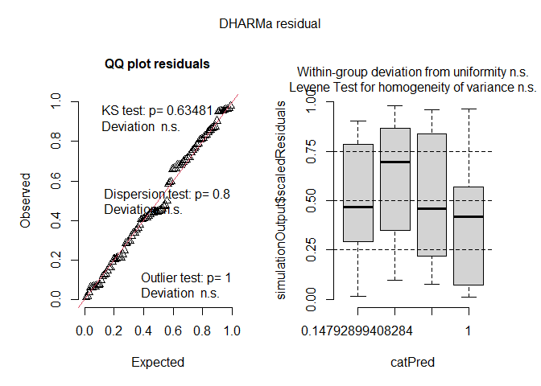
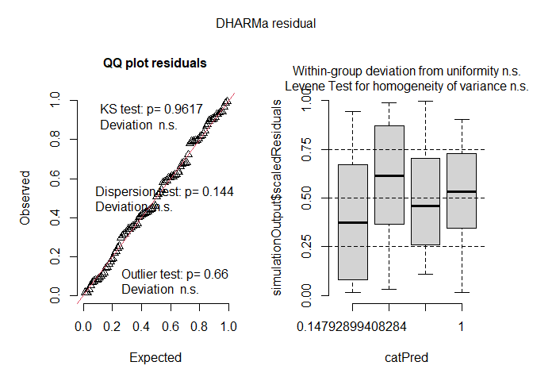
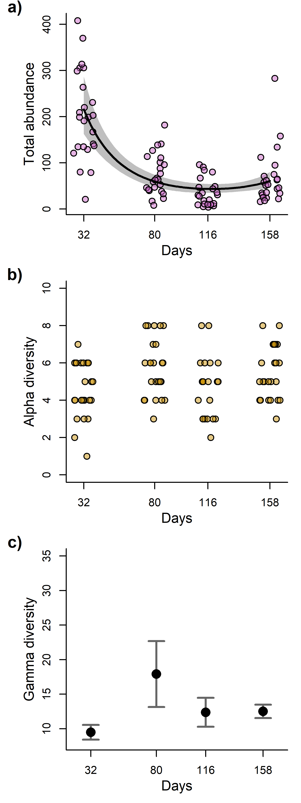

Community size, alpha and gamma diveristy
================
Rodolfo Pelinson
2026-04-12

## Loading packages and functions

``` r
source(paste(sep = "/",dir,"functions/remove_sp.R"))
source(paste(sep = "/",dir,"functions/get_scaled_lvs.R"))
source(paste(sep = "/",dir,"functions/text_contour.R"))
source(paste(sep = "/",dir,"functions/letters.R"))
```

``` r
library(vegan)
library(gllvm)
library(mvabund)
library(DHARMa)
library(glmmTMB)
library(vioplot)
library(yarrr)
library(colorspace)
library(iNEXT)
library(iNEXT.beta3D)
library(iNEXT.3D)
library(shape)
```

``` r
sessionInfo()
```

    ## R version 4.5.2 (2025-10-31 ucrt)
    ## Platform: x86_64-w64-mingw32/x64
    ## Running under: Windows 11 x64 (build 26200)
    ## 
    ## Matrix products: default
    ##   LAPACK version 3.12.1
    ## 
    ## locale:
    ## [1] LC_COLLATE=Portuguese_Brazil.utf8  LC_CTYPE=Portuguese_Brazil.utf8   
    ## [3] LC_MONETARY=Portuguese_Brazil.utf8 LC_NUMERIC=C                      
    ## [5] LC_TIME=Portuguese_Brazil.utf8    
    ## 
    ## time zone: Europe/London
    ## tzcode source: internal
    ## 
    ## attached base packages:
    ## [1] stats     graphics  grDevices utils     datasets  methods   base     
    ## 
    ## other attached packages:
    ##  [1] shape_1.4.6.1          iNEXT.3D_1.0.12        iNEXT.beta3D_1.0.2    
    ##  [4] iNEXT_3.0.2            colorspace_2.1-2       yarrr_0.1.14          
    ##  [7] circlize_0.4.17        BayesFactor_0.9.12-4.8 Matrix_1.7-4          
    ## [10] coda_0.19-4.1          jpeg_0.1-11            vioplot_0.5.1         
    ## [13] zoo_1.8-15             sm_2.2-6.0             glmmTMB_1.1.14        
    ## [16] DHARMa_0.4.7           mvabund_4.2.8          gllvm_2.0.5           
    ## [19] TMB_1.9.20             vegan_2.7-3            permute_0.9-10        
    ## 
    ## loaded via a namespace (and not attached):
    ##  [1] tidyselect_1.2.1    dplyr_1.2.0         farver_2.1.2       
    ##  [4] S7_0.2.1            lazyeval_0.2.2      fastmap_1.2.0      
    ##  [7] digest_0.6.39       estimability_1.5.1  lifecycle_1.0.5    
    ## [10] cluster_2.1.8.1     statmod_1.5.1       tidytree_0.4.7     
    ## [13] magrittr_2.0.4      compiler_4.5.2      rlang_1.1.7        
    ## [16] tools_4.5.2         yaml_2.3.12         knitr_1.51         
    ## [19] alabama_2025.1.0    plyr_1.8.9          RColorBrewer_1.1-3 
    ## [22] abind_1.4-8         purrr_1.2.1         numDeriv_2016.8-1.1
    ## [25] grid_4.5.2          xtable_1.8-8        future_1.70.0      
    ## [28] ggplot2_4.0.2       emmeans_2.0.2       globals_0.19.1     
    ## [31] scales_1.4.0        MASS_7.3-65         cli_3.6.5          
    ## [34] mvtnorm_1.3-6       rmarkdown_2.31      reformulas_0.4.4   
    ## [37] generics_0.1.4      otel_0.2.0          rstudioapi_0.18.0  
    ## [40] future.apply_1.20.2 reshape2_1.4.5      ape_5.8-1          
    ## [43] minqa_1.2.8         pbapply_1.7-4       stringr_1.6.0      
    ## [46] splines_4.5.2       parallel_4.5.2      yulab.utils_0.2.4  
    ## [49] vctrs_0.7.2         boot_1.3-32         sandwich_3.1-1     
    ## [52] listenv_0.10.1      tweedie_3.0.17      tidyr_1.3.2        
    ## [55] parallelly_1.46.1   glue_1.8.0          nloptr_2.2.1       
    ## [58] codetools_0.2-20    stringi_1.8.7       gtable_0.3.6       
    ## [61] lme4_2.0-1          tibble_3.3.1        pillar_1.11.1      
    ## [64] rappdirs_0.3.4      htmltools_0.5.9     R6_2.6.1           
    ## [67] Rdpack_2.6.6        evaluate_1.0.5      lattice_0.22-7     
    ## [70] rbibutils_2.4.1     phyclust_0.1-34     MatrixModels_0.5-4 
    ## [73] Rcpp_1.1.1          nlme_3.1-168        mgcv_1.9-3         
    ## [76] xfun_0.57           fs_2.0.1            pkgconfig_2.0.3    
    ## [79] GlobalOptions_0.1.3

## Loading and preparing data

``` r
source(paste(sep = "/",dir,"ajeitando_planilhas.R"))
```

``` r
#Now excluding the late treatment because it complicate things
comm_all_2 <- comm_all[Exp_design_all$treatments != "atrasado",]
Exp_design_all_2 <- Exp_design_all[Exp_design_all$treatments != "atrasado",]

comm_all_2 <- remove_sp(comm_all_2, 0)

ncol(comm_all_2)
```

    ## [1] 24

``` r
nrow(comm_all_2)
```

    ## [1] 96

``` r
nrow(Exp_design_all_2)
```

    ## [1] 96

``` r
ID <-  as.factor(Exp_design_all_2$sites)

AM_by_block <- interaction(as.factor(Exp_design_all_2$block), as.factor( Exp_design_all_2$AM))


Exp_design_all_2$AM <- as.factor(Exp_design_all_2$AM)
Exp_design_all_2$AM_numeric <- as.numeric(Exp_design_all_2$AM)
Exp_design_all_2$AM_numeric_quad <- Exp_design_all_2$AM_numeric^2


Exp_design_all_2$AM_days <- Exp_design_all_2$AM_numeric

Exp_design_all_2$AM_days[Exp_design_all_2$AM_numeric==1] <- 32
Exp_design_all_2$AM_days[Exp_design_all_2$AM_numeric==2] <- 80
Exp_design_all_2$AM_days[Exp_design_all_2$AM_numeric==3] <- 116
Exp_design_all_2$AM_days[Exp_design_all_2$AM_numeric==4] <- 158

Exp_design_all_2$AM_days_st <- scale(Exp_design_all_2$AM_days)
attr_AM_days <- attributes(Exp_design_all_2$AM_days_st)
Exp_design_all_2$AM_days_st <- Exp_design_all_2$AM_days_st[,1]

unscale <- function(x, atributes, reverse = FALSE){
  if(isTRUE(reverse)){
      x <- (x - atributes$`scaled:center`) / atributes$`scaled:scale` 
  }else{
      x <- (x * atributes$`scaled:scale`) + atributes$`scaled:center`
  }
  return(x)
}

Exp_design_all_2$AM_days_quad <- Exp_design_all_2$AM_days^2
Exp_design_all_2$AM_days_st_quad <- Exp_design_all_2$AM_days_st^2
```

## Richness

``` r
richness <- rowSums(decostand(comm_all_2, method = "pa"))
#richness_null <- rowSums(decostand(null_com, method = "pa"))


mod_rich_null<- glmmTMB(richness ~ 1 + (1|block2/sites), data = Exp_design_all_2, family ="gaussian")
mod_rich_day <- glmmTMB(richness ~ AM_days_st + (1|block2/sites), data = Exp_design_all_2, family ="gaussian")
mod_rich_day_quad <- glmmTMB(richness ~ AM_days_st_quad + AM_days_quad + (1|block2/sites), data = Exp_design_all_2, family ="gaussian")

anova_rich <- anova(mod_rich_null, mod_rich_day, mod_rich_day_quad)
plot(simulateResiduals(mod_rich_day_quad))
```

<!-- -->

``` r
anova_rich
```

    ## Data: Exp_design_all_2
    ## Models:
    ## mod_rich_null: richness ~ 1 + (1 | block2/sites), zi=~0, disp=~1
    ## mod_rich_day: richness ~ AM_days_st + (1 | block2/sites), zi=~0, disp=~1
    ## mod_rich_day_quad: richness ~ AM_days_st_quad + AM_days_quad + (1 | block2/sites), zi=~0, disp=~1
    ##                   Df    AIC    BIC  logLik deviance  Chisq Chi Df Pr(>Chisq)
    ## mod_rich_null      4 364.32 374.58 -178.16   356.32                         
    ## mod_rich_day       5 364.36 377.18 -177.18   354.36 1.9599      1     0.1615
    ## mod_rich_day_quad  6 365.88 381.27 -176.94   353.88 0.4801      1     0.4884

## Community size

``` r
abundance <- rowSums(comm_all_2)

#abundance_10 <- abundance/10

mod_abundance_null<- glmmTMB(abundance ~ 1 + (1|block2/sites), data = Exp_design_all_2, family ="nbinom2")
mod_abundance_day <- glmmTMB(abundance ~ AM_days_st + (1|block2/sites), data = Exp_design_all_2, family ="nbinom2", control=glmmTMBControl(optimizer=optim,
               optArgs=list(method="BFGS")))
mod_abundance_day_quad <- glmmTMB(abundance ~ AM_days_st + AM_days_st_quad + (1|block2/sites), data = Exp_design_all_2, family ="nbinom2")
plot(simulateResiduals(mod_abundance_day_quad))
```

<!-- -->

``` r
anova_abundance <- anova(mod_abundance_null, mod_abundance_day, mod_abundance_day_quad)

anova_abundance
```

    ## Data: Exp_design_all_2
    ## Models:
    ## mod_abundance_null: abundance ~ 1 + (1 | block2/sites), zi=~0, disp=~1
    ## mod_abundance_day: abundance ~ AM_days_st + (1 | block2/sites), zi=~0, disp=~1
    ## mod_abundance_day_quad: abundance ~ AM_days_st + AM_days_st_quad + (1 | block2/sites), zi=~0, disp=~1
    ##                        Df    AIC    BIC  logLik deviance  Chisq Chi Df
    ## mod_abundance_null      4 1072.0 1082.2 -531.99   1064.0              
    ## mod_abundance_day       5 1040.9 1053.7 -515.44   1030.9 33.092      1
    ## mod_abundance_day_quad  6 1016.5 1031.9 -502.26   1004.5 26.365      1
    ##                        Pr(>Chisq)    
    ## mod_abundance_null                   
    ## mod_abundance_day       8.788e-09 ***
    ## mod_abundance_day_quad  2.826e-07 ***
    ## ---
    ## Signif. codes:  0 '***' 0.001 '**' 0.01 '*' 0.05 '.' 0.1 ' ' 1

``` r
new_data_days <- data.frame(AM_days_st = seq(from = min(Exp_design_all_2$AM_days_st), to = max(Exp_design_all_2$AM_days_st), length.out = 100),
                            AM_days_st_quad = seq(from = min(Exp_design_all_2$AM_days_st), to = max(Exp_design_all_2$AM_days_st), length.out = 100)^2)

predicted_ab_quad <- predict(mod_abundance_day_quad, newdata = new_data_days, se.fit = TRUE, re.form = NA)
predicted_ab_quad$upper <- exp(predicted_ab_quad$fit + predicted_ab_quad$se.fit * qnorm(0.975))
predicted_ab_quad$lower <- exp(predicted_ab_quad$fit + predicted_ab_quad$se.fit * qnorm(0.025)) 
predicted_ab_quad$fit <- exp(predicted_ab_quad$fit)
```

## Gamma diversity

``` r
#Gama
gamma <- aggregate(comm_all_2, by = list(Exp_design_all_2$AM), FUN = sum)

rownames(gamma) <- gamma[,1]
gamma <- gamma[,-1]

comm_AM1 <- comm_all_2[Exp_design_all_2$AM == 1,]
comm_AM2 <- comm_all_2[Exp_design_all_2$AM == 2,]
comm_AM3 <- comm_all_2[Exp_design_all_2$AM == 3,]
comm_AM4 <- comm_all_2[Exp_design_all_2$AM == 4,]

comm_AM1 <- remove_sp(comm_AM1, 0)
comm_AM2 <- remove_sp(comm_AM2, 0)
comm_AM3 <- remove_sp(comm_AM3, 0)
comm_AM4 <- remove_sp(comm_AM4, 0)

rownames(comm_AM1) <- Exp_design$sites[Exp_design$treatments != "atrasado"]
rownames(comm_AM2) <- Exp_design$sites[Exp_design$treatments != "atrasado"]
rownames(comm_AM3) <- Exp_design$sites[Exp_design$treatments != "atrasado"]
rownames(comm_AM4) <- Exp_design$sites[Exp_design$treatments != "atrasado"]

com_tempos <- list(t(comm_AM1), t(comm_AM2), t(comm_AM3), t(comm_AM4))

inext_coverage_0 <- iNEXTbeta3D(com_tempos, datatype = "abundance", q = 0, diversity = "TD",   base = "coverage")
```

    ## Warning in iNEXT.3D:::EstiBootComm.Ind(Spec = x): This site has only one
    ## species. Estimation is not robust.
    ## Warning in iNEXT.3D:::EstiBootComm.Ind(Spec = x): This site has only one
    ## species. Estimation is not robust.
    ## Warning in iNEXT.3D:::EstiBootComm.Ind(Spec = x): This site has only one
    ## species. Estimation is not robust.
    ## Warning in iNEXT.3D:::EstiBootComm.Ind(Spec = x): This site has only one
    ## species. Estimation is not robust.
    ## Warning in iNEXT.3D:::EstiBootComm.Ind(Spec = x): This site has only one
    ## species. Estimation is not robust.
    ## Warning in iNEXT.3D:::EstiBootComm.Ind(Spec = x): This site has only one
    ## species. Estimation is not robust.
    ## Warning in iNEXT.3D:::EstiBootComm.Ind(Spec = x): This site has only one
    ## species. Estimation is not robust.
    ## Warning in iNEXT.3D:::EstiBootComm.Ind(Spec = x): This site has only one
    ## species. Estimation is not robust.
    ## Warning in iNEXT.3D:::EstiBootComm.Ind(Spec = x): This site has only one
    ## species. Estimation is not robust.
    ## Warning in iNEXT.3D:::EstiBootComm.Ind(Spec = x): This site has only one
    ## species. Estimation is not robust.

``` r
inext_coverage_0$Dataset_1$gamma
```

    ##      Dataset Order.q        SC        Size     Gamma                Method
    ## 1  Dataset_1       0 0.5000000    2.409074  1.964289           Rarefaction
    ## 2  Dataset_1       0 0.5250000    2.599961  2.069958           Rarefaction
    ## 3  Dataset_1       0 0.5500000    2.790872  2.175640           Rarefaction
    ## 4  Dataset_1       0 0.5750000    2.981826  2.281345           Rarefaction
    ## 5  Dataset_1       0 0.6000000    3.240291  2.392957           Rarefaction
    ## 6  Dataset_1       0 0.6250000    3.505869  2.505195           Rarefaction
    ## 7  Dataset_1       0 0.6500000    3.771413  2.617419           Rarefaction
    ## 8  Dataset_1       0 0.6750000    4.050871  2.730734           Rarefaction
    ## 9  Dataset_1       0 0.7000000    4.415829  2.850617           Rarefaction
    ## 10 Dataset_1       0 0.7250000    4.780794  2.970501           Rarefaction
    ## 11 Dataset_1       0 0.7500000    5.197804  3.093933           Rarefaction
    ## 12 Dataset_1       0 0.7750000    5.693128  3.222709           Rarefaction
    ## 13 Dataset_1       0 0.8000000    6.252497  3.355392           Rarefaction
    ## 14 Dataset_1       0 0.8250000    6.916187  3.494443           Rarefaction
    ## 15 Dataset_1       0 0.8500000    7.767075  3.643819           Rarefaction
    ## 16 Dataset_1       0 0.8750000    8.842605  3.804649           Rarefaction
    ## 17 Dataset_1       0 0.9000000   10.352554  3.985686           Rarefaction
    ## 18 Dataset_1       0 0.9250000   12.699889  4.201497           Rarefaction
    ## 19 Dataset_1       0 0.9500000   17.492903  4.504785           Rarefaction
    ## 20 Dataset_1       0 0.9750000   47.302138  5.476912           Rarefaction
    ## 21 Dataset_1       0 0.9969166  581.943808  9.411349 Observed_SC(n, alpha)
    ## 22 Dataset_1       0 0.9986147 1413.690621 11.145808  Extrap_SC(2n, alpha)
    ## 23 Dataset_1       0 0.9997945 4864.000000 13.000000 Observed_SC(n, gamma)
    ## 24 Dataset_1       0 0.9999722 9728.000000 13.432243  Extrap_SC(2n, gamma)
    ##          s.e.       LCL       UCL Diversity
    ## 1  0.02009856  1.924897  2.003682        TD
    ## 2  0.02053796  2.029704  2.110212        TD
    ## 3  0.02097235  2.134534  2.216745        TD
    ## 4  0.02184064  2.238538  2.324152        TD
    ## 5  0.02232535  2.349200  2.436714        TD
    ## 6  0.02237144  2.461348  2.549042        TD
    ## 7  0.02243096  2.573455  2.661383        TD
    ## 8  0.02319939  2.685264  2.776204        TD
    ## 9  0.02284837  2.805835  2.895399        TD
    ## 10 0.02251956  2.926364  3.014639        TD
    ## 11 0.02269863  3.049444  3.138421        TD
    ## 12 0.02200979  3.179571  3.265847        TD
    ## 13 0.02174776  3.312767  3.398017        TD
    ## 14 0.02081841  3.453639  3.535246        TD
    ## 15 0.02013476  3.604356  3.683282        TD
    ## 16 0.01941773  3.766590  3.842707        TD
    ## 17 0.01930555  3.947848  4.023524        TD
    ## 18 0.02043265  4.161450  4.241545        TD
    ## 19 0.02712355  4.451624  4.557946        TD
    ## 20 0.09634216  5.288085  5.665739        TD
    ## 21 0.44940916  8.530524 10.292175        TD
    ## 22 0.68513022  9.802978 12.488639        TD
    ## 23 1.04275096 10.956246 15.043754        TD
    ## 24 1.24271889 10.996559 15.867928        TD

``` r
inext_coverage_0$Dataset_2$gamma
```

    ##      Dataset Order.q        SC        Size     Gamma                Method
    ## 1  Dataset_2       0 0.5000000    3.693321  2.885511           Rarefaction
    ## 2  Dataset_2       0 0.5250000    3.969942  3.041155           Rarefaction
    ## 3  Dataset_2       0 0.5500000    4.308600  3.203814           Rarefaction
    ## 4  Dataset_2       0 0.5750000    4.654849  3.367342           Rarefaction
    ## 5  Dataset_2       0 0.6000000    5.001342  3.530888           Rarefaction
    ## 6  Dataset_2       0 0.6250000    5.433087  3.703620           Rarefaction
    ## 7  Dataset_2       0 0.6500000    5.864862  3.876364           Rarefaction
    ## 8  Dataset_2       0 0.6750000    6.368303  4.056453           Rarefaction
    ## 9  Dataset_2       0 0.7000000    6.904435  4.239904           Rarefaction
    ## 10 Dataset_2       0 0.7250000    7.544632  4.433566           Rarefaction
    ## 11 Dataset_2       0 0.7500000    8.255100  4.633918           Rarefaction
    ## 12 Dataset_2       0 0.7750000    9.086045  4.845515           Rarefaction
    ## 13 Dataset_2       0 0.8000000   10.101662  5.073672           Rarefaction
    ## 14 Dataset_2       0 0.8250000   11.380838  5.324340           Rarefaction
    ## 15 Dataset_2       0 0.8500000   13.021327  5.604364           Rarefaction
    ## 16 Dataset_2       0 0.8750000   15.384232  5.939057           Rarefaction
    ## 17 Dataset_2       0 0.9000000   19.093859  6.365592           Rarefaction
    ## 18 Dataset_2       0 0.9250000   26.092537  6.980286           Rarefaction
    ## 19 Dataset_2       0 0.9500000   41.669215  7.938637           Rarefaction
    ## 20 Dataset_2       0 0.9750000   89.794034  9.612658           Rarefaction
    ## 21 Dataset_2       0 0.9848112  158.531813 10.937848 Observed_SC(n, alpha)
    ## 22 Dataset_2       0 0.9970235 1366.483337 17.944350  Extrap_SC(2n, alpha)
    ## 23 Dataset_2       0 0.9977490 1776.000000 19.000000 Observed_SC(n, gamma)
    ## 24 Dataset_2       0 0.9991721 3552.000000 21.527473  Extrap_SC(2n, gamma)
    ##          s.e.       LCL       UCL Diversity
    ## 1  0.04535097  2.796625  2.974397        TD
    ## 2  0.04810023  2.946881  3.135430        TD
    ## 3  0.05192568  3.102042  3.305586        TD
    ## 4  0.05446987  3.260583  3.474101        TD
    ## 5  0.05786216  3.417480  3.644296        TD
    ## 6  0.06192296  3.582253  3.824987        TD
    ## 7  0.06474085  3.749474  4.003254        TD
    ## 8  0.07025431  3.918757  4.194149        TD
    ## 9  0.07358893  4.095672  4.384135        TD
    ## 10 0.07967466  4.277407  4.589726        TD
    ## 11 0.08591216  4.465533  4.802302        TD
    ## 12 0.09222097  4.664766  5.026265        TD
    ## 13 0.10052073  4.876655  5.270689        TD
    ## 14 0.11114412  5.106501  5.542178        TD
    ## 15 0.12494410  5.359478  5.849250        TD
    ## 16 0.14532052  5.654234  6.223880        TD
    ## 17 0.17835540  6.016022  6.715162        TD
    ## 18 0.23369089  6.522260  7.438311        TD
    ## 19 0.30696792  7.336991  8.540283        TD
    ## 20 0.42578177  8.778141 10.447175        TD
    ## 21 0.57492225  9.811021 12.064674        TD
    ## 22 2.62787248 12.793815 23.094886        TD
    ## 23 2.92932565 13.258627 24.741373        TD
    ## 24 3.53079603 14.607240 28.447706        TD

``` r
inext_coverage_0$Dataset_3$gamma
```

    ##      Dataset Order.q        SC        Size     Gamma                Method
    ## 1  Dataset_3       0 0.5000000    2.775320  2.212939           Rarefaction
    ## 2  Dataset_3       0 0.5250000    2.991947  2.340639           Rarefaction
    ## 3  Dataset_3       0 0.5500000    3.294726  2.485107           Rarefaction
    ## 4  Dataset_3       0 0.5750000    3.600889  2.630250           Rarefaction
    ## 5  Dataset_3       0 0.6000000    3.907000  2.775367           Rarefaction
    ## 6  Dataset_3       0 0.6250000    4.294792  2.935134           Rarefaction
    ## 7  Dataset_3       0 0.6500000    4.718159  3.101266           Rarefaction
    ## 8  Dataset_3       0 0.6750000    5.191182  3.275594           Rarefaction
    ## 9  Dataset_3       0 0.7000000    5.763095  3.466245           Rarefaction
    ## 10 Dataset_3       0 0.7250000    6.441652  3.673141           Rarefaction
    ## 11 Dataset_3       0 0.7500000    7.251671  3.899414           Rarefaction
    ## 12 Dataset_3       0 0.7750000    8.278047  4.155498           Rarefaction
    ## 13 Dataset_3       0 0.8000000    9.608430  4.449938           Rarefaction
    ## 14 Dataset_3       0 0.8250000   11.383390  4.794516           Rarefaction
    ## 15 Dataset_3       0 0.8500000   13.845510  5.206131           Rarefaction
    ## 16 Dataset_3       0 0.8750000   17.386847  5.702695           Rarefaction
    ## 17 Dataset_3       0 0.9000000   22.587705  6.296116           Rarefaction
    ## 18 Dataset_3       0 0.9250000   30.534301  6.996602           Rarefaction
    ## 19 Dataset_3       0 0.9472250   41.884464  7.722486 Observed_SC(n, alpha)
    ## 20 Dataset_3       0 0.9500000   43.785976  7.821515           Rarefaction
    ## 21 Dataset_3       0 0.9745120   71.958516  8.839586  Extrap_SC(2n, alpha)
    ## 22 Dataset_3       0 0.9750000   72.934241  8.864456           Rarefaction
    ## 23 Dataset_3       0 0.9976048  833.000000 13.000000 Observed_SC(n, gamma)
    ## 24 Dataset_3       0 0.9996758 1666.000000 13.863627  Extrap_SC(2n, gamma)
    ##          s.e.       LCL       UCL Diversity
    ## 1  0.06569310  2.084183  2.341696        TD
    ## 2  0.07109250  2.201301  2.479978        TD
    ## 3  0.07698574  2.334218  2.635997        TD
    ## 4  0.07934088  2.474744  2.785755        TD
    ## 5  0.08249381  2.613683  2.937052        TD
    ## 6  0.09164120  2.755521  3.114748        TD
    ## 7  0.09432626  2.916390  3.286142        TD
    ## 8  0.10335966  3.073013  3.478175        TD
    ## 9  0.10810921  3.254355  3.678135        TD
    ## 10 0.11847965  3.440925  3.905357        TD
    ## 11 0.12818770  3.648170  4.150657        TD
    ## 12 0.13922078  3.882631  4.428366        TD
    ## 13 0.15077450  4.154426  4.745451        TD
    ## 14 0.16379212  4.473489  5.115542        TD
    ## 15 0.17336270  4.866347  5.545916        TD
    ## 16 0.17343682  5.362765  6.042625        TD
    ## 17 0.15851426  5.985433  6.606798        TD
    ## 18 0.14643851  6.709587  7.283616        TD
    ## 19 0.17534640  7.378813  8.066159        TD
    ## 20 0.18239110  7.464035  8.178995        TD
    ## 21 0.28401147  8.282934  9.396239        TD
    ## 22 0.28709701  8.301756  9.427156        TD
    ## 23 1.40814845 10.240080 15.759920        TD
    ## 24 1.86795571 10.202501 17.524753        TD

``` r
inext_coverage_0$Dataset_4$gamma
```

    ##      Dataset Order.q        SC        Size     Gamma                Method
    ## 1  Dataset_4       0 0.5000000    1.914411  1.596610           Rarefaction
    ## 2  Dataset_4       0 0.5250000    2.124273  1.712816           Rarefaction
    ## 3  Dataset_4       0 0.5500000    2.413879  1.853486           Rarefaction
    ## 4  Dataset_4       0 0.5750000    2.703463  1.994145           Rarefaction
    ## 5  Dataset_4       0 0.6000000    2.993071  2.134815           Rarefaction
    ## 6  Dataset_4       0 0.6250000    3.487777  2.333000           Rarefaction
    ## 7  Dataset_4       0 0.6500000    3.987462  2.532576           Rarefaction
    ## 8  Dataset_4       0 0.6750000    4.735417  2.794518           Rarefaction
    ## 9  Dataset_4       0 0.7000000    5.653513  3.093617           Rarefaction
    ## 10 Dataset_4       0 0.7250000    6.805178  3.437812           Rarefaction
    ## 11 Dataset_4       0 0.7500000    8.215564  3.820238           Rarefaction
    ## 12 Dataset_4       0 0.7750000    9.885558  4.229460           Rarefaction
    ## 13 Dataset_4       0 0.8000000   11.859729  4.660831           Rarefaction
    ## 14 Dataset_4       0 0.8250000   14.223818  5.115568           Rarefaction
    ## 15 Dataset_4       0 0.8500000   17.132957  5.599837           Rarefaction
    ## 16 Dataset_4       0 0.8750000   20.884603  6.126180           Rarefaction
    ## 17 Dataset_4       0 0.9000000   26.058824  6.717122           Rarefaction
    ## 18 Dataset_4       0 0.9250000   34.048003  7.420399           Rarefaction
    ## 19 Dataset_4       0 0.9500000   49.235181  8.357535           Rarefaction
    ## 20 Dataset_4       0 0.9750000   93.070946  9.896369           Rarefaction
    ## 21 Dataset_4       0 0.9789105  107.952543 10.239939 Observed_SC(n, alpha)
    ## 22 Dataset_4       0 0.9934987  248.333757 11.913944  Extrap_SC(2n, alpha)
    ## 23 Dataset_4       0 0.9993800 1611.000000 14.000000 Observed_SC(n, gamma)
    ## 24 Dataset_4       0 0.9999161 3222.000000 14.432064  Extrap_SC(2n, gamma)
    ##          s.e.       LCL       UCL Diversity
    ## 1  0.09717570  1.406149  1.787071        TD
    ## 2  0.11652612  1.484429  1.941203        TD
    ## 3  0.12932449  1.600014  2.106957        TD
    ## 4  0.12928488  1.740751  2.247538        TD
    ## 5  0.14251581  1.855490  2.414141        TD
    ## 6  0.16010002  2.019210  2.646791        TD
    ## 7  0.16574824  2.207715  2.857436        TD
    ## 8  0.17596631  2.449631  3.139406        TD
    ## 9  0.17842157  2.743917  3.443317        TD
    ## 10 0.17042724  3.103781  3.771844        TD
    ## 11 0.15706511  3.512396  4.128080        TD
    ## 12 0.14075590  3.953584  4.505337        TD
    ## 13 0.12519935  4.415444  4.906217        TD
    ## 14 0.11119721  4.897626  5.333511        TD
    ## 15 0.10029419  5.403264  5.796410        TD
    ## 16 0.09580654  5.938403  6.313958        TD
    ## 17 0.10259477  6.516040  6.918204        TD
    ## 18 0.12730438  7.170887  7.669911        TD
    ## 19 0.18385652  7.997183  8.717887        TD
    ## 20 0.30964806  9.289470 10.503268        TD
    ## 21 0.33589809  9.581591 10.898287        TD
    ## 22 0.44149340 11.048633 12.779255        TD
    ## 23 0.95897525 12.120443 15.879557        TD
    ## 24 1.06883709 12.337182 16.526946        TD

``` r
inext_coverage_0$Dataset_1$alpha
```

    ##      Dataset Order.q        SC       Size     Alpha                Method
    ## 1  Dataset_1       0 0.5000000   32.49601 0.9713837           Rarefaction
    ## 2  Dataset_1       0 0.5250000   35.31114 1.0290774           Rarefaction
    ## 3  Dataset_1       0 0.5500000   38.35660 1.0882650           Rarefaction
    ## 4  Dataset_1       0 0.5750000   41.66685 1.1491074           Rarefaction
    ## 5  Dataset_1       0 0.6000000   45.28569 1.2118031           Rarefaction
    ## 6  Dataset_1       0 0.6250000   49.26808 1.2765918           Rarefaction
    ## 7  Dataset_1       0 0.6500000   53.68367 1.3437650           Rarefaction
    ## 8  Dataset_1       0 0.6750000   58.62172 1.4136772           Rarefaction
    ## 9  Dataset_1       0 0.7000000   64.19943 1.4867719           Rarefaction
    ## 10 Dataset_1       0 0.7250000   70.57941 1.5636366           Rarefaction
    ## 11 Dataset_1       0 0.7500000   77.97842 1.6450010           Rarefaction
    ## 12 Dataset_1       0 0.7750000   86.72232 1.7319071           Rarefaction
    ## 13 Dataset_1       0 0.8000000   97.28147 1.8257374           Rarefaction
    ## 14 Dataset_1       0 0.8250000  110.40839 1.9285456           Rarefaction
    ## 15 Dataset_1       0 0.8500000  127.36471 2.0434671           Rarefaction
    ## 16 Dataset_1       0 0.8750000  150.47168 2.1756885           Rarefaction
    ## 17 Dataset_1       0 0.9000000  184.55813 2.3346987           Rarefaction
    ## 18 Dataset_1       0 0.9250000  241.69218 2.5405711           Rarefaction
    ## 19 Dataset_1       0 0.9500000  361.27463 2.8435080           Rarefaction
    ## 20 Dataset_1       0 0.9750000  716.40153 3.3606070           Rarefaction
    ## 21 Dataset_1       0 0.9969166 4864.00000 4.5833333 Observed_SC(n, alpha)
    ## 22 Dataset_1       0 0.9986147 9728.00000 5.0134913  Extrap_SC(2n, alpha)
    ##          s.e.       LCL      UCL Diversity
    ## 1  0.01513870 0.9417124 1.001055        TD
    ## 2  0.01613122 0.9974608 1.060694        TD
    ## 3  0.01718259 1.0545877 1.121942        TD
    ## 4  0.01830676 1.1132268 1.184988        TD
    ## 5  0.01951091 1.1735624 1.250044        TD
    ## 6  0.02081474 1.2357956 1.317388        TD
    ## 7  0.02224223 1.3001710 1.387359        TD
    ## 8  0.02380350 1.3670232 1.460331        TD
    ## 9  0.02553653 1.4367212 1.536823        TD
    ## 10 0.02747028 1.5097959 1.617477        TD
    ## 11 0.02965342 1.5868813 1.703121        TD
    ## 12 0.03214783 1.6688985 1.794916        TD
    ## 13 0.03503045 1.7570790 1.894396        TD
    ## 14 0.03841450 1.8532546 2.003837        TD
    ## 15 0.04246038 1.9602463 2.126688        TD
    ## 16 0.04742141 2.0827443 2.268633        TD
    ## 17 0.05372556 2.2293986 2.439999        TD
    ## 18 0.06218358 2.4186935 2.662449        TD
    ## 19 0.07374309 2.6989742 2.988042        TD
    ## 20 0.08292838 3.1980703 3.523144        TD
    ## 21 0.37475187 3.8488332 5.317833        TD
    ## 22 0.64033943 3.7584490 6.268533        TD

``` r
inext_coverage_0$Dataset_2$alpha
```

    ##      Dataset Order.q        SC       Size    Alpha                Method
    ## 1  Dataset_2       0 0.5000000   36.52853 1.075570           Rarefaction
    ## 2  Dataset_2       0 0.5250000   40.17397 1.150125           Rarefaction
    ## 3  Dataset_2       0 0.5500000   44.22449 1.228663           Rarefaction
    ## 4  Dataset_2       0 0.5750000   48.75541 1.311734           Rarefaction
    ## 5  Dataset_2       0 0.6000000   53.86369 1.400007           Rarefaction
    ## 6  Dataset_2       0 0.6250000   59.67694 1.494313           Rarefaction
    ## 7  Dataset_2       0 0.6500000   66.35268 1.595584           Rarefaction
    ## 8  Dataset_2       0 0.6750000   74.10003 1.704959           Rarefaction
    ## 9  Dataset_2       0 0.7000000   83.19909 1.823823           Rarefaction
    ## 10 Dataset_2       0 0.7250000   94.01761 1.953780           Rarefaction
    ## 11 Dataset_2       0 0.7500000  107.07035 2.096844           Rarefaction
    ## 12 Dataset_2       0 0.7750000  123.08160 2.255513           Rarefaction
    ## 13 Dataset_2       0 0.8000000  143.13102 2.433144           Rarefaction
    ## 14 Dataset_2       0 0.8250000  168.91514 2.634508           Rarefaction
    ## 15 Dataset_2       0 0.8500000  203.29141 2.866864           Rarefaction
    ## 16 Dataset_2       0 0.8750000  251.44522 3.141740           Rarefaction
    ## 17 Dataset_2       0 0.9000000  323.62835 3.477848           Rarefaction
    ## 18 Dataset_2       0 0.9250000  442.33958 3.905521           Rarefaction
    ## 19 Dataset_2       0 0.9500000  666.59973 4.476060           Rarefaction
    ## 20 Dataset_2       0 0.9750000 1232.96214 5.306050           Rarefaction
    ## 21 Dataset_2       0 0.9848112 1776.00000 5.750000 Observed_SC(n, alpha)
    ## 22 Dataset_2       0 0.9970235 3552.00000 6.304743  Extrap_SC(2n, alpha)
    ##          s.e.      LCL      UCL Diversity
    ## 1  0.02992767 1.016913 1.134228        TD
    ## 2  0.03132984 1.088719 1.211530        TD
    ## 3  0.03274954 1.164475 1.292851        TD
    ## 4  0.03423844 1.244628 1.378840        TD
    ## 5  0.03583290 1.329776 1.470238        TD
    ## 6  0.03758006 1.420658 1.567969        TD
    ## 7  0.03954370 1.518079 1.673088        TD
    ## 8  0.04178077 1.623070 1.786848        TD
    ## 9  0.04436369 1.736872 1.910774        TD
    ## 10 0.04735483 1.860966 2.046594        TD
    ## 11 0.05077109 1.997334 2.196353        TD
    ## 12 0.05460148 2.148496 2.362530        TD
    ## 13 0.05877946 2.317938 2.548349        TD
    ## 14 0.06323802 2.510563 2.758452        TD
    ## 15 0.06799955 2.733587 3.000140        TD
    ## 16 0.07335346 2.997970 3.285510        TD
    ## 17 0.08004447 3.320964 3.634733        TD
    ## 18 0.08950001 3.730105 4.080938        TD
    ## 19 0.10577117 4.268753 4.683368        TD
    ## 20 0.14592435 5.020043 5.592056        TD
    ## 21 0.18603875 5.385371 6.114629        TD
    ## 22 0.30328117 5.710323 6.899163        TD

``` r
inext_coverage_0$Dataset_3$alpha
```

    ##      Dataset Order.q       SC       Size     Alpha                Method
    ## 1  Dataset_3       0 0.500000   26.33639 0.7717949           Rarefaction
    ## 2  Dataset_3       0 0.525000   29.18730 0.8302127           Rarefaction
    ## 3  Dataset_3       0 0.550000   32.40600 0.8927147           Rarefaction
    ## 4  Dataset_3       0 0.575000   36.06286 0.9598837           Rarefaction
    ## 5  Dataset_3       0 0.600000   40.27044 1.0326556           Rarefaction
    ## 6  Dataset_3       0 0.625000   45.15322 1.1119572           Rarefaction
    ## 7  Dataset_3       0 0.650000   50.89348 1.1991017           Rarefaction
    ## 8  Dataset_3       0 0.675000   57.73347 1.2956966           Rarefaction
    ## 9  Dataset_3       0 0.700000   65.99960 1.4037220           Rarefaction
    ## 10 Dataset_3       0 0.725000   76.16377 1.5258067           Rarefaction
    ## 11 Dataset_3       0 0.750000   88.88329 1.6651922           Rarefaction
    ## 12 Dataset_3       0 0.775000  105.12861 1.8261156           Rarefaction
    ## 13 Dataset_3       0 0.800000  126.36333 2.0141343           Rarefaction
    ## 14 Dataset_3       0 0.825000  154.91822 2.2369708           Rarefaction
    ## 15 Dataset_3       0 0.850000  194.80996 2.5063591           Rarefaction
    ## 16 Dataset_3       0 0.875000  253.61143 2.8416260           Rarefaction
    ## 17 Dataset_3       0 0.900000  347.38433 3.2775351           Rarefaction
    ## 18 Dataset_3       0 0.925000  516.95341 3.8864734           Rarefaction
    ## 19 Dataset_3       0 0.947225  833.00000 4.7083333 Observed_SC(n, alpha)
    ## 20 Dataset_3       0 0.950000  894.81962 4.8407238         Extrapolation
    ## 21 Dataset_3       0 0.974512 1666.00000 6.0101493  Extrap_SC(2n, alpha)
    ##          s.e.       LCL       UCL Diversity
    ## 1  0.03537899 0.7024534 0.8411365        TD
    ## 2  0.03786789 0.7559930 0.9044324        TD
    ## 3  0.04058074 0.8131780 0.9722515        TD
    ## 4  0.04354215 0.8745427 1.0452247        TD
    ## 5  0.04680575 0.9409180 1.1243932        TD
    ## 6  0.05041376 1.0131481 1.2107664        TD
    ## 7  0.05442446 1.0924317 1.3057717        TD
    ## 8  0.05887844 1.1802970 1.4110962        TD
    ## 9  0.06377637 1.2787226 1.5287214        TD
    ## 10 0.06908734 1.3903980 1.6612154        TD
    ## 11 0.07470496 1.5187731 1.8116112        TD
    ## 12 0.08050670 1.6683254 1.9839058        TD
    ## 13 0.08641240 1.8447691 2.1834995        TD
    ## 14 0.09270140 2.0552794 2.4186622        TD
    ## 15 0.10075275 2.3088873 2.7038308        TD
    ## 16 0.11489624 2.6164335 3.0668185        TD
    ## 17 0.14489210 2.9935518 3.5615184        TD
    ## 18 0.19895630 3.4965262 4.2764206        TD
    ## 19 0.23938422 4.2391489 5.1775178        TD
    ## 20 0.24601062 4.3585518 5.3228958        TD
    ## 21 0.38995154 5.2458583 6.7744402        TD

``` r
inext_coverage_0$Dataset_4$alpha
```

    ##      Dataset Order.q        SC       Size     Alpha                Method
    ## 1  Dataset_4       0 0.5000000   24.32376 0.6941451           Rarefaction
    ## 2  Dataset_4       0 0.5250000   27.45008 0.7581343           Rarefaction
    ## 3  Dataset_4       0 0.5500000   30.98794 0.8268314           Rarefaction
    ## 4  Dataset_4       0 0.5750000   35.01930 0.9007965           Rarefaction
    ## 5  Dataset_4       0 0.6000000   39.63648 0.9805982           Rarefaction
    ## 6  Dataset_4       0 0.6250000   44.95392 1.0669267           Rarefaction
    ## 7  Dataset_4       0 0.6500000   51.14588 1.1608831           Rarefaction
    ## 8  Dataset_4       0 0.6750000   58.43338 1.2637707           Rarefaction
    ## 9  Dataset_4       0 0.7000000   67.12548 1.3773411           Rarefaction
    ## 10 Dataset_4       0 0.7250000   77.67380 1.5040329           Rarefaction
    ## 11 Dataset_4       0 0.7500000   90.73209 1.6471267           Rarefaction
    ## 12 Dataset_4       0 0.7750000  107.30048 1.8112454           Rarefaction
    ## 13 Dataset_4       0 0.8000000  128.92986 2.0027532           Rarefaction
    ## 14 Dataset_4       0 0.8250000  158.05145 2.2299997           Rarefaction
    ## 15 Dataset_4       0 0.8500000  198.41552 2.5026315           Rarefaction
    ## 16 Dataset_4       0 0.8750000  255.76802 2.8299324           Rarefaction
    ## 17 Dataset_4       0 0.9000000  339.71412 3.2210325           Rarefaction
    ## 18 Dataset_4       0 0.9250000  470.68056 3.6934302           Rarefaction
    ## 19 Dataset_4       0 0.9500000  710.91603 4.3043729           Rarefaction
    ## 20 Dataset_4       0 0.9750000 1386.57592 5.2851864           Rarefaction
    ## 21 Dataset_4       0 0.9789105 1611.00000 5.5000000 Observed_SC(n, alpha)
    ## 22 Dataset_4       0 0.9934987 3222.00000 6.3324383  Extrap_SC(2n, alpha)
    ##          s.e.       LCL       UCL Diversity
    ## 1  0.04127379 0.6132499 0.7750402        TD
    ## 2  0.04470446 0.6705152 0.8457534        TD
    ## 3  0.04822337 0.7323154 0.9213475        TD
    ## 4  0.05183020 0.7992111 1.0023818        TD
    ## 5  0.05555514 0.8717121 1.0894843        TD
    ## 6  0.05941173 0.9504818 1.1833715        TD
    ## 7  0.06344581 1.0365316 1.2852346        TD
    ## 8  0.06769941 1.1310823 1.3964591        TD
    ## 9  0.07224148 1.2357504 1.5189318        TD
    ## 10 0.07716736 1.3527876 1.6552781        TD
    ## 11 0.08259150 1.4852503 1.8090031        TD
    ## 12 0.08865224 1.6374902 1.9850005        TD
    ## 13 0.09545064 1.8156734 2.1898330        TD
    ## 14 0.10291860 2.0282830 2.4317165        TD
    ## 15 0.11044564 2.2861620 2.7191009        TD
    ## 16 0.11649165 2.6016130 3.0582519        TD
    ## 17 0.11900405 2.9877889 3.4542762        TD
    ## 18 0.11719074 3.4637406 3.9231198        TD
    ## 19 0.11165342 4.0855362 4.5232096        TD
    ## 20 0.14375811 5.0034257 5.5669471        TD
    ## 21 0.19058876 5.1264529 5.8735471        TD
    ## 22 0.40318780 5.5422047 7.1226718        TD

``` r
inext_coverage_2 <- iNEXTbeta3D(com_tempos, datatype = "abundance", q = 2, diversity = "TD",   base = "coverage")
```

    ## Warning in iNEXT.3D:::EstiBootComm.Ind(Spec = x): This site has only one
    ## species. Estimation is not robust.
    ## Warning in iNEXT.3D:::EstiBootComm.Ind(Spec = x): This site has only one
    ## species. Estimation is not robust.
    ## Warning in iNEXT.3D:::EstiBootComm.Ind(Spec = x): This site has only one
    ## species. Estimation is not robust.
    ## Warning in iNEXT.3D:::EstiBootComm.Ind(Spec = x): This site has only one
    ## species. Estimation is not robust.
    ## Warning in iNEXT.3D:::EstiBootComm.Ind(Spec = x): This site has only one
    ## species. Estimation is not robust.
    ## Warning in iNEXT.3D:::EstiBootComm.Ind(Spec = x): This site has only one
    ## species. Estimation is not robust.
    ## Warning in iNEXT.3D:::EstiBootComm.Ind(Spec = x): This site has only one
    ## species. Estimation is not robust.
    ## Warning in iNEXT.3D:::EstiBootComm.Ind(Spec = x): This site has only one
    ## species. Estimation is not robust.
    ## Warning in iNEXT.3D:::EstiBootComm.Ind(Spec = x): This site has only one
    ## species. Estimation is not robust.
    ## Warning in iNEXT.3D:::EstiBootComm.Ind(Spec = x): This site has only one
    ## species. Estimation is not robust.

``` r
inext_coverage_2$Dataset_1$gamma
```

    ##      Dataset Order.q        SC        Size    Gamma                Method
    ## 1  Dataset_1       2 0.5000000    2.409074 1.741467           Rarefaction
    ## 2  Dataset_1       2 0.5250000    2.599961 1.814674           Rarefaction
    ## 3  Dataset_1       2 0.5500000    2.790872 1.887889           Rarefaction
    ## 4  Dataset_1       2 0.5750000    2.981826 1.961121           Rarefaction
    ## 5  Dataset_1       2 0.6000000    3.240291 2.033198           Rarefaction
    ## 6  Dataset_1       2 0.6250000    3.505869 2.105156           Rarefaction
    ## 7  Dataset_1       2 0.6500000    3.771413 2.177105           Rarefaction
    ## 8  Dataset_1       2 0.6750000    4.050871 2.249296           Rarefaction
    ## 9  Dataset_1       2 0.7000000    4.415829 2.322873           Rarefaction
    ## 10 Dataset_1       2 0.7250000    4.780794 2.396451           Rarefaction
    ## 11 Dataset_1       2 0.7500000    5.197804 2.471474           Rarefaction
    ## 12 Dataset_1       2 0.7750000    5.693128 2.548675           Rarefaction
    ## 13 Dataset_1       2 0.8000000    6.252497 2.627838           Rarefaction
    ## 14 Dataset_1       2 0.8250000    6.916187 2.710201           Rarefaction
    ## 15 Dataset_1       2 0.8500000    7.767075 2.798191           Rarefaction
    ## 16 Dataset_1       2 0.8750000    8.842605 2.892551           Rarefaction
    ## 17 Dataset_1       2 0.9000000   10.352554 2.998068           Rarefaction
    ## 18 Dataset_1       2 0.9250000   12.699889 3.121861           Rarefaction
    ## 19 Dataset_1       2 0.9500000   17.492903 3.285486           Rarefaction
    ## 20 Dataset_1       2 0.9750000   47.302138 3.600234           Rarefaction
    ## 21 Dataset_1       2 0.9969166  581.943808 3.796107 Observed_SC(n, alpha)
    ## 22 Dataset_1       2 0.9986147 1413.690621 3.806887  Extrap_SC(2n, alpha)
    ## 23 Dataset_1       2 0.9997945 4864.000000 3.812260 Observed_SC(n, gamma)
    ## 24 Dataset_1       2 0.9999722 9728.000000 3.813363  Extrap_SC(2n, gamma)
    ## 25 Dataset_1       2 1.0000000         Inf 3.814466         Extrapolation
    ##          s.e.      LCL      UCL Diversity
    ## 1  0.01119209 1.719531 1.763404        TD
    ## 2  0.01173539 1.791673 1.837675        TD
    ## 3  0.01228433 1.863812 1.911966        TD
    ## 4  0.01283594 1.935963 1.986279        TD
    ## 5  0.01319558 2.007335 2.059060        TD
    ## 6  0.01368558 2.078332 2.131979        TD
    ## 7  0.01418122 2.149310 2.204899        TD
    ## 8  0.01480115 2.220286 2.278306        TD
    ## 9  0.01530944 2.292867 2.352879        TD
    ## 10 0.01576352 2.365555 2.427347        TD
    ## 11 0.01658417 2.438969 2.503978        TD
    ## 12 0.01700091 2.515354 2.581996        TD
    ## 13 0.01791116 2.592733 2.662944        TD
    ## 14 0.01833732 2.674261 2.746142        TD
    ## 15 0.01923440 2.760492 2.835889        TD
    ## 16 0.02024872 2.852864 2.932238        TD
    ## 17 0.02185393 2.955235 3.040901        TD
    ## 18 0.02376131 3.075290 3.168433        TD
    ## 19 0.02781469 3.230970 3.340002        TD
    ## 20 0.03383702 3.533914 3.666553        TD
    ## 21 0.02757471 3.742061 3.850152        TD
    ## 22 0.02810539 3.751801 3.861972        TD
    ## 23 0.02815125 3.757084 3.867435        TD
    ## 24 0.02808983 3.758307 3.868418        TD
    ## 25 0.02796874 3.759648 3.869284        TD

``` r
inext_coverage_2$Dataset_2$gamma
```

    ##      Dataset Order.q        SC        Size    Gamma                Method
    ## 1  Dataset_2       2 0.5000000    3.693321 2.473845           Rarefaction
    ## 2  Dataset_2       2 0.5250000    3.969942 2.581760           Rarefaction
    ## 3  Dataset_2       2 0.5500000    4.308600 2.688614           Rarefaction
    ## 4  Dataset_2       2 0.5750000    4.654849 2.795349           Rarefaction
    ## 5  Dataset_2       2 0.6000000    5.001342 2.902080           Rarefaction
    ## 6  Dataset_2       2 0.6250000    5.433087 3.009896           Rarefaction
    ## 7  Dataset_2       2 0.6500000    5.864862 3.117718           Rarefaction
    ## 8  Dataset_2       2 0.6750000    6.368303 3.227486           Rarefaction
    ## 9  Dataset_2       2 0.7000000    6.904435 3.338149           Rarefaction
    ## 10 Dataset_2       2 0.7250000    7.544632 3.452351           Rarefaction
    ## 11 Dataset_2       2 0.7500000    8.255100 3.569054           Rarefaction
    ## 12 Dataset_2       2 0.7750000    9.086045 3.690142           Rarefaction
    ## 13 Dataset_2       2 0.8000000   10.101662 3.817947           Rarefaction
    ## 14 Dataset_2       2 0.8250000   11.380838 3.954905           Rarefaction
    ## 15 Dataset_2       2 0.8500000   13.021327 4.103493           Rarefaction
    ## 16 Dataset_2       2 0.8750000   15.384232 4.272283           Rarefaction
    ## 17 Dataset_2       2 0.9000000   19.093859 4.470508           Rarefaction
    ## 18 Dataset_2       2 0.9250000   26.092537 4.713082           Rarefaction
    ## 19 Dataset_2       2 0.9500000   41.669215 4.989080           Rarefaction
    ## 20 Dataset_2       2 0.9750000   89.794034 5.265962           Rarefaction
    ## 21 Dataset_2       2 0.9848112  158.531813 5.377995 Observed_SC(n, alpha)
    ## 22 Dataset_2       2 0.9970235 1366.483337 5.513445  Extrap_SC(2n, alpha)
    ## 23 Dataset_2       2 0.9977490 1776.000000 5.517651 Observed_SC(n, gamma)
    ## 24 Dataset_2       2 0.9991721 3552.000000 5.524681  Extrap_SC(2n, gamma)
    ## 25 Dataset_2       2 1.0000000         Inf 5.531730         Extrapolation
    ##          s.e.      LCL      UCL Diversity
    ## 1  0.04063208 2.394208 2.553483        TD
    ## 2  0.04277113 2.497930 2.665590        TD
    ## 3  0.04463024 2.601141 2.776088        TD
    ## 4  0.04670752 2.703804 2.886894        TD
    ## 5  0.04886017 2.806316 2.997844        TD
    ## 6  0.05113206 2.909679 3.110113        TD
    ## 7  0.05311998 3.013605 3.221832        TD
    ## 8  0.05589029 3.117944 3.337029        TD
    ## 9  0.05784086 3.224783 3.451515        TD
    ## 10 0.06081982 3.333147 3.571556        TD
    ## 11 0.06360376 3.444393 3.693716        TD
    ## 12 0.06640912 3.559982 3.820301        TD
    ## 13 0.06974157 3.681256 3.954638        TD
    ## 14 0.07358956 3.810672 4.099138        TD
    ## 15 0.07798809 3.950639 4.256347        TD
    ## 16 0.08325990 4.109097 4.435469        TD
    ## 17 0.08982859 4.294447 4.646568        TD
    ## 18 0.09585700 4.525206 4.900958        TD
    ## 19 0.09706966 4.798827 5.179333        TD
    ## 20 0.10237999 5.065301 5.466623        TD
    ## 21 0.10237085 5.177352 5.578638        TD
    ## 22 0.09103623 5.335017 5.691873        TD
    ## 23 0.09095759 5.339377 5.695924        TD
    ## 24 0.09108899 5.346150 5.703212        TD
    ## 25 0.09108644 5.353204 5.710256        TD

``` r
inext_coverage_2$Dataset_3$gamma
```

    ##      Dataset Order.q        SC        Size    Gamma                Method
    ## 1  Dataset_3       2 0.5000000    2.775320 1.924111           Rarefaction
    ## 2  Dataset_3       2 0.5250000    2.991947 2.012551           Rarefaction
    ## 3  Dataset_3       2 0.5500000    3.294726 2.102253           Rarefaction
    ## 4  Dataset_3       2 0.5750000    3.600889 2.192020           Rarefaction
    ## 5  Dataset_3       2 0.6000000    3.907000 2.281772           Rarefaction
    ## 6  Dataset_3       2 0.6250000    4.294792 2.374123           Rarefaction
    ## 7  Dataset_3       2 0.6500000    4.718159 2.467592           Rarefaction
    ## 8  Dataset_3       2 0.6750000    5.191182 2.562743           Rarefaction
    ## 9  Dataset_3       2 0.7000000    5.763095 2.661247           Rarefaction
    ## 10 Dataset_3       2 0.7250000    6.441652 2.763050           Rarefaction
    ## 11 Dataset_3       2 0.7500000    7.251671 2.868662           Rarefaction
    ## 12 Dataset_3       2 0.7750000    8.278047 2.979667           Rarefaction
    ## 13 Dataset_3       2 0.8000000    9.608430 3.096613           Rarefaction
    ## 14 Dataset_3       2 0.8250000   11.383390 3.219531           Rarefaction
    ## 15 Dataset_3       2 0.8500000   13.845510 3.347462           Rarefaction
    ## 16 Dataset_3       2 0.8750000   17.386847 3.476920           Rarefaction
    ## 17 Dataset_3       2 0.9000000   22.587705 3.602486           Rarefaction
    ## 18 Dataset_3       2 0.9250000   30.534301 3.719286           Rarefaction
    ## 19 Dataset_3       2 0.9472250   41.884464 3.814532 Observed_SC(n, alpha)
    ## 20 Dataset_3       2 0.9500000   43.785976 3.825964           Rarefaction
    ## 21 Dataset_3       2 0.9745120   71.958516 3.927546  Extrap_SC(2n, alpha)
    ## 22 Dataset_3       2 0.9750000   72.934241 3.929715           Rarefaction
    ## 23 Dataset_3       2 0.9976048  833.000000 4.081388 Observed_SC(n, gamma)
    ## 24 Dataset_3       2 0.9996758 1666.000000 4.088960  Extrap_SC(2n, gamma)
    ## 25 Dataset_3       2 1.0000000         Inf 4.096560         Extrapolation
    ##          s.e.      LCL      UCL Diversity
    ## 1  0.07582174 1.775503 2.072719        TD
    ## 2  0.07966045 1.856419 2.168682        TD
    ## 3  0.08336834 1.938854 2.265652        TD
    ## 4  0.08669518 2.022100 2.361939        TD
    ## 5  0.09069729 2.104009 2.459535        TD
    ## 6  0.09488803 2.188146 2.560100        TD
    ## 7  0.09843145 2.274669 2.660514        TD
    ## 8  0.10281610 2.361227 2.764259        TD
    ## 9  0.10676118 2.451999 2.870495        TD
    ## 10 0.11131522 2.544876 2.981224        TD
    ## 11 0.11553892 2.642210 3.095114        TD
    ## 12 0.12011403 2.744248 3.215086        TD
    ## 13 0.12478888 2.852031 3.341194        TD
    ## 14 0.12917690 2.966349 3.472713        TD
    ## 15 0.13325613 3.086285 3.608640        TD
    ## 16 0.13682065 3.208756 3.745083        TD
    ## 17 0.14007276 3.327948 3.877023        TD
    ## 18 0.14370549 3.437629 4.000944        TD
    ## 19 0.14804607 3.524367 4.104697        TD
    ## 20 0.14870971 3.534498 4.117430        TD
    ## 21 0.15675368 3.620315 4.234778        TD
    ## 22 0.15697898 3.622041 4.237388        TD
    ## 23 0.16725944 3.753565 4.409210        TD
    ## 24 0.16790675 3.759869 4.418051        TD
    ## 25 0.16588878 3.771424 4.421696        TD

``` r
inext_coverage_2$Dataset_4$gamma
```

    ##      Dataset Order.q        SC        Size    Gamma                Method
    ## 1  Dataset_4       2 0.5000000    1.914411 1.442738           Rarefaction
    ## 2  Dataset_4       2 0.5250000    2.124273 1.519675           Rarefaction
    ## 3  Dataset_4       2 0.5500000    2.413879 1.602397           Rarefaction
    ## 4  Dataset_4       2 0.5750000    2.703463 1.685112           Rarefaction
    ## 5  Dataset_4       2 0.6000000    2.993071 1.767834           Rarefaction
    ## 6  Dataset_4       2 0.6250000    3.487777 1.861728           Rarefaction
    ## 7  Dataset_4       2 0.6500000    3.987462 1.955887           Rarefaction
    ## 8  Dataset_4       2 0.6750000    4.735417 2.056528           Rarefaction
    ## 9  Dataset_4       2 0.7000000    5.653513 2.157046           Rarefaction
    ## 10 Dataset_4       2 0.7250000    6.805178 2.253788           Rarefaction
    ## 11 Dataset_4       2 0.7500000    8.215564 2.341277           Rarefaction
    ## 12 Dataset_4       2 0.7750000    9.885558 2.417741           Rarefaction
    ## 13 Dataset_4       2 0.8000000   11.859729 2.483830           Rarefaction
    ## 14 Dataset_4       2 0.8250000   14.223818 2.541612           Rarefaction
    ## 15 Dataset_4       2 0.8500000   17.132957 2.593081           Rarefaction
    ## 16 Dataset_4       2 0.8750000   20.884603 2.639952           Rarefaction
    ## 17 Dataset_4       2 0.9000000   26.058824 2.683941           Rarefaction
    ## 18 Dataset_4       2 0.9250000   34.048003 2.726948           Rarefaction
    ## 19 Dataset_4       2 0.9500000   49.235181 2.771621           Rarefaction
    ## 20 Dataset_4       2 0.9750000   93.070946 2.820419           Rarefaction
    ## 21 Dataset_4       2 0.9789105  107.952543 2.828127 Observed_SC(n, alpha)
    ## 22 Dataset_4       2 0.9934987  248.333757 2.855721  Extrap_SC(2n, alpha)
    ## 23 Dataset_4       2 0.9993800 1611.000000 2.873960 Observed_SC(n, gamma)
    ## 24 Dataset_4       2 0.9999161 3222.000000 2.875634  Extrap_SC(2n, gamma)
    ## 25 Dataset_4       2 1.0000000         Inf 2.877309         Extrapolation
    ##          s.e.      LCL      UCL Diversity
    ## 1  0.03450973 1.375100 1.510376        TD
    ## 2  0.03919168 1.442861 1.596489        TD
    ## 3  0.04049544 1.523027 1.681766        TD
    ## 4  0.04148325 1.603806 1.766418        TD
    ## 5  0.04423405 1.681137 1.854532        TD
    ## 6  0.04629517 1.770991 1.952465        TD
    ## 7  0.04752173 1.862746 2.049028        TD
    ## 8  0.04842307 1.961620 2.151435        TD
    ## 9  0.04874274 2.061512 2.252580        TD
    ## 10 0.04857879 2.158575 2.349001        TD
    ## 11 0.04854689 2.246127 2.436428        TD
    ## 12 0.04940918 2.320901 2.514581        TD
    ## 13 0.05072872 2.384403 2.583256        TD
    ## 14 0.05239583 2.438918 2.644306        TD
    ## 15 0.05425089 2.486751 2.699410        TD
    ## 16 0.05626099 2.529683 2.750222        TD
    ## 17 0.05837473 2.569528 2.798353        TD
    ## 18 0.06058481 2.608204 2.845692        TD
    ## 19 0.06288987 2.648359 2.894883        TD
    ## 20 0.06554467 2.691954 2.948884        TD
    ## 21 0.06608555 2.698602 2.957653        TD
    ## 22 0.06837002 2.721718 2.989724        TD
    ## 23 0.06951424 2.737715 3.010205        TD
    ## 24 0.06997972 2.738476 3.012791        TD
    ## 25 0.06949419 2.741103 3.013515        TD

``` r
inext_coverage_4 <- iNEXTbeta3D(com_tempos, datatype = "abundance", q = 4, diversity = "TD",   base = "coverage")
```

    ## Warning in iNEXT.3D:::EstiBootComm.Ind(Spec = x): This site has only one
    ## species. Estimation is not robust.
    ## Warning in iNEXT.3D:::EstiBootComm.Ind(Spec = x): This site has only one
    ## species. Estimation is not robust.
    ## Warning in iNEXT.3D:::EstiBootComm.Ind(Spec = x): This site has only one
    ## species. Estimation is not robust.
    ## Warning in iNEXT.3D:::EstiBootComm.Ind(Spec = x): This site has only one
    ## species. Estimation is not robust.
    ## Warning in iNEXT.3D:::EstiBootComm.Ind(Spec = x): This site has only one
    ## species. Estimation is not robust.
    ## Warning in iNEXT.3D:::EstiBootComm.Ind(Spec = x): This site has only one
    ## species. Estimation is not robust.
    ## Warning in iNEXT.3D:::EstiBootComm.Ind(Spec = x): This site has only one
    ## species. Estimation is not robust.
    ## Warning in iNEXT.3D:::EstiBootComm.Ind(Spec = x): This site has only one
    ## species. Estimation is not robust.
    ## Warning in iNEXT.3D:::EstiBootComm.Ind(Spec = x): This site has only one
    ## species. Estimation is not robust.
    ## Warning in iNEXT.3D:::EstiBootComm.Ind(Spec = x): This site has only one
    ## species. Estimation is not robust.

``` r
inext_coverage_4$Dataset_1$gamma
```

    ##      Dataset Order.q        SC        Size    Gamma                Method
    ## 1  Dataset_1       4 0.5000000    2.409074 1.525916           Rarefaction
    ## 2  Dataset_1       4 0.5250000    2.599961 1.578559           Rarefaction
    ## 3  Dataset_1       4 0.5500000    2.790872 1.631209           Rarefaction
    ## 4  Dataset_1       4 0.5750000    2.981826 1.683871           Rarefaction
    ## 5  Dataset_1       4 0.6000000    3.240291 1.737580           Rarefaction
    ## 6  Dataset_1       4 0.6250000    3.505869 1.791401           Rarefaction
    ## 7  Dataset_1       4 0.6500000    3.771413 1.845215           Rarefaction
    ## 8  Dataset_1       4 0.6750000    4.050871 1.899533           Rarefaction
    ## 9  Dataset_1       4 0.7000000    4.415829 1.956880           Rarefaction
    ## 10 Dataset_1       4 0.7250000    4.780794 2.014228           Rarefaction
    ## 11 Dataset_1       4 0.7500000    5.197804 2.073645           Rarefaction
    ## 12 Dataset_1       4 0.7750000    5.693128 2.136180           Rarefaction
    ## 13 Dataset_1       4 0.8000000    6.252497 2.201206           Rarefaction
    ## 14 Dataset_1       4 0.8250000    6.916187 2.270290           Rarefaction
    ## 15 Dataset_1       4 0.8500000    7.767075 2.346158           Rarefaction
    ## 16 Dataset_1       4 0.8750000    8.842605 2.429552           Rarefaction
    ## 17 Dataset_1       4 0.9000000   10.352554 2.525977           Rarefaction
    ## 18 Dataset_1       4 0.9250000   12.699889 2.643690           Rarefaction
    ## 19 Dataset_1       4 0.9500000   17.492903 2.808274           Rarefaction
    ## 20 Dataset_1       4 0.9750000   47.302138 3.161823           Rarefaction
    ## 21 Dataset_1       4 0.9969166  581.943808 3.414973 Observed_SC(n, alpha)
    ## 22 Dataset_1       4 0.9986147 1413.690621 3.429845  Extrap_SC(2n, alpha)
    ## 23 Dataset_1       4 0.9997945 4864.000000 3.437298 Observed_SC(n, gamma)
    ## 24 Dataset_1       4 0.9999722 9728.000000 3.439236  Extrap_SC(2n, gamma)
    ## 25 Dataset_1       4 1.0000000         Inf 3.440366         Extrapolation
    ##          s.e.      LCL      UCL Diversity
    ## 1  0.01116851 1.504026 1.547806        TD
    ## 2  0.01170695 1.555614 1.601504        TD
    ## 3  0.01224328 1.607213 1.655206        TD
    ## 4  0.01282634 1.658732 1.709010        TD
    ## 5  0.01340129 1.711314 1.763846        TD
    ## 6  0.01385193 1.764251 1.818550        TD
    ## 7  0.01430330 1.817181 1.873249        TD
    ## 8  0.01520800 1.869726 1.929340        TD
    ## 9  0.01561799 1.926269 1.987490        TD
    ## 10 0.01600675 1.982855 2.045600        TD
    ## 11 0.01703171 2.040264 2.107027        TD
    ## 12 0.01736978 2.102136 2.170225        TD
    ## 13 0.01844414 2.165056 2.237356        TD
    ## 14 0.01887754 2.233291 2.307289        TD
    ## 15 0.01983748 2.307277 2.385039        TD
    ## 16 0.02103227 2.388329 2.470774        TD
    ## 17 0.02297427 2.480949 2.571006        TD
    ## 18 0.02526744 2.594166 2.693213        TD
    ## 19 0.03065266 2.748195 2.868352        TD
    ## 20 0.04272664 3.078081 3.245566        TD
    ## 21 0.03856422 3.339388 3.490557        TD
    ## 22 0.03852255 3.354342 3.505348        TD
    ## 23 0.03815387 3.362518 3.512078        TD
    ## 24 0.03802108 3.364716 3.513756        TD
    ## 25 0.03808761 3.365715 3.515016        TD

``` r
inext_coverage_4$Dataset_2$gamma
```

    ##      Dataset Order.q        SC        Size    Gamma                Method
    ## 1  Dataset_2       4 0.5000000    3.693321 2.089671           Rarefaction
    ## 2  Dataset_2       4 0.5250000    3.969942 2.168353           Rarefaction
    ## 3  Dataset_2       4 0.5500000    4.308600 2.247584           Rarefaction
    ## 4  Dataset_2       4 0.5750000    4.654849 2.326889           Rarefaction
    ## 5  Dataset_2       4 0.6000000    5.001342 2.406198           Rarefaction
    ## 6  Dataset_2       4 0.6250000    5.433087 2.488221           Rarefaction
    ## 7  Dataset_2       4 0.6500000    5.864862 2.570250           Rarefaction
    ## 8  Dataset_2       4 0.6750000    6.368303 2.655213           Rarefaction
    ## 9  Dataset_2       4 0.7000000    6.904435 2.741518           Rarefaction
    ## 10 Dataset_2       4 0.7250000    7.544632 2.832410           Rarefaction
    ## 11 Dataset_2       4 0.7500000    8.255100 2.926399           Rarefaction
    ## 12 Dataset_2       4 0.7750000    9.086045 3.025678           Rarefaction
    ## 13 Dataset_2       4 0.8000000   10.101662 3.132803           Rarefaction
    ## 14 Dataset_2       4 0.8250000   11.380838 3.250434           Rarefaction
    ## 15 Dataset_2       4 0.8500000   13.021327 3.381326           Rarefaction
    ## 16 Dataset_2       4 0.8750000   15.384232 3.535366           Rarefaction
    ## 17 Dataset_2       4 0.9000000   19.093859 3.723972           Rarefaction
    ## 18 Dataset_2       4 0.9250000   26.092537 3.968534           Rarefaction
    ## 19 Dataset_2       4 0.9500000   41.669215 4.269213           Rarefaction
    ## 20 Dataset_2       4 0.9750000   89.794034 4.601259           Rarefaction
    ## 21 Dataset_2       4 0.9848112  158.531813 4.746287 Observed_SC(n, alpha)
    ## 22 Dataset_2       4 0.9970235 1366.483337 4.931432  Extrap_SC(2n, alpha)
    ## 23 Dataset_2       4 0.9977490 1776.000000 4.937368 Observed_SC(n, gamma)
    ## 24 Dataset_2       4 0.9991721 3552.000000 4.949944  Extrap_SC(2n, gamma)
    ## 25 Dataset_2       4 1.0000000         Inf 4.957328         Extrapolation
    ##          s.e.      LCL      UCL Diversity
    ## 1  0.04158900 2.008158 2.171184        TD
    ## 2  0.04359331 2.082911 2.253794        TD
    ## 3  0.04552127 2.158364 2.336804        TD
    ## 4  0.04730191 2.234179 2.419599        TD
    ## 5  0.04959465 2.308994 2.503402        TD
    ## 6  0.05162786 2.387033 2.589410        TD
    ## 7  0.05356853 2.465258 2.675243        TD
    ## 8  0.05626097 2.544943 2.765482        TD
    ## 9  0.05844398 2.626970 2.856066        TD
    ## 10 0.06107870 2.712698 2.952122        TD
    ## 11 0.06445498 2.800069 3.052728        TD
    ## 12 0.06764581 2.893094 3.158261        TD
    ## 13 0.07139525 2.992871 3.272735        TD
    ## 14 0.07577786 3.101912 3.398956        TD
    ## 15 0.08149394 3.221600 3.541051        TD
    ## 16 0.08928700 3.360366 3.710365        TD
    ## 17 0.10015579 3.527670 3.920274        TD
    ## 18 0.11306514 3.746931 4.190138        TD
    ## 19 0.11896825 4.036040 4.502387        TD
    ## 20 0.11888458 4.368250 4.834269        TD
    ## 21 0.11856219 4.513909 4.978665        TD
    ## 22 0.12451053 4.687395 5.175468        TD
    ## 23 0.12495830 4.692454 5.182281        TD
    ## 24 0.12322331 4.708430 5.191457        TD
    ## 25 0.11899787 4.724097 5.190560        TD

``` r
inext_coverage_4$Dataset_3$gamma
```

    ##      Dataset Order.q        SC        Size    Gamma                Method
    ## 1  Dataset_3       4 0.5000000    2.775320 1.652253           Rarefaction
    ## 2  Dataset_3       4 0.5250000    2.991947 1.713027           Rarefaction
    ## 3  Dataset_3       4 0.5500000    3.294726 1.774749           Rarefaction
    ## 4  Dataset_3       4 0.5750000    3.600889 1.836519           Rarefaction
    ## 5  Dataset_3       4 0.6000000    3.907000 1.898279           Rarefaction
    ## 6  Dataset_3       4 0.6250000    4.294792 1.962440           Rarefaction
    ## 7  Dataset_3       4 0.6500000    4.718159 2.027637           Rarefaction
    ## 8  Dataset_3       4 0.6750000    5.191182 2.094408           Rarefaction
    ## 9  Dataset_3       4 0.7000000    5.763095 2.164313           Rarefaction
    ## 10 Dataset_3       4 0.7250000    6.441652 2.237337           Rarefaction
    ## 11 Dataset_3       4 0.7500000    7.251671 2.313992           Rarefaction
    ## 12 Dataset_3       4 0.7750000    8.278047 2.395891           Rarefaction
    ## 13 Dataset_3       4 0.8000000    9.608430 2.483788           Rarefaction
    ## 14 Dataset_3       4 0.8250000   11.383390 2.578167           Rarefaction
    ## 15 Dataset_3       4 0.8500000   13.845510 2.678916           Rarefaction
    ## 16 Dataset_3       4 0.8750000   17.386847 2.783910           Rarefaction
    ## 17 Dataset_3       4 0.9000000   22.587705 2.889043           Rarefaction
    ## 18 Dataset_3       4 0.9250000   30.534301 2.990171           Rarefaction
    ## 19 Dataset_3       4 0.9472250   41.884464 3.075314 Observed_SC(n, alpha)
    ## 20 Dataset_3       4 0.9500000   43.785976 3.085709           Rarefaction
    ## 21 Dataset_3       4 0.9745120   71.958516 3.179848  Extrap_SC(2n, alpha)
    ## 22 Dataset_3       4 0.9750000   72.934241 3.181894           Rarefaction
    ## 23 Dataset_3       4 0.9976048  833.000000 3.329132 Observed_SC(n, gamma)
    ## 24 Dataset_3       4 0.9996758 1666.000000 3.338711  Extrap_SC(2n, gamma)
    ## 25 Dataset_3       4 1.0000000         Inf 3.344339         Extrapolation
    ##          s.e.      LCL      UCL Diversity
    ## 1  0.03880976 1.576188 1.728319        TD
    ## 2  0.04070264 1.633251 1.792803        TD
    ## 3  0.04251396 1.691423 1.858075        TD
    ## 4  0.04411287 1.750060 1.922979        TD
    ## 5  0.04597786 1.808164 1.988394        TD
    ## 6  0.04841258 1.867553 2.057326        TD
    ## 7  0.05007380 1.929494 2.125780        TD
    ## 8  0.05307882 1.990375 2.198440        TD
    ## 9  0.05517093 2.056179 2.272446        TD
    ## 10 0.05849556 2.122688 2.351987        TD
    ## 11 0.06225452 2.191975 2.436009        TD
    ## 12 0.06657260 2.265411 2.526371        TD
    ## 13 0.07198276 2.342705 2.624872        TD
    ## 14 0.07867243 2.423972 2.732362        TD
    ## 15 0.08659455 2.509194 2.848638        TD
    ## 16 0.09541236 2.596905 2.970915        TD
    ## 17 0.10471972 2.683796 3.094290        TD
    ## 18 0.11418203 2.766378 3.213964        TD
    ## 19 0.12247211 2.835273 3.315355        TD
    ## 20 0.12350186 2.843649 3.327768        TD
    ## 21 0.13309745 2.918982 3.440714        TD
    ## 22 0.13331129 2.920608 3.443179        TD
    ## 23 0.14138973 3.052014 3.606251        TD
    ## 24 0.14190456 3.060583 3.616838        TD
    ## 25 0.14399595 3.062112 3.626566        TD

``` r
inext_coverage_4$Dataset_4$gamma
```

    ##      Dataset Order.q        SC        Size    Gamma                Method
    ## 1  Dataset_4       4 0.5000000    1.914411 1.297919           Rarefaction
    ## 2  Dataset_4       4 0.5250000    2.124273 1.347177           Rarefaction
    ## 3  Dataset_4       4 0.5500000    2.413879 1.396984           Rarefaction
    ## 4  Dataset_4       4 0.5750000    2.703463 1.446787           Rarefaction
    ## 5  Dataset_4       4 0.6000000    2.993071 1.496595           Rarefaction
    ## 6  Dataset_4       4 0.6250000    3.487777 1.551247           Rarefaction
    ## 7  Dataset_4       4 0.6500000    3.987462 1.606012           Rarefaction
    ## 8  Dataset_4       4 0.6750000    4.735417 1.663954           Rarefaction
    ## 9  Dataset_4       4 0.7000000    5.653513 1.721759           Rarefaction
    ## 10 Dataset_4       4 0.7250000    6.805178 1.777448           Rarefaction
    ## 11 Dataset_4       4 0.7500000    8.215564 1.828038           Rarefaction
    ## 12 Dataset_4       4 0.7750000    9.885558 1.872542           Rarefaction
    ## 13 Dataset_4       4 0.8000000   11.859729 1.911307           Rarefaction
    ## 14 Dataset_4       4 0.8250000   14.223818 1.945477           Rarefaction
    ## 15 Dataset_4       4 0.8500000   17.132957 1.976166           Rarefaction
    ## 16 Dataset_4       4 0.8750000   20.884603 2.004349           Rarefaction
    ## 17 Dataset_4       4 0.9000000   26.058824 2.031025           Rarefaction
    ## 18 Dataset_4       4 0.9250000   34.048003 2.057337           Rarefaction
    ## 19 Dataset_4       4 0.9500000   49.235181 2.084932           Rarefaction
    ## 20 Dataset_4       4 0.9750000   93.070946 2.115408           Rarefaction
    ## 21 Dataset_4       4 0.9789105  107.952543 2.120256 Observed_SC(n, alpha)
    ## 22 Dataset_4       4 0.9934987  248.333757 2.137689  Extrap_SC(2n, alpha)
    ## 23 Dataset_4       4 0.9993800 1611.000000 2.149282 Observed_SC(n, gamma)
    ## 24 Dataset_4       4 0.9999161 3222.000000 2.150630  Extrap_SC(2n, gamma)
    ## 25 Dataset_4       4 1.0000000         Inf 2.151417         Extrapolation
    ##          s.e.      LCL      UCL Diversity
    ## 1  0.02137968 1.256015 1.339822        TD
    ## 2  0.02252042 1.303037 1.391316        TD
    ## 3  0.02334622 1.351226 1.442742        TD
    ## 4  0.02417725 1.399401 1.494174        TD
    ## 5  0.02573812 1.446149 1.547041        TD
    ## 6  0.02679198 1.498735 1.603758        TD
    ## 7  0.02773025 1.551662 1.660362        TD
    ## 8  0.02856850 1.607961 1.719947        TD
    ## 9  0.02906816 1.664786 1.778731        TD
    ## 10 0.02917983 1.720257 1.834640        TD
    ## 11 0.02897114 1.771256 1.884820        TD
    ## 12 0.02905884 1.815588 1.929496        TD
    ## 13 0.02928157 1.853917 1.968698        TD
    ## 14 0.02968694 1.887292 2.003663        TD
    ## 15 0.03028155 1.916815 2.035517        TD
    ## 16 0.03100385 1.943583 2.065116        TD
    ## 17 0.03185519 1.968590 2.093460        TD
    ## 18 0.03286072 1.992931 2.121743        TD
    ## 19 0.03407056 2.018155 2.151709        TD
    ## 20 0.03518744 2.046442 2.184374        TD
    ## 21 0.03530872 2.051052 2.189460        TD
    ## 22 0.03589084 2.067344 2.208033        TD
    ## 23 0.03702345 2.076717 2.221846        TD
    ## 24 0.03727261 2.077577 2.223683        TD
    ## 25 0.03743203 2.078051 2.224782        TD

``` r
inext_coverage_estimated_0 <- iNEXTbeta3D(com_tempos, datatype = "abundance", q = 0, diversity = "TD",   base = "coverage", level = 0.997, nboot = 100)
```

    ## Warning in iNEXT.3D:::EstiBootComm.Ind(Spec = x): This site has only one
    ## species. Estimation is not robust.
    ## Warning in iNEXT.3D:::EstiBootComm.Ind(Spec = x): This site has only one
    ## species. Estimation is not robust.
    ## Warning in iNEXT.3D:::EstiBootComm.Ind(Spec = x): This site has only one
    ## species. Estimation is not robust.
    ## Warning in iNEXT.3D:::EstiBootComm.Ind(Spec = x): This site has only one
    ## species. Estimation is not robust.
    ## Warning in iNEXT.3D:::EstiBootComm.Ind(Spec = x): This site has only one
    ## species. Estimation is not robust.
    ## Warning in iNEXT.3D:::EstiBootComm.Ind(Spec = x): This site has only one
    ## species. Estimation is not robust.
    ## Warning in iNEXT.3D:::EstiBootComm.Ind(Spec = x): This site has only one
    ## species. Estimation is not robust.
    ## Warning in iNEXT.3D:::EstiBootComm.Ind(Spec = x): This site has only one
    ## species. Estimation is not robust.
    ## Warning in iNEXT.3D:::EstiBootComm.Ind(Spec = x): This site has only one
    ## species. Estimation is not robust.
    ## Warning in iNEXT.3D:::EstiBootComm.Ind(Spec = x): This site has only one
    ## species. Estimation is not robust.
    ## Warning in iNEXT.3D:::EstiBootComm.Ind(Spec = x): This site has only one
    ## species. Estimation is not robust.
    ## Warning in iNEXT.3D:::EstiBootComm.Ind(Spec = x): This site has only one
    ## species. Estimation is not robust.
    ## Warning in iNEXT.3D:::EstiBootComm.Ind(Spec = x): This site has only one
    ## species. Estimation is not robust.
    ## Warning in iNEXT.3D:::EstiBootComm.Ind(Spec = x): This site has only one
    ## species. Estimation is not robust.
    ## Warning in iNEXT.3D:::EstiBootComm.Ind(Spec = x): This site has only one
    ## species. Estimation is not robust.
    ## Warning in iNEXT.3D:::EstiBootComm.Ind(Spec = x): This site has only one
    ## species. Estimation is not robust.
    ## Warning in iNEXT.3D:::EstiBootComm.Ind(Spec = x): This site has only one
    ## species. Estimation is not robust.
    ## Warning in iNEXT.3D:::EstiBootComm.Ind(Spec = x): This site has only one
    ## species. Estimation is not robust.
    ## Warning in iNEXT.3D:::EstiBootComm.Ind(Spec = x): This site has only one
    ## species. Estimation is not robust.
    ## Warning in iNEXT.3D:::EstiBootComm.Ind(Spec = x): This site has only one
    ## species. Estimation is not robust.
    ## Warning in iNEXT.3D:::EstiBootComm.Ind(Spec = x): This site has only one
    ## species. Estimation is not robust.
    ## Warning in iNEXT.3D:::EstiBootComm.Ind(Spec = x): This site has only one
    ## species. Estimation is not robust.
    ## Warning in iNEXT.3D:::EstiBootComm.Ind(Spec = x): This site has only one
    ## species. Estimation is not robust.
    ## Warning in iNEXT.3D:::EstiBootComm.Ind(Spec = x): This site has only one
    ## species. Estimation is not robust.
    ## Warning in iNEXT.3D:::EstiBootComm.Ind(Spec = x): This site has only one
    ## species. Estimation is not robust.
    ## Warning in iNEXT.3D:::EstiBootComm.Ind(Spec = x): This site has only one
    ## species. Estimation is not robust.
    ## Warning in iNEXT.3D:::EstiBootComm.Ind(Spec = x): This site has only one
    ## species. Estimation is not robust.
    ## Warning in iNEXT.3D:::EstiBootComm.Ind(Spec = x): This site has only one
    ## species. Estimation is not robust.
    ## Warning in iNEXT.3D:::EstiBootComm.Ind(Spec = x): This site has only one
    ## species. Estimation is not robust.
    ## Warning in iNEXT.3D:::EstiBootComm.Ind(Spec = x): This site has only one
    ## species. Estimation is not robust.
    ## Warning in iNEXT.3D:::EstiBootComm.Ind(Spec = x): This site has only one
    ## species. Estimation is not robust.
    ## Warning in iNEXT.3D:::EstiBootComm.Ind(Spec = x): This site has only one
    ## species. Estimation is not robust.
    ## Warning in iNEXT.3D:::EstiBootComm.Ind(Spec = x): This site has only one
    ## species. Estimation is not robust.
    ## Warning in iNEXT.3D:::EstiBootComm.Ind(Spec = x): This site has only one
    ## species. Estimation is not robust.
    ## Warning in iNEXT.3D:::EstiBootComm.Ind(Spec = x): This site has only one
    ## species. Estimation is not robust.
    ## Warning in iNEXT.3D:::EstiBootComm.Ind(Spec = x): This site has only one
    ## species. Estimation is not robust.
    ## Warning in iNEXT.3D:::EstiBootComm.Ind(Spec = x): This site has only one
    ## species. Estimation is not robust.
    ## Warning in iNEXT.3D:::EstiBootComm.Ind(Spec = x): This site has only one
    ## species. Estimation is not robust.
    ## Warning in iNEXT.3D:::EstiBootComm.Ind(Spec = x): This site has only one
    ## species. Estimation is not robust.
    ## Warning in iNEXT.3D:::EstiBootComm.Ind(Spec = x): This site has only one
    ## species. Estimation is not robust.
    ## Warning in iNEXT.3D:::EstiBootComm.Ind(Spec = x): This site has only one
    ## species. Estimation is not robust.
    ## Warning in iNEXT.3D:::EstiBootComm.Ind(Spec = x): This site has only one
    ## species. Estimation is not robust.
    ## Warning in iNEXT.3D:::EstiBootComm.Ind(Spec = x): This site has only one
    ## species. Estimation is not robust.
    ## Warning in iNEXT.3D:::EstiBootComm.Ind(Spec = x): This site has only one
    ## species. Estimation is not robust.
    ## Warning in iNEXT.3D:::EstiBootComm.Ind(Spec = x): This site has only one
    ## species. Estimation is not robust.
    ## Warning in iNEXT.3D:::EstiBootComm.Ind(Spec = x): This site has only one
    ## species. Estimation is not robust.
    ## Warning in iNEXT.3D:::EstiBootComm.Ind(Spec = x): This site has only one
    ## species. Estimation is not robust.
    ## Warning in iNEXT.3D:::EstiBootComm.Ind(Spec = x): This site has only one
    ## species. Estimation is not robust.
    ## Warning in iNEXT.3D:::EstiBootComm.Ind(Spec = x): This site has only one
    ## species. Estimation is not robust.
    ## Warning in iNEXT.3D:::EstiBootComm.Ind(Spec = x): This site has only one
    ## species. Estimation is not robust.
    ## Warning in iNEXT.3D:::EstiBootComm.Ind(Spec = x): This site has only one
    ## species. Estimation is not robust.
    ## Warning in iNEXT.3D:::EstiBootComm.Ind(Spec = x): This site has only one
    ## species. Estimation is not robust.
    ## Warning in iNEXT.3D:::EstiBootComm.Ind(Spec = x): This site has only one
    ## species. Estimation is not robust.
    ## Warning in iNEXT.3D:::EstiBootComm.Ind(Spec = x): This site has only one
    ## species. Estimation is not robust.
    ## Warning in iNEXT.3D:::EstiBootComm.Ind(Spec = x): This site has only one
    ## species. Estimation is not robust.
    ## Warning in iNEXT.3D:::EstiBootComm.Ind(Spec = x): This site has only one
    ## species. Estimation is not robust.
    ## Warning in iNEXT.3D:::EstiBootComm.Ind(Spec = x): This site has only one
    ## species. Estimation is not robust.
    ## Warning in iNEXT.3D:::EstiBootComm.Ind(Spec = x): This site has only one
    ## species. Estimation is not robust.
    ## Warning in iNEXT.3D:::EstiBootComm.Ind(Spec = x): This site has only one
    ## species. Estimation is not robust.
    ## Warning in iNEXT.3D:::EstiBootComm.Ind(Spec = x): This site has only one
    ## species. Estimation is not robust.
    ## Warning in iNEXT.3D:::EstiBootComm.Ind(Spec = x): This site has only one
    ## species. Estimation is not robust.
    ## Warning in iNEXT.3D:::EstiBootComm.Ind(Spec = x): This site has only one
    ## species. Estimation is not robust.
    ## Warning in iNEXT.3D:::EstiBootComm.Ind(Spec = x): This site has only one
    ## species. Estimation is not robust.
    ## Warning in iNEXT.3D:::EstiBootComm.Ind(Spec = x): This site has only one
    ## species. Estimation is not robust.
    ## Warning in iNEXT.3D:::EstiBootComm.Ind(Spec = x): This site has only one
    ## species. Estimation is not robust.
    ## Warning in iNEXT.3D:::EstiBootComm.Ind(Spec = x): This site has only one
    ## species. Estimation is not robust.
    ## Warning in iNEXT.3D:::EstiBootComm.Ind(Spec = x): This site has only one
    ## species. Estimation is not robust.
    ## Warning in iNEXT.3D:::EstiBootComm.Ind(Spec = x): This site has only one
    ## species. Estimation is not robust.
    ## Warning in iNEXT.3D:::EstiBootComm.Ind(Spec = x): This site has only one
    ## species. Estimation is not robust.
    ## Warning in iNEXT.3D:::EstiBootComm.Ind(Spec = x): This site has only one
    ## species. Estimation is not robust.
    ## Warning in iNEXT.3D:::EstiBootComm.Ind(Spec = x): This site has only one
    ## species. Estimation is not robust.
    ## Warning in iNEXT.3D:::EstiBootComm.Ind(Spec = x): This site has only one
    ## species. Estimation is not robust.
    ## Warning in iNEXT.3D:::EstiBootComm.Ind(Spec = x): This site has only one
    ## species. Estimation is not robust.
    ## Warning in iNEXT.3D:::EstiBootComm.Ind(Spec = x): This site has only one
    ## species. Estimation is not robust.
    ## Warning in iNEXT.3D:::EstiBootComm.Ind(Spec = x): This site has only one
    ## species. Estimation is not robust.
    ## Warning in iNEXT.3D:::EstiBootComm.Ind(Spec = x): This site has only one
    ## species. Estimation is not robust.
    ## Warning in iNEXT.3D:::EstiBootComm.Ind(Spec = x): This site has only one
    ## species. Estimation is not robust.
    ## Warning in iNEXT.3D:::EstiBootComm.Ind(Spec = x): This site has only one
    ## species. Estimation is not robust.
    ## Warning in iNEXT.3D:::EstiBootComm.Ind(Spec = x): This site has only one
    ## species. Estimation is not robust.
    ## Warning in iNEXT.3D:::EstiBootComm.Ind(Spec = x): This site has only one
    ## species. Estimation is not robust.
    ## Warning in iNEXT.3D:::EstiBootComm.Ind(Spec = x): This site has only one
    ## species. Estimation is not robust.
    ## Warning in iNEXT.3D:::EstiBootComm.Ind(Spec = x): This site has only one
    ## species. Estimation is not robust.
    ## Warning in iNEXT.3D:::EstiBootComm.Ind(Spec = x): This site has only one
    ## species. Estimation is not robust.
    ## Warning in iNEXT.3D:::EstiBootComm.Ind(Spec = x): This site has only one
    ## species. Estimation is not robust.
    ## Warning in iNEXT.3D:::EstiBootComm.Ind(Spec = x): This site has only one
    ## species. Estimation is not robust.
    ## Warning in iNEXT.3D:::EstiBootComm.Ind(Spec = x): This site has only one
    ## species. Estimation is not robust.
    ## Warning in iNEXT.3D:::EstiBootComm.Ind(Spec = x): This site has only one
    ## species. Estimation is not robust.
    ## Warning in iNEXT.3D:::EstiBootComm.Ind(Spec = x): This site has only one
    ## species. Estimation is not robust.
    ## Warning in iNEXT.3D:::EstiBootComm.Ind(Spec = x): This site has only one
    ## species. Estimation is not robust.
    ## Warning in iNEXT.3D:::EstiBootComm.Ind(Spec = x): This site has only one
    ## species. Estimation is not robust.
    ## Warning in iNEXT.3D:::EstiBootComm.Ind(Spec = x): This site has only one
    ## species. Estimation is not robust.
    ## Warning in iNEXT.3D:::EstiBootComm.Ind(Spec = x): This site has only one
    ## species. Estimation is not robust.
    ## Warning in iNEXT.3D:::EstiBootComm.Ind(Spec = x): This site has only one
    ## species. Estimation is not robust.
    ## Warning in iNEXT.3D:::EstiBootComm.Ind(Spec = x): This site has only one
    ## species. Estimation is not robust.
    ## Warning in iNEXT.3D:::EstiBootComm.Ind(Spec = x): This site has only one
    ## species. Estimation is not robust.
    ## Warning in iNEXT.3D:::EstiBootComm.Ind(Spec = x): This site has only one
    ## species. Estimation is not robust.
    ## Warning in iNEXT.3D:::EstiBootComm.Ind(Spec = x): This site has only one
    ## species. Estimation is not robust.
    ## Warning in iNEXT.3D:::EstiBootComm.Ind(Spec = x): This site has only one
    ## species. Estimation is not robust.
    ## Warning in iNEXT.3D:::EstiBootComm.Ind(Spec = x): This site has only one
    ## species. Estimation is not robust.
    ## Warning in iNEXT.3D:::EstiBootComm.Ind(Spec = x): This site has only one
    ## species. Estimation is not robust.

``` r
inext_coverage_estimated_0$Dataset_1$gamma
```

    ##     Dataset Order.q    SC     Size    Gamma      Method      s.e.      LCL
    ## 1 Dataset_1       0 0.997 605.3136 9.482464 Rarefaction 0.5475156 8.409353
    ##        UCL Diversity
    ## 1 10.55558        TD

``` r
inext_coverage_estimated_0$Dataset_2$gamma
```

    ##     Dataset Order.q    SC    Size    Gamma      Method    s.e.      LCL
    ## 1 Dataset_2       0 0.997 1356.54 17.91462 Rarefaction 2.43525 13.14162
    ##        UCL Diversity
    ## 1 22.68763        TD

``` r
inext_coverage_estimated_0$Dataset_3$gamma
```

    ##     Dataset Order.q    SC     Size    Gamma      Method     s.e.     LCL
    ## 1 Dataset_3       0 0.997 592.0064 12.37334 Rarefaction 1.071416 10.2734
    ##        UCL Diversity
    ## 1 14.47327        TD

``` r
inext_coverage_estimated_0$Dataset_4$gamma
```

    ##     Dataset Order.q    SC     Size    Gamma      Method      s.e.      LCL
    ## 1 Dataset_4       0 0.997 382.6109 12.50905 Rarefaction 0.4940767 11.54068
    ##        UCL Diversity
    ## 1 13.47743        TD

``` r
inext_coverage_estimated_0$Dataset_1$alpha
```

    ##     Dataset Order.q    SC     Size    Alpha        Method      s.e.      LCL
    ## 1 Dataset_1       0 0.997 5030.646 4.604454 Extrapolation 0.2314116 4.150896
    ##        UCL Diversity
    ## 1 5.058012        TD

``` r
inext_coverage_estimated_0$Dataset_2$alpha
```

    ##     Dataset Order.q    SC     Size    Alpha        Method      s.e.      LCL
    ## 1 Dataset_2       0 0.997 3543.439 6.303677 Extrapolation 0.3740222 5.570607
    ##        UCL Diversity
    ## 1 7.036747        TD

``` r
inext_coverage_estimated_0$Dataset_3$alpha
```

    ##     Dataset Order.q    SC     Size    Alpha        Method     s.e.      LCL
    ## 1 Dataset_3       0 0.997 4114.768 7.083015 Extrapolation 1.065246 4.995172
    ##        UCL Diversity
    ## 1 9.170859        TD

``` r
inext_coverage_estimated_0$Dataset_4$alpha
```

    ##     Dataset Order.q    SC     Size    Alpha        Method      s.e.      LCL
    ## 1 Dataset_4       0 0.997 4280.773 6.532232 Extrapolation 0.4411989 5.667498
    ##        UCL Diversity
    ## 1 7.396966        TD

``` r
inext_coverage_estimated_2 <- iNEXTbeta3D(com_tempos, datatype = "abundance", q = 2, diversity = "TD",   base = "coverage", level = 0.997, nboot = 100)
```

    ## Warning in iNEXT.3D:::EstiBootComm.Ind(Spec = x): This site has only one
    ## species. Estimation is not robust.
    ## Warning in iNEXT.3D:::EstiBootComm.Ind(Spec = x): This site has only one
    ## species. Estimation is not robust.
    ## Warning in iNEXT.3D:::EstiBootComm.Ind(Spec = x): This site has only one
    ## species. Estimation is not robust.
    ## Warning in iNEXT.3D:::EstiBootComm.Ind(Spec = x): This site has only one
    ## species. Estimation is not robust.
    ## Warning in iNEXT.3D:::EstiBootComm.Ind(Spec = x): This site has only one
    ## species. Estimation is not robust.
    ## Warning in iNEXT.3D:::EstiBootComm.Ind(Spec = x): This site has only one
    ## species. Estimation is not robust.
    ## Warning in iNEXT.3D:::EstiBootComm.Ind(Spec = x): This site has only one
    ## species. Estimation is not robust.
    ## Warning in iNEXT.3D:::EstiBootComm.Ind(Spec = x): This site has only one
    ## species. Estimation is not robust.
    ## Warning in iNEXT.3D:::EstiBootComm.Ind(Spec = x): This site has only one
    ## species. Estimation is not robust.
    ## Warning in iNEXT.3D:::EstiBootComm.Ind(Spec = x): This site has only one
    ## species. Estimation is not robust.
    ## Warning in iNEXT.3D:::EstiBootComm.Ind(Spec = x): This site has only one
    ## species. Estimation is not robust.
    ## Warning in iNEXT.3D:::EstiBootComm.Ind(Spec = x): This site has only one
    ## species. Estimation is not robust.
    ## Warning in iNEXT.3D:::EstiBootComm.Ind(Spec = x): This site has only one
    ## species. Estimation is not robust.
    ## Warning in iNEXT.3D:::EstiBootComm.Ind(Spec = x): This site has only one
    ## species. Estimation is not robust.
    ## Warning in iNEXT.3D:::EstiBootComm.Ind(Spec = x): This site has only one
    ## species. Estimation is not robust.
    ## Warning in iNEXT.3D:::EstiBootComm.Ind(Spec = x): This site has only one
    ## species. Estimation is not robust.
    ## Warning in iNEXT.3D:::EstiBootComm.Ind(Spec = x): This site has only one
    ## species. Estimation is not robust.
    ## Warning in iNEXT.3D:::EstiBootComm.Ind(Spec = x): This site has only one
    ## species. Estimation is not robust.
    ## Warning in iNEXT.3D:::EstiBootComm.Ind(Spec = x): This site has only one
    ## species. Estimation is not robust.
    ## Warning in iNEXT.3D:::EstiBootComm.Ind(Spec = x): This site has only one
    ## species. Estimation is not robust.
    ## Warning in iNEXT.3D:::EstiBootComm.Ind(Spec = x): This site has only one
    ## species. Estimation is not robust.
    ## Warning in iNEXT.3D:::EstiBootComm.Ind(Spec = x): This site has only one
    ## species. Estimation is not robust.
    ## Warning in iNEXT.3D:::EstiBootComm.Ind(Spec = x): This site has only one
    ## species. Estimation is not robust.
    ## Warning in iNEXT.3D:::EstiBootComm.Ind(Spec = x): This site has only one
    ## species. Estimation is not robust.
    ## Warning in iNEXT.3D:::EstiBootComm.Ind(Spec = x): This site has only one
    ## species. Estimation is not robust.
    ## Warning in iNEXT.3D:::EstiBootComm.Ind(Spec = x): This site has only one
    ## species. Estimation is not robust.
    ## Warning in iNEXT.3D:::EstiBootComm.Ind(Spec = x): This site has only one
    ## species. Estimation is not robust.
    ## Warning in iNEXT.3D:::EstiBootComm.Ind(Spec = x): This site has only one
    ## species. Estimation is not robust.
    ## Warning in iNEXT.3D:::EstiBootComm.Ind(Spec = x): This site has only one
    ## species. Estimation is not robust.
    ## Warning in iNEXT.3D:::EstiBootComm.Ind(Spec = x): This site has only one
    ## species. Estimation is not robust.
    ## Warning in iNEXT.3D:::EstiBootComm.Ind(Spec = x): This site has only one
    ## species. Estimation is not robust.
    ## Warning in iNEXT.3D:::EstiBootComm.Ind(Spec = x): This site has only one
    ## species. Estimation is not robust.
    ## Warning in iNEXT.3D:::EstiBootComm.Ind(Spec = x): This site has only one
    ## species. Estimation is not robust.
    ## Warning in iNEXT.3D:::EstiBootComm.Ind(Spec = x): This site has only one
    ## species. Estimation is not robust.
    ## Warning in iNEXT.3D:::EstiBootComm.Ind(Spec = x): This site has only one
    ## species. Estimation is not robust.
    ## Warning in iNEXT.3D:::EstiBootComm.Ind(Spec = x): This site has only one
    ## species. Estimation is not robust.
    ## Warning in iNEXT.3D:::EstiBootComm.Ind(Spec = x): This site has only one
    ## species. Estimation is not robust.
    ## Warning in iNEXT.3D:::EstiBootComm.Ind(Spec = x): This site has only one
    ## species. Estimation is not robust.
    ## Warning in iNEXT.3D:::EstiBootComm.Ind(Spec = x): This site has only one
    ## species. Estimation is not robust.
    ## Warning in iNEXT.3D:::EstiBootComm.Ind(Spec = x): This site has only one
    ## species. Estimation is not robust.
    ## Warning in iNEXT.3D:::EstiBootComm.Ind(Spec = x): This site has only one
    ## species. Estimation is not robust.
    ## Warning in iNEXT.3D:::EstiBootComm.Ind(Spec = x): This site has only one
    ## species. Estimation is not robust.
    ## Warning in iNEXT.3D:::EstiBootComm.Ind(Spec = x): This site has only one
    ## species. Estimation is not robust.
    ## Warning in iNEXT.3D:::EstiBootComm.Ind(Spec = x): This site has only one
    ## species. Estimation is not robust.
    ## Warning in iNEXT.3D:::EstiBootComm.Ind(Spec = x): This site has only one
    ## species. Estimation is not robust.
    ## Warning in iNEXT.3D:::EstiBootComm.Ind(Spec = x): This site has only one
    ## species. Estimation is not robust.
    ## Warning in iNEXT.3D:::EstiBootComm.Ind(Spec = x): This site has only one
    ## species. Estimation is not robust.
    ## Warning in iNEXT.3D:::EstiBootComm.Ind(Spec = x): This site has only one
    ## species. Estimation is not robust.
    ## Warning in iNEXT.3D:::EstiBootComm.Ind(Spec = x): This site has only one
    ## species. Estimation is not robust.
    ## Warning in iNEXT.3D:::EstiBootComm.Ind(Spec = x): This site has only one
    ## species. Estimation is not robust.
    ## Warning in iNEXT.3D:::EstiBootComm.Ind(Spec = x): This site has only one
    ## species. Estimation is not robust.
    ## Warning in iNEXT.3D:::EstiBootComm.Ind(Spec = x): This site has only one
    ## species. Estimation is not robust.
    ## Warning in iNEXT.3D:::EstiBootComm.Ind(Spec = x): This site has only one
    ## species. Estimation is not robust.
    ## Warning in iNEXT.3D:::EstiBootComm.Ind(Spec = x): This site has only one
    ## species. Estimation is not robust.
    ## Warning in iNEXT.3D:::EstiBootComm.Ind(Spec = x): This site has only one
    ## species. Estimation is not robust.
    ## Warning in iNEXT.3D:::EstiBootComm.Ind(Spec = x): This site has only one
    ## species. Estimation is not robust.
    ## Warning in iNEXT.3D:::EstiBootComm.Ind(Spec = x): This site has only one
    ## species. Estimation is not robust.
    ## Warning in iNEXT.3D:::EstiBootComm.Ind(Spec = x): This site has only one
    ## species. Estimation is not robust.
    ## Warning in iNEXT.3D:::EstiBootComm.Ind(Spec = x): This site has only one
    ## species. Estimation is not robust.
    ## Warning in iNEXT.3D:::EstiBootComm.Ind(Spec = x): This site has only one
    ## species. Estimation is not robust.
    ## Warning in iNEXT.3D:::EstiBootComm.Ind(Spec = x): This site has only one
    ## species. Estimation is not robust.
    ## Warning in iNEXT.3D:::EstiBootComm.Ind(Spec = x): This site has only one
    ## species. Estimation is not robust.
    ## Warning in iNEXT.3D:::EstiBootComm.Ind(Spec = x): This site has only one
    ## species. Estimation is not robust.
    ## Warning in iNEXT.3D:::EstiBootComm.Ind(Spec = x): This site has only one
    ## species. Estimation is not robust.
    ## Warning in iNEXT.3D:::EstiBootComm.Ind(Spec = x): This site has only one
    ## species. Estimation is not robust.
    ## Warning in iNEXT.3D:::EstiBootComm.Ind(Spec = x): This site has only one
    ## species. Estimation is not robust.
    ## Warning in iNEXT.3D:::EstiBootComm.Ind(Spec = x): This site has only one
    ## species. Estimation is not robust.
    ## Warning in iNEXT.3D:::EstiBootComm.Ind(Spec = x): This site has only one
    ## species. Estimation is not robust.
    ## Warning in iNEXT.3D:::EstiBootComm.Ind(Spec = x): This site has only one
    ## species. Estimation is not robust.
    ## Warning in iNEXT.3D:::EstiBootComm.Ind(Spec = x): This site has only one
    ## species. Estimation is not robust.
    ## Warning in iNEXT.3D:::EstiBootComm.Ind(Spec = x): This site has only one
    ## species. Estimation is not robust.
    ## Warning in iNEXT.3D:::EstiBootComm.Ind(Spec = x): This site has only one
    ## species. Estimation is not robust.
    ## Warning in iNEXT.3D:::EstiBootComm.Ind(Spec = x): This site has only one
    ## species. Estimation is not robust.
    ## Warning in iNEXT.3D:::EstiBootComm.Ind(Spec = x): This site has only one
    ## species. Estimation is not robust.
    ## Warning in iNEXT.3D:::EstiBootComm.Ind(Spec = x): This site has only one
    ## species. Estimation is not robust.
    ## Warning in iNEXT.3D:::EstiBootComm.Ind(Spec = x): This site has only one
    ## species. Estimation is not robust.
    ## Warning in iNEXT.3D:::EstiBootComm.Ind(Spec = x): This site has only one
    ## species. Estimation is not robust.
    ## Warning in iNEXT.3D:::EstiBootComm.Ind(Spec = x): This site has only one
    ## species. Estimation is not robust.
    ## Warning in iNEXT.3D:::EstiBootComm.Ind(Spec = x): This site has only one
    ## species. Estimation is not robust.
    ## Warning in iNEXT.3D:::EstiBootComm.Ind(Spec = x): This site has only one
    ## species. Estimation is not robust.
    ## Warning in iNEXT.3D:::EstiBootComm.Ind(Spec = x): This site has only one
    ## species. Estimation is not robust.
    ## Warning in iNEXT.3D:::EstiBootComm.Ind(Spec = x): This site has only one
    ## species. Estimation is not robust.
    ## Warning in iNEXT.3D:::EstiBootComm.Ind(Spec = x): This site has only one
    ## species. Estimation is not robust.
    ## Warning in iNEXT.3D:::EstiBootComm.Ind(Spec = x): This site has only one
    ## species. Estimation is not robust.
    ## Warning in iNEXT.3D:::EstiBootComm.Ind(Spec = x): This site has only one
    ## species. Estimation is not robust.
    ## Warning in iNEXT.3D:::EstiBootComm.Ind(Spec = x): This site has only one
    ## species. Estimation is not robust.
    ## Warning in iNEXT.3D:::EstiBootComm.Ind(Spec = x): This site has only one
    ## species. Estimation is not robust.
    ## Warning in iNEXT.3D:::EstiBootComm.Ind(Spec = x): This site has only one
    ## species. Estimation is not robust.
    ## Warning in iNEXT.3D:::EstiBootComm.Ind(Spec = x): This site has only one
    ## species. Estimation is not robust.
    ## Warning in iNEXT.3D:::EstiBootComm.Ind(Spec = x): This site has only one
    ## species. Estimation is not robust.
    ## Warning in iNEXT.3D:::EstiBootComm.Ind(Spec = x): This site has only one
    ## species. Estimation is not robust.
    ## Warning in iNEXT.3D:::EstiBootComm.Ind(Spec = x): This site has only one
    ## species. Estimation is not robust.
    ## Warning in iNEXT.3D:::EstiBootComm.Ind(Spec = x): This site has only one
    ## species. Estimation is not robust.
    ## Warning in iNEXT.3D:::EstiBootComm.Ind(Spec = x): This site has only one
    ## species. Estimation is not robust.
    ## Warning in iNEXT.3D:::EstiBootComm.Ind(Spec = x): This site has only one
    ## species. Estimation is not robust.
    ## Warning in iNEXT.3D:::EstiBootComm.Ind(Spec = x): This site has only one
    ## species. Estimation is not robust.
    ## Warning in iNEXT.3D:::EstiBootComm.Ind(Spec = x): This site has only one
    ## species. Estimation is not robust.
    ## Warning in iNEXT.3D:::EstiBootComm.Ind(Spec = x): This site has only one
    ## species. Estimation is not robust.
    ## Warning in iNEXT.3D:::EstiBootComm.Ind(Spec = x): This site has only one
    ## species. Estimation is not robust.
    ## Warning in iNEXT.3D:::EstiBootComm.Ind(Spec = x): This site has only one
    ## species. Estimation is not robust.

``` r
inext_coverage_estimated_2$Dataset_1$gamma
```

    ##     Dataset Order.q    SC     Size    Gamma      Method       s.e.      LCL
    ## 1 Dataset_1       2 0.997 605.3136 3.796812 Rarefaction 0.04359232 3.711373
    ##        UCL Diversity
    ## 1 3.882251        TD

``` r
inext_coverage_estimated_2$Dataset_2$gamma
```

    ##     Dataset Order.q    SC    Size    Gamma      Method      s.e.      LCL
    ## 1 Dataset_2       2 0.997 1356.54 5.513312 Rarefaction 0.1037719 5.309922
    ##        UCL Diversity
    ## 1 5.716701        TD

``` r
inext_coverage_estimated_2$Dataset_3$gamma
```

    ##     Dataset Order.q    SC     Size    Gamma      Method      s.e.      LCL
    ## 1 Dataset_3       2 0.997 592.0064 4.075244 Rarefaction 0.1533163 3.774749
    ##        UCL Diversity
    ## 1 4.375738        TD

``` r
inext_coverage_estimated_2$Dataset_4$gamma
```

    ##     Dataset Order.q    SC     Size   Gamma      Method       s.e.      LCL
    ## 1 Dataset_4       2 0.997 382.6109 2.86326 Rarefaction 0.09504719 2.676971
    ##        UCL Diversity
    ## 1 3.049549        TD

``` r
inext_coverage_estimated_2$Dataset_1$alpha
```

    ##     Dataset Order.q    SC     Size    Alpha        Method       s.e.      LCL
    ## 1 Dataset_1       2 0.997 5030.646 1.717099 Extrapolation 0.02591409 1.666308
    ##       UCL Diversity
    ## 1 1.76789        TD

``` r
inext_coverage_estimated_2$Dataset_2$alpha
```

    ##     Dataset Order.q    SC     Size    Alpha        Method       s.e.      LCL
    ## 1 Dataset_2       2 0.997 3543.439 1.721621 Extrapolation 0.06132197 1.601433
    ##       UCL Diversity
    ## 1 1.84181        TD

``` r
inext_coverage_estimated_2$Dataset_3$alpha
```

    ##     Dataset Order.q    SC     Size    Alpha        Method       s.e.      LCL
    ## 1 Dataset_3       2 0.997 4114.768 1.172137 Extrapolation 0.06846659 1.037945
    ##        UCL Diversity
    ## 1 1.306329        TD

``` r
inext_coverage_estimated_2$Dataset_4$alpha
```

    ##     Dataset Order.q    SC     Size    Alpha        Method       s.e.       LCL
    ## 1 Dataset_4       2 0.997 4280.773 0.834052 Extrapolation 0.04602432 0.7438459
    ##        UCL Diversity
    ## 1 0.924258        TD

``` r
#inext_estimate <- estimate3D(com_tempos, datatype = "abundance", base = "coverage", level = 0.999, diversity = "TD")
```

## Plots

``` r
#pdf("Plots/Community structure analysis/size_alfa_gama.pdf", width = 3, height = 8, pointsize = 12)

#predicted_dev <- predict(mod_dev_am_num, newdata = new_data, se.fit = TRUE, re.form = NA)
#predicted_dev$upper <- predicted_dev$fit + predicted_dev$se.fit * 1.96
#predicted_dev$lower <- predicted_dev$fit- predicted_dev$se.fit * 1.96 
par(mfrow = c(3,1), xpd = NA)

par(mar  = c(4,5,1,1), bty = "l")
plot(abundance ~ jitter(AM_days_st, 1),
     data = Exp_design_all_2, xaxt = "n", ylab = "", xlab = "", type = "n",  xlim = unscale(x = c(20,170), atributes = attr_AM_days, reverse = TRUE), xaxs = "i" )#, ylim = c(-3,5),)

polygon(x = c(new_data_days$AM_days_st[1:100], new_data_days$AM_days_st[100:1]),
        y = c(predicted_ab_quad$upper[1:100], predicted_ab_quad$lower[100:1]), col = transparent("grey50", trans.val = 0.5), border = FALSE) 

points(abundance ~ jitter(AM_days_st, 1), pch = 21, col= "black",bg = transparent("orchid3", trans.val = 0.5), cex = 1.25, data = Exp_design_all_2)
lines(x = new_data_days$AM_days_st,y = predicted_ab_quad$fit, col = "black", lwd = 2)
title(ylab = "Total abundance", cex.lab = 1.25, line= 2.25)
axis(1, at = unscale(x = c(32,80,116,158), atributes = attr_AM_days, reverse = TRUE), labels = c("32", "80", "116", "158"))
title(xlab = "Days", cex.lab = 1.25 ,line = 2.25)

letters(x = 5, y = 97, "a)", cex = 1.5)


par(mar  = c(4,5,1,1), bty = "l")
plot(richness ~ jitter(AM_days_st, 1),
     data = Exp_design_all_2, xaxt = "n", ylab = "", xlab = "", type = "n"
     ,  xlim = unscale(x = c(20,170), atributes = attr_AM_days, reverse = TRUE), xaxs = "i", ylim = c(0, 10))#, ylim = c(-3,5),)

#polygon(x = c(new_data$AM_numeric[1:100], new_data$AM_numeric[100:1]),
#        y = c(predicted_dev$upper[1:100], predicted_dev$lower[100:1]), col = transparent("grey50", trans.val = 0.5), border = FALSE) 

points(richness ~ jitter(AM_days_st, 1), pch = 21, col= "black",bg = transparent("darkgoldenrod3", trans.val = 0.5), cex = 1.25, data = Exp_design_all_2)
#lines(x = new_data$AM_numeric,y = predicted_dev$fit, col = "black", lwd = 2)
title(ylab = "Alpha diversity", cex.lab = 1.25, line= 2.25)
axis(1, at = unscale(x = c(32,80,116,158), atributes = attr_AM_days, reverse = TRUE), labels = c("32", "80", "116", "158"))
title(xlab = "Days", cex.lab = 1.25 ,line = 2.25)

letters(x = 5, y = 97, "b)", cex = 1.5)


par(mar  = c(4,5,1,1), bty = "l")
plot(NA, ylim = c(8,35), xlim = c(20,170), xaxt = "n",  ylab = "", xlab = "")
Arrows(x0 = c(32,80,116,158),
       x1 = c(32,80,116,158),
       y0 = c(inext_coverage_estimated_0$Dataset_1$gamma$LCL,
              inext_coverage_estimated_0$Dataset_2$gamma$LCL,
              inext_coverage_estimated_0$Dataset_3$gamma$LCL,
              inext_coverage_estimated_0$Dataset_4$gamma$LCL),
       y1 = c(inext_coverage_estimated_0$Dataset_1$gamma$UCL,
              inext_coverage_estimated_0$Dataset_2$gamma$UCL,
              inext_coverage_estimated_0$Dataset_3$gamma$UCL,
              inext_coverage_estimated_0$Dataset_4$gamma$UCL),
       arr.type = "T", code = 3, lwd = 2, col = "grey40")
```

    ## NULL

``` r
points(x = c(32,80,116,158), y = c(inext_coverage_estimated_0$Dataset_1$gamma$Gamma,
                                   inext_coverage_estimated_0$Dataset_2$gamma$Gamma,
                                   inext_coverage_estimated_0$Dataset_3$gamma$Gamma,
                                   inext_coverage_estimated_0$Dataset_4$gamma$Gamma), pch = 16, cex = 2)

title(ylab = "Gamma diversity", cex.lab = 1.25, line= 2.25)
axis(1, at = c(32,80,116,158), labels = c("32", "80", "116", "158"))

title(xlab = "Days", cex.lab = 1.25 ,line = 2.25)
letters(x = 5, y = 97, "c)", cex = 1.5)
```

<!-- -->

``` r
#dev.off()
```
