Community size, alpha and gamma diveristy and environmental variability
================
Rodolfo Pelinson
2026-04-12

## Loading packages and functions

``` r
source(paste(sep = "/",dir,"functions/remove_sp.R"))
source(paste(sep = "/",dir,"functions/get_scaled_lvs.R"))
source(paste(sep = "/",dir,"functions/text_contour.R"))
source(paste(sep = "/",dir,"functions/letters.R"))
```

``` r
library(vegan)
library(gllvm)
library(mvabund)
library(DHARMa)
library(glmmTMB)
library(vioplot)
library(yarrr)
library(colorspace)
library(iNEXT)
library(iNEXT.beta3D)
library(iNEXT.3D)
library(shape)
library(car)
```

``` r
sessionInfo()
```

    ## R version 4.5.2 (2025-10-31 ucrt)
    ## Platform: x86_64-w64-mingw32/x64
    ## Running under: Windows 11 x64 (build 26200)
    ## 
    ## Matrix products: default
    ##   LAPACK version 3.12.1
    ## 
    ## locale:
    ## [1] LC_COLLATE=Portuguese_Brazil.utf8  LC_CTYPE=Portuguese_Brazil.utf8   
    ## [3] LC_MONETARY=Portuguese_Brazil.utf8 LC_NUMERIC=C                      
    ## [5] LC_TIME=Portuguese_Brazil.utf8    
    ## 
    ## time zone: Europe/London
    ## tzcode source: internal
    ## 
    ## attached base packages:
    ## [1] stats     graphics  grDevices utils     datasets  methods   base     
    ## 
    ## other attached packages:
    ##  [1] car_3.1-5              carData_3.0-6          shape_1.4.6.1         
    ##  [4] iNEXT.3D_1.0.12        iNEXT.beta3D_1.0.2     iNEXT_3.0.2           
    ##  [7] colorspace_2.1-2       yarrr_0.1.14           circlize_0.4.17       
    ## [10] BayesFactor_0.9.12-4.8 Matrix_1.7-4           coda_0.19-4.1         
    ## [13] jpeg_0.1-11            vioplot_0.5.1          zoo_1.8-15            
    ## [16] sm_2.2-6.0             glmmTMB_1.1.14         DHARMa_0.4.7          
    ## [19] mvabund_4.2.8          gllvm_2.0.5            TMB_1.9.20            
    ## [22] vegan_2.7-3            permute_0.9-10        
    ## 
    ## loaded via a namespace (and not attached):
    ##  [1] tidyselect_1.2.1    dplyr_1.2.0         farver_2.1.2       
    ##  [4] S7_0.2.1            lazyeval_0.2.2      fastmap_1.2.0      
    ##  [7] digest_0.6.39       estimability_1.5.1  lifecycle_1.0.5    
    ## [10] cluster_2.1.8.1     statmod_1.5.1       tidytree_0.4.7     
    ## [13] magrittr_2.0.4      compiler_4.5.2      rlang_1.1.7        
    ## [16] tools_4.5.2         yaml_2.3.12         knitr_1.51         
    ## [19] alabama_2025.1.0    plyr_1.8.9          RColorBrewer_1.1-3 
    ## [22] abind_1.4-8         purrr_1.2.1         numDeriv_2016.8-1.1
    ## [25] grid_4.5.2          xtable_1.8-8        future_1.70.0      
    ## [28] ggplot2_4.0.2       emmeans_2.0.2       globals_0.19.1     
    ## [31] scales_1.4.0        MASS_7.3-65         cli_3.6.5          
    ## [34] mvtnorm_1.3-6       rmarkdown_2.31      reformulas_0.4.4   
    ## [37] generics_0.1.4      otel_0.2.0          rstudioapi_0.18.0  
    ## [40] future.apply_1.20.2 reshape2_1.4.5      ape_5.8-1          
    ## [43] minqa_1.2.8         pbapply_1.7-4       stringr_1.6.0      
    ## [46] splines_4.5.2       parallel_4.5.2      yulab.utils_0.2.4  
    ## [49] vctrs_0.7.2         boot_1.3-32         sandwich_3.1-1     
    ## [52] Formula_1.2-5       listenv_0.10.1      tweedie_3.0.17     
    ## [55] tidyr_1.3.2         parallelly_1.46.1   glue_1.8.0         
    ## [58] nloptr_2.2.1        codetools_0.2-20    stringi_1.8.7      
    ## [61] gtable_0.3.6        lme4_2.0-1          tibble_3.3.1       
    ## [64] pillar_1.11.1       rappdirs_0.3.4      htmltools_0.5.9    
    ## [67] R6_2.6.1            Rdpack_2.6.6        evaluate_1.0.5     
    ## [70] lattice_0.22-7      rbibutils_2.4.1     phyclust_0.1-34    
    ## [73] MatrixModels_0.5-4  Rcpp_1.1.1          nlme_3.1-168       
    ## [76] mgcv_1.9-3          xfun_0.57           fs_2.0.1           
    ## [79] pkgconfig_2.0.3     GlobalOptions_0.1.3

## Loading and preparing data

``` r
source(paste(sep = "/",dir,"ajeitando_planilhas.R"))
beta_data <- read.csv(paste(sep = "/",dir,"data/beta_data.csv"))
```

``` r
#Now excluding the late treatment because it complicate things
comm_all_2 <- comm_all[Exp_design_all$treatments != "atrasado",]
Exp_design_all_2 <- Exp_design_all[Exp_design_all$treatments != "atrasado",]

comm_all_2 <- remove_sp(comm_all_2, 0)

ncol(comm_all_2)
```

    ## [1] 24

``` r
nrow(comm_all_2)
```

    ## [1] 96

``` r
nrow(Exp_design_all_2)
```

    ## [1] 96

``` r
ID <-  as.factor(Exp_design_all_2$sites)

AM_by_block <- interaction(as.factor(Exp_design_all_2$block), as.factor( Exp_design_all_2$AM))


Exp_design_all_2$AM <- as.factor(Exp_design_all_2$AM)
Exp_design_all_2$AM_numeric <- as.numeric(Exp_design_all_2$AM)
Exp_design_all_2$AM_numeric_quad <- Exp_design_all_2$AM_numeric^2


Exp_design_all_2$AM_days <- Exp_design_all_2$AM_numeric

Exp_design_all_2$AM_days[Exp_design_all_2$AM_numeric==1] <- 32
Exp_design_all_2$AM_days[Exp_design_all_2$AM_numeric==2] <- 80
Exp_design_all_2$AM_days[Exp_design_all_2$AM_numeric==3] <- 116
Exp_design_all_2$AM_days[Exp_design_all_2$AM_numeric==4] <- 158

Exp_design_all_2$AM_days_st <- scale(Exp_design_all_2$AM_days)
attr_AM_days <- attributes(Exp_design_all_2$AM_days_st)
Exp_design_all_2$AM_days_st <- Exp_design_all_2$AM_days_st[,1]

unscale <- function(x, atributes, reverse = FALSE){
  if(isTRUE(reverse)){
      x <- (x - atributes$`scaled:center`) / atributes$`scaled:scale` 
  }else{
      x <- (x * atributes$`scaled:scale`) + atributes$`scaled:center`
  }
  return(x)
}

Exp_design_all_2$AM_days_quad <- Exp_design_all_2$AM_days^2
Exp_design_all_2$AM_days_st_quad <- Exp_design_all_2$AM_days_st^2
```

# Effect of Time on tichness, community size and gamma diversity

### Richness

``` r
richness <- rowSums(decostand(comm_all_2, method = "pa"))
#richness_null <- rowSums(decostand(null_com, method = "pa"))


mod_rich_null<- glmmTMB(richness ~ 1 + (1|block2/sites), data = Exp_design_all_2, family ="gaussian")
mod_rich_day <- glmmTMB(richness ~ AM_days_st + (1|block2/sites), data = Exp_design_all_2, family ="gaussian")
mod_rich_day_quad <- glmmTMB(richness ~ AM_days_st_quad + AM_days_quad + (1|block2/sites), data = Exp_design_all_2, family ="gaussian")

anova_rich <- anova(mod_rich_null, mod_rich_day, mod_rich_day_quad)
plot(simulateResiduals(mod_rich_day_quad))
```

<!-- -->

``` r
anova_rich
```

    ## Data: Exp_design_all_2
    ## Models:
    ## mod_rich_null: richness ~ 1 + (1 | block2/sites), zi=~0, disp=~1
    ## mod_rich_day: richness ~ AM_days_st + (1 | block2/sites), zi=~0, disp=~1
    ## mod_rich_day_quad: richness ~ AM_days_st_quad + AM_days_quad + (1 | block2/sites), zi=~0, disp=~1
    ##                   Df    AIC    BIC  logLik deviance  Chisq Chi Df Pr(>Chisq)
    ## mod_rich_null      4 364.32 374.58 -178.16   356.32                         
    ## mod_rich_day       5 364.36 377.18 -177.18   354.36 1.9599      1     0.1615
    ## mod_rich_day_quad  6 365.88 381.27 -176.94   353.88 0.4801      1     0.4884

### Community size

``` r
abundance <- rowSums(comm_all_2)

#abundance_10 <- abundance/10

mod_abundance_null<- glmmTMB(abundance ~ 1 + (1|block2/sites), data = Exp_design_all_2, family ="nbinom2")
mod_abundance_day <- glmmTMB(abundance ~ AM_days_st + (1|block2/sites), data = Exp_design_all_2, family ="nbinom2", control=glmmTMBControl(optimizer=optim,
               optArgs=list(method="BFGS")))
mod_abundance_day_quad <- glmmTMB(abundance ~ AM_days_st + AM_days_st_quad + (1|block2/sites), data = Exp_design_all_2, family ="nbinom2")
plot(simulateResiduals(mod_abundance_day_quad))
```

<!-- -->

``` r
anova_abundance <- anova(mod_abundance_null, mod_abundance_day, mod_abundance_day_quad)

anova_abundance
```

    ## Data: Exp_design_all_2
    ## Models:
    ## mod_abundance_null: abundance ~ 1 + (1 | block2/sites), zi=~0, disp=~1
    ## mod_abundance_day: abundance ~ AM_days_st + (1 | block2/sites), zi=~0, disp=~1
    ## mod_abundance_day_quad: abundance ~ AM_days_st + AM_days_st_quad + (1 | block2/sites), zi=~0, disp=~1
    ##                        Df    AIC    BIC  logLik deviance  Chisq Chi Df
    ## mod_abundance_null      4 1072.0 1082.2 -531.99   1064.0              
    ## mod_abundance_day       5 1040.9 1053.7 -515.44   1030.9 33.092      1
    ## mod_abundance_day_quad  6 1016.5 1031.9 -502.26   1004.5 26.365      1
    ##                        Pr(>Chisq)    
    ## mod_abundance_null                   
    ## mod_abundance_day       8.788e-09 ***
    ## mod_abundance_day_quad  2.826e-07 ***
    ## ---
    ## Signif. codes:  0 '***' 0.001 '**' 0.01 '*' 0.05 '.' 0.1 ' ' 1

``` r
new_data_days <- data.frame(AM_days_st = seq(from = min(Exp_design_all_2$AM_days_st), to = max(Exp_design_all_2$AM_days_st), length.out = 100),
                            AM_days_st_quad = seq(from = min(Exp_design_all_2$AM_days_st), to = max(Exp_design_all_2$AM_days_st), length.out = 100)^2)

predicted_ab_quad <- predict(mod_abundance_day_quad, newdata = new_data_days, se.fit = TRUE, re.form = NA)
predicted_ab_quad$upper <- exp(predicted_ab_quad$fit + predicted_ab_quad$se.fit * qnorm(0.975))
predicted_ab_quad$lower <- exp(predicted_ab_quad$fit + predicted_ab_quad$se.fit * qnorm(0.025)) 
predicted_ab_quad$fit <- exp(predicted_ab_quad$fit)
```

### Gamma diversity

``` r
#Gama
gamma <- aggregate(comm_all_2, by = list(Exp_design_all_2$AM), FUN = sum)

rownames(gamma) <- gamma[,1]
gamma <- gamma[,-1]

comm_AM1 <- comm_all_2[Exp_design_all_2$AM == 1,]
comm_AM2 <- comm_all_2[Exp_design_all_2$AM == 2,]
comm_AM3 <- comm_all_2[Exp_design_all_2$AM == 3,]
comm_AM4 <- comm_all_2[Exp_design_all_2$AM == 4,]

comm_AM1 <- remove_sp(comm_AM1, 0)
comm_AM2 <- remove_sp(comm_AM2, 0)
comm_AM3 <- remove_sp(comm_AM3, 0)
comm_AM4 <- remove_sp(comm_AM4, 0)

rownames(comm_AM1) <- Exp_design$sites[Exp_design$treatments != "atrasado"]
rownames(comm_AM2) <- Exp_design$sites[Exp_design$treatments != "atrasado"]
rownames(comm_AM3) <- Exp_design$sites[Exp_design$treatments != "atrasado"]
rownames(comm_AM4) <- Exp_design$sites[Exp_design$treatments != "atrasado"]

com_tempos <- list(t(comm_AM1), t(comm_AM2), t(comm_AM3), t(comm_AM4))

inext_coverage_0 <- iNEXTbeta3D(com_tempos, datatype = "abundance", q = 0, diversity = "TD",   base = "coverage")
```

    ## Warning in iNEXT.3D:::EstiBootComm.Ind(Spec = x): This site has only one
    ## species. Estimation is not robust.
    ## Warning in iNEXT.3D:::EstiBootComm.Ind(Spec = x): This site has only one
    ## species. Estimation is not robust.
    ## Warning in iNEXT.3D:::EstiBootComm.Ind(Spec = x): This site has only one
    ## species. Estimation is not robust.
    ## Warning in iNEXT.3D:::EstiBootComm.Ind(Spec = x): This site has only one
    ## species. Estimation is not robust.
    ## Warning in iNEXT.3D:::EstiBootComm.Ind(Spec = x): This site has only one
    ## species. Estimation is not robust.
    ## Warning in iNEXT.3D:::EstiBootComm.Ind(Spec = x): This site has only one
    ## species. Estimation is not robust.
    ## Warning in iNEXT.3D:::EstiBootComm.Ind(Spec = x): This site has only one
    ## species. Estimation is not robust.
    ## Warning in iNEXT.3D:::EstiBootComm.Ind(Spec = x): This site has only one
    ## species. Estimation is not robust.
    ## Warning in iNEXT.3D:::EstiBootComm.Ind(Spec = x): This site has only one
    ## species. Estimation is not robust.
    ## Warning in iNEXT.3D:::EstiBootComm.Ind(Spec = x): This site has only one
    ## species. Estimation is not robust.

``` r
inext_coverage_0$Dataset_1$gamma
```

    ##      Dataset Order.q        SC        Size     Gamma                Method
    ## 1  Dataset_1       0 0.5000000    2.409074  1.964289           Rarefaction
    ## 2  Dataset_1       0 0.5250000    2.599961  2.069958           Rarefaction
    ## 3  Dataset_1       0 0.5500000    2.790872  2.175640           Rarefaction
    ## 4  Dataset_1       0 0.5750000    2.981826  2.281345           Rarefaction
    ## 5  Dataset_1       0 0.6000000    3.240291  2.392957           Rarefaction
    ## 6  Dataset_1       0 0.6250000    3.505869  2.505195           Rarefaction
    ## 7  Dataset_1       0 0.6500000    3.771413  2.617419           Rarefaction
    ## 8  Dataset_1       0 0.6750000    4.050871  2.730734           Rarefaction
    ## 9  Dataset_1       0 0.7000000    4.415829  2.850617           Rarefaction
    ## 10 Dataset_1       0 0.7250000    4.780794  2.970501           Rarefaction
    ## 11 Dataset_1       0 0.7500000    5.197804  3.093933           Rarefaction
    ## 12 Dataset_1       0 0.7750000    5.693128  3.222709           Rarefaction
    ## 13 Dataset_1       0 0.8000000    6.252497  3.355392           Rarefaction
    ## 14 Dataset_1       0 0.8250000    6.916187  3.494443           Rarefaction
    ## 15 Dataset_1       0 0.8500000    7.767075  3.643819           Rarefaction
    ## 16 Dataset_1       0 0.8750000    8.842605  3.804649           Rarefaction
    ## 17 Dataset_1       0 0.9000000   10.352554  3.985686           Rarefaction
    ## 18 Dataset_1       0 0.9250000   12.699889  4.201497           Rarefaction
    ## 19 Dataset_1       0 0.9500000   17.492903  4.504785           Rarefaction
    ## 20 Dataset_1       0 0.9750000   47.302138  5.476912           Rarefaction
    ## 21 Dataset_1       0 0.9969166  581.943808  9.411349 Observed_SC(n, alpha)
    ## 22 Dataset_1       0 0.9986147 1413.690621 11.145808  Extrap_SC(2n, alpha)
    ## 23 Dataset_1       0 0.9997945 4864.000000 13.000000 Observed_SC(n, gamma)
    ## 24 Dataset_1       0 0.9999722 9728.000000 13.432243  Extrap_SC(2n, gamma)
    ##          s.e.       LCL       UCL Diversity
    ## 1  0.02115210  1.922832  2.005747        TD
    ## 2  0.02194411  2.026948  2.112968        TD
    ## 3  0.02274484  2.131060  2.220219        TD
    ## 4  0.02397520  2.234355  2.328336        TD
    ## 5  0.02528556  2.343398  2.442516        TD
    ## 6  0.02601084  2.454215  2.556175        TD
    ## 7  0.02675730  2.564976  2.669862        TD
    ## 8  0.02860501  2.674670  2.786799        TD
    ## 9  0.02939005  2.793013  2.908220        TD
    ## 10 0.03017628  2.911357  3.029646        TD
    ## 11 0.03222568  3.030772  3.157094        TD
    ## 12 0.03313817  3.157759  3.287659        TD
    ## 13 0.03547406  3.285864  3.424920        TD
    ## 14 0.03700956  3.421905  3.566980        TD
    ## 15 0.03957478  3.566254  3.721384        TD
    ## 16 0.04323329  3.719913  3.889384        TD
    ## 17 0.04909685  3.889458  4.081914        TD
    ## 18 0.05737639  4.089042  4.313953        TD
    ## 19 0.07697684  4.353913  4.655657        TD
    ## 20 0.15011478  5.182693  5.771132        TD
    ## 21 0.28559736  8.851589  9.971110        TD
    ## 22 0.30630466 10.545462 11.746154        TD
    ## 23 1.72375216  9.621508 16.378492        TD
    ## 24 2.11434358  9.288206 17.576281        TD

``` r
inext_coverage_0$Dataset_2$gamma
```

    ##      Dataset Order.q        SC        Size     Gamma                Method
    ## 1  Dataset_2       0 0.5000000    3.693321  2.885511           Rarefaction
    ## 2  Dataset_2       0 0.5250000    3.969942  3.041155           Rarefaction
    ## 3  Dataset_2       0 0.5500000    4.308600  3.203814           Rarefaction
    ## 4  Dataset_2       0 0.5750000    4.654849  3.367342           Rarefaction
    ## 5  Dataset_2       0 0.6000000    5.001342  3.530888           Rarefaction
    ## 6  Dataset_2       0 0.6250000    5.433087  3.703620           Rarefaction
    ## 7  Dataset_2       0 0.6500000    5.864862  3.876364           Rarefaction
    ## 8  Dataset_2       0 0.6750000    6.368303  4.056453           Rarefaction
    ## 9  Dataset_2       0 0.7000000    6.904435  4.239904           Rarefaction
    ## 10 Dataset_2       0 0.7250000    7.544632  4.433566           Rarefaction
    ## 11 Dataset_2       0 0.7500000    8.255100  4.633918           Rarefaction
    ## 12 Dataset_2       0 0.7750000    9.086045  4.845515           Rarefaction
    ## 13 Dataset_2       0 0.8000000   10.101662  5.073672           Rarefaction
    ## 14 Dataset_2       0 0.8250000   11.380838  5.324340           Rarefaction
    ## 15 Dataset_2       0 0.8500000   13.021327  5.604364           Rarefaction
    ## 16 Dataset_2       0 0.8750000   15.384232  5.939057           Rarefaction
    ## 17 Dataset_2       0 0.9000000   19.093859  6.365592           Rarefaction
    ## 18 Dataset_2       0 0.9250000   26.092537  6.980286           Rarefaction
    ## 19 Dataset_2       0 0.9500000   41.669215  7.938637           Rarefaction
    ## 20 Dataset_2       0 0.9750000   89.794034  9.612658           Rarefaction
    ## 21 Dataset_2       0 0.9848112  158.531813 10.937848 Observed_SC(n, alpha)
    ## 22 Dataset_2       0 0.9970235 1366.483337 17.944350  Extrap_SC(2n, alpha)
    ## 23 Dataset_2       0 0.9977490 1776.000000 19.000000 Observed_SC(n, gamma)
    ## 24 Dataset_2       0 0.9991721 3552.000000 21.527473  Extrap_SC(2n, gamma)
    ##          s.e.       LCL       UCL Diversity
    ## 1  0.05849123  2.770870  3.000152        TD
    ## 2  0.06229824  2.919053  3.163258        TD
    ## 3  0.06725092  3.072005  3.335623        TD
    ## 4  0.07057279  3.229022  3.505662        TD
    ## 5  0.07514597  3.383605  3.678171        TD
    ## 6  0.08028754  3.546259  3.860981        TD
    ## 7  0.08417310  3.711388  4.041340        TD
    ## 8  0.09081350  3.878462  4.234445        TD
    ## 9  0.09530438  4.053111  4.426697        TD
    ## 10 0.10213983  4.233376  4.633756        TD
    ## 11 0.10952105  4.419260  4.848575        TD
    ## 12 0.11660886  4.616966  5.074064        TD
    ## 13 0.12525574  4.828175  5.319169        TD
    ## 14 0.13552297  5.058720  5.589960        TD
    ## 15 0.14754413  5.315183  5.893545        TD
    ## 16 0.16295017  5.619680  6.258433        TD
    ## 17 0.18511652  6.002770  6.728413        TD
    ## 18 0.22090513  6.547320  7.413252        TD
    ## 19 0.28033929  7.389182  8.488092        TD
    ## 20 0.43846633  8.753280 10.472036        TD
    ## 21 0.62871596  9.705587 12.170108        TD
    ## 22 2.90198790 12.256559 23.632142        TD
    ## 23 3.70370500 11.740872 26.259128        TD
    ## 24 5.63892513 10.475383 32.579563        TD

``` r
inext_coverage_0$Dataset_3$gamma
```

    ##      Dataset Order.q        SC        Size     Gamma                Method
    ## 1  Dataset_3       0 0.5000000    2.775320  2.212939           Rarefaction
    ## 2  Dataset_3       0 0.5250000    2.991947  2.340639           Rarefaction
    ## 3  Dataset_3       0 0.5500000    3.294726  2.485107           Rarefaction
    ## 4  Dataset_3       0 0.5750000    3.600889  2.630250           Rarefaction
    ## 5  Dataset_3       0 0.6000000    3.907000  2.775367           Rarefaction
    ## 6  Dataset_3       0 0.6250000    4.294792  2.935134           Rarefaction
    ## 7  Dataset_3       0 0.6500000    4.718159  3.101266           Rarefaction
    ## 8  Dataset_3       0 0.6750000    5.191182  3.275594           Rarefaction
    ## 9  Dataset_3       0 0.7000000    5.763095  3.466245           Rarefaction
    ## 10 Dataset_3       0 0.7250000    6.441652  3.673141           Rarefaction
    ## 11 Dataset_3       0 0.7500000    7.251671  3.899414           Rarefaction
    ## 12 Dataset_3       0 0.7750000    8.278047  4.155498           Rarefaction
    ## 13 Dataset_3       0 0.8000000    9.608430  4.449938           Rarefaction
    ## 14 Dataset_3       0 0.8250000   11.383390  4.794516           Rarefaction
    ## 15 Dataset_3       0 0.8500000   13.845510  5.206131           Rarefaction
    ## 16 Dataset_3       0 0.8750000   17.386847  5.702695           Rarefaction
    ## 17 Dataset_3       0 0.9000000   22.587705  6.296116           Rarefaction
    ## 18 Dataset_3       0 0.9250000   30.534301  6.996602           Rarefaction
    ## 19 Dataset_3       0 0.9472250   41.884464  7.722486 Observed_SC(n, alpha)
    ## 20 Dataset_3       0 0.9500000   43.785976  7.821515           Rarefaction
    ## 21 Dataset_3       0 0.9745120   71.958516  8.839586  Extrap_SC(2n, alpha)
    ## 22 Dataset_3       0 0.9750000   72.934241  8.864456           Rarefaction
    ## 23 Dataset_3       0 0.9976048  833.000000 13.000000 Observed_SC(n, gamma)
    ## 24 Dataset_3       0 0.9996758 1666.000000 13.863627  Extrap_SC(2n, gamma)
    ##          s.e.       LCL       UCL Diversity
    ## 1  0.06256350  2.090317  2.335562        TD
    ## 2  0.06773088  2.207889  2.473389        TD
    ## 3  0.07517402  2.337769  2.632446        TD
    ## 4  0.07796293  2.477445  2.783054        TD
    ## 5  0.08116257  2.616292  2.934443        TD
    ## 6  0.09192726  2.754960  3.115309        TD
    ## 7  0.09463276  2.915790  3.286743        TD
    ## 8  0.10474283  3.070302  3.480886        TD
    ## 9  0.10898414  3.252640  3.679850        TD
    ## 10 0.12088027  3.436220  3.910062        TD
    ## 11 0.12979693  3.645016  4.153811        TD
    ## 12 0.13978983  3.881515  4.429481        TD
    ## 13 0.15060494  4.154758  4.745118        TD
    ## 14 0.16053711  4.479869  5.109162        TD
    ## 15 0.16936922  4.874174  5.538089        TD
    ## 16 0.17456941  5.360545  6.044844        TD
    ## 17 0.17810646  5.947033  6.645198        TD
    ## 18 0.18380302  6.636354  7.356849        TD
    ## 19 0.19787721  7.334654  8.110318        TD
    ## 20 0.20108149  7.427402  8.215627        TD
    ## 21 0.27022769  8.309950  9.369223        TD
    ## 22 0.27308222  8.329225  9.399687        TD
    ## 23 0.88827839 11.259006 14.740994        TD
    ## 24 0.99605306 11.911399 15.815855        TD

``` r
inext_coverage_0$Dataset_4$gamma
```

    ##      Dataset Order.q        SC        Size     Gamma                Method
    ## 1  Dataset_4       0 0.5000000    1.914411  1.596610           Rarefaction
    ## 2  Dataset_4       0 0.5250000    2.124273  1.712816           Rarefaction
    ## 3  Dataset_4       0 0.5500000    2.413879  1.853486           Rarefaction
    ## 4  Dataset_4       0 0.5750000    2.703463  1.994145           Rarefaction
    ## 5  Dataset_4       0 0.6000000    2.993071  2.134815           Rarefaction
    ## 6  Dataset_4       0 0.6250000    3.487777  2.333000           Rarefaction
    ## 7  Dataset_4       0 0.6500000    3.987462  2.532576           Rarefaction
    ## 8  Dataset_4       0 0.6750000    4.735417  2.794518           Rarefaction
    ## 9  Dataset_4       0 0.7000000    5.653513  3.093617           Rarefaction
    ## 10 Dataset_4       0 0.7250000    6.805178  3.437812           Rarefaction
    ## 11 Dataset_4       0 0.7500000    8.215564  3.820238           Rarefaction
    ## 12 Dataset_4       0 0.7750000    9.885558  4.229460           Rarefaction
    ## 13 Dataset_4       0 0.8000000   11.859729  4.660831           Rarefaction
    ## 14 Dataset_4       0 0.8250000   14.223818  5.115568           Rarefaction
    ## 15 Dataset_4       0 0.8500000   17.132957  5.599837           Rarefaction
    ## 16 Dataset_4       0 0.8750000   20.884603  6.126180           Rarefaction
    ## 17 Dataset_4       0 0.9000000   26.058824  6.717122           Rarefaction
    ## 18 Dataset_4       0 0.9250000   34.048003  7.420399           Rarefaction
    ## 19 Dataset_4       0 0.9500000   49.235181  8.357535           Rarefaction
    ## 20 Dataset_4       0 0.9750000   93.070946  9.896369           Rarefaction
    ## 21 Dataset_4       0 0.9789105  107.952543 10.239939 Observed_SC(n, alpha)
    ## 22 Dataset_4       0 0.9934987  248.333757 11.913944  Extrap_SC(2n, alpha)
    ## 23 Dataset_4       0 0.9993800 1611.000000 14.000000 Observed_SC(n, gamma)
    ## 24 Dataset_4       0 0.9999161 3222.000000 14.432064  Extrap_SC(2n, gamma)
    ##          s.e.       LCL       UCL Diversity
    ## 1  0.06352934  1.472095  1.721125        TD
    ## 2  0.07967540  1.556655  1.868977        TD
    ## 3  0.08462427  1.687625  2.019346        TD
    ## 4  0.08395285  1.829600  2.158689        TD
    ## 5  0.09030291  1.957825  2.311806        TD
    ## 6  0.10300574  2.131113  2.534888        TD
    ## 7  0.10327462  2.330161  2.734990        TD
    ## 8  0.11009690  2.578732  3.010304        TD
    ## 9  0.11610945  2.866047  3.321188        TD
    ## 10 0.12068741  3.201269  3.674355        TD
    ## 11 0.12820540  3.568960  4.071516        TD
    ## 12 0.13940455  3.956232  4.502688        TD
    ## 13 0.15480484  4.357419  4.964242        TD
    ## 14 0.17397980  4.774574  5.456562        TD
    ## 15 0.19634138  5.215015  5.984659        TD
    ## 16 0.22176031  5.691538  6.560823        TD
    ## 17 0.25045133  6.226247  7.207998        TD
    ## 18 0.28128468  6.869092  7.971707        TD
    ## 19 0.30576016  7.758256  8.956814        TD
    ## 20 0.27671984  9.354008 10.438730        TD
    ## 21 0.26408659  9.722339 10.757539        TD
    ## 22 0.29515362 11.335453 12.492434        TD
    ## 23 1.12283143 11.799291 16.200709        TD
    ## 24 1.36434577 11.757995 17.106133        TD

``` r
inext_coverage_0$Dataset_1$alpha
```

    ##      Dataset Order.q        SC       Size     Alpha                Method
    ## 1  Dataset_1       0 0.5000000   32.49601 0.9713837           Rarefaction
    ## 2  Dataset_1       0 0.5250000   35.31114 1.0290774           Rarefaction
    ## 3  Dataset_1       0 0.5500000   38.35660 1.0882650           Rarefaction
    ## 4  Dataset_1       0 0.5750000   41.66685 1.1491074           Rarefaction
    ## 5  Dataset_1       0 0.6000000   45.28569 1.2118031           Rarefaction
    ## 6  Dataset_1       0 0.6250000   49.26808 1.2765918           Rarefaction
    ## 7  Dataset_1       0 0.6500000   53.68367 1.3437650           Rarefaction
    ## 8  Dataset_1       0 0.6750000   58.62172 1.4136772           Rarefaction
    ## 9  Dataset_1       0 0.7000000   64.19943 1.4867719           Rarefaction
    ## 10 Dataset_1       0 0.7250000   70.57941 1.5636366           Rarefaction
    ## 11 Dataset_1       0 0.7500000   77.97842 1.6450010           Rarefaction
    ## 12 Dataset_1       0 0.7750000   86.72232 1.7319071           Rarefaction
    ## 13 Dataset_1       0 0.8000000   97.28147 1.8257374           Rarefaction
    ## 14 Dataset_1       0 0.8250000  110.40839 1.9285456           Rarefaction
    ## 15 Dataset_1       0 0.8500000  127.36471 2.0434671           Rarefaction
    ## 16 Dataset_1       0 0.8750000  150.47168 2.1756885           Rarefaction
    ## 17 Dataset_1       0 0.9000000  184.55813 2.3346987           Rarefaction
    ## 18 Dataset_1       0 0.9250000  241.69218 2.5405711           Rarefaction
    ## 19 Dataset_1       0 0.9500000  361.27463 2.8435080           Rarefaction
    ## 20 Dataset_1       0 0.9750000  716.40153 3.3606070           Rarefaction
    ## 21 Dataset_1       0 0.9969166 4864.00000 4.5833333 Observed_SC(n, alpha)
    ## 22 Dataset_1       0 0.9986147 9728.00000 5.0134913  Extrap_SC(2n, alpha)
    ##          s.e.       LCL       UCL Diversity
    ## 1  0.01419542 0.9435612 0.9992062        TD
    ## 2  0.01493421 0.9998068 1.0583479        TD
    ## 3  0.01568162 1.0575296 1.1190004        TD
    ## 4  0.01644148 1.1168827 1.1813321        TD
    ## 5  0.01721112 1.1780699 1.2455362        TD
    ## 6  0.01799158 1.2413289 1.3118546        TD
    ## 7  0.01879129 1.3069347 1.3805952        TD
    ## 8  0.01960143 1.3752591 1.4520953        TD
    ## 9  0.02041893 1.4467515 1.5267922        TD
    ## 10 0.02126665 1.5219547 1.6053185        TD
    ## 11 0.02213641 1.6016144 1.6883876        TD
    ## 12 0.02304244 1.6867448 1.7770695        TD
    ## 13 0.02400740 1.7786838 1.8727911        TD
    ## 14 0.02508438 1.8793811 1.9777101        TD
    ## 15 0.02636849 1.9917859 2.0951484        TD
    ## 16 0.02807123 2.1206699 2.2307071        TD
    ## 17 0.03064738 2.2746310 2.3947665        TD
    ## 18 0.03514700 2.4716843 2.6094580        TD
    ## 19 0.04400979 2.7572504 2.9297656        TD
    ## 20 0.05802705 3.2468760 3.4743379        TD
    ## 21 0.37800334 3.8424604 5.3242063        TD
    ## 22 0.63023946 3.7782446 6.2487379        TD

``` r
inext_coverage_0$Dataset_2$alpha
```

    ##      Dataset Order.q        SC       Size    Alpha                Method
    ## 1  Dataset_2       0 0.5000000   36.52853 1.075570           Rarefaction
    ## 2  Dataset_2       0 0.5250000   40.17397 1.150125           Rarefaction
    ## 3  Dataset_2       0 0.5500000   44.22449 1.228663           Rarefaction
    ## 4  Dataset_2       0 0.5750000   48.75541 1.311734           Rarefaction
    ## 5  Dataset_2       0 0.6000000   53.86369 1.400007           Rarefaction
    ## 6  Dataset_2       0 0.6250000   59.67694 1.494313           Rarefaction
    ## 7  Dataset_2       0 0.6500000   66.35268 1.595584           Rarefaction
    ## 8  Dataset_2       0 0.6750000   74.10003 1.704959           Rarefaction
    ## 9  Dataset_2       0 0.7000000   83.19909 1.823823           Rarefaction
    ## 10 Dataset_2       0 0.7250000   94.01761 1.953780           Rarefaction
    ## 11 Dataset_2       0 0.7500000  107.07035 2.096844           Rarefaction
    ## 12 Dataset_2       0 0.7750000  123.08160 2.255513           Rarefaction
    ## 13 Dataset_2       0 0.8000000  143.13102 2.433144           Rarefaction
    ## 14 Dataset_2       0 0.8250000  168.91514 2.634508           Rarefaction
    ## 15 Dataset_2       0 0.8500000  203.29141 2.866864           Rarefaction
    ## 16 Dataset_2       0 0.8750000  251.44522 3.141740           Rarefaction
    ## 17 Dataset_2       0 0.9000000  323.62835 3.477848           Rarefaction
    ## 18 Dataset_2       0 0.9250000  442.33958 3.905521           Rarefaction
    ## 19 Dataset_2       0 0.9500000  666.59973 4.476060           Rarefaction
    ## 20 Dataset_2       0 0.9750000 1232.96214 5.306050           Rarefaction
    ## 21 Dataset_2       0 0.9848112 1776.00000 5.750000 Observed_SC(n, alpha)
    ## 22 Dataset_2       0 0.9970235 3552.00000 6.304743  Extrap_SC(2n, alpha)
    ##          s.e.      LCL      UCL Diversity
    ## 1  0.04334642 0.990613 1.160528        TD
    ## 2  0.04544067 1.061063 1.239187        TD
    ## 3  0.04754996 1.135467 1.321859        TD
    ## 4  0.04965725 1.214407 1.409060        TD
    ## 5  0.05180801 1.298465 1.501549        TD
    ## 6  0.05402317 1.388430 1.600197        TD
    ## 7  0.05637758 1.485086 1.706082        TD
    ## 8  0.05894473 1.589429 1.820488        TD
    ## 9  0.06185926 1.702581 1.945065        TD
    ## 10 0.06526420 1.825865 2.081695        TD
    ## 11 0.06932895 1.960961 2.232726        TD
    ## 12 0.07422808 2.110029 2.400998        TD
    ## 13 0.08013469 2.276083 2.590205        TD
    ## 14 0.08727887 2.463444 2.805571        TD
    ## 15 0.09612873 2.678455 3.055272        TD
    ## 16 0.10776172 2.930531 3.352949        TD
    ## 17 0.12451286 3.233808 3.721889        TD
    ## 18 0.15025183 3.611033 4.200010        TD
    ## 19 0.19092040 4.101863 4.850257        TD
    ## 20 0.29689469 4.724147 5.887953        TD
    ## 21 0.45080789 4.866433 6.633567        TD
    ## 22 0.66519137 5.000992 7.608494        TD

``` r
inext_coverage_0$Dataset_3$alpha
```

    ##      Dataset Order.q       SC       Size     Alpha                Method
    ## 1  Dataset_3       0 0.500000   26.33639 0.7717949           Rarefaction
    ## 2  Dataset_3       0 0.525000   29.18730 0.8302127           Rarefaction
    ## 3  Dataset_3       0 0.550000   32.40600 0.8927147           Rarefaction
    ## 4  Dataset_3       0 0.575000   36.06286 0.9598837           Rarefaction
    ## 5  Dataset_3       0 0.600000   40.27044 1.0326556           Rarefaction
    ## 6  Dataset_3       0 0.625000   45.15322 1.1119572           Rarefaction
    ## 7  Dataset_3       0 0.650000   50.89348 1.1991017           Rarefaction
    ## 8  Dataset_3       0 0.675000   57.73347 1.2956966           Rarefaction
    ## 9  Dataset_3       0 0.700000   65.99960 1.4037220           Rarefaction
    ## 10 Dataset_3       0 0.725000   76.16377 1.5258067           Rarefaction
    ## 11 Dataset_3       0 0.750000   88.88329 1.6651922           Rarefaction
    ## 12 Dataset_3       0 0.775000  105.12861 1.8261156           Rarefaction
    ## 13 Dataset_3       0 0.800000  126.36333 2.0141343           Rarefaction
    ## 14 Dataset_3       0 0.825000  154.91822 2.2369708           Rarefaction
    ## 15 Dataset_3       0 0.850000  194.80996 2.5063591           Rarefaction
    ## 16 Dataset_3       0 0.875000  253.61143 2.8416260           Rarefaction
    ## 17 Dataset_3       0 0.900000  347.38433 3.2775351           Rarefaction
    ## 18 Dataset_3       0 0.925000  516.95341 3.8864734           Rarefaction
    ## 19 Dataset_3       0 0.947225  833.00000 4.7083333 Observed_SC(n, alpha)
    ## 20 Dataset_3       0 0.950000  894.81962 4.8407238         Extrapolation
    ## 21 Dataset_3       0 0.974512 1666.00000 6.0101493  Extrap_SC(2n, alpha)
    ##          s.e.       LCL       UCL Diversity
    ## 1  0.05443308 0.6651080 0.8784818        TD
    ## 2  0.05801738 0.7165008 0.9439247        TD
    ## 3  0.06170791 0.7717695 1.0136600        TD
    ## 4  0.06550641 0.8314935 1.0882739        TD
    ## 5  0.06945610 0.8965242 1.1687871        TD
    ## 6  0.07353227 0.9678366 1.2560778        TD
    ## 7  0.07778849 1.0466391 1.3515643        TD
    ## 8  0.08231185 1.1343684 1.4570249        TD
    ## 9  0.08723901 1.2327367 1.5747073        TD
    ## 10 0.09288897 1.3437476 1.7078657        TD
    ## 11 0.09976230 1.4696617 1.8607227        TD
    ## 12 0.10865653 1.6131527 2.0390785        TD
    ## 13 0.12063368 1.7776966 2.2505720        TD
    ## 14 0.13690763 1.9686368 2.5053048        TD
    ## 15 0.15885596 2.1950071 2.8177110        TD
    ## 16 0.18838495 2.4723983 3.2108537        TD
    ## 17 0.22887514 2.8289481 3.7261221        TD
    ## 18 0.28830211 3.3214117 4.4515352        TD
    ## 19 0.35563384 4.0113038 5.4053629        TD
    ## 20 0.36228003 4.1306680 5.5507796        TD
    ## 21 0.41707116 5.1927048 6.8275937        TD

``` r
inext_coverage_0$Dataset_4$alpha
```

    ##      Dataset Order.q        SC       Size     Alpha                Method
    ## 1  Dataset_4       0 0.5000000   24.32376 0.6941451           Rarefaction
    ## 2  Dataset_4       0 0.5250000   27.45008 0.7581343           Rarefaction
    ## 3  Dataset_4       0 0.5500000   30.98794 0.8268314           Rarefaction
    ## 4  Dataset_4       0 0.5750000   35.01930 0.9007965           Rarefaction
    ## 5  Dataset_4       0 0.6000000   39.63648 0.9805982           Rarefaction
    ## 6  Dataset_4       0 0.6250000   44.95392 1.0669267           Rarefaction
    ## 7  Dataset_4       0 0.6500000   51.14588 1.1608831           Rarefaction
    ## 8  Dataset_4       0 0.6750000   58.43338 1.2637707           Rarefaction
    ## 9  Dataset_4       0 0.7000000   67.12548 1.3773411           Rarefaction
    ## 10 Dataset_4       0 0.7250000   77.67380 1.5040329           Rarefaction
    ## 11 Dataset_4       0 0.7500000   90.73209 1.6471267           Rarefaction
    ## 12 Dataset_4       0 0.7750000  107.30048 1.8112454           Rarefaction
    ## 13 Dataset_4       0 0.8000000  128.92986 2.0027532           Rarefaction
    ## 14 Dataset_4       0 0.8250000  158.05145 2.2299997           Rarefaction
    ## 15 Dataset_4       0 0.8500000  198.41552 2.5026315           Rarefaction
    ## 16 Dataset_4       0 0.8750000  255.76802 2.8299324           Rarefaction
    ## 17 Dataset_4       0 0.9000000  339.71412 3.2210325           Rarefaction
    ## 18 Dataset_4       0 0.9250000  470.68056 3.6934302           Rarefaction
    ## 19 Dataset_4       0 0.9500000  710.91603 4.3043729           Rarefaction
    ## 20 Dataset_4       0 0.9750000 1386.57592 5.2851864           Rarefaction
    ## 21 Dataset_4       0 0.9789105 1611.00000 5.5000000 Observed_SC(n, alpha)
    ## 22 Dataset_4       0 0.9934987 3222.00000 6.3324383  Extrap_SC(2n, alpha)
    ##          s.e.       LCL       UCL Diversity
    ## 1  0.02817716 0.6389189 0.7493713        TD
    ## 2  0.02981308 0.6997017 0.8165669        TD
    ## 3  0.03149148 0.7651093 0.8885536        TD
    ## 4  0.03324412 0.8356392 0.9659538        TD
    ## 5  0.03507724 0.9118481 1.0493484        TD
    ## 6  0.03704063 0.9943284 1.1395250        TD
    ## 7  0.03917323 1.0841050 1.2376613        TD
    ## 8  0.04153660 1.1823605 1.3451810        TD
    ## 9  0.04424593 1.2906207 1.4640615        TD
    ## 10 0.04744879 1.4110350 1.5970308        TD
    ## 11 0.05134370 1.5464949 1.7477585        TD
    ## 12 0.05619047 1.7011141 1.9213767        TD
    ## 13 0.06226656 1.8807130 2.1247934        TD
    ## 14 0.06975575 2.0932810 2.3667185        TD
    ## 15 0.07851496 2.3487450 2.6565180        TD
    ## 16 0.08780273 2.6578423 3.0020226        TD
    ## 17 0.09667632 3.0315504 3.4105146        TD
    ## 18 0.10593680 3.4857979 3.9010625        TD
    ## 19 0.12084322 4.0675245 4.5412213        TD
    ## 20 0.23011436 4.8341706 5.7362023        TD
    ## 21 0.31216988 4.8881583 6.1118417        TD
    ## 22 0.75363665 4.8553376 7.8095390        TD

``` r
inext_coverage_2 <- iNEXTbeta3D(com_tempos, datatype = "abundance", q = 2, diversity = "TD",   base = "coverage")
```

    ## Warning in iNEXT.3D:::EstiBootComm.Ind(Spec = x): This site has only one
    ## species. Estimation is not robust.
    ## Warning in iNEXT.3D:::EstiBootComm.Ind(Spec = x): This site has only one
    ## species. Estimation is not robust.
    ## Warning in iNEXT.3D:::EstiBootComm.Ind(Spec = x): This site has only one
    ## species. Estimation is not robust.
    ## Warning in iNEXT.3D:::EstiBootComm.Ind(Spec = x): This site has only one
    ## species. Estimation is not robust.
    ## Warning in iNEXT.3D:::EstiBootComm.Ind(Spec = x): This site has only one
    ## species. Estimation is not robust.
    ## Warning in iNEXT.3D:::EstiBootComm.Ind(Spec = x): This site has only one
    ## species. Estimation is not robust.
    ## Warning in iNEXT.3D:::EstiBootComm.Ind(Spec = x): This site has only one
    ## species. Estimation is not robust.
    ## Warning in iNEXT.3D:::EstiBootComm.Ind(Spec = x): This site has only one
    ## species. Estimation is not robust.
    ## Warning in iNEXT.3D:::EstiBootComm.Ind(Spec = x): This site has only one
    ## species. Estimation is not robust.
    ## Warning in iNEXT.3D:::EstiBootComm.Ind(Spec = x): This site has only one
    ## species. Estimation is not robust.

``` r
inext_coverage_2$Dataset_1$gamma
```

    ##      Dataset Order.q        SC        Size    Gamma                Method
    ## 1  Dataset_1       2 0.5000000    2.409074 1.741467           Rarefaction
    ## 2  Dataset_1       2 0.5250000    2.599961 1.814674           Rarefaction
    ## 3  Dataset_1       2 0.5500000    2.790872 1.887889           Rarefaction
    ## 4  Dataset_1       2 0.5750000    2.981826 1.961121           Rarefaction
    ## 5  Dataset_1       2 0.6000000    3.240291 2.033198           Rarefaction
    ## 6  Dataset_1       2 0.6250000    3.505869 2.105156           Rarefaction
    ## 7  Dataset_1       2 0.6500000    3.771413 2.177105           Rarefaction
    ## 8  Dataset_1       2 0.6750000    4.050871 2.249296           Rarefaction
    ## 9  Dataset_1       2 0.7000000    4.415829 2.322873           Rarefaction
    ## 10 Dataset_1       2 0.7250000    4.780794 2.396451           Rarefaction
    ## 11 Dataset_1       2 0.7500000    5.197804 2.471474           Rarefaction
    ## 12 Dataset_1       2 0.7750000    5.693128 2.548675           Rarefaction
    ## 13 Dataset_1       2 0.8000000    6.252497 2.627838           Rarefaction
    ## 14 Dataset_1       2 0.8250000    6.916187 2.710201           Rarefaction
    ## 15 Dataset_1       2 0.8500000    7.767075 2.798191           Rarefaction
    ## 16 Dataset_1       2 0.8750000    8.842605 2.892551           Rarefaction
    ## 17 Dataset_1       2 0.9000000   10.352554 2.998068           Rarefaction
    ## 18 Dataset_1       2 0.9250000   12.699889 3.121861           Rarefaction
    ## 19 Dataset_1       2 0.9500000   17.492903 3.285486           Rarefaction
    ## 20 Dataset_1       2 0.9750000   47.302138 3.600234           Rarefaction
    ## 21 Dataset_1       2 0.9969166  581.943808 3.796107 Observed_SC(n, alpha)
    ## 22 Dataset_1       2 0.9986147 1413.690621 3.806887  Extrap_SC(2n, alpha)
    ## 23 Dataset_1       2 0.9997945 4864.000000 3.812260 Observed_SC(n, gamma)
    ## 24 Dataset_1       2 0.9999722 9728.000000 3.813363  Extrap_SC(2n, gamma)
    ## 25 Dataset_1       2 1.0000000         Inf 3.814466         Extrapolation
    ##          s.e.      LCL      UCL Diversity
    ## 1  0.01474605 1.712566 1.770369        TD
    ## 2  0.01530524 1.784676 1.844672        TD
    ## 3  0.01586378 1.856797 1.918982        TD
    ## 4  0.01638106 1.929015 1.993227        TD
    ## 5  0.01669691 2.000472 2.065923        TD
    ## 6  0.01711922 2.071603 2.138709        TD
    ## 7  0.01754489 2.142717 2.211492        TD
    ## 8  0.01812109 2.213779 2.284813        TD
    ## 9  0.01847159 2.286669 2.359077        TD
    ## 10 0.01881880 2.359567 2.433335        TD
    ## 11 0.01946332 2.433326 2.509621        TD
    ## 12 0.01978727 2.509892 2.587457        TD
    ## 13 0.02047854 2.587701 2.667976        TD
    ## 14 0.02089110 2.669256 2.751147        TD
    ## 15 0.02165273 2.755752 2.840629        TD
    ## 16 0.02264232 2.848173 2.936929        TD
    ## 17 0.02418861 2.950659 3.045477        TD
    ## 18 0.02653083 3.069862 3.173861        TD
    ## 19 0.03153620 3.223676 3.347296        TD
    ## 20 0.03862341 3.524533 3.675934        TD
    ## 21 0.03987274 3.717957 3.874256        TD
    ## 22 0.04012546 3.728242 3.885531        TD
    ## 23 0.04022816 3.733414 3.891106        TD
    ## 24 0.04034070 3.734296 3.892429        TD
    ## 25 0.04044752 3.735190 3.893741        TD

``` r
inext_coverage_2$Dataset_2$gamma
```

    ##      Dataset Order.q        SC        Size    Gamma                Method
    ## 1  Dataset_2       2 0.5000000    3.693321 2.473845           Rarefaction
    ## 2  Dataset_2       2 0.5250000    3.969942 2.581760           Rarefaction
    ## 3  Dataset_2       2 0.5500000    4.308600 2.688614           Rarefaction
    ## 4  Dataset_2       2 0.5750000    4.654849 2.795349           Rarefaction
    ## 5  Dataset_2       2 0.6000000    5.001342 2.902080           Rarefaction
    ## 6  Dataset_2       2 0.6250000    5.433087 3.009896           Rarefaction
    ## 7  Dataset_2       2 0.6500000    5.864862 3.117718           Rarefaction
    ## 8  Dataset_2       2 0.6750000    6.368303 3.227486           Rarefaction
    ## 9  Dataset_2       2 0.7000000    6.904435 3.338149           Rarefaction
    ## 10 Dataset_2       2 0.7250000    7.544632 3.452351           Rarefaction
    ## 11 Dataset_2       2 0.7500000    8.255100 3.569054           Rarefaction
    ## 12 Dataset_2       2 0.7750000    9.086045 3.690142           Rarefaction
    ## 13 Dataset_2       2 0.8000000   10.101662 3.817947           Rarefaction
    ## 14 Dataset_2       2 0.8250000   11.380838 3.954905           Rarefaction
    ## 15 Dataset_2       2 0.8500000   13.021327 4.103493           Rarefaction
    ## 16 Dataset_2       2 0.8750000   15.384232 4.272283           Rarefaction
    ## 17 Dataset_2       2 0.9000000   19.093859 4.470508           Rarefaction
    ## 18 Dataset_2       2 0.9250000   26.092537 4.713082           Rarefaction
    ## 19 Dataset_2       2 0.9500000   41.669215 4.989080           Rarefaction
    ## 20 Dataset_2       2 0.9750000   89.794034 5.265962           Rarefaction
    ## 21 Dataset_2       2 0.9848112  158.531813 5.377995 Observed_SC(n, alpha)
    ## 22 Dataset_2       2 0.9970235 1366.483337 5.513445  Extrap_SC(2n, alpha)
    ## 23 Dataset_2       2 0.9977490 1776.000000 5.517651 Observed_SC(n, gamma)
    ## 24 Dataset_2       2 0.9991721 3552.000000 5.524681  Extrap_SC(2n, gamma)
    ## 25 Dataset_2       2 1.0000000         Inf 5.531730         Extrapolation
    ##          s.e.      LCL      UCL Diversity
    ## 1  0.04549247 2.384682 2.563009        TD
    ## 2  0.04759080 2.488483 2.675036        TD
    ## 3  0.04932427 2.591941 2.785288        TD
    ## 4  0.05125516 2.694891 2.895807        TD
    ## 5  0.05325621 2.797700 3.006460        TD
    ## 6  0.05529231 2.901525 3.118266        TD
    ## 7  0.05704051 3.005921 3.229516        TD
    ## 8  0.05945668 3.110954 3.344019        TD
    ## 9  0.06103475 3.218524 3.457775        TD
    ## 10 0.06354459 3.327806 3.576896        TD
    ## 11 0.06590649 3.439880 3.698229        TD
    ## 12 0.06797880 3.556906 3.823378        TD
    ## 13 0.07044722 3.679873 3.956021        TD
    ## 14 0.07330766 3.811225 4.098586        TD
    ## 15 0.07591633 3.954700 4.252287        TD
    ## 16 0.07923681 4.116982 4.427584        TD
    ## 17 0.08271996 4.308379 4.632636        TD
    ## 18 0.08628587 4.543965 4.882199        TD
    ## 19 0.09049585 4.811712 5.166449        TD
    ## 20 0.09759524 5.074679 5.457245        TD
    ## 21 0.10001091 5.181977 5.574013        TD
    ## 22 0.11166001 5.294596 5.732295        TD
    ## 23 0.11075052 5.300584 5.734718        TD
    ## 24 0.11062040 5.307869 5.741493        TD
    ## 25 0.11159264 5.313012 5.750447        TD

``` r
inext_coverage_2$Dataset_3$gamma
```

    ##      Dataset Order.q        SC        Size    Gamma                Method
    ## 1  Dataset_3       2 0.5000000    2.775320 1.924111           Rarefaction
    ## 2  Dataset_3       2 0.5250000    2.991947 2.012551           Rarefaction
    ## 3  Dataset_3       2 0.5500000    3.294726 2.102253           Rarefaction
    ## 4  Dataset_3       2 0.5750000    3.600889 2.192020           Rarefaction
    ## 5  Dataset_3       2 0.6000000    3.907000 2.281772           Rarefaction
    ## 6  Dataset_3       2 0.6250000    4.294792 2.374123           Rarefaction
    ## 7  Dataset_3       2 0.6500000    4.718159 2.467592           Rarefaction
    ## 8  Dataset_3       2 0.6750000    5.191182 2.562743           Rarefaction
    ## 9  Dataset_3       2 0.7000000    5.763095 2.661247           Rarefaction
    ## 10 Dataset_3       2 0.7250000    6.441652 2.763050           Rarefaction
    ## 11 Dataset_3       2 0.7500000    7.251671 2.868662           Rarefaction
    ## 12 Dataset_3       2 0.7750000    8.278047 2.979667           Rarefaction
    ## 13 Dataset_3       2 0.8000000    9.608430 3.096613           Rarefaction
    ## 14 Dataset_3       2 0.8250000   11.383390 3.219531           Rarefaction
    ## 15 Dataset_3       2 0.8500000   13.845510 3.347462           Rarefaction
    ## 16 Dataset_3       2 0.8750000   17.386847 3.476920           Rarefaction
    ## 17 Dataset_3       2 0.9000000   22.587705 3.602486           Rarefaction
    ## 18 Dataset_3       2 0.9250000   30.534301 3.719286           Rarefaction
    ## 19 Dataset_3       2 0.9472250   41.884464 3.814532 Observed_SC(n, alpha)
    ## 20 Dataset_3       2 0.9500000   43.785976 3.825964           Rarefaction
    ## 21 Dataset_3       2 0.9745120   71.958516 3.927546  Extrap_SC(2n, alpha)
    ## 22 Dataset_3       2 0.9750000   72.934241 3.929715           Rarefaction
    ## 23 Dataset_3       2 0.9976048  833.000000 4.081388 Observed_SC(n, gamma)
    ## 24 Dataset_3       2 0.9996758 1666.000000 4.088960  Extrap_SC(2n, gamma)
    ## 25 Dataset_3       2 1.0000000         Inf 4.096560         Extrapolation
    ##          s.e.      LCL      UCL Diversity
    ## 1  0.07958859 1.768120 2.080102        TD
    ## 2  0.08386954 1.848169 2.176932        TD
    ## 3  0.08847744 1.928840 2.275665        TD
    ## 4  0.09230311 2.011109 2.372931        TD
    ## 5  0.09627006 2.093086 2.470458        TD
    ## 6  0.10162146 2.174948 2.573297        TD
    ## 7  0.10554060 2.260736 2.674447        TD
    ## 8  0.11064006 2.345893 2.779594        TD
    ## 9  0.11521134 2.435437 2.887057        TD
    ## 10 0.12048817 2.526897 2.999202        TD
    ## 11 0.12538587 2.622911 3.114414        TD
    ## 12 0.13034773 2.724190 3.235144        TD
    ## 13 0.13505774 2.831904 3.361321        TD
    ## 14 0.13921677 2.946671 3.492391        TD
    ## 15 0.14228980 3.068579 3.626345        TD
    ## 16 0.14422815 3.194238 3.759602        TD
    ## 17 0.14553665 3.317239 3.887732        TD
    ## 18 0.14733593 3.430513 4.008059        TD
    ## 19 0.15012897 3.520285 4.108780        TD
    ## 20 0.15058577 3.530821 4.121107        TD
    ## 21 0.15627360 3.621256 4.233837        TD
    ## 22 0.15642998 3.623117 4.236312        TD
    ## 23 0.17157432 3.745108 4.417667        TD
    ## 24 0.17185994 3.752121 4.425799        TD
    ## 25 0.17222703 3.759001 4.434119        TD

``` r
inext_coverage_2$Dataset_4$gamma
```

    ##      Dataset Order.q        SC        Size    Gamma                Method
    ## 1  Dataset_4       2 0.5000000    1.914411 1.442738           Rarefaction
    ## 2  Dataset_4       2 0.5250000    2.124273 1.519675           Rarefaction
    ## 3  Dataset_4       2 0.5500000    2.413879 1.602397           Rarefaction
    ## 4  Dataset_4       2 0.5750000    2.703463 1.685112           Rarefaction
    ## 5  Dataset_4       2 0.6000000    2.993071 1.767834           Rarefaction
    ## 6  Dataset_4       2 0.6250000    3.487777 1.861728           Rarefaction
    ## 7  Dataset_4       2 0.6500000    3.987462 1.955887           Rarefaction
    ## 8  Dataset_4       2 0.6750000    4.735417 2.056528           Rarefaction
    ## 9  Dataset_4       2 0.7000000    5.653513 2.157046           Rarefaction
    ## 10 Dataset_4       2 0.7250000    6.805178 2.253788           Rarefaction
    ## 11 Dataset_4       2 0.7500000    8.215564 2.341277           Rarefaction
    ## 12 Dataset_4       2 0.7750000    9.885558 2.417741           Rarefaction
    ## 13 Dataset_4       2 0.8000000   11.859729 2.483830           Rarefaction
    ## 14 Dataset_4       2 0.8250000   14.223818 2.541612           Rarefaction
    ## 15 Dataset_4       2 0.8500000   17.132957 2.593081           Rarefaction
    ## 16 Dataset_4       2 0.8750000   20.884603 2.639952           Rarefaction
    ## 17 Dataset_4       2 0.9000000   26.058824 2.683941           Rarefaction
    ## 18 Dataset_4       2 0.9250000   34.048003 2.726948           Rarefaction
    ## 19 Dataset_4       2 0.9500000   49.235181 2.771621           Rarefaction
    ## 20 Dataset_4       2 0.9750000   93.070946 2.820419           Rarefaction
    ## 21 Dataset_4       2 0.9789105  107.952543 2.828127 Observed_SC(n, alpha)
    ## 22 Dataset_4       2 0.9934987  248.333757 2.855721  Extrap_SC(2n, alpha)
    ## 23 Dataset_4       2 0.9993800 1611.000000 2.873960 Observed_SC(n, gamma)
    ## 24 Dataset_4       2 0.9999161 3222.000000 2.875634  Extrap_SC(2n, gamma)
    ## 25 Dataset_4       2 1.0000000         Inf 2.877309         Extrapolation
    ##          s.e.      LCL      UCL Diversity
    ## 1  0.06677270 1.311866 1.573610        TD
    ## 2  0.07371081 1.375204 1.664146        TD
    ## 3  0.07821524 1.449098 1.755696        TD
    ## 4  0.08042911 1.527474 1.842750        TD
    ## 5  0.08564578 1.599972 1.935697        TD
    ## 6  0.09062348 1.684109 2.039347        TD
    ## 7  0.09364741 1.772341 2.139432        TD
    ## 8  0.09642653 1.867535 2.245520        TD
    ## 9  0.09726970 1.966401 2.347691        TD
    ## 10 0.09695427 2.063761 2.443815        TD
    ## 11 0.09667523 2.151797 2.530757        TD
    ## 12 0.09752389 2.226598 2.608885        TD
    ## 13 0.09929185 2.289221 2.678438        TD
    ## 14 0.10173300 2.342219 2.741005        TD
    ## 15 0.10471028 2.387852 2.798309        TD
    ## 16 0.10803559 2.428206 2.851698        TD
    ## 17 0.11171001 2.464993 2.902888        TD
    ## 18 0.11587377 2.499839 2.954056        TD
    ## 19 0.12087232 2.534716 3.008527        TD
    ## 20 0.12672457 2.572043 3.068794        TD
    ## 21 0.12755584 2.578123 3.078132        TD
    ## 22 0.13058261 2.599784 3.111658        TD
    ## 23 0.13418879 2.610955 3.136965        TD
    ## 24 0.13368694 2.613612 3.137655        TD
    ## 25 0.13401005 2.614654 3.139964        TD

``` r
inext_coverage_4 <- iNEXTbeta3D(com_tempos, datatype = "abundance", q = 4, diversity = "TD",   base = "coverage")
```

    ## Warning in iNEXT.3D:::EstiBootComm.Ind(Spec = x): This site has only one
    ## species. Estimation is not robust.
    ## Warning in iNEXT.3D:::EstiBootComm.Ind(Spec = x): This site has only one
    ## species. Estimation is not robust.
    ## Warning in iNEXT.3D:::EstiBootComm.Ind(Spec = x): This site has only one
    ## species. Estimation is not robust.
    ## Warning in iNEXT.3D:::EstiBootComm.Ind(Spec = x): This site has only one
    ## species. Estimation is not robust.
    ## Warning in iNEXT.3D:::EstiBootComm.Ind(Spec = x): This site has only one
    ## species. Estimation is not robust.
    ## Warning in iNEXT.3D:::EstiBootComm.Ind(Spec = x): This site has only one
    ## species. Estimation is not robust.
    ## Warning in iNEXT.3D:::EstiBootComm.Ind(Spec = x): This site has only one
    ## species. Estimation is not robust.
    ## Warning in iNEXT.3D:::EstiBootComm.Ind(Spec = x): This site has only one
    ## species. Estimation is not robust.
    ## Warning in iNEXT.3D:::EstiBootComm.Ind(Spec = x): This site has only one
    ## species. Estimation is not robust.
    ## Warning in iNEXT.3D:::EstiBootComm.Ind(Spec = x): This site has only one
    ## species. Estimation is not robust.

``` r
inext_coverage_4$Dataset_1$gamma
```

    ##      Dataset Order.q        SC        Size    Gamma                Method
    ## 1  Dataset_1       4 0.5000000    2.409074 1.525916           Rarefaction
    ## 2  Dataset_1       4 0.5250000    2.599961 1.578559           Rarefaction
    ## 3  Dataset_1       4 0.5500000    2.790872 1.631209           Rarefaction
    ## 4  Dataset_1       4 0.5750000    2.981826 1.683871           Rarefaction
    ## 5  Dataset_1       4 0.6000000    3.240291 1.737580           Rarefaction
    ## 6  Dataset_1       4 0.6250000    3.505869 1.791401           Rarefaction
    ## 7  Dataset_1       4 0.6500000    3.771413 1.845215           Rarefaction
    ## 8  Dataset_1       4 0.6750000    4.050871 1.899533           Rarefaction
    ## 9  Dataset_1       4 0.7000000    4.415829 1.956880           Rarefaction
    ## 10 Dataset_1       4 0.7250000    4.780794 2.014228           Rarefaction
    ## 11 Dataset_1       4 0.7500000    5.197804 2.073645           Rarefaction
    ## 12 Dataset_1       4 0.7750000    5.693128 2.136180           Rarefaction
    ## 13 Dataset_1       4 0.8000000    6.252497 2.201206           Rarefaction
    ## 14 Dataset_1       4 0.8250000    6.916187 2.270290           Rarefaction
    ## 15 Dataset_1       4 0.8500000    7.767075 2.346158           Rarefaction
    ## 16 Dataset_1       4 0.8750000    8.842605 2.429552           Rarefaction
    ## 17 Dataset_1       4 0.9000000   10.352554 2.525977           Rarefaction
    ## 18 Dataset_1       4 0.9250000   12.699889 2.643690           Rarefaction
    ## 19 Dataset_1       4 0.9500000   17.492903 2.808274           Rarefaction
    ## 20 Dataset_1       4 0.9750000   47.302138 3.161823           Rarefaction
    ## 21 Dataset_1       4 0.9969166  581.943808 3.414973 Observed_SC(n, alpha)
    ## 22 Dataset_1       4 0.9986147 1413.690621 3.429845  Extrap_SC(2n, alpha)
    ## 23 Dataset_1       4 0.9997945 4864.000000 3.437298 Observed_SC(n, gamma)
    ## 24 Dataset_1       4 0.9999722 9728.000000 3.439236  Extrap_SC(2n, gamma)
    ## 25 Dataset_1       4 1.0000000         Inf 3.440366         Extrapolation
    ##          s.e.      LCL      UCL Diversity
    ## 1  0.01443108 1.497631 1.554200        TD
    ## 2  0.01509374 1.548976 1.608142        TD
    ## 3  0.01575512 1.600330 1.662089        TD
    ## 4  0.01649939 1.651533 1.716209        TD
    ## 5  0.01715232 1.703962 1.771198        TD
    ## 6  0.01768860 1.756732 1.826070        TD
    ## 7  0.01822595 1.809493 1.880937        TD
    ## 8  0.01923847 1.861826 1.937240        TD
    ## 9  0.01974609 1.918178 1.995581        TD
    ## 10 0.02019102 1.974654 2.053801        TD
    ## 11 0.02131643 2.031866 2.115425        TD
    ## 12 0.02169693 2.093655 2.178706        TD
    ## 13 0.02281794 2.156484 2.245928        TD
    ## 14 0.02328499 2.224652 2.315928        TD
    ## 15 0.02427453 2.298581 2.393735        TD
    ## 16 0.02545153 2.379668 2.479436        TD
    ## 17 0.02724189 2.472584 2.579371        TD
    ## 18 0.02981227 2.585259 2.702121        TD
    ## 19 0.03581568 2.738076 2.878471        TD
    ## 20 0.05720008 3.049713 3.273934        TD
    ## 21 0.05060079 3.315797 3.514148        TD
    ## 22 0.05349225 3.325002 3.534688        TD
    ## 23 0.05405147 3.331359 3.543237        TD
    ## 24 0.05393502 3.333525 3.544947        TD
    ## 25 0.05425221 3.334033 3.546698        TD

``` r
inext_coverage_4$Dataset_2$gamma
```

    ##      Dataset Order.q        SC        Size    Gamma                Method
    ## 1  Dataset_2       4 0.5000000    3.693321 2.089671           Rarefaction
    ## 2  Dataset_2       4 0.5250000    3.969942 2.168353           Rarefaction
    ## 3  Dataset_2       4 0.5500000    4.308600 2.247584           Rarefaction
    ## 4  Dataset_2       4 0.5750000    4.654849 2.326889           Rarefaction
    ## 5  Dataset_2       4 0.6000000    5.001342 2.406198           Rarefaction
    ## 6  Dataset_2       4 0.6250000    5.433087 2.488221           Rarefaction
    ## 7  Dataset_2       4 0.6500000    5.864862 2.570250           Rarefaction
    ## 8  Dataset_2       4 0.6750000    6.368303 2.655213           Rarefaction
    ## 9  Dataset_2       4 0.7000000    6.904435 2.741518           Rarefaction
    ## 10 Dataset_2       4 0.7250000    7.544632 2.832410           Rarefaction
    ## 11 Dataset_2       4 0.7500000    8.255100 2.926399           Rarefaction
    ## 12 Dataset_2       4 0.7750000    9.086045 3.025678           Rarefaction
    ## 13 Dataset_2       4 0.8000000   10.101662 3.132803           Rarefaction
    ## 14 Dataset_2       4 0.8250000   11.380838 3.250434           Rarefaction
    ## 15 Dataset_2       4 0.8500000   13.021327 3.381326           Rarefaction
    ## 16 Dataset_2       4 0.8750000   15.384232 3.535366           Rarefaction
    ## 17 Dataset_2       4 0.9000000   19.093859 3.723972           Rarefaction
    ## 18 Dataset_2       4 0.9250000   26.092537 3.968534           Rarefaction
    ## 19 Dataset_2       4 0.9500000   41.669215 4.269213           Rarefaction
    ## 20 Dataset_2       4 0.9750000   89.794034 4.601259           Rarefaction
    ## 21 Dataset_2       4 0.9848112  158.531813 4.746287 Observed_SC(n, alpha)
    ## 22 Dataset_2       4 0.9970235 1366.483337 4.931432  Extrap_SC(2n, alpha)
    ## 23 Dataset_2       4 0.9977490 1776.000000 4.937368 Observed_SC(n, gamma)
    ## 24 Dataset_2       4 0.9991721 3552.000000 4.949944  Extrap_SC(2n, gamma)
    ## 25 Dataset_2       4 1.0000000         Inf 4.957328         Extrapolation
    ##          s.e.      LCL      UCL Diversity
    ## 1  0.03395921 2.023112 2.156230        TD
    ## 2  0.03547372 2.098825 2.237880        TD
    ## 3  0.03696884 2.175126 2.320042        TD
    ## 4  0.03830348 2.251816 2.401963        TD
    ## 5  0.03987838 2.328038 2.484358        TD
    ## 6  0.04147202 2.406938 2.569505        TD
    ## 7  0.04270202 2.486556 2.653945        TD
    ## 8  0.04471752 2.567568 2.742857        TD
    ## 9  0.04596727 2.651424 2.831612        TD
    ## 10 0.04793728 2.738454 2.926365        TD
    ## 11 0.04997671 2.828446 3.024351        TD
    ## 12 0.05170936 2.924329 3.127026        TD
    ## 13 0.05376678 3.027422 3.238184        TD
    ## 14 0.05620867 3.140267 3.360601        TD
    ## 15 0.05856623 3.266538 3.496113        TD
    ## 16 0.06188049 3.414082 3.656649        TD
    ## 17 0.06579048 3.595025 3.852919        TD
    ## 18 0.07157232 3.828255 4.108813        TD
    ## 19 0.08228759 4.107933 4.430494        TD
    ## 20 0.10796366 4.389654 4.812864        TD
    ## 21 0.12204666 4.507080 4.985494        TD
    ## 22 0.13579612 4.665276 5.197587        TD
    ## 23 0.13617391 4.670472 5.204264        TD
    ## 24 0.13707614 4.681279 5.218608        TD
    ## 25 0.13946520 4.683981 5.230675        TD

``` r
inext_coverage_4$Dataset_3$gamma
```

    ##      Dataset Order.q        SC        Size    Gamma                Method
    ## 1  Dataset_3       4 0.5000000    2.775320 1.652253           Rarefaction
    ## 2  Dataset_3       4 0.5250000    2.991947 1.713027           Rarefaction
    ## 3  Dataset_3       4 0.5500000    3.294726 1.774749           Rarefaction
    ## 4  Dataset_3       4 0.5750000    3.600889 1.836519           Rarefaction
    ## 5  Dataset_3       4 0.6000000    3.907000 1.898279           Rarefaction
    ## 6  Dataset_3       4 0.6250000    4.294792 1.962440           Rarefaction
    ## 7  Dataset_3       4 0.6500000    4.718159 2.027637           Rarefaction
    ## 8  Dataset_3       4 0.6750000    5.191182 2.094408           Rarefaction
    ## 9  Dataset_3       4 0.7000000    5.763095 2.164313           Rarefaction
    ## 10 Dataset_3       4 0.7250000    6.441652 2.237337           Rarefaction
    ## 11 Dataset_3       4 0.7500000    7.251671 2.313992           Rarefaction
    ## 12 Dataset_3       4 0.7750000    8.278047 2.395891           Rarefaction
    ## 13 Dataset_3       4 0.8000000    9.608430 2.483788           Rarefaction
    ## 14 Dataset_3       4 0.8250000   11.383390 2.578167           Rarefaction
    ## 15 Dataset_3       4 0.8500000   13.845510 2.678916           Rarefaction
    ## 16 Dataset_3       4 0.8750000   17.386847 2.783910           Rarefaction
    ## 17 Dataset_3       4 0.9000000   22.587705 2.889043           Rarefaction
    ## 18 Dataset_3       4 0.9250000   30.534301 2.990171           Rarefaction
    ## 19 Dataset_3       4 0.9472250   41.884464 3.075314 Observed_SC(n, alpha)
    ## 20 Dataset_3       4 0.9500000   43.785976 3.085709           Rarefaction
    ## 21 Dataset_3       4 0.9745120   71.958516 3.179848  Extrap_SC(2n, alpha)
    ## 22 Dataset_3       4 0.9750000   72.934241 3.181894           Rarefaction
    ## 23 Dataset_3       4 0.9976048  833.000000 3.329132 Observed_SC(n, gamma)
    ## 24 Dataset_3       4 0.9996758 1666.000000 3.338711  Extrap_SC(2n, gamma)
    ## 25 Dataset_3       4 1.0000000         Inf 3.344339         Extrapolation
    ##          s.e.      LCL      UCL Diversity
    ## 1  0.03838011 1.577030 1.727477        TD
    ## 2  0.04036972 1.633904 1.792150        TD
    ## 3  0.04246997 1.691509 1.857989        TD
    ## 4  0.04414882 1.749989 1.923049        TD
    ## 5  0.04580968 1.808494 1.988064        TD
    ## 6  0.04838948 1.867598 2.057281        TD
    ## 7  0.05017011 1.929305 2.125969        TD
    ## 8  0.05253813 1.991435 2.197381        TD
    ## 9  0.05463522 2.057229 2.271396        TD
    ## 10 0.05714091 2.125343 2.349331        TD
    ## 11 0.05963326 2.197113 2.430871        TD
    ## 12 0.06217950 2.274021 2.517761        TD
    ## 13 0.06463204 2.357112 2.610465        TD
    ## 14 0.06683685 2.447169 2.709165        TD
    ## 15 0.06816871 2.545308 2.812524        TD
    ## 16 0.06819501 2.650250 2.917570        TD
    ## 17 0.06705094 2.757626 3.020461        TD
    ## 18 0.06557495 2.861646 3.118695        TD
    ## 19 0.06498485 2.947946 3.202682        TD
    ## 20 0.06500850 2.958294 3.213123        TD
    ## 21 0.06673825 3.049043 3.310653        TD
    ## 22 0.06681201 3.050945 3.312843        TD
    ## 23 0.07438210 3.183346 3.474919        TD
    ## 24 0.07440804 3.192873 3.484548        TD
    ## 25 0.07440199 3.198514 3.490165        TD

``` r
inext_coverage_4$Dataset_4$gamma
```

    ##      Dataset Order.q        SC        Size    Gamma                Method
    ## 1  Dataset_4       4 0.5000000    1.914411 1.297919           Rarefaction
    ## 2  Dataset_4       4 0.5250000    2.124273 1.347177           Rarefaction
    ## 3  Dataset_4       4 0.5500000    2.413879 1.396984           Rarefaction
    ## 4  Dataset_4       4 0.5750000    2.703463 1.446787           Rarefaction
    ## 5  Dataset_4       4 0.6000000    2.993071 1.496595           Rarefaction
    ## 6  Dataset_4       4 0.6250000    3.487777 1.551247           Rarefaction
    ## 7  Dataset_4       4 0.6500000    3.987462 1.606012           Rarefaction
    ## 8  Dataset_4       4 0.6750000    4.735417 1.663954           Rarefaction
    ## 9  Dataset_4       4 0.7000000    5.653513 1.721759           Rarefaction
    ## 10 Dataset_4       4 0.7250000    6.805178 1.777448           Rarefaction
    ## 11 Dataset_4       4 0.7500000    8.215564 1.828038           Rarefaction
    ## 12 Dataset_4       4 0.7750000    9.885558 1.872542           Rarefaction
    ## 13 Dataset_4       4 0.8000000   11.859729 1.911307           Rarefaction
    ## 14 Dataset_4       4 0.8250000   14.223818 1.945477           Rarefaction
    ## 15 Dataset_4       4 0.8500000   17.132957 1.976166           Rarefaction
    ## 16 Dataset_4       4 0.8750000   20.884603 2.004349           Rarefaction
    ## 17 Dataset_4       4 0.9000000   26.058824 2.031025           Rarefaction
    ## 18 Dataset_4       4 0.9250000   34.048003 2.057337           Rarefaction
    ## 19 Dataset_4       4 0.9500000   49.235181 2.084932           Rarefaction
    ## 20 Dataset_4       4 0.9750000   93.070946 2.115408           Rarefaction
    ## 21 Dataset_4       4 0.9789105  107.952543 2.120256 Observed_SC(n, alpha)
    ## 22 Dataset_4       4 0.9934987  248.333757 2.137689  Extrap_SC(2n, alpha)
    ## 23 Dataset_4       4 0.9993800 1611.000000 2.149282 Observed_SC(n, gamma)
    ## 24 Dataset_4       4 0.9999161 3222.000000 2.150630  Extrap_SC(2n, gamma)
    ## 25 Dataset_4       4 1.0000000         Inf 2.151417         Extrapolation
    ##          s.e.      LCL      UCL Diversity
    ## 1  0.02580099 1.247350 1.348488        TD
    ## 2  0.02708736 1.294086 1.400267        TD
    ## 3  0.02795358 1.342196 1.451772        TD
    ## 4  0.02882279 1.390296 1.503279        TD
    ## 5  0.03057812 1.436663 1.556527        TD
    ## 6  0.03145061 1.489605 1.612889        TD
    ## 7  0.03230983 1.542686 1.669338        TD
    ## 8  0.03268740 1.599888 1.728020        TD
    ## 9  0.03274152 1.657587 1.785931        TD
    ## 10 0.03242615 1.713894 1.841002        TD
    ## 11 0.03219103 1.764945 1.891131        TD
    ## 12 0.03244614 1.808949 1.936135        TD
    ## 13 0.03299418 1.846640 1.975975        TD
    ## 14 0.03376042 1.879308 2.011647        TD
    ## 15 0.03471465 1.908127 2.044205        TD
    ## 16 0.03581234 1.934159 2.074540        TD
    ## 17 0.03708166 1.958346 2.103704        TD
    ## 18 0.03863014 1.981623 2.133051        TD
    ## 19 0.04076986 2.005025 2.164840        TD
    ## 20 0.04377379 2.029613 2.201203        TD
    ## 21 0.04420991 2.033606 2.206906        TD
    ## 22 0.04541924 2.048669 2.226709        TD
    ## 23 0.04625518 2.058623 2.239940        TD
    ## 24 0.04618235 2.060115 2.241146        TD
    ## 25 0.04617759 2.060910 2.241923        TD

``` r
inext_coverage_estimated_0 <- iNEXTbeta3D(com_tempos, datatype = "abundance", q = 0, diversity = "TD",   base = "coverage", level = 0.997, nboot = 100)
```

    ## Warning in iNEXT.3D:::EstiBootComm.Ind(Spec = x): This site has only one
    ## species. Estimation is not robust.
    ## Warning in iNEXT.3D:::EstiBootComm.Ind(Spec = x): This site has only one
    ## species. Estimation is not robust.
    ## Warning in iNEXT.3D:::EstiBootComm.Ind(Spec = x): This site has only one
    ## species. Estimation is not robust.
    ## Warning in iNEXT.3D:::EstiBootComm.Ind(Spec = x): This site has only one
    ## species. Estimation is not robust.
    ## Warning in iNEXT.3D:::EstiBootComm.Ind(Spec = x): This site has only one
    ## species. Estimation is not robust.
    ## Warning in iNEXT.3D:::EstiBootComm.Ind(Spec = x): This site has only one
    ## species. Estimation is not robust.
    ## Warning in iNEXT.3D:::EstiBootComm.Ind(Spec = x): This site has only one
    ## species. Estimation is not robust.
    ## Warning in iNEXT.3D:::EstiBootComm.Ind(Spec = x): This site has only one
    ## species. Estimation is not robust.
    ## Warning in iNEXT.3D:::EstiBootComm.Ind(Spec = x): This site has only one
    ## species. Estimation is not robust.
    ## Warning in iNEXT.3D:::EstiBootComm.Ind(Spec = x): This site has only one
    ## species. Estimation is not robust.
    ## Warning in iNEXT.3D:::EstiBootComm.Ind(Spec = x): This site has only one
    ## species. Estimation is not robust.
    ## Warning in iNEXT.3D:::EstiBootComm.Ind(Spec = x): This site has only one
    ## species. Estimation is not robust.
    ## Warning in iNEXT.3D:::EstiBootComm.Ind(Spec = x): This site has only one
    ## species. Estimation is not robust.
    ## Warning in iNEXT.3D:::EstiBootComm.Ind(Spec = x): This site has only one
    ## species. Estimation is not robust.
    ## Warning in iNEXT.3D:::EstiBootComm.Ind(Spec = x): This site has only one
    ## species. Estimation is not robust.
    ## Warning in iNEXT.3D:::EstiBootComm.Ind(Spec = x): This site has only one
    ## species. Estimation is not robust.
    ## Warning in iNEXT.3D:::EstiBootComm.Ind(Spec = x): This site has only one
    ## species. Estimation is not robust.
    ## Warning in iNEXT.3D:::EstiBootComm.Ind(Spec = x): This site has only one
    ## species. Estimation is not robust.
    ## Warning in iNEXT.3D:::EstiBootComm.Ind(Spec = x): This site has only one
    ## species. Estimation is not robust.
    ## Warning in iNEXT.3D:::EstiBootComm.Ind(Spec = x): This site has only one
    ## species. Estimation is not robust.
    ## Warning in iNEXT.3D:::EstiBootComm.Ind(Spec = x): This site has only one
    ## species. Estimation is not robust.
    ## Warning in iNEXT.3D:::EstiBootComm.Ind(Spec = x): This site has only one
    ## species. Estimation is not robust.
    ## Warning in iNEXT.3D:::EstiBootComm.Ind(Spec = x): This site has only one
    ## species. Estimation is not robust.
    ## Warning in iNEXT.3D:::EstiBootComm.Ind(Spec = x): This site has only one
    ## species. Estimation is not robust.
    ## Warning in iNEXT.3D:::EstiBootComm.Ind(Spec = x): This site has only one
    ## species. Estimation is not robust.
    ## Warning in iNEXT.3D:::EstiBootComm.Ind(Spec = x): This site has only one
    ## species. Estimation is not robust.
    ## Warning in iNEXT.3D:::EstiBootComm.Ind(Spec = x): This site has only one
    ## species. Estimation is not robust.
    ## Warning in iNEXT.3D:::EstiBootComm.Ind(Spec = x): This site has only one
    ## species. Estimation is not robust.
    ## Warning in iNEXT.3D:::EstiBootComm.Ind(Spec = x): This site has only one
    ## species. Estimation is not robust.
    ## Warning in iNEXT.3D:::EstiBootComm.Ind(Spec = x): This site has only one
    ## species. Estimation is not robust.
    ## Warning in iNEXT.3D:::EstiBootComm.Ind(Spec = x): This site has only one
    ## species. Estimation is not robust.
    ## Warning in iNEXT.3D:::EstiBootComm.Ind(Spec = x): This site has only one
    ## species. Estimation is not robust.
    ## Warning in iNEXT.3D:::EstiBootComm.Ind(Spec = x): This site has only one
    ## species. Estimation is not robust.
    ## Warning in iNEXT.3D:::EstiBootComm.Ind(Spec = x): This site has only one
    ## species. Estimation is not robust.
    ## Warning in iNEXT.3D:::EstiBootComm.Ind(Spec = x): This site has only one
    ## species. Estimation is not robust.
    ## Warning in iNEXT.3D:::EstiBootComm.Ind(Spec = x): This site has only one
    ## species. Estimation is not robust.
    ## Warning in iNEXT.3D:::EstiBootComm.Ind(Spec = x): This site has only one
    ## species. Estimation is not robust.
    ## Warning in iNEXT.3D:::EstiBootComm.Ind(Spec = x): This site has only one
    ## species. Estimation is not robust.
    ## Warning in iNEXT.3D:::EstiBootComm.Ind(Spec = x): This site has only one
    ## species. Estimation is not robust.
    ## Warning in iNEXT.3D:::EstiBootComm.Ind(Spec = x): This site has only one
    ## species. Estimation is not robust.
    ## Warning in iNEXT.3D:::EstiBootComm.Ind(Spec = x): This site has only one
    ## species. Estimation is not robust.
    ## Warning in iNEXT.3D:::EstiBootComm.Ind(Spec = x): This site has only one
    ## species. Estimation is not robust.
    ## Warning in iNEXT.3D:::EstiBootComm.Ind(Spec = x): This site has only one
    ## species. Estimation is not robust.
    ## Warning in iNEXT.3D:::EstiBootComm.Ind(Spec = x): This site has only one
    ## species. Estimation is not robust.
    ## Warning in iNEXT.3D:::EstiBootComm.Ind(Spec = x): This site has only one
    ## species. Estimation is not robust.
    ## Warning in iNEXT.3D:::EstiBootComm.Ind(Spec = x): This site has only one
    ## species. Estimation is not robust.
    ## Warning in iNEXT.3D:::EstiBootComm.Ind(Spec = x): This site has only one
    ## species. Estimation is not robust.
    ## Warning in iNEXT.3D:::EstiBootComm.Ind(Spec = x): This site has only one
    ## species. Estimation is not robust.
    ## Warning in iNEXT.3D:::EstiBootComm.Ind(Spec = x): This site has only one
    ## species. Estimation is not robust.
    ## Warning in iNEXT.3D:::EstiBootComm.Ind(Spec = x): This site has only one
    ## species. Estimation is not robust.
    ## Warning in iNEXT.3D:::EstiBootComm.Ind(Spec = x): This site has only one
    ## species. Estimation is not robust.
    ## Warning in iNEXT.3D:::EstiBootComm.Ind(Spec = x): This site has only one
    ## species. Estimation is not robust.
    ## Warning in iNEXT.3D:::EstiBootComm.Ind(Spec = x): This site has only one
    ## species. Estimation is not robust.
    ## Warning in iNEXT.3D:::EstiBootComm.Ind(Spec = x): This site has only one
    ## species. Estimation is not robust.
    ## Warning in iNEXT.3D:::EstiBootComm.Ind(Spec = x): This site has only one
    ## species. Estimation is not robust.
    ## Warning in iNEXT.3D:::EstiBootComm.Ind(Spec = x): This site has only one
    ## species. Estimation is not robust.
    ## Warning in iNEXT.3D:::EstiBootComm.Ind(Spec = x): This site has only one
    ## species. Estimation is not robust.
    ## Warning in iNEXT.3D:::EstiBootComm.Ind(Spec = x): This site has only one
    ## species. Estimation is not robust.
    ## Warning in iNEXT.3D:::EstiBootComm.Ind(Spec = x): This site has only one
    ## species. Estimation is not robust.
    ## Warning in iNEXT.3D:::EstiBootComm.Ind(Spec = x): This site has only one
    ## species. Estimation is not robust.
    ## Warning in iNEXT.3D:::EstiBootComm.Ind(Spec = x): This site has only one
    ## species. Estimation is not robust.
    ## Warning in iNEXT.3D:::EstiBootComm.Ind(Spec = x): This site has only one
    ## species. Estimation is not robust.
    ## Warning in iNEXT.3D:::EstiBootComm.Ind(Spec = x): This site has only one
    ## species. Estimation is not robust.
    ## Warning in iNEXT.3D:::EstiBootComm.Ind(Spec = x): This site has only one
    ## species. Estimation is not robust.
    ## Warning in iNEXT.3D:::EstiBootComm.Ind(Spec = x): This site has only one
    ## species. Estimation is not robust.
    ## Warning in iNEXT.3D:::EstiBootComm.Ind(Spec = x): This site has only one
    ## species. Estimation is not robust.
    ## Warning in iNEXT.3D:::EstiBootComm.Ind(Spec = x): This site has only one
    ## species. Estimation is not robust.
    ## Warning in iNEXT.3D:::EstiBootComm.Ind(Spec = x): This site has only one
    ## species. Estimation is not robust.
    ## Warning in iNEXT.3D:::EstiBootComm.Ind(Spec = x): This site has only one
    ## species. Estimation is not robust.
    ## Warning in iNEXT.3D:::EstiBootComm.Ind(Spec = x): This site has only one
    ## species. Estimation is not robust.
    ## Warning in iNEXT.3D:::EstiBootComm.Ind(Spec = x): This site has only one
    ## species. Estimation is not robust.
    ## Warning in iNEXT.3D:::EstiBootComm.Ind(Spec = x): This site has only one
    ## species. Estimation is not robust.
    ## Warning in iNEXT.3D:::EstiBootComm.Ind(Spec = x): This site has only one
    ## species. Estimation is not robust.
    ## Warning in iNEXT.3D:::EstiBootComm.Ind(Spec = x): This site has only one
    ## species. Estimation is not robust.
    ## Warning in iNEXT.3D:::EstiBootComm.Ind(Spec = x): This site has only one
    ## species. Estimation is not robust.
    ## Warning in iNEXT.3D:::EstiBootComm.Ind(Spec = x): This site has only one
    ## species. Estimation is not robust.
    ## Warning in iNEXT.3D:::EstiBootComm.Ind(Spec = x): This site has only one
    ## species. Estimation is not robust.
    ## Warning in iNEXT.3D:::EstiBootComm.Ind(Spec = x): This site has only one
    ## species. Estimation is not robust.
    ## Warning in iNEXT.3D:::EstiBootComm.Ind(Spec = x): This site has only one
    ## species. Estimation is not robust.
    ## Warning in iNEXT.3D:::EstiBootComm.Ind(Spec = x): This site has only one
    ## species. Estimation is not robust.
    ## Warning in iNEXT.3D:::EstiBootComm.Ind(Spec = x): This site has only one
    ## species. Estimation is not robust.
    ## Warning in iNEXT.3D:::EstiBootComm.Ind(Spec = x): This site has only one
    ## species. Estimation is not robust.
    ## Warning in iNEXT.3D:::EstiBootComm.Ind(Spec = x): This site has only one
    ## species. Estimation is not robust.
    ## Warning in iNEXT.3D:::EstiBootComm.Ind(Spec = x): This site has only one
    ## species. Estimation is not robust.
    ## Warning in iNEXT.3D:::EstiBootComm.Ind(Spec = x): This site has only one
    ## species. Estimation is not robust.
    ## Warning in iNEXT.3D:::EstiBootComm.Ind(Spec = x): This site has only one
    ## species. Estimation is not robust.
    ## Warning in iNEXT.3D:::EstiBootComm.Ind(Spec = x): This site has only one
    ## species. Estimation is not robust.
    ## Warning in iNEXT.3D:::EstiBootComm.Ind(Spec = x): This site has only one
    ## species. Estimation is not robust.
    ## Warning in iNEXT.3D:::EstiBootComm.Ind(Spec = x): This site has only one
    ## species. Estimation is not robust.
    ## Warning in iNEXT.3D:::EstiBootComm.Ind(Spec = x): This site has only one
    ## species. Estimation is not robust.
    ## Warning in iNEXT.3D:::EstiBootComm.Ind(Spec = x): This site has only one
    ## species. Estimation is not robust.
    ## Warning in iNEXT.3D:::EstiBootComm.Ind(Spec = x): This site has only one
    ## species. Estimation is not robust.
    ## Warning in iNEXT.3D:::EstiBootComm.Ind(Spec = x): This site has only one
    ## species. Estimation is not robust.
    ## Warning in iNEXT.3D:::EstiBootComm.Ind(Spec = x): This site has only one
    ## species. Estimation is not robust.
    ## Warning in iNEXT.3D:::EstiBootComm.Ind(Spec = x): This site has only one
    ## species. Estimation is not robust.
    ## Warning in iNEXT.3D:::EstiBootComm.Ind(Spec = x): This site has only one
    ## species. Estimation is not robust.
    ## Warning in iNEXT.3D:::EstiBootComm.Ind(Spec = x): This site has only one
    ## species. Estimation is not robust.
    ## Warning in iNEXT.3D:::EstiBootComm.Ind(Spec = x): This site has only one
    ## species. Estimation is not robust.
    ## Warning in iNEXT.3D:::EstiBootComm.Ind(Spec = x): This site has only one
    ## species. Estimation is not robust.
    ## Warning in iNEXT.3D:::EstiBootComm.Ind(Spec = x): This site has only one
    ## species. Estimation is not robust.

``` r
inext_coverage_estimated_0$Dataset_1$gamma
```

    ##     Dataset Order.q    SC     Size    Gamma      Method      s.e.     LCL
    ## 1 Dataset_1       0 0.997 605.3136 9.482464 Rarefaction 0.5653644 8.37437
    ##        UCL Diversity
    ## 1 10.59056        TD

``` r
inext_coverage_estimated_0$Dataset_2$gamma
```

    ##     Dataset Order.q    SC    Size    Gamma      Method    s.e.      LCL     UCL
    ## 1 Dataset_2       0 0.997 1356.54 17.91462 Rarefaction 2.54677 12.92305 22.9062
    ##   Diversity
    ## 1        TD

``` r
inext_coverage_estimated_0$Dataset_3$gamma
```

    ##     Dataset Order.q    SC     Size    Gamma      Method     s.e.      LCL
    ## 1 Dataset_3       0 0.997 592.0064 12.37334 Rarefaction 1.048921 10.31749
    ##        UCL Diversity
    ## 1 14.42919        TD

``` r
inext_coverage_estimated_0$Dataset_4$gamma
```

    ##     Dataset Order.q    SC     Size    Gamma      Method      s.e.      LCL
    ## 1 Dataset_4       0 0.997 382.6109 12.50905 Rarefaction 0.3987807 11.72746
    ##        UCL Diversity
    ## 1 13.29065        TD

``` r
inext_coverage_estimated_0$Dataset_1$alpha
```

    ##     Dataset Order.q    SC     Size    Alpha        Method      s.e.      LCL
    ## 1 Dataset_1       0 0.997 5030.646 4.604454 Extrapolation 0.2114846 4.189952
    ##        UCL Diversity
    ## 1 5.018956        TD

``` r
inext_coverage_estimated_0$Dataset_2$alpha
```

    ##     Dataset Order.q    SC     Size    Alpha        Method      s.e.      LCL
    ## 1 Dataset_2       0 0.997 3543.439 6.303677 Extrapolation 0.3249861 5.666716
    ##        UCL Diversity
    ## 1 6.940638        TD

``` r
inext_coverage_estimated_0$Dataset_3$alpha
```

    ##     Dataset Order.q    SC     Size    Alpha        Method    s.e.     LCL
    ## 1 Dataset_3       0 0.997 4114.768 7.083015 Extrapolation 1.01094 5.10161
    ##        UCL Diversity
    ## 1 9.064421        TD

``` r
inext_coverage_estimated_0$Dataset_4$alpha
```

    ##     Dataset Order.q    SC     Size    Alpha        Method      s.e.      LCL
    ## 1 Dataset_4       0 0.997 4280.773 6.532232 Extrapolation 0.5510654 5.452163
    ##      UCL Diversity
    ## 1 7.6123        TD

``` r
inext_coverage_estimated_2 <- iNEXTbeta3D(com_tempos, datatype = "abundance", q = 2, diversity = "TD",   base = "coverage", level = 0.997, nboot = 100)
```

    ## Warning in iNEXT.3D:::EstiBootComm.Ind(Spec = x): This site has only one
    ## species. Estimation is not robust.
    ## Warning in iNEXT.3D:::EstiBootComm.Ind(Spec = x): This site has only one
    ## species. Estimation is not robust.
    ## Warning in iNEXT.3D:::EstiBootComm.Ind(Spec = x): This site has only one
    ## species. Estimation is not robust.
    ## Warning in iNEXT.3D:::EstiBootComm.Ind(Spec = x): This site has only one
    ## species. Estimation is not robust.
    ## Warning in iNEXT.3D:::EstiBootComm.Ind(Spec = x): This site has only one
    ## species. Estimation is not robust.
    ## Warning in iNEXT.3D:::EstiBootComm.Ind(Spec = x): This site has only one
    ## species. Estimation is not robust.
    ## Warning in iNEXT.3D:::EstiBootComm.Ind(Spec = x): This site has only one
    ## species. Estimation is not robust.
    ## Warning in iNEXT.3D:::EstiBootComm.Ind(Spec = x): This site has only one
    ## species. Estimation is not robust.
    ## Warning in iNEXT.3D:::EstiBootComm.Ind(Spec = x): This site has only one
    ## species. Estimation is not robust.
    ## Warning in iNEXT.3D:::EstiBootComm.Ind(Spec = x): This site has only one
    ## species. Estimation is not robust.
    ## Warning in iNEXT.3D:::EstiBootComm.Ind(Spec = x): This site has only one
    ## species. Estimation is not robust.
    ## Warning in iNEXT.3D:::EstiBootComm.Ind(Spec = x): This site has only one
    ## species. Estimation is not robust.
    ## Warning in iNEXT.3D:::EstiBootComm.Ind(Spec = x): This site has only one
    ## species. Estimation is not robust.
    ## Warning in iNEXT.3D:::EstiBootComm.Ind(Spec = x): This site has only one
    ## species. Estimation is not robust.
    ## Warning in iNEXT.3D:::EstiBootComm.Ind(Spec = x): This site has only one
    ## species. Estimation is not robust.
    ## Warning in iNEXT.3D:::EstiBootComm.Ind(Spec = x): This site has only one
    ## species. Estimation is not robust.
    ## Warning in iNEXT.3D:::EstiBootComm.Ind(Spec = x): This site has only one
    ## species. Estimation is not robust.
    ## Warning in iNEXT.3D:::EstiBootComm.Ind(Spec = x): This site has only one
    ## species. Estimation is not robust.
    ## Warning in iNEXT.3D:::EstiBootComm.Ind(Spec = x): This site has only one
    ## species. Estimation is not robust.
    ## Warning in iNEXT.3D:::EstiBootComm.Ind(Spec = x): This site has only one
    ## species. Estimation is not robust.
    ## Warning in iNEXT.3D:::EstiBootComm.Ind(Spec = x): This site has only one
    ## species. Estimation is not robust.
    ## Warning in iNEXT.3D:::EstiBootComm.Ind(Spec = x): This site has only one
    ## species. Estimation is not robust.
    ## Warning in iNEXT.3D:::EstiBootComm.Ind(Spec = x): This site has only one
    ## species. Estimation is not robust.
    ## Warning in iNEXT.3D:::EstiBootComm.Ind(Spec = x): This site has only one
    ## species. Estimation is not robust.
    ## Warning in iNEXT.3D:::EstiBootComm.Ind(Spec = x): This site has only one
    ## species. Estimation is not robust.
    ## Warning in iNEXT.3D:::EstiBootComm.Ind(Spec = x): This site has only one
    ## species. Estimation is not robust.
    ## Warning in iNEXT.3D:::EstiBootComm.Ind(Spec = x): This site has only one
    ## species. Estimation is not robust.
    ## Warning in iNEXT.3D:::EstiBootComm.Ind(Spec = x): This site has only one
    ## species. Estimation is not robust.
    ## Warning in iNEXT.3D:::EstiBootComm.Ind(Spec = x): This site has only one
    ## species. Estimation is not robust.
    ## Warning in iNEXT.3D:::EstiBootComm.Ind(Spec = x): This site has only one
    ## species. Estimation is not robust.
    ## Warning in iNEXT.3D:::EstiBootComm.Ind(Spec = x): This site has only one
    ## species. Estimation is not robust.
    ## Warning in iNEXT.3D:::EstiBootComm.Ind(Spec = x): This site has only one
    ## species. Estimation is not robust.
    ## Warning in iNEXT.3D:::EstiBootComm.Ind(Spec = x): This site has only one
    ## species. Estimation is not robust.
    ## Warning in iNEXT.3D:::EstiBootComm.Ind(Spec = x): This site has only one
    ## species. Estimation is not robust.
    ## Warning in iNEXT.3D:::EstiBootComm.Ind(Spec = x): This site has only one
    ## species. Estimation is not robust.
    ## Warning in iNEXT.3D:::EstiBootComm.Ind(Spec = x): This site has only one
    ## species. Estimation is not robust.
    ## Warning in iNEXT.3D:::EstiBootComm.Ind(Spec = x): This site has only one
    ## species. Estimation is not robust.
    ## Warning in iNEXT.3D:::EstiBootComm.Ind(Spec = x): This site has only one
    ## species. Estimation is not robust.
    ## Warning in iNEXT.3D:::EstiBootComm.Ind(Spec = x): This site has only one
    ## species. Estimation is not robust.
    ## Warning in iNEXT.3D:::EstiBootComm.Ind(Spec = x): This site has only one
    ## species. Estimation is not robust.
    ## Warning in iNEXT.3D:::EstiBootComm.Ind(Spec = x): This site has only one
    ## species. Estimation is not robust.
    ## Warning in iNEXT.3D:::EstiBootComm.Ind(Spec = x): This site has only one
    ## species. Estimation is not robust.
    ## Warning in iNEXT.3D:::EstiBootComm.Ind(Spec = x): This site has only one
    ## species. Estimation is not robust.
    ## Warning in iNEXT.3D:::EstiBootComm.Ind(Spec = x): This site has only one
    ## species. Estimation is not robust.
    ## Warning in iNEXT.3D:::EstiBootComm.Ind(Spec = x): This site has only one
    ## species. Estimation is not robust.
    ## Warning in iNEXT.3D:::EstiBootComm.Ind(Spec = x): This site has only one
    ## species. Estimation is not robust.
    ## Warning in iNEXT.3D:::EstiBootComm.Ind(Spec = x): This site has only one
    ## species. Estimation is not robust.
    ## Warning in iNEXT.3D:::EstiBootComm.Ind(Spec = x): This site has only one
    ## species. Estimation is not robust.
    ## Warning in iNEXT.3D:::EstiBootComm.Ind(Spec = x): This site has only one
    ## species. Estimation is not robust.
    ## Warning in iNEXT.3D:::EstiBootComm.Ind(Spec = x): This site has only one
    ## species. Estimation is not robust.
    ## Warning in iNEXT.3D:::EstiBootComm.Ind(Spec = x): This site has only one
    ## species. Estimation is not robust.
    ## Warning in iNEXT.3D:::EstiBootComm.Ind(Spec = x): This site has only one
    ## species. Estimation is not robust.
    ## Warning in iNEXT.3D:::EstiBootComm.Ind(Spec = x): This site has only one
    ## species. Estimation is not robust.
    ## Warning in iNEXT.3D:::EstiBootComm.Ind(Spec = x): This site has only one
    ## species. Estimation is not robust.
    ## Warning in iNEXT.3D:::EstiBootComm.Ind(Spec = x): This site has only one
    ## species. Estimation is not robust.
    ## Warning in iNEXT.3D:::EstiBootComm.Ind(Spec = x): This site has only one
    ## species. Estimation is not robust.
    ## Warning in iNEXT.3D:::EstiBootComm.Ind(Spec = x): This site has only one
    ## species. Estimation is not robust.
    ## Warning in iNEXT.3D:::EstiBootComm.Ind(Spec = x): This site has only one
    ## species. Estimation is not robust.
    ## Warning in iNEXT.3D:::EstiBootComm.Ind(Spec = x): This site has only one
    ## species. Estimation is not robust.
    ## Warning in iNEXT.3D:::EstiBootComm.Ind(Spec = x): This site has only one
    ## species. Estimation is not robust.
    ## Warning in iNEXT.3D:::EstiBootComm.Ind(Spec = x): This site has only one
    ## species. Estimation is not robust.
    ## Warning in iNEXT.3D:::EstiBootComm.Ind(Spec = x): This site has only one
    ## species. Estimation is not robust.
    ## Warning in iNEXT.3D:::EstiBootComm.Ind(Spec = x): This site has only one
    ## species. Estimation is not robust.
    ## Warning in iNEXT.3D:::EstiBootComm.Ind(Spec = x): This site has only one
    ## species. Estimation is not robust.
    ## Warning in iNEXT.3D:::EstiBootComm.Ind(Spec = x): This site has only one
    ## species. Estimation is not robust.
    ## Warning in iNEXT.3D:::EstiBootComm.Ind(Spec = x): This site has only one
    ## species. Estimation is not robust.
    ## Warning in iNEXT.3D:::EstiBootComm.Ind(Spec = x): This site has only one
    ## species. Estimation is not robust.
    ## Warning in iNEXT.3D:::EstiBootComm.Ind(Spec = x): This site has only one
    ## species. Estimation is not robust.
    ## Warning in iNEXT.3D:::EstiBootComm.Ind(Spec = x): This site has only one
    ## species. Estimation is not robust.
    ## Warning in iNEXT.3D:::EstiBootComm.Ind(Spec = x): This site has only one
    ## species. Estimation is not robust.
    ## Warning in iNEXT.3D:::EstiBootComm.Ind(Spec = x): This site has only one
    ## species. Estimation is not robust.
    ## Warning in iNEXT.3D:::EstiBootComm.Ind(Spec = x): This site has only one
    ## species. Estimation is not robust.
    ## Warning in iNEXT.3D:::EstiBootComm.Ind(Spec = x): This site has only one
    ## species. Estimation is not robust.
    ## Warning in iNEXT.3D:::EstiBootComm.Ind(Spec = x): This site has only one
    ## species. Estimation is not robust.
    ## Warning in iNEXT.3D:::EstiBootComm.Ind(Spec = x): This site has only one
    ## species. Estimation is not robust.
    ## Warning in iNEXT.3D:::EstiBootComm.Ind(Spec = x): This site has only one
    ## species. Estimation is not robust.
    ## Warning in iNEXT.3D:::EstiBootComm.Ind(Spec = x): This site has only one
    ## species. Estimation is not robust.
    ## Warning in iNEXT.3D:::EstiBootComm.Ind(Spec = x): This site has only one
    ## species. Estimation is not robust.
    ## Warning in iNEXT.3D:::EstiBootComm.Ind(Spec = x): This site has only one
    ## species. Estimation is not robust.
    ## Warning in iNEXT.3D:::EstiBootComm.Ind(Spec = x): This site has only one
    ## species. Estimation is not robust.
    ## Warning in iNEXT.3D:::EstiBootComm.Ind(Spec = x): This site has only one
    ## species. Estimation is not robust.
    ## Warning in iNEXT.3D:::EstiBootComm.Ind(Spec = x): This site has only one
    ## species. Estimation is not robust.
    ## Warning in iNEXT.3D:::EstiBootComm.Ind(Spec = x): This site has only one
    ## species. Estimation is not robust.
    ## Warning in iNEXT.3D:::EstiBootComm.Ind(Spec = x): This site has only one
    ## species. Estimation is not robust.
    ## Warning in iNEXT.3D:::EstiBootComm.Ind(Spec = x): This site has only one
    ## species. Estimation is not robust.
    ## Warning in iNEXT.3D:::EstiBootComm.Ind(Spec = x): This site has only one
    ## species. Estimation is not robust.
    ## Warning in iNEXT.3D:::EstiBootComm.Ind(Spec = x): This site has only one
    ## species. Estimation is not robust.
    ## Warning in iNEXT.3D:::EstiBootComm.Ind(Spec = x): This site has only one
    ## species. Estimation is not robust.
    ## Warning in iNEXT.3D:::EstiBootComm.Ind(Spec = x): This site has only one
    ## species. Estimation is not robust.
    ## Warning in iNEXT.3D:::EstiBootComm.Ind(Spec = x): This site has only one
    ## species. Estimation is not robust.
    ## Warning in iNEXT.3D:::EstiBootComm.Ind(Spec = x): This site has only one
    ## species. Estimation is not robust.
    ## Warning in iNEXT.3D:::EstiBootComm.Ind(Spec = x): This site has only one
    ## species. Estimation is not robust.
    ## Warning in iNEXT.3D:::EstiBootComm.Ind(Spec = x): This site has only one
    ## species. Estimation is not robust.
    ## Warning in iNEXT.3D:::EstiBootComm.Ind(Spec = x): This site has only one
    ## species. Estimation is not robust.
    ## Warning in iNEXT.3D:::EstiBootComm.Ind(Spec = x): This site has only one
    ## species. Estimation is not robust.
    ## Warning in iNEXT.3D:::EstiBootComm.Ind(Spec = x): This site has only one
    ## species. Estimation is not robust.
    ## Warning in iNEXT.3D:::EstiBootComm.Ind(Spec = x): This site has only one
    ## species. Estimation is not robust.
    ## Warning in iNEXT.3D:::EstiBootComm.Ind(Spec = x): This site has only one
    ## species. Estimation is not robust.
    ## Warning in iNEXT.3D:::EstiBootComm.Ind(Spec = x): This site has only one
    ## species. Estimation is not robust.
    ## Warning in iNEXT.3D:::EstiBootComm.Ind(Spec = x): This site has only one
    ## species. Estimation is not robust.

``` r
inext_coverage_estimated_2$Dataset_1$gamma
```

    ##     Dataset Order.q    SC     Size    Gamma      Method       s.e.      LCL
    ## 1 Dataset_1       2 0.997 605.3136 3.796812 Rarefaction 0.04186441 3.714759
    ##        UCL Diversity
    ## 1 3.878865        TD

``` r
inext_coverage_estimated_2$Dataset_2$gamma
```

    ##     Dataset Order.q    SC    Size    Gamma      Method       s.e.      LCL
    ## 1 Dataset_2       2 0.997 1356.54 5.513312 Rarefaction 0.09819267 5.320858
    ##        UCL Diversity
    ## 1 5.705766        TD

``` r
inext_coverage_estimated_2$Dataset_3$gamma
```

    ##     Dataset Order.q    SC     Size    Gamma      Method      s.e.      LCL
    ## 1 Dataset_3       2 0.997 592.0064 4.075244 Rarefaction 0.1487407 3.783717
    ##       UCL Diversity
    ## 1 4.36677        TD

``` r
inext_coverage_estimated_2$Dataset_4$gamma
```

    ##     Dataset Order.q    SC     Size   Gamma      Method      s.e.      LCL
    ## 1 Dataset_4       2 0.997 382.6109 2.86326 Rarefaction 0.1037968 2.659822
    ##        UCL Diversity
    ## 1 3.066698        TD

``` r
inext_coverage_estimated_2$Dataset_1$alpha
```

    ##     Dataset Order.q    SC     Size    Alpha        Method       s.e.      LCL
    ## 1 Dataset_1       2 0.997 5030.646 1.717099 Extrapolation 0.03070977 1.656909
    ##        UCL Diversity
    ## 1 1.777289        TD

``` r
inext_coverage_estimated_2$Dataset_2$alpha
```

    ##     Dataset Order.q    SC     Size    Alpha        Method       s.e.      LCL
    ## 1 Dataset_2       2 0.997 3543.439 1.721621 Extrapolation 0.05775592 1.608422
    ##        UCL Diversity
    ## 1 1.834821        TD

``` r
inext_coverage_estimated_2$Dataset_3$alpha
```

    ##     Dataset Order.q    SC     Size    Alpha        Method       s.e.      LCL
    ## 1 Dataset_3       2 0.997 4114.768 1.172137 Extrapolation 0.05564684 1.063071
    ##        UCL Diversity
    ## 1 1.281203        TD

``` r
inext_coverage_estimated_2$Dataset_4$alpha
```

    ##     Dataset Order.q    SC     Size    Alpha        Method       s.e.       LCL
    ## 1 Dataset_4       2 0.997 4280.773 0.834052 Extrapolation 0.05046948 0.7351336
    ##         UCL Diversity
    ## 1 0.9329703        TD

``` r
#inext_estimate <- estimate3D(com_tempos, datatype = "abundance", base = "coverage", level = 0.999, diversity = "TD")
```

### Plots

``` r
#pdf("Plots/Community structure analysis/size_alfa_gama.pdf", width = 3, height = 8, pointsize = 12)

#predicted_dev <- predict(mod_dev_am_num, newdata = new_data, se.fit = TRUE, re.form = NA)
#predicted_dev$upper <- predicted_dev$fit + predicted_dev$se.fit * 1.96
#predicted_dev$lower <- predicted_dev$fit- predicted_dev$se.fit * 1.96 
par(mfrow = c(3,1), xpd = NA)

par(mar  = c(4,5,1,1), bty = "l")
plot(abundance ~ jitter(AM_days_st, 1),
     data = Exp_design_all_2, xaxt = "n", ylab = "", xlab = "", type = "n",  xlim = unscale(x = c(20,170), atributes = attr_AM_days, reverse = TRUE), xaxs = "i" )#, ylim = c(-3,5),)

polygon(x = c(new_data_days$AM_days_st[1:100], new_data_days$AM_days_st[100:1]),
        y = c(predicted_ab_quad$upper[1:100], predicted_ab_quad$lower[100:1]), col = transparent("grey50", trans.val = 0.5), border = FALSE) 

points(abundance ~ jitter(AM_days_st, 1), pch = 21, col= "black",bg = transparent("orchid3", trans.val = 0.5), cex = 1.25, data = Exp_design_all_2)
lines(x = new_data_days$AM_days_st,y = predicted_ab_quad$fit, col = "black", lwd = 2)
title(ylab = "Total abundance", cex.lab = 1.25, line= 2.25)
axis(1, at = unscale(x = c(32,80,116,158), atributes = attr_AM_days, reverse = TRUE), labels = c("32", "80", "116", "158"))
title(xlab = "Days", cex.lab = 1.25 ,line = 2.25)

letters(x = 5, y = 97, "a)", cex = 1.5)


par(mar  = c(4,5,1,1), bty = "l")
plot(richness ~ jitter(AM_days_st, 1),
     data = Exp_design_all_2, xaxt = "n", ylab = "", xlab = "", type = "n"
     ,  xlim = unscale(x = c(20,170), atributes = attr_AM_days, reverse = TRUE), xaxs = "i", ylim = c(0, 10))#, ylim = c(-3,5),)

#polygon(x = c(new_data$AM_numeric[1:100], new_data$AM_numeric[100:1]),
#        y = c(predicted_dev$upper[1:100], predicted_dev$lower[100:1]), col = transparent("grey50", trans.val = 0.5), border = FALSE) 

points(richness ~ jitter(AM_days_st, 1), pch = 21, col= "black",bg = transparent("darkgoldenrod3", trans.val = 0.5), cex = 1.25, data = Exp_design_all_2)
#lines(x = new_data$AM_numeric,y = predicted_dev$fit, col = "black", lwd = 2)
title(ylab = "Alpha diversity", cex.lab = 1.25, line= 2.25)
axis(1, at = unscale(x = c(32,80,116,158), atributes = attr_AM_days, reverse = TRUE), labels = c("32", "80", "116", "158"))
title(xlab = "Days", cex.lab = 1.25 ,line = 2.25)

letters(x = 5, y = 97, "b)", cex = 1.5)


par(mar  = c(4,5,1,1), bty = "l")
plot(NA, ylim = c(8,35), xlim = c(20,170), xaxt = "n",  ylab = "", xlab = "")
Arrows(x0 = c(32,80,116,158),
       x1 = c(32,80,116,158),
       y0 = c(inext_coverage_estimated_0$Dataset_1$gamma$LCL,
              inext_coverage_estimated_0$Dataset_2$gamma$LCL,
              inext_coverage_estimated_0$Dataset_3$gamma$LCL,
              inext_coverage_estimated_0$Dataset_4$gamma$LCL),
       y1 = c(inext_coverage_estimated_0$Dataset_1$gamma$UCL,
              inext_coverage_estimated_0$Dataset_2$gamma$UCL,
              inext_coverage_estimated_0$Dataset_3$gamma$UCL,
              inext_coverage_estimated_0$Dataset_4$gamma$UCL),
       arr.type = "T", code = 3, lwd = 2, col = "grey40")
```

    ## NULL

``` r
points(x = c(32,80,116,158), y = c(inext_coverage_estimated_0$Dataset_1$gamma$Gamma,
                                   inext_coverage_estimated_0$Dataset_2$gamma$Gamma,
                                   inext_coverage_estimated_0$Dataset_3$gamma$Gamma,
                                   inext_coverage_estimated_0$Dataset_4$gamma$Gamma), pch = 16, cex = 2)

title(ylab = "Gamma diversity", cex.lab = 1.25, line= 2.25)
axis(1, at = c(32,80,116,158), labels = c("32", "80", "116", "158"))

title(xlab = "Days", cex.lab = 1.25 ,line = 2.25)
letters(x = 5, y = 97, "c)", cex = 1.5)
```

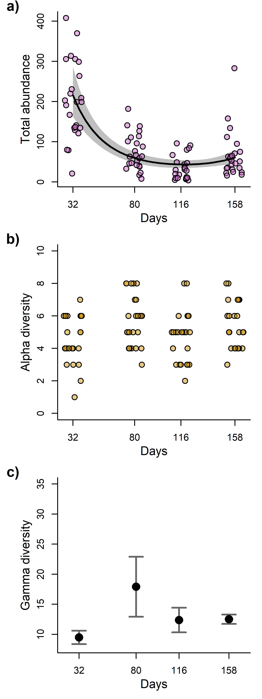<!-- -->

``` r
#dev.off()
```

# Effect of community size, alpha and gamma diversity on observed and expected beta-diversity

``` r
beta_data$alpha <- richness
beta_data$size <- abundance

gamma <- c(rep(inext_coverage_estimated_0$Dataset_1$gamma$Gamma, length(unique(beta_data$sites))),
rep(inext_coverage_estimated_0$Dataset_2$gamma$Gamma, length(unique(beta_data$sites))),
rep(inext_coverage_estimated_0$Dataset_3$gamma$Gamma, length(unique(beta_data$sites))),
rep(inext_coverage_estimated_0$Dataset_4$gamma$Gamma, length(unique(beta_data$sites))))

beta_data$gamma <- gamma

beta_data$size <- scale(beta_data$size)
beta_data$alpha <- scale(beta_data$alpha)
beta_data$gamma <- scale(beta_data$gamma)
```

### Models

``` r
cor(beta_data[,colnames(beta_data) %in% c("alpha","size","gamma")])
```

    ##            alpha        size      gamma
    ## alpha 1.00000000  0.08081435  0.2670127
    ## size  0.08081435  1.00000000 -0.3992352
    ## gamma 0.26701269 -0.39923519  1.0000000

``` r
mod_obs_beta <- glmmTMB(observed_distances ~ alpha + size + gamma + (1|block2/sites), data = beta_data, family = gaussian(link = "identity"), control=glmmTMBControl(optimizer=optim, optArgs=list(method="BFGS")))
plot(simulateResiduals(mod_obs_beta))
```

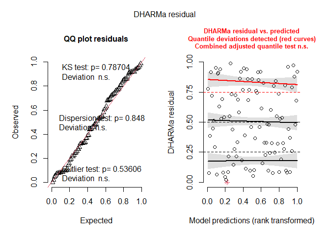<!-- -->

``` r
Anova(mod_obs_beta)
```

    ## Analysis of Deviance Table (Type II Wald chisquare tests)
    ## 
    ## Response: observed_distances
    ##        Chisq Df Pr(>Chisq)  
    ## alpha 4.4171  1    0.03558 *
    ## size  6.2702  1    0.01228 *
    ## gamma 0.7567  1    0.38438  
    ## ---
    ## Signif. codes:  0 '***' 0.001 '**' 0.01 '*' 0.05 '.' 0.1 ' ' 1

``` r
mod_exp_beta <- glmmTMB(expected_distances ~ alpha + size + gamma + (1|block2/sites), data = beta_data, family = gaussian(link = "identity"))
plot(simulateResiduals(mod_exp_beta))
```

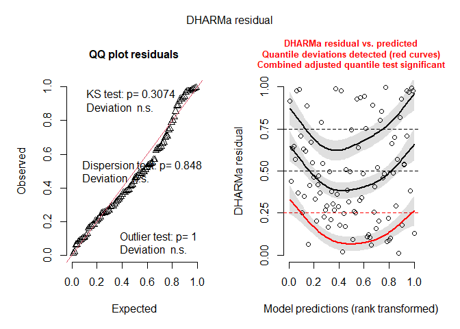<!-- -->

``` r
Anova(mod_exp_beta)
```

    ## Analysis of Deviance Table (Type II Wald chisquare tests)
    ## 
    ## Response: expected_distances
    ##         Chisq Df Pr(>Chisq)    
    ## alpha 10.6942  1  0.0010747 ** 
    ## size  11.7972  1  0.0005932 ***
    ## gamma  0.3743  1  0.5406809    
    ## ---
    ## Signif. codes:  0 '***' 0.001 '**' 0.01 '*' 0.05 '.' 0.1 ' ' 1

``` r
mod_dev_beta <- glmmTMB(deviation_distances ~ alpha + size + gamma + (1|block2/sites), data = beta_data, family = gaussian(link = "identity"))
plot(simulateResiduals(mod_dev_beta))
```

<!-- -->

``` r
Anova(mod_dev_beta)
```

    ## Analysis of Deviance Table (Type II Wald chisquare tests)
    ## 
    ## Response: deviation_distances
    ##        Chisq Df Pr(>Chisq)
    ## alpha 0.0358  1     0.8500
    ## size  0.5893  1     0.4427
    ## gamma 0.2285  1     0.6327

### Plots

``` r
newdata_alpha <- data.frame(alpha = seq(from = min(beta_data$alpha), to = max(beta_data$alpha), length.out = 100),
                            size = rep(mean(beta_data$size), 100),
                            gamma = rep(mean(beta_data$gamma), 100))

newdata_size <- data.frame(alpha = rep(mean(beta_data$alpha), 100),
                            size = seq(from = min(beta_data$size), to = max(beta_data$size), length.out = 100),
                            gamma = rep(mean(beta_data$gamma), 100))


predicted_obs_alpha <- predict(mod_obs_beta, newdata = newdata_alpha, se.fit = TRUE, re.form = NA)
predicted_obs_alpha$upper <- predicted_obs_alpha$fit + predicted_obs_alpha$se.fit * qnorm(0.975)
predicted_obs_alpha$lower <- predicted_obs_alpha$fit + predicted_obs_alpha$se.fit * qnorm(0.025)
predicted_obs_alpha$fit <- predicted_obs_alpha$fit

predicted_exp_alpha <- predict(mod_exp_beta, newdata = newdata_alpha, se.fit = TRUE, re.form = NA)
predicted_exp_alpha$upper <- predicted_exp_alpha$fit + predicted_exp_alpha$se.fit * qnorm(0.975)
predicted_exp_alpha$lower <- predicted_exp_alpha$fit + predicted_exp_alpha$se.fit * qnorm(0.025)
predicted_exp_alpha$fit <- predicted_exp_alpha$fit


predicted_obs_size <- predict(mod_obs_beta, newdata = newdata_size, se.fit = TRUE, re.form = NA)
predicted_obs_size$upper <- predicted_obs_size$fit + predicted_obs_size$se.fit * qnorm(0.975)
predicted_obs_size$lower <- predicted_obs_size$fit + predicted_obs_size$se.fit * qnorm(0.025)
predicted_obs_size$fit <- predicted_obs_size$fit

predicted_exp_size <- predict(mod_exp_beta, newdata = newdata_size, se.fit = TRUE, re.form = NA)
predicted_exp_size$upper <- predicted_exp_size$fit + predicted_exp_size$se.fit * qnorm(0.975)
predicted_exp_size$lower <- predicted_exp_size$fit + predicted_exp_size$se.fit * qnorm(0.025)
predicted_exp_size$fit <- predicted_exp_size$fit
```

``` r
set.seed(1)
#svg(file = "plots/Community structure analysis/beta_dataiation.svg", width = 6, height = 3, pointsize = 8)

par(mfrow = c(2,2))

#####################################################################################################################


par(mar  = c(4,4,1,1), bty = "l", new = FALSE)
plot(observed_distances ~ alpha,
     data = beta_data, xaxt = "n", ylab = "", xlab = "", type = "n")

polygon(x = c(newdata_alpha$alpha[1:100], newdata_alpha$alpha[100:1]),
        y = c(predicted_obs_alpha$upper[1:100], predicted_obs_alpha$lower[100:1]), col = transparent("black", trans.val = 0.6), border = FALSE) 

lines(x = newdata_alpha$alpha,y = predicted_obs_alpha$fit, col = "black", lwd = 2)

points(observed_distances ~ alpha, pch = 21, col= "black",bg = transparent("black", trans.val = 0.6), cex = 1.1, data = beta_data)

title(ylab = "Observed distances", cex.lab = 1.25, line= 2.25)
axis(1)
title(xlab = "Alpha diversity (scaled)", cex.lab = 1.25 ,line = 2.25)


letters(x = 5, y = 97, "a)", cex = 1.5)


par(mar  = c(4,4,1,1), bty = "l", new = FALSE)
plot(expected_distances ~ alpha,
     data = beta_data, xaxt = "n", ylab = "", xlab = "", type = "n")

polygon(x = c(newdata_alpha$alpha[1:100], newdata_alpha$alpha[100:1]),
        y = c(predicted_exp_alpha$upper[1:100], predicted_exp_alpha$lower[100:1]), col = transparent("black", trans.val = 0.6), border = FALSE) 

lines(x = newdata_alpha$alpha,y = predicted_exp_alpha$fit, col = "black", lwd = 2)

points(expected_distances ~ alpha, pch = 21, col= "black",bg = transparent("black", trans.val = 0.6), cex = 1.1, data = beta_data)

title(ylab = "Expected distances", cex.lab = 1.25, line= 2.25)
axis(1)
title(xlab = "Alpha diversity (scaled)", cex.lab = 1.25 ,line = 2.25)


letters(x = 5, y = 97, "b)", cex = 1.5)


par(mar  = c(4,4,1,1), bty = "l", new = FALSE)
plot(observed_distances ~ size,
     data = beta_data, xaxt = "n", ylab = "", xlab = "", type = "n")

polygon(x = c(newdata_size$size[1:100], newdata_size$size[100:1]),
        y = c(predicted_obs_size$upper[1:100], predicted_obs_size$lower[100:1]), col = transparent("black", trans.val = 0.6), border = FALSE) 

lines(x = newdata_size$size,y = predicted_obs_size$fit, col = "black", lwd = 2)

points(observed_distances ~ size, pch = 21, col= "black",bg = transparent("black", trans.val = 0.6), cex = 1.1, data = beta_data)

title(ylab = "Observed distances", cex.lab = 1.25, line= 2.25)
axis(1)
title(xlab = "Community size (scaled)", cex.lab = 1.25 ,line = 2.25)


letters(x = 5, y = 97, "c)", cex = 1.5)


par(mar  = c(4,4,1,1), bty = "l", new = FALSE)
plot(expected_distances ~ size,
     data = beta_data, xaxt = "n", ylab = "", xlab = "", type = "n")

polygon(x = c(newdata_size$size[1:100], newdata_size$size[100:1]),
        y = c(predicted_exp_size$upper[1:100], predicted_exp_size$lower[100:1]), col = transparent("black", trans.val = 0.6), border = FALSE) 

lines(x = newdata_size$size,y = predicted_exp_size$fit, col = "black", lwd = 2)

points(expected_distances ~ size, pch = 21, col= "black",bg = transparent("black", trans.val = 0.6), cex = 1.1, data = beta_data)

title(ylab = "Expected distances", cex.lab = 1.25, line= 2.25)
axis(1)
title(xlab = "Community size (scaled)", cex.lab = 1.25 ,line = 2.25)


letters(x = 5, y = 97, "d)", cex = 1.5)
```

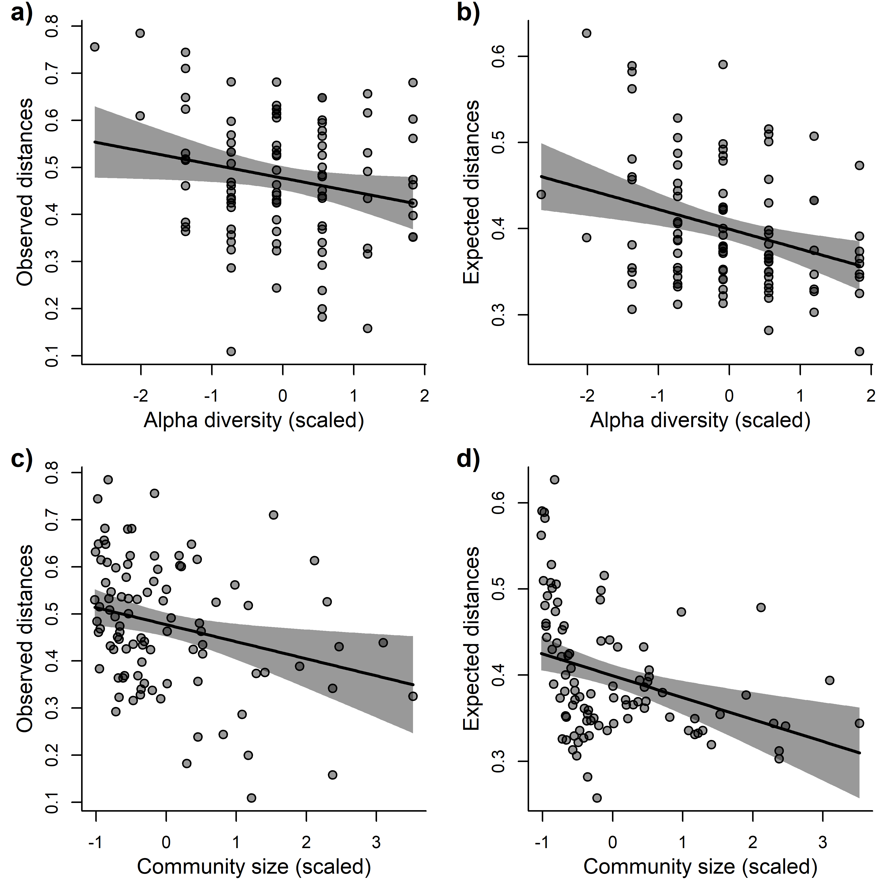<!-- -->

``` r
#dev.off()
```

# Environmental variability

Preparing data

``` r
Env$AM_match <- rep(NA, nrow(Env))

Env$AM_match[Env$amostragem == 2] <- 1
Env$AM_match[Env$amostragem == 5] <- 2
Env$AM_match[Env$amostragem == 7] <- 3
Env$AM_match[Env$amostragem == 9] <- 4

Env <- Env[is.na(Env$AM_match)==FALSE,]
```

Replace temperature information with the HOBOs temperature information,
which is much more accurate

``` r
hobo_env <- read.csv(paste(sep = "/",dir,"data/hobo_env.csv"))

index_env <- interaction(Env$id, Env$AM_match)
index_hobo <- interaction(hobo_env$ID, hobo_env$AM)

index <- match(index_env, index_hobo)
hobo_env <- hobo_env[index,]

#data.frame(Env$id, hobo_env$ID, Env$AM_match, hobo_env$AM)

Env$hobo_temp <- hobo_env$temp_mean
Env$iluminance <- hobo_env$light_mean


Env <- Env[,-which(colnames(Env) == "Temperatura")]
```

``` r
Exp_design_all_2$site_AM <- interaction(Exp_design_all_2$sites, Exp_design_all_2$AM)
Env$site_AM <- interaction(Env$id, Env$AM_match)


Env_2 <- Env[Env$Tratamento != "atrasado",]
Env_2 <- Env_2[match(Exp_design_all_2$site_AM, Env_2$site_AM),]

nrow(Env_2)
```

    ## [1] 96

``` r
nrow(Exp_design_all_2)
```

    ## [1] 96

Environmental variability

``` r
only_Env <- Env_2[,colnames(Env_2) %in% c("pH","OD","Condutividade","TDS","hobo_temp","iluminance")]

only_Env_st <- decostand(only_Env, method = "stand")

dist_env <- vegdist(only_Env_st, method = "euclidean")

env_var <- betadisper(dist_env, group = Env_2$AM_match)
```

PCA

``` r
pca_env <- rda(only_Env_st)

env_eigenvalues <- pca_env$CA$eig / sum(pca_env$CA$eig)
env_eigenvalues
```

    ##         PC1         PC2         PC3         PC4         PC5         PC6 
    ## 0.441964059 0.197021364 0.187784925 0.143153777 0.024725197 0.005350678

``` r
env_PCs <- pca_env$CA$u

pca_env$CA$v
```

    ##                     PC1         PC2         PC3         PC4         PC5
    ## pH            0.2967660  0.71220863  0.26916082  0.22737789 -0.52296302
    ## OD            0.1384326 -0.13356116  0.89333537  0.09228730  0.37776146
    ## Condutividade 0.5272558 -0.41765478 -0.08956272  0.13659492 -0.35700569
    ## TDS           0.5570725 -0.35007756 -0.04735948  0.11799152 -0.01455984
    ## hobo_temp     0.4761465  0.41072176 -0.33083168  0.09693367  0.67139300
    ## iluminance    0.2787875  0.09611507  0.09894625 -0.94752628 -0.07329629
    ##                        PC6
    ## pH            -0.083965759
    ## OD             0.117171160
    ## Condutividade  0.627242483
    ## TDS           -0.742117923
    ## hobo_temp      0.187023703
    ## iluminance     0.008405952

First PC is basically related to conductivity, total dissolved solids
and temperature Second PC is basically related to pH Third PC is
basically related to dissolved oxygen

## Test of environmental effect on community variability

Effect of environmental variability on observed community variability

``` r
Exp_design_all_2$env_var <- env_var$distances

mod_obs_am_num_env <- glmmTMB(beta_data$observed_distances ~ AM_days_st + env_var + (1|block2/sites), data = Exp_design_all_2, control = glmmTMBControl(optimizer=optim, optArgs=list(method="BFGS")))
```

    ## Warning in glmmTMB(beta_data$observed_distances ~ AM_days_st + env_var + : use
    ## of the '$' operator in formulas is not recommended

``` r
plot(simulateResiduals(mod_obs_am_num_env))
```

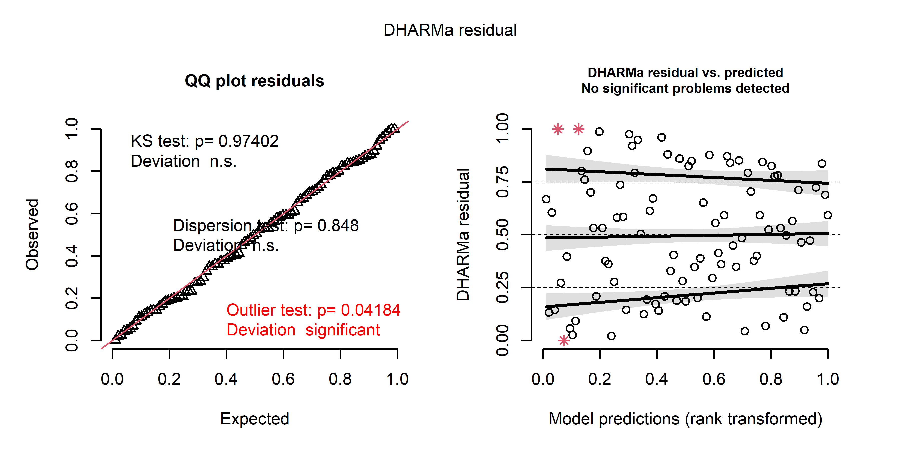<!-- -->

``` r
Anova(mod_obs_am_num_env)
```

    ## Analysis of Deviance Table (Type II Wald chisquare tests)
    ## 
    ## Response: beta_data$observed_distances
    ##              Chisq Df Pr(>Chisq)   
    ## AM_days_st 10.2536  1   0.001364 **
    ## env_var     0.5045  1   0.477549   
    ## ---
    ## Signif. codes:  0 '***' 0.001 '**' 0.01 '*' 0.05 '.' 0.1 ' ' 1

Effect of environmental predictors on observed community variability

``` r
mod_obs_env_pcs <- glmmTMB(beta_data$observed_distances ~ AM_days_st + (1|block2/sites) + 
                            env_PCs[,1] +
                            env_PCs[,2] + 
                            env_PCs[,3], data = Exp_design_all_2, control = glmmTMBControl(optimizer=optim, optArgs=list(method="BFGS")))
```

    ## Warning in glmmTMB(beta_data$observed_distances ~ AM_days_st + (1 |
    ## block2/sites) + : use of the '$' operator in formulas is not recommended

``` r
Anova(mod_obs_env_pcs)
```

    ## Analysis of Deviance Table (Type II Wald chisquare tests)
    ## 
    ## Response: beta_data$observed_distances
    ##               Chisq Df Pr(>Chisq)
    ## AM_days_st   1.8190  1     0.1774
    ## env_PCs[, 1] 0.0001  1     0.9942
    ## env_PCs[, 2] 0.1869  1     0.6655
    ## env_PCs[, 3] 1.6476  1     0.1993

Effect of environmental variability on beta deviation

``` r
Exp_design_all_2$env_var <- env_var$distances

mod_dev_am_num_env <- glmmTMB(beta_data$deviation_distances ~ AM_days_st + env_var + (1|block2/sites), data = Exp_design_all_2, control = glmmTMBControl(optimizer=optim, optArgs=list(method="BFGS")))
```

    ## Warning in glmmTMB(beta_data$deviation_distances ~ AM_days_st + env_var + : use
    ## of the '$' operator in formulas is not recommended

``` r
plot(simulateResiduals(mod_dev_am_num_env))
```

<!-- -->

``` r
Anova(mod_dev_am_num_env)
```

    ## Analysis of Deviance Table (Type II Wald chisquare tests)
    ## 
    ## Response: beta_data$deviation_distances
    ##              Chisq Df Pr(>Chisq)    
    ## AM_days_st 12.8305  1   0.000341 ***
    ## env_var     0.3835  1   0.535728    
    ## ---
    ## Signif. codes:  0 '***' 0.001 '**' 0.01 '*' 0.05 '.' 0.1 ' ' 1

Effect of environmental predictors on beta deviation

``` r
mod_dev_env_pcs <- glmmTMB(beta_data$deviation_distances ~ AM_days_st + (1|block2/sites) + 
                            env_PCs[,1] +
                            env_PCs[,2] + 
                            env_PCs[,3], data = Exp_design_all_2, control = glmmTMBControl(optimizer=optim, optArgs=list(method="BFGS")))
```

    ## Warning in glmmTMB(beta_data$deviation_distances ~ AM_days_st + (1 |
    ## block2/sites) + : use of the '$' operator in formulas is not recommended

``` r
plot(simulateResiduals(mod_dev_env_pcs))
```

<!-- -->

``` r
Anova(mod_dev_env_pcs)
```

    ## Analysis of Deviance Table (Type II Wald chisquare tests)
    ## 
    ## Response: beta_data$deviation_distances
    ##               Chisq Df Pr(>Chisq)  
    ## AM_days_st   2.1327  1    0.14419  
    ## env_PCs[, 1] 0.0190  1    0.89034  
    ## env_PCs[, 2] 2.3001  1    0.12937  
    ## env_PCs[, 3] 3.3828  1    0.06588 .
    ## ---
    ## Signif. codes:  0 '***' 0.001 '**' 0.01 '*' 0.05 '.' 0.1 ' ' 1

## Test of the effect of time om environmental parameters

Effect of time on environmental variability

``` r
env_var <- env_var$distances

mod_env_null <- glmmTMB(env_var ~ 1 + (1|block2/sites), data = Exp_design_all_2, control = glmmTMBControl(optimizer=optim, optArgs=list(method="BFGS")))

mod_env_am_num <- glmmTMB(env_var ~ AM_days_st + (1|block2/sites), data = Exp_design_all_2, control = glmmTMBControl(optimizer=optim, optArgs=list(method="BFGS")))

mod_env_am_num_quad <- glmmTMB(env_var ~ AM_days_st + AM_days_st_quad + (1|block2/sites), data = Exp_design_all_2)

plot(simulateResiduals(mod_env_am_num_quad))
```

<!-- -->

``` r
anova_env <- anova(mod_env_null, mod_env_am_num, mod_env_am_num_quad)
anova_env
```

    ## Data: Exp_design_all_2
    ## Models:
    ## mod_env_null: env_var ~ 1 + (1 | block2/sites), zi=~0, disp=~1
    ## mod_env_am_num: env_var ~ AM_days_st + (1 | block2/sites), zi=~0, disp=~1
    ## mod_env_am_num_quad: env_var ~ AM_days_st + AM_days_st_quad + (1 | block2/sites), zi=~0, disp=~1
    ##                     Df    AIC    BIC  logLik deviance  Chisq Chi Df Pr(>Chisq)
    ## mod_env_null         4 193.37 203.63 -92.684   185.37                         
    ## mod_env_am_num       5 195.33 208.16 -92.667   185.33 0.0351      1     0.8514
    ## mod_env_am_num_quad  6 195.29 210.67 -91.643   183.29 2.0473      1     0.1525

Now environmental PCs

``` r
mod_env1_pcs_null <- glmmTMB(env_PCs[,1] ~ 1 + (1|block2/sites), data = Exp_design_all_2)
mod_env1_pcs_lin <- glmmTMB(env_PCs[,1] ~ AM_days_st + (1|block2/sites), data = Exp_design_all_2)
mod_env1_pcs_quad <- glmmTMB(env_PCs[,1] ~ AM_days_st + AM_days_st_quad + (1|block2/sites), data = Exp_design_all_2)

plot(simulateResiduals(mod_env1_pcs_quad))
```

<!-- -->

``` r
anova(mod_env1_pcs_null, mod_env1_pcs_lin, mod_env1_pcs_quad)
```

    ## Data: Exp_design_all_2
    ## Models:
    ## mod_env1_pcs_null: env_PCs[, 1] ~ 1 + (1 | block2/sites), zi=~0, disp=~1
    ## mod_env1_pcs_lin: env_PCs[, 1] ~ AM_days_st + (1 | block2/sites), zi=~0, disp=~1
    ## mod_env1_pcs_quad: env_PCs[, 1] ~ AM_days_st + AM_days_st_quad + (1 | block2/sites), zi=~0, disp=~1
    ##                   Df     AIC     BIC  logLik deviance   Chisq Chi Df Pr(>Chisq)
    ## mod_env1_pcs_null  4 -157.74 -147.48  82.871  -165.74                          
    ## mod_env1_pcs_lin   5 -312.87 -300.05 161.437  -322.87 157.132      1  < 2.2e-16
    ## mod_env1_pcs_quad  6 -327.56 -312.18 169.780  -339.56  16.687      1  4.408e-05
    ##                      
    ## mod_env1_pcs_null    
    ## mod_env1_pcs_lin  ***
    ## mod_env1_pcs_quad ***
    ## ---
    ## Signif. codes:  0 '***' 0.001 '**' 0.01 '*' 0.05 '.' 0.1 ' ' 1

``` r
Exp_design_all_2$AM_days_st_third <- Exp_design_all_2$AM_days_st^3

mod_env2_pcs_null <- glmmTMB(env_PCs[,2] ~ 1 + (1|block2/sites), data = Exp_design_all_2)
mod_env2_pcs_lin <- glmmTMB(env_PCs[,2] ~ AM_days_st + (1|block2/sites), data = Exp_design_all_2)
mod_env2_pcs_quad <- glmmTMB(env_PCs[,2] ~ AM_days_st + AM_days_st_quad + (1|block2/sites), data = Exp_design_all_2)
mod_env2_pcs_third <- glmmTMB(env_PCs[,2] ~ AM_days_st + AM_days_st_quad + AM_days_st_third + (1|block2/sites), data = Exp_design_all_2)

plot(simulateResiduals(mod_env2_pcs_third))
```

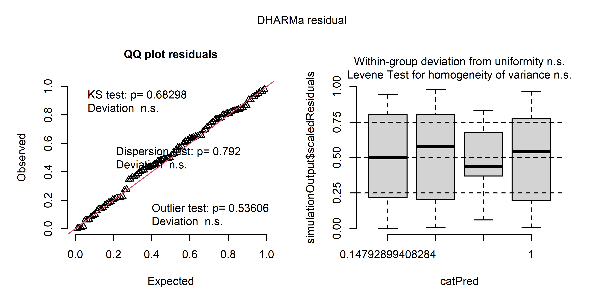<!-- -->

``` r
anova(mod_env2_pcs_null, mod_env2_pcs_lin, mod_env2_pcs_quad,mod_env2_pcs_third)
```

    ## Data: Exp_design_all_2
    ## Models:
    ## mod_env2_pcs_null: env_PCs[, 2] ~ 1 + (1 | block2/sites), zi=~0, disp=~1
    ## mod_env2_pcs_lin: env_PCs[, 2] ~ AM_days_st + (1 | block2/sites), zi=~0, disp=~1
    ## mod_env2_pcs_quad: env_PCs[, 2] ~ AM_days_st + AM_days_st_quad + (1 | block2/sites), zi=~0, disp=~1
    ## mod_env2_pcs_third: env_PCs[, 2] ~ AM_days_st + AM_days_st_quad + AM_days_st_third + , zi=~0, disp=~1
    ## mod_env2_pcs_third:     (1 | block2/sites), zi=~0, disp=~1
    ##                    Df     AIC     BIC  logLik deviance    Chisq Chi Df
    ## mod_env2_pcs_null   4 -157.74 -147.48  82.871  -165.74                
    ## mod_env2_pcs_lin    5 -155.76 -142.94  82.879  -165.76   0.0172      1
    ## mod_env2_pcs_quad   6 -172.29 -156.91  92.147  -184.29  18.5351      1
    ## mod_env2_pcs_third  7 -362.65 -344.70 188.324  -376.65 192.3553      1
    ##                    Pr(>Chisq)    
    ## mod_env2_pcs_null                
    ## mod_env2_pcs_lin       0.8956    
    ## mod_env2_pcs_quad   1.668e-05 ***
    ## mod_env2_pcs_third  < 2.2e-16 ***
    ## ---
    ## Signif. codes:  0 '***' 0.001 '**' 0.01 '*' 0.05 '.' 0.1 ' ' 1

``` r
mod_env3_pcs_null <- glmmTMB(env_PCs[,3] ~ 1 + (1|block2/sites), data = Exp_design_all_2)
mod_env3_pcs_lin <- glmmTMB(env_PCs[,3] ~ AM_days_st + (1|block2/sites), data = Exp_design_all_2)
mod_env3_pcs_quad <- glmmTMB(env_PCs[,3] ~ AM_days_st + AM_days_st_quad + (1|block2/sites), data = Exp_design_all_2)

plot(simulateResiduals(mod_env3_pcs_quad))
```

<!-- -->

``` r
anova(mod_env3_pcs_null, mod_env3_pcs_lin, mod_env3_pcs_quad)
```

    ## Data: Exp_design_all_2
    ## Models:
    ## mod_env3_pcs_null: env_PCs[, 3] ~ 1 + (1 | block2/sites), zi=~0, disp=~1
    ## mod_env3_pcs_lin: env_PCs[, 3] ~ AM_days_st + (1 | block2/sites), zi=~0, disp=~1
    ## mod_env3_pcs_quad: env_PCs[, 3] ~ AM_days_st + AM_days_st_quad + (1 | block2/sites), zi=~0, disp=~1
    ##                   Df     AIC     BIC logLik deviance  Chisq Chi Df Pr(>Chisq)  
    ## mod_env3_pcs_null  4 -157.86 -147.60 82.931  -165.86                           
    ## mod_env3_pcs_lin   5 -161.66 -148.83 85.828  -171.66 5.7944      1    0.01608 *
    ## mod_env3_pcs_quad  6 -164.32 -148.94 88.161  -176.32 4.6656      1    0.03077 *
    ## ---
    ## Signif. codes:  0 '***' 0.001 '**' 0.01 '*' 0.05 '.' 0.1 ' ' 1

## Test of the effect environmental parameters (without the effects of time) on community variability

Basically all environmental predictors vary throughout time. We took the
residual of such models e checked if those residuals can explain
community variability alongside with time.

``` r
Exp_design_all_2$resid_PC1 <- residuals(mod_env1_pcs_quad)
Exp_design_all_2$resid_PC2 <- residuals(mod_env2_pcs_third)
Exp_design_all_2$resid_PC3 <- residuals(mod_env3_pcs_quad)


mod_obs_env_pcs <- glmmTMB(beta_data$observed_distances ~ (1|block2/sites) + AM_days_st +
                            resid_PC1 +
                            resid_PC2 + 
                            resid_PC3, data = Exp_design_all_2, control = glmmTMBControl(optimizer=optim, optArgs=list(method="BFGS")))
```

    ## Warning in glmmTMB(beta_data$observed_distances ~ (1 | block2/sites) +
    ## AM_days_st + : use of the '$' operator in formulas is not recommended

``` r
plot(simulateResiduals(mod_obs_env_pcs))
```

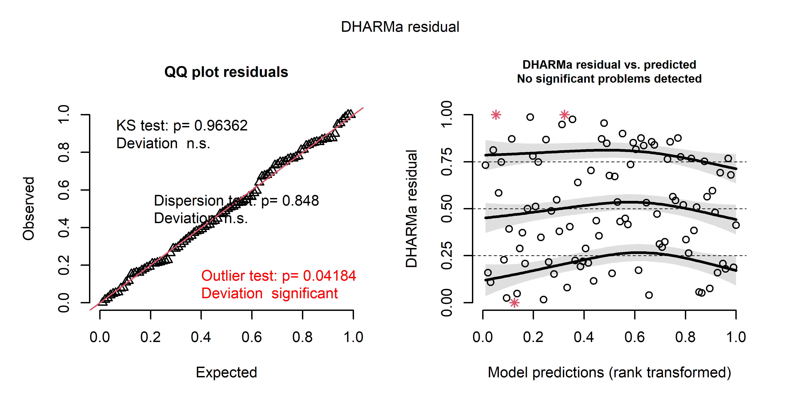<!-- -->

``` r
Anova(mod_obs_env_pcs)
```

    ## Analysis of Deviance Table (Type II Wald chisquare tests)
    ## 
    ## Response: beta_data$observed_distances
    ##              Chisq Df Pr(>Chisq)   
    ## AM_days_st 10.3452  1   0.001298 **
    ## resid_PC1   0.0790  1   0.778646   
    ## resid_PC2   0.4417  1   0.506307   
    ## resid_PC3   1.8167  1   0.177712   
    ## ---
    ## Signif. codes:  0 '***' 0.001 '**' 0.01 '*' 0.05 '.' 0.1 ' ' 1

``` r
mod_dev_env_pcs <- glmmTMB(beta_data$deviation_distances ~ (1|block2/sites) + AM_days_st +
                            resid_PC1 +
                            resid_PC2 + 
                            resid_PC3, data = Exp_design_all_2)
```

    ## Warning in glmmTMB(beta_data$deviation_distances ~ (1 | block2/sites) + : use
    ## of the '$' operator in formulas is not recommended

``` r
plot(simulateResiduals(mod_dev_env_pcs))
```

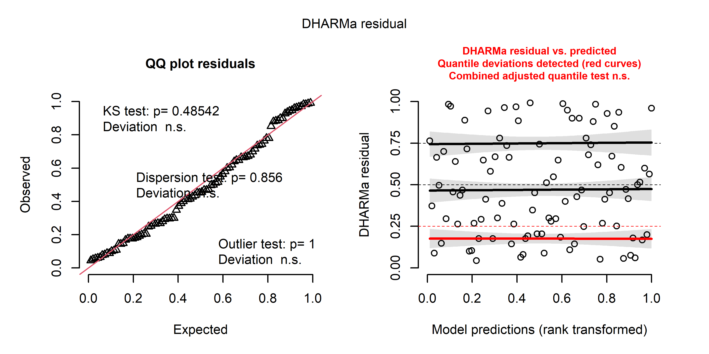<!-- -->

``` r
Anova(mod_dev_env_pcs)
```

    ## Analysis of Deviance Table (Type II Wald chisquare tests)
    ## 
    ## Response: beta_data$deviation_distances
    ##              Chisq Df Pr(>Chisq)    
    ## AM_days_st 13.4173  1  0.0002493 ***
    ## resid_PC1   0.0215  1  0.8834524    
    ## resid_PC2   0.5339  1  0.4649529    
    ## resid_PC3   1.8029  1  0.1793641    
    ## ---
    ## Signif. codes:  0 '***' 0.001 '**' 0.01 '*' 0.05 '.' 0.1 ' ' 1

### Making predictons

``` r
new_data_days$AM_days_st_third <- new_data_days$AM_days_st^3

predicted_env_PC1_time <- predict(mod_env1_pcs_quad, newdata = new_data_days, se.fit = TRUE, re.form = NA)
predicted_env_PC1_time$upper <- predicted_env_PC1_time$fit + predicted_env_PC1_time$se.fit * qnorm(0.975)
predicted_env_PC1_time$lower <- predicted_env_PC1_time$fit + predicted_env_PC1_time$se.fit * qnorm(0.025) 

predicted_env_PC2_time <- predict(mod_env2_pcs_third, newdata = new_data_days, se.fit = TRUE, re.form = NA)
predicted_env_PC2_time$upper <- predicted_env_PC2_time$fit + predicted_env_PC2_time$se.fit * qnorm(0.975)
predicted_env_PC2_time$lower <- predicted_env_PC2_time$fit + predicted_env_PC2_time$se.fit * qnorm(0.025) 

predicted_env_PC3_time <- predict(mod_env3_pcs_quad, newdata = new_data_days, se.fit = TRUE, re.form = NA)
predicted_env_PC3_time$upper <- predicted_env_PC3_time$fit + predicted_env_PC3_time$se.fit * qnorm(0.975)
predicted_env_PC3_time$lower <- predicted_env_PC3_time$fit + predicted_env_PC3_time$se.fit * qnorm(0.025) 


new_data_obs_PC3 <- new_data_days
new_data_obs_PC3$resid_PC3 <- seq(from = min(Exp_design_all_2$resid_PC3), to = max(Exp_design_all_2$resid_PC3), length.out = nrow(new_data_obs_PC3))
new_data_obs_PC3$resid_PC2 <- rep(median(Exp_design_all_2$resid_PC2), nrow(new_data_obs_PC3))
new_data_obs_PC3$resid_PC1 <- rep(median(Exp_design_all_2$resid_PC1), nrow(new_data_obs_PC3))
new_data_obs_PC3$AM_days_st <- rep(median(new_data_obs_PC3$AM_days_st), nrow(new_data_obs_PC3))
new_data_obs_PC3$AM_days_st_quad <- new_data_obs_PC3$AM_days_st^2


predicted_obs_PC3 <- predict(mod_obs_env_pcs, newdata = new_data_obs_PC3, se.fit =  TRUE, re.form = NA)
predicted_obs_PC3$upper <- predicted_obs_PC3$fit + predicted_obs_PC3$se.fit * qnorm(0.975)
predicted_obs_PC3$lower <- predicted_obs_PC3$fit + predicted_obs_PC3$se.fit * qnorm(0.025) 

predicted_dev_PC3 <- predict(mod_dev_env_pcs, newdata = new_data_obs_PC3, se.fit =  TRUE, re.form = NA)
predicted_dev_PC3$upper <- predicted_dev_PC3$fit + predicted_dev_PC3$se.fit * qnorm(0.975)
predicted_dev_PC3$lower <- predicted_dev_PC3$fit + predicted_dev_PC3$se.fit * qnorm(0.025) 
```

### Plots

#### Environmental variability VS community variability

``` r
set.seed(1)
#svg(file = "plots/Community structure analysis/beta_dataiation.svg", width = 6, height = 3, pointsize = 8)

par(mfrow = c(1,2))

par(mar  = c(4,4,1,1), bty = "l", new = FALSE)
plot(beta_data$observed_distances ~ env_var,
     data = Exp_design_all_2, xaxt = "n", ylab = "", xlab = "", type = "n")


points(beta_data$observed_distances[Exp_design_all_2$AM == 1] ~ env_var, pch = 21, col= "black",bg = transparent("grey80", trans.val = 0.6), cex = 1.1, data = Exp_design_all_2[Exp_design_all_2$AM == 1,])

points(beta_data$observed_distances[Exp_design_all_2$AM == 2] ~ env_var, pch = 21, col= "black",bg = transparent("grey50", trans.val = 0.6), cex = 1.1, data = Exp_design_all_2[Exp_design_all_2$AM == 2,])

points(beta_data$observed_distances[Exp_design_all_2$AM == 3] ~ env_var, pch = 21, col= "black",bg = transparent("grey20", trans.val = 0.6), cex = 1.1, data = Exp_design_all_2[Exp_design_all_2$AM == 3,])

points(beta_data$observed_distances[Exp_design_all_2$AM == 4] ~ env_var, pch = 21, col= "black",bg = transparent("black", trans.val = 0.6), cex = 1.1, data = Exp_design_all_2[Exp_design_all_2$AM == 4,])

title(ylab = "Observed community variability", cex.lab = 1.25, line= 2.25)
axis(1)
title(xlab = "Environmental variability", cex.lab = 1.25 ,line = 2.25)

par(new = TRUE, mar = c(0,0,0,0), bty = "n")
plot(NA, ylim = c(0,100), xlim = c(0,100), xaxt = "n", yaxt = "n")

legend(legend = c("32 days",
                  "80 days",
                  "116 days",
                  "158 days"), x = 100, y = 100, bty = "n", pch = 21, col = "black", pt.bg = c(transparent("grey80", trans.val = 0.6),
                                                                                              transparent("grey50", trans.val = 0.6),
                                                                                              transparent("grey20", trans.val = 0.6),
                                                                                              transparent("black", trans.val = 0.6)), xjust = 1, yjust = 1)

letters(x = 5, y = 97, "a)", cex = 1.5)

#####################################################################################################################


par(mar  = c(4,4,1,1), bty = "l", new = FALSE)
plot(beta_data$deviation_distances ~ env_var,
     data = Exp_design_all_2, xaxt = "n", ylab = "", xlab = "", type = "n")


points(beta_data$deviation_distances[Exp_design_all_2$AM == 1] ~ env_var, pch = 21, col= "black",bg = transparent("grey80", trans.val = 0.6), cex = 1.1, data = Exp_design_all_2[Exp_design_all_2$AM == 1,])

points(beta_data$deviation_distances[Exp_design_all_2$AM == 2] ~ env_var, pch = 21, col= "black",bg = transparent("grey50", trans.val = 0.6), cex = 1.1, data = Exp_design_all_2[Exp_design_all_2$AM == 2,])

points(beta_data$deviation_distances[Exp_design_all_2$AM == 3] ~ env_var, pch = 21, col= "black",bg = transparent("grey20", trans.val = 0.6), cex = 1.1, data = Exp_design_all_2[Exp_design_all_2$AM == 3,])

points(beta_data$deviation_distances[Exp_design_all_2$AM == 4] ~ env_var, pch = 21, col= "black",bg = transparent("black", trans.val = 0.6), cex = 1.1, data = Exp_design_all_2[Exp_design_all_2$AM == 4,])

title(ylab = "Beta deviation", cex.lab = 1.25, line= 2.25)
axis(1)
title(xlab = "Environmental variability", cex.lab = 1.25 ,line = 2.25)


letters(x = 5, y = 97, "b)", cex = 1.5)
```

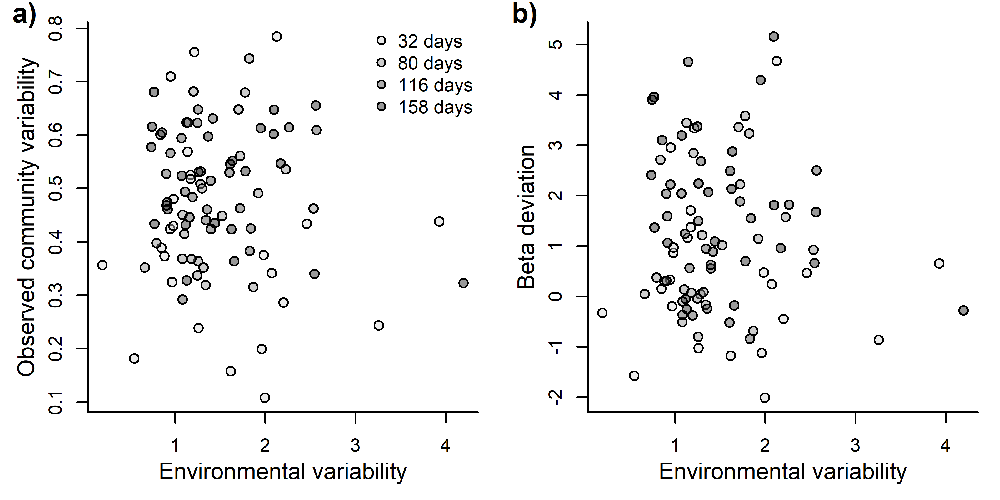<!-- -->

``` r
#dev.off()
```

#### Environmental parameters VS time

``` r
set.seed(1)
#svg(file = "plots/Community structure analysis/beta_dataiation.svg", width = 6, height = 3, pointsize = 8)

par(mfrow = c(3,1))

unique_AM_days_st <- unique(Exp_design_all_2$AM_days_st)
unique_AM_days_st_orig <- unique(Exp_design_all_2$AM_days_st_orig)


par(mar  = c(4,5,1,1), bty = "l", new = FALSE)
plot(env_PCs[,1] ~ jitter(AM_days_st, 1),
     data = Exp_design_all_2, xaxt = "n", ylab = "", xlab = "", type = "n", xlim = c(min(unique_AM_days_st)*1.25,max(unique_AM_days_st)*1.25),  xaxs = "i")

polygon(x = c(new_data_days$AM_days_st[1:100], new_data_days$AM_days_st[100:1]),
        y = c(predicted_env_PC1_time$upper[1:100], predicted_env_PC1_time$lower[100:1]), col = transparent("blue", trans.val = 0.6), border = FALSE) 

points(env_PCs[,1] ~ jitter(AM_days_st, 0.5), pch = 21, col= "black",bg = transparent("blue", trans.val = 0.75), cex = 1.1, data = Exp_design_all_2)

lines(x = new_data_days$AM_days_st,y = predicted_env_PC1_time$fit, col = "black", lwd = 2)

title(ylab = "Environment PC1", cex.lab = 1, line= 4)
title(ylab = "(mostly Conductivity, total", cex.lab = 1, line= 3)
title(ylab = "dissolved solids and temperature)", cex.lab = 1, line= 2)

axis(1, at = unique_AM_days_st, labels = c("32", "80", "116", "158"))
title(xlab = "Days", cex.lab = 1.25 ,line = 2.25)

letters(x = 5, y = 97, "a)", cex = 1.5)

##############################################################################################


par(mar  = c(4,5,1,1), bty = "l", new = FALSE)
plot(env_PCs[,2] ~ jitter(AM_days_st, 1),
     data = Exp_design_all_2, xaxt = "n", ylab = "", xlab = "", type = "n", xlim = c(min(unique_AM_days_st)*1.25,max(unique_AM_days_st)*1.25),  xaxs = "i")

polygon(x = c(new_data_days$AM_days_st[1:100], new_data_days$AM_days_st[100:1]),
        y = c(predicted_env_PC2_time$upper[1:100], predicted_env_PC2_time$lower[100:1]), col = transparent("blue", trans.val = 0.6), border = FALSE) 

points(env_PCs[,2] ~ jitter(AM_days_st, 0.5), pch = 21, col= "black",bg = transparent("blue", trans.val = 0.75), cex = 1.1, data = Exp_design_all_2)

lines(x = new_data_days$AM_days_st,y = predicted_env_PC2_time$fit, col = "black", lwd = 2)

title(ylab = "Environment PC2", cex.lab = 1, line= 3)
title(ylab = "(mostly pH)", cex.lab = 1, line= 2)

axis(1, at = unique_AM_days_st, labels = c("32", "80", "116", "158"))
title(xlab = "Days", cex.lab = 1.25 ,line = 2.25)

letters(x = 5, y = 97, "b)", cex = 1.5)


##############################################################################################


par(mar  = c(4,5,1,1), bty = "l", new = FALSE)
plot(env_PCs[,3] ~ jitter(AM_days_st, 1),
     data = Exp_design_all_2, xaxt = "n", ylab = "", xlab = "", type = "n", xlim = c(min(unique_AM_days_st)*1.25,max(unique_AM_days_st)*1.25),  xaxs = "i")

polygon(x = c(new_data_days$AM_days_st[1:100], new_data_days$AM_days_st[100:1]),
        y = c(predicted_env_PC3_time$upper[1:100], predicted_env_PC3_time$lower[100:1]), col = transparent("blue", trans.val = 0.6), border = FALSE) 

points(env_PCs[,3] ~ jitter(AM_days_st, 0.5), pch = 21, col= "black",bg = transparent("blue", trans.val = 0.75), cex = 1.1, data = Exp_design_all_2)

lines(x = new_data_days$AM_days_st,y = predicted_env_PC3_time$fit, col = "black", lwd = 2)

title(ylab = "Environment PC3", cex.lab = 1, line= 3)
title(ylab = "(mostly dissolved oxygen)", cex.lab = 1, line= 2)

axis(1, at = unique_AM_days_st, labels = c("32", "80", "116", "158"))
title(xlab = "Days", cex.lab = 1.25 ,line = 2.25)

letters(x = 5, y = 97, "c)", cex = 1.5)
```

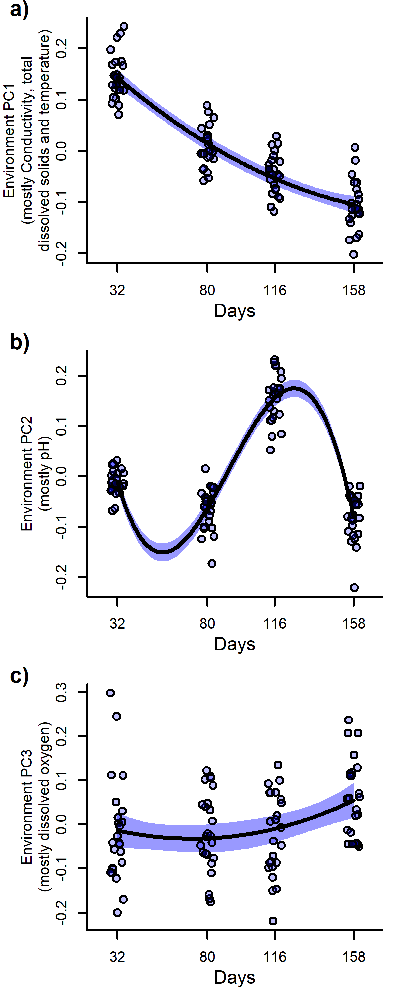<!-- -->

#### Environmental parameters VS community variability

``` r
set.seed(1)
#svg(file = "plots/Community structure analysis/beta_dataiation.svg", width = 6, height = 3, pointsize = 8)

par(mfrow = c(1,2))

par(mar  = c(4,4,1,1), bty = "l", new = FALSE)
plot(beta_data$observed_distances ~ resid_PC3,
     data = Exp_design_all_2, xaxt = "n", ylab = "", xlab = "", type = "n")

polygon(x = c(new_data_obs_PC3$resid_PC3[1:100], new_data_obs_PC3$resid_PC3[100:1]),
        y = c(predicted_obs_PC3$upper[1:100], predicted_obs_PC3$lower[100:1]), col = transparent("grey20", trans.val = 0.6), border = FALSE) 

points(beta_data$observed_distances[Exp_design_all_2$AM == 1] ~ resid_PC3, pch = 21, col= "black",bg = transparent("grey80", trans.val = 0.6), cex = 1.1, data = Exp_design_all_2[Exp_design_all_2$AM == 1,])

points(beta_data$observed_distances[Exp_design_all_2$AM == 2] ~ resid_PC3, pch = 21, col= "black",bg = transparent("grey50", trans.val = 0.6), cex = 1.1, data = Exp_design_all_2[Exp_design_all_2$AM == 2,])

points(beta_data$observed_distances[Exp_design_all_2$AM == 3] ~ resid_PC3, pch = 21, col= "black",bg = transparent("grey20", trans.val = 0.6), cex = 1.1, data = Exp_design_all_2[Exp_design_all_2$AM == 3,])

points(beta_data$observed_distances[Exp_design_all_2$AM == 4] ~ resid_PC3, pch = 21, col= "black",bg = transparent("black", trans.val = 0.6), cex = 1.1, data = Exp_design_all_2[Exp_design_all_2$AM == 4,])

lines(x = new_data_obs_PC3$resid_PC3,y = predicted_obs_PC3$fit, col = "black", lwd = 2, lty = 2)


title(ylab = "Observed community variability", cex.lab = 1.25, line= 2.25)
axis(1)
title(xlab = "Residuals of environmental PC3", cex.lab = 1 ,line = 2)
title(xlab = "(Dissolved oxygen without temporal effects)", cex.lab = 0.9 ,line = 3)


letters(x = 5, y = 97, "a)", cex = 1.5)

#####################################################################################################################


par(mar  = c(4,4,1,1), bty = "l", new = FALSE)
plot(beta_data$deviation_distances ~ resid_PC3,
     data = Exp_design_all_2, xaxt = "n", ylab = "", xlab = "", type = "n")

polygon(x = c(new_data_obs_PC3$resid_PC3[1:100], new_data_obs_PC3$resid_PC3[100:1]),
        y = c(predicted_dev_PC3$upper[1:100], predicted_dev_PC3$lower[100:1]), col = transparent("grey20", trans.val = 0.6), border = FALSE) 

points(beta_data$deviation_distances[Exp_design_all_2$AM == 1] ~ resid_PC3, pch = 21, col= "black",bg = transparent("grey80", trans.val = 0.6), cex = 1.1, data = Exp_design_all_2[Exp_design_all_2$AM == 1,])

points(beta_data$deviation_distances[Exp_design_all_2$AM == 2] ~ resid_PC3, pch = 21, col= "black",bg = transparent("grey50", trans.val = 0.6), cex = 1.1, data = Exp_design_all_2[Exp_design_all_2$AM == 2,])

points(beta_data$deviation_distances[Exp_design_all_2$AM == 3] ~ resid_PC3, pch = 21, col= "black",bg = transparent("grey20", trans.val = 0.6), cex = 1.1, data = Exp_design_all_2[Exp_design_all_2$AM == 3,])

points(beta_data$deviation_distances[Exp_design_all_2$AM == 4] ~ resid_PC3, pch = 21, col= "black",bg = transparent("black", trans.val = 0.6), cex = 1.1, data = Exp_design_all_2[Exp_design_all_2$AM == 4,])

lines(x = new_data_obs_PC3$resid_PC3,y = predicted_dev_PC3$fit, col = "black", lwd = 2, lty = 2)


title(ylab = "Beta deviation", cex.lab = 1.25, line= 2.25)
axis(1)
title(xlab = "Residuals of environmental PC3", cex.lab = 1 ,line = 2)
title(xlab = "(Dissolved oxygen without temporal effects)", cex.lab = 0.9 ,line = 3)

par(new = TRUE, mar = c(0,0,0,0), bty = "n")
plot(NA, ylim = c(0,100), xlim = c(0,100), xaxt = "n", yaxt = "n")

legend(legend = c("32 days",
                  "80 days",
                  "116 days",
                  "158 days"), x = 100, y = 100, bty = "n", pch = 21, col = "black", pt.bg = c(transparent("grey80", trans.val = 0.6),
                                                                                              transparent("grey50", trans.val = 0.6),
                                                                                              transparent("grey20", trans.val = 0.6),
                                                                                              transparent("black", trans.val = 0.6)), xjust = 1, yjust = 1)

letters(x = 5, y = 97, "b)", cex = 1.5)
```

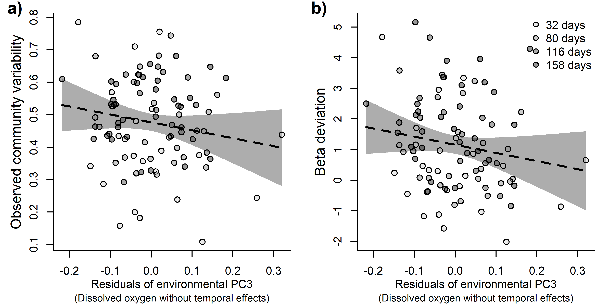<!-- -->

``` r
#dev.off()
```
