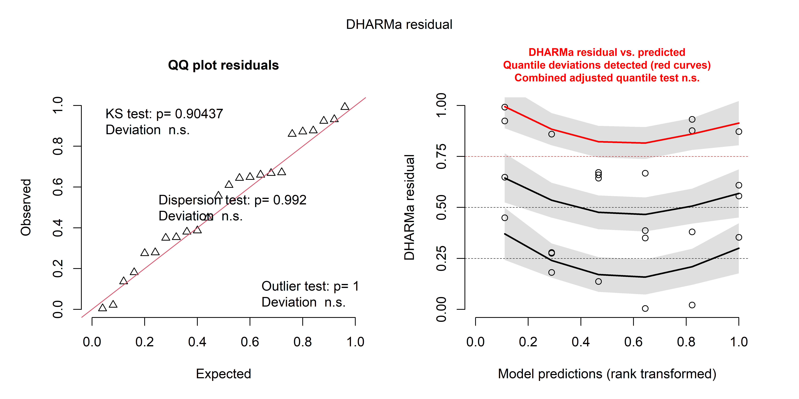
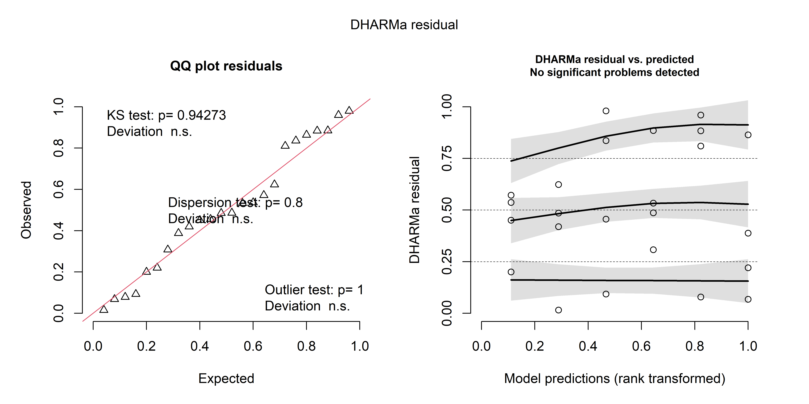
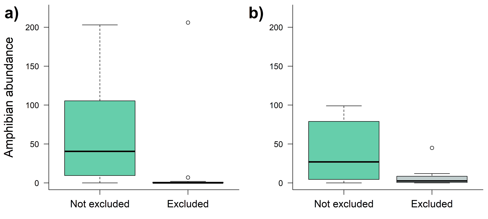
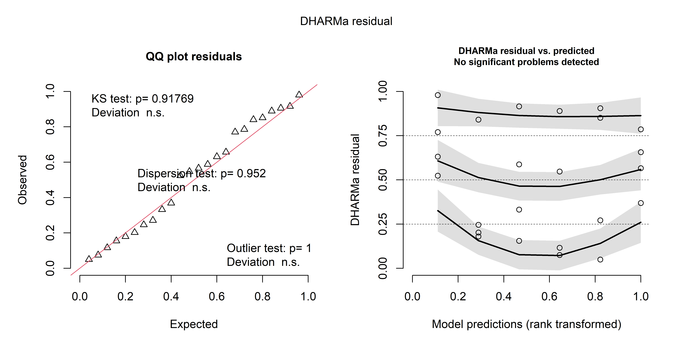
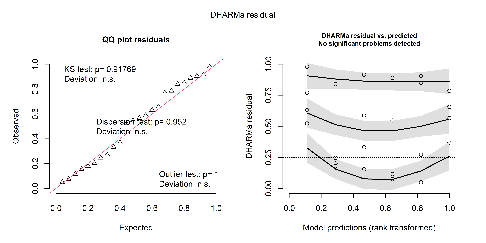

Test of the exclusion of amphibians and dragonflies
================
Rodolfo Pelinson
2026-05-11

``` r
source(paste(sep = "/",dir,"functions/pairwise_gllvm.R"))
source(paste(sep = "/",dir,"functions/pairwise_mvabund.R"))
source(paste(sep = "/",dir,"functions/my.anova.gllvm.R"))
source(paste(sep = "/",dir,"functions/My_coefplot.R"))
source(paste(sep = "/",dir,"functions/remove_sp.R"))
source(paste(sep = "/",dir,"functions/extract_mles.R"))
source(paste(sep = "/",dir,"functions/my_ordiplot.R"))
source(paste(sep = "/",dir,"functions/get_scaled_lvs.R"))
source(paste(sep = "/",dir,"functions/text_contour.R"))
source(paste(sep = "/",dir,"functions/letters.R"))


library(vegan)
library(gllvm)
library(mvabund)
library(DHARMa)
library(glmmTMB)
library(vioplot)
library(yarrr)
library(colorspace)
```

``` r
source(paste(sep = "/",dir,"ajeitando_planilhas.R"))
```

# Preparing data

``` r
comm_AM1 <- remove_sp(communities_AM1, 0)
comm_AM2 <- remove_sp(communities_AM2, 0)
comm_AM3 <- remove_sp(communities_AM3, 0)
comm_AM4 <- remove_sp(communities_AM4, 0)

Exp_design_exc_atr <- Exp_design[Exp_design$treatments != "atrasado",]
comm_AM1_exc_atr <- comm_AM1[Exp_design$treatments != "atrasado",]
comm_AM2_exc_atr <- comm_AM2[Exp_design$treatments != "atrasado",]
comm_AM3_exc_atr <- comm_AM3[Exp_design$treatments != "atrasado",]
```

# Analysis of amphibian exclusion

Here we built models for the first (32-day) and second (80 day) surveys
to assess the effect of amphibian exclusion on the total abundance of
amphibians. Here the abundance of amphibians in treatments where
amphibians were or were not excluded were combined (i.e. amphibian +
both amphibian and dragonfly exclusion vs control + dragonfly
exclusion).

``` r
D_minutus_AM1 <- comm_AM1_exc_atr$`Dendropsophus minutus`
S_fuscovarius_AM1 <- comm_AM1_exc_atr$`Scinax fuscovarius`

amphibians_AM1 <- D_minutus_AM1 + S_fuscovarius_AM1

D_minutus_AM2 <- comm_AM2_exc_atr$`Dendropsophus minutus`
S_fuscovarius_AM2 <- comm_AM2_exc_atr$`Scinax fuscovarius`

amphibians_AM2 <- D_minutus_AM2 + S_fuscovarius_AM2
```

## First survey

``` r
mod_exc_anf_AM1_0 <- glmmTMB::glmmTMB(amphibians_AM1 ~ 1 + block2, family = "nbinom1", data = Exp_design_exc_atr)
mod_exc_anf_AM1_1 <- glmmTMB::glmmTMB(amphibians_AM1 ~ exclusao_anfibio + block2, family = "nbinom1", data = Exp_design_exc_atr)
plot(simulateResiduals(mod_exc_anf_AM1_1))
```

<!-- -->

``` r
anova(mod_exc_anf_AM1_0,mod_exc_anf_AM1_1)
```

    ## Data: Exp_design_exc_atr
    ## Models:
    ## mod_exc_anf_AM1_0: amphibians_AM1 ~ 1 + block2, zi=~0, disp=~1
    ## mod_exc_anf_AM1_1: amphibians_AM1 ~ exclusao_anfibio + block2, zi=~0, disp=~1
    ##                   Df    AIC    BIC  logLik deviance  Chisq Chi Df Pr(>Chisq)
    ## mod_exc_anf_AM1_0  4 181.04 185.75 -86.520   173.04                         
    ## mod_exc_anf_AM1_1  5 171.03 176.92 -80.514   161.03 12.011      1  0.0005288
    ##                      
    ## mod_exc_anf_AM1_0    
    ## mod_exc_anf_AM1_1 ***
    ## ---
    ## Signif. codes:  0 '***' 0.001 '**' 0.01 '*' 0.05 '.' 0.1 ' ' 1

## Second survey

``` r
mod_exc_anf_AM2_0 <- glmmTMB::glmmTMB(amphibians_AM2 ~ 1 + block2, family = "nbinom1", data = Exp_design_exc_atr)
mod_exc_anf_AM2_1 <- glmmTMB::glmmTMB(amphibians_AM2 ~ exclusao_anfibio + block2, family = "nbinom1", data = Exp_design_exc_atr)
plot(simulateResiduals(mod_exc_anf_AM2_1))
```

    ## Warning in newton(lsp = lsp, X = G$X, y = G$y, Eb = G$Eb, UrS = G$UrS, L = G$L,
    ## : Fitting terminated with step failure - check results carefully

<!-- -->

``` r
anova(mod_exc_anf_AM2_0,mod_exc_anf_AM2_1)
```

    ## Data: Exp_design_exc_atr
    ## Models:
    ## mod_exc_anf_AM2_0: amphibians_AM2 ~ 1 + block2, zi=~0, disp=~1
    ## mod_exc_anf_AM2_1: amphibians_AM2 ~ exclusao_anfibio + block2, zi=~0, disp=~1
    ##                   Df    AIC    BIC  logLik deviance  Chisq Chi Df Pr(>Chisq)  
    ## mod_exc_anf_AM2_0  4 189.27 193.98 -90.635   181.27                           
    ## mod_exc_anf_AM2_1  5 188.16 194.04 -89.077   178.16 3.1156      1    0.07754 .
    ## ---
    ## Signif. codes:  0 '***' 0.001 '**' 0.01 '*' 0.05 '.' 0.1 ' ' 1

## Plot

``` r
#pdf(file = "Plots/test_exclusion/amphibians.pdf", width = 6, height = 3, pointsize = 8)
par(mfrow = c(1,2))
par(mar = c(3, 5, 0.5,0.5), bty = "l")
boxplot(amphibians_AM1 ~ Exp_design_exc_atr$exclusao_anfibio, xaxt = "n", yaxt = "n", ylab = "", xlab ="", col = c("aquamarine3", "azure3"), ylim = c(0,220))
axis(1, labels = c("Not excluded", "Excluded"), at = c(1,2), cex.axis = 1.25)
axis(2, las = 1)
title(ylab = "Amphibian abundance", cex.lab = 1.5, line = 3.5)
par(new = TRUE, mar = c(0,0,0,0), bty = "n")
plot(NA, ylim = c(0,100), xlim = c(0,100), xaxt = "n", yaxt = "n")
text("a)", x = -2, y = 95, cex = 2, font = 2, adj = c(0,0))

par(mar = c(3, 5, 0.5,0.5), bty = "l")
boxplot(amphibians_AM2 ~ Exp_design_exc_atr$exclusao_anfibio, xaxt = "n", yaxt = "n", ylab = "", xlab ="", col = c("aquamarine3", "azure3"), ylim = c(0,220))
axis(1, labels = c("Not excluded", "Excluded"), at = c(1,2), cex.axis = 1.25)
axis(2, las = 1)
#title(ylab = "Abundância de girinos", cex.lab = 1.5, line = 3.5)
par(new = TRUE, mar = c(0,0,0,0), bty = "n")
plot(NA, ylim = c(0,100), xlim = c(0,100), xaxt = "n", yaxt = "n")
text("b)", x = -2, y = 95, cex = 2, font = 2, adj = c(0,0))
```

<!-- -->

``` r
#dev.off()
```

``` r
means_AM1 <- tapply(amphibians_AM1, INDEX = Exp_design_exc_atr$exclusao_anfibio, FUN = mean)
means_AM1
```

    ##      nao      sim 
    ## 65.25000 17.91667

``` r
1 - (means_AM1[2] / means_AM1[1])
```

    ##       sim 
    ## 0.7254151

``` r
means_AM2 <- tapply(amphibians_AM2, INDEX = Exp_design_exc_atr$exclusao_anfibio, FUN = mean)
means_AM2
```

    ##       nao       sim 
    ## 39.416667  7.083333

``` r
1 - (means_AM2[2] / means_AM2[1])
```

    ##      sim 
    ## 0.820296

# Analysis of draggonfly exclusion

Here we built models for the second (80-day) and third (116 day) surveys
to assess the effect of dragonfly exclusion on the total abundance of
dragonflies. We did not find sufficient dragonflies in the first survey.
Here the abundance of dragonfly in treatments where dragonflies were or
were not excluded were combined (i.e. dragonfly + both dragonfly and
amphibian exclusion vs control + amphibian exclusion).

## No Dragonflies in the first survey

``` r
comm_AM1_exc_atr
```

    ##    Aedes Anopheles Belostoma Berosus Callibaetis Chironominae Culex
    ## A1   151         0         0       2           0            9    25
    ## A2   201         0         0       0          12           14    73
    ## A4    56         0         0       0           0           21    49
    ## A5   276         0         0       0           7           21     0
    ## B1    56         0         0       0           0            1    71
    ## B2     0         0         0       0           0            7     0
    ## B4    23         0         0       2           7           14    94
    ## B5     4         0         0       0          10            2   150
    ## C1   143         0         0       0          13           54    95
    ## C3     5         0         0       0           0           66     0
    ## C4    36         0         0       0           0           12    44
    ## C5    34         0         0       0           0           64    42
    ## D1   120         0         1       0           0            0    88
    ## D3     1         0         0       0           0           11    96
    ## D4     0         0         1       0           0           32    90
    ## D5    18         0         0       0           0            6   141
    ## E2    57         0         0       0           0           48    85
    ## E3    17         0         0       0           0           56    55
    ## E4    16         0         0       0           0           68   128
    ## E5     5         0         0       0           3            9   140
    ## F1     0         0         0       0           0            0     0
    ## F2     0         0         0       0          14            8   177
    ## F3   138         0         0       0           0           84     9
    ## F5     0         9         0       0           0            6   100
    ##    Dendropsophus minutus Derovatellus Meridiorhantus Microvelia
    ## A1                     0            0              0          0
    ## A2                     0            4              1          0
    ## A4                     0            0              0          0
    ## A5                     0            0              0          0
    ## B1                     0            0              0          0
    ## B2                     0            0              0          0
    ## B4                     0            0              0          0
    ## B5                     0            1              0          0
    ## C1                     0            0              0          0
    ## C3                     0            1              0          0
    ## C4                    25            0              0          0
    ## C5                     0            0              0          0
    ## D1                     0            0              0          0
    ## D3                     1            0              0          0
    ## D4                     5            0              0          0
    ## D5                     0            1              0          0
    ## E2                     0            0              0          0
    ## E3                     0            0              0          0
    ## E4                     0            0              0          0
    ## E5                     0            0              0          1
    ## F1                     0            0              0          0
    ## F2                     0            0              0          0
    ## F3                     0            0              0          0
    ## F5                    13            0              0          3
    ##    Scinax fuscovarius Tanypodinae
    ## A1                 10           2
    ## A2                  0           1
    ## A4                  0           3
    ## A5                  2           0
    ## B1                131           5
    ## B2                  0          14
    ## B4                  0           1
    ## B5                203           0
    ## C1                  9           0
    ## C3                  0           7
    ## C4                181           1
    ## C5                 63           0
    ## D1                  0           0
    ## D3                  9           3
    ## D4                  2           5
    ## D5                  0           1
    ## E2                  0           1
    ## E3                  0           7
    ## E4                196           0
    ## E5                 62           0
    ## F1                 80           0
    ## F2                  0           0
    ## F3                  0           0
    ## F5                  6           0

``` r
Erythrodiplax_AM2 <- comm_AM2_exc_atr$Erythrodiplax
Pantala_AM2 <- comm_AM2_exc_atr$Pantala
Tholymis_AM2 <- comm_AM2_exc_atr$Tholymis

dragonfly_AM2 <- Erythrodiplax_AM2 + Pantala_AM2 + Tholymis_AM2

Erythrodiplax_AM3 <- comm_AM3_exc_atr$Erythrodiplax
Pantala_AM3 <- comm_AM3_exc_atr$Pantala

dragonfly_AM3 <- Erythrodiplax_AM3 + Pantala_AM3
```

## Second survey

``` r
mod_exc_lib_AM2_0 <- glmmTMB::glmmTMB(dragonfly_AM2 ~ 1 + block2, family = "nbinom1", data = Exp_design_exc_atr)
mod_exc_lib_AM2_1 <- glmmTMB::glmmTMB(dragonfly_AM2 ~ exclusao_libelula + block2, family = "nbinom1", data = Exp_design_exc_atr)
plot(simulateResiduals(mod_exc_lib_AM2_1))
```

<!-- -->

``` r
anova(mod_exc_lib_AM2_0,mod_exc_lib_AM2_1)
```

    ## Data: Exp_design_exc_atr
    ## Models:
    ## mod_exc_lib_AM2_0: dragonfly_AM2 ~ 1 + block2, zi=~0, disp=~1
    ## mod_exc_lib_AM2_1: dragonfly_AM2 ~ exclusao_libelula + block2, zi=~0, disp=~1
    ##                   Df    AIC    BIC  logLik deviance  Chisq Chi Df Pr(>Chisq)
    ## mod_exc_lib_AM2_0  4 85.035 89.747 -38.517   77.035                         
    ## mod_exc_lib_AM2_1  5 84.847 90.737 -37.423   74.847 2.1879      1     0.1391

## Third survey

``` r
mod_exc_lib_AM3_0 <- glmmTMB::glmmTMB(dragonfly_AM3 ~ 1 + block2, family = "nbinom1", data = Exp_design_exc_atr)
mod_exc_lib_AM3_1 <- glmmTMB::glmmTMB(dragonfly_AM3 ~ exclusao_libelula + block2, family = "nbinom1", data = Exp_design_exc_atr)
plot(simulateResiduals(mod_exc_lib_AM2_1))
```

<!-- -->

``` r
anova(mod_exc_lib_AM3_0,mod_exc_lib_AM3_1)
```

    ## Data: Exp_design_exc_atr
    ## Models:
    ## mod_exc_lib_AM3_0: dragonfly_AM3 ~ 1 + block2, zi=~0, disp=~1
    ## mod_exc_lib_AM3_1: dragonfly_AM3 ~ exclusao_libelula + block2, zi=~0, disp=~1
    ##                   Df    AIC    BIC  logLik deviance  Chisq Chi Df Pr(>Chisq)   
    ## mod_exc_lib_AM3_0  4 76.614 81.326 -34.307   68.614                            
    ## mod_exc_lib_AM3_1  5 71.788 77.679 -30.894   61.788 6.8259      1   0.008985 **
    ## ---
    ## Signif. codes:  0 '***' 0.001 '**' 0.01 '*' 0.05 '.' 0.1 ' ' 1

## Plot

``` r
#pdf(file = "plots/test_exclusion/dragonfly.pdf", width = 6, height = 3, pointsize = 8)
par(mfrow = c(1,2))
par(mar = c(3, 5, 0.5,0.5), bty = "l")
boxplot(dragonfly_AM2 ~ Exp_design_exc_atr$exclusao_libelula, xaxt = "n", yaxt = "n", ylab = "", xlab ="", col = c("burlywood3", "azure3"), ylim = c(0,6))
axis(1, labels = c("Not Excluded", "Excluded"), at = c(1,2), cex.axis = 1.25)
axis(2, las = 1)
title(ylab = "Dragonfly abundance", cex.lab = 1.5, line = 3.5)
par(new = TRUE, mar = c(0,0,0,0), bty = "n")
plot(NA, ylim = c(0,100), xlim = c(0,100), xaxt = "n", yaxt = "n")
text("a)", x = -2, y = 95, cex = 2, font = 2, adj = c(0,0))

par(mar = c(3, 5, 0.5,0.5), bty = "l")
boxplot(dragonfly_AM3 ~ Exp_design_exc_atr$exclusao_libelula, xaxt = "n", yaxt = "n", ylab = "", xlab ="", col = c("burlywood3", "azure3"), ylim = c(0,6))
axis(1, labels = c("Not Excluded", "Excluded"), at = c(1,2), cex.axis = 1.25)
axis(2, las = 1)
#title(ylab = "Abundância de girinos", cex.lab = 1.5, line = 3.5)
par(new = TRUE, mar = c(0,0,0,0), bty = "n")
plot(NA, ylim = c(0,100), xlim = c(0,100), xaxt = "n", yaxt = "n")
text("b)", x = -2, y = 95, cex = 2, font = 2, adj = c(0,0))
```

<!-- -->

``` r
#dev.off()
```

``` r
means_AM2 <- tapply(dragonfly_AM2, INDEX = Exp_design_exc_atr$exclusao_libelula, FUN = mean)
means_AM2
```

    ##      nao      sim 
    ## 2.166667 1.333333

``` r
1 - (means_AM2[2] / means_AM2[1])
```

    ##       sim 
    ## 0.3846154

``` r
means_AM3 <- tapply(dragonfly_AM3, INDEX = Exp_design_exc_atr$exclusao_libelula, FUN = mean)
means_AM3
```

    ##       nao       sim 
    ## 1.7500000 0.5833333

``` r
1 - (means_AM3[2] / means_AM3[1])
```

    ##       sim 
    ## 0.6666667
