Beta diversity analysis
================
Rodolfo Pelinson
2026-03-31

``` r
source(paste(sep = "/",dir,"functions/null_assembly.R"))
source(paste(sep = "/",dir,"functions/null_com_algorithm.R"))
source(paste(sep = "/",dir,"functions/beta_deviation.R"))
source(paste(sep = "/",dir,"functions/beta_deviation.R"))
source(paste(sep = "/",dir,"functions/beta_deviation_siqueira_et_al_2019.R"))
source(paste(sep = "/",dir,"functions/letters.R"))
source(paste(sep = "/",dir,"functions/remove_sp.R"))
```

``` r
library(vegan)
library(glmmTMB)
library(car)
library(emmeans)
library(DHARMa)
library(yarrr)
library(vioplot)
```

``` r
source(paste(sep = "/",dir,"ajeitando_planilhas.R"))
```

## Preparing data

Excluding the late treatment and preparing data

``` r
comm_all_2 <- comm_all[Exp_design_all$treatments != "atrasado",]
Exp_design_all_2 <- Exp_design_all[Exp_design_all$treatments != "atrasado",]

comm_all_2 <- remove_sp(comm_all_2, 0)

ncol(comm_all_2)
```

    ## [1] 24

``` r
nrow(comm_all_2)
```

    ## [1] 96

``` r
nrow(Exp_design_all_2)
```

    ## [1] 96

``` r
ID <-  as.factor(Exp_design_all_2$sites)

AM_by_block <- interaction(as.factor(Exp_design_all_2$block), as.factor( Exp_design_all_2$AM))


Exp_design_all_2$AM <- as.factor(Exp_design_all_2$AM)
Exp_design_all_2$AM_numeric <- as.numeric(Exp_design_all_2$AM)
Exp_design_all_2$AM_numeric_quad <- Exp_design_all_2$AM_numeric^2


Exp_design_all_2$AM_days <- Exp_design_all_2$AM_numeric
Exp_design_all_2$AM_days[Exp_design_all_2$AM_days == 1] <- 32
Exp_design_all_2$AM_days[Exp_design_all_2$AM_days == 2] <- 80
Exp_design_all_2$AM_days[Exp_design_all_2$AM_days == 3] <- 116
Exp_design_all_2$AM_days[Exp_design_all_2$AM_days == 4] <- 158


Exp_design_all_2$AM_days_orig <- Exp_design_all_2$AM_days

Exp_design_all_2$AM_days <- scale(Exp_design_all_2$AM_days)
attr_AM_days <- attributes(Exp_design_all_2$AM_days)

unscale <- function(x, atributes, reverse = FALSE){
  if(isTRUE(reverse)){
      x <- (x - atributes$`scaled:center`) / atributes$`scaled:scale` 
  }else{
      x <- (x * atributes$`scaled:scale`) + atributes$`scaled:center`
  }
  return(x)
}

Exp_design_all_2$AM_days <- Exp_design_all_2$AM_days[,1]
Exp_design_all_2$AM_days_quad <- Exp_design_all_2$AM_days^2
```

# Computing beta deviation

Running the beta deviation analysis keeps gamma diversity within each
survey fixed, total number of individuals in each sample fixed, and
average number of species in each survey fixed.

``` r
beta_dev <-  beta_deviation(comm_all_2, keep_fill = TRUE, method = "quasiswap", dist = "bray", fixedmar="both", shuffle = "both", group = AM_by_block,
                                  strata = Exp_design_all_2$AM,  mtype = "count", times = 500, burnin = 0, thin = 1000, transform = NULL, seed = 1, type = "centroid", bias.adjust = FALSE)
```

### Checking premises

Checking if null matrices are keeping the parameters that should be
fixed, fixed.

Gamma diversity

``` r
gammas_AM1 <- rep(NA, length(beta_dev$null_cons))
for(i in 1:length(beta_dev$null_cons)){
  gammas_AM1[i] <- sum(decostand(colSums(beta_dev$null_cons[[i]][Exp_design_all_2$AM == 1,]), method = "pa"))
}
head(gammas_AM1)
```

    ## [1] 13 13 13 13 13 13

``` r
tail(gammas_AM1)
```

    ## [1] 13 13 13 13 13 13

``` r
#Original
sum(decostand(colSums(comm_all_2[Exp_design_all_2$AM == 1,]), method = "pa"))
```

    ## [1] 13

``` r
#########################################################################################################################
gammas_AM2 <- rep(NA, length(beta_dev$null_cons))
for(i in 1:length(beta_dev$null_cons)){
  gammas_AM2[i] <- sum(decostand(colSums(beta_dev$null_cons[[i]][Exp_design_all_2$AM == 2,]), method = "pa"))
}
head(gammas_AM2)
```

    ## [1] 19 19 19 19 19 19

``` r
tail(gammas_AM2)
```

    ## [1] 19 19 19 19 19 19

``` r
sum(decostand(colSums(comm_all_2[Exp_design_all_2$AM == 2,]), method = "pa"))
```

    ## [1] 19

``` r
#########################################################################################################################

gammas_AM3 <- rep(NA, length(beta_dev$null_cons))
for(i in 1:length(beta_dev$null_cons)){
  gammas_AM3[i] <- sum(decostand(colSums(beta_dev$null_cons[[i]][Exp_design_all_2$AM == 3,]), method = "pa"))
}
head(gammas_AM3)
```

    ## [1] 13 13 13 13 13 13

``` r
tail(gammas_AM3)
```

    ## [1] 13 13 13 13 13 13

``` r
sum(decostand(colSums(comm_all_2[Exp_design_all_2$AM == 3,]), method = "pa"))
```

    ## [1] 13

``` r
#########################################################################################################################

gammas_AM4 <- rep(NA, length(beta_dev$null_cons))
for(i in 1:length(beta_dev$null_cons)){
  gammas_AM4[i] <- sum(decostand(colSums(beta_dev$null_cons[[i]][Exp_design_all_2$AM == 4,]), method = "pa"))
}
head(gammas_AM4)
```

    ## [1] 14 14 14 14 14 14

``` r
tail(gammas_AM4)
```

    ## [1] 14 14 14 14 14 14

``` r
sum(decostand(colSums(comm_all_2[Exp_design_all_2$AM == 4,]), method = "pa"))
```

    ## [1] 14

``` r
#########################################################################################################################
```

Alpha diversity

``` r
comalphas_AM1 <- list()
for(i in 1:length(beta_dev$null_cons)){
  comalphas_AM1[[i]]<- rowSums(decostand(beta_dev$null_cons[[i]][Exp_design_all_2$AM == 1,], method = "pa"))
}
head(comalphas_AM1)
```

    ## [[1]]
    ##  [1] 3 4 4 5 7 2 6 6 6 6 7 4 5 4 5 4 3 3 6 3 3 6 3 5
    ## 
    ## [[2]]
    ##  [1] 3 2 4 7 5 5 2 6 5 3 7 6 4 5 8 5 3 4 8 5 2 5 4 2
    ## 
    ## [[3]]
    ##  [1] 6 2 2 5 4 5 4 5 4 5 4 5 4 4 7 4 5 3 6 4 5 4 5 8
    ## 
    ## [[4]]
    ##  [1] 3 4 6 5 4 3 6 4 3 6 5 4 4 6 4 5 7 2 5 5 3 4 5 7
    ## 
    ## [[5]]
    ##  [1] 3 5 4 6 7 3 6 5 4 2 5 5 3 5 4 7 5 3 5 5 4 4 5 5
    ## 
    ## [[6]]
    ##  [1] 4 5 4 4 4 2 5 5 4 5 3 6 5 3 6 4 3 5 7 5 5 6 5 5

``` r
tail(comalphas_AM1)
```

    ## [[1]]
    ##  [1] 5 5 3 4 7 4 3 5 6 2 6 5 3 5 5 6 5 6 4 5 5 3 4 4
    ## 
    ## [[2]]
    ##  [1] 2 6 4 6 7 2 5 5 5 4 6 4 4 3 6 5 4 4 6 6 4 5 4 3
    ## 
    ## [[3]]
    ##  [1] 3 5 5 7 2 3 4 4 4 6 6 6 4 3 5 4 6 4 6 4 6 5 5 3
    ## 
    ## [[4]]
    ##  [1] 4 3 3 5 4 3 5 5 4 5 7 3 5 7 5 4 3 7 5 6 3 5 5 4
    ## 
    ## [[5]]
    ##  [1] 4 6 5 6 4 2 5 7 4 4 6 5 6 3 4 4 5 6 3 6 4 4 4 3
    ## 
    ## [[6]]
    ##  [1] 2 6 4 7 4 4 3 5 6 7 7 4 5 6 3 5 5 4 3 6 3 4 4 3

``` r
#Original
rowSums(decostand(comm_all_2[Exp_design_all_2$AM == 1,], method = "pa"))
```

    ##  1  2  4  5  6  7  9 10 11 13 14 15 16 18 19 20 22 23 24 25 26 27 28 30 
    ##  6  7  4  4  5  2  6  6  5  4  6  4  3  6  6  5  4  4  4  6  1  3  3  6

``` r
alphas_AM1 <- rep(NA, length(beta_dev$null_cons))
for(i in 1:length(beta_dev$null_cons)){
  alphas_AM1[i] <- mean(rowSums(decostand(beta_dev$null_cons[[i]][Exp_design_all_2$AM == 1,], method = "pa")))
}
head(alphas_AM1)
```

    ## [1] 4.583333 4.583333 4.583333 4.583333 4.583333 4.583333

``` r
tail(alphas_AM1)
```

    ## [1] 4.583333 4.583333 4.583333 4.583333 4.583333 4.583333

``` r
#Original
mean(rowSums(decostand(comm_all_2[Exp_design_all_2$AM == 1,], method = "pa")))
```

    ## [1] 4.583333

``` r
#########################################################################################################################
alphas_AM2 <- rep(NA, length(beta_dev$null_cons))
for(i in 1:length(beta_dev$null_cons)){
  alphas_AM2[i] <- mean(rowSums(decostand(beta_dev$null_cons[[i]][Exp_design_all_2$AM == 2,], method = "pa")))
}
head(alphas_AM2)
```

    ## [1] 5.75 5.75 5.75 5.75 5.75 5.75

``` r
tail(alphas_AM2)
```

    ## [1] 5.75 5.75 5.75 5.75 5.75 5.75

``` r
#Original
mean(rowSums(decostand(comm_all_2[Exp_design_all_2$AM == 2,], method = "pa")))
```

    ## [1] 5.75

``` r
#########################################################################################################################

alphas_AM3 <- rep(NA, length(beta_dev$null_cons))
for(i in 1:length(beta_dev$null_cons)){
  alphas_AM3[i] <- mean(rowSums(decostand(beta_dev$null_cons[[i]][Exp_design_all_2$AM == 3,], method = "pa")))
}
head(alphas_AM3)
```

    ## [1] 4.708333 4.708333 4.708333 4.708333 4.708333 4.708333

``` r
tail(alphas_AM3)
```

    ## [1] 4.708333 4.708333 4.708333 4.708333 4.708333 4.708333

``` r
#Original
mean(rowSums(decostand(comm_all_2[Exp_design_all_2$AM == 3,], method = "pa")))
```

    ## [1] 4.708333

``` r
#########################################################################################################################

alphas_AM4 <- rep(NA, length(beta_dev$null_cons))
for(i in 1:length(beta_dev$null_cons)){
  alphas_AM4[i] <- mean(rowSums(decostand(beta_dev$null_cons[[i]][Exp_design_all_2$AM == 4,], method = "pa")))
}
head(alphas_AM4)
```

    ## [1] 5.5 5.5 5.5 5.5 5.5 5.5

``` r
tail(alphas_AM4)
```

    ## [1] 5.5 5.5 5.5 5.5 5.5 5.5

``` r
#Original
mean(rowSums(decostand(comm_all_2[Exp_design_all_2$AM == 4,], method = "pa")))
```

    ## [1] 5.5

``` r
#########################################################################################################################
```

Community sizes

``` r
comsizes_AM1 <- list()
for(i in 1:length(beta_dev$null_cons)){
  comsizes_AM1[[i]]<- rowSums(beta_dev$null_cons[[i]][Exp_design_all_2$AM == 1,])
}
head(comsizes_AM1)
```

    ## [[1]]
    ##  [1] 199 306 129 306 264  21 141 370 314  79 299 203 209 121 135 167 191 135 408
    ## [20] 220  80 199 231 137
    ## 
    ## [[2]]
    ##  [1] 199 306 129 306 264  21 141 370 314  79 299 203 209 121 135 167 191 135 408
    ## [20] 220  80 199 231 137
    ## 
    ## [[3]]
    ##  [1] 199 306 129 306 264  21 141 370 314  79 299 203 209 121 135 167 191 135 408
    ## [20] 220  80 199 231 137
    ## 
    ## [[4]]
    ##  [1] 199 306 129 306 264  21 141 370 314  79 299 203 209 121 135 167 191 135 408
    ## [20] 220  80 199 231 137
    ## 
    ## [[5]]
    ##  [1] 199 306 129 306 264  21 141 370 314  79 299 203 209 121 135 167 191 135 408
    ## [20] 220  80 199 231 137
    ## 
    ## [[6]]
    ##  [1] 199 306 129 306 264  21 141 370 314  79 299 203 209 121 135 167 191 135 408
    ## [20] 220  80 199 231 137

``` r
tail(comsizes_AM1)
```

    ## [[1]]
    ##  [1] 199 306 129 306 264  21 141 370 314  79 299 203 209 121 135 167 191 135 408
    ## [20] 220  80 199 231 137
    ## 
    ## [[2]]
    ##  [1] 199 306 129 306 264  21 141 370 314  79 299 203 209 121 135 167 191 135 408
    ## [20] 220  80 199 231 137
    ## 
    ## [[3]]
    ##  [1] 199 306 129 306 264  21 141 370 314  79 299 203 209 121 135 167 191 135 408
    ## [20] 220  80 199 231 137
    ## 
    ## [[4]]
    ##  [1] 199 306 129 306 264  21 141 370 314  79 299 203 209 121 135 167 191 135 408
    ## [20] 220  80 199 231 137
    ## 
    ## [[5]]
    ##  [1] 199 306 129 306 264  21 141 370 314  79 299 203 209 121 135 167 191 135 408
    ## [20] 220  80 199 231 137
    ## 
    ## [[6]]
    ##  [1] 199 306 129 306 264  21 141 370 314  79 299 203 209 121 135 167 191 135 408
    ## [20] 220  80 199 231 137

``` r
#Original
rowSums(comm_all_2[Exp_design_all_2$AM == 1,])
```

    ##   1   2   4   5   6   7   9  10  11  13  14  15  16  18  19  20  22  23  24  25 
    ## 199 306 129 306 264  21 141 370 314  79 299 203 209 121 135 167 191 135 408 220 
    ##  26  27  28  30 
    ##  80 199 231 137

``` r
#########################################################################################################################
comsizes_AM2 <- list()
for(i in 1:length(beta_dev$null_cons)){
  comsizes_AM2[[i]]<- rowSums(beta_dev$null_cons[[i]][Exp_design_all_2$AM == 2,])
}
head(comsizes_AM2)
```

    ## [[1]]
    ##  [1] 127  88  53  40 101  17   8 182 141  23  38 111  46  42  77 139  59  67  64
    ## [20]  47 114  33  96  63
    ## 
    ## [[2]]
    ##  [1] 127  88  53  40 101  17   8 182 141  23  38 111  46  42  77 139  59  67  64
    ## [20]  47 114  33  96  63
    ## 
    ## [[3]]
    ##  [1] 127  88  53  40 101  17   8 182 141  23  38 111  46  42  77 139  59  67  64
    ## [20]  47 114  33  96  63
    ## 
    ## [[4]]
    ##  [1] 127  88  53  40 101  17   8 182 141  23  38 111  46  42  77 139  59  67  64
    ## [20]  47 114  33  96  63
    ## 
    ## [[5]]
    ##  [1] 127  88  53  40 101  17   8 182 141  23  38 111  46  42  77 139  59  67  64
    ## [20]  47 114  33  96  63
    ## 
    ## [[6]]
    ##  [1] 127  88  53  40 101  17   8 182 141  23  38 111  46  42  77 139  59  67  64
    ## [20]  47 114  33  96  63

``` r
tail(comsizes_AM2)
```

    ## [[1]]
    ##  [1] 127  88  53  40 101  17   8 182 141  23  38 111  46  42  77 139  59  67  64
    ## [20]  47 114  33  96  63
    ## 
    ## [[2]]
    ##  [1] 127  88  53  40 101  17   8 182 141  23  38 111  46  42  77 139  59  67  64
    ## [20]  47 114  33  96  63
    ## 
    ## [[3]]
    ##  [1] 127  88  53  40 101  17   8 182 141  23  38 111  46  42  77 139  59  67  64
    ## [20]  47 114  33  96  63
    ## 
    ## [[4]]
    ##  [1] 127  88  53  40 101  17   8 182 141  23  38 111  46  42  77 139  59  67  64
    ## [20]  47 114  33  96  63
    ## 
    ## [[5]]
    ##  [1] 127  88  53  40 101  17   8 182 141  23  38 111  46  42  77 139  59  67  64
    ## [20]  47 114  33  96  63
    ## 
    ## [[6]]
    ##  [1] 127  88  53  40 101  17   8 182 141  23  38 111  46  42  77 139  59  67  64
    ## [20]  47 114  33  96  63

``` r
#Original
rowSums(comm_all_2[Exp_design_all_2$AM == 2,])
```

    ##  31  32  34  35  36  37  39  40  41  43  44  45  46  48  49  50  52  53  54  55 
    ## 127  88  53  40 101  17   8 182 141  23  38 111  46  42  77 139  59  67  64  47 
    ##  56  57  58  60 
    ## 114  33  96  63

``` r
#########################################################################################################################
comsizes_AM3 <- list()
for(i in 1:length(beta_dev$null_cons)){
  comsizes_AM3[[i]]<- rowSums(beta_dev$null_cons[[i]][Exp_design_all_2$AM == 3,])
}
head(comsizes_AM3)
```

    ## [[1]]
    ##  [1] 30 80  7  4 67 31 12 36 49 44  9 96 18 91  5 47  9 84 11 20 35 10 28 10
    ## 
    ## [[2]]
    ##  [1] 30 80  7  4 67 31 12 36 49 44  9 96 18 91  5 47  9 84 11 20 35 10 28 10
    ## 
    ## [[3]]
    ##  [1] 30 80  7  4 67 31 12 36 49 44  9 96 18 91  5 47  9 84 11 20 35 10 28 10
    ## 
    ## [[4]]
    ##  [1] 30 80  7  4 67 31 12 36 49 44  9 96 18 91  5 47  9 84 11 20 35 10 28 10
    ## 
    ## [[5]]
    ##  [1] 30 80  7  4 67 31 12 36 49 44  9 96 18 91  5 47  9 84 11 20 35 10 28 10
    ## 
    ## [[6]]
    ##  [1] 30 80  7  4 67 31 12 36 49 44  9 96 18 91  5 47  9 84 11 20 35 10 28 10

``` r
tail(comsizes_AM3)
```

    ## [[1]]
    ##  [1] 30 80  7  4 67 31 12 36 49 44  9 96 18 91  5 47  9 84 11 20 35 10 28 10
    ## 
    ## [[2]]
    ##  [1] 30 80  7  4 67 31 12 36 49 44  9 96 18 91  5 47  9 84 11 20 35 10 28 10
    ## 
    ## [[3]]
    ##  [1] 30 80  7  4 67 31 12 36 49 44  9 96 18 91  5 47  9 84 11 20 35 10 28 10
    ## 
    ## [[4]]
    ##  [1] 30 80  7  4 67 31 12 36 49 44  9 96 18 91  5 47  9 84 11 20 35 10 28 10
    ## 
    ## [[5]]
    ##  [1] 30 80  7  4 67 31 12 36 49 44  9 96 18 91  5 47  9 84 11 20 35 10 28 10
    ## 
    ## [[6]]
    ##  [1] 30 80  7  4 67 31 12 36 49 44  9 96 18 91  5 47  9 84 11 20 35 10 28 10

``` r
#Original
rowSums(comm_all_2[Exp_design_all_2$AM == 3,])
```

    ## 61 62 64 65 66 67 69 70 71 73 74 75 76 78 79 80 82 83 84 85 86 87 88 90 
    ## 30 80  7  4 67 31 12 36 49 44  9 96 18 91  5 47  9 84 11 20 35 10 28 10

``` r
#########################################################################################################################

comsizes_AM4 <- list()
for(i in 1:length(beta_dev$null_cons)){
  comsizes_AM4[[i]]<- rowSums(beta_dev$null_cons[[i]][Exp_design_all_2$AM == 4,])
}
head(comsizes_AM4)
```

    ## [[1]]
    ##  [1]  44  75  63 158  58  24  35  71  31 283  25 112  46 134  51  22  36  62  16
    ## [20]  53  65  18  34  95
    ## 
    ## [[2]]
    ##  [1]  44  75  63 158  58  24  35  71  31 283  25 112  46 134  51  22  36  62  16
    ## [20]  53  65  18  34  95
    ## 
    ## [[3]]
    ##  [1]  44  75  63 158  58  24  35  71  31 283  25 112  46 134  51  22  36  62  16
    ## [20]  53  65  18  34  95
    ## 
    ## [[4]]
    ##  [1]  44  75  63 158  58  24  35  71  31 283  25 112  46 134  51  22  36  62  16
    ## [20]  53  65  18  34  95
    ## 
    ## [[5]]
    ##  [1]  44  75  63 158  58  24  35  71  31 283  25 112  46 134  51  22  36  62  16
    ## [20]  53  65  18  34  95
    ## 
    ## [[6]]
    ##  [1]  44  75  63 158  58  24  35  71  31 283  25 112  46 134  51  22  36  62  16
    ## [20]  53  65  18  34  95

``` r
tail(comsizes_AM4)
```

    ## [[1]]
    ##  [1]  44  75  63 158  58  24  35  71  31 283  25 112  46 134  51  22  36  62  16
    ## [20]  53  65  18  34  95
    ## 
    ## [[2]]
    ##  [1]  44  75  63 158  58  24  35  71  31 283  25 112  46 134  51  22  36  62  16
    ## [20]  53  65  18  34  95
    ## 
    ## [[3]]
    ##  [1]  44  75  63 158  58  24  35  71  31 283  25 112  46 134  51  22  36  62  16
    ## [20]  53  65  18  34  95
    ## 
    ## [[4]]
    ##  [1]  44  75  63 158  58  24  35  71  31 283  25 112  46 134  51  22  36  62  16
    ## [20]  53  65  18  34  95
    ## 
    ## [[5]]
    ##  [1]  44  75  63 158  58  24  35  71  31 283  25 112  46 134  51  22  36  62  16
    ## [20]  53  65  18  34  95
    ## 
    ## [[6]]
    ##  [1]  44  75  63 158  58  24  35  71  31 283  25 112  46 134  51  22  36  62  16
    ## [20]  53  65  18  34  95

``` r
#Original
rowSums(comm_all_2[Exp_design_all_2$AM == 4,])
```

    ##  91  92  94  95  96  97  99 100 101 103 104 105 106 108 109 110 112 113 114 115 
    ##  44  75  63 158  58  24  35  71  31 283  25 112  46 134  51  22  36  62  16  53 
    ## 116 117 118 120 
    ##  65  18  34  95

``` r
#########################################################################################################################
```

### Analysis

``` r
mod_obs_null <- glmmTMB(beta_dev$observed_distances ~ 1 + (1|block2/sites), data = Exp_design_all_2, control = glmmTMBControl(optimizer=optim, optArgs=list(method="BFGS")))
```

    ## Warning in glmmTMB(beta_dev$observed_distances ~ 1 + (1 | block2/sites), : use
    ## of the '$' operator in formulas is not recommended

``` r
mod_exp_null <- glmmTMB(beta_dev$expected_distances ~ 1 + (1|block2/sites), data = Exp_design_all_2, control = glmmTMBControl(optimizer=optim, optArgs=list(method="BFGS")))
```

    ## Warning in glmmTMB(beta_dev$expected_distances ~ 1 + (1 | block2/sites), : use
    ## of the '$' operator in formulas is not recommended

``` r
mod_dev_null <- glmmTMB(beta_dev$deviation_distances ~ 1 + (1|block2/sites), data = Exp_design_all_2, control = glmmTMBControl(optimizer=optim, optArgs=list(method="BFGS")))
```

    ## Warning in glmmTMB(beta_dev$deviation_distances ~ 1 + (1 | block2/sites), : use
    ## of the '$' operator in formulas is not recommended

``` r
mod_obs_am_num <- glmmTMB(beta_dev$observed_distances ~ AM_days + (1|block2/sites), data = Exp_design_all_2, control = glmmTMBControl(optimizer=optim, optArgs=list(method="BFGS")))
```

    ## Warning in glmmTMB(beta_dev$observed_distances ~ AM_days + (1 | block2/sites),
    ## : use of the '$' operator in formulas is not recommended

``` r
mod_exp_am_num <- glmmTMB(beta_dev$expected_distances ~ AM_days + (1|block2/sites), data = Exp_design_all_2, control = glmmTMBControl(optimizer=optim, optArgs=list(method="BFGS")))
```

    ## Warning in glmmTMB(beta_dev$expected_distances ~ AM_days + (1 | block2/sites),
    ## : use of the '$' operator in formulas is not recommended

``` r
mod_dev_am_num <- glmmTMB(beta_dev$deviation_distances ~ AM_days + (1|block2/sites), data = Exp_design_all_2, control = glmmTMBControl(optimizer=optim, optArgs=list(method="BFGS")))
```

    ## Warning in glmmTMB(beta_dev$deviation_distances ~ AM_days + (1 | block2/sites),
    ## : use of the '$' operator in formulas is not recommended

``` r
mod_obs_am_num_quad <- glmmTMB(beta_dev$observed_distances ~ AM_days + AM_days_quad + (1|block2/sites), data = Exp_design_all_2, control = glmmTMBControl(optimizer=optim, optArgs=list(method="BFGS")))
```

    ## Warning in glmmTMB(beta_dev$observed_distances ~ AM_days + AM_days_quad + : use
    ## of the '$' operator in formulas is not recommended

``` r
mod_exp_am_num_quad <- glmmTMB(beta_dev$expected_distances ~ AM_days + AM_days_quad + (1|block2/sites), data = Exp_design_all_2, control = glmmTMBControl(optimizer=optim, optArgs=list(method="BFGS")))
```

    ## Warning in glmmTMB(beta_dev$expected_distances ~ AM_days + AM_days_quad + : use
    ## of the '$' operator in formulas is not recommended

``` r
mod_dev_am_num_quad <- glmmTMB(beta_dev$deviation_distances ~ AM_days + AM_days_quad + (1|block2/sites), data = Exp_design_all_2)
```

    ## Warning in glmmTMB(beta_dev$deviation_distances ~ AM_days + AM_days_quad + :
    ## use of the '$' operator in formulas is not recommended

``` r
anova_obs <- anova(mod_obs_null, mod_obs_am_num, mod_obs_am_num_quad)
anova_obs
```

    ## Data: Exp_design_all_2
    ## Models:
    ## mod_obs_null: beta_dev$observed_distances ~ 1 + (1 | block2/sites), zi=~0, disp=~1
    ## mod_obs_am_num: beta_dev$observed_distances ~ AM_days + (1 | block2/sites), zi=~0, disp=~1
    ## mod_obs_am_num_quad: beta_dev$observed_distances ~ AM_days + AM_days_quad + (1 | block2/sites), zi=~0, disp=~1
    ##                     Df     AIC     BIC logLik deviance  Chisq Chi Df Pr(>Chisq)
    ## mod_obs_null         4 -102.08 -91.823 55.040  -110.08                         
    ## mod_obs_am_num       5 -109.70 -96.882 59.852  -119.70 9.6241      1    0.00192
    ## mod_obs_am_num_quad  6 -109.41 -94.025 60.706  -121.41 1.7072      1    0.19135
    ##                       
    ## mod_obs_null          
    ## mod_obs_am_num      **
    ## mod_obs_am_num_quad   
    ## ---
    ## Signif. codes:  0 '***' 0.001 '**' 0.01 '*' 0.05 '.' 0.1 ' ' 1

``` r
anova_exp <- anova(mod_exp_null, mod_exp_am_num, mod_exp_am_num_quad)
anova_exp
```

    ## Data: Exp_design_all_2
    ## Models:
    ## mod_exp_null: beta_dev$expected_distances ~ 1 + (1 | block2/sites), zi=~0, disp=~1
    ## mod_exp_am_num: beta_dev$expected_distances ~ AM_days + (1 | block2/sites), zi=~0, disp=~1
    ## mod_exp_am_num_quad: beta_dev$expected_distances ~ AM_days + AM_days_quad + (1 | block2/sites), zi=~0, disp=~1
    ##                     Df     AIC     BIC logLik deviance  Chisq Chi Df Pr(>Chisq)
    ## mod_exp_null         4 -218.89 -208.63 113.44  -226.89                         
    ## mod_exp_am_num       5 -217.88 -205.06 113.94  -227.88 0.9871      1   0.320451
    ## mod_exp_am_num_quad  6 -223.20 -207.81 117.60  -235.20 7.3221      1   0.006811
    ##                       
    ## mod_exp_null          
    ## mod_exp_am_num        
    ## mod_exp_am_num_quad **
    ## ---
    ## Signif. codes:  0 '***' 0.001 '**' 0.01 '*' 0.05 '.' 0.1 ' ' 1

``` r
anova_dev <- anova(mod_dev_null, mod_dev_am_num, mod_dev_am_num_quad)
anova_dev
```

    ## Data: Exp_design_all_2
    ## Models:
    ## mod_dev_null: beta_dev$deviation_distances ~ 1 + (1 | block2/sites), zi=~0, disp=~1
    ## mod_dev_am_num: beta_dev$deviation_distances ~ AM_days + (1 | block2/sites), zi=~0, disp=~1
    ## mod_dev_am_num_quad: beta_dev$deviation_distances ~ AM_days + AM_days_quad + (1 | , zi=~0, disp=~1
    ## mod_dev_am_num_quad:     block2/sites), zi=~0, disp=~1
    ##                     Df    AIC    BIC  logLik deviance   Chisq Chi Df Pr(>Chisq)
    ## mod_dev_null         4 362.08 372.34 -177.04   354.08                          
    ## mod_dev_am_num       5 352.18 365.00 -171.09   342.18 11.9002      1  0.0005613
    ## mod_dev_am_num_quad  6 354.15 369.54 -171.08   342.15  0.0263      1  0.8711126
    ##                        
    ## mod_dev_null           
    ## mod_dev_am_num      ***
    ## mod_dev_am_num_quad    
    ## ---
    ## Signif. codes:  0 '***' 0.001 '**' 0.01 '*' 0.05 '.' 0.1 ' ' 1

``` r
plot(simulateResiduals(mod_obs_am_num_quad))
```

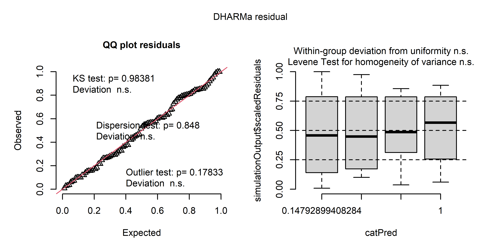<!-- -->

``` r
plot(simulateResiduals(mod_exp_am_num_quad))
```

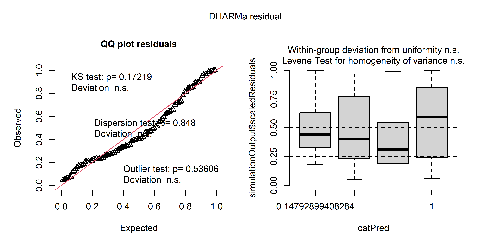<!-- -->

``` r
plot(simulateResiduals(mod_dev_am_num_quad))
```

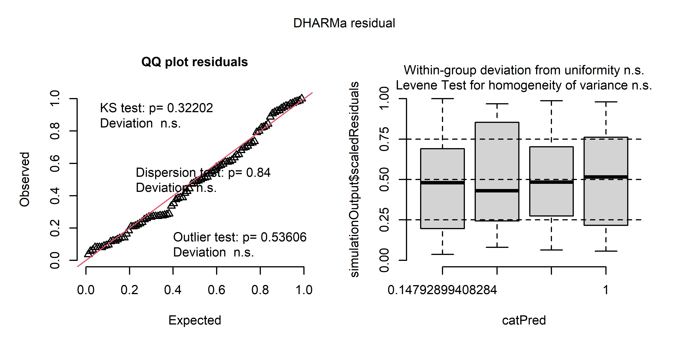<!-- -->

### Making predictions

``` r
new_data_days <- data.frame(AM_days = seq(from= min(Exp_design_all_2$AM_days), to = max(Exp_design_all_2$AM_days), length.out = 100),
                       AM_days_quad = seq(from= min(Exp_design_all_2$AM_days), to = max(Exp_design_all_2$AM_days), length.out = 100)^2)


predicted_obs <- predict(mod_obs_am_num, newdata = new_data_days, se.fit = TRUE, re.form = NA)
predicted_obs$upper <- predicted_obs$fit + predicted_obs$se.fit * qnorm(0.975)
predicted_obs$lower <- predicted_obs$fit + predicted_obs$se.fit * qnorm(0.025) 

predicted_exp_quad <- predict(mod_exp_am_num_quad, newdata = new_data_days, se.fit = TRUE, re.form = NA)
predicted_exp_quad$upper <- predicted_exp_quad$fit + predicted_exp_quad$se.fit * qnorm(0.975)
predicted_exp_quad$lower <- predicted_exp_quad$fit + predicted_exp_quad$se.fit * qnorm(0.025) 

predicted_dev <- predict(mod_dev_am_num, newdata = new_data_days, se.fit = TRUE, re.form = NA)
predicted_dev$upper <- predicted_dev$fit + predicted_dev$se.fit * qnorm(0.975)
predicted_dev$lower <- predicted_dev$fit + predicted_dev$se.fit * qnorm(0.025) 
```

### Plots

``` r
set.seed(1)
#svg(file = "plots/Community structure analysis/beta_deviation.svg", width = 6, height = 3, pointsize = 8)

par(mfrow = c(1,2))
#par(mar  = c(4,4,1,1), bty = "n")

unique_AM_days <- unique(Exp_design_all_2$AM_days)
unique_AM_days_orig <- unique(Exp_design_all_2$AM_days_orig)

#vioplot(beta_dev$observed_distances ~ AM_days, data = Exp_design_all_2, at = unique_AM_days,
#        h = 0.05, drawRect = FALSE, border = FALSE, side = "left",
#        xaxt = "n", yaxt = "n", ylab = "", xlab = "", ylim = c(0.1,0.8),
#        col = transparent("blue", trans.val = 0.85), wex = 20,  xlim = c(min(unique_AM_days)*1.1,max(unique_AM_days)*1.1), xaxs = "i")

#par(mar  = c(4,4,1,1), bty = "n", new = TRUE)
#vioplot(beta_dev$expected_distances ~ AM_days, data = Exp_design_all_2, at = unique_AM_days,
#        h = 0.005, drawRect = FALSE, border = FALSE, side = "right",
#        xaxt = "n", yaxt = "n", ylab = "", xlab = "", ylim = c(0.1,0.8),
#        col = transparent("red", trans.val = 0.85), wex = 20,  xlim = c(min(unique_AM_days)*1.1,max(unique_AM_days)*1.1), xaxs = "i")

par(mar  = c(4,4,1,1), bty = "l", new = FALSE)
plot(beta_dev$observed_distances ~ jitter(AM_days, 1),
     data = Exp_design_all_2, xaxt = "n", ylab = "", xlab = "", type = "n", ylim = c(0.1,0.8), xlim = c(min(unique_AM_days)*1.25,max(unique_AM_days)*1.25),  xaxs = "i")

polygon(x = c(new_data_days$AM_days[1:100], new_data_days$AM_days[100:1]),
        y = c(predicted_obs$upper[1:100], predicted_obs$lower[100:1]), col = transparent("blue", trans.val = 0.6), border = FALSE) 

polygon(x = c(new_data_days$AM_days[1:100], new_data_days$AM_days[100:1]),
        y = c(predicted_exp_quad$upper[1:100], predicted_exp_quad$lower[100:1]), col = transparent("red", trans.val = 0.6), border = FALSE) 


points(beta_dev$observed_distances ~ jitter(AM_days-0.075, 0.5), pch = 21, col= "black",bg = transparent("blue", trans.val = 0.75), cex = 1.1, data = Exp_design_all_2)
points(beta_dev$expected_distances ~ jitter(AM_days+0.075, 0.5), pch = 21, col= "black",bg = transparent("red", trans.val = 0.75), cex = 1.1, data = Exp_design_all_2)

lines(x = new_data_days$AM_days,y = predicted_obs$fit, col = "black", lwd = 2)
lines(x = new_data_days$AM_days,y = predicted_exp_quad$fit, col = "black", lwd = 2)


title(ylab = "Distance to centroid", cex.lab = 1.25, line= 2.25)
axis(1, at = unique_AM_days, labels = c("32", "80", "116", "158"))
title(xlab = "Days", cex.lab = 1.25 ,line = 2.25)

par(new = TRUE, mar = c(0,0,0,0), bty = "n")
plot(NA, ylim = c(0,100), xlim = c(0,100), xaxt = "n", yaxt = "n")

legend(legend = c("Observed",
                  "Expected"), x = 100, y = 18, bty = "n", pch = 21, col = "black", pt.bg = c(transparent("blue", trans.val = 0.75),transparent("red", trans.val = 0.75)), xjust = 1, yjust = 0)

letters(x = 5, y = 97, "a)", cex = 1.5)

#####################################################################################################################


#par(mar  = c(4,4,1,1), bty = "n")
#vioplot(MY_beta_dev$deviation_distances ~ AM_days, data = Exp_design_all_2, at = c(32,80,116,158),
#        h = 1, drawRect = FALSE, border = FALSE,
#        xaxt = "n", yaxt = "n", ylab = "", xlab = "", 
#        col = transparent("aquamarine2", trans.val = 0.8), wex = 20,  xlim = c(20,170), xaxs = "i")#, ylim = c(-3,5))

par(mar  = c(4,4,1,1), bty = "l", new = FALSE)
plot(beta_dev$deviation_distances ~ jitter(AM_days, 0.5),
     data = Exp_design_all_2, xaxt = "n", ylab = "", xlab = "", type = "n",  xlim = c(min(unique_AM_days)*1.25,max(unique_AM_days)*1.25), xaxs = "i")#, ylim = c(-3,5),)

polygon(x = c(new_data_days$AM_days[1:100], new_data_days$AM_days[100:1]),
        y = c(predicted_dev$upper[1:100], predicted_dev$lower[100:1]), col = transparent("grey50", trans.val = 0.5), border = FALSE) 

points(beta_dev$deviation_distances ~ jitter(AM_days, 1), pch = 21, col= "black",bg = transparent("aquamarine2", trans.val = 0.5), cex = 1.1, data = Exp_design_all_2)
lines(x = new_data_days$AM_days,y = predicted_dev$fit, col = "black", lwd = 2)
abline(h = 0, lwd = 1.5, lty = 2, col = "black")
title(ylab = "Deviation distances", cex.lab = 1.25, line= 2.25)
axis(1, at = unique_AM_days, labels = c("32", "80", "116", "158"))
title(xlab = "Days", cex.lab = 1.25 ,line = 2.25)

letters(x = 5, y = 97, "b)", cex = 1.5)
```

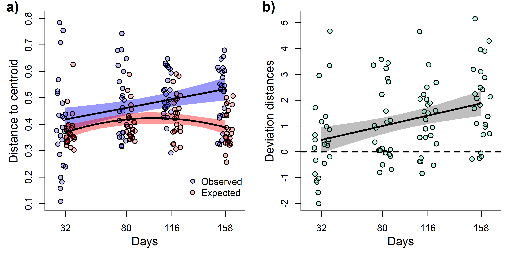<!-- -->

``` r
#dev.off()
```

Percentage increase in observed community variability:

``` r
preds <- predict(mod_obs_am_num, newdata = data.frame(AM_days = c(unscale(32, attr_AM_days, TRUE),
                                                         unscale(158, attr_AM_days, TRUE))), se.fit = TRUE, re.form = NA)
((preds$fit[2] - preds$fit[1]) / preds$fit[1]) * 100
```

    ## eta_predict 
    ##    27.35382

Peak of expected community variability:

``` r
peak <- new_data_days$AM_days[which(predicted_exp_quad$fit %in% max(predicted_exp_quad$fit))]
unscale(peak, attr_AM_days, FALSE)
```

    ## [1] 102

Percentage increase up to the peak of expected community variability :

``` r
newdata <- data.frame(AM_days = c(unscale(32, attr_AM_days, TRUE), peak),
                      AM_days_quad = c(unscale(32, attr_AM_days, TRUE), peak)^2)
preds <- predict(mod_exp_am_num_quad, newdata = newdata, se.fit = TRUE, re.form = NA)
((preds$fit[2] - preds$fit[1]) / preds$fit[1]) * 100
```

    ## eta_predict 
    ##    14.55751

Percentage decrease in expected community variability from the peak up
to the end of the experiment:

``` r
newdata <- data.frame(AM_days = c(peak, unscale(158, attr_AM_days, TRUE)),
                      AM_days_quad = c(peak, unscale(158, attr_AM_days, TRUE))^2)
preds <- predict(mod_exp_am_num_quad, newdata = newdata, se.fit = TRUE, re.form = NA)
((preds$fit[2] - preds$fit[1]) / preds$fit[1]) * 100
```

    ## eta_predict 
    ##   -8.167786

Percentage increase in deviation variability:

``` r
preds <- predict(mod_dev_am_num, newdata = data.frame(AM_days = c(unscale(32, attr_AM_days, TRUE),
                                                         unscale(158, attr_AM_days, TRUE))), se.fit = TRUE, re.form = NA)

((preds$fit[2] - preds$fit[1]) / preds$fit[1]) * 100
```

    ## eta_predict 
    ##    308.5813

# Environmental variability

``` r
Env$AM_match <- rep(NA, nrow(Env))

Env$AM_match[Env$amostragem == 2] <- 1
Env$AM_match[Env$amostragem == 5] <- 2
Env$AM_match[Env$amostragem == 7] <- 3
Env$AM_match[Env$amostragem == 9] <- 4

Env <- Env[is.na(Env$AM_match)==FALSE,]

Exp_design_all_2$site_AM <- interaction(Exp_design_all_2$sites, Exp_design_all_2$AM)
Env$site_AM <- interaction(Env$id, Env$AM_match)


Env_2 <- Env[Env$Tratamento != "atrasado",]
Env_2 <- Env_2[match(Exp_design_all_2$site_AM, Env_2$site_AM),]

nrow(Env_2)
```

    ## [1] 96

``` r
nrow(Exp_design_all_2)
```

    ## [1] 96

``` r
only_Env <- Env_2[,c(6,7,9,10,11)]

only_Env_st <- decostand(only_Env, method = "stand")

dist_env <- vegdist(only_Env_st, method = "euclidean")

env_var <- betadisper(dist_env, group = Env_2$AM_match)


pca_env <- rda(only_Env_st)

env_eigenvalues <- pca_env$CA$eig / sum(pca_env$CA$eig)
env_eigenvalues
```

    ##         PC1         PC2         PC3         PC4         PC5 
    ## 0.450378473 0.296214409 0.215893071 0.029516896 0.007997152

``` r
env_PCs <- pca_env$CA$u

pca_env$CA$v
```

    ##                     PC1        PC2        PC3         PC4         PC5
    ## pH            0.3708232  0.5790498  0.3538963 -0.62828629  0.08488367
    ## OD            0.1874022 -0.2302452  0.8715313  0.39020211  0.00656506
    ## Condutividade 0.5715676 -0.3628726 -0.2139811 -0.02253199  0.70380276
    ## Temperatura   0.3912960  0.6037103 -0.2185204  0.65724866 -0.05190700
    ## TDS           0.5895494 -0.3399203 -0.1471447 -0.14323113 -0.70336264

First PC is basically related to conductivity and total dissolved solids
Second PC is basically related to temperature and pH Third PC is
basically related to dissolved oxygen

Effect of time on environmental variability

``` r
mod_env_null <- glmmTMB(env_var$distances ~ 1 + (1|block2/sites), data = Exp_design_all_2, control = glmmTMBControl(optimizer=optim, optArgs=list(method="BFGS")))
```

    ## Warning in glmmTMB(env_var$distances ~ 1 + (1 | block2/sites), data =
    ## Exp_design_all_2, : use of the '$' operator in formulas is not recommended

``` r
mod_env_am_num <- glmmTMB(env_var$distances ~ AM_days + (1|block2/sites), data = Exp_design_all_2, control = glmmTMBControl(optimizer=optim, optArgs=list(method="BFGS")))
```

    ## Warning in glmmTMB(env_var$distances ~ AM_days + (1 | block2/sites), data =
    ## Exp_design_all_2, : use of the '$' operator in formulas is not recommended

``` r
mod_env_am_num_quad <- glmmTMB(env_var$distances ~ AM_days + AM_days_quad + (1|block2/sites), data = Exp_design_all_2, control = glmmTMBControl(optimizer=optim, optArgs=list(method="BFGS")))
```

    ## Warning in glmmTMB(env_var$distances ~ AM_days + AM_days_quad + (1 |
    ## block2/sites), : use of the '$' operator in formulas is not recommended

``` r
plot(simulateResiduals(mod_env_am_num_quad))
```

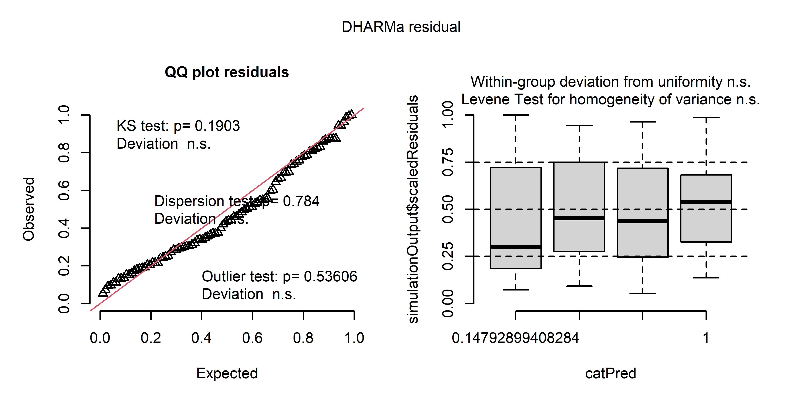<!-- -->

``` r
anova_env <- anova(mod_env_null, mod_env_am_num, mod_env_am_num_quad)
anova_env
```

    ## Data: Exp_design_all_2
    ## Models:
    ## mod_env_null: env_var$distances ~ 1 + (1 | block2/sites), zi=~0, disp=~1
    ## mod_env_am_num: env_var$distances ~ AM_days + (1 | block2/sites), zi=~0, disp=~1
    ## mod_env_am_num_quad: env_var$distances ~ AM_days + AM_days_quad + (1 | block2/sites), zi=~0, disp=~1
    ##                     Df    AIC    BIC  logLik deviance  Chisq Chi Df Pr(>Chisq)
    ## mod_env_null         4 178.95 189.20 -85.473   170.95                         
    ## mod_env_am_num       5 180.93 193.75 -85.463   170.93 0.0199      1     0.8878
    ## mod_env_am_num_quad  6 182.91 198.29 -85.454   170.91 0.0190      1     0.8904

Effect of environmental variability on observed community variability

``` r
Exp_design_all_2$env_var <- env_var$distances

mod_obs_am_num <- glmmTMB(beta_dev$observed_distances ~ AM_days + (1|block2/sites), data = Exp_design_all_2, control = glmmTMBControl(optimizer=optim, optArgs=list(method="BFGS")))
```

    ## Warning in glmmTMB(beta_dev$observed_distances ~ AM_days + (1 | block2/sites),
    ## : use of the '$' operator in formulas is not recommended

``` r
mod_obs_am_num_env <- glmmTMB(beta_dev$observed_distances ~ AM_days + env_var + (1|block2/sites), data = Exp_design_all_2, control = glmmTMBControl(optimizer=optim, optArgs=list(method="BFGS")))
```

    ## Warning in glmmTMB(beta_dev$observed_distances ~ AM_days + env_var + (1 | : use
    ## of the '$' operator in formulas is not recommended

``` r
plot(simulateResiduals(mod_obs_am_num_env))
```

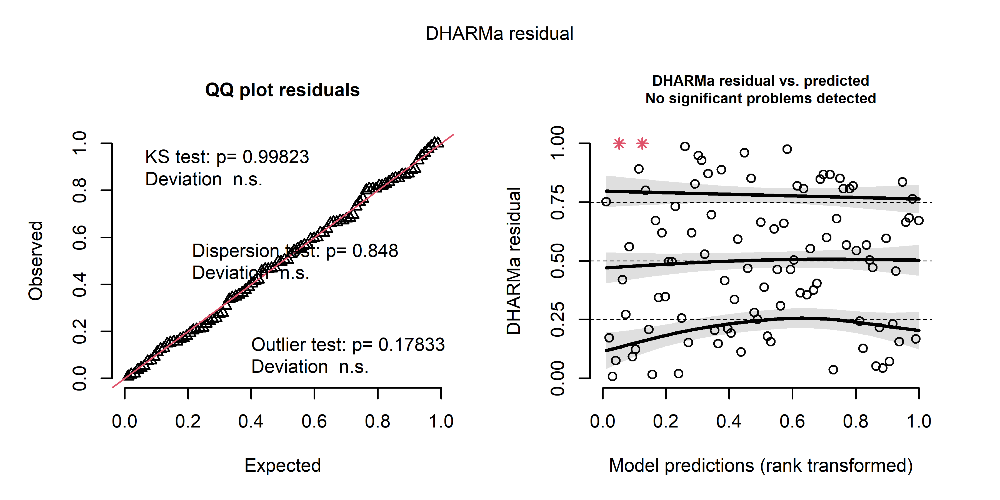<!-- -->

``` r
anova(mod_obs_am_num, mod_obs_am_num_env)
```

    ## Data: Exp_design_all_2
    ## Models:
    ## mod_obs_am_num: beta_dev$observed_distances ~ AM_days + (1 | block2/sites), zi=~0, disp=~1
    ## mod_obs_am_num_env: beta_dev$observed_distances ~ AM_days + env_var + (1 | block2/sites), zi=~0, disp=~1
    ##                    Df     AIC     BIC logLik deviance  Chisq Chi Df Pr(>Chisq)
    ## mod_obs_am_num      5 -109.70 -96.882 59.852  -119.70                         
    ## mod_obs_am_num_env  6 -109.47 -94.080 60.733  -121.47 1.7623      1     0.1843

``` r
mod_obs_env_pcs <- glmmTMB(beta_dev$observed_distances ~ AM_days + (1|block2/sites) + 
                            env_PCs[,1] +
                            env_PCs[,2] + 
                            env_PCs[,3], data = Exp_design_all_2, control = glmmTMBControl(optimizer=optim, optArgs=list(method="BFGS")))
```

    ## Warning in glmmTMB(beta_dev$observed_distances ~ AM_days + (1 | block2/sites) +
    ## : use of the '$' operator in formulas is not recommended

    ## Warning in finalizeTMB(TMBStruc, obj, fit, h, data.tmb.old): Model convergence
    ## problem; non-positive-definite Hessian matrix. See vignette('troubleshooting')

``` r
Anova(mod_obs_env_pcs)
```

    ## Analysis of Deviance Table (Type II Wald chisquare tests)
    ## 
    ## Response: beta_dev$observed_distances
    ##               Chisq Df Pr(>Chisq)  
    ## AM_days      4.5912  1    0.03214 *
    ## env_PCs[, 1] 0.5688  1    0.45072  
    ## env_PCs[, 2] 1.1694  1    0.27953  
    ## env_PCs[, 3] 3.3768  1    0.06612 .
    ## ---
    ## Signif. codes:  0 '***' 0.001 '**' 0.01 '*' 0.05 '.' 0.1 ' ' 1

Effect of environmental variability on beta deviation

``` r
Exp_design_all_2$env_var <- env_var$distances

mod_dev_am_num <- glmmTMB(beta_dev$deviation_distances ~ AM_days + (1|block2/sites), data = Exp_design_all_2, control = glmmTMBControl(optimizer=optim, optArgs=list(method="BFGS")))
```

    ## Warning in glmmTMB(beta_dev$deviation_distances ~ AM_days + (1 | block2/sites),
    ## : use of the '$' operator in formulas is not recommended

``` r
mod_dev_am_num_env <- glmmTMB(beta_dev$deviation_distances ~ AM_days + env_var + (1|block2/sites), data = Exp_design_all_2, control = glmmTMBControl(optimizer=optim, optArgs=list(method="BFGS")))
```

    ## Warning in glmmTMB(beta_dev$deviation_distances ~ AM_days + env_var + (1 | :
    ## use of the '$' operator in formulas is not recommended

``` r
plot(simulateResiduals(mod_dev_am_num_env))
```

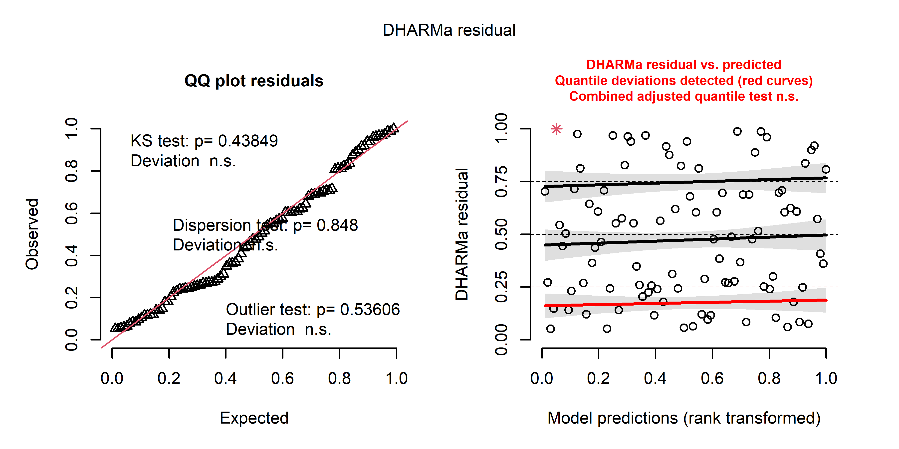<!-- -->

``` r
anova(mod_dev_am_num, mod_dev_am_num_env)
```

    ## Data: Exp_design_all_2
    ## Models:
    ## mod_dev_am_num: beta_dev$deviation_distances ~ AM_days + (1 | block2/sites), zi=~0, disp=~1
    ## mod_dev_am_num_env: beta_dev$deviation_distances ~ AM_days + env_var + (1 | block2/sites), zi=~0, disp=~1
    ##                    Df    AIC   BIC  logLik deviance  Chisq Chi Df Pr(>Chisq)
    ## mod_dev_am_num      5 352.18 365.0 -171.09   342.18                         
    ## mod_dev_am_num_env  6 353.52 368.9 -170.76   341.52 0.6639      1     0.4152

Now environmental mean

``` r
mod_env1_pcs_null <- glmmTMB(env_PCs[,1] ~ 1 + (1|block2/sites), data = Exp_design_all_2)
mod_env1_pcs_lin <- glmmTMB(env_PCs[,1] ~ AM_days + (1|block2/sites), data = Exp_design_all_2)
mod_env1_pcs_quad <- glmmTMB(env_PCs[,1] ~ AM_days + AM_days_quad + (1|block2/sites), data = Exp_design_all_2)

plot(simulateResiduals(mod_env1_pcs_quad))
```

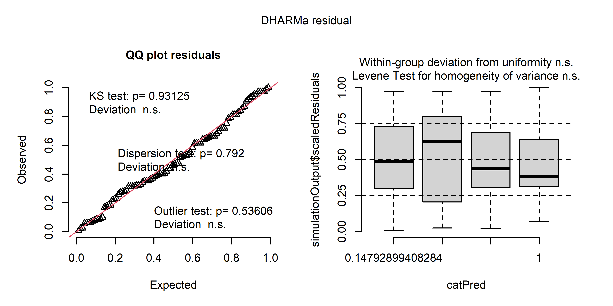<!-- -->

``` r
anova(mod_env1_pcs_null, mod_env1_pcs_lin, mod_env1_pcs_quad)
```

    ## Data: Exp_design_all_2
    ## Models:
    ## mod_env1_pcs_null: env_PCs[, 1] ~ 1 + (1 | block2/sites), zi=~0, disp=~1
    ## mod_env1_pcs_lin: env_PCs[, 1] ~ AM_days + (1 | block2/sites), zi=~0, disp=~1
    ## mod_env1_pcs_quad: env_PCs[, 1] ~ AM_days + AM_days_quad + (1 | block2/sites), zi=~0, disp=~1
    ##                   Df     AIC     BIC  logLik deviance    Chisq Chi Df
    ## mod_env1_pcs_null  4 -157.74 -147.48  82.871  -165.74                
    ## mod_env1_pcs_lin   5 -299.75 -286.93 154.874  -309.75 144.0070      1
    ## mod_env1_pcs_quad  6 -299.12 -283.74 155.561  -311.12   1.3741      1
    ##                   Pr(>Chisq)    
    ## mod_env1_pcs_null               
    ## mod_env1_pcs_lin      <2e-16 ***
    ## mod_env1_pcs_quad     0.2411    
    ## ---
    ## Signif. codes:  0 '***' 0.001 '**' 0.01 '*' 0.05 '.' 0.1 ' ' 1

``` r
Exp_design_all_2$AM_days_third <- Exp_design_all_2$AM_days^3

mod_env2_pcs_null <- glmmTMB(env_PCs[,2] ~ 1 + (1|block2/sites), data = Exp_design_all_2)
```

    ## Warning in finalizeTMB(TMBStruc, obj, fit, h, data.tmb.old): Model convergence
    ## problem; non-positive-definite Hessian matrix. See vignette('troubleshooting')

``` r
mod_env2_pcs_lin <- glmmTMB(env_PCs[,2] ~ AM_days + (1|block2/sites), data = Exp_design_all_2)
mod_env2_pcs_quad <- glmmTMB(env_PCs[,2] ~ AM_days + AM_days_quad + (1|block2/sites), data = Exp_design_all_2)
mod_env2_pcs_third <- glmmTMB(env_PCs[,2] ~ AM_days + AM_days_quad + AM_days_third + (1|block2/sites), data = Exp_design_all_2)

plot(simulateResiduals(mod_env2_pcs_third))
```

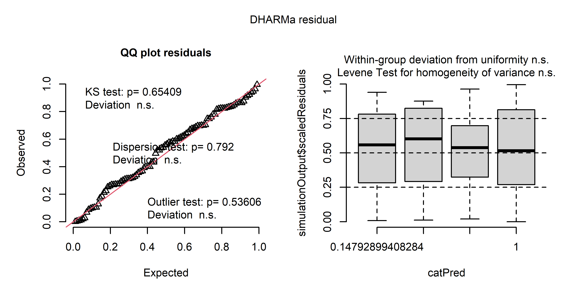<!-- -->

``` r
anova(mod_env2_pcs_null, mod_env2_pcs_lin, mod_env2_pcs_quad ,mod_env2_pcs_third)
```

    ## Data: Exp_design_all_2
    ## Models:
    ## mod_env2_pcs_null: env_PCs[, 2] ~ 1 + (1 | block2/sites), zi=~0, disp=~1
    ## mod_env2_pcs_lin: env_PCs[, 2] ~ AM_days + (1 | block2/sites), zi=~0, disp=~1
    ## mod_env2_pcs_quad: env_PCs[, 2] ~ AM_days + AM_days_quad + (1 | block2/sites), zi=~0, disp=~1
    ## mod_env2_pcs_third: env_PCs[, 2] ~ AM_days + AM_days_quad + AM_days_third + (1 | , zi=~0, disp=~1
    ## mod_env2_pcs_third:     block2/sites), zi=~0, disp=~1
    ##                    Df     AIC     BIC  logLik deviance  Chisq Chi Df Pr(>Chisq)
    ## mod_env2_pcs_null   4                                                          
    ## mod_env2_pcs_lin    5 -155.74 -142.92  82.871  -165.74             1           
    ## mod_env2_pcs_quad   6 -193.93 -178.55 102.966  -205.93  40.19      1  2.305e-10
    ## mod_env2_pcs_third  7 -391.16 -373.21 202.578  -405.16 199.22      1  < 2.2e-16
    ##                       
    ## mod_env2_pcs_null     
    ## mod_env2_pcs_lin      
    ## mod_env2_pcs_quad  ***
    ## mod_env2_pcs_third ***
    ## ---
    ## Signif. codes:  0 '***' 0.001 '**' 0.01 '*' 0.05 '.' 0.1 ' ' 1

``` r
mod_env3_pcs_null <- glmmTMB(env_PCs[,3] ~ 1 + (1|block2/sites), data = Exp_design_all_2)
mod_env3_pcs_lin <- glmmTMB(env_PCs[,3] ~ AM_days + (1|block2/sites), data = Exp_design_all_2)
mod_env3_pcs_quad <- glmmTMB(env_PCs[,3] ~ AM_days + AM_days_quad + (1|block2/sites), data = Exp_design_all_2)

plot(simulateResiduals(mod_env3_pcs_quad))
```

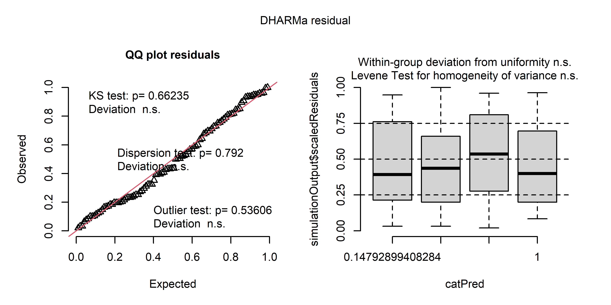<!-- -->

``` r
anova(mod_env3_pcs_null, mod_env3_pcs_lin, mod_env3_pcs_quad)
```

    ## Data: Exp_design_all_2
    ## Models:
    ## mod_env3_pcs_null: env_PCs[, 3] ~ 1 + (1 | block2/sites), zi=~0, disp=~1
    ## mod_env3_pcs_lin: env_PCs[, 3] ~ AM_days + (1 | block2/sites), zi=~0, disp=~1
    ## mod_env3_pcs_quad: env_PCs[, 3] ~ AM_days + AM_days_quad + (1 | block2/sites), zi=~0, disp=~1
    ##                   Df     AIC     BIC logLik deviance  Chisq Chi Df Pr(>Chisq)
    ## mod_env3_pcs_null  4 -158.02 -147.77 83.012  -166.02                         
    ## mod_env3_pcs_lin   5 -163.92 -151.10 86.960  -173.92 7.8951      1   0.004957
    ## mod_env3_pcs_quad  6 -165.95 -150.56 88.974  -177.95 4.0286      1   0.044734
    ##                     
    ## mod_env3_pcs_null   
    ## mod_env3_pcs_lin  **
    ## mod_env3_pcs_quad * 
    ## ---
    ## Signif. codes:  0 '***' 0.001 '**' 0.01 '*' 0.05 '.' 0.1 ' ' 1

Basically all environmental predictors very throughout time. We took the
residual of such models e checked if those residuals can explain
community variability alongside with time.

``` r
Exp_design_all_2$resid_PC3 <- residuals(mod_env3_pcs_quad)
Exp_design_all_2$resid_PC2 <- residuals(mod_env2_pcs_quad)
Exp_design_all_2$resid_PC1 <- residuals(mod_env1_pcs_lin)


mod_obs_env_pcs <- glmmTMB(beta_dev$observed_distances ~ (1|block2/sites) + AM_days +
                            resid_PC1 +
                            resid_PC2 + 
                            resid_PC3, data = Exp_design_all_2, control = glmmTMBControl(optimizer=optim, optArgs=list(method="BFGS")))
```

    ## Warning in glmmTMB(beta_dev$observed_distances ~ (1 | block2/sites) + AM_days +
    ## : use of the '$' operator in formulas is not recommended

``` r
plot(simulateResiduals(mod_obs_env_pcs))
```

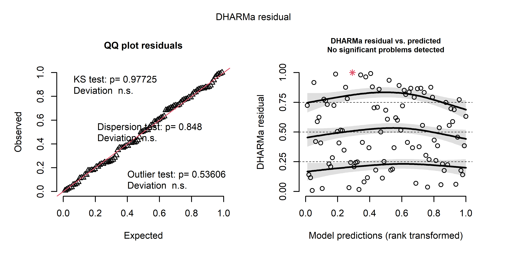<!-- -->

``` r
Anova(mod_obs_env_pcs)
```

    ## Analysis of Deviance Table (Type II Wald chisquare tests)
    ## 
    ## Response: beta_dev$observed_distances
    ##             Chisq Df Pr(>Chisq)   
    ## AM_days   10.4686  1   0.001214 **
    ## resid_PC1  0.5953  1   0.440373   
    ## resid_PC2  0.3490  1   0.554666   
    ## resid_PC3  2.9555  1   0.085583 . 
    ## ---
    ## Signif. codes:  0 '***' 0.001 '**' 0.01 '*' 0.05 '.' 0.1 ' ' 1

``` r
mod_exp_env_pcs <- glmmTMB(beta_dev$expected_distances ~ (1|block2/sites) + poly(AM_days, degree = 2) +
                            resid_PC1 +
                            resid_PC2 + 
                            resid_PC3, data = Exp_design_all_2, control = glmmTMBControl(optimizer=optim, optArgs=list(method="BFGS")))
```

    ## Warning in glmmTMB(beta_dev$expected_distances ~ (1 | block2/sites) +
    ## poly(AM_days, : use of the '$' operator in formulas is not recommended

``` r
plot(simulateResiduals(mod_exp_env_pcs))
```

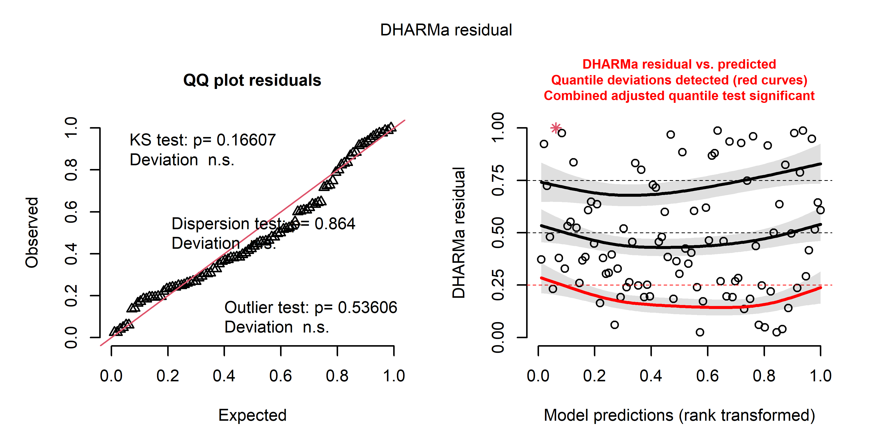<!-- -->

``` r
Anova(mod_exp_env_pcs)
```

    ## Analysis of Deviance Table (Type II Wald chisquare tests)
    ## 
    ## Response: beta_dev$expected_distances
    ##                             Chisq Df Pr(>Chisq)   
    ## poly(AM_days, degree = 2) 10.1923  2    0.00612 **
    ## resid_PC1                  1.0905  1    0.29635   
    ## resid_PC2                  4.2329  1    0.03965 * 
    ## resid_PC3                  0.1832  1    0.66867   
    ## ---
    ## Signif. codes:  0 '***' 0.001 '**' 0.01 '*' 0.05 '.' 0.1 ' ' 1

``` r
mod_dev_env_pcs <- glmmTMB(beta_dev$deviation_distances ~ (1|block2/sites) + AM_days +
                            resid_PC1 +
                            resid_PC2 + 
                            resid_PC3, data = Exp_design_all_2)
```

    ## Warning in glmmTMB(beta_dev$deviation_distances ~ (1 | block2/sites) + AM_days
    ## + : use of the '$' operator in formulas is not recommended

``` r
plot(simulateResiduals(mod_dev_env_pcs))
```

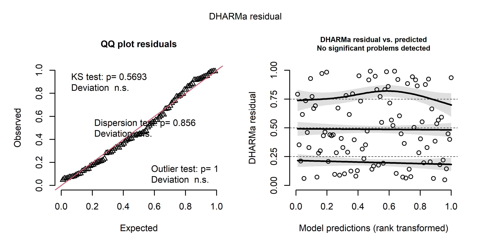<!-- -->

``` r
Anova(mod_dev_env_pcs)
```

    ## Analysis of Deviance Table (Type II Wald chisquare tests)
    ## 
    ## Response: beta_dev$deviation_distances
    ##             Chisq Df Pr(>Chisq)    
    ## AM_days   13.7256  1  0.0002116 ***
    ## resid_PC1  0.8362  1  0.3604920    
    ## resid_PC2  0.3423  1  0.5585260    
    ## resid_PC3  6.3311  1  0.0118642 *  
    ## ---
    ## Signif. codes:  0 '***' 0.001 '**' 0.01 '*' 0.05 '.' 0.1 ' ' 1

### Making predictons

``` r
new_data_days$AM_days_third <- new_data_days$AM_days^3

predicted_env_PC1_time <- predict(mod_env1_pcs_lin, newdata = new_data_days, se.fit = TRUE, re.form = NA)
predicted_env_PC1_time$upper <- predicted_env_PC1_time$fit + predicted_env_PC1_time$se.fit * qnorm(0.975)
predicted_env_PC1_time$lower <- predicted_env_PC1_time$fit + predicted_env_PC1_time$se.fit * qnorm(0.025) 

predicted_env_PC2_time <- predict(mod_env2_pcs_third, newdata = new_data_days, se.fit = TRUE, re.form = NA)
predicted_env_PC2_time$upper <- predicted_env_PC2_time$fit + predicted_env_PC2_time$se.fit * qnorm(0.975)
predicted_env_PC2_time$lower <- predicted_env_PC2_time$fit + predicted_env_PC2_time$se.fit * qnorm(0.025) 

predicted_env_PC3_time <- predict(mod_env3_pcs_quad, newdata = new_data_days, se.fit = TRUE, re.form = NA)
predicted_env_PC3_time$upper <- predicted_env_PC3_time$fit + predicted_env_PC3_time$se.fit * qnorm(0.975)
predicted_env_PC3_time$lower <- predicted_env_PC3_time$fit + predicted_env_PC3_time$se.fit * qnorm(0.025) 


new_data_obs_PC3 <- new_data_days
new_data_obs_PC3$resid_PC3 <- seq(from = min(Exp_design_all_2$resid_PC3), to = max(Exp_design_all_2$resid_PC3), length.out = nrow(new_data_obs_PC3))
new_data_obs_PC3$resid_PC2 <- rep(median(Exp_design_all_2$resid_PC2), nrow(new_data_obs_PC3))
new_data_obs_PC3$resid_PC1 <- rep(median(Exp_design_all_2$resid_PC1), nrow(new_data_obs_PC3))
new_data_obs_PC3$AM_days <- rep(median(new_data_obs_PC3$AM_days), nrow(new_data_obs_PC3))
new_data_obs_PC3$AM_days_quad <- new_data_obs_PC3$AM_days^2


predicted_obs_PC3 <- predict(mod_obs_env_pcs, newdata = new_data_obs_PC3, se.fit =  TRUE, re.form = NA)
predicted_obs_PC3$upper <- predicted_obs_PC3$fit + predicted_obs_PC3$se.fit * qnorm(0.975)
predicted_obs_PC3$lower <- predicted_obs_PC3$fit + predicted_obs_PC3$se.fit * qnorm(0.025) 

predicted_dev_PC3 <- predict(mod_dev_env_pcs, newdata = new_data_obs_PC3, se.fit =  TRUE, re.form = NA)
predicted_dev_PC3$upper <- predicted_dev_PC3$fit + predicted_dev_PC3$se.fit * qnorm(0.975)
predicted_dev_PC3$lower <- predicted_dev_PC3$fit + predicted_dev_PC3$se.fit * qnorm(0.025) 
```

### Plots

#### Environmental variability VS community variability

``` r
set.seed(1)
#svg(file = "plots/Community structure analysis/beta_deviation.svg", width = 6, height = 3, pointsize = 8)

par(mfrow = c(1,2))

par(mar  = c(4,4,1,1), bty = "l", new = FALSE)
plot(beta_dev$observed_distances ~ env_var,
     data = Exp_design_all_2, xaxt = "n", ylab = "", xlab = "", type = "n")


points(beta_dev$observed_distances[Exp_design_all_2$AM == 1] ~ env_var, pch = 21, col= "black",bg = transparent("grey80", trans.val = 0.6), cex = 1.1, data = Exp_design_all_2[Exp_design_all_2$AM == 1,])

points(beta_dev$observed_distances[Exp_design_all_2$AM == 2] ~ env_var, pch = 21, col= "black",bg = transparent("grey50", trans.val = 0.6), cex = 1.1, data = Exp_design_all_2[Exp_design_all_2$AM == 2,])

points(beta_dev$observed_distances[Exp_design_all_2$AM == 3] ~ env_var, pch = 21, col= "black",bg = transparent("grey20", trans.val = 0.6), cex = 1.1, data = Exp_design_all_2[Exp_design_all_2$AM == 3,])

points(beta_dev$observed_distances[Exp_design_all_2$AM == 4] ~ env_var, pch = 21, col= "black",bg = transparent("black", trans.val = 0.6), cex = 1.1, data = Exp_design_all_2[Exp_design_all_2$AM == 4,])

title(ylab = "Observed community variability", cex.lab = 1.25, line= 2.25)
axis(1)
title(xlab = "Environmental variability", cex.lab = 1.25 ,line = 2.25)

par(new = TRUE, mar = c(0,0,0,0), bty = "n")
plot(NA, ylim = c(0,100), xlim = c(0,100), xaxt = "n", yaxt = "n")

legend(legend = c("32 days",
                  "80 days",
                  "116 days",
                  "158 days"), x = 100, y = 100, bty = "n", pch = 21, col = "black", pt.bg = c(transparent("grey80", trans.val = 0.6),
                                                                                              transparent("grey50", trans.val = 0.6),
                                                                                              transparent("grey20", trans.val = 0.6),
                                                                                              transparent("black", trans.val = 0.6)), xjust = 1, yjust = 1)

letters(x = 5, y = 97, "a)", cex = 1.5)

#####################################################################################################################


par(mar  = c(4,4,1,1), bty = "l", new = FALSE)
plot(beta_dev$deviation_distances ~ env_var,
     data = Exp_design_all_2, xaxt = "n", ylab = "", xlab = "", type = "n")


points(beta_dev$deviation_distances[Exp_design_all_2$AM == 1] ~ env_var, pch = 21, col= "black",bg = transparent("grey80", trans.val = 0.6), cex = 1.1, data = Exp_design_all_2[Exp_design_all_2$AM == 1,])

points(beta_dev$deviation_distances[Exp_design_all_2$AM == 2] ~ env_var, pch = 21, col= "black",bg = transparent("grey50", trans.val = 0.6), cex = 1.1, data = Exp_design_all_2[Exp_design_all_2$AM == 2,])

points(beta_dev$deviation_distances[Exp_design_all_2$AM == 3] ~ env_var, pch = 21, col= "black",bg = transparent("grey20", trans.val = 0.6), cex = 1.1, data = Exp_design_all_2[Exp_design_all_2$AM == 3,])

points(beta_dev$deviation_distances[Exp_design_all_2$AM == 4] ~ env_var, pch = 21, col= "black",bg = transparent("black", trans.val = 0.6), cex = 1.1, data = Exp_design_all_2[Exp_design_all_2$AM == 4,])

title(ylab = "Beta deviation", cex.lab = 1.25, line= 2.25)
axis(1)
title(xlab = "Environmental variability", cex.lab = 1.25 ,line = 2.25)


letters(x = 5, y = 97, "b)", cex = 1.5)
```

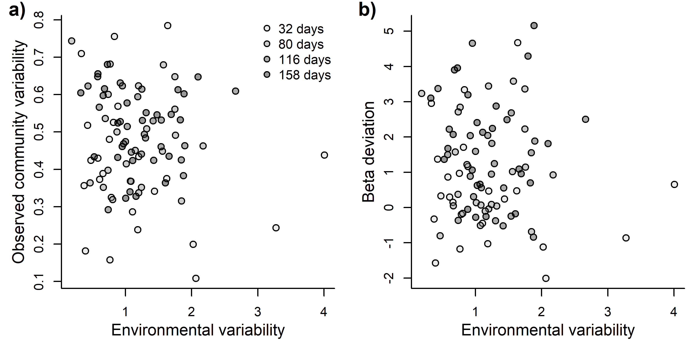<!-- -->

``` r
#dev.off()
```

#### Environmental parameters VS time

``` r
set.seed(1)
#svg(file = "plots/Community structure analysis/beta_deviation.svg", width = 6, height = 3, pointsize = 8)

par(mfrow = c(3,1))

unique_AM_days <- unique(Exp_design_all_2$AM_days)
unique_AM_days_orig <- unique(Exp_design_all_2$AM_days_orig)


par(mar  = c(4,4,1,1), bty = "l", new = FALSE)
plot(env_PCs[,1] ~ jitter(AM_days, 1),
     data = Exp_design_all_2, xaxt = "n", ylab = "", xlab = "", type = "n", xlim = c(min(unique_AM_days)*1.25,max(unique_AM_days)*1.25),  xaxs = "i")

polygon(x = c(new_data_days$AM_days[1:100], new_data_days$AM_days[100:1]),
        y = c(predicted_env_PC1_time$upper[1:100], predicted_env_PC1_time$lower[100:1]), col = transparent("blue", trans.val = 0.6), border = FALSE) 

points(env_PCs[,1] ~ jitter(AM_days, 0.5), pch = 21, col= "black",bg = transparent("blue", trans.val = 0.75), cex = 1.1, data = Exp_design_all_2)

lines(x = new_data_days$AM_days,y = predicted_env_PC1_time$fit, col = "black", lwd = 2)

title(ylab = "Environment PC1", cex.lab = 1, line= 3)
title(ylab = "(Conductivity and total dissolved solids)", cex.lab = 1, line= 2)

axis(1, at = unique_AM_days, labels = c("32", "80", "116", "158"))
title(xlab = "Days", cex.lab = 1.25 ,line = 2.25)

letters(x = 5, y = 97, "a)", cex = 1.5)

##############################################################################################


par(mar  = c(4,4,1,1), bty = "l", new = FALSE)
plot(env_PCs[,2] ~ jitter(AM_days, 1),
     data = Exp_design_all_2, xaxt = "n", ylab = "", xlab = "", type = "n", xlim = c(min(unique_AM_days)*1.25,max(unique_AM_days)*1.25),  xaxs = "i")

polygon(x = c(new_data_days$AM_days[1:100], new_data_days$AM_days[100:1]),
        y = c(predicted_env_PC2_time$upper[1:100], predicted_env_PC2_time$lower[100:1]), col = transparent("blue", trans.val = 0.6), border = FALSE) 

points(env_PCs[,2] ~ jitter(AM_days, 0.5), pch = 21, col= "black",bg = transparent("blue", trans.val = 0.75), cex = 1.1, data = Exp_design_all_2)

lines(x = new_data_days$AM_days,y = predicted_env_PC2_time$fit, col = "black", lwd = 2)

title(ylab = "Environment PC2", cex.lab = 1, line= 3)
title(ylab = "(Temperature and pH)", cex.lab = 1, line= 2)

axis(1, at = unique_AM_days, labels = c("32", "80", "116", "158"))
title(xlab = "Days", cex.lab = 1.25 ,line = 2.25)

letters(x = 5, y = 97, "b)", cex = 1.5)


##############################################################################################


par(mar  = c(4,4,1,1), bty = "l", new = FALSE)
plot(env_PCs[,3] ~ jitter(AM_days, 1),
     data = Exp_design_all_2, xaxt = "n", ylab = "", xlab = "", type = "n", xlim = c(min(unique_AM_days)*1.25,max(unique_AM_days)*1.25),  xaxs = "i")

polygon(x = c(new_data_days$AM_days[1:100], new_data_days$AM_days[100:1]),
        y = c(predicted_env_PC3_time$upper[1:100], predicted_env_PC3_time$lower[100:1]), col = transparent("blue", trans.val = 0.6), border = FALSE) 

points(env_PCs[,3] ~ jitter(AM_days, 0.5), pch = 21, col= "black",bg = transparent("blue", trans.val = 0.75), cex = 1.1, data = Exp_design_all_2)

lines(x = new_data_days$AM_days,y = predicted_env_PC3_time$fit, col = "black", lwd = 2)

title(ylab = "Environment PC3", cex.lab = 1, line= 3)
title(ylab = "(Dissolved oxygen)", cex.lab = 1, line= 2)

axis(1, at = unique_AM_days, labels = c("32", "80", "116", "158"))
title(xlab = "Days", cex.lab = 1.25 ,line = 2.25)

letters(x = 5, y = 97, "c)", cex = 1.5)
```

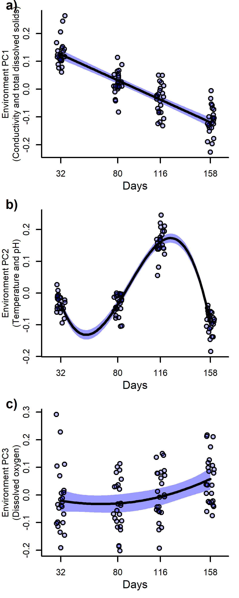<!-- -->

#### Environmental parameters VS community variability

``` r
set.seed(1)
#svg(file = "plots/Community structure analysis/beta_deviation.svg", width = 6, height = 3, pointsize = 8)

par(mfrow = c(1,2))

par(mar  = c(4,4,1,1), bty = "l", new = FALSE)
plot(beta_dev$observed_distances ~ resid_PC3,
     data = Exp_design_all_2, xaxt = "n", ylab = "", xlab = "", type = "n")

polygon(x = c(new_data_obs_PC3$resid_PC3[1:100], new_data_obs_PC3$resid_PC3[100:1]),
        y = c(predicted_obs_PC3$upper[1:100], predicted_obs_PC3$lower[100:1]), col = transparent("grey20", trans.val = 0.6), border = FALSE) 

points(beta_dev$observed_distances[Exp_design_all_2$AM == 1] ~ resid_PC3, pch = 21, col= "black",bg = transparent("grey80", trans.val = 0.6), cex = 1.1, data = Exp_design_all_2[Exp_design_all_2$AM == 1,])

points(beta_dev$observed_distances[Exp_design_all_2$AM == 2] ~ resid_PC3, pch = 21, col= "black",bg = transparent("grey50", trans.val = 0.6), cex = 1.1, data = Exp_design_all_2[Exp_design_all_2$AM == 2,])

points(beta_dev$observed_distances[Exp_design_all_2$AM == 3] ~ resid_PC3, pch = 21, col= "black",bg = transparent("grey20", trans.val = 0.6), cex = 1.1, data = Exp_design_all_2[Exp_design_all_2$AM == 3,])

points(beta_dev$observed_distances[Exp_design_all_2$AM == 4] ~ resid_PC3, pch = 21, col= "black",bg = transparent("black", trans.val = 0.6), cex = 1.1, data = Exp_design_all_2[Exp_design_all_2$AM == 4,])

lines(x = new_data_obs_PC3$resid_PC3,y = predicted_obs_PC3$fit, col = "black", lwd = 2, lty = 2)


title(ylab = "Observed community variability", cex.lab = 1.25, line= 2.25)
axis(1)
title(xlab = "Residuals of environmental PC3", cex.lab = 1 ,line = 2)
title(xlab = "(Dissolved oxygen without temporal effects)", cex.lab = 0.9 ,line = 3)


letters(x = 5, y = 97, "a)", cex = 1.5)

#####################################################################################################################


par(mar  = c(4,4,1,1), bty = "l", new = FALSE)
plot(beta_dev$deviation_distances ~ resid_PC3,
     data = Exp_design_all_2, xaxt = "n", ylab = "", xlab = "", type = "n")

polygon(x = c(new_data_obs_PC3$resid_PC3[1:100], new_data_obs_PC3$resid_PC3[100:1]),
        y = c(predicted_dev_PC3$upper[1:100], predicted_dev_PC3$lower[100:1]), col = transparent("grey20", trans.val = 0.6), border = FALSE) 

points(beta_dev$deviation_distances[Exp_design_all_2$AM == 1] ~ resid_PC3, pch = 21, col= "black",bg = transparent("grey80", trans.val = 0.6), cex = 1.1, data = Exp_design_all_2[Exp_design_all_2$AM == 1,])

points(beta_dev$deviation_distances[Exp_design_all_2$AM == 2] ~ resid_PC3, pch = 21, col= "black",bg = transparent("grey50", trans.val = 0.6), cex = 1.1, data = Exp_design_all_2[Exp_design_all_2$AM == 2,])

points(beta_dev$deviation_distances[Exp_design_all_2$AM == 3] ~ resid_PC3, pch = 21, col= "black",bg = transparent("grey20", trans.val = 0.6), cex = 1.1, data = Exp_design_all_2[Exp_design_all_2$AM == 3,])

points(beta_dev$deviation_distances[Exp_design_all_2$AM == 4] ~ resid_PC3, pch = 21, col= "black",bg = transparent("black", trans.val = 0.6), cex = 1.1, data = Exp_design_all_2[Exp_design_all_2$AM == 4,])

lines(x = new_data_obs_PC3$resid_PC3,y = predicted_dev_PC3$fit, col = "black", lwd = 2, lty = 1)


title(ylab = "Beta deviation", cex.lab = 1.25, line= 2.25)
axis(1)
title(xlab = "Residuals of environmental PC3", cex.lab = 1 ,line = 2)
title(xlab = "(Dissolved oxygen without temporal effects)", cex.lab = 0.9 ,line = 3)

par(new = TRUE, mar = c(0,0,0,0), bty = "n")
plot(NA, ylim = c(0,100), xlim = c(0,100), xaxt = "n", yaxt = "n")

legend(legend = c("32 days",
                  "80 days",
                  "116 days",
                  "158 days"), x = 100, y = 100, bty = "n", pch = 21, col = "black", pt.bg = c(transparent("grey80", trans.val = 0.6),
                                                                                              transparent("grey50", trans.val = 0.6),
                                                                                              transparent("grey20", trans.val = 0.6),
                                                                                              transparent("black", trans.val = 0.6)), xjust = 1, yjust = 1)

letters(x = 5, y = 97, "b)", cex = 1.5)
```

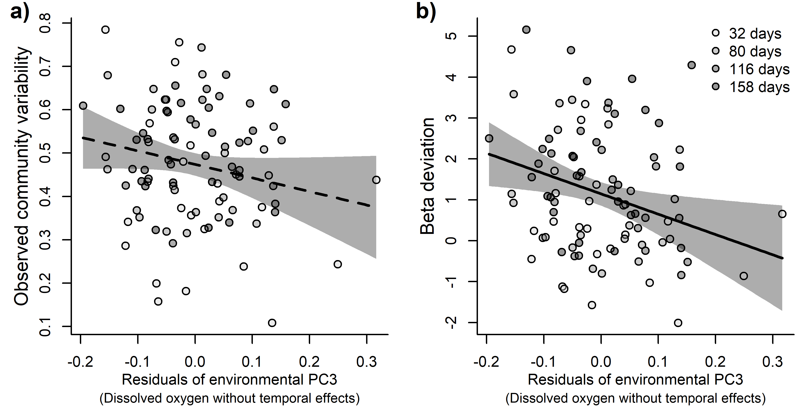<!-- -->

``` r
#dev.off()
```
