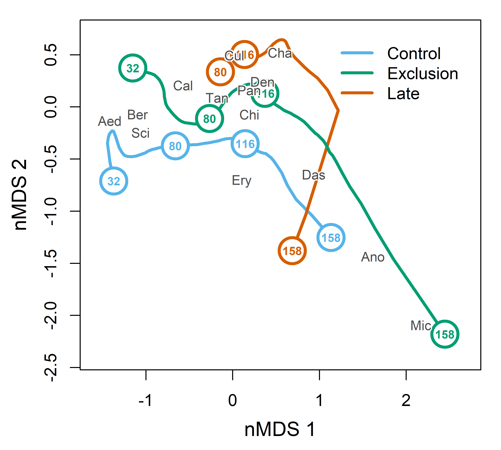
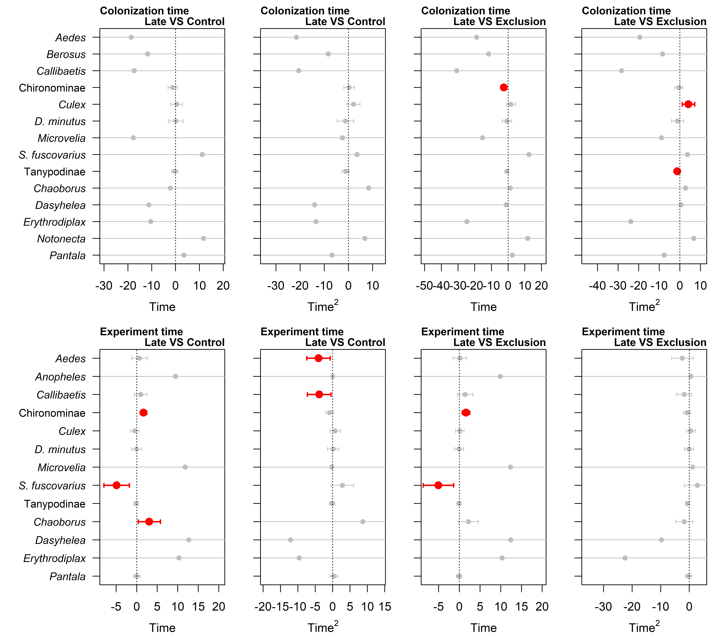

Comparissom between late treatment and others
================
Rodolfo Pelinson
2026-03-18

``` r
source(paste(sep = "/",dir,"functions/pairwise_gllvm.R"))
source(paste(sep = "/",dir,"functions/pairwise_mvabund.R"))
source(paste(sep = "/",dir,"functions/my.anova.gllvm.R"))
source(paste(sep = "/",dir,"functions/My_coefplot.R"))
source(paste(sep = "/",dir,"functions/remove_sp.R"))
source(paste(sep = "/",dir,"functions/extract_mles.R"))
source(paste(sep = "/",dir,"functions/my_ordiplot.R"))
source(paste(sep = "/",dir,"functions/get_scaled_lvs.R"))
source(paste(sep = "/",dir,"functions/text_contour.R"))
source(paste(sep = "/",dir,"functions/letters.R"))


library(vegan)
library(gllvm)
library(mvabund)
library(DHARMa)
library(glmmTMB)
library(vioplot)
library(yarrr)
library(colorspace)
```

``` r
source(paste(sep = "/",dir,"ajeitando_planilhas.R"))
```

# Using number of days since the beggining of colonization

First lets drop the last survey, and the single exclusions of dragonfly
and amphibians

``` r
comm_all_late <- comm_all[Exp_design_all$treatments != "fechado_dia" & Exp_design_all$treatments != "fechado_noite",]

Exp_design_all_late <- Exp_design_all[Exp_design_all$treatments != "fechado_dia" & Exp_design_all$treatments != "fechado_noite",]


AM_days <- as.numeric(Exp_design_all_late$AM)

AM_days[AM_days == 1 & Exp_design_all_late$treatments != "atrasado"] <- 32
AM_days[AM_days == 2 & Exp_design_all_late$treatments != "atrasado"] <- 80
AM_days[AM_days == 3 & Exp_design_all_late$treatments != "atrasado"] <- 116
AM_days[AM_days == 4 & Exp_design_all_late$treatments != "atrasado"] <- 158

AM_days[AM_days == 2 & Exp_design_all_late$treatments == "atrasado"] <- 33
AM_days[AM_days == 3 & Exp_design_all_late$treatments == "atrasado"] <- 69
AM_days[AM_days == 4 & Exp_design_all_late$treatments == "atrasado"] <- 111

Exp_design_all_late$AM_days <- AM_days

Exp_design_all_late$AM_days_squared <- AM_days^2


Exp_design_all_late$AM_days_sc <- c(scale(Exp_design_all_late$AM_days))

Exp_design_all_late$AM_days_sc_squared <- Exp_design_all_late$AM_days_sc^2
```

We will have to remove the last survey to achieve a balanced design,
otherwise the permutation won’t work.

``` r
comm_all_late_colonization <- comm_all_late[Exp_design_all_late$AM_days != 158,]

Exp_design_all_late_colonization <- Exp_design_all_late[Exp_design_all_late$AM_days != 158,]

#comm_all_late_colonization <- remove_sp(comm_all_late_colonization, 2)
```

## Late VS Control

Now create a permutation design

``` r
set.seed(3)

comm_all_late_colonization_control <- comm_all_late_colonization[Exp_design_all_late_colonization$treatments != "fechado",]
Exp_design_all_late_colonization_control <- Exp_design_all_late_colonization[Exp_design_all_late_colonization$treatments != "fechado",]

comm_all_late_colonization_control <- remove_sp(comm_all_late_colonization_control, 1)


set.seed(1); control <- permute::how(within = permute::Within(type = 'free'),
                        plots = Plots(strata = Exp_design_all_late_colonization_control$sites, type = 'free'),
                        nperm = 999)
set.seed(1); permutations <- shuffleSet(nrow(comm_all_late_colonization_control), control = control)
```

### Testing for quadratic effects of time

``` r
comm_all_late_colonization_control_mv <- mvabund(comm_all_late_colonization_control)

mod_late_colonization_lin_control <- manyglm(comm_all_late_colonization_control_mv ~ block2 + treatments + AM_days_sc + AM_days_sc:treatments, family="negative.binomial",  data = Exp_design_all_late_colonization_control, composition = FALSE)

mod_late_colonization_quad_control <- manyglm(comm_all_late_colonization_control_mv ~ block2 + treatments + AM_days_sc + AM_days_sc_squared + AM_days_sc:treatments + AM_days_sc_squared:treatments, family="negative.binomial",  data = Exp_design_all_late_colonization_control, composition = FALSE)

anova_late_colonization_quadratic_test_control <- anova(mod_late_colonization_lin_control, mod_late_colonization_quad_control, bootID = permutations, show.time = "all", cor.type = "I", test = "LR", resamp = "pit.trap")
```

    ## Using <int> bootID matrix from input. 
    ## Resampling begins for test 1.
    ##  Resampling run 0 finished. Time elapsed: 0.00 minutes...
    ##  Resampling run 100 finished. Time elapsed: 0.02 minutes...
    ##  Resampling run 200 finished. Time elapsed: 0.04 minutes...
    ##  Resampling run 300 finished. Time elapsed: 0.06 minutes...
    ##  Resampling run 400 finished. Time elapsed: 0.08 minutes...
    ##  Resampling run 500 finished. Time elapsed: 0.11 minutes...
    ##  Resampling run 600 finished. Time elapsed: 0.13 minutes...
    ##  Resampling run 700 finished. Time elapsed: 0.15 minutes...
    ##  Resampling run 800 finished. Time elapsed: 0.17 minutes...
    ##  Resampling run 900 finished. Time elapsed: 0.20 minutes...
    ## Time elapsed: 0 hr 0 min 13 sec

``` r
anova_late_colonization_quadratic_test_control
```

    ## Analysis of Deviance Table
    ## 
    ## mod_late_colonization_lin_control: comm_all_late_colonization_control_mv ~ block2 + treatments + AM_days_sc + AM_days_sc:treatments
    ## mod_late_colonization_quad_control: comm_all_late_colonization_control_mv ~ block2 + treatments + AM_days_sc + AM_days_sc_squared + AM_days_sc:treatments + AM_days_sc_squared:treatments
    ## 
    ## Multivariate test:
    ##                                    Res.Df Df.diff  Dev Pr(>Dev)  
    ## mod_late_colonization_lin_control      30                        
    ## mod_late_colonization_quad_control     28       2 36.9    0.042 *
    ## ---
    ## Signif. codes:  0 '***' 0.001 '**' 0.01 '*' 0.05 '.' 0.1 ' ' 1
    ## Arguments:
    ##  Test statistics calculated assuming uncorrelated response (for faster computation) 
    ##  P-value calculated using 999 iterations via PIT-trap resampling.

### Testing for effect of time

``` r
mod_late_colonization_time_control <- manyglm(comm_all_late_colonization_control_mv ~ block2 + treatments + AM_days_sc + AM_days_sc_squared, family="negative.binomial",  data = Exp_design_all_late_colonization_control, composition = FALSE)

mod_late_colonization_no_time_control <- manyglm(comm_all_late_colonization_control_mv ~ block2 + treatments, family="negative.binomial",  data = Exp_design_all_late_colonization_control, composition = FALSE)

anova_late_colonization_time_test_control <- anova(mod_late_colonization_no_time_control, mod_late_colonization_time_control, bootID = permutations, show.time = "all", cor.type = "I", test = "LR", resamp = "pit.trap")
```

    ## Using <int> bootID matrix from input. 
    ## Resampling begins for test 1.
    ##  Resampling run 0 finished. Time elapsed: 0.00 minutes...
    ##  Resampling run 100 finished. Time elapsed: 0.02 minutes...
    ##  Resampling run 200 finished. Time elapsed: 0.05 minutes...
    ##  Resampling run 300 finished. Time elapsed: 0.07 minutes...
    ##  Resampling run 400 finished. Time elapsed: 0.09 minutes...
    ##  Resampling run 500 finished. Time elapsed: 0.12 minutes...
    ##  Resampling run 600 finished. Time elapsed: 0.14 minutes...
    ##  Resampling run 700 finished. Time elapsed: 0.16 minutes...
    ##  Resampling run 800 finished. Time elapsed: 0.18 minutes...
    ##  Resampling run 900 finished. Time elapsed: 0.20 minutes...
    ## Time elapsed: 0 hr 0 min 12 sec

``` r
anova_late_colonization_time_test_control
```

    ## Analysis of Deviance Table
    ## 
    ## mod_late_colonization_no_time_control: comm_all_late_colonization_control_mv ~ block2 + treatments
    ## mod_late_colonization_time_control: comm_all_late_colonization_control_mv ~ block2 + treatments + AM_days_sc + AM_days_sc_squared
    ## 
    ## Multivariate test:
    ##                                       Res.Df Df.diff   Dev Pr(>Dev)    
    ## mod_late_colonization_no_time_control     32                           
    ## mod_late_colonization_time_control        30       2 79.96    0.001 ***
    ## ---
    ## Signif. codes:  0 '***' 0.001 '**' 0.01 '*' 0.05 '.' 0.1 ' ' 1
    ## Arguments:
    ##  Test statistics calculated assuming uncorrelated response (for faster computation) 
    ##  P-value calculated using 999 iterations via PIT-trap resampling.

### Testing for the effect of blocks

``` r
mod_late_colonization_block_control <- manyglm(comm_all_late_colonization_control_mv ~ block2 + treatments + AM_days_sc + AM_days_sc_squared, family="negative.binomial",  data = Exp_design_all_late_colonization_control, composition = FALSE)

mod_late_colonization_no_block_control <- manyglm(comm_all_late_colonization_control_mv ~ treatments + AM_days_sc + AM_days_sc_squared, family="negative.binomial",  data = Exp_design_all_late_colonization_control, composition = FALSE)

anova_late_colonization_block_test_control <- anova(mod_late_colonization_no_block_control, mod_late_colonization_block_control, bootID = permutations, show.time = "all", cor.type = "I", test = "LR", resamp = "pit.trap")
```

    ## Using <int> bootID matrix from input. 
    ## Resampling begins for test 1.
    ##  Resampling run 0 finished. Time elapsed: 0.00 minutes...
    ##  Resampling run 100 finished. Time elapsed: 0.02 minutes...
    ##  Resampling run 200 finished. Time elapsed: 0.04 minutes...
    ##  Resampling run 300 finished. Time elapsed: 0.05 minutes...
    ##  Resampling run 400 finished. Time elapsed: 0.08 minutes...
    ##  Resampling run 500 finished. Time elapsed: 0.10 minutes...
    ##  Resampling run 600 finished. Time elapsed: 0.12 minutes...
    ##  Resampling run 700 finished. Time elapsed: 0.14 minutes...
    ##  Resampling run 800 finished. Time elapsed: 0.17 minutes...
    ##  Resampling run 900 finished. Time elapsed: 0.20 minutes...
    ## Time elapsed: 0 hr 0 min 13 sec

``` r
anova_late_colonization_block_test_control
```

    ## Analysis of Deviance Table
    ## 
    ## mod_late_colonization_no_block_control: comm_all_late_colonization_control_mv ~ treatments + AM_days_sc + AM_days_sc_squared
    ## mod_late_colonization_block_control: comm_all_late_colonization_control_mv ~ block2 + treatments + AM_days_sc + AM_days_sc_squared
    ## 
    ## Multivariate test:
    ##                                        Res.Df Df.diff   Dev Pr(>Dev)
    ## mod_late_colonization_no_block_control     32                       
    ## mod_late_colonization_block_control        30       2 41.81    0.488
    ## Arguments:
    ##  Test statistics calculated assuming uncorrelated response (for faster computation) 
    ##  P-value calculated using 999 iterations via PIT-trap resampling.

### Testing for effects of treatments

Do species trajectories differ in their intercept among the different
treatments?

Do their trajectories (slopes) differ among the different treatments?

``` r
mod_no_treatment_late_colonization_control <- manyglm(comm_all_late_colonization_control_mv ~ block2 + AM_days_sc + AM_days_sc_squared, family="negative.binomial",  data = Exp_design_all_late_colonization_control, composition = FALSE)

mod_treatment_late_colonization_control <- manyglm(comm_all_late_colonization_control_mv ~ block2 + treatments + AM_days_sc + AM_days_sc_squared, family="negative.binomial",  data = Exp_design_all_late_colonization_control, composition = FALSE)

mod_treatment_interaction_late_colonization_control <- manyglm(comm_all_late_colonization_control_mv ~ block2 + treatments + AM_days_sc + AM_days_sc_squared + AM_days_sc:treatments + AM_days_sc_squared:treatments, family="negative.binomial",  data = Exp_design_all_late_colonization_control, composition = FALSE)

anova_treatments_test_late_colonization_control <- anova(mod_no_treatment_late_colonization_control, mod_treatment_late_colonization_control, mod_treatment_interaction_late_colonization_control, bootID = permutations, show.time = "all", cor.type = "I", test = "LR", resamp = "pit.trap")
```

    ## Using <int> bootID matrix from input. 
    ## Resampling begins for test 1.
    ##  Resampling run 0 finished. Time elapsed: 0.00 minutes...
    ##  Resampling run 100 finished. Time elapsed: 0.02 minutes...
    ##  Resampling run 200 finished. Time elapsed: 0.04 minutes...
    ##  Resampling run 300 finished. Time elapsed: 0.06 minutes...
    ##  Resampling run 400 finished. Time elapsed: 0.08 minutes...
    ##  Resampling run 500 finished. Time elapsed: 0.10 minutes...
    ##  Resampling run 600 finished. Time elapsed: 0.12 minutes...
    ##  Resampling run 700 finished. Time elapsed: 0.14 minutes...
    ##  Resampling run 800 finished. Time elapsed: 0.17 minutes...
    ##  Resampling run 900 finished. Time elapsed: 0.19 minutes...
    ## Resampling begins for test 2.
    ##  Resampling run 0 finished. Time elapsed: 0.00 minutes...
    ##  Resampling run 100 finished. Time elapsed: 0.03 minutes...
    ##  Resampling run 200 finished. Time elapsed: 0.07 minutes...
    ##  Resampling run 300 finished. Time elapsed: 0.09 minutes...
    ##  Resampling run 400 finished. Time elapsed: 0.12 minutes...
    ##  Resampling run 500 finished. Time elapsed: 0.15 minutes...
    ##  Resampling run 600 finished. Time elapsed: 0.17 minutes...
    ##  Resampling run 700 finished. Time elapsed: 0.21 minutes...
    ##  Resampling run 800 finished. Time elapsed: 0.24 minutes...
    ##  Resampling run 900 finished. Time elapsed: 0.27 minutes...
    ## Time elapsed: 0 hr 0 min 30 sec

``` r
anova_treatments_test_late_colonization_control
```

    ## Analysis of Deviance Table
    ## 
    ## mod_no_treatment_late_colonization_control: comm_all_late_colonization_control_mv ~ block2 + AM_days_sc + AM_days_sc_squared
    ## mod_treatment_late_colonization_control: comm_all_late_colonization_control_mv ~ block2 + treatments + AM_days_sc + AM_days_sc_squared
    ## mod_treatment_interaction_late_colonization_control: comm_all_late_colonization_control_mv ~ block2 + treatments + AM_days_sc + AM_days_sc_squared + AM_days_sc:treatments + AM_days_sc_squared:treatments
    ## 
    ## Multivariate test:
    ##                                                     Res.Df Df.diff   Dev
    ## mod_no_treatment_late_colonization_control              31              
    ## mod_treatment_late_colonization_control                 30       1 47.98
    ## mod_treatment_interaction_late_colonization_control     28       2 51.76
    ##                                                     Pr(>Dev)    
    ## mod_no_treatment_late_colonization_control                      
    ## mod_treatment_late_colonization_control                0.002 ** 
    ## mod_treatment_interaction_late_colonization_control    0.001 ***
    ## ---
    ## Signif. codes:  0 '***' 0.001 '**' 0.01 '*' 0.05 '.' 0.1 ' ' 1
    ## Arguments:
    ##  Test statistics calculated assuming uncorrelated response (for faster computation) 
    ##  P-value calculated using 999 iterations via PIT-trap resampling.

## Late VS Exclusion

Now create a permutation design

``` r
set.seed(3)

comm_all_late_colonization_exclusion <- comm_all_late_colonization[Exp_design_all_late_colonization$treatments != "controle",]
Exp_design_all_late_colonization_exclusion <- Exp_design_all_late_colonization[Exp_design_all_late_colonization$treatments != "controle",]

comm_all_late_colonization_exclusion <- remove_sp(comm_all_late_colonization_exclusion, 1)


set.seed(1); control <- permute::how(within = permute::Within(type = 'free'),
                        plots = Plots(strata = Exp_design_all_late_colonization_exclusion$sites, type = 'free'),
                        nperm = 999)
set.seed(1); permutations <- shuffleSet(nrow(comm_all_late_colonization_exclusion), control = control)
```

### Testing for quadratic effects of time

``` r
comm_all_late_colonization_exclusion_mv <- mvabund(comm_all_late_colonization_exclusion)

mod_late_colonization_lin_exclusion <- manyglm(comm_all_late_colonization_exclusion_mv ~ block2 + treatments + AM_days_sc + AM_days_sc:treatments, family="negative.binomial",  data = Exp_design_all_late_colonization_exclusion, composition = FALSE)

mod_late_colonization_quad_exclusion <- manyglm(comm_all_late_colonization_exclusion_mv ~ block2 + treatments + AM_days_sc + AM_days_sc_squared + AM_days_sc:treatments + AM_days_sc_squared:treatments, family="negative.binomial",  data = Exp_design_all_late_colonization_exclusion, composition = FALSE)

anova_late_colonization_quadratic_test_exclusion <- anova(mod_late_colonization_lin_exclusion, mod_late_colonization_quad_exclusion, bootID = permutations, show.time = "all", cor.type = "I", test = "LR", resamp = "pit.trap")
```

    ## Using <int> bootID matrix from input. 
    ## Resampling begins for test 1.
    ##  Resampling run 0 finished. Time elapsed: 0.00 minutes...
    ##  Resampling run 100 finished. Time elapsed: 0.02 minutes...
    ##  Resampling run 200 finished. Time elapsed: 0.04 minutes...
    ##  Resampling run 300 finished. Time elapsed: 0.06 minutes...
    ##  Resampling run 400 finished. Time elapsed: 0.09 minutes...
    ##  Resampling run 500 finished. Time elapsed: 0.10 minutes...
    ##  Resampling run 600 finished. Time elapsed: 0.12 minutes...
    ##  Resampling run 700 finished. Time elapsed: 0.14 minutes...
    ##  Resampling run 800 finished. Time elapsed: 0.16 minutes...
    ##  Resampling run 900 finished. Time elapsed: 0.18 minutes...
    ## Time elapsed: 0 hr 0 min 12 sec

``` r
anova_late_colonization_quadratic_test_exclusion
```

    ## Analysis of Deviance Table
    ## 
    ## mod_late_colonization_lin_exclusion: comm_all_late_colonization_exclusion_mv ~ block2 + treatments + AM_days_sc + AM_days_sc:treatments
    ## mod_late_colonization_quad_exclusion: comm_all_late_colonization_exclusion_mv ~ block2 + treatments + AM_days_sc + AM_days_sc_squared + AM_days_sc:treatments + AM_days_sc_squared:treatments
    ## 
    ## Multivariate test:
    ##                                      Res.Df Df.diff  Dev Pr(>Dev)   
    ## mod_late_colonization_lin_exclusion      30                         
    ## mod_late_colonization_quad_exclusion     28       2 48.9    0.007 **
    ## ---
    ## Signif. codes:  0 '***' 0.001 '**' 0.01 '*' 0.05 '.' 0.1 ' ' 1
    ## Arguments:
    ##  Test statistics calculated assuming uncorrelated response (for faster computation) 
    ##  P-value calculated using 999 iterations via PIT-trap resampling.

### Testing for effect of time

``` r
mod_late_colonization_time_exclusion <- manyglm(comm_all_late_colonization_exclusion_mv ~ block2 + treatments + AM_days_sc + AM_days_sc_squared, family="negative.binomial",  data = Exp_design_all_late_colonization_exclusion, composition = FALSE)

mod_late_colonization_no_time_exclusion <- manyglm(comm_all_late_colonization_exclusion_mv ~ block2 + treatments, family="negative.binomial",  data = Exp_design_all_late_colonization_exclusion, composition = FALSE)

anova_late_colonization_time_test_exclusion <- anova(mod_late_colonization_no_time_exclusion, mod_late_colonization_time_exclusion, bootID = permutations, show.time = "all", cor.type = "I", test = "LR", resamp = "pit.trap")
```

    ## Using <int> bootID matrix from input. 
    ## Resampling begins for test 1.
    ##  Resampling run 0 finished. Time elapsed: 0.00 minutes...
    ##  Resampling run 100 finished. Time elapsed: 0.02 minutes...
    ##  Resampling run 200 finished. Time elapsed: 0.04 minutes...
    ##  Resampling run 300 finished. Time elapsed: 0.06 minutes...
    ##  Resampling run 400 finished. Time elapsed: 0.08 minutes...
    ##  Resampling run 500 finished. Time elapsed: 0.10 minutes...
    ##  Resampling run 600 finished. Time elapsed: 0.12 minutes...
    ##  Resampling run 700 finished. Time elapsed: 0.14 minutes...
    ##  Resampling run 800 finished. Time elapsed: 0.16 minutes...
    ##  Resampling run 900 finished. Time elapsed: 0.18 minutes...
    ## Time elapsed: 0 hr 0 min 11 sec

``` r
anova_late_colonization_time_test_exclusion
```

    ## Analysis of Deviance Table
    ## 
    ## mod_late_colonization_no_time_exclusion: comm_all_late_colonization_exclusion_mv ~ block2 + treatments
    ## mod_late_colonization_time_exclusion: comm_all_late_colonization_exclusion_mv ~ block2 + treatments + AM_days_sc + AM_days_sc_squared
    ## 
    ## Multivariate test:
    ##                                         Res.Df Df.diff  Dev Pr(>Dev)    
    ## mod_late_colonization_no_time_exclusion     32                          
    ## mod_late_colonization_time_exclusion        30       2 81.9    0.001 ***
    ## ---
    ## Signif. codes:  0 '***' 0.001 '**' 0.01 '*' 0.05 '.' 0.1 ' ' 1
    ## Arguments:
    ##  Test statistics calculated assuming uncorrelated response (for faster computation) 
    ##  P-value calculated using 999 iterations via PIT-trap resampling.

### Testing for the effect of blocks

``` r
mod_late_colonization_block_exclusion <- manyglm(comm_all_late_colonization_exclusion_mv ~ block2 + treatments + AM_days_sc + AM_days_sc_squared, family="negative.binomial",  data = Exp_design_all_late_colonization_exclusion, composition = FALSE)

mod_late_colonization_no_block_exclusion <- manyglm(comm_all_late_colonization_exclusion_mv ~ treatments + AM_days_sc + AM_days_sc_squared, family="negative.binomial",  data = Exp_design_all_late_colonization_exclusion, composition = FALSE)

anova_late_colonization_block_test_exclusion <- anova(mod_late_colonization_no_block_exclusion, mod_late_colonization_block_exclusion, bootID = permutations, show.time = "all", cor.type = "I", test = "LR", resamp = "pit.trap")
```

    ## Using <int> bootID matrix from input. 
    ## Resampling begins for test 1.
    ##  Resampling run 0 finished. Time elapsed: 0.00 minutes...
    ##  Resampling run 100 finished. Time elapsed: 0.02 minutes...
    ##  Resampling run 200 finished. Time elapsed: 0.03 minutes...
    ##  Resampling run 300 finished. Time elapsed: 0.05 minutes...
    ##  Resampling run 400 finished. Time elapsed: 0.08 minutes...
    ##  Resampling run 500 finished. Time elapsed: 0.10 minutes...
    ##  Resampling run 600 finished. Time elapsed: 0.12 minutes...
    ##  Resampling run 700 finished. Time elapsed: 0.14 minutes...
    ##  Resampling run 800 finished. Time elapsed: 0.16 minutes...
    ##  Resampling run 900 finished. Time elapsed: 0.19 minutes...
    ## Time elapsed: 0 hr 0 min 12 sec

``` r
anova_late_colonization_block_test_exclusion
```

    ## Analysis of Deviance Table
    ## 
    ## mod_late_colonization_no_block_exclusion: comm_all_late_colonization_exclusion_mv ~ treatments + AM_days_sc + AM_days_sc_squared
    ## mod_late_colonization_block_exclusion: comm_all_late_colonization_exclusion_mv ~ block2 + treatments + AM_days_sc + AM_days_sc_squared
    ## 
    ## Multivariate test:
    ##                                          Res.Df Df.diff   Dev Pr(>Dev)
    ## mod_late_colonization_no_block_exclusion     32                       
    ## mod_late_colonization_block_exclusion        30       2 23.01    0.948
    ## Arguments:
    ##  Test statistics calculated assuming uncorrelated response (for faster computation) 
    ##  P-value calculated using 999 iterations via PIT-trap resampling.

### Testing for effects of treatments

Do species trajectories differ in their intercept among the different
treatments?

Do their trajectories (slopes) differ among the different treatments?

``` r
mod_no_treatment_late_colonization_exclusion <- manyglm(comm_all_late_colonization_exclusion_mv ~ block2 + AM_days_sc + AM_days_sc_squared, family="negative.binomial",  data = Exp_design_all_late_colonization_exclusion, composition = FALSE)

mod_treatment_late_colonization_exclusion <- manyglm(comm_all_late_colonization_exclusion_mv ~ block2 + treatments + AM_days_sc + AM_days_sc_squared, family="negative.binomial",  data = Exp_design_all_late_colonization_exclusion, composition = FALSE)

mod_treatment_interaction_late_colonization_exclusion <- manyglm(comm_all_late_colonization_exclusion_mv ~ block2 + treatments + AM_days_sc + AM_days_sc_squared + AM_days_sc:treatments + AM_days_sc_squared:treatments, family="negative.binomial",  data = Exp_design_all_late_colonization_exclusion, composition = FALSE)

anova_treatments_test_late_colonization_exclusion <- anova(mod_no_treatment_late_colonization_exclusion, mod_treatment_late_colonization_exclusion, mod_treatment_interaction_late_colonization_exclusion, bootID = permutations, show.time = "all", cor.type = "I", test = "LR", resamp = "pit.trap")
```

    ## Using <int> bootID matrix from input. 
    ## Resampling begins for test 1.
    ##  Resampling run 0 finished. Time elapsed: 0.00 minutes...
    ##  Resampling run 100 finished. Time elapsed: 0.02 minutes...
    ##  Resampling run 200 finished. Time elapsed: 0.05 minutes...
    ##  Resampling run 300 finished. Time elapsed: 0.06 minutes...
    ##  Resampling run 400 finished. Time elapsed: 0.09 minutes...
    ##  Resampling run 500 finished. Time elapsed: 0.11 minutes...
    ##  Resampling run 600 finished. Time elapsed: 0.13 minutes...
    ##  Resampling run 700 finished. Time elapsed: 0.15 minutes...
    ##  Resampling run 800 finished. Time elapsed: 0.18 minutes...
    ##  Resampling run 900 finished. Time elapsed: 0.20 minutes...
    ## Resampling begins for test 2.
    ##  Resampling run 0 finished. Time elapsed: 0.00 minutes...
    ##  Resampling run 100 finished. Time elapsed: 0.03 minutes...
    ##  Resampling run 200 finished. Time elapsed: 0.05 minutes...
    ##  Resampling run 300 finished. Time elapsed: 0.08 minutes...
    ##  Resampling run 400 finished. Time elapsed: 0.10 minutes...
    ##  Resampling run 500 finished. Time elapsed: 0.12 minutes...
    ##  Resampling run 600 finished. Time elapsed: 0.15 minutes...
    ##  Resampling run 700 finished. Time elapsed: 0.17 minutes...
    ##  Resampling run 800 finished. Time elapsed: 0.20 minutes...
    ##  Resampling run 900 finished. Time elapsed: 0.22 minutes...
    ## Time elapsed: 0 hr 0 min 28 sec

``` r
anova_treatments_test_late_colonization_exclusion
```

    ## Analysis of Deviance Table
    ## 
    ## mod_no_treatment_late_colonization_exclusion: comm_all_late_colonization_exclusion_mv ~ block2 + AM_days_sc + AM_days_sc_squared
    ## mod_treatment_late_colonization_exclusion: comm_all_late_colonization_exclusion_mv ~ block2 + treatments + AM_days_sc + AM_days_sc_squared
    ## mod_treatment_interaction_late_colonization_exclusion: comm_all_late_colonization_exclusion_mv ~ block2 + treatments + AM_days_sc + AM_days_sc_squared + AM_days_sc:treatments + AM_days_sc_squared:treatments
    ## 
    ## Multivariate test:
    ##                                                       Res.Df Df.diff   Dev
    ## mod_no_treatment_late_colonization_exclusion              31              
    ## mod_treatment_late_colonization_exclusion                 30       1 18.45
    ## mod_treatment_interaction_late_colonization_exclusion     28       2 59.36
    ##                                                       Pr(>Dev)    
    ## mod_no_treatment_late_colonization_exclusion                      
    ## mod_treatment_late_colonization_exclusion                0.209    
    ## mod_treatment_interaction_late_colonization_exclusion    0.001 ***
    ## ---
    ## Signif. codes:  0 '***' 0.001 '**' 0.01 '*' 0.05 '.' 0.1 ' ' 1
    ## Arguments:
    ##  Test statistics calculated assuming uncorrelated response (for faster computation) 
    ##  P-value calculated using 999 iterations via PIT-trap resampling.

# Using number of days since the beggining of the experiment

First lets drop the single exclusions of dragonfly and amphibians

``` r
comm_all_late_experiment <- comm_all[Exp_design_all$treatments != "fechado_dia" & Exp_design_all$treatments != "fechado_noite",]

Exp_design_all_late_experiment <- Exp_design_all[Exp_design_all$treatments != "fechado_dia" & Exp_design_all$treatments != "fechado_noite",]


AM_days <- as.numeric(Exp_design_all_late_experiment$AM)

AM_days[AM_days == 1 & Exp_design_all_late_experiment$treatments != "atrasado"] <- 32
AM_days[AM_days == 2 & Exp_design_all_late_experiment$treatments != "atrasado"] <- 80
AM_days[AM_days == 3 & Exp_design_all_late_experiment$treatments != "atrasado"] <- 116
AM_days[AM_days == 4 & Exp_design_all_late_experiment$treatments != "atrasado"] <- 158

AM_days[AM_days == 2 & Exp_design_all_late_experiment$treatments == "atrasado"] <- 80
AM_days[AM_days == 3 & Exp_design_all_late_experiment$treatments == "atrasado"] <- 116
AM_days[AM_days == 4 & Exp_design_all_late_experiment$treatments == "atrasado"] <- 158

Exp_design_all_late_experiment$AM_days <- AM_days

Exp_design_all_late_experiment$AM_days_squared <- AM_days^2


Exp_design_all_late_experiment$AM_days_sc <- c(scale(Exp_design_all_late_experiment$AM_days))

Exp_design_all_late_experiment$AM_days_sc_squared <- Exp_design_all_late_experiment$AM_days_sc^2
```

We will have to remove the first survey to achieve a balanced design,
otherwise the permutation won’t work.

``` r
comm_all_late_experiment <- comm_all_late_experiment[Exp_design_all_late_experiment$AM_days != 32,]

Exp_design_all_late_experiment <- Exp_design_all_late_experiment[Exp_design_all_late_experiment$AM_days != 32,]

comm_all_late_experiment <- remove_sp(comm_all_late_experiment, 2)
```

## Late VS Control

Now create a permutation design

``` r
comm_all_late_experiment_control <- comm_all_late_experiment[Exp_design_all_late_experiment$treatments != "fechado",]
Exp_design_all_late_experiment_control <- Exp_design_all_late_experiment[Exp_design_all_late_experiment$treatments != "fechado",]

comm_all_late_experiment_control <- remove_sp(comm_all_late_experiment_control, 1)


set.seed(1); control <- permute::how(within = permute::Within(type = 'free'),
                        plots = Plots(strata = Exp_design_all_late_experiment_control$sites, type = 'free'),
                        nperm = 999)
set.seed(1); permutations <- shuffleSet(nrow(comm_all_late_experiment_control), control = control)
```

### Testing for quadratic effects of time

``` r
comm_all_late_experiment_control_mv <- mvabund(comm_all_late_experiment_control)

mod_late_experiment_lin_control <- manyglm(comm_all_late_experiment_control_mv ~ block2 + treatments + AM_days_sc + AM_days_sc:treatments, family="negative.binomial",  data = Exp_design_all_late_experiment_control, composition = FALSE)

mod_late_experiment_quad_control <- manyglm(comm_all_late_experiment_control_mv ~ block2 + treatments + AM_days_sc + AM_days_sc_squared + AM_days_sc:treatments + AM_days_sc_squared:treatments, family="negative.binomial",  data = Exp_design_all_late_experiment_control, composition = FALSE)

anova_late_experiment_quadratic_test_control <- anova(mod_late_experiment_lin_control, mod_late_experiment_quad_control, bootID = permutations, show.time = "all", cor.type = "I", test = "LR", resamp = "pit.trap")
```

    ## Using <int> bootID matrix from input. 
    ## Resampling begins for test 1.
    ##  Resampling run 0 finished. Time elapsed: 0.00 minutes...
    ##  Resampling run 100 finished. Time elapsed: 0.02 minutes...
    ##  Resampling run 200 finished. Time elapsed: 0.04 minutes...
    ##  Resampling run 300 finished. Time elapsed: 0.06 minutes...
    ##  Resampling run 400 finished. Time elapsed: 0.08 minutes...
    ##  Resampling run 500 finished. Time elapsed: 0.10 minutes...
    ##  Resampling run 600 finished. Time elapsed: 0.12 minutes...
    ##  Resampling run 700 finished. Time elapsed: 0.14 minutes...
    ##  Resampling run 800 finished. Time elapsed: 0.16 minutes...
    ##  Resampling run 900 finished. Time elapsed: 0.18 minutes...
    ## Time elapsed: 0 hr 0 min 11 sec

``` r
anova_late_experiment_quadratic_test_control
```

    ## Analysis of Deviance Table
    ## 
    ## mod_late_experiment_lin_control: comm_all_late_experiment_control_mv ~ block2 + treatments + AM_days_sc + AM_days_sc:treatments
    ## mod_late_experiment_quad_control: comm_all_late_experiment_control_mv ~ block2 + treatments + AM_days_sc + AM_days_sc_squared + AM_days_sc:treatments + AM_days_sc_squared:treatments
    ## 
    ## Multivariate test:
    ##                                  Res.Df Df.diff   Dev Pr(>Dev)
    ## mod_late_experiment_lin_control      30                       
    ## mod_late_experiment_quad_control     28       2 22.48    0.302
    ## Arguments:
    ##  Test statistics calculated assuming uncorrelated response (for faster computation) 
    ##  P-value calculated using 999 iterations via PIT-trap resampling.

### Testing for effect of time

``` r
mod_late_experiment_time_control <- manyglm(comm_all_late_experiment_control_mv ~ block2 + treatments + AM_days_sc# + AM_days_sc_squared
                                            , family="negative.binomial",  data = Exp_design_all_late_experiment_control, composition = FALSE)

mod_late_experiment_no_time_control <- manyglm(comm_all_late_experiment_control_mv ~ block2 + treatments, family="negative.binomial",  data = Exp_design_all_late_experiment_control, composition = FALSE)

anova_late_experiment_time_test_control <- anova(mod_late_experiment_no_time_control, mod_late_experiment_time_control, bootID = permutations, show.time = "all", cor.type = "I", test = "LR", resamp = "pit.trap")
```

    ## Using <int> bootID matrix from input. 
    ## Resampling begins for test 1.
    ##  Resampling run 0 finished. Time elapsed: 0.00 minutes...
    ##  Resampling run 100 finished. Time elapsed: 0.02 minutes...
    ##  Resampling run 200 finished. Time elapsed: 0.04 minutes...
    ##  Resampling run 300 finished. Time elapsed: 0.06 minutes...
    ##  Resampling run 400 finished. Time elapsed: 0.07 minutes...
    ##  Resampling run 500 finished. Time elapsed: 0.09 minutes...
    ##  Resampling run 600 finished. Time elapsed: 0.11 minutes...
    ##  Resampling run 700 finished. Time elapsed: 0.13 minutes...
    ##  Resampling run 800 finished. Time elapsed: 0.15 minutes...
    ##  Resampling run 900 finished. Time elapsed: 0.16 minutes...
    ## Time elapsed: 0 hr 0 min 11 sec

``` r
anova_late_experiment_time_test_control
```

    ## Analysis of Deviance Table
    ## 
    ## mod_late_experiment_no_time_control: comm_all_late_experiment_control_mv ~ block2 + treatments
    ## mod_late_experiment_time_control: comm_all_late_experiment_control_mv ~ block2 + treatments + AM_days_sc
    ## 
    ## Multivariate test:
    ##                                     Res.Df Df.diff   Dev Pr(>Dev)    
    ## mod_late_experiment_no_time_control     32                           
    ## mod_late_experiment_time_control        31       1 77.62    0.001 ***
    ## ---
    ## Signif. codes:  0 '***' 0.001 '**' 0.01 '*' 0.05 '.' 0.1 ' ' 1
    ## Arguments:
    ##  Test statistics calculated assuming uncorrelated response (for faster computation) 
    ##  P-value calculated using 999 iterations via PIT-trap resampling.

### Testing for the effect of blocks

``` r
mod_late_experiment_block_control <- manyglm(comm_all_late_experiment_control_mv ~ block2 + treatments + AM_days_sc# + AM_days_sc_squared
                                             , family="negative.binomial",  data = Exp_design_all_late_experiment_control, composition = FALSE)

mod_late_experiment_no_block_control <- manyglm(comm_all_late_experiment_control_mv ~ treatments + AM_days_sc# + AM_days_sc_squared
                                              , family="negative.binomial",  data = Exp_design_all_late_experiment_control, composition = FALSE)

anova_late_experiment_block_test_control <- anova(mod_late_experiment_no_block_control, mod_late_experiment_block_control, bootID = permutations, show.time = "all", cor.type = "I", test = "LR", resamp = "pit.trap")
```

    ## Using <int> bootID matrix from input. 
    ## Resampling begins for test 1.
    ##  Resampling run 0 finished. Time elapsed: 0.00 minutes...
    ##  Resampling run 100 finished. Time elapsed: 0.02 minutes...
    ##  Resampling run 200 finished. Time elapsed: 0.04 minutes...
    ##  Resampling run 300 finished. Time elapsed: 0.05 minutes...
    ##  Resampling run 400 finished. Time elapsed: 0.07 minutes...
    ##  Resampling run 500 finished. Time elapsed: 0.08 minutes...
    ##  Resampling run 600 finished. Time elapsed: 0.10 minutes...
    ##  Resampling run 700 finished. Time elapsed: 0.12 minutes...
    ##  Resampling run 800 finished. Time elapsed: 0.14 minutes...
    ##  Resampling run 900 finished. Time elapsed: 0.15 minutes...
    ## Time elapsed: 0 hr 0 min 10 sec

``` r
anova_late_experiment_block_test_control
```

    ## Analysis of Deviance Table
    ## 
    ## mod_late_experiment_no_block_control: comm_all_late_experiment_control_mv ~ treatments + AM_days_sc
    ## mod_late_experiment_block_control: comm_all_late_experiment_control_mv ~ block2 + treatments + AM_days_sc
    ## 
    ## Multivariate test:
    ##                                      Res.Df Df.diff   Dev Pr(>Dev)
    ## mod_late_experiment_no_block_control     33                       
    ## mod_late_experiment_block_control        31       2 36.53    0.605
    ## Arguments:
    ##  Test statistics calculated assuming uncorrelated response (for faster computation) 
    ##  P-value calculated using 999 iterations via PIT-trap resampling.

### Testing for effects of treatments

Do species trajectories differ in their intercept among the different
treatments?

Do their trajectories (slopes) differ among the different treatments?

``` r
mod_no_treatment_late_experiment_control <- manyglm(comm_all_late_experiment_control_mv ~ block2 + AM_days_sc# + AM_days_sc_squared
                                                    , family="negative.binomial",  data = Exp_design_all_late_experiment_control, composition = FALSE)

mod_treatment_late_experiment_control <- manyglm(comm_all_late_experiment_control_mv ~ block2 + treatments + AM_days_sc# + AM_days_sc_squared
                                                 , family="negative.binomial",  data = Exp_design_all_late_experiment_control, composition = FALSE)

mod_treatment_interaction_late_experiment_control <- manyglm(comm_all_late_experiment_control_mv ~ block2 + treatments + AM_days_sc + AM_days_sc:treatments# + AM_days_sc_squared + AM_days_sc_squared:treatments
                                                             , family="negative.binomial",  data = Exp_design_all_late_experiment_control, composition = FALSE)

anova_treatments_test_late_experiment_control <- anova(mod_no_treatment_late_experiment_control, mod_treatment_late_experiment_control, mod_treatment_interaction_late_experiment_control, bootID = permutations, show.time = "all", cor.type = "I", test = "LR", resamp = "pit.trap")
```

    ## Using <int> bootID matrix from input. 
    ## Resampling begins for test 1.
    ##  Resampling run 0 finished. Time elapsed: 0.00 minutes...
    ##  Resampling run 100 finished. Time elapsed: 0.02 minutes...
    ##  Resampling run 200 finished. Time elapsed: 0.04 minutes...
    ##  Resampling run 300 finished. Time elapsed: 0.07 minutes...
    ##  Resampling run 400 finished. Time elapsed: 0.09 minutes...
    ##  Resampling run 500 finished. Time elapsed: 0.11 minutes...
    ##  Resampling run 600 finished. Time elapsed: 0.13 minutes...
    ##  Resampling run 700 finished. Time elapsed: 0.14 minutes...
    ##  Resampling run 800 finished. Time elapsed: 0.16 minutes...
    ##  Resampling run 900 finished. Time elapsed: 0.18 minutes...
    ## Resampling begins for test 2.
    ##  Resampling run 0 finished. Time elapsed: 0.00 minutes...
    ##  Resampling run 100 finished. Time elapsed: 0.02 minutes...
    ##  Resampling run 200 finished. Time elapsed: 0.03 minutes...
    ##  Resampling run 300 finished. Time elapsed: 0.05 minutes...
    ##  Resampling run 400 finished. Time elapsed: 0.07 minutes...
    ##  Resampling run 500 finished. Time elapsed: 0.09 minutes...
    ##  Resampling run 600 finished. Time elapsed: 0.11 minutes...
    ##  Resampling run 700 finished. Time elapsed: 0.12 minutes...
    ##  Resampling run 800 finished. Time elapsed: 0.14 minutes...
    ##  Resampling run 900 finished. Time elapsed: 0.15 minutes...
    ## Time elapsed: 0 hr 0 min 21 sec

``` r
anova_treatments_test_late_experiment_control
```

    ## Analysis of Deviance Table
    ## 
    ## mod_no_treatment_late_experiment_control: comm_all_late_experiment_control_mv ~ block2 + AM_days_sc
    ## mod_treatment_late_experiment_control: comm_all_late_experiment_control_mv ~ block2 + treatments + AM_days_sc
    ## mod_treatment_interaction_late_experiment_control: comm_all_late_experiment_control_mv ~ block2 + treatments + AM_days_sc + AM_days_sc:treatments
    ## 
    ## Multivariate test:
    ##                                                   Res.Df Df.diff   Dev Pr(>Dev)
    ## mod_no_treatment_late_experiment_control              32                       
    ## mod_treatment_late_experiment_control                 31       1 30.31    0.101
    ## mod_treatment_interaction_late_experiment_control     30       1 25.99    0.015
    ##                                                    
    ## mod_no_treatment_late_experiment_control           
    ## mod_treatment_late_experiment_control              
    ## mod_treatment_interaction_late_experiment_control *
    ## ---
    ## Signif. codes:  0 '***' 0.001 '**' 0.01 '*' 0.05 '.' 0.1 ' ' 1
    ## Arguments:
    ##  Test statistics calculated assuming uncorrelated response (for faster computation) 
    ##  P-value calculated using 999 iterations via PIT-trap resampling.

## Late VS Exclusion

Now create a permutation design

``` r
set.seed(3)

comm_all_late_experiment_exclusion <- comm_all_late_experiment[Exp_design_all_late_experiment$treatments != "controle",]
Exp_design_all_late_experiment_exclusion <- Exp_design_all_late_experiment[Exp_design_all_late_experiment$treatments != "controle",]

comm_all_late_experiment_exclusion <- remove_sp(comm_all_late_experiment_exclusion, 1)


set.seed(1); control <- permute::how(within = permute::Within(type = 'free'),
                        plots = Plots(strata = Exp_design_all_late_experiment_exclusion$sites, type = 'free'),
                        nperm = 999)
set.seed(1); permutations <- shuffleSet(nrow(comm_all_late_experiment_exclusion), control = control)
```

### Testing for quadratic effects of time

``` r
comm_all_late_experiment_exclusion_mv <- mvabund(comm_all_late_experiment_exclusion)

mod_late_experiment_lin_exclusion <- manyglm(comm_all_late_experiment_exclusion_mv ~ block2 + treatments + AM_days_sc + AM_days_sc:treatments, family="negative.binomial",  data = Exp_design_all_late_experiment_exclusion, composition = FALSE)

mod_late_experiment_quad_exclusion <- manyglm(comm_all_late_experiment_exclusion_mv ~ block2 + treatments + AM_days_sc + AM_days_sc_squared + AM_days_sc:treatments + AM_days_sc_squared:treatments, family="negative.binomial",  data = Exp_design_all_late_experiment_exclusion, composition = FALSE)

anova_late_experiment_quadratic_test_exclusion <- anova(mod_late_experiment_lin_exclusion, mod_late_experiment_quad_exclusion, bootID = permutations, show.time = "all", cor.type = "I", test = "LR", resamp = "pit.trap")
```

    ## Using <int> bootID matrix from input. 
    ## Resampling begins for test 1.
    ##  Resampling run 0 finished. Time elapsed: 0.00 minutes...
    ##  Resampling run 100 finished. Time elapsed: 0.02 minutes...
    ##  Resampling run 200 finished. Time elapsed: 0.04 minutes...
    ##  Resampling run 300 finished. Time elapsed: 0.06 minutes...
    ##  Resampling run 400 finished. Time elapsed: 0.08 minutes...
    ##  Resampling run 500 finished. Time elapsed: 0.10 minutes...
    ##  Resampling run 600 finished. Time elapsed: 0.12 minutes...
    ##  Resampling run 700 finished. Time elapsed: 0.14 minutes...
    ##  Resampling run 800 finished. Time elapsed: 0.16 minutes...
    ##  Resampling run 900 finished. Time elapsed: 0.18 minutes...
    ## Time elapsed: 0 hr 0 min 12 sec

``` r
anova_late_experiment_quadratic_test_exclusion
```

    ## Analysis of Deviance Table
    ## 
    ## mod_late_experiment_lin_exclusion: comm_all_late_experiment_exclusion_mv ~ block2 + treatments + AM_days_sc + AM_days_sc:treatments
    ## mod_late_experiment_quad_exclusion: comm_all_late_experiment_exclusion_mv ~ block2 + treatments + AM_days_sc + AM_days_sc_squared + AM_days_sc:treatments + AM_days_sc_squared:treatments
    ## 
    ## Multivariate test:
    ##                                    Res.Df Df.diff   Dev Pr(>Dev)
    ## mod_late_experiment_lin_exclusion      30                       
    ## mod_late_experiment_quad_exclusion     28       2 26.53    0.295
    ## Arguments:
    ##  Test statistics calculated assuming uncorrelated response (for faster computation) 
    ##  P-value calculated using 999 iterations via PIT-trap resampling.

### Testing for effect of time

``` r
mod_late_experiment_time_exclusion <- manyglm(comm_all_late_experiment_exclusion_mv ~ block2 + treatments + AM_days_sc# + AM_days_sc_squared
                                              , family="negative.binomial",  data = Exp_design_all_late_experiment_exclusion, composition = FALSE)

mod_late_experiment_no_time_exclusion <- manyglm(comm_all_late_experiment_exclusion_mv ~ block2 + treatments, family="negative.binomial",  data = Exp_design_all_late_experiment_exclusion, composition = FALSE)

anova_late_experiment_time_test_exclusion <- anova(mod_late_experiment_no_time_exclusion, mod_late_experiment_time_exclusion, bootID = permutations, show.time = "all", cor.type = "I", test = "LR", resamp = "pit.trap")
```

    ## Using <int> bootID matrix from input. 
    ## Resampling begins for test 1.
    ##  Resampling run 0 finished. Time elapsed: 0.00 minutes...
    ##  Resampling run 100 finished. Time elapsed: 0.02 minutes...
    ##  Resampling run 200 finished. Time elapsed: 0.04 minutes...
    ##  Resampling run 300 finished. Time elapsed: 0.06 minutes...
    ##  Resampling run 400 finished. Time elapsed: 0.08 minutes...
    ##  Resampling run 500 finished. Time elapsed: 0.10 minutes...
    ##  Resampling run 600 finished. Time elapsed: 0.12 minutes...
    ##  Resampling run 700 finished. Time elapsed: 0.13 minutes...
    ##  Resampling run 800 finished. Time elapsed: 0.15 minutes...
    ##  Resampling run 900 finished. Time elapsed: 0.16 minutes...
    ## Time elapsed: 0 hr 0 min 10 sec

``` r
anova_late_experiment_time_test_exclusion
```

    ## Analysis of Deviance Table
    ## 
    ## mod_late_experiment_no_time_exclusion: comm_all_late_experiment_exclusion_mv ~ block2 + treatments
    ## mod_late_experiment_time_exclusion: comm_all_late_experiment_exclusion_mv ~ block2 + treatments + AM_days_sc
    ## 
    ## Multivariate test:
    ##                                       Res.Df Df.diff   Dev Pr(>Dev)    
    ## mod_late_experiment_no_time_exclusion     32                           
    ## mod_late_experiment_time_exclusion        31       1 86.66    0.001 ***
    ## ---
    ## Signif. codes:  0 '***' 0.001 '**' 0.01 '*' 0.05 '.' 0.1 ' ' 1
    ## Arguments:
    ##  Test statistics calculated assuming uncorrelated response (for faster computation) 
    ##  P-value calculated using 999 iterations via PIT-trap resampling.

### Testing for the effect of blocks

``` r
mod_late_experiment_block_exclusion <- manyglm(comm_all_late_experiment_exclusion_mv ~ block2 + treatments + AM_days_sc# + AM_days_sc_squared
                                               , family="negative.binomial",  data = Exp_design_all_late_experiment_exclusion, composition = FALSE)

mod_late_experiment_no_block_exclusion <- manyglm(comm_all_late_experiment_exclusion_mv ~ treatments + AM_days_sc# + AM_days_sc_squared
                                                  , family="negative.binomial",  data = Exp_design_all_late_experiment_exclusion, composition = FALSE)

anova_late_experiment_block_test_exclusion <- anova(mod_late_experiment_no_block_exclusion, mod_late_experiment_block_exclusion, bootID = permutations, show.time = "all", cor.type = "I", test = "LR", resamp = "pit.trap")
```

    ## Using <int> bootID matrix from input. 
    ## Resampling begins for test 1.
    ##  Resampling run 0 finished. Time elapsed: 0.00 minutes...
    ##  Resampling run 100 finished. Time elapsed: 0.02 minutes...
    ##  Resampling run 200 finished. Time elapsed: 0.04 minutes...
    ##  Resampling run 300 finished. Time elapsed: 0.05 minutes...
    ##  Resampling run 400 finished. Time elapsed: 0.07 minutes...
    ##  Resampling run 500 finished. Time elapsed: 0.09 minutes...
    ##  Resampling run 600 finished. Time elapsed: 0.10 minutes...
    ##  Resampling run 700 finished. Time elapsed: 0.12 minutes...
    ##  Resampling run 800 finished. Time elapsed: 0.14 minutes...
    ##  Resampling run 900 finished. Time elapsed: 0.15 minutes...
    ## Time elapsed: 0 hr 0 min 10 sec

``` r
anova_late_experiment_block_test_exclusion
```

    ## Analysis of Deviance Table
    ## 
    ## mod_late_experiment_no_block_exclusion: comm_all_late_experiment_exclusion_mv ~ treatments + AM_days_sc
    ## mod_late_experiment_block_exclusion: comm_all_late_experiment_exclusion_mv ~ block2 + treatments + AM_days_sc
    ## 
    ## Multivariate test:
    ##                                        Res.Df Df.diff   Dev Pr(>Dev)
    ## mod_late_experiment_no_block_exclusion     33                       
    ## mod_late_experiment_block_exclusion        31       2 20.01    0.951
    ## Arguments:
    ##  Test statistics calculated assuming uncorrelated response (for faster computation) 
    ##  P-value calculated using 999 iterations via PIT-trap resampling.

### Testing for effects of treatments

Do species trajectories differ in their intercept among the different
treatments?

Do their trajectories (slopes) differ among the different treatments?

``` r
mod_no_treatment_late_experiment_exclusion <- manyglm(comm_all_late_experiment_exclusion_mv ~ block2 + AM_days_sc# + AM_days_sc_squared
                                                      , family="negative.binomial",  data = Exp_design_all_late_experiment_exclusion, composition = FALSE)

mod_treatment_late_experiment_exclusion <- manyglm(comm_all_late_experiment_exclusion_mv ~ block2 + treatments + AM_days_sc# + AM_days_sc_squared
                                                   , family="negative.binomial",  data = Exp_design_all_late_experiment_exclusion, composition = FALSE)

mod_treatment_interaction_late_experiment_exclusion <- manyglm(comm_all_late_experiment_exclusion_mv ~ block2 + treatments + AM_days_sc + AM_days_sc:treatments# + AM_days_sc_squared + AM_days_sc_squared:treatments
                                                               , family="negative.binomial",  data = Exp_design_all_late_experiment_exclusion, composition = FALSE)

anova_treatments_test_late_experiment_exclusion <- anova(mod_no_treatment_late_experiment_exclusion, mod_treatment_late_experiment_exclusion, mod_treatment_interaction_late_experiment_exclusion, bootID = permutations, show.time = "all", cor.type = "I", test = "LR", resamp = "pit.trap")
```

    ## Using <int> bootID matrix from input. 
    ## Resampling begins for test 1.
    ##  Resampling run 0 finished. Time elapsed: 0.00 minutes...
    ##  Resampling run 100 finished. Time elapsed: 0.02 minutes...
    ##  Resampling run 200 finished. Time elapsed: 0.04 minutes...
    ##  Resampling run 300 finished. Time elapsed: 0.06 minutes...
    ##  Resampling run 400 finished. Time elapsed: 0.08 minutes...
    ##  Resampling run 500 finished. Time elapsed: 0.10 minutes...
    ##  Resampling run 600 finished. Time elapsed: 0.11 minutes...
    ##  Resampling run 700 finished. Time elapsed: 0.13 minutes...
    ##  Resampling run 800 finished. Time elapsed: 0.15 minutes...
    ##  Resampling run 900 finished. Time elapsed: 0.17 minutes...
    ## Resampling begins for test 2.
    ##  Resampling run 0 finished. Time elapsed: 0.00 minutes...
    ##  Resampling run 100 finished. Time elapsed: 0.02 minutes...
    ##  Resampling run 200 finished. Time elapsed: 0.04 minutes...
    ##  Resampling run 300 finished. Time elapsed: 0.06 minutes...
    ##  Resampling run 400 finished. Time elapsed: 0.08 minutes...
    ##  Resampling run 500 finished. Time elapsed: 0.10 minutes...
    ##  Resampling run 600 finished. Time elapsed: 0.12 minutes...
    ##  Resampling run 700 finished. Time elapsed: 0.13 minutes...
    ##  Resampling run 800 finished. Time elapsed: 0.15 minutes...
    ##  Resampling run 900 finished. Time elapsed: 0.16 minutes...
    ## Time elapsed: 0 hr 0 min 22 sec

``` r
anova_treatments_test_late_experiment_exclusion
```

    ## Analysis of Deviance Table
    ## 
    ## mod_no_treatment_late_experiment_exclusion: comm_all_late_experiment_exclusion_mv ~ block2 + AM_days_sc
    ## mod_treatment_late_experiment_exclusion: comm_all_late_experiment_exclusion_mv ~ block2 + treatments + AM_days_sc
    ## mod_treatment_interaction_late_experiment_exclusion: comm_all_late_experiment_exclusion_mv ~ block2 + treatments + AM_days_sc + AM_days_sc:treatments
    ## 
    ## Multivariate test:
    ##                                                     Res.Df Df.diff   Dev
    ## mod_no_treatment_late_experiment_exclusion              32              
    ## mod_treatment_late_experiment_exclusion                 31       1 32.65
    ## mod_treatment_interaction_late_experiment_exclusion     30       1 19.18
    ##                                                     Pr(>Dev)  
    ## mod_no_treatment_late_experiment_exclusion                    
    ## mod_treatment_late_experiment_exclusion                0.029 *
    ## mod_treatment_interaction_late_experiment_exclusion    0.181  
    ## ---
    ## Signif. codes:  0 '***' 0.001 '**' 0.01 '*' 0.05 '.' 0.1 ' ' 1
    ## Arguments:
    ##  Test statistics calculated assuming uncorrelated response (for faster computation) 
    ##  P-value calculated using 999 iterations via PIT-trap resampling.

# Making predictions with two big models

``` r
comm_all_late_colonization <- remove_sp(comm_all_late_colonization, 1)
comm_all_late_colonization_mv <- mvabund(comm_all_late_colonization)


mod_treatment_interaction_colonization <- manyglm(comm_all_late_colonization_mv ~ block2 + treatments + AM_days_sc + AM_days_sc_squared + AM_days_sc:treatments + AM_days_sc_squared:treatments, family="negative.binomial",  data = Exp_design_all_late_colonization, composition = FALSE)


comm_all_late_experiment <- remove_sp(comm_all_late_experiment, 1)
comm_all_late_experiment_mv <- mvabund(comm_all_late_experiment)

mod_treatment_interaction_experiment <- manyglm(comm_all_late_experiment_mv ~ block2 + treatments + AM_days_sc +  AM_days_sc:treatments, family="negative.binomial",  data = Exp_design_all_late_experiment, composition = FALSE)
```

``` r
#Controle
new_data_controle_AB <- data.frame(AM_days_sc = seq(from = min(Exp_design_all_late_colonization$AM_days_sc), to = max(Exp_design_all_late_colonization$AM_days_sc), length.out = 100),
                                   AM_days_sc_squared = seq(from = min(Exp_design_all_late_colonization$AM_days_sc), to = max(Exp_design_all_late_colonization$AM_days_sc), length.out = 100)^2,
                                   treatments = factor(rep("controle", 100), levels = levels(as.factor(Exp_design_all_late_colonization$treatments))),
                                   block2 = factor(rep("AB", 100), levels = levels(as.factor(Exp_design_all_late_colonization$block2))))

new_data_controle_CD <- data.frame(AM_days_sc = seq(from = min(Exp_design_all_late_colonization$AM_days_sc), to = max(Exp_design_all_late_colonization$AM_days_sc), length.out = 100),
                                   AM_days_sc_squared = seq(from = min(Exp_design_all_late_colonization$AM_days_sc), to = max(Exp_design_all_late_colonization$AM_days_sc), length.out = 100)^2,
                                   treatments = factor(rep("controle", 100), levels = levels(as.factor(Exp_design_all_late_colonization$treatments))),
                                   block2 = factor(rep("CD", 100), levels = levels(as.factor(Exp_design_all_late_colonization$block2))))

new_data_controle_EF <- data.frame(AM_days_sc = seq(from = min(Exp_design_all_late_colonization$AM_days_sc), to = max(Exp_design_all_late_colonization$AM_days_sc), length.out = 100),
                                   AM_days_sc_squared = seq(from = min(Exp_design_all_late_colonization$AM_days_sc), to = max(Exp_design_all_late_colonization$AM_days_sc), length.out = 100)^2,
                                   treatments = factor(rep("controle", 100), levels = levels(as.factor(Exp_design_all_late_colonization$treatments))),
                                   block2 = factor(rep("EF", 100), levels = levels(as.factor(Exp_design_all_late_colonization$block2))))

pred_controle_AB <- predict.manyglm(mod_treatment_interaction_colonization, newdata = new_data_controle_AB, type = "response")
pred_controle_CD <- predict.manyglm(mod_treatment_interaction_colonization, newdata = new_data_controle_CD, type = "response")
pred_controle_EF <- predict.manyglm(mod_treatment_interaction_colonization, newdata = new_data_controle_EF, type = "response")

pred_controle <- array(NA, dim = c(nrow(pred_controle_AB), ncol(pred_controle_AB), 3))
pred_controle[,,1] <- pred_controle_AB
pred_controle[,,2] <- pred_controle_CD
pred_controle[,,3] <- pred_controle_EF

pred_controle_mean_late_colonization <- apply(pred_controle, MARGIN = c(1,2), FUN = mean)
colnames(pred_controle_mean_late_colonization) <- colnames(comm_all_late_colonization)


#fechado
new_data_fechado_AB <- data.frame(AM_days_sc = seq(from = min(Exp_design_all_late_colonization$AM_days_sc), to = max(Exp_design_all_late_colonization$AM_days_sc), length.out = 100),
                                  AM_days_sc_squared = seq(from = min(Exp_design_all_late_colonization$AM_days_sc), to = max(Exp_design_all_late_colonization$AM_days_sc), length.out = 100)^2,
                                  treatments = factor(rep("fechado", 100), levels = levels(as.factor(Exp_design_all_late_colonization$treatments))),
                                  block2 = factor(rep("AB", 100), levels = levels(as.factor(Exp_design_all_late_colonization$block2))))

new_data_fechado_CD <- data.frame(AM_days_sc = seq(from = min(Exp_design_all_late_colonization$AM_days_sc), to = max(Exp_design_all_late_colonization$AM_days_sc), length.out = 100),
                                  AM_days_sc_squared = seq(from = min(Exp_design_all_late_colonization$AM_days_sc), to = max(Exp_design_all_late_colonization$AM_days_sc), length.out = 100)^2,
                                  treatments = factor(rep("fechado", 100), levels = levels(as.factor(Exp_design_all_late_colonization$treatments))),
                                  block2 = factor(rep("CD", 100), levels = levels(as.factor(Exp_design_all_late_colonization$block2))))

new_data_fechado_EF <- data.frame(AM_days_sc = seq(from = min(Exp_design_all_late_colonization$AM_days_sc), to = max(Exp_design_all_late_colonization$AM_days_sc), length.out = 100),
                                  AM_days_sc_squared = seq(from = min(Exp_design_all_late_colonization$AM_days_sc), to = max(Exp_design_all_late_colonization$AM_days_sc), length.out = 100)^2,
                                  treatments = factor(rep("fechado", 100), levels = levels(as.factor(Exp_design_all_late_colonization$treatments))),
                                  block2 = factor(rep("EF", 100), levels = levels(as.factor(Exp_design_all_late_colonization$block2))))

pred_fechado_AB <- predict.manyglm(mod_treatment_interaction_colonization, newdata = new_data_fechado_AB, type = "response")
pred_fechado_CD <- predict.manyglm(mod_treatment_interaction_colonization, newdata = new_data_fechado_CD, type = "response")
pred_fechado_EF <- predict.manyglm(mod_treatment_interaction_colonization, newdata = new_data_fechado_EF, type = "response")

pred_fechado <- array(NA, dim = c(nrow(pred_fechado_AB), ncol(pred_fechado_AB), 3))
pred_fechado[,,1] <- pred_fechado_AB
pred_fechado[,,2] <- pred_fechado_CD
pred_fechado[,,3] <- pred_fechado_EF

pred_fechado_mean_late_colonization <- apply(pred_fechado, MARGIN = c(1,2), FUN = mean)
colnames(pred_fechado_mean_late_colonization) <- colnames(comm_all_late_colonization)


#atrasado
new_data_atrasado_AB <- data.frame(AM_days_sc = seq(from = min(Exp_design_all_late_colonization$AM_days_sc[Exp_design_all_late_colonization$treatments == "atrasado"]), to = max(Exp_design_all_late_colonization$AM_days_sc), length.out = 100),
                                        AM_days_sc_squared = seq(from = min(Exp_design_all_late_colonization$AM_days_sc[Exp_design_all_late_colonization$treatments == "atrasado"]), to = max(Exp_design_all_late_colonization$AM_days_sc), length.out = 100)^2,
                                        treatments = factor(rep("atrasado", 100), levels = levels(as.factor(Exp_design_all_late_colonization$treatments))),
                                        block2 = factor(rep("AB", 100), levels = levels(as.factor(Exp_design_all_late_colonization$block2))))

new_data_atrasado_CD <- data.frame(AM_days_sc = seq(from = min(Exp_design_all_late_colonization$AM_days_sc[Exp_design_all_late_colonization$treatments == "atrasado"]), to = max(Exp_design_all_late_colonization$AM_days_sc), length.out = 100),
                                        AM_days_sc_squared = seq(from = min(Exp_design_all_late_colonization$AM_days_sc[Exp_design_all_late_colonization$treatments == "atrasado"]), to = max(Exp_design_all_late_colonization$AM_days_sc), length.out = 100)^2,
                                        treatments = factor(rep("atrasado", 100), levels = levels(as.factor(Exp_design_all_late_colonization$treatments))),
                                        block2 = factor(rep("CD", 100), levels = levels(as.factor(Exp_design_all_late_colonization$block2))))

new_data_atrasado_EF <- data.frame(AM_days_sc = seq(from = min(Exp_design_all_late_colonization$AM_days_sc[Exp_design_all_late_colonization$treatments == "atrasado"]), to = max(Exp_design_all_late_colonization$AM_days_sc), length.out = 100),
                                        AM_days_sc_squared = seq(from = min(Exp_design_all_late_colonization$AM_days_sc[Exp_design_all_late_colonization$treatments == "atrasado"]), to = max(Exp_design_all_late_colonization$AM_days_sc), length.out = 100)^2,
                                        treatments = factor(rep("atrasado", 100), levels = levels(as.factor(Exp_design_all_late_colonization$treatments))),
                                        block2 = factor(rep("EF", 100), levels = levels(as.factor(Exp_design_all_late_colonization$block2))))

pred_atrasado_AB <- predict.manyglm(mod_treatment_interaction_colonization, newdata = new_data_atrasado_AB, type = "response")
pred_atrasado_CD <- predict.manyglm(mod_treatment_interaction_colonization, newdata = new_data_atrasado_CD, type = "response")
pred_atrasado_EF <- predict.manyglm(mod_treatment_interaction_colonization, newdata = new_data_atrasado_EF, type = "response")

pred_atrasado <- array(NA, dim = c(nrow(pred_atrasado_AB), ncol(pred_atrasado_AB), 3))
pred_atrasado[,,1] <- pred_atrasado_AB
pred_atrasado[,,2] <- pred_atrasado_CD
pred_atrasado[,,3] <- pred_atrasado_EF

pred_atrasado_mean_late_colonization <- apply(pred_atrasado, MARGIN = c(1,2), FUN = mean)
colnames(pred_atrasado_mean_late_colonization) <- colnames(comm_all_late_colonization)
```

``` r
#Controle
new_data_controle_AB <- data.frame(AM_days_sc = seq(from = min(Exp_design_all_late_experiment$AM_days_sc), to = max(Exp_design_all_late_experiment$AM_days_sc), length.out = 100),
                                   AM_days_sc_squared = seq(from = min(Exp_design_all_late_experiment$AM_days_sc), to = max(Exp_design_all_late_experiment$AM_days_sc), length.out = 100)^2,
                                   treatments = factor(rep("controle", 100), levels = levels(as.factor(Exp_design_all_late_experiment$treatments))),
                                   block2 = factor(rep("AB", 100), levels = levels(as.factor(Exp_design_all_late_experiment$block2))))

new_data_controle_CD <- data.frame(AM_days_sc = seq(from = min(Exp_design_all_late_experiment$AM_days_sc), to = max(Exp_design_all_late_experiment$AM_days_sc), length.out = 100),
                                   AM_days_sc_squared = seq(from = min(Exp_design_all_late_experiment$AM_days_sc), to = max(Exp_design_all_late_experiment$AM_days_sc), length.out = 100)^2,
                                   treatments = factor(rep("controle", 100), levels = levels(as.factor(Exp_design_all_late_experiment$treatments))),
                                   block2 = factor(rep("CD", 100), levels = levels(as.factor(Exp_design_all_late_experiment$block2))))

new_data_controle_EF <- data.frame(AM_days_sc = seq(from = min(Exp_design_all_late_experiment$AM_days_sc), to = max(Exp_design_all_late_experiment$AM_days_sc), length.out = 100),
                                   AM_days_sc_squared = seq(from = min(Exp_design_all_late_experiment$AM_days_sc), to = max(Exp_design_all_late_experiment$AM_days_sc), length.out = 100)^2,
                                   treatments = factor(rep("controle", 100), levels = levels(as.factor(Exp_design_all_late_experiment$treatments))),
                                   block2 = factor(rep("EF", 100), levels = levels(as.factor(Exp_design_all_late_experiment$block2))))

pred_controle_AB <- predict.manyglm(mod_treatment_interaction_experiment, newdata = new_data_controle_AB, type = "response")
pred_controle_CD <- predict.manyglm(mod_treatment_interaction_experiment, newdata = new_data_controle_CD, type = "response")
pred_controle_EF <- predict.manyglm(mod_treatment_interaction_experiment, newdata = new_data_controle_EF, type = "response")

pred_controle <- array(NA, dim = c(nrow(pred_controle_AB), ncol(pred_controle_AB), 3))
pred_controle[,,1] <- pred_controle_AB
pred_controle[,,2] <- pred_controle_CD
pred_controle[,,3] <- pred_controle_EF

pred_controle_mean_late_experiment <- apply(pred_controle, MARGIN = c(1,2), FUN = mean)
colnames(pred_controle_mean_late_experiment) <- colnames(comm_all_late_experiment)


#fechado
new_data_fechado_AB <- data.frame(AM_days_sc = seq(from = min(Exp_design_all_late_experiment$AM_days_sc), to = max(Exp_design_all_late_experiment$AM_days_sc), length.out = 100),
                                  AM_days_sc_squared = seq(from = min(Exp_design_all_late_experiment$AM_days_sc), to = max(Exp_design_all_late_experiment$AM_days_sc), length.out = 100)^2,
                                  treatments = factor(rep("fechado", 100), levels = levels(as.factor(Exp_design_all_late_experiment$treatments))),
                                  block2 = factor(rep("AB", 100), levels = levels(as.factor(Exp_design_all_late_experiment$block2))))

new_data_fechado_CD <- data.frame(AM_days_sc = seq(from = min(Exp_design_all_late_experiment$AM_days_sc), to = max(Exp_design_all_late_experiment$AM_days_sc), length.out = 100),
                                  AM_days_sc_squared = seq(from = min(Exp_design_all_late_experiment$AM_days_sc), to = max(Exp_design_all_late_experiment$AM_days_sc), length.out = 100)^2,
                                  treatments = factor(rep("fechado", 100), levels = levels(as.factor(Exp_design_all_late_experiment$treatments))),
                                  block2 = factor(rep("CD", 100), levels = levels(as.factor(Exp_design_all_late_experiment$block2))))

new_data_fechado_EF <- data.frame(AM_days_sc = seq(from = min(Exp_design_all_late_experiment$AM_days_sc), to = max(Exp_design_all_late_experiment$AM_days_sc), length.out = 100),
                                  AM_days_sc_squared = seq(from = min(Exp_design_all_late_experiment$AM_days_sc), to = max(Exp_design_all_late_experiment$AM_days_sc), length.out = 100)^2,
                                  treatments = factor(rep("fechado", 100), levels = levels(as.factor(Exp_design_all_late_experiment$treatments))),
                                  block2 = factor(rep("EF", 100), levels = levels(as.factor(Exp_design_all_late_experiment$block2))))

pred_fechado_AB <- predict.manyglm(mod_treatment_interaction_experiment, newdata = new_data_fechado_AB, type = "response")
pred_fechado_CD <- predict.manyglm(mod_treatment_interaction_experiment, newdata = new_data_fechado_CD, type = "response")
pred_fechado_EF <- predict.manyglm(mod_treatment_interaction_experiment, newdata = new_data_fechado_EF, type = "response")

pred_fechado <- array(NA, dim = c(nrow(pred_fechado_AB), ncol(pred_fechado_AB), 3))
pred_fechado[,,1] <- pred_fechado_AB
pred_fechado[,,2] <- pred_fechado_CD
pred_fechado[,,3] <- pred_fechado_EF

pred_fechado_mean_late_experiment <- apply(pred_fechado, MARGIN = c(1,2), FUN = mean)
colnames(pred_fechado_mean_late_experiment) <- colnames(comm_all_late_experiment)


#atrasado
new_data_atrasado_AB <- data.frame(AM_days_sc = seq(from = min(Exp_design_all_late_experiment$AM_days_sc[Exp_design_all_late_experiment$treatments == "atrasado"]), to = max(Exp_design_all_late_experiment$AM_days_sc), length.out = 100),
                                        AM_days_sc_squared = seq(from = min(Exp_design_all_late_experiment$AM_days_sc[Exp_design_all_late_experiment$treatments == "atrasado"]), to = max(Exp_design_all_late_experiment$AM_days_sc), length.out = 100)^2,
                                        treatments = factor(rep("atrasado", 100), levels = levels(as.factor(Exp_design_all_late_experiment$treatments))),
                                        block2 = factor(rep("AB", 100), levels = levels(as.factor(Exp_design_all_late_experiment$block2))))

new_data_atrasado_CD <- data.frame(AM_days_sc = seq(from = min(Exp_design_all_late_experiment$AM_days_sc[Exp_design_all_late_experiment$treatments == "atrasado"]), to = max(Exp_design_all_late_experiment$AM_days_sc), length.out = 100),
                                        AM_days_sc_squared = seq(from = min(Exp_design_all_late_experiment$AM_days_sc[Exp_design_all_late_experiment$treatments == "atrasado"]), to = max(Exp_design_all_late_experiment$AM_days_sc), length.out = 100)^2,
                                        treatments = factor(rep("atrasado", 100), levels = levels(as.factor(Exp_design_all_late_experiment$treatments))),
                                        block2 = factor(rep("CD", 100), levels = levels(as.factor(Exp_design_all_late_experiment$block2))))

new_data_atrasado_EF <- data.frame(AM_days_sc = seq(from = min(Exp_design_all_late_experiment$AM_days_sc[Exp_design_all_late_experiment$treatments == "atrasado"]), to = max(Exp_design_all_late_experiment$AM_days_sc), length.out = 100),
                                        AM_days_sc_squared = seq(from = min(Exp_design_all_late_experiment$AM_days_sc[Exp_design_all_late_experiment$treatments == "atrasado"]), to = max(Exp_design_all_late_experiment$AM_days_sc), length.out = 100)^2,
                                        treatments = factor(rep("atrasado", 100), levels = levels(as.factor(Exp_design_all_late_experiment$treatments))),
                                        block2 = factor(rep("EF", 100), levels = levels(as.factor(Exp_design_all_late_experiment$block2))))

pred_atrasado_AB <- predict.manyglm(mod_treatment_interaction_experiment, newdata = new_data_atrasado_AB, type = "response")
pred_atrasado_CD <- predict.manyglm(mod_treatment_interaction_experiment, newdata = new_data_atrasado_CD, type = "response")
pred_atrasado_EF <- predict.manyglm(mod_treatment_interaction_experiment, newdata = new_data_atrasado_EF, type = "response")

pred_atrasado <- array(NA, dim = c(nrow(pred_atrasado_AB), ncol(pred_atrasado_AB), 3))
pred_atrasado[,,1] <- pred_atrasado_AB
pred_atrasado[,,2] <- pred_atrasado_CD
pred_atrasado[,,3] <- pred_atrasado_EF

pred_atrasado_mean_late_experiment <- apply(pred_atrasado, MARGIN = c(1,2), FUN = mean)
colnames(pred_atrasado_mean_late_experiment) <- colnames(comm_all_late_experiment)
```

``` r
predicted_com_late_colonization <- rbind(pred_controle_mean_late_colonization, pred_fechado_mean_late_colonization, pred_atrasado_mean_late_colonization)

predicted_com_late_relative_colonization <- decostand(predicted_com_late_colonization, method = "total", MARGIN = 2)

set.seed(1); nmds_predicted_late_com_colonization <- metaMDS(predicted_com_late_relative_colonization, distance = "bray", k = 2, trymax  = 20, try = 20, engine = "monoMDS", autotransform  = TRUE)
```

    ## Run 0 stress 0.1759553 
    ## Run 1 stress 0.167451 
    ## ... New best solution
    ## ... Procrustes: rmse 0.02587846  max resid 0.3213277 
    ## Run 2 stress 0.1949966 
    ## Run 3 stress 0.167432 
    ## ... New best solution
    ## ... Procrustes: rmse 0.000508831  max resid 0.008362452 
    ## ... Similar to previous best
    ## Run 4 stress 0.167432 
    ## ... New best solution
    ## ... Procrustes: rmse 3.466996e-05  max resid 0.0005277177 
    ## ... Similar to previous best
    ## Run 5 stress 0.1793133 
    ## Run 6 stress 0.167451 
    ## ... Procrustes: rmse 0.000509509  max resid 0.008599339 
    ## ... Similar to previous best
    ## Run 7 stress 0.167432 
    ## ... Procrustes: rmse 6.936741e-05  max resid 0.0008707138 
    ## ... Similar to previous best
    ## Run 8 stress 0.193897 
    ## Run 9 stress 0.1704892 
    ## Run 10 stress 0.1940635 
    ## Run 11 stress 0.1892207 
    ## Run 12 stress 0.1719704 
    ## Run 13 stress 0.1674378 
    ## ... Procrustes: rmse 0.0009929324  max resid 0.01191533 
    ## Run 14 stress 0.1930117 
    ## Run 15 stress 0.167432 
    ## ... New best solution
    ## ... Procrustes: rmse 0.0001047829  max resid 0.001732394 
    ## ... Similar to previous best
    ## Run 16 stress 0.1902966 
    ## Run 17 stress 0.1704892 
    ## Run 18 stress 0.1674148 
    ## ... New best solution
    ## ... Procrustes: rmse 0.0005697702  max resid 0.009387643 
    ## ... Similar to previous best
    ## Run 19 stress 0.1674148 
    ## ... Procrustes: rmse 7.588519e-05  max resid 0.001268461 
    ## ... Similar to previous best
    ## Run 20 stress 0.1674341 
    ## ... Procrustes: rmse 0.0005131158  max resid 0.008613868 
    ## ... Similar to previous best
    ## *** Best solution repeated 3 times

``` r
predicted_com_late_experiment <- rbind(pred_controle_mean_late_experiment, pred_fechado_mean_late_experiment, pred_atrasado_mean_late_experiment)

predicted_com_late_relative_experiment <- decostand(predicted_com_late_experiment, method = "total", MARGIN = 2)

set.seed(1); nmds_predicted_late_com_experiment <- metaMDS(predicted_com_late_relative_experiment, distance = "bray", k = 2, trymax  = 20, try = 20, engine = "monoMDS", autotransform  = TRUE)
```

    ## Run 0 stress 0.1527882 
    ## Run 1 stress 0.1513791 
    ## ... New best solution
    ## ... Procrustes: rmse 0.02227623  max resid 0.08455816 
    ## Run 2 stress 0.1513791 
    ## ... Procrustes: rmse 6.436988e-05  max resid 0.0009870292 
    ## ... Similar to previous best
    ## Run 3 stress 0.1513793 
    ## ... Procrustes: rmse 0.0001152687  max resid 0.001614377 
    ## ... Similar to previous best
    ## Run 4 stress 0.1513791 
    ## ... New best solution
    ## ... Procrustes: rmse 2.415027e-05  max resid 0.0002921576 
    ## ... Similar to previous best
    ## Run 5 stress 0.1513792 
    ## ... Procrustes: rmse 8.263066e-05  max resid 0.001323578 
    ## ... Similar to previous best
    ## Run 6 stress 0.1513794 
    ## ... Procrustes: rmse 9.39147e-05  max resid 0.001068803 
    ## ... Similar to previous best
    ## Run 7 stress 0.1527881 
    ## Run 8 stress 0.1527882 
    ## Run 9 stress 0.1513795 
    ## ... Procrustes: rmse 0.0001284307  max resid 0.001874725 
    ## ... Similar to previous best
    ## Run 10 stress 0.1513793 
    ## ... Procrustes: rmse 0.0001103714  max resid 0.001813661 
    ## ... Similar to previous best
    ## Run 11 stress 0.1513792 
    ## ... Procrustes: rmse 8.948631e-05  max resid 0.001405759 
    ## ... Similar to previous best
    ## Run 12 stress 0.1513791 
    ## ... New best solution
    ## ... Procrustes: rmse 2.786131e-05  max resid 0.0003726972 
    ## ... Similar to previous best
    ## Run 13 stress 0.1513793 
    ## ... Procrustes: rmse 0.000100576  max resid 0.001409632 
    ## ... Similar to previous best
    ## Run 14 stress 0.1528051 
    ## Run 15 stress 0.1513792 
    ## ... Procrustes: rmse 4.630639e-05  max resid 0.0003301577 
    ## ... Similar to previous best
    ## Run 16 stress 0.1544987 
    ## Run 17 stress 0.1528051 
    ## Run 18 stress 0.1513792 
    ## ... Procrustes: rmse 7.956833e-05  max resid 0.001238024 
    ## ... Similar to previous best
    ## Run 19 stress 0.1527882 
    ## Run 20 stress 0.1513792 
    ## ... Procrustes: rmse 5.786908e-05  max resid 0.0009001892 
    ## ... Similar to previous best
    ## *** Best solution repeated 5 times

``` r
find_day <- function(day, min, max, length = 100){
  
  new_day <- day - min
  range <- max - min
  
  result <- round((new_day*length)/range)
  
  if(result == 0){result <- 1}
  
  return(result)
  
}
```

## Plotting

### Whole community

``` r
close.screen(all.screens = TRUE)
```

    ## [1] FALSE

``` r
split.screen(matrix(c(0  , 0.5, 0, 1  ,
                      0.5, 1  , 0, 1  ), ncol = 4, nrow = 2, byrow = TRUE))
```

    ## [1] 1 2

``` r
#svg(filename = "Plots/Late_analysis/late_treatment.svg", width = 10, height = 4.5, pointsize = 12)
screen(1)

points_late_controle <- nmds_predicted_late_com_colonization$points[1:100,1:2]
points_late_fechado <- nmds_predicted_late_com_colonization$points[101:200,1:2]
points_late_atrasado <- nmds_predicted_late_com_colonization$points[201:300,1:2]
species_late <- nmds_predicted_late_com_colonization$species[,1:2]

set.seed(3);species_late_n <- jitter(species_late, amount = 0.3)

xmin <- min(c(points_late_controle[,1], points_late_fechado[,1], points_late_atrasado[,1], species_late_n[,1]))*1.1
xmax <- max(c(points_late_controle[,1], points_late_fechado[,1], points_late_atrasado[,1], species_late_n[,1]))*1.1
ymin <- min(c(points_late_controle[,2], points_late_fechado[,2], points_late_atrasado[,2], species_late_n[,2]))*1.1
ymax <- max(c(points_late_controle[,2], points_late_fechado[,2], points_late_atrasado[,2], species_late_n[,2]))*1.1

par(mar = c(4, 4, 1, 1))
  
plot(NA, xlim = c(xmin, xmax), ylim = c(ymin, ymax), xlab = "", ylab = "", xaxt = "n", yaxt = "n")

lines(x = points_late_controle[,1], y = points_late_controle[,2], lwd = 3, lty = 1, col = "#56B4E9") #controle

lines(x = points_late_atrasado[,1], y = points_late_atrasado[,2], lwd = 3, lty = 1, col = "#D55E00") #atrasado

lines(x = points_late_fechado[,1], y = points_late_fechado[,2], lwd = 3, lty = 1, col = "#009E73") #fechado


#####################################################################

##################################################

points(x = points_late_controle[find_day(day = 32, min = 32, max = 116),1],
       y = points_late_controle[find_day(day = 32, min = 32, max = 116),2],
       pch = 21, bg = "white", col = "#56B4E9", lwd = 3, cex = 3.5)

text(x = points_late_controle[find_day(day = 32, min = 32, max = 116),1],
       y = points_late_controle[find_day(day = 32, min = 32, max = 116),2], labels = "32", cex = 0.7, font = 2, col = "#56B4E9")

points(x = points_late_controle[find_day(day = 80, min = 32, max = 116),1],
       y = points_late_controle[find_day(day = 80, min = 32, max = 116),2],
       pch = 21, bg = "white", col = "#56B4E9", lwd = 3, cex = 3.5)

text(x = points_late_controle[find_day(day = 80, min = 32, max = 116),1],
       y = points_late_controle[find_day(day = 80, min = 32, max = 116),2], labels = "80", cex = 0.7, font = 2, col = "#56B4E9")

points(x = points_late_controle[find_day(day = 116, min = 32, max = 116),1],
       y = points_late_controle[find_day(day = 116, min = 32, max = 116),2],
       pch = 21, bg = "white", col = "#56B4E9", lwd = 3, cex = 3.5)

text(x = points_late_controle[find_day(day = 116, min = 32, max = 116),1],
       y = points_late_controle[find_day(day = 116, min = 32, max = 116),2], labels = "116", cex = 0.7, font = 2, col = "#56B4E9")

#################################################


##################################################

points(x = points_late_fechado[find_day(day = 32, min = 32, max = 116),1],
       y = points_late_fechado[find_day(day = 32, min = 32, max = 116),2],
       pch = 21, bg = "white", col = "#009E73", lwd = 3, cex = 3.5)

text(x = points_late_fechado[find_day(day = 32, min = 32, max = 116),1],
       y = points_late_fechado[find_day(day = 32, min = 32, max = 116),2], labels = "32", cex = 0.7, col = "#009E73", font = 2)

points(x = points_late_fechado[find_day(day = 80, min = 32, max = 116),1],
       y = points_late_fechado[find_day(day = 80, min = 32, max = 116),2],
       pch = 21, bg = "white", col = "#009E73", lwd = 3, cex = 3.5)

text(x = points_late_fechado[find_day(day = 80, min = 32, max = 116),1],
       y = points_late_fechado[find_day(day = 80, min = 32, max = 116),2], labels = "80", cex = 0.7, col = "#009E73", font = 2)

points(x = points_late_fechado[find_day(day = 116, min = 32, max = 116),1],
       y = points_late_fechado[find_day(day = 116, min = 32, max = 116),2],
       pch = 21, bg = "white", col = "#009E73", lwd = 3, cex = 3.5)

text(x = points_late_fechado[find_day(day = 116, min = 32, max = 116),1],
       y = points_late_fechado[find_day(day = 116, min = 32, max = 116),2], labels = "116", cex = 0.7, col = "#009E73", font = 2)

#################################################


##################################################

points(x = points_late_atrasado[find_day(day = 33, min = 33, max = 111),1],
       y = points_late_atrasado[find_day(day = 33, min = 33, max = 111),2],
       pch = 21, bg = "white", col = "#D55E00", lwd = 3, cex = 3.5)

text(x = points_late_atrasado[find_day(day = 33, min = 33, max = 111),1],
       y = points_late_atrasado[find_day(day = 33, min = 33, max = 111),2], labels = "33", cex = 0.7, col = "#D55E00", font = 2)

points(x = points_late_atrasado[find_day(day = 69, min = 33, max = 111),1],
       y = points_late_atrasado[find_day(day = 69, min = 33, max = 111),2],
       pch = 21, bg = "white", col = "#D55E00", lwd = 3, cex = 3.5)

text(x = points_late_atrasado[find_day(day = 69, min = 33, max = 111),1],
       y = points_late_atrasado[find_day(day = 69, min = 33, max = 111),2], labels = "69", cex = 0.7, col = "#D55E00", font = 2)

points(x = points_late_atrasado[find_day(day = 111, min = 33, max = 111),1],
       y = points_late_atrasado[find_day(day = 111, min = 33, max = 111),2],
       pch = 21, bg = "white", col = "#D55E00", lwd = 3, cex = 3.5)

text(x = points_late_atrasado[find_day(day = 111, min = 33, max = 111),1],
       y = points_late_atrasado[find_day(day = 111, min = 33, max = 111),2], labels = "111", cex = 0.7, col = "#D55E00", font = 2)
#################################################


########################## SPECIES #################################


sp_names <- rownames(species_late_n)
sp_names <- substr(sp_names, start = 1, stop = 3)


for(i in 1:nrow(species_late_n)){
  #points(x = species_late_n[i,1],
   #    y = species_late_n[i,2],
    #   pch = 21, bg = "white", col = "grey50", lwd = 2, cex = 4)

text_contour(x = species_late_n[i,1],
       y = species_late_n[i,2], labels = sp_names[i], cex = 0.8, col = "white", thick = 0.004)
  
text(x = species_late_n[i,1],
       y = species_late_n[i,2], labels = sp_names[i], cex = 0.8, col = "grey30")
}


axis(1)
axis(2)

title(xlab = "nMDS 1", line = 2.5, cex.lab = 1.2)
title(ylab = "nMDS 2", line = 2.5, cex.lab = 1.2)


#par(new = TRUE)
#plot(NA, xlim = c(0, 100), ylim = c(0, 100), xlab = "", ylab = "", xaxt = "n", yaxt = "n", bty = "n")

#legend(x = 100, y = 100, xjust = 1, yjust = 1, lty = c(1,1,1), lwd = 3, legend = c("Control", "Exclusion", "Late"), col = c( "#56B4E9", "#009E73","#D55E00"), bty = "n")


letters(x = 5, y = 97, "a)", cex = 1.5)


screen(2)

points_late_controle <- nmds_predicted_late_com_experiment$points[1:100,1:2]
points_late_fechado <- nmds_predicted_late_com_experiment$points[101:200,1:2]
points_late_atrasado <- nmds_predicted_late_com_experiment$points[201:300,1:2]
species_late <- nmds_predicted_late_com_experiment$species[,1:2]


set.seed(1);species_late_n <- jitter(species_late, amount = 0.25)

xmin <- min(c(points_late_controle[,1], points_late_fechado[,1], points_late_atrasado[,1], species_late_n[,1]))*1.1
xmax <- max(c(points_late_controle[,1], points_late_fechado[,1], points_late_atrasado[,1], species_late_n[,1]))*1.1
ymin <- min(c(points_late_controle[,2], points_late_fechado[,2], points_late_atrasado[,2], species_late_n[,2]))*1.1
ymax <- max(c(points_late_controle[,2], points_late_fechado[,2], points_late_atrasado[,2], species_late_n[,2]))*1.1

par(mar = c(4, 4, 1, 1))
  
plot(NA, xlim = c(xmin, xmax), ylim = c(ymin, ymax), xlab = "", ylab = "", xaxt = "n", yaxt = "n")

lines(x = points_late_controle[,1], y = points_late_controle[,2], lwd = 3, lty = 1, col = "#56B4E9") #controle

lines(x = points_late_atrasado[,1], y = points_late_atrasado[,2], lwd = 3, lty = 1, col = "#D55E00") #atrasado

lines(x = points_late_fechado[,1], y = points_late_fechado[,2], lwd = 3, lty = 1, col = "#009E73") #fechado


#####################################################################

##################################################

points(x = points_late_controle[find_day(day = 80, min = 80, max = 158),1],
       y = points_late_controle[find_day(day = 80, min = 80, max = 158),2],
       pch = 21, bg = "white", col = "#56B4E9", lwd = 3, cex = 3.5)

text(x = points_late_controle[find_day(day = 80, min = 80, max = 158),1],
       y = points_late_controle[find_day(day = 80, min = 80, max = 158),2], labels = "80", cex = 0.7, font = 2, col = "#56B4E9")

points(x = points_late_controle[find_day(day = 116, min = 80, max = 158),1],
       y = points_late_controle[find_day(day = 116, min = 80, max = 158),2],
       pch = 21, bg = "white", col = "#56B4E9", lwd = 3, cex = 3.5)

text(x = points_late_controle[find_day(day = 116, min = 80, max = 158),1],
       y = points_late_controle[find_day(day = 116, min = 80, max = 158),2], labels = "116", cex = 0.7, font = 2, col = "#56B4E9")

points(x = points_late_controle[find_day(day = 158, min = 80, max = 158),1],
       y = points_late_controle[find_day(day = 158, min = 80, max = 158),2],
       pch = 21, bg = "white", col = "#56B4E9", lwd = 3, cex = 3.5)

text(x = points_late_controle[find_day(day = 158, min = 80, max = 158),1],
       y = points_late_controle[find_day(day = 158, min = 80, max = 158),2], labels = "158", cex = 0.7, font = 2, col = "#56B4E9")

#################################################


##################################################

points(x = points_late_fechado[find_day(day = 80, min = 80, max = 158),1],
       y = points_late_fechado[find_day(day = 80, min = 80, max = 158),2],
       pch = 21, bg = "white", col = "#009E73", lwd = 3, cex = 3.5)

text(x = points_late_fechado[find_day(day = 80, min = 80, max = 158),1],
       y = points_late_fechado[find_day(day = 80, min = 80, max = 158),2], labels = "80", cex = 0.7, col = "#009E73", font = 2)

points(x = points_late_fechado[find_day(day = 116, min = 80, max = 158),1],
       y = points_late_fechado[find_day(day = 116, min = 80, max = 158),2],
       pch = 21, bg = "white", col = "#009E73", lwd = 3, cex = 3.5)

text(x = points_late_fechado[find_day(day = 116, min = 80, max = 158),1],
       y = points_late_fechado[find_day(day = 116, min = 80, max = 158),2], labels = "116", cex = 0.7, col = "#009E73", font = 2)

points(x = points_late_fechado[find_day(day = 158, min = 80, max = 158),1],
       y = points_late_fechado[find_day(day = 158, min = 80, max = 158),2],
       pch = 21, bg = "white", col = "#009E73", lwd = 3, cex = 3.5)

text(x = points_late_fechado[find_day(day = 158, min = 80, max = 158),1],
       y = points_late_fechado[find_day(day = 158, min = 80, max = 158),2], labels = "158", cex = 0.7, col = "#009E73", font = 2)

#################################################


##################################################

points(x = points_late_atrasado[find_day(day = 80, min = 80, max = 158),1],
       y = points_late_atrasado[find_day(day = 80, min = 80, max = 158),2],
       pch = 21, bg = "white", col = "#D55E00", lwd = 3, cex = 3.5)

text(x = points_late_atrasado[find_day(day = 80, min = 80, max = 158),1],
       y = points_late_atrasado[find_day(day = 80, min = 80, max = 158),2], labels = "80", cex = 0.7, col = "#D55E00", font = 2)

points(x = points_late_atrasado[find_day(day = 116, min = 80, max = 158),1],
       y = points_late_atrasado[find_day(day = 116, min = 80, max = 158),2],
       pch = 21, bg = "white", col = "#D55E00", lwd = 3, cex = 3.5)

text(x = points_late_atrasado[find_day(day = 116, min = 80, max = 158),1],
       y = points_late_atrasado[find_day(day = 116, min = 80, max = 158),2], labels = "116", cex = 0.7, col = "#D55E00", font = 2)

points(x = points_late_atrasado[find_day(day = 158, min = 80, max = 158),1],
       y = points_late_atrasado[find_day(day = 158, min = 80, max = 158),2],
       pch = 21, bg = "white", col = "#D55E00", lwd = 3, cex = 3.5)

text(x = points_late_atrasado[find_day(day = 158, min = 80, max = 158),1],
       y = points_late_atrasado[find_day(day = 158, min = 80, max = 158),2], labels = "158", cex = 0.7, col = "#D55E00", font = 2)
#################################################


########################## SPECIES #################################


sp_names <- rownames(species_late_n)
sp_names <- substr(sp_names, start = 1, stop = 3)


for(i in 1:nrow(species_late_n)){
  #points(x = species_late_n[i,1],
   #    y = species_late_n[i,2],
    #   pch = 21, bg = "white", col = "grey50", lwd = 2, cex = 4)

text_contour(x = species_late_n[i,1],
       y = species_late_n[i,2], labels = sp_names[i], cex = 0.8, col = "white", thick = 0.004)
  
text(x = species_late_n[i,1],
       y = species_late_n[i,2], labels = sp_names[i], cex = 0.8, col = "grey30")
}


axis(1)
axis(2)

title(xlab = "nMDS 1", line = 2.5, cex.lab = 1.2)
title(ylab = "nMDS 2", line = 2.5, cex.lab = 1.2)


par(new = TRUE)
plot(NA, xlim = c(0, 100), ylim = c(0, 100), xlab = "", ylab = "", xaxt = "n", yaxt = "n", bty = "n")

legend(x = 100, y = 0, xjust = 1, yjust = 0, lty = c(1,1,1), lwd = 3, legend = c("Control", "Exclusion", "Late"),
       col = c( "#56B4E9", "#009E73","#D55E00"), bty = "n")

letters(x = 5, y = 97, "b)", cex = 1.5)
```

<!-- -->

``` r
#dev.off()
```

# Making predictions with one big model

``` r
comm_all_late <- comm_all[Exp_design_all$treatments != "fechado_dia" & Exp_design_all$treatments != "fechado_noite",]

Exp_design_all_late <- Exp_design_all[Exp_design_all$treatments != "fechado_dia" & Exp_design_all$treatments != "fechado_noite",]


AM_days <- as.numeric(Exp_design_all_late$AM)

AM_days[AM_days == 1] <- 32
AM_days[AM_days == 2] <- 80
AM_days[AM_days == 3] <- 116
AM_days[AM_days == 4] <- 158

Exp_design_all_late$AM_days <- AM_days

Exp_design_all_late$AM_days_squared <- AM_days^2


Exp_design_all_late$AM_days_sc <- c(scale(Exp_design_all_late$AM_days))

Exp_design_all_late$AM_days_sc_squared <- Exp_design_all_late$AM_days_sc^2

comm_all_late <- remove_sp(comm_all_late, 2)
```

``` r
comm_all_late_mv <- mvabund(comm_all_late)

mod_treatment_interaction <- manyglm(comm_all_late_mv ~ block2 + treatments + AM_days_sc + AM_days_sc_squared + AM_days_sc:treatments + AM_days_sc_squared:treatments, family="negative.binomial",  data = Exp_design_all_late, composition = FALSE)
```

``` r
#Controle
new_data_controle_AB <- data.frame(AM_days_sc = seq(from = min(Exp_design_all_late$AM_days_sc), to = max(Exp_design_all_late$AM_days_sc), length.out = 100),
                                   AM_days_sc_squared = seq(from = min(Exp_design_all_late$AM_days_sc), to = max(Exp_design_all_late$AM_days_sc), length.out = 100)^2,
                                   treatments = factor(rep("controle", 100), levels = levels(as.factor(Exp_design_all_late$treatments))),
                                   block2 = factor(rep("AB", 100), levels = levels(as.factor(Exp_design_all_late$block2))))

new_data_controle_CD <- data.frame(AM_days_sc = seq(from = min(Exp_design_all_late$AM_days_sc), to = max(Exp_design_all_late$AM_days_sc), length.out = 100),
                                   AM_days_sc_squared = seq(from = min(Exp_design_all_late$AM_days_sc), to = max(Exp_design_all_late$AM_days_sc), length.out = 100)^2,
                                   treatments = factor(rep("controle", 100), levels = levels(as.factor(Exp_design_all_late$treatments))),
                                   block2 = factor(rep("CD", 100), levels = levels(as.factor(Exp_design_all_late$block2))))

new_data_controle_EF <- data.frame(AM_days_sc = seq(from = min(Exp_design_all_late$AM_days_sc), to = max(Exp_design_all_late$AM_days_sc), length.out = 100),
                                   AM_days_sc_squared = seq(from = min(Exp_design_all_late$AM_days_sc), to = max(Exp_design_all_late$AM_days_sc), length.out = 100)^2,
                                   treatments = factor(rep("controle", 100), levels = levels(as.factor(Exp_design_all_late$treatments))),
                                   block2 = factor(rep("EF", 100), levels = levels(as.factor(Exp_design_all_late$block2))))

pred_controle_AB <- predict.manyglm(mod_treatment_interaction, newdata = new_data_controle_AB, type = "response")
pred_controle_CD <- predict.manyglm(mod_treatment_interaction, newdata = new_data_controle_CD, type = "response")
pred_controle_EF <- predict.manyglm(mod_treatment_interaction, newdata = new_data_controle_EF, type = "response")

pred_controle <- array(NA, dim = c(nrow(pred_controle_AB), ncol(pred_controle_AB), 3))
pred_controle[,,1] <- pred_controle_AB
pred_controle[,,2] <- pred_controle_CD
pred_controle[,,3] <- pred_controle_EF

pred_controle_mean_late <- apply(pred_controle, MARGIN = c(1,2), FUN = mean)
colnames(pred_controle_mean_late) <- colnames(comm_all_late_mv)


#fechado
new_data_fechado_AB <- data.frame(AM_days_sc = seq(from = min(Exp_design_all_late$AM_days_sc), to = max(Exp_design_all_late$AM_days_sc), length.out = 100),
                                  AM_days_sc_squared = seq(from = min(Exp_design_all_late$AM_days_sc), to = max(Exp_design_all_late$AM_days_sc), length.out = 100)^2,
                                  treatments = factor(rep("fechado", 100), levels = levels(as.factor(Exp_design_all_late$treatments))),
                                  block2 = factor(rep("AB", 100), levels = levels(as.factor(Exp_design_all_late$block2))))

new_data_fechado_CD <- data.frame(AM_days_sc = seq(from = min(Exp_design_all_late$AM_days_sc), to = max(Exp_design_all_late$AM_days_sc), length.out = 100),
                                  AM_days_sc_squared = seq(from = min(Exp_design_all_late$AM_days_sc), to = max(Exp_design_all_late$AM_days_sc), length.out = 100)^2,
                                  treatments = factor(rep("fechado", 100), levels = levels(as.factor(Exp_design_all_late$treatments))),
                                  block2 = factor(rep("CD", 100), levels = levels(as.factor(Exp_design_all_late$block2))))

new_data_fechado_EF <- data.frame(AM_days_sc = seq(from = min(Exp_design_all_late$AM_days_sc), to = max(Exp_design_all_late$AM_days_sc), length.out = 100),
                                  AM_days_sc_squared = seq(from = min(Exp_design_all_late$AM_days_sc), to = max(Exp_design_all_late$AM_days_sc), length.out = 100)^2,
                                  treatments = factor(rep("fechado", 100), levels = levels(as.factor(Exp_design_all_late$treatments))),
                                  block2 = factor(rep("EF", 100), levels = levels(as.factor(Exp_design_all_late$block2))))

pred_fechado_AB <- predict.manyglm(mod_treatment_interaction, newdata = new_data_fechado_AB, type = "response")
pred_fechado_CD <- predict.manyglm(mod_treatment_interaction, newdata = new_data_fechado_CD, type = "response")
pred_fechado_EF <- predict.manyglm(mod_treatment_interaction, newdata = new_data_fechado_EF, type = "response")

pred_fechado <- array(NA, dim = c(nrow(pred_fechado_AB), ncol(pred_fechado_AB), 3))
pred_fechado[,,1] <- pred_fechado_AB
pred_fechado[,,2] <- pred_fechado_CD
pred_fechado[,,3] <- pred_fechado_EF

pred_fechado_mean_late <- apply(pred_fechado, MARGIN = c(1,2), FUN = mean)
colnames(pred_fechado_mean_late) <- colnames(comm_all_late_mv)


#atrasado
new_data_atrasado_AB <- data.frame(AM_days_sc = seq(from = min(Exp_design_all_late$AM_days_sc[Exp_design_all_late$treatments == "atrasado"]), to = max(Exp_design_all_late$AM_days_sc), length.out = 100),
                                        AM_days_sc_squared = seq(from = min(Exp_design_all_late$AM_days_sc[Exp_design_all_late$treatments == "atrasado"]), to = max(Exp_design_all_late$AM_days_sc), length.out = 100)^2,
                                        treatments = factor(rep("atrasado", 100), levels = levels(as.factor(Exp_design_all_late$treatments))),
                                        block2 = factor(rep("AB", 100), levels = levels(as.factor(Exp_design_all_late$block2))))

new_data_atrasado_CD <- data.frame(AM_days_sc = seq(from = min(Exp_design_all_late$AM_days_sc[Exp_design_all_late$treatments == "atrasado"]), to = max(Exp_design_all_late$AM_days_sc), length.out = 100),
                                        AM_days_sc_squared = seq(from = min(Exp_design_all_late$AM_days_sc[Exp_design_all_late$treatments == "atrasado"]), to = max(Exp_design_all_late$AM_days_sc), length.out = 100)^2,
                                        treatments = factor(rep("atrasado", 100), levels = levels(as.factor(Exp_design_all_late$treatments))),
                                        block2 = factor(rep("CD", 100), levels = levels(as.factor(Exp_design_all_late$block2))))

new_data_atrasado_EF <- data.frame(AM_days_sc = seq(from = min(Exp_design_all_late$AM_days_sc[Exp_design_all_late$treatments == "atrasado"]), to = max(Exp_design_all_late$AM_days_sc), length.out = 100),
                                        AM_days_sc_squared = seq(from = min(Exp_design_all_late$AM_days_sc[Exp_design_all_late$treatments == "atrasado"]), to = max(Exp_design_all_late$AM_days_sc), length.out = 100)^2,
                                        treatments = factor(rep("atrasado", 100), levels = levels(as.factor(Exp_design_all_late$treatments))),
                                        block2 = factor(rep("EF", 100), levels = levels(as.factor(Exp_design_all_late$block2))))

pred_atrasado_AB <- predict.manyglm(mod_treatment_interaction, newdata = new_data_atrasado_AB, type = "response")
pred_atrasado_CD <- predict.manyglm(mod_treatment_interaction, newdata = new_data_atrasado_CD, type = "response")
pred_atrasado_EF <- predict.manyglm(mod_treatment_interaction, newdata = new_data_atrasado_EF, type = "response")

pred_atrasado <- array(NA, dim = c(nrow(pred_atrasado_AB), ncol(pred_atrasado_AB), 3))
pred_atrasado[,,1] <- pred_atrasado_AB
pred_atrasado[,,2] <- pred_atrasado_CD
pred_atrasado[,,3] <- pred_atrasado_EF

pred_atrasado_mean_late <- apply(pred_atrasado, MARGIN = c(1,2), FUN = mean)
colnames(pred_atrasado_mean_late) <- colnames(comm_all_late_mv)
```

``` r
predicted_com_late <- rbind(pred_controle_mean_late, pred_fechado_mean_late, pred_atrasado_mean_late)

predicted_com_late_relative <- decostand(predicted_com_late, method = "total", MARGIN = 2)

set.seed(1); nmds_predicted_late_com <- metaMDS(predicted_com_late_relative, distance = "bray", k = 2, trymax  = 20, try = 20, engine = "monoMDS", autotransform  = FALSE)
```

    ## Run 0 stress 0.1337416 
    ## Run 1 stress 0.1337067 
    ## ... New best solution
    ## ... Procrustes: rmse 0.002693984  max resid 0.04504863 
    ## Run 2 stress 0.1356426 
    ## Run 3 stress 0.1347725 
    ## Run 4 stress 0.1337062 
    ## ... New best solution
    ## ... Procrustes: rmse 0.0001413026  max resid 0.00145537 
    ## ... Similar to previous best
    ## Run 5 stress 0.134752 
    ## Run 6 stress 0.1702981 
    ## Run 7 stress 0.1337067 
    ## ... Procrustes: rmse 0.0001543801  max resid 0.002057207 
    ## ... Similar to previous best
    ## Run 8 stress 0.1337065 
    ## ... Procrustes: rmse 0.000117882  max resid 0.001627404 
    ## ... Similar to previous best
    ## Run 9 stress 0.1337064 
    ## ... Procrustes: rmse 8.771553e-05  max resid 0.001241556 
    ## ... Similar to previous best
    ## Run 10 stress 0.1356494 
    ## Run 11 stress 0.1347518 
    ## Run 12 stress 0.1337417 
    ## ... Procrustes: rmse 0.002651342  max resid 0.04492009 
    ## Run 13 stress 0.1356427 
    ## Run 14 stress 0.1337064 
    ## ... Procrustes: rmse 0.0001077091  max resid 0.001502059 
    ## ... Similar to previous best
    ## Run 15 stress 0.1337417 
    ## ... Procrustes: rmse 0.002652576  max resid 0.04493161 
    ## Run 16 stress 0.1337418 
    ## ... Procrustes: rmse 0.002651151  max resid 0.04492172 
    ## Run 17 stress 0.1337415 
    ## ... Procrustes: rmse 0.002655941  max resid 0.04495011 
    ## Run 18 stress 0.1337063 
    ## ... Procrustes: rmse 9.374698e-05  max resid 0.001365229 
    ## ... Similar to previous best
    ## Run 19 stress 0.1337063 
    ## ... Procrustes: rmse 7.841517e-05  max resid 0.0009380676 
    ## ... Similar to previous best
    ## Run 20 stress 0.1337069 
    ## ... Procrustes: rmse 0.0001648056  max resid 0.002283718 
    ## ... Similar to previous best
    ## *** Best solution repeated 8 times

``` r
find_day <- function(day, min, max, length = 100){
  
  new_day <- day - min
  range <- max - min
  
  result <- round((new_day*length)/range)
  
  if(result == 0){result <- 1}
  
  return(result)
  
}
```

``` r
points_late_controle <- nmds_predicted_late_com$points[1:100,]
points_late_fechado <- nmds_predicted_late_com$points[101:200,]
points_late_atrasado <- nmds_predicted_late_com$points[201:300,]
species_late <- nmds_predicted_late_com$species
```

## Plotting

### Whole community

``` r
#svg(filename = "Plots/Late_analysis/late_treatment.svg", width = 5, height = 4.5, pointsize = 12)

set.seed(1);species_late_n <- jitter(species_late, amount = 0.25)

xmin <- min(c(points_late_controle[,1], points_late_fechado[,1], points_late_atrasado[,1], species_late_n[,1]))*1.1
xmax <- max(c(points_late_controle[,1], points_late_fechado[,1], points_late_atrasado[,1], species_late_n[,1]))*1.1
ymin <- min(c(points_late_controle[,2], points_late_fechado[,2], points_late_atrasado[,2], species_late_n[,2]))*1.1
ymax <- max(c(points_late_controle[,2], points_late_fechado[,2], points_late_atrasado[,2], species_late_n[,2]))*1.1

par(mar = c(4, 4, 1, 1))
  
plot(NA, xlim = c(xmin, xmax), ylim = c(ymin, ymax), xlab = "", ylab = "", xaxt = "n", yaxt = "n")

lines(x = points_late_controle[,1], y = points_late_controle[,2], lwd = 3, lty = 1, col = "#56B4E9") #controle

lines(x = points_late_atrasado[,1], y = points_late_atrasado[,2], lwd = 3, lty = 1, col = "#D55E00") #atrasado

lines(x = points_late_fechado[,1], y = points_late_fechado[,2], lwd = 3, lty = 1, col = "#009E73") #fechado


#####################################################################

##################################################

points(x = points_late_controle[find_day(day = 32, min = 32, max = 158),1],
       y = points_late_controle[find_day(day = 32, min = 32, max = 158),2],
       pch = 21, bg = "white", col = "#56B4E9", lwd = 3, cex = 3.5)

text(x = points_late_controle[find_day(day = 32, min = 32, max = 158),1],
       y = points_late_controle[find_day(day = 32, min = 32, max = 158),2], labels = "32", cex = 0.7, font = 2, col = "#56B4E9")

points(x = points_late_controle[find_day(day = 80, min = 32, max = 158),1],
       y = points_late_controle[find_day(day = 80, min = 32, max = 158),2],
       pch = 21, bg = "white", col = "#56B4E9", lwd = 3, cex = 3.5)

text(x = points_late_controle[find_day(day = 80, min = 32, max = 158),1],
       y = points_late_controle[find_day(day = 80, min = 32, max = 158),2], labels = "80", cex = 0.7, font = 2, col = "#56B4E9")

points(x = points_late_controle[find_day(day = 116, min = 32, max = 158),1],
       y = points_late_controle[find_day(day = 116, min = 32, max = 158),2],
       pch = 21, bg = "white", col = "#56B4E9", lwd = 3, cex = 3.5)

text(x = points_late_controle[find_day(day = 116, min = 32, max = 158),1],
       y = points_late_controle[find_day(day = 116, min = 32, max = 158),2], labels = "116", cex = 0.7, font = 2, col = "#56B4E9")

points(x = points_late_controle[find_day(day = 158, min = 32, max = 158),1],
       y = points_late_controle[find_day(day = 158, min = 32, max = 158),2],
       pch = 21, bg = "white", col = "#56B4E9", lwd = 3, cex = 3.5)

text(x = points_late_controle[find_day(day = 158, min = 32, max = 158),1],
       y = points_late_controle[find_day(day = 158, min = 32, max = 158),2], labels = "158", cex = 0.7, font = 2, col = "#56B4E9")
#################################################


##################################################

points(x = points_late_fechado[find_day(day = 32, min = 32, max = 158),1],
       y = points_late_fechado[find_day(day = 32, min = 32, max = 158),2],
       pch = 21, bg = "white", col = "#009E73", lwd = 3, cex = 3.5)

text(x = points_late_fechado[find_day(day = 32, min = 32, max = 158),1],
       y = points_late_fechado[find_day(day = 32, min = 32, max = 158),2], labels = "32", cex = 0.7, col = "#009E73", font = 2)

points(x = points_late_fechado[find_day(day = 80, min = 32, max = 158),1],
       y = points_late_fechado[find_day(day = 80, min = 32, max = 158),2],
       pch = 21, bg = "white", col = "#009E73", lwd = 3, cex = 3.5)

text(x = points_late_fechado[find_day(day = 80, min = 32, max = 158),1],
       y = points_late_fechado[find_day(day = 80, min = 32, max = 158),2], labels = "80", cex = 0.7, col = "#009E73", font = 2)

points(x = points_late_fechado[find_day(day = 116, min = 32, max = 158),1],
       y = points_late_fechado[find_day(day = 116, min = 32, max = 158),2],
       pch = 21, bg = "white", col = "#009E73", lwd = 3, cex = 3.5)

text(x = points_late_fechado[find_day(day = 116, min = 32, max = 158),1],
       y = points_late_fechado[find_day(day = 116, min = 32, max = 158),2], labels = "116", cex = 0.7, col = "#009E73", font = 2)

points(x = points_late_fechado[find_day(day = 158, min = 32, max = 158),1],
       y = points_late_fechado[find_day(day = 158, min = 32, max = 158),2],
       pch = 21, bg = "white", col = "#009E73", lwd = 3, cex = 3.5)

text(x = points_late_fechado[find_day(day = 158, min = 32, max = 158),1],
       y = points_late_fechado[find_day(day = 158, min = 32, max = 158),2], labels = "158", cex = 0.7, col = "#009E73", font = 2)
#################################################


##################################################

points(x = points_late_atrasado[find_day(day = 80, min = 80, max = 158),1],
       y = points_late_atrasado[find_day(day = 80, min = 80, max = 158),2],
       pch = 21, bg = "white", col = "#D55E00", lwd = 3, cex = 3.5)

text(x = points_late_atrasado[find_day(day = 80, min = 80, max = 158),1],
       y = points_late_atrasado[find_day(day = 80, min = 80, max = 158),2], labels = "80", cex = 0.7, col = "#D55E00", font = 2)

points(x = points_late_atrasado[find_day(day = 116, min = 80, max = 158),1],
       y = points_late_atrasado[find_day(day = 116, min = 80, max = 158),2],
       pch = 21, bg = "white", col = "#D55E00", lwd = 3, cex = 3.5)

text(x = points_late_atrasado[find_day(day = 116, min = 80, max = 158),1],
       y = points_late_atrasado[find_day(day = 116, min = 80, max = 158),2], labels = "116", cex = 0.7, col = "#D55E00", font = 2)

points(x = points_late_atrasado[find_day(day = 158, min = 80, max = 158),1],
       y = points_late_atrasado[find_day(day = 158, min = 80, max = 158),2],
       pch = 21, bg = "white", col = "#D55E00", lwd = 3, cex = 3.5)

text(x = points_late_atrasado[find_day(day = 158, min = 80, max = 158),1],
       y = points_late_atrasado[find_day(day = 158, min = 80, max = 158),2], labels = "158", cex = 0.7, col = "#D55E00", font = 2)
#################################################


########################## SPECIES #################################


sp_names <- rownames(species_late_n)
sp_names <- substr(sp_names, start = 1, stop = 3)


for(i in 1:nrow(species_late_n)){
  #points(x = species_late_n[i,1],
   #    y = species_late_n[i,2],
    #   pch = 21, bg = "white", col = "grey50", lwd = 2, cex = 4)

text_contour(x = species_late_n[i,1],
       y = species_late_n[i,2], labels = sp_names[i], cex = 0.8, col = "white", thick = 0.004)
  
text(x = species_late_n[i,1],
       y = species_late_n[i,2], labels = sp_names[i], cex = 0.8, col = "grey30")
}


axis(1)
axis(2)

title(xlab = "nMDS 1", line = 2.5, cex.lab = 1.2)
title(ylab = "nMDS 2", line = 2.5, cex.lab = 1.2)


par(new = TRUE)
plot(NA, xlim = c(0, 100), ylim = c(0, 100), xlab = "", ylab = "", xaxt = "n", yaxt = "n", bty = "n")

legend(x = 100, y = 100, xjust = 1, yjust = 1, lty = c(1,1,1), lwd = 3, legend = c("Control", "Exclusion", "Late"), col = c( "#56B4E9", "#009E73","#D55E00"), bty = "n")
```

<!-- -->

``` r
#dev.off()
```

### Species abundances

``` r
nspecies <- ncol(predicted_com_late)

sp_names <- colnames(predicted_com_late)
sp_names <- gsub("\\.", " ", sp_names)

sp_names[sp_names == "Dendropsophus minutus"] <- "D. minutus"
sp_names[sp_names == "Scinax fuscovarius"] <- "S. fuscovarius"


sp_fonts <- rep(3, ncol(predicted_com_late))
sp_fonts[sp_names == "Chironominae" | sp_names == "Tanypodinae"] <- 1

sp_letters <- c("a)", "b)", "c)", "d)", "e)", "f)", "g)", "h)", "i)", "j)", "k)","l)","m)","n)","o)","p)")
sp_letters <- sp_letters[1:nspecies]

#svg(filename = "Plots/Community structure analysis/predicted_species_trajectories)late.svg", width = 10, height = 14, pointsize = 13)


if(nspecies <= 12){
  close.screen(all.screens = TRUE)
split.screen(matrix(c(0,0.3333333,       0.75,1,
                      0.3333333,0.666666,0.75,1,
                      0.666666,1,        0.75,1,
                      0,0.3333333,       0.5,0.75,
                      0.3333333,0.666666,0.5,0.75,
                      0.666666,1,        0.5,0.75,
                      0,0.3333333,       0.25,0.5,
                      0.3333333,0.666666,0.25,0.5,
                      0.666666,1,        0.25,0.5,
                      0,0.3333333,       0,0.25,
                      0.3333333,0.666666,0,0.25,
                      0.666666,1,        0,0.25), ncol = 4, nrow = 12, byrow = TRUE))
}

if(nspecies > 12){
  close.screen(all.screens = TRUE)
split.screen(matrix(c(0,0.3333333,       0.8,1,
                      0.3333333,0.666666,0.8,1,
                      0.666666,1,        0.8,1,
                      0,0.3333333,       0.6,0.8,
                      0.3333333,0.666666,0.6,0.8,
                      0.666666,1,        0.6,0.8,
                      0,0.3333333,       0.4,0.6,
                      0.3333333,0.666666,0.4,0.6,
                      0.666666,1,        0.4,0.6,
                      0,0.3333333,       0.2,0.4,
                      0.3333333,0.666666,0.2,0.4,
                      0.666666,1,        0.2,0.4,
                      0,0.3333333,       0,0.2,
                      0.3333333,0.666666,0,0.2,
                      0.666666,1,        0,0.2), ncol = 4, nrow = 15, byrow = TRUE))
}
```

    ##  [1]  1  2  3  4  5  6  7  8  9 10 11 12 13 14 15

``` r
for(i in 1:nspecies){
  
screen(i)
  
par(mar = c(4,4,1,1), bty = "l",  xpd = NA)
  
ymax <- max(c(pred_controle_mean_late[,i], pred_fechado_mean_late[,i], pred_atrasado_mean_late[,i]))*1.3

plot(NA, xlim = c(32 - 10, 158 + 10), ylim = c(0, ymax), xaxt = "n", yaxt = "n", xlab = "", ylab = "")


lines(y = pred_controle_mean_late[,i],                                                                                                                         x = seq(from = min(Exp_design_all_late$AM_days), to = max(Exp_design_all_late$AM_days), length.out = 100),
          col= "white", lwd = 3)
lines(y = pred_controle_mean_late[,i],
          x = seq(from = min(Exp_design_all_late$AM_days), to = max(Exp_design_all_late$AM_days), length.out = 100),
          col= "#56B4E9", lwd = 2)


lines(y = pred_fechado_mean_late[,i],                                                                                                                    x = seq(from = min(Exp_design_all_late$AM_days), to = max(Exp_design_all_late$AM_days), length.out = 100),
          col= "white", lwd = 3)
lines(y = pred_fechado_mean_late[,i],
          x = seq(from = min(Exp_design_all_late$AM_days), to = max(Exp_design_all_late$AM_days), length.out = 100),
          col= "#009E73", lwd = 2)


lines(y = pred_atrasado_mean_late[,i],                                                                                                                         x = seq(from = min(Exp_design_all_late$AM_days[Exp_design_all_late$treatments == "atrasado"]), to = max(Exp_design_all_late$AM_days), length.out = 100),
          col= "white", lwd = 3)
lines(y = pred_atrasado_mean_late[,i],
          x = seq(from = min(Exp_design_all_late$AM_days[Exp_design_all_late$treatments == "atrasado"]), to = max(Exp_design_all_late$AM_days), length.out = 100),
          col= "#D55E00", lwd = 2)


axis(1, at = c(32, 80, 116, 158))
title(xlab = "Days", line = 2.5, cex.lab = 1.25)

axis(2, gap.axis = -10, las = 2)
#title(ylab = "Abundance of", line = 3.75, cex.lab = 1.25)
title(ylab = sp_names[i], line = 2.5, cex.lab = 1, font.lab = sp_fonts[i])

letters(x = 10, y = 97, sp_letters[i], cex = 1.5)

}

screen(15)

par(mar = c(0.1,0.1,0.1,0.1), bty = "n")
plot(NA, xlim = c(0, 100), ylim = c(0, 100), xaxt = "n", yaxt = "n", xlab = "", ylab = "")
legend(legend = c("Control",
                 "Exclusion",
                  "Late"), x = 50, y = 50, bty = "n", lty = 1, lwd = 3, col = c("#56B4E9", "#009E73","#D55E00"), xjust = 0.5, yjust = 0.5)
```

<!-- -->

``` r
#dev.off()
```

# Plotting coefficients

``` r
models <- list(colonization_late_control = mod_treatment_interaction_late_colonization_control,
               colonization_late_exclusion = mod_treatment_interaction_late_colonization_exclusion,
               experiment_late_control = mod_treatment_interaction_late_experiment_control,
               experiment_late_exclusion = mod_treatment_interaction_late_experiment_exclusion)

coefs_list <- list()
sp_names_list <- list()
sp_font_list <- list()

for(i in 1:length(models)){
  sp_names <- colnames(models[[i]]$coefficients)
  sp_names <- gsub("\\.", " ", sp_names)

  sp_names[sp_names == "Dendropsophus minutus"] <- "D. minutus"
  sp_names[sp_names == "Scinax fuscovarius"] <- "S. fuscovarius"

  sp_font <- rep(3, length(sp_names))
  sp_font[sp_names == "Chironominae"] <- 1
  sp_font[sp_names == "Tanypodinae"] <- 1
  
  sp_names_list[[i]] <- sp_names 
  sp_font_list[[i]] <- sp_font 

  interaction_coefs <- data.frame(t(models[[i]]$coefficients[(nrow(models[[i]]$coefficients)-1):nrow(models[[i]]$coefficients),]))
  interaction_coefs_se <- data.frame(t(models[[i]]$stderr.coefficients[(nrow(models[[i]]$stderr.coefficients)-1):nrow(models[[i]]$stderr.coefficients),]))

  interaction_upper <- interaction_coefs + (interaction_coefs_se * qnorm(0.975))
  interaction_lower <- interaction_coefs + (interaction_coefs_se * qnorm(0.025))
  
  coefs_list[[i]] <- list(interaction_coefs = interaction_coefs,
                          interaction_coefs_se = interaction_coefs_se,
                          interaction_upper = interaction_upper,
                          interaction_lower = interaction_lower)
  
}

names(coefs_list) <- names(models)
names(sp_names_list) <- names(models)
names(sp_font_list) <- names(models)

titles1 <- c("Late VS Control",
            "Late VS Exclusion",
            "Late VS Control",
            "Late VS Exclusion")

titles2 <- c("Colonization time",
            "Colonization time",
            "Experiment time",
            "Experiment time")

xlabs <- c("Time", expression(Time^2))

screens <- c(2,3,4,5,7,8,9,10)

#svg(filename = "Plots/Community structure analysis/community_trajectories_coefs.svg", width = 10, height = 4.5, pointsize = 12)


close.screen(all.screens = TRUE)
split.screen(matrix(c(0 , 0.1, 0.5, 1  ,
                      0.1, 0.325, 0.5, 1,
                      0.325, 0.55, 0.5, 1,
                      0.55, 0.775, 0.5, 1,
                      0.775, 1, 0.5, 1,
                      0 , 0.1, 0, 0.5  ,
                      0.1, 0.325, 0, 0.5  ,
                      0.325, 0.55, 0, 0.5  ,
                      0.55, 0.775, 0, 0.5  ,
                      0.775, 1, 0, 0.5), ncol = 4, nrow = 10, byrow = TRUE))
```

    ##  [1]  1  2  3  4  5  6  7  8  9 10

``` r
scr <- 1

sp_plot <- c(2,7)

for(mod in 1:length(models)){
  for(par in 1:length(coefs_list$colonization_late_control$interaction_coefs)){

screen(screens[scr])
    
if(sp_plot[1] == screens[scr] | sp_plot[2] == screens[scr]){
  sp_labels <- sp_names_list[[mod]]
}else{
  sp_labels <- FALSE
}

par(mar = c(4,2,2,0.5))
My_coefplot(mles = coefs_list[[mod]]$interaction_coefs[[par]],
            upper = coefs_list[[mod]]$interaction_upper[[par]],
            lower = coefs_list[[mod]]$interaction_lower[[par]], col_sig = "red",
            cex_sig = 1.5, species_labels = sp_labels, yaxis_font = sp_font_list[[mod]], cex.axis = 0.9,
            xlim = c(min(coefs_list[[mod]]$interaction_coefs[[par]] * 1.6),max(coefs_list[[mod]]$interaction_coefs[[par]] * 1.6)))
title(xlab = xlabs[par], cex.lab = 1, line = 2.5)
title(main = titles1[mod], adj = 1, line = 0.25, cex.main = 0.9, font.main = 2)
title(main = titles2[mod], adj = 0, line = 1, cex.main = 0.9, font.main = 2)

scr <- scr+1

#screen(2, new = FALSE)
#letters(x = 12, y = 94, "a)", cex = 1.5)
  }
}
```

<!-- -->

``` r
#dev.off()
```
